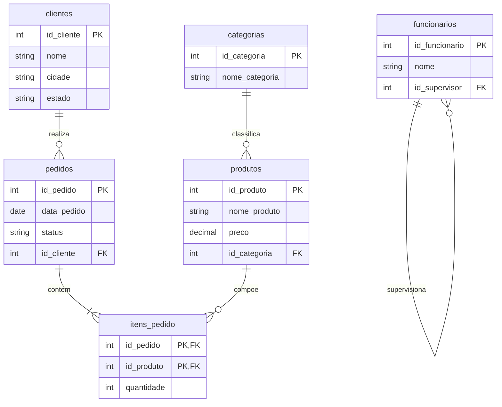
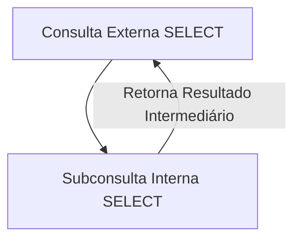
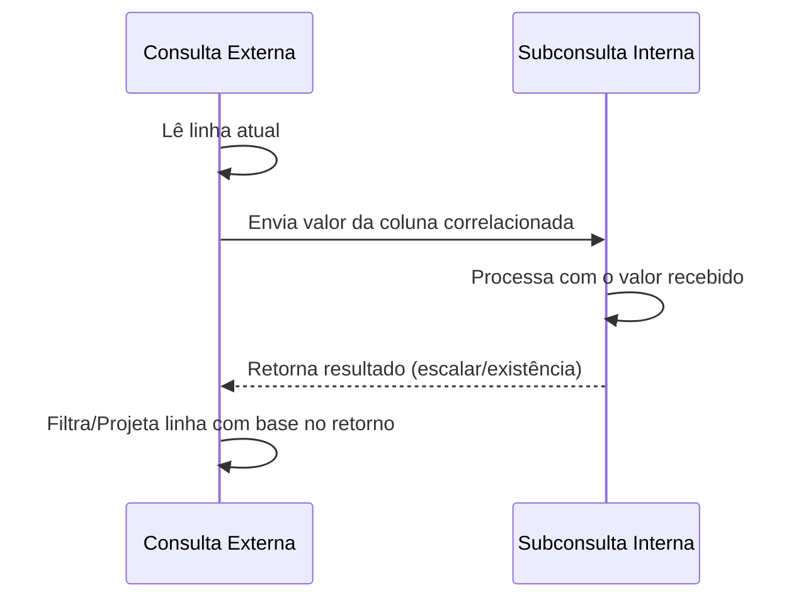
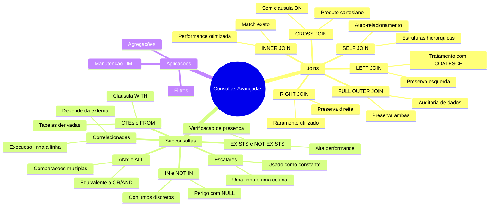

# Aula 01 — Consultas Avançadas com Joins e Subselects

> **Professor:** Welington Garcia
> **Disciplina:** Tópicos Avançados em Banco de Dados (4º Semestre)
> **Tema:** Combinação de tabelas relacionais com JOINs e estruturação de lógica complexa com subconsultas (Subselects).

## Sumário
- [Objetivo da aula](#objetivo-da-aula)
- [Contexto e pré-requisitos](#contexto-e-pré-requisitos)
- [Fundamentos de Relacionamentos e Chaves](#fundamentos-de-relacionamentos-e-chaves)
- [INNER JOIN e Aliases](#inner-join-e-aliases)
- [LEFT, RIGHT e FULL OUTER JOIN](#left-right-e-full-outer-join)
- [CROSS JOIN e SELF JOIN](#cross-join-e-self-join)
- [JOIN com Múltiplas Tabelas e Agregações](#join-com-múltiplas-tabelas-e-agregações)
- [Condições no ON vs WHERE](#condições-no-on-vs-where)
- [Uso de USING e NATURAL JOIN](#uso-de-using-e-natural-join)
- [Erros Comuns em JOINs](#erros-comuns-em-joins)
- [Introdução a Subconsultas](#introdução-a-subconsultas)
- [Subconsultas Escalares](#subconsultas-escalares)
- [Operadores IN, NOT IN, EXISTS e NOT EXISTS](#operadores-in-not-in-exists-e-not-exists)
- [Operadores ANY e ALL](#operadores-any-e-all)
- [Subconsultas Correlacionadas](#subconsultas-correlacionadas)
- [Subconsultas no FROM e CTEs](#subconsultas-no-from-e-ctes)
- [Subconsultas em UPDATE, DELETE e INSERT](#subconsultas-em-update-delete-e-insert)
- [Código da aula](#código-da-aula)
- [Exercícios](#exercícios)
- [Erros comuns e boas práticas](#erros-comuns-e-boas-práticas)
- [Links e materiais complementares](#links-e-materiais-complementares)
- [Mapa da aula](#mapa-da-aula)
- [Glossário](#glossário)
- [Pontos-chave para a prova](#pontos-chave-para-a-prova)
- [Perguntas e respostas (JSONL)](#perguntas-e-respostas-jsonl)
- [Checklist de revisão](#checklist-de-revisão)

---

## Objetivo da aula

Esta aula tem como objetivo capacitar o estudante de Sistemas de Informação a projetar, escrever, analisar e otimizar consultas complexas em bancos de dados relacionais utilizando o PostgreSQL. Serão abordadas as técnicas de junção de tabelas (JOINs) em suas diferentes variações (INNER, LEFT, RIGHT, FULL, CROSS e SELF), bem como a aplicação de subconsultas (subselects, subqueries, CTEs) para resolver problemas que exigem lógica intermediária, comparações escalares, verificação de existência e tratamento de conjuntos de dados.

Ao final desta aula, o aluno deverá ser capaz de:
- Identificar qual tipo de junção é adequado para cada cenário de negócio.
- Evitar armadilhas de desempenho e lógica, como produtos cartesianos acidentais e problemas com valores nulos em subconsultas.
- Escrever consultas modulares, legíveis e de alta performance utilizando Expressões de Tabela Comuns (CTEs).
- Compreender a diferença de processamento lógico entre filtros aplicados na junção (`ON`) e filtros aplicados no resultado final (`WHERE`).

---

## Contexto e pré-requisitos

Em bancos de dados relacionais normalizados, as informações são fragmentadas em múltiplas tabelas para evitar redundância, inconsistências e anomalias de atualização (atendendo às Formas Normais). No entanto, para a geração de relatórios, dashboards e sistemas transacionais, esses dados precisam ser recompostos. 

Os conceitos fundamentais pressupõem o entendimento prévio da álgebra relacional (projeção, seleção, junção), comandos básicos de DDL (`CREATE TABLE`), DML (`SELECT`, `INSERT`, `UPDATE`, `DELETE`) e o conceito de integridade referencial por meio de chaves primárias e estrangeiras.

### O Desafio da Normalização vs. Desempenho
A normalização (até a 3ª Forma Normal ou Forma Normal de Boyce-Codd) divide as entidades para garantir a consistência. Por exemplo, em vez de armazenar o nome e o telefone do cliente diretamente em cada registro de venda, armazena-se apenas o identificador do cliente. Isso economiza espaço em disco e evita inconsistências caso o cliente mude de telefone. Contudo, no momento de exibir a venda para o usuário final, o sistema precisa realizar uma operação de junção para recuperar esses dados. Compreender o custo computacional dessa junção é vital para o engenheiro de software.

---

## Fundamentos de Relacionamentos e Chaves

### Conceitos e Definição
O modelo relacional organiza dados em entidades interconectadas. A integridade estrutural é mantida por meio de chaves:
- **Chave Primária (PRIMARY KEY - PK):** Identifica de forma unívoca cada linha ou registro em uma tabela. Não aceita valores nulos (`NULL`) nem duplicados. O PostgreSQL cria automaticamente um índice B-Tree sobre a chave primária para acelerar as buscas.
- **Chave Estrangeira (FOREIGN KEY - FK):** Coluna ou conjunto de colunas cuja função é garantir a integridade referencial, apontando para a chave primária de outra tabela. Ela impede que registros órfãos sejam criados no banco de dados.

### Motivação
A separação de dados evita a repetição excessiva de informações textuais (como o endereço de um cliente repetido a cada pedido) e garante que alterações de cadastro ocorram em um único local, mantendo a consistência do banco.



### Exemplo de Contraexemplo e Armadilhas
- **Armadilha:** Tentar inserir um registro na tabela `pedidos` informando um `id_cliente` que não existe na tabela `clientes`. O SGBD impedirá a operação caso a restrição de chave estrangeira esteja corretamente declarada.
- **Inconsistência sem FK:** Se o banco de dados não possuir a restrição de chave estrangeira física (apenas lógica), o sistema poderá conter um pedido apontando para um cliente inexistente, quebrando a integridade referencial e gerando erros de execução (como telas em branco ou exceções de ponteiro nulo) na aplicação que consome esses dados.

---

## INNER JOIN e Aliases

### Definição e Motivação
O `INNER JOIN` (ou simplesmente `JOIN`) retorna estritamente as linhas que possuem correspondência (match) em ambas as tabelas envolvidas na condição de junção. Se uma linha da tabela A não encontrar correspondência na tabela B com base no critério definido na cláusula `ON`, essa linha é totalmente omitida do conjunto de resultados.

Para simplificar e evitar ambiguidades em consultas que envolvem colunas com o mesmo nome em tabelas diferentes, utilizam-se os *aliases* (apelidos).

### Exemplo Prático em SQL
```sql
-- Consulta utilizando INNER JOIN e Aliases para clareza e prevenção de ambiguidades
SELECT
  p.id_pedido AS codigo_pedido,
  p.data_pedido AS data_emissao,
  c.nome AS nome_cliente,
  c.cidade AS cidade_entrega
FROM pedidos AS p
INNER JOIN clientes AS c
  ON p.id_cliente = c.id_cliente;
```

### Como o PostgreSQL Processa
O otimizador de consultas do PostgreSQL avalia a melhor estratégia para executar o `INNER JOIN`, que pode ser:
1. **Nested Loop:** Para cada linha da tabela externa (pedidos), ele busca a linha correspondente na tabela interna (clientes). É eficiente para conjuntos de dados pequenos ou quando há índices adequados nas colunas de junção.
2. **Hash Join:** Ele cria uma tabela de dispersão (hash table) na memória com as chaves da tabela interna e varre a tabela externa para encontrar as correspondências. Muito rápido para grandes volumes de dados.
3. **Merge Join:** Ordena ambas as tabelas pelas colunas de junção e depois as percorre em paralelo. Ideal quando os dados já estão ordenados ou existem índices que fornecem essa ordenação.

---

## LEFT, RIGHT e FULL OUTER JOIN

### Definição e Diferenciação
Quando é necessário preservar registros de uma tabela mesmo quando não há correspondência na outra, utilizam-se os *outer joins*:
- **LEFT JOIN (ou LEFT OUTER JOIN):** Retorna todos os registros da tabela à esquerda (declarada antes da cláusula `LEFT JOIN`) e os correspondentes da tabela à direita. Se não houver correspondência, as colunas da tabela à direita serão preenchidas com `NULL`.
- **RIGHT JOIN (ou RIGHT OUTER JOIN):** Retorna todos os registros da tabela à direita (declarada após a cláusula `RIGHT JOIN`) e os correspondentes da esquerda. Se não houver correspondência, as colunas da esquerda serão preenchidas com `NULL`.
- **FULL OUTER JOIN:** Retorna todos os registros de ambas as tabelas. Quando há correspondência, os dados são combinados. Quando não há, as colunas da tabela sem correspondência são preenchidas com `NULL`.

| Tipo de JOIN | Preserva Esquerda? | Preserva Direita? | Uso Típico |
| :--- | :--- | :--- | :--- |
| `INNER JOIN` | Não | Não | Apenas registros estritamente relacionados. |
| `LEFT JOIN` | Sim | Não | Relatórios principais com dados opcionais (ex: Clientes e seus Pedidos). |
| `RIGHT JOIN` | Não | Sim | Equivalente ao LEFT invertendo a ordem das tabelas. |
| `FULL JOIN` | Sim | Sim | Auditoria, conciliação de dados e cruzamento completo de bases. |

### Exemplo Prático com COALESCE
A função `COALESCE` avalia os argumentos em ordem e retorna o primeiro valor não nulo encontrado. É extremamente útil em conjunto com `LEFT JOIN` para substituir valores `NULL` por textos ou números padrão.

```sql
-- Listagem de produtos e suas categorias, tratando produtos sem categoria associada
SELECT
  pr.nome_produto,
  pr.preco,
  COALESCE(ca.nome_categoria, 'Sem categoria definida') AS categoria
FROM produtos pr
LEFT JOIN categorias ca
  ON pr.id_categoria = ca.id_categoria;
```

### Exemplo de FULL OUTER JOIN para Auditoria
```sql
-- Identificar inconsistências: categorias sem produtos e produtos sem categorias válidas
SELECT
  pr.nome_produto,
  ca.nome_categoria
FROM produtos pr
FULL OUTER JOIN categorias ca
  ON pr.id_categoria = ca.id_categoria;
```

---

## CROSS JOIN e SELF JOIN

### Definição
- **CROSS JOIN:** Produz o produto cartesiano entre duas tabelas. Cada linha da primeira tabela é combinada com todas as linhas da segunda tabela. Se a tabela A possui $N$ linhas e a tabela B possui $M$ linhas, o resultado terá $N \times M$ linhas. Não requer uma cláusula `ON`.
- **SELF JOIN:** É uma técnica onde uma tabela é associada a ela mesma na mesma consulta. Para isso, é obrigatório o uso de aliases diferentes para diferenciar as instâncias da tabela. É essencial para modelar e consultar estruturas hierárquicas ou de auto-relacionamento.

### Exemplo de CROSS JOIN (Geração de Combinações)
```sql
-- Gerar todas as combinações possíveis de produtos e categorias para fins de matriz de vendas
SELECT
  p.nome_produto,
  c.nome_categoria
FROM produtos p
CROSS JOIN categorias c;
```

### Exemplo de SELF JOIN (Estrutura Hierárquica)
```sql
-- Listar cada funcionário e o nome do seu respectivo supervisor direto
SELECT
  f.nome AS funcionario,
  f.cargo AS cargo_funcionario,
  COALESCE(s.nome, 'Diretoria Executiva') AS supervisor
FROM funcionarios f
LEFT JOIN funcionarios s
  ON f.id_supervisor = s.id_funcionario;
```

---

## JOIN com Múltiplas Tabelas e Agregações

### Definição e Motivação
Sistemas de informação reais demandam a junção de várias tabelas para consolidar uma visão de negócio. Ao combinar múltiplos `JOINs` com funções de agregação (`SUM`, `AVG`, `COUNT`, `MAX`, `MIN`), é obrigatório o uso da cláusula `GROUP BY` para especificar as colunas que não sofrerão agregação.

### Exemplo Prático de Relatório Consolidado
```sql
-- Relatório de faturamento por cliente, detalhando a quantidade de pedidos e o total gasto
SELECT
  c.id_cliente,
  c.nome AS nome_cliente,
  COUNT(DISTINCT p.id_pedido) AS total_pedidos,
  COALESCE(SUM(ip.quantidade * ip.preco_unitario), 0.00) AS total_faturado
FROM clientes c
LEFT JOIN pedidos p ON c.id_cliente = p.id_cliente
LEFT JOIN itens_pedido ip ON p.id_pedido = ip.id_pedido
LEFT JOIN produtos pr ON ip.id_produto = pr.id_produto
GROUP BY c.id_cliente, c.nome
ORDER BY total_faturado DESC;
```

---

## Condições no ON vs WHERE

### Análise Crítica e Comportamento Lógico
Uma das maiores fontes de bugs em consultas SQL é a confusão entre aplicar filtros na cláusula `ON` versus na cláusula `WHERE` ao utilizar `LEFT JOIN` ou `RIGHT JOIN`.

- **Filtro no ON:** Acontece *durante* o processo de junção. O SGBD filtra a tabela da direita antes de tentar realizar o match com a tabela da esquerda. Se a linha da direita não atender ao critério, ela é descartada do match, mas a linha da esquerda **ainda assim é retornada** com valores `NULL` nas colunas da direita.
- **Filtro no WHERE:** Acontece *depois* que a junção foi totalmente realizada. Se o filtro avaliar uma coluna da tabela da direita que veio como `NULL` devido à falta de match, essa linha será eliminada do resultado final (pois `NULL = valor` resulta em `UNKNOWN`, que é tratado como falso pelo `WHERE`). Isso transforma silenciosamente o seu `LEFT JOIN` em um `INNER JOIN`.

### Comparação Prática

#### Abordagem A: Filtro no ON
```sql
-- Retorna TODOS os clientes. Se o cliente não tiver pedidos em '2023-10-01', as colunas do pedido vêm como NULL.
SELECT c.nome, p.id_pedido, p.data_pedido
FROM clientes c
LEFT JOIN pedidos p 
  ON c.id_cliente = p.id_cliente 
  AND p.data_pedido = '2023-10-01';
```

#### Abordagem B: Filtro no WHERE
```sql
-- Retorna APENAS os clientes que fizeram pedidos em '2023-10-01'. Clientes sem pedidos nessa data são excluídos.
SELECT c.nome, p.id_pedido, p.data_pedido
FROM clientes c
LEFT JOIN pedidos p 
  ON c.id_cliente = p.id_cliente
WHERE p.data_pedido = '2023-10-01';
```

---

## Uso de USING e NATURAL JOIN

### Conceito e Sintaxe
- **USING:** É uma simplificação sintática para a cláusula `ON` quando as colunas de junção possuem exatamente o mesmo nome em ambas as tabelas.
- **NATURAL JOIN:** Realiza a junção implicitamente com base em todas as colunas que possuem nomes idênticos em ambas as tabelas.

### Exemplo de USING
```sql
-- Sintaxe simplificada quando ambas as tabelas possuem a coluna 'id_cliente'
SELECT p.id_pedido, c.nome
FROM pedidos p
INNER JOIN clientes c USING (id_cliente);
```

### O Perigo do NATURAL JOIN (Contraexemplo)
```sql
-- NÃO RECOMENDADO EM AMBIENTES PROFISSIONAIS
SELECT *
FROM produtos
NATURAL JOIN categorias;
```
*Por que evitar?* Se ambas as tabelas possuírem uma coluna chamada `criado_em` ou `atualizado_em` para fins de auditoria, o `NATURAL JOIN` tentará realizar a junção por essas colunas também, gerando um resultado vazio ou incorreto. Além disso, se uma coluna for renomeada no futuro, a consulta quebrará silenciosamente ou mudará seu comportamento sem aviso.

---

## Erros Comuns em JOINs

### 1. Produto Cartesiano Acidental
Ocorre quando o desenvolvedor esquece de especificar a cláusula de ligação (`ON` ou `USING`) ao realizar uma junção, ou quando utiliza a sintaxe antiga de junção no `WHERE` e omite a condição.

```sql
-- ERRO: Produz um produto cartesiano gigante se as tabelas forem grandes
SELECT c.nome, p.id_pedido
FROM clientes c, pedidos p; -- Sintaxe antiga (ANSI SQL-89) sem filtro de junção
```

### 2. Ambiguidade de Colunas
Ocorre quando uma coluna com o mesmo nome existe em mais de uma tabela da consulta e é referenciada sem o alias da tabela.

```sql
-- ERRO: "column reference 'id_cliente' is ambiguous"
SELECT id_cliente, nome, id_pedido
FROM clientes c
INNER JOIN pedidos p ON c.id_cliente = p.id_cliente;
```
*Correção:* Especificar `c.id_cliente` ou `p.id_cliente` na lista de seleção.

---

## Introdução a Subconsultas

### Definição
Uma subconsulta (*subselect* ou *subquery*) é uma instrução `SELECT` aninhada dentro de outra instrução SQL. Ela funciona como uma consulta interna que fornece dados para a consulta externa (principal).



### Classificação das Subconsultas
As subconsultas podem ser classificadas de acordo com o seu retorno:
1. **Escalar:** Retorna um único valor (uma linha e uma coluna).
2. **Subconsulta de Linha:** Retorna uma única linha com múltiplas colunas.
3. **Subconsulta de Tabela:** Retorna múltiplas linhas e múltiplas colunas.

---

## Subconsultas Escalares

### Definição
Uma subconsulta escalar é aquela que retorna exatamente um único valor (uma linha e uma coluna). Ela pode ser posicionada em qualquer lugar onde uma expressão ou constante seja aceita no SQL (como nas cláusulas `SELECT`, `WHERE`, `HAVING` e até no `VALUES` de um `INSERT`).

### Exemplo Prático no WHERE
```sql
-- Buscar produtos que custam acima da média de preço de todos os produtos cadastrados
SELECT
  id_produto,
  nome_produto,
  preco
FROM produtos
WHERE preco > (
  SELECT AVG(preco)
  FROM produtos
);
```

### Exemplo Prático no SELECT
```sql
-- Exibir o preço do produto e a diferença em relação à média geral
SELECT
  nome_produto,
  preco,
  (SELECT AVG(preco) FROM produtos) AS preco_medio_geral,
  preco - (SELECT AVG(preco) FROM produtos) AS diferenca_da_media
FROM produtos;
```

---

## Operadores IN, NOT IN, EXISTS e NOT EXISTS

### Operadores IN e NOT IN
O operador `IN` avalia se um valor pertence a uma lista ou ao conjunto de resultados retornado por uma subconsulta de coluna única. O `NOT IN` faz a negação lógica.

```sql
-- Clientes que realizaram pedidos
SELECT nome
FROM clientes
WHERE id_cliente IN (
  SELECT id_cliente
  FROM pedidos
);
```

#### A Armadilha do NOT IN com NULL
Se a subconsulta do `NOT IN` retornar pelo menos um valor `NULL`, a consulta externa retornará **zero linhas**. Isso ocorre porque `valor NOT IN (A, B, NULL)` é equivalente a `valor <> A AND valor <> B AND valor <> NULL`. Como qualquer comparação com `NULL` resulta em `UNKNOWN`, a expressão inteira torna-se `UNKNOWN`.

```sql
-- PERIGO: Se houver algum id_cliente nulo na tabela de pedidos, esta consulta não retornará nada!
SELECT nome
FROM clientes
WHERE id_cliente NOT IN (
  SELECT id_cliente
  FROM pedidos
);
```
*Solução:* Garantir que a subconsulta filtre valores nulos (`WHERE id_cliente IS NOT NULL`) ou utilizar `NOT EXISTS`.

### Operadores EXISTS e NOT EXISTS
O operador `EXISTS` testa a existência de linhas retornadas por uma subconsulta. Ele não avalia os valores das colunas, mas sim se o conjunto de resultados é vazio ou não. Por convenção de performance, utiliza-se `SELECT 1` dentro da subconsulta.

```sql
-- Clientes que nunca realizaram um pedido (Altamente seguro e performático)
SELECT c.id_cliente, c.nome
FROM clientes c
WHERE NOT EXISTS (
  SELECT 1
  FROM pedidos p
  WHERE p.id_cliente = c.id_cliente
);
```

---

## Operadores ANY e ALL

### Operador ANY (ou SOME)
Compara um valor escalar com cada valor retornado pela subconsulta. Se qualquer uma das comparações for verdadeira, o resultado final é verdadeiro. É equivalente a utilizar múltiplos operadores `OR`.

```sql
-- Produtos que custam mais do que qualquer produto da categoria 1
SELECT nome_produto, preco
FROM produtos
WHERE preco > ANY (
  SELECT preco
  FROM produtos
  WHERE id_categoria = 1
);
```

### Operador ALL
Compara um valor escalar com todos os valores retornados pela subconsulta. A condição deve ser verdadeira para todos os elementos do conjunto para que a linha seja incluída. É equivalente a utilizar múltiplos operadores `AND`.

```sql
-- Produtos cujo preço é maior que o preço de todos os produtos da categoria 2
SELECT nome_produto, preco
FROM produtos
WHERE preco > ALL (
  SELECT preco
  FROM produtos
  WHERE id_categoria = 2
);
```

---

## Subconsultas Correlacionadas

### Definição
Uma subconsulta é dita correlacionada quando ela faz referência a uma ou mais colunas da consulta externa. Diferente de uma subconsulta simples (que pode ser executada uma única vez de forma independente), a subconsulta correlacionada é conceitualmente executada uma vez para cada linha processada pela consulta externa.



### Exemplo Prático
```sql
-- Buscar produtos que custam mais do que a média de preço da sua própria categoria
SELECT
  p1.id_produto,
  p1.nome_produto,
  p1.id_categoria,
  p1.preco
FROM produtos p1
WHERE p1.preco > (
  SELECT AVG(p2.preco)
  FROM produtos p2
  WHERE p2.id_categoria = p1.id_categoria
);
```

---

## Subconsultas no FROM e CTEs

### Subconsultas no FROM (Tabelas Derivadas)
Uma subconsulta colocada na cláusula `FROM` atua como uma tabela temporária durante a execução da consulta. No PostgreSQL, é **obrigatório** atribuir um alias para essa tabela derivada.

```sql
-- Obter a média dos totais de pedidos por cliente utilizando tabela derivada
SELECT
  AVG(resumo.total_gasto) AS media_geral_gasta_por_cliente
FROM (
  SELECT
    id_cliente,
    SUM(quantidade * preco_unitario) AS total_gasto
  FROM itens_pedido ip
  INNER JOIN pedidos p ON ip.id_pedido = p.id_pedido
  GROUP BY id_cliente
) AS resumo;
```

### CTEs (Common Table Expressions)
Definidas pela cláusula `WITH`, as CTEs funcionam como tabelas temporárias nomeadas que existem apenas durante o escopo da execução daquela consulta específica. Elas melhoram drasticamente a legibilidade, a manutenção e a modularidade do código SQL.

```sql
-- Mesma consulta anterior reescrita de forma elegante utilizando CTE
WITH FaturamentoPorCliente AS (
  SELECT
    p.id_cliente,
    SUM(ip.quantidade * ip.preco_unitario) AS total_gasto
  FROM itens_pedido ip
  INNER JOIN pedidos p ON ip.id_pedido = p.id_pedido
  GROUP BY p.id_cliente
)
SELECT
  AVG(total_gasto) AS media_geral_gasta_por_cliente
FROM FaturamentoPorCliente;
```

---

## Subconsultas em UPDATE, DELETE e INSERT

### Subconsultas no INSERT
```sql
-- Inserir na tabela de histórico de clientes inativos todos os clientes sem pedidos há mais de um ano
INSERT INTO clientes_inativos (id_cliente, nome, data_desativacao)
SELECT id_cliente, nome, CURRENT_DATE
FROM clientes c
WHERE NOT EXISTS (
  SELECT 1
  FROM pedidos p
  WHERE p.id_cliente = c.id_cliente
    AND p.data_pedido >= CURRENT_DATE - INTERVAL '1 year'
);
```

### Subconsultas no UPDATE
```sql
-- Aplicar um desconto de 10% em todos os produtos da categoria que possui a menor média de vendas
UPDATE produtos
SET preco = preco * 0.90
WHERE id_categoria = (
  SELECT id_categoria
  FROM produtos
  GROUP BY id_categoria
  ORDER BY AVG(preco) ASC
  LIMIT 1
);
```

### Subconsultas no DELETE
```sql
-- Excluir itens de pedidos que pertencem a pedidos cancelados
DELETE FROM itens_pedido
WHERE id_pedido IN (
  SELECT id_pedido
  FROM pedidos
  WHERE status = 'CANCELADO'
);
```

---

## Código da aula

Abaixo está o script SQL completo para criação do esquema, inserção de dados de teste e execução das consultas demonstradas em aula.

```sql
-- ============================================================================
-- SCRIPT DE CRIAÇÃO E CARGA DE DADOS
-- Disciplina: Tópicos Avançados em Banco de Dados
-- Professor: Welington Garcia
-- ============================================================================

-- 1. Remoção de tabelas existentes para garantir idempotência
DROP TABLE IF EXISTS itens_pedido CASCADE;
DROP TABLE IF EXISTS pedidos CASCADE;
DROP TABLE IF EXISTS clientes CASCADE;
DROP TABLE IF EXISTS produtos CASCADE;
DROP TABLE IF EXISTS categorias CASCADE;
DROP TABLE IF EXISTS funcionarios CASCADE;

-- 2. Criação das Tabelas (DDL)
CREATE TABLE categorias (
    id_categoria SERIAL PRIMARY KEY,
    nome_categoria VARCHAR(100) NOT NULL
);

CREATE TABLE produtos (
    id_produto SERIAL PRIMARY KEY,
    nome_produto VARCHAR(150) NOT NULL,
    preco DECIMAL(10, 2) NOT NULL,
    id_categoria INT,
    CONSTRAINT fk_categoria FOREIGN KEY (id_categoria) REFERENCES categorias(id_categoria) ON DELETE SET NULL
);

CREATE TABLE clientes (
    id_cliente SERIAL PRIMARY KEY,
    nome VARCHAR(150) NOT NULL,
    cidade VARCHAR(100),
    estado CHAR(2)
);

CREATE TABLE pedidos (
    id_pedido SERIAL PRIMARY KEY,
    data_pedido DATE NOT NULL,
    status VARCHAR(50) NOT NULL,
    id_cliente INT,
    CONSTRAINT fk_cliente FOREIGN KEY (id_cliente) REFERENCES clientes(id_cliente) ON DELETE CASCADE
);

CREATE TABLE itens_pedido (
    id_pedido INT,
    id_produto INT,
    quantidade INT NOT NULL CHECK (quantidade > 0),
    preco_unitario DECIMAL(10, 2) NOT NULL,
    PRIMARY KEY (id_pedido, id_produto),
    CONSTRAINT fk_pedido FOREIGN KEY (id_pedido) REFERENCES pedidos(id_pedido) ON DELETE CASCADE,
    CONSTRAINT fk_produto FOREIGN KEY (id_produto) REFERENCES produtos(id_produto) ON DELETE RESTRICT
);

CREATE TABLE funcionarios (
    id_funcionario SERIAL PRIMARY KEY,
    nome VARCHAR(150) NOT NULL,
    cargo VARCHAR(100) NOT NULL,
    id_supervisor INT,
    CONSTRAINT fk_supervisor FOREIGN KEY (id_supervisor) REFERENCES funcionarios(id_funcionario)
);

-- 3. Inserção de Dados de Teste (DML)
INSERT INTO categorias (nome_categoria) VALUES
('Eletrônicos'),
('Móveis'),
('Livros'),
('Vestuário'),
('Alimentos');

INSERT INTO produtos (nome_produto, preco, id_categoria) VALUES
('Smartphone S23', 4500.00, 1),
('Notebook Pro', 7200.00, 1),
('Mesa de Escritório', 850.00, 2),
('Cadeira Ergonômica', 1200.00, 2),
('Livro Clean Code', 95.00, 3),
('Camiseta Algodão', 59.90, 4),
('Chocolate Amargo', 12.50, NULL); -- Produto sem categoria

INSERT INTO clientes (nome, cidade, estado) VALUES
('Ana Silva', 'São Paulo', 'SP'),
('Bruno Costa', 'Rio de Janeiro', 'RJ'),
('Carlos Souza', 'Belo Horizonte', 'MG'),
('Daniela Lima', 'Curitiba', 'PR'),
('Eduardo Santos', 'Porto Alegre', 'RS'),
('Fernanda Oliveira', 'Salvador', 'BA'); -- Cliente sem pedidos

INSERT INTO pedidos (data_pedido, status, id_cliente) VALUES
('2023-10-01', 'ENTREGUE', 1),
('2023-10-02', 'PROCESSANDO', 1),
('2023-10-03', 'ENTREGUE', 2),
('2023-10-04', 'PENDENTE', 3),
('2023-10-05', 'CANCELADO', 4),
('2023-10-06', 'ENTREGUE', 5);

INSERT INTO itens_pedido (id_pedido, id_produto, quantidade, preco_unitario) VALUES
(1, 1, 1, 4500.00),
(1, 6, 2, 59.90),
(2, 2, 1, 7200.00),
(3, 3, 1, 850.00),
(3, 4, 1, 1200.00),
(4, 5, 3, 95.00),
(5, 1, 1, 4500.00),
(6, 6, 5, 59.90);

INSERT INTO funcionarios (nome, cargo, id_supervisor) VALUES
('Carlos Alberto', 'Diretor Geral', NULL),
('Mariana Souza', 'Gerente de TI', 1),
('Roberto Silva', 'Desenvolvedor Pleno', 2),
('Aline Dias', 'Desenvolvedor Júnior', 2);
```

---

## Exercícios

### Exercício 1: Listagem de Pedidos e Clientes
- **Enunciado:** Exiba o código do pedido, a data do pedido, o status e o nome do cliente de todos os pedidos cadastrados.
- **Raciocínio:** Utilizar `INNER JOIN` entre `pedidos` e `clientes`, pois queremos apenas pedidos que possuam clientes válidos associados.
- **Resolução:**
```sql
SELECT
  p.id_pedido,
  p.data_pedido,
  p.status,
  c.nome AS nome_cliente
FROM pedidos p
INNER JOIN clientes c
  ON p.id_cliente = c.id_cliente;
```

### Exercício 2: Clientes e Pedidos (LEFT JOIN)
- **Enunciado:** Exiba todos os clientes cadastrados no sistema, juntamente com o ID de seus pedidos (se houver). Clientes sem pedidos também devem ser exibidos.
- **Raciocínio:** Empregar `LEFT JOIN` tendo a tabela `clientes` na esquerda para garantir que nenhum cliente seja omitido do resultado final.
- **Resolução:**
```sql
SELECT
  c.id_cliente,
  c.nome AS nome_cliente,
  p.id_pedido,
  p.status AS status_pedido
FROM clientes c
LEFT JOIN pedidos p
  ON c.id_cliente = p.id_cliente;
```

### Exercício 3: Produtos acima da Média da Categoria (Subconsulta Correlacionada)
- **Enunciado:** Liste os produtos que possuem preço superior à média de preço da sua respectiva categoria. Exiba o nome do produto, o preço e o nome da categoria.
- **Raciocínio:** Utilizar uma subconsulta correlacionada no `WHERE` para calcular a média dinâmica com base no `id_categoria` da linha corrente da consulta externa.
- **Resolução:**
```sql
SELECT
  p.nome_produto,
  p.preco,
  c.nome_categoria
FROM produtos p
INNER JOIN categorias c ON p.id_categoria = c.id_categoria
WHERE p.preco > (
  SELECT AVG(sub.preco)
  FROM produtos sub
  WHERE sub.id_categoria = p.id_categoria
);
```

### Exercício 4: Análise de Clientes sem Compras com NOT EXISTS
- **Enunciado:** Identifique todos os clientes que não realizaram nenhuma compra (pedido) utilizando o operador `NOT EXISTS`.
- **Raciocínio:** O operador `NOT EXISTS` é ideal para verificar a ausência de relacionamentos de forma eficiente, pois interrompe a busca na tabela interna assim que encontra a primeira correspondência.
- **Resolução:**
```sql
SELECT
  c.id_cliente,
  c.nome,
  c.cidade
FROM clientes c
WHERE NOT EXISTS (
  SELECT 1
  FROM pedidos p
  WHERE p.id_cliente = c.id_cliente
);
```

### Exercício 5: Faturamento Mensal com CTE
- **Enunciado:** Crie uma consulta utilizando CTE que calcule o faturamento total por mês e filtre apenas os meses que faturaram mais de R$ 5.000,00.
- **Raciocínio:** Primeiro, criamos uma CTE para agregar as vendas por mês. Depois, filtramos o resultado na consulta externa.
- **Resolução:**
```sql
WITH FaturamentoMensal AS (
  SELECT
    DATE_TRUNC('month', p.data_pedido) AS mes,
    SUM(ip.quantidade * ip.preco_unitario) AS total_faturado
  FROM pedidos p
  INNER JOIN itens_pedido ip ON p.id_pedido = ip.id_pedido
  WHERE p.status <> 'CANCELADO'
  GROUP BY DATE_TRUNC('month', p.data_pedido)
)
SELECT
  TO_CHAR(mes, 'YYYY-MM') AS mes_referencia,
  total_faturado
FROM FaturamentoMensal
WHERE total_faturado > 5000.00;
```

---

## Erros comuns e boas práticas

- **Evitar o uso de `SELECT *`:** Sempre especifique as colunas necessárias. Isso reduz o tráfego de rede, otimiza o uso de memória do SGBD e evita que alterações na estrutura da tabela quebrem a aplicação cliente.
- **Validar `NOT IN` com `NULL`:** Prefira `NOT EXISTS` para checar ausência de dados em relações com risco de valores nulos, evitando o comportamento inesperado de retornar zero linhas.
- **Uso consciente de índices:** Garanta que colunas utilizadas frequentemente em junções (`ON`) e filtros (`WHERE`) possuam índices adequados (geralmente chaves estrangeiras não são indexadas automaticamente pelo PostgreSQL; é uma boa prática criar esses índices manualmente).
- **Legibilidade com Aliases:** Sempre utilize aliases curtos e mnemônicos (ex: `p` para `pedidos`, `ip` para `itens_pedido`) para tornar o código limpo e fácil de manter.

---

## Links e materiais complementares

- [Documentação Oficial do PostgreSQL - Cláusula FROM (JOINs)](https://www.postgresql.org/docs/current/queries-table-expressions.html#QUERIES-FROM)
- [Documentação Oficial do PostgreSQL - Subqueries](https://www.postgresql.org/docs/current/functions-subquery.html)
- [PostgreSQL Tutorial - Interactive SQL Joins](https://www.postgresqltutorial.com/postgresql-joins/)

---

## Mapa da aula



---

## Glossário

| Termo | Definição |
| :--- | :--- |
| **Alias** | Apelido temporário atribuído a uma tabela ou coluna para simplificar a escrita e evitar ambiguidades. |
| **Cartesian Product** | Combinação exata de todas as linhas de uma tabela com todas as linhas de outra (CROSS JOIN). |
| **Correlated Subquery** | Subconsulta que faz referência a colunas da consulta externa, sendo avaliada repetidamente. |
| **CTE (Common Table Expression)** | Expressão de tabela comum utilizada para modularizar e organizar consultas complexas através da cláusula `WITH`. |
| **Integridade Referencial** | Regra que garante que os dados de relacionamento entre tabelas permaneçam consistentes (Chave Estrangeira). |
| **Nested Loop** | Algoritmo de junção que percorre a tabela interna para cada linha da tabela externa. |

---

## Pontos-chave para a prova

1. **Diferença exata de comportamento entre `INNER JOIN` e `LEFT JOIN`:** O `INNER JOIN` exige correspondência mútua; o `LEFT JOIN` garante o retorno de todos os registros da tabela à esquerda, preenchendo com `NULL` as colunas da direita na ausência de correspondência.
2. **O impacto de colocar filtros no `ON` versus no `WHERE` em um `LEFT JOIN`:** Filtros no `ON` limitam a junção; filtros no `WHERE` filtram o resultado final pós-junção, podendo anular o efeito do `LEFT JOIN`.
3. **Funcionamento e restrições de subconsultas escalares:** Devem retornar estritamente 1 linha e 1 coluna, sob pena de gerar erro de execução em tempo de processamento.
4. **Diferença prática entre operadores `IN`, `EXISTS`, `ANY` e `ALL`:** Compreender a semântica de cada operador e como o banco otimiza buscas existenciais (`EXISTS`) em relação a buscas em listas (`IN`).
5. **Como identificar e corrigir produtos cartesianos acidentais:** Identificar a ausência de critérios de junção em consultas com múltiplas tabelas.

---

## Perguntas e respostas (JSONL)

```jsonl
{"pergunta": "Qual JOIN retorna apenas registros com correspondência em ambas as tabelas?", "resposta": "INNER JOIN", "dificuldade": "facil"}
{"pergunta": "O que ocorre quando um LEFT JOIN não encontra correspondência na tabela da direita?", "resposta": "As colunas da tabela da direita recebem valores NULL", "dificuldade": "facil"}
{"pergunta": "Qual operador verifica se um valor pertence a um conjunto retornado por uma subconsulta?", "resposta": "IN", "dificuldade": "facil"}
{"pergunta": "O que caracteriza uma subconsulta correlacionada?", "resposta": "Ela depende de colunas da consulta externa para ser executada linha a linha", "dificuldade": "intermediario"}
{"pergunta": "Para que serve a cláusula WITH no PostgreSQL?", "resposta": "Para criar Expressões de Tabela Comuns (CTEs)", "dificuldade": "intermediario"}
{"pergunta": "Qual o perigo de usar NOT IN com valores NULL na subconsulta?", "resposta": "O resultado pode se tornar desconhecido e retornar zero linhas", "dificuldade": "dificil"}
{"pergunta": "Qual JOIN produz o produto cartesiano entre duas tabelas?", "resposta": "CROSS JOIN", "dificuldade": "facil"}
{"pergunta": "O que faz a função COALESCE?", "resposta": "Retorna o primeiro argumento não nulo encontrado na lista", "dificuldade": "facil"}
{"pergunta": "Qual subconsulta retorna exatamente uma linha e uma coluna?", "resposta": "Subconsulta escalar", "dificuldade": "facil"}
{"pergunta": "O que avalia o operador EXISTS?", "resposta": "Retorna verdadeiro se a subconsulta encontrar pelo menos uma linha", "dificuldade": "intermediario"}
{"pergunta": "Qual a vantagem de usar aliases nas consultas?", "resposta": "Reduz repetição e evita ambiguidades em colunas com nomes iguais", "dificuldade": "facil"}
{"pergunta": "O que é um SELF JOIN?", "resposta": "Uma tabela relacionada com ela mesma através de aliases", "dificuldade": "intermediario"}
{"pergunta": "Como o comando EXPLAIN ANALYZE ajuda no banco de dados?", "resposta": "Mostra o plano de execução planejado e executado com tempos e linhas reais", "dificuldade": "intermediario"}
{"pergunta": "Qual o comportamento do operador ALL?", "resposta": "Exige que a comparação seja verdadeira para todos os valores retornados pela subconsulta", "dificuldade": "dificil"}
{"pergunta": "É recomendado o uso de NATURAL JOIN em sistemas de produção?", "resposta": "Não, pois pode gerar resultados imprevisíveis se novas colunas com nomes idênticos forem adicionadas", "dificuldade": "intermediario"}
```

---

## Checklist de revisão

- [ ] Compreendi a diferença estrutural entre todos os tipos de JOINs.
- [ ] Sei aplicar aliases corretamente para evitar ambiguidades.
- [ ] Entendi o conceito e a execução de subconsultas escalares e correlacionadas.
- [ ] Sei diferenciar o uso de `IN`, `EXISTS`, `ANY` e `ALL`.
- [ ] Pratiquei a escrita de scripts SQL complexos com múltiplos JOINs e agregações.
- [ ] Revisei os erros comuns e boas práticas de desempenho.
