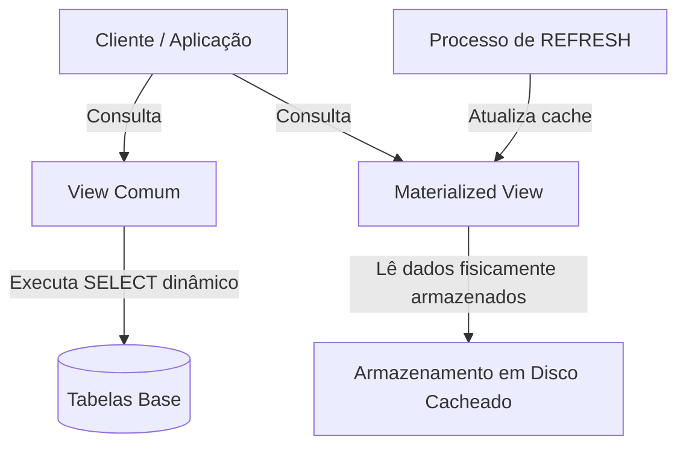
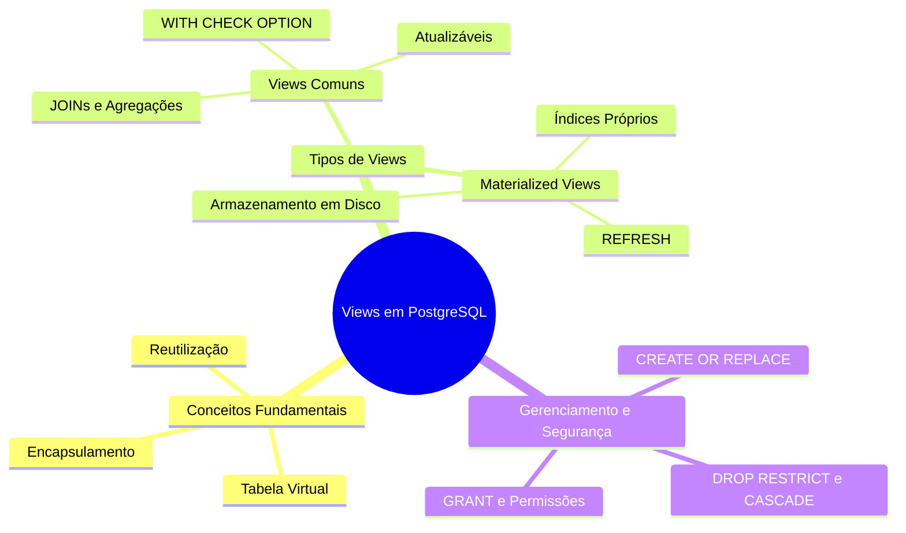

# Aula 02 — Views e Materialized Views em PostgreSQL

> **Professor:** Welington Garcia
> **Disciplina:** Tópicos Avançados em Banco de Dados (4º Semestre)
> **Tema:** Consultas virtuais reutilizáveis, encapsulamento de lógica, segurança e otimização com Materialized Views

## Sumário
- [Objetivo da aula](#objetivo-da-aula)
- [Contexto e pré-requisitos](#contexto-e-pré-requisitos)
- [Conceito e finalidade de Views em SQL](#conceito-e-finalidade-de-views-em-sql)
- [Diferença entre Tabelas, Views e Materialized Views](#diferença-entre-tabelas-views-e-materialized-views)
- [Sintaxe de criação com CREATE VIEW e consultas com SELECT](#sintaxe-de-criação-com-create-view-e-consultas-com-select)
- [Views com JOINs simples e múltiplos](#views-com-joins-simples-e-múltiplos)
- [Views com agregação (GROUP BY, SUM, COUNT)](#views-com-agregação-group-by-sum-count)
- [Alteração de definição com CREATE OR REPLACE VIEW](#alteração-de-definição-com-create-or-replace-view)
- [Remoção de views e gerenciamento de dependências (RESTRICT e CASCADE)](#remoção-de-views-e-gerenciamento-de-dependências-restrict-e-cascade)
- [Views atualizáveis e controle de integridade com WITH CHECK OPTION](#views-atualizáveis-e-controle-de-integridade-com-with-check-option)
- [Segurança e limitação de colunas com privilégios GRANT](#segurança-e-limitação-de-colunas-com-privilégios-grant)
- [Análise do plano de execução com EXPLAIN ANALYZE](#análise-do-plano-de-execução-com-explain-analyze)
- [Materialized Views e atualização com REFRESH MATERIALIZED VIEW](#materialized-views-e-atualização-com-refresh-materialized-view)
- [Criação de índices em Materialized Views](#criação-de-índices-em-materialized-views)
- [Boas práticas e convenções de nomenclatura](#boas-práticas-e-convenções-de-nomenclatura)
- [Código da aula](#código-da-aula)
- [Exercícios](#exercícios)
- [Erros comuns e boas práticas](#erros-comunsa-e-boas-práticas)
- [Links e materiais complementares](#links-e-materiais-complementares)
- [Mapa da aula](#mapa-da-aula)
- [Glossário](#glossário)
- [Pontos-chave para a prova](#pontos-chave-para-c-prova)
- [Perguntas e respostas (JSONL)](#perguntas-e-respostas-jsonl)
- [Checklist de revisão](#checklist-de-revisão)

---

## Objetivo da aula

Esta aula tem como objetivo principal capacitar o aluno do curso de Sistemas de Informação a compreender, projetar e implementar **Views** (visões) e **Materialized Views** (visões materializadas) no Sistema de Gerenciamento de Banco de Dados PostgreSQL. Serão abordados os fundamentos teóricos e práticos do encapsulamento de consultas complexas, a reutilização de lógicas de negócio em relatórios, o controle granular de acesso e segurança de dados, bem como estratégias avançadas de otimização de desempenho analítico.

---

## Contexto e pré-requisitos

Para o aproveitamento pleno desta aula, o estudante deve dominar os conceitos fundamentais de modelagem relacional de dados, linguagem SQL (estruturas DDL e DML), operadores de junção (`INNER JOIN`, `LEFT JOIN`, etc.), funções de agregação (`GROUP BY`, `SUM`, `COUNT`) e noções de transações e permissões em bancos de dados relacionais.

---

## Conceito e finalidade de Views em SQL

### Definição
Uma *view* (visão) é uma consulta SQL (`SELECT`) armazenada no catálogo do banco de dados sob um nome específico, comportando-se conceitualmente como uma tabela virtual.

### Motivação
Em sistemas corporativos reais, consultas analíticas e operacionais frequentemente exigem junções extensas, regras de formatação e filtros complexos. Escrever essa lógica repetidamente em diferentes camadas da aplicação ou em múltiplos relatórios gera redundância, dificulta a manutenção e aumenta o risco de inconsistências. As views resolvem esse problema ao centralizar a lógica no próprio banco de dados.

### Exemplo
```sql
CREATE VIEW vw_produtos_caros AS
SELECT id_produto, nome_produto, preco
FROM produtos
WHERE preco > 1000.00;
```

### Contraexemplo e Armadilhas
Um erro comum é acreditar que uma view comum armazena uma cópia independente dos dados em disco. Na prática, por padrão, uma view comum é apenas um atalho para a consulta subjacente: cada vez que a view é consultada, o PostgreSQL executa a instrução `SELECT` correspondente combinada com as tabelas de origem. Portanto, modificar dados nas tabelas base reflete-se instantaneamente na view.

---

## Diferença entre Tabelas, Views e Materialized Views

### Definição e Comparação Estrutural
Enquanto uma tabela armazena fisicamente linhas e colunas em disco, uma view comum armazena apenas a definição lógica da consulta. Já a materialized view armazena fisicamente o resultado de uma consulta, exigindo comandos de atualização explícitos.

| Aspecto | Tabela | View Comum | Materialized View |
| :--- | :--- | :--- | :--- |
| **Armazenamento físico** | Sim | Não (apenas metadados/definição) | Sim (dados cacheados em disco) |
| **Sempre atualizada** | Sim (via DML) | Sim (reflete o estado atual das tabelas base) | Não (necessita de `REFRESH`) |
| **Pode conter índices** | Sim | Não | Sim |
| **Uso principal** | Persistência transacional (OLTP) | Abstração, padronização e segurança | Otimização de consultas pesadas (OLAP) |



---

## Sintaxe de criação com CREATE VIEW e consultas com SELECT

### Definição
A instrução `CREATE VIEW` define a interface virtual, enquanto o comando `SELECT` recupera os dados encapsulados da mesma forma que faria em uma tabela comum.

### Exemplo
```sql
CREATE VIEW vw_clientes_sp AS
SELECT id_cliente, nome, cidade, estado
FROM clientes
WHERE estado = 'SP';

-- Consulta posterior à view
SELECT *
FROM vw_clientes_sp
WHERE cidade = 'Campinas';
```

---

## Views com JOINs simples e múltiplos

### Definição
O uso de `JOIN` em views permite ocultar a complexidade dos relacionamentos entre chaves primárias e estrangeiras de várias tabelas.

### Exemplo
```sql
CREATE VIEW vw_detalhes_vendas AS
SELECT
  p.id_pedido,
  c.nome AS cliente,
  pr.nome_produto,
  ip.quantidade,
  ip.preco_unitario,
  (ip.quantidade * ip.preco_unitario) AS subtotal
FROM pedidos p
JOIN clientes c ON p.id_cliente = c.id_cliente
JOIN itens_pedido ip ON p.id_pedido = ip.id_pedido
JOIN produtos pr ON ip.id_produto = pr.id_produto;
```

---

## Views com agregação (GROUP BY, SUM, COUNT)

### Definição
Views podem incorporar funções de agregação e agrupamentos para fornecer resumos executivos prontos para consumo por relatórios gerenciais.

### Exemplo
```sql
CREATE VIEW vw_resumo_clientes AS
SELECT
  c.id_cliente,
  c.nome,
  COUNT(p.id_pedido) AS quantidade_pedidos
FROM clientes c
LEFT JOIN pedidos p ON c.id_cliente = p.id_cliente
GROUP BY c.id_cliente, c.nome;
```

---

## Alteração de definição com CREATE OR REPLACE VIEW

### Definição
O comando `CREATE OR REPLACE VIEW` permite modificar a estrutura ou a consulta de uma view existente sem precisar excluí-la.

### Exemplo
```sql
CREATE OR REPLACE VIEW vw_clientes_sp AS
SELECT
  id_cliente,
  nome,
  cidade,
  estado,
  limite_credito
FROM clientes
WHERE estado = 'SP';
```
*Armadilha:* As colunas pré-existentes na view devem manter compatibilidade de tipos e nomes, caso contrário, alterações estruturais profundas exigem `DROP VIEW` seguido de `CREATE VIEW`.

---

## Remoção de views e gerenciamento de dependências (RESTRICT e CASCADE)

### Definição
O comando `DROP VIEW` remove a definição da view do banco. O comportamento em caso de dependências é controlado pelas cláusulas `RESTRICT` e `CASCADE`.

### Exemplo
```sql
-- Impede a exclusão se houver objetos dependentes
DROP VIEW IF EXISTS vw_clientes_sp RESTRICT;

-- Remove a view e todos os objetos dependentes (cuidado em produção)
DROP VIEW IF EXISTS vw_base CASCADE;
```

---

## Views atualizáveis e controle de integridade com WITH CHECK OPTION

### Definição
Algumas views simples permitem operações de escrita (`INSERT`, `UPDATE`, `DELETE`), que são repassadas diretamente às tabelas base. Contudo, se a view possui filtros na cláusula `WHERE`, uma alteração pode fazer a linha "sumir" da view. A cláusula `WITH CHECK OPTION` impede que atualizações violem os critérios de filtro da view.

### Exemplo
```sql
CREATE VIEW vw_clientes_sp AS
SELECT id_cliente, nome, cidade, estado
FROM clientes
WHERE estado = 'SP'
WITH CHECK OPTION;

-- Esta operação será rejeitada pelo PostgreSQL pois violaria o filtro estado = 'SP'
UPDATE vw_clientes_sp
SET estado = 'MG'
WHERE id_cliente = 1;
```

---

## Segurança e limitação de colunas com privilégios GRANT

### Definição
As views atuam como uma poderosa barreira de segurança, permitindo expor apenas colunas públicas e ocultar dados confidenciais (como senhas, salários ou dados financeiros).

### Exemplo
```sql
CREATE VIEW vw_clientes_publico AS
SELECT id_cliente, nome, cidade, estado
FROM clientes;

GRANT SELECT ON vw_clientes_publico TO usuario_relatorios;
```

---

## Análise do plano de execução com EXPLAIN ANALYZE

### Definição
Uma view comum não melhora o desempenho por si só; o otimizador do PostgreSQL expande a view e executa a árvore de consultas combinada com as tabelas reais. O comando `EXPLAIN ANALYZE` permite inspecionar o custo real dessa execução.

### Exemplo
```sql
EXPLAIN ANALYZE
SELECT *
FROM vw_detalhes_vendas
WHERE subtotal > 1000;
```

---

## Materialized Views e atualização com REFRESH MATERIALIZED VIEW

### Definição
As *Materialized Views* armazenam fisicamente o resultado da consulta em disco. São ideais para relatórios pesados e bases analíticas onde o dado não precisa estar estritamente em tempo real.

### Exemplo
```sql
CREATE MATERIALIZED VIEW mv_vendas_por_cliente AS
SELECT
  c.id_cliente,
  c.nome,
  SUM(ip.quantidade * ip.preco_unitario) AS total
FROM clientes c
JOIN pedidos p ON c.id_cliente = p.id_cliente
JOIN itens_pedido ip ON p.id_pedido = ip.id_pedido
GROUP BY c.id_cliente, c.nome;

-- Atualização manual dos dados cacheados
REFRESH MATERIALIZED VIEW mv_vendas_por_cliente;
```

---

## Criação de índices em Materialized Views

### Definição
Como a materialized view possui armazenamento físico, é possível criar índices diretamente sobre ela para acelerar consultas analíticas recorrentes.

### Exemplo
```sql
CREATE INDEX idx_mv_vendas_cliente
ON mv_vendas_por_cliente(id_cliente);
```

---

## Boas práticas e convenções de nomenclatura

### Diretrizes
- Utilizar o prefixo `vw_` para views comuns e `mv_` para materialized views.
- Evitar criar "cadeias" excessivas de views (views chamando views chamando views), pois isso degrada a legibilidade e dificulta a otimização pelo SGBD.
- Nunca utilizar `SELECT *` na definição de views em ambientes de produção, pois alterações futuras nas tabelas base (adição ou remoção de colunas) podem quebrar dependências de forma inesperada.

---

## Código da aula

Nesta seção, descrevemos os scripts disponibilizados para prática laboratorial:

- **`./codigo/exemplos_views.sql`**: Contém a criação estrutural do modelo relacional completo (clientes, pedidos, itens_pedido, produtos, categorias, vendedores) e todos os exemplos demonstrados na aula (Views simples, múltiplos JOINs, agregações, `WITH CHECK OPTION` e Materialized Views).
- **`./codigo/exercicios_views.sql`**: Contém a resolução comentada dos 10 exercícios de fixação propostos e do estudo de caso do Sistema de Biblioteca.

---

## Exercícios

### Exercício 1: View de Clientes por Estado
**Enunciado:** Crie uma view contendo apenas clientes do estado de SP.
**Resolução:**
```sql
CREATE VIEW vw_clientes_sp AS
SELECT id_cliente, nome, cidade, estado
FROM clientes
WHERE estado = 'SP';
```

### Exercício 2: View de Produtos por Faixa de Preço
**Enunciado:** Crie uma view que exiba produtos com preço superior a R$ 1.000,00.
**Resolução:**
```sql
CREATE VIEW vw_produtos_caros AS
SELECT id_produto, nome_produto, preco
FROM produtos
WHERE preco > 1000.00;
```

### Exercício 3: View de Pedidos e Clientes
**Enunciado:** Crie uma view com pedidos e nomes dos respectivos clientes.
**Resolução:**
```sql
CREATE VIEW vw_pedidos_clientes AS
SELECT p.id_pedido, p.data_pedido, p.status, c.nome AS cliente
FROM pedidos p
JOIN clientes c ON p.id_cliente = c.id_cliente;
```

### Exercício 4: Consulta Filtrada em View
**Enunciado:** Consulte a view do exercício 3 exibindo somente pedidos pagos.
**Resolução:**
```sql
SELECT *
FROM vw_pedidos_clientes
WHERE status = 'Pago';
```

### Exercício 5: View de Valor Total do Pedido
**Enunciado:** Crie uma view que calcule o valor total de cada pedido.
**Resolução:**
```sql
CREATE VIEW vw_total_pedidos AS
SELECT
  p.id_pedido,
  c.nome AS cliente,
  SUM(ip.quantidade * ip.preco_unitario) AS valor_total
FROM pedidos p
JOIN clientes c ON p.id_cliente = c.id_cliente
JOIN itens_pedido ip ON p.id_pedido = ip.id_pedido
GROUP BY p.id_pedido, c.nome;
```

### Exercício 6: View de Resumo por Cliente
**Enunciado:** Crie uma view que mostre cada cliente e sua quantidade de pedidos.
**Resolução:**
```sql
CREATE VIEW vw_resumo_clientes AS
SELECT
  c.id_cliente,
  c.nome,
  COUNT(p.id_pedido) AS quantidade_pedidos
FROM clientes c
LEFT JOIN pedidos p ON c.id_cliente = p.id_cliente
GROUP BY c.id_cliente, c.nome;
```

### Exercício 7: Alteração de Definição de View
**Enunciado:** Modifique uma view existente utilizando `CREATE OR REPLACE VIEW`.
**Resolução:**
```sql
CREATE OR REPLACE VIEW vw_clientes_sp AS
SELECT id_cliente, nome, cidade, estado, limite_credito
FROM clientes
WHERE estado = 'SP';
```

### Exercício 8: View Atualizável com Proteção de Filtro
**Enunciado:** Crie uma view atualizável de clientes de SP utilizando `WITH CHECK OPTION`.
**Resolução:**
```sql
CREATE VIEW vw_clientes_sp AS
SELECT id_cliente, nome, cidade, estado
FROM clientes
WHERE estado = 'SP'
WITH CHECK OPTION;
```

### Exercício 9: View para Camada de Segurança
**Enunciado:** Crie uma view que exponha somente id, nome, cidade e estado dos clientes.
**Resolução:**
```sql
CREATE VIEW vw_clientes_publico AS
SELECT id_cliente, nome, cidade, estado
FROM clientes;
```

### Exercício 10: Materialized View de Vendas por Cliente
**Enunciado:** Crie uma materialized view com o total de vendas por cliente e depois execute seu REFRESH.
**Resolução:**
```sql
CREATE MATERIALIZED VIEW mv_vendas_por_cliente AS
SELECT
  c.id_cliente,
  c.nome,
  SUM(ip.quantidade * ip.preco_unitario) AS total
FROM clientes c
JOIN pedidos p ON c.id_cliente = p.id_cliente
JOIN itens_pedido ip ON p.id_pedido = ip.id_pedido
GROUP BY c.id_cliente, c.nome;

REFRESH MATERIALIZED VIEW mv_vendas_por_cliente;
```

---

## Erros comuns e boas práticas

- **Erro:** Utilizar `SELECT *` na definição de views. **Correção:** Declare explicitamente as colunas desejadas para evitar que alterações estruturais nas tabelas base quebrem o contrato da view.
- **Erro:** Confundir o ganho de desempenho de uma view comum com uma materialized view. **Correção:** Lembre-se de que views comuns não armazenam dados e não aceleram consultas pesadas por si sós; use materialized views ou índices nas tabelas base para ganho de performance.

---

## Links e materiais complementares

- Documentação Oficial do PostgreSQL sobre Views: [PostgreSQL CREATE VIEW](https://www.postgresql.org/docs/current/sql-createview.html)
- Documentação Oficial do PostgreSQL sobre Materialized Views: [PostgreSQL CREATE MATERIALIZED VIEW](https://www.postgresql.org/docs/current/sql-creatematerializedview.html)

---

## Mapa da aula



---

## Glossário

| Termo | Definição |
| :--- | :--- |
| **View** | Consulta SQL armazenada que se comporta como tabela virtual. |
| **Materialized View** | Objeto que armazena fisicamente o resultado de uma consulta para fins de desempenho. |
| **WITH CHECK OPTION** | Cláusula que impede inserções ou atualizações que violem o filtro WHERE de uma view. |
| **REFRESH** | Comando utilizado para recalcular e atualizar os dados de uma materialized view. |

---

## Pontos-chave para a prova

1. Uma view comum **não** armazena dados fisicamente em disco (exceto metadados).
2. O otimizador do PostgreSQL expande a view comum no plano de execução combinando-a com as tabelas base.
3. Views que utilizam `GROUP BY`, agregações ou `DISTINCT` **não** são automaticamente atualizáveis via comandos DML (`INSERT`/`UPDATE`/`DELETE`).
4. A cláusula `WITH CHECK OPTION` garante a integridade dos dados inseridos/atualizados através de views filtradas.
5. Materialized Views exigem atualização explícita (`REFRESH`) para refletirem alterações nas tabelas base.

---

## Perguntas e respostas (JSONL)

```jsonl
{"pergunta": "Uma view comum armazena fisicamente os dados resultantes da sua consulta?", "resposta": "Não, uma view comum armazena apenas a definição da instrução SELECT e consulta as tabelas base em tempo de execução.", "dificuldade": "Fácil"}
{"pergunta": "Qual comando é utilizado para alterar a definição de uma view existente sem precisar removê-la?", "resposta": "CREATE OR REPLACE VIEW.", "dificuldade": "Fácil"}
{"pergunta": "O que a cláusula WITH CHECK OPTION faz em uma view atualizável?", "resposta": "Impede que operações de INSERT ou UPDATE gerem linhas que violem os critérios de filtro definidos na cláusula WHERE da view.", "dificuldade": "Média"}
{"pergunta": "Views que contêm a cláusula GROUP BY ou funções de agregação são automaticamente atualizáveis?", "resposta": "Não, pois o SGBD não consegue determinar de forma inequívoca qual linha da tabela original deve ser modificada.", "dificuldade": "Média"}
{"pergunta": "Qual é a principal diferença de armazenamento entre uma view comum e uma materialized view?", "resposta": "A materialized view armazena o resultado da consulta fisicamente em disco, enquanto a view comum não armazena dados.", "dificuldade": "Fácil"}
{"pergunta": "Como se atualiza os dados armazenados em uma materialized view no PostgreSQL?", "resposta": "Utilizando o comando REFRESH MATERIALIZED VIEW.", "dificuldade": "Fácil"}
{"pergunta": "É possível criar índices em uma materialized view?", "resposta": "Sim, pois ela possui armazenamento físico em disco.", "dificuldade": "Média"}
{"pergunta": "O que a opção RESTRICT faz ao tentar excluir uma view que possui dependências?", "resposta": "Impede a exclusão da view caso existam outros objetos dependentes dela.", "dificuldade": "Média"}
{"pergunta": "Qual o comando utilizado para conceder permissão de consulta a um usuário sobre uma view?", "resposta": "GRANT SELECT ON nome_da_view TO usuario;", "dificuldade": "Fácil"}
{"pergunta": "Por que o uso de SELECT * na definição de views é desencorajado?", "resposta": "Porque alterações estruturais nas tabelas base (como adição de colunas) podem quebrar contratos e afetar aplicações dependentes.", "dificuldade": "Média"}
{"pergunta": "Criar uma view comum sobre uma consulta pesada melhora automaticamente o desempenho da consulta?", "resposta": "Não necessariamente, pois a view comum é reavaliada a cada consulta utilizando o plano otimizado sobre as tabelas base.", "dificuldade": "Difícil"}
{"pergunta": "Qual comando remove uma view e todos os objetos dependentes dela?", "resposta": "DROP VIEW nome_da_view CASCADE;", "dificuldade": "Média"}
{"pergunta": "Qual prefixo é comumente adotado na convenção de nomenclatura para materialized views?", "resposta": "mv_", "dificuldade": "Fácil"}
{"pergunta": "Qual instrução permite analisar o plano de execução de uma consulta realizada sobre uma view?", "resposta": "EXPLAIN ANALYZE", "dificuldade": "Média"}
{"pergunta": "As views podem ser utilizadas como camada de segurança para ocultar colunas sensíveis?", "resposta": "Sim, expondo apenas as colunas autorizadas e aplicando permissões GRANT sobre a view.", "dificuldade": "Fácil"}
```

---

## Checklist de revisão

- [ ] Compreendi a diferença conceitual e física entre tabelas, views comuns e materialized views.
- [ ] Sei criar, consultar, alterar (`CREATE OR REPLACE`) e excluir (`DROP`) views em PostgreSQL.
- [ ] Implementei views utilizando `JOIN` simples, múltiplos e funções de agregação (`GROUP BY`, `SUM`, `COUNT`).
- [ ] Entendi o funcionamento de views atualizáveis e a utilidade da cláusula `WITH CHECK OPTION`.
- [ ] Apliquei permissões de segurança utilizando `GRANT` em views.
- [ ] Compreendi o uso de Materialized Views e a necessidade do comando `REFRESH`.
