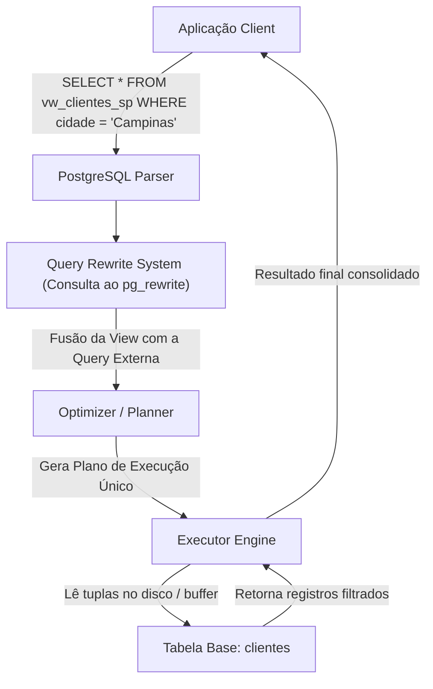
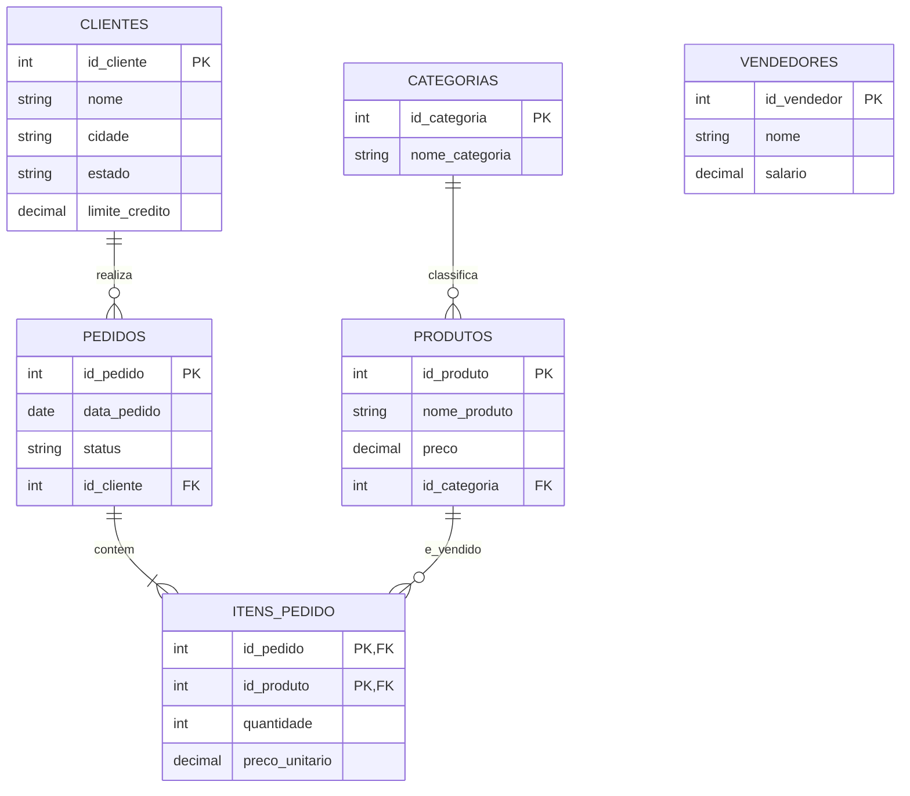
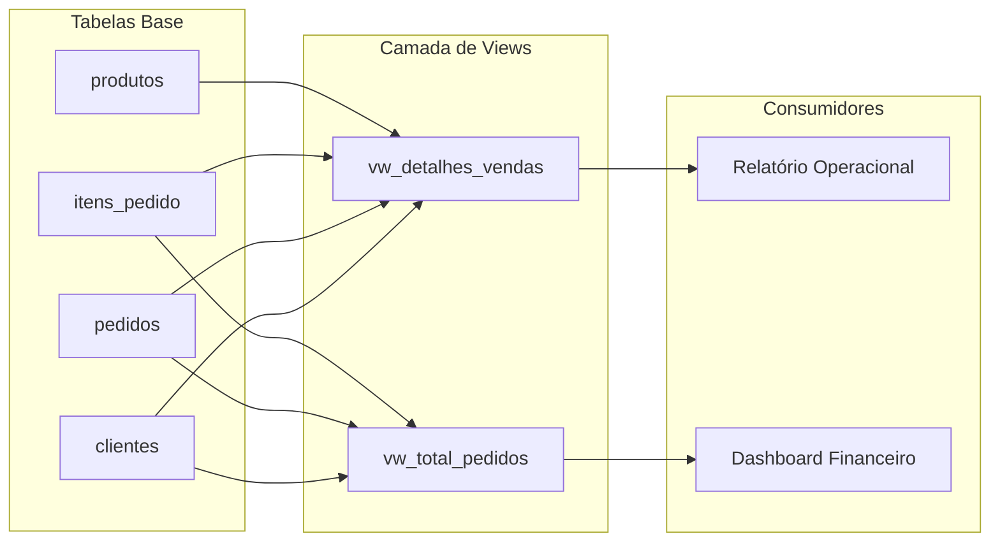
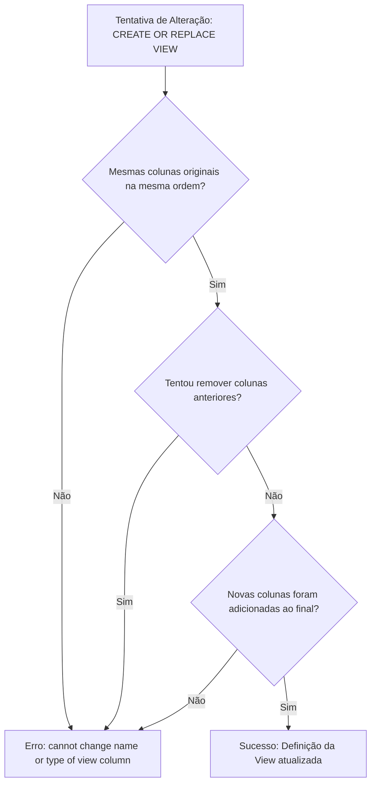
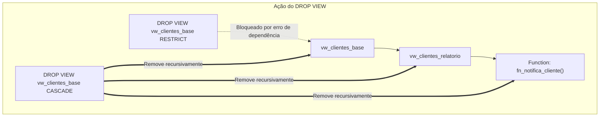
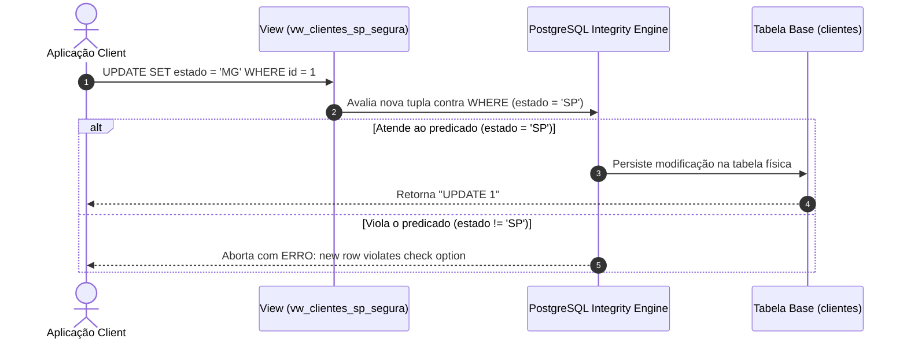
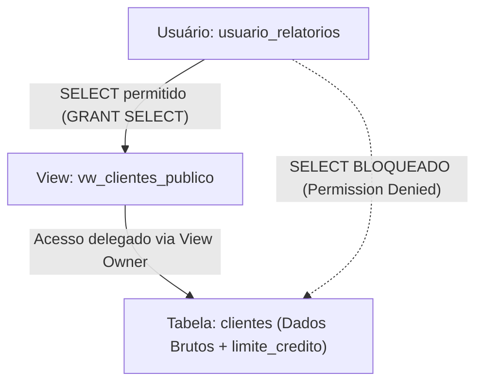
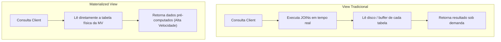
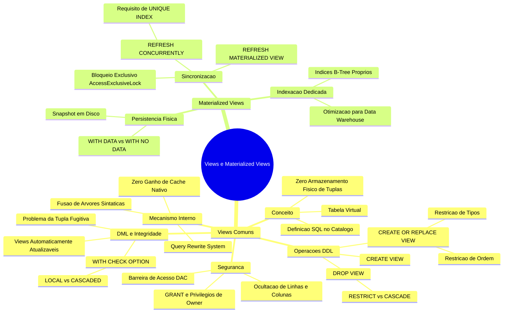

# Aula 02 — Views e Materialized Views em PostgreSQL

> **Professor:** Welington Garcia  
> **Disciplina:** Tópicos Avançados em Banco de Dados (4º Semestre)  
> **Tema:** Construção de consultas virtuais reutilizáveis, integridade referencial com WITH CHECK OPTION, segurança de acesso e otimização física com Materialized Views no PostgreSQL.

---

## Sumário

- [Objetivo da aula](#objetivo-da-aula)
- [Contexto e pré-requisitos](#contexto-e-pré-requisitos)
- [Conceito e finalidade de uma View](#conceito-e-finalidade-de-uma-view)
- [Diferença prática entre Tabela e View](#diferença-prática-entre-tabela-e-view)
- [Sintaxe de criação e consulta (CREATE VIEW)](#sintaxe-de-criação-e-consulta-create-view)
- [Views com múltiplos JOINs e agregações (GROUP BY)](#views-com-múltiplos-joins-e-agregações-group-by)
- [Alteração e substituição de definições (CREATE OR REPLACE VIEW)](#alteração-e-substituição-de-definições-create-or-replace-view)
- [Exclusão e dependências (DROP VIEW, CASCADE e RESTRICT)](#exclusão-e-dependências-drop-view-cascade-e-restrict)
- [Views atualizáveis e restrições de escrita](#views-atualizáveis-e-restrições-de-escrita)
- [Garantia de integridade com WITH CHECK OPTION](#garantia-de-integridade-com-with-check-option)
- [Segurança e controle de acesso (GRANT em Views)](#segurança-e-controle-de-acesso-grant-em-views)
- [Análise de desempenho (EXPLAIN ANALYZE em Views)](#análise-de-desempenho-explain-analyze-em-views)
- [Materialized Views e armazenamento físico de resultados](#materialized-views-e-armazenamento-físico-de-resultados)
- [Atualização de dados com REFRESH MATERIALIZED VIEW](#atualização-de-dados-com-refresh-materialized-view)
- [Criação de índices em Materialized Views](#criação-de-índices-em-materialized-views)
- [Erros comuns e boas práticas de design de banco de dados](#erros-comuns-e-boas-práticas-de-design-de-banco-de-dados)
- [Código da aula](#código-da-aula)
- [Exercícios](#exercícios)
- [Erros comuns e boas práticas](#erros-comuns-e-boas-práticas)
- [Links e materiais complementares](#links-e-materiais-complementares)
- [Mapa da aula](#mapa-da-aula)
- [Glossário](#glossário)
- [Pontos-chave para a prova](#pontos-chave-para-a-prova)
- [Perguntas e respostas (JSONL)](#perguntas-e-respostas-jsonl)
- [Checklist de revisão](#checklist-de-revisão)

---

## Objetivo da aula

Esta aula tem como propósito capacitar o futuro engenheiro de software e administrador de banco de dados a:
1. Compreender a natureza relacional e a arquitetura interna das visões (*views*) relacionais no PostgreSQL.
2. Encapsular regras de negócio complexas, junções relacionais (*joins*) de alta cardinalidade e funções de agregação em interfaces lógicas estáveis.
3. Diferenciar pontualmente tabelas base, visões padrão (não materializadas) e visões materializadas (*materialized views*), avaliando trade-offs entre latência de leitura, custo de recomputação e sincronização de dados.
4. Projetar políticas de segurança corporativa utilizando visões como barreira de abstração de dados (controle de acesso a nível de linha e de coluna).
5. Aplicar modificações em visões atualizáveis (*updatable views*) com garantias estritas de consistência através da cláusula `WITH CHECK OPTION`.
6. Otimizar relatórios analíticos massivos por meio de visões materializadas, indexação dedicada e rotinas de recálculo com `REFRESH MATERIALIZED VIEW CONCURRENTLY`.

---

## Contexto e pré-requisitos

Para acompanhar este módulo avançado, o estudante deve dominar os seguintes tópicos de modelagem e manipulação SQL:
- Álgebra Relacional básica (projeção, seleção, produto cartesiano, junção).
- Comandos DDL (*Data Definition Language*): `CREATE TABLE`, `ALTER TABLE`, `DROP TABLE`.
- Comandos DML (*Data Manipulation Language*): `SELECT`, `INSERT`, `UPDATE`, `DELETE`.
- Construção de junções relacionais: `INNER JOIN`, `LEFT OUTER JOIN`, `RIGHT OUTER JOIN`.
- Agregações e agrupamentos: cláusulas `GROUP BY`, `HAVING` e funções agregadoras (`SUM`, `COUNT`, `AVG`, `MIN`, `MAX`).
- Noções de plano de execução e custo de I/O em bancos de dados relacionais.

---

## Conceito e finalidade de uma View

### O que é uma View?

No modelo relacional e na especificação SQL padrão (ANSI/ISO SQL), uma visão (*view*) é uma tabela virtual cujo conteúdo é definido dinamicamente a partir de uma consulta SQL armazenada no catálogo do banco de dados. 

Diferente de uma tabela base, uma view padrão não possui alocação de blocos físicos de armazenamento (*heap files*) para guardar tuplas. Em vez disso, o Sistema Gerenciador de Banco de Dados Relacional (SGBDR) persiste apenas a sua definição textual e metadados no catálogo do sistema (no PostgreSQL, primariamente nas tabelas `pg_views` e `pg_rewrite`).

```sql
-- Definição fundamental de uma View
CREATE VIEW vw_produtos_caros AS
SELECT id_produto, nome_produto, preco
FROM produtos
WHERE preco > 1000;
```

### Motivação Arquitetural

Em arquiteturas corporativas de software, views resolvem três desafios estruturais de engenharia:
1. **Simplificação de Acesso**: Oculta junções complexas com cinco ou mais tabelas, normalizações de terceira forma normal (3FN) e cálculos matemáticos extensos. O desenvolvedor consumidor consulta a view como se fosse uma tabela simples.
2. **Reutilização e Centralização da Lógica de Negócio**: Evita duplicação de regras em múltiplos pontos da aplicação. Se a regra fiscal ou a definição de "cliente inadimplente" mudar, altera-se apenas a definição da view central, sem necessidade de *refactoring* no código-fonte das aplicações conectadas.
3. **Isolamento e Segurança (Princípio do Menor Privilégio)**: Permite expor seletivamente apenas linhas e colunas autorizadas para determinados perfis de usuários, omitindo dados sensíveis (senhas criptografadas, margens de lucro, documentos pessoais).

### Funcionamento Interno no PostgreSQL: O Mecanismo de Reescrita

*[Complemento Técnico: Otimizador de Consultas e pg_rewrite]*  
Quando uma view comum é consultada, o PostgreSQL não executa a view isoladamente para depois filtrar os dados em memória. O subsistema do PostgreSQL denominado *Query Rewrite Rule System* intercepta a árvore sintática gerada pelo analisador (*parser*) e substitui o nó que referencia a view pela subárvore da consulta contida na definição da view.



### Exemplo, Contraexemplo e Armadilhas

- **Exemplo Válido**: Criar uma view para unificar dados de auditoria que demandam junção entre tabelas de autenticação e logs de sistema, disponibilizando uma interface declarativa padronizada para relatórios.
- **Contraexemplo**: Criar uma view como tentativa de fazer "cache" de dados para deixar a aplicação mais rápida. Como a view comum recalcula tudo a cada invocação, nenhum ganho de latência de leitura ocorre por mero armazenamento em cache.
- **Armadilha (Pitfall)**: Encapsular funções não determinísticas ou voláteis (ex.: `random()` ou `now()`) dentro de views e supor que seus valores se mantêm estáticos entre execuções subsequentes na mesma transação.

---

## Diferença prática entre Tabela e View

A compreensão das fronteiras operacionais entre tabelas e views é determinante para o projeto de esquemas de banco de dados sustentáveis.

### Comparação Estrutural Detalhada

| Aspecto | Tabela Base | View Comum (Padrão) | Materialized View |
| :--- | :--- | :--- | :--- |
| **Armazenamento físico de dados** | Sim (arquivos no disco / páginas de heap) | Não (armazena apenas metadados e DDL no catálogo) | Sim (snapshot físico gravado em disco) |
| **Persistência da definição SQL** | Apenas DDL estrutural (`CREATE TABLE`) | Consulta declarativa `SELECT` armazenada | Consulta declarativa `SELECT` armazenada |
| **Pode ser lida via `SELECT`?** | Sim | Sim | Sim |
| **Ocultação de colunas nativa** | Não por si só (exige permissões de coluna) | Sim (projeção explícita na DDL) | Sim (projeção explícita na DDL) |
| **Simplificação de relacionamentos** | Não (requer especificação de `JOIN`) | Sim (encapsula `JOIN` internamente) | Sim (encapsula `JOIN` internamente) |
| **Frescor dos dados (*Data Freshness*)** | Imediato (estado atualizado via ACID) | Imediato (lê em tempo real das tabelas base) | Estático/Assíncrono (depende de `REFRESH`) |
| **Suporte a Índices Próprios** | Sim (B-Tree, Hash, GIN, GiST, BRIN) | Não (utiliza os índices das tabelas de origem) | Sim (B-Tree, Hash, GIN, GiST, BRIN) |
| **Custo de I/O em leitura** | Custo de varredura ou índice da tabela | Custo somado da consulta subjacente expandida | Custo de varredura ou índice da própria view |

### Modelo Entidade-Relacionamento do Domínio da Aula

O esquema a seguir serve como fundação empírica para todas as operações demonstradas nesta aula (domínio comercial de pedidos e vendas):



---

## Sintaxe de criação e consulta (CREATE VIEW)

### Sintaxe Formal

A sintaxe canônica para materialização lógica de uma visão segue a gramática SQL:

```sql
CREATE [ OR REPLACE ] [ TEMP | TEMPORARY ] [ RECURSIVE ] VIEW nome_da_view [ ( coluna_alias [, ...] ) ]
AS consulta_select
[ WITH [ CASCADED | LOCAL ] CHECK OPTION ];
```

### Criação Passo a Passo

Para isolar os clientes residentes no estado de São Paulo (`SP`), projeta-se apenas as colunas operacionais necessárias:

```sql
-- Criação da view de clientes do estado de SP
CREATE VIEW vw_clientes_sp AS
SELECT 
    id_cliente, 
    nome, 
    cidade
FROM clientes
WHERE estado = 'SP';
```

Após sua emissão, `vw_clientes_sp` passa a constar na visão do catálogo `pg_views` e pode ser tratada sintaticamente como uma relação comum.

### Execução e Filtragem Adicional

O cliente que consome a view pode parametrizar a leitura aplicando filtros adicionais, ordenações ou novos agrupamentos sobre a relação virtual:

```sql
-- 1. Leitura integral da View
SELECT * 
FROM vw_clientes_sp;

-- 2. Leitura com predicado adicional
SELECT nome, cidade
FROM vw_clientes_sp
WHERE cidade = 'Campinas'
ORDER BY nome ASC;
```

### O Que Acontece nos Bastidores?

Quando a segunda consulta é enviada, o motor relacional do PostgreSQL funde o predicado da view (`estado = 'SP'`) com o predicado da requisição (`cidade = 'Campinas'`), produzindo uma consulta equivalente executada diretamente contra a tabela base:

```sql
-- Consulta gerada internamente pelo motor via reescrita
SELECT nome, cidade
FROM clientes
WHERE estado = 'SP' AND cidade = 'Campinas'
ORDER BY nome ASC;
```

Essa fusão garante que índices existentes na tabela `clientes` (por exemplo, um índice composto em `(estado, cidade)`) possam ser utilizados pelo otimizador de custos (*Cost-Based Optimizer - CBO*).

---

## Views com múltiplos JOINs e agregações (GROUP BY)

O uso de views torna-se indispensável quando relacionamentos com cardinalidades $1:N$ e $N:M$ geram comandos SQL extensos e propensos a falhas de digitação por desenvolvedores de software.

### Junção Simples: Pedidos e Clientes

```sql
CREATE VIEW vw_pedidos_clientes AS
SELECT
    p.id_pedido,
    p.data_pedido,
    p.status,
    c.id_cliente,
    c.nome AS cliente
FROM pedidos p
INNER JOIN clientes c ON p.id_cliente = c.id_cliente;
```

### Junção Múltipla: Detalhamento Granular de Vendas

Nesta consulta, envolvemos quatro tabelas (`pedidos`, `clientes`, `itens_pedido` e `produtos`), além de incluir um cálculo aritmético de subtotal por item:

```sql
CREATE VIEW vw_detalhes_vendas AS
SELECT
    p.id_pedido,
    c.nome AS cliente,
    pr.nome_produto,
    ip.quantidade,
    ip.preco_unitario,
    (ip.quantidade * ip.preco_unitario) AS subtotal
FROM pedidos p
INNER JOIN clientes c ON p.id_cliente = c.id_cliente
INNER JOIN itens_pedido ip ON p.id_pedido = ip.id_pedido
INNER JOIN produtos pr ON ip.id_produto = pr.id_produto;
```

A consulta externa resultante torna-se enxuta:

```sql
SELECT id_pedido, cliente, nome_produto, subtotal
FROM vw_detalhes_vendas
WHERE subtotal > 1000.00
ORDER BY subtotal DESC;
```

### Agregações Analíticas com GROUP BY e SUM

Views agregadas consolidam indicadores operacionais críticos. Abaixo, duas implementações com propósitos distintos:

```sql
-- 1. Faturamento total consolidado por pedido
CREATE VIEW vw_total_pedidos AS
SELECT
    p.id_pedido,
    c.nome AS cliente,
    SUM(ip.quantidade * ip.preco_unitario) AS valor_total
FROM pedidos p
INNER JOIN clientes c ON p.id_cliente = c.id_cliente
INNER JOIN itens_pedido ip ON p.id_pedido = ip.id_pedido
GROUP BY p.id_pedido, c.nome;

-- 2. Frequência de compra por cliente (incluindo clientes sem pedidos via LEFT JOIN)
CREATE VIEW vw_resumo_clientes AS
SELECT
    c.id_cliente,
    c.nome,
    COUNT(p.id_pedido) AS quantidade_pedidos
FROM clientes c
LEFT OUTER JOIN pedidos p ON c.id_cliente = p.id_cliente
GROUP BY c.id_cliente, c.nome;
```



---

## Alteração e substituição de definições (CREATE OR REPLACE VIEW)

Durante o ciclo de vida de uma aplicação, regras de negócio evoluem e novas colunas precisam ser incorporadas a views existentes.

### Uso do comando CREATE OR REPLACE VIEW

O PostgreSQL fornece a instrução `CREATE OR REPLACE VIEW` para alterar uma visão sem a necessidade de destruí-la explicitamente.

```sql
-- Substituição da view adicionando o campo 'limite_credito'
CREATE OR REPLACE VIEW vw_clientes_sp AS
SELECT
    id_cliente,
    nome,
    cidade,
    limite_credito
FROM clientes
WHERE estado = 'SP';
```

### Regras Estritas de Compatibilidade

O comando `CREATE OR REPLACE VIEW` no PostgreSQL impõe restrições severas de integridade para não quebrar objetos dependentes:
1. **Invariância de Colunas Anteriores**: As colunas originais devem ser mantidas rigorosamente com os **mesmos nomes**, os **mesmos tipos de dados** e na **mesma ordem sequencial**.
2. **Inclusão Exclusiva ao Final**: Novas colunas só podem ser adicionadas **após a última coluna** da definição anterior.
3. **Impossibilidade de Remoção ou Renomeação**: Não é permitido remover colunas existentes ou alterar seus tipos através de `CREATE OR REPLACE VIEW`.

Se for imperativo reordenar colunas, remover atributos ou alterar tipos, o desenvolvedor deve obrigatoriamente executar `DROP VIEW` e depois recriá-la, gerenciando os objetos dependentes.



---

## Exclusão e dependências (DROP VIEW, CASCADE e RESTRICT)

### Remoção Básica

Para destruir a definição de uma view no catálogo, utiliza-se o comando `DROP VIEW`. Para prevenir erros em scripts de migração caso a view não exista, utiliza-se a cláusula de proteção `IF EXISTS`:

```sql
DROP VIEW IF EXISTS vw_clientes_sp;
```

### O Dilema das Dependências: CASCADE versus RESTRICT

Bancos de dados relacionais mantêm árvores de dependência estritas registradas em tabelas do sistema (`pg_depend`). Uma view $V_1$ pode ser fonte de dados para outra view $V_2$, ou pode ser referenciada por uma regra, gatilho (*trigger*) ou função armazenada (*stored function*).

```sql
-- Cenário de dependência
CREATE VIEW vw_clientes_base AS 
SELECT id_cliente, nome, estado FROM clientes;

CREATE VIEW vw_clientes_relatorio AS 
SELECT id_cliente, nome FROM vw_clientes_base WHERE estado = 'SP';
```

Ao tentar remover `vw_clientes_base`:

1. **Cláusula RESTRICT (Comportamento Padrão)**:
   ```sql
   DROP VIEW vw_clientes_base RESTRICT;
   -- RESULTADO: O PostgreSQL aborta a instrução emitindo um erro informando 
   -- que 'vw_clientes_relatorio' depende de 'vw_clientes_base'.
   ```

2. **Cláusula CASCADE**:
   ```sql
   DROP VIEW vw_clientes_base CASCADE;
   -- RESULTADO: Remove 'vw_clientes_base' E AUTOMATICAMENTE remove 
   -- 'vw_clientes_relatorio' e qualquer outro objeto filho em cascata.
   ```



> **Aviso de Engenharia**: O uso de `CASCADE` em ambientes corporativos ou de produção representa alto risco de indisponibilidade (*outage*). Pode eliminar visões analíticas, gatilhos de conformidade e rotinas sem que o desenvolvedor perceba a extensão da destruição. Inspecione sempre o catálogo `pg_depend` antes de invocar `CASCADE`.

---

## Views atualizáveis e restrições de escrita

É comum a suposição de que views são exclusivamente voltadas à leitura (`SELECT`). Contudo, o padrão SQL e o PostgreSQL suportam DML (`INSERT`, `UPDATE`, `DELETE`) direcionado diretamente contra views, desde que determinadas restrições estruturais sejam satisfeitas.

### Critérios para Views Automaticamente Atualizáveis (*Automatically Updatable Views*)

Uma view é atualizável de forma nativa e automática no PostgreSQL se, e somente se, obedecer a todas as seguintes condições:
1. **Tabela Única no `FROM`**: A cláusula `FROM` deve referenciar exatamente uma única tabela base ou outra view atualizável. Junções (`JOIN`) desqualificam a atualização direta.
2. **Ausência de Agrupamentos e Agregações**: A consulta não pode conter `GROUP BY`, `HAVING` ou funções agregadoras (`SUM`, `AVG`, `COUNT`).
3. **Ausência de Operações de Conjunto**: A consulta não pode conter `UNION`, `INTERSECT` ou `EXCEPT`.
4. **Ausência de Deduplicação**: Não pode conter a palavra-chave `DISTINCT`.
5. **Sem Funções de Janela**: Não pode usar cláusulas `OVER / WINDOW`.
6. **Mapeamento Direto de Colunas**: As colunas manipuladas devem ser referências diretas a colunas da tabela subjacente, e não expressões calculadas (ex.: `preco * 1.10` não é atualizável diretamente).

### Exemplo Prático de Modificação

```sql
-- View elegível para DML
CREATE VIEW vw_clientes_sp_upd AS
SELECT id_cliente, nome, cidade, estado
FROM clientes
WHERE estado = 'SP';

-- O UPDATE emitido na VIEW altera a tupla na tabela base 'clientes'
UPDATE vw_clientes_sp_upd
SET cidade = 'Jundiaí'
WHERE id_cliente = 2;
```

Quando o comando acima é processado, o motor relacional traduz a chave primária ou linha física (*ctid*) subjacente e aplica o `UPDATE` na tabela `clientes`.

---

## Garantia de integridade com WITH CHECK OPTION

### O Fenômeno das Tuplas Fugitivas (*Disappearing Rows Problem*)

Considere a view atualizável criada anteriormente, filtrada para `estado = 'SP'`. O que acontece se uma instrução `UPDATE` executada através da view alterar a coluna `estado` para `'MG'`?

```sql
-- Atualização problemática sem CHECK OPTION
UPDATE vw_clientes_sp_upd
SET estado = 'MG'
WHERE id_cliente = 2;
```

O comando é executado com sucesso na tabela base `clientes`. Contudo, ao realizar em seguida um `SELECT * FROM vw_clientes_sp_upd WHERE id_cliente = 2;`, o registro não é mais retornado! A linha foi modificada de tal forma que ela **deixou de atender ao predicado da view** que a originou. Esse efeito colateral dificulta o rastreamento em aplicações e corrompe a semântica da visão.

### A Solução: WITH CHECK OPTION

A cláusula `WITH CHECK OPTION` impede que qualquer operação DML (`INSERT` ou `UPDATE`) executada através da view insira ou produza linhas que não satisfaçam as condições definidas na cláusula `WHERE` da própria view.

```sql
CREATE VIEW vw_clientes_sp_segura AS
SELECT id_cliente, nome, cidade, estado
FROM clientes
WHERE estado = 'SP'
WITH CHECK OPTION;
```

Ao tentar violar o predicado da visão:

```sql
UPDATE vw_clientes_sp_segura
SET estado = 'MG'
WHERE id_cliente = 1;

-- O PostgreSQL aborta a transação e retorna:
-- ERROR: new row violates check option for view "vw_clientes_sp_segura"
-- DETAIL: Failing row contains (1, Carlos Silva, Campinas, MG, 5000.00).
```

### Níveis de Verificação: LOCAL versus CASCADED

*[Complemento Técnico: Níveis do Padrão SQL]*  
O padrão SQL prevê dois escopos para a checagem:
- `WITH LOCAL CHECK OPTION`: Valida apenas os predicados `WHERE` definidos na view atual. Se ela for construída sobre outra view, as restrições da view inferior não são checadas (a menos que a view inferior também possua a cláusula).
- `WITH CASCADED CHECK OPTION` (Padrão quando não especificado): Valida recursivamente os predicados da view atual e de todas as views subjacentes que compõem sua hierarquia.



---

## Segurança e controle de acesso (GRANT em Views)

As views atuam como uma camada fundamental de segurança defensiva (*Security Barrier*) no modelo de segurança discricionário (*Discretionary Access Control - DAC*).

### Exposição Seletiva de Colunas e Linhas

Considere que a tabela `clientes` possua informações corporativas financeiras confidenciais (`limite_credito`). Um desenvolvedor júnior ou um usuário analista do setor de logística precisa ver os clientes, mas não deve ter acesso ao limite financeiro.

```sql
-- 1. Cria-se uma visão projetando estritamente os atributos permitidos
CREATE VIEW vw_clientes_publico AS
SELECT
    id_cliente,
    nome,
    cidade,
    estado
FROM clientes;
```

### Configuração de Privilégios com GRANT

O administrador de banco de dados (DBA) revoga o acesso direto à tabela base e concede privilégio exclusivo sobre a view:

```sql
-- 2. Revogação de privilégios na tabela base para um papel/usuário
REVOKE ALL ON clientes FROM usuario_relatorios;

-- 3. Concessão de leitura restrita à view
GRANT SELECT ON vw_clientes_publico TO usuario_relatorios;
```

### Como o PostgreSQL Trata a Permissão?

Por padrão, a view no PostgreSQL opera sob o paradigma de quem a criou (*Owner Privileges*). Se o proprietário da view possui acesso à tabela `clientes`, o `usuario_relatorios` conseguirá executar `SELECT * FROM vw_clientes_publico` com sucesso, mesmo sem ter privilégio algum em `clientes`. O SGBD bloqueia tentativas diretas contra a tabela base (`SELECT * FROM clientes`), garantindo um perímetro controlado.



---

## Análise de desempenho (EXPLAIN ANALYZE em Views)

Um erro comum entre desenvolvedores de software é acreditar que views realizam pré-processamento de dados ou tornam consultas mais velozes.

### A Ilusão do Desempenho em Views Comuns

Uma view padrão **não é compilada de forma estática nem pré-calculada**. O comando `EXPLAIN ANALYZE` desmonta essa ilusão, revelando a fusão das operações.

Considere a consulta analítica sobre a view agregada `vw_total_pedidos`:

```sql
EXPLAIN ANALYZE
SELECT *
FROM vw_total_pedidos
WHERE valor_total > 3000.00;
```

### Leitura do Plano de Execução

Ao inspecionar a saída do `EXPLAIN ANALYZE`, o planejador do PostgreSQL não mostra "Access View". Ele exibe o plano real executado contra o disco:

```text
HashAggregate  (cost=145.20..158.40 rows=350 width=44) (actual time=2.150..2.320 rows=12 loops=1)
  Group Key: p.id_pedido, c.nome
  Filter: (sum(ip.quantidade * ip.preco_unitario) > 3000.00)
  Rows Removed by Filter: 85
  ->  Hash Join  (cost=42.10..128.50 rows=1200 width=40) (actual time=0.450..1.220 rows=1200 loops=1)
        Hash Cond: (ip.id_pedido = p.id_pedido)
        ->  Seq Scan on itens_pedido ip  (cost=0.00..32.00 rows=2000 width=16) (actual time=0.010..0.210 rows=2000 loops=1)
        ->  Hash  (cost=35.00..35.00 rows=500 width=36) (actual time=0.420..0.420 rows=500 loops=1)
              ->  Hash Join  (cost=15.00..35.00 rows=500 width=36) (actual time=0.150..0.380 rows=500 loops=1)
                    Hash Cond: (p.id_cliente = c.id_cliente)
                    ->  Seq Scan on pedidos p  (cost=0.00..12.00 rows=500 width=8) (actual time=0.010..0.080 rows=500 loops=1)
                    ->  Hash  (cost=12.00..12.00 rows=200 width=32) (actual time=0.120..0.120 rows=200 loops=1)
                          ->  Seq Scan on clientes c  (cost=0.00..12.00 rows=200 width=32) (actual time=0.005..0.060 rows=200 loops=1)
Planning Time: 0.350 ms
Execution Time: 2.450 ms
```

### O que o Plano Revela?
1. O PostgreSQL fez a expansão integral dos `JOINs` entre `clientes`, `pedidos` e `itens_pedido`.
2. Calculou o produto `quantidade * preco_unitario` e alimentou uma estrutura de agregação em memória (`HashAggregate`).
3. O filtro `valor_total > 3000.00` virou uma cláusula `Filter` pós-agregação (análogo ao `HAVING`).
4. **Conclusão de Engenharia**: Uma view comum não reduz tempo de processamento nem consumo de I/O. Ela apenas padroniza e embeleza a escrita do código SQL. Se a consulta base for lenta, a view será igualmente lenta.

---

## Materialized Views e armazenamento físico de resultados

Quando uma consulta exige minutos ou horas de processamento de CPU e I/O para processar milhões de registros com agrupamentos matemáticos, a computação dinâmica em tempo real torna-se inviável para aplicações interativas. É aqui que entram as **Materialized Views** (Visões Materializadas).

### O que é uma Materialized View?

Uma Materialized View persiste fisicamente em disco o resultado de uma consulta `SELECT`. Trata-se de um snapshot (cópia estática) dos dados capturados no exato momento da criação ou da última atualização.

```sql
CREATE MATERIALIZED VIEW mv_vendas_por_cliente AS
SELECT
    c.id_cliente,
    c.nome,
    SUM(ip.quantidade * ip.preco_unitario) AS total
FROM clientes c
INNER JOIN pedidos p ON c.id_cliente = p.id_cliente
INNER JOIN itens_pedido ip ON p.id_pedido = ip.id_pedido
GROUP BY c.id_cliente, c.nome
WITH DATA; -- Opção padrão: preenche os dados imediatamente
```

### Cláusulas de Criação: WITH DATA versus WITH NO DATA

- `WITH DATA`: O PostgreSQL processa a consulta imediatamente ao rodar o comando e preenche a relação física em disco.
- `WITH NO DATA`: Cria apenas o catálogo e a estrutura relacional da visão materializada, marcando-a como "não populada" (*unscannable*). Ela não pode ser consultada via `SELECT` até que um comando de recarga seja invocado.



---

## Atualização de dados com REFRESH MATERIALIZED VIEW

Como a visão materializada é uma fotografia estática de um instante no tempo, modificações subsequentes nas tabelas base (`clientes`, `pedidos`, `itens_pedido`) **não** se refletem de imediato na view.

### Sintaxe de Sincronização

Para sincronizar o snapshot com o estado corrente do banco de dados, utiliza-se o comando `REFRESH MATERIALIZED VIEW`:

```sql
REFRESH MATERIALIZED VIEW mv_vendas_por_cliente;
```

### O Bloqueio em Nível de Tabela (*Exclusive Lock*)

Por padrão, a execução do `REFRESH MATERIALIZED VIEW` adquire um bloqueio exclusivo de leitura e escrita (`AccessExclusiveLock`) sobre a visão materializada. Enquanto o processamento ocorre:
- Aplicações que tentarem consultar a view com `SELECT` serão postas em fila de espera (*lock wait*).
- Se a consulta demorar 10 minutos, o relatório fica inacessível por 10 minutos.

### A Solução para Alta Concorrência: REFRESH CONCURRENTLY

O PostgreSQL permite atualizar o conteúdo da visão materializada sem bloquear as leituras concorrentes por meio do modificador `CONCURRENTLY`:

```sql
REFRESH MATERIALIZED VIEW CONCURRENTLY mv_vendas_por_cliente;
```

### Pré-requisito Mandatório para o Modo Concorrente

*[Complemento Técnico: Catálogo e Travas]*  
Para que o `REFRESH CONCURRENTLY` seja aceito pelo PostgreSQL, a visão materializada **precisa obrigatoriamente possuir pelo menos um índice exclusivo (`UNIQUE INDEX`)** cobrindo uma ou mais colunas que identifiquem univocamente cada linha da view (atuando como uma chave primária virtual).

Se o comando for invocado sem esse índice, o PostgreSQL abortará com o seguinte erro:
`ERROR: cannot refresh materialized view "mv_vendas_por_cliente" concurrently`  
`HINT: Create a unique index with no WHERE clause on one or more columns of the materialized view.`

---

## Criação de índices em Materialized Views

Diferente das views comuns, as visões materializadas ocupam espaço físico em disco estruturado em páginas de *heap*. Por essa razão, **podem receber índices próprios**, exatamente como tabelas convencionais.

### Estratégia de Indexação

A indexação em uma visão materializada é uma técnica central para Data Warehousing e relatórios de alta performance:

```sql
-- 1. Criação de índice UNIQUE (habilita também o REFRESH CONCURRENTLY)
CREATE UNIQUE INDEX idx_mv_vendas_cliente_pk
ON mv_vendas_por_cliente(id_cliente);

-- 2. Criação de índice secundário B-Tree para ordenação e filtros de faturamento
CREATE INDEX idx_mv_vendas_cliente_total
ON mv_vendas_por_cliente(total DESC);
```

### Impacto no Plano de Execução

Com os índices devidamente construídos, a execução de uma consulta analítica pontual sobre a visão materializada deixa de percorrer milhões de linhas de junções dinâmicas e passa a realizar uma varredura direta via índice (*Index Scan*):

```sql
EXPLAIN ANALYZE
SELECT nome, total
FROM mv_vendas_por_cliente
WHERE id_cliente = 42;
```

Saída típica:
```text
Index Scan using idx_mv_vendas_cliente_pk on mv_vendas_por_cliente  (cost=0.15..8.17 rows=1 width=36) (actual time=0.020..0.022 rows=1 loops=1)
  Index Cond: (id_cliente = 42)
Execution Time: 0.045 ms
```
A latência cai de ordens de centenas de milissegundos para fração de milissegundo.

---

## Erros comuns e boas práticas de design de banco de dados

O uso indiscriminado de views pode degradar gravemente a arquitetura e o desempenho do sistema. Abaixo estão os principais antipadrões e as melhores práticas da engenharia de software para mitigá-los.

### 1. O Antipadrão do SELECT * em Definições de Views

**O Erro**:
```sql
-- PRÁTICA CONDENÁVEL
CREATE VIEW vw_clientes_errada AS
SELECT * FROM clientes;
```
**O Problema**: No PostgreSQL, quando o `CREATE VIEW` com `SELECT *` é compilado, o motor resolve o `*` expandindo-o para a lista de colunas existentes **naquele instante**. Se a tabela base ganhar novas colunas no futuro via `ALTER TABLE`, essas colunas **não aparecerão na view**. Pior: se colunas forem renomeadas ou excluídas na tabela base, a view quebra internamente.  
**Boa Prática**: Explicite rigorosamente cada uma das colunas na cláusula `SELECT`.

### 2. O Problema da Proliferação de Camadas (*View Stacking Hell*)

**O Erro**: Criar views sobre views sobre views (ex.: $V_1$ consulta tabela; $V_2$ consome $V_1$ com `JOIN`; $V_3$ agrega $V_2$; $V_4$ filtra $V_3$).  
**O Problema**: O otimizador de consultas tem dificuldades para descer predicados (*push down predicates*) e escolher caminhos indexados ideais em árvores sintáticas excessivamente profundas. A depuração de código se torna caótica.  
**Boa Prática**: Limite a profundidade de aninhamento de views a no máximo 2 níveis lógicos.

### 3. Falta de Documentação e Nomenclatura Despadronizada

**Boa Prática**:
- Adote um padrão explícito corporativo, como o prefixo `vw_` para views relacionais padrão e `mv_` para materialized views.
- Nomeie colunas calculadas com aliases semânticos evidentes (`valor_total`, `quantidade_itens`).
- Documente a finalidade da visão no próprio catálogo via comando `COMMENT ON`:
  ```sql
  COMMENT ON VIEW vw_pedidos_clientes IS 'Consolidação de cabeçalho de pedidos com nomes de clientes para relatórios fiscais.';
  ```

---

## Código da aula

Os três arquivos a seguir consolidam todo o código executável desta aula, organizados por responsabilidade técnica.

### Arquivo 1: `./codigo/01_estrutura_e_exemplos.sql`

Este script prepara o ambiente, cria o esquema relacional, insere massas de teste controladas e demonstra a criação passo a passo das views explicadas em aula.

```sql
-- ============================================================================
-- DISCIPLINA: Tópicos Avançados em Banco de Dados
-- PROFESSOR : Prof. Welington Garcia
-- ARQUIVO   : 01_estrutura_e_exemplos.sql
-- OBJETIVO  : DDL, carga de dados e exemplos das seções teóricas
-- ============================================================================

-- 1. LIMPEZA PREVENTIVA DO AMBIENTE
DROP VIEW IF EXISTS vw_relatorio_vendas CASCADE;
DROP VIEW IF EXISTS vw_total_pedidos CASCADE;
DROP VIEW IF EXISTS vw_resumo_clientes CASCADE;
DROP VIEW IF EXISTS vw_detalhes_vendas CASCADE;
DROP VIEW IF EXISTS vw_pedidos_clientes CASCADE;
DROP VIEW IF EXISTS vw_clientes_sp_segura CASCADE;
DROP VIEW IF EXISTS vw_clientes_sp CASCADE;
DROP MATERIALIZED VIEW IF EXISTS mv_vendas_por_cliente CASCADE;

DROP TABLE IF EXISTS itens_pedido CASCADE;
DROP TABLE IF EXISTS pedidos CASCADE;
DROP TABLE IF EXISTS produtos CASCADE;
DROP TABLE IF EXISTS categorias CASCADE;
DROP TABLE IF EXISTS clientes CASCADE;
DROP TABLE IF EXISTS vendedores CASCADE;

-- 2. CRIAÇÃO DAS TABELAS BASE (MODELO DA AULA)
CREATE TABLE clientes (
    id_cliente SERIAL PRIMARY KEY,
    nome VARCHAR(100) NOT NULL,
    cidade VARCHAR(60) NOT NULL,
    estado CHAR(2) NOT NULL,
    limite_credito NUMERIC(10,2) DEFAULT 1000.00
);

CREATE TABLE categorias (
    id_categoria SERIAL PRIMARY KEY,
    nome_categoria VARCHAR(50) NOT NULL
);

CREATE TABLE produtos (
    id_produto SERIAL PRIMARY KEY,
    nome_produto VARCHAR(100) NOT NULL,
    preco NUMERIC(10,2) NOT NULL,
    id_categoria INT NOT NULL REFERENCES categorias(id_categoria)
);

CREATE TABLE pedidos (
    id_pedido SERIAL PRIMARY KEY,
    data_pedido DATE NOT NULL DEFAULT CURRENT_DATE,
    status VARCHAR(30) NOT NULL,
    id_cliente INT NOT NULL REFERENCES clientes(id_cliente)
);

CREATE TABLE itens_pedido (
    id_pedido INT NOT NULL REFERENCES pedidos(id_pedido) ON DELETE CASCADE,
    id_produto INT NOT NULL REFERENCES produtos(id_produto),
    quantidade INT NOT NULL CHECK (quantidade > 0),
    preco_unitario NUMERIC(10,2) NOT NULL,
    PRIMARY KEY (id_pedido, id_produto)
);

CREATE TABLE vendedores (
    id_vendedor SERIAL PRIMARY KEY,
    nome VARCHAR(100) NOT NULL,
    salario NUMERIC(10,2) NOT NULL
);

-- 3. INSERÇÃO DE DADOS DE TESTE
INSERT INTO clientes (nome, cidade, estado, limite_credito) VALUES
('Carlos Silva', 'Campinas', 'SP', 5000.00),
('Mariana Souza', 'Jundiaí', 'SP', 3500.00),
('Roberto Gomes', 'Ribeirão Preto', 'SP', 2000.00),
('Ana Paula Dias', 'Belo Horizonte', 'MG', 4000.00),
('Fernanda Costa', 'Curitiba', 'PR', 6000.00);

INSERT INTO categorias (nome_categoria) VALUES
('Informática'),
('Móveis Corporativos'),
('Eletrodomésticos');

INSERT INTO produtos (nome_produto, preco, id_categoria) VALUES
('Notebook Dell XPS 13', 8500.00, 1),
('Mouse Sem Fio Logitech', 150.00, 1),
('Teclado Mecânico Keychron', 750.00, 1),
('Cadeira Ergonômica Herman Miller', 4500.00, 2),
('Monitor 27 Pol Dell 4K', 2800.00, 1);

INSERT INTO pedidos (data_pedido, status, id_cliente) VALUES
('2026-08-10', 'Pago', 1),
('2026-08-15', 'Pago', 2),
('2026-08-20', 'Pendente', 1),
('2026-08-25', 'Cancelado', 3),
('2026-08-28', 'Pago', 4);

INSERT INTO itens_pedido (id_pedido, id_produto, quantidade, preco_unitario) VALUES
(1, 1, 1, 8500.00), -- Pedido 1: 1 Notebook (8500)
(1, 2, 2, 150.00),   -- Pedido 1: 2 Mouses (300) -> Total = 8800
(2, 4, 1, 4500.00), -- Pedido 2: 1 Cadeira -> Total = 4500
(3, 5, 1, 2800.00), -- Pedido 3: 1 Monitor -> Total = 2800
(5, 3, 2, 750.00);   -- Pedido 5: 2 Teclados -> Total = 1500

INSERT INTO vendedores (nome, salario) VALUES
('Lucas Mendes', 4500.00),
('Beatriz Ramos', 5200.00);

-- 4. REPRODUÇÃO DOS EXEMPLOS DA AULA

-- Exemplo 1: View simples filtrada
CREATE VIEW vw_clientes_sp AS
SELECT id_cliente, nome, cidade
FROM clientes
WHERE estado = 'SP';

-- Exemplo 2: View detalhada com múltiplos JOINs
CREATE VIEW vw_detalhes_vendas AS
SELECT
    p.id_pedido,
    c.nome AS cliente,
    pr.nome_produto,
    ip.quantidade,
    ip.preco_unitario,
    (ip.quantidade * ip.preco_unitario) AS subtotal
FROM pedidos p
INNER JOIN clientes c ON p.id_cliente = c.id_cliente
INNER JOIN itens_pedido ip ON p.id_pedido = ip.id_pedido
INNER JOIN produtos pr ON ip.id_produto = pr.id_produto;

-- Exemplo 3: View agregada por pedido
CREATE VIEW vw_total_pedidos AS
SELECT
    p.id_pedido,
    c.nome AS cliente,
    SUM(ip.quantidade * ip.preco_unitario) AS valor_total
FROM pedidos p
INNER JOIN clientes c ON p.id_cliente = c.id_cliente
INNER JOIN itens_pedido ip ON p.id_pedido = ip.id_pedido
GROUP BY p.id_pedido, c.nome;

-- Exemplo 4: View com integridade via WITH CHECK OPTION
CREATE VIEW vw_clientes_sp_segura AS
SELECT id_cliente, nome, cidade, estado
FROM clientes
WHERE estado = 'SP'
WITH CHECK OPTION;

-- Exemplo 5: Materialized View e Índices
CREATE MATERIALIZED VIEW mv_vendas_por_cliente AS
SELECT
    c.id_cliente,
    c.nome,
    SUM(ip.quantidade * ip.preco_unitario) AS total
FROM clientes c
INNER JOIN pedidos p ON c.id_cliente = p.id_cliente
INNER JOIN itens_pedido ip ON p.id_pedido = ip.id_pedido
GROUP BY c.id_cliente, c.nome;

CREATE UNIQUE INDEX idx_mv_vendas_cliente_pk ON mv_vendas_por_cliente(id_cliente);
```

---

### Arquivo 2: `./codigo/02_resolucao_exercicios.sql`

Este script contém a implementação completa, estruturada e testada dos 10 exercícios de fixação apresentados nos slides da disciplina.

```sql
-- ============================================================================
-- DISCIPLINA: Tópicos Avançados em Banco de Dados
-- PROFESSOR : Prof. Welington Garcia
-- ARQUIVO   : 02_resolucao_exercicios.sql
-- OBJETIVO  : Resolução integral dos Exercícios de Fixação 1 a 10
-- ============================================================================

-- EXERCÍCIO 1: View contendo apenas clientes do estado de SP
CREATE OR REPLACE VIEW vw_ex01_clientes_sp AS
SELECT id_cliente, nome, cidade, estado
FROM clientes
WHERE estado = 'SP';

-- EXERCÍCIO 2: View que exibe produtos com preço superior a R$ 1.000,00
CREATE OR REPLACE VIEW vw_ex02_produtos_caros AS
SELECT id_produto, nome_produto, preco, id_categoria
FROM produtos
WHERE preco > 1000.00;

-- EXERCÍCIO 3: View com pedidos e nomes dos respectivos clientes
CREATE OR REPLACE VIEW vw_ex03_pedidos_clientes AS
SELECT
    p.id_pedido,
    p.data_pedido,
    p.status,
    c.id_cliente,
    c.nome AS cliente
FROM pedidos p
INNER JOIN clientes c ON p.id_cliente = c.id_cliente;

-- EXERCÍCIO 4: Consulta sobre a view do Exercício 3 filtrando pedidos pagos
SELECT id_pedido, data_pedido, cliente, status
FROM vw_ex03_pedidos_clientes
WHERE status = 'Pago';

-- EXERCÍCIO 5: View que calcula o valor total de cada pedido
CREATE OR REPLACE VIEW vw_ex05_total_pedidos AS
SELECT
    p.id_pedido,
    c.nome AS cliente,
    SUM(ip.quantidade * ip.preco_unitario) AS valor_total
FROM pedidos p
INNER JOIN clientes c ON p.id_cliente = c.id_cliente
INNER JOIN itens_pedido ip ON p.id_pedido = ip.id_pedido
GROUP BY p.id_pedido, c.nome;

-- EXERCÍCIO 6: View que mostra cada cliente e sua quantidade de pedidos
CREATE OR REPLACE VIEW vw_ex06_resumo_clientes AS
SELECT
    c.id_cliente,
    c.nome,
    COUNT(p.id_pedido) AS quantidade_pedidos
FROM clientes c
LEFT OUTER JOIN pedidos p ON c.id_cliente = p.id_cliente
GROUP BY c.id_cliente, c.nome;

-- EXERCÍCIO 7: Modificar a view do Ex 1 adicionando a coluna 'limite_credito'
CREATE OR REPLACE VIEW vw_ex01_clientes_sp AS
SELECT
    id_cliente,
    nome,
    cidade,
    estado,
    limite_credito
FROM clientes
WHERE estado = 'SP';

-- EXERCÍCIO 8: View atualizável de clientes de SP com WITH CHECK OPTION
CREATE OR REPLACE VIEW vw_ex08_clientes_sp_check AS
SELECT id_cliente, nome, cidade, estado
FROM clientes
WHERE estado = 'SP'
WITH CHECK OPTION;

-- EXERCÍCIO 9: View que expõe somente id, nome, cidade e estado dos clientes
CREATE OR REPLACE VIEW vw_ex09_clientes_publico AS
SELECT id_cliente, nome, cidade, estado
FROM clientes;

-- EXERCÍCIO 10: Materialized view com total de vendas por cliente e REFRESH
CREATE MATERIALIZED VIEW IF NOT EXISTS mv_ex10_vendas_cliente AS
SELECT
    c.id_cliente,
    c.nome,
    COALESCE(SUM(ip.quantidade * ip.preco_unitario), 0.00) AS total_vendas
FROM clientes c
INNER JOIN pedidos p ON c.id_cliente = p.id_cliente
INNER JOIN itens_pedido ip ON p.id_pedido = ip.id_pedido
GROUP BY c.id_cliente, c.nome;

-- Execução da recarga física dos dados
REFRESH MATERIALIZED VIEW mv_ex10_vendas_cliente;
```

---

### Arquivo 3: `./codigo/03_atividade_biblioteca.sql`

Este script atende à Atividade Prática de Modelagem e Consulta do Sistema de Biblioteca, contendo a criação das tabelas, carga de teste, resolução das 3 views solicitadas e dos 3 desafios de lógica relacional avançada.

```sql
-- ============================================================================
-- DISCIPLINA: Tópicos Avançados em Banco de Dados
-- PROFESSOR : Prof. Welington Garcia
-- ARQUIVO   : 03_atividade_biblioteca.sql
-- OBJETIVO  : Resolução integral da Atividade Prática - Sistema de Biblioteca
-- ============================================================================

-- 1. LIMPEZA PREVENTIVA
DROP VIEW IF EXISTS vw_desafio_resumo_emprestimos CASCADE;
DROP VIEW IF EXISTS vw_desafio_livros_nunca_emprestados CASCADE;
DROP VIEW IF EXISTS vw_desafio_leitores_sem_emprestimos CASCADE;
DROP VIEW IF EXISTS vw_bib_qtd_livros_autor CASCADE;
DROP VIEW IF EXISTS vw_bib_emprestimos_detalhes CASCADE;
DROP VIEW IF EXISTS vw_bib_livros_autores CASCADE;

DROP TABLE IF EXISTS emprestimos CASCADE;
DROP TABLE IF EXISTS livros CASCADE;
DROP TABLE IF EXISTS autores CASCADE;
DROP TABLE IF EXISTS leitores CASCADE;

-- 2. CRIAÇÃO DO ESQUEMA DA BIBLIOTECA
CREATE TABLE autores (
    id_autor SERIAL PRIMARY KEY,
    nome_autor VARCHAR(100) NOT NULL,
    nacionalidade VARCHAR(50)
);

CREATE TABLE livros (
    id_livro SERIAL PRIMARY KEY,
    titulo VARCHAR(150) NOT NULL,
    ano_publicacao INT,
    id_autor INT NOT NULL REFERENCES autores(id_autor)
);

CREATE TABLE leitores (
    id_leitor SERIAL PRIMARY KEY,
    nome_leitor VARCHAR(100) NOT NULL,
    email VARCHAR(100) UNIQUE NOT NULL
);

CREATE TABLE emprestimos (
    id_emprestimo SERIAL PRIMARY KEY,
    id_livro INT NOT NULL REFERENCES livros(id_livro),
    id_leitor INT NOT NULL REFERENCES leitores(id_leitor),
    data_emprestimo DATE NOT NULL DEFAULT CURRENT_DATE,
    data_devolucao DATE
);

-- 3. CARGA DE DADOS DE TESTE
INSERT INTO autores (nome_autor, nacionalidade) VALUES
('Machado de Assis', 'Brasileira'),
('George Orwell', 'Britânica'),
('Clarice Lispector', 'Brasileira'),
('J.R.R. Tolkien', 'Britânica');

INSERT INTO livros (titulo, ano_publicacao, id_autor) VALUES
('Dom Casmurro', 1899, 1),
('Memórias Póstumas de Brás Cubas', 1881, 1),
('1984', 1949, 2),
('A Revolução dos Bichos', 1945, 2),
('A Hora da Estrela', 1977, 3),
('O Silmarillion', 1977, 4); -- Livro que não será emprestado

INSERT INTO leitores (nome_leitor, email) VALUES
('Alice Silveira', 'alice@email.com'),
('Bruno Fonseca', 'bruno@email.com'),
('Carla Mendes', 'carla@email.com'),
('Daniel Dias', 'daniel@email.com'); -- Leitor sem empréstimos

INSERT INTO emprestimos (id_livro, id_leitor, data_emprestimo, data_devolucao) VALUES
(1, 1, '2026-08-01', '2026-08-15'),
(3, 1, '2026-08-16', NULL),
(2, 2, '2026-08-10', '2026-08-20'),
(4, 3, '2026-08-05', '2026-08-12'),
(1, 3, '2026-08-15', NULL);

-- ============================================================================
-- 4. VIEWS SOLICITADAS
-- ============================================================================

-- Solicitação 1: Livros com nome do autor
CREATE VIEW vw_bib_livros_autores AS
SELECT
    l.id_livro,
    l.titulo,
    l.ano_publicacao,
    a.nome_autor,
    a.nacionalidade
FROM livros l
INNER JOIN autores a ON l.id_autor = a.id_autor;

-- Solicitação 2: Empréstimos com leitor e livro
CREATE VIEW vw_bib_emprestimos_detalhes AS
SELECT
    e.id_emprestimo,
    lei.nome_leitor,
    liv.titulo AS titulo_livro,
    e.data_emprestimo,
    e.data_devolucao,
    CASE 
        WHEN e.data_devolucao IS NULL THEN 'Em aberto' 
        ELSE 'Devolvido' 
    END AS situacao
FROM emprestimos e
INNER JOIN leitores lei ON e.id_leitor = lei.id_leitor
INNER JOIN livros liv ON e.id_livro = liv.id_livro;

-- Solicitação 3: Quantidade de livros por autor (inclui autores sem livros via LEFT JOIN)
CREATE VIEW vw_bib_qtd_livros_autor AS
SELECT
    a.id_autor,
    a.nome_autor,
    COUNT(l.id_livro) AS total_livros
FROM autores a
LEFT OUTER JOIN livros l ON a.id_autor = l.id_autor
GROUP BY a.id_autor, a.nome_autor;

-- ============================================================================
-- 5. DESAFIOS AVANÇADOS
-- ============================================================================

-- Desafio 1: Leitores sem empréstimos (Anti-Join via LEFT JOIN + IS NULL)
CREATE VIEW vw_desafio_leitores_sem_emprestimos AS
SELECT
    lei.id_leitor,
    lei.nome_leitor,
    lei.email
FROM leitores lei
LEFT OUTER JOIN emprestimos e ON lei.id_leitor = e.id_leitor
WHERE e.id_emprestimo IS NULL;

-- Desafio 2: Livros nunca emprestados
CREATE VIEW vw_desafio_livros_nunca_emprestados AS
SELECT
    liv.id_livro,
    liv.titulo,
    a.nome_autor
FROM livros liv
INNER JOIN autores a ON liv.id_autor = a.id_autor
LEFT OUTER JOIN emprestimos e ON liv.id_livro = e.id_livro
WHERE e.id_emprestimo IS NULL;

-- Desafio 3: Resumo consolidado de empréstimos por leitor
CREATE VIEW vw_desafio_resumo_emprestimos AS
SELECT
    lei.id_leitor,
    lei.nome_leitor,
    COUNT(e.id_emprestimo) AS total_emprestimos_historico,
    COUNT(CASE WHEN e.data_devolucao IS NULL AND e.id_emprestimo IS NOT NULL THEN 1 END) AS emprestimos_em_aberto
FROM leitores lei
LEFT OUTER JOIN emprestimos e ON lei.id_leitor = e.id_leitor
GROUP BY lei.id_leitor, lei.nome_leitor;
```

---

## Exercícios

Abaixo, cada exercício proposto pelo material original é resolvido com seu respectivo embasamento conceitual, raciocínio lógico e código correspondente.

### Fixação — Parte 1

#### Exercício 1: View contendo apenas clientes do estado de SP
- **Enunciado**: Crie uma view contendo apenas clientes do estado de SP.
- **Raciocínio**: Trata-se de uma visão filtrada sobre uma única relação base (`clientes`). Aplica-se a seleção $\sigma_{estado = 'SP'}(clientes)$. As colunas relevantes para operações usuais são projetadas.
- **Resolução Comentada**:
  ```sql
  CREATE VIEW vw_ex01_clientes_sp AS
  SELECT id_cliente, nome, cidade, estado
  FROM clientes
  WHERE estado = 'SP';
  ```
- **Arquivo de Código**: [02_resolucao_exercicios.sql](file:///codigo/02_resolucao_exercicios.sql#L8-L12)

#### Exercício 2: View de produtos com preço superior a R$ 1.000,00
- **Enunciado**: Crie uma view que exiba produtos com preço superior a R$ 1.000,00.
- **Raciocínio**: Utiliza-se um predicado numérico (`preco > 1000.00`) na cláusula `WHERE` da tabela `produtos`.
- **Resolução Comentada**:
  ```sql
  CREATE VIEW vw_ex02_produtos_caros AS
  SELECT id_produto, nome_produto, preco, id_categoria
  FROM produtos
  WHERE preco > 1000.00;
  ```
- **Arquivo de Código**: [02_resolucao_exercicios.sql](file:///codigo/02_resolucao_exercicios.sql#L15-L19)

#### Exercício 3: View com pedidos e nomes dos respectivos clientes
- **Enunciado**: Crie uma view com pedidos e nomes dos respectivos clientes.
- **Raciocínio**: Exige uma junção interna (`INNER JOIN`) entre a tabela factual `pedidos` e a dimensão `clientes` por meio da chave estrangeira `id_cliente`. Atribui-se o alias `cliente` para a coluna `c.nome` visando clareza de interface.
- **Resolução Comentada**:
  ```sql
  CREATE VIEW vw_ex03_pedidos_clientes AS
  SELECT
      p.id_pedido,
      p.data_pedido,
      p.status,
      c.id_cliente,
      c.nome AS cliente
  FROM pedidos p
  INNER JOIN clientes c ON p.id_cliente = c.id_cliente;
  ```
- **Arquivo de Código**: [02_resolucao_exercicios.sql](file:///codigo/02_resolucao_exercicios.sql#L22-L31)

#### Exercício 4: Consulta sobre a view do Exercício 3 para pedidos pagos
- **Enunciado**: Consulte a view do exercício 3 exibindo somente pedidos pagos.
- **Raciocínio**: Demonstra o consumo da camada de abstração. O desenvolvedor aplica a filtragem externa `WHERE status = 'Pago'`, sem se preocupar com os relacionamentos de chave estrangeira subjacentes.
- **Resolução Comentada**:
  ```sql
  SELECT id_pedido, data_pedido, cliente, status
  FROM vw_ex03_pedidos_clientes
  WHERE status = 'Pago';
  ```
- **Arquivo de Código**: [02_resolucao_exercicios.sql](file:///codigo/02_resolucao_exercicios.sql#L34-L37)

---

### Fixação — Parte 2

#### Exercício 5: View que calcule o valor total de cada pedido
- **Enunciado**: Crie uma view que calcule o valor total de cada pedido.
- **Raciocínio**: Envolve as tabelas `pedidos`, `clientes` e a tabela associativa de itens `itens_pedido`. Aplica-se a função agregadora `SUM(quantidade * preco_unitario)`, agrupando por `p.id_pedido` e `c.nome`.
- **Resolução Comentada**:
  ```sql
  CREATE VIEW vw_ex05_total_pedidos AS
  SELECT
      p.id_pedido,
      c.nome AS cliente,
      SUM(ip.quantidade * ip.preco_unitario) AS valor_total
  FROM pedidos p
  INNER JOIN clientes c ON p.id_cliente = c.id_cliente
  INNER JOIN itens_pedido ip ON p.id_pedido = ip.id_pedido
  GROUP BY p.id_pedido, c.nome;
  ```
- **Arquivo de Código**: [02_resolucao_exercicios.sql](file:///codigo/02_resolucao_exercicios.sql#L40-L49)

#### Exercício 6: View de quantidade de pedidos por cliente
- **Enunciado**: Crie uma view que mostre cada cliente e sua quantidade de pedidos.
- **Raciocínio**: Para garantir que clientes recém-cadastrados (que ainda não realizaram pedidos) não sejam omitidos do relatório, utiliza-se obrigatoriamente um `LEFT OUTER JOIN`. A agregação deve contar `COUNT(p.id_pedido)`, pois `COUNT(*)` retornaria erroneamente `1` para clientes sem pedidos associados.
- **Resolução Comentada**:
  ```sql
  CREATE VIEW vw_ex06_resumo_clientes AS
  SELECT
      c.id_cliente,
      c.nome,
      COUNT(p.id_pedido) AS quantidade_pedidos
  FROM clientes c
  LEFT OUTER JOIN pedidos p ON c.id_cliente = p.id_cliente
  GROUP BY c.id_cliente, c.nome;
  ```
- **Arquivo de Código**: [02_resolucao_exercicios.sql](file:///codigo/02_resolucao_exercicios.sql#L52-L60)

#### Exercício 7: Modificação de view existente via CREATE OR REPLACE VIEW
- **Enunciado**: Modifique uma view existente utilizando CREATE OR REPLACE VIEW.
- **Raciocínio**: Utiliza-se a visão `vw_ex01_clientes_sp`, anexando a coluna `limite_credito` estritamente ao final da projeção para respeitar as regras de catálogo do PostgreSQL.
- **Resolução Comentada**:
  ```sql
  CREATE OR REPLACE VIEW vw_ex01_clientes_sp AS
  SELECT
      id_cliente,
      nome,
      cidade,
      estado,
      limite_credito
  FROM clientes
  WHERE estado = 'SP';
  ```
- **Arquivo de Código**: [02_resolucao_exercicios.sql](file:///codigo/02_resolucao_exercicios.sql#L63-L72)

#### Exercício 8: View atualizável com WITH CHECK OPTION
- **Enunciado**: Crie uma view atualizável de clientes de SP utilizando WITH CHECK OPTION.
- **Raciocínio**: Constrói-se uma visão simples (sem joins ou agrupamentos) com a cláusula de barreira `WITH CHECK OPTION`. Isso impede que comandos `INSERT` ou `UPDATE` através da view insiram ou modifiquem registros com `estado <> 'SP'`.
- **Resolução Comentada**:
  ```sql
  CREATE OR REPLACE VIEW vw_ex08_clientes_sp_check AS
  SELECT id_cliente, nome, cidade, estado
  FROM clientes
  WHERE estado = 'SP'
  WITH CHECK OPTION;
  ```
- **Arquivo de Código**: [02_resolucao_exercicios.sql](file:///codigo/02_resolucao_exercicios.sql#L75-L81)

---

### Fixação — Parte 3

#### Exercício 9: View de projeção seletiva de segurança
- **Enunciado**: Crie uma view que exponha somente id, nome, cidade e estado dos clientes.
- **Raciocínio**: Oculta atributos sensíveis ou financeiros (`limite_credito`), servindo como base para concessão de privilégios (`GRANT SELECT`) para papéis operacionais do sistema.
- **Resolução Comentada**:
  ```sql
  CREATE VIEW vw_ex09_clientes_publico AS
  SELECT id_cliente, nome, cidade, estado
  FROM clientes;
  ```
- **Arquivo de Código**: [02_resolucao_exercicios.sql](file:///codigo/02_resolucao_exercicios.sql#L84-L88)

#### Exercício 10: Materialized View com total de vendas por cliente e REFRESH
- **Enunciado**: Crie uma materialized view com o total de vendas por cliente e depois execute seu REFRESH.
- **Raciocínio**: Cria a persistência física dos dados agregados via `CREATE MATERIALIZED VIEW`, seguida do disparo do comando `REFRESH MATERIALIZED VIEW` para sincronização explícita do heap.
- **Resolução Comentada**:
  ```sql
  CREATE MATERIALIZED VIEW mv_ex10_vendas_cliente AS
  SELECT
      c.id_cliente,
      c.nome,
      COALESCE(SUM(ip.quantidade * ip.preco_unitario), 0.00) AS total_vendas
  FROM clientes c
  INNER JOIN pedidos p ON c.id_cliente = p.id_cliente
  INNER JOIN itens_pedido ip ON p.id_pedido = ip.id_pedido
  GROUP BY c.id_cliente, c.nome;

  -- Comando de recálculo manual
  REFRESH MATERIALIZED VIEW mv_ex10_vendas_cliente;
  ```
- **Arquivo de Código**: [02_resolucao_exercicios.sql](file:///codigo/02_resolucao_exercicios.sql#L91-L103)

---

### Atividade Prática: Sistema de Biblioteca

#### 1. Livros com nome do autor
- **Enunciado**: Crie uma view contendo os livros com o respectivo nome de seus autores.
- **Raciocínio**: Junção relacional padrão `INNER JOIN` entre `livros` e `autores`.
- **Resolução Comentada**:
  ```sql
  CREATE VIEW vw_bib_livros_autores AS
  SELECT
      l.id_livro,
      l.titulo,
      l.ano_publicacao,
      a.nome_autor,
      a.nacionalidade
  FROM livros l
  INNER JOIN autores a ON l.id_autor = a.id_autor;
  ```
- **Arquivo de Código**: [03_atividade_biblioteca.sql](file:///codigo/03_atividade_biblioteca.sql#L68-L76)

#### 2. Empréstimos com leitor e livro
- **Enunciado**: Crie uma view com os empréstimos, contendo o nome do leitor e o título do livro.
- **Raciocínio**: Duplo `INNER JOIN` ligando a tabela factual `emprestimos` a `leitores` e `livros`, além de um `CASE` expressivo categorizando a situação de devolução.
- **Resolução Comentada**:
  ```sql
  CREATE VIEW vw_bib_emprestimos_detalhes AS
  SELECT
      e.id_emprestimo,
      lei.nome_leitor,
      liv.titulo AS titulo_livro,
      e.data_emprestimo,
      e.data_devolucao,
      CASE 
          WHEN e.data_devolucao IS NULL THEN 'Em aberto' 
          ELSE 'Devolvido' 
      END AS situacao
  FROM emprestimos e
  INNER JOIN leitores lei ON e.id_leitor = lei.id_leitor
  INNER JOIN livros liv ON e.id_livro = liv.id_livro;
  ```
- **Arquivo de Código**: [03_atividade_biblioteca.sql](file:///codigo/03_atividade_biblioteca.sql#L79-L93)

#### 3. Quantidade de livros por autor
- **Enunciado**: Crie uma view exibindo a quantidade de obras cadastradas por autor.
- **Raciocínio**: Exige `LEFT OUTER JOIN` para incluir autores sem livros e `COUNT(l.id_livro)`.
- **Resolução Comentada**:
  ```sql
  CREATE VIEW vw_bib_qtd_livros_autor AS
  SELECT
      a.id_autor,
      a.nome_autor,
      COUNT(l.id_livro) AS total_livros
  FROM autores a
  LEFT OUTER JOIN livros l ON a.id_autor = l.id_autor
  GROUP BY a.id_autor, a.nome_autor;
  ```
- **Arquivo de Código**: [03_atividade_biblioteca.sql](file:///codigo/03_atividade_biblioteca.sql#L96-L104)

#### Desafio 1: Leitores sem empréstimos
- **Enunciado**: Crie uma view para identificar quais leitores nunca efetuaram nenhum empréstimo.
- **Raciocínio**: Padrão de Engenharia *Anti-Join*. Constrói-se um `LEFT JOIN` entre `leitores` e `emprestimos`, filtrando na cláusula `WHERE` as tuplas cujo identificador do lado direito é nulo (`e.id_emprestimo IS NULL`).
- **Resolução Comentada**:
  ```sql
  CREATE VIEW vw_desafio_leitores_sem_emprestimos AS
  SELECT
      lei.id_leitor,
      lei.nome_leitor,
      lei.email
  FROM leitores lei
  LEFT OUTER JOIN emprestimos e ON lei.id_leitor = e.id_leitor
  WHERE e.id_emprestimo IS NULL;
  ```
- **Arquivo de Código**: [03_atividade_biblioteca.sql](file:///codigo/03_atividade_biblioteca.sql#L111-L119)

#### Desafio 2: Livros nunca emprestados
- **Enunciado**: Crie uma view identificando as obras literárias que jamais foram retiradas.
- **Raciocínio**: Similar ao desafio anterior, unindo `livros` a `autores` (para contextualizar) e aplicando *Anti-Join* via `LEFT JOIN` com `emprestimos` filtrando `e.id_emprestimo IS NULL`.
- **Resolução Comentada**:
  ```sql
  CREATE VIEW vw_desafio_livros_nunca_emprestados AS
  SELECT
      liv.id_livro,
      liv.titulo,
      a.nome_autor
  FROM livros liv
  INNER JOIN autores a ON liv.id_autor = a.id_autor
  LEFT OUTER JOIN emprestimos e ON liv.id_livro = e.id_livro
  WHERE e.id_emprestimo IS NULL;
  ```
- **Arquivo de Código**: [03_atividade_biblioteca.sql](file:///codigo/03_atividade_biblioteca.sql#L122-L131)

#### Desafio 3: Resumo consolidado de empréstimos por leitor
- **Enunciado**: Crie uma view analítica contendo o histórico consolidado de empréstimos de cada leitor, diferenciando os totais gerais dos empréstimos atualmente em aberto.
- **Raciocínio**: Agrupa por leitor utilizando `LEFT JOIN` com `emprestimos`, calculando a contagem total de históricos com `COUNT(e.id_emprestimo)` e a contagem de pendências utilizando uma agregação condicional: `COUNT(CASE WHEN e.data_devolucao IS NULL AND e.id_emprestimo IS NOT NULL THEN 1 END)`.
- **Resolução Comentada**:
  ```sql
  CREATE VIEW vw_desafio_resumo_emprestimos AS
  SELECT
      lei.id_leitor,
      lei.nome_leitor,
      COUNT(e.id_emprestimo) AS total_emprestimos_historico,
      COUNT(CASE WHEN e.data_devolucao IS NULL AND e.id_emprestimo IS NOT NULL THEN 1 END) AS emprestimos_em_aberto
  FROM leitores lei
  LEFT OUTER JOIN emprestimos e ON lei.id_leitor = e.id_leitor
  GROUP BY lei.id_leitor, lei.nome_leitor;
  ```
- **Arquivo de Código**: [03_atividade_biblioteca.sql](file:///codigo/03_atividade_biblioteca.sql#L134-L144)

---

## Erros comuns e boas práticas

Esta seção compila os erros mais recorrentes observados em desenvolvimento com PostgreSQL e as respectivas diretrizes de engenharia.

### Quadro Sintético de Decisão de Projeto

| Cenário de Negócio | Abordagem Incorreta | Abordagem Recomendada | Racional Técnico |
| :--- | :--- | :--- | :--- |
| Relatório transacional de vendas com dados em tempo real | Criar uma `MATERIALIZED VIEW` | Criar uma `VIEW` simples indexando as tabelas base | Materialized views exigem refresh e exibem dados defasados. |
| Dashboard executivo com agregações em 50 milhões de linhas | Criar uma `VIEW` simples | Criar uma `MATERIALIZED VIEW` com rotina de `REFRESH` | Views comuns recalculam tudo dinamicamente, gerando esgotamento de CPU/IO. |
| Impedir inserção de dados inconsistentes através de view filtrada | Confiar na cláusula `WHERE` da view comum | Adicionar `WITH CHECK OPTION` | Sem a check option, o DML aceita registros que somem da view logo após o commit. |
| Otimizar leitura de uma `MATERIALIZED VIEW` volumosa | Criar índices nas tabelas base de origem | Criar índices diretamente na `MATERIALIZED VIEW` | A consulta à MV acessa sua própria estrutura de heap em disco, ignorando os índices das tabelas originais. |
| Realizar `REFRESH` de visão analítica em produção | Rodar `REFRESH MATERIALIZED VIEW` simples | Rodar `REFRESH MATERIALIZED VIEW CONCURRENTLY` | O refresh simples trava totalmente as leituras concorrentes via `AccessExclusiveLock`. |

---

## Links e materiais complementares

- **Documentação Oficial do PostgreSQL - CREATE VIEW**:  
  Referência canônica de sintaxe, regras de compatibilidade do `OR REPLACE` e parâmetros de views:  
  [https://www.postgresql.org/docs/current/sql-createview.html](https://www.postgresql.org/docs/current/sql-createview.html)
- **Documentação Oficial do PostgreSQL - The Rule System**:  
  Explicação arquitetural detalhada sobre o subsistema de reescrita de consultas (`pg_rewrite`) e substituição em árvores sintáticas:  
  [https://www.postgresql.org/docs/current/rules.html](https://www.postgresql.org/docs/current/rules.html)
- **Documentação Oficial do PostgreSQL - Materialized Views**:  
  Mecanismos de persistência física, uso do modificador `CONCURRENTLY` e políticas de locks:  
  [https://www.postgresql.org/docs/current/sql-creatematerializedview.html](https://www.postgresql.org/docs/current/sql-creatematerializedview.html)
- **Documentação Oficial do PostgreSQL - EXPLAIN**:  
  Interpretação prática de árvores de planos de execução, custos estimados e tempos reais de varredura:  
  [https://www.postgresql.org/docs/current/sql-explain.html](https://www.postgresql.org/docs/current/sql-explain.html)

---

## Mapa da aula



---

## Glossário

| Termo | Definição Técnica |
| :--- | :--- |
| **View (Visão)** | Objeto de banco de dados relacional que encapsula uma consulta `SELECT`, apresentando-se ao consumidor como uma relação lógica (tabela virtual) sem dados próprios. |
| **Materialized View** | Objeto de banco que executa uma consulta e grava fisicamente seus resultados em páginas de disco, exigindo atualização periódica explícita. |
| **Query Rewrite System** | Subsistema do PostgreSQL que intercepta a árvore de análise sintática e funde a definição de uma view com a consulta que a invocou antes do planejamento de execução. |
| **Updatable View** | Visão sobre a qual é possível emitir comandos `INSERT`, `UPDATE` e `DELETE`, traduzidos de forma unívoca pelo SGBD para a tabela base subjacente. |
| **WITH CHECK OPTION** | Cláusula que assegura que qualquer instrução DML executada através da view satisfaça rigorosamente os predicados da cláusula `WHERE` da visão. |
| **REFRESH CONCURRENTLY** | Operação que atualiza o conteúdo de uma visão materializada sem bloquear comandos `SELECT` simultâneos, exigindo um índice único na visão. |
| **Anti-Join** | Técnica em álgebra relacional utilizada para encontrar registros de uma relação que não possuem correspondência em outra relação (geralmente via `LEFT JOIN` com filtro `IS NULL`). |
| **pg_rewrite** | Tabela de catálogo do PostgreSQL que armazena as regras de reescrita responsáveis pela implementação interna das views. |
| **CASCADE** | Modificador de comandos `DROP` que instrui o SGBD a remover recursivamente todos os objetos dependentes da relação a ser excluída. |
| **RESTRICT** | Modificador padrão de comandos `DROP` que impede a remoção de um objeto caso existam outros objetos dependentes registrados no catálogo. |

---

## Pontos-chave para a prova

- **Views comuns não armazenam dados**: Uma view padrão é uma instrução `SELECT` gravada no catálogo. Toda vez que é consultada, os dados são lidos em tempo real das tabelas base.
- **Views comuns não fazem cache**: Criar uma view comum sobre uma consulta pesada **não torna a consulta mais rápida**. O otimizador executa os mesmos `JOINs` e agregações a cada invocação.
- **Regras do `CREATE OR REPLACE VIEW`**: É permitido adicionar novas colunas **apenas ao final** da lista original. É proibido renomear colunas, alterar tipos de dados ou remover colunas existentes. Para isso, deve-se usar `DROP VIEW` e recriar.
- **Diferença entre `CASCADE` e `RESTRICT` no `DROP`**: O `RESTRICT` (padrão) aborta a operação caso existam dependências. O `CASCADE` elimina silenciosamente a view e todos os objetos que dependem dela.
- **Requisitos para view atualizável automaticamente**: Deve possuir apenas uma tabela no `FROM`, sem `JOIN`, sem `GROUP BY`, sem `HAVING`, sem `DISTINCT`, sem `UNION/INTERSECT/EXCEPT` e sem funções de agregação.
- **Função do `WITH CHECK OPTION`**: Garante que operações de `INSERT` ou `UPDATE` realizadas através da view não violem o filtro `WHERE` da visão, impedindo que a tupla "desapareça" da visão.
- **Segurança com `GRANT` em Views**: É possível permitir que um usuário consulte uma view (`GRANT SELECT ON vw_x TO user`) sem conceder permissão de acesso à tabela base, limitando a visualização de colunas e linhas sensíveis.
- **Materialized View armazena dados fisicamente**: Ao contrário da view comum, a visão materializada guarda uma cópia estática em disco (*snapshot*). Ela só reflete novos dados após o comando `REFRESH MATERIALIZED VIEW`.
- **Regra para `REFRESH CONCURRENTLY`**: Para atualizar uma visão materializada sem travar as leituras (`SELECT`), é **obrigatório** que ela possua um índice exclusivo (`UNIQUE INDEX`) criado sobre uma ou mais de suas colunas.
- **Índices em Materialized Views**: Visões materializadas comportam-se como tabelas no disco e podem conter índices próprios (ex.: B-Tree) para acelerar consultas analíticas.

---

## Perguntas e respostas (JSONL)

```jsonl
{"pergunta": "Qual é a principal diferença estrutural entre uma tabela base e uma view comum em PostgreSQL?", "resposta": "A tabela base armazena tuplas fisicamente em páginas de disco (heap files), enquanto a view comum armazena apenas a definição da instrução SELECT no catálogo, sem alocação de armazenamento físico para dados.", "dificuldade": "facil"}
{"pergunta": "Uma view comum melhora o tempo de resposta de uma consulta SQL complexa?", "resposta": "Não. A view comum não armazena dados nem atua como cache; a consulta subjacente é integrada ao plano de execução e reprocessada sobre as tabelas base a cada chamada.", "dificuldade": "facil"}
{"pergunta": "O que ocorre se tentarmos adicionar uma nova coluna no início de uma view usando CREATE OR REPLACE VIEW?", "resposta": "O PostgreSQL rejeita a instrução com erro, pois o comando só permite anexar novas colunas rigorosamente ao final da lista de colunas preexistentes.", "dificuldade": "medio"}
{"pergunta": "Qual o comportamento do comando DROP VIEW vw_teste RESTRICT se houver outra view dependente dela?", "resposta": "A exclusão é bloqueada pelo SGBD e uma mensagem de erro de dependência é gerada, preservando a integridade das visões dependentes.", "dificuldade": "facil"}
{"pergunta": "Para que serve a cláusula WITH CHECK OPTION em uma view atualizável?", "resposta": "Serve para impedir que instruções INSERT ou UPDATE executadas através da view persistam dados que violem a condição da cláusula WHERE da própria visão.", "dificuldade": "medio"}
{"pergunta": "Cite duas cláusulas ou operações que tornam uma view automaticamente não-atualizável no PostgreSQL.", "resposta": "A presença de GROUP BY (ou funções de agregação) e a utilização de junções (JOIN) entre múltiplas tabelas.", "dificuldade": "medio"}
{"pergunta": "Como uma view pode ser utilizada para implementar segurança e privacidade de dados?", "resposta": "Projetando apenas as colunas não sigilosas e filtrando linhas permitidas, concedendo privilégio de SELECT na view e revogando privilégios na tabela base.", "dificuldade": "facil"}
{"pergunta": "O que o comando EXPLAIN ANALYZE revela ao ser executado sobre uma consulta que referencia uma view comum?", "resposta": "Revela que o motor do PostgreSQL fundiu a view com a consulta externa, exibindo acessos diretos, varreduras e junções executadas nas tabelas base.", "dificuldade": "medio"}
{"pergunta": "Qual é a diferença fundamental entre uma View e uma Materialized View?", "resposta": "A View calcula o resultado dinamicamente a cada consulta, enquanto a Materialized View persiste fisicamente o snapshot do resultado em disco.", "dificuldade": "facil"}
{"pergunta": "Como os dados de uma Materialized View são atualizados após alterações nas tabelas base?", "resposta": "Executando explicitamente o comando REFRESH MATERIALIZED VIEW (ou programando sua chamada periódica no banco).", "dificuldade": "facil"}
{"pergunta": "Qual tipo de lock é aplicado sobre uma Materialized View durante um REFRESH comum?", "resposta": "Um bloqueio exclusivo de leitura e escrita (AccessExclusiveLock), impedindo qualquer SELECT concorrente enquanto a recarga é processada.", "dificuldade": "dificil"}
{"pergunta": "Qual o benefício e o pré-requisito indispensável para executar REFRESH MATERIALIZED VIEW CONCURRENTLY?", "resposta": "Permite que leituras concorrentes ocorram durante a recarga; o pré-requisito obrigatório é a existência de pelo menos um índice exclusivo (UNIQUE INDEX) na visão materializada.", "dificuldade": "dificil"}
{"pergunta": "Podemos criar índices B-Tree diretamente sobre uma View comum? Justifique.", "resposta": "Não, porque a view comum não possui armazenamento físico de tuplas. Índices só podem ser criados em tabelas base ou visões materializadas.", "dificuldade": "medio"}
{"pergunta": "Por que o uso de SELECT * na definição de views é considerado um antipadrão de engenharia?", "resposta": "Porque a view compila a lista de colunas existentes no momento da criação; alterações futuras na tabela base não refletem na view ou podem gerar inconsistências de tipos.", "dificuldade": "medio"}
{"pergunta": "Qual o impacto do antipadrão View Stacking (views sobre views em muitas camadas) no PostgreSQL?", "resposta": "Dificulta a capacidade do otimizador de empurrar predicados (push down predicates) e escolher os melhores caminhos indexados, degradando o desempenho e dificultando manutenções.", "dificuldade": "dificil"}
{"pergunta": "O que difere a opção WITH DATA da opção WITH NO DATA na criação de uma Materialized View?", "resposta": "WITH DATA preenche a visão materializada imediatamente com os dados da consulta; WITH NO DATA cria apenas a estrutura, tornando-a inacessível até o primeiro REFRESH.", "dificuldade": "medio"}
{"pergunta": "Em uma junção externa para contar relacionamentos opcionais em uma view (ex: clientes e pedidos), por que usar COUNT(coluna) em vez de COUNT(*)?", "resposta": "Porque COUNT(*) conta a linha resultante do LEFT JOIN mesmo quando a chave estrangeira é nula, retornando incorretamente 1 em vez de 0 para entidades sem relações.", "dificuldade": "dificil"}
{"pergunta": "O que representa o mecanismo pg_rewrite na arquitetura de banco de dados do PostgreSQL?", "resposta": "É o sistema de regras de reescrita que pega a árvore sintática gerada pelo analisador e injeta a subárvore da view antes do planejamento da consulta.", "dificuldade": "dificil"}
```

---

## Checklist de revisão

- [ ] Sei conceituar o que é uma view e por que ela é classificada como tabela virtual.
- [ ] Compreendo por que uma view comum não atua como cache e não acelera consultas por si só.
- [ ] Sei escrever instruções de `CREATE VIEW` contendo filtros, `INNER JOIN` e `LEFT OUTER JOIN`.
- [ ] Entendo as restrições rígidas de compatibilidade de colunas ao utilizar `CREATE OR REPLACE VIEW`.
- [ ] Sei a diferença operacional entre os modificadores `CASCADE` e `RESTRICT` no comando `DROP VIEW`.
- [ ] Conheço os critérios que tornam uma view automaticamente atualizável via comandos `INSERT`, `UPDATE` e `DELETE`.
- [ ] Sei explicar o problema da tupla fugitiva e como solucioná-lo usando `WITH CHECK OPTION`.
- [ ] Compreendo como implementar controle de acesso e ocultar colunas sensíveis usando views com permissões `GRANT`.
- [ ] Sei analisar a saída do `EXPLAIN ANALYZE` sobre uma view para verificar o plano de execução nas tabelas base.
- [ ] Sei criar visões materializadas (`CREATE MATERIALIZED VIEW`) e sei quando escolher entre `WITH DATA` e `WITH NO DATA`.
- [ ] Sei executar o comando `REFRESH MATERIALIZED VIEW` e sei as consequências de bloqueio do método padrão.
- [ ] Conheço a exigência de possuir um `UNIQUE INDEX` para utilizar o comando `REFRESH MATERIALIZED VIEW CONCURRENTLY`.
- [ ] Sei criar índices em Materialized Views para acelerar relatórios analíticos volumosos.
- [ ] Evito o uso de `SELECT *` na declaração de views e compreendo o impacto negativo do empilhamento excessivo de visões (*view stacking*).
