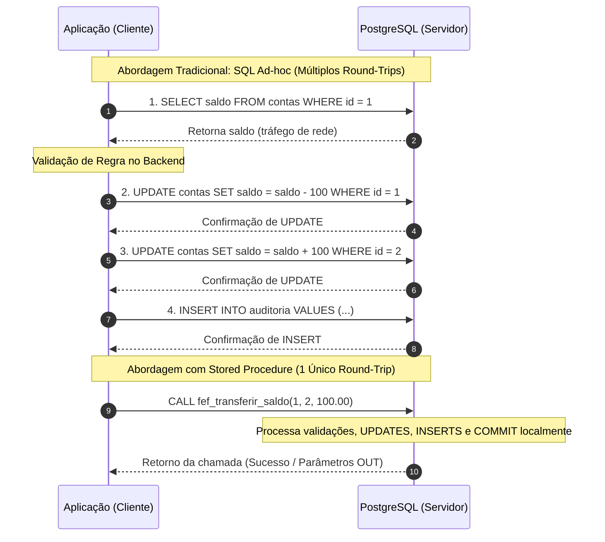
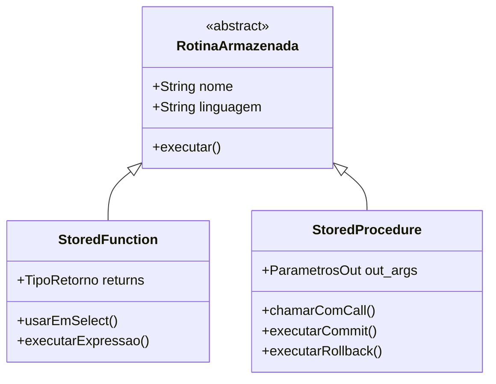
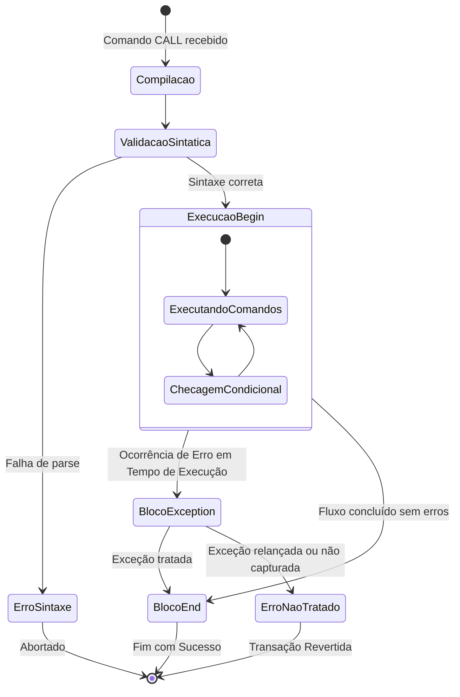
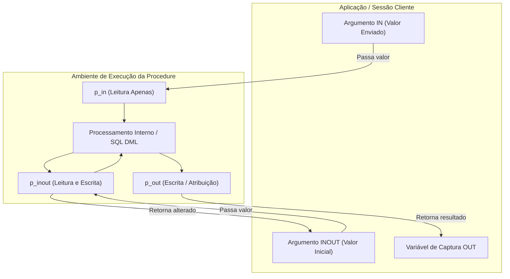
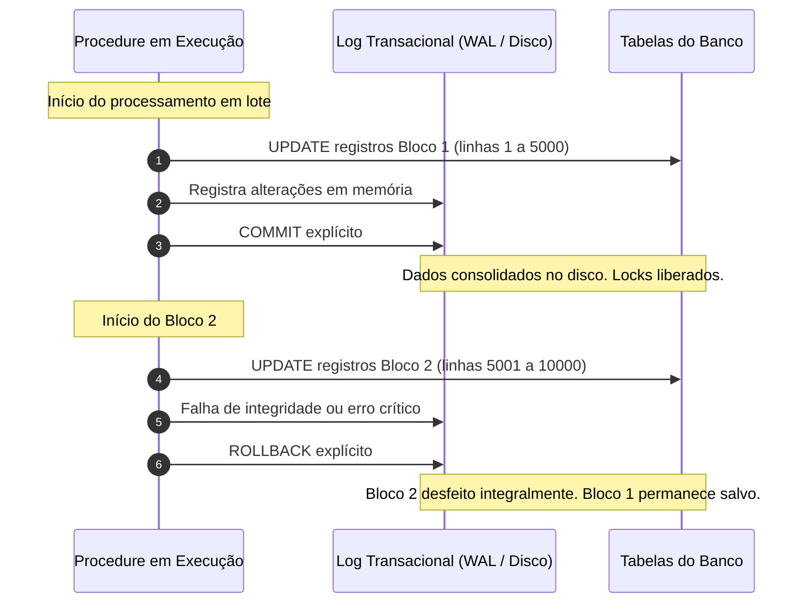
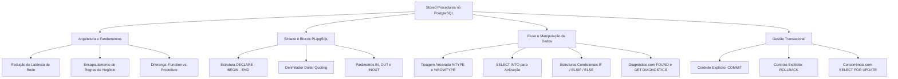

```mermaid
flowchart TD
    Inicio([Início do Bloco Condicional]) --> TesteCondicao{Condição Lógica}
    
    TesteCondicao -- TRUE --> ExecutaThen[Executa instruções do THEN]
    TesteCondicao -- FALSE --> TesteElsif{Possui ELSIF?}
    TesteCondicao -- NULL --> TesteElsif
    
    TesteElsif -- Sim --> AvaliaElsif{Nova Condição}
    AvaliaElsif -- TRUE --> ExecutaThenElsif[Executa instruções do ELSIF]
    AvaliaElsif -- FALSE / NULL --> TemElse{Possui ELSE?}
    
    TesteElsif -- Não --> TemElse
    TemElse -- Sim --> ExecutaElse[Executa instruções do ELSE]
    TemElse -- Não --> FimCondicional[Passa para a próxima instrução]
    
    ExecutaThen --> FimCondicional
    ExecutaThenElsif --> FimCondicional
    ExecutaElse --> FimCondicional
```

# Aula 03 — Stored Procedures no PostgreSQL com PL/pgSQL

> **Professor:** Welington Garcia
> **Disciplina:** Tópicos Avançados em Banco de Dados (4º Semestre)
> **Tema:** Programação procedural no PostgreSQL: criação de procedimentos armazenados, variáveis, controle de fluxo e gestão transacional com PL/pgSQL

---

## Sumário

- [Objetivo da aula](#objetivo-da-aula)
- [Contexto e pré-requisitos](#contexto-e-pré-requisitos)
- [Conceito de Stored Procedures](#conceito-de-stored-procedures)
  - [Definição e arquitetura](#definição-e-arquitetura)
  - [Motivação e redução de tráfego de rede](#motivação-e-redução-de-tráfego-de-rede)
  - [Exemplo prático de fluxo](#exemplo-prático-de-fluxo)
  - [Contraexemplo e armadilhas](#contraexemplo-e-armadilhas)
  - [Comparativo arquitetural](#comparativo-arquitetural)
- [Diferenças entre Functions e Procedures no PostgreSQL](#diferenças-entre-functions-e-procedures-no-postgresql)
  - [Evolução histórica no PostgreSQL](#evolução-histórica-no-postgresql)
  - [Sintaxe de invocação e comportamento de retorno](#sintaxe-de-invocação-e-comportamento-de-retorno)
  - [Capacidade de controle transacional](#capacidade-de-controle-transacional)
  - [Matriz comparativa detalhada](#matriz-comparativa-detalhada)
- [Estrutura básica de um bloco PL/pgSQL](#estrutura-básica-de-um-bloco-plpgsql)
  - [Anatomia do bloco](#anatomia-do-bloco)
  - [O delimitador Dollar Quoting](#o-delimitador-dollar-quoting)
  - [Blocos anônimos vs blocos nomeados](#blocos-anônimos-vs-blocos-nomeados)
  - [Fluxo de execução do interpretador PL/pgSQL](#fluxo-de-execução-do-interpretador-plpgsql)
- [Declaração de variáveis e atribuição de valores](#declaração-de-variáveis-e-atribuição-de-valores)
  - [Tipos escalares e inicialização](#tipos-escalares-e-inicialização)
  - [Operadores de atribuição](#operadores-de-atribuição)
  - [Tipagem ancorada com TYPE e ROWTYPE](#tipagem-ancorada-com-type-e-rowtype)
  - [Captura de dados com SELECT INTO](#captura-de-dados-com-select-into)
- [Parâmetros de entrada (IN) e saída (OUT/INOUT)](#parâmetros-de-entrada-in-e-saída-outinout)
  - [Semântica do modo IN](#semântica-do-modo-in)
  - [Semântica do modo OUT e suporte em Procedures](#semântica-do-modo-out-e-suporte-em-procedures)
  - [Semântica do modo INOUT](#semântica-do-modo-inout)
  - [Passagem posicional versus passagem nominal](#passagem-posicional-versus-passagem-nominal)
- [Estruturas de controle condicional (IF/THEN/ELSE)](#estruturas-de-controle-condicional-ifthenelse)
  - [Variações sintáticas do IF](#variações-sintáticas-do-if)
  - [Lógica booleana ternária e tratamento de valores nulos](#lógica-booleana-ternária-e-tratamento-de-valores-nulos)
  - [Sinalização de eventos com RAISE NOTICE e RAISE EXCEPTION](#sinalização-de-eventos-com-raise-notice-e-raise-exception)
- [Execução de comandos DML (INSERT, UPDATE, DELETE) dentro de procedures](#execução-de-comandos-dml-insert-update-delete-dentro-de-procedures)
  - [Integração de variáveis em instruções DML](#integração-de-variáveis-em-instruções-dml)
  - [A variável de diagnóstico FOUND](#a-variável-de-diagnóstico-found)
  - [Comando GET DIAGNOSTICS e contagem de linhas afetadas](#comando-get-diagnostics-e-contagem-de-linhas-afetadas)
  - [Concorrência e bloqueio de registros com SELECT FOR UPDATE](#concorrência-e-bloqueio-de-registros-com-select-for-update)
- [Controle de transações (COMMIT e ROLLBACK) em procedures](#controle-de-transações-commit-e-rollback-em-procedures)
  - [O papel do controle transacional explícito](#o-papel-do-controle-transacional-explícito)
  - [Sintaxe e execução de COMMIT e ROLLBACK](#sintaxe-e-execução-de-commit-e-rollback)
  - [Restrições operacionais e blocos de exceção](#restrições-operacionais-e-blocos-de-exceção)
- [Código da aula](#código-da-aula)
  - [Arquivo estrutura_banco.sql](#arquivo-estruturabancosql)
  - [Arquivo exemplos_aula.sql](#arquivo-exemplosaulasql)
  - [Arquivo resolucao_exercicios.sql](#arquivo-resolucaoexerciciossql)
- [Exercícios](#exercícios)
  - [Exercício 1: Cadastro de clientes com validação](#exercício-1-cadastro-de-clientes-com-validação)
  - [Exercício 2: Transferência de saldo com controle transacional](#exercício-2-transferência-de-saldo-com-controle-transacional)
  - [Exercício 3: Reajuste de preços em lote com parâmetro de saída](#exercício-3-reajuste-de-preços-em-lote-com-parâmetro-de-saída)
- [Erros comuns e boas práticas](#erros-comuns-e-boas-práticas)
- [Links e materiais complementares](#links-e-materiais-complementares)
- [Mapa da aula](#mapa-da-aula)
- [Glossário](#glossário)
- [Pontos-chave para a prova](#pontos-chave-para-a-prova)
- [Perguntas e respostas (JSONL)](#perguntas-e-respostas-jsonl)
- [Checklist de revisão](#checklist-de-revisão)

---

## Objetivo da aula

Compreender o conceito fundamental de procedimentos armazenados (*stored procedures*) e dominar a transição do paradigma relacional estritamente declarativo (SQL padrão) para o paradigma procedural estruturado com o uso da linguagem procedural PL/pgSQL no PostgreSQL.

Ao final desta aula, o aluno será capaz de:
1. Diferenciar conceitualmente e operacionalmente *Stored Functions* de *Stored Procedures* no ecossistema PostgreSQL.
2. Escrever blocos PL/pgSQL estruturados contendo as seções `DECLARE`, `BEGIN`, `EXCEPTION` e `END`.
3. Declarar e inicializar variáveis escalares, bem como aplicar tipagem dinâmica ancorada através dos qualificadores `%TYPE` e `%ROWTYPE`.
4. Criar *stored procedures* com parâmetros de entrada (`IN`), saída (`OUT`) e entrada/saída (`INOUT`).
5. Construir lógica de negócio interna através de desvios condicionais com `IF`, `THEN`, `ELSIF`, `ELSE` e lançamento de exceções com `RAISE EXCEPTION`.
6. Executar comandos DML (`INSERT`, `UPDATE`, `DELETE`) vinculados à verificação de status via `FOUND` e `GET DIAGNOSTICS`.
7. Gerenciar o ciclo de vida de transações diretamente no interior de procedimentos armazenados através de comandos explícitos de `COMMIT` e `ROLLBACK`.

---

## Contexto e pré-requisitos

Até este momento do curso de Tópicos Avançados em Banco de Dados, o estudo concentrou-se na camada de manipulação e definição de dados declarativa. Foram abordados:
- Consultas avançadas com `SELECT`, junções (`INNER JOIN`, `LEFT JOIN`, `RIGHT JOIN`, `FULL JOIN`), agrupamentos (`GROUP BY`, `HAVING`) e ordenações.
- Subconsultas correlacionadas e expressões de tabela comuns (CTEs - *Common Table Expressions*).
- Manipulação direta de tuplas com `INSERT`, `UPDATE` e `DELETE`.
- Construção de abstrações de leitura através de `VIEWS` normais e materializadas.
- Princípios de modelagem relacional, integridade referencial, chaves primárias, estrangeiras e restrições de checagem (`CHECK`).

Nesta etapa, o estudante passa a tratar o Sistema Gerenciador de Banco de Dados (SGBD) não apenas como um repositório passivo de tabelas e índices, mas como uma plataforma ativa de computação capaz de executar código de negócio próximo aos dados, minimizando gargalos de rede e garantindo conformidade transacional estrita.

---

## Conceito de Stored Procedures

### Definição e arquitetura

Uma *Stored Procedure* (Procedimento Armazenado) é um objeto de esquema que encapsula uma sequência de comandos SQL combinados com estruturas de controle procedurais (condicionais, laços de repetição, manipulação de variáveis e tratamento de exceções). O código é compilado, validado e armazenado diretamente no catálogo do SGBD PostgreSQL.

Diferente de consultas SQL convencionais que são enviadas linha a linha ou comando a comando pela aplicação servidora (backend), a *stored procedure* reside fisicamente no servidor de banco de dados. Uma vez chamada por meio do comando `CALL`, a procedure é executada localmente no processo do motor de banco de dados (*PostgreSQL backend process*).

### Motivação e redução de tráfego de rede

Em sistemas corporativos, uma única operação de negócio frequentemente requer a leitura de múltiplos registros, a verificação de condições e a posterior atualização ou inserção em várias tabelas dependentes. 

Se essa lógica for implementada exclusivamente na aplicação cliente:
1. A aplicação envia um comando `SELECT` via rede (latência de ida e volta - *round-trip*).
2. O banco retorna o conjunto de resultados pela rede.
3. A aplicação processa os dados na memória do servidor web.
4. A aplicação envia instruções `UPDATE` ou `INSERT`.
5. O banco confirma cada execução.

Com a utilização de uma *Stored Procedure*:
1. A aplicação executa uma única chamada: `CALL sp_processar_dados(parametros);`.
2. Todo o tráfego intermediário de dados, validações e comandos DML ocorre na memória interna do servidor de banco de dados, com latência de rede nula entre os passos.
3. O banco de dados retorna apenas a confirmação final ou os parâmetros de saída.



### Exemplo prático de fluxo

Considere o provisionamento de um novo contrato de prestação de serviços. O procedimento necessita:
1. Validar se a empresa contratante existe e está ativa.
2. Inserir o cabeçalho do contrato.
3. Inserir as parcelas financeiras a receber.
4. Gravar uma entrada de log no histórico de auditoria.

Executar esse fluxo dentro de uma *stored procedure* garante que nenhuma falha de conexão de rede entre a aplicação e o banco no meio do processo deixe registros órfãos ou dados inconsistentes.

### Contraexemplo e armadilhas

*(Complemento pedagógico para contextualização de arquitetura de software)*:
- **Armadilha do acoplamento excessivo:** Transferir 100% da lógica da aplicação para o banco de dados pode dificultar testes automatizados unitários na camada de backend, além de criar dependência proprietária de dialetos SQL (dificultando a portabilidade entre SGBDs).
- **Sobrecarga de CPU no servidor de dados:** O banco de dados é habitualmente o nó mais difícil e caro de escalar horizontalmente em uma infraestrutura. Lógicas matemáticas puras, processamento de strings ou tarefas que não demandem consultas intensivas aos dados devem permanecer na camada de aplicação.

### Comparativo arquitetural

| Critério de Comparação | Execução Ad-hoc na Aplicação | Stored Procedure no Banco de Dados |
| :--- | :--- | :--- |
| **Consumo de Banda de Rede** | Elevado (múltiplas idas e vindas de payloads SQL). | Mínimo (apenas o comando `CALL` e o retorno). |
| **Plano de Execução** | Reanalisado com frequência caso não use *prepared statements*. | Analisado e mantido em cache pelo interpretador PL/pgSQL. |
| **Segurança e Permissões** | O usuário precisa de privilégios diretos de `SELECT`, `UPDATE` e `INSERT` nas tabelas. | Permissão concedida apenas no comando `EXECUTE` da procedure (encapsulamento estrito). |
| **Manutenção da Regra** | Distribuída em múltiplos microsserviços ou clientes. | Centralizada no repositório de metadados do banco. |
| **Controle de Transação** | Controlado via conexões de rede ativas (risco de timeout). | Controlado nativamente no núcleo do SGBD. |

---

## Diferenças entre Functions e Procedures no PostgreSQL

### Evolução histórica no PostgreSQL

*(Complemento técnico sobre a evolução do motor relacional)*:
Historicamente, até o lançamento da versão 10, o PostgreSQL não possuía o comando formal `CREATE PROCEDURE`. Os desenvolvedores utilizavam exclusivamente `CREATE FUNCTION` (Funções Definidas pelo Usuário — UDFs). 

Contudo, uma função no PostgreSQL sempre executa no contexto de uma única transação circundante gerada pelo comando que a invocou (como um `SELECT`). Isso impedia categoricamente que uma função realizasse operações de controle transacional, como invocar um `COMMIT` no meio do código para liberar travas (*locks*), ou invocar um `ROLLBACK` sem abortar a função inteira.

A partir do **PostgreSQL 11** (em conformidade com o padrão internacional SQL:2011), foi introduzido o objeto nativo `CREATE PROCEDURE` acoplado ao comando de invocação `CALL`.

### Sintaxe de invocação e comportamento de retorno

- **Functions:** São invocadas como parte de expressões relacionais SQL, tipicamente com `SELECT minha_funcao();` ou integradas a cláusulas `WHERE`, `JOIN` ou listas de projeção. Uma função é obrigada a definir um tipo de retorno através da cláusula `RETURNS <tipo>` (que pode ser um tipo primitivo, um tipo composto ou `VOID`).
- **Procedures:** São invocadas de maneira isolada através da instrução de controle `CALL meu_procedimento();`. Elas **não** possuem a cláusula `RETURNS`. O envio de respostas para quem fez a chamada é realizado por meio de parâmetros marcados com os modificadores `INOUT` ou `OUT`.

### Capacidade de controle transacional

A principal distinção funcional reside no controle de transações:
- Em uma **Function**, a execução de instruções `COMMIT` ou `ROLLBACK` é expressamente proibida pelo compilador do PostgreSQL, gerando o erro: `ERROR: invalid transaction termination`.
- Em uma **Procedure**, o desenvolvedor tem total liberdade para comitar etapas intermediárias com `COMMIT;` e reverter ações parciais com `ROLLBACK;`. Isso viabiliza o processamento em lote (*batch processing*), como a atualização de milhões de linhas onde se faz um commit a cada 10.000 iterações para evitar o esgotamento do log de transações (*WAL - Write-Ahead Logging*).

### Matriz comparativa detalhada

| Característica | Stored Function (`CREATE FUNCTION`) | Stored Procedure (`CREATE PROCEDURE`) |
| :--- | :--- | :--- |
| **Comando de Invocação** | `SELECT nome_funcao();` | `CALL nome_procedure();` |
| **Uso em Comandos SQL** | Pode ser usada dentro de `SELECT`, `WHERE`, `ORDER BY`. | Não pode ser usada dentro de instruções `SELECT` ou `WHERE`. |
| **Cláusula de Retorno** | Obrigatória (`RETURNS tipo_dado` ou `RETURNS void`). | Não possui cláusula `RETURNS`. |
| **Retorno de Múltiplos Valores** | `RETURNS TABLE(...)` ou tipos compostos. | Parâmetros `INOUT` ou múltiplos parâmetros `OUT`. |
| **Comandos COMMIT / ROLLBACK** | Proibidos. Não é permitido gerenciar transações. | Permitidos. Controle autônomo do ciclo transacional. |
| **Objetivo Primário** | Cálculo, computação funcional e retorno de dados para consultas. | Orquestração de regras de negócio complexas, processos batch e DML. |



---

## Estrutura básica de um bloco PL/pgSQL

### Anatomia do bloco

O PL/pgSQL (*Procedural Language / PostgreSQL Structured Query Language*) é uma linguagem estruturada em blocos. Um bloco completo é delimitado pelas palavras-chave `DECLARE`, `BEGIN`, `EXCEPTION` e `END;`.

A estrutura formal obedece ao seguinte esqueleto:

```sql
[ <<rotulo>> ]
[ DECLARE
    -- Seção de declarações: alocação de variáveis, tipos e cursores
]
BEGIN
    -- Seção executável: comandos SQL e instruções procedurais PL/pgSQL
[ EXCEPTION
    -- Seção de tratamento de exceções: captura e tratamento de erros
]
END [ rotulo ];
```

Cada instrução dentro da seção executável deve obrigatoriamente terminar com ponto e vírgula (`;`). Os blocos podem ser aninhados recursivamente: dentro de um bloco `BEGIN ... END`, é permitido abrir um novo `DECLARE ... BEGIN ... END;` criando escopos léxicos locais de variáveis.

### O delimitador Dollar Quoting

Em SQL padrão, o corpo de uma função ou procedure precisaria ser delimitado por aspas simples (`'corpo'`). Isso criava a necessidade de duplicar qualquer aspa simples contida no código (`''''` para representar uma aspa).

Para solucionar essa fragilidade, o PostgreSQL implementa o mecanismo de **Dollar Quoting** (Delimitação por Cifrão). O corpo do código é envolvido por dois sinais de cifrão (`$$` ou `$tag$`).

Exemplo prático de Dollar Quoting com tag customizada:
```sql
CREATE OR REPLACE PROCEDURE fef_exemplo_tag()
LANGUAGE plpgsql
AS $codigo_fonte$
BEGIN
    RAISE NOTICE 'O uso de aspas simples ''aqui'' fica limpo e legível.';
END;
$codigo_fonte$;
```

### Blocos anônimos vs blocos nomeados

1. **Blocos Anônimos (`DO`):** São blocos de código PL/pgSQL que não recebem identificador, não recebem parâmetros e não são armazenados permanentemente no catálogo do banco. São compilados e executados imediatamente. Úteis para rotinas administrativas, testes pontuais e migrações de dados.
   
```sql
DO $$
DECLARE
    v_momento TIMESTAMP := clock_timestamp();
BEGIN
    RAISE NOTICE 'Execução de teste em bloco anônimo: %', v_momento;
END;
$$;
```

2. **Blocos Nomeados (`CREATE PROCEDURE`):** São objetos duráveis de catálogo, associados a um esquema, parametrizáveis e invocáveis a qualquer momento através de `CALL`.

```sql
CREATE OR REPLACE PROCEDURE fef_procedimento_nomeado()
LANGUAGE plpgsql
AS $$
BEGIN
    RAISE NOTICE 'Procedimento armazenado compilado com sucesso.';
END;
$$;
```

### Fluxo de execução do interpretador PL/pgSQL

Quando um procedimento é chamado pela primeira vez em uma sessão, o interpretador compila a árvore sintática do bloco, valida os tipos dos identificadores e prepara planos de execução em cache para as instruções SQL contidas internamente.



---

## Declaração de variáveis e atribuição de valores

### Tipos escalares e inicialização

As variáveis no PL/pgSQL devem ser explicitamente declaradas na seção `DECLARE` antes de serem manipuladas no bloco `BEGIN`. Devem possuir um nome válido e um tipo de dado compatível com o PostgreSQL (ex: `INTEGER`, `NUMERIC`, `VARCHAR`, `BOOLEAN`, `TIMESTAMP`).

Por padrão, se uma variável não for inicializada na sua declaração, seu valor será estritamente `NULL`. Para atribuir um valor inicial na definição, utiliza-se a palavra-chave `DEFAULT` ou o operador de atribuição `:=` (ou `=`, mantido por compatibilidade com a sintaxe SQL padrão).

```sql
DECLARE
    v_quantidade INTEGER := 0;
    v_taxa       NUMERIC(5, 2) DEFAULT 12.50;
    v_descricao  VARCHAR(100) := 'Sem Descrição';
    v_ativo      BOOLEAN := TRUE;
```

### Operadores de atribuição

Dentro do bloco executável (`BEGIN ... END`), a atribuição de novos valores a variáveis pode ser realizada com:
- `:=` (Operador tradicional recomendado do PL/pgSQL, herdado do ADA/Pascal).
- `=` (Operador aceito pelo compilador do PostgreSQL, idêntico funcionalmente a `:=`).

```sql
v_quantidade := v_quantidade + 10;
v_descricao := 'Nova Descrição do Produto';
```

### Tipagem ancorada com TYPE e ROWTYPE

Um dos recursos mais robustos do PL/pgSQL para garantir manutenibilidade é a **tipagem ancorada**. Esse mecanismo permite que o tipo de uma variável seja herdado diretamente da estrutura de uma coluna ou de uma tabela do banco de dados.

1. **Qualificador `%TYPE` (Ancoragem de Coluna):**
   Garante que, se o tipo de dado da coluna da tabela for alterado no futuro (ex: de `VARCHAR(50)` para `VARCHAR(100)`), o procedimento herdará automaticamente a nova tipagem sem necessidade de alteração manual no código.

```sql
DECLARE
    -- A variável v_email herda exatamente o tipo da coluna email da tabela clientes
    v_email clientes.email%TYPE;
    v_limite contas.saldo%TYPE;
```

2. **Qualificador `%ROWTYPE` (Ancoragem de Linha / Registro Completo):**
   Cria uma variável composta (registro) cuja estrutura reflete todas as colunas de uma tabela ou view.

```sql
DECLARE
    -- A variável reg_cliente armazena uma linha inteira da tabela clientes
    reg_cliente clientes%ROWTYPE;
BEGIN
    -- O acesso aos campos é feito através da notação ponto (.)
    RAISE NOTICE 'Nome do cliente: %', reg_cliente.nome;
END;
```

### Captura de dados com SELECT INTO

A instrução SQL pura `SELECT` não pode ser executada isoladamente dentro de um bloco PL/pgSQL caso ela retorne linhas soltas na tela. Toda consulta de leitura deve ter seu resultado direcionado para variáveis de armazenamento. Para isso, utiliza-se a cláusula `SELECT ... INTO`.

```sql
DECLARE
    v_nome_cliente  clientes.nome%TYPE;
    v_saldo_atual   contas.saldo%TYPE;
BEGIN
    -- Captura colunas escalares específicas
    SELECT nome INTO v_nome_cliente
    FROM clientes
    WHERE id = 1;

    -- Captura uma linha completa em uma variável %ROWTYPE
    SELECT * INTO reg_cliente
    FROM clientes
    WHERE id = 1;

    RAISE NOTICE 'Cliente selecionado: %, Documento: %', 
                 reg_cliente.nome, reg_cliente.cpf;
END;
```

> **Atenção:** Se a instrução `SELECT ... INTO` não encontrar nenhuma linha que atenda ao filtro, os valores das variáveis serão definidos como `NULL`, e a variável especial `FOUND` será definida como `FALSE`. Caso a consulta retorne mais de uma linha, apenas a primeira linha será gravada e o restante será descartado (a menos que seja utilizado um cursor ou cláusula estrita).

---

## Parâmetros de entrada (IN) e saída (OUT/INOUT)

### Semântica do modo IN

O modificador `IN` indica que o parâmetro é de **entrada**. O valor é fornecido pelo chamador no momento da invocação e pode ser lido dentro do corpo da procedure. Por padrão, no PostgreSQL, qualquer parâmetro declarado sem modificador explícito é classificado como `IN`.

O parâmetro de entrada atua como uma constante ou variável local inicializada: seu valor não pode ser devolvido ao chamador como resultado final.

```sql
CREATE OR REPLACE PROCEDURE fef_exibir_mensagem(IN p_mensagem VARCHAR)
LANGUAGE plpgsql
AS $$
BEGIN
    RAISE NOTICE 'Mensagem recebida: %', p_mensagem;
END;
$$;
```

### Semântica do modo OUT e suporte em Procedures

O modificador `OUT` define um parâmetro puramente de **saída**. Ele não precisa ser informado com valor pelo chamador; ele funciona como um canal de resposta gerado no término da procedure.

*(Complemento técnico sobre versões do PostgreSQL)*:
No PostgreSQL 11, procedures suportavam apenas `IN` e `INOUT`. A partir do **PostgreSQL 14**, o uso de parâmetros puramente `OUT` foi completamente padronizado em procedures, permitindo que valores calculados internamente sejam devolvidos diretamente ao cliente que disparou o comando `CALL`.

```sql
CREATE OR REPLACE PROCEDURE fef_obter_estatisticas(
    IN  p_categoria_id INTEGER,
    OUT p_total_itens  INTEGER,
    OUT p_valor_medio  NUMERIC
)
LANGUAGE plpgsql
AS $$
BEGIN
    SELECT COUNT(*), COALESCE(AVG(preco), 0.00)
    INTO p_total_itens, p_valor_medio
    FROM produtos
    WHERE id_categoria = p_categoria_id;
END;
$$;
```

Invocação no cliente SQL:
```sql
CALL fef_obter_estatisticas(1, NULL, NULL);
```
O PostgreSQL retorna uma linha contendo as duas colunas de saída calculadas.

### Semântica do modo INOUT

O modificador `INOUT` combina ambas as características: o parâmetro recebe um valor inicial no momento da chamada, esse valor pode ser processado e alterado dentro do procedimento, e seu novo estado é devolvido ao chamador ao final da execução.

```sql
CREATE OR REPLACE PROCEDURE fef_incrementar_valor(INOUT p_contador INTEGER)
LANGUAGE plpgsql
AS $$
BEGIN
    p_contador := COALESCE(p_contador, 0) + 1;
END;
$$;
```

Invocação:
```sql
CALL fef_incrementar_valor(10);
-- Retorno: 11
```

### Passagem posicional versus passagem nominal

Ao invocar uma procedure com múltiplos parâmetros, o PostgreSQL permite duas formas de mapeamento de argumentos:

1. **Passagem Posicional:** Os valores são passados estritamente na mesma ordem em que os parâmetros foram declarados no cabeçalho da procedure.
   ```sql
   CALL fef_cadastrar_cliente('João da Silva', '12345678901', 'joao@email.com');
   ```

2. **Passagem Nominal (Nomeada):** Os valores são associados explicitamente ao nome dos parâmetros utilizando o operador `=>`. Essa abordagem melhora a legibilidade e permite omitir parâmetros que possuam valores padrão (`DEFAULT`).
   ```sql
   CALL fef_cadastrar_cliente(
       p_cpf   => '12345678901',
       p_nome  => 'João da Silva',
       p_email => 'joao@email.com'
   );
   ```



---

## Estruturas de controle condicional (IF/THEN/ELSE)

### Variações sintáticas do IF

As estruturas condicionais no PL/pgSQL permitem bifurcar o fluxo de execução com base no valor booleano de expressões lógicas.

Existem quatro variações principais de sintaxe:

1. **`IF ... THEN ... END IF;`**
   Executa o bloco apenas se a condição for estritamente verdadeira.

```sql
IF v_saldo < 0 THEN
    RAISE NOTICE 'Conta em estado de cheque especial.';
END IF;
```

2. **`IF ... THEN ... ELSE ... END IF;`**
   Define um caminho alternativo caso a condição resulte em falsa ou nula.

```sql
IF v_idade >= 18 THEN
    v_categoria := 'Adulto';
ELSE
    v_categoria := 'Menor de idade';
END IF;
```

3. **`IF ... THEN ... ELSIF ... ELSE ... END IF;`**
   Permite avaliar múltiplas condições sequenciais sem aninhar múltiplos blocos. A palavra-chave pode ser escrita como `ELSIF` ou `ELSEIF`.

```sql
IF v_pontuacao >= 90 THEN
    v_conceito := 'Excelente';
ELSIF v_pontuacao >= 70 THEN
    v_conceito := 'Bom';
ELSIF v_pontuacao >= 50 THEN
    v_conceito := 'Regular';
ELSE
    v_conceito := 'Insuficiente';
END IF;
```

### Lógica booleana ternária e tratamento de valores nulos

*(Nota técnica fundamental para provas e produção)*:
No PostgreSQL e no padrão SQL, as comparações lógicas operam sob o modelo de **lógica ternária** (*Three-Valued Logic*). Uma condição pode avaliar para `TRUE`, `FALSE` ou `NULL` (Desconhecido).

O bloco interno a um `IF` **só é executado se a condição for avaliada como `TRUE`**. Se a condição for avaliada como `NULL`, o fluxo segue diretamente para o `ELSE` ou para fora do bloco condicional.

Exemplo de armadilha:
```sql
DECLARE
    v_valor INTEGER := NULL;
BEGIN
    -- Comparações diretas com NULL geram resultado NULL, nunca TRUE
    IF v_valor = 10 THEN
        RAISE NOTICE 'É dez';
    ELSE
        -- O fluxo cairá aqui mesmo que v_valor não seja diferente de 10 de forma conclusiva!
        RAISE NOTICE 'Não é dez ou é nulo';
    END IF;
    
    -- Forma correta de checagem defensiva:
    IF v_valor IS NULL THEN
        RAISE NOTICE 'A variável é nula.';
    END IF;
END;
```

### Sinalização de eventos com RAISE NOTICE e RAISE EXCEPTION

Para comunicação de mensagens e controle de erros, o PL/pgSQL dispõe da instrução `RAISE`:

- **`RAISE NOTICE`:** Emite uma mensagem informativa para a saída de console do cliente sem interromper a execução do procedimento e sem interferir na transação corrente.
- **`RAISE EXCEPTION`:** Lança um erro fatal de execução. Aborta imediatamente a execução do procedimento, reverte todas as alterações realizadas na transação corrente (a menos que haja um bloco `EXCEPTION` interno de captura) e retorna uma mensagem de erro à aplicação cliente.

Formatação com placeholders:
O caractere `%` atua como curinga (*placeholder*) sequencial para injeção de valores.

```sql
RAISE NOTICE 'O saldo da conta % é de R$ %', v_id_conta, v_saldo_atual;

IF v_saldo_atual < 0 THEN
    RAISE EXCEPTION 'Operação cancelada: Saldo negativo (R$ %) para a conta %.',
                    v_saldo_atual, v_id_conta;
END IF;
```



---

## Execução de comandos DML (INSERT, UPDATE, DELETE) dentro de procedures

### Integração de variáveis em instruções DML

Dentro do corpo de uma *stored procedure*, os comandos de manipulação de dados (`INSERT`, `UPDATE`, `DELETE`) funcionam de forma idêntica ao SQL interativo, mas com a capacidade de interpolar variáveis e parâmetros locais de forma direta nas instruções.

```sql
CREATE OR REPLACE PROCEDURE fef_desativar_cliente(IN p_cliente_id INTEGER)
LANGUAGE plpgsql
AS $$
DECLARE
    v_status_inativo CONSTANT VARCHAR(20) := 'INATIVO';
BEGIN
    UPDATE clientes
    SET status = v_status_inativo,
        atualizado_em = clock_timestamp()
    WHERE id = p_cliente_id;
END;
$$;
```

### A variável de diagnóstico FOUND

O interpretador PL/pgSQL gerencia automaticamente uma variável interna booleana denominada `FOUND`. Essa variável tem escopo local no procedimento e altera seu estado logo após a execução de determinados comandos SQL:

- `SELECT INTO`: `FOUND` torna-se `TRUE` se uma linha for capturada; torna-se `FALSE` se nenhuma linha atender aos critérios.
- `UPDATE`, `INSERT`, `DELETE`: `FOUND` torna-se `TRUE` se ao menos uma linha foi afetada no banco; torna-se `FALSE` se zero linhas foram modificadas.

```sql
UPDATE clientes SET status = 'INATIVO' WHERE id = 9999;

IF NOT FOUND THEN
    RAISE NOTICE 'Nenhum cliente com o ID informado foi localizado para alteração.';
END IF;
```

### Comando GET DIAGNOSTICS e contagem de linhas afetadas

Embora a variável `FOUND` confirme se houve ou não impacto, ela não informa **quantas** linhas foram processadas. Quando é necessário auditar ou retornar a quantidade exata de tuplas afetadas por um comando DML, utiliza-se a instrução formal `GET DIAGNOSTICS`.

Sintaxe:
```sql
GET DIAGNOSTICS variavel_alvo = ROW_COUNT;
```

Exemplo prático de expurgo com contagem:
```sql
DECLARE
    v_linhas_removidas INTEGER;
BEGIN
    DELETE FROM logs_sistema
    WHERE data_registro < CURRENT_DATE - INTERVAL '90 days';

    -- Captura a quantidade exata de tuplas deletadas na instrução imediatamente anterior
    GET DIAGNOSTICS v_linhas_removidas = ROW_COUNT;

    RAISE NOTICE 'Limpeza concluída. Total de logs deletados: %', v_linhas_removidas;
END;
```

### Concorrência e bloqueio de registros com SELECT FOR UPDATE

*(Complemento essencial sobre concorrência e transações)*:
Quando um procedimento realiza leitura de saldo ou estoque para posterior atualização, existe um sério risco de condição de corrida (*race condition* / *lost update*) se duas sessões executarem a procedure simultaneamente para o mesmo registro.

Para blindar o procedimento, a consulta de verificação deve aplicar um bloqueio pessimista a nível de linha através do comando `SELECT ... FOR UPDATE`. Isso força qualquer outra transação concorrente a aguardar o término do procedimento antes de ler ou alterar o mesmo registro.

```sql
-- Garante lock exclusivo na linha da conta durante a execução da regra
SELECT saldo INTO v_saldo_atual
FROM contas
WHERE id = p_conta_id
FOR UPDATE;
```

---

## Controle de transações (COMMIT e ROLLBACK) em procedures

### O papel do controle transacional explícito

Uma das principais vantagens técnicas das *stored procedures* introduzidas no PostgreSQL 11 é a autonomia para gerenciar o estado da transação. Em procedimentos voltados para rotinas pesadas de processamento em lote (*ETL*, consolidação contábil, arquivamento de histórico), acumular todas as operações em uma única transação gigante pode:
1. Sobrecarregar a memória do servidor de banco.
2. Bloquear tabelas e linhas por tempo excessivo, degradando o sistema operacional.
3. Consumir todo o espaço disponível de disco na partição de *WAL* (*Write-Ahead Log*).

Com comandos transacionais no corpo da procedure, o desenvolvedor pode fatiar a carga de trabalho, consolidando os dados em lotes atômicos menores.

### Sintaxe e execução de COMMIT e ROLLBACK

- **`COMMIT;`**: Grava permanentemente todas as operações DML realizadas até aquele ponto no disco, encerra a transação atual e abre imediatamente uma nova transação vazia para os comandos subsequentes da procedure. Todas as travas de registros mantidas até então são liberadas.
- **`ROLLBACK;`**: Descarta e desfaz todas as alterações DML executadas desde o início da transação corrente ou desde o último `COMMIT`. Abre imediatamente uma nova transação vazia.



### Restrições operacionais e blocos de exceção

*(Armadilha clássica de arquitetura PL/pgSQL)*:
Não é permitido executar comandos explícitos de `COMMIT` ou `ROLLBACK` dentro de uma procedure se ela contiver uma seção `EXCEPTION` ativa no mesmo bloco, ou se o procedimento tiver sido disparado a partir de uma chamada que já esteja em um contexto não atômico.

Se você declarar:
```sql
BEGIN
    -- Comandos DML...
    COMMIT; -- GERA ERRO DE COMPILAÇÃO/EXECUÇÃO SE HOUVER BLOCO EXCEPTION ABAIXO!
EXCEPTION
    WHEN OTHERS THEN
        ROLLBACK;
END;
```
O PostgreSQL lançará: `ERROR: cannot commit while a subtransaction is active`. 

**Explicação técnica:** A seção `EXCEPTION` em PL/pgSQL cria internamente um *savepoint* de subtransação para permitir reverter o bloco local. O comando `COMMIT` tenta consolidar a transação raiz e não pode operar com subtransações pendentes abertas pelo tratador de erros.

---

## Código da aula

Nesta seção, estruturam-se os arquivos SQL de suporte que devem acompanhar o ambiente prático do laboratório.

### Arquivo estrutura_banco.sql

Este script cria as estruturas de tabelas, restrições e dados de teste para suportar as explicações e os exercícios da aula.

```sql
-- ============================================================================
-- Arquivo: ./codigo/estrutura_banco.sql
-- Disciplina: Tópicos Avançados em Banco de Dados - UniFEF
-- Professor: Welington Garcia
-- Descrição: Script de criação de tabelas e inserção de dados iniciais.
-- ============================================================================

-- Limpeza preventiva de objetos pré-existentes
DROP TABLE IF EXISTS logs_sistema CASCADE;
DROP TABLE IF EXISTS produtos CASCADE;
DROP TABLE IF EXISTS categorias CASCADE;
DROP TABLE IF EXISTS contas CASCADE;
DROP TABLE IF EXISTS clientes CASCADE;

-- 1. Tabela de Clientes
CREATE TABLE clientes (
    id            SERIAL PRIMARY KEY,
    nome          VARCHAR(100)        NOT NULL,
    cpf           VARCHAR(14)         NOT NULL UNIQUE,
    email         VARCHAR(100)        NOT NULL,
    status        VARCHAR(20)         DEFAULT 'ATIVO' NOT NULL,
    criado_em     TIMESTAMP           DEFAULT clock_timestamp() NOT NULL
);

-- 2. Tabela de Contas Bancárias (Para exercícios de transferência)
CREATE TABLE contas (
    id            SERIAL PRIMARY KEY,
    id_cliente    INTEGER             NOT NULL REFERENCES clientes(id) ON DELETE CASCADE,
    numero_conta  VARCHAR(20)         NOT NULL UNIQUE,
    saldo         NUMERIC(15, 2)      NOT NULL DEFAULT 0.00,
    CONSTRAINT chk_saldo_nao_negativo CHECK (saldo >= 0.00)
);

-- 3. Tabela de Categorias de Produtos
CREATE TABLE categorias (
    id            SERIAL PRIMARY KEY,
    nome          VARCHAR(50)         NOT NULL
);

-- 4. Tabela de Produtos
CREATE TABLE produtos (
    id            SERIAL PRIMARY KEY,
    id_categoria  INTEGER             NOT NULL REFERENCES categorias(id) ON DELETE RESTRICT,
    nome          VARCHAR(100)        NOT NULL,
    preco         NUMERIC(10, 2)      NOT NULL CHECK (preco > 0),
    estoque       INTEGER             NOT NULL DEFAULT 0
);

-- 5. Tabela de Auditoria e Logs do Sistema
CREATE TABLE logs_sistema (
    id            SERIAL PRIMARY KEY,
    acao          VARCHAR(100)        NOT NULL,
    descricao     TEXT                NOT NULL,
    data_registro TIMESTAMP           DEFAULT clock_timestamp() NOT NULL
);

-- Carga inicial de dados para testes
INSERT INTO clientes (nome, cpf, email) VALUES
('Carlos Drummond', '111.111.111-11', 'drummond@unifef.edu.br'),
('Clarice Lispector', '222.222.222-22', 'clarice@unifef.edu.br'),
('Machado de Assis', '333.333.333-33', 'machado@unifef.edu.br');

INSERT INTO contas (id_cliente, numero_conta, saldo) VALUES
(1, 'CC-1001', 1500.00),
(2, 'CC-2002', 300.00),
(3, 'CC-3003', 50.00);

INSERT INTO categorias (nome) VALUES
('Livros e Periódicos'),
('Informática e Acessórios'),
('Papelaria');

INSERT INTO produtos (id_categoria, nome, preco, estoque) VALUES
(1, 'Banco de Dados Avançado', 120.00, 15),
(1, 'Sistemas Distribuídos', 95.00, 8),
(2, 'Teclado Mecânico USB', 250.00, 20),
(2, 'Mouse Óptico Sem Fio', 80.00, 35),
(3, 'Caderno Universitário 200 Fls', 25.00, 50);
```

### Arquivo exemplos_aula.sql

Exemplos demonstrativos de estruturas fundamentais de PL/pgSQL trabalhadas em sala.

```sql
-- ============================================================================
-- Arquivo: ./codigo/exemplos_aula.sql
-- Disciplina: Tópicos Avançados em Banco de Dados - UniFEF
-- Professor: Welington Garcia
-- Descrição: Exemplos didáticos de blocos anônimos, variáveis e condicionais.
-- ============================================================================

-- Exemplo 1: Bloco Anônimo com Tipagem Ancorada e Captura de Linha
DO $$
DECLARE
    -- Declaração de variável com ancoragem na coluna da tabela clientes
    v_nome_cliente clientes.nome%TYPE;
    v_total_contas INTEGER;
BEGIN
    SELECT nome INTO v_nome_cliente 
    FROM clientes 
    WHERE id = 1;

    SELECT COUNT(*) INTO v_total_contas 
    FROM contas;

    RAISE NOTICE 'Cliente consultado: % | Total de contas cadastradas: %', 
                 v_nome_cliente, v_total_contas;
END;
$$;

-- Exemplo 2: Procedure Simples com Parâmetro de Entrada e Condicional
CREATE OR REPLACE PROCEDURE fef_exemplo_verificar_saldo(IN p_conta_id INTEGER)
LANGUAGE plpgsql
AS $$
DECLARE
    v_saldo_atual contas.saldo%TYPE;
BEGIN
    -- Busca o saldo da conta informada
    SELECT saldo INTO v_saldo_atual
    FROM contas
    WHERE id = p_conta_id;

    -- Avalia se o registro foi localizado
    IF NOT FOUND THEN
        RAISE NOTICE 'Conta ID % não foi localizada no sistema.', p_conta_id;
        RETURN;
    END IF;

    -- Estrutura de decisão
    IF v_saldo_atual > 1000.00 THEN
        RAISE NOTICE 'Conta % possui saldo consolidado ALTO: R$ %', p_conta_id, v_saldo_atual;
    ELSIF v_saldo_atual >= 100.00 THEN
        RAISE NOTICE 'Conta % possui saldo REGULAR: R$ %', p_conta_id, v_saldo_atual;
    ELSE
        RAISE NOTICE 'Conta % possui saldo BAIXO: R$ %', p_conta_id, v_saldo_atual;
    END IF;
END;
$$;

-- Chamada de teste da procedure de verificação:
CALL fef_exemplo_verificar_saldo(1);
CALL fef_exemplo_verificar_saldo(2);
CALL fef_exemplo_verificar_saldo(99);
```

### Arquivo resolucao_exercicios.sql

Implementação completa das *stored procedures* propostas no planejamento acadêmico da aula.

```sql
-- ============================================================================
-- Arquivo: ./codigo/resolucao_exercicios.sql
-- Disciplina: Tópicos Avançados em Banco de Dados - UniFEF
-- Professor: Welington Garcia
-- Descrição: Resolução formal dos exercícios propostos com comentários linha a linha.
-- ============================================================================

-- ----------------------------------------------------------------------------
-- Exercício 1: Cadastro de Cliente com Validação
-- ----------------------------------------------------------------------------
CREATE OR REPLACE PROCEDURE fef_cadastrar_cliente(
    IN p_nome  VARCHAR,
    IN p_cpf   VARCHAR,
    IN p_email VARCHAR
)
LANGUAGE plpgsql
AS $$
DECLARE
    v_cpf_existente INTEGER;
BEGIN
    -- Linha 1: Checagem defensiva de unicidade de CPF
    SELECT COUNT(*) INTO v_cpf_existente
    FROM clientes
    WHERE cpf = p_cpf;

    -- Linha 2: Disparo de erro caso o CPF já exista
    IF v_cpf_existente > 0 THEN
        RAISE EXCEPTION 'Falha cadastral: O CPF % já está registrado na base de dados.', p_cpf;
    END IF;

    -- Linha 3: Inserção do novo registro
    INSERT INTO clientes (nome, cpf, email)
    VALUES (p_nome, p_cpf, p_email);

    -- Linha 4: Registro de auditoria correspondente
    INSERT INTO logs_sistema (acao, descricao)
    VALUES ('CADASTRO_CLIENTE', 'Inclusão do cliente: ' || p_nome || ' (CPF: ' || p_cpf || ')');

    RAISE NOTICE 'Cliente % cadastrado com absoluto sucesso.', p_nome;
END;
$$;

-- ----------------------------------------------------------------------------
-- Exercício 2: Transferência Bancária entre Contas
-- ----------------------------------------------------------------------------
CREATE OR REPLACE PROCEDURE fef_transferir_saldo(
    IN p_conta_origem  INTEGER,
    IN p_conta_destino INTEGER,
    IN p_valor         NUMERIC
)
LANGUAGE plpgsql
AS $$
DECLARE
    v_saldo_origem  contas.saldo%TYPE;
    v_conta_dest_ok BOOLEAN;
BEGIN
    -- Validação de consistência do valor
    IF p_valor <= 0 THEN
        RAISE EXCEPTION 'O valor para transferência deve ser estritamente positivo. Valor informado: %', p_valor;
    END IF;

    -- Bloqueia a linha da conta de origem para evitar condições de corrida concorrentes
    SELECT saldo INTO v_saldo_origem
    FROM contas
    WHERE id = p_conta_origem
    FOR UPDATE;

    IF NOT FOUND THEN
        RAISE EXCEPTION 'A conta de origem (ID %) não existe.', p_conta_origem;
    END IF;

    -- Verifica se a conta de destino existe
    SELECT EXISTS (SELECT 1 FROM contas WHERE id = p_conta_destino) INTO v_conta_dest_ok;
    IF NOT v_conta_dest_ok THEN
        RAISE EXCEPTION 'A conta de destino (ID %) não existe.', p_conta_destino;
    END IF;

    -- Validação de saldo
    IF v_saldo_origem < p_valor THEN
        ROLLBACK;
        RAISE EXCEPTION 'Saldo insuficiente na conta %. Saldo atual: R$ %, Valor solicitado: R$ %',
                        p_conta_origem, v_saldo_origem, p_valor;
    END IF;

    -- Debita da conta de origem
    UPDATE contas
    SET saldo = saldo - p_valor
    WHERE id = p_conta_origem;

    -- Credita na conta de destino
    UPDATE contas
    SET saldo = saldo + p_valor
    WHERE id = p_conta_destino;

    -- Registra auditoria da transferência
    INSERT INTO logs_sistema (acao, descricao)
    VALUES ('TRANSFERENCIA', 'Transferência de R$ ' || p_valor || ' da conta ' || p_conta_origem || ' para a conta ' || p_conta_destino);

    -- Confirma as alterações atômicas no banco de dados
    COMMIT;
    RAISE NOTICE 'Transferência de R$ % realizada e comitada com sucesso.', p_valor;
END;
$$;

-- ----------------------------------------------------------------------------
-- Exercício 3: Reajuste em Lote de Preços por Categoria
-- ----------------------------------------------------------------------------
CREATE OR REPLACE PROCEDURE fef_reajustar_precos(
    IN  p_categoria_id      INTEGER,
    IN  p_percentual        NUMERIC,
    OUT p_total_atualizados INTEGER
)
LANGUAGE plpgsql
AS $$
DECLARE
    v_fator_multiplicador NUMERIC;
BEGIN
    -- Valida se o percentual é lógico (não permitir reajustes negativos menores que -100%)
    IF p_percentual < -100.00 THEN
        RAISE EXCEPTION 'Percentual de reajuste inválido: % %%', p_percentual;
    END IF;

    -- Calcula o multiplicador decimal (Ex: 10% -> 1.10)
    v_fator_multiplicador := 1.00 + (p_percentual / 100.00);

    -- Atualiza os produtos da categoria
    UPDATE produtos
    SET preco = ROUND(preco * v_fator_multiplicador, 2)
    WHERE id_categoria = p_categoria_id;

    -- Obtém o total exato de linhas modificadas pela instrução UPDATE
    GET DIAGNOSTICS p_total_atualizados = ROW_COUNT;

    -- Registra na auditoria
    INSERT INTO logs_sistema (acao, descricao)
    VALUES ('REAJUSTE_PRECOS', 'Reajuste de ' || p_percentual || '% aplicado na categoria ' || p_categoria_id || '. Total afetado: ' || p_total_atualizados);

    RAISE NOTICE 'Reajuste finalizado. Total de itens modificados: %', p_total_atualizados;
END;
$$;
```

---

## Exercícios

### Exercício 1: Cadastro de clientes com validação

#### Enunciado
Crie uma *stored procedure* chamada `fef_cadastrar_cliente` que receba como parâmetros de entrada o nome (`VARCHAR`), o CPF (`VARCHAR`) e o e-mail (`VARCHAR`) de um cliente. O procedimento deve verificar se o CPF informado já está presente na tabela `clientes`. Se o CPF já existir, deve ser disparada uma exceção personalizada abortando a operação. Caso o CPF não exista, o procedimento deve inserir o cliente e gravar automaticamente um registro na tabela `logs_sistema` com a ação realizada e a descrição textual do cadastro.

#### Raciocínio da solução
1. O procedimento aceita três parâmetros de entrada em modo `IN`.
2. Para checar a duplicidade, executa-se um `SELECT COUNT(*)` na tabela `clientes` filtrando pelo CPF recebido e armazenando o total em uma variável inteira.
3. Se a contagem for maior que zero, utiliza-se a instrução `RAISE EXCEPTION` com mensagem explícita. O comando `RAISE EXCEPTION` aborta a transação imediatamente.
4. Caso a validação passe, executa-se o comando `INSERT INTO clientes`.
5. Em seguida, executa-se o `INSERT INTO logs_sistema` para garantir rastreabilidade e auditoria da operação.

#### Resolução comentada
Ver código completo em [Arquivo resolucao_exercicios.sql](#arquivo-resolucaoexerciciossql).

Exemplo de chamada para teste bem-sucedido:
```sql
CALL fef_cadastrar_cliente('Graciliano Ramos', '444.444.444-44', 'graciliano@unifef.edu.br');
```

Exemplo de chamada para teste de bloqueio por duplicidade:
```sql
CALL fef_cadastrar_cliente('Clarice Lispector Clone', '222.222.222-22', 'clone@unifef.edu.br');
-- Resultado: ERRO: Falha cadastral: O CPF 222.222.222-22 já está registrado na base de dados.
```

---

### Exercício 2: Transferência de saldo com controle transacional

#### Enunciado
Desenvolva uma *stored procedure* chamada `fef_transferir_saldo` que receba como parâmetros o ID da conta de origem (`INTEGER`), o ID da conta de destino (`INTEGER`) e o valor a ser transferido (`NUMERIC`). O procedimento deve validar:
1. Se o valor é estritamente maior que zero.
2. Se a conta de origem existe e possui saldo suficiente.
3. Se a conta de destino existe.

Se houver saldo suficiente, o valor deve ser debitado da conta de origem, creditado na conta de destino e confirmado por meio do comando `COMMIT;`. Se o saldo for insuficiente ou ocorrer erro de validação, a transação deve ser cancelada com `ROLLBACK;` e uma exceção deve ser lançada.

#### Raciocínio da solução
1. A atomicidade é mandatória: o débito e o crédito devem ser inseparáveis.
2. É crítico utilizar `SELECT ... FOR UPDATE` na leitura do saldo da conta de origem para prevenir o problema de leituras concorrentes sobrepostas (*lost update*).
3. Deve-se checar a existência da conta de destino antes de aplicar qualquer alteração financeira.
4. Se o saldo for menor que o valor solicitado, executa-se o comando `ROLLBACK;` seguido de `RAISE EXCEPTION`.
5. Executam-se os dois comandos `UPDATE` nas respectivas contas.
6. Grava-se o log em `logs_sistema`.
7. Conclui-se o processo com `COMMIT;` para consolidar as alterações fisicamente no banco de dados.

#### Resolução comentada
Ver código completo em [Arquivo resolucao_exercicios.sql](#arquivo-resolucaoexerciciossql).

Exemplo de chamada para teste de transferência com saldo suficiente:
```sql
-- Conta 1 possui 1500.00; Conta 2 possui 300.00
CALL fef_transferir_saldo(1, 2, 250.00);

-- Conferindo os saldos resultantes:
SELECT id, numero_conta, saldo FROM contas WHERE id IN (1, 2);
-- Conta 1 deve ter 1250.00; Conta 2 deve ter 550.00
```

Exemplo de chamada para teste com saldo insuficiente:
```sql
-- Conta 3 possui apenas 50.00
CALL fef_transferir_saldo(3, 1, 500.00);
-- Resultado: ERRO: Saldo insuficiente na conta 3. Saldo atual: R$ 50.00, Valor solicitado: R$ 500.00
```

---

### Exercício 3: Reajuste de preços em lote com parâmetro de saída

#### Enunciado
Escreva uma *stored procedure* chamada `fef_reajustar_precos` que receba o ID de uma categoria de produtos (`INTEGER`) e um percentual de reajuste (`NUMERIC`, ex: `15.00` para 15% de aumento ou `-5.00` para 5% de desconto). O procedimento deve atualizar o preço de todos os produtos vinculados àquela categoria e retornar por meio de um parâmetro de saída (`OUT p_total_atualizados INTEGER`) a quantidade de linhas que foram modificadas. O evento de reajuste deve ser registrado na tabela de logs.

#### Raciocínio da solução
1. O cabeçalho deve utilizar o modificador `OUT` para a variável de retorno `p_total_atualizados`.
2. Calcula-se o fator multiplicativo: `1.0 + (p_percentual / 100.0)`.
3. Executa-se o comando `UPDATE produtos SET preco = ROUND(preco * fator, 2) WHERE id_categoria = p_categoria_id;`.
4. Utiliza-se a instrução de diagnóstico `GET DIAGNOSTICS p_total_atualizados = ROW_COUNT;` para extrair a quantidade exata de linhas afetadas no `UPDATE` imediatamente anterior.
5. Registra-se a ação no log de auditoria.
6. A procedure finaliza e o motor do PostgreSQL devolve o valor de `p_total_atualizados` para o cliente.

#### Resolução comentada
Ver código completo em [Arquivo resolucao_exercicios.sql](#arquivo-resolucaoexerciciossql).

Exemplo de chamada de teste:
```sql
-- Reajusta a categoria 1 (Livros) em 10%
CALL fef_reajustar_precos(1, 10.00, NULL);
```

Saída esperada no terminal/DBeaver:
| p_total_atualizados |
| :--- |
| 2 |

---

## Erros comuns e boas práticas

### Ambiguidade entre nomes de colunas e nomes de variáveis
Um dos erros mais recorrentes em PL/pgSQL ocorre quando uma variável local ou parâmetro tem exatamente o mesmo nome de uma coluna da tabela utilizada dentro de um comando SQL.

*Exemplo de código problemático:*
```sql
DECLARE
    status VARCHAR(20) := 'INATIVO';
BEGIN
    -- O banco não sabe se "status" refere-se à coluna da tabela ou à variável local!
    UPDATE clientes SET status = status; 
END;
```

*Boa Prática:* Adote prefixos padronizados de nomenclatura:
- `p_` para parâmetros de entrada/saída (ex: `p_id_cliente`, `p_valor`).
- `v_` para variáveis locais de memória (ex: `v_saldo`, `v_contador`).
- `c_` para cursores locais.
- `reg_` para variáveis do tipo registro (`%ROWTYPE`).

### Esquecimento do fechamento de estruturas condicionais
Toda estrutura iniciada com `IF` deve obrigatoriamente ser finalizada com `END IF;`. Diferente de linguagens como C ou Java que utilizam chaves `{ }`, ou Python que usa indentação, o compilador PL/pgSQL falhará com erro de sintaxe se encontrar o fechamento do bloco `END;` antes de fechar um `END IF;`.

### Utilização inadequada de transações em blocos com EXCEPTION
Conforme demonstrado anteriormente, o uso de `COMMIT;` ou `ROLLBACK;` não é permitido caso o bloco contenha a cláusula `EXCEPTION`. Para processos que exigem tratamento de erros e comitagem em lotes, o desenvolvedor deve isolar a comitagem em procedimentos auxiliares ou arquitetar a captura de falhas em níveis externos.

### Validação defensiva contra divisões por zero
Ao efetuar operações de reajuste, cálculos de média ou rateio, proteja o código contra denominadores nulos ou iguais a zero através do uso da função `NULLIF()` combinada com `COALESCE()` ou de checagens explícitas com `IF`:

```sql
IF v_divisor = 0 OR v_divisor IS NULL THEN
    RAISE EXCEPTION 'Impossível realizar cálculo: Divisor nulo ou zero.';
END IF;
```

---

## Links e materiais complementares

Para aprofundamento nos tópicos de programação procedural e controle transacional no PostgreSQL, recomenda-se a consulta aos seguintes tópicos da documentação oficial:

1. **PostgreSQL Documentation — PL/pgSQL - SQL Procedural Language:**
   Explica a arquitetura geral do compilador procedural, regras sintáticas detalhadas de declaração de variáveis e escopos de blocos.
   `https://www.postgresql.org/docs/current/plpgsql.html`

2. **PostgreSQL Documentation — CREATE PROCEDURE:**
   Guia de referência da instrução de definição de procedimentos armazenados, incluindo compatibilidade de parâmetros `IN`, `OUT` e `INOUT`.
   `https://www.postgresql.org/docs/current/sql-createprocedure.html`

3. **PostgreSQL Documentation — Transaction Management in Procedures:**
   Seção dedicada ao gerenciamento transacional, detalhando as regras e restrições para uso de `COMMIT` e `ROLLBACK` no interior de rotinas de banco.
   `https://www.postgresql.org/docs/current/plpgsql-transactions.html`

4. **PostgreSQL Documentation — Basic Statements in PL/pgSQL:**
   Documentação dos comandos de atribuição, execução de consultas dinâmicas e verificação de status com `FOUND` e `GET DIAGNOSTICS`.
   `https://www.postgresql.org/docs/current/plpgsql-statements.html`

---

## Mapa da aula



---

## Glossário

| Termo | Definição Técnica |
| :--- | :--- |
| **PL/pgSQL** | Linguagem procedural proprietária do PostgreSQL que adiciona estruturas de controle de fluxo, variáveis e tratadores de erro ao SQL declarativo. |
| **Stored Procedure** | Procedimento armazenado e compilado no banco de dados, invocado via comando `CALL`, que pode executar comandos DML e gerenciar transações. |
| **Stored Function** | Função armazenada invocada via expressões `SELECT`, que obrigatoriamente retorna valor e não tem permissão para executar comandos `COMMIT`/`ROLLBACK`. |
| **Dollar Quoting (`$$`)** | Notação sintática do PostgreSQL para delimitar cadeias literais longas sem a necessidade de duplicar caracteres de aspas simples. |
| **%TYPE** | Modificador de declaração que ancora o tipo de uma variável ao tipo exato de uma coluna existente no catálogo de tabelas. |
| **%ROWTYPE** | Modificador de declaração que transforma uma variável em uma estrutura composta (registro) equivalente a uma linha completa de uma tabela. |
| **FOUND** | Variável especial booleana do PL/pgSQL ajustada automaticamente para indicar se a última instrução DML ou `SELECT INTO` afetou linhas. |
| **GET DIAGNOSTICS** | Comando utilizado para extrair metadados e métricas de execução do ambiente, tal como a contagem exata de linhas afetadas (`ROW_COUNT`). |
| **IN** | Modo padrão de passagem de parâmetro em rotinas, operando estritamente como dado de entrada para leitura. |
| **OUT** | Modo de parâmetro voltado a devolver resultados calculados da procedure diretamente para o chamador. |
| **INOUT** | Modo híbrido de parâmetro que recebe um valor na invocação, permite sua modificação interna e retorna o novo valor ao final. |
| **COMMIT** | Comando de controle transacional que grava de forma permanente e irreversível as operações realizadas no banco de dados. |
| **ROLLBACK** | Comando que desfaz todas as alterações ocorridas na transação corrente, restaurando o estado anterior consistente. |
| **SELECT FOR UPDATE** | Cláusula de leitura com bloqueio pessimista que impede transações concorrentes de alterar ou ler a mesma linha até o fim da transação. |

---

## Pontos-chave para a prova

1. **Diferença fundamental entre Function e Procedure:** Functions usam `SELECT`, têm cláusula `RETURNS` obrigatória e **não** podem efetuar `COMMIT` ou `ROLLBACK`. Procedures usam `CALL`, não têm cláusula `RETURNS` e **podem** efetuar `COMMIT` e `ROLLBACK`.
2. **Modos de parâmetros:** `IN` é apenas para leitura; `OUT` é canal de resposta em procedures; `INOUT` recebe valor, processa e devolve modificado.
3. **Tipagem Ancorada:** O uso de `tabela.coluna%TYPE` e `tabela%ROWTYPE` reduz custos de manutenção, garantindo que alterações estruturais em tabelas sejam refletidas dinamicamente nas variáveis das rotinas.
4. **Captura com SELECT INTO:** Não se utiliza `SELECT` solto em PL/pgSQL; as projeções devem sempre ser direcionadas para variáveis via `SELECT ... INTO ...`.
5. **Diagnóstico pós-DML:** A variável booleana `FOUND` indica se houve impacto (verdadeiro/falso); o comando `GET DIAGNOSTICS v_qtd = ROW_COUNT;` obtém o número exato de linhas manipuladas.
6. **Lógica Ternária:** Toda condição em SQL/PL/pgSQL pode resultar em `TRUE`, `FALSE` ou `NULL`. O bloco `THEN` só roda com `TRUE`. Se for `NULL`, o fluxo desvia para o `ELSE`.
7. **Lançamento de Erros:** O comando `RAISE EXCEPTION` interrompe imediatamente a execução, reverte as operações da transação não comitadas e retorna uma mensagem de falha para a aplicação chamadora.
8. **Bloqueio Concorrente:** O comando `SELECT ... FOR UPDATE` é mandatório em cenários de validação prévia de saldo/estoque para evitar o problema de concorrência com perda de atualização (*lost update*).

---

## Perguntas e respostas (JSONL)

```jsonl
{"pergunta": "Qual comando SQL é utilizado para invocar a execução de uma Stored Procedure no PostgreSQL?", "resposta": "O comando CALL (exemplo: CALL nome_procedure();).", "dificuldade": "facil"}
{"pergunta": "Por que uma Stored Function tradicional não pode executar os comandos COMMIT ou ROLLBACK?", "resposta": "Porque ela é executada no contexto transacional da consulta SQL que a invocou (como um SELECT), violando o controle de transações da query externa.", "dificuldade": "media"}
{"pergunta": "Qual é a finalidade do mecanismo de Dollar Quoting ($$) na criação de rotinas PL/pgSQL?", "resposta": "Permitir a escrita do corpo de funções e procedures sem a necessidade de duplicar ou escapar aspas simples contidas nas instruções internas.", "dificuldade": "facil"}
{"pergunta": "Para que serve a tipagem ancorada clientes.email%TYPE na seção DECLARE de um bloco PL/pgSQL?", "resposta": "Para fazer com que a variável local herde automaticamente o mesmo tipo de dado e tamanho da coluna email da tabela clientes.", "dificuldade": "facil"}
{"pergunta": "O que ocorre com a variável especial FOUND após a execução de um SELECT INTO que não encontra registros?", "resposta": "A variável FOUND tem seu valor booleano definido automaticamente como FALSE.", "dificuldade": "facil"}
{"pergunta": "Qual instrução formal deve ser utilizada em PL/pgSQL para capturar a quantidade exata de linhas afetadas por um UPDATE?", "resposta": "A instrução GET DIAGNOSTICS variavel = ROW_COUNT;.", "dificuldade": "media"}
{"pergunta": "Qual a principal diferença entre os modificadores de parâmetro OUT e INOUT em procedures?", "resposta": "O parâmetro OUT serve exclusivamente para devolver dados ao chamador, enquanto o INOUT recebe um valor inicial, permite sua alteração e devolve o novo valor.", "dificuldade": "media"}
{"pergunta": "Por que o comando SELECT ... FOR UPDATE é fundamental em uma procedure de transferência bancária?", "resposta": "Porque ele aplica um bloqueio pessimista nas linhas consultadas, impedindo que transações simultâneas leiam ou alterem o saldo ao mesmo tempo, evitando race conditions.", "dificuldade": "dificil"}
{"pergunta": "O que acontece com a transação corrente quando a instrução RAISE EXCEPTION é disparada?", "resposta": "A execução do procedimento é abortada imediatamente e todas as operações da transação corrente são revertidas (rollback automático).", "dificuldade": "facil"}
{"pergunta": "É possível utilizar uma Stored Procedure diretamente dentro de uma cláusula WHERE de uma consulta SELECT?", "resposta": "Não. Apenas Stored Functions que retornam valores podem ser utilizadas em expressões SELECT e cláusulas WHERE; procedures só podem ser chamadas via CALL.", "dificuldade": "facil"}
{"pergunta": "Em qual versão do PostgreSQL o suporte nativo a Stored Procedures com o comando CREATE PROCEDURE foi introduzido?", "resposta": "No PostgreSQL 11.", "dificuldade": "media"}
{"pergunta": "Como o interpretador PL/pgSQL se comporta se uma condição avaliada em um comando IF resultar em NULL?", "resposta": "A condição não é considerada verdadeira; o bloco associado ao THEN é ignorado e o fluxo segue para o ELSIF, ELSE ou para o final da estrutura.", "dificuldade": "media"}
{"pergunta": "Qual é a principal utilidade prática de um bloco anônimo executado através do comando DO no PostgreSQL?", "resposta": "Executar códigos e scripts procedurais de forma pontual para testes ou manutenções sem a necessidade de criar e persistir um objeto no catálogo do banco.", "dificuldade": "facil"}
{"pergunta": "O que ocorre se tentarmos executar o comando COMMIT dentro de uma procedure que contém um bloco EXCEPTION?", "resposta": "O PostgreSQL gera um erro de execução informando que não é permitido comitar enquanto uma subtransação aberta pelo bloco EXCEPTION estiver ativa.", "dificuldade": "dificil"}
{"pergunta": "Qual é a vantagem do uso de passagem nominal de argumentos (operador =>) na chamada de uma Stored Procedure?", "resposta": "Permite associar valores diretamente pelo nome dos parâmetros, tornando a chamada independente da ordem física e facilitando o uso de valores padrão (DEFAULT).", "dificuldade": "media"}
{"pergunta": "Qual é a função do qualificador %ROWTYPE na declaração de variáveis locais?", "resposta": "Criar uma variável composta capaz de armazenar uma tupla completa correspondente a todas as colunas de uma tabela ou visão.", "dificuldade": "media"}
```

---

## Checklist de revisão

- [ ] Sei explicar a diferença de propósito e execução entre `Stored Functions` e `Stored Procedures`.
- [ ] Compreendo a arquitetura de execução no servidor e como as *procedures* reduzem a latência e o tráfego de rede.
- [ ] Sei escrever a estrutura completa de um bloco PL/pgSQL utilizando `DECLARE`, `BEGIN` e `END;`.
- [ ] Sei utilizar a sintaxe de *Dollar Quoting* (`$$`) para delimitar blocos procedurais.
- [ ] Sei declarar variáveis primitivas e aplicar tipagem ancorada com `%TYPE` e `%ROWTYPE`.
- [ ] Sei recuperar dados de uma consulta e inseri-los em variáveis usando `SELECT ... INTO`.
- [ ] Sei criar *procedures* utilizando parâmetros de entrada `IN`, de saída `OUT` e mistos `INOUT`.
- [ ] Sei utilizar desvios condicionais com `IF`, `THEN`, `ELSIF`, `ELSE` e `END IF;`.
- [ ] Entendo como a lógica ternária do SQL lida com comparações que resultam em `NULL`.
- [ ] Sei lançar mensagens informativas com `RAISE NOTICE` e abortar execuções com `RAISE EXCEPTION`.
- [ ] Sei verificar o impacto de instruções DML utilizando a variável `FOUND` e a instrução `GET DIAGNOSTICS ... ROW_COUNT`.
- [ ] Sei aplicar `SELECT ... FOR UPDATE` para garantir controle de concorrência e evitar perda de atualizações.
- [ ] Sei aplicar os comandos `COMMIT;` e `ROLLBACK;` em procedimentos para controle transacional autônomo.
- [ ] Compreendo a restrição de não poder executar `COMMIT`/`ROLLBACK` dentro de blocos contendo `EXCEPTION`.
