# Aula 04 — Junções e Subconsultas em PostgreSQL

> **Professor:** Welington Garcia  
> **Disciplina:** Tópicos Avançados em Banco de Dados (4º Semestre)  
> **Tema:** Álgebra relacional aplicada, técnicas de junção de dados (JOINs), subconsultas escalares, correlacionadas e tabulares, expressões de tabela comuns (CTEs) e otimização de consultas no PostgreSQL.

---

## Sumário

- [Objetivo da aula](#objetivo-da-aula)
- [Contexto e pré-requisitos](#contexto-e-pré-requisitos)
- [Fundamentos relacionais: chave primária (PK), chave estrangeira (FK) e integridade referencial](#fundamentos-relacionais-chave-primária-pk-chave-estrangeira-fk-e-integridade-referencial)
- [Conceito de junção e sintaxe básica da cláusula JOIN com condição ON](#conceito-de-junção-e-sintaxe-básica-da-cláusula-join-com-condição-on)
- [INNER JOIN: mecânica de execução do PostgreSQL e descarte de não correspondências](#inner-join-mecânica-de-execução-do-postgresql-e-descarte-de-não-correspondências)
- [Uso de apelidos de tabelas (aliases) para legibilidade e resolução de ambiguidades](#uso-de-apelidos-de-tabelas-aliases-para-legibilidade-e-resolução-de-ambiguidades)
- [LEFT JOIN: preservação da relação à esquerda e preenchimento com NULL](#left-join-preservação-da-relação-à-esquerda-e-preenchimento-com-null)
- [Identificação de registros sem correspondência (Anti-Join via LEFT JOIN e IS NULL)](#identificação-de-registros-sem-correspondência-anti-join-via-left-join-e-is-null)
- [Tratamento de valores nulos em junções utilizando a função COALESCE](#tratamento-de-valores-nulos-em-junções-utilizando-a-função-coalesce)
- [RIGHT JOIN: equivalência operacional e inversão para LEFT JOIN](#right-join-equivalência-operacional-e-inversão-para-left-join)
- [FULL OUTER JOIN: união total de registros, aplicações em auditoria e reconciliação](#full-outer-join-união-total-de-registros-aplicações-em-auditoria-e-reconciliação)
- [CROSS JOIN: produto cartesiano, riscos de volumetria e aplicações práticas](#cross-join-produto-cartesiano-riscos-de-volumetria-e-aplicações-práticas)
- [SELF JOIN: autorrelacionamento para estruturas hierárquicas e recursivas](#self-join-autorrelacionamento-para-estruturas-hierárquicas-e-recursivas)
- [Junções encadeadas com quatro ou mais tabelas e expressões de cálculo por linha](#junções-encadeadas-com-quatro-ou-mais-tabelas-e-expressões-de-cálculo-por-linha)
- [Filtragem e ordenação combinadas com junções: cláusulas WHERE e ORDER BY](#filtragem-e-ordenação-combinadas-com-junções-cláusulas-where-e-order-by)
- [Agregações sobre dados combinados: GROUP BY, COUNT() e SUM()](#agregações-sobre-dados-combinados-group-by-count-e-sum)
- [Ponto crítico semântico: filtragem na cláusula ON versus filtragem no WHERE em Outer Joins](#ponto-crítico-semântico-filtragem-na-cláusula-on-versus-filtragem-no-where-em-outer-joins)
- [Sintaxes de simplificação no PostgreSQL: cláusula USING e desaconselhamento do NATURAL JOIN](#sintaxes-de-simplificação-no-postgresql-cláusula-using-e-desaconselhamento-do-natural-join)
- [Erros comuns em junções: produto cartesiano acidental, colunas ambíguas e antipattern SELECT *](#erros-comuns-em-junções-produto-cartesiano-acidental-colunas-ambíguas-e-antipattern-select-)
- [Fundamentos de subconsultas: consulta interna versus consulta externa](#fundamentos-de-subconsultas-consulta-interna-versus-consulta-externa)
- [Classificação de subconsultas: escalares, coluna única/múltiplas linhas, tabulares e correlacionadas](#classificação-de-subconsultas-escalares-coluna-únicamúltiplas-linhas-tabulares-e-correlacionadas)
- [Subconsultas escalares em expressões de filtro (WHERE) e colunas calculadas (SELECT)](#subconsultas-escalares-em-expressões-de-filtro-where-e-colunas-calculadas-select)
- [Operador IN e subconsultas de lista de valores](#operador-in-e-subconsultas-de-lista-de-valores)
- [Operador NOT IN e a armadilha do Three-Valued Logic com valores NULL](#operador-not-in-e-a-armadilha-do-three-valued-logic-com-valores-null)
- [Operadores de existência: semântica de curto-circuito com EXISTS e NOT EXISTS (SELECT 1)](#operadores-de-existência-semântica-de-curto-circuito-com-exists-e-not-exists-select-1)
- [Operadores quantificadores universais e existenciais: ANY e ALL](#operadores-quantificadores-universais-e-existenciais-any-e-all)
- [Subconsultas correlacionadas: dependência contextual e ciclo de reavaliação linha a linha](#subconsultas-correlacionadas-dependência-contextual-e-ciclo-de-reavaliação-linha-a-linha)
- [Subconsultas na cláusula FROM (tabelas derivadas) e obrigatoriedade de alias no PostgreSQL](#subconsultas-na-cláusula-from-tabelas-derivadas-e-obrigatoriedade-de-alias-no-postgresql)
- [Filtragem de grupos agregados com subconsultas na cláusula HAVING](#filtragem-de-grupos-agregados-com-subconsultas-na-cláusula-having)
- [Subconsultas aplicadas a comandos de modificação de dados (DML): INSERT ... SELECT, UPDATE e DELETE](#subconsultas-aplicadas-a-comandos-de-modificação-de-dados-dml-insert--select-update-e-delete)
- [Critérios de decisão de engenharia: Subconsulta versus JOIN](#critérios-de-decisão-de-engenharia-subconsulta-versus-join)
- [Organização e legibilidade com Common Table Expressions (CTE / WITH)](#organização-e-legibilidade-com-common-table-expressions-cte--with)
- [Diagnóstico e análise de planos de execução de subconsultas com EXPLAIN ANALYZE](#diagnóstico-e-análise-de-planos-de-execução-de-subconsultas-com-explain-analyze)
- [Código da aula](#código-da-aula)
- [Exercícios](#exercícios)
- [Erros comuns e boas práticas](#erros-comuns-e-boas-práticas)
- [Links e materiais complementares](#links-e-materiais-complementares)
- [Mapa da aula](#mapa-da-aula)
- [Glossário](#glossário)
- [Pontos-chave para a prova](#pontos-chave-para-a-prova)
- [Perguntas e respostas (JSONL)](#perguntas-e-respostas-jsonl)
- [Checklist de revisão](#checklist-de-revisão)

---

## Objetivo da aula

Capacitar o estudante de Sistemas de Informação a projetar, implementar e otimizar consultas relacionais complexas no sistema gerenciador de banco de dados PostgreSQL. Ao término deste estudo, o aluno deverá:

1. Compreender a teoria dos conjuntos e a álgebra relacional subjacentes às operações de junção (`INNER`, `LEFT`, `RIGHT`, `FULL OUTER`, `CROSS` e `SELF JOIN`).
2. Dominar a resolução de problemas de integridade referencial e identificar lacunas relacionais (anti-joins) manipulando valores `NULL` e funções de substituição escalar (`COALESCE`).
3. Estruturar subconsultas em diferentes cláusulas SQL (`SELECT`, `FROM`, `WHERE`, `HAVING`) e integrá-las a comandos de modificação de dados (`INSERT`, `UPDATE`, `DELETE`).
4. Reconhecer e contornar a armadilha do modelo lógico trivalente (*Three-Valued Logic*) em operações com `NOT IN` e valores nulos, adotando `NOT EXISTS` como padrão defensivo.
5. Empregar Expressões de Tabela Comuns (CTEs) para decompor problemas analíticos complexos em unidades lógicas legíveis e manuteníveis.
6. Avaliar o custo de execução e a eficiência algorítmica de junções e subconsultas utilizando a ferramenta nativa `EXPLAIN ANALYZE`.

---

## Contexto e pré-requisitos

Esta aula integra a disciplina de Tópicos Avançados em Banco de Dados e fundamenta-se nos princípios de modelagem relacional (Formas Normais de Codd: 1FN, 2FN e 3FN). O particionamento de entidades do mundo real em tabelas normalizadas elimina redundâncias e anomalias de atualização, inserção e deleção. Em contrapartida, impõe a necessidade de reconstruir as associações lógicas durante a recuperação de dados.

Para o pleno aproveitamento deste material, assume-se que o aluno compreenda:
- A sintaxe básica de projeção (`SELECT`), seleção (`WHERE`), agrupamento (`GROUP BY`) e ordenação (`ORDER BY`).
- A definição de tipos de dados fundamentais (`INTEGER`, `SERIAL`, `VARCHAR`, `CHAR`, `NUMERIC`, `DATE`).
- A semântica de integridade estrutural via chaves primárias e chaves estrangeiras.

---

## Fundamentos relacionais: chave primária (PK), chave estrangeira (FK) e integridade referencial

### Definição e Motivação
O modelo relacional organiza os dados em relações (tabelas), tuplas (linhas) e atributos (colunas). Para garantir que cada registro seja unicamente identificável e que as dependências entre diferentes entidades sejam válidas, o motor do PostgreSQL impõe restrições declarativas:
- **Chave Primária (Primary Key - PK):** Atributo ou conjunto de atributos que identifica univocamente uma tupla na relação. Não permite valores nulos (`NOT NULL`) e impõe unicidade estrita (`UNIQUE`), implementada internamente via índice B-Tree exclusivo.
- **Chave Estrangeira (Foreign Key - FK):** Atributo que estabelece um elo referencial apontando para a chave primária de outra relação (ou da mesma relação). Garante que nenhuma linha filha aponte para uma linha pai inexistente.

A decomposição normalizada impede anomalias: se guardássemos dados de clientes, pedidos e itens em um único arquivo tabular plano, a alteração de endereço de um cliente exigiria a atualização de centenas de registros de pedidos passados, além de impedir o cadastro de um cliente sem que ele tivesse efetuado uma compra.

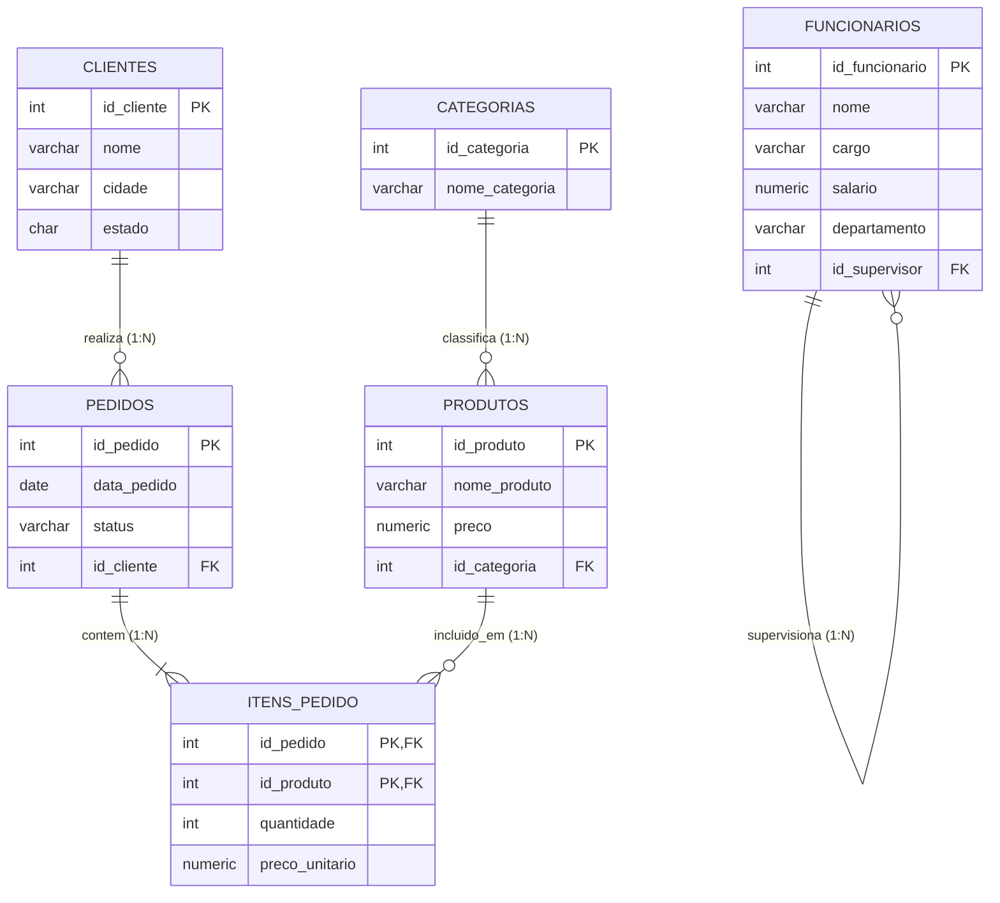

### Exemplo de Implementação DDL
```sql
-- Criação da tabela referenciada (Pai)
CREATE TABLE clientes (
    id_cliente SERIAL PRIMARY KEY,
    nome VARCHAR(100) NOT NULL,
    cidade VARCHAR(100),
    estado CHAR(2)
);

-- Criação da tabela dependente (Filha) com restrição de chave estrangeira
CREATE TABLE pedidos (
    id_pedido SERIAL PRIMARY KEY,
    data_pedido DATE NOT NULL,
    status VARCHAR(30) NOT NULL,
    id_cliente INTEGER REFERENCES clientes(id_cliente)
);
```

### Contraexemplo e Armadilhas
Um erro comum de modelagem consiste em declarar a coluna `id_cliente` na tabela `pedidos` como um simples `INTEGER`, omitindo a cláusula `REFERENCES clientes(id_cliente)`. Nesse cenário, o banco perde a capacidade de fiscalizar a consistência referencial, permitindo a inserção de pedidos "órfãos" vinculados a identificadores inexistentes na tabela de clientes.

---

## Conceito de junção e sintaxe básica da cláusula JOIN com condição ON

### Definição e Motivação
A operação de junção (expressa pelo operador $\bowtie$ na álgebra relacional) combina tuplas de duas relações com base em uma condição lógica predeterminada (Theta-Join). 

Em SQL padrão ANSI/ISO, a junção explícita substitui o antigo padrão ANSI-89 (que declarava tabelas separadas por vírgula no `FROM` e filtros de junção no `WHERE`). A sintaxe moderna separa formalmente a lógica de acoplamento relacional (cláusula `ON`) da lógica de filtragem de domínio (cláusula `WHERE`).

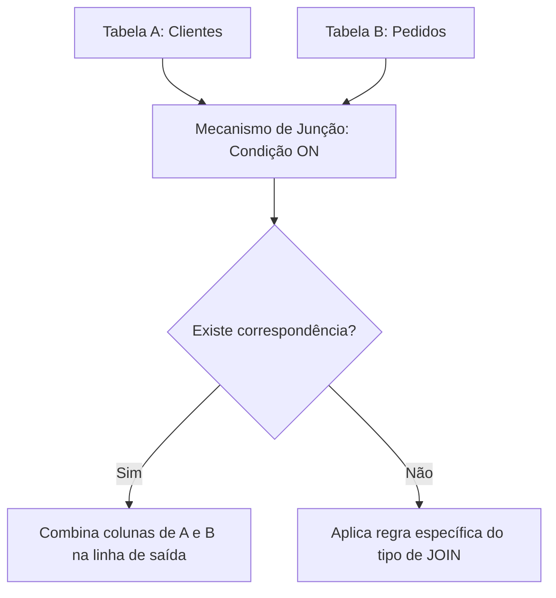

### Sintaxe Básica
```sql
SELECT 
    tabela_a.coluna1, 
    tabela_b.coluna2
FROM tabela_a
JOIN tabela_b 
  ON tabela_a.coluna_chave = tabela_b.coluna_chave;
```

---

## INNER JOIN: mecânica de execução do PostgreSQL e descarte de não correspondências

### Definição
O `INNER JOIN` (ou junção interna) retorna a interseção estrita entre dois conjuntos de dados associados. Uma linha da tabela à esquerda só integrará o resultado se houver correspondência exata com pelo menos uma linha da tabela à direita segundo o predicado definido na cláusula `ON`.

### Mecânica de Execução no PostgreSQL
O otimizador de consultas de custo (*Cost-Based Optimizer* - CBO) do PostgreSQL avalia o volume estatístico das tabelas e seleciona internamente um de três algoritmos fundamentais:
1. **Nested Loop Join:** Percorre a relação externa linha por linha e, para cada registro, faz uma busca (preferencialmente indexada) na relação interna. Eficiente para tabelas pequenas ou junções altamente seletivas.
2. **Hash Join:** Carrega a tabela menor inteiramente na memória RAM em uma tabela hash estruturada sobre a chave de junção; em seguida, varre a tabela maior verificando correspondências imediatas em tempo $O(1)$.
3. **Merge Join:** Exige que ambas as relações estejam ordenadas pelas chaves de junção (via índices ou operação explícita de `SORT`). Em seguida, percorre ambas linearmente de forma paralela.

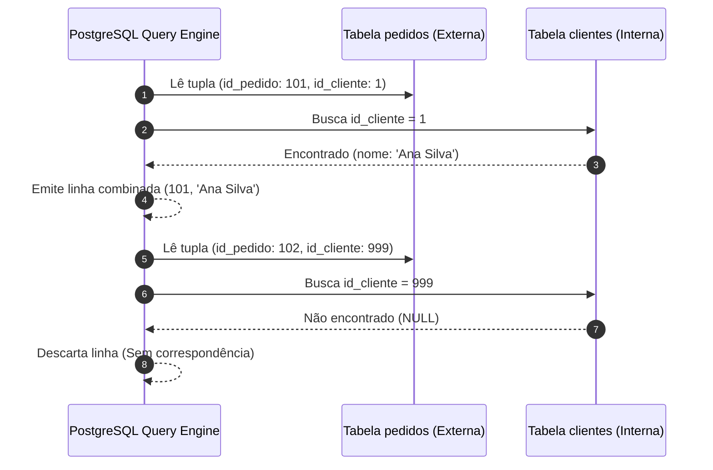

### Exemplo Prático
```sql
SELECT
    p.id_pedido,
    p.data_pedido,
    p.status,
    c.nome AS cliente
FROM pedidos p
INNER JOIN clientes c
    ON p.id_cliente = c.id_cliente;
```

### Tabela Comparativa de Comportamento
| id_pedido | p.id_cliente | c.id_cliente | c.nome | Retornado no INNER JOIN? |
| :--- | :--- | :--- | :--- | :--- |
| 1 | 1 | 1 | Ana Silva | Sim (Correspondência exata) |
| 2 | 2 | 2 | Bruno Souza | Sim (Correspondência exata) |
| 3 | 99 | NULL | NULL | Não (id_cliente 99 inexiste em clientes) |
| NULL | NULL | 3 | Carla Dias | Não (Cliente 3 não possui pedidos) |

---

## Uso de apelidos de tabelas (aliases) para legibilidade e resolução de ambiguidades

### Definição e Motivação
Quando tabelas distintas compartilham nomes de colunas idênticos (por exemplo, `id_cliente` ou `data_cadastro`), o PostgreSQL emite o erro `column reference is ambiguous` caso a coluna seja referenciada sem qualificação. A atribuição de *aliases* (apelidos) no `FROM` e nos blocos `JOIN` viabiliza a desambiguação, simplifica a redação do código e melhora a manutenibilidade.

```sql
-- Erro de compilação SQL: coluna ambígua
-- SELECT id_cliente, nome, data_pedido FROM pedidos JOIN clientes ON id_cliente = id_cliente;

-- Correção estrita com aliases explícitos
SELECT
    p.id_pedido AS codigo_pedido,
    p.data_pedido AS data_emissao,
    c.id_cliente AS codigo_cliente,
    c.nome AS nome_cliente
FROM pedidos AS p
INNER JOIN clientes AS c
    ON p.id_cliente = c.id_cliente;
```

> **Regra de Engenharia:** Em consultas empresariais, adote aliases curtos e mnemônicos baseados nas iniciais das tabelas (`c` para `clientes`, `ip` para `itens_pedido`, `pr` para `produtos`). Evite aliases genéricos como `t1`, `t2`, `a`, `b`, que degradam a legibilidade em instruções com múltiplos acoplamentos.

---

## LEFT JOIN: preservação da relação à esquerda e preenchimento com NULL

### Definição
O `LEFT OUTER JOIN` (ou simplesmente `LEFT JOIN`) garante a preservação integral de todas as tuplas pertencentes à relação posicionada à esquerda da cláusula de junção. Para cada tupla da esquerda que não possua correspondente na relação da direita, as colunas originárias da tabela à direita são preenchidas com o valor nulo (`NULL`).

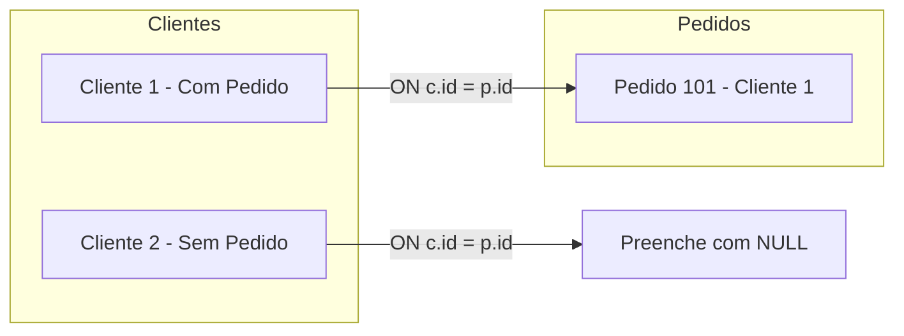

### Exemplo Prático
Exibir todos os clientes cadastrados na empresa, acompanhados de seus respectivos pedidos, sem ocultar clientes recém-cadastrados que ainda não efetuaram compras:

```sql
SELECT
    c.id_cliente,
    c.nome,
    p.id_pedido,
    p.status
FROM clientes c
LEFT JOIN pedidos p
    ON c.id_cliente = p.id_cliente;
```

---

## Identificação de registros sem correspondência (Anti-Join via LEFT JOIN e IS NULL)

### Definição e Motivação
O padrão estrutural de *Anti-Join* tem por finalidade localizar elementos que pertencem exclusivamente ao conjunto $A$ e que não possuem nenhum vínculo com o conjunto $B$ ($A \setminus B$). No PostgreSQL, a forma mais tradicional de implementar um anti-join consiste em utilizar um `LEFT JOIN` combinado com um predicado `WHERE` que filtra valores nulos na chave primária da tabela da direita.

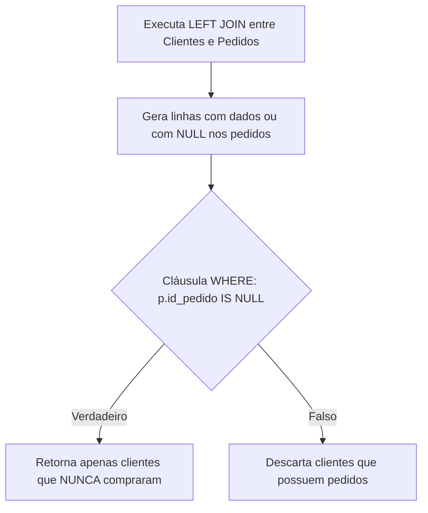

### Exemplo Prático
```sql
SELECT
    c.id_cliente,
    c.nome,
    c.cidade
FROM clientes c
LEFT JOIN pedidos p
    ON c.id_cliente = p.id_cliente
WHERE p.id_pedido IS NULL;
```

### Armadilha Crítica
Filtrar no `WHERE` por uma coluna que já aceite nulos nativamente na tabela da direita (como uma coluna opcional `observacoes`) gerará falsos positivos. 
- **Regra:** A coluna avaliada com `IS NULL` no `WHERE` deve ser categoricamente a **chave primária** da tabela da direita (ou qualquer coluna com restrição `NOT NULL`), assegurando que a nulidade decorreu unicamente da ausência de junção.

---

## Tratamento de valores nulos em junções utilizando a função COALESCE

### Definição
A função escalar `COALESCE(valor_1, valor_2, ..., valor_n)` avalia seus argumentos sequencialmente da esquerda para a direita e retorna o primeiro valor não nulo encontrado. Em consultas que utilizam `LEFT JOIN`, `RIGHT JOIN` ou `FULL OUTER JOIN`, colunas complementares assumem `NULL` com frequência. A função `COALESCE` fornece valores de fallback amigáveis para relatórios e APIs.

```sql
SELECT
    pr.id_produto,
    pr.nome_produto,
    pr.preco,
    COALESCE(ca.nome_categoria, 'Sem categoria') AS categoria
FROM produtos pr
LEFT JOIN categorias ca
    ON pr.id_categoria = ca.id_categoria;
```

### Matriz de Transformação com COALESCE
| Produto | Categoria Real (`ca.nome_categoria`) | `COALESCE(ca.nome_categoria, 'Sem categoria')` |
| :--- | :--- | :--- |
| Teclado Mecânico | Periféricos | Periféricos |
| Mousepad Gamer | Periféricos | Periféricos |
| Webcam Genérica | `NULL` | Sem categoria |

---

## RIGHT JOIN: equivalência operacional e inversão para LEFT JOIN

### Definição
O `RIGHT OUTER JOIN` preserva todos os registros da tabela posicionada à direita da cláusula, preenchendo com `NULL` os campos da tabela à esquerda quando não houver correspondência.

### Equivalência e Inversão
Matematicamente, a operação $A \text{ RIGHT JOIN } B$ é estritamente comutativa a $B \text{ LEFT JOIN } A$. Na indústria de software, o uso do `RIGHT JOIN` é desaconselhado pelos principais guias de estilo SQL (como o padrão de engenharia do PostgreSQL e o guia do GitLab/dbt), uma vez que a leitura ocidental da esquerda para a direita torna as cadeias de junção com `LEFT JOIN` significativamente mais fáceis de compreender.

```sql
-- Sintaxe com RIGHT JOIN (Válida, porém preterida)
SELECT
    p.id_pedido,
    c.id_cliente,
    c.nome
FROM pedidos p
RIGHT JOIN clientes c
    ON p.id_cliente = c.id_cliente;

-- Forma recomendada por padrões de engenharia (Inversão semântica equivalente)
SELECT
    p.id_pedido,
    c.id_cliente,
    c.nome
FROM clientes c
LEFT JOIN pedidos p
    ON c.id_cliente = p.id_cliente;
```

---

## FULL OUTER JOIN: união total de registros, aplicações em auditoria e reconciliação

### Definição
O `FULL OUTER JOIN` (ou simplesmente `FULL JOIN`) preserva a totalidade dos registros de ambas as tabelas. Quando há correspondência, as linhas são combinadas; quando uma linha de qualquer um dos lados não encontra par, o lado faltante é inteiramente preenchido com `NULL`. Trata-se da união completa dos conjuntos ($A \cup B$).

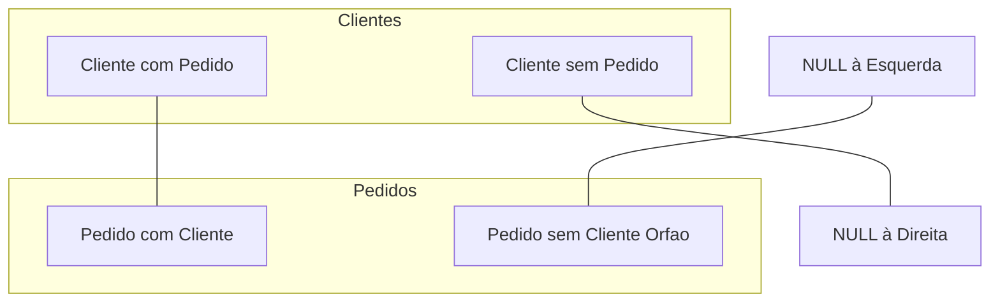

### Exemplo Prático de Auditoria e Reconciliação
Identificar simultaneamente clientes cadastrados que nunca compraram e pedidos corrompidos que perderam o vínculo de integridade com o cliente:

```sql
SELECT
    c.id_cliente AS cli_id,
    c.nome AS cli_nome,
    p.id_pedido AS ped_id,
    p.status AS ped_status
FROM clientes c
FULL OUTER JOIN pedidos p
    ON c.id_cliente = p.id_cliente;
```

### Casos de Uso
1. **Reconciliação Financeira:** Comparar transações registradas no gateway de pagamento externo com os lançamentos contábeis do banco interno.
2. **Processos de Migração:** Validar se bases legadas e novas bases possuem disparidades cadastrais bidirecionais.

---

## CROSS JOIN: produto cartesiano, riscos de volumetria e aplicações práticas

### Definição
O `CROSS JOIN` executa o produto cartesiano estrito entre duas relações ($A \times B$). Cada tupla da relação $A$ é combinada com todas as tuplas da relação $B$. Se a relação $A$ contém $M$ registros e a relação $B$ contém $N$ registros, a projeção resultante terá exatamente $M \times N$ linhas.

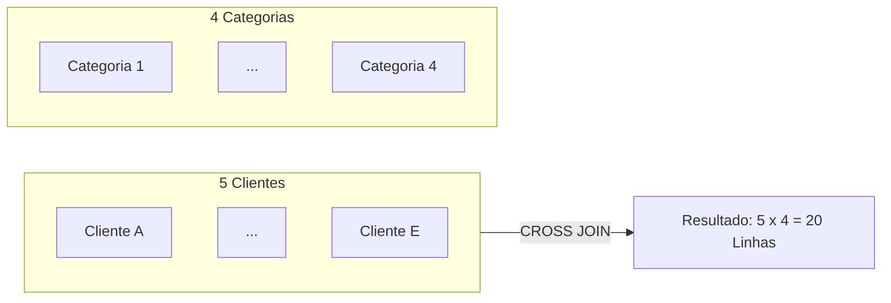

### Risco de Volumetria
Em ambientes corporativos com tabelas volumosas, um produto cartesiano acidental pode saturar a memória temporária do banco (`work_mem`), consumir todo o espaço do subsistema de disco de ordenação temporária e degradar severamente a instância:
$$\text{Total Linhas} = 100.000 \text{ clientes} \times 50.000 \text{ pedidos} = 5.000.000.000 \text{ linhas}$$

### Aplicação Prática Legítima: Geração de Matrizes
Gerar combinações para planejamento, escalas de plantão ou grades de produtos (tamanho $\times$ cor):

```sql
SELECT
    c.nome AS cliente,
    ca.nome_categoria AS categoria
FROM clientes c
CROSS JOIN categorias ca;
```

---

## SELF JOIN: autorrelacionamento para estruturas hierárquicas e recursivas

### Definição
O `SELF JOIN` ocorre quando uma tabela é acoplada consigo mesma. Esta técnica é fundamental para modelar relacionamentos unários ou hierárquicos, como árvores genealógicas, estruturas organizacionais (funcionário e supervisor) ou grafos de dependência (peças e subpeças).

Para o PostgreSQL distinguir as instâncias da mesma tabela, a atribuição de *aliases* distintos é estritamente mandatória.

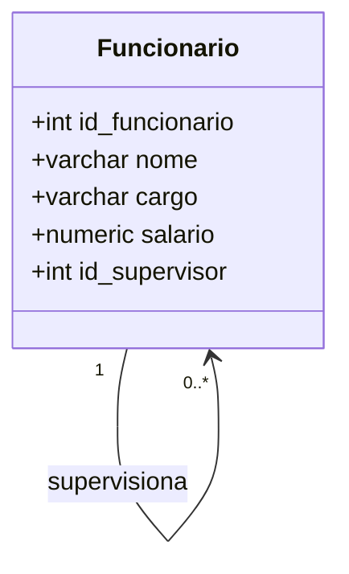

### Exemplo Prático com Hierarquia de Gestão
```sql
SELECT
    f.nome AS funcionario,
    f.cargo AS cargo_funcionario,
    COALESCE(s.nome, 'Sem supervisor (Diretoria)') AS supervisor
FROM funcionarios f
LEFT JOIN funcionarios s
    ON f.id_supervisor = s.id_funcionario;
```

Neste modelo:
- `f` assume o papel de funcionário subordinado.
- `s` assume o papel de supervisor hierárquico.
- O `LEFT JOIN` preserva os diretores e executivos de topo que não possuem supervisor cadastrado (`id_supervisor IS NULL`).

---

## Junções encadeadas com quatro ou mais tabelas e expressões de cálculo por linha

### Definição e Motivação
Em esquemas dimensionais ou transacionais normalizados, a reconstituição completa de uma transação comercial exige percorrer os elos de chave estrangeira ao longo de múltiplas tabelas intermediárias.

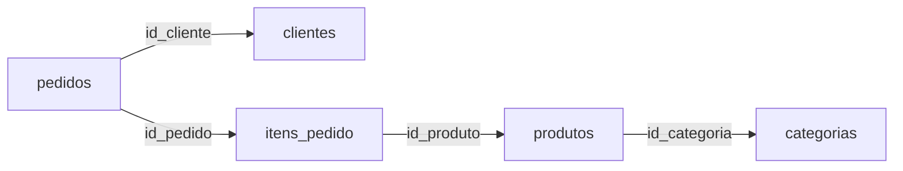

### Exemplo Prático: Detalhamento de Faturamento
A consulta a seguir conecta quatro tabelas e calcula em tempo real o subtotal de cada item vendido:

```sql
SELECT
    p.id_pedido,
    c.nome AS cliente,
    pr.nome_produto,
    ip.quantidade,
    ip.preco_unitario,
    (ip.quantidade * ip.preco_unitario) AS subtotal_calculado
FROM pedidos p
INNER JOIN clientes c
    ON p.id_cliente = c.id_cliente
INNER JOIN itens_pedido ip
    ON p.id_pedido = ip.id_pedido
INNER JOIN produtos pr
    ON ip.id_produto = pr.id_produto;
```

---

## Filtragem e ordenação combinadas com junções: cláusulas WHERE e ORDER BY

### Ciclo de Processamento Lógico da Consulta
Em SQL, as cláusulas não são processadas na ordem em que são digitadas. O fluxo lógico interno segue estritamente a sequência:
1. `FROM` e `JOIN`: Montagem do produto cartesiano filtrado pelas condições `ON`.
2. `WHERE`: Aplicação de predicados de seleção sobre o conjunto gerado no passo 1.
3. `GROUP BY`: Agrupamento de tuplas em baldes relacionais.
4. `HAVING`: Filtragem sobre agregados de grupos.
5. `SELECT`: Projeção de colunas e avaliação de expressões escalares.
6. `ORDER BY`: Ordenação final das tuplas projetadas.
7. `LIMIT` / `OFFSET`: Fatiamento do resultado final.

```sql
SELECT
    p.id_pedido,
    p.data_pedido,
    c.nome AS cliente,
    p.status
FROM pedidos p
INNER JOIN clientes c
    ON p.id_cliente = c.id_cliente
WHERE p.status = 'Pago'
  AND p.data_pedido >= '2026-01-01'
ORDER BY p.data_pedido DESC, c.nome ASC;
```

---

## Agregações sobre dados combinados: GROUP BY, COUNT() e SUM()

### Regras de Projeção em Agrupamentos
Sempre que uma consulta emprega a cláusula `GROUP BY`, qualquer coluna listada na cláusula `SELECT` que **não** esteja envolvida por uma função de agregação (`COUNT`, `SUM`, `AVG`, `MIN`, `MAX`) deve, obrigatoriamente, figurar na cláusula `GROUP BY`.

### Exemplo 1: Quantidade de Pedidos por Cliente (Preservando Clientes com Zero Pedidos)
```sql
SELECT
    c.id_cliente,
    c.nome,
    COUNT(p.id_pedido) AS quantidade_pedidos
FROM clientes c
LEFT JOIN pedidos p
    ON c.id_cliente = p.id_cliente
GROUP BY c.id_cliente, c.nome
ORDER BY quantidade_pedidos DESC;
```
> **Atenção:** Utilizar `COUNT(p.id_pedido)` conta exclusivamente os identificadores de pedidos não nulos. Se fosse utilizado `COUNT(*)`, clientes sem compras retornariam a contagem incorreta `1` (pois a linha combinada preenchida com nulos conta como uma tupla do resultado).

### Exemplo 2: Valor Total Consolidado por Pedido
```sql
SELECT
    p.id_pedido,
    c.nome AS cliente,
    SUM(ip.quantidade * ip.preco_unitario) AS valor_total_pedido
FROM pedidos p
INNER JOIN clientes c
    ON p.id_cliente = c.id_cliente
INNER JOIN itens_pedido ip
    ON p.id_pedido = ip.id_pedido
GROUP BY p.id_pedido, c.nome
ORDER BY valor_total_pedido DESC;
```

---

## Ponto crítico semântico: filtragem na cláusula ON versus filtragem no WHERE em Outer Joins

Este é um dos tópicos mais críticos em engenharia de banco de dados e motivo frequente de erros em produção.

### Filtro no WHERE em um LEFT JOIN
A cláusula `WHERE` é avaliada **após** a realização do `LEFT JOIN`. Caso a condição envolva colunas da tabela da direita, os registros da esquerda preenchidos com `NULL` serão desqualificados, degradando silenciosamente o `LEFT JOIN` para um `INNER JOIN`.

```sql
-- COMPORTAMENTO EQUIVOCADO: O filtro p.status = 'Pago' elimina clientes sem pedidos!
SELECT
    c.nome,
    p.id_pedido,
    p.status
FROM clientes c
LEFT JOIN pedidos p
    ON c.id_cliente = p.id_cliente
WHERE p.status = 'Pago';
```

### Filtro no ON em um LEFT JOIN
Quando a condição reside na cláusula `ON`, ela determina apenas quais registros da tabela da direita serão acoplados. Todos os registros da tabela da esquerda continuam presentes no resultado, independentemente da correspondência.

```sql
-- COMPORTAMENTO CORRETO: Todos os clientes aparecem; 
-- para clientes sem pedidos pagos, o pedido vem como NULL.
SELECT
    c.nome,
    p.id_pedido,
    p.status
FROM clientes c
LEFT JOIN pedidos p
    ON c.id_cliente = p.id_cliente
   AND p.status = 'Pago';
```

### Comparativo Lógico
| Posição da Condição | Clientes Sem Pedidos Aparecem? | Pedidos com outros status aparecem? | Semântica Final Resultante |
| :--- | :--- | :--- | :--- |
| `ON p.status = 'Pago'` | Sim (com `NULL` nos campos do pedido) | Não | `LEFT JOIN` condicional preservado |
| `WHERE p.status = 'Pago'` | Não (eliminados pelo filtro pós-junção) | Não | Converte-se em `INNER JOIN` |

---

## Sintaxes de simplificação no PostgreSQL: cláusula USING e desaconselhamento do NATURAL JOIN

### A Cláusula USING
Quando duas tabelas relacionadas compartilham exatamente o mesmo nome para as colunas de chave, a cláusula `USING (coluna)` simplifica a declaração:

```sql
SELECT
    p.id_pedido,
    c.nome
FROM pedidos p
INNER JOIN clientes c USING (id_cliente);
```
O PostgreSQL projeta a coluna `id_cliente` uma única vez no escopo da consulta, dispensando a necessidade de qualificar `p.id_cliente` ou `c.id_cliente`.

### Por que desaconselhar o NATURAL JOIN na Engenharia de Software?
O `NATURAL JOIN` inspeciona os metadados do esquema e une automaticamente todas as colunas homônimas entre as duas tabelas:

```sql
-- ANTIPATTERN GRAVE: Não recomendado para sistemas reais
SELECT *
FROM pedidos
NATURAL JOIN clientes;
```

**Motivos para banir o NATURAL JOIN em sistemas corporativos:**
1. **Quebra Frágil por Alteração de Esquema:** Caso o desenvolvedor adicione uma coluna de controle como `data_atualizacao` ou `criado_em` em ambas as tabelas com intenções semânticas distintas, o `NATURAL JOIN` incorporará silenciosamente essas novas colunas à condição de junção, gerando resultados vazios ou corrompidos sem levantar erro explícito.
2. **Falta de Clareza e Auditabilidade:** Dificulta a leitura do código por revisores, violando o princípio do design de software explícito.

---

## Erros comuns em junções: produto cartesiano acidental, colunas ambíguas e antipattern SELECT *

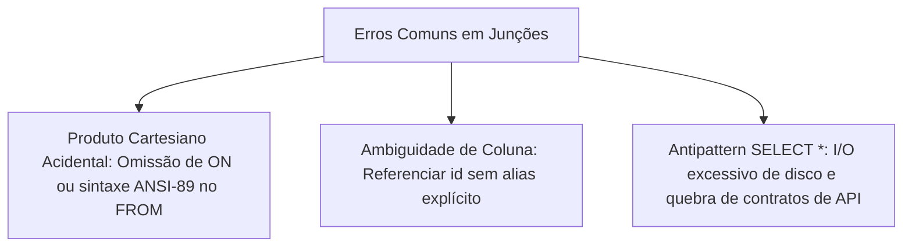

### Detalhamento dos Erros
1. **Sintaxe ANSI-89 Acidental:**
   ```sql
   -- INCORRETO: Gera produto cartesiano integral
   SELECT * FROM clientes, pedidos;
   ```
2. **Ambiguidade de Chaves:**
   ```sql
   -- INCORRETO: Erro: column reference "id_cliente" is ambiguous
   SELECT id_cliente, nome FROM clientes c JOIN pedidos p ON c.id_cliente = p.id_cliente;
   ```
3. **Uso de SELECT * em Junções Múltiplas:**
   - Projeta colunas redundantes de chaves primárias e estrangeiras homônimas.
   - Aumenta drasticamente o tráfego de rede e o consumo de memória no servidor.
   - Impede o uso de índices de cobertura (*Index-Only Scans*).

---

## Fundamentos de subconsultas: consulta interna versus consulta externa

### Definição
Uma subconsulta (*subselect* ou *subquery*) consiste em uma instrução `SELECT` aninhada no corpo de outra instrução SQL (denominada consulta externa ou *outer query*).

```sql
-- Consulta externa
SELECT nome_produto, preco
FROM produtos
WHERE preco > (
    -- Subconsulta (Consulta interna)
    SELECT AVG(preco)
    FROM produtos
);
```

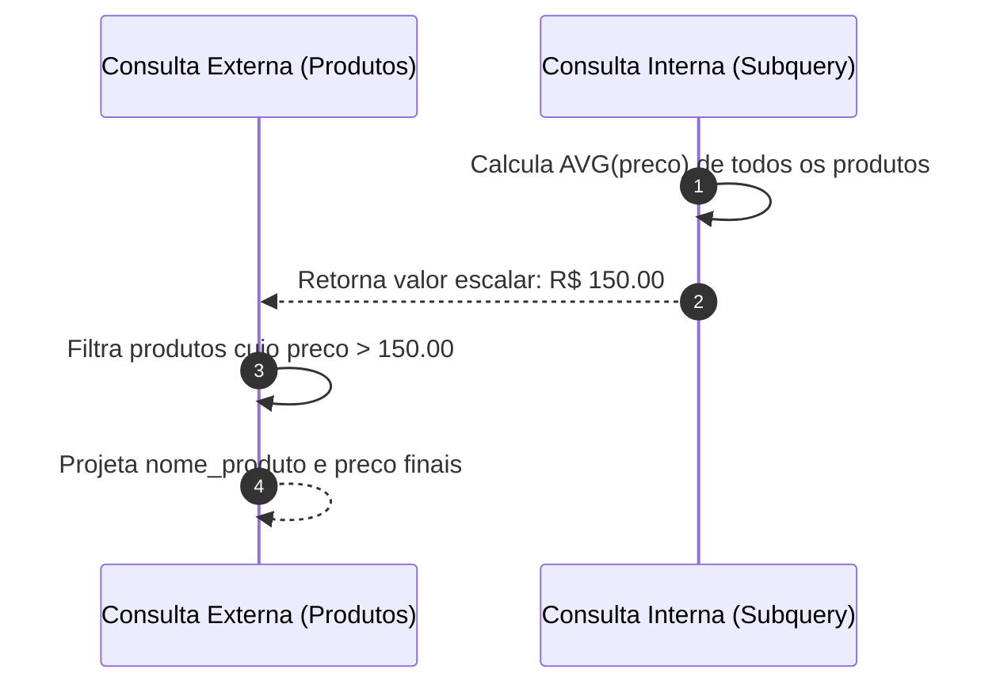

---

## Classificação de subconsultas: escalares, coluna única/múltiplas linhas, tabulares e correlacionadas

O mecanismo de execução do PostgreSQL impõe que os operadores de comparação da consulta externa sejam matematicamente compatíveis com a dimensionalidade do resultado produzido pela subconsulta:

| Categoria | Cardinalidade Linhas | Cardinalidade Colunas | Operadores Compatíveis | Exemplo de Aplicação |
| :--- | :--- | :--- | :--- | :--- |
| **Escalar** | Exatamente 1 | Exatamente 1 | `=`, `<>`, `>`, `<`, `>=`, `<=` | Comparações aritméticas com médias, mínimos e máximos globais. |
| **Coluna Única / Múltiplas Linhas** | $N$ linhas ($N \ge 0$) | Exatamente 1 | `IN`, `NOT IN`, `ANY`, `ALL`, `EXISTS` | Checagem de pertinência de chaves em listas dinâmicas. |
| **Tabular (Derivada)** | $N$ linhas ($N \ge 0$) | $M$ colunas ($M \ge 1$) | Cláusula `FROM`, `JOIN`, `WITH` | Construção de visões temporárias e tabelas calculadas em tempo de execução. |
| **Correlacionada** | Variável | Variável | Depende da cláusula e operador utilizado | A subconsulta referencia variáveis/colunas da linha corrente da consulta externa. |

---

## Subconsultas escalares em expressões de filtro (WHERE) e colunas calculadas (SELECT)

### No Filtro WHERE: Obtenção de Extremos e Empates
Uma vantagem fundamental de usar uma subconsulta escalar em vez de ordenação com `LIMIT 1` reside no tratamento rigoroso de empates:

```sql
-- Retorna todos os produtos que dividem o valor máximo histórico
SELECT id_produto, nome_produto, preco
FROM produtos
WHERE preco = (
    SELECT MAX(preco)
    FROM produtos
);
```
*(Se utilizássemos `ORDER BY preco DESC LIMIT 1`, perderíamos produtos com preços idênticos).*

### Na Projeção SELECT: Colunas Métricas Comparativas
```sql
SELECT
    nome_produto,
    preco,
    (SELECT AVG(preco) FROM produtos) AS media_global,
    preco - (SELECT AVG(preco) FROM produtos) AS desvio_da_media
FROM produtos
ORDER BY desvio_da_media DESC;
```

---

## Operador IN e subconsultas de lista de valores

### Definição e Motivação
O operador `IN` avalia se um atributo da consulta externa é igual a qualquer elemento pertencente ao conjunto unidimensional retornado pela consulta interna. Trata-se de uma disjunção lógica sucessiva ($x = v_1 \lor x = v_2 \lor \dots \lor x = v_n$).

```sql
SELECT id_cliente, nome, cidade
FROM clientes
WHERE id_cliente IN (
    SELECT id_cliente
    FROM pedidos
);
```

---

## Operador NOT IN e a armadilha do Three-Valued Logic com valores NULL

### O Problema do Modelo Trivalente (Three-Valued Logic)
No padrão SQL fundamentado na lógica de Kleene, o valor `NULL` representa a ausência de informação ou estado desconhecido (*UNKNOWN*). Operações booleanas com `UNKNOWN` obedecem a regras estritas:

$$\text{TRUE} \land \text{UNKNOWN} \implies \text{UNKNOWN}$$
$$\text{FALSE} \land \text{UNKNOWN} \implies \text{FALSE}$$
$$\text{NOT}(\text{UNKNOWN}) \implies \text{UNKNOWN}$$

Quando declaramos a expressão:
$$x \text{ NOT IN } (v_1, v_2, \dots, v_n)$$
O compilador SQL a expande logicamente como:
$$(x \ne v_1) \land (x \ne v_2) \land \dots \land (x \ne v_n)$$

Caso **um único elemento** retornado pela subconsulta seja `NULL`, a expressão conterá o termo $(x \ne \text{NULL})$, cuja avaliação é **UNKNOWN**. Como a cláusula `WHERE` exige obrigatoriamente um resultado estritamente **TRUE** para admitir a tupla na saída, a presença de uma única linha nula na subconsulta fará a consulta externa retornar um resultado **vazio**, mascarando registros legítimos.

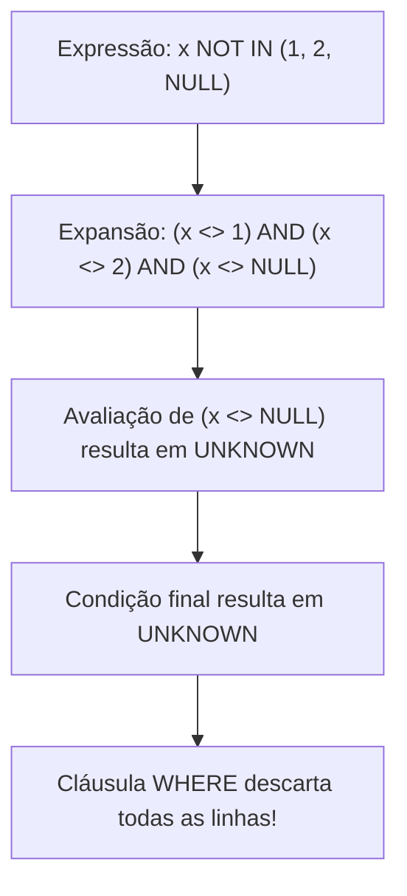

### Soluções de Engenharia
```sql
-- Abordagem 1: Filtragem explícita de nulidade na subconsulta
SELECT nome
FROM clientes
WHERE id_cliente NOT IN (
    SELECT id_cliente
    FROM pedidos
    WHERE id_cliente IS NOT NULL
);

-- Abordagem 2 (Altamente Recomendada): Uso de NOT EXISTS (Imune a NULLs)
SELECT c.nome
FROM clientes c
WHERE NOT EXISTS (
    SELECT 1
    FROM pedidos p
    WHERE p.id_cliente = c.id_cliente
);
```

---

## Operadores de existência: semântica de curto-circuito com EXISTS e NOT EXISTS (SELECT 1)

### Mecanismo de Curto-Circuito (Short-Circuit)
O operador `EXISTS` avalia se a subconsulta produz pelo menos uma tupla. O motor do PostgreSQL otimiza essa checagem via semântica de curto-circuito: no instante em que a primeira linha correspondente é encontrada, a execução da subconsulta interna para aquela tupla externa é imediatamente interrompida com retorno booleano `TRUE`.

### Por que padronizar `SELECT 1`?
```sql
SELECT c.id_cliente, c.nome
FROM clientes c
WHERE EXISTS (
    SELECT 1
    FROM pedidos p
    WHERE p.id_cliente = c.id_cliente
);
```
O uso da constante literal `1` em `SELECT 1` explicita para o leitor do código que os atributos projetados pela subconsulta são completamente irrelevantes para o teste lógico; apenas a existência da linha no índice ou na tabela importa. O otimizador do PostgreSQL ignora a lista de projeção interna em blocos `EXISTS`.

---

## Operadores quantificadores universais e existenciais: ANY e ALL

### Operador ANY (Quantificador Existencial)
A condição `valor operador ANY (subquery)` é verdadeira se a comparação for válida para **pelo menos um** dos valores retornados pela subconsulta. A expressão `= ANY (...)` equivale formalmente ao operador `IN`.

```sql
-- Produtos cujo preço seja superior a pelo menos um produto da categoria 4
SELECT nome_produto, preco
FROM produtos
WHERE preco > ANY (
    SELECT preco
    FROM produtos
    WHERE id_categoria = 4
);
```

### Operador ALL (Quantificador Universal)
A condição `valor operador ALL (subquery)` é verdadeira se e somente se a comparação for satisfeita para **todos** os elementos do conjunto.

```sql
-- Produtos cujo preço supere simultaneamente todos os produtos da categoria 4
SELECT nome_produto, preco
FROM produtos
WHERE preco > ALL (
    SELECT preco
    FROM produtos
    WHERE id_categoria = 4
);
```

### Tabela de Equivalências Lógicas
| Expressão Quantificada | Expressão Equivalente com Agregação Escalar |
| :--- | :--- |
| `preco > ANY (subquery)` | `preco > (SELECT MIN(preco) FROM ...)` |
| `preco > ALL (subquery)` | `preco > (SELECT MAX(preco) FROM ...)` |
| `preco = ANY (subquery)` | `preco IN (subquery)` |

---

## Subconsultas correlacionadas: dependência contextual e ciclo de reavaliação linha a linha

### Definição
Uma subconsulta é denominada correlacionada quando suas condições internas fazem referência a colunas fornecidas pela linha em processamento da consulta externa. Em termos conceituais, a subconsulta não pode ser executada isoladamente de forma autônoma; ela recebe parâmetros dinâmicos da consulta externa.

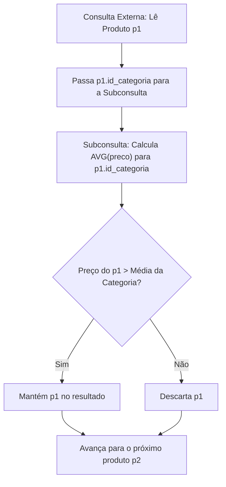

### Exemplo Prático: Preços Acima da Média do Próprio Segmento
```sql
SELECT 
    p1.id_produto,
    p1.nome_produto,
    p1.preco,
    p1.id_categoria
FROM produtos p1
WHERE p1.preco > (
    SELECT AVG(p2.preco)
    FROM produtos p2
    WHERE p2.id_categoria = p1.id_categoria
);
```

---

## Subconsultas na cláusula FROM (tabelas derivadas) e obrigatoriedade de alias no PostgreSQL

### Definição e Obrigatoriedade Sintática
Uma subconsulta empregada na cláusula `FROM` atua como uma visão temporária ou tabela em memória criada exclusivamente durante a execução da instrução.

No PostgreSQL, toda tabela derivada definida no `FROM` **deve receber obrigatoriamente um alias**. A omissão do alias dispara a exceção SQL `ERROR: subquery in FROM must have an alias`.

```sql
SELECT
    resumo.id_cliente,
    resumo.total_pedidos
FROM (
    SELECT 
        id_cliente,
        COUNT(*) AS total_pedidos
    FROM pedidos
    GROUP BY id_cliente
) AS resumo
WHERE resumo.total_pedidos > 1;
```

---

## Filtragem de grupos agregados com subconsultas na cláusula HAVING

### Motivação
A cláusula `WHERE` filtra tuplas atômicas antes do agrupamento; a cláusula `HAVING` filtra os grupos de tuplas consolidados pelo `GROUP BY`. A incorporação de subconsultas no `HAVING` possibilita comparar métricas de grupos contra indicadores agregados globais.

```sql
-- Localizar clientes cujo número de pedidos supera a média geral de pedidos por cliente
SELECT 
    id_cliente, 
    COUNT(*) AS total_pedidos_cliente
FROM pedidos
GROUP BY id_cliente
HAVING COUNT(*) > (
    SELECT AVG(contagem_individual)
    FROM (
        SELECT COUNT(*) AS contagem_individual
        FROM pedidos
        GROUP BY id_cliente
    ) AS distribuicao_pedidos
);
```

---

## Subconsultas aplicadas a comandos de modificação de dados (DML): INSERT ... SELECT, UPDATE e DELETE

Subconsultas viabilizam a automação de manipulação de dados em massa com base em regras analíticas complexas:

### 1. Inserção Baseada em Conjuntos (INSERT ... SELECT)
```sql
-- Carga em tabela analítica de clientes VIP
INSERT INTO clientes_vip (id_cliente, nome, total_comprado)
SELECT
    c.id_cliente,
    c.nome,
    (
        SELECT SUM(ip.quantidade * ip.preco_unitario)
        FROM pedidos p
        JOIN itens_pedido ip ON ip.id_pedido = p.id_pedido
        WHERE p.id_cliente = c.id_cliente
    ) AS total_acumulado
FROM clientes c;
```

### 2. Atualização Dinâmica (UPDATE com Subconsulta)
```sql
-- Aplicar reajuste inflacionário de 10% aos produtos de Informática
UPDATE produtos
SET preco = preco * 1.10
WHERE id_categoria = (
    SELECT id_categoria
    FROM categorias
    WHERE nome_categoria = 'Informática'
);
```

### 3. Exclusão Cirúrgica Defensiva (DELETE com NOT EXISTS)
```sql
-- Exclusão de clientes inativos que nunca emitiram pedidos
BEGIN;

DELETE FROM clientes c
WHERE NOT EXISTS (
    SELECT 1
    FROM pedidos p
    WHERE p.id_cliente = c.id_cliente
);

-- Recomenda-se validar as tuplas afetadas antes de efetivar
COMMIT;
```

---

## Critérios de decisão de engenharia: Subconsulta versus JOIN

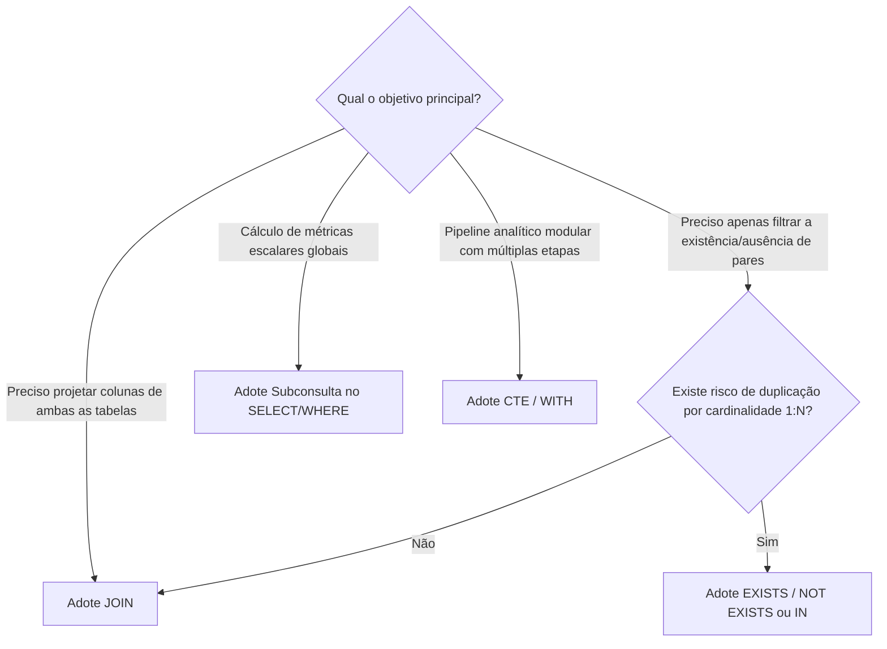

### Quadro Comparativo de Decisão Arquitetural
| Critério | JOIN | Subconsulta (IN / EXISTS) | Expressão de Tabela Comum (CTE) |
| :--- | :--- | :--- | :--- |
| **Projeção de Colunas** | Permite projetar atributos de todas as entidades associadas. | Permite projetar colunas apenas da consulta externa. | Permite projetar colunas selecionadas das etapas nomeadas. |
| **Risco de Multiplicação de Linhas** | Alto em relacionamentos 1:N (exige `DISTINCT` ou agregações adicionais). | Nulo (operadores `EXISTS` e `IN` não multiplicam as tuplas externas). | Nulo ou controlado pela forma com que a CTE é acoplada. |
| **Legibilidade em Consultas Profundas** | Médio (cadeias longas com 5+ tabelas tornam-se densas). | Baixo em subconsultas com múltiplos aninhamentos. | **Excelente** (lógica dividida em passos lineares legíveis). |

---

## Organização e legibilidade com Common Table Expressions (CTE / WITH)

### Definição
Uma Expressão de Tabela Comum (*Common Table Expression* - CTE) define um conjunto de resultados temporário e nomeado, delimitado pela cláusula `WITH`. As CTEs atuam como blocos modulares que eliminam aninhamentos profundos e tornam consultas analíticas autoexplicativas.

```sql
WITH resumo_pedidos_cliente AS (
    SELECT 
        id_cliente,
        COUNT(*) AS total_pedidos,
        MAX(data_pedido) AS data_ultimo_pedido
    FROM pedidos
    GROUP BY id_cliente
)
SELECT
    c.id_cliente,
    c.nome,
    r.total_pedidos,
    r.data_ultimo_pedido
FROM clientes c
INNER JOIN resumo_pedidos_cliente r
    ON c.id_cliente = r.id_cliente
ORDER BY r.total_pedidos DESC;
```

> **[Complemento de Engenharia de Software]:** A partir do PostgreSQL 12, o otimizador realiza a fusão (*inlining*) automática de CTEs não recursivas da mesma forma que faria com subconsultas comuns no `FROM`, a menos que o desenvolvedor utilize explicitamente a instrução `WITH nome AS MATERIALIZED (...)`.

---

## Diagnóstico e análise de planos de execução de subconsultas com EXPLAIN ANALYZE

### Compreensão dos Nós de Execução
Para compreender como o PostgreSQL executa junções e subconsultas internamente, a ferramenta primária é a instrução `EXPLAIN ANALYZE`:
- `EXPLAIN`: Retorna o plano gerado pelo otimizador de custos com base nas estatísticas das tabelas (`pg_statistic`).
- `ANALYZE`: Executa a consulta no banco de dados e exibe o tempo real de CPU e o número exato de tuplas processadas.

```sql
EXPLAIN ANALYZE
SELECT c.nome
FROM clientes c
WHERE EXISTS (
    SELECT 1
    FROM pedidos p
    WHERE p.id_cliente = c.id_cliente
);
```

### Leitura Típica de Saída do EXPLAIN
```text
Hash Semi Join  (cost=1.05..2.15 rows=10 width=32) (actual time=0.035..0.048 rows=8 loops=1)
  Hash Cond: (c.id_cliente = p.id_cliente)
  ->  Seq Scan on clientes c  (cost=0.00..1.10 rows=10 width=36) (actual time=0.008..0.010 rows=10 loops=1)
  ->  Hash  (cost=1.02..1.02 rows=2 width=4) (actual time=0.015..0.015 rows=2 loops=1)
        Buckets: 1024  Batches: 1  Memory Usage: 9kB
        ->  Seq Scan on pedidos p  (cost=0.00..1.02 rows=2 width=4) (actual time=0.005..0.006 rows=2 loops=1)
Planning Time: 0.120 ms
Execution Time: 0.082 ms
```
*Interpretação:* O PostgreSQL converteu internamente o operador `EXISTS` em um algoritmo de **Hash Semi Join**. O semi-join garante a junção com busca na tabela hash sem duplicar as linhas da tabela de clientes, confirmando a alta eficiência do plano escolhido pelo motor.

---

## Código da aula

Os scripts SQL que complementam esta aula encontram-se estruturados na pasta [`./codigo/`](file:///Users/murilodev/.gemini/antigravity-cli/scratch/codigo/):

### 1. [`./codigo/schema_vendas.sql`](file:///Users/murilodev/.gemini/antigravity-cli/scratch/codigo/schema_vendas.sql)
Script DDL de criação e povoamento das tabelas do modelo de vendas utilizado em aula. Cria as tabelas `clientes`, `pedidos`, `itens_pedido`, `produtos`, `categorias` e `funcionarios`, contendo chaves primárias, estrangeiras e registros de teste estrategicamente desenhados para exercitar correspondências parciais, nulas e integridade hierárquica.

```sql
-- Trecho essencial: integridade referencial e chaves compostas
CREATE TABLE itens_pedido (
    id_pedido INTEGER REFERENCES pedidos(id_pedido) ON DELETE CASCADE,
    id_produto INTEGER REFERENCES produtos(id_produto),
    quantidade INTEGER NOT NULL CHECK (quantidade > 0),
    preco_unitario NUMERIC(10,2) NOT NULL CHECK (preco_unitario >= 0),
    PRIMARY KEY (id_pedido, id_produto)
);
```

### 2. [`./codigo/exemplos_aula.sql`](file:///Users/murilodev/.gemini/antigravity-cli/scratch/codigo/exemplos_aula.sql)
Reúne e documenta todos os exemplos apresentados nos slides: junções `INNER`, `LEFT`, `RIGHT`, `FULL`, `CROSS` e `SELF JOIN`, bem como os padrões de subconsultas escalares, `IN`, `NOT IN`, `EXISTS`, `NOT EXISTS`, `ANY`, `ALL` e tabelas derivadas com CTEs.

### 3. [`./codigo/resolucao_exercicios.sql`](file:///Users/murilodev/.gemini/antigravity-cli/scratch/codigo/resolucao_exercicios.sql)
Contém a codificação e resolução integral de todos os exercícios de fixação e de aprofundamento propostos pelo Prof. Welington Garcia, com comentários técnicos linha a linha.

### 4. [`./codigo/atividade_biblioteca.sql`](file:///Users/murilodev/.gemini/antigravity-cli/scratch/codigo/atividade_biblioteca.sql)
Implementa integralmente a atividade prática do Sistema de Biblioteca: criação das tabelas `autores`, `livros`, `leitores` e `emprestimos`, inserção dos dados de teste com casos limites obrigatórios e as consultas exigidas via junções e subconsultas.

---

## Exercícios

### Exercício 1 (JOINs - Inicial): Detalhamento Básico de Pedidos
- **Enunciado:** Exiba código, data, status e nome do cliente de cada pedido.
- **Raciocínio:** Cada pedido obrigatoriamente referencia um cliente via chave estrangeira. A junção natural para resgatar dados correspondentes é o `INNER JOIN`.
- **Resolução:**
```sql
SELECT
    p.id_pedido,
    p.data_pedido,
    p.status,
    c.nome AS cliente
FROM pedidos p
INNER JOIN clientes c
    ON p.id_cliente = c.id_cliente;
```

---

### Exercício 2 (JOINs - Inicial): Listagem Completa de Clientes
- **Enunciado:** Exiba todos os clientes cadastrados, inclusive aqueles que ainda não realizaram pedidos.
- **Raciocínio:** Devemos preservar a totalidade da entidade `clientes`. Aplica-se `LEFT JOIN` com `clientes` à esquerda.
- **Resolução:**
```sql
SELECT
    c.id_cliente,
    c.nome,
    p.id_pedido,
    p.status
FROM clientes c
LEFT JOIN pedidos p
    ON c.id_cliente = p.id_cliente;
```

---

### Exercício 3 (JOINs - Inicial): Identificação de Clientes sem Compras
- **Enunciado:** Exiba somente os clientes que nunca realizaram nenhum pedido.
- **Raciocínio:** Padrão Anti-Join. Realiza-se um `LEFT JOIN` e filtra-se no `WHERE` os registros onde a chave primária da tabela da direita resultou em `NULL`.
- **Resolução:**
```sql
SELECT
    c.id_cliente,
    c.nome,
    c.cidade
FROM clientes c
LEFT JOIN pedidos p
    ON c.id_cliente = p.id_cliente
WHERE p.id_pedido IS NULL;
```

---

### Exercício 4 (JOINs - Inicial): Catálogo de Produtos e Categorias
- **Enunciado:** Exiba todos os produtos e suas respectivas categorias, inclusive aqueles que não possuem categoria vinculada.
- **Raciocínio:** A entidade `produtos` deve ser preservada integralmente; utiliza-se `LEFT JOIN` apontando para `categorias` e `COALESCE` para tratamento amigável.
- **Resolução:**
```sql
SELECT
    pr.id_produto,
    pr.nome_produto,
    pr.preco,
    COALESCE(ca.nome_categoria, 'Sem Categoria') AS categoria
FROM produtos pr
LEFT JOIN categorias ca
    ON pr.id_categoria = ca.id_categoria;
```

---

### Exercício 5 (JOINs - Intermediário): Subtotal de Itens do Pedido
- **Enunciado:** Calcule o subtotal de cada item vendido em cada pedido.
- **Raciocínio:** Relaciona-se `pedidos`, `clientes`, `itens_pedido` e `produtos`, multiplicando `quantidade` por `preco_unitario`.
- **Resolução:**
```sql
SELECT
    p.id_pedido,
    c.nome AS cliente,
    pr.nome_produto,
    ip.quantidade,
    ip.preco_unitario,
    (ip.quantidade * ip.preco_unitario) AS subtotal
FROM pedidos p
INNER JOIN clientes c ON p.id_cliente = c.id_cliente
INNER JOIN itens_pedido ip ON p.id_pedido = ip.id_pedido
INNER JOIN produtos pr ON ip.id_produto = pr.id_produto;
```

---

### Exercício 6 (JOINs - Intermediário): Contagem de Pedidos por Cliente
- **Enunciado:** Conte quantos pedidos cada cliente realizou até o momento.
- **Raciocínio:** Deve-se usar `LEFT JOIN` com `COUNT(p.id_pedido)` agrupado pelos atributos do cliente para garantir que clientes sem pedidos exibam o valor `0`.
- **Resolução:**
```sql
SELECT
    c.id_cliente,
    c.nome,
    COUNT(p.id_pedido) AS total_pedidos
FROM clientes c
LEFT JOIN pedidos p
    ON c.id_cliente = p.id_cliente
GROUP BY c.id_cliente, c.nome
ORDER BY total_pedidos DESC;
```

---

### Exercício 7 (JOINs - Intermediário): Faturamento Consolidado por Pedido
- **Enunciado:** Calcule o valor total monetário de cada pedido emitido.
- **Raciocínio:** Agrupa-se por identificador de pedido e nome de cliente, aplicando a função agregadora `SUM()` sobre o produto dos itens.
- **Resolução:**
```sql
SELECT
    p.id_pedido,
    c.nome AS cliente,
    SUM(ip.quantidade * ip.preco_unitario) AS valor_total_pedido
FROM pedidos p
INNER JOIN clientes c ON p.id_cliente = c.id_cliente
INNER JOIN itens_pedido ip ON p.id_pedido = ip.id_pedido
GROUP BY p.id_pedido, c.nome
ORDER BY valor_total_pedido DESC;
```

---

### Exercício 8 (JOINs - Intermediário): Matriz de Supervisão Hierárquica
- **Enunciado:** Exiba o nome de cada funcionário e o nome de seu respectivo supervisor.
- **Raciocínio:** Tabela auto-relacionada (`SELF JOIN`). Utiliza-se `LEFT JOIN` para não descartar a chefia de topo.
- **Resolução:**
```sql
SELECT
    f.nome AS funcionario,
    f.cargo,
    COALESCE(s.nome, 'Diretor Geral / Sem Supervisor') AS supervisor
FROM funcionarios f
LEFT JOIN funcionarios s
    ON f.id_supervisor = s.id_funcionario;
```

---

### Exercício 9 (Atividade Prática Biblioteca): Modelagem e Carga com Casos Limites
- **Enunciado:** Construir o banco de dados da biblioteca com as tabelas `autores`, `livros`, `leitores` e `emprestimos`. Povoar com: 5 autores, 8 livros, 5 leitores, 6 empréstimos, contemplando obrigatoriamente: autor sem livro, livro nunca emprestado e leitor sem empréstimo.
- **Resolução:**
```sql
-- DDL
CREATE TABLE autores (
    id_autor SERIAL PRIMARY KEY,
    nome VARCHAR(100) NOT NULL,
    nacionalidade VARCHAR(50)
);

CREATE TABLE livros (
    id_livro SERIAL PRIMARY KEY,
    titulo VARCHAR(150) NOT NULL,
    ano_publicacao INTEGER,
    id_autor INTEGER REFERENCES autores(id_autor)
);

CREATE TABLE leitores (
    id_leitor SERIAL PRIMARY KEY,
    nome VARCHAR(100) NOT NULL,
    email VARCHAR(100)
);

CREATE TABLE emprestimos (
    id_emprestimo SERIAL PRIMARY KEY,
    id_livro INTEGER REFERENCES livros(id_livro),
    id_leitor INTEGER REFERENCES leitores(id_leitor),
    data_emprestimo DATE NOT NULL,
    data_devolucao DATE -- NULL representa empréstimo em aberto
);

-- Carga de Testes DML
INSERT INTO autores (nome, nacionalidade) VALUES
('Machado de Assis', 'Brasileira'),     -- id: 1
('Clarice Lispector', 'Brasileira'),    -- id: 2
('George Orwell', 'Britânica'),         -- id: 3
('Gabriel García Márquez', 'Colombiana'),-- id: 4
('Autor Sem Livro', 'Desconhecida');    -- id: 5 (Caso Especial 1)

INSERT INTO livros (titulo, ano_publicacao, id_autor) VALUES
('Dom Casmurro', 1899, 1),              -- id: 1
('Memórias Póstumas', 1881, 1),         -- id: 2
('A Hora da Estrela', 1977, 2),         -- id: 3
('Perto do Coração Selvagem', 1942, 2), -- id: 4
('1984', 1949, 3),                      -- id: 5
('A Revolução dos Bichos', 1945, 3),    -- id: 6
('Cem Anos de Solidão', 1967, 4),       -- id: 7
('Livro Nunca Emprestado', 2024, 4);   -- id: 8 (Caso Especial 2)

INSERT INTO leitores (nome, email) VALUES
('Carlos Drummond', 'carlos@email.com'), -- id: 1
('Cecília Meireles', 'cecilia@email.com'),-- id: 2
('Manuel Bandeira', 'manuel@email.com'), -- id: 3
('Graciliano Ramos', 'graciliano@email.com'),-- id: 4
('Leitor Sem Empréstimo', 'leitor5@email.com'); -- id: 5 (Caso Especial 3)

INSERT INTO emprestimos (id_livro, id_leitor, data_emprestimo, data_devolucao) VALUES
(1, 1, '2026-02-01', '2026-02-10'),
(2, 2, '2026-02-05', '2026-02-15'),
(3, 3, '2026-02-10', NULL),             -- Em aberto
(5, 4, '2026-02-12', '2026-02-20'),
(6, 1, '2026-02-15', NULL),             -- Em aberto
(7, 2, '2026-02-18', '2026-02-25');
```

---

### Exercício 10 (Atividade Prática Biblioteca): Consultas Obrigatórias com JOINs
- **Enunciado:** Construir as 8 consultas relacionais via JOINs no banco da biblioteca.
- **Resolução:**
```sql
-- 1. Livros com seus respectivos autores
SELECT l.titulo, a.nome AS autor
FROM livros l
INNER JOIN autores a ON l.id_autor = a.id_autor;

-- 2. Todos os autores, inclusive sem livros cadastrados
SELECT a.nome AS autor, l.titulo
FROM autores a
LEFT JOIN livros l ON a.id_autor = l.id_autor;

-- 3. Leitores e livros emprestados
SELECT lt.nome AS leitor, l.titulo, e.data_emprestimo
FROM emprestimos e
INNER JOIN leitores lt ON e.id_leitor = lt.id_leitor
INNER JOIN livros l ON e.id_livro = l.id_livro;

-- 4. Todos os leitores, inclusive os sem empréstimos
SELECT lt.nome AS leitor, e.id_emprestimo, e.data_emprestimo
FROM leitores lt
LEFT JOIN emprestimos e ON lt.id_leitor = e.id_leitor;

-- 5. Leitores que nunca realizaram nenhum empréstimo
SELECT lt.id_leitor, lt.nome
FROM leitores lt
LEFT JOIN emprestimos e ON lt.id_leitor = e.id_leitor
WHERE e.id_emprestimo IS NULL;

-- 6. Livros que nunca foram emprestados
SELECT l.id_livro, l.titulo
FROM livros l
LEFT JOIN emprestimos e ON l.id_livro = e.id_livro
WHERE e.id_emprestimo IS NULL;

-- 7. Quantidade de livros por autor
SELECT a.nome AS autor, COUNT(l.id_livro) AS total_livros
FROM autores a
LEFT JOIN livros l ON a.id_autor = l.id_autor
GROUP BY a.id_autor, a.nome
ORDER BY total_livros DESC;

-- 8. Empréstimos ainda não devolvidos
SELECT lt.nome AS leitor, l.titulo, e.data_emprestimo
FROM emprestimos e
INNER JOIN leitores lt ON e.id_leitor = lt.id_leitor
INNER JOIN livros l ON e.id_livro = l.id_livro
WHERE e.data_devolucao IS NULL;
```

---

### Exercício 11 (Subconsultas - Inicial): Preço Superior à Média Geral
- **Enunciado:** Exiba os produtos com preço acima da média de todos os produtos cadastrados.
- **Resolução:**
```sql
SELECT id_produto, nome_produto, preco
FROM produtos
WHERE preco > (
    SELECT AVG(preco)
    FROM produtos
);
```

---

### Exercício 12 (Subconsultas - Inicial): Produto(s) de Menor Preço
- **Enunciado:** Exiba o produto ou produtos com o menor preço cadastrado (tratando empates).
- **Resolução:**
```sql
SELECT id_produto, nome_produto, preco
FROM produtos
WHERE preco = (
    SELECT MIN(preco)
    FROM produtos
);
```

---

### Exercício 13 (Subconsultas - Inicial): Clientes Ativos via Operador IN
- **Enunciado:** Exiba os clientes que possuem pelo menos um pedido utilizando o operador `IN`.
- **Resolução:**
```sql
SELECT id_cliente, nome, cidade
FROM clientes
WHERE id_cliente IN (
    SELECT id_cliente
    FROM pedidos
);
```

---

### Exercício 14 (Subconsultas - Inicial): Clientes Inativos via NOT EXISTS
- **Enunciado:** Exiba os clientes sem pedidos utilizando `NOT EXISTS` com semântica segura.
- **Resolução:**
```sql
SELECT c.id_cliente, c.nome
FROM clientes c
WHERE NOT EXISTS (
    SELECT 1
    FROM pedidos p
    WHERE p.id_cliente = c.id_cliente
);
```

---

### Exercício 15 (Subconsultas - Intermediário): Preço Acima da Própria Categoria
- **Enunciado:** Exiba produtos cujo preço seja estritamente superior à média de preços de sua própria categoria.
- **Raciocínio:** Subconsulta correlacionada no `WHERE`.
- **Resolução:**
```sql
SELECT p1.id_produto, p1.nome_produto, p1.preco, p1.id_categoria
FROM produtos p1
WHERE p1.preco > (
    SELECT AVG(p2.preco)
    FROM produtos p2
    WHERE p2.id_categoria = p1.id_categoria
);
```

---

### Exercício 16 (Subconsultas - Intermediário): Clientes com Pedidos Acima da Média
- **Enunciado:** Exiba clientes que realizaram mais compras do que a média de compras dos clientes.
- **Resolução:**
```sql
SELECT id_cliente, COUNT(*) AS total_pedidos
FROM pedidos
GROUP BY id_cliente
HAVING COUNT(*) > (
    SELECT AVG(qtd_pedidos)
    FROM (
        SELECT COUNT(*) AS qtd_pedidos
        FROM pedidos
        GROUP BY id_cliente
    ) sub
);
```

---

### Exercício 17 (Subconsultas - Intermediário): Categorias Sem Produtos
- **Enunciado:** Exiba as categorias que não possuem nenhum produto associado.
- **Resolução:**
```sql
SELECT ca.id_categoria, ca.nome_categoria
FROM categorias ca
WHERE NOT EXISTS (
    SELECT 1
    FROM produtos pr
    WHERE pr.id_categoria = ca.id_categoria
);
```

---

### Exercício 18 (Subconsultas - Intermediário): Pedidos com Faturamento Acima da Média
- **Enunciado:** Exiba os pedidos cujo valor financeiro total supere a média monetária dos pedidos.
- **Resolução:**
```sql
SELECT t.id_pedido, t.valor_total
FROM (
    SELECT id_pedido, SUM(quantidade * preco_unitario) AS valor_total
    FROM itens_pedido
    GROUP BY id_pedido
) t
WHERE t.valor_total > (
    SELECT AVG(x.valor_total)
    FROM (
        SELECT SUM(quantidade * preco_unitario) AS valor_total
        FROM itens_pedido
        GROUP BY id_pedido
    ) x
);
```

---

### Exercício 19 (Atividade Prática Biblioteca): Consultas Avançadas com Subconsultas
- **Enunciado:** Executar as 6 consultas baseadas em subconsultas no banco da biblioteca.
- **Resolução:**
```sql
-- Básicas:
-- 1. Livros publicados acima do ano médio de publicação
SELECT titulo, ano_publicacao
FROM livros
WHERE ano_publicacao > (
    SELECT AVG(ano_publicacao)
    FROM livros
);

-- 2. Autores que possuem livros cadastrados (via IN)
SELECT id_autor, nome
FROM autores
WHERE id_autor IN (
    SELECT id_autor
    FROM livros
);

-- 3. Leitores sem nenhum empréstimo (via NOT EXISTS)
SELECT lt.id_leitor, lt.nome
FROM leitores lt
WHERE NOT EXISTS (
    SELECT 1
    FROM emprestimos e
    WHERE e.id_leitor = lt.id_leitor
);

-- Avançadas:
-- 4. Autor com a maior quantidade de livros
SELECT a.nome, COUNT(l.id_livro) AS total
FROM autores a
JOIN livros l ON a.id_autor = l.id_autor
GROUP BY a.id_autor, a.nome
HAVING COUNT(l.id_livro) = (
    SELECT MAX(contagem)
    FROM (
        SELECT COUNT(*) AS contagem
        FROM livros
        GROUP BY id_autor
    ) sub
);

-- 5. Leitores com volume de empréstimos acima da média dos leitores
SELECT id_leitor, COUNT(*) AS total_emprestimos
FROM emprestimos
GROUP BY id_leitor
HAVING COUNT(*) > (
    SELECT AVG(qtd)
    FROM (
        SELECT COUNT(*) AS qtd
        FROM emprestimos
        GROUP BY id_leitor
    ) sub
);

-- 6. Livros nunca emprestados (via NOT IN protegido contra nulos)
SELECT id_livro, titulo
FROM livros
WHERE id_livro NOT IN (
    SELECT id_livro
    FROM emprestimos
    WHERE id_livro IS NOT NULL
);
```

---

### Exercício 20 (Perguntas de Revisão): Respostas Fundamentadas aos Conceitos Essenciais

1. **Qual JOIN retorna somente correspondências?**  
   O `INNER JOIN`. Ele implementa a interseção estrita entre os conjuntos de dados com base na cláusula `ON`, descartando qualquer linha da tabela à esquerda ou da direita que não encontre par correspondente.

2. **Como localizar registros sem correspondência?**  
   Por meio do padrão *Anti-Join*, construído prioritariamente via `LEFT JOIN` entre a tabela base e a tabela associada, adicionando-se a condição `WHERE tabela_direita.pk IS NULL`, ou alternativamente utilizando a cláusula `WHERE NOT EXISTS (SELECT 1 FROM ...)`.

3. **Por que a posição das tabelas importa no LEFT JOIN?**  
   Porque o operador não é comutativo em relação à retenção de tuplas: a tabela posicionada no lado esquerdo (`FROM tabela_a LEFT JOIN tabela_b`) é designada como relação mestra e preserva 100% de seus registros. Inverter a posição inverte qual conjunto de entidades terá suas tuplas sem correspondência preservadas.

4. **Qual a diferença entre ON e WHERE?**  
   A condição declarada em `ON` atua **durante** a montagem da junção, estipulando os critérios para que linhas do lado complementar sejam vinculadas (sem descartar a linha mestra em outer joins). A cláusula `WHERE` é avaliada **após** a montagem do conjunto relacional, descartando sumariamente qualquer linha que não satisfaça seu predicado lógico booleano.

5. **Quando usar SELF JOIN?**  
   Quando uma tabela estabelece um autorrelacionamento unário para expressar hierarquias, grafos, recursão de montagem de produtos ou vínculos de dependência direta entre registros da mesma entidade física (como funcionários e supervisores, categorias e subcategorias-mãe).

6. **Por que CROSS JOIN exige cuidado?**  
   Porque ele gera o produto cartesiano irrestrito ($M \times N$). Em tabelas com dezenas de milhares ou milhões de linhas, o número de tuplas projetadas pode explodir para bilhões de registros, esgotando o espaço em disco de arquivos temporários, sobrecarregando o subsistema de I/O e travando o servidor.

7. **O que diferencia a consulta interna da externa?**  
   A consulta interna (subconsulta) é uma expressão subordinada responsável por calcular um resultado intermediário (escalar, vetorial ou tabular). A consulta externa consome esse resultado derivado para filtrar, comparar, projetar ou modificar o conjunto principal de dados.

8. **Quando uma subconsulta é escalar?**  
   Quando seu resultado produz estritamente **uma única coluna e uma única linha** (um valor atômico). Esta característica viabiliza seu uso com operadores de comparação diretos (`=`, `>`, `<`, `<=`, `>=`, `<>`).

9. **Por que NOT IN exige cuidado com NULL?**  
   Porque a presença de um único valor `NULL` dentro da lista produzida pela subconsulta interna avalia todas as comparações de desigualdade lógicas como `UNKNOWN` perante a lógica trivalente (*Three-Valued Logic*). Como o `WHERE` só aprova expressões estritamente verdadeiras (`TRUE`), a consulta inteira retorna zero linhas.

10. **Qual a diferença entre ANY e ALL?**  
    O operador `ANY` exige que a comparação seja satisfeita por **pelo menos um** elemento do conjunto retornado (quantificador existencial, análogo a uma série de `OR`). O operador `ALL` exige que a condição seja matematicamente válida perante **todos** os elementos do conjunto (quantificador universal, análogo a uma série de `AND`).

11. **O que torna uma subconsulta correlacionada?**  
    O fato de seus predicados internos dependerem diretamente de valores fornecidos pela tupla em avaliação pela consulta externa. Essa dependência impede a execução isolada da subconsulta e conceituamente acarreta uma reavaliação dinâmica para cada linha candidata.

12. **Quando utilizar uma tabela derivada?**  
    Quando for indispensável criar uma estrutura tabular intermediária agregada ou transformada dentro da cláusula `FROM` que possa ser tratada e acoplada imediatamente como se fosse uma tabela física comum no escopo daquela instrução.

---

## Erros comuns e boas práticas

### 1. Inversão Involuntária de LEFT JOIN para INNER JOIN
- **Erro:** Inserir condições de filtro sobre a tabela da direita no `WHERE` de um `LEFT JOIN`.
- **Boas Práticas:** Se o filtro for uma restrição de domínio da tabela da direita, mova-o para a cláusula `ON`. Reserve a cláusula `WHERE` apenas para checagens de nulidade (`IS NULL`) de anti-joins ou filtros sobre a tabela da esquerda.

### 2. Contagem Incorreta com COUNT(*) em Agrupamentos com LEFT JOIN
- **Erro:** Executar `SELECT c.nome, COUNT(*) FROM clientes c LEFT JOIN pedidos p ... GROUP BY c.nome`.
- **Boas Práticas:** Clientes sem compras retornarão erroneamente o valor `1`, porque `COUNT(*)` computa a tupla sintética gerada com campos nulos. O padrão correto é `COUNT(p.id_pedido)`, que ignora nulos e computa corretamente `0`.

### 3. Falta de Índices em Colunas de Junção e Subconsultas Correlacionadas
- **Erro:** Fazer junções sobre colunas sem índices secundários criados.
- **Boas Práticas:** O PostgreSQL cria índices B-Tree automáticos para chaves primárias, mas **não cria índices automáticos para Foreign Keys**. Toda coluna referenciada em cláusulas `ON` de alta frequência ou em subconsultas correlacionadas deve possuir índice explícito:
  ```sql
  CREATE INDEX idx_pedidos_id_cliente ON pedidos(id_cliente);
  CREATE INDEX idx_itens_pedido_id_produto ON itens_pedido(id_produto);
  ```

---

## Links e materiais complementares

- **Documentação Oficial do PostgreSQL - Queries (SELECT & JOIN):** Detalhamento da gramática formal e algoritmos de junção.  
  [https://www.postgresql.org/docs/current/queries-table-expressions.html](https://www.postgresql.org/docs/current/queries-table-expressions.html)
- **PostgreSQL - Subqueries e Expressões:** Referência canônica sobre `EXISTS`, `IN`, `ANY/SOME`, `ALL` e subconsultas escalares.  
  [https://www.postgresql.org/docs/current/functions-subquery.html](https://www.postgresql.org/docs/current/functions-subquery.html)
- **Guia do PostgreSQL EXPLAIN ANALYZE:** Leitura e interpretação de árvores de nós de execução e planos de custo do CBO.  
  [https://www.postgresql.org/docs/current/using-explain.html](https://www.postgresql.org/docs/current/using-explain.html)
- **Repositório de Scripts da Aula:** Scripts DDL, DML e consultas completas disponíveis em [`./codigo/`](file:///Users/murilodev/.gemini/antigravity-cli/scratch/codigo/).

---

## Mapa da aula

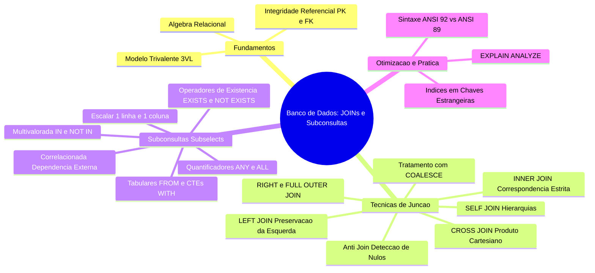

---

## Glossário

| Termo | Definição |
| :--- | :--- |
| **PK (Primary Key)** | Chave primária. Identificador único e imutável de uma tupla que rejeita valores nulos. |
| **FK (Foreign Key)** | Chave estrangeira. Atributo que estabelece a integridade referencial com a PK de outra tabela. |
| **Theta-Join** | Junção relacional condicionada por um operador de comparação genérico ($=, <, >, \ne$). |
| **Equi-Join** | Subtipo de junção onde o operador de acoplamento relacional é exclusivamente o sinal de igualdade ($=$). |
| **Semi-Join** | Operação relacional que retorna apenas as tuplas da primeira tabela que encontram correspondente na segunda, sem duplicar linhas. |
| **Anti-Join** | Operação que retorna tuplas da primeira tabela que não possuem correspondência na segunda. |
| **COALESCE** | Função escalar do PostgreSQL que retorna o primeiro parâmetro não nulo passado em sua assinatura. |
| **Correlated Subquery** | Subconsulta cujas instruções dependem contextualmente de valores da linha corrente da consulta externa. |
| **CTE (Common Table Expression)** | Bloco nomeado iniciado por `WITH` que produz um resultado tabular temporário reutilizável. |
| **Three-Valued Logic (3VL)** | Sistema lógico que opera com três estados de verdade: `TRUE`, `FALSE` e `UNKNOWN`. |
| **Short-Circuit Evaluation** | Otimização do processamento lógico que encerra a checagem no primeiro valor que determine o resultado. |

---

## Pontos-chave para a prova

1. **INNER JOIN descarta dados:** Linhas que não encontram correspondência na outra tabela são sumariamente omitidas.
2. **LEFT JOIN e valores NULL:** Registros da tabela da esquerda permanecem intactos. Se não houver correspondência, todas as colunas da tabela da direita assumem o valor `NULL`.
3. **Detecção de órfãos (Anti-Join):** Constrói-se com `LEFT JOIN ... WHERE tabela_direita.pk IS NULL` ou via `NOT EXISTS`.
4. **ON vs WHERE em Outer Joins:** Condições na cláusula `ON` restringem a correspondência da junção; condições no `WHERE` filtram o conjunto final já combinado e podem eliminar linhas preservadas pelo `LEFT JOIN`.
5. **Cuidado fatal com `NOT IN` e `NULL`:** Se a subconsulta retornar qualquer valor nulo, `NOT IN` resultará em `UNKNOWN` para todas as comparações e a consulta retornará **zero registros**. Prefira `NOT EXISTS`.
6. **Regra de ouro do GROUP BY:** Todo campo projetado no `SELECT` que não seja uma função de agregação (`SUM`, `COUNT`, `AVG`) deve obrigatoriamente constar na cláusula `GROUP BY`.
7. **Diferença de contagem:** `COUNT(*)` conta linhas (incluindo linhas preenchidas com nulos geradas por outer joins), enquanto `COUNT(coluna)` conta exclusivamente valores não nulos contidos naquela coluna.
8. **Aliasing obrigatório no FROM:** No PostgreSQL, subconsultas inseridas na cláusula `FROM` exigem obrigatoriamente um alias explícito (`AS apelido`).

---

## Perguntas e respostas (JSONL)

```jsonl
{"pergunta": "Qual a principal diferença semântica entre INNER JOIN e LEFT JOIN?", "resposta": "O INNER JOIN retorna apenas tuplas com correspondência mútua estrita, enquanto o LEFT JOIN preserva todas as tuplas da tabela à esquerda, preenchendo as colunas da direita com NULL quando não há par correspondente.", "dificuldade": "fácil"}
{"pergunta": "Por que o uso de NATURAL JOIN é desaconselhado em ambientes de engenharia de software?", "resposta": "Porque ele une tabelas automaticamente por todas as colunas homônimas. Alterações futuras de esquema (como a adição de colunas com mesmo nome em ambas as tabelas) alteram silenciosamente a condição de junção e quebram a consulta sem emitir erro.", "dificuldade": "média"}
{"pergunta": "O que acontece ao utilizar a cláusula WHERE em vez de ON para filtrar a tabela da direita em um LEFT JOIN?", "resposta": "A cláusula WHERE é avaliada após a junção. Se ela exigir que uma coluna da direita atenda a um valor específico, os registros preservados com NULL serão eliminados, convertendo silenciosamente o LEFT JOIN em um INNER JOIN.", "dificuldade": "difícil"}
{"pergunta": "Como o PostgreSQL avalia a instrução SELECT 1 dentro de uma subconsulta correlacionada com EXISTS?", "resposta": "O PostgreSQL ignora a lista de projeção do SELECT e avalia apenas a existência física de pelo menos uma linha correspondente, parando a busca imediatamente via curto-circuito.", "dificuldade": "média"}
{"pergunta": "Por que a consulta 'WHERE id NOT IN (SELECT id FROM pedidos)' pode retornar zero linhas mesmo havendo registros?", "resposta": "Devido à lógica trivalente (3VL): se houver um único valor NULL na coluna id da tabela pedidos, todas as comparações NOT IN resultam em UNKNOWN, fazendo com que a cláusula WHERE descarte todas as tuplas.", "dificuldade": "difícil"}
{"pergunta": "O que caracteriza uma subconsulta como correlacionada?", "resposta": "A referência explícita a colunas da consulta externa dentro da subconsulta interna, criando uma dependência contextual que conceitualmente exige reavaliação para cada linha processada externamente.", "dificuldade": "média"}
{"pergunta": "Qual a função do operador COALESCE em relatórios analíticos gerados com LEFT JOIN?", "resposta": "Substituir valores nulos resultantes da ausência de correspondência relacional por um valor padrão amigável pré-definido.", "dificuldade": "fácil"}
{"pergunta": "Qual a consequência de omitir a cláusula ON ao unir duas tabelas na sintaxe ANSI-92?", "resposta": "O compilador PostgreSQL emitirá um erro de sintaxe, pois o padrão explícito exige ON ou USING, diferentemente da sintaxe ANSI-89 que gerava acidentalmente um CROSS JOIN.", "dificuldade": "fácil"}
{"pergunta": "Qual a regra estrita do PostgreSQL para o uso de subconsultas na cláusula FROM?", "resposta": "Toda subconsulta na cláusula FROM (tabela derivada) deve obrigatoriamente receber um alias identificador.", "dificuldade": "fácil"}
{"pergunta": "Em qual cenário a subconsulta escalar emite um erro de tempo de execução no PostgreSQL?", "resposta": "Quando a subconsulta é utilizada com operadores relacionais escalares (=, >, <) e retorna mais de uma linha de resultado.", "dificuldade": "fácil"}
{"pergunta": "Como expressar um autorrelacionamento hierárquico na linguagem SQL?", "resposta": "Utilizando um SELF JOIN, que consiste em referenciar a mesma tabela duas vezes na consulta com aliases distintos para diferenciar o papel subordinado do papel superior.", "dificuldade": "média"}
{"pergunta": "Qual a diferença entre os quantificadores relacionais ANY e ALL?", "resposta": "ANY é satisfeito se a condição for verdadeira para pelo menos um dos valores retornados pela subconsulta; ALL exige que a condição seja verdadeira para todos os valores do conjunto.", "dificuldade": "média"}
{"pergunta": "Qual o impacto de utilizar COUNT(*) versus COUNT(coluna_fk) ao agrupar uma consulta com LEFT JOIN?", "resposta": "COUNT(*) contabiliza a linha sintética preenchida com NULLs, retornando valor 1 para registros sem associação, enquanto COUNT(coluna_fk) ignora nulos e computa o valor correto 0.", "dificuldade": "difícil"}
{"pergunta": "O que é uma CTE (Common Table Expression) e qual sua principal vantagem sobre subconsultas aninhadas?", "resposta": "É uma estrutura temporária nomeada declarada via cláusula WITH que permite modularizar consultas complexas em passos sequenciais legíveis e manuteníveis.", "dificuldade": "média"}
{"pergunta": "Como funciona o algoritmo Hash Join internamente no PostgreSQL?", "resposta": "Ele cria uma tabela hash em memória com as chaves de junção da tabela menor e, em seguida, varre a tabela maior buscando correspondências diretas em tempo constante O(1).", "dificuldade": "difícil"}
{"pergunta": "Qual operador quantificado equivale exatamente à expressão x IN (subquery)?", "resposta": "A expressão x = ANY (subquery).", "dificuldade": "média"}
```

---

## Checklist de revisão

- [ ] Compreender o conceito de integridade referencial e os papéis de Chave Primária (PK) e Chave Estrangeira (FK).
- [ ] Dominar a sintaxe do `INNER JOIN` e a resolução de ambiguidades com *aliases*.
- [ ] Saber projetar relatórios analíticos utilizando `LEFT JOIN` preservando registros pai.
- [ ] Implementar a técnica de *Anti-Join* combinando `LEFT JOIN` e verificação `IS NULL` na chave primária da tabela da direita.
- [ ] Aplicar a função `COALESCE` para mascarar nulos e fornecer valores de fallback consistentes.
- [ ] Reconhecer a equivalência operacional entre `RIGHT JOIN` e `LEFT JOIN` e priorizar o padrão da esquerda.
- [ ] Empregar o `FULL OUTER JOIN` para fins de auditoria de dados e reconciliação cadastral.
- [ ] Compreender os riscos de explosão combinatória causados por `CROSS JOIN` acidentais.
- [ ] Modelar hierarquias organizacionais com `SELF JOIN` e tratamento de nó-raiz via `LEFT JOIN`.
- [ ] Dominar a diferença crucial entre aplicar filtros na cláusula `ON` versus cláusula `WHERE` em junções externas.
- [ ] Explicar por que a sintaxe `NATURAL JOIN` deve ser evitada em códigos de produção.
- [ ] Diferenciar subconsultas escalares, multivaloradas, tabulares e correlacionadas.
- [ ] Identificar a armadilha lógica do operador `NOT IN` frente a valores nulos (lógica trivalente) e substituí-lo defensivamente por `NOT EXISTS`.
- [ ] Saber formular subconsultas correlacionadas com `EXISTS (SELECT 1 ...)` e explicar o benefício de curto-circuito.
- [ ] Utilizar operadores quantificadores `ANY` e `ALL` e mapear suas equivalências com funções agregadoras.
- [ ] Estruturar tabelas derivadas no `FROM` aplicando o alias obrigatório do PostgreSQL.
- [ ] Aplicar subconsultas em comandos DML (`INSERT ... SELECT`, `UPDATE` e `DELETE`).
- [ ] Modularizar consultas analíticas complexas utilizando Expressões de Tabela Comuns (`WITH ... AS CTE`).
- [ ] Interpretar nós fundamentais (`Hash Join`, `Nested Loop`, `Merge Join`, `Seq Scan`) em relatórios gerados por `EXPLAIN ANALYZE`.
