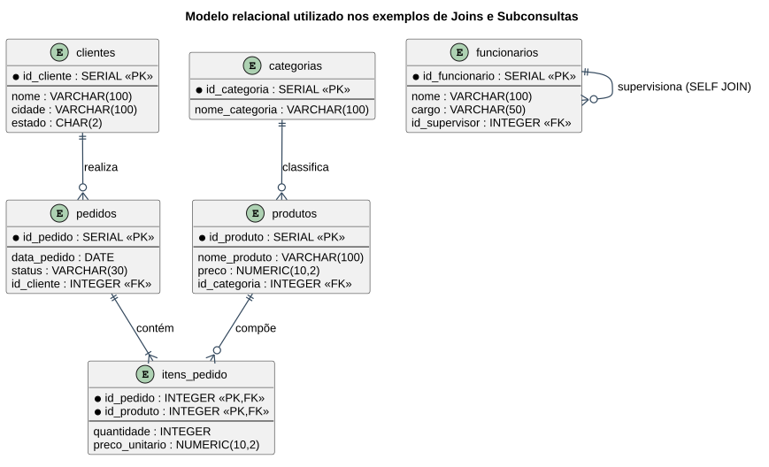

# Aula — Joins e Subconsultas em SQL (PostgreSQL)

> **Professor:** Welington Garcia
> **Disciplina:** Tópicos Avançados em Banco de Dados (4º Semestre)
> **Tema:** Combinação de tabelas com `JOIN` e consultas aninhadas com subconsultas (*subselects*)

## Objetivo da aula

Construir consultas que combinam dados de múltiplas tabelas relacionais utilizando os diferentes tipos de `JOIN`, e complementar essa base com subconsultas (*subqueries*) para resolver filtros, comparações e cálculos que dependem de resultados intermediários. Ao final, o aluno deve ser capaz de montar relatórios completos para sistemas de vendas, bibliotecas e outros bancos relacionais.

## Modelo de dados utilizado nos exemplos

Os exemplos abaixo utilizam o seguinte esquema relacional:



```sql
CREATE TABLE categorias (
    id_categoria SERIAL PRIMARY KEY,
    nome_categoria VARCHAR(100) NOT NULL
);

CREATE TABLE produtos (
    id_produto SERIAL PRIMARY KEY,
    nome_produto VARCHAR(100) NOT NULL,
    preco NUMERIC(10,2) NOT NULL,
    id_categoria INTEGER REFERENCES categorias(id_categoria)
);

CREATE TABLE clientes (
    id_cliente SERIAL PRIMARY KEY,
    nome VARCHAR(100) NOT NULL,
    cidade VARCHAR(100),
    estado CHAR(2)
);

CREATE TABLE pedidos (
    id_pedido SERIAL PRIMARY KEY,
    data_pedido DATE NOT NULL,
    status VARCHAR(30) NOT NULL,
    id_cliente INTEGER REFERENCES clientes(id_cliente)
);

CREATE TABLE itens_pedido (
    id_pedido INTEGER REFERENCES pedidos(id_pedido),
    id_produto INTEGER REFERENCES produtos(id_produto),
    quantidade INTEGER NOT NULL,
    preco_unitario NUMERIC(10,2) NOT NULL,
    PRIMARY KEY (id_pedido, id_produto)
);

-- Auto-relacionamento, usado no exemplo de SELF JOIN
CREATE TABLE funcionarios (
    id_funcionario SERIAL PRIMARY KEY,
    nome VARCHAR(100) NOT NULL,
    cargo VARCHAR(50),
    id_supervisor INTEGER REFERENCES funcionarios(id_funcionario)
);
```

---

## Parte 1 — JOINs

### Por que os dados ficam separados em tabelas?

Em um banco relacional normalizado, informações como clientes, pedidos e produtos ficam em tabelas distintas para evitar repetição e manter a integridade dos dados. O `JOIN` é a operação que reconstitui essa visão relacional, combinando linhas de duas ou mais tabelas com base em uma condição lógica compartilhada — geralmente a relação entre chave primária (`PRIMARY KEY`) e chave estrangeira (`FOREIGN KEY`).

### Tipos de JOIN

| Tipo | Comportamento | Sem correspondência |
| :--- | :--- | :--- |
| `INNER JOIN` | Retorna **apenas** a interseção entre as tabelas. | Linha é **descartada** dos dois lados. |
| `LEFT JOIN` | Preserva **tudo** da tabela à esquerda. | Colunas da direita recebem `NULL`. |
| `RIGHT JOIN` | Preserva **tudo** da tabela à direita. | Colunas da esquerda recebem `NULL`. |
| `FULL OUTER JOIN` | Preserva **tudo** de ambas as tabelas. | Lado sem correspondência recebe `NULL`. |
| `CROSS JOIN` | Produto cartesiano — todas as combinações possíveis ($N \times M$). | Não se aplica (não usa `ON`). |
| `SELF JOIN` | Uma tabela relacionada com ela mesma, via aliases distintos. | Usado para hierarquias (ex.: funcionário/supervisor). |

### INNER JOIN — apenas correspondências

```sql
SELECT p.id_pedido, p.data_pedido, p.status, c.nome AS cliente
FROM pedidos p
INNER JOIN clientes c ON p.id_cliente = c.id_cliente;
```

### LEFT JOIN — preservando a tabela da esquerda

```sql
SELECT c.id_cliente, c.nome, p.id_pedido, p.status
FROM clientes c
LEFT JOIN pedidos p ON c.id_cliente = p.id_cliente;
```

### Anti-join — registros sem correspondência

Um dos usos mais cobrados de `LEFT JOIN`: encontrar registros da tabela à esquerda que **não têm** correspondência na tabela à direita.

```sql
SELECT c.id_cliente, c.nome
FROM clientes c
LEFT JOIN pedidos p ON c.id_cliente = p.id_cliente
WHERE p.id_pedido IS NULL; -- clientes que nunca fizeram pedido
```

### SELF JOIN — hierarquia de funcionários

```sql
SELECT f.nome AS funcionario, f.cargo,
       COALESCE(s.nome, 'Sem supervisor (Diretoria)') AS supervisor
FROM funcionarios f
LEFT JOIN funcionarios s ON f.id_supervisor = s.id_funcionario;
```

### JOIN múltiplo com agregação

```sql
SELECT p.id_pedido, c.nome AS cliente,
       SUM(ip.quantidade * ip.preco_unitario) AS valor_total
FROM pedidos p
JOIN clientes c ON p.id_cliente = c.id_cliente
JOIN itens_pedido ip ON p.id_pedido = ip.id_pedido
GROUP BY p.id_pedido, c.nome
ORDER BY valor_total DESC;
```

### Ponto crítico: filtro no `ON` vs. filtro no `WHERE`

Em um `LEFT JOIN`, a posição do filtro muda o resultado:

```sql
-- Filtro no WHERE: transforma o LEFT JOIN num INNER JOIN disfarçado
SELECT * FROM clientes c LEFT JOIN pedidos p
  ON c.id_cliente = p.id_cliente
WHERE p.status = 'Pago';

-- Filtro no ON: preserva todos os clientes, mesmo sem pedido pago
SELECT * FROM clientes c LEFT JOIN pedidos p
  ON c.id_cliente = p.id_cliente AND p.status = 'Pago';
```

Condições no `ON` filtram o relacionamento **durante** a junção; condições no `WHERE` filtram o resultado **depois** da junção — e, sobre a tabela opcional de um `LEFT JOIN`, podem eliminar acidentalmente as linhas sem correspondência.

---

## Parte 2 — Subconsultas (Subselects)

Uma **subconsulta** (*subselect* ou *subquery*) é uma instrução `SELECT` escrita dentro de outra instrução SQL. A subconsulta (consulta interna) é executada para produzir um valor ou conjunto de valores que a consulta externa utiliza.

### Classificação por tipo de resultado

| Tipo | Resultado | Uso comum |
| :--- | :--- | :--- |
| Escalar | Uma linha, uma coluna | Comparações com `=`, `>`, `<` |
| Coluna única | Uma coluna, várias linhas | `IN`, `NOT IN`, `ANY`, `ALL` |
| Tabela | Várias linhas e colunas | Subconsulta no `FROM` (tabela derivada) |
| Correlacionada | Depende da linha externa | `EXISTS` e comparações por grupo |

### Subconsulta escalar

```sql
-- Produtos acima da média de preço
SELECT nome_produto, preco
FROM produtos
WHERE preco > (SELECT AVG(preco) FROM produtos);

-- Produto(s) mais caro(s) — pode retornar mais de uma linha em caso de empate
SELECT id_produto, nome_produto, preco
FROM produtos
WHERE preco = (SELECT MAX(preco) FROM produtos);
```

Uma subconsulta escalar também pode aparecer na lista de colunas do `SELECT`:

```sql
SELECT nome_produto, preco,
       preco - (SELECT AVG(preco) FROM produtos) AS diferenca_media
FROM produtos
ORDER BY diferenca_media DESC;
```

### IN / NOT IN — comparando com um conjunto

```sql
-- Clientes que já fizeram pelo menos um pedido
SELECT nome, cidade
FROM clientes
WHERE id_cliente IN (SELECT id_cliente FROM pedidos);
```

**Cuidado com `NOT IN` e `NULL`:** se a subconsulta retornar algum valor nulo, o resultado de `NOT IN` pode se tornar indeterminado e nenhuma linha é retornada. Filtre nulos explicitamente ou prefira `NOT EXISTS`:

```sql
SELECT nome FROM clientes
WHERE id_cliente NOT IN (
    SELECT id_cliente FROM pedidos WHERE id_cliente IS NOT NULL
);
```

### EXISTS / NOT EXISTS — subconsultas correlacionadas

`EXISTS` retorna verdadeiro assim que a subconsulta encontra pelo menos uma linha; o conteúdo retornado não importa (por isso `SELECT 1`).

```sql
-- Clientes que já fizeram algum pedido
SELECT c.id_cliente, c.nome
FROM clientes c
WHERE EXISTS (SELECT 1 FROM pedidos p WHERE p.id_cliente = c.id_cliente);

-- Clientes que nunca fizeram pedido (equivalente ao anti-join com LEFT JOIN)
SELECT c.id_cliente, c.nome
FROM clientes c
WHERE NOT EXISTS (SELECT 1 FROM pedidos p WHERE p.id_cliente = c.id_cliente);
```

### ANY / ALL — comparando com múltiplos valores

```sql
-- Produtos mais caros que PELO MENOS UM produto da categoria 4
SELECT nome_produto, preco FROM produtos
WHERE preco > ANY (SELECT preco FROM produtos WHERE id_categoria = 4);

-- Produtos mais caros que TODOS os produtos da categoria 4
SELECT nome_produto, preco FROM produtos
WHERE preco > ALL (SELECT preco FROM produtos WHERE id_categoria = 4);
```

### Subconsulta correlacionada — média por grupo

A subconsulta é recalculada para cada linha da consulta externa, pois depende de uma coluna dessa linha (`p1.id_categoria`):

```sql
SELECT p1.nome_produto, p1.preco, p1.id_categoria
FROM produtos p1
WHERE p1.preco > (
    SELECT AVG(p2.preco) FROM produtos p2
    WHERE p2.id_categoria = p1.id_categoria
);
```

Etapas de execução: (1) seleciona um produto e sua categoria; (2) calcula a média de preço daquela categoria; (3) compara o preço do produto com a média do próprio grupo; (4) repete para a próxima linha.

### Subconsulta no FROM — tabela derivada

```sql
SELECT resumo.id_cliente, resumo.total_pedidos
FROM (
    SELECT id_cliente, COUNT(*) AS total_pedidos
    FROM pedidos
    GROUP BY id_cliente
) AS resumo
WHERE resumo.total_pedidos > 1;
```

No PostgreSQL, uma subconsulta no `FROM` deve sempre receber um alias.

### Subconsulta no HAVING

```sql
SELECT id_cliente, COUNT(*) AS total
FROM pedidos
GROUP BY id_cliente
HAVING COUNT(*) > (
    SELECT AVG(quantidade) FROM (
        SELECT COUNT(*) AS quantidade FROM pedidos GROUP BY id_cliente
    ) q
);
```

### Subconsulta em UPDATE / DELETE

```sql
UPDATE produtos
SET preco = preco * 1.10
WHERE id_categoria = (
    SELECT id_categoria FROM categorias WHERE nome_categoria = 'Informática'
);
```

Antes de executar um `UPDATE`/`DELETE` com subconsulta, recomenda-se testar a mesma condição isoladamente em um `SELECT`.

---

## Exercício de fixação — Sistema de Biblioteca

Aplique `JOIN` e subconsultas sobre um segundo domínio:

```sql
CREATE TABLE autores (id_autor SERIAL PRIMARY KEY, nome_autor VARCHAR(100) NOT NULL);
CREATE TABLE livros (id_livro SERIAL PRIMARY KEY, titulo VARCHAR(150) NOT NULL, id_autor INTEGER REFERENCES autores(id_autor));
CREATE TABLE leitores (id_leitor SERIAL PRIMARY KEY, nome_leitor VARCHAR(100) NOT NULL);
CREATE TABLE emprestimos (
    id_emprestimo SERIAL PRIMARY KEY,
    id_livro INTEGER REFERENCES livros(id_livro),
    id_leitor INTEGER REFERENCES leitores(id_leitor),
    data_emprestimo DATE NOT NULL,
    devolvido BOOLEAN DEFAULT FALSE
);
```

1. Liste todos os livros com o nome do respectivo autor (`JOIN`).
2. Liste todos os autores, inclusive os que não têm livro cadastrado (`LEFT JOIN`).
3. Liste os leitores que nunca fizeram empréstimo (anti-join ou `NOT EXISTS`).
4. Conte a quantidade de livros por autor (`LEFT JOIN` + `GROUP BY`).

<details>
<summary>Gabarito</summary>

```sql
-- 1.
SELECT l.titulo, a.nome_autor FROM livros l JOIN autores a ON l.id_autor = a.id_autor;

-- 2.
SELECT a.nome_autor, l.titulo FROM autores a LEFT JOIN livros l ON a.id_autor = l.id_autor;

-- 3.
SELECT le.nome_leitor FROM leitores le
LEFT JOIN emprestimos e ON le.id_leitor = e.id_leitor
WHERE e.id_emprestimo IS NULL;

-- 4.
SELECT a.nome_autor, COUNT(l.id_livro) AS total_livros
FROM autores a LEFT JOIN livros l ON a.id_autor = l.id_autor
GROUP BY a.id_autor, a.nome_autor;
```
</details>

## Material relacionado

- [Trabalho: Exercícios Joins](../../Trabalhos/Exercicios%20Joins/detalhes.md)
- [Prova: Exercícios SubSelects — parte 1](../../Provas/Exercicios%20SubSelects%20-%20parte%2001/detalhes.md)
- [Prova: Exercícios SubSelects — parte 2](../../Provas/Exerciciso%20-%20SUbSelect%20-%20parte%202/detalhes.md)
- [Resumo, simulado comentado e cheatsheet da disciplina](../../README.md#resumo-executivo)
- Slides originais da aula: [`aula_joins_postgresql.html`](./aula_joins_postgresql.html), [`subselect.html`](./subselect.html)
