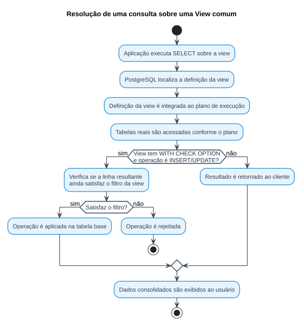
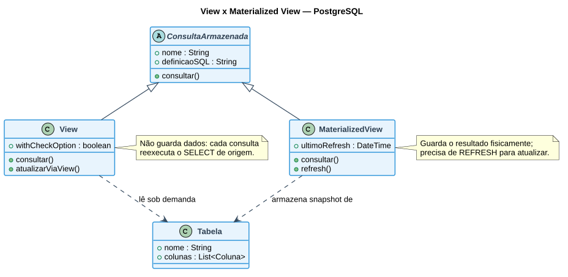

# Aula — Views em SQL (PostgreSQL)

> **Professor:** Welington Garcia
> **Disciplina:** Tópicos Avançados em Banco de Dados (4º Semestre)
> **Tema:** Consultas virtuais reutilizáveis (`CREATE VIEW`, `MATERIALIZED VIEW`, `WITH CHECK OPTION`)

## Objetivo da aula

Criar consultas virtuais reutilizáveis para simplificar o acesso aos dados, padronizar relatórios e controlar o que cada usuário pode visualizar. Ao final, o aluno deve saber criar, consultar, alterar e excluir views; combinar `JOIN`, filtros e agregações dentro delas; entender quando uma view é atualizável; e diferenciar view comum de *materialized view*.

## Por que utilizar Views?

Em sistemas reais, consultas envolvem muitos `JOIN`s, filtros, cálculos e regras de negócio. Repetir a mesma lógica em vários lugares torna o código difícil de manter. Uma view resolve três problemas:

- **Simplificar** — oculta a complexidade de consultas extensas atrás de um nome simples.
- **Reutilizar** — centraliza uma consulta usada por vários relatórios ou aplicações.
- **Controlar** — expõe apenas as colunas e linhas que um determinado usuário pode acessar.

## O que é uma View?

Uma **view** é uma consulta SQL armazenada no banco de dados e apresentada ao usuário como se fosse uma tabela. Ela **não armazena** uma cópia independente dos dados: a cada consulta, o PostgreSQL reexecuta a definição da view sobre as tabelas de origem.

```sql
CREATE VIEW vw_produtos_caros AS
SELECT id_produto, nome_produto, preco
FROM produtos
WHERE preco > 1000;
```

### Tabela × View

| Aspecto | Tabela | View |
| :--- | :--- | :--- |
| Armazena dados diretamente? | Sim | Normalmente não |
| Possui definição SQL? | Estrutura de colunas | Consulta `SELECT` |
| Pode ser consultada com `SELECT`? | Sim | Sim |
| Pode ocultar colunas? | Não, por si só | Sim |
| Pode simplificar `JOIN`s? | Não | Sim |

## Modelo de dados utilizado nos exemplos

`clientes`, `pedidos`, `itens_pedido`, `produtos`, `categorias` e `vendedores` — o mesmo domínio de vendas usado na aula de Joins e Subconsultas (ver [modelo relacional](../Aulas%20Joins%20e%20Sub%20selects/diagramas/modelo-relacional-joins-subselects.svg)).

## Criando e consultando uma View

```sql
CREATE VIEW vw_clientes_sp AS
SELECT id_cliente, nome, cidade
FROM clientes
WHERE estado = 'SP';
```

O acesso é feito como em uma tabela comum, inclusive com filtros adicionais na consulta externa:

```sql
SELECT * FROM vw_clientes_sp;

SELECT nome, cidade FROM vw_clientes_sp WHERE cidade = 'Campinas';
```

### O que acontece quando a view é consultada

O fluxo abaixo resume os passos que o PostgreSQL executa ao resolver uma consulta sobre uma view — incluindo a verificação de `WITH CHECK OPTION` quando a operação é de escrita:



Se os dados das tabelas de origem mudarem, uma view comum passa a apresentar os novos valores automaticamente — ela não fica "presa" a um snapshot antigo.

## Reutilização: sem view × com view

```sql
-- Sem view: a lógica do JOIN precisa ser repetida em todo lugar que usa esse relatório
SELECT p.id_pedido, c.nome, p.data_pedido
FROM pedidos p JOIN clientes c ON p.id_cliente = c.id_cliente;

-- Com view: a complexidade fica concentrada na definição
CREATE VIEW vw_pedidos_clientes AS
SELECT p.id_pedido, p.data_pedido, p.status, c.id_cliente, c.nome AS cliente
FROM pedidos p JOIN clientes c ON p.id_cliente = c.id_cliente;

SELECT * FROM vw_pedidos_clientes;
```

## Views com JOIN múltiplo e agregação

```sql
-- View detalhada de vendas (JOIN múltiplo)
CREATE VIEW vw_detalhes_vendas AS
SELECT p.id_pedido, c.nome AS cliente, pr.nome_produto,
       ip.quantidade, ip.preco_unitario,
       ip.quantidade * ip.preco_unitario AS subtotal
FROM pedidos p
JOIN clientes c ON p.id_cliente = c.id_cliente
JOIN itens_pedido ip ON p.id_pedido = ip.id_pedido
JOIN produtos pr ON ip.id_produto = pr.id_produto;

-- View de total por pedido (GROUP BY + SUM)
CREATE VIEW vw_total_pedidos AS
SELECT p.id_pedido, c.nome AS cliente,
       SUM(ip.quantidade * ip.preco_unitario) AS valor_total
FROM pedidos p
JOIN clientes c ON p.id_cliente = c.id_cliente
JOIN itens_pedido ip ON p.id_pedido = ip.id_pedido
GROUP BY p.id_pedido, c.nome;
```

Views com agregação (`GROUP BY`, `SUM`, `COUNT`) são excelentes para relatórios, mas normalmente **não são atualizáveis** diretamente — ver seção de limitações abaixo.

## Alterando e excluindo uma View

```sql
-- Substituir a definição (colunas existentes precisam continuar compatíveis)
CREATE OR REPLACE VIEW vw_clientes_sp AS
SELECT id_cliente, nome, cidade, limite_credito
FROM clientes WHERE estado = 'SP';

-- Excluir
DROP VIEW IF EXISTS vw_clientes_sp;

-- Excluir considerando dependências
DROP VIEW vw_base RESTRICT; -- impede exclusão se houver objetos dependentes
DROP VIEW vw_base CASCADE;  -- remove também os objetos dependentes (usar com cuidado)
```

## Views atualizáveis e integridade

Views simples (sem `GROUP BY`, funções de agregação, `DISTINCT` ou operações de conjunto) podem ser atualizáveis automaticamente no PostgreSQL:

```sql
CREATE VIEW vw_clientes_sp AS
SELECT id_cliente, nome, cidade, estado FROM clientes WHERE estado = 'SP';

UPDATE vw_clientes_sp SET cidade = 'Jundiaí' WHERE id_cliente = 2;
```

**Problema:** sem proteção, uma atualização feita através da view pode alterar um valor que fazia parte do próprio filtro da view — a linha some da view, mas continua na tabela base:

```sql
UPDATE vw_clientes_sp SET estado = 'MG' WHERE id_cliente = 1;
-- o cliente deixa de aparecer em vw_clientes_sp, mas continua em `clientes`
```

**Solução — `WITH CHECK OPTION`:** obriga que operações feitas pela view continuem satisfazendo o filtro da própria view.

```sql
CREATE VIEW vw_clientes_sp AS
SELECT id_cliente, nome, cidade, estado
FROM clientes WHERE estado = 'SP'
WITH CHECK OPTION;

UPDATE vw_clientes_sp SET estado = 'MG' WHERE id_cliente = 1;
-- operação rejeitada pelo PostgreSQL
```

## Segurança: View como camada de acesso

```sql
CREATE VIEW vw_clientes_publico AS
SELECT id_cliente, nome, cidade, estado FROM clientes;

GRANT SELECT ON vw_clientes_publico TO usuario_relatorios;
```

Com uma política de permissões adequada, é possível conceder acesso à view sem permitir que o usuário consulte diretamente todas as colunas (por exemplo, dados financeiros) das tabelas envolvidas.

## Desempenho: View comum não é cache

Uma view comum **não** armazena resultado e, por si só, não acelera consultas: o otimizador do PostgreSQL integra a definição da view à consulta e gera um plano de execução sobre as tabelas reais. Se a consulta original é pesada, colocá-la dentro de uma view não muda esse custo.

```sql
EXPLAIN ANALYZE
SELECT * FROM vw_total_pedidos WHERE valor_total > 3000;
```

## Materialized View — quando o resultado precisa ser armazenado

Diferente de uma view comum, uma **materialized view** armazena fisicamente o resultado da consulta:

```sql
CREATE MATERIALIZED VIEW mv_vendas_por_cliente AS
SELECT c.id_cliente, c.nome, SUM(ip.quantidade * ip.preco_unitario) AS total
FROM clientes c
JOIN pedidos p ON c.id_cliente = p.id_cliente
JOIN itens_pedido ip ON p.id_pedido = ip.id_pedido
GROUP BY c.id_cliente, c.nome;

-- Atualizar o conteúdo armazenado a partir das tabelas base
REFRESH MATERIALIZED VIEW mv_vendas_por_cliente;

-- Materialized views podem ter índices próprios, por armazenarem dados fisicamente
CREATE INDEX idx_mv_vendas_cliente ON mv_vendas_por_cliente(id_cliente);
```

O diagrama abaixo resume a diferença estrutural entre os dois tipos:



### View × Materialized View

| Característica | View | Materialized View |
| :--- | :--- | :--- |
| Resultado armazenado | Não | Sim |
| Dados sempre atuais | Sim, conforme tabelas base | Não automaticamente |
| Precisa de `REFRESH` | Não | Sim |
| Pode acelerar consultas pesadas | Não, por armazenar resultado | Pode |

Entre dois processos de `REFRESH`, uma materialized view pode apresentar dados desatualizados — é uma troca deliberada entre atualidade e desempenho.

## Erros comuns

- **`SELECT *` dentro de uma view:** funciona, mas torna a interface menos explícita e mais sensível a mudanças de estrutura na tabela de origem. Prefira listar as colunas explicitamente.
- **Views excessivamente encadeadas:** uma view que chama outra, que chama outra com vários `JOIN`s e agregações, deixa o SQL externo simples, mas a consulta real pode ficar difícil de compreender e otimizar. Views devem reduzir complexidade para quem consome, sem criar uma cadeia de dependências impossível de manter.
- **Views não substituem modelagem:** uma view não corrige um projeto de banco inadequado nem a ausência de índices — ela reorganiza o acesso, não resolve problemas estruturais.

## Quando uma View é uma boa escolha?

- **Relatórios recorrentes**, quando várias telas precisam da mesma combinação de tabelas.
- **Compatibilidade**, para oferecer uma interface estável mesmo com mudanças internas controladas.
- **Segurança**, quando usuários devem visualizar apenas subconjuntos de dados.
- **Padronização**, quando cálculos e regras de consulta devem ser centralizados.

## Exercícios de fixação

1. Crie uma view contendo apenas clientes do estado de SP.
2. Crie uma view que exiba produtos com preço superior a R$ 1.000,00.
3. Crie uma view com pedidos e nomes dos respectivos clientes.
4. Consulte a view do exercício 3 exibindo somente pedidos pagos.
5. Crie uma view que calcule o valor total de cada pedido.
6. Crie uma view que mostre cada cliente e sua quantidade de pedidos.
7. Modifique uma view existente utilizando `CREATE OR REPLACE VIEW`.
8. Crie uma view atualizável de clientes de SP utilizando `WITH CHECK OPTION`.
9. Crie uma view que exponha somente `id`, `nome`, `cidade` e `estado` dos clientes.
10. Crie uma materialized view com o total de vendas por cliente e execute seu `REFRESH`.

<details>
<summary>Gabarito (exercícios 1, 3, 5 e 8)</summary>

```sql
-- 1.
CREATE VIEW vw_clientes_sp AS
SELECT id_cliente, nome, cidade, estado FROM clientes WHERE estado = 'SP';

-- 3.
CREATE VIEW vw_pedidos_clientes AS
SELECT p.id_pedido, p.data_pedido, p.status, c.nome AS cliente
FROM pedidos p JOIN clientes c ON p.id_cliente = c.id_cliente;

-- 5.
CREATE VIEW vw_total_pedidos AS
SELECT p.id_pedido, SUM(ip.quantidade * ip.preco_unitario) AS valor_total
FROM pedidos p JOIN itens_pedido ip ON p.id_pedido = ip.id_pedido
GROUP BY p.id_pedido;

-- 8.
CREATE VIEW vw_clientes_sp_check AS
SELECT id_cliente, nome, cidade, estado FROM clientes
WHERE estado = 'SP'
WITH CHECK OPTION;
```
</details>

### Atividade prática — Sistema de biblioteca

Sobre as tabelas `autores`, `livros`, `leitores` e `emprestimos` (mesmo domínio do exercício de Joins e Subconsultas):

- Crie views para: livros com nome do autor; empréstimos com leitor e livro; quantidade de livros por autor.
- Desafios: leitores sem empréstimos; livros nunca emprestados; resumo de empréstimos por leitor.

## Perguntas de revisão

- Qual a diferença entre uma tabela e uma view?
- Uma view comum armazena seus resultados?
- Quando utilizar `CREATE OR REPLACE VIEW`?
- Para que serve `WITH CHECK OPTION`?
- Quando uma view pode ser atualizável?
- Qual a diferença entre view e materialized view?

## Comandos fundamentais

| Objetivo | Comando |
| :--- | :--- |
| Criar uma view | `CREATE VIEW` |
| Alterar sua consulta | `CREATE OR REPLACE VIEW` |
| Excluir uma view | `DROP VIEW` |
| Restringir alterações ao filtro | `WITH CHECK OPTION` |
| Dar permissão | `GRANT` |
| Armazenar o resultado | `CREATE MATERIALIZED VIEW` |
| Atualizar materialized view | `REFRESH MATERIALIZED VIEW` |

## Material relacionado

- [Aula: Joins e Subconsultas](../Aulas%20Joins%20e%20Sub%20selects/detalhes.md) — mesmo domínio de dados, base para os `JOIN`s usados nas views.
- [Resumo, simulado comentado e cheatsheet da disciplina](../../README.md#resumo-executivo)
- Slide original da aula: [`views.html`](./views.html)
