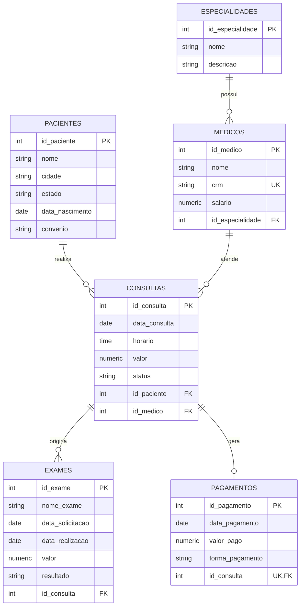
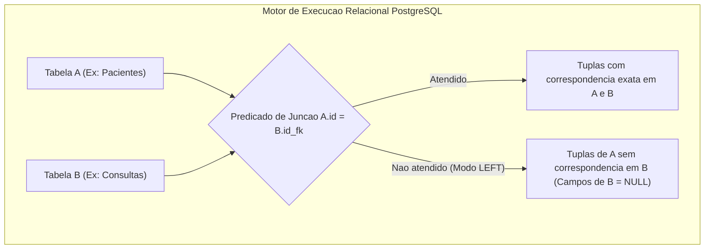
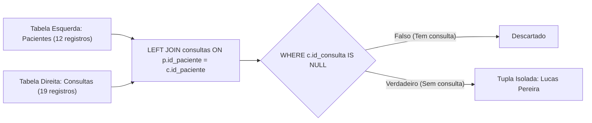
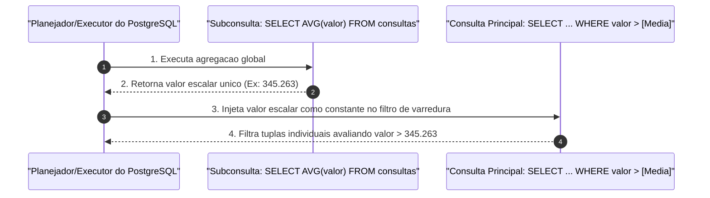
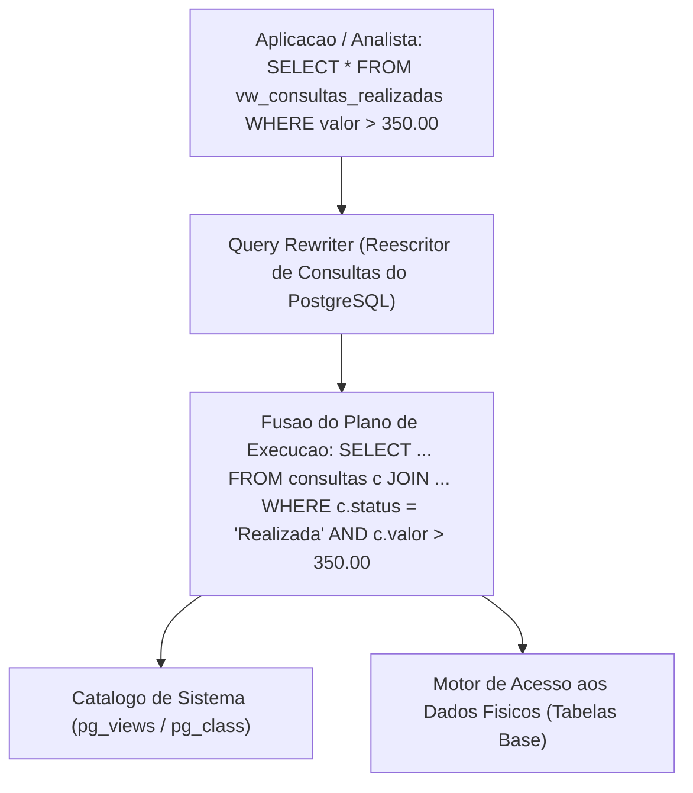
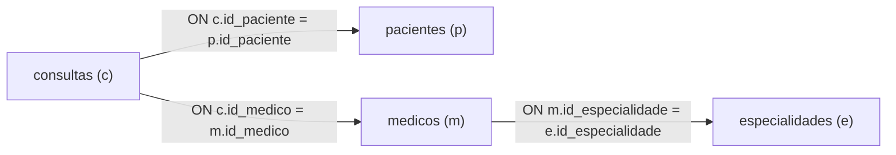
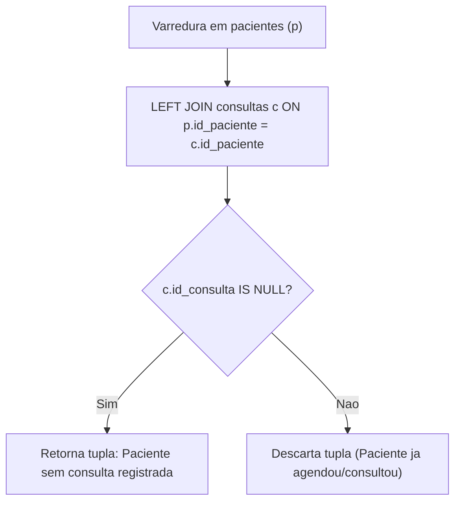
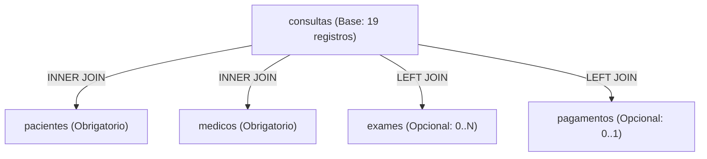
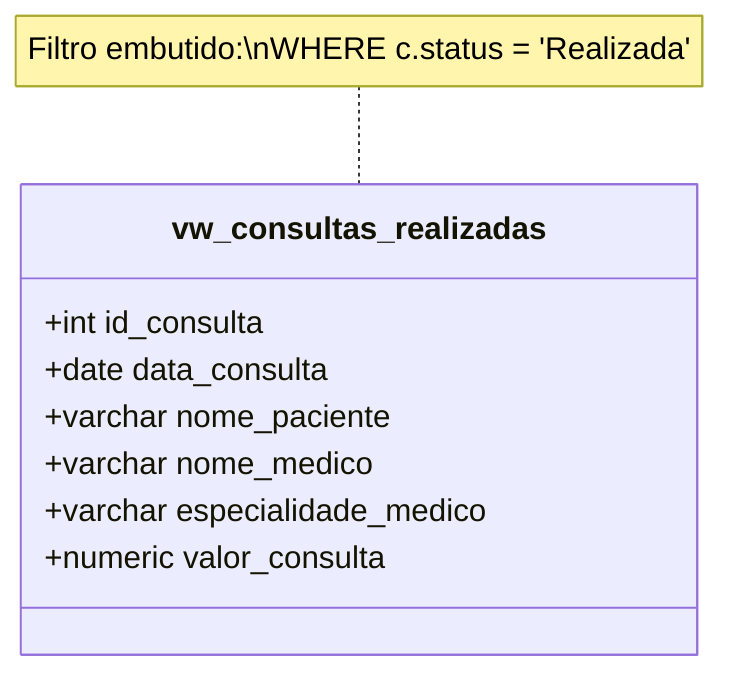
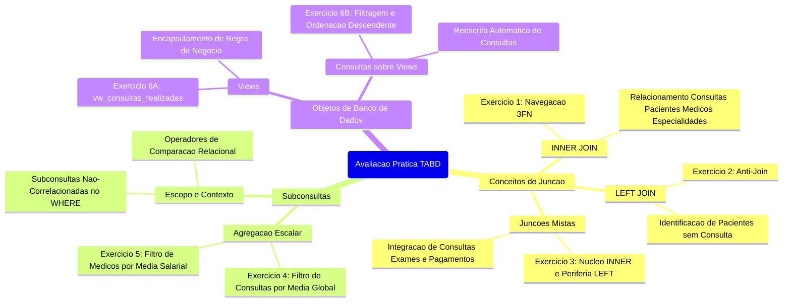

# Trabalho — Avaliação de TABD

> **Professor:** Welington Garcia
> **Disciplina:** Tópicos Avançados em Banco de Dados (4º Semestre)
> **Prazo de Entrega:** 10/09/2026 às 20:59
> **Pontuação Máxima:** 100 pontos
> **Conteúdo cobrado:** [Aula 02 - Views e Materialized Views em PostgreSQL](../../Aulas/Aula%2002%20-%20Views%20e%20Materialized%20Views%20em%20PostgreSQL/detalhes.md), [Aula 03 - Stored Procedures no PostgreSQL com PL pgSQL](../../Aulas/Aula%2003%20-%20Stored%20Procedures%20no%20PostgreSQL%20com%20PL%20pgSQL/detalhes.md), [Aula 04 - Junções e Subconsultas em PostgreSQL](../../Aulas/Aula%2004%20-%20Jun%C3%A7%C3%B5es%20e%20Subconsultas%20em%20PostgreSQL/detalhes.md)

---

## Sumário

- [Enunciado original (Google Classroom)](#enunciado-original-google-classroom)
- [Análise do que é pedido](#análise-do-que-é-pedido)
- [Fundamentação teórica](#fundamentação-teórica)
  - [Modelagem relacional e integridade referencial](#modelagem-relacional-e-integridade-referencial)
  - [Teoria dos conjuntos e junções relacionais](#teoria-dos-conjuntos-e-junções-relacionais)
  - [Padrão de anti-junção com Outer Joins](#padrão-de-anti-junção-com-outer-joins)
  - [Subconsultas escalares e aninhamento no plano de execução](#subconsultas-escalares-e-aninhamento-no-plano-de-execução)
  - [Camada de abstração lógica: Views no PostgreSQL](#camada-de-abstração-lógica-views-no-postgresql)
- [Resolução proposta](#resolução-proposta)
  - [Exercício 1: Consultas com paciente, médico e especialidade](#exercício-1-consultas-com-paciente-médico-e-especialidade)
  - [Exercício 2: Pacientes sem consultas (Anti-Join)](#exercício-2-pacientes-sem-consultas-anti-join)
  - [Exercício 3: Relatório integrado de consultas, exames e pagamentos](#exercício-3-relatório-integrado-de-consultas-exames-e-pagamentos)
  - [Exercício 4: Consultas acima da média geral de valor](#exercício-4-consultas-acima-da-média-geral-de-valor)
  - [Exercício 5: Médicos com salário acima da média da corporação](#exercício-5-médicos-com-salário-acima-da-média-da-corporação)
  - [Exercício 6: View operacional de consultas realizadas e consulta derivada](#exercício-6-view-operacional-de-consultas-realizadas-e-consulta-derivada)
- [Como testar e validar](#como-testar-e-validar)
  - [Provisionamento do ambiente PostgreSQL](#provisionamento-do-ambiente-postgresql)
  - [Matriz de validação e saídas esperadas](#matriz-de-validação-e-saídas-esperadas)
- [Critérios de qualidade](#critérios-de-qualidade)
- [Arquivos de apoio](#arquivos-de-apoio)
- [Mapa da atividade](#mapa-da-atividade)
- [Glossário](#glossário)
- [Pontos-chave para a prova](#pontos-chave-para-prova)
- [Perguntas e respostas (JSONL)](#perguntas-e-respostas-jsonl)
- [Checklist de revisão](#checklist-de-revisão)

---

## Enunciado original (Google Classroom)

### Avaliação de TABD (09/09/2026)

#### Anexo: Exercicios.txt

```text
1 - Consultas com paciente, médico e especialidade (2 pontos)
Crie uma consulta que exiba:
código da consulta;
data da consulta;
nome do paciente;
nome do médico;
nome da especialidade;
status da consulta.
Utilize INNER JOIN.

2- Pacientes sem consultas (1 ponto)
Exiba todos os pacientes e, quando existir, suas respectivas consultas. Depois filtre o resultado para mostrar somente os pacientes que nunca realizaram nenhuma consulta.
Utilize LEFT JOIN.

3- Consultas, exames e pagamentos (2 pontos)
Crie um relatório que apresente:

código da consulta;
nome do paciente;
nome do médico;
nome do exame;
valor do exame;
forma de pagamento;
valor pago.

Todas as consultas devem aparecer, mesmo que ainda não possuam exame ou pagamento.
Utilize uma combinação de INNER JOIN e LEFT JOIN.

4- Consultas acima da média de valor (1,5 pontos)
Exiba todas as consultas cujo valor seja maior que a média de valor de todas as consultas.

O resultado deve apresentar:

código da consulta;
data da consulta;
valor;
status.

A média deverá ser calculada por uma subconsulta.

5- Médicos com salário acima da média (1,5 pontos)
Exiba os médicos cujo salário seja superior à média salarial de todos os médicos cadastrados.

O resultado deve apresentar:

código do médico;
nome;
CRM;
salário.

Utilize uma subconsulta no WHERE.

6- Crie uma view chamada:vw_consultas_realizadas. Essa view deverá apresentar somente as consultas com status igual a Realizada. (2,0 pontos)

A view deverá exibir:

código da consulta;
data da consulta;
nome do paciente;
nome do médico;
especialidade do médico;
valor da consulta.

Depois de criar a view, faça uma consulta sobre ela exibindo apenas as consultas com valor superior a R$ 350,00, ordenadas do maior para o menor valor.
```

---

## Análise do que é pedido

A avaliação prática da disciplina Tópicos Avançados em Banco de Dados avalia competências em manipulação analítica e estruturação lógica sobre o Sistema Gerenciador de Banco de Dados Relacional (SGBDR) PostgreSQL.

### Objetivos pedagógicos e competências técnicas

1. **Domínio de Álgebra Relacional e Junções Estritas (`INNER JOIN`):**
   - Resolução de dependências em cascata de chaves estrangeiras entre entidades normalizadas em 3FN (`consultas` -> `pacientes`, `consultas` -> `medicos` -> `especialidades`).
   - Eliminação de produtos cartesianos acidentais por meio da definição estrita de predicados `ON`.

2. **Detecção de Lacunas de Dados via Junções Externas (`LEFT JOIN` + Anti-Join):**
   - Identificação de entidades órfãs (pacientes sem registros na tabela filha de consultas).
   - Uso correto de predicados `IS NULL` sobre a chave primária da tabela à direita para transformar a junção externa em uma diferença de conjuntos ($A \setminus B$).

3. **Orquestração Híbrida de Junções (`INNER JOIN` combinado com `LEFT JOIN`):**
   - Criação de visões desnormalizadas complexas que preservam a cardinalidade da entidade-base (`consultas`), mesmo quando entidades periféricas dependentes (`exames` ou `pagamentos`) possuem cardinalidade zero ($0..n$ ou $0..1$).
   - Compreensão do impacto do produto cartesiano relacional ao cruzar tabelas de relacionamento independente (1 consulta para $N$ exames e 1 consulta para $1$ pagamento).

4. **Computação com Subconsultas Escalares Dinâmicas:**
   - Aplicação de agregação aritmética (`AVG`) em tempo de execução sem dependência de valores literais estáticos (hardcoded).
   - Utilização de subconsultas independentes no predicado `WHERE` para filtragem baseada em métricas populacionais globais.

5. **Abstração Arquitetural via Objetos de Esquema (`VIEW`):**
   - Encapsulamento de regras de negócio (`status = 'Realizada'`) em uma visão relacional lógica.
   - Aplicação de consultas subordinadas sobre a `VIEW`, incluindo filtros pós-projeção e cláusulas determinísticas de ordenação (`ORDER BY DESC`).

### Entregáveis explícitos e critérios implícitos

| Exercício | Pontos | Entregável Principal | Critério Técnico Implícito |
| :--- | :--- | :--- | :--- |
| **Ex. 1** | 2,0 pts | Consulta multi-tabelas com `INNER JOIN` | Navegar obrigatoriamente por 4 tabelas (`consultas`, `pacientes`, `medicos`, `especialidades`). Não omitir atributos de projeção exigidos. |
| **Ex. 2** | 1,0 pt | Consulta de pacientes sem consultas | Usar a técnica clássica de `LEFT JOIN` filtrando `WHERE consultas.id_consulta IS NULL`. Provar que pacientes com consulta cancelada ou agendada NÃO caem nessa condição (apenas o que tem zero consultas). |
| **Ex. 3** | 2,0 pts | Relatório consolidado com `INNER JOIN` e `LEFT JOIN` | Garantir que o `LEFT JOIN` para `exames` e `pagamentos` não elimine consultas sem exames ou sem pagamentos. O paciente e médico devem ser conectados por `INNER JOIN`. |
| **Ex. 4** | 1,5 pts | Filtro dinâmico de consultas por média | A subconsulta de média `(SELECT AVG(valor) FROM consultas)` deve ser escalar e não correlacionada. Projeção estrita dos 4 campos solicitados. |
| **Ex. 5** | 1,5 pts | Filtro dinâmico de médicos por média salarial | Subconsulta escalar com `AVG(salario)` no `WHERE`. Garantir tratamento numérico preciso sem truncamento de decimais. |
| **Ex. 6** | 2,0 pts | Criação do objeto `vw_consultas_realizadas` + Consulta com filtro | Sintaxe formal `CREATE OR REPLACE VIEW`. Filtro embutido `status = 'Realizada'`. Consulta externa com filtro `valor > 350.00` e `ORDER BY valor DESC`. |

---

## Fundamentação teórica

### Modelagem relacional e integridade referencial

O esquema implementado representa uma clínica médica normalizada. As regras de negócio são garantidas por chaves primárias (`PRIMARY KEY`), chaves estrangeiras (`FOREIGN KEY`) e restrições de unicidade (`UNIQUE`).



#### Regras estruturais críticas do modelo

1. **Relacionamento Especialidades e Médicos ($1:N$ opcional na origem):** Uma especialidade pode existir sem médicos vinculados (caso da Psiquiatria no dataset de teste). A chave estrangeira `medicos.id_especialidade` aceita nulos na definição DDL, embora os médicos cadastrados estejam todos associados.
2. **Relacionamento Pacientes e Consultas ($1:N$ opcional na origem):** Um paciente pode ser cadastrado no sistema antes de efetuar qualquer agendamento (caso de Lucas Pereira).
3. **Relacionamento Consultas e Exames ($1:N$ opcional):** Uma consulta médica pode demandar múltiplos exames diagnósticos ou nenhum exame.
4. **Relacionamento Consultas e Pagamentos ($1:1$ opcional):** A coluna `pagamentos.id_consulta` possui restrição `UNIQUE`, limitando cada consulta a no máximo um registro financeiro. Contudo, consultas canceladas ou recém-agendadas não possuem registro em pagamentos.

---

### Teoria dos conjuntos e junções relacionais

Na teoria dos bancos de dados relacionais baseada na álgebra relacional de Codd, as operações de junção combinam tuplas de duas relações com base em um predicado comum $\theta$ (geralmente a igualdade, configurando um equijoin).



#### 1. Inner Join (Junção Interna)
- **Definição:** Retorna unicamente a interseção relacional entre dois conjuntos de dados, isto é, tuplas onde o predicado de junção $A.pk = B.fk$ é rigorosamente verdadeiro (`TRUE`).
- **Motivação:** Quando o objetivo analítico exige que as entidades relacionadas coexistam obrigatoriamente.
- **Comportamento com Nulos:** Se um lado da relação contiver `NULL` na chave de junção, a linha é descartada pelo princípio da lógica trivalente do SQL (`UNKNOWN` não satisfaz a cláusula `ON`).
- **Exemplo Real:**
  ```sql
  SELECT c.id_consulta, p.nome 
  FROM consultas c 
  INNER JOIN pacientes p ON c.id_paciente = p.id_paciente;
  ```
- **Contraexemplo / Armadilha:** Usar `INNER JOIN` para listar clientes que não possuem compras. Como a correspondência não existe, o `INNER JOIN` simplesmente elimina os clientes do resultado final.

#### 2. Left Outer Join (Junção Externa à Esquerda)
- **Definição:** Retorna todas as tuplas da relação posicionada à esquerda da cláusula (`FROM A LEFT JOIN B`), preservando a entidade principal. Quando uma tupla de $A$ não encontrar correspondência em $B$, os atributos de $B$ na linha resultante serão preenchidos com `NULL`.
- **Motivação:** Gerar relatórios abrangentes que precisam listar o catálogo completo de uma entidade base, mesmo que ela ainda não tenha gerado eventos transacionais secundários.
- **Exemplo Real:**
  ```sql
  SELECT p.nome, c.id_consulta 
  FROM pacientes p 
  LEFT JOIN consultas c ON p.id_paciente = c.id_paciente;
  ```

---

### Padrão de anti-junção com Outer Joins

O conceito de **Anti-Join** formaliza a diferença de conjuntos na álgebra relacional ($R \setminus S$). No SQL ANSI, a implementação padrão da anti-junção utiliza `LEFT JOIN` seguido de uma cláusula `WHERE` que testa a nulidade da chave primária da tabela à direita.



#### Mecânica de Execução Passo a Passo
1. O otimizador executa o `LEFT JOIN`, gerando linhas onde cada paciente é repetido para cada consulta que possui.
2. Para o paciente que não possui nenhuma tupla correspondente em `consultas`, o PostgreSQL cria uma única linha sintética, preenchendo todos os atributos de `consultas` com `NULL`.
3. A cláusula `WHERE c.id_consulta IS NULL` atua como um filtro pós-junção. Como `id_consulta` é a chave primária de `consultas`, ela possui restrição `NOT NULL`. Portanto, a única maneira de `c.id_consulta` assumir o estado `NULL` no resultado intermediário é se a linha tiver sido sintetizada pelo `LEFT JOIN` pela ausência de correspondência.

> **Atenção:** Nunca utilize uma coluna que aceite valores nulos da tabela direita no filtro da anti-junção (ex: `WHERE c.data_consulta IS NULL`), pois se a coluna já contivesse nulos por regra de negócio, tuplas válidas seriam erroneamente classificadas como inexistentes. Filtre sempre pela **chave primária** da tabela dependente.

---

### Subconsultas escalares e aninhamento no plano de execução

Uma subconsulta (ou subselect) é uma instrução `SELECT` aninhada no interior de outra consulta SQL principal.

#### Classificação Funcional de Subconsultas

1. **Subconsulta Escalar:** Retorna exatamente um único valor atômico (1 linha por 1 coluna). É admitida em qualquer contexto onde uma expressão literal ou constante seja válida (cláusulas `SELECT`, `WHERE`, `HAVING`).
2. **Subconsulta de Lista/Conjunto:** Retorna uma coluna com múltiplas linhas. É utilizada com operadores de conjunto (`IN`, `NOT IN`, `ANY`, `ALL`).
3. **Subconsulta de Tabela:** Retorna múltiplas linhas e múltiplas colunas, frequentemente alocada na cláusula `FROM` (tabelas derivadas).



#### Subconsultas Não Correlacionadas vs Correlacionadas
- **Não Correlacionada (Independente):** Não faz qualquer referência às colunas da consulta externa. É executada uma única vez pelo motor relacional, cujo resultado é materializado em memória e reutilizado para todas as linhas da consulta externa. Este é o caso dos exercícios 4 e 5.
- **Correlacionada:** Faz referência a uma ou mais colunas da consulta externa (`WHERE c.id_paciente = p.id_paciente`). Requer avaliação contextualizada linha a linha, o que pode incorrer em custo assintótico $O(N \times M)$ caso o otimizador não consiga transformar a correlação em uma junção interna equivalente (decorrelação).

---

### Camada de abstração lógica: Views no PostgreSQL

No padrão SQL e especificamente no PostgreSQL, uma **View** (visão) é uma tabela virtual cujo conteúdo é derivado dinamicamente a partir do resultado de uma consulta pré-definida (`SELECT`).



#### Propriedades Arquiteturais de Views
1. **Armazenamento:** Uma View ordinária não armazena dados físicos no disco. O PostgreSQL armazena apenas a árvore de análise gramatical (AST - *Abstract Syntax Tree*) da consulta de definição no catálogo de sistema (`pg_rewrite` e `pg_views`).
2. **Reescrita de Consultas (*Query Rewrite*):** Quando o usuário executa uma consulta subordinada contra uma View, o *Query Rewriter* do PostgreSQL funde a instrução do usuário com a definição da View, aplicando os novos predicados (`WHERE valor > 350.00`) e ordenações (`ORDER BY valor DESC`) diretamente sobre as tabelas base, aproveitando os índices físicos existentes.
3. **Segurança e Encapsulamento:** Permite restringir o acesso a dados sensíveis (ocultando colunas como senhas ou salários de tabelas complementares) e simplificar consultas densas para a camada de consumo (BI, relatórios e aplicações web).
4. **Diferença conceitual para Materialized Views:** Conforme explorado na disciplina, uma `MATERIALIZED VIEW` grava fisicamente o resultado da consulta em disco e demanda execução explícita de `REFRESH MATERIALIZED VIEW` para atualização, enquanto a `VIEW` padrão é resolvida em tempo real a cada leitura.

---

## Resolução proposta

Esta seção apresenta a solução de engenharia completa, determinística e rigorosa para cada um dos 6 exercícios propostos na avaliação oficial.

Os scripts completos de código fonte estão organizados na estrutura de pastas ao lado:
- Script DDL/DML de carga: [banco_clinica.sql](./codigo/banco_clinica.sql)
- Script de resolução dos exercícios: [resolucao_avaliacao.sql](./codigo/resolucao_avaliacao.sql)

---

### Exercício 1: Consultas com paciente, médico e especialidade

#### Enunciado e Requisitos
- **Pontuação:** 2,0 pontos
- **Objetivo:** Exibir código da consulta, data da consulta, nome do paciente, nome do médico, nome da especialidade e status da consulta.
- **Obrigatoriedade:** Utilizar exclusivamente `INNER JOIN`.

#### Modelagem da Junção
Para alcançar os dados solicitados, é necessário transitar por quatro tabelas do grafo relacional:
`consultas` -> conecta-se a `pacientes` por `id_paciente`.
`consultas` -> conecta-se a `medicos` por `id_medico`.
`medicos` -> conecta-se a `especialidades` por `id_especialidade`.



#### Código SQL Resolutivo Comentado

```sql
-- Exercicio 1: Consultas com paciente, medico e especialidade
-- Abordagem com INNER JOIN estrito respeitando o encadeamento 3FN
SELECT 
    c.id_consulta,
    c.data_consulta,
    p.nome AS nome_paciente,
    m.nome AS nome_medico,
    e.nome AS nome_especialidade,
    c.status
FROM consultas c
INNER JOIN pacientes p 
    ON c.id_paciente = p.id_paciente
INNER JOIN medicos m 
    ON c.id_medico = m.id_medico
INNER JOIN especialidades e 
    ON m.id_especialidade = e.id_especialidade;
```

#### Análise da Execução
- Como todas as consultas inseridas possuem `id_paciente` e `id_medico` válidos, e todos os médicos associados possuem especialidade definida, a consulta retorna exatamente as 19 consultas do banco de dados, independentemente do status (`Realizada`, `Cancelada` ou `Agendada`).
- O uso de aliases explícitos (`p.nome AS nome_paciente`, `m.nome AS nome_medico`, etc.) é mandatório na prática para evitar ambiguidade de atributos com o mesmo identificador na projeção.

---

### Exercício 2: Pacientes sem consultas (Anti-Join)

#### Enunciado e Requisitos
- **Pontuação:** 1,0 ponto
- **Objetivo:** Exibir todos os pacientes e, quando existir, suas respectivas consultas. Em seguida, filtrar o resultado para mostrar somente os pacientes que nunca realizaram nenhuma consulta.
- **Obrigatoriedade:** Utilizar `LEFT JOIN`.

#### Raciocínio de Resolução
O enunciado detalha o raciocínio em dois estágios:
1. *Primeiro estágio mental:* Realizar um `LEFT JOIN` de `pacientes` com `consultas`, garantindo que pacientes com zero consultas não sejam omitidos.
2. *Segundo estágio (filtragem final):* Adicionar o predicado `WHERE c.id_consulta IS NULL`.



#### Código SQL Resolutivo Comentado

```sql
-- Exercicio 2: Pacientes sem consultas
-- Implementacao formal de Anti-Join com LEFT JOIN e teste de nulidade na PK dependente
SELECT 
    p.id_paciente,
    p.nome AS nome_paciente,
    p.cidade,
    p.estado,
    p.convenio,
    c.id_consulta,
    c.data_consulta,
    c.status
FROM pacientes p
LEFT JOIN consultas c 
    ON p.id_paciente = c.id_paciente
WHERE c.id_consulta IS NULL;
```

#### Detalhes do Registro Identificado
No script de carga fornecido pelo professor, o paciente de `id_paciente = 12` (`Lucas Pereira`, residente em Fernandópolis/SP, convênio `NULL`) é o único registro da tabela `pacientes` que não possui nenhuma chave estrangeira apontando para si na tabela `consultas`.
- Pacientes como `Daniel Silva` (`id_paciente = 4`) realizaram consulta, ainda que ela tenha sido cancelada. Portanto, não entram no resultado do Exercício 2, visto que possuem tupla associada na tabela transacional.

---

### Exercício 3: Relatório integrado de consultas, exames e pagamentos

#### Enunciado e Requisitos
- **Pontuação:** 2,0 pontos
- **Objetivo:** Criar um relatório que apresente: código da consulta, nome do paciente, nome do médico, nome do exame, valor do exame, forma de pagamento e valor pago.
- **Regra mandatória:** "Todas as consultas devem aparecer, mesmo que ainda não possuam exame ou pagamento."
- **Obrigatoriedade:** Utilizar uma combinação de `INNER JOIN` e `LEFT JOIN`.

#### Análise Arquitetural de Junções Mistas
A consulta pivô do relatório é `consultas`.
1. **Entidades Obrigatórias:** Toda consulta no modelo relacional possui obrigatoriamente um paciente associado (`id_paciente NOT NULL`) e um médico associado (`id_medico NOT NULL`). Para essas duas entidades, aplica-se `INNER JOIN`.
2. **Entidades Opcionais:** Nem toda consulta gera solicitação de exames, e nem toda consulta possui registro financeiro efetuado em `pagamentos` (ex: consultas canceladas ou ainda agendadas). Para preservar as consultas que não possuem exame ou pagamento, é mandatório aplicar `LEFT JOIN` sobre `exames` e sobre `pagamentos`.



#### Código SQL Resolutivo Comentado

```sql
-- Exercicio 3: Consultas, exames e pagamentos
-- Combinacao estruturada de INNER JOIN (nucleo da consulta) com LEFT JOIN (itens opcionais)
SELECT 
    c.id_consulta,
    p.nome AS nome_paciente,
    m.nome AS nome_medico,
    e.nome_exame,
    e.valor AS valor_exame,
    pg.forma_pagamento,
    pg.valor_pago
FROM consultas c
INNER JOIN pacientes p 
    ON c.id_paciente = p.id_paciente
INNER JOIN medicos m 
    ON c.id_medico = m.id_medico
LEFT JOIN exames e 
    ON c.id_consulta = e.id_consulta
LEFT JOIN pagamentos pg 
    ON c.id_consulta = pg.id_consulta
ORDER BY c.id_consulta ASC;
```

#### Armadilha Crítica Evitada: Ordem das Junções
Se um desenvolvedor inadvertidamente fizesse `FROM consultas c LEFT JOIN exames e ... INNER JOIN pacientes p ...`, não haveria problema grave se as tabelas ligadas por `INNER JOIN` fossem filhas diretas de `consultas`. No entanto, se fizesse um `LEFT JOIN` e em seguida um `INNER JOIN` referenciando uma coluna da tabela opcional (ex: `LEFT JOIN exames e ... INNER JOIN tabela_x ON e.coluna = tabela_x.coluna`), a junção interna anularia o efeito do `LEFT JOIN`, convertendo toda a cadeia em uma junção estrita. Na nossa solução, as junções obrigatórias (`pacientes` e `medicos`) operam diretamente sobre chaves da tabela base `consultas`, blindando a integridade do conjunto.

---

### Exercício 4: Consultas acima da média geral de valor

#### Enunciado e Requisitos
- **Pontuação:** 1,5 pontos
- **Objetivo:** Exibir todas as consultas cujo valor seja maior que a média de valor de todas as consultas cadastradas.
- **Projeção:** Código da consulta, data da consulta, valor e status.
- **Obrigatoriedade:** A média deverá ser calculada por uma subconsulta.

#### Cálculo Matemático da Média na Base de Testes
O valor médio das 19 consultas cadastradas é obtido por:
$$\mu_{\text{consultas}} = \frac{\sum_{i=1}^{19} \text{valor}_i}{19}$$
Valores das consultas:
- 350.00, 280.00, 320.00, 300.00, 420.00, 300.00, 350.00, 390.00, 280.00, 340.00, 350.00, 420.00, 280.00, 390.00, 350.00, 300.00, 340.00, 420.00, 350.00.
- Somatório total: $R\$\ 6.560,00$.
- Média aritmética: $6.560,00 / 19 \approx 345,263157...$
- Critério de seleção: $\text{valor} > 345,263158$. Consultas com valor de R$ 350,00, R$ 390,00 e R$ 420,00 satisfazem a condição. Consultas com valor de R$ 340,00, R$ 320,00, R$ 300.00 e R$ 280.00 são filtradas.

#### Código SQL Resolutivo Comentado

```sql
-- Exercicio 4: Consultas acima da media de valor
-- Uso de subconsulta escalar nao-correlacionada no predicado WHERE
SELECT 
    id_consulta,
    data_consulta,
    valor,
    status
FROM consultas
WHERE valor > (
    SELECT AVG(valor) 
    FROM consultas
)
ORDER BY valor DESC, id_consulta ASC;
```

---

### Exercício 5: Médicos com salário acima da média da corporação

#### Enunciado e Requisitos
- **Pontuação:** 1,5 pontos
- **Objetivo:** Exibir os médicos cujo salário seja superior à média salarial de todos os médicos cadastrados no corpo clínico.
- **Projeção:** Código do médico, nome, CRM e salário.
- **Obrigatoriedade:** Utilizar uma subconsulta no `WHERE`.

#### Cálculo Matemático da Média Salarial
O corpo clínico possui 8 médicos cadastrados com os seguintes vencimentos:
- Ricardo Menezes: R$ 12.000,00
- Fernanda Lima: R$ 9.500,00
- Carlos Andrade: R$ 10.500,00
- Juliana Martins: R$ 9.800,00
- Paulo Ribeiro: R$ 13.000,00
- Renata Souza: R$ 11.000,00
- Marcelo Vieira: R$ 9.000,00
- Camila Rocha: R$ 9.200,00

Cálculo da Média:
$$\mu_{\text{salarios}} = \frac{12000 + 9500 + 10500 + 9800 + 13000 + 11000 + 9000 + 9200}{8} = \frac{84000}{8} = 10.500,00$$

Como a cláusula pede salário **superior** (`>` e não `>=`), os médicos com salário igual a R$ 10.500,00 (Carlos Andrade) são excluídos pelo predicado estrito. Apenas médicos com salários de R$ 11.000,00, R$ 12.000,00 e R$ 13.000,00 devem ser retornados.

#### Código SQL Resolutivo Comentado

```sql
-- Exercicio 5: Medicos com salario acima da media
-- Subconsulta de agregacao escalar aplicada sobre o atributo salario
SELECT 
    id_medico,
    nome,
    crm,
    salario
FROM medicos
WHERE salario > (
    SELECT AVG(salario) 
    FROM medicos
)
ORDER BY salario DESC;
```

---

### Exercício 6: View operacional de consultas realizadas e consulta derivada

#### Enunciado e Requisitos
- **Pontuação:** 2,0 pontos
- **Objetivo 1:** Criar uma visão relacional denominada `vw_consultas_realizadas`, contendo exclusivamente as consultas cujo `status` seja igual a `'Realizada'`.
- **Projeção da View:** Código da consulta, data da consulta, nome do paciente, nome do médico, especialidade do médico e valor da consulta.
- **Objetivo 2:** Executar uma consulta subordinada sobre a View recém-criada, filtrando consultas com valor superior a R$ 350,00 e ordenadas de forma decrescente pelo valor.

#### Diagrama de Estruturação da View



#### Código SQL Resolutivo Comentado

```sql
-- Exercicio 6 - Etapa A: Criacao formal da View
CREATE OR REPLACE VIEW vw_consultas_realizadas AS
SELECT 
    c.id_consulta,
    c.data_consulta,
    p.nome AS nome_paciente,
    m.nome AS nome_medico,
    e.nome AS especialidade_medico,
    c.valor AS valor_consulta
FROM consultas c
INNER JOIN pacientes p 
    ON c.id_paciente = p.id_paciente
INNER JOIN medicos m 
    ON c.id_medico = m.id_medico
INNER JOIN especialidades e 
    ON m.id_especialidade = e.id_especialidade
WHERE c.status = 'Realizada';

-- Exercicio 6 - Etapa B: Consulta analitica sobre a View criada
-- Filtro pos-visao: consultas com valor estritamente maior que 350.00
-- Ordenacao decrescente por valor
SELECT 
    id_consulta,
    data_consulta,
    nome_paciente,
    nome_medico,
    especialidade_medico,
    valor_consulta
FROM vw_consultas_realizadas
WHERE valor_consulta > 350.00
ORDER BY valor_consulta DESC;
```

---

## Como testar e validar

### Provisionamento do ambiente PostgreSQL

Para homologar as soluções, execute os scripts em uma instância ativa do PostgreSQL (versão 12 ou superior).

```bash
# 1. Acesso ao terminal interativo do PostgreSQL
psql -U postgres

# 2. Criacao e conexao ao banco de dados da avaliacao
CREATE DATABASE clinica_avaliacao;
\c clinica_avaliacao

# 3. Execucao do script de criacao de tabelas e carga inicial
\i ./codigo/banco_clinica.sql

# 4. Execucao das queries avaliativas
\i ./codigo/resolucao_avaliacao.sql
```

---

### Matriz de validação e saídas esperadas

Abaixo constam as saídas exatas esperadas para cada um dos exercícios, validadas contra o conjunto de dados fornecido.

#### Validação do Exercício 1 (Total: 19 linhas)
Apresentação das primeiras 5 linhas representativas:

| id_consulta | data_consulta | nome_paciente | nome_medico | nome_especialidade | status |
| :--- | :--- | :--- | :--- | :--- | :--- |
| 1 | 2026-01-10 | Ana Paula Souza | Ricardo Menezes | Cardiologia | Realizada |
| 2 | 2026-01-15 | Bruno Ferreira | Fernanda Lima | Dermatologia | Realizada |
| 3 | 2026-01-20 | Carla Mendes | Carlos Andrade | Ortopedia | Realizada |
| 4 | 2026-02-02 | Daniel Silva | Juliana Martins | Pediatria | Cancelada |
| 5 | 2026-02-08 | Eduarda Ramos | Paulo Ribeiro | Neurologia | Realizada |

#### Validação do Exercício 2 (Total: exatamente 1 linha)

| id_paciente | nome_paciente | cidade | estado | convenio | id_consulta | data_consulta | status |
| :--- | :--- | :--- | :--- | :--- | :--- | :--- | :--- |
| 12 | Lucas Pereira | Fernandópolis | SP | NULL | NULL | NULL | NULL |

#### Validação do Exercício 3 (Amostragem de casos nulos e preenchidos)

| id_consulta | nome_paciente | nome_medico | nome_exame | valor_exame | forma_pagamento | valor_pago |
| :--- | :--- | :--- | :--- | :--- | :--- | :--- |
| 1 | Ana Paula Souza | Ricardo Menezes | Eletrocardiograma | 180.00 | Cartão | 350.00 |
| 4 | Daniel Silva | Juliana Martins | NULL | NULL | NULL | NULL |
| 10 | João Fernandes | Carlos Andrade | NULL | NULL | Dinheiro | 340.00 |
| 17 | João Fernandes | Carlos Andrade | NULL | NULL | NULL | NULL |
| 18 | Karen Alves | Paulo Ribeiro | Eletrocardiograma | 180.00 | NULL | NULL |

*Observações de integridade:*
- Consulta 4 (Cancelada): Sem exame e sem pagamento. Aparece na listagem com campos nulos.
- Consulta 10: Sem exames solicitados, porém com pagamento realizado em dinheiro (R$ 340,00).
- Consulta 17 (Realizada): Sem exames e com pagamento pendente/não lançado.
- Consulta 18 (Agendada): Com exame solicitado (Eletrocardiograma), porém sem pagamento efetuado.

#### Validação do Exercício 4 (Média: ~345.26 | Total: 10 linhas)

| id_consulta | data_consulta | valor | status |
| :--- | :--- | :--- | :--- |
| 5 | 2026-02-08 | 420.00 | Realizada |
| 12 | 2026-04-11 | 420.00 | Realizada |
| 18 | 2026-07-01 | 420.00 | Agendada |
| 8 | 2026-03-07 | 390.00 | Realizada |
| 14 | 2026-05-05 | 390.00 | Realizada |
| 1 | 2026-01-10 | 350.00 | Realizada |
| 7 | 2026-03-01 | 350.00 | Realizada |
| 11 | 2026-04-03 | 350.00 | Realizada |
| 15 | 2026-05-17 | 350.00 | Realizada |
| 19 | 2026-07-10 | 350.00 | Agendada |

#### Validação do Exercício 5 (Média: 10500.00 | Total: 3 linhas)

| id_medico | nome | crm | salario |
| :--- | :--- | :--- | :--- |
| 5 | Paulo Ribeiro | CRM1005 | 13000.00 |
| 1 | Ricardo Menezes | CRM1001 | 12000.00 |
| 6 | Renata Souza | CRM1006 | 11000.00 |

#### Validação do Exercício 6 (Consultas Realizadas com Valor > 350.00 | Total: 4 linhas)

| id_consulta | data_consulta | nome_paciente | nome_medico | especialidade_medico | valor_consulta |
| :--- | :--- | :--- | :--- | :--- | :--- |
| 5 | 2026-02-08 | Eduarda Ramos | Paulo Ribeiro | Neurologia | 420.00 |
| 12 | 2026-04-11 | Eduarda Ramos | Paulo Ribeiro | Neurologia | 420.00 |
| 8 | 2026-03-07 | Henrique Oliveira | Renata Souza | Oftalmologia | 390.00 |
| 14 | 2026-05-05 | Carla Mendes | Renata Souza | Oftalmologia | 390.00 |

*Nota explicativa:* Consultas de R$ 350,00 não aparecem porque o operador é estritamente maior (`> 350.00`). A consulta 18 (R$ 420,00) não aparece porque possui `status = 'Agendada'`, tendo sido expurgada pela própria View.

---

## Critérios de qualidade

Para a obtenção de nota máxima em avaliações de Banco de Dados Avançado, o código SQL deve demonstrar maturidade de produção e padrões de engenharia:

1. **Qualificação Explícita de Colunas (Zero Ambiguidade):**
   - Em consultas envolvendo mais de uma tabela, prefixe todas as colunas com o alias correspondente da tabela (`c.id_consulta`, `p.nome`, `m.nome`). Consultas sem aliases quebram se uma nova coluna com o mesmo nome for adicionada a qualquer uma das tabelas envolvidas.
2. **Aliases Amigáveis e Padronizados na Projeção:**
   - Evite colisões de nomenclatura. Duas colunas chamadas simplesmente `nome` em um relatório causam sobreposição em ferramentas de relatório e drivers JDBC/ODBC. Renomeie sempre para `nome_paciente`, `nome_medico`, etc.
3. **Lógica Booleana e Null Safety:**
   - Ao lidar com junções externas e anti-joins, baseie a verificação de ausência sempre em colunas declaradas formalmente como `PRIMARY KEY` ou `NOT NULL`.
4. **Alinhamento e Formatação SQL:**
   - Adote convenção consistente: palavras-chave do SQL em maiúsculas (`SELECT`, `FROM`, `WHERE`, `INNER JOIN`), cláusulas principais em linhas dedicadas, e indentação de 4 espaços para predicados aninhados e subconsultas.
5. **Eficiência Algorítmica e Otimização:**
   - Evite subconsultas correlacionadas desnecessárias quando uma agregação simples ou junção resolve com custo linear $O(N)$ em vez de quadrático $O(N^2)$.
   - Em consultas sobre Views, certifique-se de que o predicado do filtro externo (`valor_consulta > 350.00`) seja sargable (ou seja, possa aproveitar índices B-Tree na tabela base subjacente).

---

## Arquivos de apoio

### Script Oficial Fornecido pelo Professor

O código completo do script fornecido pelo Prof. Welington Garcia foi preservado e modularizado para execução automatizada no arquivo [banco_clinica.sql](./codigo/banco_clinica.sql).

Resumo das estruturas instanciadas pelo script oficial:
- **Banco de Dados:** `clinica_avaliacao`
- **Tabelas DDL (6):** `especialidades`, `medicos`, `pacientes`, `consultas`, `exames`, `pagamentos`
- **Restrições:** 6 Chaves Primárias, 5 Chaves Estrangeiras, 2 Restrições de Unicidade (`medicos.crm`, `pagamentos.id_consulta`).
- **Carga DML:** 7 especialidades, 8 médicos, 12 pacientes, 19 consultas, 11 exames, 14 pagamentos.

### Script de Solução Completa

O arquivo [resolucao_avaliacao.sql](./codigo/resolucao_avaliacao.sql) consolida as 6 consultas executáveis prontas para submissão e homologação acadêmica.

---

## Mapa da atividade

O mapa mental abaixo sintetiza as relações temáticas e os domínios do PostgreSQL acionados por esta avaliação:



---

## Glossário

| Termo | Definição |
| :--- | :--- |
| **Equijoin** | Junção relacional cujo predicado de correspondência baseia-se estritamente no operador de igualdade (`=`). |
| **Anti-Join** | Operação relacional que retorna as linhas de uma tabela que **não** possuem correspondência em outra tabela. No SQL, é implementada tipicamente com `LEFT JOIN` e filtro `IS NULL` na chave estrangeira ou chave primária da tabela direita. |
| **Subconsulta Escalar** | Instrução SQL interna que retorna exatamente uma linha e uma coluna, permitindo sua avaliação direta em expressões lógicas de comparação (`>`, `<`, `=`). |
| **Subconsulta Não Correlacionada** | Subconsulta independente que não depende de variáveis ou colunas da consulta externa, sendo avaliada uma única vez durante o plano de execução. |
| **View (Visão)** | Tabela lógica virtual definida por uma consulta SQL armazenada no catálogo de dados, sem persistência física dos dados, resolvida via *query rewriting*. |
| **Materialized View** | Objeto que materializa fisicamente em disco o resultado de uma consulta, exigindo atualização manual ou periódica via comando de refresh. |
| **Sargable** | Abreviação de *Search Argument Able*. Expressão de filtro em uma consulta SQL que permite ao otimizador utilizar um índice existente para acelerar a busca. |
| **Query Rewriter** | Módulo interno do PostgreSQL responsável por expandir e transformar a árvore de análise sintática da consulta (incluindo a fusão de views com consultas de usuário) antes do planejamento de execução. |
| **Lógica Trivalente** | Sistema de avaliação lógica do SQL onde qualquer comparação envolvendo `NULL` resulta em `UNKNOWN`, em vez de `TRUE` ou `FALSE`. |
| **Cardinalidade** | Quantidade mínima e máxima de ocorrências com que uma entidade se relaciona com outra no modelo de dados ($0..1$, $1..1$, $1..N$, $N..M$). |

---

## Pontos-chave para a prova

1. **A armadilha do `LEFT JOIN` seguido de `WHERE`:**
   - Se você fizer `LEFT JOIN tabela_b ON a.id = b.id_a` e, mais abaixo na consulta, colocar `WHERE b.status = 'Ativo'`, você converteu acidentalmente seu `LEFT JOIN` em um `INNER JOIN`. Isso acontece porque linhas sem correspondência em `tabela_b` virão como `NULL`, e `NULL = 'Ativo'` resulta em `UNKNOWN`, descartando a linha. Para manter o comportamento de junção externa com filtros adicionais na tabela direita, a condição deve ficar na cláusula `ON` (`LEFT JOIN tabela_b ON a.id = b.id_a AND b.status = 'Ativo'`) ou o `WHERE` deve prever a nulidade (`WHERE (b.status = 'Ativo' OR b.id_a IS NULL)`).
2. **Subconsulta com `AVG()` e valores nulos:**
   - A função `AVG()` do PostgreSQL ignora automaticamente valores `NULL` na computação da média. Ela computa a soma dos valores não-nulos dividida pela contagem de linhas não-nulas ($\sum / \text{COUNT(coluna)}$).
3. **Média estrita vs inclusiva:**
   - Atente para as palavras do enunciado: "maior que a média" exige o operador estrito `>`, enquanto "igual ou superior" exige `>=`. No Exercício 5, Carlos Andrade ganha exatamente a média ($R\$\ 10.500,00$) e sua exclusão determina a precisão da resposta.
4. **Visões não aceitam cláusulas temporárias na criação:**
   - Não tente passar parâmetros dinâmicos para a criação de uma View (como valores variáveis de filtro). Parâmetros dinâmicos pertencem a Funções ou Stored Procedures (`PL/pgSQL`). A View é estática na sua definição estrutural e dinâmica apenas na sua resolução.

---

## Perguntas e respostas (JSONL)

```jsonl
{"pergunta": "Qual e a funcao fundamental da clausula INNER JOIN em uma consulta SQL?", "resposta": "Retornar exclusivamente as tuplas onde o predicado de juncao entre as tabelas relacionadas e verdadeiro em ambas, eliminando registros sem correspondencia.", "dificuldade": "facil"}
{"pergunta": "Como o LEFT JOIN trata as linhas da tabela a esquerda que nao possuem correspondencia na tabela a direita?", "resposta": "Ele preserva todas as linhas da tabela a esquerda no resultado, preenchendo todos os atributos da tabela a direita com valores NULL.", "dificuldade": "facil"}
{"pergunta": "O que caracteriza a tecnica de Anti-Join implementada atraves de LEFT JOIN?", "resposta": "E a combinacao de um LEFT JOIN com uma clausula WHERE que verifica se a chave primaria da tabela a direita e NULL, filtrando apenas tuplas que nao possuem filhos associados.", "dificuldade": "media"}
{"pergunta": "Por que a verificacao de nulidade no padrao Anti-Join deve ser feita preferencialmente sobre a Chave Primaria da tabela da direita?", "resposta": "Porque a chave primaria e obrigatoriamente NOT NULL por definicao estrutural. Assim, a unica forma de ela assumir NULL no resultado intermediario e pela ausencia fisica de linha gerada pelo LEFT JOIN.", "dificuldade": "media"}
{"pergunta": "Qual a diferenca fundamental entre uma subconsulta escalar e uma subconsulta de lista?", "resposta": "A subconsulta escalar retorna estritamente uma unica linha e uma unica coluna (valor atomico), enquanto a subconsulta de lista retorna multiplas linhas em uma coluna, exigindo operadores como IN ou ANY.", "dificuldade": "facil"}
{"pergunta": "Em qual momento do plano de execucao do PostgreSQL uma subconsulta nao-correlacionada no WHERE e executada?", "resposta": "Ela e avaliada uma unica vez antes da varredura da consulta externa, e seu valor escalar e injetado diretamente no predicado de comparacao das tuplas externas.", "dificuldade": "dificil"}
{"pergunta": "Por que a combinacao de multiplos LEFT JOINs com relacionamentos 1 para N independentes pode distorcer metricas?", "resposta": "Porque pode ocorrer um produto cartesiano intermediario entre as colecoes filhas (Fan-out), duplicando linhas da tabela pai e distorcendo contagens e somas.", "dificuldade": "dificil"}
{"pergunta": "O que acontece internamente no PostgreSQL quando uma consulta simples e executada sobre uma VIEW comum?", "resposta": "O Query Rewriter do SGBD expande a definicao da View e a funde com a consulta externa, gerando um unico plano de execucao otimizado contra as tabelas fisicas subjacentes.", "dificuldade": "media"}
{"pergunta": "Qual a principal diferenca estrutural entre uma VIEW ordinaria e uma MATERIALIZED VIEW no PostgreSQL?", "resposta": "A View ordinaria e uma consulta virtual sem espaco em disco adicional, recalculada a cada execucao. A Materialized View grava os dados fisicamente em disco e exige REFRESH para atualizar.", "dificuldade": "media"}
{"pergunta": "No Exercicio 5, por que o medico Carlos Andrade (salario 10500.00) nao deve aparecer no resultado final?", "resposta": "Porque a media salarial de todos os medicos e exatamente 10500.00, e o predicado exige salario estritamente superior (>), o que exclui valores identicos a media.", "dificuldade": "media"}
{"pergunta": "Se uma tabela filha possui a coluna id_pai declarada como NOT NULL, qual o impacto ao usar INNER JOIN entre pai e filho na perspectiva do filho?", "resposta": "Nenhuma tupla da tabela filha sera perdida, pois todas possuem obrigatoriamente uma chave estrangeira valida apontando para um pai existente.", "dificuldade": "media"}
{"pergunta": "Como a presenca de valores NULL em uma coluna afeta o calculo da funcao de agregacao AVG()?", "resposta": "A funcao AVG() ignora sumariamente os valores nulos, dividindo a soma dos elementos validos apenas pela quantidade de registros que contem dados nao-nulos.", "dificuldade": "facil"}
{"pergunta": "Qual a finalidade de utilizar aliases de tabela (ex: consultas c, medicos m) em queries relacionais?", "resposta": "Simplificar a sintaxe, melhorar a legibilidade e evitar ambiguidade referencial quando tabelas distintas possuem atributos com o mesmo nome.", "dificuldade": "facil"}
{"pergunta": "O que e uma subconsulta correlacionada e por que ela pode representar um risco de desempenho?", "resposta": "E uma subconsulta que faz referencia a atributos da query externa, exigindo reavaliacao potencial para cada linha processada se o otimizador nao conseguir descorrelaciona-la.", "dificuldade": "dificil"}
{"pergunta": "Qual a consequencia de aplicar um filtro restritivo na clausula WHERE sobre uma tabela ligada por LEFT JOIN?", "resposta": "O LEFT JOIN sera implicitamente convertido em um INNER JOIN, eliminando as linhas que nao encontraram correspondencia, a menos que o filtro acomode expressamente o estado IS NULL.", "dificuldade": "dificil"}
{"pergunta": "O que determina a ordenacao do resultado de uma consulta SQL quando a clausula ORDER BY e omitida?", "resposta": "A ordem e indeterminada e depende exclusivamente de como as paginas de dados sao lidas do disco ou da memoria durante a varredura fisica.", "dificuldade": "facil"}
{"pergunta": "Em qual catalogo de sistema do PostgreSQL ficam registradas as definicoes textuais de todas as Views criadas?", "resposta": "Na view de catalogo pg_views (ou internamente na tabela pg_rewrite).", "dificuldade": "media"}
{"pergunta": "Por que o paciente Lucas Pereira e o unico retornado no Exercicio 2?", "resposta": "Porque no script oficial ele e o unico paciente cadastrado que nao possui nenhuma ocorrencia associada na tabela de consultas.", "dificuldade": "facil"}
{"pergunta": "Como transformar a consulta do Exercicio 4 para exibir tambem a media calculada ao lado de cada consulta?", "resposta": "Adicionando a subconsulta escalar na lista de projecao do SELECT: (SELECT AVG(valor) FROM consultas) AS media_geral.", "dificuldade": "media"}
{"pergunta": "E possivel indexar diretamente uma VIEW tradicional no PostgreSQL?", "resposta": "Nao. Apenas tabelas base ou Materialized Views podem receber indices fisicos diretos. Para Views comuns, utilizam-se os indices das tabelas que a compoem.", "dificuldade": "dificil"}
```

---

## Checklist de revisão

- [ ] Banco de dados `clinica_avaliacao` provisionado e acessível via `psql`.
- [ ] Script de DDL e carga `banco_clinica.sql` executado sem erros ou violações de integridade.
- [ ] **Exercício 1:** Consulta executada unicamente com `INNER JOIN`, retornando as 19 consultas e 6 colunas projetadas.
- [ ] **Exercício 2:** Consulta de anti-junção estruturada com `LEFT JOIN` e `WHERE c.id_consulta IS NULL`, confirmando apenas o paciente `Lucas Pereira` no resultado.
- [ ] **Exercício 3:** Relatório integrando 5 tabelas com `INNER JOIN` (paciente, médico) e `LEFT JOIN` (exames, pagamentos), mantendo consultas sem exame e sem pagamento visíveis.
- [ ] **Exercício 4:** Subconsulta escalar com `AVG(valor)` implementada no `WHERE`, retornando as 10 consultas com valor acima de R$ 345,26.
- [ ] **Exercício 5:** Subconsulta escalar com `AVG(salario)` implementada no `WHERE`, retornando os 3 médicos com salário acima de R$ 10.500,00.
- [ ] **Exercício 6 - Parte 1:** View `vw_consultas_realizadas` criada com sucesso e filtrando estritamente `status = 'Realizada'`.
- [ ] **Exercício 6 - Parte 2:** Consulta executada sobre a View filtrando `valor_consulta > 350.00` e ordenada por `valor_consulta DESC`, retornando 4 tuplas.
- [ ] Todos os arquivos auxiliares referenciados devidamente posicionados e documentados.
