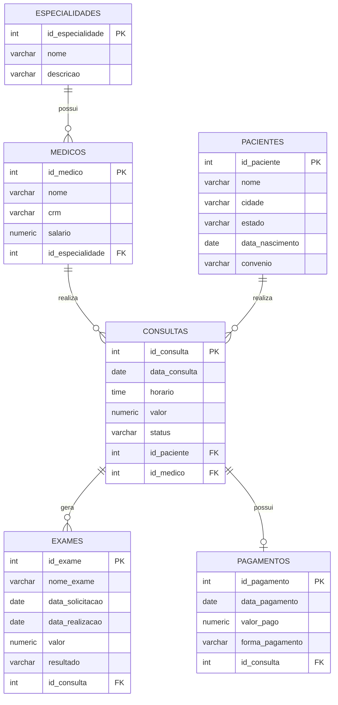
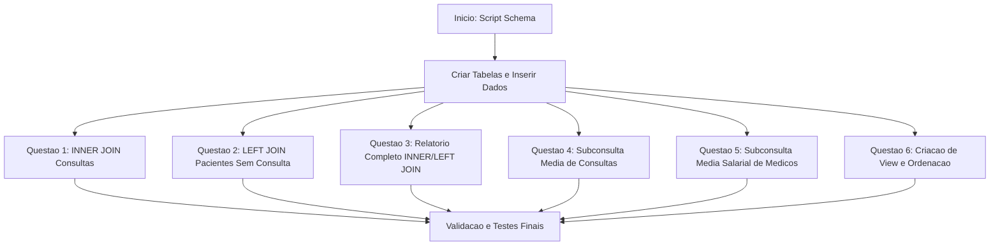

# Trabalho — Avaliação de TABD

> **Professor:** Welington Garcia
> **Disciplina:** Tópicos Avançados em Banco de Dados (4º Semestre)
> **Prazo de Entrega:** 10/09/2026 às 20:59
> **Pontuação Máxima:** 100 pontos
> **Conteúdo cobrado:** [Aula 01 - Consultas Avançadas com Joins e Subselects](../../Aulas/Aula%2001%20-%20Consultas%20Avan%C3%A7adas%20com%20Joins%20e%20Subselects/detalhes.md), [Aula 02 - Views e Materialized Views em PostgreSQL](../../Aulas/Aula%2002%20-%20Views%20e%20Materialized%20Views%20em%20PostgreSQL/detalhes.md), [Aula 03 - Stored Procedures e Programacao PL pgSQL](../../Aulas/Aula%2003%20-%20Stored%20Procedures%20e%20Programacao%20PL%20pgSQL/detalhes.md)

---

## Sumário
1. [Enunciado original](#enunciado-original-google-classroom)
2. [Análise do que é pedido](#análise-do-que-é-pedido)
3. [Fundamentação teórica](#fundamentação-teórica)
4. [Resolução proposta](#resolução-proposta)
5. [Como testar e validar](#como-testar-e-validar)
6. [Critérios de qualidade](#critérios-de-qualidade)
7. [Arquivos de apoio](#arquivos-de-apoio)
8. [Mapa da atividade](#mapa-da-atividade)
9. [Glossário](#glossário)
10. [Pontos-chave para a prova](#pontos-chave-para-a-prova)
11. [Perguntas e respostas (JSONL)](#perguntas-e-respostas-jsonl)
12. [Checklist de revisão](#checklist-de-revisão)

---

## Enunciado original (Google Classroom)

### Avaliação de TABD (09/09/2026)

1. Consultas com paciente, médico e especialidade (2 pontos)
Crie uma consulta que exiba:
- código da consulta;
- data da consulta;
- nome do paciente;
- nome do médico;
- nome da especialidade;
- status da consulta.
Utilize INNER JOIN.

2. Pacientes sem consultas (1 ponto)
Exiba todos os pacientes e, quando existir, suas respectivas consultas. Depois filtre o resultado para mostrar somente os pacientes que nunca realizaram nenhuma consulta.
Utilize LEFT JOIN.

3. Consultas, exames e pagamentos (2 pontos)
Crie um relatório que apresente:
- código da consulta;
- nome do paciente;
- nome do médico;
- nome do exame;
- valor do exame;
- forma de pagamento;
- valor pago.
Todas as consultas devem aparecer, mesmo que ainda não possuam exame ou pagamento.
Utilize uma combinação de INNER JOIN e LEFT JOIN.

4. Consultas acima da média de valor (1,5 pontos)
Exiba todas as consultas cujo valor seja maior que a média de valor de todas as consultas.
O resultado deve apresentar:
- código da consulta;
- data da consulta;
- valor;
- status.
A média deverá ser calculada por uma subconsulta.

5. Médicos com salário acima da média (1,5 pontos)
Exiba os médicos cujo salário seja superior à média salarial de todos os médicos cadastrados.
O resultado deve apresentar:
- código do médico;
- nome;
- CRM;
- salário.
Utilize a subconsulta no WHERE.

6. Crie uma view chamada vw_consultas_realizadas. Essa view deverá apresentar somente as consultas com status igual a Realizada. (2,0 pontos)
A view deverá exibir:
- código da consulta;
- data da consulta;
- nome do paciente;
- nome do médico;
- especialidade do médico;
- valor da consulta.
Depois de criar a view, faça uma consulta sobre ela exibindo apenas as consultas com valor superior a R$ 350,00, ordenadas do maior para o menor valor.

---

## Análise do que é pedido

A avaliação prática de Tópicos Avançados em Banco de Dados (TABD) exige o domínio de manipulação avançada de dados relacionais em ambiente PostgreSQL. Os requisitos dividem-se em três eixos centrais:

1. **Junções relacionais (`INNER JOIN` e `LEFT JOIN`)**: Garantir a correta combinação de tabelas com base em chaves estrangeiras (`fk`), assegurando a recuperação de dados completos ou o tratamento de cardinalidades nulas (como pacientes sem consultas e consultas sem exames/pagamentos).
2. **Subconsultas (*Subqueries*)**: Utilização de subconsultas escalares no predicado (`WHERE`) para cálculos estatísticos dinâmicos (médias de valores e salários), evitando valores hardcoded.
3. **Visões (*Views*)**: Encapsulamento de regras de negócio complexas e filtradas (`status = 'Realizada'`) em uma visão virtual persistida, permitindo consultas e ordenações subsequentes (`ORDER BY`) eficientes.

---

## Fundamentação teórica

O domínio acadêmico e profissional de bancos de dados relacionais avançados exige a compreensão profunda dos operadores de álgebra relacional implementados via SQL.

### Modelo Entidade-Relacionamento do Domínio
Abaixo encontra-se a representação estrutural das tabelas envolvidas no sistema de clínica médica, modelada no padrão do sistema PostgreSQL.



### Conceitos Fundamentais

#### 1. Junções Externas e Internas (`INNER JOIN` e `LEFT JOIN`)
* **Definição**: Operações que combinam colunas de duas ou mais tabelas baseando-se em uma condição de igualdade (ou predicado lógico) entre colunas correspondentes. O `INNER JOIN` retorna apenas as linhas que possuem correspondência em ambas as tabelas. O `LEFT JOIN` preserva todas as linhas da tabela à esquerda, preenchendo com `NULL` as colunas da tabela à direita caso não haja correspondência.
* **Motivação**: Em sistemas corporativos, dados incompletos ou opcionais são comuns (ex: um paciente cadastrado que ainda não agendou consulta). O `LEFT JOIN` é indispensável para auditorias de integridade e relatórios de pendências.
* **Exemplo**: Listar todos os pacientes e suas consultas.
* **Contraexemplo**: Utilizar `INNER JOIN` para procurar itens não cadastrados; o resultado será um conjunto vazio, pois o `INNER JOIN` descarta registros sem correspondência.
* **Armadilhas**: Filtrar colunas da tabela à direita na cláusula `WHERE` sem tratar valores `NULL` transforma inadvertidamente um `LEFT JOIN` em um `INNER JOIN`.

#### 2. Subconsultas Escalares no `WHERE`
* **Definição**: Consultas SQL aninhadas dentro de outra consulta (`SELECT`, `INSERT`, `UPDATE` ou `DELETE`) que retornam um único valor escalar (uma linha e uma coluna) utilizado como parâmetro de comparação.
* **Motivação**: Dinamizar filtros sem depender de valores fixos calculados manualmente, adaptando-se a atualizações automáticas na base de dados.
* **Exemplo**: `WHERE salario > (SELECT AVG(salario) FROM medicos)`
* **Contraexemplo**: Utilizar operadores de comparação (`=`, `>`, `<`) com subconsultas que retornam múltiplas linhas, gerando erro de execução no banco de dados.
* **Armadilhas**: Impacto de desempenho em tabelas volumosas caso a subconsulta seja correlacionada de forma ineficiente (executada a cada linha da tabela externa).

#### 3. Visões (*Views*)
* **Definição**: Objetos de banco de dados que armazenam uma instrução `SELECT` pré-compilada, comportando-se como uma tabela virtual.
* **Motivação**: Simplificar consultas complexas para aplicações clientes, isolar usuários de alterações estruturais e aplicar regras de segurança/filtragem de dados.
* **Exemplo**: `CREATE VIEW vw_consultas_realizadas AS SELECT ... WHERE status = 'Realizada';`
* **Contraexemplo**: Tentar armazenar dados físicos diretamente em uma view padrão sem ser uma *Materialized View* (visões padrão recalculam os dados a cada acesso).
* **Armadilhas**: Criar views excessivamente aninhadas (uma view consultando outra view), o que degrada o plano de execução do otimizador de consultas.

---

## Resolução proposta

Os códigos a seguir correspondem às resoluções exatas para cada questão proposta, baseando-se no script fornecido pelo professor Welington Garcia (`schema.sql`). Os arquivos completos encontram-se em `./codigo/schema.sql` e `./codigo/resolucao_exercicios.sql`.

### Questão 1: Consultas com paciente, médico e especialidade (`INNER JOIN`)

```sql
SELECT 
    c.id_consulta,
    c.data_consulta,
    p.nome AS nome_paciente,
    m.nome AS nome_medico,
    e.nome AS nome_especialidade,
    c.status
FROM consultas c
INNER JOIN pacientes p ON c.id_paciente = p.id_paciente
INNER JOIN medicos m ON c.id_medico = m.id_medico
INNER JOIN especialidades e ON m.id_especialidade = e.id_especialidade;
```

### Questão 2: Pacientes sem consultas (`LEFT JOIN`)

```sql
SELECT 
    p.id_paciente,
    p.nome AS nome_paciente,
    p.cidade,
    c.id_consulta,
    c.data_consulta
FROM pacientes p
LEFT JOIN consultas c ON p.id_paciente = c.id_paciente
WHERE c.id_consulta IS NULL;
```

### Questão 3: Consultas, exames e pagamentos (`INNER` e `LEFT JOIN` combinados)

```sql
SELECT 
    c.id_consulta,
    p.nome AS nome_paciente,
    m.nome AS nome_medico,
    e.nome_exame,
    e.valor AS valor_exame,
    pag.forma_pagamento,
    pag.valor_pago
FROM consultas c
INNER JOIN pacientes p ON c.id_paciente = p.id_paciente
INNER JOIN medicos m ON c.id_medico = m.id_medico
LEFT JOIN exames e ON c.id_consulta = e.id_consulta
LEFT JOIN pagamentos pag ON c.id_consulta = pag.id_consulta;
```

### Questão 4: Consultas acima da média de valor (Subconsulta)

```sql
SELECT 
    id_consulta,
    data_consulta,
    valor,
    status
FROM consultas
WHERE valor > (
    SELECT AVG(valor) 
    FROM consultas
);
```

### Questão 5: Médicos com salário acima da média (Subconsulta no `WHERE`)

```sql
SELECT 
    id_medico,
    nome,
    crm,
    salario
FROM medicos
WHERE salario > (
    SELECT AVG(salario) 
    FROM medicos
);
```

### Questão 6: Criação de View e consulta especializada

```sql
-- Criação da View
CREATE OR REPLACE VIEW vw_consultas_realizadas AS
SELECT 
    c.id_consulta,
    c.data_consulta,
    p.nome AS nome_paciente,
    m.nome AS nome_medico,
    e.nome AS especialidade_medico,
    c.valor AS valor_consulta
FROM consultas c
INNER JOIN pacientes p ON c.id_paciente = p.id_paciente
INNER JOIN medicos m ON c.id_medico = m.id_medico
INNER JOIN especialidades e ON m.id_especialidade = e.id_especialidade
WHERE c.status = 'Realizada';

-- Consulta sobre a View solicitada
SELECT 
    id_consulta,
    data_consulta,
    nome_paciente,
    nome_medico,
    especialidade_medico,
    valor_consulta
FROM vw_consultas_realizadas
WHERE valor_consulta > 350.00
ORDER BY valor_consulta DESC;
```

---

## Como testar e validar

Para executar e validar os scripts em um ambiente PostgreSQL local ou laboratório da UniFEF:

1. Abra o seu cliente PostgreSQL (psql, DBeaver, pgAdmin ou VS Code com extensão SQLTools).
2. Execute o script de criação do banco e tabelas fornecido:
   - Arquivo: `./codigo/schema.sql`
3. Certifique-se de que o banco `clinica_avaliacao` foi selecionado (`\c clinica_avaliacao` no psql).
4. Execute o script de resoluções:
   - Arquivo: `./codigo/resolucao_exercicios.sql`
5. Confira os resultados no console comparando com as restrições de cada questão (ex: o paciente de ID 12 deve aparecer na questão 2; a view deve retornar apenas registros com status `Realizada`).

---

## Critérios de qualidade

* **Integridade Referencial**: Uso rigoroso de chaves estrangeiras com restrições `ON UPDATE` e `ON DELETE` adequadas.
* **Legibilidade**: Uso de aliases padronizados para tabelas e colunas, facilitando a manutenção e correção por parte do corpo docente.
* **Otimização**: Subconsultas não correlacionadas utilizadas quando aplicável para garantir eficiência na execução pelo SGBD.
* **Padronização**: Nomes de objetos em minúsculas e snake_case, conforme as convenções recomendadas em PostgreSQL.

---

## Arquivos de apoio

* [Schema do Banco de Dados](./codigo/schema.sql)
* [Script de Resolução dos Exercícios](./codigo/resolucao_exercicios.sql)
* [DER - Diagrama Entidade-Relacionamento (Anexo)](./Anexo-DER.png)

---

## Mapa da atividade



---

## Glossário

| Termo | Definição |
| :--- | :--- |
| **INNER JOIN** | Retorna apenas os registros que possuem correspondência em ambas as tabelas envolvidas na junção. |
| **LEFT JOIN** | Retorna todos os registros da tabela à esquerda e os correspondentes da tabela à direita, preenchendo com nulos os ausentes. |
| **Subconsulta** | Uma instrução SQL SELECT aninhada dentro de outra instrução principal. |
| **View** | Objeto de banco de dados que representa um conjunto de dados resultante de uma consulta SQL pré-definida. |
| **SERIAL** | Tipo de dado pseudo-coluna do PostgreSQL utilizado para autoincremento de chaves primárias inteiras. |
| **CRM** | Conselho Regional de Medicina; registro profissional único utilizado como chave natural/alternativa para médicos. |

---

## Pontos-chave para a prova

1. A diferença entre `INNER JOIN` e `LEFT JOIN` quanto à preservação de linhas sem correspondência.
2. A sintaxe correta para subconsultas no `WHERE` comparando colunas com funções de agregação (`AVG`, `SUM`, `MAX`).
3. Como declarar, persistir e consultar dados a partir de uma `VIEW` no PostgreSQL.
4. O tratamento de valores nulos (`IS NULL`) em junções externas para identificar ausência de registros associados.

---

## Perguntas e respostas (JSONL)

```jsonl
{"pergunta": "Qual operador de junção retorna todos os registros da tabela à esquerda, mesmo sem correspondência à direita?", "resposta": "LEFT JOIN", "dificuldade": "Fácil"}
{"pergunta": "Qual comando SQL é utilizado para criar uma tabela virtual baseada em uma consulta?", "resposta": "CREATE VIEW", "dificuldade": "Média"}
{"pergunta": "Na questão 4, qual cláusula abriga a subconsulta para calcular a média dos valores das consultas?", "resposta": "WHERE", "dificuldade": "Média"}
{"pergunta": "O que ocorre quando utilizamos INNER JOIN entre uma tabela de pacientes e consultas, onde um paciente não possui consultas?", "resposta": "O paciente é omitido do resultado.", "dificuldade": "Fácil"}
{"pergunta": "Qual restrição garante que cada pagamento pertença a exatamente uma consulta de forma exclusiva na tabela pagamentos?", "resposta": "UNIQUE no campo id_consulta", "dificuldade": "Difícil"}
{"pergunta": "Como filtrar registros nulos resultantes de um LEFT JOIN em uma coluna de outra tabela?", "resposta": "Utilizando a cláusula IS NULL", "dificuldade": "Média"}
{"pergunta": "Qual tipo de dado do PostgreSQL é comumente utilizado para chaves primárias autoincrementadas?", "resposta": "SERIAL", "dificuldade": "Fácil"}
{"pergunta": "É possível realizar ordenação (ORDER BY) diretamente ao consultar uma View criada anteriormente?", "resposta": "Sim", "dificuldade": "Fácil"}
{"pergunta": "No contexto da Questão 3, quais junções são necessárias para abranger consultas, exames e pagamentos de forma opcional?", "resposta": "INNER JOIN para pacientes e médicos, e LEFT JOIN para exames e pagamentos.", "dificuldade": "Difícil"}
{"pergunta": "Qual função de agregação foi solicitada para calcular os valores médios nas questões 4 e 5?", "resposta": "AVG", "dificuldade": "Fácil"}
{"pergunta": "O que significa a sigla CRM presente na tabela de médicos?", "resposta": "Conselho Regional de Medicina", "dificuldade": "Fácil"}
{"pergunta": "Qual comando remove uma tabela existente no PostgreSQL evitando erros caso ela não exista?", "resposta": "DROP TABLE IF EXISTS", "dificuldade": "Fácil"}
{"pergunta": "O modificador CASCADE no comando DROP TABLE serve para quê?", "resposta": "Remover objetos dependentes em cascata, como chaves estrangeiras.", "dificuldade": "Média"}
{"pergunta": "Qual é a cardinalidade entre a tabela especialidades e medicos?", "resposta": "Um para muitos (1:N)", "dificuldade": "Média"}
{"pergunta": "Uma View padrão do PostgreSQL armazena os dados fisicamente em disco como uma tabela convencional?", "resposta": "Não, ela executa a consulta subjacente a cada acesso (exceto em Materialized Views).", "dificuldade": "Difícil"}
```

---

## Checklist de revisão

- [ ] Script `schema.sql` executado sem erros no PostgreSQL.
- [ ] Questão 1 resolvida com `INNER JOIN` correto entre quatro tabelas.
- [ ] Questão 2 validada com `LEFT JOIN` e filtro `IS NULL` para pacientes sem consultas.
- [ ] Questão 3 combinando `INNER JOIN` e `LEFT JOIN` com sucesso.
- [ ] Questão 4 implementada com subconsulta escalar para média de valores.
- [ ] Questão 5 implementada com subconsulta no `WHERE` para média salarial.
- [ ] Questão 6 com `CREATE VIEW` correta e consulta ordenada por valor decrescente.
- [ ] Documentação revisada quanto à formatação em Markdown puro e diagramas em Mermaid.
