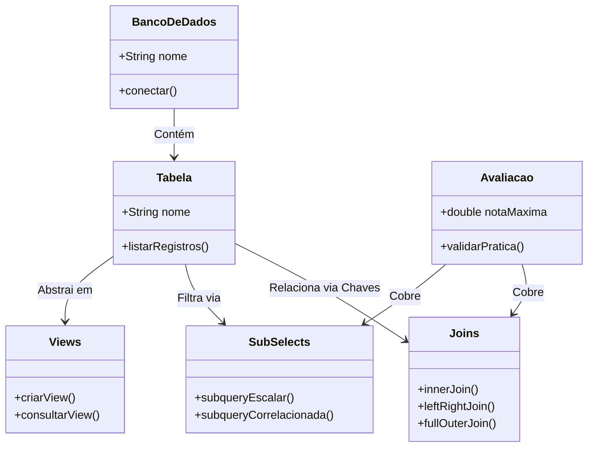

# 🎓 [Prof. Welington Garcia] Tópicos Avançados em Banco de Dados
> **Semestre:** 4º Semestre  
> **Curso:** Bacharelado em Sistemas de Informação (UniFEF)  
> **Professor:** Welington Garcia  

---

## 🎯 Objetivos de Aprendizagem e Ementa

A disciplina de **Tópicos Avançados em Banco de Dados** foi desenhada para elevar o conhecimento do aluno de Sistemas de Informação além do básico de SQL. No 4º semestre, o foco é aprofundar a lógica de manipulação e otimização de dados relacionais e avançar em estruturas que garantem performance, reuso e segurança em sistemas corporativos.

### **Ementa e Tópicos Principais:**
1. **Consultas Complexas e Otimização:** Uso avançado de *Joins* (INNER, LEFT, RIGHT, FULL, CROSS) para cruzamento de grandes volumétricas de dados.
2. **Subconsultas (*Subqueries*):** Emprego de subselects correlacionadas e não correlacionadas, cláusulas `EXISTS`, `IN`, `ANY` e `ALL`.
3. **Visões (*Views*):** Criação e gerenciamento de tabelas virtuais para segurança, simplificação de consultas e abstração de dados.
4. **Programação em Banco de Dados:** Introdução a Stored Procedures, Triggers e Funções (conforme aplicável no ecossistema da disciplina).
5. **Boas Práticas e Performance:** Análise de planos de execução e estruturação eficiente de consultas para ambientes de alta demanda.

---

## 🏗️ Arquitetura e Modelagem do Conhecimento

O diagrama abaixo ilustra a relação conceitual entre os principais módulos abordados ao longo do semestre na disciplina:



---

## 📂 Estrutura das Pastas e Organização

O repositório está estruturado de forma modular para facilitar a navegação e o estudo autônomo:

```bash
.
├── 📂 Aulas/
│   ├── 📂 Aulas Joins e Sub selects/     # Slides HTML de Joins e Subselects
│   └── 📂 Views/                          # Slide HTML de Views
├── 📂 Trabalhos/
│   └── 📂 Exercicios Joins/               # Enunciado + script de resolução (.sql)
├── 📂 Provas/
│   ├── 📂 Exercicios SubSelects - parte 01/
│   └── 📂 Exerciciso - SUbSelect - parte 2/
└── 📂 Resumos-IA/                         # Material de apoio gerado por IA — tudo em um único README
    ├── 📄 README.md                       # Resumo, exercícios, simulado, cheatsheet e diagramas
    ├── 📊 Slides-Revisao-[...].pptx        # Apresentação de revisão (dark mode, 5 slides)
    ├── 📇 flashcards-anki.tsv             # Baralho para importar no Anki
    └── 🤖 dataset-estudo-qa.jsonl         # Dataset de perguntas e respostas
```

Cada subpasta de `Aulas/`, `Trabalhos/` e `Provas/` contém um `detalhes.md` com o enunciado/contexto original e os arquivos entregues (scripts `.sql`, documentos do professor etc).

---

## 🚀 Como Estudar com Este Material

1. **Base Teórica:** Comece revisando os materiais disponíveis na pasta `Aulas/` (Joins/Subselects e Views).
2. **Prática Ativa:** Execute os códigos SQL em seu SGBD de preferência (PostgreSQL recomendado).
3. **Fixação:** [`Resumos-IA/README.md`](./Resumos-IA/README.md) reúne resumo executivo, exercícios comentados, simulado com gabarito, cheat sheet e diagramas — tudo em um único documento. Importe [`Resumos-IA/flashcards-anki.tsv`](./Resumos-IA/flashcards-anki.tsv) no [Anki](https://apps.ankiweb.net/) para memorização ativa.
4. **Desafios:** Resolva os exercícios práticos presentes nas seções de `Trabalhos/` e `Provas/` sem olhar o gabarito primeiro.

---

# 📚 Conteúdo Acadêmico

---

## 📘 Aulas: Joins e Subselects

> **Professor:** Prof. Welington Garcia  
> **Disciplina:** Tópicos Avançados em Banco de Dados  

### 📌 Visão Geral
Módulo dedicado ao estudo profundo de cruzamento de tabelas relacionais. O aluno aprende a combinar dados de múltiplas fontes utilizando os diferentes tipos de `JOIN` e a aplicar lógica avançada de filtragem através de subconsultas aninhadas.

---

## 📘 Views

> **Professor:** Prof. Welington Garcia  
> **Disciplina:** Tópicos Avançados em Banco de Dados  

### 📌 Visão Geral
Estudo sobre a criação e utilização de **Views (Visões)**. O conteúdo aborda como encapsular consultas complexas, restringir o acesso direto a colunas sensíveis de tabelas e simplificar a interface de desenvolvimento para aplicações cliente.

---

## 📝 Prova / Avaliação: Exercicios SubSelects - parte 01

> **Professor:** Prof. Welington Garcia  
> **Disciplina:** Tópicos Avançados em Banco de Dados (4º Semestre)  
> **Pontuação Máxima:** 100 pontos  

### 🎯 Descrição da Atividade
Primeira bateria de exercícios práticos focada no uso de subconsultas (*SubSelects*). Os desafios exigem o uso de subqueries em cláusulas `WHERE` e `HAVING`, avaliando a capacidade do aluno de resolver problemas lógicos complexos dividindo-os em consultas menores.

---

## 📝 Prova / Avaliação: Exercicios - SubSelect - parte 2

> **Professor:** Prof. Welington Garcia  
> **Disciplina:** Tópicos Avançados em Banco de Dados (4º Semestre)  
> **Prazo de Entrega:** 03/09/2026 às 02:59  
> **Pontuação Máxima:** 100 pontos  

### 🎯 Descrição da Atividade
Continuação avançada da avaliação de subselects. Esta parte introduz subconsultas correlacionadas e o uso de operadores avançados (`EXISTS`, `NOT EXISTS`), testando a performance e o raciocínio lógico em cenários de banco de dados corporativos.

---

## 📋 Trabalho: Exercicios Joins

> **Professor:** Prof. Welington Garcia  
> **Disciplina:** Tópicos Avançados em Banco de Dados (4º Semestre)  
> **Pontuação Máxima:** 100 pontos  

### 🎯 Descrição da Atividade
Trabalho prático consolidando o uso de junções (`INNER JOIN`, `LEFT JOIN`, `RIGHT JOIN`, `FULL OUTER JOIN` e *Cross Joins*). O aluno deve resolver um *case* real modelando consultas que cruzam dados de clientes, pedidos, produtos e fornecedores.