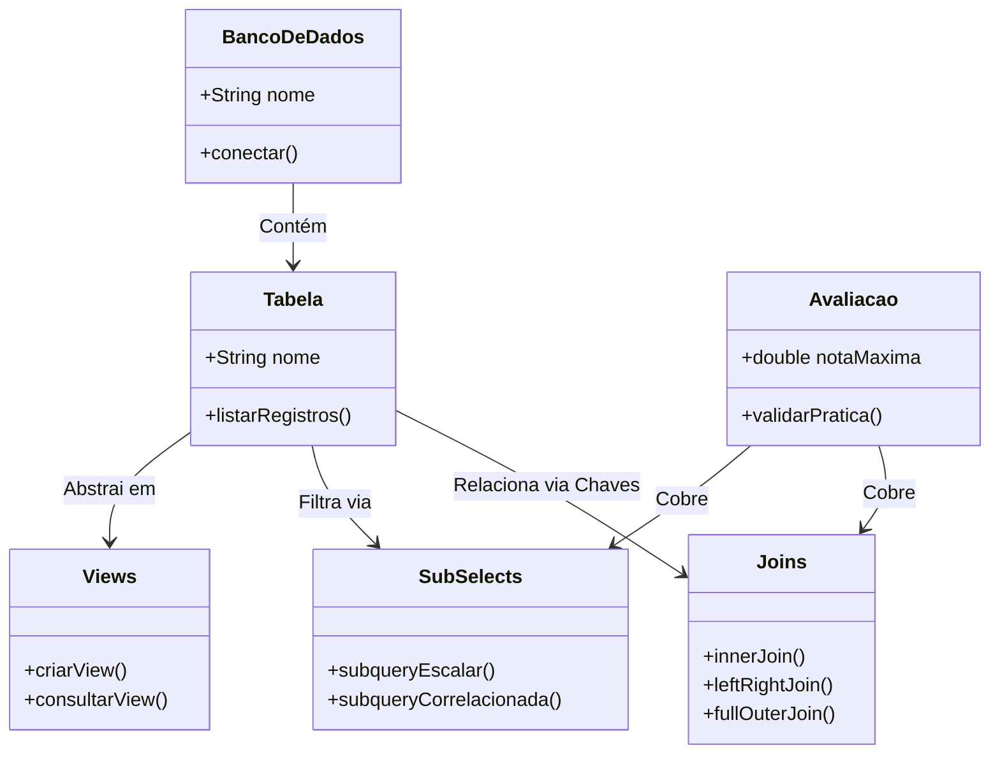
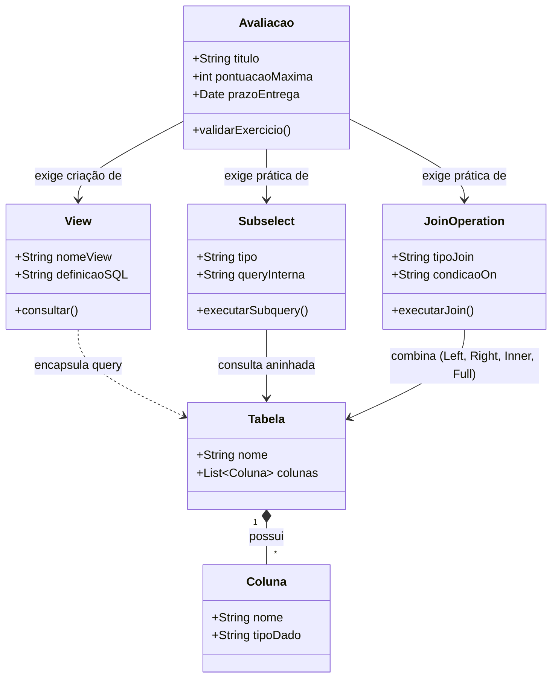
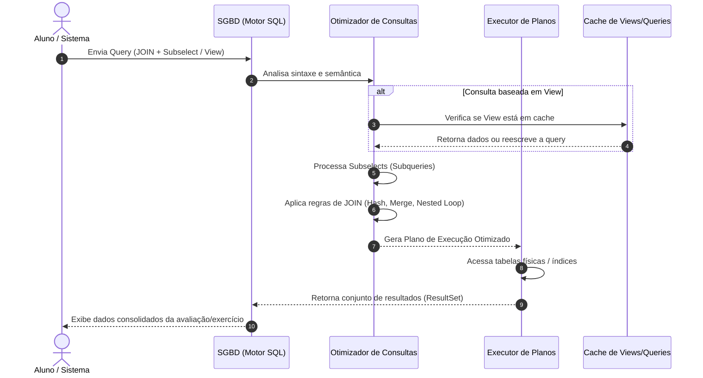
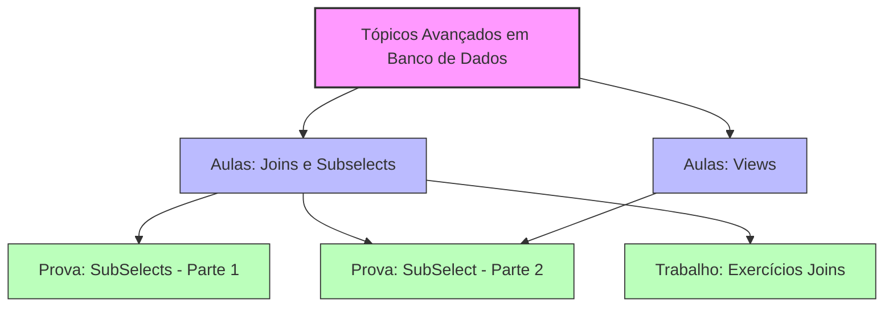

# Tópicos Avançados em Banco de Dados

> **Semestre:** 4º Semestre
> **Curso:** Bacharelado em Sistemas de Informação (UniFEF)
> **Professor:** Welington Garcia
> **Escopo:** JOINs, Subconsultas (Subqueries) e Views em SQL/PostgreSQL

---

## Sumário

1. [Objetivos de Aprendizagem e Ementa](#objetivos-de-aprendizagem-e-ementa)
2. [Aulas](#aulas)
3. [Como Estudar com Este Material](#como-estudar-com-este-material)
4. [Estrutura do Repositório](#estrutura-do-repositório)
5. [Resumo Executivo](#resumo-executivo)
6. [Exercícios Práticos Implementados](#exercícios-práticos-implementados)
7. [Simulado Comentado](#simulado-comentado)
8. [CheatSheet de Revisão Rápida](#cheatsheet-de-revisão-rápida)
9. [Diagramas e Modelagem](#diagramas-e-modelagem)
10. [Material Complementar (Slides, Flashcards, Dataset)](#material-complementar)

---

## Objetivos de Aprendizagem e Ementa

A disciplina **Tópicos Avançados em Banco de Dados**, ministrada pelo **Prof. Welington Garcia**, eleva o conhecimento do aluno além do básico de SQL, aprofundando a lógica de manipulação e otimização de dados relacionais em **PostgreSQL** e avançando em estruturas que garantem performance, reuso e segurança em sistemas corporativos.

### Ementa e tópicos principais

1. **Consultas complexas e otimização** — uso avançado de *Joins* (`INNER`, `LEFT`, `RIGHT`, `FULL`, `CROSS`, `SELF`) para cruzamento de tabelas.
2. **Subconsultas (*Subqueries*)** — subselects escalares, correlacionadas e não correlacionadas; `IN`, `NOT IN`, `EXISTS`, `ANY`, `ALL`.
3. **Views** — criação e gerenciamento de tabelas virtuais para segurança, simplificação de consultas e abstração de dados; *materialized views*.
4. **Boas práticas e performance** — análise de planos de execução (`EXPLAIN ANALYZE`) e estruturação eficiente de consultas.

---

## Aulas

| Aula | Tema | Material |
| :--- | :--- | :--- |
| 1 | Joins e Subconsultas em SQL | [Conteúdo completo](Aulas/Aulas%20Joins%20e%20Sub%20selects/detalhes.md) · [Slides Joins](Aulas/Aulas%20Joins%20e%20Sub%20selects/aula_joins_postgresql.html) · [Slides Subselects](Aulas/Aulas%20Joins%20e%20Sub%20selects/subselect.html) · [Modelo ER](Aulas/Aulas%20Joins%20e%20Sub%20selects/diagramas/modelo-relacional-joins-subselects.svg) |
| 2 | Views (comuns e materializadas) | [Conteúdo completo](Aulas/Views/detalhes.md) · [Slides](Aulas/Views/views.html) · [Diagrama de classes](Aulas/Views/diagramas/views-vs-materialized-view-classes.svg) · [Diagrama de atividades](Aulas/Views/diagramas/resolucao-consulta-view-atividades.svg) |

| Avaliação | Tema | Material |
| :--- | :--- | :--- |
| Trabalho | Exercícios de Joins (10 questões) | [Enunciado e gabarito](Trabalhos/Exercicios%20Joins/detalhes.md) |
| Prova — parte 1 | Subconsultas: escalar, `IN`/`NOT IN`, `EXISTS`, `ANY`/`ALL`, correlacionada (20 questões) | [Enunciado](Provas/Exercicios%20SubSelects%20-%20parte%2001/detalhes.md) |
| Prova — parte 2 | Subconsultas avançadas: tabela derivada, `INSERT`/`UPDATE`/`DELETE`, `EXPLAIN ANALYZE` (10 questões) | [Enunciado](Provas/Exerciciso%20-%20SUbSelect%20-%20parte%202/detalhes.md) |

---

## Como Estudar com Este Material

1. **Base teórica** — comece pelo conteúdo completo de cada aula em `Aulas/*/detalhes.md` (teoria, exemplos e exercícios de fixação com gabarito).
2. **Prática ativa** — execute os scripts SQL em um SGBD PostgreSQL (recomendado) usando os modelos de dados descritos em cada aula.
3. **Fixação** — este README reúne resumo executivo, exercícios comentados, simulado com gabarito, cheatsheet e diagramas. Importe [`Resumos-IA/flashcards-anki.tsv`](./Resumos-IA/flashcards-anki.tsv) no [Anki](https://apps.ankiweb.net/) para memorização ativa.
4. **Desafios** — resolva os exercícios de `Trabalhos/` e `Provas/` sem consultar o gabarito primeiro; os enunciados originais (`.docx`) e scripts de apoio (`.sql`) estão anexados em cada pasta.

---

## Estrutura do Repositório

```bash
.
├── Aulas/
│   ├── Aulas Joins e Sub selects/
│   │   ├── detalhes.md              # Conteúdo completo: teoria + exemplos + exercícios
│   │   ├── diagramas/                # PlantUML (.puml) + SVG renderizado
│   │   ├── aula_joins_postgresql.html
│   │   └── subselect.html
│   └── Views/
│       ├── detalhes.md
│       ├── diagramas/
│       └── views.html
├── Trabalhos/
│   └── Exercicios Joins/             # Enunciado (.docx) + script de resolução (.sql)
├── Provas/
│   ├── Exercicios SubSelects - parte 01/
│   └── Exerciciso - SUbSelect - parte 2/
└── Resumos-IA/                       # Material de apoio gerado por IA
    ├── Slides-Revisao-[...].pptx     # Apresentação de revisão (dark mode, 5 slides)
    ├── flashcards-anki.tsv           # Baralho para importar no Anki
    └── dataset-estudo-qa.jsonl       # Dataset de perguntas e respostas
```

Cada subpasta de `Aulas/`, `Trabalhos/` e `Provas/` contém um `detalhes.md` com o conteúdo completo (ou o enunciado/contexto original e os arquivos entregues — scripts `.sql`, documentos do professor). Diagramas ficam em uma subpasta local `diagramas/`, com o `.puml` fonte ao lado do `.svg` renderizado.

---

## Arquitetura e Modelagem do Conhecimento



---

## Resumo Executivo

### Visão geral e objetivos da matéria

A disciplina consolida a transição do modelo relacional básico para operações complexas de alta performance, capacitando o estudante a projetar consultas robustas para relatórios gerenciais, APIs, *dashboards* e sistemas corporativos. Os principais objetivos pedagógicos incluem compreender a arquitetura e a normalização de dados; dominar a combinatória de dados por meio de diferentes tipos de `JOIN`s; utilizar subconsultas, expressões relacionais e agregações avançadas; e escrever SQL limpo, performático e livre de ambiguidades estruturais.

### Conceitos-chave e terminologia fundamental

* **Chave primária (`PRIMARY KEY`)** — identifica de forma única cada registro de uma tabela.
* **Chave estrangeira (`FOREIGN KEY`)** — referencia a chave primária de outra tabela, garantindo integridade referencial.
* **Junção (`JOIN`)** — combina linhas de duas ou mais tabelas com base em uma condição lógica compartilhada.
* **Aliases (`AS`)** — apelidos de tabelas/colunas para simplificar a sintaxe e evitar ambiguidades.
* **Produto cartesiano** — combinação de *todas* as linhas de uma tabela com *todas* as linhas de outra, gerado pela ausência de condição de junção.
* **Funções de agregação** — `COUNT()`, `SUM()`, `AVG()`, `MIN()`, `MAX()`, combinadas com `GROUP BY`.
* **`COALESCE`** — substitui valores `NULL` por um valor padrão em relatórios.

### Relação com o mercado e prática profissional

* **APIs e microsserviços** — consultas SQL otimizadas delegam ao motor relacional o trabalho que, de outra forma, exigiria loops custosos na camada de aplicação.
* **Business Intelligence e relatórios** — dashboards (Power BI, Metabase, Superset) dependem de `LEFT JOIN` e agregações para lidar com métricas que exigem denominador zero (ex.: faturamento por cliente, inclusive os sem compras).
* **Auditoria de dados** — `FULL OUTER JOIN` e a busca por nulos (`IS NULL`) são ferramentas diárias de DBAs e engenheiros de dados para localizar inconsistências em migrações.

### Dicas de ouro para estudo e provas

1. Nunca esqueça a condição de junção no `ON` — sua ausência gera um produto cartesiano.
2. Domine o padrão `LEFT JOIN` + `WHERE ... IS NULL` para encontrar registros órfãos — é o clássico "liste os que nunca fizeram X".
3. Regra do `GROUP BY`: toda coluna no `SELECT` que não está numa função agregada precisa estar no `GROUP BY`.
4. Sequência de raciocínio: (1) identifique as tabelas com os dados; (2) ache as chaves que as conectam; (3) defina a tabela base (`LEFT`/`INNER`); (4) adicione agregações e ordenações.
5. Prefira `ON tabela1.id = tabela2.id` explícito a `NATURAL JOIN`/`USING` em produção — mais previsível e menos propenso a bugs silenciosos.

---

## Exercícios Práticos Implementados

Ambiente de banco (DDL + DML) e exemplos resolvidos de Joins e Subconsultas em PostgreSQL, testados em *pgAdmin*, *DBeaver* ou `psql`. Cobre: `INNER`/`LEFT`/`SELF JOIN`, anti-join, `COALESCE`, subconsulta escalar, `IN`, `EXISTS` correlacionada, e a atividade prática do Sistema de Biblioteca — o conjunto completo de exemplos comentados está em [`Aulas/Aulas Joins e Sub selects/detalhes.md`](Aulas/Aulas%20Joins%20e%20Sub%20selects/detalhes.md#parte-1--joins) e [`Aulas/Views/detalhes.md`](Aulas/Views/detalhes.md).

---

## Simulado Comentado

Simulado com **10 questões de múltipla escolha** (gabarito comentado) e **5 questões discursivas / estudos de caso práticos**.

### Múltipla escolha

1. Qual operador de `JOIN` retorna **apenas** as linhas que possuem correspondência em ambas as tabelas?
 A) `LEFT OUTER JOIN` · B) `FULL OUTER JOIN` · **C) `INNER JOIN`** · D) `CROSS JOIN` · E) `NATURAL JOIN`
 > `INNER JOIN` retorna estritamente a interseção entre as tabelas cruzadas.

2. Um relatório deve listar todos os clientes, mesmo sem pedidos (colunas de pedido como `NULL`). Qual `JOIN` atende?
 A) `INNER JOIN` · **B) `LEFT JOIN`** · C) `RIGHT JOIN` (pedidos à esquerda) · D) `CROSS JOIN` · E) `SELF JOIN`
 > `LEFT JOIN` preserva todos os registros da esquerda (clientes), preenchendo `NULL` quando não há pedido correspondente.

3. `SELECT c.id_cliente, c.nome FROM clientes c LEFT JOIN pedidos p ON c.id_cliente = p.id_cliente WHERE p.id_pedido IS NULL;` — qual o objetivo?
 A) Clientes com pelo menos um pedido · B) Pedidos sem cliente · **C) Clientes que nunca fizeram pedido** · D) Produto cartesiano · E) Erro de sintaxe
 > Filtrar `IS NULL` após um `LEFT JOIN` isola exatamente os registros da tabela principal sem correspondência na secundária.

4. Sobre `CROSS JOIN`: (1) gera produto cartesiano; (2) exige `ON`; (3) 10 linhas × 5 linhas = 50 linhas resultantes.
 **A) Apenas 1 e 3** · B) Apenas 2 e 3 · C) Apenas 1 e 2 · D) Todas · E) Apenas 3
 > A afirmativa 2 é falsa — `CROSS JOIN` não usa `ON`.

5. Tabela `funcionarios(id_funcionario, nome, id_supervisor)` auto-referenciada. Para listar funcionário + nome do supervisor:
 A) `CROSS JOIN` · B) `FULL OUTER JOIN` · **C) `SELF JOIN`** · D) `NATURAL JOIN` · E) `RIGHT JOIN` estrito
 > `SELF JOIN` é a técnica onde a tabela se relaciona consigo mesma, ideal para hierarquias.

6. Diferença entre filtro no `ON` e no `WHERE` em `LEFT JOIN`?
 A) Não há diferença · B) `ON` é restrito a agregações · **C) Filtro no `WHERE` pode transformar em `INNER JOIN`** · D) `ON` elimina linhas da esquerda antes · E) `WHERE` não pode ser usado com `JOIN`
 > Filtro restritivo no `WHERE` sobre a tabela da direita descarta as linhas onde ela virou `NULL`, anulando o efeito do `LEFT JOIN`.

7. O que faz `COALESCE` com `LEFT JOIN`?
 A) Força `INNER JOIN` · **B) Substitui `NULL` por um valor padrão** · C) Soma colunas · D) Remove duplicatas · E) Converte tipos
 > `COALESCE(valor, 'Padrão')` retorna o segundo argumento quando o primeiro é `NULL`.

8. Sobre `NATURAL JOIN` e `USING`:
 A) `NATURAL JOIN` é recomendado em produção · **B) `USING` exige mesmo nome de coluna nas duas tabelas, mais seguro que `NATURAL JOIN`** · C) `NATURAL JOIN` exige `ON` · D) `USING` só em `CROSS JOIN` · E) Ambos impedem agregação
 > `USING` é explícito o suficiente para ser seguro; `NATURAL JOIN` é implícito e desaconselhado em produção.

9. Em consulta com `JOIN`s múltiplos e `SUM`, o que fazer com colunas não agregadas no `SELECT`?
 **A) Inseri-las obrigatoriamente no `GROUP BY`** · B) Precedê-las de `DISTINCT` · C) Omiti-las · D) Converter com `CAST` · E) Envolvê-las em `COALESCE`
 > Regra padrão SQL: toda coluna não agregada no `SELECT` deve constar no `GROUP BY`.

10. Cenário típico ideal para `FULL OUTER JOIN`?
 A) Produtos ignorando órfãos · B) Combinações de tamanho/cor · **C) Auditoria entre duas bases, identificando registros só de um lado ou de ambos** · D) Hierarquia corporativa · E) Filtro por média de compras
 > `FULL OUTER JOIN` traz correspondências + sobras de ambos os lados — ideal para auditoria e reconciliação.

### Questões discursivas e estudos de caso

**Q1 — Relatório com `LEFT JOIN` e `COALESCE`:** liste nome do produto, preço e categoria (`'Sem categoria'` quando nula).
```sql
SELECT pr.nome AS nome_produto, pr.preco, COALESCE(ca.nome, 'Sem categoria') AS categoria
FROM produtos pr
LEFT JOIN categorias ca ON pr.id_categoria = ca.id_categoria;
```

**Q2 — Análise de erro `ON` vs. `WHERE`:** a consulta abaixo se comporta como `INNER JOIN` por engano:
```sql
SELECT c.id_cliente, c.nome, p.id_pedido, p.status
FROM clientes c
LEFT JOIN pedidos p ON c.id_cliente = p.id_cliente
WHERE p.status = 'Cancelado';
```
> O filtro no `WHERE` é avaliado após a junção — clientes sem pedido têm `p.status = NULL`, e `NULL = 'Cancelado'` nunca é verdadeiro, eliminando-os.

Correção (movendo o filtro para o `ON`):
```sql
SELECT c.id_cliente, c.nome, p.id_pedido, p.status
FROM clientes c
LEFT JOIN pedidos p ON c.id_cliente = p.id_cliente AND p.status = 'Cancelado';
```

**Q3 — `SELF JOIN` com `COALESCE`**, supervisor de cada funcionário (`'Diretoria Executiva'` quando topo):
```sql
SELECT f.nome AS funcionario, f.cargo, COALESCE(s.nome, 'Diretoria Executiva') AS supervisor
FROM funcionarios f
LEFT JOIN funcionarios s ON f.id_supervisor = s.id_funcionario;
```

**Q4 — Faturamento total por cliente** (múltiplos `JOIN`s + agregação):
```sql
SELECT c.id_cliente, c.nome, SUM(ip.quantidade * ip.preco_unitario) AS faturamento_total
FROM clientes c
JOIN pedidos p ON c.id_cliente = p.id_cliente
JOIN itens_pedido ip ON p.id_pedido = ip.id_pedido
GROUP BY c.id_cliente, c.nome
ORDER BY faturamento_total DESC;
```

**Q5 — Auditoria com `FULL OUTER JOIN`** entre `clientes` e `pedidos_migrados`, isolando discrepâncias:
```sql
SELECT c.id_cliente, c.nome, pm.id_pedido, pm.status
FROM clientes c
FULL OUTER JOIN pedidos_migrados pm ON c.id_cliente = pm.id_cliente
WHERE c.id_cliente IS NULL OR pm.id_pedido IS NULL;
```

---

## CheatSheet de Revisão Rápida

### Guia visual dos JOINs

| Tipo de JOIN | Comportamento principal | Sem correspondência |
| :--- | :--- | :--- |
| `INNER JOIN` | Retorna **apenas** a interseção. | Linha **descartada** em ambos os lados. |
| `LEFT JOIN` | Tudo da esquerda + correspondências da direita. | Colunas da direita recebem `NULL`. |
| `RIGHT JOIN` | Tudo da direita + correspondências da esquerda. | Colunas da esquerda recebem `NULL`. |
| `FULL OUTER JOIN` | Tudo de **ambas** as tabelas. | Lados sem correspondência recebem `NULL`. |
| `CROSS JOIN` | Produto cartesiano (todas as combinações). | Multiplica linhas ($N \times M$). |
| `SELF JOIN` | Une a tabela com ela mesma (hierarquia). | Exige aliases diferentes. |

### Ponto crítico: `ON` vs. `WHERE` em `LEFT JOIN`

* **Filtro no `WHERE`** — transforma `LEFT JOIN` em `INNER JOIN` disfarçado.
* **Filtro no `ON`** — mantém todos os registros da esquerda.

### Padrões úteis

* Registros órfãos: `LEFT JOIN ... WHERE <chave_direita> IS NULL`.
* `COALESCE(valor, 'padrão')` para tratar `NULL`.
* Evite em produção: `USING (coluna)` e `NATURAL JOIN` (implícitos, propensos a erro).

---

## Diagramas e Modelagem

### Diagramas por aula (PlantUML)

Os diagramas específicos de cada aula ficam junto do respectivo `detalhes.md`, em `diagramas/` (fonte `.puml` + `.svg` renderizado):

- [Modelo relacional — Joins e Subconsultas](Aulas/Aulas%20Joins%20e%20Sub%20selects/diagramas/modelo-relacional-joins-subselects.svg) (diagrama ER)
- [View × Materialized View](Aulas/Views/diagramas/views-vs-materialized-view-classes.svg) (diagrama de classes)
- [Resolução de uma consulta sobre uma View](Aulas/Views/diagramas/resolucao-consulta-view-atividades.svg) (diagrama de atividades)

### Diagrama de classes UML (domínio de consultas avançadas)



### Diagrama de sequência (execução de consulta com Subselect e Join)



### Arquitetura da disciplina (tópicos × avaliações)



---

## Material Complementar

### Apresentação de revisão em slides

[`Resumos-IA/Slides-Revisao-[Prof. Welington Garcia] Tópicos Avançados em Banco de Dados.pptx`](./Resumos-IA/Slides-Revisao-%5BProf.%20Welington%20Garcia%5D%20T%C3%B3picos%20Avan%C3%A7ados%20em%20Banco%20de%20Dados.pptx) — deck de 5 slides em formato widescreen 16:9, com design dark mode, cobrindo Visão Geral, Conceitos Fundamentais, Exercícios/Prática e Dicas de Prova.

### Flashcards para Anki

[`Resumos-IA/flashcards-anki.tsv`](./Resumos-IA/flashcards-anki.tsv) — cartões pergunta/resposta cobrindo chaves primária/estrangeira, os seis tipos de `JOIN`, Views e tratamento de nulos. Para importar: no Anki, `Arquivo → Importar`, selecione o `.tsv`, separador de campo "Tab", mapeamento `Frente`/`Verso`.

### Dataset de perguntas e respostas (JSONL)

[`Resumos-IA/dataset-estudo-qa.jsonl`](./Resumos-IA/dataset-estudo-qa.jsonl) — pares de pergunta/resposta com metadados de tópico e dificuldade, no formato [JSON Lines](https://jsonlines.org/), pronto para consumo por scripts/ferramentas de estudo.
