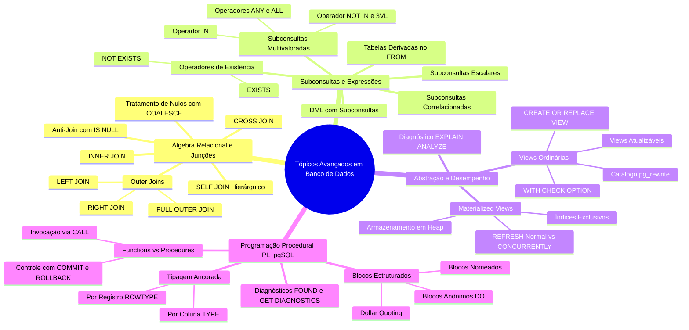
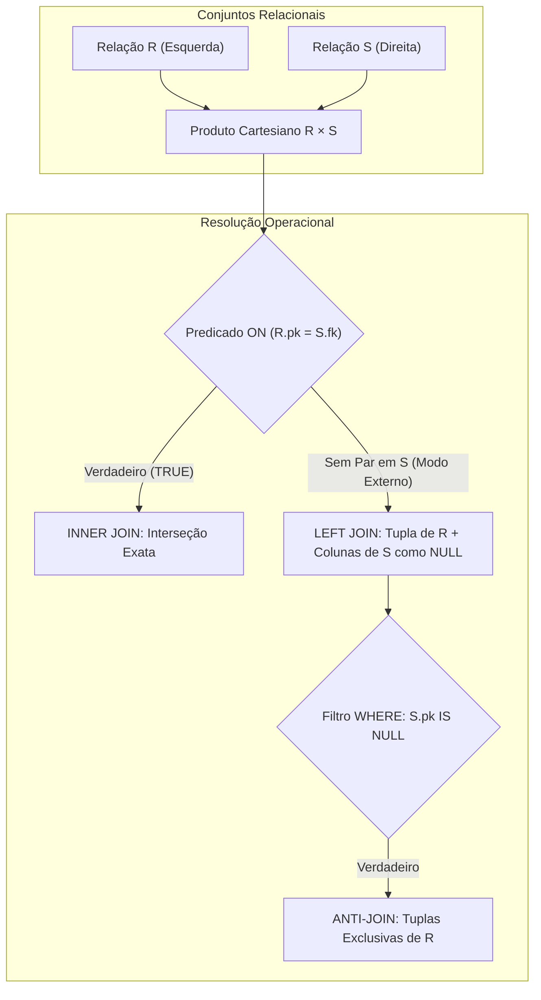
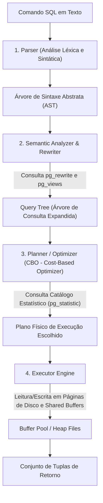
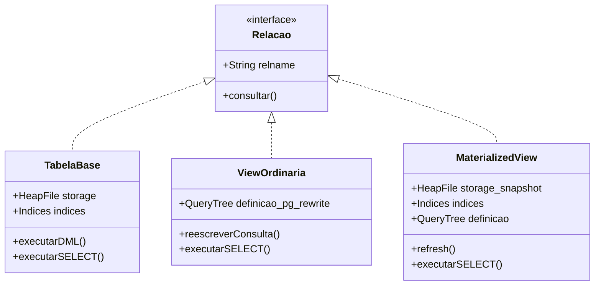
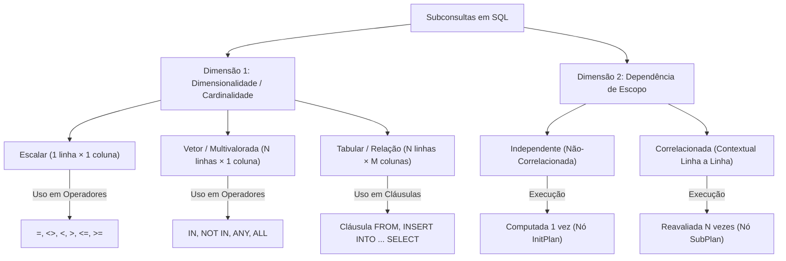
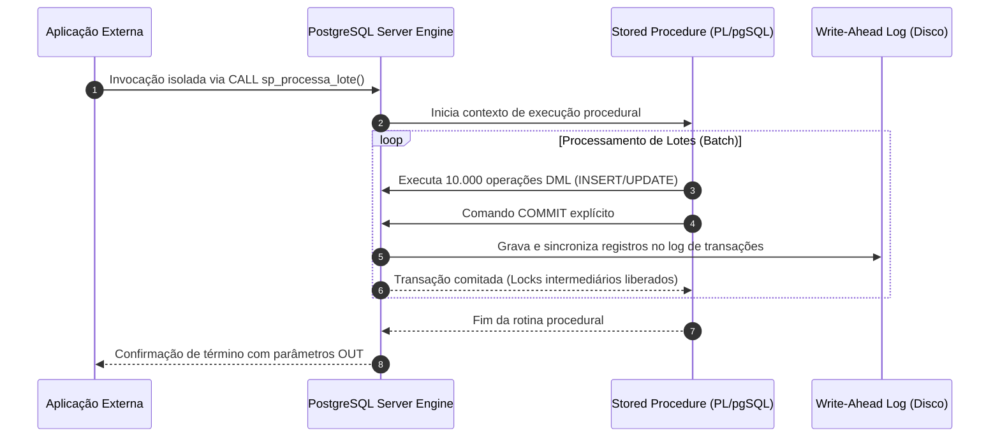
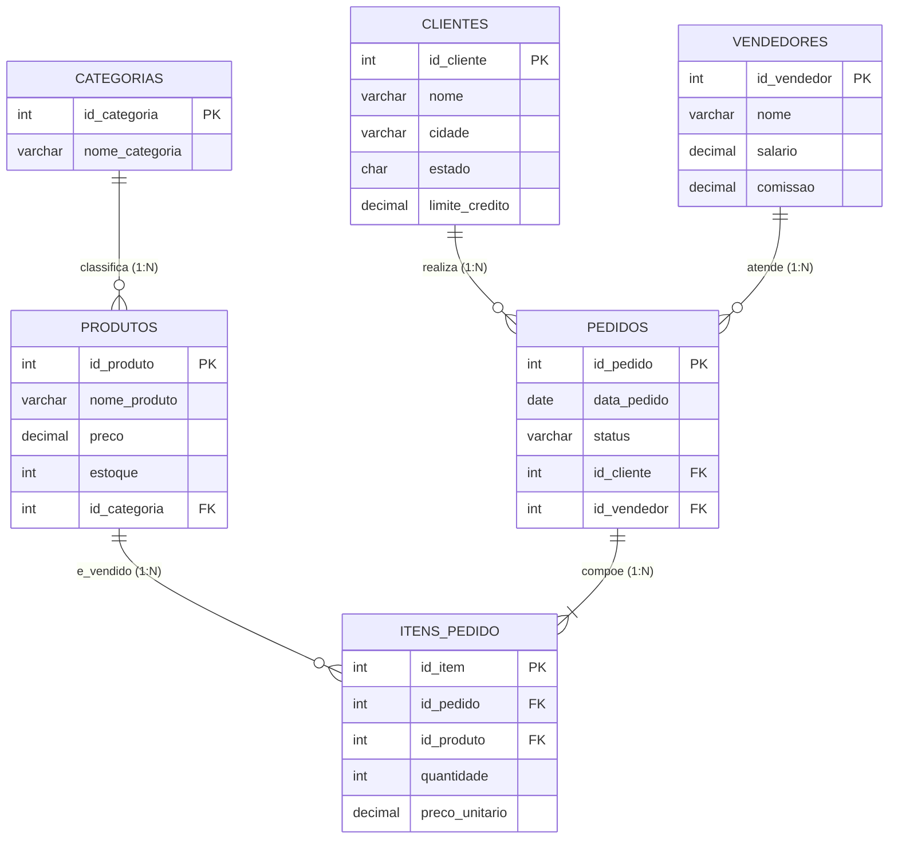
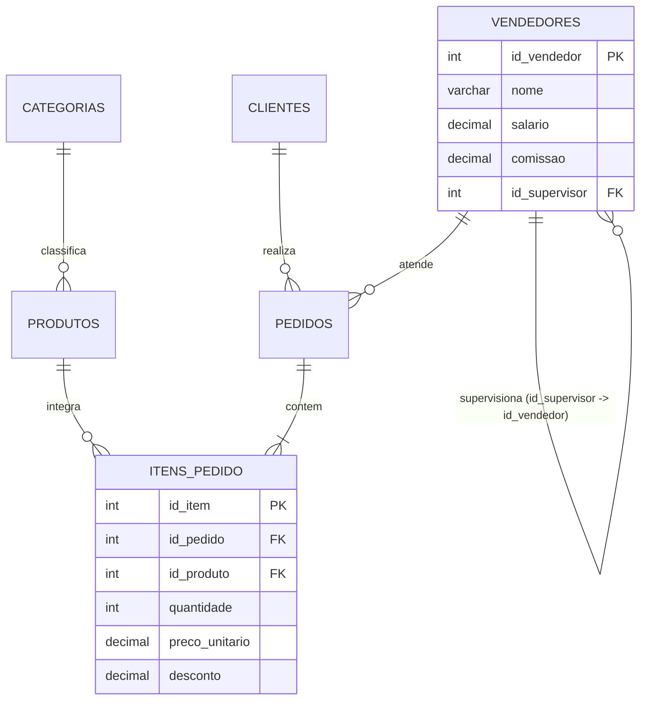
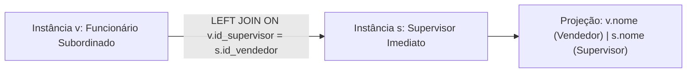
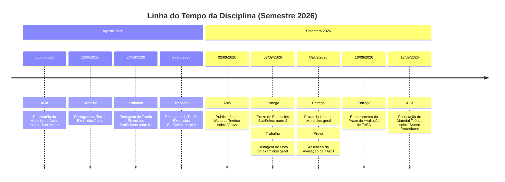

# Caderno Consolidado - Tópicos Avançados em Banco de Dados

> **Instituição:** Centro Universitário de Santa Fé do Sul (UniFEF)  
> **Curso:** Bacharelado em Sistemas de Informação (4º Semestre)  
> **Disciplina:** Tópicos Avançados em Banco de Dados (TABD)  
> **Docente:** Prof. Welington Garcia  
> **Ambiente Tecnológico:** PostgreSQL 11+ / PL/pgSQL

---

## Sumário

- [Caderno Consolidado - Tópicos Avançados em Banco de Dados](#caderno-consolidado---tópicos-avançados-em-banco-de-dados)
  - [Sumário](#sumário)
  - [Resumo Executivo](#resumo-executivo)
  - [Mapa de Conteúdo](#mapa-de-conteúdo)
  - [Fundamentos e Arquitetura](#fundamentos-e-arquitetura)
    - [Álgebra Relacional e Teoria dos Conjuntos Aplicada](#álgebra-relacional-e-teoria-dos-conjuntos-aplicada)
    - [Ciclo de Processamento e Otimização de Consultas no PostgreSQL](#ciclo-de-processamento-e-otimização-de-consultas-no-postgresql)
    - [Camada de Abstração Lógica: Visões Relacionais (Views)](#camada-de-abstração-lógica-visões-relacionais-views)
    - [Armazenamento Físico e Otimização: Visões Materializadas (Materialized Views)](#armazenamento-físico-e-otimização-visões-materializadas-materialized-views)
    - [Taxonomia e Semântica de Subconsultas (Subqueries)](#taxonomia-e-semântica-de-subconsultas-subqueries)
    - [Lógica Tri-Valorada (Three-Valued Logic - 3VL) e o Impacto do NULL](#lógica-tri-valorada-three-valued-logic---3vl-e-o-impacto-do-null)
    - [Arquitetura de Programação Procedural: Stored Procedures e Functions em PL/pgSQL](#arquitetura-de-programação-procedural-stored-procedures-e-functions-em-plpgsql)
    - [Modelagem de Dados e Domínios Corporativos da Disciplina](#modelagem-de-dados-e-domínios-corporativos-da-disciplina)
  - [Sintaxe e Exemplos Práticos](#sintaxe-e-exemplos-práticos)
    - [Junções Relacionais Fundamentais e Múltiplas](#junções-relacionais-fundamentais-e-múltiplas)
    - [Padrão Estrutural de Anti-Junção (Anti-Join) e Coalescência](#padrão-estrutural-de-anti-junção-anti-join-e-coalescência)
    - [Auto-Relacionamento (Self-Join) e Resolução Hierárquica](#auto-relacionamento-self-join-e-resolução-hierárquica)
    - [Subconsultas Escalares e Operadores de Conjunto (IN, ANY, ALL, EXISTS)](#subconsultas-escalares-e-operadores-de-conjunto-in-any-all-exists)
    - [Tabelas Derivadas na Cláusula FROM (Inline Views) e Agregações Aninhadas](#tabelas-derivadas-na-cláusula-from-inline-views-e-agregações-aninhadas)
    - [Manipulação de Dados Guiada por Subconsultas (DML Avançado)](#manipulação-de-dados-guiada-por-subconsultas-dml-avançado)
    - [Criação, Substituição e Governança de Views](#criação-substituição-e-governança-de-views)
    - [Materialized Views: Criação, Indexação e Atualização Concorrente](#materialized-views-criação-indexação-e-atualização-concorrente)
    - [Programação Procedural com PL/pgSQL e Controle Transacional](#programação-procedural-com-plpgsql-e-controle-transacional)
    - [Diagnóstico e Engenharia de Desempenho com EXPLAIN ANALYZE](#diagnóstico-e-engenharia-de-desempenho-com-explain-analyze)
  - [Boas Práticas e Armadilhas Comuns](#boas-práticas-e-armadilhas-comuns)
    - [A Armadilha do NOT IN com Conjuntos Nulos](#a-armadilha-do-not-in-com-conjuntos-nulos)
    - [A Ilusão do COUNT(*) sob Junções Externas (LEFT JOIN)](#a-ilusão-do-count-sob-junções-externas-left-join)
    - [Conversão Involuntária de LEFT JOIN em INNER JOIN no WHERE](#conversão-involuntária-de-left-join-em-inner-join-no-where)
    - [Substituição de Views com Quebra Estrutural (CREATE OR REPLACE VIEW)](#substituição-de-views-com-quebra-estrutural-create-or-replace-view)
    - [Falta de Isolamento em Escritas via Views sem WITH CHECK OPTION](#falta-de-isolamento-em-escritas-via-views-sem-with-check-option)
    - [Bloqueio Exclusivo de Tabela por REFRESH MATERIALIZED VIEW](#bloqueio-exclusivo-de-tabela-por-refresh-materialized-view)
    - [Controle Transacional Inválido em Stored Functions](#controle-transacional-inválido-em-stored-functions)
  - [Tabelas Comparativas](#tabelas-comparativas)
    - [Tabela Base vs. View Ordinária vs. Materialized View](#tabela-base-vs-view-ordinária-vs-materialized-view)
    - [Stored Functions vs. Stored Procedures no PostgreSQL](#stored-functions-vs-stored-procedures-no-postgresql)
    - [Operadores de Subconsulta e Associação de Conjuntos](#operadores-de-subconsulta-e-associação-de-conjuntos)
    - [Algoritmos Físicos de Junção no Mecanismo do PostgreSQL](#algoritmos-físicos-de-junção-no-mecanismo-do-postgresql)
  - [Linha do Tempo da Disciplina](#linha-do-tempo-da-disciplina)
  - [Glossário](#glossário)
  - [Checklist de Revisão para Prova](#checklist-de-revisão-para-prova)

---

## Resumo Executivo

O presente Caderno Consolidado estabelece a fundação teórica, algorítmica e prática da disciplina de **Tópicos Avançados em Banco de Dados (TABD)** ministrada no curso de Sistemas de Informação da UniFEF pelo **Prof. Welington Garcia**. O escopo pedagógico transcende a manipulação básica de instruções DDL e DML, posicionando o Sistema Gerenciador de Banco de Dados Relacional (SGBDR) — especificamente o ecossistema **PostgreSQL** — não como um mero repositório persistente de tuplas, mas como um ambiente robusto de computação analítica, governança de dados, isolamento transacional e execução de lógica de negócios orientada a desempenho.

Ao longo do semestre, a disciplina estrutura-se em quatro eixos de engenharia:
1. **Álgebra Relacional Avançada e Junções de Dados:** Compreensão matemática e física dos operadores relacionais (`INNER`, `LEFT`, `RIGHT`, `FULL OUTER`, `CROSS` e `SELF JOIN`), técnicas de anti-junção para auditoria e tratamento de cardinalidades $1:N$, $N:M$ e autorrelacionamentos hierárquicos.
2. **Subconsultas, Expressões de Conjunto e Otimização:** Taxonomia rigorosa de subconsultas (escalares, multivaloradas, tabulares e correlacionadas), aplicação defensiva contra as armadilhas da lógica trivalente (*Three-Valued Logic - 3VL*) com valores nulos, e diagnóstico de planos físicos de execução via `EXPLAIN ANALYZE`.
3. **Camada de Abstração Lógica e Física (Views e Materialized Views):** Encapsulamento de modelos relacionais via visões lógicas (mecanismo de reescrita *Query Rewrite System*, metadados em `pg_rewrite`), controle de escrita com `WITH CHECK OPTION` e aceleração analítica massiva por meio de visões materializadas indexadas com rotinas de recálculo concorrente (`REFRESH MATERIALIZED VIEW CONCURRENTLY`).
4. **Programação Procedural e Controle Transacional (PL/pgSQL):** Transição do paradigma declarativo para o estruturado, explorando *Stored Procedures* e *Functions*, escopos de variáveis ancoradas (`%TYPE` e `%ROWTYPE`), gerenciamento de exceções e a capacidade de controle autônomo de transações (`COMMIT` e `ROLLBACK`) introduzida a partir do PostgreSQL 11.

---

## Mapa de Conteúdo



---

## Fundamentos e Arquitetura

### Álgebra Relacional e Teoria dos Conjuntos Aplicada

O modelo relacional proposto por Edgar F. Codd fundamenta-se na teoria matemática dos conjuntos e na lógica de predicados de primeira ordem. Em SQL, as tabelas são tratadas formalmente como relações — conjuntos não ordenados de tuplas homogêneas. As operações fundamentais da álgebra relacional dividem-se em primitivas e derivadas:

1. **Produto Cartesiano ($R \times S$):** Concatena cada tupla da relação $R$ com todas as tuplas da relação $S$. Se $R$ possui cardinalidade $|R| = m$ e $S$ possui $|S| = n$, o resultado conterá $m \times n$ tuplas. Em SQL ANSI, corresponde ao comando `CROSS JOIN`.
2. **Seleção ($\sigma_{\theta}(R)$):** Filtra tuplas de $R$ que satisfazem o predicado proposicional $\theta$. Equivale à cláusula `WHERE`.
3. **Projeção ($\pi_{A_1, ..., A_k}(R)$):** Restringe as colunas da relação ao subconjunto de atributos especificado. Equivale à lista de projeção do `SELECT`.
4. **Junção Teta ($R \bowtie_{\theta} S$):** Operação derivada definida como $\sigma_{\theta}(R \times S)$, onde tuplas são combinadas apenas se atenderem ao predicado $\theta$.
5. **Equijunção:** Caso particular da junção teta em que todos os operadores de comparação em $\theta$ são estritamente igualdades ($=$).
6. **Junção Natural ($R \bowtie S$):** Equijunção implícita sobre todos os atributos com nomes idênticos em ambas as relações, eliminando as colunas duplicadas. *[Recomendação Técnica da Disciplina]*: O uso de `NATURAL JOIN` é terminantemente desaconselhado em ambientes de produção corporativos, visto que alterações futuras em esquemas (como a inclusão inadvertida de colunas de auditoria `data_cadastro` em tabelas distintas) corrompem silenciosamente a semântica da junção.
7. **Junção Externa Esquerda ($R \ \sqsubset\!\bowtie_{\theta} \ S$):** Preserva todas as tuplas da relação $R$ (esquerda). Caso uma tupla de $R$ não possua tupla correspondente em $S$ sob o predicado $\theta$, a tupla é projetada estendendo os atributos pertencentes a $S$ com valores nulos (`NULL`).
8. **Diferença de Conjuntos e Anti-Junção ($R \setminus S$):** Identifica tuplas pertencentes exclusivamente a $R$ que não mantêm qualquer correlação com tuplas de $S$. Em SQL declarativo, materializa-se via `LEFT JOIN` com predicado de nulidade ou `NOT EXISTS`.



---

### Ciclo de Processamento e Otimização de Consultas no PostgreSQL

*[Complemento Técnico: Otimizador de Consultas e Mecânica Interna]*  
Quando uma instrução SQL é submetida ao PostgreSQL, o comando não é interpretado diretamente contra os arquivos de dados. O motor relacional processa a consulta por meio de um pipeline modular em quatro estágios rigorosos:



1. **Parser (Analisador Léxico e Sintático):** Converte a cadeia de caracteres SQL em uma Árvore de Sintaxe Abstrata (*Abstract Syntax Tree* - AST), validando palavras-chave, delimitadores e precedência matemática.
2. **Analyzer & Query Rewriter (Reescritor de Consultas):** O analisador semântico valida a existência das tabelas e colunas contra o catálogo do sistema (`pg_class`, `pg_attribute`). Em seguida, o *Query Rewriter* entra em ação: caso a consulta referencie uma `VIEW`, a regra de reescrita armazenada no catálogo `pg_rewrite` intercepta a árvore e substitui o nó da visão pela subárvore da consulta contida em sua DDL, fundindo predicados externos e internos em uma única representação lógica unificada (*Query Tree*).
3. **Planner/Optimizer (Planejador Baseado em Custo - CBO):** Transforma a árvore de consulta lógica em planos físicos alternativos de execução, estimando o custo de I/O em disco e consumo de CPU com base nas estatísticas mantidas pelo processo do `ANALYZE` (registradas na tabela de catálogo `pg_statistic` e visíveis via `pg_stats`). Avalia caminhos de acesso e métodos de junção.
4. **Executor:** Executa o plano físico ótimo selecionado pelo planejador, percorrendo os nós em pipeline (*volcano iterator model*), operando leitura de páginas no *Shared Buffers* e manipulando memória de trabalho (*WorkMem*).

#### Algoritmos Físicos de Execução de Junções
O planejador do PostgreSQL seleciona algoritmos específicos conforme o volume de dados e índices disponíveis:
- **Nested Loop:** Percorre sequencialmente a relação externa e, para cada linha, varre a relação interna. Apresenta complexidade $O(M \times N)$ em varreduras puras (*Seq Scan*), mas reduz-se drasticamente para $O(M \times \log N)$ quando a tabela interna é acessada via índice B-Tree (*Index Scan*). É a estratégia de eleição para tabelas pequenas ou predicados altamente seletivos.
- **Hash Join:** Lê integralmente a relação interna (a menor das duas) e constrói uma tabela hash em memória RAM alocada pelo parâmetro `work_mem`, estruturada sobre a chave de junção. Em seguida, varre a relação externa aplicando a função hash em cada tupla para buscar colisões imediatas em tempo médio $O(1)$. A complexidade global assintótica é linear $O(M + N)$. Se a tabela hash exceder o `work_mem`, o PostgreSQL divide a carga em múltiplos lotes em disco (*multi-batch hash join*), incorrendo em custo de escrita temporária.
- **Merge Join:** Exige que ambas as relações estejam previamente ordenadas pelas chaves de junção (seja por um índice B-Tree preexistente ou por uma operação intermediária explícita de `Sort`). O motor avança ponteiros simultaneamente pelas duas relações em um único passo sequencial, consumindo complexidade $O(M + N)$ se já ordenadas, ou $O(M \log M + N \log N)$ caso a ordenação prévia seja demandada. É o algoritmo preferencial para grandes volumes de dados que não cabem em memória.

---

### Camada de Abstração Lógica: Visões Relacionais (Views)

#### Definição e Finalidade
No modelo relacional e na especificação ANSI/ISO SQL, uma visão (*view*) é uma tabela virtual cujo conteúdo é derivado dinamicamente a partir do resultado de uma consulta declarativa `SELECT`. Uma visão comum não aloca espaço físico em disco para armazenamento de dados (*heap files*); ela armazena exclusivamente sua definição textual e metadados no catálogo do sistema (`pg_views` e `pg_rewrite`).

#### Motivação de Engenharia de Software
- **Simplificação Arquitetural:** Centraliza junções complexas com múltiplos relacionamentos, normalizações em Terceira Forma Normal (3FN) e cálculos aritméticos em interfaces padronizadas. Os desenvolvedores e ferramentas de Business Intelligence (BI) consultam a view como se fosse uma tabela atômica.
- **Isolamento e Segurança (Princípio do Menor Privilégio):** Permite implementar controle de acesso granular a nível de coluna e de linha. Administradores concedem permissão de `SELECT` na visão, omitindo tabelas base e bloqueando a exposição de colunas confidenciais (senhas, documentos, comissões de terceiros).
- **Desacoplamento e Manutenibilidade:** Atua como camada de abstração entre o esquema físico do banco e o código das aplicações consumidoras. Se uma tabela base for desmembrada ou renomeada, a view pode ser reescrita para manter a mesma interface externa inalterada, evitando *breaking changes* em microsserviços legados.

---

### Armazenamento Físico e Otimização: Visões Materializadas (Materialized Views)

#### Definição e Mecânica de Armazenamento
Diferente das visões ordinárias, uma visão materializada (*Materialized View*) persiste fisicamente em disco o conjunto de dados resultante da consulta no momento de sua criação ou recálculo. No PostgreSQL, uma visão materializada é estruturada internamente como uma tabela física real: possui arquivo de *heap*, páginas no disco, entradas na tabela de catálogo `pg_class` (com `relkind = 'm'`) e suporte integral à criação de índices proprietários (B-Tree, GIN, GiST, BRIN).



#### O Ciclo de Frescor dos Dados (Data Freshness) e Estratégias de Atualização
O benefício de performance proporcionado por uma visão materializada decorre do fato de que agregações complexas e junções pesadas já foram previamente computadas e gravadas em disco. Em contrapartida, os dados tornam-se estáticos (fotografia temporal ou *snapshot*). À medida que as tabelas base sofrem operações DML, a visão materializada acumula defasagem temporal (*stale data*).

A sincronização de dados exige a invocação explícita do comando `REFRESH MATERIALIZED VIEW`, que opera sob duas abordagens arquiteturais:
1. **REFRESH Padrão:** Tranca a visão materializada contra qualquer leitura concorrente, aplicando uma trava exclusiva de leitura e escrita (`AccessExclusiveLock`). Durante o processo de recálculo (que pode demandar minutos em tabelas de milhões de registros), qualquer consulta `SELECT` direcionada à visão é bloqueada na fila de espera, degradando a disponibilidade da aplicação.
2. **REFRESH CONCURRENTLY:** Atualiza o snapshot sem bloquear consultas concorrentes de leitura (`AccessShareLock`). O PostgreSQL computa o novo resultado em uma tabela temporária de trabalho, executa uma operação interna de diferença de conjuntos (*diff*) comparando as linhas antigas com as novas através de uma chave única, e aplica exclusivamente os comandos necessários de `INSERT`, `UPDATE` e `DELETE`. **Requisito Obrigatório:** Exige que a visão materializada possua ao menos um índice exclusivo (`UNIQUE INDEX`) criado sobre uma ou mais colunas que não contenham valores nulos.

---

### Taxonomia e Semântica de Subconsultas (Subqueries)

Uma subconsulta (ou consulta aninhada) consiste em uma instrução `SELECT` subordinada no corpo de outra instrução SQL externa (`SELECT`, `INSERT`, `UPDATE` ou `DELETE`).



#### 1. Classificação por Cardinalidade do Retorno
- **Subconsulta Escalar:** Retorna rigorosamente no máximo uma linha e uma coluna ($1 \times 1$). É tratada matematicamente como um valor literal primitivo e pode ser empregada em qualquer posição sintática onde uma constante seja permitida (listas de projeção no `SELECT`, operadores de comparação no `WHERE` e `HAVING`). Se retornar zero linhas, avalia-se como `NULL`. Se retornar mais de uma tupla em tempo de execução, o motor aborta com a falha: `ERROR: more than one row returned by a subquery used as an expression`.
- **Subconsulta Multivalorada (Vetor de Valores):** Retorna uma coluna projetando zero, uma ou múltiplas linhas ($N \times 1$). Requer acoplamento com operadores de pertinência de conjuntos (`IN`, `NOT IN`) ou operadores relacionais quantificados (`= ANY`, `<> ALL`, `> ANY`).
- **Subconsulta Tabular (Matriz Relacional):** Retorna múltiplas colunas e múltiplas linhas ($N \times M$). Utilizada obrigatoriamente como tabela derivada na cláusula `FROM` (exigindo identificador de alias) ou alimentando operações de carga massiva (`INSERT INTO ... SELECT`).

#### 2. Classificação por Dependência de Escopo
- **Subconsulta Independente (Não-Correlacionada):** Não faz qualquer referência aos atributos ou escopos das tabelas externas. O planejador do PostgreSQL executa a subconsulta uma única vez no início do processamento, memoriza seu resultado em cache em um nó do tipo `InitPlan`, e reutiliza o valor estático nas etapas subsequentes.
- **Subconsulta Correlacionada:** Contém uma ou mais referências a colunas pertencentes à tupla corrente avaliada pela consulta externa (variáveis de correlação). O conceito de execução dita que a subconsulta deve ser reavaliada para cada linha candidata processada pela consulta principal, gerando nós `SubPlan` com complexidade computacional potencialmente assintótica $O(M \times N)$, a menos que o otimizador consiga transformá-la internamente em uma junção (*decorrelation* ou *subquery unnesting*).

---

### Lógica Tri-Valorada (Three-Valued Logic - 3VL) e o Impacto do NULL

No modelo relacional de Codd, o marcador `NULL` representa a ausência de informação, desconhecimento ou inaplicabilidade de um dado. O SQL adota formalmente a Lógica Tri-Valorada (*Three-Valued Logic* - 3VL), cujos valores booleanos possíveis de verdade são: `TRUE`, `FALSE` e `UNKNOWN`.

Qualquer operação de comparação aritmética ou relacional direta envolvendo `NULL` (como `preco = NULL`, `status <> NULL` ou `valor > NULL`) resulta compulsoriamente em `UNKNOWN`, e nunca em `TRUE` ou `FALSE`. Para testar a nulidade de um identificador, o padrão exige os predicados unários `IS NULL` e `IS NOT NULL`.

#### Tabelas-Verdade Fundamentais da Lógica Tri-Valorada

| Operando A | Operando B | A AND B | A OR B | NOT A |
| :--- | :--- | :--- | :--- | :--- |
| **TRUE** | **TRUE** | TRUE | TRUE | FALSE |
| **TRUE** | **FALSE** | FALSE | TRUE | FALSE |
| **TRUE** | **UNKNOWN** | **UNKNOWN** | TRUE | FALSE |
| **FALSE** | **FALSE** | FALSE | FALSE | TRUE |
| **FALSE** | **UNKNOWN** | FALSE | **UNKNOWN** | TRUE |
| **UNKNOWN** | **UNKNOWN** | **UNKNOWN** | **UNKNOWN** | **UNKNOWN** |

#### O Filtro de Linhas e a Cláusula WHERE
Uma linha é aceita na projeção de uma cláusula `WHERE` ou `HAVING` se, e somente se, o predicado booleano global avaliar estritamente como `TRUE`. Expressões que avaliam como `FALSE` ou `UNKNOWN` são terminantemente descartadas pelo motor do banco de dados.

---

### Arquitetura de Programação Procedural: Stored Procedures e Functions em PL/pgSQL

O PL/pgSQL (*Procedural Language/PostgreSQL Structured Query Language*) é uma linguagem estruturada em blocos que estende a natureza declarativa do SQL com construções procedurais típicas de linguagens de alto nível: variáveis locais, estruturas condicionais (`IF/THEN/ELSE`), laços de iteração (`LOOP`, `WHILE`, `FOR`), cursores e blocos protegidos de tratamento de exceções (`EXCEPTION`).

#### Evolução Histórica e Ruptura Arquitetural no PostgreSQL 11
*[Complemento Técnico: O Padrão SQL:2011 e a Evolução das Rotinas no PostgreSQL]*  
Historicamente, até a versão 10, o PostgreSQL não implementava o comando canônico `CREATE PROCEDURE`. Toda a lógica procedural corporativa era construída através de Funções Definidas pelo Usuário (*User-Defined Functions* - UDFs) via `CREATE FUNCTION`.

Contudo, uma função no PostgreSQL é concebida para atuar como uma expressão matemática: ela é invocada como parte de uma instrução SQL maior (como `SELECT fn_calcula();` ou dentro de uma cláusula `WHERE`) e executa compulsoriamente sob o contexto da transação ativa iniciada pelo comando chamador. Por essa razão arquitetural, o motor proíbe categoricamente a emissão de comandos de controle de transação (`COMMIT` ou `ROLLBACK`) dentro de uma função, pois comitar no meio de um `SELECT` violaria o isolamento e o modelo de multiversão do PostgreSQL (MVCC - *Multi-Version Concurrency Control*).

A partir do **PostgreSQL 11**, o sistema introduziu formalmente o comando `CREATE PROCEDURE` acoplado à instrução de invocação isolada `CALL`. As *Stored Procedures* não possuem cláusula de retorno (`RETURNS`), não podem ser invocadas de dentro de instruções `SELECT` e possuem autonomia total para abrir, comitar e reverter transações no decorrer de sua lógica interna.



---

### Modelagem de Dados e Domínios Corporativos da Disciplina

Para a fundamentação prática dos exercícios e avaliações da disciplina de TABD, o Prof. Welington Garcia estruturou três modelos relacionais de referência no PostgreSQL.

#### 1. Domínio Varejo Comercial Padrão (`loja_joins` e Subconsultas Parte 1)
Modela as vendas básicas de um distribuidor de tecnologia: clientes, categorias, produtos com preço unitário e estoque, cabeçalhos de pedidos e itens de pedido.



#### 2. Domínio Varejo Corporativo Avançado com Hierarquia (`loja_exercicios`)
Expande o modelo comercial com duas complexidades de engenharia essenciais:
1. **Auto-Relacionamento (Self-Join):** A tabela `vendedores` referencia a si mesma por meio da chave estrangeira reflexiva `id_supervisor REFERENCES vendedores(id_vendedor)`.
2. **Dedução Financeira de Linha:** A tabela `itens_pedido` implementa uma coluna explícita `desconto NUMERIC(5,2)`, demandando o cômputo da receita líquida por fórmula aritmética: `(quantidade * preco_unitario) * (1.0 - (desconto / 100.0))`.



#### 3. Domínio Hospitalar / Clínico (`clinica_medica` - Avaliação TABD)
Modela uma clínica médica com controle financeiro rigoroso e exames clínicos vinculados:
- `especialidades`: Áreas médicas com possibilidade de especialidades sem médicos cadastrados.
- `medicos`: Corpo clínico associado às especialidades.
- `pacientes`: Base cadastral contendo pacientes com histórico de atendimento e pacientes sem consultas (entidades órfãs).
- `consultas`: Cabeçalho transacional com ciclo de vida (`Realizada`, `Agendada`, `Cancelada`).
- `exames`: Procedimentos laboratoriais vinculados às consultas em relação $1:N$ opcional.
- `pagamentos`: Faturamento de consulta estruturado sob relação $1:1$ estrita (`id_consulta UNIQUE REFERENCES consultas(id_consulta)`), existindo consultas sem pagamento em decorrência de cancelamento ou pendência financeira.

```mermaid
erDiagram
    ESPECIALIDADES ||--o{ MEDICOS : possui
    PACIENTES ||--o{ CONSULTAS : realiza
    MEDICOS ||--o{ CONSULTAS : atende
    CONSULTAS ||--o{ EXAMES : origina
    CONSULTAS ||--o| PAGAMENTOS : "gera (1:1 opcional)"

    ESPECIALIDADES {
        int id_especialidade PK
        varchar nome
        varchar descricao
    }
    MEDICOS {
        int id_medico PK
        varchar nome
        varchar crm UK
        decimal salario
        int id_especialidade FK
    }
    PACIENTES {
        int id_paciente PK
        varchar nome
        varchar cidade
        char estado
        date data_nascimento
        varchar convenio
    }
    CONSULTAS {
        int id_consulta PK
        date data_consulta
        time horario
        decimal valor
        varchar status
        int id_paciente FK
        int id_medico FK
    }
    EXAMES {
        int id_exame PK
        varchar nome_exame
        date data_solicitacao
        date data_realizacao
        decimal valor
        varchar resultado
        int id_consulta FK
    }
    PAGAMENTOS {
        int id_pagamento PK
        date data_pagamento
        decimal valor_pago
        varchar forma_pagamento
        int id_consulta UK_FK
    }
```

---

## Sintaxe e Exemplos Práticos

### Junções Relacionais Fundamentais e Múltiplas

#### Definição e Motivação
A junção relacional combina tuplas de relações distintas quando o predicado declarado na cláusula `ON` avalia como verdadeiro. Abaixo demonstra-se a consulta padrão do relatório geral de vendas, reconstruindo a granularidade do item a partir de quatro tabelas normalizadas.

#### Exemplo Prático: Detalhamento Granular de Vendas
```sql
-- Junção interna de quatro tabelas com desambiguação via aliases mnemônicos
SELECT
    p.id_pedido,
    p.data_pedido,
    c.nome AS nome_cliente,
    pr.nome_produto,
    ip.quantidade,
    ip.preco_unitario,
    (ip.quantidade * ip.preco_unitario) AS subtotal
FROM pedidos p
INNER JOIN clientes c 
    ON p.id_cliente = c.id_cliente
INNER JOIN itens_pedido ip 
    ON p.id_pedido = ip.id_pedido
INNER JOIN produtos pr 
    ON ip.id_produto = pr.id_produto
ORDER BY p.id_pedido ASC, pr.nome_produto ASC;
```

---

### Padrão Estrutural de Anti-Junção (Anti-Join) e Coalescência

#### Definição e Motivação
A anti-junção isola registros da tabela à esquerda que não possuem registros correspondentes na tabela à direita ($A \setminus B$). A implementação recomendada baseia-se em `LEFT JOIN` associado a um predicado `WHERE` fiscalizando a nulidade da chave primária da tabela subordinada.

#### Exemplo Prático 1: Localização de Clientes Inativos (Anti-Join)
```sql
-- Identificação de clientes sem pedidos cadastrados
SELECT
    c.id_cliente,
    c.nome AS cliente,
    c.cidade,
    c.estado
FROM clientes c
LEFT JOIN pedidos p 
    ON c.id_cliente = p.id_cliente
WHERE p.id_pedido IS NULL
ORDER BY c.id_cliente ASC;
```

#### Exemplo Prático 2: Tratamento de Nulos com COALESCE em Agregações Externas
A função escalar `COALESCE(v1, v2, ..., vn)` retorna o primeiro argumento não-nulo da lista. É indispensável para evitar que ausência de movimentação resulte no literal `NULL` em relatórios contábeis.

```sql
-- Faturamento por vendedor incluindo vendedores sem vendas (exibindo R$ 0.00)
SELECT
    v.id_vendedor,
    v.nome AS vendedor,
    COALESCE(SUM(ip.quantidade * ip.preco_unitario), 0.00) AS faturamento_total
FROM vendedores v
LEFT JOIN pedidos p 
    ON v.id_vendedor = p.id_vendedor
LEFT JOIN itens_pedido ip 
    ON p.id_pedido = ip.id_pedido
GROUP BY v.id_vendedor, v.nome
ORDER BY faturamento_total DESC;
```

---

### Auto-Relacionamento (Self-Join) e Resolução Hierárquica

#### Definição e Motivação
Em estruturas organizacionais modeladas pelo padrão *Adjacency List*, o superior hierárquico é referenciado na própria tabela através de uma chave estrangeira reflexiva. O PostgreSQL resolve a hierarquia abrindo duas instâncias lógicas da tabela na memória, rotuladas obrigatoriamente por aliases distintos.



#### Exemplo Prático: Mapeamento de Supervisão e Vendas
```sql
-- Relatório hierárquico com cálculo financeiro ponderado por descontos
SELECT
    v.id_vendedor,
    v.nome AS vendedor,
    COALESCE(s.nome, 'Sem Supervisor') AS supervisor,
    COUNT(DISTINCT p.id_pedido) AS total_pedidos,
    COALESCE(SUM(ip.quantidade * ip.preco_unitario * (1.0 - (COALESCE(ip.desconto, 0.0) / 100.0))), 0.00) AS faturamento_liquido
FROM vendedores v
LEFT JOIN vendedores s 
    ON v.id_supervisor = s.id_vendedor
LEFT JOIN pedidos p 
    ON v.id_vendedor = p.id_vendedor
LEFT JOIN itens_pedido ip 
    ON p.id_pedido = ip.id_pedido
GROUP BY v.id_vendedor, v.nome, s.nome
ORDER BY faturamento_liquido DESC;
```

---

### Subconsultas Escalares e Operadores de Conjunto (IN, ANY, ALL, EXISTS)

#### 1. Subconsulta Escalar na Cláusula WHERE
Calcula uma média dinâmica e utiliza o resultado atômico como filtro de comparação:
```sql
-- Produtos com preço estritamente superior à média global de mercado
SELECT
    id_produto,
    nome_produto,
    preco
FROM produtos
WHERE preco > (SELECT AVG(preco) FROM produtos)
ORDER BY preco DESC;
```

#### 2. Operador IN com Mais de uma Tabela
Localiza clientes que compraram um item específico navegando por subconsultas aninhadas:
```sql
-- Clientes que compraram o produto 'Notebook Dell'
SELECT id_cliente, nome, cidade
FROM clientes
WHERE id_cliente IN (
    SELECT p.id_cliente
    FROM pedidos p
    INNER JOIN itens_pedido ip ON p.id_pedido = ip.id_pedido
    INNER JOIN produtos pr ON ip.id_produto = pr.id_produto
    WHERE pr.nome_produto = 'Notebook Dell'
);
```

#### 3. Operadores Quantificados ANY e ALL
- `> ANY`: Avalia como verdadeiro se o valor for maior que **pelo menos um** elemento retornado pelo conjunto (equivalente a ser maior que o valor mínimo do conjunto).
- `> ALL`: Avalia como verdadeiro se o valor for maior que **todos** os elementos do conjunto (equivalente a ser maior que o valor máximo do conjunto).

```sql
-- 1. Produtos com preço maior que pelo menos um produto de Telefonia
SELECT nome_produto, preco
FROM produtos
WHERE preco > ANY (
    SELECT pr.preco
    FROM produtos pr
    INNER JOIN categorias c ON pr.id_categoria = c.id_categoria
    WHERE c.nome_categoria = 'Telefonia'
);

-- 2. Produtos com preço maior que todos os produtos de Acessórios
SELECT nome_produto, preco
FROM produtos
WHERE preco > ALL (
    SELECT pr.preco
    FROM produtos pr
    INNER JOIN categorias c ON pr.id_categoria = c.id_categoria
    WHERE c.nome_categoria = 'Acessórios'
);
```

#### 4. Operadores de Existência: EXISTS e NOT EXISTS
Avaliados por semântica de curto-circuito (*short-circuit evaluation*). O motor cessa a verificação no primeiro registro encontrado:
```sql
-- Produtos que nunca foram vendidos (NOT EXISTS correlacionado)
SELECT pr.id_produto, pr.nome_produto, pr.preco
FROM produtos pr
WHERE NOT EXISTS (
    SELECT 1 
    FROM itens_pedido ip 
    WHERE ip.id_produto = pr.id_produto
);
```

---

### Tabelas Derivadas na Cláusula FROM (Inline Views) e Agregações Aninhadas

#### Definição e Motivação
Uma tabela derivada é uma subconsulta inserida na cláusula `FROM` que produz uma relação virtual intermediária em memória. No PostgreSQL, é mandatório nomear a tabela derivada por meio de um **alias**.

#### Exemplo Prático: Média por Categoria com Filtro de Pós-Agregação
```sql
-- Identificação de categorias cuja média de preços ultrapassa R$ 1.000,00
SELECT
    sub.id_categoria,
    cat.nome_categoria,
    ROUND(sub.preco_medio, 2) AS preco_medio_formatado
FROM (
    SELECT
        id_categoria,
        AVG(preco) AS preco_medio
    FROM produtos
    GROUP BY id_categoria
) AS sub
INNER JOIN categorias cat 
    ON sub.id_categoria = cat.id_categoria
WHERE sub.preco_medio > 1000.00
ORDER BY sub.preco_medio DESC;
```

---

### Manipulação de Dados Guiada por Subconsultas (DML Avançado)

#### 1. Inserção em Lote: INSERT INTO ... SELECT
Carrega novos registros baseando-se no cálculo dinâmico da média geral:
```sql
-- Carga em tabela promocional para itens acima da média de mercado
CREATE TABLE produtos_promocao (
    id_produto INTEGER PRIMARY KEY,
    nome_produto VARCHAR(100) NOT NULL,
    preco NUMERIC(10,2) NOT NULL,
    preco_promocional NUMERIC(10,2) NOT NULL
);

INSERT INTO produtos_promocao (id_produto, nome_produto, preco, preco_promocional)
SELECT
    id_produto,
    nome_produto,
    preco,
    ROUND(preco * 0.90, 2) AS preco_promocional
FROM produtos
WHERE preco > (SELECT AVG(preco) FROM produtos);
```

#### 2. Atualização Correlacionada: UPDATE com Subquery
Atualiza o estoque dos produtos que custam acima da média de sua respectiva categoria:
```sql
-- Incrementa 5 unidades no estoque para produtos com preço acima da média da categoria
UPDATE produtos p
SET estoque = estoque + 5
WHERE p.preco > (
    SELECT AVG(sub.preco)
    FROM produtos sub
    WHERE sub.id_categoria = p.id_categoria
);
```

#### 3. Exclusão com Anti-Junção Segura: DELETE com NOT EXISTS
Remove registros órfãos que nunca tiveram movimentação:
```sql
-- Exclusão de clientes sem pedidos prévios
DELETE FROM clientes c
WHERE NOT EXISTS (
    SELECT 1
    FROM pedidos p
    WHERE p.id_cliente = c.id_cliente
);
```

---

### Criação, Substituição e Governança de Views

#### Definição Formal e Substituição
Para alterar a lógica de uma visão sem destruí-la, utiliza-se `CREATE OR REPLACE VIEW`.

```sql
-- Definição de visão operacional de pedidos pagos
CREATE OR REPLACE VIEW vw_pedidos_concluidos AS
SELECT
    p.id_pedido,
    p.data_pedido,
    c.nome AS cliente,
    v.nome AS vendedor,
    SUM(ip.quantidade * ip.preco_unitario) AS valor_total
FROM pedidos p
INNER JOIN clientes c ON p.id_cliente = c.id_cliente
INNER JOIN vendedores v ON p.id_vendedor = v.id_vendedor
INNER JOIN itens_pedido ip ON p.id_pedido = ip.id_pedido
WHERE p.status = 'Pago'
GROUP BY p.id_pedido, p.data_pedido, c.nome, v.nome;
```

#### Proteção com WITH CHECK OPTION
Em visões atualizáveis, a cláusula `WITH CHECK OPTION` impede que comandos `INSERT` ou `UPDATE` gerem tuplas que violem o predicado da visão:

```sql
-- Criação de view atualizável restrita ao estado de São Paulo
CREATE OR REPLACE VIEW vw_clientes_sp AS
SELECT id_cliente, nome, cidade, estado, limite_credito
FROM clientes
WHERE estado = 'SP'
WITH CHECK OPTION;

-- Teste de Violação: Tentativa de inserção de cliente do RJ através da view
-- INSERT INTO vw_clientes_sp (nome, cidade, estado, limite_credito) 
-- VALUES ('Carlos Carioca', 'Rio de Janeiro', 'RJ', 5000.00);
-- RESULTADO: ERROR: new row violates check option for view "vw_clientes_sp"
```

---

### Materialized Views: Criação, Indexação e Atualização Concorrente

#### Exemplo Prático Completo
```sql
-- 1. Criação da Visão Materializada consolidando faturamento por categoria
CREATE MATERIALIZED VIEW mv_faturamento_categoria AS
SELECT
    c.id_categoria,
    c.nome_categoria,
    COUNT(DISTINCT p.id_pedido) AS total_pedidos,
    SUM(ip.quantidade) AS total_itens_vendidos,
    SUM(ip.quantidade * ip.preco_unitario) AS faturamento_bruto
FROM categorias c
INNER JOIN produtos pr ON c.id_categoria = pr.id_categoria
INNER JOIN itens_pedido ip ON pr.id_produto = ip.id_produto
INNER JOIN pedidos p ON ip.id_pedido = p.id_pedido
WHERE p.status IN ('Pago', 'Enviado')
GROUP BY c.id_categoria, c.nome_categoria
WITH DATA;

-- 2. Criação Obrigatória de Índice Único para viabilizar REFRESH CONCURRENTLY
CREATE UNIQUE INDEX uq_mv_faturamento_categoria_id 
ON mv_faturamento_categoria (id_categoria);

-- 3. Atualização Concorrente em Segundo Plano (Sem travar leituras concorrentes)
REFRESH MATERIALIZED VIEW CONCURRENTLY mv_faturamento_categoria;
```

---

### Programação Procedural com PL/pgSQL e Controle Transacional

#### 1. Tipagem Ancorada e Dollar Quoting
O delimitador `$$` elimina a necessidade de duplicar aspas simples. As âncoras `%TYPE` e `%ROWTYPE` garantem que as variáveis herdem automaticamente a definição das colunas da tabela base.

```sql
CREATE OR REPLACE PROCEDURE fef_ajuste_credito_cliente(
    IN p_id_cliente INTEGER,
    IN p_percentual NUMERIC,
    OUT p_novo_limite clientes.limite_credito%TYPE
)
LANGUAGE plpgsql
AS $$
DECLARE
    v_limite_atual clientes.limite_credito%TYPE;
BEGIN
    -- Captura do limite atual utilizando SELECT INTO
    SELECT limite_credito INTO v_limite_atual
    FROM clientes
    WHERE id_cliente = p_id_cliente;

    IF NOT FOUND THEN
        RAISE EXCEPTION 'Cliente com ID % não localizado no sistema.', p_id_cliente;
    END IF;

    -- Cálculo do novo limite
    p_novo_limite := v_limite_atual * (1.0 + (p_percentual / 100.0));

    -- Atualização DML na tabela base
    UPDATE clientes
    SET limite_credito = p_novo_limite
    WHERE id_cliente = p_id_cliente;

    RAISE NOTICE 'Limite do cliente % atualizado de % para %', 
        p_id_cliente, v_limite_atual, p_novo_limite;
END;
$$;
```

#### 2. Controle Transacional Explícito em Lote (COMMIT e ROLLBACK)
Procedimento que realiza repasse financeiro e controle transacional no núcleo do banco de dados:

```sql
CREATE OR REPLACE PROCEDURE fef_processar_baixa_pedidos_antigos()
LANGUAGE plpgsql
AS $$
DECLARE
    r_pedido RECORD;
    v_contador INTEGER := 0;
BEGIN
    FOR r_pedido IN 
        SELECT id_pedido 
        FROM pedidos 
        WHERE status = 'Pendente' AND data_pedido < CURRENT_DATE - INTERVAL '30 days'
    LOOP
        UPDATE pedidos 
        SET status = 'Cancelado' 
        WHERE id_pedido = r_pedido.id_pedido;

        v_contador := v_contador + 1;

        -- Comita a cada 50 registros processados para liberar logs de WAL e travas
        IF v_contador % 50 = 0 THEN
            COMMIT;
            RAISE NOTICE 'Lote de 50 pedidos comitado com sucesso.';
        END IF;
    END LOOP;

    -- Comita as operações remanescentes
    COMMIT;
END;
$$;
```

---

### Diagnóstico e Engenharia de Desempenho com EXPLAIN ANALYZE

O comando `EXPLAIN ANALYZE` instrui o PostgreSQL a planejar, executar fisicamente a consulta e cronometrar cada nó de execução, exibindo o custo teórico em comparação com a execução real.

```sql
-- Comparação de plano de execução: IN vs EXISTS
EXPLAIN ANALYZE
SELECT id_cliente, nome 
FROM clientes 
WHERE id_cliente IN (SELECT id_cliente FROM pedidos);

EXPLAIN ANALYZE
SELECT id_cliente, nome 
FROM clientes c 
WHERE EXISTS (SELECT 1 FROM pedidos p WHERE p.id_cliente = c.id_cliente);
```

#### Anatomia da Saída do EXPLAIN ANALYZE
- **Startup Cost:** Custo computacional estimado para retornar a primeira tupla (ex: inicialização de tabela hash ou ordenação).
- **Total Cost:** Custo computacional total estimado para varrer todo o nó e emitir o conjunto completo de dados.
- **Actual Time:** Tempo real decorrido medido em milissegundos (`tempo_inicial .. tempo_total`).
- **Rows:** Estimativa de linhas feita pelo CBO versus `actual rows` retornadas na execução real. Se houver discrepância de ordens de magnitude (ex: previsto 10, retornado 100.000), as estatísticas do banco de dados estão desatualizadas e demandam a execução de um `ANALYZE`.

---

## Boas Práticas e Armadilhas Comuns

### A Armadilha do NOT IN com Conjuntos Nulos

#### O Erro / O Problema
O operador `NOT IN` é matematicamente expandido em uma série de conjunções com operadores de desigualdade:
$$v \text{ NOT IN } (v_1, v_2, ..., v_n) \iff (v \ne v_1) \land (v \ne v_2) \land ... \land (v \ne v_n)$$

Se a subconsulta retornar **ao menos um valor `NULL`**, a comparação $(v \ne \text{NULL})$ resulta em `UNKNOWN`. Conforme as regras da lógica trivalente (3VL):
$$\text{TRUE} \land \text{UNKNOWN} \implies \text{UNKNOWN}$$
$$\text{FALSE} \land \text{UNKNOWN} \implies \text{FALSE}$$

A expressão jamais avalia para `TRUE`. Como a cláusula `WHERE` exige estritamente `TRUE` para selecionar tuplas, **a consulta externa retorna zero linhas**, ocultando registros que deveriam aparecer.

```sql
-- CONTRAEXEMPLO GRAVE (Bug Silencioso de Produção)
-- Se houver 1 pedido com id_cliente nulo, a query abaixo retorna VAZIO!
SELECT id_cliente, nome
FROM clientes
WHERE id_cliente NOT IN (SELECT id_cliente FROM pedidos);
```

#### A Solução Defensiva
Adote categoricamente `NOT EXISTS` ou garanta que o subselect filtre explicitamente os nulos:

```sql
-- PADRÃO DEFENSIVO 1: NOT EXISTS (Recomendado)
SELECT c.id_cliente, c.nome
FROM clientes c
WHERE NOT EXISTS (
    SELECT 1 
    FROM pedidos p 
    WHERE p.id_cliente = c.id_cliente
);

-- PADRÃO DEFENSIVO 2: NOT IN com filtro explícito
SELECT c.id_cliente, c.nome
FROM clientes c
WHERE c.id_cliente NOT IN (
    SELECT id_cliente 
    FROM pedidos 
    WHERE id_cliente IS NOT NULL
);
```

---

### A Ilusão do COUNT(*) sob Junções Externas (LEFT JOIN)

#### O Erro / O Problema
Ao combinar tabelas via `LEFT JOIN` para listar clientes e a quantidade de pedidos que realizaram, um cliente sem pedidos gerará uma linha sintetizada preenchida com valores nulos para a tabela de pedidos.  
A função `COUNT(*)` computa o número físico de linhas na partição, sem inspecionar nulidade. Logo, o cliente sem compras receberá a contagem errônea de **1 pedido**.

```sql
-- CONTRAEXEMPLO: Retorna 1 para clientes sem pedidos!
SELECT c.nome, COUNT(*) AS total_pedidos
FROM clientes c
LEFT JOIN pedidos p ON c.id_cliente = p.id_cliente
GROUP BY c.nome;
```

#### A Solução Defensiva
Execute a contagem especificando a chave primária da tabela subordinada (`COUNT(p.id_pedido)`). A função `COUNT(expressão)` ignora valores nulos, computando perfeitamente o valor **0**.

```sql
-- SOLUÇÃO CORRETA:
SELECT c.nome, COUNT(p.id_pedido) AS total_pedidos
FROM clientes c
LEFT JOIN pedidos p ON c.id_cliente = p.id_cliente
GROUP BY c.nome;
```

---

### Conversão Involuntária de LEFT JOIN em INNER JOIN no WHERE

#### O Erro / O Problema
Desenvolvedores frequentemente realizam um `LEFT JOIN` e, na sequência, inserem um predicado sobre a tabela da direita dentro da cláusula `WHERE`. Como a tupla sintetizada pelo `LEFT JOIN` possui valor nulo para a coluna filtrada, a expressão no `WHERE` avalia como `NULL = 'SP'` ($\implies \text{UNKNOWN}$), e a linha é eliminada. O `LEFT JOIN` é degradado silenciosamente em um `INNER JOIN`.

```sql
-- CONTRAEXEMPLO: Elimina os clientes que não possuem pedidos!
SELECT c.nome, p.id_pedido, p.status
FROM clientes c
LEFT JOIN pedidos p ON c.id_cliente = p.id_cliente
WHERE p.status = 'Pago'; -- Elimina linhas onde p.status é NULL
```

#### A Solução Defensiva
Mova o predicado restritivo da tabela dependente para dentro da cláusula `ON` da própria junção externa:

```sql
-- SOLUÇÃO CORRETA: Preserva todos os clientes
SELECT c.nome, p.id_pedido, p.status
FROM clientes c
LEFT JOIN pedidos p 
    ON c.id_cliente = p.id_cliente 
    AND p.status = 'Pago';
```

---

### Substituição de Views com Quebra Estrutural (CREATE OR REPLACE VIEW)

#### O Erro / O Problema
O comando `CREATE OR REPLACE VIEW` no PostgreSQL não permite reordenar colunas, remover colunas preexistentes ou alterar o tipo de dados de colunas antigas. Qualquer tentativa resulta no erro: `ERROR: cannot change name of view column` ou `cannot change type of a view column`.

#### A Solução Defensiva
1. Novas colunas devem ser adicionadas **exclusivamente ao final** da lista de projeção da view anterior.
2. Caso seja estritamente necessário remover ou reordenar colunas, deve-se emitir explicitamente um `DROP VIEW ... CASCADE` e recriá-la, recriando posteriormente os objetos dependentes.

---

### Falta de Isolamento em Escritas via Views sem WITH CHECK OPTION

#### O Erro / O Problema
Ao expor uma visão filtrada para uma equipe regional (ex: `WHERE estado = 'SP'`), se a view for atualizável e não contiver a cláusula de proteção, um operador pode inserir ou atualizar um cliente para o estado `'RJ'`. O comando é processado com sucesso na tabela base, mas a tupla inserida "desaparece" imediatamente da visão do operador, gerando inconsistências operacionais.

#### A Solução Defensiva
Sempre aplique `WITH CHECK OPTION` em views atualizáveis projetadas para segregação de dados.

---

### Bloqueio Exclusivo de Tabela por REFRESH MATERIALIZED VIEW

#### O Erro / O Problema
Invocar rotinas de recálculo com `REFRESH MATERIALIZED VIEW` em horários de pico comercial. A instrução adquire um bloqueio exclusivo de leitura (`AccessExclusiveLock`), paralisando dashboards e requisições concorrentes de usuários finais.

#### A Solução Defensiva
1. Crie um índice exclusivo (`UNIQUE INDEX`) sobre a chave primária da visão materializada.
2. Invoque o recálculo exclusivamente através da cláusula `REFRESH MATERIALIZED VIEW CONCURRENTLY`.

---

### Controle Transacional Inválido em Stored Functions

#### O Erro / O Problema
Inserir comandos `COMMIT` ou `ROLLBACK` dentro de blocos de `CREATE FUNCTION`. O compilador do PostgreSQL aborta a chamada com o erro: `ERROR: invalid transaction termination`.

#### A Solução Defensiva
Caso a rotina demande controle transacional intermediário (processamento massivo em lotes), migre a lógica imperativamente para uma Stored Procedure (`CREATE PROCEDURE`), invocando-a por meio da instrução de controle `CALL`.

---

## Tabelas Comparativas

### Tabela Base vs. View Ordinária vs. Materialized View

| Característica | Tabela Base | View Ordinária (Comum) | Materialized View |
| :--- | :--- | :--- | :--- |
| **Armazenamento em Disco** | Sim (arquivo de heap, páginas físicas). | Não (apenas texto SQL e AST em `pg_rewrite`). | Sim (snapshot gravado em arquivo de heap). |
| **Tempo de Resposta em Leitura** | Custo de varredura ou acesso a índice. | Custo somado de reexecutar toda a query base. | Altamente otimizado (lê diretamente do snapshot). |
| **Frescor dos Dados (*Freshness*)** | Imediato (garantido por ACID / MVCC). | Imediato (computado em tempo de execução). | Estático (defasado até o próximo `REFRESH`). |
| **Suporte a Índices Próprios** | Sim (B-Tree, Hash, GIN, GiST, BRIN). | Não (utiliza os índices das tabelas de origem). | Sim (suporte nativo e independente de índices). |
| **Comportamento em Escrita (DML)** | Suporte completo a `INSERT`, `UPDATE`, `DELETE`. | Suportado se atender aos critérios de atualização. | Não suporta DML direto (somente via `REFRESH`). |
| **Impacto de Locks em Atualização** | Locks granulares a nível de tupla (`RowExclusive`). | Não aplicável (sem dados gravados). | Exclusivo no `REFRESH`; compartilhado no `CONCURRENTLY`. |

---

### Stored Functions vs. Stored Procedures no PostgreSQL

| Aspecto de Engenharia | Stored Function (`CREATE FUNCTION`) | Stored Procedure (`CREATE PROCEDURE`) |
| :--- | :--- | :--- |
| **Padrão SQL e Versão PG** | Suporte histórico nativo (PG 7+). | Introduzido em conformidade no PostgreSQL 11. |
| **Instrução de Invocação** | `SELECT nome_funcao();` | `CALL nome_procedure();` |
| **Integração em Expressões SQL** | Pode compor `SELECT`, `WHERE`, `JOIN` e `HAVING`. | Proibido. Deve ser executada isoladamente via `CALL`. |
| **Cláusula de Retorno** | Obrigatória (`RETURNS tipo_dado` ou `RETURNS void`). | Não possui cláusula `RETURNS`. |
| **Retorno de Valores** | Retorno escalar, conjunto (`SETOF`) ou `TABLE`. | Retorno por parâmetros `INOUT` ou múltiplos `OUT`. |
| **Comandos COMMIT e ROLLBACK** | Terminantemente proibidos (`invalid transaction`). | Permitidos de forma autônoma e explícita. |
| **Propósito Arquitetural Primário** | Computação funcional, cálculo matemático e filtros. | Orquestração de regras de negócio e rotinas batch. |

---

### Operadores de Subconsulta e Associação de Conjuntos

| Operador | Tipo de Comparação | Cardinalidade da Subconsulta | Comportamento com Valores NULL no Conjunto |
| :--- | :--- | :--- | :--- |
| **`=` (Escalar)** | Igualdade estrita atômica. | $1 \text{ linha} \times 1 \text{ coluna}$. | Se o subselect for NULL, o predicado avalia para `UNKNOWN`. |
| **`IN`** | Pertence ao conjunto ($\in$). | $N \text{ linhas} \times 1 \text{ coluna}$. | Retorna `TRUE` se encontrar; ignora nulos se houver match. |
| **`NOT IN`** | Não pertence ao conjunto ($\notin$). | $N \text{ linhas} \times 1 \text{ coluna}$. | **Crítico:** Se houver 1 valor `NULL`, retorna zero linhas. |
| **`EXISTS`** | Teste booleano de cardinalidade. | Qualquer subconsulta ($N \times M$). | Totalmente imune a valores nulos (avalia apenas cardinalidade). |
| **`NOT EXISTS`** | Negação de cardinalidade ($\emptyset$). | Qualquer subconsulta ($N \times M$). | Totalmente imune a valores nulos (padrão de anti-join seguro). |
| **`> ANY`** | Maior que o elemento mínimo. | $N \text{ linhas} \times 1 \text{ coluna}$. | Comparações contra elementos nulos avaliam para `UNKNOWN`. |
| **`> ALL`** | Maior que o elemento máximo. | $N \text{ linhas} \times 1 \text{ coluna}$. | Se o conjunto contiver `NULL`, pode retornar vazio. |

---

### Algoritmos Físicos de Junção no Mecanismo do PostgreSQL

| Algoritmo | Complexidade de Tempo Média | Consumo de Memória | Pré-Requisitos Estruturais | Cenário Ótimo de Aplicação |
| :--- | :--- | :--- | :--- | :--- |
| **Nested Loop** | $O(M \times \log N)$ com índice | Mínimo ($O(1)$) | Índice B-Tree na chave de junção interna. | Junção de tabela pequena com tabela grande indexada. |
| **Hash Join** | $O(M + N)$ | Médio a Alto (`work_mem`) | Predicado baseado estritamente em equijunção ($=$). | Tabelas médias a grandes sem ordenação prévia. |
| **Merge Join** | $O(M + N)$ se ordenadas | Baixo ($O(1)$) | Relações previamente ordenadas na chave. | Grandes relações já indexadas ou após ordenação. |

---

## Linha do Tempo da Disciplina

A cronologia a seguir detalha o percurso acadêmico da disciplina de Tópicos Avançados em Banco de Dados ministrada pelo Prof. Welington Garcia, mapeando as aulas teóricas, listas práticas e entregas formais registradas no ambiente Google Classroom ao longo do semestre:



### Detalhamento Cronológico dos Marcos

1. **2026-08-06: Material Teórico Inicial — Joins e Subconsultas**  
   Introdução aos conceitos formais da álgebra relacional aplicada ao PostgreSQL. Foco na decomposição de cardinalidades, uso de chaves primárias e estrangeiras, semântica do `INNER JOIN` e preservação de registros por meio de `OUTER JOINS`.
2. **2026-08-12: Trabalho Prático — Exercícios Joins**  
   Implementação de lista de 10 exercícios baseados no banco `loja_joins`. Exercitação de junções múltiplas (4 tabelas), agregação com `COUNT` e `SUM`, consolidação de totais e a primeira introdução prática ao padrão anti-join.
3. **2026-08-20: Trabalho Prático — Exercícios SubSelects (Parte 1)**  
   Resolução de 20 exercícios explorando o conteúdo até o slide 20: subconsultas escalares, subconsultas na projeção (`SELECT`), filtros com `IN`, operadores quantificados `ANY` e `ALL`, operadores de existência `EXISTS` e subconsultas correlacionadas.
4. **2026-08-27 (Entrega 2026-09-03): Trabalho Prático — Exercícios SubSelects (Parte 2)**  
   Aprofundamento em tópicos avançados: subconsultas na cláusula `FROM` (tabelas derivadas), operações DML (`INSERT INTO ... SELECT`, `UPDATE` correlacionado, `DELETE` com `NOT EXISTS`) e introdução à engenharia de desempenho com `EXPLAIN ANALYZE`.
5. **2026-09-02: Material Teórico — Views e Materialized Views**  
   Estudo da arquitetura de visões no PostgreSQL, mecanismo de reescrita (*Query Rewrite System*), metadados no catálogo `pg_rewrite`, regras de atualização de visões com `WITH CHECK OPTION` e otimização por visões materializadas indexadas.
6. **2026-09-03 (Entrega 2026-09-09): Trabalho de Fixação — Lista de Exercícios Pontos**  
   Consolidação prática sobre o esquema corporativo `loja_exercicios`. Resolução de auto-relacionamento (`id_supervisor`), subconsultas aninhadas, cálculos financeiros líquidos deduzindo descontos percentuais e criação de visões gerenciais.
7. **2026-09-09 (Entrega 2026-09-10): Avaliação Formal — Avaliação de TABD**  
   Exame prático abrangendo o domínio clínico-hospitalar (`clinica_medica`). Resolução formal de junções multi-tabelas, anti-join de pacientes órfãos, relatório consolidado híbrido (`INNER` + `LEFT JOIN`), subconsultas de agregação populacional e criação de visão com predicado restritivo e ordenação pós-projeção.
8. **2026-09-17: Material Teórico — Stored Procedures no PostgreSQL com PL/pgSQL**  
   Apresentação da extensão procedural PL/pgSQL, sintaxe de blocos estruturados, âncoras `%TYPE` e `%ROWTYPE`, passagem de parâmetros `IN`, `OUT` e `INOUT`, variáveis de diagnóstico (`FOUND`, `GET DIAGNOSTICS`) e o controle transacional autônomo com `COMMIT` e `ROLLBACK` pós-PostgreSQL 11.

---

## Glossário

- **Álgebra Relacional:** Sistema matemático formal de operações fechadas sobre relações (tabelas), constituindo o alicerce teórico sobre o qual a linguagem declarativa SQL é compilada e otimizada.
- **Anti-Join:** Operação relacional derivada que retorna as tuplas da relação $A$ para as quais não existe nenhuma correspondência na relação $B$ ($A \setminus B$). Implementada eficientemente via `LEFT JOIN ... WHERE B.pk IS NULL` ou `NOT EXISTS`.
- **AST (Abstract Syntax Tree):** Estrutura de dados em árvore gerada pelo *parser* do PostgreSQL representando a sintaxe hierárquica do comando SQL submetido.
- **CBO (Cost-Based Optimizer):** Componente do planejador do PostgreSQL que avalia estatísticas de distribuição de dados e custos de I/O em disco para escolher o plano físico de execução mais eficiente.
- **COALESCE:** Função escalar SQL que avalia sequencialmente sua lista de argumentos e retorna o primeiro valor não nulo encontrado, servindo como padrão de substituição de nulos.
- **Dollar Quoting:** Recurso sintático do PostgreSQL que utiliza delimitadores `$tag$` ou `$$` para envolver corpos de rotinas procedurais em PL/pgSQL, dispensando o escape de aspas simples.
- **Equijunção (Equi-Join):** Qualquer operação de junção cujo predicado relacional fundamenta-se estritamente no operador de igualdade ($=$).
- **EXPLAIN ANALYZE:** Comando diagnóstico do PostgreSQL que executa o plano físico de uma consulta, medindo o tempo real de CPU, páginas de memória consumidas e a quantidade de linhas em cada nó.
- **FOUND:** Variável booleana de diagnóstico local pré-alocada pelo interpretador PL/pgSQL, configurada como `TRUE` se o último comando DML ou `SELECT INTO` afetou ou retornou tuplas.
- **GET DIAGNOSTICS:** Comando do PL/pgSQL utilizado para recuperar metadados de execução do motor, como a contagem de linhas afetadas pela instrução anterior (`ROW_COUNT`).
- **Heap File:** Arquivo de armazenamento primário no disco onde o PostgreSQL organiza fisicamente as páginas de dados não ordenadas de tabelas bases e visões materializadas.
- **InitPlan:** Nó do plano de execução do PostgreSQL gerado para subconsultas não-correlacionadas, sendo computado uma única vez no início da transação e mantido em cache.
- **Lógica Tri-Valorada (3VL):** Modelo lógico que admite três estados booleanos: `TRUE`, `FALSE` e `UNKNOWN`. Rege todas as operações com valores nulos em bancos de dados relacionais.
- **Materialized View:** Objeto de esquema que computa e persiste fisicamente em disco o resultado de uma consulta declarativa, permitindo a criação de índices locais independentes.
- **Nested Loop:** Algoritmo físico de junção onde o motor percorre sequencialmente uma relação externa e realiza buscas (preferencialmente indexadas) na relação interna para cada registro.
- **PL/pgSQL:** Linguagem procedural estruturada em blocos e compilada nativamente no servidor PostgreSQL, permitindo lógica imperativa próxima aos dados.
- **Query Rewrite System:** Subsistema interno do PostgreSQL que consulta o catálogo `pg_rewrite` para fundir a árvore lógica de uma visão na consulta principal enviada pela aplicação.
- **REFRESH CONCURRENTLY:** Mecanismo de recálculo de uma visão materializada que atualiza o snapshot em segundo plano sem adquirir bloqueios de leitura concorrentes, demandando índice único.
- **Self-Join:** Operação de junção em que uma tabela é associada consigo mesma através de aliases distintos, empregada para resolver hierarquias recursivas e listas de adjacência.
- **SubPlan:** Nó de plano de execução do PostgreSQL atribuído a subconsultas correlacionadas, exigindo reavaliação iterativa para cada tupla processada pela consulta externa.
- **Tabela Derivada (Inline View):** Subconsulta localizada na cláusula `FROM` tratada como uma relação temporária em memória, exigindo obrigatoriamente um identificador de alias no PostgreSQL.
- **WITH CHECK OPTION:** Cláusula de integridade declarada na DDL de uma visão atualizável para assegurar que modificações DML não produzam tuplas que violem a restrição da visão.

---

## Checklist de Revisão para Prova

- [ ] **Mecânica de Junções Relacionais:** Compreendo a diferença prática e matemática entre `INNER JOIN`, `LEFT JOIN`, `RIGHT JOIN` e `FULL OUTER JOIN`? Sei demonstrar por que o `RIGHT JOIN` pode ser sempre evitado invertendo a ordem das tabelas?
- [ ] **Padrão Anti-Join Defensivo:** Sei estruturar a consulta que identifica registros sem correspondência associando `LEFT JOIN` com `WHERE tabela_direita.pk IS NULL`? Lembro-me de que o filtro deve recair sobre uma coluna estritamente `NOT NULL`?
- [ ] **A Armadilha do `COUNT(*)`:** Sei por que `COUNT(*)` sob um `LEFT JOIN` reporta erroneamente `1` para entidades órfãs, enquanto `COUNT(tabela_direita.pk)` reporta o valor correto `0`?
- [ ] **Tratamento de Nulos com COALESCE:** Sei aplicar `COALESCE` para garantir que somatórios e valores ausentes retornem literais amigáveis (como `0.00` ou `'Sem Categoria'`) em relatórios?
- [ ] **Auto-Relacionamento (Self-Join):** Sei como resolver estruturas hierárquicas (supervisor/subordinado) duplicando a tabela em memória com dois aliases no `LEFT JOIN`?
- [ ] **Subconsultas Escalares vs Multivaloradas:** Sei identificar em quais cláusulas uma subconsulta escalar pode ser posicionada? Sei utilizar os operadores `IN`, `ANY` e `ALL`?
- [ ] **A Armadilha do `NOT IN` com Nulos:** Sei explicar como a Lógica Tri-Valorada (3VL) faz o `NOT IN` retornar zero linhas caso exista um único `NULL` no conjunto, e por que o `NOT EXISTS` é a alternativa segura?
- [ ] **Operadores de Existência:** Compreendo a eficiência algorítmica de curto-circuito do `EXISTS` e `NOT EXISTS` acompanhados da projeção `SELECT 1`?
- [ ] **Tabelas Derivadas no FROM:** Sei por que o PostgreSQL exige obrigatoriamente um identificador de alias (`AS sub_alias`) para toda subconsulta posicionada no `FROM`?
- [ ] **Comandos DML com Subconsultas:** Consigo redigir operações em lote de `INSERT INTO ... SELECT`, `UPDATE` correlacionado comparando com médias e `DELETE` baseado em `NOT EXISTS`?
- [ ] **Views Ordinárias vs Materialized Views:** Sei explicar que a view comum armazena apenas metadados no `pg_rewrite` enquanto a visão materializada aloca espaço físico real de heap em disco?
- [ ] **Substituição de Views:** Conheço as restrições estritas do `CREATE OR REPLACE VIEW` (não permite remover colunas, não permite alterar tipos de dados e exige que novas colunas entrem apenas no final)?
- [ ] **Integridade com WITH CHECK OPTION:** Sei como a cláusula `WITH CHECK OPTION` impede que operações DML insiram tuplas que violem o predicado `WHERE` da própria visão?
- [ ] **Materialized Views e Concorrência:** Sei por que o `REFRESH MATERIALIZED VIEW` comum trava leituras e quais são os dois requisitos obrigatórios para utilizar `REFRESH MATERIALIZED VIEW CONCURRENTLY` (possuir índice único e ausência de nulos na chave)?
- [ ] **Stored Functions vs Procedures:** Sei explicar a evolução histórica do PostgreSQL 11 que introduziu o comando `CREATE PROCEDURE` e a invocação por `CALL`?
- [ ] **Gestão Transacional em PL/pgSQL:** Sei por que `COMMIT` e `ROLLBACK` são proibidos em funções e permitidos em procedimentos armazenados?
- [ ] **Estruturas PL/pgSQL:** Sei declarar blocos com Dollar Quoting (`$$`), utilizar tipagem ancorada (`%TYPE` e `%ROWTYPE`), capturar dados com `SELECT INTO` e verificar o status via `FOUND` e `GET DIAGNOSTICS`?
- [ ] **Engenharia de Desempenho com EXPLAIN ANALYZE:** Sei interpretar um plano de execução identificando nós de `Seq Scan`, `Index Scan`, `Hash Join` e distinguindo custo teórico estimado (`cost`) do tempo real decorrido (`actual time`)?

---

## Fontes e Metadados

- Turma no Classroom: Tópicos Avançados em BD - FEF
- Itens processados: 3 materiais, 5 tarefas, 0 avisos
- Gerado em: 24/09/2026, 13:55:27 (BRT) via classroom-sync
