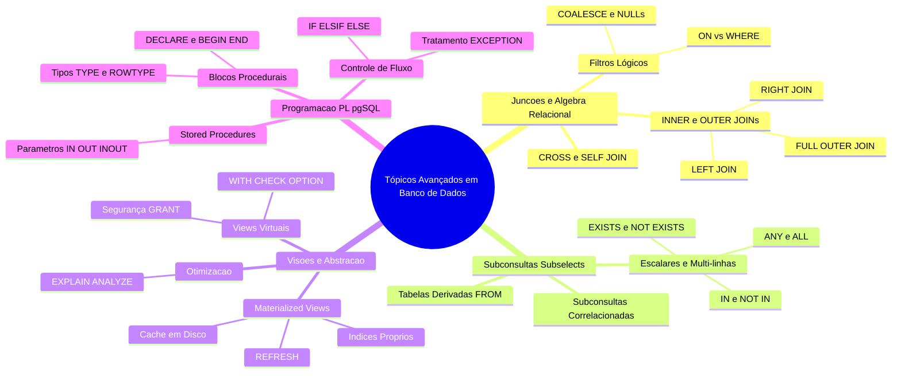
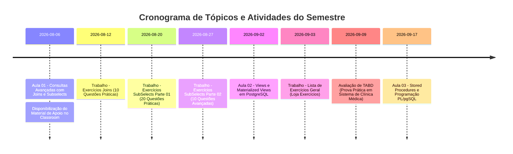
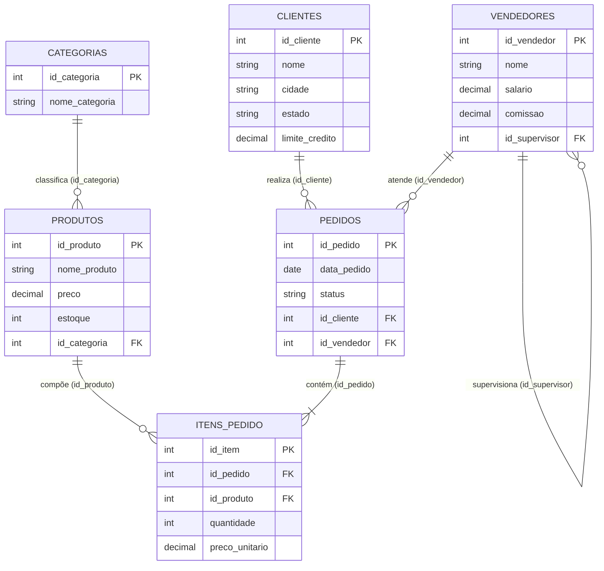
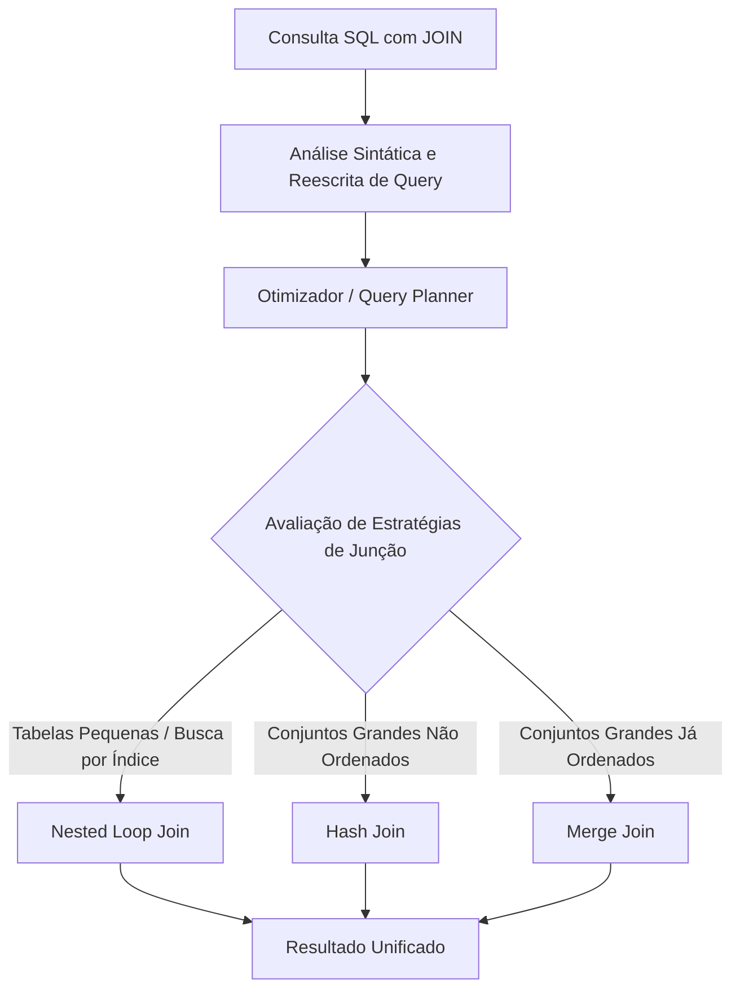
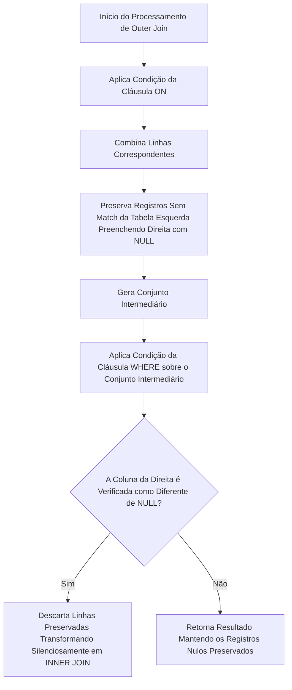
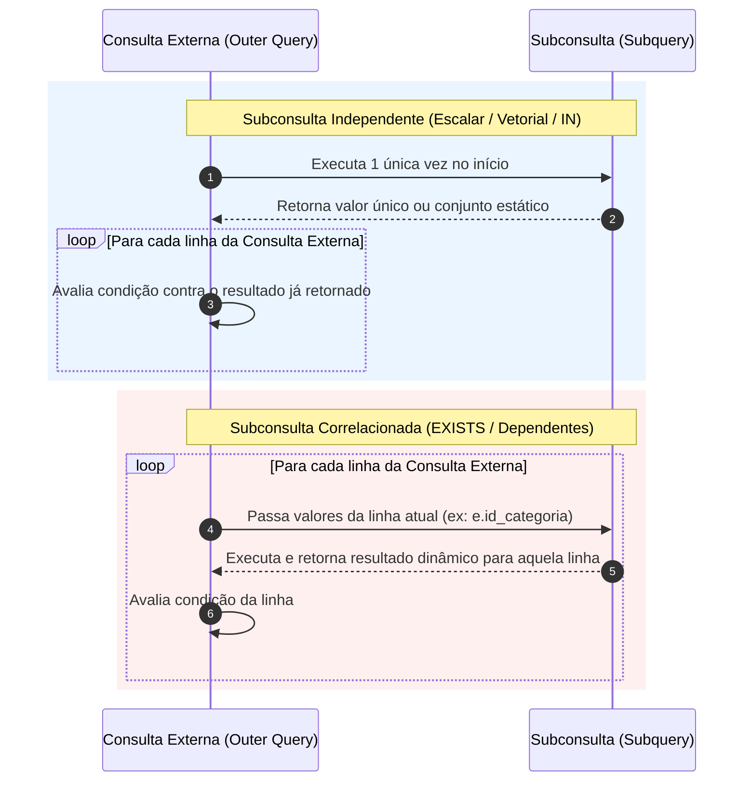
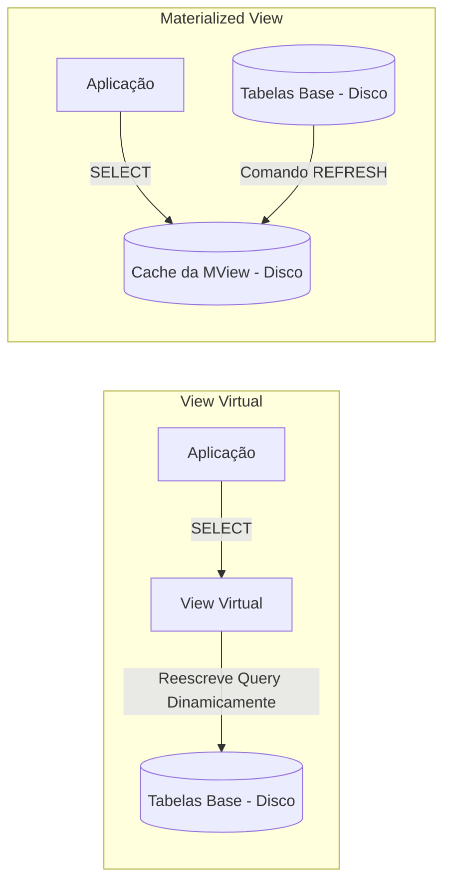
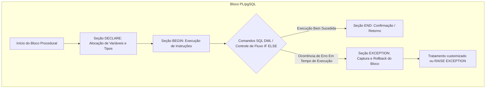

# Caderno Consolidado - Tópicos Avançados em Banco de Dados

## Sumário
- [Resumo Executivo](#resumo-executivo)
- [Mapa de Conteúdo](#mapa-de-conteúdo)
- [Linha do Tempo da Disciplina](#linha-do-tempo-da-disciplina)
- [Fundamentos e Arquitetura](#fundamentos-e-arquitetura)
  - [Normalização Relacional e Integridade Referencial](#normalização-relacional-e-integridade-referencial)
  - [Mecanismos de Junção Relacional e Processamento no SGBD](#mecanismos-de-junção-relacional-e-processamento-no-sgbd)
  - [Arquitetura de Subconsultas e Subconsultas Correlacionadas](#arquitetura-de-subconsultas-e-subconsultas-correlacionadas)
  - [Visões Virtuais e Visões Materializadas](#visões-virtuais-e-visões-materializadas)
  - [Programação Procedural em SGBD com PL/pgSQL](#programação-procedural-em-sgbd-com-plpgsql)
- [Sintaxe e Exemplos Práticos](#sintaxe-e-exemplos-práticos)
  - [Consultas Avançadas com Joins Encadeados e Agregações](#consultas-avançadas-com-joins-encadeados-e-agregações)
  - [Subconsultas Escalares, Quantificadas e Tabelas Derivadas](#subconsultas-escalares-quantificadas-e-tabelas-derivadas)
  - [Criação e Operação de Views e Materialized Views](#criação-e-operação-de-views-e-materialized-views)
  - [Implementação de Stored Procedures e Lógica Transacional em PL/pgSQL](#implementação-de-stored-procedures-e-lógica-transacional-em-plpgsql)
- [Boas Práticas e Armadilhas Comuns](#boas-práticas-e-armadilhas-comuns)
- [Tabelas Comparativas](#tabelas-comparativas)
- [Glossário](#glossário)
- [Checklist de Revisão para Prova](#checklist-de-revisão-para-prova)

---

## Resumo Executivo

O **Caderno Consolidado de Tópicos Avançados em Banco de Dados** reúne de forma exaustiva o corpus teórico e prático ministrado pelo Prof. Welington Garcia no 4º Semestre do curso de Sistemas de Informação da UniFEF. O material aborda a transição entre o modelo declarativo básico em SQL e a engenharia avançada de dados no SGBD PostgreSQL, cobrindo o reuso e recomposição de tabelas normalizadas através de junções (`JOINs`), o aninhamento lógico com subconsultas (*Subselects* e *CTEs*), a camada de abstração e performance analítica com Visões (*Views*) e Visões Materializadas (*Materialized Views*), e a programação procedural armazenada no SGBD utilizando *PL/pgSQL*.

Os tópicos centrais englobam:
1. **Junções Avançadas e Álgebra Relacional:** `INNER`, `LEFT`, `RIGHT`, `FULL OUTER`, `CROSS` e `SELF JOIN`, além da diferenciação semântica entre filtros aplicados na cláusula `ON` versus cláusula `WHERE`.
2. **Subconsultas e Expressões de Tabela:** Subconsultas escalares, vetoriais e tabulares, operadores de conjunto (`IN`, `NOT IN`), teste de existência (`EXISTS`, `NOT EXISTS`), quantificadores (`ANY`, `ALL`), subconsultas correlacionadas e tabelas derivadas na cláusula `FROM`.
3. **Encapsulamento e Otimização Analítica:** Visões lógicas virtuais, integridade de escrita com `WITH CHECK OPTION`, visões materializadas físicas, estratégias de atualização com `REFRESH MATERIALIZED VIEW`, indexação física sobre visões e análise de planos de execução com `EXPLAIN ANALYZE`.
4. **Programação Procedural em Servidor:** Estruturação de *Stored Procedures* e funções em *PL/pgSQL*, passagem de parâmetros (`IN`, `OUT`, `INOUT`), tipos de dados ancorados (`%TYPE`, `%ROWTYPE`), controle de fluxo (`IF/ELSIF/ELSE`), execução DML e controle de exceções.

---

## Mapa de Conteúdo



---

## Linha do Tempo da Disciplina



---

## Fundamentos e Arquitetura

### Normalização Relacional e Integridade Referencial

Em sistemas OLTP (*Online Transaction Processing*), a normalização de dados (da 1ª à 3ª Forma Normal e Boyce-Codd) visa eliminar a redundância de dados, anomalias de inserção, atualização e exclusão, fragmentando as entidades de negócio em tabelas discretas. A integridade estrutural e coesão entre essas entidades são garantidas através de restrições de **Chave Primária** (`PRIMARY KEY` - PK) e **Chave Estrangeira** (`FOREIGN KEY` - FK).



Quando um banco de dados é normalizado, as operações de leitura analítica exigem recompor o grafo de entidades. Se o SGBD mantiver apenas chaves lógicas sem restrições físicas de FK, alterações na aplicação podem gerar registros órfãos, como um pedido apontando para um cliente inexistente. A presença física de restrições de FK faz com que o PostgreSQL verifique a existência do registro pai no índice B-Tree correspondente antes de confirmar operações de escrita.

---

### Mecanismos de Junção Relacional e Processamento no SGBD

O PostgreSQL resolve a combinação de dados entre duas ou mais tabelas através de algoritmos internos no processador de consultas. Ao executar uma instrução de junção (`JOIN`), o otimizador calcula o custo e seleciona uma das seguintes estratégias baseadas nas estatísticas da tabela (`pg_statistic`):



1. **Nested Loop Join:** O SGBD percorre cada linha da tabela externa (outer table) e realiza uma busca para cada registro na tabela interna (inner table). É a estratégia padrão para tabelas pequenas ou quando há índices B-Tree eficientes nas colunas da cláusula `ON`.
2. **Hash Join:** O SGBD constrói uma tabela Hash em memória (WorkMem) com as chaves da tabela interna. Em seguida, varre a tabela externa uma única vez calculando o hash da chave para localizar as correspondências. É altamente eficiente para grandes volumes de dados não ordenados.
3. **Merge Join:** Requer que ambas as tabelas estejam previamente ordenadas pelas colunas de junção (seja por um índice ou por um passo explícito de ordenação). O SGBD percorre as duas tabelas em paralelo realizando a junção.

#### Processamento Lógico de Filtros: ON vs WHERE em Outer Joins
Uma das maiores fontes de falha na construção de relatórios relacionais reside na confusão sobre onde posicionar predicados de filtragem ao utilizar `LEFT JOIN` ou `RIGHT JOIN`.



- **Filtro na Cláusula ON:** É aplicado **durante** a construção do conjunto de junção. Se a tabela da direita não cumprir a condição do `ON`, a linha da tabela da esquerda **permanece no resultado**, tendo as colunas da direita preenchidas com `NULL`.
- **Filtro na Cláusula WHERE:** É aplicado **após** o processamento da junção. Se a condição no `WHERE` avaliar colunas da tabela da direita (por exemplo, `p.status = 'Pago'`), as linhas que foram preservadas pelo `LEFT JOIN` terão `NULL` em `p.status`. Como a expressão `NULL = 'Pago'` resulta em `UNKNOWN`, a linha é eliminada. Isso altera a semântica do `LEFT JOIN`, convertendo-o de forma oculta em um `INNER JOIN`.

---

### Arquitetura de Subconsultas e Subconsultas Correlacionadas

Uma subconsulta (*subselect* ou *subquery*) é uma instrução `SELECT` aninhada no interior de uma consulta principal. O PostgreSQL trata as subconsultas de acordo com a sua dependência estrutural em relação à consulta externa:



1. **Subconsulta Independente:** Não referencia colunas da consulta externa. É executada uma única vez antes da instrução externa. Seus resultados são cacheados na memória para a avaliação do predicado.
2. **Subconsulta Correlacionada:** Referencia uma ou mais colunas da consulta externa. Conceitualmente, a subconsulta é reexecutada para cada linha avaliada pela consulta externa. Embora o otimizador do PostgreSQL busque converter subconsultas correlacionadas em junções internas via reescrita de query, estruturas complexas podem gerar um custo computacional $O(N \times M)$.

#### Avaliação por Curto-Circuito: IN vs EXISTS
- **Operador IN:** Compara um valor escalar contra um conjunto de resultados. O operador avalia todos os itens do conjunto retornado pela subconsulta.
  - *Problema do NULL com NOT IN:* A expressão `v NOT IN (A, B, NULL)` expande para `v <> A AND v <> B AND v <> NULL`. Como `v <> NULL` retorna `UNKNOWN`, a expressão inteira é avaliada como `UNKNOWN` e nenhuma linha é retornada pela consulta.
- **Operador EXISTS / NOT EXISTS:** Não se importa com os valores retornados na projeção (`SELECT 1`). Ele avalia se a subconsulta retorna pelo menos um registro. Ao encontrar a primeira linha que satisfaz a condição interna, a execução da subconsulta para aquela linha é interrompida imediatamente (*short-circuit evaluation*). Adicionalmente, o `NOT EXISTS` lida com valores nulos de forma segura sem anular a busca.

---

### Visões Virtuais e Visões Materializadas

O PostgreSQL provê dois mecanismos para abstração e encapsulamento de consultas: Visões Virtuais (`VIEW`) e Visões Materializadas (`MATERIALIZED VIEW`).



- **Visão Virtual (Standard View):** É um objeto do catálogo do banco que armazena apenas a árvore de parsing SQL da consulta. Não ocupa espaço em disco (exceto metadados). Quando consultada, o otimizador funde a consulta da view com a consulta do usuário, criando uma única árvore de execução sobre as tabelas base.
- **Visão Materializada (Materialized View):** Executa a consulta subjacente no momento de sua criação ou atualização e grava o resultado fisicamente em disco como uma tabela real. As consultas subsequentes leem diretamente os dados cacheados em disco, sem reavaliar as junções ou agregações das tabelas base. Requer o comando `REFRESH MATERIALIZED VIEW` para sincronizar os dados.

---

### Programação Procedural em SGBD com PL/pgSQL

O PL/pgSQL (*Procedural Language/PostgreSQL*) estende a linguagem declarativa SQL agregando conceitos imperativos de programação. Ele roda dentro do processo do motor do banco de dados, eliminating a latência de rede decorrente do tráfego repetitivo de instruções entre a aplicação backend e o SGBD.



#### Tipos de Dados Ancorados
Para evitar falhas de execução quando a estrutura das tabelas é alterada no catálogo (DDL), o PL/pgSQL oferece ancoragem de tipos:
- `%TYPE`: Herda o tipo de dado de uma coluna específica de uma tabela (ex: `v_limite clientes.limite_credito%TYPE;`).
- `%ROWTYPE`: Declara uma estrutura de dados de registro (*record*) contendo todas as colunas de uma tabela ou visão (ex: `v_cliente clientes%ROWTYPE;`).

#### Stored Procedures vs Functions
- **Functions (`CREATE FUNCTION`):** Devem obrigatoriamente declarar um tipo de retorno (`RETURNS type` ou `RETURNS TABLE`). Podem ser invocadas dentro de instruções SQL (`SELECT * FROM minha_funcao()`).
- **Stored Procedures (`CREATE PROCEDURE`):** São invocadas de forma isolada via comando `CALL`. Não possuem cláusula `RETURNS` obrigatória (usam parâmetros `OUT` ou `INOUT` para devolver dados). Permitem o gerenciamento direto de transações dentro do bloco procedural.

---

## Sintaxe e Exemplos Práticos

### Consultas Avançadas com Joins Encadeados e Agregações

O exemplo a seguir consolida uma consulta analítica que encadeia 6 tabelas da base de e-commerce, aplicando tratamento de valores nulos via `COALESCE`, agregações e cálculo de subtotais.

```sql
-- Relatório Executivo de Vendas por Vendedor, Categoria e Cliente
-- Demonstração de INNER JOINs, LEFT JOINs e COALESCE
SELECT 
    p.id_pedido AS codigo_pedido,
    p.data_pedido,
    c.nome AS nome_cliente,
    c.cidade AS cidade_cliente,
    v.nome AS nome_vendedor,
    pr.nome_produto,
    cat.nome_categoria,
    ip.quantidade,
    ip.preco_unitario,
    (ip.quantidade * ip.preco_unitario) AS subtotal_item,
    COALESCE(v.comissao, 0.00) AS taxa_comissao,
    ROUND((ip.quantidade * ip.preco_unitario) * (COALESCE(v.comissao, 0.00) / 100.0), 2) AS valor_comissao
FROM pedidos p
INNER JOIN clientes c ON p.id_cliente = c.id_cliente
INNER JOIN vendedores v ON p.id_vendedor = v.id_vendedor
INNER JOIN itens_pedido ip ON p.id_pedido = ip.id_pedido
INNER JOIN produtos pr ON ip.id_produto = pr.id_produto
INNER JOIN categorias cat ON pr.id_categoria = cat.id_categoria
WHERE p.status IN ('Pago', 'Enviado')
ORDER BY p.id_pedido ASC, pr.nome_produto ASC;
```

#### Demonstração Lógica da Diferença: ON vs WHERE em LEFT JOIN

```sql
-- Cenário A: Filtro posicionado na cláusula ON (Preserva todos os clientes)
-- Retorna inclusive clientes que não possuem pedidos em '2026-07-01' (com NULLs nas colunas do pedido)
SELECT 
    c.id_cliente,
    c.nome AS cliente,
    p.id_pedido,
    p.data_pedido
FROM clientes c
LEFT JOIN pedidos p ON c.id_cliente = p.id_cliente 
                   AND p.data_pedido = '2026-07-01';

-- Cenário B: Filtro posicionado na cláusula WHERE (Converte LEFT JOIN em INNER JOIN)
-- Exclui clientes sem pedidos e clientes com pedidos em outras datas!
SELECT 
    c.id_cliente,
    c.nome AS cliente,
    p.id_pedido,
    p.data_pedido
FROM clientes c
LEFT JOIN pedidos p ON c.id_cliente = p.id_cliente
WHERE p.data_pedido = '2026-07-01';
```

---

### Subconsultas Escalares, Quantificadas e Tabelas Derivadas

As consultas a seguir abordam os padrões cobrados nos trabalhos práticos da disciplina.

#### Subconsulta Escalar na Projeção (`SELECT`) e no Filtro (`WHERE`)
```sql
-- Exibe nome, preço, média geral de preços e a diferença em relação à média
SELECT 
    nome_produto,
    preco,
    (SELECT ROUND(AVG(preco), 2) FROM produtos) AS media_geral_preco,
    ROUND(preco - (SELECT AVG(preco) FROM produtos), 2) AS diferenca_da_media
FROM produtos
WHERE preco > (SELECT AVG(preco) FROM produtos)
ORDER BY preco DESC;
```

#### Operadores Quantificadores: ANY e ALL
```sql
-- ANY: Produtos cujo preço é maior que o preço de PELO MENOS UM produto da categoria 'Telefonia' (id_categoria = 2)
SELECT nome_produto, preco, id_categoria
FROM produtos
WHERE preco > ANY (
    SELECT preco 
    FROM produtos 
    WHERE id_categoria = 2
);

-- ALL: Produtos cujo preço é maior que o preço de TODOS os produtos da categoria 'Acessórios' (id_categoria = 4)
SELECT nome_produto, preco, id_categoria
FROM produtos
WHERE preco > ALL (
    SELECT preco 
    FROM produtos 
    WHERE id_categoria = 4
);
```

#### Subconsulta Correlacionada
```sql
-- Seleciona produtos cujo preço excede a média de preço da sua PRÓPRIA categoria
SELECT 
    p.id_produto,
    p.nome_produto,
    p.preco,
    p.id_categoria
FROM produtos p
WHERE p.preco > (
    SELECT AVG(sub.preco)
    FROM produtos sub
    WHERE sub.id_categoria = p.id_categoria
);
```

#### Tabela Derivada no `FROM` com `JOIN`
```sql
-- Calcula o total acumulado por pedido em uma tabela derivada e combina com dados do cliente
SELECT 
    p.id_pedido,
    c.nome AS cliente,
    p.data_pedido,
    totais.valor_total_pedido
FROM pedidos p
INNER JOIN clientes c ON p.id_cliente = c.id_cliente
INNER JOIN (
    SELECT 
        id_pedido, 
        SUM(quantidade * preco_unitario) AS valor_total_pedido
    FROM itens_pedido
    GROUP BY id_pedido
) AS totais ON p.id_pedido = totais.id_pedido
WHERE totais.valor_total_pedido > 3000.00
ORDER BY totais.valor_total_pedido DESC;
```

---

### Criação e Operação de Views e Materialized Views

#### View Virtual com Proteção de Escrita (`WITH CHECK OPTION`)
```sql
-- Criação de View filtrada por estado
CREATE OR REPLACE VIEW vw_clientes_sp AS
SELECT 
    id_cliente,
    nome,
    cidade,
    estado,
    limite_credito
FROM clientes
WHERE estado = 'SP'
WITH CHECK OPTION;

-- Tentativa de UPDATE que violaria o filtro da View (SISTEMA BLOQUEIA E RETORNA ERRO)
-- UPDATE vw_clientes_sp SET estado = 'MG' WHERE id_cliente = 1;
```

#### Materialized View com Índice Físico e Atualização
```sql
-- Criação de Materialized View para Consolidação Analítica de Vendas
CREATE MATERIALIZED VIEW mv_vendas_por_cliente AS
SELECT 
    c.id_cliente,
    c.nome AS nome_cliente,
    c.estado,
    COUNT(DISTINCT p.id_pedido) AS total_pedidos,
    COALESCE(SUM(ip.quantidade * ip.preco_unitario), 0.00) AS faturamento_total
FROM clientes c
LEFT JOIN pedidos p ON c.id_cliente = p.id_cliente
LEFT JOIN itens_pedido ip ON p.id_pedido = ip.id_pedido
GROUP BY c.id_cliente, c.nome, c.estado
WITH DATA;

-- Criação de Índice B-Tree Físico sobre a Materialized View para Acelerar Buscas
CREATE UNIQUE INDEX idx_mv_vendas_cliente_id ON mv_vendas_por_cliente (id_cliente);

-- Atualização Concorrente da Materialized View (Não Bloqueia Leituras Simultâneas)
REFRESH MATERIALIZED VIEW CONCURRENTLY mv_vendas_por_cliente;
```

#### Análise do Plano de Execução com EXPLAIN ANALYZE
```sql
-- Análise de custo entre consultas com IN vs EXISTS
EXPLAIN ANALYZE
SELECT c.id_cliente, c.nome 
FROM clientes c
WHERE c.id_cliente IN (SELECT p.id_cliente FROM pedidos p);

EXPLAIN ANALYZE
SELECT c.id_cliente, c.nome 
FROM clientes c
WHERE EXISTS (SELECT 1 FROM pedidos p WHERE p.id_cliente = c.id_cliente);
```

---

### Implementação de Stored Procedures e Lógica Transacional em PL/pgSQL

A Stored Procedure a seguir implementa uma regra de negócio complexa de transferência bancária entre contas, incluindo validação de saldo, atualização DML, registro de histórico em tabela de auditoria, captura de exceções e retorno de parâmetros `OUT`.

```sql
-- Script de Suporte DDL para o Exemplo Procedural
CREATE TABLE IF NOT EXISTS contas (
    id_conta SERIAL PRIMARY KEY,
    titular VARCHAR(100) NOT NULL,
    saldo NUMERIC(12,2) NOT NULL DEFAULT 0.00
);

CREATE TABLE IF NOT EXISTS historico_transferencias (
    id_transacao SERIAL PRIMARY KEY,
    id_conta_origem INT REFERENCES contas(id_conta),
    id_conta_destino INT REFERENCES contas(id_conta),
    valor NUMERIC(12,2) NOT NULL,
    data_transacao TIMESTAMP DEFAULT CURRENT_TIMESTAMP
);

-- Stored Procedure em PL/pgSQL com Parâmetros IN/OUT e Tratamento de Exceção
CREATE OR REPLACE PROCEDURE sp_transferir_fundos(
    IN p_origem INT,
    IN p_destino INT,
    IN p_valor NUMERIC(12,2),
    OUT p_codigo_status INT,
    OUT p_mensagem VARCHAR(255)
)
LANGUAGE plpgsql
AS $$
DECLARE
    v_saldo_origem contas.saldo%TYPE;
    v_registro_origem contas%ROWTYPE;
BEGIN
    -- Validação inicial dos parâmetros
    IF p_valor <= 0 THEN
        p_codigo_status := 400;
        p_mensagem := 'Erro: O valor da transferência deve ser maior que zero.';
        RETURN;
    END IF;

    -- Busca registro da conta origem com trava de linha (FOR UPDATE) para concorrencia
    SELECT * INTO v_registro_origem
    FROM contas
    WHERE id_conta = p_origem
    FOR UPDATE;

    IF NOT FOUND THEN
        p_codigo_status := 404;
        p_mensagem := 'Erro: Conta de origem não encontrada.';
        RETURN;
    END IF;

    -- Verifica saldo suficiente
    IF v_registro_origem.saldo < p_valor THEN
        p_codigo_status := 422;
        p_mensagem := FORMAT('Erro: Saldo insuficiente. Saldo atual: %s, Solicitado: %s', 
                             v_registro_origem.saldo, p_valor);
        RETURN;
    END IF;

    -- Verifica existência da conta destino
    IF NOT EXISTS (SELECT 1 FROM contas WHERE id_conta = p_destino) THEN
        p_codigo_status := 404;
        p_mensagem := 'Erro: Conta de destino não encontrada.';
        RETURN;
    END IF;

    -- Execução das operações DML
    UPDATE contas 
    SET saldo = saldo - p_valor 
    WHERE id_conta = p_origem;

    UPDATE contas 
    SET saldo = saldo + p_valor 
    WHERE id_conta = p_destino;

    INSERT INTO historico_transferencias (id_conta_origem, id_conta_destino, valor)
    VALUES (p_origem, p_destino, p_valor);

    p_codigo_status := 200;
    p_mensagem := 'Transferência realizada com sucesso.';

EXCEPTION
    WHEN OTHERS THEN
        p_codigo_status := 500;
        p_mensagem := FORMAT('Exceção interna do SGBD: %s', SQLERRM);
END;
$$;
```

#### Bloco Anônimo para Invocação da Procedure com Parâmetros OUT
```sql
DO $$
DECLARE
    v_status INT;
    v_msg VARCHAR(255);
BEGIN
    -- Executa a chamada da procedure
    CALL sp_transferir_fundos(1, 2, 500.00, v_status, v_msg);
    
    -- Exibe os retornos no console do PostgreSQL
    RAISE NOTICE 'Status da Resposta: %', v_status;
    RAISE NOTICE 'Mensagem do Servidor: %', v_msg;
END;
$$;
```

---

## Boas Práticas e Armadilhas Comuns

### 1. Desempenho e Sintaxe em Joins
- **Armadilha:** Produto Cartesiano Acidental. Ocorre ao omitir a cláusula `ON` ou utilizar a sintaxe antiga do ANSI SQL-89 (`FROM tabelaA, tabelaB`). Se `tabelaA` possuir $10.000$ linhas e `tabelaB` $10.000$ linhas, o banco gerará um resultado intermediário de $100.000.000$ de linhas.
- **Armadilha:** Ambiguidade de nomes de coluna em projeções com `JOIN`. Sempre declare aliases explicitamente (ex: `p.id_cliente`).
- **Boa Prática:** Evite o uso de `NATURAL JOIN`. Se duas tabelas adicionarem colunas com nomes idênticos no futuro (como `criado_em` ou `status`), o `NATURAL JOIN` alterará seu comportamento de junção silenciosamente, corrompendo a aplicação.

### 2. Tratamento Lógico com Subconsultas
- **Armadilha do NULL com NOT IN:** Nunca utilize `NOT IN` com uma subconsulta que possa retornar valores nulos (`NULL`). Se um único valor for nulo, a consulta retornará conjunto vazio.
  - *Correção:* Garanta o filtro `WHERE coluna IS NOT NULL` dentro da subconsulta ou substitua o comando por `NOT EXISTS`.
- **Armadilha de Escalar Multi-Linhas:** Utilizar operadores escalares (`=`, `>`, `<`) com uma subconsulta que retorna mais de um registro resulta no erro em runtime: `ERROR: subquery must return only one row`.

### 3. Gerenciamento de Visões e Views Materializadas
- **Armadilha do `SELECT *` em Views:** Definir uma view usando `SELECT * FROM tabela` faz com que o PostgreSQL expanda as colunas no momento da criação. Se novas colunas forem adicionadas à tabela base posteriormente, a View **não** as exibirá até ser recriada.
- **Boa Prática:** Crie índices B-Tree ou compostos sobre colunas de busca frequente dentro de `Materialized Views` para maximizar o ganho de desempenho OLAP.

### 4. Desenvolvimento Procedural PL/pgSQL
- **Boa Prática:** Utilize tipos ancorados (`%TYPE` e `%ROWTYPE`) para todas as variáveis procedurais que armazenam dados de tabelas.
- **Armadilha de Trava Concorrente (*Deadlocks*):** Em procedimentos armazenados que realizam múltiplos `UPDATEs`, ordene as alterações pelas chaves primárias para evitar travamento cruzado de transações concorrentes (*deadlocks*).

---

## Tabelas Comparativas

### Tabela Comparativa 1: Estratégias de Junção de Tabelas (JOINs)

| Tipo de JOIN | Preserva Tabela Esquerda? | Preserva Tabela Direita? | Trata Registros Sem Match | Uso Típico |
| :--- | :--- | :--- | :--- | :--- |
| **INNER JOIN** | Não | Não | Descarta ambos do resultado | Relacionamentos estritos e obrigatórios entre tabelas. |
| **LEFT JOIN** | Sim | Não | Preenche colunas da direita com `NULL` | Relatórios de auditoria, busca por dependências e dados opcionais. |
| **RIGHT JOIN** | Não | Sim | Preenche colunas da esquerda com `NULL` | Equivalente ao `LEFT JOIN` invertendo a ordem das tabelas. |
| **FULL OUTER JOIN** | Sim | Sim | Preenche com `NULL` o lado sem correspondência | Conciliação de bases de dados, migração e auditoria integral. |
| **CROSS JOIN** | N/A | N/A | Gera o Produto Cartesiano ($N \times M$) | Matrizes de combinação (ex: grade de tamanhos vs cores). |
| **SELF JOIN** | Depende | Depende | Associa a tabela a ela mesma via Aliases | Estruturas hierárquicas (gerente/subordinado, categorias pai/filho). |

---

### Tabela Comparativa 2: Mecanismos de Abstração (Tabelas vs Views vs Materialized Views vs Procedures)

| Propriedade / Funcionalidade | Tabela Física | Visão Virtual (`VIEW`) | Visão Materializada (`MATERIALIZED VIEW`) | Stored Procedure (`PROCEDURE`) |
| :--- | :--- | :--- | :--- | :--- |
| **Armazenamento em Disco** | Sim (dados e índices) | Não (apenas SQL no catálogo) | Sim (dados cacheados em disco) | Não (apenas código compilado) |
| **Atualização dos Dados** | Instantânea via DML | Instantânea (reflete tabelas base) | Assíncrona (via `REFRESH`) | N/A (executa código imperativo) |
| **Suporta Índices Próprios** | Sim | Não | Sim | Não |
| **Aceita Parâmetros** | Não | Não | Não | Sim (`IN`, `OUT`, `INOUT`) |
| **Pode Executar DML Interno** | N/A | Depende (Views simples) | Não | Sim (`INSERT`, `UPDATE`, `DELETE`) |
| **Controle Transacional** | N/A | Não | Não | Sim (`COMMIT` / `ROLLBACK`) |
| **Propósito Principal** | Persistência OLTP | Segurança e abstração lógica | Desempenho analítico OLAP | Encapsulamento de regras de negócio |

---

### Tabela Comparativa 3: Operadores de Subconsulta (`IN` vs `EXISTS` vs `ANY` vs `ALL`)

| Operador | Tipo de Subconsulta | Avaliação Interna | Comportamento com `NULL` | Desempenho Típico |
| :--- | :--- | :--- | :--- | :--- |
| **`IN`** | Vetorial (1 Coluna, N Linhas) | Avalia a lista completa de valores | `NOT IN` falha se houver qualquer `NULL` | Bom para conjuntos pequenos e estáticos. |
| **`EXISTS`** | Correlacionada (Múltiplas Colunas) | Parada imediata ao achar 1ª linha (*short-circuit*) | Insensível a valores `NULL` na subconsulta | Excelente para tabelas grandes via índice. |
| **`ANY` / `SOME`**| Vetorial (1 Coluna) | Verdadeiro se comparar com **pelo menos um** | Avaliação condicional três-valores | Equivalente a simplificações de `OR`. |
| **`ALL`** | Vetorial (1 Coluna) | Verdadeiro apenas se comparar com **todos** | Retorna `UNKNOWN` se conjunto contiver `NULL` | Equivalente a simplificações de `AND`. |

---

## Glossário

| Termo | Definição |
| :--- | :--- |
| **Alias** | Apelido temporário atribuído a uma tabela ou coluna em uma consulta SQL para evitar ambiguidade e facilitar a leitura. |
| **Anomalia de Atualização** | Inconsistência de dados gerada em bancos não normalizados quando a alteração de um dado exige modificação em múltiplos registros. |
| **B-Tree Index** | Estrutura de dados em árvore balanceada utilizada por padrão no PostgreSQL para acelerar buscas por igualdade e intervalo. |
| **COALESCE** | Função escalar SQL que recebe uma lista de argumentos e retorna o primeiro valor não nulo encontrado. |
| **CTE (Common Table Expression)** | Bloco temporário de consulta nomeado definido antes da consulta principal utilizando a cláusula `WITH`. |
| **Curto-Circuito (Short-Circuit)** | Mecanismo de otimização onde a avaliação de uma expressão lógica é interrompida assim que o resultado final é determinado. |
| **EXPLAIN ANALYZE** | Comando do PostgreSQL que planeja, executa a consulta e exibe o plano de execução real com custos e tempos em milissegundos. |
| **Hash Join** | Algoritmo de junção que constrói uma tabela hash na memória para relacionar dados de duas tabelas volumosas. |
| **Integridade Referencial** | Regra de banco de dados relacional que garante que uma chave estrangeira sempre aponte para uma chave primária válida e existente. |
| **Materialized View** | Objeto que executa uma consulta complexa e persiste seu resultado fisicamente em disco para leitura de alta velocidade. |
| **Nested Loop Join** | Algoritmo de junção que itera sobre cada linha da tabela externa buscando correspondências na tabela interna. |
| **PL/pgSQL** | Linguagem procedural nativa do PostgreSQL que permite a criação de funções, procedimentos armazenados e gatilhos (*triggers*). |
| **Produto Cartesiano** | Resultado da combinação não filtrada entre duas tabelas, onde cada linha da primeira é associada a todas as linhas da segunda. |
| **REFRESH MATERIALIZED VIEW** | Comando SQL que reexecuta a consulta original de uma visão materializada e atualiza seus dados cacheados em disco. |
| **SELF JOIN** | Operação de junção na qual uma tabela é associada a ela mesma através do uso de dois aliases distintos. |
| **Subconsulta Correlacionada** | Subconsulta que depende e faz referência a colunas da consulta externa, sendo reavaliada para cada linha processada. |
| **Subconsulta Escalar** | Subconsulta SQL projetada para retornar estritamente uma única linha e uma única coluna (valor único). |
| **Tipo Ancorado (%TYPE)** | Recurso em PL/pgSQL que faz uma variável declarar seu tipo de dado com base no tipo exato de uma coluna existente no catálogo. |
| **WITH CHECK OPTION** | Cláusula aplicada em Views atualizáveis que impede operações de escrita que violem o filtro `WHERE` da visão. |
| **WorkMem** | Configuração de memória do PostgreSQL alocada para operações internas de ordenação e tabelas Hash de junções. |

---

## Checklist de Revisão para Prova

- [ ] Compreender a diferença conceitual e prática entre `INNER JOIN`, `LEFT JOIN`, `RIGHT JOIN` e `FULL OUTER JOIN`.
- [ ] Saber explicar a diferença no resultado quando um filtro é posicionado na cláusula `ON` versus na cláusula `WHERE` em um `LEFT JOIN`.
- [ ] Identificar quando um `LEFT JOIN` é convertido silenciosamente em um `INNER JOIN`.
- [ ] Escrever consultas com `SELF JOIN` para estruturas hierárquicas e entender a obrigatoriedade de aliases distintos.
- [ ] Resolver problemas com `GROUP BY` e funções de agregação (`SUM`, `AVG`, `COUNT`), garantindo que todas as colunas não agregadas estejam listadas na cláusula `GROUP BY`.
- [ ] Identificar o comportamento de subconsultas escalares no `WHERE` e no `SELECT`.
- [ ] Saber exatamente por que a instrução `NOT IN` falha ao retornar qualquer linha caso a subconsulta contenha um valor `NULL`.
- [ ] Saber a diferença entre os operadores de conjunto `IN`, `EXISTS`, `ANY` e `ALL`.
- [ ] Explicar a vantagem de desempenho do operador `EXISTS` por meio da avaliação por curto-circuito (*short-circuit*).
- [ ] Escrever e interpretar subconsultas correlacionadas e tabelas derivadas na cláusula `FROM`.
- [ ] Conhecer a diferença fundamental entre uma `VIEW` virtual e uma `MATERIALIZED VIEW` (armazenamento em disco, sincronização e índices).
- [ ] Saber aplicar a cláusula `WITH CHECK OPTION` em visões e qual seu efeito em operações `INSERT` e `UPDATE`.
- [ ] Utilizar o comando `REFRESH MATERIALIZED VIEW` e entender o uso do parâmetro `CONCURRENTLY`.
- [ ] Interpretar a saída do comando `EXPLAIN ANALYZE` (identificando custos, `Seq Scan`, `Index Scan`, `Hash Join` e tempos de execução).
- [ ] Conhecer a estrutura básica de um bloco `PL/pgSQL` (`DECLARE`, `BEGIN`, `END`, `EXCEPTION`).
- [ ] Saber declarar variáveis utilizando tipos ancorados (`%TYPE` e `%ROWTYPE`).
- [ ] Diferenciar os modificadores de parâmetros de uma procedure (`IN`, `OUT`, `INOUT`).
- [ ] Criar condicionais (`IF/ELSIF/ELSE`) e capturar exceções (`RAISE EXCEPTION`) dentro de procedimentos em `PL/pgSQL`.

---

## Fontes e Metadados

- Turma no Classroom: Tópicos Avançados em BD - FEF
- Itens processados: 3 materiais, 5 tarefas, 0 avisos
- Gerado em: 23/09/2026, 21:54:21 (BRT) via classroom-sync
