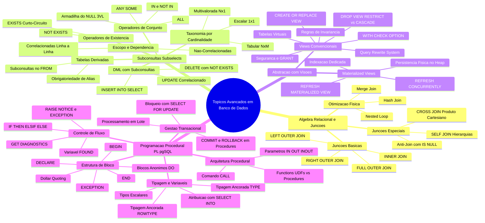
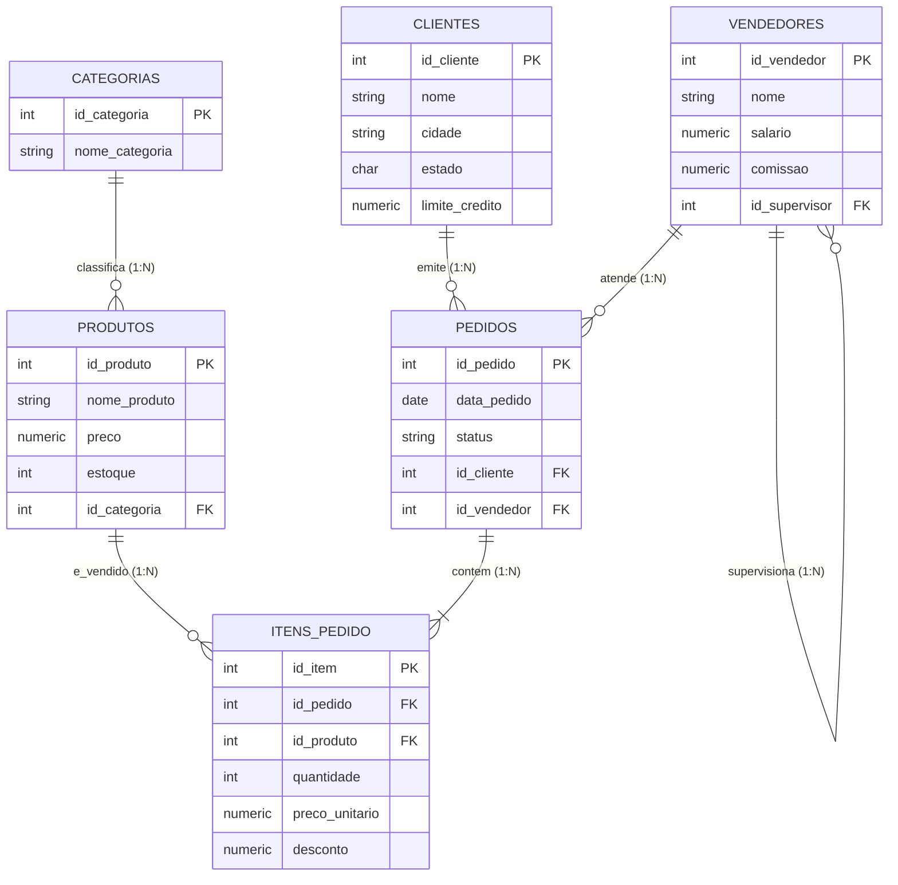
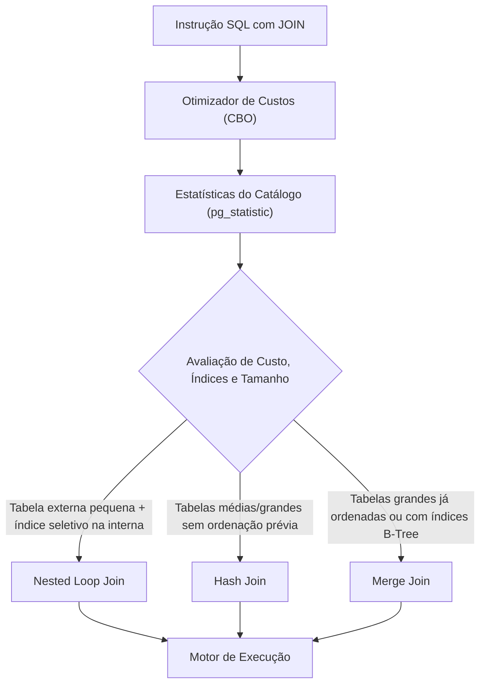
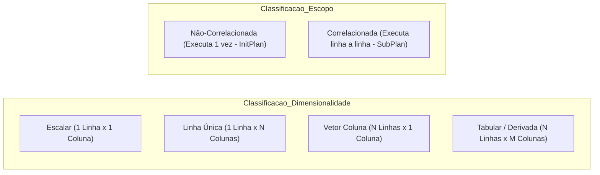
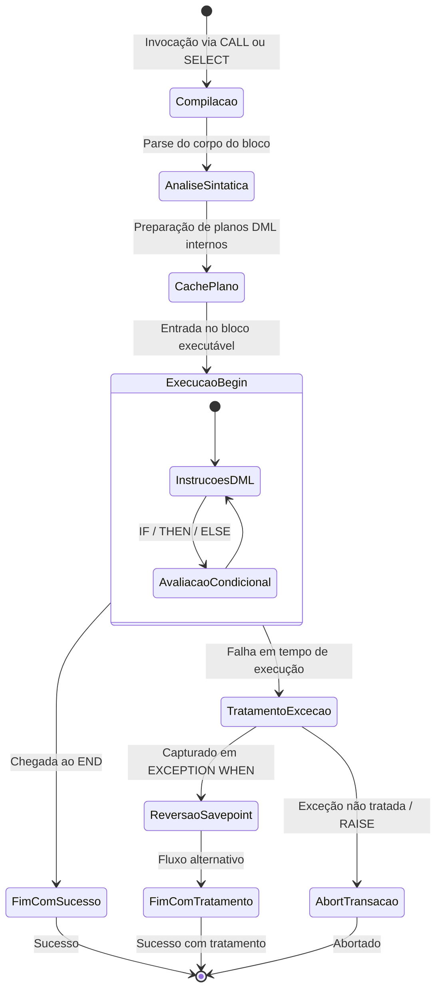
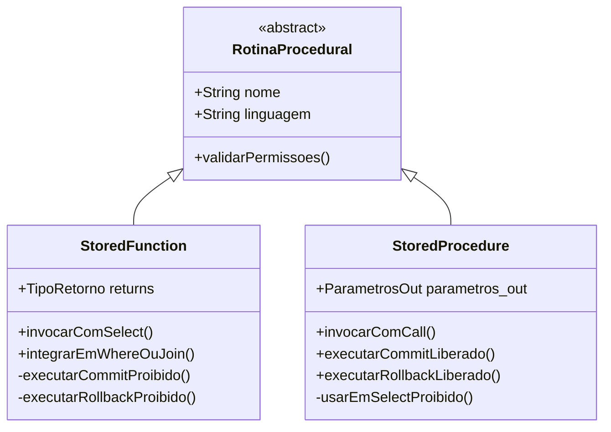
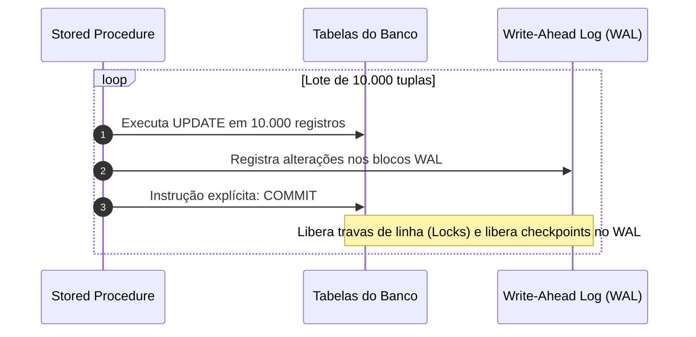
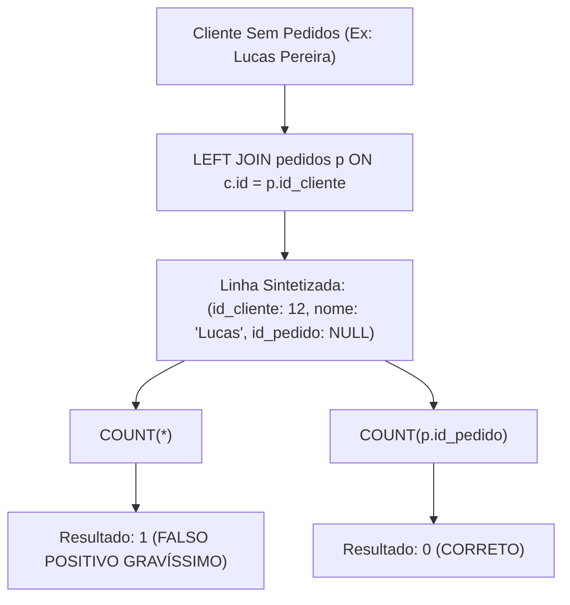
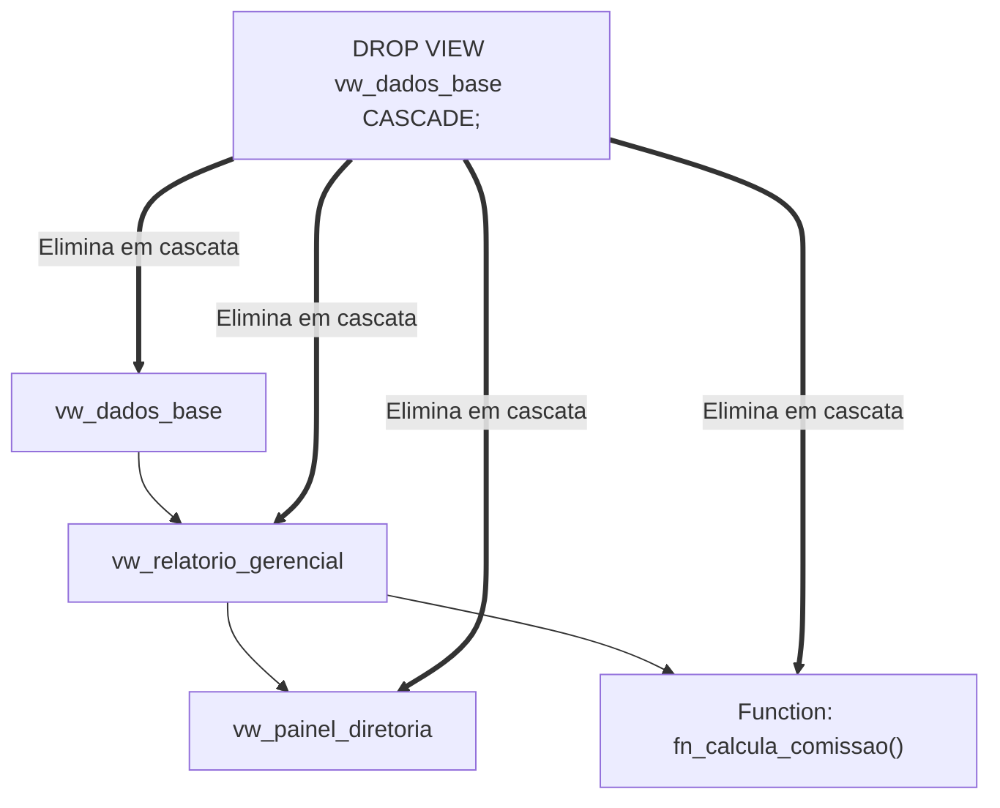
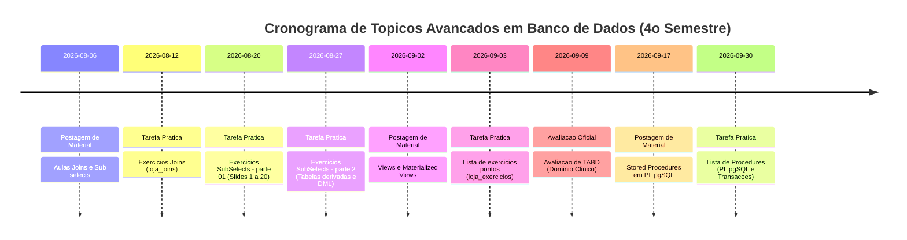

# Caderno Consolidado - Tópicos Avançados em Banco de Dados

## Sumário

- [Resumo Executivo](#resumo-executivo)
- [Mapa de Conteúdo](#mapa-de-conteúdo)
- [Fundamentos e Arquitetura](#fundamentos-e-arquitetura)
  - [Álgebra Relacional e Integridade Estrutural](#álgebra-relacional-e-integridade-estrutural)
  - [Otimizador de Consultas do PostgreSQL e Algoritmos Físicos de Junção](#otimizador-de-consultas-do-postgresql-e-algoritmos-físicos-de-junção)
  - [Taxonomia e Mecânica de Subconsultas](#taxonomia-e-mecânica-de-subconsultas)
  - [Lógica Trivalente e o Impacto de Valores Nulos](#lógica-trivalente-e-o-impacto-de-valores-nulos)
  - [Arquitetura de Visões Relacionais e o Query Rewrite Rule System](#arquitetura-de-visões-relacionais-e-o-query-rewrite-rule-system)
  - [Materialized Views: Armazenamento Físico, Indexação e Ciclo de Vida](#materialized-views-armazenamento-físico-indexação-e-ciclo-de-vida)
  - [Programação Procedural em PL/pgSQL: Motor de Execução e Escopo](#programação-procedural-em-plpgsql-motor-de-execução-e-escopo)
  - [Diferenças Arquiteturais entre Functions e Stored Procedures](#diferenças-arquiteturais-entre-functions-e-stored-procedures)
  - [Gestão Transacional Autônoma e Controle de Concorrência](#gestão-transacional-autônoma-e-controle-de-concorrência)
- [Sintaxe e Exemplos Práticos](#sintaxe-e-exemplos-práticos)
  - [Junções Relacionais Fundamentais](#junções-relacionais-fundamentais)
  - [O Padrão Anti-Join com LEFT JOIN e IS NULL](#o-padrão-anti-join-com-left-join-e-is-null)
  - [Subconsultas Escalares e Expressões de Filtro](#subconsultas-escalares-e-expressões-de-filtro)
  - [Subconsultas de Conjunto e Quantificadores](#subconsultas-de-conjunto-e-quantificadores)
  - [Tabelas Derivadas na Cláusula FROM](#tabelas-derivadas-na-cláusula-from)
  - [Subconsultas Correlacionadas e Filtros de Grupo com HAVING](#subconsultas-correlacionadas-e-filtros-de-grupo-com-having)
  - [DML Avançado Orientado por Subconsultas](#dml-avançado-orientado-por-subconsultas)
  - [Criação, Atualização e Governança de Views](#criação-atualização-e-governança-de-views)
  - [Materialized Views na Prática: Carga, Indexação e Atualização Concorrente](#materialized-views-na-prática-carga-indexação-e-atualização-concorrente)
  - [Estrutura Formal de Blocos PL/pgSQL e Variáveis](#estrutura-formal-de-blocos-plpgsql-e-variáveis)
  - [Stored Procedures Operacionais e Orquestração Transacional](#stored-procedures-operacionais-e-orquestração-transacional)
- [Boas Práticas e Armadilhas Comuns](#boas-práticas-e-armadilhas-comuns)
  - [Armadilha do COUNT(*) versus COUNT(coluna) sob LEFT JOIN](#armadilha-do-count-versus-countcoluna-sob-left-join)
  - [Armadilha do NOT IN com Nulos na Subconsulta](#armadilha-do-not-in-com-nulos-na-subconsulta)
  - [Armadilha de Filtrar Tabela Externa no WHERE após um LEFT JOIN](#armadilha-de-filtrar-tabela-externa-no-where-após-um-left-join)
  - [Produto Cartesiano Acidental e Desaconselhamento de NATURAL JOIN](#produto-cartesiano-acidental-e-desaconselhamento-de-natural-join)
  - [Invariância Estrutural no CREATE OR REPLACE VIEW](#invariância-estrutural-no-create-or-replace-view)
  - [Riscos do DROP VIEW CASCADE em Ambientes Corporativos](#riscos-do-drop-view-cascade-em-ambientes-corporativos)
  - [Proibição de Controle Transacional em Stored Functions](#proibição-de-controle-transacional-em-stored-functions)
  - [Condições de Corrida e Bloqueio Pessimista com SELECT FOR UPDATE](#condições-de-corrida-e-bloqueio-pessimista-com-select-for-update)
- [Tabelas Comparativas](#tabelas-comparativas)
  - [Tabela Base versus View Ordinária versus Materialized View](#tabela-base-versus-view-ordinária-versus-materialized-view)
  - [Stored Function versus Stored Procedure](#stored-function-versus-stored-procedure)
  - [Matriz de Junções Relacionais](#matriz-de-junções-relacionais)
  - [Operadores de Subconsulta e Semântica de Conjunto](#operadores-de-subconsulta-e-semântica-de-conjunto)
  - [Algoritmos Físicos de Execução de Junções](#algoritmos-físicos-de-execução-de-junções)
- [Linha do Tempo da Disciplina](#linha-do-tempo-da-disciplina)
- [Glossário](#glossário)
- [Checklist de Revisão para Prova](#checklist-de-revisão-para-prova)

---

## Resumo Executivo

A disciplina de Tópicos Avançados em Banco de Dados (4º Semestre de Sistemas de Informação da UniFEF), ministrada pelo Prof. Welington Garcia, consolida a transição do paradigma puramente declarativo e elementar de manipulação de dados para a engenharia de dados corporativa de alto desempenho no PostgreSQL. O conteúdo programático estrutura-se sobre três eixos integrados: a composição e álgebra relacional avançada (junções multitabelas, auto-relacionamentos e a taxonomia exaustiva de subconsultas), a criação de camadas lógicas e físicas de abstração (views relacionais convencionais versus materialized views de alto rendimento) e o desenvolvimento procedural estruturado próximo aos dados com PL/pgSQL (stored procedures, controle autônomo de transações ACID e bloqueios concorrentes).

Ao longo do curso, o estudante é capacitado a transcender o papel de mero redator de consultas SQL, assumindo a postura de arquiteto de banco de dados. Isso engloba compreender os mecanismos internos do motor do PostgreSQL — tais como o sistema de reescrita de regras (*Query Rewrite Rule System*), os algoritmos do otimizador baseado em custos (Nested Loop, Hash Join e Merge Join), a semântica da lógica trivalente (*Three-Valued Logic*) perante valores nulos e o particionamento de processos em lote gerenciados diretamente dentro do catálogo de metadados por procedimentos armazenados nativos.

Tópicos centrais abordados:
- **Álgebra de Junções:** INNER JOIN, LEFT JOIN, RIGHT JOIN, FULL OUTER JOIN, CROSS JOIN, SELF JOIN e Anti-Joins sistemáticos.
- **Subconsultas Avançadas:** Escalares, de lista de valores (IN, NOT IN), operadores quantificadores (ANY, ALL), existência via curto-circuito (EXISTS, NOT EXISTS), tabelas derivadas no FROM e subconsultas correlacionadas aplicadas a consultas analíticas e comandos DML (INSERT ... SELECT, UPDATE, DELETE).
- **Visões Relacionais (Views):** Encapsulamento lógico, integridade referencial com WITH CHECK OPTION (LOCAL e CASCADED), governança com GRANT e análise de custo de reescrita.
- **Visões Materializadas (Materialized Views):** Persistência física de snapshots, criação de índices B-Tree dedicados e recálculo assíncrono não bloqueante via REFRESH MATERIALIZED VIEW CONCURRENTLY.
- **Linguagem Procedural PL/pgSQL:** Blocos estruturados (DECLARE, BEGIN, EXCEPTION, END), tipagem estática e ancorada (%TYPE, %ROWTYPE), variáveis de diagnóstico (FOUND e GET DIAGNOSTICS), desvios condicionais e tratamento de erros com RAISE.
- **Stored Procedures e Transações:** Diferenciação arquitetural estrita entre Functions (UDFs) e Procedures (SQL:2011), parâmetros de entrada e saída (IN, OUT, INOUT) e controle transacional autônomo com COMMIT e ROLLBACK para processamento em lote.

---

## Mapa de Conteúdo


```mermaid
mindmap
  root((Topicos Avancados em Banco de Dados))
    Algebra Relacional e Juncoes
      Juncoes Basicas
        INNER JOIN
        LEFT OUTER JOIN
        RIGHT OUTER JOIN
        FULL OUTER JOIN
      Juncoes Especiais
        CROSS JOIN Produto Cartesiano
        SELF JOIN Hierarquias
        Anti-Join com IS NULL
      Otimizacao Fisica
        Nested Loop
        Hash Join
        Merge Join
    Subconsultas Subselects
      Taxonomia por Cardinalidade
        Escalar 1x1
        Multivalorada Nx1
        Tabular NxM
      Operadores de Conjunto
        IN e NOT IN
        Armadilha do NULL 3VL
        ANY SOME
        ALL
      Operadores de Existencia
        EXISTS Curto-Circuito
        NOT EXISTS
      Escopo e Dependencia
        Nao-Correlacionadas
        Correlacionadas Linha a Linha
      Tabelas Derivadas
        Subconsultas no FROM
        Obrigatoriedade de Alias
      DML com Subconsultas
        INSERT INTO SELECT
        UPDATE Correlacionado
        DELETE com NOT EXISTS
    Abstracao com Visoes
      Views Convencionais
        Tabelas Virtuais
        Query Rewrite System
        CREATE OR REPLACE VIEW
        Regras de Invariancia
        DROP VIEW RESTRICT vs CASCADE
        WITH CHECK OPTION
        Seguranca e GRANT
      Materialized Views
        Persistencia Fisica no Heap
        Indexacao Dedicada
        REFRESH MATERIALIZED VIEW
        REFRESH CONCURRENTLY
    Programacao Procedural PL pgSQL
      Estrutura de Bloco
        DECLARE
        BEGIN
        EXCEPTION
        END
        Dollar Quoting
        Blocos Anonimos DO
      Tipagem e Variaveis
        Tipos Escalares
        Tipagem Ancorada TYPE
        Tipagem Ancorada ROWTYPE
        Atribuicao com SELECT INTO
      Controle de Fluxo
        IF THEN ELSIF ELSE
        RAISE NOTICE e EXCEPTION
        Variavel FOUND
        GET DIAGNOSTICS
      Arquitetura Procedural
        Functions UDFs vs Procedures
        Comando CALL
        Parametros IN OUT INOUT
      Gestao Transacional
        COMMIT e ROLLBACK em Procedures
        Processamento em Lote
        Bloqueio com SELECT FOR UPDATE
```

---

## Fundamentos e Arquitetura

### Álgebra Relacional e Integridade Estrutural

O modelo relacional proposto por Edgar F. Codd estrutura os dados em relações (tabelas), tuplas (linhas) e atributos (colunas). A integridade do modelo apoia-se em dois pilares fundamentais:
1. **Integridade de Entidade:** Cada tupla deve ser univocamente identificável através de uma chave primária (*Primary Key* - PK). Essa restrição impõe unicidade estrita e proibição absoluta de valores nulos (`NOT NULL`), implementada no PostgreSQL por meio de índices em árvore B-Tree únicos.
2. **Integridade Referencial:** Relações dependentes conectam-se às relações de origem através de chaves estrangeiras (*Foreign Keys* - FK). A integridade referencial estabelece que o valor presente na coluna da chave estrangeira deve obrigatoriamente existir na chave primária da relação referenciada, ou ser explicitamente nulo (quando a cardinalidade mínima for zero).

A decomposição de dados em formas normais (especialmente 1FN, 2FN e 3FN) elimina redundâncias e anomalias de atualização, inserção e deleção. Em contrapartida, exige que a recuperação de contextos analíticos realize a reconstrução dessas associações por meio de operações de álgebra relacional.

A operação de junção ($\Join_\theta$) consiste na aplicação de um produto cartesiano seguido pela projeção e pela seleção das tuplas que satisfazem a condição $\theta$:

$$R \Join_\theta S = \sigma_\theta(R \times S)$$

Quando o operador de comparação em $\theta$ é estritamente a igualdade ($=$), a operação denomina-se equijunção. Caso a junção necessite preservar elementos de uma ou de ambas as relações que não possuem correspondentes no conjunto complementar, recorre-se às junções externas (*Outer Joins*).


```mermaid
erDiagram
  CLIENTES ||--o{ PEDIDOS : "emite (1:N)"
  VENDEDORES ||--o{ PEDIDOS : "atende (1:N)"
  VENDEDORES ||--o{ VENDEDORES : "supervisiona (1:N)"
  CATEGORIAS ||--o{ PRODUTOS : "classifica (1:N)"
  PRODUTOS ||--o{ ITENS_PEDIDO : "e_vendido (1:N)"
  PEDIDOS ||--|{ ITENS_PEDIDO : "contem (1:N)"

  CLIENTES {
    int id_cliente PK
    string nome
    string cidade
    char estado
    numeric limite_credito
  }
  VENDEDORES {
    int id_vendedor PK
    string nome
    numeric salario
    numeric comissao
    int id_supervisor FK
  }
  CATEGORIAS {
    int id_categoria PK
    string nome_categoria
  }
  PRODUTOS {
    int id_produto PK
    string nome_produto
    numeric preco
    int estoque
    int id_categoria FK
  }
  PEDIDOS {
    int id_pedido PK
    date data_pedido
    string status
    int id_cliente FK
    int id_vendedor FK
  }
  ITENS_PEDIDO {
    int id_item PK
    int id_pedido FK
    int id_produto FK
    int quantidade
    numeric preco_unitario
    numeric desconto
  }
```

### Otimizador de Consultas do PostgreSQL e Algoritmos Físicos de Junção

*[Complemento Técnico: Mecânica Interna do Cost-Based Optimizer (CBO)]*

Ao receber uma consulta declarativa contendo junções, o otimizador de consultas baseado em custos do PostgreSQL analisa as estatísticas das tabelas envolvidas (coletadas pelo processo do `ANALYZE` e armazenadas em `pg_statistic` / `pg_stats`). Ele avalia a cardinalidade esperada, o custo de entrada/saída de disco (páginas sequenciais `seq_page_cost` versus páginas aleatórias `random_page_cost`) e o consumo de memória (`work_mem`). A partir dessa avaliação, o planejador seleciona um entre três algoritmos físicos de junção:


```mermaid
flowchart TD
  InQuery["Instrução SQL com JOIN"] --> Planner["Otimizador de Custos (CBO)"]
  Planner --> Stats["Estatísticas do Catálogo (pg_statistic)"]
  Stats --> Decision{"Avaliação de Custo, Índices e Tamanho"}
  
  Decision -->|"Tabela externa pequena + índice seletivo na interna"| NL["Nested Loop Join"]
  Decision -->|"Tabelas médias/grandes sem ordenação prévia"| HJ["Hash Join"]
  Decision -->|"Tabelas grandes já ordenadas ou com índices B-Tree"| MJ["Merge Join"]

  NL --> Exec["Motor de Execução"]
  HJ --> Exec
  MJ --> Exec
```

1. **Nested Loop Join:**
   - **Mecânica:** O motor itera sequencialmente sobre cada linha da tabela externa (*outer table*) e, para cada registro, realiza uma busca na tabela interna (*inner table*).
   - **Cenário Ótimo:** Quando a relação externa possui poucas tuplas filtradas e a relação interna possui um índice B-Tree altamente seletivo na coluna de junção (Index Scan).
   - **Complexidade:** $O(M \times \log N)$ com índice na relação interna; degenera para $O(M \times N)$ caso execute varredura sequencial completa em ambas.

2. **Hash Join:**
   - **Mecânica:** O algoritmo consome integralmente a relação menor (eleita como interna) e constrói uma tabela hash estruturada em memória RAM (`work_mem`) utilizando a chave de junção. Em seguida, varre linearmente a relação maior (externa), calculando o valor hash de cada tupla para localizar correspondências na tabela hash em tempo constante $O(1)$.
   - **Cenário Ótimo:** Relações de médio a grande porte sem ordenação física prévia, onde a condição de junção seja uma equijunção.
   - **Complexidade:** $O(M + N)$ no cenário ideal de memória suficiente (In-Memory Hash). Caso a tabela hash exceda o limite de `work_mem`, o PostgreSQL particiona a operação em múltiplos lotes em disco (Batch Hash Join), aumentando substancialmente o custo de I/O.

3. **Merge Join:**
   - **Mecânica:** Exige que ambas as relações estejam previamente ordenadas pelas chaves de junção. O motor de execução posiciona ponteiros no início de ambas as tabelas e avança sincronizadamente, consumindo as linhas correspondentes em um único passo sequencial.
   - **Cenário Ótimo:** Tabelas de grande porte que já possuem ordenação garantida por índices B-Tree ou onde uma etapa de ordenação explícita (`Sort`) seja economicamente viável.
   - **Complexidade:** $O(M + N)$ quando os dados já estão ordenados; $O(M \log M + N \log N)$ caso seja necessário realizar a ordenação em disco/memória antes da fusão.

### Taxonomia e Mecânica de Subconsultas

Uma subconsulta (*subselect*, subquery ou consulta aninhada) é uma instrução `SELECT` encapsulada dentro de outra instrução SQL externa (`SELECT`, `INSERT`, `UPDATE` ou `DELETE`). As subconsultas são classificadas formalmente em duas dimensões ortogonais: dimensionalidade da matriz resultante e dependência de escopo.


```mermaid
flowchart LR
  subgraph Classificacao_Dimensionalidade
    Escalar["Escalar (1 Linha x 1 Coluna)"]
    Linha["Linha Única (1 Linha x N Colunas)"]
    Coluna["Vetor Coluna (N Linhas x 1 Coluna)"]
    Tabular["Tabular / Derivada (N Linhas x M Colunas)"]
  end

  subgraph Classificacao_Escopo
    Independente["Não-Correlacionada (Executa 1 vez - InitPlan)"]
    Correlacionada["Correlacionada (Executa linha a linha - SubPlan)"]
  end
```

#### Classificação por Dimensionalidade
1. **Subconsulta Escalar ($1 \times 1$):** Retorna obrigatoriamente no máximo uma linha contendo uma única coluna. Pode ser empregada em qualquer contexto sintático onde uma constante ou literal seja admitido (projeções no `SELECT`, predicados comparativos diretos no `WHERE` como `=`, `>`, `<`). Se retornar zero linhas, avalia para `NULL`. Se retornar mais de uma linha, aborta a execução imediatamente com erro de tempo de execução.
2. **Subconsulta de Linha Única ($1 \times N$):** Retorna uma linha contendo múltiplos atributos. Pode ser comparada com construtores de linha compostos, como `(cidade, estado) = (SELECT cidade, estado FROM ...)`.
3. **Subconsulta de Vetor Coluna ($N \times 1$):** Retorna uma lista de valores escalares sob uma única coluna. É consumida exclusivamente por operadores de pertinência a conjuntos (`IN`, `NOT IN`) ou comparadores quantificados (`ANY`, `SOME`, `ALL`).
4. **Subconsulta Tabular ($N \times M$):** Retorna uma matriz relacional bidimensional completa. Deve ser utilizada como tabela derivada (*inline view*) na cláusula `FROM`, alimentando junções, ou como fonte para operações de inserção em lote (`INSERT INTO ... SELECT`).

#### Classificação por Dependência de Escopo
1. **Subconsulta Não-Correlacionada (Independente):** Não possui referências a atributos da consulta externa. É completamente autocontida. O planejador do PostgreSQL executa essa subconsulta uma única vez no início da operação (materializando um nó de execução `InitPlan`), memoriza seu resultado em cache e compara-o com as tuplas da consulta principal.
2. **Subconsulta Correlacionada:** Contém uma ou mais referências a colunas pertencentes à tupla atual da consulta externa. Conceitualmente, o interpretador precisa reavaliar a subconsulta para cada registro individual processado pela consulta externa (gerando um nó `SubPlan`). Caso o otimizador não consiga reescrever a correlação em um `Semi-Join` ou `Anti-Join`, o custo computacional atinge complexidade quadrática $O(N \times M)$.

### Lógica Trivalente e o Impacto de Valores Nulos

*[Complemento Técnico: Fundamentação Algébrica da Lógica Tri-Valorada (3VL)]*

O modelo relacional clássico de E. F. Codd adota a Lógica Trivalente (*Three-Valued Logic* - 3VL), na qual uma proposição lógica pode assumir três estados de verdade: `TRUE`, `FALSE` e `UNKNOWN` (Desconhecido). O valor `UNKNOWN` decorre invariavelmente da presença do pseudovalor `NULL`, que denota informação ausente, inaplicável ou desconhecida, e não um zero ou string vazia.

#### Tabelas de Verdade da Lógica Trivalente no PostgreSQL

| Expressão $A$ | Expressão $B$ | $A \text{ AND } B$ | $A \text{ OR } B$ | $\text{NOT } A$ |
| :--- | :--- | :--- | :--- | :--- |
| `TRUE` | `TRUE` | `TRUE` | `TRUE` | `FALSE` |
| `TRUE` | `FALSE` | `FALSE` | `TRUE` | `FALSE` |
| `TRUE` | `UNKNOWN` | `UNKNOWN` | `TRUE` | `FALSE` |
| `FALSE` | `FALSE` | `FALSE` | `FALSE` | `TRUE` |
| `FALSE` | `UNKNOWN` | `FALSE` | `UNKNOWN` | `TRUE` |
| `UNKNOWN` | `UNKNOWN` | `UNKNOWN` | `UNKNOWN` | `UNKNOWN` |

Qualquer operador de comparação aritmética ou relacional direta envolvendo `NULL` (como `campo = NULL`, `campo <> NULL`, `preco > NULL`) resulta compulsoriamente em `UNKNOWN`. 

No processamento de cláusulas `WHERE` e `HAVING`, o motor relacional descarta qualquer tupla cujo predicado resulte em `FALSE` ou `UNKNOWN`. A linha só é retida se a expressão booleana avaliar estritamente como `TRUE`. Por essa razão, a comparação de nulidade deve ser expressa exclusivamente através dos operadores de reflexão estrutural `IS NULL` e `IS NOT NULL`.

### Arquitetura de Visões Relacionais e o Query Rewrite Rule System

Uma visão relacional padrão (*view*) é uma relação virtual definida por uma instrução declarativa `SELECT`. Diferente de uma tabela base, uma view não aloca blocos de disco (*heap files*) para persistir dados. Ela armazena exclusivamente a sua definição textual e sua árvore de análise sintática nos metadados do catálogo do PostgreSQL (`pg_views` e `pg_rewrite`).

```mermaid
sequenceDiagram
  autonumber
  participant App as Aplicação Cliente
  participant Parser as Parser / Analyzer
  participant Rewrite as Query Rewrite System
  participant Opt as Optimizer (CBO)
  participant Exec as Executor Engine
  participant Disk as Tabelas Base no Disco

  App->>Parser: Envia: SELECT * FROM vw_clientes_sp WHERE cidade = 'Campinas'
  Parser->>Rewrite: Árvore Sintática da Consulta
  Note over Rewrite: Consulta pg_rewrite e expande a definição da View
  Rewrite->>Opt: Árvore Única Fundida (View + Filtro Externo)
  Opt->>Exec: Plano Físico Otimizado (Index Scan / Seq Scan)
  Exec->>Disk: Lê tuplas físicas na tabela base
  Disk-->>Exec: Retorna blocos de dados
  Exec-->>App: Retorna resultado consolidado em memória
```

Quando uma view é consultada, o subsistema de reescrita de regras do PostgreSQL (*Query Rewrite Rule System*) intercepta a árvore de sintaxe abstrata gerada pelo analisador. O motor substitui o nó que referencia a view pela subárvore contida na definição da view, fundindo os predicados internos com os predicados da consulta externa. O otimizador de custos gera um plano de execução único e consolidado, permitindo que índices existentes nas tabelas base subjacentes sejam plenamente aproveitados.

### Materialized Views: Armazenamento Físico, Indexação e Ciclo de Vida

Enquanto uma view ordinária privilegia a garantia absoluta de frescor dos dados (*data freshness*) em tempo real ao custo de recomputar a consulta a cada invocação, a visão materializada (*Materialized View*) prioriza a latência mínima de leitura.

Uma `MATERIALIZED VIEW` persiste fisicamente as tuplas resultantes da consulta em disco como se fosse uma tabela base. Essa característica oferece vantagens e impõe responsabilidades de engenharia:
1. **Suporte a Índices Próprios:** É possível criar índices dedicados (B-Tree, Hash, BRIN, GIN) diretamente sobre a visão materializada, permitindo buscas instantâneas sobre projeções pesadamente agregadas.
2. **Assincronismo e Defasagem de Dados:** Os dados gravados na visão materializada tornam-se estáticos a partir do momento de sua criação. Alterações subsequentes nas tabelas base não se refletem na visão até que um comando de recálculo explícito seja executado (`REFRESH MATERIALIZED VIEW`).
3. **Mecanismo Concorrente não Bloqueante:** A instrução padrão `REFRESH MATERIALIZED VIEW` adquire uma trava exclusiva de acesso (`ACCESS EXCLUSIVE LOCK`), impedindo qualquer leitura concorrente até que todo o recálculo termine. Contudo, ao criar um índice único (`UNIQUE INDEX`) cobrindo a visão, o PostgreSQL permite invocar `REFRESH MATERIALIZED VIEW CONCURRENTLY`. Sob essa modalidade, o banco constrói uma versão temporária dos novos dados, computa as diferenças (*diff*) e aplica as alterações mantendo a visão materializada totalmente liberada para operações de `SELECT`.

### Programação Procedural em PL/pgSQL: Motor de Execução e Escopo

O PL/pgSQL (*Procedural Language / PostgreSQL Structured Query Language*) estende a linguagem declarativa SQL padrão com construções procedurais estruturadas: alocação dinâmica de memória em variáveis, controles de fluxo condicionais, laços de repetição, diagnóstico de execução e tratamento robusto de exceções.

O código-fonte de uma rotina PL/pgSQL é armazenado no catálogo do sistema como texto delimitado por *Dollar Quoting* (`$$`). No momento em que a rotina é invocada pela primeira vez em uma sessão de banco de dados, o interpretador PL/pgSQL executa os seguintes passos:
1. Constrói a árvore de sintaxe abstrata do código procedural.
2. Realiza a validação estática de identificadores e compatibilidade de tipos.
3. Prepara planos de execução parametrizados em cache (*prepared execution plans*) através do gerenciador de comandos do PostgreSQL para todas as instruções SQL embutidas (`SELECT`, `INSERT`, `UPDATE`, `DELETE`).


```mermaid
stateDiagram-v2
  [*] --> Compilacao: Invocação via CALL ou SELECT
  Compilacao --> AnaliseSintatica: Parse do corpo do bloco
  AnaliseSintatica --> CachePlano: Preparação de planos DML internos
  CachePlano --> ExecucaoBegin: Entrada no bloco executável

  state ExecucaoBegin {
    [*] --> InstrucoesDML
    InstrucoesDML --> AvaliacaoCondicional: IF / THEN / ELSE
    AvaliacaoCondicional --> InstrucoesDML
  }

  ExecucaoBegin --> TratamentoExcecao: Falha em tempo de execução
  TratamentoExcecao --> ReversaoSavepoint: Capturado em EXCEPTION WHEN
  ReversaoSavepoint --> FimComTratamento: Fluxo alternativo
  TratamentoExcecao --> AbortTransacao: Exceção não tratada / RAISE
  
  ExecucaoBegin --> FimComSucesso: Chegada ao END
  FimComSucesso --> [*]: Sucesso
  FimComTratamento --> [*]: Sucesso com tratamento
  AbortTransacao --> [*]: Abortado
```

O escopo de variáveis dentro de blocos PL/pgSQL respeita a estrutura léxica: variáveis declaradas em um bloco externo são visíveis em sub-blocos aninhados, a menos que sejam mascaradas (*shadowed*) por declarações homônimas no bloco interno.

### Diferenças Arquiteturais entre Functions e Stored Procedures

Historicamente, o PostgreSQL implementava rotinas procedurais exclusivamente através de funções definidas pelo usuário (`CREATE FUNCTION`). Entretanto, funções no PostgreSQL possuem uma restrição arquitetural indelével: executam estritamente no contexto da transação que as invocou. Não é permitido a uma função iniciar, comitar ou abortar transações.

Com o advento da especificação SQL:2011 e a introdução oficial do objeto `CREATE PROCEDURE` no **PostgreSQL 11**, estabeleceu-se uma divisão conceitual e operacional rígida:


```mermaid
classDiagram
  class RotinaProcedural {
    <<abstract>>
    +String nome
    +String linguagem
    +validarPermissoes()
  }

  class StoredFunction {
    +TipoRetorno returns
    +invocarComSelect()
    +integrarEmWhereOuJoin()
    -executarCommitProibido()
    -executarRollbackProibido()
  }

  class StoredProcedure {
    +ParametrosOut parametros_out
    +invocarComCall()
    +executarCommitLiberado()
    +executarRollbackLiberado()
    -usarEmSelectProibido()
  }

  RotinaProcedural <|-- StoredFunction
  RotinaProcedural <|-- StoredProcedure
```

- **Stored Functions:** Criadas com `CREATE FUNCTION`. Devem declarar compulsoriamente uma cláusula `RETURNS` (podendo ser um tipo escalar primitivo, um tipo composto, uma tabela ou `VOID`). São invocadas como expressões relacionais dentro de instruções `SELECT`, `WHERE` ou listas de projeção. **Não possuem controle transacional.** Qualquer tentativa de invocar `COMMIT` ou `ROLLBACK` dispara erro irrecuperável.
- **Stored Procedures:** Criadas com `CREATE PROCEDURE`. **Não possuem cláusula `RETURNS`**. Retornos de dados ocorrem exclusivamente por meio de parâmetros marcados como `INOUT` ou `OUT`. São invocadas de maneira autônoma através da instrução de controle `CALL`. Seu propósito primordial é a orquestração de processos operacionais e transformações em lote, possuindo **autorização explícita para gerenciar o ciclo de vida transacional** (`COMMIT` e `ROLLBACK`).

### Gestão Transacional Autônoma e Controle de Concorrência

Em arquiteturas empresariais que processam volumetrias massivas, o processamento em lote (*batch processing*) executado dentro de uma única transação acarreta degradação do banco de dados por dois fatores críticos:
1. **Saturação do Log de Transações (WAL):** A manutenção de transações longas acumula registros pendentes de gravação, impedindo a limpeza do log de antecipação de escrita (*Write-Ahead Logging*).
2. **Bloqueio Prolongado de Recursos (*Lock Contention*):** Linhas alteradas por instruções DML permanecem bloqueadas exclusivamente até o término da transação. Transações extensas geram filas de espera e *deadlocks*.

Com o uso de Stored Procedures, o desenvolvedor pode fragmentar o lote operacional, efetuando commits periódicos:


```mermaid
sequenceDiagram
  autonumber
  participant Proc as Stored Procedure
  participant DB as Tabelas do Banco
  participant WAL as Write-Ahead Log (WAL)

  loop Lote de 10.000 tuplas
    Proc->>DB: Executa UPDATE em 10.000 registros
    Proc->>WAL: Registra alterações nos blocos WAL
    Proc->>DB: Instrução explícita: COMMIT;
    Note over DB,WAL: Libera travas de linha (Locks) e libera checkpoints no WAL
  end
```

Quando múltiplos processos concorrentes necessitam inspecionar o saldo de uma conta ou a quantidade em estoque de um produto antes de efetivar uma dedução, a simples leitura com `SELECT` convencional gera uma condição de corrida (*race condition*). Sob o mecanismo de controle de concorrência multiversão (*Multi-Version Concurrency Control* - MVCC), duas transações concorrentes enxergarão o mesmo snapshot de dados. 

Para neutralizar essa anomalia sem recorrer a níveis extremos de isolamento serializável, aplica-se o bloqueio pessimista via **`SELECT ... FOR UPDATE`**. Essa cláusula adquire uma trava exclusiva de linha (*RowExclusiveLock*), forçando transações concorrentes a aguardar a conclusão do processo antes de ler ou alterar o mesmo registro.

---

## Sintaxe e Exemplos Práticos

### Junções Relacionais Fundamentais

O domínio comercial utilizado como base de dados estrutural para os exemplos de junções (`loja_joins` e `loja_exercicios`) modela o faturamento de itens de pedidos atendidos por vendedores para clientes.

#### INNER JOIN: Cruzamento Estrito de Pedidos e Clientes
O `INNER JOIN` retorna apenas as tuplas onde a chave primária da relação referenciada coincide rigorosamente com a chave estrangeira da relação associada.

```sql
-- Listagem de pedidos associados aos seus respectivos clientes
SELECT
    p.id_pedido,
    p.data_pedido,
    p.status,
    c.nome AS cliente
FROM pedidos p
INNER JOIN clientes c ON p.id_cliente = c.id_cliente
ORDER BY p.id_pedido ASC;
```

#### LEFT OUTER JOIN: Preservação da Entidade à Esquerda
Exibe todos os clientes do catálogo, garantindo que mesmo aqueles que nunca emitiram nenhum pedido permaneçam no relatório. As colunas da tabela dependente são preenchidas com `NULL`.

```sql
-- Listagem abrangente de clientes e seus respectivos pedidos (incluindo clientes sem compras)
SELECT
    c.id_cliente,
    c.nome AS cliente,
    c.cidade,
    p.id_pedido,
    p.data_pedido
FROM clientes c
LEFT JOIN pedidos p ON c.id_cliente = p.id_cliente
ORDER BY c.id_cliente ASC;
```

#### Junção Encadeada Múltipla com Quatro Tabelas e Expressão de Subtotal
Reconstitui a granularidade completa do item faturado integrando `pedidos`, `clientes`, `itens_pedido` e `produtos`.

```sql
-- Relatório analítico detalhado de itens vendidos com cálculo financeiro por linha
SELECT
    p.id_pedido,
    c.nome AS cliente,
    pr.nome_produto,
    ip.quantidade,
    ip.preco_unitario,
    (ip.quantidade * ip.preco_unitario) AS subtotal
FROM pedidos p
INNER JOIN clientes c ON p.id_cliente = c.id_cliente
INNER JOIN itens_pedido ip ON p.id_pedido = ip.id_pedido
INNER JOIN produtos pr ON ip.id_produto = pr.id_produto
ORDER BY p.id_pedido ASC, subtotal DESC;
```

#### SELF JOIN: Resolução de Hierarquias com Auto-Relacionamento
A tabela `vendedores` mantém um auto-relacionamento na coluna `id_supervisor` apontando para `vendedores.id_vendedor`. Para expor o colaborador e seu respectivo gestor em uma única tupla, abrem-se duas instâncias lógicas da mesma relação diferenciadas por aliases.

```sql
-- Hierarquia corporativa de vendas com tratamento de superior nulo via COALESCE
SELECT
    v.id_vendedor,
    v.nome AS vendedor,
    COALESCE(s.nome, 'Diretoria / Sem Supervisor') AS supervisor
FROM vendedores v
LEFT JOIN vendedores s ON v.id_supervisor = s.id_vendedor
ORDER BY v.id_vendedor ASC;
```

### O Padrão Anti-Join com LEFT JOIN e IS NULL

O *Anti-Join* isola as tuplas de uma entidade $A$ que não possuem qualquer correspondente na entidade associada $B$ ($A \setminus B$).

```sql
-- Identificação de clientes cadastrados que NUNCA realizaram pedidos
SELECT
    c.id_cliente,
    c.nome AS cliente,
    c.cidade,
    c.estado
FROM clientes c
LEFT JOIN pedidos p ON c.id_cliente = p.id_cliente
WHERE p.id_pedido IS NULL;
```

#### Mecânica de Execução
1. O `LEFT JOIN` preserva todos os clientes da tabela à esquerda.
2. Para clientes sem pedidos, o motor sintetiza uma linha preenchendo todos os atributos de `pedidos` com `NULL`.
3. O filtro `WHERE p.id_pedido IS NULL` atua sobre a chave primária da tabela da direita. Como a chave primária possui restrição estrita `NOT NULL`, a única hipótese de `p.id_pedido` conter `NULL` é a ausência absoluta de correspondência relacional.

### Subconsultas Escalares e Expressões de Filtro

#### Subconsulta Escalar no Predicado WHERE
Identifica todos os produtos com preço de tabela estritamente superior à média aritmética global de preços do catálogo.

```sql
-- Produtos com precificação acima do patamar médio geral
SELECT
    id_produto,
    nome_produto,
    preco
FROM produtos
WHERE preco > (SELECT AVG(preco) FROM produtos)
ORDER BY preco DESC;
```

#### Subconsulta Escalar na Projeção SELECT
Calcula dinamicamente a média global e a distância matemática entre o preço individual do item e o indicador da corporação.

```sql
-- Projeção analítica contendo valor individual, média global e gap de desvio
SELECT
    nome_produto,
    preco,
    ROUND((SELECT AVG(preco) FROM produtos), 2) AS media_geral,
    ROUND(preco - (SELECT AVG(preco) FROM produtos), 2) AS desvio_da_media
FROM produtos
ORDER BY preco DESC;
```

### Subconsultas de Conjunto e Quantificadores

#### Operador IN: Pertencimento a Lista Dinâmica
Retorna os clientes cujo identificador consta no conjunto de IDs resultantes de pedidos faturados.

```sql
-- Clientes ativos com pedidos emitidos
SELECT id_cliente, nome, cidade
FROM clientes
WHERE id_cliente IN (SELECT id_cliente FROM pedidos);
```

#### Operadores de Existência: Curto-Circuito com EXISTS e NOT EXISTS
O operador `EXISTS` avalia se a subconsulta interna retorna pelo menos uma linha válida. Diferente de `IN`, `EXISTS` encerra a varredura assim que encontra a primeira tupla correspondente (mecanismo de curto-circuito). Por convenção de engenharia, utiliza-se a projeção neutra `SELECT 1`.

```sql
-- 1. Vendedores que possuem pelo menos uma venda registrada
SELECT v.id_vendedor, v.nome
FROM vendedores v
WHERE EXISTS (
    SELECT 1 
    FROM pedidos p 
    WHERE p.id_vendedor = v.id_vendedor
);

-- 2. Produtos de catálogo que NUNCA foram vendidos (Anti-Join via NOT EXISTS)
SELECT pr.id_produto, pr.nome_produto, pr.preco
FROM produtos pr
WHERE NOT EXISTS (
    SELECT 1 
    FROM itens_pedido ip 
    WHERE ip.id_produto = pr.id_produto
);
```

#### Operadores Quantificadores: ANY (SOME) e ALL
- `> ANY (subquery)`: Verdadeiro se o valor for maior que pelo menos um dos valores retornados (equivalente a ser maior que o valor mínimo do conjunto).
- `> ALL (subquery)`: Verdadeiro se o valor for estritamente superior a todos os elementos do conjunto retornado (equivalente a ser maior que o valor máximo).

```sql
-- 1. Produtos com preço superior a pelo menos um produto da categoria 'Telefonia'
SELECT id_produto, nome_produto, preco
FROM produtos
WHERE preco > ANY (
    SELECT p.preco 
    FROM produtos p
    INNER JOIN categorias c ON p.id_categoria = c.id_categoria
    WHERE c.nome_categoria = 'Telefonia'
);

-- 2. Produtos cujo preço supera TODOS os produtos da categoria 'Acessórios'
SELECT id_produto, nome_produto, preco
FROM produtos
WHERE preco > ALL (
    SELECT p.preco 
    FROM produtos p
    INNER JOIN categorias c ON p.id_categoria = c.id_categoria
    WHERE c.nome_categoria = 'Acessórios'
);
```

### Tabelas Derivadas na Cláusula FROM

Uma subconsulta posicionada na cláusula `FROM` atua como uma relação temporária em memória (*inline view*). No PostgreSQL, é mandatório fornecer um alias explícito para a tabela derivada.

```sql
-- Associação de tabela derivada agregada com entidades físicas
SELECT
    sub.id_pedido,
    c.nome AS cliente,
    p.data_pedido,
    sub.valor_total
FROM (
    SELECT 
        id_pedido, 
        SUM(quantidade * preco_unitario) AS valor_total
    FROM itens_pedido
    GROUP BY id_pedido
) AS sub
INNER JOIN pedidos p ON sub.id_pedido = p.id_pedido
INNER JOIN clientes c ON p.id_cliente = c.id_cliente
WHERE sub.valor_total > 3000.00
ORDER BY sub.valor_total DESC;
```

### Subconsultas Correlacionadas e Filtros de Grupo com HAVING

#### Subconsulta Correlacionada no WHERE
Identifica os produtos cujo preço unitário é superior à média de preços de sua respectiva categoria mercadológica. A subconsulta depende do atributo `p_ext.id_categoria` da tupla externa corrente.

```sql
-- Produtos com preço acima da média praticada em sua própria categoria
SELECT
    p_ext.id_produto,
    p_ext.nome_produto,
    p_ext.preco,
    p_ext.id_categoria
FROM produtos p_ext
WHERE p_ext.preco > (
    SELECT AVG(p_int.preco)
    FROM produtos p_int
    WHERE p_int.id_categoria = p_ext.id_categoria
)
ORDER BY p_ext.id_categoria, p_ext.preco DESC;
```

#### Agrupamento com Filtragem de Subconsulta no HAVING
Localiza as categorias cujo faturamento médio por item supera o faturamento médio da corporação.

```sql
-- Categorias cuja média de preços supera o patamar de R$ 1.000,00
SELECT
    c.id_categoria,
    c.nome_categoria,
    ROUND(AVG(p.preco), 2) AS media_categoria
FROM categorias c
INNER JOIN produtos p ON c.id_categoria = p.id_categoria
GROUP BY c.id_categoria, c.nome_categoria
HAVING AVG(p.preco) > 1000.00
ORDER BY media_categoria DESC;
```

### DML Avançado Orientado por Subconsultas

As subconsultas proporcionam dinamismo à manipulação em massa de registros, substituindo comandos manuais ou scripts externos.

#### Inserção em Lote (INSERT INTO ... SELECT)
Popula a tabela `produtos_promocao` aplicando desconto paramétrico de 10% sobre todos os itens que custam acima da média geral de preços.

```sql
-- Criação estrutural da tabela de destino
CREATE TABLE IF NOT EXISTS produtos_promocao (
    id_produto INTEGER PRIMARY KEY,
    nome_produto VARCHAR(100) NOT NULL,
    preco NUMERIC(10,2) NOT NULL,
    preco_promocional NUMERIC(10,2) NOT NULL
);

-- Carga em lote orientada por filtro estatístico
INSERT INTO produtos_promocao (id_produto, nome_produto, preco, preco_promocional)
SELECT
    id_produto,
    nome_produto,
    preco,
    ROUND(preco * 0.90, 2) AS preco_promocional
FROM produtos
WHERE preco > (SELECT AVG(preco) FROM produtos);
```

#### Atualização Dinâmica (UPDATE com Subconsulta Correlacionada)
Atualiza o estoque dos produtos que custam acima da média de sua própria categoria, somando 5 unidades ao inventário.

```sql
-- Incremento de estoque baseado em desvio de precificação contextual
UPDATE produtos p
SET estoque = estoque + 5
WHERE p.preco > (
    SELECT AVG(sub.preco)
    FROM produtos sub
    WHERE sub.id_categoria = p.id_categoria
);
```

#### Exclusão Seletiva com Anti-Junção (DELETE com NOT EXISTS)
Purga com segurança cadastros de clientes que nunca realizaram transações, preservando a integridade referencial.

```sql
-- 1. Auditoria prévia de inspeção obrigatória
SELECT id_cliente, nome, cidade
FROM clientes c
WHERE NOT EXISTS (
    SELECT 1 
    FROM pedidos p 
    WHERE p.id_cliente = c.id_cliente
);

-- 2. Execução da deleção definitiva
DELETE FROM clientes c
WHERE NOT EXISTS (
    SELECT 1 
    FROM pedidos p 
    WHERE p.id_cliente = c.id_cliente
);
```

### Criação, Atualização e Governança de Views

#### Criação com Junções e Agrupamentos
Encapsula uma visão analítica completa de faturamento de pedidos no objeto lógico `vw_total_pedidos`.

```sql
-- Criação de interface simplificada para o faturamento consolidado por pedido
CREATE OR REPLACE VIEW vw_total_pedidos AS
SELECT
    p.id_pedido,
    p.data_pedido,
    c.id_cliente,
    c.nome AS cliente,
    SUM(ip.quantidade * ip.preco_unitario) AS valor_total
FROM pedidos p
INNER JOIN clientes c ON p.id_cliente = c.id_cliente
INNER JOIN itens_pedido ip ON p.id_pedido = ip.id_pedido
GROUP BY p.id_pedido, p.data_pedido, c.id_cliente, c.nome;
```

#### Integridade de Escrita com WITH CHECK OPTION
Uma view atualizável baseada em uma única tabela base pode receber instruções `INSERT` ou `UPDATE`. A cláusula `WITH CHECK OPTION` impede que modificações DML criem ou alterem linhas para estados que deixariam de ser visíveis pela própria view.

```sql
-- View atualizável restrita aos clientes residentes no estado de SP
CREATE OR REPLACE VIEW vw_clientes_sp AS
SELECT id_cliente, nome, cidade, estado, limite_credito
FROM clientes
WHERE estado = 'SP'
WITH CHECK OPTION;

-- TENTATIVA DE INSERÇÃO INVÁLIDA:
-- INSERT INTO vw_clientes_sp (nome, cidade, estado, limite_credito) 
-- VALUES ('Carlos Mendes', 'Curitiba', 'PR', 5000.00);
-- RESULTADO: O PostgreSQL aborta a instrução com o erro:
-- ERROR: new row violates check option for view "vw_clientes_sp"
-- DETAIL: Failing row contains (..., Curitiba, PR, 5000.00).
```

#### Governança de Acesso com Princípio do Menor Privilégio
Permite a um perfil de usuário analítico consultar apenas dados de faturamento desprovidos de informações salariais ou senhas criptografadas das tabelas base.

```sql
-- Concessão seletiva de privilégios de leitura apenas na View
REVOKE ALL ON clientes, pedidos, itens_pedido FROM analista_junior;
GRANT SELECT ON vw_total_pedidos TO analista_junior;
```

### Materialized Views na Prática: Carga, Indexação e Atualização Concorrente

#### Criação de Visão Materializada de Fechamento de Vendas
Persiste em disco o faturamento consolidado de vendedores por mês de competência.

```sql
-- Criação da Materialized View persistida fisicamente
CREATE MATERIALIZED VIEW mv_faturamento_mensal_vendedores AS
SELECT
    v.id_vendedor,
    v.nome AS vendedor,
    TO_CHAR(p.data_pedido, 'YYYY-MM') AS competencia,
    COUNT(DISTINCT p.id_pedido) AS total_pedidos,
    SUM(ip.quantidade * ip.preco_unitario) AS faturamento_bruto
FROM vendedores v
INNER JOIN pedidos p ON v.id_vendedor = p.id_vendedor
INNER JOIN itens_pedido ip ON p.id_pedido = ip.id_pedido
WHERE p.status IN ('Pago', 'Enviado')
GROUP BY v.id_vendedor, v.nome, TO_CHAR(p.data_pedido, 'YYYY-MM');

-- Criação de Índice Único Obrigatório para permitir REFRESH CONCURRENTLY
CREATE UNIQUE INDEX idx_mv_vendedores_comp 
ON mv_faturamento_mensal_vendedores (id_vendedor, competencia);

-- Criação de Índice Secundário para otimização de filtros temporais
CREATE INDEX idx_mv_competencia 
ON mv_faturamento_mensal_vendedores (competencia);
```

#### Atualização Assíncrona Não-Bloqueante
Executa a sincronização física das tuplas gravadas sem bloquear consultas de leitura concorrentes da aplicação cliente:

```sql
-- Atualização concorrente em background utilizando índice único
REFRESH MATERIALIZED VIEW CONCURRENTLY mv_faturamento_mensal_vendedores;
```

### Estrutura Formal de Blocos PL/pgSQL e Variáveis

#### Bloco Anônimo de Demonstração de Tipos e Atribuição
O bloco anônimo executado via `DO $$` é compilado em memória e descartado imediatamente após a execução, sendo a ferramenta ideal para testes procedurais rápidos.

```sql
DO $$
DECLARE
    -- Declaração escalar com inicialização
    v_id_produto_alvo CONSTANT INTEGER := 1;
    
    -- Tipagem ancorada ao tipo de coluna da tabela base
    v_nome_prod produtos.nome_produto%TYPE;
    v_preco_atual produtos.preco%TYPE;
    
    -- Tipagem ancorada à tupla inteira de uma relação
    v_registro_cliente clientes%ROWTYPE;
BEGIN
    -- Captura de atributos específicos com SELECT INTO
    SELECT nome_produto, preco 
    INTO STRICT v_nome_prod, v_preco_atual
    FROM produtos 
    WHERE id_produto = v_id_produto_alvo;

    RAISE NOTICE 'Produto localizado: % | Preço unitário: R$ %', v_nome_prod, v_preco_atual;

    -- Captura de linha completa
    SELECT * 
    INTO v_registro_cliente 
    FROM clientes 
    WHERE id_cliente = 1;

    IF FOUND THEN
        RAISE NOTICE 'Cliente: % | Limite cadastrado: R$ %', 
            v_registro_cliente.nome, v_registro_cliente.limite_credito;
    END IF;
END;
$$;
```

### Stored Procedures Operacionais e Orquestração Transacional

Abaixo são demonstradas implementações completas de procedimentos armazenados abrangendo validações defensivas, gerenciamento de saldos, integridade de estoque e orquestração de múltiplos passos com tratamento de exceções.

#### Procedure 1: Atualização Condicional de Remuneração de Funcionários
Recebe o ID do colaborador e a taxa percentual de acréscimo, efetuando o incremento e validando a existência do registro via variável `FOUND`.

```sql
CREATE OR REPLACE PROCEDURE aumentar_salario_funcionario(
    p_id_funcionario INTEGER,
    p_percentual NUMERIC(5,2)
)
LANGUAGE plpgsql
AS $$
BEGIN
    -- Validação defensiva de argumentos
    IF p_percentual IS NULL OR p_percentual <= 0 THEN
        RAISE EXCEPTION 'O percentual de reajuste deve ser positivo. Informado: %', p_percentual;
    END IF;

    -- Atualização aritmética direta
    UPDATE funcionarios
    SET salario = salario + (salario * (p_percentual / 100.0))
    WHERE id_funcionario = p_id_funcionario;

    -- Verificação de impacto
    IF NOT FOUND THEN
        RAISE EXCEPTION 'Funcionário com identificador % inexiste.', p_id_funcionario;
    END IF;

    RAISE NOTICE 'Salário do funcionário % reajustado com sucesso em %%%.', p_id_funcionario, p_percentual;
END;
$$;
```

#### Procedure 2: Gestão Financeira com Bloqueio de Saldo Negativo
Controla o débito de créditos em conta corrente, garantindo que o saldo final não decaia abaixo de zero.

```sql
CREATE OR REPLACE PROCEDURE descontar_saldo_cliente(
    p_id_cliente INTEGER,
    p_valor NUMERIC(10,2)
)
LANGUAGE plpgsql
AS $$
DECLARE
    v_saldo_atual clientes.saldo%TYPE;
BEGIN
    -- Validação de entrada
    IF p_valor IS NULL OR p_valor <= 0 THEN
        RAISE EXCEPTION 'O valor de débito deve ser estritamente positivo. Informado: %', p_valor;
    END IF;

    -- Leitura com trava pessimista de linha (evita concorrência destrutiva)
    SELECT saldo INTO v_saldo_atual
    FROM clientes
    WHERE id_cliente = p_id_cliente
    FOR UPDATE;

    IF NOT FOUND THEN
        RAISE EXCEPTION 'Cliente % não localizado para débito.', p_id_cliente;
    END IF;

    -- Verificação da regra de negócio
    IF v_saldo_atual < p_valor THEN
        RAISE EXCEPTION 'Operação cancelada: Saldo insuficiente (Saldo atual: R$ %, Débito: R$ %).', 
            v_saldo_atual, p_valor;
    END IF;

    -- Aplicação do débito
    UPDATE clientes
    SET saldo = saldo - p_valor
    WHERE id_cliente = p_id_cliente;

    RAISE NOTICE 'Débito de R$ % liquidado. Novo saldo do cliente %: R$ %', 
        p_valor, p_id_cliente, (v_saldo_atual - p_valor);
END;
$$;
```

#### Procedure 3: Orquestração Complexa de Fechamento e Inclusão de Item de Pedido
Orquestra um fluxo de negócio completo que envolve leitura de catálogo, dedução atômica de estoque físico, inclusão de linha de item de pedido e recálculo do valor total do cabeçalho da transação.

```sql
CREATE OR REPLACE PROCEDURE inserir_item_pedido(
    p_id_pedido INTEGER,
    p_id_produto INTEGER,
    p_quantidade INTEGER
)
LANGUAGE plpgsql
AS $$
DECLARE
    v_status_pedido pedidos.status%TYPE;
    v_preco_unitario produtos.preco%TYPE;
    v_estoque_atual produtos.estoque%TYPE;
    v_subtotal NUMERIC(10,2);
BEGIN
    -- 1. Validação de quantidade informada
    IF p_quantidade IS NULL OR p_quantidade <= 0 THEN
        RAISE EXCEPTION 'A quantidade do item deve ser superior a zero. Fornecido: %', p_quantidade;
    END IF;

    -- 2. Inspeção de status do cabeçalho do pedido
    SELECT status INTO v_status_pedido
    FROM pedidos
    WHERE id_pedido = p_id_pedido
    FOR UPDATE;

    IF NOT FOUND THEN
        RAISE EXCEPTION 'Pedido % inexiste.', p_id_pedido;
    END IF;

    IF v_status_pedido <> 'ABERTO' THEN
        RAISE EXCEPTION 'Itens não podem ser inseridos no pedido % com status "%".', 
            p_id_pedido, v_status_pedido;
    END IF;

    -- 3. Inspeção e bloqueio de estoque do produto
    SELECT preco, estoque 
    INTO v_preco_unitario, v_estoque_atual
    FROM produtos
    WHERE id_produto = p_id_produto
    FOR UPDATE;

    IF NOT FOUND THEN
        RAISE EXCEPTION 'Produto % não cadastrado no catálogo.', p_id_produto;
    END IF;

    IF v_estoque_atual < p_quantidade THEN
        RAISE EXCEPTION 'Estoque insuficiente para o produto % (Disponível: %, Solicitado: %).', 
            p_id_produto, v_estoque_atual, p_quantidade;
    END IF;

    -- 4. Cálculo aritmético de subtotal
    v_subtotal := ROUND(v_preco_unitario * p_quantidade, 2);

    -- 5. Inserção na tabela de itens
    INSERT INTO itens_pedido (id_pedido, id_produto, quantidade, preco_unitario, subtotal)
    VALUES (p_id_pedido, p_id_produto, p_quantidade, v_preco_unitario, v_subtotal);

    -- 6. Baixa física de inventário
    UPDATE produtos
    SET estoque = estoque - p_quantidade
    WHERE id_produto = p_id_produto;

    -- 7. Recálculo consolidado do totalizador do pedido
    UPDATE pedidos
    SET valor_total = (
        SELECT COALESCE(SUM(subtotal), 0)
        FROM itens_pedido
        WHERE id_pedido = p_id_pedido
    )
    WHERE id_pedido = p_id_pedido;

    RAISE NOTICE 'Item inserido com êxito no pedido %. Subtotal: R$ %', p_id_pedido, v_subtotal;
END;
$$;
```

#### Procedure 4: Processamento em Lote com Controle Transacional Ativo
Demonstra a execução de `COMMIT` explícito no interior de um laço de processamento em lote para evitar saturação de memória e retenção excessiva de bloqueios.

```sql
CREATE OR REPLACE PROCEDURE sp_expurgo_pedidos_cancelados_lote(p_limite_dias INTEGER)
LANGUAGE plpgsql
AS $$
DECLARE
    v_cursor_pedidos CURSOR FOR
        SELECT id_pedido 
        FROM pedidos 
        WHERE status = 'Cancelado' 
          AND data_pedido < (CURRENT_DATE - p_limite_dias);
    v_id_pedido_atual INTEGER;
    v_contador INTEGER := 0;
BEGIN
    OPEN v_cursor_pedidos;
    LOOP
        FETCH v_cursor_pedidos INTO v_id_pedido_atual;
        EXIT WHEN NOT FOUND;

        -- Exclusão de itens associados
        DELETE FROM itens_pedido WHERE id_pedido = v_id_pedido_atual;
        -- Exclusão do cabeçalho
        DELETE FROM pedidos WHERE id_pedido = v_id_pedido_atual;

        v_contador := v_contador + 1;

        -- Efetivação periódica de transação a cada 500 registros processados
        IF (v_contador % 500) = 0 THEN
            COMMIT; -- Libera logs de WAL e locks de linha adquiridos
            RAISE NOTICE 'Lote intermediário comitado: % pedidos processados.', v_contador;
        END IF;
    END LOOP;
    CLOSE v_cursor_pedidos;

    COMMIT; -- Commit final dos registros remanescentes
    RAISE NOTICE 'Expurgo em lote concluído com sucesso. Total removido: %', v_contador;
END;
$$;
```

---

## Boas Práticas e Armadilhas Comuns

### Armadilha do COUNT(*) versus COUNT(coluna) sob LEFT JOIN

Ao realizar agrupamentos analíticos sobre o resultado de um `LEFT JOIN` para quantificar transações associadas a uma entidade mestre (por exemplo, quantidade de pedidos emitidos por cliente), a escolha do argumento da função agregadora `COUNT` é determinante.


```mermaid
flowchart TD
  C["Cliente Sem Pedidos (Ex: Lucas Pereira)"] --> LJ["LEFT JOIN pedidos p ON c.id = p.id_cliente"]
  LJ --> Row["Linha Sintetizada: (id_cliente: 12, nome: 'Lucas', id_pedido: NULL)"]
  
  Row --> CountAll["COUNT(*)"]
  Row --> CountCol["COUNT(p.id_pedido)"]
  
  CountAll --> Res1["Resultado: 1 (FALSO POSITIVO GRAVÍSSIMO)"]
  CountCol --> Res2["Resultado: 0 (CORRETO)"]
```

- **Mecânica do `COUNT(*)`:** Computa a cardinalidade física bruta de linhas geradas no conjunto de dados, independentemente de os valores serem compostos exclusivamente por `NULL`. Como o `LEFT JOIN` sintetiza exatamente uma linha com valores nulos para representar o cliente sem pedidos, `COUNT(*)` retornará o valor `1`, gerando relatórios financeiros e gerenciais incorretos.
- **Mecânica do `COUNT(expressao)`:** Avalia a expressão para cada tupla do grupo e incrementa o acumulador unicamente se o valor resultante for diferente de `NULL`. Passando a chave primária da tabela à direita (`COUNT(p.id_pedido)`), o motor detecta que a coluna é nula e computa o valor `0`.

```sql
-- INCORRETO: Informa erroneamente que clientes sem pedidos possuem 1 pedido
SELECT c.nome, COUNT(*) AS total_pedidos
FROM clientes c
LEFT JOIN pedidos p ON c.id_cliente = p.id_cliente
GROUP BY c.nome;

-- CORRETO: Apresenta contagem zero para clientes sem movimentação
SELECT c.nome, COUNT(p.id_pedido) AS total_pedidos
FROM clientes c
LEFT JOIN pedidos p ON c.id_cliente = p.id_cliente
GROUP BY c.nome;
```

### Armadilha do NOT IN com Nulos na Subconsulta

A utilização do operador `NOT IN` acoplado a uma subconsulta unicolunar cujo resultado contenha pelo menos um valor `NULL` constitui uma das armadilhas mais críticas da engenharia SQL.

Considere a expressão lógica:
```sql
WHERE c.id_cliente NOT IN (SELECT p.id_cliente FROM pedidos p)
```
Se a subconsulta retornar o conjunto $\{1, 2, \text{NULL}\}$, a condição é desdobrada pela álgebra relacional como:
$$(c.id\_cliente \ne 1) \text{ AND } (c.id\_cliente \ne 2) \text{ AND } (c.id\_cliente \ne \text{NULL})$$

De acordo com a Lógica Trivalente:
- A comparação `c.id_cliente <> NULL` avalia obrigatoriamente para `UNKNOWN`.
- A conjunção booleana `TRUE AND TRUE AND UNKNOWN` resulta em `UNKNOWN`.
- A conjunção `FALSE AND UNKNOWN` resulta em `FALSE`.

Como a cláusula `WHERE` descarta qualquer registro cujo resultado seja diferente de `TRUE`, a consulta **retornará compulsoriamente zero linhas** para toda a tabela, silenciando o resultado da aplicação sem disparar erro de sintaxe.

```sql
-- VULNERÁVEL: Se existir um único id_cliente NULL em pedidos, falha silenciosamente
SELECT nome FROM clientes WHERE id_cliente NOT IN (SELECT id_cliente FROM pedidos);

-- PADRÃO DEFENSIVO 1: Filtragem explícita de nulos na subconsulta
SELECT nome FROM clientes 
WHERE id_cliente NOT IN (SELECT id_cliente FROM pedidos WHERE id_cliente IS NOT NULL);

-- PADRÃO DEFENSIVO 2 (RECOMENDADO): Uso de NOT EXISTS (Imune a valores nulos)
SELECT c.nome FROM clientes c
WHERE NOT EXISTS (SELECT 1 FROM pedidos p WHERE p.id_cliente = c.id_cliente);
```

### Armadilha de Filtrar Tabela Externa no WHERE após um LEFT JOIN

Ao estruturar uma junção externa com a intenção de manter os registros da relação à esquerda e filtrar simultaneamente atributos da relação à direita, o posicionamento do filtro determina a integridade do resultado.

```sql
-- INCORRETO: Converte o LEFT JOIN em um INNER JOIN disfarçado
SELECT c.nome, p.id_pedido, p.status
FROM clientes c
LEFT JOIN pedidos p ON c.id_cliente = p.id_cliente
WHERE p.status = 'Pago';
```
*Por que falha:* Para os clientes sem pedidos, o `LEFT JOIN` preenche `p.status` com `NULL`. Na avaliação subsequente da cláusula `WHERE`, a expressão `NULL = 'Pago'` resulta em `UNKNOWN`, e a linha do cliente é descartada da projeção final.

```sql
-- CORRETO: O predicado deve integrar a cláusula ON da junção externa
SELECT c.nome, p.id_pedido, p.status
FROM clientes c
LEFT JOIN pedidos p ON c.id_cliente = p.id_cliente AND p.status = 'Pago';
```
*Comportamento correto:* O filtro na cláusula `ON` restringe as linhas de `pedidos` que são combinadas, mas preserva todos os clientes da tabela à esquerda no resultado final.

### Produto Cartesiano Acidental e Desaconselhamento de NATURAL JOIN

A junção do tipo `NATURAL JOIN` realiza a equijunção automática entre tabelas baseando-se em colunas que possuem nomes idênticos em ambos os esquemas. Embora pareça conveniente em scripts acadêmicos, seu uso em software corporativo é expressamente desaconselhado.

*Cenário de falha em produção:*
Considere as tabelas `pedidos` e `clientes`, ambas contendo uma coluna genérica denominada `data_cadastro` ou `status`. 
- Ao emitir `SELECT * FROM pedidos NATURAL JOIN clientes;`, o PostgreSQL tentará cruzar simultaneamente `id_cliente` E `data_cadastro`.
- Caso as datas não coincidam, o resultado será drasticamente reduzido.
- Pior: se em uma evolução de esquema uma nova coluna com nome coincidente for adicionada a uma das tabelas, consultas em produção que utilizam `NATURAL JOIN` mudarão seu comportamento em silêncio.

> **Regra de Engenharia:** Declare sempre as junções com `INNER JOIN` ou `LEFT JOIN` utilizando predicados explícitos na cláusula `ON`, ou utilize a cláusula `USING (coluna)` caso os atributos compartilhem rigorosamente a mesma nomenclatura.

### Invariância Estrutural no CREATE OR REPLACE VIEW

O comando `CREATE OR REPLACE VIEW` no PostgreSQL foi projetado para permitir alterações de lógica sem quebrar dependências de catálogo. Contudo, ele impõe três restrições estritas de invariância:
1. As colunas originalmente presentes na view devem ser mantidas rigorosamente com os **mesmos identificadores**.
2. Os **tipos de dados** das colunas anteriores não podem sofrer conversão ou alteração de extensão.
3. A **ordem posicional** original das colunas não pode ser alterada. Novas colunas devem ser inseridas exclusivamente ao final da projeção.

```sql
-- View Original
CREATE VIEW vw_produto_resumo AS SELECT id_produto, nome_produto FROM produtos;

-- TENTATIVA INVÁLIDA 1: Alterar a ordem das colunas
-- CREATE OR REPLACE VIEW vw_produto_resumo AS SELECT nome_produto, id_produto FROM produtos;
-- ERRO: cannot change name of view column "id_produto" to "nome_produto"

-- TENTATIVA INVÁLIDA 2: Remover coluna existente
-- CREATE OR REPLACE VIEW vw_produto_resumo AS SELECT id_produto FROM produtos;
-- ERRO: cannot drop columns from view

-- PROCEDIMENTO CORRETO CASO SEJA MANDATÓRIO ALTERAR ESTRUTURA:
-- Excluir a visão explicitamente e recriá-la:
DROP VIEW vw_produto_resumo;
CREATE VIEW vw_produto_resumo AS SELECT nome_produto, preco FROM produtos;
```

### Riscos do DROP VIEW CASCADE em Ambientes Corporativos

O comando `DROP VIEW ... RESTRICT` é a configuração padrão e mais segura do PostgreSQL: caso qualquer outro objeto (uma segunda view, uma função armazenada, um gatilho de auditoria) dependa da view a ser removida, a instrução é abortada imediatamente com indicação de erro de dependência.

A cláusula `CASCADE`, por outro lado, autoriza a exclusão recursiva e imediata de toda a árvore de dependências sem confirmação passo a passo:


```mermaid
flowchart TD
  V1["vw_dados_base"]
  V2["vw_relatorio_gerencial"]
  V3["vw_painel_diretoria"]
  F["Function: fn_calcula_comissao()"]

  V1 --> V2
  V2 --> V3
  V2 --> F

  Drop["DROP VIEW vw_dados_base CASCADE;"] ===>|"Elimina em cascata"| V1
  Drop ===>|"Elimina em cascata"| V2
  Drop ===>|"Elimina em cascata"| V3
  Drop ===>|"Elimina em cascata"| F
```

> **Aviso de Engenharia:** A execução desatenta de `DROP VIEW ... CASCADE` em esquemas de produção corporativos pode eliminar silenciosamente visões utilizadas por sistemas externos de Business Intelligence (BI) e relatórios executivos. Inspecione sempre as dependências da relação consultando o catálogo `pg_depend` antes de invocar `CASCADE`.

### Proibição de Controle Transacional em Stored Functions

Uma das causas mais recorrentes de erro em migrações de sistemas legados de outros bancos (como Oracle ou SQL Server) para o PostgreSQL é a tentativa de executar comandos `COMMIT` ou `ROLLBACK` dentro de funções criadas com `CREATE FUNCTION`.

```sql
-- INCORRETO: Compila, mas quebra em tempo de execução
CREATE OR REPLACE FUNCTION fn_teste_transacao() RETURNS void LANGUAGE plpgsql AS $$
BEGIN
    UPDATE clientes SET saldo = saldo + 100 WHERE id_cliente = 1;
    COMMIT; -- ERRO FATAL: invalid transaction termination
END;
$$;
```
*Solução:* Procedimentos que demandam controle transacional autônomo devem ser declarados obrigatoriamente como `CREATE PROCEDURE` e invocados por meio de `CALL`.

### Condições de Corrida e Bloqueio Pessimista com SELECT FOR UPDATE

Em rotinas de baixa de estoque ou débito de saldo financeiro, a verificação de suficiência de valor seguida pela instrução de `UPDATE` é vulnerável a condições de corrida (*race conditions*):
1. A sessão $A$ lê o saldo do cliente (R$ 500,00).
2. A sessão $B$ lê simultaneamente o mesmo saldo (R$ 500,00).
3. A sessão $A$ debita R$ 400,00 e grava saldo R$ 100,00.
4. A sessão $B$ debita R$ 400,00 baseado na sua leitura anterior e grava saldo R$ 100,00 (anomalia de perda de atualização — *lost update*).

*Solução Defensiva:* Execute a leitura inicial incorporando a cláusula `FOR UPDATE`:
```sql
SELECT saldo INTO v_saldo FROM clientes WHERE id_cliente = p_id_cliente FOR UPDATE;
```
Essa instrução adquire uma trava de exclusão de linha no nível do motor, forçando a sessão $B$ a enfileirar sua execução até que a sessão $A$ encerre sua transação.

---

## Tabelas Comparativas

### Tabela Base versus View Ordinária versus Materialized View

| Critério Arquitetural | Tabela Base Relacional | View Ordinária (Comum) | Materialized View (Visão Materializada) |
| :--- | :--- | :--- | :--- |
| **Armazenamento de Dados** | Físico permanente em disco (arquivos de heap no storage). | Não possui armazenamento físico; computada em tempo de execução. | Físico permanente em disco como snapshot materializado. |
| **Persistência de Definição** | DDL estrutural gravada no catálogo do banco (`pg_class`). | Consulta SQL e árvore AST armazenadas no catálogo (`pg_rewrite`). | Consulta SQL e metadados no catálogo; tuplas armazenadas em heap dedicado. |
| **Frescor dos Dados (*Data Freshness*)** | Em tempo real; sincronização estrita e imediata via motor ACID. | Em tempo real; reflete instantaneamente o estado atual das tabelas base. | Estático/Assíncrono; dados defasados até o acionamento do próximo `REFRESH`. |
| **Suporte a Índices Próprios** | Sim; índices B-Tree, Hash, BRIN, GIN, GiST dedicados. | Não; utiliza exclusivamente os índices existentes nas tabelas base. | Sim; permite criação de índices dedicados sobre suas colunas materializadas. |
| **Latência de Leitura** | Determinada por varreduras sequenciais ou acesso via índices. | Variável; soma o tempo de execução da consulta interna expandida. | Extremamente baixa; leitura direta de snapshot indexado. |
| **Impacto de Escrita (DML nas Tabelas)** | Custo de inserção em heap e manutenção de índices da tabela. | Zero impacto sobre operações de escrita nas tabelas subjacentes. | Zero impacto imediato nas tabelas base (o custo de recomputação é diferido para o `REFRESH`). |
| **Atualização Direta (DML)** | Permite `INSERT`, `UPDATE` e `DELETE` nativos irrestritos. | Permite sob regras estritas (tabela única, sem `GROUP BY` ou agregações). | Não permite DML direto (`INSERT`, `UPDATE`, `DELETE`); apenas recálculo global. |
| **Método de Atualização de Dados** | Transacional via comandos DML das aplicações clientes. | Automático e transparente via Query Rewrite System a cada leitura. | Execução manual ou agendada de `REFRESH MATERIALIZED VIEW [CONCURRENTLY]`. |

### Stored Function versus Stored Procedure

| Dimensão Técnica | Stored Function (`CREATE FUNCTION`) | Stored Procedure (`CREATE PROCEDURE`) |
| :--- | :--- | :--- |
| **Versão de Introdução no PostgreSQL** | Presente desde as versões inaugurais do PostgreSQL. | Introduzido oficialmente no **PostgreSQL 11** (Padrão SQL:2011). |
| **Sintaxe de Chamada / Invocação** | Chamada em expressões relacionais: `SELECT nome_funcao();`. | Invocada de forma autônoma: `CALL nome_procedure();`. |
| **Integração em Consultas SQL** | Pode integrar listas de projeção, cláusulas `WHERE`, `JOIN` ou `HAVING`. | **Proibido** seu uso dentro de consultas `SELECT`, `WHERE` ou junções. |
| **Cláusula de Retorno Formal** | Obrigatória: `RETURNS <tipo_dado>` (ou `RETURNS VOID`, `RETURNS TABLE`). | **Não possui** a cláusula `RETURNS`. |
| **Retorno de Múltiplos Valores** | Através de `RETURNS TABLE(...)` ou tipos compostos. | Através de múltiplos parâmetros marcados como `OUT` ou `INOUT`. |
| **Capacidade de Gestão Transacional** | **Proibida**. Não pode executar `COMMIT` ou `ROLLBACK`. | **Autorizada**. Controle autônomo e explícito de `COMMIT` e `ROLLBACK`. |
| **Cenário de Aplicação Primário** | Computação puramente funcional, transformação matemática e retorno de dados. | Orquestração de regras de negócio, processamento em lote e rotinas de manutenção. |
| **Contexto de Transação Circundante** | Herda e opera estritamente dentro da transação que a chamou. | Pode abrir e encerrar suas próprias fronteiras de transação. |

### Matriz de Junções Relacionais

| Tipo de Junção | Sintaxe ANSI SQL | Comportamento com Não-Correspondências | Cardinalidade Máxima de Saída | Aplicação Típica em Engenharia |
| :--- | :--- | :--- | :--- | :--- |
| **INNER JOIN** | `A INNER JOIN B ON condicao` | Descarta totalmente tuplas que não satisfazem a condição de junção em ambos os lados. | $|A| \times |B|$ | Relatórios operacionais estritos onde apenas pares válidos importam. |
| **LEFT JOIN** | `A LEFT JOIN B ON condicao` | Preserva todas as tuplas de $A$. Preenche colunas de $B$ com `NULL` se não houver par. | $|A| \times |B|$ | Relatórios de entidades principais com suas transações opcionais. |
| **RIGHT JOIN** | `A RIGHT JOIN B ON condicao` | Preserva todas as tuplas de $B$. Preenche colunas de $A$ com `NULL` se não houver par. | $|A| \times |B|$ | Equivalente comutativo de $B \text{ LEFT JOIN } A$ (desaconselhado por legibilidade). |
| **FULL JOIN** | `A FULL OUTER JOIN B ON condicao` | Preserva todas as tuplas de $A$ e de $B$. Preenche o lado sem correspondência com `NULL`. | $|A| \times |B|$ | Auditorias financeiras, cruzamento de cadastros e conciliações contábeis. |
| **CROSS JOIN** | `A CROSS JOIN B` | Não possui cláusula `ON`. Combina cada tupla de $A$ com todas as tuplas de $B$. | $|A| \times |B|$ | Geração de matrizes de combinação, grades de horário e calendários de trabalho. |
| **SELF JOIN** | `A t1 JOIN A t2 ON t1.fk = t2.pk` | Cruza uma tabela consigo mesma abrindo duas instâncias em memória com aliases distintos. | Depende se for `INNER` ou `LEFT` | Modelagem de estruturas em árvore (Adjacency List), hierarquias e supervisões. |

### Operadores de Subconsulta e Semântica de Conjunto

| Operador | Dimensionalidade Exigida | Comportamento com Conjunto Vazio | Impacto de Valor `NULL` no Conjunto Retornado | Mecanismo de Otimização no PostgreSQL |
| :--- | :--- | :--- | :--- | :--- |
| **Operador `=` (Escalar)** | $1 \times 1$ (Escalar) | Avalia para `NULL`. | Comparações com `NULL` avaliam para `UNKNOWN`. | Executado como `InitPlan` se for independente. |
| **`IN`** | $N \times 1$ (Vetor Coluna) | Avalia para `FALSE`. | Se o valor não for encontrado e houver `NULL`, avalia para `UNKNOWN`. | Convertido frequentemente em `Hash Semi-Join`. |
| **`NOT IN`** | $N \times 1$ (Vetor Coluna) | Avalia para `TRUE`. | **Crítico:** Se houver um único `NULL`, a expressão inteira torna-se `UNKNOWN`. | Requer cuidado extremo; o otimizador não pode descorrelacionar de forma simples se houver nulidade. |
| **`EXISTS`** | $N \times M$ (Tabular) | Avalia para `FALSE`. | **Imune:** Ignora se as colunas são nulas; avalia apenas se há tupla gerada. | Curto-circuito (*early stop*); convertido em `Hash Semi-Join`. |
| **`NOT EXISTS`** | $N \times M$ (Tabular) | Avalia para `TRUE`. | **Imune:** Avalia se zero tuplas foram geradas na subárvore. | Convertido em `Hash Anti-Join` de alta performance. |
| **`ANY / SOME`** | $N \times 1$ (Vetor Coluna) | Avalia para `FALSE`. | Segue a lógica trivalente em comparações individuais. | Traduzido internamente para expressões semi-join ou expansões indexadas. |
| **`ALL`** | $N \times 1$ (Vetor Coluna) | Avalia para `TRUE`. | Segue a lógica trivalente; se uma comparação for `UNKNOWN`, a expressão não avalia para `TRUE`. | Avaliado verificando os limites extremos (mínimo ou máximo) do conjunto. |

### Algoritmos Físicos de Execução de Junções

| Algoritmo de Junção | Complexidade Temporal Média | Consumo de Memória RAM | Dependência de Índices | Sensibilidade a Estatísticas Desatualizadas |
| :--- | :--- | :--- | :--- | :--- |
| **Nested Loop** | $O(M \times \log N)$ (com índice) | Mínimo ($O(1)$). | Altíssima; requer índice B-Tree na chave de junção da tabela interna. | Moderada; catastrófico se a tabela externa tiver mais linhas que o estimado. |
| **Hash Join** | $O(M + N)$ | Médio a Alto (determinado pelo tamanho da tabela menor em `work_mem`). | Nenhuma dependência de índices pré-existentes. | Alta; se subestimar o tamanho da tabela, haverá estouro de memória para disco (*disk spill*). |
| **Merge Join** | $O(M + N)$ (se ordenadas) | Mínimo se houver índices; Médio se demandar ordenação explícita (`Sort`). | Média; aproveita índices ordenados na chave de junção. | Baixa; robusto mesmo se a volumetria estimada oscilar. |

---

## Linha do Tempo da Disciplina


```mermaid
timeline
    title Cronograma de Topicos Avancados em Banco de Dados (4o Semestre)
    2026-08-06 : Postagem de Material : Aulas Joins e Sub selects
    2026-08-12 : Tarefa Pratica : Exercicios Joins (loja_joins)
    2026-08-20 : Tarefa Pratica : Exercicios SubSelects - parte 01 (Slides 1 a 20)
    2026-08-27 : Tarefa Pratica : Exercicios SubSelects - parte 2 (Tabelas derivadas e DML)
    2026-09-02 : Postagem de Material : Views e Materialized Views
    2026-09-03 : Tarefa Pratica : Lista de exercicios pontos (loja_exercicios)
    2026-09-09 : Avaliacao Oficial : Avaliacao de TABD (Dominio Clinico)
    2026-09-17 : Postagem de Material : Stored Procedures em PL pgSQL
    2026-09-30 : Tarefa Pratica : Lista de Procedures (PL pgSQL e Transacoes)
```

Detalhamento cronológico das entregas e conteúdos trabalhados:
- **06/08/2026 — Material Didático: Aulas Joins e Sub selects:** Abertura formal dos módulos de recombinação relacional, cobrindo equijunções, junções externas e introdução à subconsultas no PostgreSQL.
- **12/08/2026 — Tarefa: Exercícios Joins (`loja_joins`):** Lista composta por 10 exercícios exigindo `INNER JOIN`, junções múltiplas em cadeia, identificação de registros órfãos com `LEFT JOIN` e `IS NULL`, agregações com `SUM` e `COUNT(coluna)`, além do tratamento de nulos com `COALESCE`.
- **20/08/2026 — Tarefa: Exercícios SubSelects - parte 01:** Bateria exaustiva de 20 exercícios cobrindo os conceitos fundamentais até o slide 20: subconsultas escalares, subconsultas na projeção (`SELECT`), filtros com `IN`, `NOT IN`, operadores de existência (`EXISTS`, `NOT EXISTS`), quantificadores (`ANY`, `ALL`) e subconsultas correlacionadas.
- **27/08/2026 (Entrega: 03/09/2026) — Tarefa: Exercícios SubSelects - parte 2:** Aprofundamento em subconsultas analíticas avançadas: tabelas derivadas na cláusula `FROM`, operações de transformação de dados orientadas por subconsultas (`INSERT INTO ... SELECT`, `UPDATE` simples e correlacionado, `DELETE` com `NOT EXISTS`) e diagnóstico de planos com `EXPLAIN ANALYZE`.
- **02/09/2026 — Material Didático: Views:** Fundamentação de camadas de abstração com visões relacionais padrão, regras de substituição de definições com `CREATE OR REPLACE VIEW`, restrições de integridade com `WITH CHECK OPTION` e otimização por persistência física com `MATERIALIZED VIEW`.
- **03/09/2026 (Entrega: 09/09/2026) — Tarefa: Lista de Exercícios (`loja_exercicios`):** Atividade prática de consolidação integrando resolução de hierarquia corporativa via `SELF JOIN`, subconsultas correlacionadas, comparação empírica de semântica entre `LEFT JOIN` e `NOT EXISTS`, agregações com `HAVING` e criação de visão gerencial de comissões (`vw_faturamento_vendedores`).
- **09/09/2026 (Entrega: 10/09/2026) — Avaliação Oficial: Avaliação de TABD:** Exame prático abrangendo a modelagem de uma clínica médica (`consultas`, `pacientes`, `medicos`, `especialidades`, `exames`, `pagamentos`). Avaliação focada em junções internas quádruplas, detecção de pacientes sem consultas via anti-join, relatórios híbridos com junções externas, filtragem populacional por subconsultas escalares independentes e criação da visão operacional `vw_consultas_realizadas`.
- **17/09/2026 — Material Didático: Procedures:** Transição para o paradigma procedural com PL/pgSQL. Anatomia de blocos estruturados, variáveis dinâmicas e ancoradas (`%TYPE`, `%ROWTYPE`), desvios condicionais e distinção arquitetural entre funções e procedimentos.
- **30/09/2026 — Tarefa: Lista de Procedures:** Lista com 10 exercícios implementando procedimentos armazenados no PostgreSQL com validação defensiva de parâmetros, verificação de registros com `FOUND`, controle de saldo, manipulação de estoque e orquestração transacional avançada em pedidos e itens.

---

## Glossário

- **Adjacency List (Lista de Adjacência):** Padrão estrutural de modelagem relacional para representação de grafos ou árvores hierárquicas, no qual uma tupla referencia outra tupla da mesma relação por meio de uma chave estrangeira reflexiva (auto-relacionamento).
- **Anti-Join:** Operação relacional que expressa a diferença estrita entre dois conjuntos ($A \setminus B$). Retorna todas as tuplas da relação à esquerda que não mantêm qualquer correspondência na relação à direita. Sintaticamente implementado via `LEFT JOIN` com predicado `WHERE chave_direita IS NULL` ou via `NOT EXISTS`.
- **Bloco Anônimo:** Trecho executável de código estruturado PL/pgSQL encapsulado pela instrução `DO $$ ... $$;` que não recebe identificador no catálogo do banco de dados, não aceita parâmetros e é executado pontualmente em memória sem persistência de metadados.
- **Cost-Based Optimizer (CBO):** Subsistema do PostgreSQL encarregado de analisar múltiplos planos de execução alternativos para uma consulta declarativa, atribuindo custos matemáticos com base nas estatísticas das tabelas (`pg_statistic`) para eleger o caminho de menor custo de I/O e processamento de CPU.
- **Cross Join:** Produto cartesiano irrestrito entre duas relações ($R \times S$). Produz todas as combinações possíveis entre as tuplas das duas tabelas sem exigir condição de junção.
- **Dollar Quoting:** Mecanismo de delimitação literal de strings introduzido pelo PostgreSQL que substitui aspas simples convencionais por tags envolvidas por cifrões (`$$` ou `$tag$`), eliminando a necessidade de escapar aspas internas no corpo de blocos procedurais.
- **Equijoin:** Caso particular de junção relacional em que o predicado de comparação estabelecido na cláusula `ON` restringe-se exclusivamente ao operador de igualdade ($=$).
- **EXPLAIN ANALYZE:** Comando do PostgreSQL que não apenas exibe a árvore de operadores estimada pelo otimizador de consultas, mas executa efetivamente a instrução no motor, mensurando os tempos reais de execução em milissegundos e a contagem física de linhas processadas por nó.
- **FOUND:** Variável booleana de controle de diagnóstico gerenciada internamente pelo interpretador PL/pgSQL. Assume valor `TRUE` se o comando SQL (`SELECT INTO`, `INSERT`, `UPDATE` ou `DELETE`) afetou ou retornou pelo menos uma linha; caso contrário, é definida como `FALSE`.
- **Full Outer Join:** Junção relacional externa que preserva a totalidade das tuplas pertencentes a ambas as relações combinadas. Nas tuplas onde não há correspondência mútua, os atributos do lado oposto são preenchidos com valores nulos (`NULL`).
- **Hash Join:** Algoritmo físico de junção em que o motor de execução constrói uma tabela hash estruturada em memória RAM a partir da relação de menor cardinalidade e, em seguida, varre linearmente a relação maior pesquisando colisões de chaves de forma imediata.
- **InitPlan:** Estratégia de planejamento e execução do PostgreSQL onde uma subconsulta independente (não-correlacionada) é executada uma única vez antes do processamento da consulta principal, tendo seu valor escalar memorizado em cache para reaproveitamento estático.
- **Inner Join:** Junção interna que retorna exclusivamente as tuplas que atendem rigorosamente ao predicado de combinação estabelecido entre ambas as tabelas, descartando qualquer tupla sem correspondência.
- **Inline View (Tabela Derivada):** Subconsulta relacional posicionada na cláusula `FROM` que atua como uma relação temporária em memória, requerendo obrigatoriamente a declaração de um identificador de alias no dialeto PostgreSQL.
- **Left Outer Join:** Junção relacional que preserva integralmente todas as linhas da relação à esquerda da cláusula, sintetizando campos nulos (`NULL`) para os atributos da relação à direita nas ocasiões em que a condição de junção não for atendida.
- **Materialized View:** Objeto de esquema que armazena fisicamente em blocos de disco os resultados pré-computados de uma consulta declarativa, permitindo a criação de índices locais dedicados ao custo de exigir operações de recálculo (`REFRESH`).
- **Merge Join:** Algoritmo físico de junção em que ambas as relações encontram-se previamente ordenadas por suas respectivas chaves de ligação. O motor de execução avança ponteiros simultaneamente sobre ambos os fluxos de dados, viabilizando o pareamento em um único passo sequencial.
- **Multi-Version Concurrency Control (MVCC):** Mecanismo arquitetural de controle de concorrência do PostgreSQL que garante que leitores não bloqueiem escritores e escritores não bloqueiem leitores, gerindo múltiplas versões físicas (*snapshots*) para a mesma tupla.
- **Nested Loop Join:** Algoritmo físico de execução de junção estruturado em dois laços iterativos encadeados: para cada registro percorrido na relação externa, realiza-se uma pesquisa (idealmente guiada por índices B-Tree) na relação interna.
- **Non-Correlated Subquery:** Subconsulta completamente autocontida que não referencia atributos oriundos da consulta externa, sendo resolvida de maneira isolada em uma única etapa pelo processador de consultas.
- **PL/pgSQL:** Dialeto procedural estruturado nativo do SGBD PostgreSQL que permite encapsular lógica de programação em blocos delimitados, executando cálculos e manipulações diretamente no espaço de memória do servidor.
- **Query Rewrite Rule System:** Subsistema do PostgreSQL que intercepta a árvore de análise gramatical gerada pelo *parser* e aplica regras de reescrita em catálogo (`pg_rewrite`), fundindo definições de visões ordinárias diretamente nas instruções dos usuários antes da geração do plano físico.
- **REFRESH MATERIALIZED VIEW CONCURRENTLY:** Comando que recalcula o conteúdo físico de uma visão materializada sem bloquear operações concorrentes de leitura (`SELECT`), exigindo compulsoriamente a presença prévia de um índice único sobre a relação.
- **Self-Join:** Operação relacional em que uma tabela é combinada consigo mesma, demandando a instanciação de múltiplos aliases de escopo para distinguir a perspectiva dos dados.
- **SubPlan:** Nó de execução gerado pelo planejador do PostgreSQL para subconsultas correlacionadas, no qual a expressão subordinada é reavaliada iterativamente linha a linha para cada tupla processada pelo nó superior.
- **Subconsulta Correlacionada:** Expressão de consulta aninhada que mantém dependência contextual direta de uma ou mais colunas pertencentes à tupla corrente da consulta externa, impossibilitando sua avaliação de forma antecipada e independente.
- **Three-Valued Logic (3VL):** Sistema formal de lógica relacional no qual predicados booleanos são avaliados em três estados de verdade (`TRUE`, `FALSE` e `UNKNOWN`), sendo este último introduzido pelas operações que interagem com o marcador `NULL`.
- **View:** Relação virtual puramente lógica mantida no catálogo do banco de dados, que não aloca espaço físico de armazenamento de tuplas, computando sua projeção dinamicamente a cada execução.
- **WITH CHECK OPTION:** Cláusula de proteção declarada em visões atualizáveis que impede comandos DML (`INSERT`, `UPDATE`) de persistirem tuplas que violem os predicados de filtragem estipulados na própria visão.
- **%ROWTYPE:** Qualificador de tipagem dinâmica em PL/pgSQL que ancora a estrutura de uma variável composta diretamente ao registro estrutural completo (todas as colunas e respectivos tipos) de uma tabela ou visão do banco.
- **%TYPE:** Qualificador de tipagem ancorada em PL/pgSQL que atribui a uma variável exatamente o mesmo tipo de dado de uma coluna pré-existente no esquema, conferindo resiliência a alterações posteriores de DDL.

---

## Checklist de Revisão para Prova

Este roteiro consolida as competências críticas exigidas na disciplina de Tópicos Avançados em Banco de Dados, cobrindo raciocínio teórico, armadilhas conceituais e execução de código.

### Bloco 1: Álgebra Relacional e Técnicas de Junção
- [ ] Sei diferenciar formalmente o que ocorre em um `INNER JOIN` (interseção estrita), `LEFT JOIN` (preservação do lado esquerdo) e `FULL OUTER JOIN` (preservação mútua total).
- [ ] Compreendo a arquitetura física dos três algoritmos de junção do PostgreSQL (`Nested Loop`, `Hash Join` e `Merge Join`) e quando o otimizador elege cada um deles com base em índices e volumetria.
- [ ] Consigo implementar perfeitamente o padrão estrutural de **Anti-Join** (`LEFT JOIN` com `WHERE chave_direita IS NULL`) para identificar entidades órfãs (clientes sem compras, produtos sem saídas).
- [ ] Sei por que o filtro de nulidade na anti-junção deve recair compulsoriamente sobre a chave primária da tabela à direita ou sobre um atributo `NOT NULL`.
- [ ] Sei explicar por que `COUNT(*)` sob um `LEFT JOIN` gera falsos positivos para registros não relacionados e por que o correto é invocar `COUNT(tabela_direita.chave_primaria)`.
- [ ] Entendo como estruturar um **Self-Join** através de aliases para resolver hierarquias corporativas (funcionário e supervisor) e tratar valores raiz com a função `COALESCE`.
- [ ] Reconheço o perigo de colocar filtros da tabela da direita no `WHERE` após um `LEFT JOIN`, compreendendo como isso converte a operação em um `INNER JOIN` disfarçado.

### Bloco 2: Subconsultas (Subselects) e Lógica Trivalente
- [ ] Consigo classificar qualquer subconsulta quanto à dimensionalidade (escalar, vetor coluna, tabular) e quanto ao escopo (independente vs correlacionada).
- [ ] Sei a regra de ouro das subconsultas escalares: produzem no máximo $1 \times 1$ elemento; se retornarem mais de uma linha, causam erro em tempo de execução.
- [ ] Sei demonstrar formalmente a armadilha do **`NOT IN` com valores `NULL`** baseando-me na Lógica Trivalente (3VL) e por que ela faz a consulta retornar zero linhas.
- [ ] Sei por que o predicado **`NOT EXISTS`** é a solução defensiva padrão contra nulos e como ele opera o mecanismo de curto-circuito (*early exit*) com `SELECT 1`.
- [ ] Domino a semântica dos operadores quantificadores: `> ANY` (maior que o mínimo do conjunto) versus `> ALL` (maior que o máximo do conjunto).
- [ ] Lembro que toda tabela derivada na cláusula `FROM` exige obrigatoriamente um identificador de alias no dialeto PostgreSQL.
- [ ] Sei utilizar subconsultas correlacionadas em comandos de modificação de dados (`UPDATE` e `DELETE`) para alterar registros baseando-se em cálculos agregados de grupos correlatos.

### Bloco 3: Visões Relacionais e Materializadas
- [ ] Sei explicar como o **Query Rewrite Rule System** do PostgreSQL opera nos bastidores, fundindo a consulta do usuário com a definição armazenada no catálogo `pg_rewrite`.
- [ ] Compreendo as restrições estritas do comando `CREATE OR REPLACE VIEW`: não é permitido remover colunas, alterar seus tipos ou alterar sua ordem sequencial.
- [ ] Sei o propósito e a segurança oferecida pela cláusula **`WITH CHECK OPTION`** em visões atualizáveis.
- [ ] Conheço a diferença entre `DROP VIEW ... RESTRICT` (bloqueia se houver dependências) e `DROP VIEW ... CASCADE` (remove recursivamente objetos filhos), e os riscos deste último em produção.
- [ ] Sei pontuar as diferenças entre uma **View Ordinária** (cálculo sob demanda, zero armazenamento de dados, dados em tempo real) e uma **Materialized View** (snapshot físico em disco, suporta índices dedicados, dados estáticos).
- [ ] Domino o comando de atualização concorrente **`REFRESH MATERIALIZED VIEW CONCURRENTLY`** e sei que ele exige obrigatoriamente a existência prévia de um índice único (`UNIQUE INDEX`).

### Bloco 4: Programação Procedural em PL/pgSQL e Gestão Transacional
- [ ] Conheço a anatomia completa de um bloco PL/pgSQL: seções `DECLARE`, `BEGIN`, `EXCEPTION` e `END;`.
- [ ] Sei declarar variáveis utilizando tipagem estática escalar e tipagem ancorada resiliente via **`%TYPE`** e **`%ROWTYPE`**.
- [ ] Sei como capturar dados relacionais para o escopo de variáveis procedurais utilizando a instrução **`SELECT ... INTO`**.
- [ ] Sei inspecionar se uma instrução DML afetou registros avaliando a variável booleana interna **`FOUND`**.
- [ ] Sei disparar mensagens de depuração informativas com `RAISE NOTICE` e abortar transações com falha emitindo `RAISE EXCEPTION`.
- [ ] Sei a diferença histórica e arquitetural entre **Stored Functions** (invocadas via `SELECT`, exigem `RETURNS`, proíbem controle de transações) e **Stored Procedures** (invocadas via `CALL`, não possuem `RETURNS`, gerenciam `COMMIT` e `ROLLBACK`).
- [ ] Sei como utilizar **`COMMIT` e `ROLLBACK`** dentro de procedures para viabilizar o processamento de grandes lotes (*batch processing*) sem estourar o WAL.
- [ ] Sei aplicar a cláusula de bloqueio pessimista **`SELECT ... FOR UPDATE`** para prevenir condições de corrida (*race conditions*) em rotinas concorrentes de saldo e estoque.

---

## Fontes e Metadados

- Turma no Classroom: Tópicos Avançados em BD - FEF
- Itens processados: 3 materiais, 6 tarefas, 0 avisos
- Gerado em: 30/09/2026, 20:36:48 (BRT) via classroom-sync
