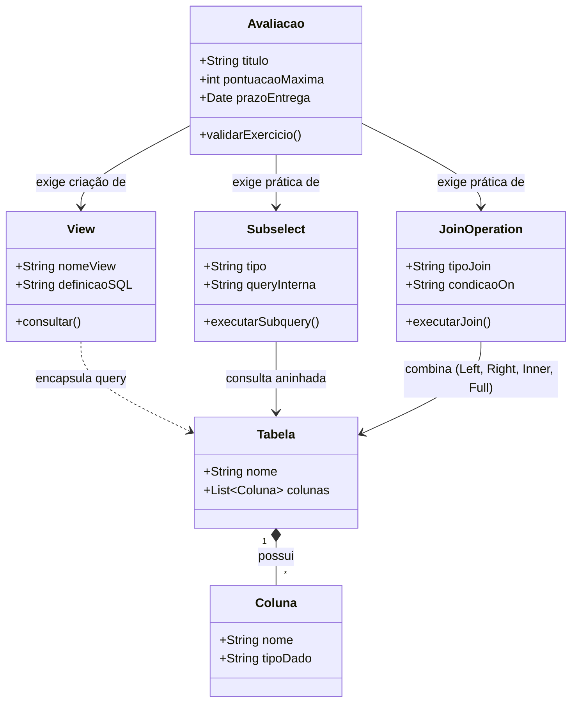
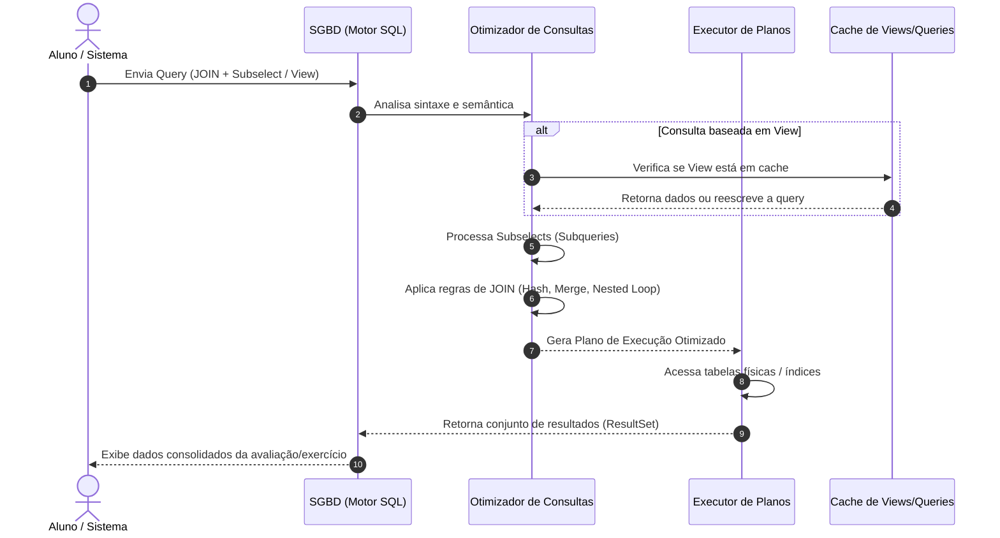

# [Prof. Welington Garcia] Tópicos Avançados em Banco de Dados

Abaixo estão representados os diagramas em **Mermaid** cobrindo o domínio técnico da disciplina de **Tópicos Avançados em Banco de Dados**, focando nas aulas de **Joins, Subqueries (Subselects) e Views**, além das avaliações práticas associadas.

---

### 1. Diagrama de Classes UML (Domínio de Consultas Avançadas)
Este diagrama modela a estrutura conceitual utilizada nas listas de exercícios e avaliações, contemplando Entidades, Views e Consultas Complexas (Subselects/Joins).



**Explicação Objetiva:**  
O diagrama de classes ilustra a relação entre as estruturas fundamentais de banco de dados abordadas na disciplina. Tabelas e colunas formam a base relacional que é manipulada por operações de `Join` e `Subselects`. As `Views` atuam como tabelas virtuais encapsuladas, enquanto a entidade `Avaliacao` pontua a aplicação prática desses conceitos nos trabalhos e provas.

---

### 2. Diagrama de Sequência (Execução de Consulta com Subselect e Join)
Este diagrama detalha o fluxo de processamento e execução de uma query complexa enviada pelo usuário/sistema, passando pelo Otimizador de Consultas do SGBD.



**Explicação Objetiva:**  
O fluxo técnico demonstra como o SGBD processa comandos avançados. A query é validada, o otimizador resolve subselects e otimiza as junções (`Joins`), transformando views ou consultas aninhadas em um plano de execução eficiente antes de retornar os dados consolidados ao usuário.

---

### 3. Diagrama Entidade-Relacionamento / Arquitetural (Módulos da Disciplina)
Este diagrama arquitetural mapeia a estrutura da disciplina, dividida entre os tópicos ministrados e os instrumentos de avaliação (Provas e Trabalhos).

```mermaid
graph TD
    %% Estilos
    classDef disciplina fill:#f9f,stroke:#333,stroke-width:2px;
    classDef topico fill:#bbf,stroke:#333,stroke-width:1px;
    classDef avaliacao fill:#bfb,stroke:#333,stroke-width:1px;

    %% Nós
    Disc[Tópicos Avançados em Banco de Dados]:::disciplina
    
    T1[Aulas: Joins e Subselects]:::topico
    T2[Aulas: Views]:::topico
    
    P1[Prova: SubSelects - Parte 1]:::avaliacao
    P2[Prova: SubSelect - Parte 2 <br/> (Prazo: 03/09/2026)]:::avaliacao
    T_Trabalho[Trabalho: Exercícios Joins]:::avaliacao

    %% Relações
    Disc --> T1
    Disc --> T2
    
    T1 --> P1
    T1 --> P2
    T1 --> T_Trabalho
    T2 --> P2
```

**Explicação Objetiva:**  
O diagrama arquitetural organiza o conteúdo programático da matéria ministrada pelo Prof. Welington Garcia. Ele conecta os tópicos teóricos e práticos (`Joins`, `Subselects` e `Views`) diretamente às suas respectivas avaliações (Provas Parte 1 e 2, e o Trabalho prático), servindo como mapa mental do semestre.