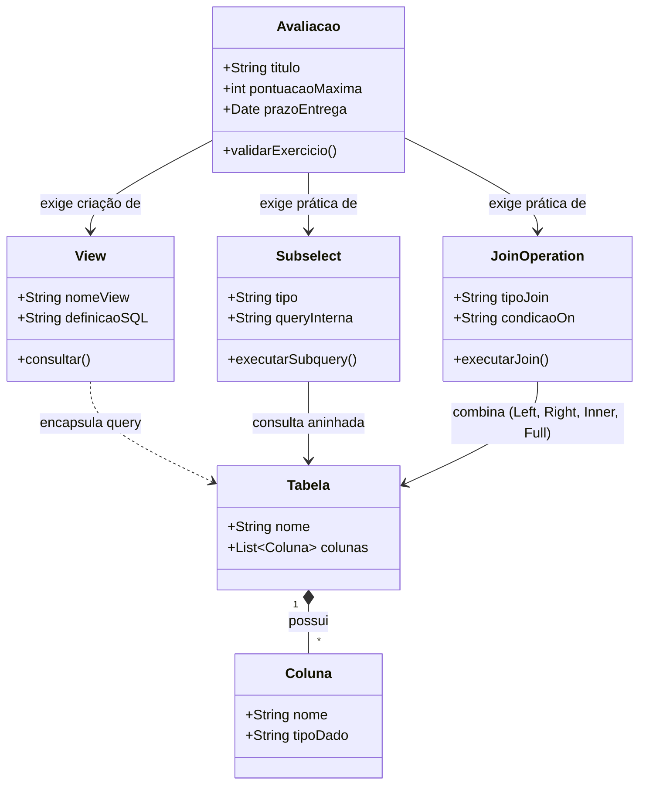
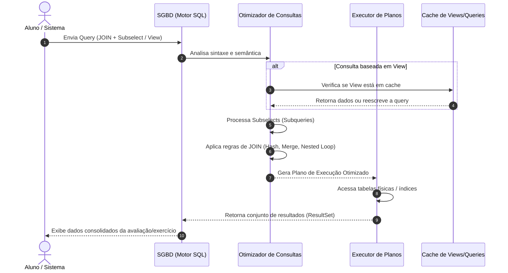
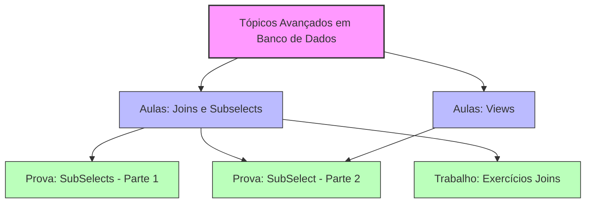

# Resumos-IA — Tópicos Avançados em Banco de Dados

> **Professor:** Welington Garcia · **Semestre:** 4º Semestre · **Escopo:** JOINs, Subconsultas (Subqueries) e Views em SQL/PostgreSQL

Material de apoio gerado por IA para revisão e fixação da disciplina — resumo executivo, exercícios práticos, simulado comentado, cheatsheet, diagramas e os artefatos complementares (slides, flashcards e dataset de Q&A) tudo em um único lugar.

---

## Índice

1. [Resumo Executivo](#resumo-executivo)
2. [Exercícios Práticos Implementados](#exercícios-práticos-implementados)
3. [Simulado Comentado](#simulado-comentado)
4. [CheatSheet de Revisão Rápida](#cheatsheet-de-revisão-rápida)
5. [Diagramas e Modelagem](#diagramas-e-modelagem)
6. [Apresentação de Revisão em Slides](#apresentação-de-revisão-em-slides)
7. [Flashcards para Anki](#flashcards-para-anki)
8. [Dataset de Perguntas e Respostas (JSONL)](#dataset-de-perguntas-e-respostas-jsonl)

---

## Resumo Executivo

### 1. Visão Geral e Objetivos da Matéria
A disciplina **Tópicos Avançados em Banco de Dados**, ministrada pelo **Prof. Welington Garcia**, foca no domínio profundo de manipulação, consulta e estruturação de dados relacionais utilizando o **PostgreSQL**. O conteúdo consolida a transição do modelo relacional básico para operações complexas de alta performance, capacitando o estudante de Sistemas de Informação a projetar consultas robustas para relatórios gerenciais, APIs, *dashboards* e sistemas corporativos.

Os principais objetivos pedagógicos incluem:
* Compreender a arquitetura e a necessidade de normalização de dados em tabelas separadas.
* Dominar a combinatória de dados por meio de diferentes tipos de **JOINs**.
* Utilizar subconsultas (*subqueries*), expressões relacionais e agregações avançadas.
* Escrever código SQL limpo, performático, legível e livre de ambiguidades estruturais.

### 2. Conceitos-Chave e Terminologia Fundamental
* **Chave Primária (`PRIMARY KEY`):** Restrição que identifica de forma única cada registro em uma tabela (ex.: `id_cliente`).
* **Chave Estrangeira (`FOREIGN KEY`):** Campo que faz referência à chave primária de outra tabela, garantindo a integridade referencial e impedindo o registro de órfãos relacionais.
* **Junção (`JOIN`):** Operação relacional que combina linhas de duas ou mais tabelas com base em uma condição lógica compartilhada.
* **Aliases (`AS`):** Apelidos atribuídos a tabelas ou colunas para simplificar a sintaxe e evitar ambiguidades em consultas complexas.
* **Produto Cartesiano:** Fenômeno gerado pela ausência de uma condição de junção (`ON`), resultando na combinação de *todas* as linhas de uma tabela com *todas* as linhas de outra ($N \times M$).
* **Funções de Agregação:** Operadores como `COUNT()`, `SUM()`, `AVG()`, `MIN()` e `MAX()` combinados com a cláusula `GROUP BY`.
* **Tratamento de Nulos (`COALESCE`):** Função utilitária para substituir valores `NULL` por um texto ou número padrão em exibições de relatórios.

### 3. Principais Módulos / Tópicos Abordados

#### Módulo 1: Fundamentos de Relacionamentos e `JOINs`
Os dados em sistemas relacionais são normalizados em múltiplos repositórios (Clientes, Pedidos, Produtos, Categorias) para evitar redundância. Os `JOINs` reconstituem essa visão relacional de forma seletiva:

* **`INNER JOIN`:** Retorna estritamente as linhas que possuem correspondência em *ambas* as tabelas envolvidas. Linhas órfãs são descartadas.
* **`LEFT JOIN` (ou `LEFT OUTER JOIN`):** Preserva todos os registros da tabela à esquerda, mesmo que não haja correspondência na tabela à direita (preenchendo com `NULL` os campos ausentes). É o alicerce para identificar "itens que não possuem vínculos" (ex.: clientes que nunca compraram).
* **`RIGHT JOIN`:** Espelho do `LEFT JOIN`, prioriza a tabela da direita (geralmente reescrito pedagogicamente como `LEFT JOIN` invertendo a ordem das tabelas por clareza de leitura).
* **`FULL OUTER JOIN`:** Retorna todo o universo de registros de ambas as tabelas, combinando os correspondentes e mantendo os isolados de ambos os lados com `NULL`. Fundamental para auditorias e reconciliação de bases.
* **`CROSS JOIN`:** Produz o produto cartesiano estrito. Utilizado para matrizes de combinação e cenários analíticos específicos.
* **`SELF JOIN`:** Uma tabela relacionando-se consigo mesma através de *aliases* distintos. Essencial para estruturas hierárquicas, como organogramas (ex.: funcionários e seus respectivos supervisores).

#### Módulo 2: Consultas Múltiplas, Filtros e Agregações
* **Junção de Múltiplas Tabelas:** Encadeamento de múltiplos `JOINs` para conectar tabelas distantes na modelagem (ex: ligar `Pedidos` → `Clientes` → `Itens_Pedido` → `Produtos`).
* **Filtros (`WHERE` vs. `ON`):**
 * Condições no `ON` filtram o relacionamento antes ou durante a junção (crucial para manter a integridade de um `LEFT JOIN`).
 * Condições no `WHERE` filtram o resultado final da query, podendo transformar acidentalmente um `LEFT JOIN` em um `INNER JOIN` se exigirem colunas da tabela opcional como não nulas.
* **Agrupamento e Cálculos:** Uso de `GROUP BY` em conjunto com multiplicações de colunas (ex: `quantidade * preco_unitario` para subtotais) e funções de agregação (`SUM`, `COUNT`).

### 4. Relações com o Mercado e Prática Profissional
* **APIs e Microsserviços:** Em vez de trafegar dados brutos e realizar loops custosos na camada de aplicação (Node.js, Python, Java) para juntar informações, constroem-se consultas SQL otimizadas que delegam o trabalho pesado ao motor relacional do PostgreSQL.
* **Business Intelligence (BI) e Relatórios:** A construção de *Dashboards* em ferramentas como Power BI, Metabase ou Superset depende diretamente de consultas robustas utilizando `LEFT JOIN` e agregações para lidar com métricas que exigem denominador zero (ex: faturamento por cliente, inclusive aqueles com zero compras no período).
* **Auditoria de Dados:** O uso de `FULL OUTER JOIN` e técnicas para localizar nulos (`IS NULL`) são ferramentas diárias de DBAs e Engenheiros de Dados para varrer inconsistências em migrações de sistemas legados.

### 5. Dicas de Ouro para Estudo e Provas
1. **Cuidado com o Produto Cartesiano:** Nunca esqueça de declarar a condição de junção no `ON`. Esquecê-la trava a query e gera milhões de linhas desnecessárias em frações de segundo.
2. **Domine a Lógica do `LEFT JOIN + IS NULL`:** Questões clássicas de prova e testes técnicos de mercado adoram cobrar o padrão para descobrir registros órfãos (ex: "Liste todos os clientes que *nunca* emitiram um pedido").
3. **Regra de Ouro do `GROUP BY`:** Tudo o que está no `SELECT` e *não* faz parte de uma função agregada (`SUM`, `COUNT`) **obrigatoriamente** deve constar na cláusula `GROUP BY`.
4. **Alinhe o Pensamento Lógico:** 1º) Identifique quais tabelas possuem os dados; 2º) Ache as chaves estrangeiras que as conectam; 3º) Defina qual tabela é a base (`LEFT` ou `INNER`); 4º) Adicione as agregações e ordenações por fim.
5. **Prefira o Padrão Explícito (`ON`):** Evite o uso de `NATURAL JOIN` ou `USING` em ambientes de produção. O uso explícito de `ON tabela1.id = tabela2.id` garante previsibilidade, clareza e previne bugs silenciosos quando esquemas de banco de dados evoluem.

---

## Exercícios Práticos Implementados

Apostila prática com o script de setup do banco (DDL + DML) e todos os exemplos resolvidos de JOINs e subconsultas em PostgreSQL — testados em *pgAdmin*, *DBeaver* ou *psql*.

### Script de Preparação do Ambiente

```sql
-- Removendo tabelas caso já existam (ordem inversa de dependência)
DROP TABLE IF EXISTS itens_pedido CASCADE;
DROP TABLE IF EXISTS produtos CASCADE;
DROP TABLE IF EXISTS categorias CASCADE;
DROP TABLE IF EXISTS pedidos CASCADE;
DROP TABLE IF EXISTS clientes CASCADE;
DROP TABLE IF EXISTS funcionarios CASCADE;

-- 1. Tabela de Categorias
CREATE TABLE categorias (
    id_categoria SERIAL PRIMARY KEY,
    nome_categoria VARCHAR(100) NOT NULL
);

-- 2. Tabela de Produtos
CREATE TABLE produtos (
    id_produto SERIAL PRIMARY KEY,
    nome_produto VARCHAR(100) NOT NULL,
    preco NUMERIC(10,2) NOT NULL,
    id_categoria INTEGER REFERENCES categorias(id_categoria)
);

-- 3. Tabela de Clientes
CREATE TABLE clientes (
    id_cliente SERIAL PRIMARY KEY,
    nome VARCHAR(100) NOT NULL,
    cidade VARCHAR(100),
    estado CHAR(2)
);

-- 4. Tabela de Pedidos
CREATE TABLE pedidos (
    id_pedido SERIAL PRIMARY KEY,
    data_pedido DATE NOT NULL,
    status VARCHAR(30) NOT NULL,
    id_cliente INTEGER REFERENCES clientes(id_cliente)
);

-- 5. Tabela de Itens do Pedido
CREATE TABLE itens_pedido (
    id_pedido INTEGER REFERENCES pedidos(id_pedido),
    id_produto INTEGER REFERENCES produtos(id_produto),
    quantidade INTEGER NOT NULL,
    preco_unitario NUMERIC(10,2) NOT NULL,
    PRIMARY KEY (id_pedido, id_produto)
);

-- 6. Tabela de Funcionários (Auto-relacionamento / SELF JOIN)
CREATE TABLE funcionarios (
    id_funcionario SERIAL PRIMARY KEY,
    nome VARCHAR(100) NOT NULL,
    cargo VARCHAR(50),
    id_supervisor INTEGER REFERENCES funcionarios(id_funcionario)
);

-- ==========================================
-- POPULANDO O BANCO DE DADOS (DML)
-- ==========================================

INSERT INTO categorias (id_categoria, nome_categoria) VALUES
(1, 'Eletrônicos'), (2, 'Livros'), (3, 'Vestuário');

INSERT INTO produtos (id_produto, nome_produto, preco, id_categoria) VALUES
(1, 'Smartphone', 1500.00, 1),
(2, 'Notebook', 3500.00, 1),
(3, 'Livro SQL Avançado', 120.00, 2),
(4, 'Camiseta', 50.00, 3),
(5, 'Webcam', 250.00, 1);

INSERT INTO clientes (id_cliente, nome, cidade, estado) VALUES
(1, 'Ana Souza', 'São Paulo', 'SP'),
(2, 'Bruno Lima', 'Rio de Janeiro', 'RJ'),
(3, 'Carla Mendes', 'Belo Horizonte', 'MG'),
(4, 'Daniel Dias', 'Curitiba', 'PR'); -- Cliente sem pedidos

INSERT INTO pedidos (id_pedido, data_pedido, status, id_cliente) VALUES
(101, '2023-10-01', 'Pago', 1),
(102, '2023-10-02', 'Pendente', 2),
(103, '2023-10-05', 'Pago', 1),
(104, '2023-10-10', 'Cancelado', 3);

INSERT INTO itens_pedido (id_pedido, id_produto, quantidade, preco_unitario) VALUES
(101, 1, 1, 1500.00),
(101, 3, 2, 120.00),
(102, 2, 1, 3500.00),
(103, 4, 3, 50.00),
(103, 5, 1, 250.00);

INSERT INTO funcionarios (id_funcionario, nome, cargo, id_supervisor) VALUES
(1, 'Carlos Silva', 'Diretor', NULL),
(2, 'Mariana Costa', 'Gerente', 1),
(3, 'João Pedro', 'Analista', 2);
```

### Guia Prático de JOINs

**INNER JOIN (Apenas Correspondências):**
```sql
SELECT
    p.id_pedido,
    p.data_pedido,
    p.status,
    c.nome AS cliente
FROM pedidos p
INNER JOIN clientes c ON p.id_cliente = c.id_cliente;
```

**LEFT JOIN (Preservando a Esquerda):**
```sql
SELECT
    c.id_cliente,
    c.nome,
    p.id_pedido,
    p.status
FROM clientes c
LEFT JOIN pedidos p ON c.id_cliente = p.id_cliente;
```

**Anti-Join — registros sem correspondência:**
```sql
SELECT
    c.id_cliente,
    c.nome
FROM clientes c
LEFT JOIN pedidos p ON c.id_cliente = p.id_cliente
WHERE p.id_pedido IS NULL;
```

**Tratamento de Nulos com COALESCE:**
```sql
SELECT
    pr.nome_produto,
    pr.preco,
    COALESCE(ca.nome_categoria, 'Sem categoria') AS categoria
FROM produtos pr
LEFT JOIN categorias ca ON pr.id_categoria = ca.id_categoria;
```

**SELF JOIN — hierarquia de funcionários:**
```sql
SELECT
    f.nome AS funcionario,
    f.cargo,
    COALESCE(s.nome, 'Sem supervisor (Diretoria)') AS supervisor
FROM funcionarios f
LEFT JOIN funcionarios s ON f.id_supervisor = s.id_funcionario;
```

**JOIN Múltiplo com Agregações e Cálculos:**
```sql
SELECT
    p.id_pedido,
    c.nome AS cliente,
    SUM(ip.quantidade * ip.preco_unitario) AS valor_total
FROM pedidos p
JOIN clientes c ON p.id_cliente = c.id_cliente
JOIN itens_pedido ip ON p.id_pedido = ip.id_pedido
GROUP BY p.id_pedido, c.nome
ORDER BY valor_total DESC;
```

### Módulo de Subconsultas (Subqueries)

**Subconsulta Escalar:**
```sql
SELECT
    nome_produto,
    preco
FROM produtos
WHERE preco > (SELECT AVG(preco) FROM produtos);
```

**Subconsulta com `IN`:**
```sql
SELECT
    id_cliente,
    nome
FROM clientes
WHERE id_cliente IN (
    SELECT id_cliente
    FROM pedidos
    WHERE status = 'Pago'
);
```

**Subconsulta Correlacionada com `EXISTS`:**
```sql
SELECT c.nome
FROM clientes c
WHERE EXISTS (
    SELECT 1
    FROM pedidos p
    WHERE p.id_cliente = c.id_cliente
);
```

### Atividade Prática Proposta: Sistema de Biblioteca

```sql
CREATE TABLE autores (
    id_autor SERIAL PRIMARY KEY,
    nome_autor VARCHAR(100) NOT NULL
);

CREATE TABLE livros (
    id_livro SERIAL PRIMARY KEY,
    titulo VARCHAR(150) NOT NULL,
    id_autor INTEGER REFERENCES autores(id_autor)
);

CREATE TABLE leitores (
    id_leitor SERIAL PRIMARY KEY,
    nome_leitor VARCHAR(100) NOT NULL
);

CREATE TABLE emprestimos (
    id_emprestimo SERIAL PRIMARY KEY,
    id_livro INTEGER REFERENCES livros(id_livro),
    id_leitor INTEGER REFERENCES leitores(id_leitor),
    data_emprestimo DATE NOT NULL,
    devolvido BOOLEAN DEFAULT FALSE
);

INSERT INTO autores VALUES (1, 'Machado de Assis'), (2, 'J.K. Rowling'), (3, 'George Orwell'), (4, 'Clarice Lispector'), (5, 'Autor Oculto (Sem Livros)');
INSERT INTO livros VALUES (1, 'Dom Casmurro', 1), (2, 'Harry Potter', 2), (3, '1984', 3), (4, 'A Hora da Estrela', 4);
INSERT INTO leitores VALUES (1, 'Alice'), (2, 'Bob'), (3, 'Charlie'), (4, 'Leitor Inativo (Sem Empréstimos)');
INSERT INTO emprestimos (id_livro, id_leitor, data_emprestimo, devolvido) VALUES
(1, 1, '2023-11-01', TRUE),
(2, 2, '2023-11-05', FALSE);
```

**Consultas Desafio (Gabarito Prático):**
```sql
-- 1. Todos os livros e seus respectivos autores
SELECT l.titulo, a.nome_autor
FROM livros l
JOIN autores a ON l.id_autor = a.id_autor;

-- 2. Todos os autores, inclusive os que não cadastraram livros
SELECT a.nome_autor, l.titulo
FROM autores a
LEFT JOIN livros l ON a.id_autor = l.id_autor;

-- 3. Leitores que nunca fizeram empréstimos (Anti-Join)
SELECT le.nome_leitor
FROM leitores le
LEFT JOIN emprestimos e ON le.id_leitor = e.id_leitor
WHERE e.id_emprestimo IS NULL;

-- 4. Quantidade de livros por autor
SELECT a.nome_autor, COUNT(l.id_livro) AS total_livros
FROM autores a
LEFT JOIN livros l ON a.id_autor = l.id_autor
GROUP BY a.id_autor, a.nome_autor;
```

---

## Simulado Comentado

Simulado com **10 questões de múltipla escolha** (gabarito comentado) e **5 questões discursivas / estudos de caso práticos**.

### Múltipla Escolha

1. Qual operador de `JOIN` retorna **apenas** as linhas que possuem correspondência em ambas as tabelas?
 A) `LEFT OUTER JOIN` · B) `FULL OUTER JOIN` · **C) `INNER JOIN`** · D) `CROSS JOIN` · E) `NATURAL JOIN`
 > *`INNER JOIN` retorna estritamente a interseção entre as tabelas cruzadas.*

2. Um relatório deve listar todos os clientes, mesmo sem pedidos (colunas de pedido como `NULL`). Qual JOIN atende?
 A) `INNER JOIN` · **B) `LEFT JOIN`** · C) `RIGHT JOIN` (pedidos à esquerda) · D) `CROSS JOIN` · E) `SELF JOIN`
 > *`LEFT JOIN` preserva todos os registros da esquerda (clientes), preenchendo `NULL` quando não há pedido correspondente.*

3. `SELECT c.id_cliente, c.nome FROM clientes c LEFT JOIN pedidos p ON c.id_cliente = p.id_cliente WHERE p.id_pedido IS NULL;` — qual o objetivo?
 A) Clientes com pelo menos um pedido · B) Pedidos sem cliente · **C) Clientes que nunca fizeram pedido** · D) Produto cartesiano · E) Erro de sintaxe
 > *Filtrar `IS NULL` após um `LEFT JOIN` isola exatamente os registros da tabela principal sem correspondência na secundária.*

4. Sobre `CROSS JOIN`: (1) gera produto cartesiano; (2) exige `ON`; (3) 10 linhas × 5 linhas = 50 linhas resultantes.
 **A) Apenas 1 e 3** · B) Apenas 2 e 3 · C) Apenas 1 e 2 · D) Todas · E) Apenas 3
 > *A afirmativa 2 é falsa — `CROSS JOIN` não usa `ON`.*

5. Tabela `funcionarios(id_funcionario, nome, id_supervisor)` auto-referenciada. Para listar funcionário + nome do supervisor:
 A) `CROSS JOIN` · B) `FULL OUTER JOIN` · **C) `SELF JOIN`** · D) `NATURAL JOIN` · E) `RIGHT JOIN` estrito
 > *`SELF JOIN` é a técnica onde a tabela se relaciona consigo mesma, ideal para hierarquias.*

6. Diferença entre filtro no `ON` e no `WHERE` em `LEFT JOIN`?
 A) Não há diferença · B) `ON` é restrito a agregações · **C) Filtro no `WHERE` pode transformar em `INNER JOIN`** · D) `ON` elimina linhas da esquerda antes · E) `WHERE` não pode ser usado com `JOIN`
 > *Filtro restritivo no `WHERE` sobre a tabela da direita descarta as linhas onde ela virou `NULL`, anulando o efeito do `LEFT JOIN`.*

7. O que faz `COALESCE` com `LEFT JOIN`?
 A) Força `INNER JOIN` · **B) Substitui `NULL` por um valor padrão** · C) Soma colunas · D) Remove duplicatas · E) Converte tipos
 > *`COALESCE(valor, 'Padrão')` retorna o segundo argumento quando o primeiro é `NULL`.*

8. Sobre `NATURAL JOIN` e `USING`:
 A) `NATURAL JOIN` é recomendado em produção · **B) `USING` exige mesmo nome de coluna nas duas tabelas, mais seguro que `NATURAL JOIN`** · C) `NATURAL JOIN` exige `ON` · D) `USING` só em `CROSS JOIN` · E) Ambos impedem agregação
 > *`USING` é explícito o suficiente para ser seguro; `NATURAL JOIN` é implícito e desaconselhado em produção.*

9. Em consulta com `JOIN`s múltiplos e `SUM`, o que fazer com colunas não agregadas no `SELECT`?
 **A) Inseri-las obrigatoriamente no `GROUP BY`** · B) Precedê-las de `DISTINCT` · C) Omiti-las · D) Converter com `CAST` · E) Envolvê-las em `COALESCE`
 > *Regra padrão SQL: toda coluna não agregada no `SELECT` deve constar no `GROUP BY`.*

10. Cenário típico ideal para `FULL OUTER JOIN`?
 A) Produtos ignorando órfãos · B) Combinações de tamanho/cor · **C) Auditoria entre duas bases, identificando registros só de um lado ou de ambos** · D) Hierarquia corporativa · E) Filtro por média de compras
 > *`FULL OUTER JOIN` traz correspondências + sobras de ambos os lados — ideal para auditoria e reconciliação.*

### Questões Discursivas e Estudos de Caso

**Q1 — Relatório com LEFT JOIN e COALESCE:** liste nome do produto, preço e categoria (`'Sem categoria'` quando nula).
```sql
SELECT pr.nome AS nome_produto, pr.preco, COALESCE(ca.nome, 'Sem categoria') AS categoria
FROM produtos pr
LEFT JOIN categorias ca ON pr.id_categoria = ca.id_categoria;
```

**Q2 — Análise de erro `ON` vs. `WHERE`:** a consulta abaixo se comporta como `INNER JOIN` por engano:
```sql
SELECT c.id_cliente, c.nome, p.id_pedido, p.status
FROM clientes c
LEFT JOIN pedidos p ON c.id_cliente = p.id_cliente
WHERE p.status = 'Cancelado';
```
> *Explicação: o filtro no `WHERE` é avaliado após a junção — clientes sem pedido têm `p.status = NULL`, e `NULL = 'Cancelado'` nunca é verdadeiro, eliminando-os.*

Correção (movendo o filtro para o `ON`):
```sql
SELECT c.id_cliente, c.nome, p.id_pedido, p.status
FROM clientes c
LEFT JOIN pedidos p ON c.id_cliente = p.id_cliente AND p.status = 'Cancelado';
```

**Q3 — SELF JOIN com COALESCE**, supervisor de cada funcionário (`'Diretoria Executiva'` quando topo):
```sql
SELECT f.nome AS funcionario, f.cargo, COALESCE(s.nome, 'Diretoria Executiva') AS supervisor
FROM funcionarios f
LEFT JOIN funcionarios s ON f.id_supervisor = s.id_funcionario;
```

**Q4 — Faturamento total por cliente** (múltiplos JOINs + agregação):
```sql
SELECT c.id_cliente, c.nome, SUM(ip.quantidade * ip.preco_unitario) AS faturamento_total
FROM clientes c
JOIN pedidos p ON c.id_cliente = p.id_cliente
JOIN itens_pedido ip ON p.id_pedido = ip.id_pedido
GROUP BY c.id_cliente, c.nome
ORDER BY faturamento_total DESC;
```

**Q5 — Auditoria com `FULL OUTER JOIN`** entre `clientes` e `pedidos_migrados`, isolando discrepâncias:
```sql
SELECT c.id_cliente, c.nome, pm.id_pedido, pm.status
FROM clientes c
FULL OUTER JOIN pedidos_migrados pm ON c.id_cliente = pm.id_cliente
WHERE c.id_cliente IS NULL OR pm.id_pedido IS NULL;
```

---

## CheatSheet de Revisão Rápida

### Guia Visual dos JOINs

| Tipo de JOIN | Comportamento Principal | Sem correspondência |
| :--- | :--- | :--- |
| **`INNER JOIN`** | Retorna **apenas** a interseção. | Linha **descartada** em ambos os lados. |
| **`LEFT JOIN`** | Tudo da esquerda + correspondências da direita. | Colunas da direita recebem **`NULL`**. |
| **`RIGHT JOIN`** | Tudo da direita + correspondências da esquerda. | Colunas da esquerda recebem **`NULL`**. |
| **`FULL OUTER JOIN`** | Tudo de **ambas** as tabelas. | Lados sem correspondência recebem **`NULL`**. |
| **`CROSS JOIN`** | Produto cartesiano (todas as combinações). | Multiplica linhas ($N \times M$). |
| **`SELF JOIN`** | Une a tabela com ela mesma (hierarquia). | Exige **Aliases** diferentes. |

**Sintaxe padrão — JOIN múltiplo com filtro e agregação:**
```sql
SELECT
    p.id_pedido,
    c.nome AS cliente,
    SUM(ip.quantidade * ip.preco_unitario) AS valor_total
FROM pedidos p
INNER JOIN clientes c ON p.id_cliente = c.id_cliente
JOIN itens_pedido ip ON p.id_pedido = ip.id_pedido
WHERE p.status = 'Pago'
GROUP BY p.id_pedido, c.nome
ORDER BY valor_total DESC;
```

### Ponto Crítico: `ON` vs `WHERE` em LEFT JOIN

* **Filtro no `WHERE`** — transforma `LEFT JOIN` em `INNER JOIN` disfarçado:
  ```sql
  SELECT * FROM clientes c LEFT JOIN pedidos p ON c.id_cliente = p.id_cliente WHERE p.status = 'Pago';
  ```
* **Filtro no `ON`** — mantém todos os registros da esquerda:
  ```sql
  SELECT * FROM clientes c LEFT JOIN pedidos p ON c.id_cliente = p.id_cliente AND p.status = 'Pago';
  ```

### Padrões Úteis
* **Registros órfãos:** `LEFT JOIN ... WHERE <chave_direita> IS NULL`.
* **`COALESCE(valor, 'padrão')`** para tratar `NULL`.
* **Evite em produção:** `USING (coluna)` (exige mesmo nome nas duas tabelas) e `NATURAL JOIN` (implícito, propenso a erro).

### Conceitos Essenciais
1. `PRIMARY KEY` identifica unicamente cada registro.
2. `FOREIGN KEY` cria integridade referencial, impedindo registros órfãos.
3. Regra do `GROUP BY`: tudo que não é agregado no `SELECT` precisa estar no `GROUP BY`.
4. `Aliases (AS)` são obrigatórios em `SELF JOIN` para diferenciar instâncias da mesma tabela.

---

## Diagramas e Modelagem

### 1. Diagrama de Classes UML (Domínio de Consultas Avançadas)



Tabelas e colunas formam a base relacional manipulada por `Join` e `Subselects`. `Views` atuam como tabelas virtuais encapsuladas, enquanto `Avaliacao` pontua a aplicação prática desses conceitos nos trabalhos e provas.

### 2. Diagrama de Sequência (Execução de Consulta com Subselect e Join)



O SGBD valida a query, o otimizador resolve subselects e otimiza as junções, transformando views ou consultas aninhadas em um plano de execução eficiente antes de retornar os dados consolidados.

### 3. Arquitetura da Disciplina (Tópicos × Avaliações)



Conecta os tópicos teóricos e práticos (`Joins`, `Subselects`, `Views`) às respectivas avaliações — mapa mental do semestre.

---

## Apresentação de Revisão em Slides

[`Slides-Revisao-[Prof. Welington Garcia] Tópicos Avançados em Banco de Dados.pptx`](./Slides-Revisao-%5BProf.%20Welington%20Garcia%5D%20T%C3%B3picos%20Avan%C3%A7ados%20em%20Banco%20de%20Dados.pptx)

Deck de 5 slides em formato widescreen 16:9, com design dark mode (Slate/Navy/Teal/Indigo), cobrindo Visão Geral, Conceitos Fundamentais, Exercícios/Prática e Dicas de Prova — pronto para revisão rápida antes da avaliação.

---

## Flashcards para Anki

[`flashcards-anki.tsv`](./flashcards-anki.tsv) — 19 cartões pergunta/resposta cobrindo chaves primária/estrangeira, os seis tipos de JOIN e tratamento de nulos.

**Como importar:** no Anki, `Arquivo → Importar`, selecione o `.tsv`, com separador de campo "Tab" e mapeamento `Frente`/`Verso`.

Amostra:
```
O que é uma chave primária (PRIMARY KEY)?	Identifica cada registro de forma única em uma tabela.
O que é uma chave estrangeira (FOREIGN KEY)?	Cria uma referência para a chave primária de outra tabela, garantindo integridade referencial.
Qual JOIN retorna apenas as linhas que possuem correspondência nas duas tabelas?	INNER JOIN
```

---

## Dataset de Perguntas e Respostas (JSONL)

[`dataset-estudo-qa.jsonl`](./dataset-estudo-qa.jsonl) — 14 pares de pergunta/resposta com metadados de tópico e dificuldade, no formato [JSON Lines](https://jsonlines.org/) (uma entrada por linha, pronta para consumo por scripts/ferramentas de estudo).

Amostra:
```json
{"id": 1, "topico": "Joins", "pergunta": "Qual a diferença fundamental entre um INNER JOIN e um LEFT OUTER JOIN?", "resposta": "O INNER JOIN retorna apenas os registros que possuem correspondência em ambas as tabelas envolvidas. Já o LEFT OUTER JOIN retorna todos os registros da tabela à esquerda, independentemente de haver correspondência na tabela à direita, preenchendo com NULL os campos onde não há correspondência.", "dificuldade": "facil"}
{"id": 2, "topico": "Joins", "pergunta": "Como o RIGHT OUTER JOIN se comporta em relação às tabelas na cláusula FROM?", "resposta": "O RIGHT OUTER JOIN retorna todos os registros da tabela especificada à direita da operação de junção, e apenas os registros correspondentes da tabela à esquerda. Caso não haja correspondência na tabela da esquerda, os valores retornados para suas colunas serão NULL.", "dificuldade": "facil"}
```
