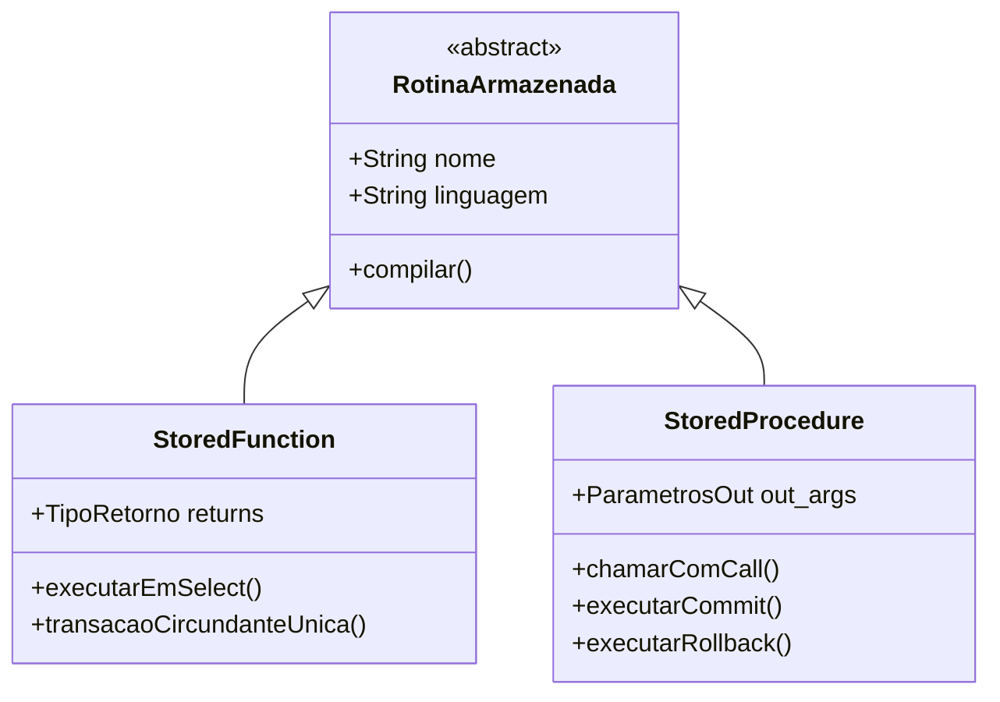
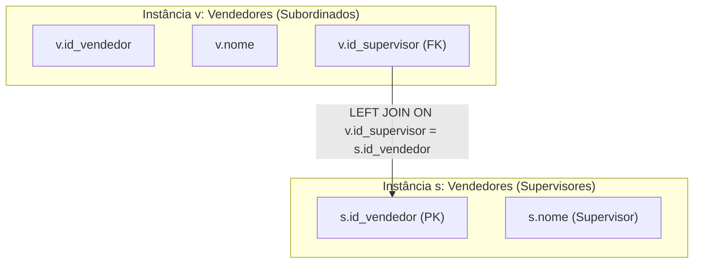

# Simulados Comentados - Tópicos Avançados em Banco de Dados

**Instituição:** Centro Universitário de Fernandópolis (UniFEF)  
**Curso:** Bacharelado em Sistemas de Informação  
**Disciplina:** Tópicos Avançados em Banco de Dados (4º Semestre)  
**Docente:** Prof. Welington Garcia  
**Material de Referência:** Aulas 02, 03 e 04; Trabalhos e Avaliações Práticas da Disciplina  

---

## Simulado 1 - Questões Objetivas

### Questão 01 (Views - Arquitetura de Reescrita de Consultas)

Considere o seguinte cenário de engenharia de software: uma aplicação corporativa de faturamento realiza frequentes consultas analíticas sobre o esquema relacional de vendas. Para evitar a repetição de instruções complexas contendo múltiplas junções entre as tabelas `pedidos`, `clientes`, `itens_pedido` e `produtos`, a equipe de desenvolvimento criou a seguinte visão no PostgreSQL:

```sql
CREATE VIEW vw_detalhes_vendas AS
SELECT
    p.id_pedido,
    p.data_pedido,
    c.nome AS cliente,
    c.estado,
    pr.nome_produto,
    ip.quantidade,
    ip.preco_unitario,
    (ip.quantidade * ip.preco_unitario) AS subtotal
FROM pedidos p
INNER JOIN clientes c ON p.id_cliente = c.id_cliente
INNER JOIN itens_pedido ip ON p.id_pedido = ip.id_pedido
INNER JOIN produtos pr ON ip.id_produto = pr.id_produto;
```

Posteriormente, um desenvolvedor júnior executou a seguinte consulta contra a visão:

```sql
SELECT id_pedido, cliente, subtotal
FROM vw_detalhes_vendas
WHERE estado = 'SP' AND subtotal > 1000.00;
```

O desenvolvedor argumentou que a criação da visão resultou em ganho imediato de desempenho de leitura porque o PostgreSQL processa a visão previamente, armazena os dados calculados em uma área temporária de memória cache do banco e, em seguida, aplica os filtros de estado e subtotal sobre essa massa pré-computada.

Com base na arquitetura interna do PostgreSQL e no funcionamento do subsistema de reescrita de consultas (*Query Rewrite Rule System*), assinale a alternativa que avalia corretamente a afirmação do desenvolvedor e o comportamento do SGBD.

A) A afirmação está correta, pois toda visão criada com o comando `CREATE VIEW` atua como uma tabela temporária persistida em memória RAM (*buffer cache*), eliminando o custo de processamento das junções a cada nova execução.  
B) A afirmação está incorreta, pois o PostgreSQL não armazena em cache os dados de uma visão padrão; o analisador (*parser*) e o sistema de reescrita (*Query Rewrite System*) fundem a definição da visão com a consulta externa, gerando uma única árvore sintática que é submetida ao otimizador de custos (*Cost-Based Optimizer*).  
C) A afirmação está parcialmente correta, pois o PostgreSQL materializa os dados em disco caso a instrução envolva mais de três junções internas (`INNER JOIN`), convertendo a visão automaticamente em uma `MATERIALIZED VIEW`.  
D) A afirmação está incorreta, pois visões que contêm cálculos aritméticos derivados, como `(ip.quantidade * ip.preco_unitario)`, são impedidas de serem combinadas com predicados da cláusula `WHERE`, gerando um plano de varredura sequencial obrigatório em toda a tabela `itens_pedido`.  
E) A afirmação está correta, mas o ganho de desempenho só ocorre caso a tabela `clientes` possua um índice B-Tree primário sobre a coluna `estado`, o que força a gravação física dos blocos de dados na tabela do catálogo `pg_rewrite`.  

---

### Questão 02 (Views Atualizáveis e WITH CHECK OPTION)

No PostgreSQL, visões que atendem a critérios rigorosos de mapeamento direto sobre uma única tabela base podem ser alvo de instruções de modificação de dados (`INSERT`, `UPDATE` e `DELETE`). Considere a tabela e a visão abaixo, criadas em um esquema de controle de carteira de clientes:

```sql
CREATE TABLE clientes (
    id_cliente SERIAL PRIMARY KEY,
    nome VARCHAR(100) NOT NULL,
    cidade VARCHAR(100) NOT NULL,
    estado CHAR(2) NOT NULL,
    limite_credito NUMERIC(10,2) NOT NULL
);

CREATE VIEW vw_clientes_sp AS
SELECT id_cliente, nome, cidade, estado, limite_credito
FROM clientes
WHERE estado = 'SP'
WITH CHECK OPTION;
```

Analise as seguintes proposições sobre as operações DML executadas diretamente sobre a visão `vw_clientes_sp`:

I. A instrução `INSERT INTO vw_clientes_sp (nome, cidade, estado, limite_credito) VALUES ('Marcos Silva', 'Curitiba', 'PR', 5000.00);` será rejeitada pelo PostgreSQL, disparando uma violação de restrição devido à presença da cláusula `WITH CHECK OPTION`.  
II. Se a visão tivesse sido criada sem a cláusula `WITH CHECK OPTION`, o comando de inserção de um cliente com `estado = 'PR'` seria concluído com sucesso na tabela base `clientes`, porém o registro recém-inserido não seria visível em consultas posteriores sobre `vw_clientes_sp`.  
III. Caso seja executado o comando `UPDATE vw_clientes_sp SET estado = 'RJ' WHERE cidade = 'Campinas';`, o PostgreSQL permitirá a modificação, pois o predicado `WITH CHECK OPTION` monitora apenas instruções de inserção (`INSERT`), ignorando comandos de atualização (`UPDATE`).  
IV. Uma visão construída sobre uma junção entre `clientes` e `pedidos` pode ser atualizada automaticamente via comandos DML convencionais, desde que contenha a cláusula `WITH CHECK OPTION` e não faça uso de funções agregadoras.  

É correto o que se afirma em:

A) I e II, apenas.  
B) I e III, apenas.  
C) II e IV, apenas.  
D) I, II e IV, apenas.  
E) I, II, III e IV.  

---

### Questão 03 (Materialized Views e Otimização com REFRESH CONCURRENTLY)

Considere a necessidade de projetar um painel analítico para uma rede de varejo no PostgreSQL. O painel exibe o faturamento acumulado por categoria de produto, sumarizando milhões de linhas registradas em tabelas de vendas. Para viabilizar tempos de resposta submilissegundo sem degradar o banco transacional durante as consultas de leitura, o administrador de banco de dados (DBA) optou por utilizar uma visão materializada (*Materialized View*).

```sql
CREATE MATERIALIZED VIEW mv_faturamento_categoria AS
SELECT 
    c.id_categoria,
    c.nome_categoria,
    COUNT(ip.id_item) AS total_itens_vendidos,
    SUM(ip.quantidade * ip.preco_unitario) AS faturamento_total
FROM categorias c
INNER JOIN produtos pr ON c.id_categoria = pr.id_categoria
INNER JOIN itens_pedido ip ON pr.id_produto = ip.id_produto
GROUP BY c.id_categoria, c.nome_categoria;
```

Sobre as características operacionais, ciclo de vida e manutenção de *Materialized Views* no PostgreSQL, assinale a opção correta:

A) Diferente das tabelas base, visões materializadas não suportam a criação de índices secundários (como índices B-Tree ou Hash), devendo depender exclusivamente dos índices existentes nas tabelas subjacentes.  
B) A execução do comando `REFRESH MATERIALIZED VIEW mv_faturamento_categoria;` atualiza os dados em tempo real de forma assíncrona sem adquirir travas de bloqueio (*exclusive locks*), permitindo que operações de leitura simultâneas leiam a visão sem interrupção.  
C) Para que a instrução `REFRESH MATERIALIZED VIEW CONCURRENTLY mv_faturamento_categoria;` seja executada com sucesso, é pré-requisito mandatório a existência de pelo menos um índice exclusivo (*UNIQUE INDEX*) criado sobre uma ou mais colunas da visão materializada, sem cláusulas condicionais `WHERE`.  
D) As visões materializadas são recalculadas automaticamente pelo motor do PostgreSQL sempre que uma instrução `COMMIT` é processada em qualquer uma das tabelas base referenciadas na consulta (`categorias`, `produtos` ou `itens_pedido`).  
E) A remoção de uma visão materializada via instrução `DROP MATERIALIZED VIEW` exige a exclusão prévia das tabelas base que originaram a consulta, garantindo a integridade do catálogo do sistema.  

---

### Questão 04 (PL/pgSQL - Distinção Estrutural entre Functions e Procedures)

A partir da versão 11 do PostgreSQL, o sistema passou a oferecer suporte formal a *Stored Procedures* em conformidade com o padrão SQL, diferenciando-as das tradicionais *Stored Functions* (UDFs). 

Considere um processo corporativo de liquidação financeira no qual um lote de 500.000 títulos deve ser processado, exigindo que a cada 10.000 registros atualizados ocorra a liberação do log de transações (*Write-Ahead Logging* - WAL) e das travas de linha através de um comando de confirmação.

Avalie o diagrama de classes conceituais que representa esses dois objetos de esquema no PostgreSQL:



A respeito da gestão transacional e sintaxe de invocação entre funções e procedimentos no PostgreSQL, assinale a alternativa correta:

A) Uma *Function* pode gerenciar transações autônomas contendo comandos `COMMIT` e `ROLLBACK`, desde que seja invocada por meio da instrução de controle `CALL`.  
B) O processamento em lotes com comandos intermediários de `COMMIT` é viável exclusivamente dentro de uma *Stored Procedure*, pois uma *Function* executa obrigatoriamente dentro do contexto de uma única transação circundante; a tentativa de emitir `COMMIT` ou `ROLLBACK` dentro de uma função gera o erro `ERROR: invalid transaction termination`.  
C) As *Procedures* devem obrigatoriamente declarar a cláusula `RETURNS VOID`, enquanto as *Functions* podem omitir o tipo de retorno quando não produzem dados de saída.  
D) Uma *Procedure* pode ser invocada diretamente no interior de uma cláusula `WHERE` de uma consulta `SELECT`, simplificando a filtragem baseada em regras de negócio que realizam mutação de estado.  
E) A passagem de valores de retorno em uma *Stored Procedure* é realizada exclusivamente através de tabelas temporárias, sendo proibido o uso de parâmetros declarados como `OUT` ou `INOUT`.  

---

### Questão 05 (PL/pgSQL - Tipagem Ancorada e Captura com SELECT INTO)

Analise o bloco de código PL/pgSQL a seguir, desenvolvido para reajustar o limite de crédito de um cliente na base de dados de uma cooperativa de crédito:

```sql
CREATE OR REPLACE PROCEDURE sp_reajustar_limite(
    IN p_id_cliente INTEGER,
    IN p_percentual NUMERIC,
    OUT p_novo_limite NUMERIC
)
LANGUAGE plpgsql
AS $$
DECLARE
    v_limite_atual clientes.limite_credito%TYPE;
    v_cliente_rec clientes%ROWTYPE;
BEGIN
    SELECT * INTO v_cliente_rec
    FROM clientes
    WHERE id_cliente = p_id_cliente;

    IF NOT FOUND THEN
        RAISE EXCEPTION 'Cliente com ID % não localizado no sistema.', p_id_cliente;
    END IF;

    v_limite_atual := v_cliente_rec.limite_credito;
    p_novo_limite := v_limite_atual * (1 + (p_percentual / 100.0));

    UPDATE clientes
    SET limite_credito = p_novo_limite
    WHERE id_cliente = p_id_cliente;
END;
$$;
```

A respeito das técnicas de programação procedural utilizadas no código acima, considere as afirmações:

I. O qualificador `clientes.limite_credito%TYPE` define a variável com base no tipo de dado exato da coluna da tabela no momento da execução, conferindo desacoplamento caso o tipo físico da coluna seja posteriormente alterado na DDL (por exemplo, de `NUMERIC(10,2)` para `NUMERIC(15,2)`).  
II. O qualificador `%ROWTYPE` aloca uma estrutura de registro capaz de armazenar uma linha inteira da tabela `clientes`, permitindo acessar seus campos via notação de ponto (`v_cliente_rec.limite_credito`).  
III. A variável especial `FOUND` é booleana e assume o valor `TRUE` se o comando `SELECT INTO` recuperar pelo menos uma tupla, e `FALSE` caso nenhuma tupla atenda ao predicado de filtro.  
IV. Caso a instrução `SELECT INTO` localize mais de uma linha na tabela `clientes`, o interpretador PL/pgSQL cancela a execução disparando compulsoriamente a exceção nativa `TOO_MANY_ROWS`.  

É correto o que se afirma em:

A) I e IV, apenas.  
B) II e III, apenas.  
C) I, II e III, apenas.  
D) II, III e IV, apenas.  
E) I, II, III e IV.  

---

### Questão 06 (Controle de Concorrência e Bloqueio de Registros em Procedures)

Em sistemas transacionais com múltiplos acessos concorrentes, a alteração de saldos de contas bancárias exige proteção rigorosa contra condições de corrida (*race conditions*). Considere a rotina de transferência de saldo implementada em PL/pgSQL:

```sql
CREATE OR REPLACE PROCEDURE sp_transferir_fundos(
    IN p_conta_origem INTEGER,
    IN p_conta_destino INTEGER,
    IN p_valor NUMERIC
)
LANGUAGE plpgsql
AS $$
DECLARE
    v_saldo_origem NUMERIC(12,2);
BEGIN
    -- Etapa de Verificação e Bloqueio
    SELECT saldo INTO v_saldo_origem
    FROM contas
    WHERE id_conta = p_conta_origem
    FOR UPDATE;

    IF v_saldo_origem < p_valor THEN
        RAISE EXCEPTION 'Saldo insuficiente na conta de origem: %', v_saldo_origem;
    END IF;

    UPDATE contas SET saldo = saldo - p_valor WHERE id_conta = p_conta_origem;
    UPDATE contas SET saldo = saldo + p_valor WHERE id_conta = p_conta_destino;
    
    COMMIT;
END;
$$;
```

Sobre o mecanismo de execução e isolamento provido pela instrução `FOR UPDATE` no código apresentado, assinale a alternativa correta:

A) A cláusula `FOR UPDATE` impede que outros processos executem comandos de leitura simples (`SELECT` sem modificadores de bloqueio) sobre o registro da conta de origem até o encerramento da transação.  
B) O modificador `FOR UPDATE` adquire um bloqueio exclusivo de linha (*RowExclusiveLock* / *Exclusive Lock* sobre a tupla), forçando transações concorrentes que tentem atualizar, excluir ou adquirir bloqueio sobre a mesma linha a aguardarem a conclusão da transação corrente.  
C) O uso de `FOR UPDATE` é redundante no PostgreSQL, visto que qualquer comando `SELECT INTO` executado dentro de uma procedure bloqueia preventivamente toda a tabela `contas` contra escritas.  
D) Caso ocorra um erro de chave primária na atualização da conta destino, o comando `COMMIT` final converterá o erro em um aviso (*WARNING*), preservando o débito executado na conta de origem.  
E) A cláusula `FOR UPDATE` não pode ser utilizada em procedimentos que emitem `COMMIT` explícito, pois a confirmação da transação mantém as travas de linha permanentemente ativas na sessão.  

---

### Questão 07 (Subconsultas, Operador NOT IN e Lógica Tri-Valorada)

Considere o modelo relacional e os dados populados de um sistema comercial contendo clientes e pedidos:

```sql
CREATE TABLE clientes (
    id_cliente SERIAL PRIMARY KEY,
    nome VARCHAR(100) NOT NULL
);

CREATE TABLE pedidos (
    id_pedido SERIAL PRIMARY KEY,
    id_cliente INTEGER REFERENCES clientes(id_cliente),
    status VARCHAR(30)
);

INSERT INTO clientes (nome) VALUES ('Ana'), ('Bruno'), ('Carla');
INSERT INTO pedidos (id_cliente, status) VALUES (1, 'Pago'), (NULL, 'Pendente');
```

Observe que na tabela `pedidos`, a linha com `id_pedido = 2` possui a chave estrangeira `id_cliente` preenchida com `NULL` (pedido anônimo ou venda de balcão não identificada). Um analista de suporte executou a seguinte consulta com o objetivo de listar os clientes que nunca efetuaram pedidos:

```sql
SELECT nome 
FROM clientes 
WHERE id_cliente NOT IN (SELECT id_cliente FROM pedidos);
```

Qual será o resultado retornado pelo PostgreSQL ao executar a consulta acima e qual é o fundamento teórico que explica esse comportamento?

A) Retornará `'Bruno'` e `'Carla'`, pois a subconsulta descarta automaticamente valores nulos para preservar a correspondência matemática de conjuntos.  
B) Retornará `'Ana'`, `'Bruno'` e `'Carla'`, pois o valor `NULL` na subconsulta invalida o filtro de negação, forçando a avaliação da cláusula `WHERE` para `TRUE` em todas as iterações.  
C) Retornará um conjunto vazio (0 linhas), devido à lógica tri-valorada (*Three-Valued Logic* - 3VL) do SQL; a comparação de qualquer valor com `NULL` através de operadores de desigualdade resulta em `UNKNOWN`, fazendo com que toda a conjunção de testes do `NOT IN` avalie para `UNKNOWN` ou `FALSE`.  
D) O PostgreSQL abortará a execução com uma mensagem de erro de integridade relacional (`ERROR: null value in subquery is not permitted with NOT IN operator`).  
E) Retornará apenas `'Bruno'`, pois o PostgreSQL interrompe a varredura do conjunto no momento em que atinge o primeiro valor nulo retornado pela subconsulta.  

---

### Questão 08 (Junções Externas e Armadilha de Agregação com COUNT)

Considere as tabelas `clientes` e `pedidos`. Deseja-se extrair um relatório gerencial contendo o nome de todos os clientes cadastrados e a respectiva quantidade de pedidos realizados, assegurando que clientes sem nenhuma compra também sejam listados com o totalizador igual a 0 (zero).

Um analista escreveu a seguinte instrução SQL:

```sql
SELECT 
    c.id_cliente,
    c.nome,
    COUNT(*) AS total_pedidos
FROM clientes c
LEFT JOIN pedidos p ON c.id_cliente = p.id_cliente
GROUP BY c.id_cliente, c.nome;
```

Com base na semântica de execução de junções externas (`LEFT JOIN`) e das funções de agregação no PostgreSQL, assinale a opção que descreve com precisão o comportamento da consulta e a correção técnica necessária, se houver:

A) A consulta está plenamente correta, pois a função `COUNT(*)` reconhece tuplas preenchidas com nulos sintetizadas pela junção externa e atribui automaticamente o valor 0 a elas.  
B) A consulta apresenta uma falha semântica grave: para os clientes que nunca realizaram compras, o `LEFT JOIN` produz uma linha com os atributos de `pedidos` preenchidos com `NULL`; a função `COUNT(*)` computa a existência física da tupla no grupo, retornando incorretamente o valor 1 para clientes sem pedidos.  
C) A consulta falhará em tempo de compilação, pois a especificação ANSI SQL proíbe o uso da cláusula `GROUP BY` sobre o resultado de um `LEFT JOIN` que envolva `COUNT(*)`.  
D) Para corrigir a falha, o desenvolvedor deve substituir o `LEFT JOIN` por um `FULL OUTER JOIN` e aplicar a cláusula `HAVING COUNT(*) > 0`.  
E) A correção consiste em substituir a função agregadora por `SUM(p.id_pedido)`, que converte automaticamente valores nulos em zero sem exigir agrupamento de colunas.  

---

### Questão 09 (Semântica de Filtragem: Cláusula ON versus Cláusula WHERE em Outer Joins)

A localização de predicados de filtro em consultas que empregam junções externas é um dos temas mais críticos da engenharia de consultas SQL. Considere as duas consultas relacionais formuladas sobre a base de dados de clientes e pedidos:

```sql
-- Consulta 1: Filtro posicionado na cláusula ON
SELECT c.id_cliente, c.nome, p.id_pedido, p.status
FROM clientes c
LEFT JOIN pedidos p 
    ON c.id_cliente = p.id_cliente 
    AND p.status = 'Pago';

-- Consulta 2: Filtro posicionado na cláusula WHERE
SELECT c.id_cliente, c.nome, p.id_pedido, p.status
FROM clientes c
LEFT JOIN pedidos p 
    ON c.id_cliente = p.id_cliente
WHERE p.status = 'Pago';
```

Assinale a alternativa que descreve a diferença semântica e os conjuntos de resultados produzidos pelas consultas 1 e 2 no PostgreSQL:

A) Ambas as consultas produzem rigorosamente o mesmo conjunto de resultados, pois o otimizador de custos do PostgreSQL sempre reescreve condições da cláusula `ON` movendo-as para a cláusula `WHERE`.  
B) A Consulta 1 retorna todos os clientes cadastrados; para clientes sem pedidos ou cujos pedidos tenham status diferente de `'Pago'`, as colunas de `pedidos` virão como `NULL`. Já a Consulta 2 descarta os clientes sem pedidos ou sem pedidos pagos, convertendo efetivamente o `LEFT JOIN` em um `INNER JOIN` disfarçado.  
C) A Consulta 1 é inválida segundo a gramática SQL padrão, pois a cláusula `ON` deve conter estritamente expressões de equijunção entre chaves primárias e estrangeiras (`c.id_cliente = p.id_cliente`).  
D) A Consulta 2 preserva todos os clientes da tabela à esquerda, atribuindo o texto `'Pago'` para o status dos clientes que não possuem compras registradas.  
E) A Consulta 1 retorna um erro de execução, enquanto a Consulta 2 executa um produto cartesiano completo entre `clientes` e `pedidos`.  

---

### Questão 10 (Operadores de Existência e Semântica de Curto-Circuito: EXISTS vs IN)

No PostgreSQL, a busca por registros em uma tabela que possuam correspondência em outra tabela pode ser estruturada utilizando tanto o predicado `IN` quanto o predicado `EXISTS`. Considere as consultas a seguir, formuladas para identificar os clientes que possuem pelo menos um pedido registrado:

```sql
-- Implementação A: Operador IN com subconsulta independente
SELECT c.id_cliente, c.nome
FROM clientes c
WHERE c.id_cliente IN (SELECT p.id_cliente FROM pedidos p);

-- Implementação B: Operador EXISTS com subconsulta correlacionada
SELECT c.id_cliente, c.nome
FROM clientes c
WHERE EXISTS (SELECT 1 FROM pedidos p WHERE p.id_cliente = c.id_cliente);
```

Sobre o comportamento lógico e os aspectos de processamento dessas duas consultas no PostgreSQL, assinale a afirmação correta:

A) A Implementação B é conceitualmente mais segura em esquemas que permitem valores nulos em chaves estrangeiras, além de tirar proveito do mecanismo de avaliação por curto-circuito (*short-circuit evaluation*), onde o motor interrompe a busca na tabela interna assim que localiza a primeira correspondência para a linha externa.  
B) A Implementação A falha caso a subconsulta retorne mais de 1000 elementos, obrigando o PostgreSQL a converter a instrução em uma união sucessiva de literais escalares.  
C) O predicado `EXISTS (SELECT 1 ...)` exige a leitura e projeção de todos os dados físicos da linha da tabela `pedidos`, gerando tráfego desnecessário de I/O em comparação com a coluna única projetada no operador `IN`.  
D) O planejador do PostgreSQL é incapaz de descorrelacionar a subconsulta da Implementação B, forçando obrigatoriamente um plano de varredura sequencial aninhada com complexidade temporal quadrática $O(N^2)$ em todos os cenários.  
E) A Implementação A e a Implementação B exigem que a coluna de junção esteja configurada com uma chave primária composta para permitir a seleção de planos com *Hash Semi-Join*.  

---

### Questão 11 (Tabelas Derivadas na Cláusula FROM e Regras do PostgreSQL)

Em consultas de agregação analítica multidimensional, é frequente a necessidade de pré-calcular subtotais em uma subconsulta posicionada na cláusula `FROM` (tabela derivada ou *inline view*) para posterior junção com entidades dimensionais. 

Considere a seguinte instrução SQL em desenvolvimento:

```sql
SELECT 
    c.nome_categoria,
    sub.media_preco
FROM (
    SELECT id_categoria, AVG(preco) AS media_preco
    FROM produtos
    GROUP BY id_categoria
)
INNER JOIN categorias c ON c.id_categoria = id_categoria
WHERE sub.media_preco > 1000.00;
```

Ao tentar executar a instrução acima no PostgreSQL, o desenvolvedor se deparou com uma falha de compilação. Assinale a alternativa que diagnostica corretamente a causa do erro e indica a solução exigida pelo PostgreSQL:

A) O erro ocorre porque o PostgreSQL não suporta junções (`INNER JOIN`) envolvendo subconsultas na cláusula `FROM`, exigindo o uso exclusivo de Expressões de Tabela Comuns (CTEs com `WITH`).  
B) O erro decorre do fato de a subconsulta na cláusula `FROM` não possuir um alias (apelido) obrigatório; a especificação ANSI SQL e a gramática do PostgreSQL exigem que toda tabela derivada seja explicitamente nomeada (ex.: `) AS sub`).  
C) A falha é disparada pela presença da função de agregação `AVG(preco)` dentro de uma subconsulta, sendo necessário substituí-la por uma função de janela (*Window Function*).  
D) O PostgreSQL aborta a instrução porque o predicado `WHERE sub.media_preco > 1000.00` deveria estar localizado dentro da cláusula `HAVING` da consulta externa.  
E) O erro é causado pelo uso do tipo de dado numérico monetário dentro do bloco anônimo da tabela derivada.  

---

### Questão 12 (Engenharia de Desempenho e Diagnóstico com EXPLAIN ANALYZE)

Durante a fase de homologação de uma consulta de conciliação de pagamentos médicos em um sistema hospitalar, um engenheiro de banco de dados executou o comando `EXPLAIN ANALYZE` sobre uma consulta de anti-junção que lista pacientes sem nenhuma consulta registrada:

```sql
EXPLAIN ANALYZE
SELECT p.id_paciente, p.nome
FROM pacientes p
LEFT JOIN consultas c ON p.id_paciente = c.id_paciente
WHERE c.id_consulta IS NULL;
```

A ferramenta retornou o seguinte plano de execução físico (simplificado para fins didáticos):

```text
Hash Anti Join  (cost=1.25..3.45 rows=1 width=36) (actual time=0.045..0.048 rows=1 loops=1)
  Hash Cond: (p.id_paciente = c.id_paciente)
  ->  Seq Scan on pacientes p  (cost=0.00..1.12 rows=12 width=36) (actual time=0.008..0.010 rows=12 loops=1)
  ->  Hash  (cost=1.19..1.19 rows=19 width=4) (actual time=0.022..0.022 rows=19 loops=1)
        Buckets: 1024  Batches: 1  Memory Usage: 9kB
        ->  Seq Scan on consultas c  (cost=0.00..1.19 rows=19 width=4) (actual time=0.004..0.008 rows=19 loops=1)
Planning Time: 0.120 ms
Execution Time: 0.075 ms
```

Com base na interpretação técnica das métricas fornecidas pelo `EXPLAIN ANALYZE`, analise as afirmações:

I. O operador físico escolhido pelo otimizador de custos foi o `Hash Anti Join`, que demonstra que o PostgreSQL reconheceu a semântica da combinação `LEFT JOIN` com `WHERE ... IS NULL` e transformou a operação em uma busca de exclusão direta de conjuntos.  
II. O valor `cost=1.25..3.45` expressa o tempo real decorrido em milissegundos para o início e término da operação, demonstrando que a consulta levou 3,45 ms para processar.  
III. A métrica `actual time=0.045..0.048` indica o tempo real medido em milissegundos no qual a primeira tupla foi produzida e o nó encerrou a emissão de dados, respectivamente.  
IV. O nó `Hash` alocou uma tabela de dispersão em memória (`Memory Usage: 9kB`) contendo as chaves da tabela dependente `consultas` para permitir a sondagem (*probe*) em tempo constante $O(1)$.  

É correto o que se afirma em:

A) I e II, apenas.  
B) I, III e IV, apenas.  
C) II e IV, apenas.  
D) II, III e IV, apenas.  
E) I, II, III e IV.  

---

## Simulado 2 - Questões Discursivas

### Questão Discursiva 01 (Views vs Materialized Views: Decisão de Arquitetura de Dados)

**Contexto:** Uma fintech de crédito opera um sistema transacional de pagamentos com altíssima taxa de gravação (cerca de 3.000 transações por segundo). Simultaneamente, a diretoria exige que um painel de BI exiba, a cada 15 minutos, um balanço consolidado de inadimplência, volume transacionado por estado e faturamento consolidado por categoria de estabelecimento. A consulta original demanda a junção de 6 tabelas relacionais de alta volumetria (centenas de milhões de tuplas) e consome cerca de 45 segundos para ser processada em tempo real sobre tabelas base.

**Enunciado e Tarefas:**
1. Compare a viabilidade arquitetural entre implementar a solução utilizando uma visão padrão (`CREATE VIEW`) versus uma visão materializada (`CREATE MATERIALIZED VIEW`), justificando detalhadamente os prós e contras sob os aspectos de: (a) latência de consulta para o usuário final, (b) sobrecarga de processamento no servidor transacional e (c) frescor dos dados (*data freshness*).
2. Escreva o código DDL completo para a criação da visão materializada denominada `mv_resumo_faturamento_estado`, considerando as tabelas `pedidos` (id_pedido, data_pedido, id_cliente, status) e `clientes` (id_cliente, estado, limite_credito). Agrupe os dados por estado, exibindo o total de pedidos pagos e o volume monetário correspondente.
3. Demonstre qual requisito de modelagem física deve ser implementado para que seja viável atualizar a visão com a instrução `REFRESH MATERIALIZED VIEW CONCURRENTLY`, e explique por que a cláusula `CONCURRENTLY` é imperativa em um ambiente de produção 24/7.

---

### Questão Discursiva 02 (Stored Procedures: Processamento em Lote e Controle Transacional)

**Contexto:** Uma empresa distribuidora de produtos de tecnologia identificou a necessidade de implementar uma rotina periódica de reajuste geral de preços de produtos com base no estoque parado. A política da diretoria determina que:
- Produtos pertencentes a uma determinada categoria cujo estoque atual seja superior a 20 unidades devem sofrer uma redução percentual parametrizável em seu preço unitário de tabela.
- Se a operação afetar mais de 50 itens, o sistema deve registrar formalmente em uma variável de saída (`OUT`) o número exato de tuplas modificadas.
- Caso o percentual de desconto informado seja negativo ou superior a 50%, o procedimento deve abortar a execução imediatamente através de uma exceção amigável.
- Para evitar a retenção excessiva de logs de transação e bloqueios desnecessários sobre a tabela de produtos, a rotina deve confirmar explicitamente a transação com um comando `COMMIT`.

**Enunciado e Tarefas:**
1. Explique por que este requisito de negócio exige a criação de uma *Stored Procedure* (`CREATE PROCEDURE`) e não pode ser atendido por uma *Stored Function* (`CREATE FUNCTION`) no PostgreSQL. Fundamente a resposta na arquitetura do motor transacional e no ciclo de vida de comandos DDL/DML.
2. Escreva a codificação integral da procedure `sp_liquidar_estoque_categoria`, contendo:
   - Parâmetros de entrada: `p_id_categoria INTEGER`, `p_desconto_percentual NUMERIC`.
   - Parâmetro de saída: `p_linhas_afetadas OUT INTEGER`.
   - Bloco de tratamento condicional (`IF/THEN/ELSE`) com lançamento de exceção (`RAISE EXCEPTION`).
   - Execução do comando `UPDATE` associado ao comando de inspeção de diagnóstico `GET DIAGNOSTICS` para captura das linhas afetadas.
   - Instrução explícita de `COMMIT`.
3. Apresente o comando SQL formal para invocar a procedure criada, passando a categoria `3` e desconto de `15%`, demonstrando como os parâmetros de saída são recebidos pelo chamador.

---

### Questão Discursiva 03 (Álgebra Relacional, Lógica Tri-Valorada e Anti-Joins)

**Contexto:** No desenvolvimento de rotinas de higienização de banco de dados e auditoria em um sistema hospitalar (conforme o domínio trabalhado na avaliação da disciplina), o DBA precisa extrair com 100% de precisão os pacientes cadastrados que nunca realizaram nenhuma consulta médica. 

O esquema relacional é composto pelas tabelas:
- `pacientes` (`id_paciente SERIAL PRIMARY KEY`, `nome VARCHAR(100)`, `cidade VARCHAR(100)`)
- `consultas` (`id_consulta SERIAL PRIMARY KEY`, `data_consulta DATE`, `valor NUMERIC(10,2)`, `status VARCHAR(30)`, `id_paciente INTEGER REFERENCES pacientes(id_paciente)`)

**Enunciado e Tarefas:**
1. Formule duas consultas SQL distintas que resolvam a demanda:
   - **Abordagem A:** Utilizando a técnica clássica de Anti-Join com `LEFT JOIN` e teste de nulidade.
   - **Abordagem B:** Utilizando subconsulta correlacionada com o predicado de existência negada (`NOT EXISTS`).
2. Do ponto de vista da álgebra relacional e da teoria dos conjuntos, explique passo a passo a mecânica de funcionamento da Abordagem A. Justifique por que a cláusula `WHERE` deve testar obrigatoriamente a nulidade da chave primária (`c.id_consulta IS NULL`) e qual erro grave ocorreria caso o programador aplicasse o teste sobre uma coluna anulável qualquer da tabela da direita (como `WHERE c.status IS NULL`).
3. Demonstre por que a formulação alternativa `WHERE id_paciente NOT IN (SELECT id_paciente FROM consultas)` é considerada um antipadrão de alto risco em bancos de dados relacionais sob a perspectiva da lógica tri-valorada (*Three-Valued Logic* - 3VL), indicando a condição de contorno exata na qual essa consulta colapsa e retorna zero linhas.

---

### Questão Discursiva 04 (Tabelas Derivadas vs Junções Múltiplas com Agregação)

**Contexto:** Em um sistema comercial e-commerce (conforme estudado na Lista de Exercícios de TABD), analise as tabelas:
- `pedidos` (`id_pedido PK`, `data_pedido`, `id_cliente FK`)
- `itens_pedido` (`id_item PK`, `id_pedido FK`, `quantidade`, `preco_unitario`)
- `pagamentos` (`id_pagamento PK`, `id_pedido FK`, `valor_pago`, `forma_pagamento`)

Considere que um pedido pode ter múltiplos itens ($1:N$) e múltiplos pagamentos parcelados ou mistos ($1:M$). Um analista iniciante tentou calcular simultaneamente o valor faturado dos itens e o total de pagamentos recebidos por pedido utilizando a seguinte consulta:

```sql
-- CONSULTA COM ERRO SEMÂNTICO (ANOMALIA DE PRODUTO CARTESIANO)
SELECT 
    p.id_pedido,
    SUM(ip.quantidade * ip.preco_unitario) AS total_itens,
    SUM(pg.valor_pago) AS total_pago
FROM pedidos p
INNER JOIN itens_pedido ip ON p.id_pedido = ip.id_pedido
INNER JOIN pagamentos pg ON p.id_pedido = pg.id_pedido
GROUP BY p.id_pedido;
```

**Enunciado e Tarefas:**
1. Explique matematicamente por que a consulta formulada pelo analista está incorreta e gera valores de faturamento e pagamentos hiperinflacionados (anomalia de produto cartesiano por junções independentes com cardinalidade $1:N$ e $1:M$).
2. Reescreva a consulta corrigindo integralmente a anomalia através do uso de **Tabelas Derivadas (Subconsultas na cláusula `FROM`)**, demonstrando como o isolamento das agregações prévias preserva a integridade escalar dos cálculos.
3. Forneça uma solução alternativa equivalente utilizando **Expressões de Tabela Comuns (CTEs com a cláusula `WITH`)**, comparando a legibilidade e manutenibilidade entre tabelas derivadas e CTEs em consultas analíticas corporativas.

---

### Questão Discursiva 05 (Auto-Relacionamento e Hierarquias Organizacionais)

**Contexto:** No banco de dados `loja_exercicios`, a equipe comercial é estruturada hierarquicamente por meio de um auto-relacionamento na tabela `vendedores`:

```sql
CREATE TABLE vendedores (
    id_vendedor SERIAL PRIMARY KEY,
    nome VARCHAR(100) NOT NULL,
    salario NUMERIC(10,2) NOT NULL,
    comissao NUMERIC(5,2),
    id_supervisor INTEGER,
    CONSTRAINT fk_vendedor_supervisor
        FOREIGN KEY (id_supervisor)
        REFERENCES vendedores(id_vendedor)
);
```

Na base de dados, existem diretores e gerentes de topo (como Marcos Silva) cujo atributo `id_supervisor` é estritamente `NULL` por não possuírem superiores imediatos na hierarquia. Existem também vendedores na base que não realizaram nenhum pedido de venda.

**Enunciado e Tarefas:**
1. Desenhe um diagrama conceitual (utilizando a sintaxe nativa Mermaid) demonstrando o mecanismo de resolução de auto-relacionamento (*Self-Join*), indicando a instanciação lógica da tabela como subordinado (`v`) e como supervisor (`s`).
2. Escreva uma consulta SQL que retorne o nome do vendedor, o nome de seu respectivo supervisor imediato, a quantidade de pedidos atendidos e o faturamento total bruto gerado por esse vendedor a partir das tabelas `pedidos` e `itens_pedido`.
3. A consulta deve obrigatoriamente atender às seguintes regras de negócio defensivas:
   - Supervisores de topo devem exibir textualmente a expressão `'Sem Supervisor'` em vez do valor nulo (use `COALESCE`).
   - Vendedores sem nenhum pedido cadastrado devem obrigatoriamente figurar no relatório com 0 pedidos e R$ 0,00 de faturamento (evitando descarte por `INNER JOIN`).
   - O faturamento deve considerar a fórmula: $\sum (\text{quantidade} \times \text{preco\_unitario})$.
   - Ordene o resultado do maior faturamento para o menor faturamento.

---

## Gabarito Comentado

### Simulado 1 - Questões Objetivas

---

#### Gabarito Questão 01
- **Alternativa Correta:** **B**
- **Justificativa Técnica:**
  No PostgreSQL, uma visão relacional padrão (`CREATE VIEW`) não armazena dados físicos em disco nem em memória cache temporária. O PostgreSQL opera através do *Query Rewrite Rule System* (sistema de regras de reescrita de consultas). Ao receber uma consulta que referencia uma view, o *Parser* gera a árvore de análise sintática e o motor de reescrita substitui o nó da visão pela árvore de consulta declarada no catálogo `pg_rewrite`. Essa consulta expandida é entregue ao *Planner/Optimizer*, que funde os predicados da consulta externa (`estado = 'SP'` e `subtotal > 1000.00`) diretamente com os nós das tabelas base (`clientes`, `itens_pedido`, `produtos`, `pedidos`). Dessa forma, índices B-Tree presentes nas tabelas base podem ser plenamente aproveitados.
- **Análise das Alternativas Distratoras:**
  - **A está incorreta:** Afirma erroneamente que visões comuns armazenam dados em memória RAM (*buffer cache*). Visões comuns não possuem tuplas materializadas; todo processamento ocorre em tempo de execução contra as tabelas base.
  - **C está incorreta:** O PostgreSQL nunca converte automaticamente uma visão padrão em uma `MATERIALIZED VIEW`. A materialização física exige DDL explícita emitida pelo desenvolvedor.
  - **D está incorreta:** Expressões aritméticas projetadas na visão não impedem a propagação e fusão de predicados `WHERE`, tampouco forçam varredura sequencial obrigatória caso índices seletivos estejam disponíveis nas chaves de filtro.
  - **E está incorreta:** A tabela do catálogo `pg_rewrite` armazena exclusivamente a regra de transformação sintática (*rewrite rule* / *query tree*), jamais tuplas de dados físicos da tabela `clientes`.

---

#### Gabarito Questão 02
- **Alternativa Correta:** **A**
- **Justificativa Técnica:**
  - Proposição I: **Correta**. A cláusula `WITH CHECK OPTION` assegura que qualquer comando de modificação (`INSERT` ou `UPDATE`) submetido à visão seja rejeitado se a nova linha violar a cláusula `WHERE` da visão. Como o registro possui `estado = 'PR'`, a condição `estado = 'SP'` é violada, gerando um erro e impedindo a inserção.
  - Proposição II: **Correta**. Sem o `WITH CHECK OPTION`, o PostgreSQL insere a linha na tabela base `clientes`. Contudo, ao consultar a visão `vw_clientes_sp`, o predicado `WHERE estado = 'SP'` descarta a tupla do Paraná, gerando a anomalia de um registro inserido via visão que não pode ser lido por ela.
  - Proposição III: **Incorreta**. O `WITH CHECK OPTION` atua com o mesmo rigor sobre comandos `UPDATE`. Caso o usuário tente alterar o estado de um cliente de `'SP'` para `'RJ'`, o PostgreSQL abortará a transação com violação da restrição de checagem.
  - Proposição IV: **Incorreta**. Visões baseadas em junções múltiplas (`JOIN`) **não** são automaticamente atualizáveis pelo PostgreSQL. Para permitir DML sobre visões complexas com junções, é mandatório criar regras personalizadas (`CREATE RULE`) ou gatilhos em vez de execução (`CREATE TRIGGER ... INSTEAD OF`).
- **Análise das Alternativas Distratoras:**
  - B, C, D e E contêm proposições falsas (III ou IV) ou omitem proposições comprovadamente verdadeiras (I e II).

---

#### Gabarito Questão 03
- **Alternativa Correta:** **C**
- **Justificativa Técnica:**
  A diretiva `REFRESH MATERIALIZED VIEW CONCURRENTLY` permite a recarga dos dados da visão materializada sem bloquear consultas de leitura simultâneas. Para possibilitar esse comportamento concorrente, o motor do PostgreSQL precisa identificar de forma unívoca cada tupla para aplicar operações diferenciais atômicas (*in-place updates/deletes*). O manual oficial do PostgreSQL estabelece como pré-requisito mandatório a existência de pelo menos um índice exclusivo (`CREATE UNIQUE INDEX`) sobre a visão materializada, cobrindo colunas que não aceitem nulos e sem predicados parciais (`WHERE`).
- **Análise das Alternativas Distratoras:**
  - **A está incorreta:** Visões materializadas possuem armazenamento físico dedicado e, portanto, suportam perfeitamente a criação de índices locais próprios (B-Tree, GIN, GiST, BRIN, Hash) para acelerar leituras.
  - **B está incorreta:** O comando básico `REFRESH MATERIALIZED VIEW` (sem `CONCURRENTLY`) adquire um bloqueio exclusivo de acesso (`AccessExclusiveLock`) sobre a visão, travando qualquer tentativa de leitura concorrente até a finalização da carga.
  - **D está incorreta:** O PostgreSQL não realiza atualização automática nativa de *Materialized Views* no momento do `COMMIT` das tabelas base. A atualização é estritamente manual ou agendada via jobs (como `cron` ou `pg_timetable`).
  - **E está incorreta:** As tabelas base podem e devem permanecer ativas; o `DROP MATERIALIZED VIEW` remove apenas a visão materializada e seus índices associados, sem demandar exclusão das tabelas pai.

---

#### Gabarito Questão 04
- **Alternativa Correta:** **B**
- **Justificativa Técnica:**
  Historicamente, o PostgreSQL implementava apenas funções (`CREATE FUNCTION`). Funções executam estritamente dentro do contexto de uma única transação circundante (como uma subtransação ou um comando `SELECT` envolvente). Emitir comandos de término transacional explícito (`COMMIT` ou `ROLLBACK`) dentro de uma função gera um erro fatal de sintaxe em tempo de execução: `ERROR: invalid transaction termination`. Com a introdução do padrão SQL:2011 no PostgreSQL 11 através de `CREATE PROCEDURE`, o objeto procedure conquistou a capacidade exclusiva de gerenciar transações autônomas, viabilizando rotinas de processamento em lote (*batch*) com *commits* intermediários para expurgar registros do WAL e liberar travas de memória.
- **Análise das Alternativas Distratoras:**
  - **A está incorreta:** Uma função não pode ser invocada via `CALL`, nem gerenciar transações através de `COMMIT` e `ROLLBACK`.
  - **C está incorreta:** *Procedures* não possuem a cláusula `RETURNS` em sua sintaxe de criação; valores de saída são transportados via parâmetros `OUT` ou `INOUT`.
  - **D está incorreta:** *Procedures* são acionadas exclusivamente pela instrução de controle `CALL` e não podem ser integradas a instruções `SELECT`, `WHERE` ou `JOIN`.
  - **E está incorreta:** Parâmetros `OUT` e `INOUT` são suportados e recomendados em *Stored Procedures* a partir do PostgreSQL 11.

---

#### Gabarito Questão 05
- **Alternativa Correta:** **C**
- **Justificativa Técnica:**
  - Proposição I: **Correta**. A ancoragem de tipo escalar com `%TYPE` extrai dinamicamente a definição da coluna da tabela do catálogo, garantindo integridade e eliminando a necessidade de reescrever o código caso o tamanho do tipo mude.
  - Proposição II: **Correta**. O modificador `%ROWTYPE` declara uma variável composta (registro estruturado) que espelha perfeitamente a linha completa da relação de origem.
  - Proposição III: **Correta**. A variável de diagnóstico de execução `FOUND` é mantida pelo interpretador PL/pgSQL; em instruções `SELECT INTO`, ela assume `TRUE` se houver retorno de registros e `FALSE` caso a consulta retorne vazio.
  - Proposição IV: **Incorreta**. Por padrão no PL/pgSQL, se um comando `SELECT INTO` localizar múltiplas linhas, ele simplesmente captura a primeira linha retornada e descarta silenciosamente as subsequentes, **sem** emitir erro em tempo de execução (a não ser que o modo estrito `STRICT` seja explicitamente configurado na instrução: `SELECT INTO STRICT`).
- **Análise das Alternativas Distratoras:**
  - As alternativas A, B, D e E incluem a afirmativa falsa IV ou ignoram afirmativas verdadeiras (I, II e III).

---

#### Gabarito Questão 06
- **Alternativa Correta:** **B**
- **Justificativa Técnica:**
  A instrução `SELECT ... FOR UPDATE` é o mecanismo canônico de controle de concorrência pessimista no PostgreSQL. Ao avaliar o predicado, o motor adquire um bloqueio exclusivo de linha (*RowShareLock / Exclusive Lock* sobre as tuplas qualificadas). Qualquer outra transação concorrente que tente executar um `UPDATE`, `DELETE`, `SELECT FOR UPDATE` ou `SELECT FOR SHARE` sobre as mesmas linhas será imediatamente colocada em estado de espera (*lock wait*) até que a transação bloqueadora confirme suas operações com `COMMIT` ou desfaça-as com `ROLLBACK`.
- **Análise das Alternativas Distratoras:**
  - **A está incorreta:** Leituras simples não bloqueantes (`SELECT` puro sem cláusulas de bloqueio) operam sob o modelo MVCC (*Multi-Version Concurrency Control*) e continuam lendo a versão estável da tupla sem serem bloqueadas por um `FOR UPDATE`.
  - **C está incorreta:** Um `SELECT INTO` convencional não adquire travas de linha nem bloqueia a tabela inteira, o que possibilitaria condições de corrida e inconsistências de saldo.
  - **D está incorreta:** O PostgreSQL segue rigorosamente o modelo ACID. Se ocorrer um erro em um comando subsequente, a transação inteira entra em estado de erro e o `COMMIT` não consolida dados corrompidos.
  - **E está incorreta:** O comando `COMMIT` encerra a transação com sucesso e tem como efeito imediato a liberação de todas as travas adquiridas pelo `FOR UPDATE`.

---

#### Gabarito Questão 07
- **Alternativa Correta:** **C**
- **Justificativa Técnica:**
  A álgebra SQL opera sobre a lógica tri-valorada (*Three-Valued Logic* - 3VL), na qual as expressões booleanas admitem três estados de verdade: `TRUE`, `FALSE` e `UNKNOWN`. A cláusula `v NOT IN (SELECT coluna ...)` é formalmente desdobrada pelo motor relacional em uma conjunção encadeada de desigualdades:
  $$(v \ne c_1) \text{ AND } (v \ne c_2) \text{ AND } \dots \text{ AND } (v \ne c_k)$$
  Se a subconsulta retornar qualquer elemento nulo (`NULL`), digamos $c_2 = \text{NULL}$, o termo correspondente $v \ne \text{NULL}$ será avaliado como `UNKNOWN`. Pela tabela-verdade do operador lógico `AND`:
  - $\text{TRUE AND UNKNOWN} \implies \text{UNKNOWN}$
  - $\text{FALSE AND UNKNOWN} \implies \text{FALSE}$
  
  Nenhuma avaliação resultará em `TRUE`. Como a cláusula `WHERE` só admite registros cujo predicado final seja estritamente `TRUE`, a consulta descarta absolutamente todas as tuplas da tabela externa, retornando 0 linhas.
- **Análise das Alternativas Distratoras:**
  - **A está incorreta:** O `NOT IN` não descarta valores nulos automaticamente; a presença do nulo contamina toda a expressão lógica.
  - **B está incorreta:** A expressão avalia para `UNKNOWN` ou `FALSE`, nunca para `TRUE`.
  - **D está incorreta:** O comportamento é parte da especificação SQL padrão e não gera erro de compilação ou execução.
  - **E está incorreta:** O operador avalia o conjunto completo logicamente e colapsa a consulta para vazio, não apenas para um registro isolado.

---

#### Gabarito Questão 08
- **Alternativa Correta:** **B**
- **Justificativa Técnica:**
  A função de agregação `COUNT` possui duas semânticas distintas no padrão SQL:
  1. `COUNT(*)`: Computa a quantidade física de linhas pertencentes à partição ou grupo, independentemente do conteúdo dos atributos (mesmo que todos os valores das colunas sejam nulos).
  2. `COUNT(expressao)`: Avalia a expressão para cada tupla do grupo e contabiliza apenas as tuplas em que o valor resultante for **diferente de NULL**.
  
  Em um `LEFT JOIN`, para clientes sem pedidos correspondentes, o motor sintetiza uma linha estendida preenchida com valores nulos para todos os atributos da tabela `pedidos`. O uso de `COUNT(*)` avalia que a linha física existe e computa o total de 1 pedido para o cliente, deturpando o relatório. A correção mandatória exige o uso de `COUNT(p.id_pedido)` (chave primária da tabela direita).
- **Análise das Alternativas Distratoras:**
  - **A está incorreta:** `COUNT(*)` nunca ignora linhas sintetizadas por junções externas; ele contabiliza a tupla física gerada.
  - **C está incorreta:** O agrupamento `GROUP BY` é plenamente válido e suportado em conjunto com `LEFT JOIN`.
  - **D está incorreta:** Trocar por `FULL OUTER JOIN` e aplicar `HAVING COUNT(*) > 0` eliminaria os clientes sem compras, violando a regra de exibi-los com valor 0.
  - **E está incorreta:** `SUM(p.id_pedido)` somaria os identificadores numéricos das chaves primárias dos pedidos, o que não faz nenhum sentido aritmético para contagem de volume de vendas.

---

#### Gabarito Questão 09
- **Alternativa Correta:** **B**
- **Justificativa Técnica:**
  A distinção entre predicados na cláusula `ON` e na cláusula `WHERE` em junções externas (`LEFT JOIN`) decorre da ordem lógica de execução:
  - **Cláusula ON (Consulta 1):** O predicado `AND p.status = 'Pago'` é um critério de correspondência da junção. O motor busca pedidos do cliente que estejam pagos. Se o cliente possuir apenas pedidos cancelados ou não possuir pedidos, a junção não encontra par na direita, mas o operador `LEFT JOIN` preserva o cliente da esquerda e preenche as colunas de `pedidos` com `NULL`.
  - **Cláusula WHERE (Consulta 2):** O predicado `WHERE p.status = 'Pago'` atua como um filtro pós-junção. As linhas geradas pelo `LEFT JOIN` para clientes sem pedidos possuem `p.status = NULL`. A expressão `NULL = 'Pago'` avalia para `UNKNOWN`, sendo descartada. Consequentemente, a Consulta 2 elimina todos os clientes sem compras ou sem compras pagas, transformando semanticamente o `LEFT JOIN` em um `INNER JOIN`.
- **Análise das Alternativas Distratoras:**
  - **A está incorreta:** As duas consultas produzem resultados cardinalmente e semanticamente diferentes.
  - **C está incorreta:** A especificação SQL permite quaisquer expressões booleanas válidas na cláusula `ON`, não apenas equijunções de chaves.
  - **D está incorreta:** A Consulta 2 descarta as tuplas com nulos no `WHERE` e não atribui literais a registros inexistentes.
  - **E está incorreta:** Não há produto cartesiano e a sintaxe da Consulta 1 é absolutamente padrão e válida.

---

#### Gabarito Questão 10
- **Alternativa Correta:** **A**
- **Justificativa Técnica:**
  O operador `EXISTS` avalia apenas se a subconsulta correlacionada retorna pelo menos uma linha, interrompendo a busca no primeiro registro satisfatório (*short-circuit evaluation*). Além disso, o `EXISTS` opera com base na cardinalidade do conjunto resultante e não na avaliação de igualdade escalar com cada elemento, o que o torna imune às anomalias da lógica tri-valorada provocadas por valores nulos na chave estrangeira da tabela interna.
- **Análise das Alternativas Distratoras:**
  - **B está incorreta:** O operador `IN` suporta coleções arbitrárias de retorno sem limitação fixa de 1000 elementos no PostgreSQL.
  - **C está incorreta:** A projeção `SELECT 1` dentro de `EXISTS` é puramente sintática; o PostgreSQL não transfere nem projeta dados físicos de colunas na memória durante o teste de existência.
  - **D está incorreta:** O otimizador do PostgreSQL transforma frequentemente subconsultas correlacionadas com `EXISTS` em operações relacionais eficientes de `Hash Semi-Join` ou `Merge Semi-Join`.
  - **E está incorreta:** Não há exigência de chave primária composta para que o motor empregue semi-junções indexadas ou em hash.

---

#### Gabarito Questão 11
- **Alternativa Correta:** **B**
- **Justificativa Técnica:**
  De acordo com a gramática SQL padrão (ANSI/ISO SQL) rigorosamente implementada pelo PostgreSQL, qualquer subconsulta inserida na cláusula `FROM` (tabela derivada ou relação temporária) deve receber obrigatoriamente um identificador de alias (*range variable name*). A omissão do alias faz o compilador disparar a mensagem: `ERROR: subquery in FROM must have an alias`. A sintaxe correta exige nomear a subconsulta: `) AS sub`.
- **Análise das Alternativas Distratoras:**
  - **A está incorreta:** Junções com tabelas derivadas no `FROM` são suportadas nativamente pelo PostgreSQL.
  - **C está incorreta:** O uso de `AVG(preco)` com `GROUP BY` é perfeitamente válido dentro de tabelas derivadas.
  - **D está incorreta:** O filtro `sub.media_preco > 1000.00` está correto na cláusula `WHERE` da consulta externa, pois avalia o resultado já consolidado pela subconsulta interna.
  - **E está incorreta:** Tipos de dados monetários e numéricos são amplamente aceitos em qualquer subquery relacional.

---

#### Gabarito Questão 12
- **Alternativa Correta:** **B**
- **Justificativa Técnica:**
  - Afirmação I: **Correta**. O nó raiz do plano é o `Hash Anti Join`, comprovando que o otimizador identificou a equivalência relacional entre a sintaxe `LEFT JOIN ... WHERE c.id_consulta IS NULL` e a operação formal de diferença de conjuntos ($P \setminus C$).
  - Afirmação II: **Incorreta**. A métrica `cost=1.25..3.45` representa o custo computacional abstrato estimado pelo otimizador de consultas (baseado no consumo ponderado de I/O de disco e ciclos de CPU), onde `1.0` equivale convencionalmente a uma leitura de página de disco sequencial (`seq_page_cost`). **Não** representa tempo em milissegundos.
  - Afirmação III: **Correta**. No bloco `actual time=0.045..0.048`, o primeiro número representa o tempo medido até o retorno da primeira linha e o segundo representa o tempo de retorno da última linha do nó, em milissegundos.
  - Afirmação IV: **Correta**. O nó `Hash` alocou uma tabela de dispersão em memória (`Memory Usage: 9kB`) com os dados da tabela dependente para viabilizar verificações de não existência em tempo $O(1)$.
- **Análise das Alternativas Distratoras:**
  - A alternativa B reúne as únicas afirmativas comprovadamente verdadeiras (I, III e IV), isolando a falha conceitual da afirmativa II.

---

### Simulado 2 - Questões Discursivas

---

#### Resolução e Rubrica - Questão Discursiva 01

##### 1. Comparativo Arquitetural
- **Visão Padrão (`CREATE VIEW`):**
  - *Latência de Consulta:* Inviável para o requisito (45 segundos por chamada), pois recalcula todo o grafo de junções e agregações de centenas de milhões de linhas a cada requisição do painel.
  - *Sobrecarga Transacional:* Crítica. A execução simultânea de consultas analíticas pesadas causará disputa massiva por memória de trabalho (`work_mem`), saturação de CPU e leitura intensiva de páginas de disco, degradando a vazão transacional do motor OLTP (3.000 tps).
  - *Frescor dos Dados:* Imediato (tempo real absoluto), o que é desnecessário dado que o requisito estipula atualização a cada 15 minutos.
- **Visão Materializada (`CREATE MATERIALIZED VIEW`):**
  - *Latência de Consulta:* Submilissegundo. Os resultados são pré-computados e gravados fisicamente em páginas de disco organizadas como uma tabela comum, permitindo leitura direta e indexação dedicada.
  - *Sobrecarga Transacional:* Mínima. O impacto é isolado e previsível, ocorrendo apenas pontualmente a cada 15 minutos durante a rotina de `REFRESH`.
  - *Frescor dos Dados:* Perfeitamente alinhado com a regra de negócio da diretoria (dados consolidados a cada 15 minutos).

##### 2. Código DDL de Criação da Visão Materializada

```sql
CREATE MATERIALIZED VIEW mv_resumo_faturamento_estado AS
SELECT 
    c.estado,
    COUNT(p.id_pedido) AS total_pedidos_pagos,
    SUM(p.valor_total) AS volume_monetario
FROM clientes c
INNER JOIN pedidos p ON c.id_cliente = p.id_cliente
WHERE p.status = 'Pago'
GROUP BY c.estado
WITH DATA;
```

##### 3. Requisito de Modelagem Física e Justificativa do CONCURRENTLY
Para possibilitar o comando `REFRESH MATERIALIZED VIEW CONCURRENTLY`, o PostgreSQL exige categoricamente a criação de pelo menos um índice exclusivo (*UNIQUE INDEX*) sem filtros condicionais:

```sql
CREATE UNIQUE INDEX idx_mv_resumo_faturamento_estado_pk 
ON mv_resumo_faturamento_estado (estado);
```

**Justificativa em Produção 24/7:**  
Sem o modificador `CONCURRENTLY`, o comando `REFRESH` solicita um bloqueio exclusivo (`AccessExclusiveLock`) sobre a visão materializada. Esse bloqueio paralisa completamente qualquer consulta de leitura originada pelo painel de BI ou pelas aplicações conectadas até que o recalculo de 45 segundos termine. Com a cláusula `CONCURRENTLY`, o PostgreSQL constrói uma versão temporária, compara os dados via índice único e aplica alterações incrementais com bloqueio brando (`ExclusiveLock`), permitindo que leituras concorrentes continuem operando normalmente sem indisponibilidade de serviço.

##### Rubrica de Avaliação (Pontuação Máxima: 100 pontos)
| Critério Avaliado | Desempenho Insuficiente (0-40%) | Desempenho Parcial (41-75%) | Desempenho Pleno (76-100%) |
| :--- | :--- | :--- | :--- |
| **1. Análise Comparativa dos 3 Pilares** (30 pts) | Não diferencia o impacto físico entre View e Materialized View ou confunde frescor com latência. | Analisa latência e frescor, mas ignora a degradação de CPU/IO no banco OLTP transacional. | Compara com precisão latência, CPU/IO no OLTP e alinhamento do frescor aos 15 minutos exigidos. |
| **2. Sintaxe DDL da Materialized View** (30 pts) | Erros gramaticais de DDL, ausência de agrupamento ou cálculo de faturamento inconsistente. | Cria a visão com sintaxe válida, mas comete deslizes em filtros ou projeção de campos. | Escreve DDL formal perfeita com agrupamento correto, filtro de status `'Pago'` e projeções limpas. |
| **3. Índice Único e Justificativa do CONCURRENTLY** (40 pts) | Não indica a necessidade de índice único ou não sabe a função da cláusula `CONCURRENTLY`. | Cria o índice único, mas não explica detalhadamente o mecanismo de travas (*locks*) de tabela. | Cria o `UNIQUE INDEX` correto e descreve o ganho de disponibilidade 24/7 contra `AccessExclusiveLock`. |

---

#### Resolução e Rubrica - Questão Discursiva 02

##### 1. Justificativa Arquitetural: Procedure vs Function
A regra de negócio exige explicitamente a invocação de um comando de confirmação transacional intermediário (`COMMIT`). No PostgreSQL, funções escalares ou de conjunto (`CREATE FUNCTION`) executam compulsoriamente no contexto de uma transação externa gerenciada pelo comando SQL que as invocou. Se o interpretador PL/pgSQL encontrar uma instrução `COMMIT` ou `ROLLBACK` dentro de uma *Function*, a execução é abortada com o erro `ERROR: invalid transaction termination`. O suporte a controle transacional autônomo foi introduzido a partir do PostgreSQL 11 com as *Stored Procedures* (`CREATE PROCEDURE`), que são invocadas via `CALL` e possuem controle completo do ciclo de vida da transação.

##### 2. Código Integral da Procedure

```sql
CREATE OR REPLACE PROCEDURE sp_liquidar_estoque_categoria(
    IN p_id_categoria INTEGER,
    IN p_desconto_percentual NUMERIC,
    OUT p_linhas_afetadas INTEGER
)
LANGUAGE plpgsql
AS $$
BEGIN
    -- Validação defensiva de parâmetros de entrada
    IF p_desconto_percentual < 0 OR p_desconto_percentual > 50 THEN
        RAISE EXCEPTION 'Percentual de desconto inválido: %. O valor deve estar estritamente entre 0 e 50%%.', 
            p_desconto_percentual;
    END IF;

    -- Execução da mutação DML em lote
    UPDATE produtos
    SET preco = ROUND(preco * (1.0 - (p_desconto_percentual / 100.0)), 2)
    WHERE id_categoria = p_id_categoria
      AND estoque > 20;

    -- Captura cirúrgica da quantidade de linhas afetadas
    GET DIAGNOSTICS p_linhas_afetadas = ROW_COUNT;

    -- Confirmação transacional para liberação de locks e WAL
    COMMIT;

    RAISE NOTICE 'Liquidação processada com sucesso. Linhas afetadas: %', p_linhas_afetadas;
END;
$$;
```

##### 3. Invocação da Procedure

```sql
DO $$
DECLARE
    v_total_modificado INTEGER;
BEGIN
    CALL sp_liquidar_estoque_categoria(3, 15.0, v_total_modificado);
    RAISE NOTICE 'Retorno capturado da procedure: % produtos atualizados.', v_total_modificado;
END;
$$;
```

##### Rubrica de Avaliação (Pontuação Máxima: 100 pontos)
| Critério Avaliado | Desempenho Insuficiente (0-40%) | Desempenho Parcial (41-75%) | Desempenho Pleno (76-100%) |
| :--- | :--- | :--- | :--- |
| **1. Fundamentação Teórica Procedure vs Function** (25 pts) | Não sabe explicar a diferença ou afirma que functions suportam commit se usarem bloco anônimo. | Cita a existência do `COMMIT`, mas sem detalhar o modelo de transação circundante do PostgreSQL. | Explica categoricamente o modelo de transação envolvente da Function versus a autonomia transacional da Procedure. |
| **2. Validação Condicional e Exceção** (20 pts) | Omite a checagem ou utiliza retorno nulo sem disparar `RAISE EXCEPTION`. | Faz a validação via `IF`, mas erra a sintaxe do `RAISE EXCEPTION` ou mensagens de erro. | Implementa a regra defensiva perfeitamente com `IF ... RAISE EXCEPTION` bloqueando descontos inválidos. |
| **3. Atualização, Diagnóstico e COMMIT** (35 pts) | Erra o cálculo matemático do percentual de desconto ou omite `GET DIAGNOSTICS`. | Executa o cálculo e o `UPDATE`, mas usa comandos incorretos para ler linhas afetadas. | Aplica o `UPDATE` com precisão, captura linhas via `GET DIAGNOSTICS ... ROW_COUNT` e emite o `COMMIT`. |
| **4. Sintaxe de Invocação e Parâmetros OUT** (20 pts) | Invoca com `SELECT` em vez de `CALL`, ou não demonstra o tratamento do parâmetro de saída. | Usa `CALL`, mas não demonstra como receber o parâmetro `OUT` em uma sessão de banco. | Apresenta a chamada formal com `CALL` dentro de um bloco de teste ou captura parametrizada. |

---

#### Resolução e Rubrica - Questão Discursiva 03

##### 1. Consultas SQL Resolutivas

```sql
-- Abordagem A: Anti-Join via LEFT JOIN com teste de nulidade da PK
SELECT 
    p.id_paciente,
    p.nome,
    p.cidade
FROM pacientes p
LEFT JOIN consultas c ON p.id_paciente = c.id_paciente
WHERE c.id_consulta IS NULL;

-- Abordagem B: Subconsulta Correlacionada com NOT EXISTS
SELECT 
    p.id_paciente,
    p.nome,
    p.cidade
FROM pacientes p
WHERE NOT EXISTS (
    SELECT 1
    FROM consultas c
    WHERE c.id_paciente = p.id_paciente
);
```

##### 2. Mecânica Relacional do Anti-Join e Armadilha da Coluna Anulável
- **Mecânica Algorítmica:** O `LEFT JOIN` produz o produto cartesiano filtrado pelo predicado `p.id_paciente = c.id_paciente`. Quando um paciente não possui tuplas na tabela `consultas`, o motor relacional preserva a tupla de `pacientes` e sintetiza uma tupla virtual de `consultas` preenchendo todas as suas colunas com valores nulos (`NULL`).
- **Obrigação do Teste na Chave Primária:** A chave primária `c.id_consulta` possui por definição a restrição `NOT NULL`. Logo, a única razão física pela qual `c.id_consulta` pode ser `NULL` no resultado expandido é a ausência absoluta de correspondência relacional.
- **A Armadilha de Usar Coluna Anulável (`WHERE c.status IS NULL`):** Se a tabela `consultas` admitisse valores nulos na coluna `status` por regra de negócio (por exemplo, uma consulta recém-agendada cujo status ainda não foi definido), um paciente com consulta marcada teria `c.status = NULL`. A consulta classificaria erroneamente esse paciente como "sem consultas", gerando falsos positivos graves.

##### 3. A Anomalia do NOT IN e a Lógica Tri-Valorada (3VL)
A consulta com `NOT IN` colapsa caso haja **qualquer** valor nulo retornado pela subconsulta:

```sql
SELECT nome FROM pacientes WHERE id_paciente NOT IN (SELECT id_paciente FROM consultas);
```

Na lógica SQL, o predicado `id_paciente NOT IN (1, 2, NULL)` é convertido em:
$$(\text{id\_paciente} \ne 1) \text{ AND } (\text{id\_paciente} \ne 2) \text{ AND } (\text{id\_paciente} \ne \text{NULL})$$

Como qualquer operação de comparação direta com nulo ($x \ne \text{NULL}$) resulta obrigatoriamente no valor lógico `UNKNOWN`, e considerando que `TRUE AND UNKNOWN` resulta em `UNKNOWN`, a expressão booleana total jamais atinge o valor `TRUE`. Como a cláusula `WHERE` descarta tuplas com resultado `UNKNOWN` e `FALSE`, a consulta retorna **zero registros**, mesmo que existam centenas de pacientes sem consultas no banco de dados.

##### Rubrica de Avaliação (Pontuação Máxima: 100 pontos)
| Critério Avaliado | Desempenho Insuficiente (0-40%) | Desempenho Parcial (41-75%) | Desempenho Pleno (76-100%) |
| :--- | :--- | :--- | :--- |
| **1. Resolução com LEFT JOIN e NOT EXISTS** (30 pts) | Não consegue formular as consultas ou erra a sintaxe dos dois comandos. | Formula apenas uma consulta correta ou erra a correlação do `NOT EXISTS`. | Apresenta ambas as consultas com sintaxe rigorosa, legível e determinística. |
| **2. Justificativa do Teste na PK vs Coluna Anulável** (35 pts) | Afirma que qualquer coluna serve para o teste de nulidade. | Explica a geração de nulos pelo `LEFT JOIN`, mas não detalha a falha decorrente de colunas anuláveis. | Fundamenta perfeitamente a restrição `NOT NULL` da PK e prova o risco de falsos positivos com colunas opcionais. |
| **3. Demonstração Matemática da Falha do NOT IN (3VL)** (35 pts) | Desconhece a lógica tri-valorada ou afirma que o banco emite erro de sintaxe. | Lembra que nulos afetam o `NOT IN`, mas não demonstra a expansão booleana com o operador `AND`. | Demonstra algebricamente a propagação do `UNKNOWN` no `AND` e prova o colapso para conjunto vazio. |

---

#### Resolução e Rubrica - Questão Discursiva 04

##### 1. Diagnóstico da Anomalia do Produto Cartesiano
A consulta original cruza uma relação principal (`pedidos`) simultaneamente com duas relações independentes de cardinalidade muitos ($1:N$ com `itens_pedido` e $1:M$ com `pagamentos`). 

Quando um pedido possui 3 itens e 2 parcelas de pagamento registradas, a combinação direta via `INNER JOIN` produz $3 \times 2 = 6$ tuplas no conjunto intermediário pré-agrupamento. Consequentemente:
- Cada item do pedido é duplicado duas vezes (uma para cada parcela), duplicando seu subtotal.
- Cada registro de pagamento é triplicado (uma para cada item), inflando a soma dos pagamentos em 300%.

Essa multiplicação cruzada de cardinalidades gera métricas financeiras corrompidas e completamente hiperinflacionadas.

##### 2. Correção com Tabelas Derivadas (Subconsultas no FROM)
Para corrigir a anomalia, o cálculo das somas deve ser isolado em subconsultas fechadas na cláusula `FROM` antes da realização das junções:

```sql
SELECT 
    p.id_pedido,
    COALESCE(sub_itens.total_itens, 0.00) AS total_itens,
    COALESCE(sub_pagtos.total_pago, 0.00) AS total_pago
FROM pedidos p
LEFT JOIN (
    SELECT id_pedido, SUM(quantidade * preco_unitario) AS total_itens
    FROM itens_pedido
    GROUP BY id_pedido
) AS sub_itens ON p.id_pedido = sub_itens.id_pedido
LEFT JOIN (
    SELECT id_pedido, SUM(valor_pago) AS total_pago
    FROM pagamentos
    GROUP BY id_pedido
) AS sub_pagtos ON p.id_pedido = sub_pagtos.id_pedido;
```

##### 3. Resolução Alternativa com CTEs (Common Table Expressions) e Comparativo

```sql
WITH ResumoItens AS (
    SELECT id_pedido, SUM(quantidade * preco_unitario) AS total_itens
    FROM itens_pedido
    GROUP BY id_pedido
),
ResumoPagamentos AS (
    SELECT id_pedido, SUM(valor_pago) AS total_pago
    FROM pagamentos
    GROUP BY id_pedido
)
SELECT 
    p.id_pedido,
    COALESCE(ri.total_itens, 0.00) AS total_itens,
    COALESCE(rp.total_pago, 0.00) AS total_pago
FROM pedidos p
LEFT JOIN ResumoItens ri ON p.id_pedido = ri.id_pedido
LEFT JOIN ResumoPagamentos rp ON p.id_pedido = rp.id_pedido;
```

**Comparativo de Engenharia de Software:**
- *Tabelas Derivadas:* Sintaxe tradicional ANSI-92, amplamente suportada em todos os motores legados. Contudo, torna o código aninhado de difícil leitura quando há múltiplos níveis de agregação, além de exigir aliases obrigatórios para cada bloco.
- *CTEs (cláusula WITH):* Padrão moderno (SQL:1999). Decompõe a lógica analítica em blocos lineares independentes lidos de cima para baixo, assemelhando-se à criação de métodos ou variáveis locais em linguagens procedurais. Proporciona ganho expressivo de legibilidade, facilita testes unitários de subconjuntos e permite reuso do mesmo bloco intermediário em múltiplos pontos da consulta principal.

##### Rubrica de Avaliação (Pontuação Máxima: 100 pontos)
| Critério Avaliado | Desempenho Insuficiente (0-40%) | Desempenho Parcial (41-75%) | Desempenho Pleno (76-100%) |
| :--- | :--- | :--- | :--- |
| **1. Explicação Matemática da Anomalia** (30 pts) | Não compreende por que os totais foram inflacionados ou atribui o erro a tipos de dados. | Identifica a duplicação de dados, mas não explica a mecânica cartesiana $N \times M$. | Demonstra algebricamente a geração de tuplas $N \times M$ e a multiplicação espúria dos valores agregados. |
| **2. Solução com Tabelas Derivadas** (35 pts) | Mantém junções cruzadas ou erra a sintaxe dos aliases no `FROM`. | Isola as somas, mas utiliza `INNER JOIN` (perdendo pedidos pendentes) ou comete deslizes sintáticos. | Constrói a agregação prévia perfeita com tabelas derivadas nomeadas e uso defensivo de `COALESCE`. |
| **3. Solução com CTE e Comparativo Técnico** (35 pts) | Não formula o bloco `WITH` ou não sabe comparar com tabelas derivadas. | Escreve a CTE corretamente, mas não elabora a análise de legibilidade e manutenibilidade. | Apresenta a CTE formal impecável e compara legibilidade, fluxo linear de leitura e modularidade. |

---

#### Resolução e Rubrica - Questão Discursiva 05

##### 1. Diagrama Conceitual do Auto-Relacionamento (Self-Join)



##### 2 e 3. Código SQL Resolutivo com Regras Defensivas

```sql
SELECT 
    v.nome AS vendedor,
    COALESCE(s.nome, 'Sem Supervisor') AS supervisor,
    COUNT(p.id_pedido) AS quantidade_pedidos,
    COALESCE(SUM(ip.quantidade * ip.preco_unitario), 0.00) AS faturamento_total
FROM vendedores v
-- Auto-relacionamento para identificar o supervisor imediato
LEFT JOIN vendedores s 
    ON v.id_supervisor = s.id_vendedor
-- Junção externa para preservar vendedores que não emitiram pedidos
LEFT JOIN pedidos p 
    ON v.id_vendedor = p.id_vendedor
-- Junção externa encadeada para preservar itens dos pedidos encontrados
LEFT JOIN itens_pedido ip 
    ON p.id_pedido = ip.id_pedido
GROUP BY 
    v.id_vendedor, 
    v.nome, 
    s.nome
ORDER BY 
    faturamento_total DESC;
```

**Detalhamento dos Mecanismos Defensivos Aplicados:**
1. `LEFT JOIN vendedores s ON v.id_supervisor = s.id_vendedor`: Garante que diretores de topo (cujo `id_supervisor` é `NULL`) permaneçam na consulta;
2. `COALESCE(s.nome, 'Sem Supervisor')`: Trata a ausência de superior imediato substituindo a nulidade por um texto amigável de fácil consumo por relatórios gerenciais;
3. `LEFT JOIN pedidos p` e `LEFT JOIN itens_pedido ip`: Assegura que a força comercial completa seja auditada; vendedores recém-contratados ou sem vendas não são expurgados pelo relatório;
4. `COUNT(p.id_pedido)`: Conta exclusivamente chaves primárias de pedidos para garantir retorno 0 caso não haja vendas (evitando a armadilha do `COUNT(*)`);
5. `COALESCE(SUM(...), 0.00)`: Substitui o retorno `NULL` da função agregadora em grupos sem linhas transacionais pelo literal decimal `0.00`;
6. `ORDER BY faturamento_total DESC`: Garante ordenação determinística alinhada à performance comercial.

##### Rubrica de Avaliação (Pontuação Máxima: 100 pontos)
| Critério Avaliado | Desempenho Insuficiente (0-40%) | Desempenho Parcial (41-75%) | Desempenho Pleno (76-100%) |
| :--- | :--- | :--- | :--- |
| **1. Modelagem Visual do Self-Join (Mermaid)** (20 pts) | Não apresenta o diagrama ou confunde auto-relacionamento com tabelas distintas. | Desenha o diagrama, mas não indica claramente os papéis das instâncias lógica `v` e `s`. | Modela perfeitamente o self-join em Mermaid evidenciando a relação FK `v.id_supervisor` $\to$ PK `s.id_vendedor`. |
| **2. Auto-Relacionamento e Tratamento de Nulos** (30 pts) | Utiliza `INNER JOIN` eliminando diretores ou não trata `NULL` com `COALESCE`. | Faz o `LEFT JOIN` com supervisores, mas omite o tratamento do literal `'Sem Supervisor'`. | Emprega `LEFT JOIN` duplo com aliases claros e trata supervisores raiz com `COALESCE`. |
| **3. Preservação de Vendedores sem Vendas** (30 pts) | Utiliza `INNER JOIN` em `pedidos` ou `itens_pedido`, descartando vendedores zerados. | Emprega `LEFT JOIN`, mas cai na armadilha do `COUNT(*)` retornando 1 pedido para quem tem zero. | Encadeia `LEFT JOIN` com maestria, usa `COUNT(p.id_pedido)` e `COALESCE(SUM(...), 0.00)`. |
| **4. Agrupamento e Ordenação** (20 pts) | Erros de sintaxe na cláusula `GROUP BY` ou omissão de colunas não agregadas. | Agrupa corretamente, mas comete falhas na expressão aritmética de subtotal ou ordenação. | Agrupamento semanticamente perfeito respeitando as normas SQL e ordenação decrescente por faturamento. |

---

## Fontes e Metadados

- Turma no Classroom: Tópicos Avançados em BD - FEF
- Itens processados: 3 materiais, 5 tarefas, 0 avisos
- Gerado em: 24/09/2026, 13:55:27 (BRT) via classroom-sync
