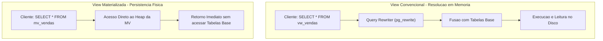
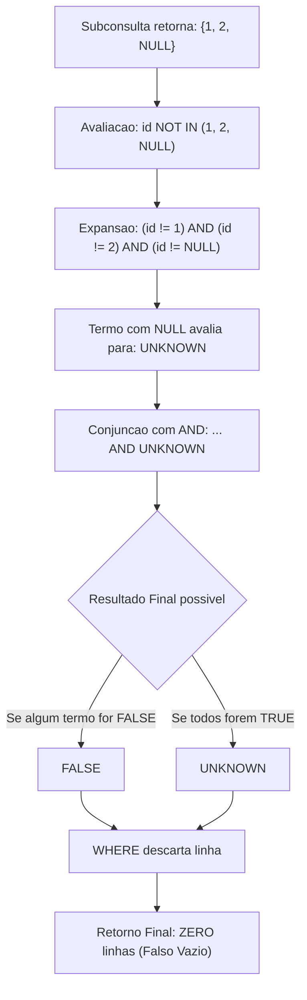
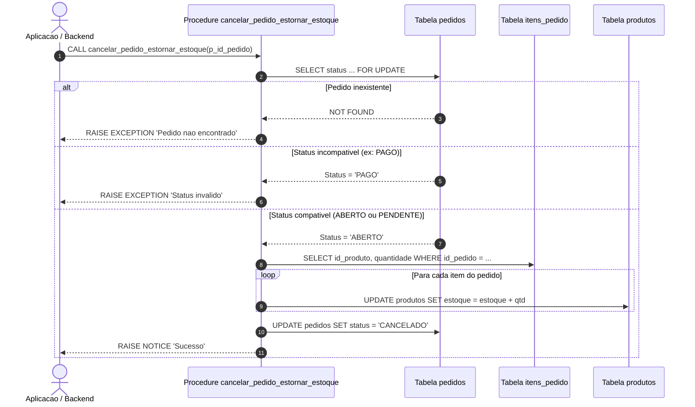
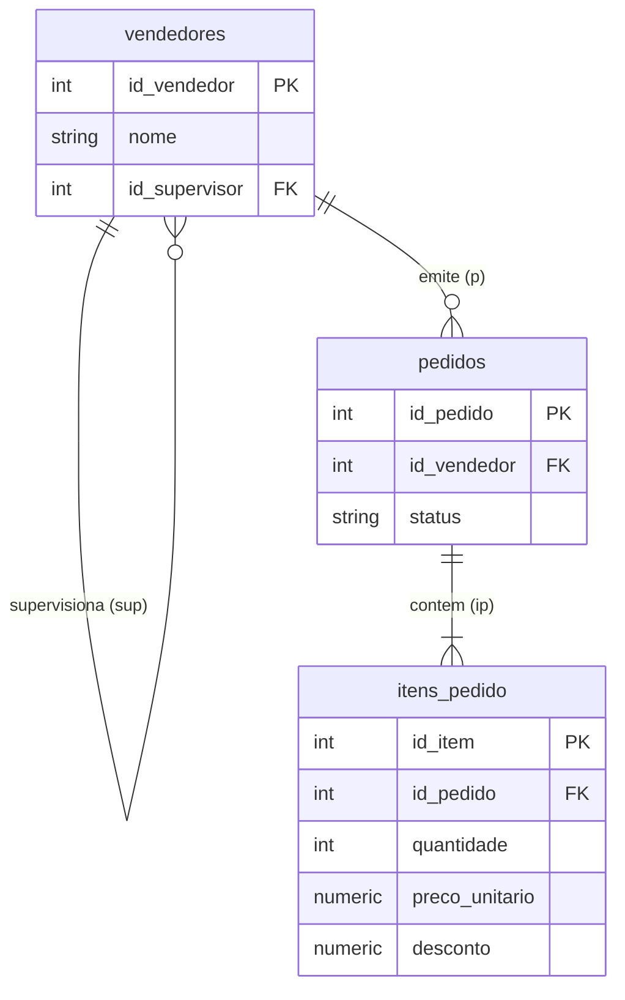

# Simulados Comentados - Tópicos Avançados em Banco de Dados

**Instituição:** Centro Universitário de Santa Fé do Sul (UniFEF)  
**Curso:** Bacharelado em Sistemas de Informação (4º Semestre)  
**Disciplina:** Tópicos Avançados em Banco de Dados  
**Docente:** Prof. Welington Garcia  
**Material de Apoio e Treinamento para Avaliações e Concursos (Padrão ENADE)**

---

## Simulado 1 - Questões Objetivas

### Questão 1
(ENADE / Concurso Superior - Adaptada) O PostgreSQL implementa dois mecanismos fundamentais para a criação de visões relacionais: as visões convencionais (Views padrão) e as visões materializadas (Materialized Views). Considere uma arquitetura de banco de dados corporativo onde relatórios gerenciais demandam consultas volumosas com múltiplos acoplamentos relacionais (`JOIN`), agregações (`SUM`, `AVG`) e agrupamentos (`GROUP BY`) sobre milhões de registros transacionais.

Sobre o comportamento interno, ciclo de vida e características físicas desses dois objetos no PostgreSQL, avalie as asserções a seguir e a relação proposta entre elas:

I. Uma View convencional não consome espaço em disco para armazenamento de tuplas, pois seu conteúdo é resolvido dinamicamente pelo subsistema *Query Rewrite Rule System* (`pg_rewrite`), que funde a árvore sintática da visão à consulta principal no momento da execução.

PORQUE

II. Para viabilizar a atualização de uma Materialized View em ambientes de produção de alta disponibilidade sem bloquear leituras concorrentes por meio do comando `REFRESH MATERIALIZED VIEW CONCURRENTLY`, o PostgreSQL exige a existência prévia de ao menos um índice exclusivo (`UNIQUE`) cobrindo uma ou mais colunas da própria visão materializada, sem a presença de cláusulas de filtro condicional (`WHERE`).

A respeito dessas asserções, assinale a opção correta:

A) As asserções I e II são proposições verdadeiras, e a II é uma justificativa correta da I.  
B) As asserções I e II são proposições verdadeiras, mas a II não é uma justificativa correta da I.  
C) A asserção I é uma proposição verdadeira, e a II é uma proposição falsa.  
D) A asserção I é uma proposição falsa, e a II é uma proposição verdadeira.  
E) As asserções I e II são proposições falsas.

---

### Questão 2
(ENADE / Engenharia de Software) A partir da versão 11, o PostgreSQL passou a suportar formalmente a criação de Procedimentos Armazenados por meio da instrução `CREATE PROCEDURE`, diferenciando-os semanticamente e operacionalmente das Funções Definidas pelo Usuário (`CREATE FUNCTION`).

Acerca das diferenças conceituais, sintáticas e operacionais entre Functions e Procedures escritas em linguagem PL/pgSQL, analise as afirmativas:

I. Enquanto uma Function deve obrigatoriamente especificar uma cláusula de retorno (`RETURNS <tipo>` ou `RETURNS void`) e ser invocada prioritariamente no contexto de expressões SQL via `SELECT`, uma Procedure não possui a cláusula `RETURNS` e é executada isoladamente por meio do comando `CALL`.  
II. O controle transacional autônomo (execução explícita de instruções `COMMIT` e `ROLLBACK` no corpo do bloco de código) é suportado dentro de Procedures, permitindo o particionamento de cargas em lote (*batch processing*), enquanto em Functions tal operação resulta em erro de execução (`invalid transaction termination`).  
III. Ao contrário das Functions, que podem retornar múltiplos valores escalares exclusivamente por meio de tipos compostos ou `RETURNS TABLE`, uma Procedure pode retornar valores para o ambiente chamador utilizando parâmetros qualificados com os modificadores `OUT` ou `INOUT`.  
IV. Uma Procedure invocada por `CALL` pode ser integrada diretamente no predicado de uma cláusula `WHERE` ou na lista de projeção de uma instrução `SELECT`, desde que todos os seus parâmetros de saída `OUT` sejam tipados como escalares compatíveis.

Estão corretas apenas as afirmativas:

A) I e II.  
B) I e IV.  
C) I, II e III.  
D) II, III e IV.  
E) I, II, III e IV.

---

### Questão 3
(Concurso Público / Analista de Banco de Dados) No contexto da álgebra relacional e da teoria dos conjuntos implementada na linguagem SQL do PostgreSQL, a operação de Anti-Junção (*Anti-Join*) é utilizada para identificar registros de uma relação $A$ que não possuem qualquer correspondência na relação associada $B$ ($A \setminus B$).

Considere o seguinte esquema relacional simplificado:

```sql
CREATE TABLE clientes (
    id_cliente SERIAL PRIMARY KEY,
    nome VARCHAR(100) NOT NULL,
    cidade VARCHAR(100)
);

CREATE TABLE pedidos (
    id_pedido SERIAL PRIMARY KEY,
    data_pedido DATE NOT NULL,
    status VARCHAR(30) NOT NULL,
    id_cliente INTEGER REFERENCES clientes(id_cliente),
    observacoes VARCHAR(255)
);
```

Para recuperar exclusivamente os clientes que nunca efetuaram nenhum pedido de compra, um desenvolvedor redigiu cinco propostas de consultas:

1.
```sql
SELECT c.id_cliente, c.nome 
FROM clientes c 
LEFT JOIN pedidos p ON c.id_cliente = p.id_cliente 
WHERE p.id_pedido IS NULL;
```

2.
```sql
SELECT c.id_cliente, c.nome 
FROM clientes c 
LEFT JOIN pedidos p ON c.id_cliente = p.id_cliente 
WHERE p.observacoes IS NULL;
```

3.
```sql
SELECT c.id_cliente, c.nome 
FROM clientes c 
WHERE NOT EXISTS (
    SELECT 1 
    FROM pedidos p 
    WHERE p.id_cliente = c.id_cliente
);
```

4.
```sql
SELECT c.id_cliente, c.nome 
FROM clientes c 
WHERE c.id_cliente NOT IN (
    SELECT p.id_cliente 
    FROM pedidos p
);
```

Considerando que a coluna `pedidos.id_cliente` aceita valores nulos (`NULL`) na DDL e que a coluna `pedidos.observacoes` é opcional, quais consultas garantem a obtenção rigorosa e consistente do resultado esperado sem riscos de anomalias semânticas?

A) 1 e 3, apenas.  
B) 1 e 4, apenas.  
C) 1, 3 e 4, apenas.  
D) 2 e 3, apenas.  
E) 1, 2, 3 e 4.

---

### Questão 4
(ENADE / Ciência da Computação) Considere o tratamento de valores nulos sob a ótica da Lógica Trivalente (*Three-Valued Logic* - 3VL) nos Sistemas Gerenciadores de Banco de Dados Relacionais compatíveis com o padrão ANSI/ISO SQL.

Suponha uma tabela `produtos` com 100 itens cadastrados e uma tabela `itens_pedido` registrando os produtos vendidos. A coluna `id_produto` na tabela `itens_pedido` aceita valores nulos e possui, de fato, ao menos uma linha armazenada com o valor `NULL` decorrente de uma falha de carga legada.

Um analista executa o seguinte comando para listar produtos não vendidos:

```sql
SELECT id_produto, nome_produto
FROM produtos
WHERE id_produto NOT IN (
    SELECT id_produto 
    FROM itens_pedido
);
```

Qual será o comportamento observado e a respectiva justificativa técnica do motor relacional do PostgreSQL?

A) O motor retornará todos os produtos não vendidos normalmente, pois o operador `NOT IN` ignora automaticamente tuplas nulas oriundas de subconsultas.  
B) O motor retornará zero linhas (conjunto vazio), porque qualquer comparação de desigualdade com `NULL` resulta em `UNKNOWN`, fazendo com que a conjunção lógica de avaliações com `AND` da cláusula `NOT IN` nunca atinja o valor booleano estrito `TRUE`.  
C) O comando abortará com o erro de execução `ERROR: null value in subquery is not allowed for NOT IN predicate`.  
D) O motor converterá internamente a consulta em um `NOT EXISTS`, retornando os produtos corretos, porém emitindo um `WARNING` no log do servidor.  
E) O motor retornará apenas os produtos que possuem chave primária nula, violando a integridade de entidade da tabela de produtos.

---

### Questão 5
(Concurso Superior / DBA PostgreSQL) O Otimizador de Consultas Baseado em Custo (*Cost-Based Optimizer* - CBO) do PostgreSQL seleciona algoritmos físicos para executar operações de junção (`JOIN`) com base em estatísticas de cardinalidade, seletividade e parâmetros de memória configurados no servidor (como `work_mem`).

Analise a representação textual simplificada do nó de execução a seguir, gerado pelo comando `EXPLAIN`:

```text
Hash Join  (cost=3.25..18.50 rows=12 width=72)
  Hash Cond: (p.id_cliente = c.id_cliente)
  ->  Seq Scan on pedidos p  (cost=0.00..14.10 rows=410 width=16)
  ->  Hash  (cost=3.10..3.10 rows=10 width=60)
        ->  Seq Scan on clientes c  (cost=0.00..3.10 rows=10 width=60)
```

Com base na mecânica de execução dos algoritmos de junção interna do PostgreSQL, assinale a afirmação correta:

A) O PostgreSQL utilizou o algoritmo *Merge Join*, pois identificou que ambas as relações estavam previamente indexadas e ordenadas pela chave primária.  
B) A tabela `clientes` foi selecionada como a relação interna de construção (*build relation*), sendo integralmente lida e carregada em uma tabela hash alocada na memória de trabalho; subsequentemente, a tabela `pedidos` foi varrida como relação externa de sondagem (*probe relation*).  
C) O algoritmo *Nested Loop* foi descartado porque a tabela `pedidos` possui menos linhas que a tabela `clientes`, o que inviabiliza iterações em laço duplo.  
D) Se a tabela hash gerada ultrapassar o limite estabelecido pelo parâmetro `work_mem`, o PostgreSQL cancelará a transação com estouro de pilha (*stack overflow*).  
E) A operação de *Hash Join* só pode ser empregada caso a cláusula `ON` contenha operadores de desigualdade, como `p.id_cliente > c.id_cliente`.

---

### Questão 6
(ENADE / Sistemas de Informação) Em modelagem de dados relacional, estruturas hierárquicas como organogramas funcionais e cadeias de supervisão são comumente implementadas por meio de autorrelacionamentos (*Self-Joins*), fundamentados no modelo de Lista de Adjacência (*Adjacency List*).

Considere a tabela `vendedores` estruturada da seguinte forma:

```sql
CREATE TABLE vendedores (
    id_vendedor SERIAL PRIMARY KEY,
    nome VARCHAR(100) NOT NULL,
    salario NUMERIC(10,2) NOT NULL,
    comissao NUMERIC(5,2),
    id_supervisor INTEGER REFERENCES vendedores(id_vendedor)
);
```

Sabendo que o diretor geral da empresa possui o valor `NULL` na coluna `id_supervisor` e que se deseja listar **todos** os vendedores da corporação (incluindo o diretor geral), exibindo seu respectivo nome e o nome do seu supervisor imediato (apresentando `'Sem Supervisor'` para o diretor), qual consulta SQL atende integralmente ao requisito de negócio?

A)
```sql
SELECT 
    v.nome AS vendedor,
    s.nome AS supervisor
FROM vendedores v
INNER JOIN vendedores s ON v.id_supervisor = s.id_vendedor;
```

B)
```sql
SELECT 
    v.nome AS vendedor,
    COALESCE(s.nome, 'Sem Supervisor') AS supervisor
FROM vendedores v
RIGHT JOIN vendedores s ON v.id_supervisor = s.id_vendedor;
```

C)
```sql
SELECT 
    v.nome AS vendedor,
    COALESCE(s.nome, 'Sem Supervisor') AS supervisor
FROM vendedores v
LEFT JOIN vendedores s ON v.id_supervisor = s.id_vendedor;
```

D)
```sql
SELECT 
    v.nome AS vendedor,
    CASE WHEN s.nome IS NULL THEN 'Sem Supervisor' END AS supervisor
FROM vendedores v
CROSS JOIN vendedores s;
```

E)
```sql
SELECT 
    v.nome AS vendedor,
    COALESCE(s.nome, 'Sem Supervisor') AS supervisor
FROM vendedores v
FULL OUTER JOIN vendedores s ON v.id_vendedor = s.id_supervisor
WHERE v.id_supervisor IS NOT NULL;
```

---

### Questão 7
(Concurso Público / Engenheiro de Dados) Considere a execução de consultas analíticas envolvendo agregação de dados e junções externas à esquerda (`LEFT OUTER JOIN`). O objetivo do desenvolvedor é exibir o nome de todos os clientes cadastrados e a respectiva quantidade total de pedidos emitidos por cada um deles, garantindo que clientes recém-cadastrados (que ainda possuem zero compras) apareçam na listagem com a contagem estrita de `0`.

Analise os dois comandos formulados:

**Consulta A:**
```sql
SELECT c.nome, COUNT(*) AS total_pedidos
FROM clientes c
LEFT JOIN pedidos p ON c.id_cliente = p.id_cliente
GROUP BY c.id_cliente, c.nome;
```

**Consulta B:**
```sql
SELECT c.nome, COUNT(p.id_pedido) AS total_pedidos
FROM clientes c
LEFT JOIN pedidos p ON c.id_cliente = p.id_cliente
GROUP BY c.id_cliente, c.nome;
```

A respeito dos resultados produzidos pelas consultas A e B no PostgreSQL, é correto afirmar que:

A) Ambas as consultas produzem resultados idênticos em qualquer circunstância, retornando zero para clientes sem pedidos.  
B) A Consulta A está errada porque `COUNT(*)` computa a cardinalidade física das linhas intermediárias agrupadas, retornando o valor 1 para clientes sem pedidos, enquanto a Consulta B está correta ao avaliar `p.id_pedido`, ignorando linhas cujo valor seja nulo e computando 0.  
C) A Consulta B gerará um erro de compilação SQL, pois o padrão ANSI veda o uso de identificadores de chave primária no interior da função `COUNT()`.  
D) A Consulta A está correta e a Consulta B está incorreta, pois `COUNT(p.id_pedido)` descartará completamente o registro do cliente da projeção final.  
E) Ambas as consultas omitirão os clientes que não possuem pedidos devido à presença da cláusula `GROUP BY`.

---

### Questão 8
(ENADE / Banco de Dados Avançado) No PostgreSQL, uma subconsulta pode ser classificada como **independente** (não correlacionada) ou **correlacionada**. Essa classificação impacta diretamente a estratégia de execução adotada pelo planejador (*planner*).

Considere a seguinte consulta:

```sql
SELECT p.id_produto, p.nome_produto, p.preco
FROM produtos p
WHERE p.preco > (
    SELECT AVG(sub.preco)
    FROM produtos sub
    WHERE sub.id_categoria = p.id_categoria
);
```

Sobre essa consulta e seu plano de execução físico, assinale a opção correta:

A) A subconsulta é independente e será materializada no plano como um nó do tipo `InitPlan`, executado exatamente uma vez antes da varredura da tabela externa.  
B) A subconsulta é correlacionada porque referencia a coluna `p.id_categoria` da consulta externa, exigindo conceitualmente uma avaliação linha a linha que pode gerar nós do tipo `SubPlan`.  
C) O predicado `>` causará erro em tempo de execução caso alguma categoria possua mais de um produto cadastrado.  
D) A consulta poderia ser reescrita com o operador `= ANY` sem qualquer modificação em seu resultado semântico ou no conjunto de registros retornados.  
E) A consulta falhará caso existam produtos com a coluna `id_categoria` preenchida com valores nulos, abortando a transação imediatamente com `null_violation`.

---

### Questão 9
(Concurso Superior / Analista de Sistemas) A cláusula `WITH CHECK OPTION` pode ser adicionada à instrução `CREATE VIEW` para fiscalizar comandos de modificação de dados (`INSERT`, `UPDATE`) direcionados à visão.

Considere a criação da seguinte visão no PostgreSQL:

```sql
CREATE VIEW vw_produtos_informatica AS
SELECT id_produto, nome_produto, preco, id_categoria
FROM produtos
WHERE id_categoria = 1
WITH CHECK OPTION;
```

Se um usuário autenticado com os devidos privilégios de escrita tentar executar o comando a seguir:

```sql
INSERT INTO vw_produtos_informatica (nome_produto, preco, id_categoria)
VALUES ('Cadeira Presidente', 1200.00, 3);
```

Qual será o comportamento do PostgreSQL?

A) O registro será inserido com sucesso na tabela base `produtos`, porém não ficará visível em consultas futuras contra a visão `vw_produtos_informatica`.  
B) O PostgreSQL rejeitará a instrução, emitindo uma violação de restrição (`new row violates check option for view "vw_produtos_informatica"`), impedindo a gravação do registro.  
C) O PostgreSQL executará a inserção alterando silenciosamente o valor de `id_categoria` para 1, a fim de garantir a conformidade com o predicado da visão.  
D) O comando será convertido em uma operação nula (`NOOP`), não gerando erros e mantendo a tabela inalterada.  
E) Ocorrerá um erro de sintaxe, pois a especificação `WITH CHECK OPTION` só é permitida em Materialized Views.

---

### Questão 10
(ENADE / Ciência da Computação) Considere o uso dos operadores quantificados `ANY` (ou `SOME`) e `ALL` em conjunto com subconsultas que retornam uma lista unidimensional de valores escalares numéricos.

Analise as duas instruções SQL a seguir:

**Instrução 1:**
```sql
SELECT nome_produto, preco 
FROM produtos 
WHERE preco > ALL (
    SELECT preco 
    FROM produtos 
    WHERE id_categoria = 5
);
```

**Instrução 2:**
```sql
SELECT nome_produto, preco 
FROM produtos 
WHERE preco > (
    SELECT MAX(preco) 
    FROM produtos 
    WHERE id_categoria = 5
);
```

Assinale a análise correta a respeito da equivalência lógica entre as Instruções 1 e 2:

A) As instruções são sempre estritamente equivalentes em qualquer hipótese, inclusive se a subconsulta retornar zero registros (categoria 5 inexistente).  
B) Se a subconsulta retornar zero linhas (conjunto vazio), a Instrução 1 avaliará a condição como `TRUE` para todos os produtos (retornando a tabela inteira), enquanto a Instrução 2 avaliará a expressão como `preco > NULL` (resultando em `UNKNOWN` e retornando zero linhas).  
C) A Instrução 1 retornará erro de sintaxe caso a categoria 5 contenha mais de um registro, pois operadores de comparação não podem preceder palavras-chave reservadas como `ALL`.  
D) A Instrução 2 falhará se houver produtos na categoria 5 com valores nulos, enquanto a Instrução 1 converte automaticamente os valores nulos em zero.  
E) Ambas as instruções retornam zero linhas caso a tabela de produtos possua mais de 1000 registros, devido ao estouro de limite de memória do operador `ALL`.

---

### Questão 11
(Concurso Público / Especialista em Banco de Dados) No contexto da linguagem PL/pgSQL, analise o fragmento de código de uma Stored Procedure destinada à atualização de saldos:

```sql
CREATE OR REPLACE PROCEDURE debitar_saldo(
    p_id_cliente INT,
    p_valor NUMERIC
)
LANGUAGE plpgsql
AS $$
DECLARE
    v_saldo_atual NUMERIC;
BEGIN
    SELECT saldo INTO v_saldo_atual
    FROM clientes
    WHERE id_cliente = p_id_cliente
    FOR UPDATE;

    IF NOT FOUND THEN
        RAISE EXCEPTION 'Cliente % não localizado.', p_id_cliente;
    END IF;

    IF v_saldo_atual < p_valor THEN
        RAISE EXCEPTION 'Saldo insuficiente: Disponível %, Solicitado %', v_saldo_atual, p_valor;
    END IF;

    UPDATE clientes
    SET saldo = saldo - p_valor
    WHERE id_cliente = p_id_cliente;

    RAISE NOTICE 'Débito processado com sucesso.';
END;
$$;
```

A respeito das estruturas de controle, variáveis especiais e comandos empregados na procedure, avalie as afirmativas:

I. A cláusula `FOR UPDATE` realiza o bloqueio pessimista (*exclusive row-level lock*) da tupla selecionada, impedindo que transações concorrentes modifiquem o saldo do mesmo cliente entre a leitura e a posterior execução do `UPDATE`.  
II. A variável booleana de diagnóstico `FOUND` é gerenciada automaticamente pelo compilador PL/pgSQL e assume valor `TRUE` se o comando `SELECT INTO` localizou e atribuiu dados com sucesso.  
III. O comando `RAISE EXCEPTION` interrompe a execução procedural, dispara a reversão (*rollback*) automática das modificações pendentes na transação e repassa a mensagem de erro para o cliente que originou a chamada.  
IV. O código causará erro de compilação, pois procedimentos armazenados não podem invocar comandos DML (`UPDATE`) sem antes instanciar um cursor explícito na seção `DECLARE`.

Estão corretas apenas as afirmativas:

A) I e IV.  
B) II e III.  
C) I, II e III.  
D) II, III e IV.  
E) I, II, III e IV.

---

### Questão 12
(ENADE / Engenharia de Software) Durante a manutenção de um sistema legado de vendas, um analista precisa reajustar o limite de crédito dos clientes que possuem pedidos registrados com status igual a `'Pago'`.

Ele avalia duas abordagens para atualizar a tabela `clientes`:

**Abordagem 1 (UPDATE com Subconsulta no WHERE):**
```sql
UPDATE clientes
SET limite_credito = limite_credito * 1.10
WHERE id_cliente IN (
    SELECT id_cliente 
    FROM pedidos 
    WHERE status = 'Pago'
);
```

**Abordagem 2 (UPDATE com Junção na cláusula FROM):**
```sql
UPDATE clientes c
SET limite_credito = c.limite_credito * 1.10
FROM pedidos p
WHERE c.id_cliente = p.id_cliente 
  AND p.status = 'Pago';
```

Considerando que um mesmo cliente realizou múltiplos pedidos com status `'Pago'` no banco de dados, qual afirmação reflete com precisão técnica o comportamento do PostgreSQL?

A) A Abordagem 2 aplicará o reajuste de 10% cumulativamente para cada pedido localizado, multiplicando o limite do cliente várias vezes na mesma transação.  
B) A Abordagem 1 atualizará cada cliente qualificado exatamente uma vez com o reajuste de 10%, enquanto na Abordagem 2 o PostgreSQL garante que cada linha da tabela de destino seja atualizada no máximo uma vez por comando `UPDATE`, descartando execuções redundantes para a mesma tupla, produzindo o mesmo valor final de limite da Abordagem 1.  
C) Ambas as abordagens falharão, pois o comando `UPDATE` no PostgreSQL veda categoricamente a presença de subconsultas ou cláusulas `FROM`.  
D) A Abordagem 1 gerará um erro de recursão infinita caso o cliente tenha mais de dois pedidos faturados.  
E) A Abordagem 2 é mais lenta porque o PostgreSQL não consegue utilizar índices existentes na chave estrangeira `pedidos.id_cliente`.

---

## Simulado 2 - Questões Discursivas

### Questão Discursiva 1
**Tema:** Arquitetura de Visões Relacionais e Materializadas no PostgreSQL  
**Contexto:** Uma fintech de crédito opera um banco de dados transacional com alto volume de escritas (`INSERT`, `UPDATE`) e simultaneamente disponibiliza um painel analítico (*dashboard*) com consultas complexas que realizam agregações sobre milhões de lançamentos de pagamentos. A equipe de engenharia debate se deve expor os dados por meio de visões lógicas convencionais (`CREATE VIEW`) ou visões materializadas (`CREATE MATERIALIZED VIEW`).

**Itens Obrigatórios da Resposta:**
1. Explique a diferença de arquitetura física entre uma View padrão e uma Materialized View no PostgreSQL, descrevendo o papel do *Query Rewrite Rule System* e dos arquivos de heap de dados.
2. Analise os impactos de desempenho e frescor dos dados (*data freshness*) entre as duas abordagens, considerando a latência de leitura versus a sobrecarga de escrita.
3. Demonstre a sintaxe do comando DDL e DML para criação e recálculo concorrente da visão materializada (`REFRESH MATERIALIZED VIEW CONCURRENTLY`), explicitando o pré-requisito mandatório de indexação exigido pelo motor relacional para que o comando execute sem travar consultas concorrentes de leitura.

---

### Questão Discursiva 2
**Tema:** Álgebra Relacional, Lógica Trivalente (3VL) e Anti-Junções  
**Contexto:** Um analista de auditoria de dados precisa emitir um relatório de reconciliação fiscal contendo todos os clientes cadastrados que **nunca** emitiram um pedido de venda no sistema corporativo. Durante o code review, surgiram três propostas de consulta: uma utilizando `NOT IN`, outra utilizando `NOT EXISTS` e uma terceira utilizando `LEFT JOIN ... WHERE chave IS NULL`. A coluna `id_cliente` na tabela de pedidos é anulável (`NULL`), e existem registros inconsistentes gravados com `NULL`.

**Itens Obrigatórios da Resposta:**
1. Demonstre matematicamente, utilizando os axiomas da Lógica Trivalente (*Three-Valued Logic* - 3VL: `TRUE`, `FALSE`, `UNKNOWN`), por que a consulta construída com `NOT IN` falha ao retornar um conjunto vazio quando há a presença de um único valor `NULL` na subconsulta.
2. Apresente o código SQL canônico da solução utilizando `LEFT JOIN` com predicado de nulidade (Anti-Join), justificando por que a verificação de nulidade deve recair obrigatoriamente sobre a chave primária da tabela dependente e não sobre uma coluna de atributo comum.
3. Apresente o código SQL da solução equivalente empregando `NOT EXISTS` e compare o comportamento semântico de curto-circuito (*short-circuit*) do operador `EXISTS` em relação a operadores de comparação escalar.

---

### Questão Discursiva 3
**Tema:** Programação Procedural com PL/pgSQL e Controle Transacional em Stored Procedures  
**Contexto:** Você foi designado para implementar uma rotina segura de cancelamento de pedidos de e-commerce no PostgreSQL. Quando um pedido é cancelado, a rotina deve:
- Validar se o pedido existe e qual é seu status atual (apenas pedidos `'ABERTO'` ou `'PENDENTE'` podem ser cancelados).
- Recompor o saldo em estoque dos produtos que compunham os itens daquele pedido cancelado.
- Alterar o status do pedido para `'CANCELADO'`.
- Garantir segurança contra concorrência por meio de bloqueios pessimistas adequados e estrita consistência transacional.

**Itens Obrigatórios da Resposta:**
1. Escreva o código completo em PL/pgSQL de uma Stored Procedure chamada `cancelar_pedido_estornar_estoque(p_id_pedido INT)`.
2. Inclua o tratamento defensivo de exceções (`RAISE EXCEPTION`), controle de fluxo condicional (`IF/THEN/ELSE`), atribuição via `SELECT INTO` e diagnóstico com `FOUND`.
3. Utilize laços de repetição (`FOR ... IN SELECT`) para iterar pelas linhas de itens do pedido a serem estornadas no estoque.
4. Explique a diferença entre executar essa rotina dentro de uma `PROCEDURE` versus executá-la em uma `FUNCTION`, especificando o comportamento de transações (`COMMIT`/`ROLLBACK`).

---

### Questão Discursiva 4
**Tema:** Autorrelacionamento (Self-Join), Junções Múltiplas e Agregações com Desconto  
**Contexto:** O diretor comercial da empresa `loja_exercicios` solicita um relatório analítico para acompanhamento da produtividade de sua equipe de vendas e supervisão. O modelo relacional possui as tabelas `vendedores` (contendo `id_vendedor`, `nome`, `salario`, `comissao`, `id_supervisor`), `pedidos` (`id_pedido`, `data_pedido`, `status`, `id_cliente`, `id_vendedor`) e `itens_pedido` (`id_item`, `id_pedido`, `id_produto`, `quantidade`, `preco_unitario`, `desconto`). O desconto é armazenado como taxa percentual numérica (ex: 5.00 representando 5%).

**Itens Obrigatórios da Resposta:**
1. Desenvolva uma consulta SQL única que retorne:
   - Nome do vendedor.
   - Nome do supervisor imediato (ou a cadeia literal `'Diretoria Executiva'` caso o vendedor não tenha supervisor).
   - Quantidade total de pedidos atendidos pelo vendedor.
   - Faturamento bruto total faturado pelo vendedor.
   - Faturamento líquido total (deduzindo a taxa percentual de desconto concedida em cada item: $`\text{subtotal\_liquido} = \text{quantidade} \times \text{preco\_unitario} \times (1 - \frac{\text{desconto}}{100})`$).
2. A consulta deve preservar **todos** os vendedores cadastrados, exibindo valor zero nas métricas financeiras e de volume para aqueles que ainda não concretizaram nenhuma venda (como supervisores seniores).
3. Considere apenas pedidos com status `'Pago'` ou `'Enviado'` para o cômputo dos valores de venda.
4. Explique o papel do `LEFT JOIN` e da função `COALESCE` para garantir a integridade dos cálculos e a não eliminação de registros na agregação.

---

### Questão Discursiva 5
**Tema:** Engenharia de Desempenho e Diagnóstico com EXPLAIN ANALYZE  
**Contexto:** Em um banco de dados com centenas de milhares de produtos e dezenas de categorias, duas equipes de desenvolvimento submeteram propostas distintas para listar os produtos cujo preço é estritamente superior à média de sua respectiva categoria mercadológica.

**Proposta 1 (Subconsulta Correlacionada no WHERE):**
```sql
SELECT p.id_produto, p.nome_produto, p.preco, p.id_categoria
FROM produtos p
WHERE p.preco > (
    SELECT AVG(sub.preco)
    FROM produtos sub
    WHERE sub.id_categoria = p.id_categoria
);
```

**Proposta 2 (Tabela Derivada com JOIN na cláusula FROM):**
```sql
SELECT p.id_produto, p.nome_produto, p.preco, p.id_categoria
FROM produtos p
INNER JOIN (
    SELECT id_categoria, AVG(preco) AS media_preco
    FROM produtos
    GROUP BY id_categoria
) AS medias ON p.id_categoria = medias.id_categoria
WHERE p.preco > medias.media_preco;
```

**Itens Obrigatórios da Resposta:**
1. Descreva conceitualmente a árvore de processamento de cada uma das abordagens, detalhando a diferença algorítmica entre a avaliação correlacionada linha a linha e o pré-cálculo vetorial por agrupamento (`GROUP BY`).
2. Analise como o comando `EXPLAIN ANALYZE` auxilia o engenheiro de banco de dados a diagnosticar o plano físico, conceituando as métricas: `startup cost`, `total cost`, `actual time` e `loops`.
3. Indique qual das duas consultas tem maior probabilidade de escalar com menor consumo de recursos de CPU/I/O em uma tabela massiva desprovida de índices secundários, apresentando uma sugestão de indexação física B-Tree que otimizaria ambas as execuções.

---

## Gabarito Comentado

### Simulado 1 - Resoluções das Questões Objetivas

#### Questão 1
- **Alternativa Correta:** **B** (As asserções I e II são proposições verdadeiras, mas a II não é uma justificativa correta da I).
- **Justificativa Técnica:**
  - A **Asserção I** é verdadeira: O PostgreSQL não armazena dados físicos em disco para uma View convencional (`CREATE VIEW`). Ele persiste apenas a definição da consulta no catálogo do sistema (`pg_views` e `pg_rewrite`). Quando a view é invocada, o subsistema de reescrita (*Query Rewrite Rule System*) intercepta a árvore sintática gerada pelo analisador e funde a definição da visão à consulta principal, gerando um plano de execução único executado contra as tabelas base.
  - A **Asserção II** é verdadeira: A reconstrução concorrente de uma Materialized View por meio de `REFRESH MATERIALIZED VIEW CONCURRENTLY` permite que leituras simultâneas ocorram sem bloqueio exclusivo na tabela física subjacente. Para que o PostgreSQL sincronize as tuplas antigas com as tuplas recém-computadas (através de um mecanismo de diferenciação transitória), ele exige estritamente a presença de pelo menos um índice exclusivo (`UNIQUE` ou `PRIMARY KEY`) cobrindo uma ou mais colunas da visão materializada, sem cláusulas condicionais `WHERE`.
  - **Relação de Justificativa:** A asserção II não é causa nem justificativa da asserção I. A asserção I trata da ausência de armazenamento físico em visões convencionais (reescrita lógica), enquanto a asserção II estabelece um requisito de infraestrutura física de indexação para sincronização assíncrona concorrente em visões materializadas (armazenamento estático em disco).
- **Análise dos Distratores:**
  - **A:** Incorreta. Embora ambas sejam verdadeiras, a II não é a justificativa causal da I. O mecanismo de reescrita de visões lógicas existe independentemente de como visões materializadas são indexadas ou atualizadas.
  - **C:** Incorreta. A asserção II é perfeitamente verdadeira conforme a documentação oficial do PostgreSQL para o comando `REFRESH MATERIALIZED VIEW`.
  - **D:** Incorreta. A asserção I é verdadeira; visões normais não alocam espaço de heap para dados.
  - **E:** Incorreta. Ambas as asserções representam fatos técnicos comprovados da arquitetura do PostgreSQL.

---

#### Questão 2
- **Alternativa Correta:** **C** (Estão corretas apenas as afirmativas I, II e III).
- **Justificativa Técnica:**
  - A **Afirmativa I** está correta: Functions são projetadas como expressões relacionais, invocadas via `SELECT nome_funcao()`, e exigem retorno tipado explícito ou `void`. Procedures são rotinas procedurais autônomas, invocadas por `CALL nome_procedure()`, e não possuem a cláusula `RETURNS`.
  - A **Afirmativa II** está correta: O grande diferencial introduzido no PostgreSQL 11 com o objeto `CREATE PROCEDURE` foi a capacidade de controlar o ciclo de vida transacional. É permitido executar instruções explícitas de `COMMIT` e `ROLLBACK` no corpo da procedure, permitindo descarregar memória e liberar *locks* durante grandes cargas. Em funções, tentar invocar `COMMIT` resulta na exceção `ERROR: invalid transaction termination`.
  - A **Afirmativa III** está correta: Procedures não usam `RETURNS`, mas conseguem transmitir dados de volta ao chamador por meio de parâmetros declarados como `OUT` ou `INOUT`.
  - A **Afirmativa IV** está incorreta: Procedures chamadas com `CALL` não podem ser embutidas em comandos `SELECT`, cláusulas `WHERE`, `JOIN` ou `HAVING`. Apenas funções podem participar de expressões relacionais.
- **Análise dos Distratores:**
  - **A:** Incompleta. Desconsidera a veracidade da afirmativa III sobre o uso de parâmetros `OUT`/`INOUT`.
  - **B:** Incorreta. A afirmativa IV contém erro grave de sintaxe e arquitetura relacional.
  - **D:** Incorreta. A afirmativa IV é categoricamente falsa no padrão SQL e no PostgreSQL.
  - **E:** Incorreta. Inclui a afirmativa IV, que é falsa.

---

#### Questão 3
- **Alternativa Correta:** **A** (1 e 3, apenas).
- **Justificativa Técnica:**
  - **Consulta 1 (`LEFT JOIN` com `p.id_pedido IS NULL`):** Correta. Como `p.id_pedido` é a chave primária da tabela `pedidos`, ela possui restrição implícita `NOT NULL`. A única maneira de `p.id_pedido` conter `NULL` na projeção resultante de um `LEFT JOIN` é a ausência absoluta de pedidos associados àquele cliente.
  - **Consulta 2 (`LEFT JOIN` com `p.observacoes IS NULL`):** Incorreta (Armadilha de Anti-Join). A coluna `observacoes` aceita nulos por definição de esquema. Se um cliente efetuou um pedido válido, mas não preencheu observações, `p.observacoes` será `NULL`, e o cliente será classificado erroneamente como "cliente sem pedidos".
  - **Consulta 3 (`NOT EXISTS`):** Correta. O operador `EXISTS` avalia unicamente se o conjunto correlacionado interno possui cardinalidade $\ge 1$. Ele não compara valores atômicos sujeitos a `NULL`. Se houver correspondência, retorna `TRUE`; caso contrário, `FALSE`. O `NOT EXISTS` inverte o resultado com segurança, imune à presença de nulos.
  - **Consulta 4 (`NOT IN`):** Incorreta (Armadilha da Lógica Trivalente). A chave estrangeira `pedidos.id_cliente` permite valores nulos na DDL fornecida. Se houver um único pedido órfão com `id_cliente IS NULL`, a subconsulta do `NOT IN` retornará um conjunto contendo `NULL`. Pela álgebra booleana de 3VL, qualquer comparação de desigualdade com `NULL` resulta em `UNKNOWN`, fazendo com que a consulta inteira retorne **zero registros**, falhando na identificação dos clientes sem pedidos.
- **Análise dos Distratores:**
  - **B:** Incorreta. A consulta 4 falhará se houver um registro nulo em `pedidos.id_cliente`.
  - **C:** Incorreta. Considera a consulta 4 válida, ignorando a falha clássica de 3VL do `NOT IN`.
  - **D:** Incorreta. A consulta 2 introduz uma falha semântica grave de filtragem.
  - **E:** Incorreta. As consultas 2 e 4 apresentam falhas graves de modelagem e álgebra relacional.

---

#### Questão 4
- **Alternativa Correta:** **B** (O motor retornará zero linhas (conjunto vazio), porque qualquer comparação de desigualdade com `NULL` resulta em `UNKNOWN`, fazendo com que a conjunção lógica de avaliações com `AND` da cláusula `NOT IN` nunca atinja o valor booleano estrito `TRUE`).
- **Justificativa Técnica:**
  - No padrão ANSI SQL e no PostgreSQL, a expressão `v NOT IN (v1, v2, ..., vn)` é expandida semanticamente para:
    ```math
    \left(v \neq v_1\right) \text{ AND } \left(v \neq v_2\right) \text{ AND } \dots \text{ AND } \left(v \neq v_n\right)
    ```
  - Se qualquer valor $`v_i`$ do conjunto retornado for `NULL`, a expressão $(v \neq \text{NULL})$ avalia obrigatoriamente para `UNKNOWN` (Desconhecido).
  - Pela tabela-verdade do conectivo lógico `AND`:
    - $\text{TRUE AND UNKNOWN} \implies \text{UNKNOWN}$
    - $\text{FALSE AND UNKNOWN} \implies \text{FALSE}$
  - Em nenhuma hipótese a conjunção resultará em `TRUE`.
  - Como a cláusula `WHERE` apenas mantém na saída as tuplas para as quais a condição final seja estritamente verdadeira (`TRUE`), o resultado da consulta será categoricamente um **conjunto vazio (0 linhas)**, mesmo que existam dezenas de produtos que de fato nunca foram vendidos.
- **Análise dos Distratores:**
  - **A:** Incorreta. O operador `IN` e `NOT IN` não ignora tuplas nulas em subconsultas; ele aplica a avaliação de igualdade/desigualdade estrita segundo a lógica trivalente.
  - **C:** Incorreta. O SGBD não emite erro de sintaxe ou execução; a consulta executa perfeitamente, porém retorna zero registros silenciosamente.
  - **D:** Incorreta. O otimizador do PostgreSQL não altera unilateralmente a semântica de `NOT IN` para `NOT EXISTS` sem garantir equivalência lógica de nulidade.
  - **E:** Incorreta. Uma chave primária não aceita valores nulos por definição de integridade de entidade (`NOT NULL`).

---

#### Questão 5
- **Alternativa Correta:** **B** (A tabela `clientes` foi selecionada como a relação interna de construção (*build relation*), sendo integralmente lida e carregada em uma tabela hash alocada na memória de trabalho; subsequentemente, a tabela `pedidos` foi varrida como relação externa de sondagem (*probe relation*)).
- **Justificativa Técnica:**
  - No plano de execução de um *Hash Join* no PostgreSQL:
    1. O nó filho imediatamente abaixo de `Hash` (neste caso, `Seq Scan on clientes c`) representa a relação interna de construção (*build relation*). Ela é lida, suas chaves de junção são submetidas a uma função de espalhamento e indexadas em uma tabela hash transitória em memória (`work_mem`).
    2. O nó irmão do `Hash` (neste caso, `Seq Scan on pedidos p`) é a relação externa de sondagem (*probe relation*). Ela é percorrida sequencialmente tupla a tupla; para cada registro, calcula-se o hash da chave e efetua-se uma busca imediata $O(1)$ na tabela hash em memória para localizar correspondências.
  - O CBO escolhe a relação menor em estimativa de tamanho (`clientes`, com custo 3.10 e 10 linhas) para construir a hash table a fim de economizar espaço de memória de trabalho.
- **Análise dos Distratores:**
  - **A:** Incorreta. O plano declara explicitamente `Hash Join`, e não `Merge Join`.
  - **C:** Incorreta. O *Nested Loop* não foi adotado por motivos de custo global estimado, e não por restrição mecânica de cardinalidade relativa.
  - **D:** Incorreta. Se a tabela hash exceder o `work_mem`, o PostgreSQL não aborta o comando com estouro de pilha; ele realiza um *batching* para disco criando arquivos temporários de paginação (*multi-batch hash join*).
  - **E:** Incorreta. O *Hash Join* é exclusivo para equijunções (operador de igualdade `=`).

---

#### Questão 6
- **Alternativa Correta:** **C** (Utilização de `LEFT JOIN` associado à função `COALESCE(s.nome, 'Sem Supervisor')`).
- **Justificativa Técnica:**
  - O autorrelacionamento exige instanciar a tabela `vendedores` sob dois papéis distintos: `v` (o vendedor que estamos avaliando) e `s` (o supervisor do respectivo vendedor).
  - Como o diretor geral possui `v.id_supervisor IS NULL`, um `INNER JOIN` eliminaria o diretor geral do resultado (violando o requisito de listar todos os vendedores).
  - O `LEFT JOIN` garante que todas as tuplas de `v` sejam preservadas. Para o diretor geral, a tupla associada de `s` será sintetizada com colunas nulas (`s.nome IS NULL`).
  - A função escalar `COALESCE(s.nome, 'Sem Supervisor')` substitui com precisão os valores nulos pelo texto formal determinado pelo departamento de RH.
- **Análise dos Distratores:**
  - **A:** Incorreta. O `INNER JOIN` descarta o diretor geral, pois seu `id_supervisor` é nulo.
  - **B:** Incorreta. O `RIGHT JOIN` preservaria os supervisores que não supervisionam ninguém, mas descartaria vendedores folha que não supervisionam outros caso a junção se invertesse, distorcendo completamente o papel da tabela primária.
  - **D:** Incorreta. O `CROSS JOIN` geraria um produto cartesiano desastroso, combinando todos os vendedores com todos os supervisores indistintamente.
  - **E:** Incorreta. Utiliza `FULL OUTER JOIN` de forma incoerente e ainda aplica um filtro `WHERE v.id_supervisor IS NOT NULL`, que exclui ativamente o diretor geral.

---

#### Questão 7
- **Alternativa Correta:** **B** (A Consulta A está errada porque `COUNT(*)` computa a cardinalidade física das linhas intermediárias agrupadas, retornando o valor 1 para clientes sem pedidos, enquanto a Consulta B está correta ao avaliar `p.id_pedido`, ignorando linhas cujo valor seja nulo e computando 0).
- **Justificativa Técnica:**
  - Em um `LEFT JOIN`, quando um registro da tabela à esquerda não encontra pares na tabela à direita, o PostgreSQL sintetiza **uma linha física** preenchendo todos os atributos da tabela à direita com `NULL`.
  - A função agregadora `COUNT(*)` tem como semântica a contagem da quantidade física de linhas geradas para o grupo no bloco `GROUP BY`. Como existe 1 linha gerada pela junção externa, `COUNT(*)` retorna 1 para o cliente sem compras (falso positivo grave).
  - Por outro lado, `COUNT(expressão)` avalia a expressão e incrementa o acumulador apenas se o resultado da expressão for diferente de `NULL`. Como `p.id_pedido` é `NULL` nessa linha sintetizada, `COUNT(p.id_pedido)` retorna 0.
- **Análise dos Distratores:**
  - **A:** Incorreta. A Consulta A retorna 1 para clientes sem compras, gerando anomalia de dados.
  - **C:** Incorreta. O padrão ANSI SQL e o PostgreSQL suportam plenamente `COUNT(coluna)` sobre chaves primárias.
  - **D:** Incorreta. `COUNT(p.id_pedido)` não descarta o registro do cliente da projeção; apenas gera a métrica zero.
  - **E:** Incorreta. O `GROUP BY` não omite registros resultantes do `LEFT JOIN`.

---

#### Questão 8
- **Alternativa Correta:** **B** (A subconsulta é correlacionada porque referencia a coluna `p.id_categoria` da consulta externa, exigindo conceitualmente uma avaliação linha a linha que pode gerar nós do tipo `SubPlan`).
- **Justificativa Técnica:**
  - Uma subconsulta é correlacionada quando a expressão interna depende diretamente de um atributo pertencente à relação instanciada na consulta externa (`sub.id_categoria = p.id_categoria`).
  - Do ponto de vista conceitual, ela não pode ser pré-resolvida de maneira isolada antes do início da varredura externa. Para cada linha candidata processada em `produtos p`, o valor corrente de `p.id_categoria` é passado como parâmetro para a subconsulta calcular a média daquela categoria.
  - Nos planos de execução do PostgreSQL, subconsultas independentes aparecem como nós `InitPlan` (executados uma única vez em $O(1)$), enquanto subconsultas correlacionadas aparecem frequentemente como nós `SubPlan` (executadas para cada iteração do laço, com custo proporcional a $O(N)$ ou resolvidos via reescrita em semi-junções).
- **Análise dos Distratores:**
  - **A:** Incorreta. A subconsulta não é independente; ela é estritamente correlacionada e não gera um `InitPlan` simples sem descorrelação.
  - **C:** Incorreta. A função `AVG()` dentro da subconsulta garante que o retorno seja sempre uma única linha e coluna escalar ($1 \times 1$), sendo plenamente compatível com o operador de desigualdade `>`.
  - **D:** Incorreta. O operador `= ANY` transforma a comparação em uma semântica de igualdade a qualquer elemento (`IN`), o que destrói o propósito da consulta (identificar preços estritamente maiores que a média).
  - **E:** Incorreta. O SQL padrão avalia predicados com nulos como `UNKNOWN`, descartando a linha sem abortar a transação.

---

#### Questão 9
- **Alternativa Correta:** **B** (O PostgreSQL rejeitará a instrução, emitindo uma violação de restrição (`new row violates check option for view "vw_produtos_informatica"`), impedindo a gravação do registro).
- **Justificativa Técnica:**
  - A cláusula `WITH CHECK OPTION` (padrão SQL implementado pelo PostgreSQL) instrui o SGBD a fiscalizar comandos DML (`INSERT`, `UPDATE`) efetuados diretamente contra a visão.
  - Toda tupla inserida ou alterada através da visão é submetida aos predicados da cláusula `WHERE` contidos na definição da view.
  - Na tentativa de inserção, o valor fornecido para `id_categoria` é `3`, enquanto a view restringe a visualização estritamente a `id_categoria = 1`.
  - O PostgreSQL rejeita a gravação imediatamente com o erro:
    `ERROR: new row violates check option for view "vw_produtos_informatica"`
- **Análise dos Distratores:**
  - **A:** Incorreta. Esse seria o comportamento padrão de uma view atualizável comum sem a especificação da cláusula `WITH CHECK OPTION`.
  - **C:** Incorreta. O banco de dados nunca altera os valores das colunas para forçar o cumprimento do predicado de uma visão.
  - **D:** Incorreta. A operação não é um NOOP; ela gera uma exceção explícita que aborta a transação em execução.
  - **E:** Incorreta. `WITH CHECK OPTION` é um recurso específico de visões lógicas atualizáveis (`CREATE VIEW`), não sendo aplicável a visões materializadas.

---

#### Questão 10
- **Alternativa Correta:** **B** (Se a subconsulta retornar zero linhas (conjunto vazio), a Instrução 1 avaliará a condição como `TRUE` para todos os produtos (retornando a tabela inteira), enquanto a Instrução 2 avaliará a expressão como `preco > NULL` (resultando em `UNKNOWN` e retornando zero linhas)).
- **Justificativa Técnica:**
  - Esta é uma das distinções semânticas mais sutis e avançadas da álgebra relacional SQL:
    1. **Comportamento do `> ALL` (Quantificador Universal):** A lógica booleana do predicado $`v > \text{ALL } (S)`$ dita que a condição é verdadeira se $v$ for maior que todo elemento pertencente a $S$. Caso o conjunto $S$ seja **vazio**, a afirmação é satisfeita por vacuidade matemática (*vacuous truth*). Logo, se a categoria 5 não possuir nenhum produto, a Instrução 1 avalia como `TRUE` para todas as linhas da tabela `produtos`, retornando todos os registros.
    2. **Comportamento da subconsulta escalar com `MAX()`:** Se a categoria 5 não possuir produtos, a função agregadora `MAX(preco)` sobre um conjunto vazio retorna obrigatoriamente `NULL`. A expressão externa torna-se `preco > NULL`. Na lógica trivalente, qualquer comparação com `NULL` resulta em `UNKNOWN`. Como o `WHERE` descarta linhas que não sejam `TRUE`, a Instrução 2 retorna **zero linhas**.
- **Análise dos Distratores:**
  - **A:** Incorreta. Conforme demonstrado, a equivalência quebra categoricamente quando a subconsulta é vazia.
  - **C:** Incorreta. A sintaxe de operadores de comparação antecedendo `ALL` (`> ALL`, `< ALL`, `= ALL`) é padrão SQL formal suportado pelo PostgreSQL.
  - **D:** Incorreta. O PostgreSQL não converte nulos para zero de forma implícita.
  - **E:** Incorreta. Não existe restrição arbitrária de 1000 registros para avaliação de quantificadores universais.

---

#### Questão 11
- **Alternativa Correta:** **C** (Estão corretas apenas as afirmativas I, II e III).
- **Justificativa Técnica:**
  - A **Afirmativa I** está correta: A cláusula `FOR UPDATE` adquire uma trava exclusiva no nível da linha (*exclusive row-level lock*) nas tuplas retornadas pela consulta. Isso impede condições de corrida (*race conditions*), como o fenômeno de atualização perdida (*lost update*), onde duas sessões concorrentes tentam debitar o saldo do mesmo cliente simultaneamente.
  - A **Afirmativa II** está correta: A variável especial `FOUND` é mantida pelo motor PL/pgSQL. Se o `SELECT INTO` localizar com êxito o registro do cliente, `FOUND` assume `TRUE`; caso contrário, torna-se `FALSE`, acionando a cláusula `IF NOT FOUND`.
  - A **Afirmativa III** está correta: O comando `RAISE EXCEPTION` emite uma mensagem com nível de severidade de erro, forçando a interrupção da execução do bloco corrente e o cancelamento das alterações de dados na transação ativa (rollback).
  - A **Afirmativa IV** está incorreta: Não há obrigatoriedade de uso de cursores explícitos para comandos DML em procedures PL/pgSQL. Comandos `UPDATE`, `INSERT` e `DELETE` podem ser executados de forma direta e dinâmica dentro do bloco de código.
- **Análise dos Distratores:**
  - **A:** Incorreta. A afirmativa IV é falsa.
  - **B:** Incompleta. Ignora a afirmativa I sobre concorrência e locks pessimistas.
  - **D:** Incorreta. Contém a afirmativa IV, que é tecnicamente errada.
  - **E:** Incorreta. A afirmativa IV invalida a opção.

---

#### Questão 12
- **Alternativa Correta:** **B** (A Abordagem 1 atualizará cada cliente qualificado exatamente uma vez com o reajuste de 10%, enquanto na Abordagem 2 o PostgreSQL garante que cada linha da tabela de destino seja atualizada no máximo uma vez por comando `UPDATE`, descartando execuções redundantes para a mesma tupla, produzindo o mesmo valor final de limite da Abordagem 1).
- **Justificativa Técnica:**
  - **Abordagem 1:** A subconsulta com `IN` unifica os identificadores. Mesmo que o cliente tenha 10 pedidos pagos, seu `id_cliente` aparecerá no conjunto e a linha correspondente em `clientes` sofrerá exatamente uma única operação de reajuste.
  - **Abordagem 2:** O uso de `FROM` em um comando `UPDATE` no PostgreSQL realiza uma junção relacional entre a tabela de destino (`clientes`) e as tabelas adicionais (`pedidos`). Contudo, o padrão de engenharia do PostgreSQL dita que **uma linha alvo só pode ser atualizada uma única vez dentro de um mesmo comando `UPDATE`**, independentemente de quantas correspondências ela gere na junção do `FROM`. Caso múltiplos registros de `pedidos` associem-se ao mesmo cliente, o PostgreSQL seleciona arbitrariamente uma das junções e atualiza a tupla de destino uma única vez.
- **Análise dos Distratores:**
  - **A:** Incorreta. O PostgreSQL não atualiza a mesma tupla cumulativamente múltiplas vezes em uma única instrução `UPDATE`; ele atualiza no máximo uma vez ou gera comportamento indeterminado quanto a qual linha da junção fornece os dados se houver valores conflitantes.
  - **C:** Incorreta. A sintaxe de `UPDATE ... FROM` é um recurso amplamente suportado e documentado no PostgreSQL.
  - **D:** Incorreta. Não existe recursão em subconsultas com predicado `IN`.
  - **E:** Incorreta. O otimizador utiliza plenamente índices na junção `c.id_cliente = p.id_cliente`.

---

### Simulado 2 - Resoluções das Questões Discursivas

#### Questão Discursiva 1

##### Rubrica de Avaliação e Critérios de Correção
| Critério | Descrição Técnica Exigida | Pontuação |
| :--- | :--- | :--- |
| **1. Arquitetura Física e Query Rewrite** | Explicar que a View convencional não grava tuplas em disco e opera via fusão de árvores sintáticas no `pg_rewrite`, enquanto a Materialized View grava um snapshot físico em disco (*heap files*). | 0,35 pt |
| **2. Trade-offs de Desempenho e Frescor** | Contrastar dados em tempo real (*data freshness*) com alto custo de I/O em Views padrão contra leituras instantâneas e dados estáticos/assíncronos em Materialized Views. | 0,30 pt |
| **3. Sintaxe DDL/DML e Índice Concorrente** | Apresentar `CREATE MATERIALIZED VIEW`, `CREATE UNIQUE INDEX` e `REFRESH MATERIALIZED VIEW CONCURRENTLY`, justificando o índice exclusivo como pré-requisito de não bloqueio. | 0,35 pt |
| **Total** | **Demonstração técnica e rigorosa dos conceitos.** | **1,00 pt** |

##### Resposta Modelo

###### 1. Arquitetura Física e Mecanismo de Reescrita
No PostgreSQL, uma **View Convencional** (`CREATE VIEW`) é uma relação estritamente lógica (tabela virtual). Ela não possui alocação de blocos físicos de armazenamento (*heap pages*) no disco. Sua definição textual e metadados residem nas tabelas de catálogo do sistema (`pg_views` e `pg_rewrite`). No momento em que uma consulta é submetida contra a view, o subsistema *Query Rewrite Rule System* intercepta a árvore de análise gramatical (*Abstract Syntax Tree* - AST) e substitui o nó da visão pela subárvore da consulta originária, fundindo predicados e ordenações para que o otimizador gere um único plano de execução consolidado.

Em contrapartida, uma **Materialized View** (`CREATE MATERIALIZED VIEW`) é um objeto híbrido. Embora seja definida por uma consulta `SELECT`, o resultado da execução é computado e gravado fisicamente no disco como um arquivo de dados (*heap file*), possuindo uma entrada correspondente no catálogo `pg_class` com atributos de tabela física.


```mermaid
flowchart TD
 subgraph View_Convencional [View Convencional - Resolucao em Memoria]
 A1["Cliente: SELECT * FROM vw_vendas"] --> B1["Query Rewriter (pg_rewrite)"]
 B1 --> C1["Fusao com Tabelas Base"]
 C1 --> D1["Execucao e Leitura no Disco"]
 end

 subgraph View_Materializada [View Materializada - Persistencia Fisica]
 A2["Cliente: SELECT * FROM mv_vendas"] --> B2["Acesso Direto ao Heap da MV"]
 B2 --> C2["Retorno Imediato sem acessar Tabelas Base"]
 end
```

###### 2. Desempenho versus Frescor dos Dados (Data Freshness)
- **View Convencional:** Garante 100% de frescor dos dados (*Immediate Freshness*). Toda leitura reflete o estado mais recente das tabelas de origem em conformidade com as garantias ACID. O custo de latência de leitura e o consumo de CPU/memória são elevados para consultas analíticas densas, pois as junções e agregações são recalculadas a cada invocação.
- **Materialized View:** Elimina o custo de recomputação de junções complexas no momento da leitura, alcançando tempos de resposta extremamente baixos ($O(1)$ ou indexado). Todavia, os dados tornam-se estáticos (fotografia no tempo). O frescor é assíncrono e depende da execução periódica de rotinas de atualização.

###### 3. Sintaxe e Pré-Requisitos para Atualização Concorrente
Para viabilizar a atualização de uma visão materializada sem bloquear consultas simultâneas de leitura (`SELECT`), utiliza-se o qualificador `CONCURRENTLY`. 

O pré-requisito mandatório imposto pelo motor relacional do PostgreSQL é a existência de pelo menos um **Índice Exclusivo (`UNIQUE INDEX`)** cobrindo uma ou mais colunas da visão materializada, sem cláusulas condicionais de filtro (`WHERE`). Esse índice é indispensável para que o PostgreSQL construa uma tabela temporária transitória e aplique operações atômicas de mesclagem e exclusão (*diff-merge*) entre os dados antigos e os novos registros calculados.

```sql
-- 1. Criacao da Visao Materializada de Lojas e Faturamento
CREATE MATERIALIZED VIEW mv_vendas_consolidada AS
SELECT 
    p.id_pedido,
    p.data_pedido,
    c.id_cliente,
    c.nome AS cliente,
    SUM(ip.quantidade * ip.preco_unitario) AS valor_total
FROM pedidos p
INNER JOIN clientes c ON p.id_cliente = c.id_cliente
INNER JOIN itens_pedido ip ON p.id_pedido = ip.id_pedido
GROUP BY p.id_pedido, p.data_pedido, c.id_cliente, c.nome;

-- 2. Criacao OBRIGATORIA do indice exclusivo para permitir atualizacao concorrente
CREATE UNIQUE INDEX idx_mv_vendas_id_pedido 
ON mv_vendas_consolidada (id_pedido);

-- 3. Atualizacao fisica sem bloqueio de leitura concorrente
REFRESH MATERIALIZED VIEW CONCURRENTLY mv_vendas_consolidada;
```

---

#### Questão Discursiva 2

##### Rubrica de Avaliação e Critérios de Correção
| Critério | Descrição Técnica Exigida | Pontuação |
| :--- | :--- | :--- |
| **1. Prova Matemática com 3VL** | Demonstrar a expansão booleana de `NOT IN` e provar que a comparação com `NULL` gera `UNKNOWN`, resultando em `FALSE` ou `UNKNOWN` na conjunção com `AND`. | 0,40 pt |
| **2. Código e Justificativa de Anti-Join (LEFT JOIN)** | Apresentar código correto com `LEFT JOIN ... WHERE pk IS NULL` e justificar que a chave primária não aceita nulos originais. | 0,30 pt |
| **3. Código com NOT EXISTS e Curto-Circuito** | Apresentar código com `NOT EXISTS` e explicar o benefício do encerramento por curto-circuito (*short-circuit*) ao encontrar a primeira tupla. | 0,30 pt |
| **Total** | **Demonstração técnica e rigorosa dos conceitos.** | **1,00 pt** |

##### Resposta Modelo

###### 1. Demonstração Formal da Falha do NOT IN sob Lógica Trivalente (3VL)
A norma SQL opera sobre a Lógica Trivalente (*Three-Valued Logic* - 3VL), cujos valores de verdade são $`\mathcal{V} = \{\text{TRUE}, \text{FALSE}, \text{UNKNOWN}\}`$. O valor `UNKNOWN` decorre invariavelmente de qualquer operação de comparação que envolva uma variável nula (`NULL`), pois o nulo relacional representa ausência de informação ou dado desconhecido.

Considere a expressão:
```math
c.\text{id\_cliente} \text{ NOT IN } (p_1, p_2, \dots, p_k, \text{NULL})
```

Por definição algébrica do padrão SQL, a cláusula `NOT IN` expande-se formalmente em uma conjunção encadeada de desigualdades:
```math
(c.\text{id\_cliente} \neq p_1) \land (c.\text{id\_cliente} \neq p_2) \land \dots \land (c.\text{id\_cliente} \neq \text{NULL})
```

Avaliando o termo residual $`(c.\text{id\_cliente} \neq \text{NULL})`$:
$$(x \neq \text{NULL}) \equiv \text{UNKNOWN}, \quad \forall x$$

Pela tabela-verdade fundamental do operador booleano de conjunção ($\land$ / `AND`):
$$\text{TRUE} \land \text{UNKNOWN} \implies \text{UNKNOWN}$$
$$\text{FALSE} \land \text{UNKNOWN} \implies \text{FALSE}$$

Conclui-se que o resultado da conjunção global jamais poderá assumir o valor $\text{TRUE}$. Como o mecanismo de avaliação da cláusula `WHERE` do SGBD seleciona rigorosamente tuplas cujo predicado seja avaliado como $\text{TRUE}$, a consulta é forçada a descartar todas as linhas avaliadas, resultando invariavelmente em um **conjunto vazio (0 tuplas)**.


```mermaid
flowchart TD
 SubQ["Subconsulta retorna: {1, 2, NULL}"] --> Eval["Avaliacao: id NOT IN (1, 2, NULL)"]
 Eval --> Exp["Expansao: (id != 1) AND (id != 2) AND (id != NULL)"]
 Exp --> TermNull["Termo com NULL avalia para: UNKNOWN"]
 TermNull --> Conj["Conjuncao com AND: ... AND UNKNOWN"]
 Conj --> Res{"Resultado Final possivel"}
 Res -->|"Se algum termo for FALSE"| R1["FALSE"]
 Res -->|"Se todos forem TRUE"| R2["UNKNOWN"]
 R1 --> Discard["WHERE descarta linha"]
 R2 --> Discard
 Discard --> Empty["Retorno Final: ZERO linhas (Falso Vazio)"]
```

###### 2. Solução Canônica via Anti-Join (LEFT JOIN com IS NULL)
```sql
SELECT 
    c.id_cliente, 
    c.nome
FROM clientes c
LEFT JOIN pedidos p ON c.id_cliente = p.id_cliente
WHERE p.id_pedido IS NULL;
```
**Justificativa de Engenharia:** A cláusula `WHERE` deve filtrar categoricamente a **Chave Primária** da tabela da direita (`pedidos.id_pedido`) ou uma coluna que possua restrição estrita `NOT NULL`. A chave primária é imune a nulos por integridade de entidade. Portanto, a presença de um `NULL` na coluna `p.id_pedido` após a junção externa à esquerda é a garantia inequívoca de que nenhuma linha de pedido correspondeu àquele cliente. Se filtrássemos uma coluna opcional que já admitisse nulos no esquema (como `observacoes`), pedidos válidos sem observação seriam falsamente reportados como ausência de compras.

###### 3. Solução com NOT EXISTS e Curto-Circuito (Short-Circuit)
```sql
SELECT 
    c.id_cliente, 
    c.nome
FROM clientes c
WHERE NOT EXISTS (
    SELECT 1 
    FROM pedidos p 
    WHERE p.id_cliente = c.id_cliente
);
```
**Vantagem Semântica e Mecanismo de Curto-Circuito:** O predicado `EXISTS` avalia apenas se a subconsulta correlacionada retorna pelo menos uma linha ($\text{cardinalidade} \ge 1$), ignorando a presença de valores nulos nos dados internos da projeção (razão pela qual a convenção adota `SELECT 1`). Além da imunidade ao problema de 3VL, o motor relacional utiliza avaliação de curto-circuito (*short-circuiting*): assim que o executor localiza a primeira correspondência no índice de pedidos para aquele cliente, ele interrompe imediatamente a varredura e retorna `TRUE` (que o `NOT EXISTS` inverte para `FALSE`), sem a necessidade de contar ou escanear as demais tuplas associadas.

---

#### Questão Discursiva 3

##### Rubrica de Avaliação e Critérios de Correção
| Critério | Descrição Técnica Exigida | Pontuação |
| :--- | :--- | :--- |
| **1. Cabeçalho DDL e Variáveis** | Declaração da procedure (`CREATE OR REPLACE PROCEDURE ... LANGUAGE plpgsql`), uso adequado de tipos escalares e ancorados. | 0,20 pt |
| **2. Bloqueio Pessimista e Validação** | Validação da existência do pedido, verificação defensiva de status (`'ABERTO'` ou `'PENDENTE'`), `SELECT FOR UPDATE` para evitar condições de corrida. | 0,30 pt |
| **3. Laço de Repetição e Atualização** | Execução de laço `FOR ... IN SELECT` iterando sobre `itens_pedido`, restaurando o estoque com `UPDATE produtos` e alterando `pedidos.status`. | 0,30 pt |
| **4. Comparação Procedure vs Function** | Explicar a capacidade autônoma de controle transacional (`COMMIT`/`ROLLBACK`) de procedures contra a impossibilidade em functions. | 0,20 pt |
| **Total** | **Demonstração técnica e rigorosa dos conceitos.** | **1,00 pt** |

##### Resposta Modelo

###### 1 e 2. Implementação da Stored Procedure em PL/pgSQL
```sql
CREATE OR REPLACE PROCEDURE cancelar_pedido_estornar_estoque(
    p_id_pedido INT
)
LANGUAGE plpgsql
AS $$
DECLARE
    v_status_atual VARCHAR(30);
    v_item RECORD;
BEGIN
    -- 1. Validacao de parametro de entrada
    IF p_id_pedido IS NULL OR p_id_pedido <= 0 THEN
        RAISE EXCEPTION 'Identificador de pedido invalido: %', p_id_pedido;
    END IF;

    -- 2. Busca do status com bloqueio pessimista de linha (Row-Level Lock)
    SELECT status INTO v_status_atual
    FROM pedidos
    WHERE id_pedido = p_id_pedido
    FOR UPDATE;

    -- 3. Verificacao de existencia do registro via variavel de diagnostico FOUND
    IF NOT FOUND THEN
        RAISE EXCEPTION 'Pedido codigo % nao encontrado no sistema.', p_id_pedido;
    END IF;

    -- 4. Validacao da regra de negocio de ciclo de vida do pedido
    IF v_status_atual NOT IN ('ABERTO', 'PENDENTE') THEN
        RAISE EXCEPTION 'Operacao cancelada. Apenas pedidos em status ABERTO ou PENDENTE podem ser cancelados. Status atual: %', v_status_atual;
    END IF;

    -- 5. Laco de iteracao para estorno de itens no estoque
    FOR v_item IN 
        SELECT id_produto, quantidade 
        FROM itens_pedido 
        WHERE id_pedido = p_id_pedido
    LOOP
        UPDATE produtos
        SET estoque = estoque + v_item.quantidade
        WHERE id_produto = v_item.id_produto;

        RAISE NOTICE 'Estoque do produto % recomposto em % unidades.', 
            v_item.id_produto, v_item.quantidade;
    END LOOP;

    -- 6. Atualizacao do status do pedido para CANCELADO
    UPDATE pedidos
    SET status = 'CANCELADO'
    WHERE id_pedido = p_id_pedido;

    RAISE NOTICE 'Pedido % cancelado com sucesso e estoques atualizados.', p_id_pedido;

EXCEPTION
    WHEN OTHERS THEN
        -- Reencaminha a excecao garantindo rollback implicito das operacoes pendentes
        RAISE EXCEPTION 'Falha critica no processamento do cancelamento: %', SQLERRM;
END;
$$;
```

###### 3. Diagrama do Ciclo Transacional


```mermaid
sequenceDiagram
 autonumber
 actor App as Aplicacao / Backend
 participant SP as Procedure cancelar_pedido_estornar_estoque
 participant Ped as Tabela pedidos
 participant Item as Tabela itens_pedido
 participant Prod as Tabela produtos

 App->>SP: CALL cancelar_pedido_estornar_estoque(p_id_pedido)
 SP->>Ped: SELECT status ... FOR UPDATE
 alt Pedido inexistente
 Ped-->>SP: NOT FOUND
 SP-->>App: RAISE EXCEPTION 'Pedido nao encontrado'
 else Status incompativel (ex: PAGO)
 Ped-->>SP: Status = 'PAGO'
 SP-->>App: RAISE EXCEPTION 'Status invalido'
 else Status compativel (ABERTO ou PENDENTE)
 Ped-->>SP: Status = 'ABERTO'
 SP->>Item: SELECT id_produto, quantidade WHERE id_pedido = ...
 loop Para cada item do pedido
 SP->>Prod: UPDATE produtos SET estoque = estoque + qtd
 end
 SP->>Ped: UPDATE pedidos SET status = 'CANCELADO'
 SP-->>App: RAISE NOTICE 'Sucesso'
 end
```

###### 4. Distinção Transacional: Procedure versus Function
A distinção primária de engenharia de software reside na **capacidade de controle transacional autônomo**:
- Em uma **Function** (`CREATE FUNCTION`), o código é forçado a executar no interior da transação circundante estabelecida pelo comando que o chamou (`SELECT`). A função não pode executar instruções `COMMIT` ou `ROLLBACK`, pois isso encerraria a transação do comando SQL de forma abrupta, gerando o erro de sistema `ERROR: invalid transaction termination`.
- Em uma **Procedure** (`CREATE PROCEDURE`), o procedimento é invocado como uma instrução independente por meio de `CALL`. Ela tem controle autônomo sobre a transação ativa, podendo disparar comandos de `COMMIT` intermediários (por exemplo, após atualizar lotes de 1.000 produtos) e `ROLLBACK` controlados, liberando recursos no buffer de logs de transação (*Write-Ahead Logging* - WAL) e descarregando travas de concorrência.

---

#### Questão Discursiva 4

##### Rubrica de Avaliação e Critérios de Correção
| Critério | Descrição Técnica Exigida | Pontuação |
| :--- | :--- | :--- |
| **1. Self-Join e Resolução de Hierarquia** | Junção de `vendedores` consigo mesma (`LEFT JOIN`) com substituição de nulo na raiz via `COALESCE` para `'Diretoria Executiva'`. | 0,25 pt |
| **2. Encadeamento Completo de Junções Externas** | Cruzamento com `pedidos` e `itens_pedido` mantendo a semântica `LEFT JOIN` para preservar vendedores sem vendas. | 0,25 pt |
| **3. Aritmética e Filtro de Desconto** | Cálculo correto do faturamento bruto e faturamento líquido deduzindo o desconto percentual, filtrando status `'Pago'` ou `'Enviado'`. | 0,25 pt |
| **4. Justificativa Teórica (LEFT JOIN e COALESCE)** | Explicar o papel do `LEFT JOIN` na preservação de cardinalidade e do `COALESCE` na agregação para evitar propagação de `NULL`. | 0,25 pt |
| **Total** | **Demonstração técnica e rigorosa dos conceitos.** | **1,00 pt** |

##### Resposta Modelo

###### 1 e 2. Consulta SQL Canônica
```sql
SELECT 
    v.id_vendedor,
    v.nome AS vendedor,
    COALESCE(sup.nome, 'Diretoria Executiva') AS supervisor,
    COUNT(DISTINCT p.id_pedido) AS total_pedidos,
    COALESCE(SUM(ip.quantidade * ip.preco_unitario), 0.00) AS faturamento_bruto,
    COALESCE(
        SUM(
            (ip.quantidade * ip.preco_unitario) * (1.0 - (COALESCE(ip.desconto, 0.0) / 100.0))
        ), 
        0.00
    ) AS faturamento_liquido
FROM vendedores v
-- 1. Autorrelacionamento para identificar o supervisor imediato
LEFT JOIN vendedores sup 
    ON v.id_supervisor = sup.id_vendedor
-- 2. Juncao com pedidos aplicando o filtro de status diretamente na clausula ON
LEFT JOIN pedidos p 
    ON v.id_vendedor = p.id_vendedor 
   AND p.status IN ('Pago', 'Enviado')
-- 3. Juncao com os itens dos pedidos
LEFT JOIN itens_pedido ip 
    ON p.id_pedido = ip.id_pedido
GROUP BY 
    v.id_vendedor, 
    v.nome, 
    sup.nome
ORDER BY 
    faturamento_liquido DESC, 
    v.nome ASC;
```

###### 3. Diagrama Entidade-Relacionamento do Encadeamento da Consulta


```mermaid
erDiagram
 vendedores ||--o{ vendedores : "supervisiona (sup)"
 vendedores ||--o{ pedidos : "emite (p)"
 pedidos ||--|{ itens_pedido : "contem (ip)"

 vendedores {
 int id_vendedor PK
 string nome
 int id_supervisor FK
 }
 pedidos {
 int id_pedido PK
 int id_vendedor FK
 string status
 }
 itens_pedido {
 int id_item PK
 int id_pedido FK
 int quantidade
 numeric preco_unitario
 numeric desconto
 }
```

###### 4. Fundamentação Teórica das Decisões de Engenharia
- **Filtragem de Status na Cláusula `ON` versus `WHERE`:**  
  O filtro `p.status IN ('Pago', 'Enviado')` foi intencionalmente posicionado na cláusula `ON` do `LEFT JOIN`. Caso tivesse sido posicionado na cláusula `WHERE`, os vendedores sem pedidos (que chegam à etapa pós-junção com `p.status = NULL`) seriam sumariamente descartados pela avaliação booleana (`NULL IN (...)` resulta em `UNKNOWN`), convertendo o `LEFT JOIN` em um `INNER JOIN` disfarçado.
- **Uso do `COUNT(DISTINCT p.id_pedido)`:**  
  Como cada pedido pode conter múltiplos itens associados na tabela `itens_pedido`, uma junção direta multiplica as linhas de pedidos pela quantidade de itens. Se utilizássemos `COUNT(p.id_pedido)`, estaríamos contando o número de itens vendidos e não o total de pedidos emitidos. O modificador `DISTINCT` resolve a contagem no nível de granularidade correto.
- **Papel da Função `COALESCE`:**  
  Em linhas geradas pelo `LEFT JOIN` para vendedores sem movimentação, as colunas originárias de `pedidos` e `itens_pedido` são sintetizadas como `NULL`. As funções de agregação `SUM()` sobre conjuntos puramente nulos retornam `NULL` e não `0.00`. A função `COALESCE(SUM(...), 0.00)` intercepta esse retorno e estabelece o valor neutro financeiro, impedindo a exibição de campos vazios no relatório.

---

#### Questão Discursiva 5

##### Rubrica de Avaliação e Critérios de Correção
| Critério | Descrição Técnica Exigida | Pontuação |
| :--- | :--- | :--- |
| **1. Análise Algorítmica das Abordagens** | Explicar o processamento linha a linha da subconsulta correlacionada ($O(N \times M)$ conceitual) versus o pré-cálculo vetorial da tabela derivada ($O(N \log N)$ ou Hash). | 0,35 pt |
| **2. Métricas do EXPLAIN ANALYZE** | Definir formalmente `startup cost`, `total cost`, `actual time` e `loops`. | 0,35 pt |
| **3. Escalabilidade e Indexação Física** | Identificar a superioridade da tabela derivada sem índices e propor índice composto em `produtos(id_categoria, preco)`. | 0,30 pt |
| **Total** | **Demonstração técnica e rigorosa dos conceitos.** | **1,00 pt** |

##### Resposta Modelo

###### 1. Análise Comparativa dos Algoritmos de Execução

- **Proposta 1 (Subconsulta Correlacionada no `WHERE`):**  
  Nesta abordagem, a consulta interna depende estritamente do valor corrente de `p.id_categoria`. Se o otimizador não conseguir aplicar a técnica de descorrelação (*subquery unnesting*), o motor é forçado a instanciar um nó do tipo `SubPlan`. Isso implica que, para cada tupla varrida na tabela externa de produtos, o motor executa uma busca e recalcula a média aritmética daquela categoria. Em uma tabela com $N$ produtos distribuídos em $C$ categorias sem índices, a complexidade computacional assintótica aproxima-se de $O(N \times M)$, gerando sobrecarga massiva de CPU e re-leituras contínuas de blocos no cache de dados.

- **Proposta 2 (Tabela Derivada no `FROM` com `GROUP BY`):**  
  Nesta abordagem, a agregação é desacoplada. O motor relacional processa a tabela derivada uma única vez: realiza uma varredura sequencial em `produtos`, agrupa as tuplas por `id_categoria` (usando uma tabela hash em memória via `HashAggregate` ou ordenação via `GroupAggregate`), calculando a média de cada categoria em tempo linear $O(N)$. Em seguida, o PostgreSQL une o resultado agregado compacto com a tabela de produtos principal utilizando um `Hash Join` em memória. A complexidade assintótica cai para $O(N + C)$.


```mermaid
flowchart TD
 subgraph Abordagem_1 [Proposta 1: Subconsulta Correlacionada]
 P1["Le tupla p1 da tabela produtos"] --> S1["Executa SubPlan: calcula AVG para categoria de p1"]
 S1 --> F1["Avalia p1.preco > media"]
 F1 --> P2["Le tupla p2 da tabela produtos"]
 P2 --> S2["Executa SubPlan: calcula AVG para categoria de p2 (Redundante)"]
 S2 --> F2["Avalia p2.preco > media"]
 end

 subgraph Abordagem_2 [Proposta 2: Tabela Derivada com Hash Join]
 T1["Le tabela produtos uma unica vez"] --> G1["HashAggregate: Gera tabela intermediaria com {id_cat, media}"]
 G1 --> HJ["Hash Join: Cruza produtos diretamente com medias em memoria O(1)"]
 HJ --> Out["Filtro imediato no join: preco > media_preco"]
 end
```

###### 2. Conceituação das Métricas do EXPLAIN ANALYZE
O comando `EXPLAIN ANALYZE` instrui o PostgreSQL a planejar, executar a consulta em tempo real e coletar as métricas de instrumentação física do motor:
1. **Startup Cost (`cost=X.XX`):** Representa o custo estimado pelo planejador para iniciar a produção da primeira tupla daquele nó (ex.: o tempo para ler e ordenar uma relação ou construir uma tabela hash completa em memória).
2. **Total Cost (`..Y.YY`):** Custo relativo estimado para processar e retornar todas as tuplas previstas para aquele nó. O custo é medido em unidades arbitrárias baseadas no custo de I/O de uma página sequencial (`seq_page_cost = 1.0`).
3. **Actual Time (`actual time=X.XX..Y.YY`):** Tempo real de execução medido em milissegundos. O primeiro número indica a latência para a primeira linha ser emitida pelo nó, e o segundo número indica o tempo total decorrido até a finalização do nó.
4. **Loops:** Quantidade de vezes que aquele nó de plano foi reexecutado. Em nós `SubPlan` correlacionados ou laços internos de `Nested Loop`, o valor de `loops` reflete diretamente a quantidade de iterações realizadas. O tempo total daquele nó corresponde ao produto de `actual time` por `loops`.

###### 3. Escalabilidade e Otimização com Indexação Física
Em um cenário de tabela massiva desprovida de índices secundários, a **Proposta 2 possui probabilidade substancialmente maior de escalar com menor consumo de CPU e I/O**, pois varre a tabela física apenas duas vezes (uma para agregar e outra para juntar), enquanto a Proposta 1 pode provocar centenas de milhares de varreduras redundantes através de loops aninhados do `SubPlan`.

Para otimizar ambas as consultas e eliminar varreduras sequenciais completas (*Seq Scan*), a engenharia de banco de dados deve criar um **índice composto B-Tree**:

```sql
CREATE INDEX idx_produtos_categoria_preco 
ON produtos (id_categoria, preco);
```

**Justificativa de Indexação:**  
Esse índice permite uma varredura baseada em índice (*Index Only Scan* ou *Index Scan*). Para a Proposta 1, o PostgreSQL pode calcular a média navegando diretamente pelas páginas ordenadas daquele `id_categoria` na árvore B-Tree sem acessar o heap de dados. Para a Proposta 2, o agrupamento (`GROUP BY id_categoria`) pode consumir os dados já previamente particionados pelo índice, eliminando a etapa custosa de cálculo hash ou ordenação em memória.

---

## Fontes e Metadados

- Turma no Classroom: Tópicos Avançados em BD - FEF
- Itens processados: 3 materiais, 6 tarefas, 0 avisos
- Gerado em: 30/09/2026, 20:36:48 (BRT) via classroom-sync
