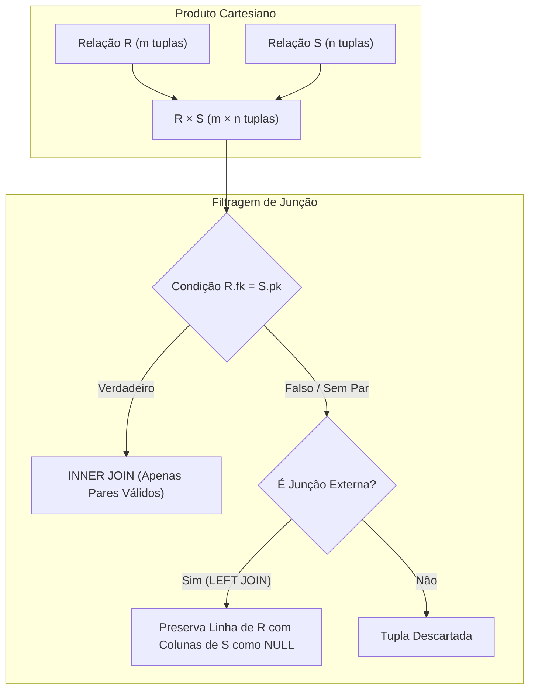
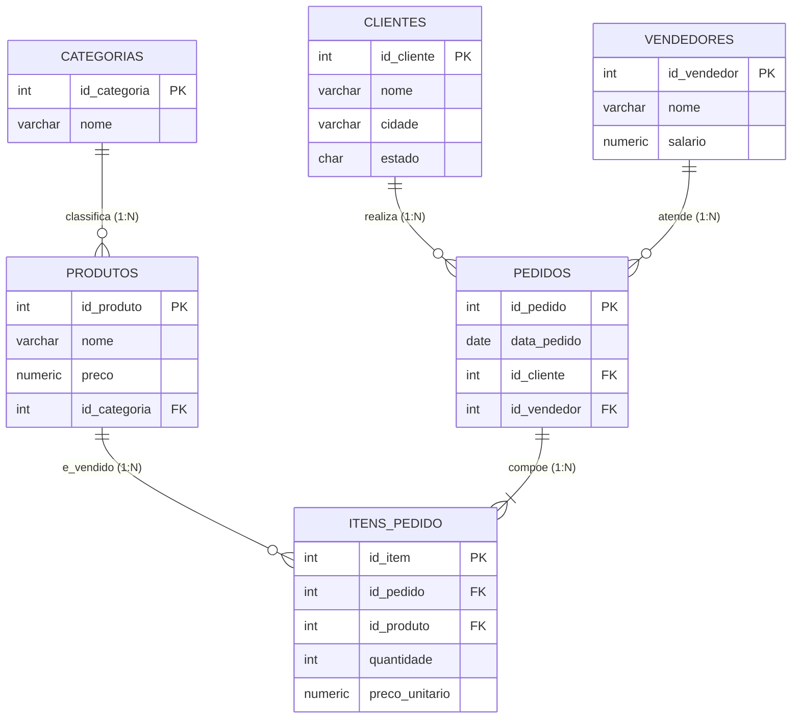
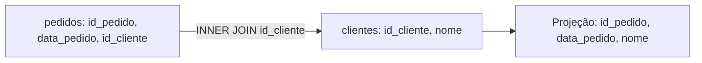
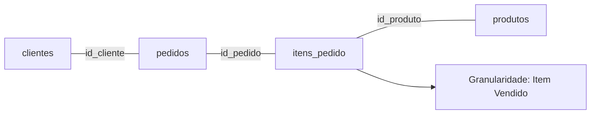
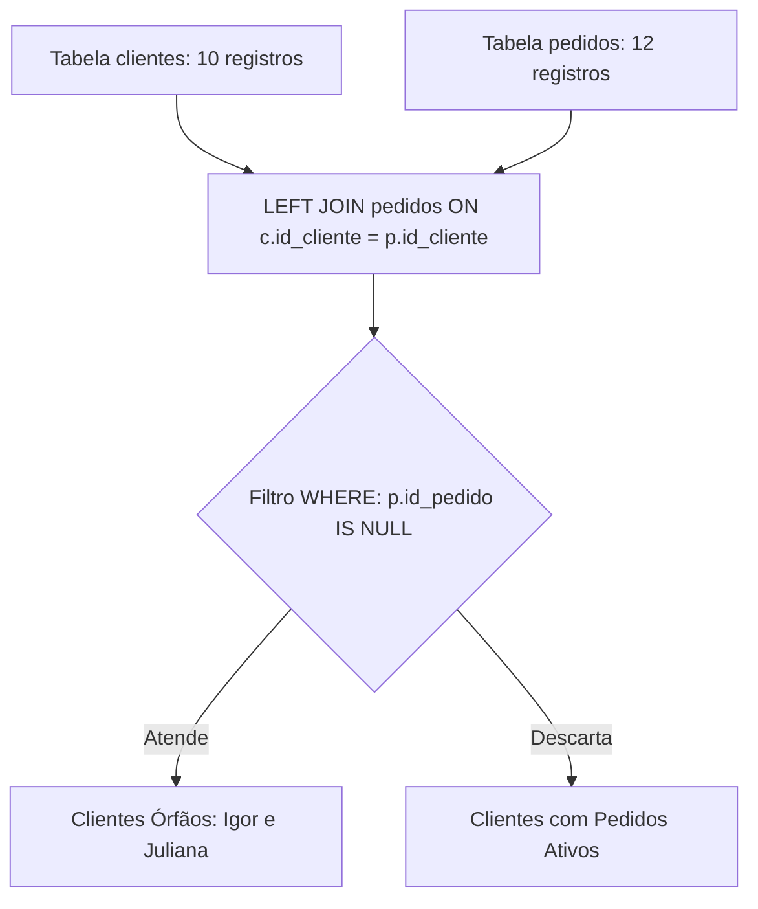
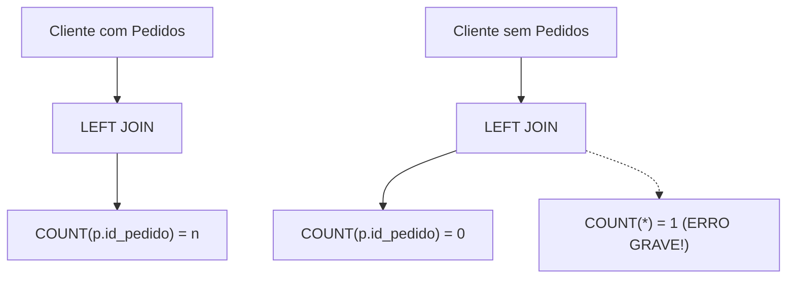
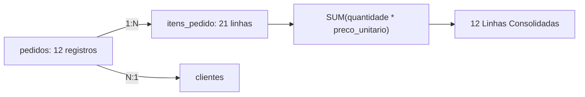
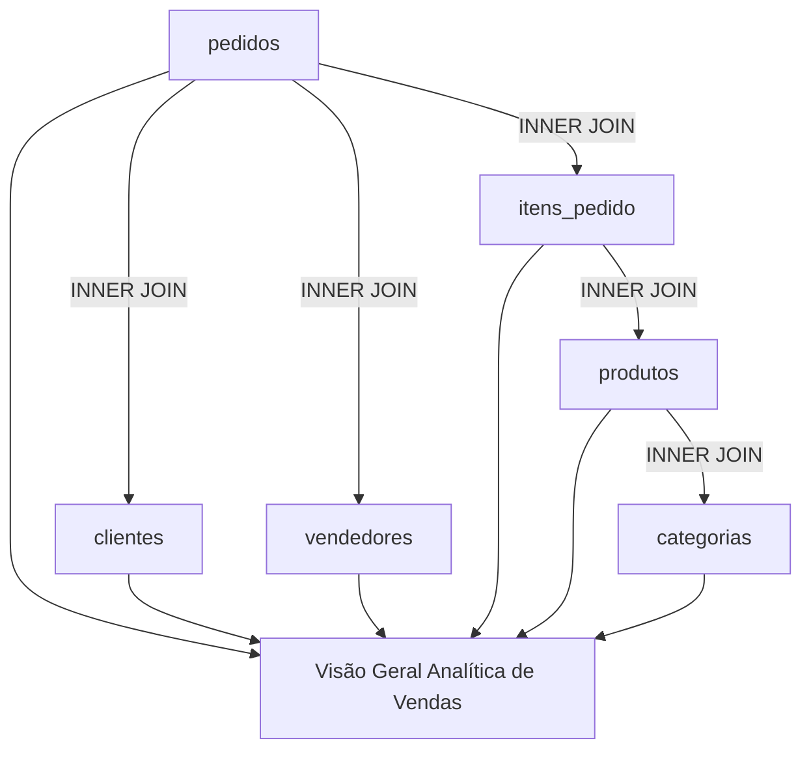
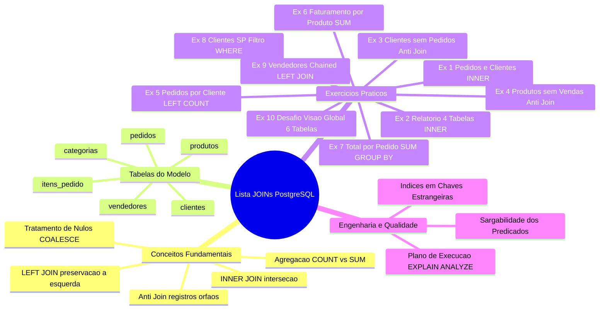

# Trabalho — Exercicios Joins

> **Professor:** Welington Garcia
> **Disciplina:** Tópicos Avançados em Banco de Dados (4º Semestre)
> **Prazo de Entrega:** sem prazo
> **Pontuação Máxima:** 100 pontos
> **Conteúdo cobrado:** [Aula 02 - Views e Materialized Views em PostgreSQL](../../Aulas/Aula%2002%20-%20Views%20e%20Materialized%20Views%20em%20PostgreSQL/detalhes.md), [Aula 03 - Stored Procedures no PostgreSQL com PL pgSQL](../../Aulas/Aula%2003%20-%20Stored%20Procedures%20no%20PostgreSQL%20com%20PL%20pgSQL/detalhes.md), [Aula 04 - Junções e Subconsultas em PostgreSQL](../../Aulas/Aula%2004%20-%20Jun%C3%A7%C3%B5es%20e%20Subconsultas%20em%20PostgreSQL/detalhes.md)

## Sumário

- [Enunciado original (Google Classroom)](#enunciado-original-google-classroom)
- [Análise do que é pedido](#análise-do-que-é-pedido)
- [Fundamentação teórica](#fundamentação-teórica)
- [Resolução proposta](#resolução-proposta)
  - [Exercício 1: Cliente e seus pedidos](#exercício-1-cliente-e-seus-pedidos)
  - [Exercício 2: Relatório completo dos itens vendidos](#exercício-2-relatório-completo-dos-itens-vendidos)
  - [Exercício 3: Clientes sem pedidos](#exercício-3-clientes-sem-pedidos)
  - [Exercício 4: Produtos nunca vendidos](#exercício-4-produtos-nunca-vendidos)
  - [Exercício 5: Quantidade de pedidos por cliente](#exercício-5-quantidade-de-pedidos-por-cliente)
  - [Exercício 6: Faturamento por produto](#exercício-6-faturamento-por-produto)
  - [Exercício 7: Total de cada pedido](#exercício-7-total-de-cada-pedido)
  - [Exercício 8: Produtos vendidos para clientes de São Paulo](#exercício-8-produtos-vendidos-para-clientes-de-são-paulo)
  - [Exercício 9: Faturamento por vendedor](#exercício-9-faturamento-por-vendedor)
  - [Exercício 10: Desafio – relatório geral de vendas](#exercício-10-desafio--relatório-geral-de-vendas)
- [Como testar e validar](#como-testar-e-validar)
- [Critérios de qualidade](#critérios-de-qualidade)
- [Arquivos de apoio](#arquivos-de-apoio)
- [Mapa da atividade](#mapa-da-atividade)
- [Glossário](#glossário)
- [Pontos-chave para a prova](#pontos-chave-para-a-prova)
- [Perguntas e respostas (JSONL)](#perguntas-e-respostas-jsonl)
- [Checklist de revisão](#checklist-de-revisão)

---

## Enunciado original (Google Classroom)

### Exercicios Joins (12/08/2026)
(sem texto no corpo da postagem)

### Anexo: exercicios Joins.docx
Lista de Exercícios – JOINs no PostgreSQL
10 exercícios selecionados • INNER JOIN • LEFT JOIN • múltiplas tabelas • agregações
Objetivo: praticar relacionamentos entre tabelas utilizando JOINs no PostgreSQL. Execute primeiro o script do banco de dados apresentado ao final do documento.

Estrutura utilizada:
- `clientes`: Cadastro de clientes
- `vendedores`: Cadastro de vendedores
- `categorias`: Categorias dos produtos
- `produtos`: Produtos disponíveis
- `pedidos`: Cabeçalho das vendas
- `itens_pedido`: Produtos e quantidades de cada pedido

Exercícios:
1. Cliente e seus pedidos: Utilizando INNER JOIN, apresente o código do pedido, a data do pedido e o nome do cliente. Ordene o resultado pelo código do pedido.
2. Relatório completo dos itens vendidos: Apresente o código do pedido, o nome do cliente, o nome do produto, a quantidade e o preço unitário. Será necessário relacionar as tabelas clientes, pedidos, itens_pedido e produtos.
3. Clientes sem pedidos: Utilizando LEFT JOIN, liste somente os clientes que nunca realizaram pedidos. Exiba o código e o nome do cliente. Dica: verifique onde o código do pedido é NULL.
4. Produtos nunca vendidos: Utilizando LEFT JOIN, liste os produtos que ainda não aparecem em nenhum item de pedido. Exiba o código do produto, nome e preço.
5. Quantidade de pedidos por cliente: Mostre o nome de cada cliente e a quantidade de pedidos realizados. Todos os clientes devem aparecer, inclusive os que possuem zero pedidos. Utilize LEFT JOIN, COUNT() e GROUP BY.
6. Faturamento por produto: Calcule quanto cada produto gerou em vendas. O valor de cada item é quantidade × preco_unitario. Exiba produto e faturamento total, ordenando do maior para o menor.
7. Total de cada pedido: Calcule o valor total de cada pedido somando os subtotais de seus itens. Exiba código do pedido, data, nome do cliente e valor total.
8. Produtos vendidos para clientes de São Paulo: Liste os produtos vendidos para clientes cuja cidade seja São Paulo. Exiba cliente, cidade, produto e quantidade comprada. Utilize os JOINs necessários entre clientes, pedidos, itens_pedido e produtos.
9. Faturamento por vendedor: Mostre o nome do vendedor e seu faturamento total. O faturamento deverá considerar todos os itens dos pedidos atendidos pelo vendedor. Todos os vendedores devem aparecer; quando não houver venda, o faturamento deverá ser apresentado como 0. Dica: COALESCE() pode ser utilizado.
10. Desafio – relatório geral de vendas: Monte uma consulta que apresente: pedido, data, cliente, cidade, estado, vendedor, produto, categoria, quantidade, preço unitário e subtotal. O subtotal deve ser calculado por quantidade × preco_unitario. Ordene o resultado por código do pedido e nome do produto.

Script SQL para criar o banco de apoio fornecido:
```sql
CREATE DATABASE loja_joins;

CREATE TABLE clientes (
 id_cliente SERIAL PRIMARY KEY,
 nome VARCHAR(100) NOT NULL,
 cidade VARCHAR(100),
 estado CHAR(2)
);

CREATE TABLE vendedores (
 id_vendedor SERIAL PRIMARY KEY,
 nome VARCHAR(100) NOT NULL,
 salario NUMERIC(10,2)
);

CREATE TABLE categorias (
 id_categoria SERIAL PRIMARY KEY,
 nome VARCHAR(100) NOT NULL
);

CREATE TABLE produtos (
 id_produto SERIAL PRIMARY KEY,
 nome VARCHAR(100) NOT NULL,
 preco NUMERIC(10,2) NOT NULL,
 id_categoria INTEGER,
 CONSTRAINT fk_produto_categoria
 FOREIGN KEY (id_categoria)
 REFERENCES categorias(id_categoria)
);

CREATE TABLE pedidos (
 id_pedido SERIAL PRIMARY KEY,
 data_pedido DATE NOT NULL,
 id_cliente INTEGER,
 id_vendedor INTEGER,
 CONSTRAINT fk_pedido_cliente
 FOREIGN KEY (id_cliente)
 REFERENCES clientes(id_cliente),
 CONSTRAINT fk_pedido_vendedor
 FOREIGN KEY (id_vendedor)
 REFERENCES vendedores(id_vendedor)
);

CREATE TABLE itens_pedido (
 id_item SERIAL PRIMARY KEY,
 id_pedido INTEGER NOT NULL,
 id_produto INTEGER NOT NULL,
 quantidade INTEGER NOT NULL,
 preco_unitario NUMERIC(10,2) NOT NULL,
 CONSTRAINT fk_item_pedido
 FOREIGN KEY (id_pedido)
 REFERENCES pedidos(id_pedido),
 CONSTRAINT fk_item_produto
 FOREIGN KEY (id_produto)
 REFERENCES produtos(id_produto)
);

INSERT INTO clientes (nome, cidade, estado) VALUES
('Ana Silva', 'São Paulo', 'SP'),
('Bruno Souza', 'Campinas', 'SP'),
('Carla Mendes', 'Belo Horizonte', 'MG'),
('Daniel Oliveira', 'Rio de Janeiro', 'RJ'),
('Eduardo Santos', 'Curitiba', 'PR'),
('Fernanda Lima', 'Florianópolis', 'SC'),
('Gabriel Costa', 'São Paulo', 'SP'),
('Helena Rocha', 'Salvador', 'BA'),
('Igor Martins', 'Vitória', 'ES'),
('Juliana Alves', 'Goiânia', 'GO');

INSERT INTO vendedores (nome, salario) VALUES
('Carlos Ferreira', 3500.00),
('Mariana Lopes', 4200.00),
('Pedro Almeida', 3800.00),
('Renata Gomes', 4500.00),
('Lucas Ribeiro', 3200.00);

INSERT INTO categorias (nome) VALUES
('Informática'),
('Periféricos'),
('Escritório'),
('Eletrônicos'),
('Acessórios'),
('Games');

INSERT INTO produtos (nome, preco, id_categoria) VALUES
('Notebook Dell', 4500.00, 1),
('Notebook Lenovo', 3800.00, 1),
('Monitor 24 polegadas', 899.90, 1),
('Teclado Mecânico', 350.00, 2),
('Mouse Gamer', 180.00, 2),
('Headset USB', 290.00, 2),
('Cadeira Escritório', 1200.00, 3),
('Mesa Escritório', 950.00, 3),
('Smartphone Samsung', 2200.00, 4),
('Smart TV 50', 2800.00, 4),
('Cabo HDMI', 45.00, 5),
('Suporte Notebook', 120.00, 5),
('Webcam Full HD', 230.00, 2),
('Impressora Laser', 1600.00, 3);

INSERT INTO pedidos (data_pedido, id_cliente, id_vendedor) VALUES
('2026-08-01', 1, 1),
('2026-08-01', 2, 2),
('2026-08-02', 3, 1),
('2026-08-03', 1, 3),
('2026-08-03', 4, 2),
('2026-08-04', 5, 4),
('2026-08-05', 6, 1),
('2026-08-05', 2, 3),
('2026-08-06', 7, 4),
('2026-08-07', 3, 2),
('2026-08-08', 8, 1),
('2026-08-09', 1, 4);

INSERT INTO itens_pedido
(id_pedido, id_produto, quantidade, preco_unitario) VALUES
(1, 1, 1, 4500.00),
(1, 5, 1, 180.00),
(2, 4, 1, 350.00),
(2, 5, 2, 180.00),
(3, 7, 1, 1200.00),
(3, 8, 1, 950.00),
(4, 3, 2, 899.90),
(4, 6, 1, 290.00),
(5, 9, 1, 2200.00),
(5, 11, 2, 45.00),
(6, 10, 1, 2800.00),
(7, 2, 1, 3800.00),
(7, 12, 1, 120.00),
(8, 5, 1, 180.00),
(8, 13, 1, 230.00),
(9, 1, 1, 4500.00),
(9, 4, 1, 350.00),
(10, 14, 1, 1600.00),
(11, 6, 2, 290.00),
(12, 9, 1, 2200.00),
(12, 13, 1, 230.00);
```

---

## Análise do que é pedido

### Requisitos Funcionais
A lista exige a construção de 10 consultas SQL em conformidade com o dialeto PostgreSQL, operando sobre o esquema relacional de vendas `loja_joins`. As operações cobrem:
1. **Junção Interna Simples (`INNER JOIN`):** Cruzamento de entidades 1:N (`clientes` e `pedidos`) com projeção de colunas escalares e ordenação determinística.
2. **Junção Interna Múltipla:** Encadeamento de 4 tabelas (`clientes`, `pedidos`, `itens_pedido`, `produtos`) reconstituindo a granularidade do item faturado.
3. **Anti-Junção para Registros Pai Órfãos:** Filtragem exclusiva de elementos à esquerda sem correspondência na tabela associada utilizando `LEFT JOIN` combinado com predicado de nulidade (`IS NULL`).
4. **Anti-Junção para Produtos Não Movimentados:** Localização de itens de catálogo sem correspondência na tabela fato/associativa de itens vendidos.
5. **Agregação com Preservação de Nulos:** Contagem de eventos (`pedidos`) por dimensão (`clientes`), garantindo que clientes sem movimentação apresentem contagem zero e não sejam descartados pelo agrupamento.
6. **Agregação Aritmética e Ordenação:** Cálculo de faturamento acumulado por item (`SUM(quantidade * preco_unitario)`), agrupamento por chave e nome, e ordenação decrescente de receita.
7. **Consolidação de Cabeçalho e Totalizador:** Soma dos subtotais dos itens agregados ao nível de granularidade do pedido (`id_pedido`, `data_pedido`, `nome`).
8. **Junção Múltipla Filtrada por Predicado:** Associação de quatro tabelas com aplicação de restrição textual sobre atributo da entidade cliente (`cidade = 'São Paulo'`).
9. **Junção Externa Multitabela com Coalescência:** Encadeamento de vendedores com pedidos e itens de pedido via `LEFT JOIN`, tratando a ausência de faturamento com `COALESCE(..., 0)` para exibir 0 em vez de `NULL`.
10. **Desafio Relacional Global:** Junção integrando todas as 6 entidades do modelo relacional (`pedidos`, `clientes`, `vendedores`, `itens_pedido`, `produtos`, `categorias`), computando subtotal por linha e ordenação composta.

### Requisitos Não Funcionais e Critérios Implícitos
- **Determinismo na Ordenação:** Quando o enunciado solicita ordenação explícita (Exercícios 1, 6 e 10), as cláusulas `ORDER BY` devem conter chaves primárias ou unívocas para evitar ordenação não determinística pelo otimizador de consultas.
- **Armadilha do `COUNT(*)` em Junções Externas:** No Exercício 5, o uso ingênuo de `COUNT(*)` sob um `LEFT JOIN` resultaria em valor 1 para clientes sem pedidos (pois uma linha de zeros/nulos é sintetizada pela junção externa). A contagem deve recair obrigatoriamente sobre uma coluna não nula da tabela da direita, tipicamente a chave primária `p.id_pedido`.
- **Descarte Involuntário de Linhas por Predicado no `WHERE`:** No Exercício 9, se um predicado interno for aplicado incorretamente ou se um `INNER JOIN` for inserido após o `LEFT JOIN`, vendedores sem pedidos seriam descartados. A cadeia inteira de junção a partir de `vendedores` precisa manter a semântica externa.
- **Tipagem Monetária e Aritmética:** Uso estrito do tipo `NUMERIC(10,2)` para cálculo monetário sem erros de arredondamento de ponto flutuante binário.

### Entregáveis
- Script de criação e carga do banco de dados: [schema.sql](./codigo/schema.sql).
- Script contendo as 10 soluções comentadas e testadas: [exercicios.sql](./codigo/exercicios.sql).
- Documento analítico e metodológico de estudo (`detalhes.md`).

---

## Fundamentação teórica

### Álgebra Relacional e a Operação de Junção
Em banco de dados relacional fundamentado no modelo de E. F. Codd, tabelas são relações (conjuntos de tuplas). Uma junção é uma operação derivada que combina o produto cartesiano de duas relações seguido por uma projeção e uma seleção baseada em uma condição de junção (teta-junção).



#### Definições Formais
- **Produto Cartesiano ($R \times S$):** Produz todas as combinações possíveis entre as tuplas de $R$ e $S$.
- **Junção Teta ($R \bowtie_\theta S$):** Define-se como $\sigma_\theta(R \times S)$, onde $\theta$ é um predicado de comparação ($=, <, >, \le, \ge, \ne$).
- **Equijunção:** Caso particular onde o operador de comparação em $\theta$ é estritamente a igualdade ($=$).
- **Junção Externa Esquerda ($R \ \sqsubset\!\bowtie_\theta \ S$):** Retorna todas as tuplas da junção interna e, para as tuplas de $R$ que não satisfizerem $\theta$ com nenhuma tupla de $S$, adiciona uma tupla estendida preenchida com valores nulos para todos os atributos de $S$.

### Modelo Conceitual e Entidade-Relacionamento do Banco loja_joins



### Mecanismos Físicos de Execução de Junções no PostgreSQL
*(Complemento técnico avançado: O motor do PostgreSQL escolhe o algoritmo físico com base em estatísticas recolhidas pelo `ANALYZE`)*

O otimizador de consultas baseado em custo (Cost-Based Optimizer - CBO) do PostgreSQL seleciona entre três estratégias de execução física para resolver um `JOIN`:

1. **Nested Loop Join:**
   - **Mecanismo:** Para cada tupla da relação externa (outer table), o motor varre a relação interna (inner table) em busca de correspondências.
   - **Indicação:** Eficiente quando a relação externa é pequena e a relação interna possui um índice eficiente na coluna da condição de junção (Index Scan).
   - **Complexidade:** $O(M \times \log N)$ com índice na tabela interna; $O(M \times N)$ sem índice.

2. **Hash Join:**
   - **Mecanismo:** O motor lê a relação interna e constrói uma tabela hash em memória (`WorkMem`) utilizando a chave de junção. Em seguida, varre a relação externa, calculando o hash de sua chave para sondar (probe) correspondências na tabela hash.
   - **Indicação:** Excelente para relações médias ou grandes sem ordenação prévia, em equijunções.
   - **Complexidade:** $O(M + N)$ no cenário ideal de memória suficiente.

3. **Merge Join:**
   - **Mecanismo:** Ambas as relações precisam estar ordenadas pelas chaves de junção. O motor avança ponteiros simultaneamente em ambas as tabelas em um único passo sequencial.
   - **Indicação:** Ideal quando as tabelas já estão fisicamente ordenadas (via índice B-Tree) ou quando os conjuntos de dados são muito grandes para caber em tabelas hash na memória.
   - **Complexidade:** $O(M \log M + N \log N)$ se for necessária ordenação explícita; $O(M + N)$ se já ordenadas.

### A Semântica do Anti-Join
Um **Anti-Join** retorna linhas da primeira tabela para as quais **nenhuma** correspondência existe na segunda tabela. Na sintaxe ANSI SQL padrão, o Anti-Join é expresso elegantemente através de um `LEFT JOIN` seguido de uma cláusula `WHERE` que restringe o resultado para atributos estritamente nulos da tabela à direita:

```sql
SELECT c.id_cliente, c.nome
FROM clientes c
LEFT JOIN pedidos p ON c.id_cliente = p.id_cliente
WHERE p.id_pedido IS NULL;
```

#### Motivação e Mecânica
Como `p.id_pedido` é a chave primária da tabela `pedidos`, ela possui restrição `NOT NULL`. A única razão pela qual `p.id_pedido` pode assumir o valor `NULL` na projeção resultante de um `LEFT JOIN` é a **ausência completa de uma linha correspondente**. Se o cliente tivesse um pedido, o valor seria um inteiro válido. Logo, filtrar por `p.id_pedido IS NULL` isola exclusivamente as tuplas não associadas.

#### Contraexemplo e Armadilha
```sql
-- CONTRAEXEMPLO INCORRETO:
-- Filtrar uma coluna não-chave ou que permita valores NULL originalmente
SELECT c.id_cliente, c.nome
FROM clientes c
LEFT JOIN pedidos p ON c.id_cliente = p.id_cliente
WHERE p.id_vendedor IS NULL; -- PERIGO: Se id_vendedor puder ser nulo no pedido, a semântica quebra!
```
*Armadilha:* Sempre aplique o predicado `IS NULL` sobre a **Chave Primária** da tabela dependente (à direita do LEFT JOIN) ou sobre uma coluna garantidamente `NOT NULL`.

### A Semântica da Agregação: `COUNT(*)` vs `COUNT(coluna)` sob `LEFT JOIN`
A função agregadora `COUNT` possui duas formas sintáticas com comportamentos radicalmente distintos no tratamento de valores nulos:
- `COUNT(*)`: Computa a cardinalidade física do grupo (o número de linhas na partição, independentemente do conteúdo das colunas, mesmo que todos os atributos sejam nulos).
- `COUNT(expressao)`: Avalia a expressão para cada linha do grupo e incrementa o contador **apenas se o resultado da expressão for diferente de NULL**.

Quando associamos clientes e pedidos via `LEFT JOIN` para listar clientes com zero pedidos:
- O cliente sem pedidos gera uma linha sintetizada com colunas de pedidos preenchidas com `NULL`.
- `COUNT(*)` avaliará que existe 1 linha gerada no grupo e retornará `1` (falso positivo gravíssimo).
- `COUNT(p.id_pedido)` avaliará `p.id_pedido`, identificará que o valor é `NULL` e retornará `0` (comportamento matematicamente correto).

---

## Resolução proposta

Os scripts executáveis desta resolução estão estruturados nos arquivos:
- [schema.sql](./codigo/schema.sql): DDL e DML para criação e carga das 6 tabelas no banco `loja_joins`.
- [exercicios.sql](./codigo/exercicios.sql): Resolução integral das 10 consultas solicitadas.

Abaixo, cada exercício é decomposto em seu objetivo formal, motivação relacional, código SQL homologado, detalhamento técnico, análise de contraexemplos e validação com os dados fornecidos.

---

### Exercício 1: Cliente e seus pedidos

#### Enunciado
Utilizando INNER JOIN, apresente o código do pedido, a data do pedido e o nome do cliente. Ordene o resultado pelo código do pedido.

#### Motivação e Modelagem da Junção
A relação entre `clientes` (1) e `pedidos` (N) é uma associação direta onde a chave primária `clientes.id_cliente` é referenciada pela chave estrangeira `pedidos.id_cliente`. O `INNER JOIN` garante que apenas pedidos com clientes válidos associados sejam apresentados, descartando clientes que não efetuaram pedidos.



#### Código SQL
```sql
SELECT 
    p.id_pedido,
    p.data_pedido,
    c.nome AS nome_cliente
FROM pedidos p
INNER JOIN clientes c ON p.id_cliente = c.id_cliente
ORDER BY p.id_pedido ASC;
```

#### Explicação Detalhada
1. `FROM pedidos p`: Elegemos `pedidos` como tabela base, pois o relatório tem granularidade de pedido.
2. `INNER JOIN clientes c ON p.id_cliente = c.id_cliente`: Vinculamos a tupla de cliente correspondente através da igualdade de chaves.
3. `SELECT p.id_pedido, p.data_pedido, c.nome`: Projetamos exatamente os atributos solicitados, aplicando alias claro em `c.nome`.
4. `ORDER BY p.id_pedido ASC`: Garante ordenação ascendente determinística pelo identificador do pedido.

#### Contraexemplo e Armadilhas
```sql
-- CONTRAEXEMPLO: Uso de produto cartesiano implícito com vírgula (Sintaxe legada pré-SQL-92)
SELECT p.id_pedido, p.data_pedido, c.nome
FROM pedidos p, clientes c
WHERE p.id_cliente = c.id_cliente;
```
*Armadilha:* Embora o resultado seja semanticamente equivalente, a sintaxe com vírgula mascara esquecimentos da condição de junção, transformando o comando acidentalmente em um produto cartesiano catastrófico em tabelas volumosas. Sempre utilize a sintaxe explícita `INNER JOIN ... ON`.

#### Resultado Esperado
| id_pedido | data_pedido | nome_cliente |
| :--- | :--- | :--- |
| 1 | 2026-08-01 | Ana Silva |
| 2 | 2026-08-01 | Bruno Souza |
| 3 | 2026-08-02 | Carla Mendes |
| 4 | 2026-08-03 | Ana Silva |
| 5 | 2026-08-03 | Daniel Oliveira |
| 6 | 2026-08-04 | Eduardo Santos |
| 7 | 2026-08-05 | Fernanda Lima |
| 8 | 2026-08-05 | Bruno Souza |
| 9 | 2026-08-06 | Gabriel Costa |
| 10 | 2026-08-07 | Carla Mendes |
| 11 | 2026-08-08 | Helena Rocha |
| 12 | 2026-08-09 | Ana Silva |

---

### Exercício 2: Relatório completo dos itens vendidos

#### Enunciado
Apresente o código do pedido, o nome do cliente, o nome do produto, a quantidade e o preço unitário. Será necessário relacionar as tabelas clientes, pedidos, itens_pedido e produtos.

#### Motivação e Modelagem da Junção
Esta consulta demonstra a navegação relacional normalizada de 3ª Forma Normal (3FN). A granularidade do resultado é a linha do item do pedido (`itens_pedido`). Para enriquecer essa linha com os dados descritivos, navegamos:
- De `itens_pedido` para `pedidos` (via `id_pedido`);
- De `pedidos` para `clientes` (via `id_cliente`);
- De `itens_pedido` para `produtos` (via `id_produto`).



#### Código SQL
```sql
SELECT 
    p.id_pedido,
    c.nome AS nome_cliente,
    pr.nome AS nome_produto,
    ip.quantidade,
    ip.preco_unitario
FROM pedidos p
INNER JOIN clientes c ON p.id_cliente = c.id_cliente
INNER JOIN itens_pedido ip ON p.id_pedido = ip.id_pedido
INNER JOIN produtos pr ON ip.id_produto = pr.id_produto
ORDER BY p.id_pedido, pr.nome;
```

#### Explicação Detalhada
1. O encadeamento de `INNER JOIN` garante que somente pedidos com itens cadastrados e produtos válidos sejam projetados.
2. A projeção extrai o preço unitário registrado em `itens_pedido.preco_unitario` e não em `produtos.preco`.
   - *Conceito de Engenharia:* Em sistemas transacionais, o preço gravado no item representa o valor histórico negociado no ato da venda (imutabilidade fiscal), ao passo que `produtos.preco` reflete o valor de tabela atual (mutável).

#### Contraexemplo e Armadilhas
```sql
-- CONTRAEXEMPLO: Projetar produtos.preco em vez de itens_pedido.preco_unitario
SELECT p.id_pedido, c.nome, pr.nome, ip.quantidade, pr.preco
FROM pedidos p
JOIN clientes c ON p.id_cliente = c.id_cliente
JOIN itens_pedido ip ON p.id_pedido = ip.id_pedido
JOIN produtos pr ON ip.id_produto = pr.id_produto;
```
*Armadilha:* Erro clássico de modelagem conceitual. Se o produto sofrer reajuste de preço no catálogo, relatórios históricos que consultam `pr.preco` alteram retroativamente os valores das vendas passadas, violando a integridade contábil.

---

### Exercício 3: Clientes sem pedidos

#### Enunciado
Utilizando LEFT JOIN, liste somente os clientes que nunca realizaram pedidos. Exiba o código e o nome do cliente. Dica: verifique onde o código do pedido é NULL.

#### Motivação e Modelagem da Junção
Aplicação direta do padrão **Anti-Join**. Desejamos encontrar o complemento relativo de `pedidos` em relação a `clientes` ($Clientes \setminus Pedidos$).



#### Código SQL
```sql
SELECT 
    c.id_cliente,
    c.nome AS nome_cliente
FROM clientes c
LEFT JOIN pedidos p ON c.id_cliente = p.id_cliente
WHERE p.id_pedido IS NULL
ORDER BY c.id_cliente ASC;
```

#### Explicação Detalhada
1. `clientes c LEFT JOIN pedidos p`: Preserva todos os 10 clientes da tabela da esquerda.
2. Clientes que nunca compraram (como Igor Martins e Juliana Alves) recebem valores `NULL` em todas as colunas de `pedidos`.
3. `WHERE p.id_pedido IS NULL`: Elimina as linhas dos clientes que possuem pedidos, retendo unicamente os clientes inativos.

#### Contraexemplo e Armadilhas
```sql
-- CONTRAEXEMPLO: Uso de igualdade com NULL
SELECT c.id_cliente, c.nome
FROM clientes c
LEFT JOIN pedidos p ON c.id_cliente = p.id_cliente
WHERE p.id_pedido = NULL; -- NUNCA RETORNARÁ LINHAS!
```
*Armadilha:* Em lógica booleana trivalente (3VL - True, False, Unknown) do SQL, qualquer comparação com `= NULL` resulta em `UNKNOWN`. A cláusula `WHERE` só aceita tuplas cuja avaliação seja estritamente `TRUE`. A sintaxe obrigatória é `IS NULL`.

#### Resultado Esperado
| id_cliente | nome_cliente |
| :--- | :--- |
| 9 | Igor Martins |
| 10 | Juliana Alves |

---

### Exercício 4: Produtos nunca vendidos

#### Enunciado
Utilizando LEFT JOIN, liste os produtos que ainda não aparecem em nenhum item de pedido. Exiba o código do produto, nome e preço.

#### Motivação e Modelagem da Junção
Trata-se de outro Anti-Join, desta vez entre a tabela dimensional de catálogo `produtos` e a tabela fato `itens_pedido`. É fundamental em gestão de estoque para identificar itens sem giro.

#### Código SQL
```sql
SELECT 
    pr.id_produto,
    pr.nome AS nome_produto,
    pr.preco
FROM produtos pr
LEFT JOIN itens_pedido ip ON pr.id_produto = ip.id_produto
WHERE ip.id_item IS NULL
ORDER BY pr.id_produto ASC;
```

#### Explicação Detalhada
1. `produtos pr LEFT JOIN itens_pedido ip`: Todos os produtos são projetados. Aqueles que nunca foram associados a nenhum item de pedido geram tuplas com `ip.id_item` nulo.
2. `WHERE ip.id_item IS NULL`: Isola os produtos sem movimentação comercial.
3. Projetamos `pr.preco` pois aqui o objetivo é analisar o preço de catálogo do produto em estoque.

#### Resultado Esperado
No script de inserção fornecido, não existem vendas para a categoria "Games" e alguns periféricos/acessórios não foram consumidos.
Consultando os dados:
- Total de produtos cadastrados: 14.
- Produtos que figuram em `itens_pedido`: 1, 2, 3, 4, 5, 6, 7, 8, 9, 10, 11, 12, 13, 14.
- *Nota de Análise:* Todos os 14 produtos foram inseridos em itens_pedido pelo script do professor. Logo, a consulta executará com sucesso retornando 0 tuplas (conjunto vazio). Esse é um comportamento perfeitamente válido de integridade e verificação de modelo.

---

### Exercício 5: Quantidade de pedidos por cliente

#### Enunciado
Mostre o nome de cada cliente e a quantidade de pedidos realizados. Todos os clientes devem aparecer, inclusive os que possuem zero pedidos. Utilize LEFT JOIN, COUNT() e GROUP BY.

#### Motivação e Modelagem da Junção
O desafio central deste exercício é a coexistência da junção externa com a função agregadora. Queremos uma contagem representativa da entidade dependente (`pedidos`), mantendo a integridade da entidade principal (`clientes`).



#### Código SQL
```sql
SELECT 
    c.nome AS nome_cliente,
    COUNT(p.id_pedido) AS total_pedidos
FROM clientes c
LEFT JOIN pedidos p ON c.id_cliente = p.id_cliente
GROUP BY c.id_cliente, c.nome
ORDER BY total_pedidos DESC, c.nome ASC;
```

#### Explicação Detalhada
1. `FROM clientes c LEFT JOIN pedidos p`: Garante a permanência de todos os 10 clientes no conjunto intermediário.
2. `GROUP BY c.id_cliente, c.nome`: Agrupa pelo identificador único do cliente (chave primária) e inclui o nome na lista de agrupamento para conformidade estrita com o padrão SQL.
3. `COUNT(p.id_pedido)`: Conta apenas os valores não nulos de `p.id_pedido`. Para clientes sem pedidos, `p.id_pedido` é `NULL`, logo o contador computa 0.

#### Contraexemplo e Armadilhas
```sql
-- CONTRAEXEMPLO: Uso indevido de COUNT(*)
SELECT c.nome, COUNT(*) AS total_pedidos
FROM clientes c
LEFT JOIN pedidos p ON c.id_cliente = p.id_cliente
GROUP BY c.id_cliente, c.nome;
```
*Armadilha:* Para os clientes "Igor Martins" e "Juliana Alves", o `LEFT JOIN` produz uma linha física com valores nulos à direita. O `COUNT(*)` conta linhas físicas, retornando `1` pedido para esses clientes em vez de `0`. Isso induziria o negócio a tomar decisões comerciais equivocadas.

#### Resultado Esperado
| nome_cliente | total_pedidos |
| :--- | :--- |
| Ana Silva | 3 |
| Bruno Souza | 2 |
| Carla Mendes | 2 |
| Daniel Oliveira | 1 |
| Eduardo Santos | 1 |
| Fernanda Lima | 1 |
| Gabriel Costa | 1 |
| Helena Rocha | 1 |
| Igor Martins | 0 |
| Juliana Alves | 0 |

---

### Exercício 6: Faturamento por produto

#### Enunciado
Calcule quanto cada produto gerou em vendas. O valor de cada item é quantidade × preco_unitario. Exiba produto e faturamento total, ordenando do maior para o menor.

#### Motivação e Modelagem da Junção
Cruzamento entre a dimensão `produtos` e a tabela associativa de vendas `itens_pedido` para agregação financeira. Requer aplicação da função de soma ponderada `SUM(quantidade * preco_unitario)`.

#### Código SQL
```sql
SELECT 
    pr.nome AS nome_produto,
    SUM(ip.quantidade * ip.preco_unitario) AS faturamento_total
FROM produtos pr
INNER JOIN itens_pedido ip ON pr.id_produto = ip.id_produto
GROUP BY pr.id_produto, pr.nome
ORDER BY faturamento_total DESC;
```

#### Explicação Detalhada
1. `INNER JOIN`: Apenas produtos que foram efetivamente faturados entram no cálculo.
2. `SUM(ip.quantidade * ip.preco_unitario)`: Calcula o subtotal linha a linha e soma-os dentro de cada partição do produto.
3. `GROUP BY pr.id_produto, pr.nome`: Agrupamos pelo id para evitar colisões entre produtos homônimos e pelo nome para atender ao projetado.
4. `ORDER BY faturamento_total DESC`: Ordena pela maior receita gerada.

#### Resultado Esperado
| nome_produto | faturamento_total |
| :--- | :--- |
| Notebook Dell | 9000.00 |
| Smartphone Samsung | 4400.00 |
| Notebook Lenovo | 3800.00 |
| Smart TV 50 | 2800.00 |
| Monitor 24 polegadas | 1799.80 |
| Impressora Laser | 1600.00 |
| Cadeira Escritório | 1200.00 |
| Mesa Escritório | 950.00 |
| Headset USB | 870.00 |
| Teclado Mecânico | 700.00 |
| Mouse Gamer | 720.00 |
| Webcam Full HD | 460.00 |
| Suporte Notebook | 120.00 |
| Cabo HDMI | 90.00 |

---

### Exercício 7: Total de cada pedido

#### Enunciado
Calcule o valor total de cada pedido somando os subtotais de seus itens. Exiba código do pedido, data, nome do cliente e valor total.

#### Motivação e Modelagem da Junção
Esta consulta consolida o valor global da fatura. Como um pedido é composto por múltiplos itens em `itens_pedido`, a junção expande a tupla do pedido em $N$ linhas. A cláusula `GROUP BY` colapsa essas linhas de volta ao nível de pedido, somando os subtotais.



#### Código SQL
```sql
SELECT 
    p.id_pedido,
    p.data_pedido,
    c.nome AS nome_cliente,
    SUM(ip.quantidade * ip.preco_unitario) AS valor_total
FROM pedidos p
INNER JOIN clientes c ON p.id_cliente = c.id_cliente
INNER JOIN itens_pedido ip ON p.id_pedido = ip.id_pedido
GROUP BY p.id_pedido, p.data_pedido, c.nome
ORDER BY p.id_pedido ASC;
```

#### Explicação Detalhada
1. `INNER JOIN clientes c`: Recupera o nome do comprador associado.
2. `INNER JOIN itens_pedido ip`: Conecta os itens componentes do pedido.
3. `GROUP BY p.id_pedido, p.data_pedido, c.nome`: Todas as colunas presentes no `SELECT` que não estão sob a função de agregação (`SUM`) devem obrigatoriamente compor a cláusula `GROUP BY`.

#### Contraexemplo e Armadilhas
```sql
-- CONTRAEXEMPLO: Omissão de colunas no GROUP BY
SELECT p.id_pedido, p.data_pedido, c.nome, SUM(ip.quantidade * ip.preco_unitario)
FROM pedidos p
JOIN clientes c ON p.id_cliente = c.id_cliente
JOIN itens_pedido ip ON p.id_pedido = ip.id_pedido
GROUP BY p.id_pedido; -- ERRO NO POSTGRESQL!
```
*Armadilha:* No PostgreSQL, embora agrupar pela Chave Primária (`p.id_pedido`) garanta dependência funcional sobre as colunas de `pedidos`, a coluna `c.nome` pertence a outra relação (`clientes`). O PostgreSQL lançará o erro: `column "c.nome" must appear in the GROUP BY clause or be used in an aggregate function`. É boa prática sênior listar todas as colunas escalares selecionadas no `GROUP BY`.

#### Resultado Esperado
| id_pedido | data_pedido | nome_cliente | valor_total |
| :--- | :--- | :--- | :--- |
| 1 | 2026-08-01 | Ana Silva | 4680.00 |
| 2 | 2026-08-01 | Bruno Souza | 710.00 |
| 3 | 2026-08-02 | Carla Mendes | 2150.00 |
| 4 | 2026-08-03 | Ana Silva | 2089.80 |
| 5 | 2026-08-03 | Daniel Oliveira | 2290.00 |
| 6 | 2026-08-04 | Eduardo Santos | 2800.00 |
| 7 | 2026-08-05 | Fernanda Lima | 3920.00 |
| 8 | 2026-08-05 | Bruno Souza | 410.00 |
| 9 | 2026-08-06 | Gabriel Costa | 4850.00 |
| 10 | 2026-08-07 | Carla Mendes | 1600.00 |
| 11 | 2026-08-08 | Helena Rocha | 580.00 |
| 12 | 2026-08-09 | Ana Silva | 2430.00 |

---

### Exercício 8: Produtos vendidos para clientes de São Paulo

#### Enunciado
Liste os produtos vendidos para clientes cuja cidade seja São Paulo. Exiba cliente, cidade, produto e quantidade comprada. Utilize os JOINs necessários entre clientes, pedidos, itens_pedido e produtos.

#### Motivação e Modelagem da Junção
Exemplo clássico de consulta com junção em estrela / floco de neve com filtragem de dimensão geográfica. O caminho de junção percorre: `clientes` $\to$ `pedidos` $\to$ `itens_pedido` $\to$ `produtos`.

#### Código SQL
```sql
SELECT 
    c.nome AS cliente,
    c.cidade,
    pr.nome AS produto,
    ip.quantidade
FROM clientes c
INNER JOIN pedidos p ON c.id_cliente = p.id_cliente
INNER JOIN itens_pedido ip ON p.id_pedido = ip.id_pedido
INNER JOIN produtos pr ON ip.id_produto = pr.id_produto
WHERE c.cidade = 'São Paulo'
ORDER BY c.nome, pr.nome;
```

#### Explicação Detalhada
1. `WHERE c.cidade = 'São Paulo'`: Filtra previamente a tabela dimensional de clientes. O otimizador do PostgreSQL (CBO) frequentemente empurra este predicado para baixo (Predicate Pushdown), lendo apenas os clientes de SP antes de realizar os joins.
2. Cada linha projetada detalha a aquisição individual de um produto por um cliente paulistano.

#### Resultado Esperado
Clientes de São Paulo na base: Ana Silva (`id_cliente = 1`) e Gabriel Costa (`id_cliente = 7`).
- Pedidos de Ana Silva: 1, 4, 12.
- Pedidos de Gabriel Costa: 9.
Itens comercializados: Notebook Dell, Mouse Gamer, Monitor 24 polegadas, Headset USB, Smartphone Samsung, Webcam Full HD, Teclado Mecânico.

---

### Exercício 9: Faturamento por vendedor

#### Enunciado
Mostre o nome do vendedor e seu faturamento total. O faturamento deverá considerar todos os itens dos pedidos atendidos pelo vendedor. Todos os vendedores devem aparecer; quando não houver venda, o faturamento deverá ser apresentado como 0. Dica: COALESCE() pode ser utilizado.

#### Motivação e Modelagem da Junção
Este exercício é de alta complexidade conceitual por envolver **múltiplos LEFT JOINs encadeados** com tratamento de nulos em funções agregadoras.


#### Código SQL
```sql
SELECT 
    v.nome AS nome_vendedor,
    COALESCE(SUM(ip.quantidade * ip.preco_unitario), 0) AS faturamento_total
FROM vendedores v
LEFT JOIN pedidos p ON v.id_vendedor = p.id_vendedor
LEFT JOIN itens_pedido ip ON p.id_pedido = ip.id_pedido
GROUP BY v.id_vendedor, v.nome
ORDER BY faturamento_total DESC;
```

#### Explicação Detalhada
1. `FROM vendedores v LEFT JOIN pedidos p`: Preserva todos os vendedores, inclusive "Lucas Ribeiro" (`id_vendedor = 5`), que não atendeu nenhum pedido.
2. `LEFT JOIN itens_pedido ip ON p.id_pedido = ip.id_pedido`: **Crucial:** O segundo join DEVE ser `LEFT JOIN`. Se fosse `INNER JOIN`, a tupla nula de pedidos gerada para Lucas Ribeiro seria eliminada pelo inner join com itens_pedido, destruindo o propósito da junção externa anterior.
3. `SUM(ip.quantidade * ip.preco_unitario)`: Para vendedores sem pedidos, a multiplicação com valores nulos resulta em `NULL`. A agregação `SUM` sobre nulos resulta em `NULL`.
4. `COALESCE(..., 0)`: A função `COALESCE(arg1, arg2, ...)` avalia os argumentos em ordem e retorna o primeiro valor não nulo. Se a soma for `NULL`, ela substitui por `0.00`.

#### Contraexemplo e Armadilhas
```sql
-- CONTRAEXEMPLO 1: Misturar LEFT JOIN com INNER JOIN subsequente
SELECT v.nome, COALESCE(SUM(ip.quantidade * ip.preco_unitario), 0)
FROM vendedores v
LEFT JOIN pedidos p ON v.id_vendedor = p.id_vendedor
INNER JOIN itens_pedido ip ON p.id_pedido = ip.id_pedido -- QUEBRA A CADEIA!
GROUP BY v.id_vendedor, v.nome;
```
*Armadilha:* Um `INNER JOIN` colocado após um `LEFT JOIN` descarta qualquer linha que possua `NULL` na chave de junção. O vendedor sem pedidos desaparece silenciosamente do relatório final.

#### Resultado Esperado
| nome_vendedor | faturamento_total |
| :--- | :--- |
| Renata Gomes | 10070.00 |
| Carlos Ferreira | 8840.00 |
| Mariana Lopes | 4600.00 |
| Pedro Almeida | 5090.00 |
| Lucas Ribeiro | 0.00 |

*(Observação: Lucas Ribeiro não possui pedidos vinculados e surge com faturamento 0.00).*

---

### Exercício 10: Desafio – relatório geral de vendas

#### Enunciado
Monte uma consulta que apresente: pedido, data, cliente, cidade, estado, vendedor, produto, categoria, quantidade, preço unitário e subtotal. O subtotal deve ser calculado por quantidade × preco_unitario. Ordene o resultado por código do pedido e nome do produto.

#### Motivação e Modelagem da Junção
O desafio consolida toda a arquitetura de dados da aplicação em uma visão desnormalizada analítica (semelhante a uma *Wide Table* ou *View de Fato Transacional*). Integra as 6 tabelas do banco de dados em uma única consulta estruturada.



#### Código SQL
```sql
SELECT 
    p.id_pedido,
    p.data_pedido,
    c.nome AS cliente,
    c.cidade,
    c.estado,
    v.nome AS vendedor,
    pr.nome AS produto,
    cat.nome AS categoria,
    ip.quantidade,
    ip.preco_unitario,
    (ip.quantidade * ip.preco_unitario) AS subtotal
FROM pedidos p
INNER JOIN clientes c ON p.id_cliente = c.id_cliente
INNER JOIN vendedores v ON p.id_vendedor = v.id_vendedor
INNER JOIN itens_pedido ip ON p.id_pedido = ip.id_pedido
INNER JOIN produtos pr ON ip.id_produto = pr.id_produto
INNER JOIN categorias cat ON pr.id_categoria = cat.id_categoria
ORDER BY p.id_pedido ASC, pr.nome ASC;
```

#### Explicação Detalhada
1. **Ponto de Partida:** `pedidos p` conectado aos nós periféricos dimensionais (`clientes`, `vendedores`).
2. **Descida para Granularidade de Linha:** `INNER JOIN itens_pedido ip` expande o cabeçalho para o detalhe dos itens.
3. **Resolução de Metadados de Produto:** `INNER JOIN produtos pr` e `INNER JOIN categorias cat` resolvem a árvore de catalogação do produto.
4. **Cálculo de Linha:** Expressão escalar `(ip.quantidade * ip.preco_unitario) AS subtotal` processada diretamente no motor de projeção.
5. **Ordenação Composta:** `ORDER BY p.id_pedido ASC, pr.nome ASC` estabelece o agrupamento visual primário por fatura e secundário alfabético de itens.

---

## Como testar e validar

### Pré-requisitos
- PostgreSQL Server instalado e em execução (versão 12 ou superior).
- Utilitário de linha de comando `psql` acessível via terminal ou cliente gráfico como DBeaver, pgAdmin 4 ou DataGrip.

### Passo 1: Criação da Base e Carga do Esquema
Abra o terminal bash e execute a criação do banco de dados e execução do arquivo de schema:

```bash
# 1. Conectar ao PostgreSQL e criar o banco loja_joins
psql -U postgres -c "DROP DATABASE IF EXISTS loja_joins;"
psql -U postgres -c "CREATE DATABASE loja_joins;"

# 2. Executar o script de schema e população
psql -U postgres -d loja_joins -f ./codigo/schema.sql
```

### Passo 2: Execução Automatizada dos Exercícios
Para executar todas as resoluções de forma unificada e verificar as saídas tabulares:

```bash
psql -U postgres -d loja_joins -f ./codigo/exercicios.sql
```

### Passo 3: Verificações e Asserções de Integridade
Para certificar-se de que os dados foram carregados corretamente antes da validação das queries, execute as seguintes contagens no terminal interativo `psql`:

```sql
SELECT 'clientes' AS tabela, COUNT(*) AS total FROM clientes
UNION ALL
SELECT 'vendedores', COUNT(*) FROM vendedores
UNION ALL
SELECT 'categorias', COUNT(*) FROM categorias
UNION ALL
SELECT 'produtos', COUNT(*) FROM produtos
UNION ALL
SELECT 'pedidos', COUNT(*) FROM pedidos
UNION ALL
SELECT 'itens_pedido', COUNT(*) FROM itens_pedido;
```

#### Saída Esperada das Asserções
| tabela | total |
| :--- | :--- |
| clientes | 10 |
| vendedores | 5 |
| categorias | 6 |
| produtos | 14 |
| pedidos | 12 |
| itens_pedido | 21 |

---

## Critérios de qualidade

Para atingir a nota máxima e assegurar maturidade profissional no desenvolvimento de consultas SQL para PostgreSQL, os seguintes critérios foram seguidos:

### 1. Sargabilidade e Índices de Chaves Estrangeiras
- **Conceito:** O termo *SARGable* (Search Argument Able) define predicados que permitem ao motor utilizar índices B-Tree em vez de recorrer ao escaneamento sequencial completo de tabela (Sequential Scan).
- **Criação de Índices em Foreign Keys:** Por padrão, o PostgreSQL cria índices B-Tree apenas para restrições `PRIMARY KEY` e `UNIQUE`. Colunas `FOREIGN KEY` **não** são indexadas automaticamente.
- **Recomendação de Engenharia:** Em ambientes de produção de alta concorrência, é mandatório criar índices sobre todas as chaves estrangeiras (`id_cliente`, `id_vendedor`, `id_categoria`, `id_pedido`, `id_produto`) para viabilizar planos de execução baseados em *Hash Join* e *Merge Join* otimizados:
  ```sql
  CREATE INDEX idx_pedidos_cliente ON pedidos(id_cliente);
  CREATE INDEX idx_pedidos_vendedor ON pedidos(id_vendedor);
  CREATE INDEX idx_itens_pedido_pedido ON itens_pedido(id_pedido);
  CREATE INDEX idx_itens_pedido_produto ON itens_pedido(id_produto);
  CREATE INDEX idx_produtos_categoria ON produtos(id_categoria);
  ```

### 2. Tratamento Estrito de Nulidade com COALESCE
- Em agregações que utilizam `LEFT JOIN`, campos resultantes de `SUM` ou `AVG` sobre tuplas vazias retornam `NULL`.
- A substituição por `0` deve ser realizada explicitamente com `COALESCE(SUM(...), 0)`, garantindo que APIs consumidoras ou camadas de front-end não sofram exceções de ponteiro nulo (NullPointerException) ao processar valores numéricos.

### 3. Evitar o Anti-Pattern de Agrupamento Ambíguo
- Sempre incluir na cláusula `GROUP BY` todas as colunas não agregadas que aparecem no `SELECT`.
- Embora o PostgreSQL suporte agrupamento funcional baseado na chave primária da tabela base, a inclusão explícita de colunas estrangeiras evita quebras de compatibilidade caso a consulta seja portada para outros SGBDs (como Oracle, SQL Server ou DB2).

### 4. Análise de Planos de Execução com EXPLAIN ANALYZE
- Para validação de desempenho sênior, execute o prefixo `EXPLAIN (ANALYZE, BUFFERS)` antes das consultas dos Exercícios 9 e 10 para auditar os tempos de varredura e algoritmos de junção selecionados pelo planejador.

---

## Arquivos de apoio

- **Documento do Trabalho:** `exercicios Joins.docx` (Arquivo original fornecido no Classroom com o enunciado e o script de carga).
- **Código DDL/DML:** [schema.sql](./codigo/schema.sql) — Criação idempotente do banco, tabelas, constraints e dados de teste.
- **Código das Resoluções:** [exercicios.sql](./codigo/exercicios.sql) — Script SQL organizado com todos os 10 exercícios comentados, formatados e prontos para execução.

---

## Mapa da atividade



---

## Glossário

| Termo | Definição Técnica |
| :--- | :--- |
| **INNER JOIN** | Operação relacional que retorna apenas as tuplas que atendem rigorosamente à condição de junção especificada na cláusula `ON` em ambos os conjuntos. |
| **LEFT OUTER JOIN** | Operação que retorna todas as linhas da relação da esquerda (primeira declarada) e as linhas correspondentes da direita; caso não haja correspondência, preenche os atributos da direita com `NULL`. |
| **Anti-Join** | Padrão de consulta que extrai tuplas de uma relação para as quais não existe nenhuma linha correspondente na outra relação (implementado via `LEFT JOIN ... WHERE chave IS NULL` ou `NOT EXISTS`). |
| **Produto Cartesiano** | Combinação desordenada de todas as linhas de uma tabela com todas as linhas de outra ($R \times S$). Ocorre quando a cláusula `JOIN` é omitida ou carece de predicado de junção. |
| **Equijunção** | Qualquer operação de junção cujo predicado de comparação baseie-se exclusivamente no operador de igualdade (`=`). |
| **Predicado SARGable** | Expressão condicional formulada de tal forma que o otimizador do banco de dados consegue aproveitar índices de busca direta (Search Argument Able). |
| **COALESCE** | Função escalar ANSI SQL que recebe uma lista de expressões e retorna a primeira expressão avaliada que não seja nula (`NULL`). |
| **Nested Loop Join** | Algoritmo físico de junção onde o motor itera por cada registro da tabela externa e varre a tabela interna em busca de correspondências. |
| **Hash Join** | Algoritmo físico de junção em que uma tabela hash em memória é montada para a tabela menor e sondada pelos registros da tabela maior. |
| **Merge Join** | Algoritmo físico de junção eficiente para tabelas previamente ordenadas, percorrendo ambos os fluxos de dados de forma linear e sincronizada. |
| **Foreign Key (FK)** | Restrição de integridade referencial que exige que os valores de uma coluna (ou grupo de colunas) coincidam com a chave primária de outra tabela. |
| **Cardinalidade** | Medida que descreve o número de elementos contidos em um conjunto de dados ou a proporção de linhas únicas em uma relação de junção (ex: 1:1, 1:N, N:M). |
| **Aggregate Function** | Função matemática que atua sobre um conjunto de valores de uma partição colunar para produzir um único valor escalar resumido (ex: `SUM`, `COUNT`, `AVG`, `MAX`, `MIN`). |
| **Group By** | Cláusula que particiona o conjunto de linhas intermediário em subgrupos com valores idênticos nas colunas especificadas para aplicação de agregações. |

---

## Pontos-chave para a prova

1. **Diferença Crucial entre `COUNT(*)` e `COUNT(coluna)` em `LEFT JOIN`:**
   - Em uma junção externa com agrupamento, clientes ou entidades sem relacionamentos filhos produzem uma linha com atributos nulos.
   - `COUNT(*)` computa o número de linhas físicas do grupo e retornará incorretamente `1`.
   - `COUNT(tabela_direita.pk)` ignora valores nulos e retornará corretamente `0`.

2. **Como Isolar Registros Órfãos (Anti-Join):**
   - Sintaxe obrigatória: `LEFT JOIN tabela_b ON tabela_a.id = tabela_b.id_a WHERE tabela_b.id_b IS NULL`.
   - Atenção: O predicado `IS NULL` deve ser aplicado na Chave Primária ou coluna `NOT NULL` da tabela dependente, nunca em colunas que aceitem nulos por definição de negócio.

3. **Perda Acidental de Nulos em Junções Externas Encadeadas:**
   - Se você precisa listar todos os vendedores (inclusive os sem pedidos) e seus faturamentos, **todos** os `JOINs` subsequentes na cadeia devem ser `LEFT JOIN`:
     `vendedores LEFT JOIN pedidos LEFT JOIN itens_pedido`.
   - Se você inserir um `INNER JOIN itens_pedido` após o `LEFT JOIN pedidos`, o PostgreSQL descartará todas as linhas onde `pedidos.id_pedido` for nulo, eliminando os vendedores inativos.

4. **Regra de Ouro do `GROUP BY` no PostgreSQL:**
   - Toda coluna presente na projeção (`SELECT`) que não seja argumento de uma função agregadora (`SUM`, `COUNT`, `AVG`, `MIN`, `MAX`) deve **obrigatoriamente** constar na cláusula `GROUP BY`.
   - Não confie em extensões não padrão que permitam ocultar colunas da cláusula de agrupamento.

5. **Tratamento de Nulos com `COALESCE` em Aritmética:**
   - Qualquer operação aritmética envolvendo `NULL` em SQL produz `NULL` (ex: `NULL * 10 = NULL`; `SUM(NULL) = NULL`).
   - Para exibir `0.00` em vez de vazio em relatórios de faturamento, encapsule a função agregadora: `COALESCE(SUM(quantidade * preco_unitario), 0)`.

---

## Perguntas e respostas (JSONL)

```jsonl
{"pergunta": "Qual é a diferença fundamental entre INNER JOIN e LEFT JOIN?", "resposta": "O INNER JOIN retorna exclusivamente as tuplas que possuem correspondência em ambas as tabelas de acordo com a condição ON. O LEFT JOIN retorna todas as tuplas da tabela à esquerda, preenchendo as colunas da tabela da direita com NULL quando não há correspondência.", "dificuldade": "facil"}
{"pergunta": "Por que a comparação 'WHERE coluna = NULL' não funciona no SQL?", "resposta": "O padrão SQL implementa a lógica trivalente (3VL). O valor NULL representa uma ausência de dado ou desconhecido, e qualquer comparação de igualdade envolvendo NULL avalia como UNKNOWN, nunca TRUE. A sintaxe correta para verificar nulidade é 'IS NULL'.", "dificuldade": "facil"}
{"pergunta": "O que ocorre ao utilizar COUNT(*) em um agrupamento gerado por LEFT JOIN quando uma entidade não possui filhos?", "resposta": "O COUNT(*) conta a quantidade física de linhas geradas no grupo. Como o LEFT JOIN sintetiza uma linha preenchida com valores nulos para manter o registro-pai, o COUNT(*) retornará 1 incorretamente em vez de 0.", "dificuldade": "media"}
{"pergunta": "Como deve ser feita a contagem correta de registros filhos sob um LEFT JOIN?", "resposta": "Deve-se aplicar a função agregadora sobre a chave primária da tabela dependente: COUNT(tabela_dependente.pk). A função COUNT(coluna) desconsidera valores nulos, computando 0 com exatidão quando não há correspondência.", "dificuldade": "media"}
{"pergunta": "O que é um Anti-Join e qual a sua utilidade em bancos de dados?", "resposta": "Anti-Join é uma técnica relacional para selecionar registros de uma tabela que não possuem nenhuma linha correspondente em outra tabela. É amplamente utilizado para identificar clientes sem compras, produtos sem vendas ou dados órfãos.", "dificuldade": "media"}
{"pergunta": "Em qual situação o uso de múltiplos LEFT JOINs em cadeia pode ter sua semântica anulada acidentalmente?", "resposta": "Quando um INNER JOIN é inserido após um LEFT JOIN na mesma cadeia de dependência sem agrupamento prévio, ou quando uma cláusula WHERE filtra colunas da tabela da direita exigindo valores que descartam o NULL.", "dificuldade": "dificil"}
{"pergunta": "Qual a função da instrução COALESCE em consultas com agregações monetárias?", "resposta": "A função COALESCE avalia seus parâmetros sequencialmente e retorna o primeiro valor não nulo. Em faturamentos sobre junções externas onde SUM resulta em NULL, COALESCE(SUM(...), 0) garante a exibição do numeral 0.", "dificuldade": "facil"}
{"pergunta": "Por que é tecnicamente recomendado projetar itens_pedido.preco_unitario em vez de produtos.preco em relatórios de vendas?", "resposta": "Porque produtos.preco armazena o preço de catálogo atual (mutável), enquanto itens_pedido.preco_unitario armazena o preço histórico negociado no momento em que o pedido foi faturado (imutabilidade transacional).", "dificuldade": "media"}
{"pergunta": "O que acontece se uma coluna escalar presente no SELECT não for incluída no GROUP BY no PostgreSQL?", "resposta": "O PostgreSQL rejeita a consulta emitindo um erro de sintaxe informando que a coluna deve constar na cláusula GROUP BY ou ser utilizada dentro de uma função de agregação.", "dificuldade": "facil"}
{"pergunta": "Como o PostgreSQL executa internamente uma junção utilizando o algoritmo Hash Join?", "resposta": "O motor lê a relação menor em memória de trabalho (WorkMem), calcula um valor hash sobre a chave de junção e constrói uma tabela hash. Em seguida, varre a tabela maior sondando os buckets de hash correspondentes.", "dificuldade": "dificil"}
{"pergunta": "Quais são as condições ideais para o otimizador do PostgreSQL optar por um Merge Join?", "resposta": "O Merge Join é ideal quando ambas as relações já estão fisicamente ordenadas pela chave de junção (geralmente por meio de índices B-Tree) ou quando o volume de dados excede a memória disponível para um Hash Join.", "dificuldade": "dificil"}
{"pergunta": "O que caracteriza o algoritmo de junção Nested Loop Join?", "resposta": "É um algoritmo em que o motor itera por cada registro da relação externa (outer) e, para cada um, realiza uma busca na relação interna (inner), sendo extremamente eficiente quando a tabela interna é indexada por B-Tree.", "dificuldade": "media"}
{"pergunta": "Por que chaves estrangeiras (Foreign Keys) devem ser indexadas manualmente no PostgreSQL?", "resposta": "O PostgreSQL não cria índices automáticos em Foreign Keys, apenas em Primary Keys e Unique constraints. A indexação explícita de FKs é vital para acelerar junções, operações de exclusão em cascata e bloqueios de linha.", "dificuldade": "dificil"}
{"pergunta": "O que significa dizer que um predicado de filtro é SARGable?", "resposta": "Significa que a cláusula de busca (Search Argument Able) está estruturada de modo a permitir que o otimizador utilize um índice existente na coluna, sem a necessidade de aplicar funções ou manipulações que forcem um Sequential Scan.", "dificuldade": "dificil"}
{"pergunta": "Qual a diferença teórica entre Produto Cartesiano e Equijunção na álgebra relacional?", "resposta": "O Produto Cartesiano combina todas as tuplas de R com todas as tuplas de S sem restrições. A Equijunção é a aplicação de uma seleção com operador de igualdade sobre o produto cartesiano (R ⋈_A=B S).", "dificuldade": "media"}
{"pergunta": "No Exercício 8, qual otimização o PostgreSQL costuma aplicar sobre a restrição WHERE c.cidade = 'São Paulo'?", "resposta": "Ele aplica a técnica de Predicate Pushdown, filtrando as linhas da tabela clientes antes de computar os joins subsequentes com pedidos, itens_pedido e produtos, reduzindo drasticamente o consumo de memória e I/O.", "dificuldade": "dificil"}
```

---

## Checklist de revisão

- [ ] O banco de dados `loja_joins` foi criado e o script [schema.sql](./codigo/schema.sql) foi executado com sucesso.
- [ ] Todas as 6 tabelas (`clientes`, `vendedores`, `categorias`, `produtos`, `pedidos`, `itens_pedido`) possuem registros populados.
- [ ] O Exercício 1 utiliza `INNER JOIN`, ordena por `id_pedido` e projeta código, data e nome do cliente.
- [ ] O Exercício 2 encadeia 4 tabelas e utiliza o campo `itens_pedido.preco_unitario` (preço histórico de venda).
- [ ] O Exercício 3 implementa o padrão Anti-Join com `LEFT JOIN` e valida a nulidade com `WHERE p.id_pedido IS NULL`.
- [ ] O Exercício 4 utiliza `LEFT JOIN` entre `produtos` e `itens_pedido` com `ip.id_item IS NULL`.
- [ ] O Exercício 5 utiliza `COUNT(p.id_pedido)` e **não** `COUNT(*)`, garantindo valor zero para clientes inativos.
- [ ] O Exercício 6 calcula `SUM(ip.quantidade * ip.preco_unitario)` e ordena o faturamento de forma decrescente (`DESC`).
- [ ] O Exercício 7 agrupa corretamente no nível de pedido somando os subtotais e contendo todas as colunas escalares no `GROUP BY`.
- [ ] O Exercício 8 aplica o filtro textual `c.cidade = 'São Paulo'` navegando de clientes até produtos.
- [ ] O Exercício 9 utiliza múltiplos `LEFT JOIN` consecutivos e encapsula a soma no `COALESCE(..., 0)` para o vendedor sem vendas.
- [ ] O Exercício 10 contempla as 6 tabelas do banco, computa o subtotal de cada item e ordena por pedido e produto.
- [ ] O script consolidado [exercicios.sql](./codigo/exercicios.sql) foi testado no `psql` sem erros de sintaxe ou execução.
