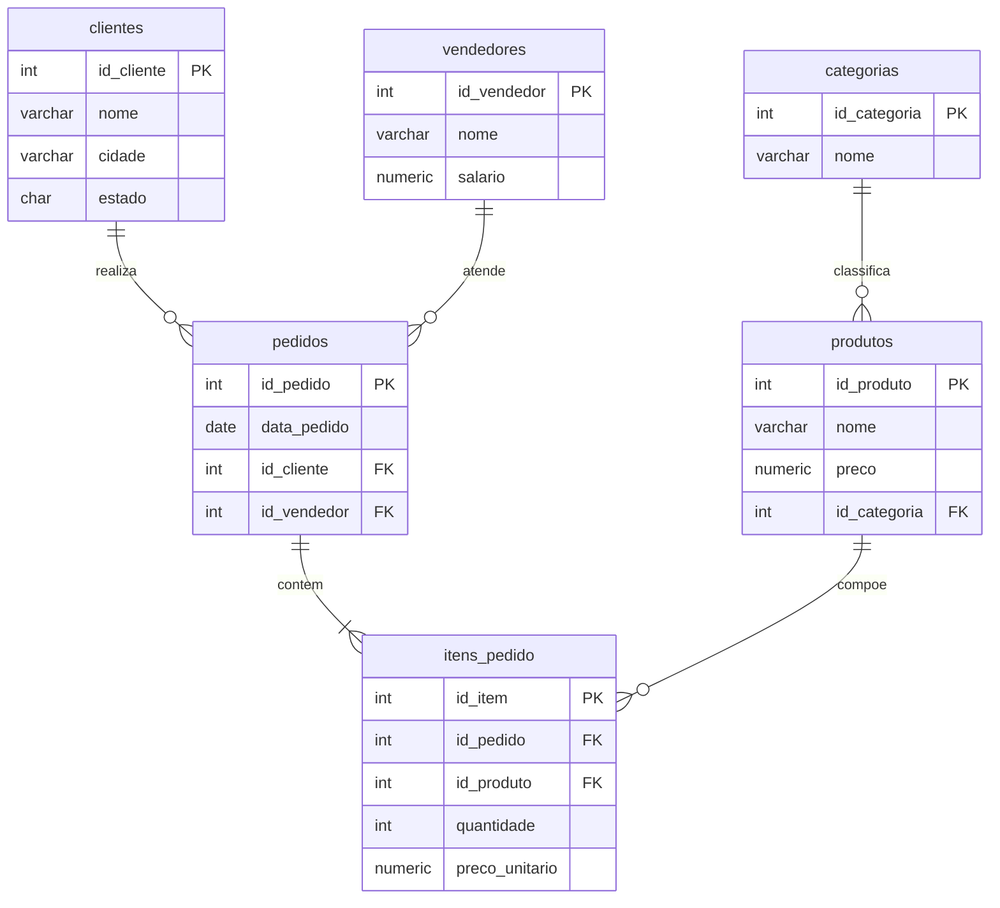
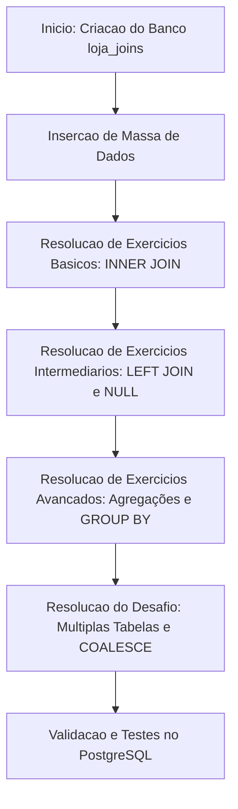

# Trabalho — Exercicios Joins

> **Professor:** Welington Garcia
> **Disciplina:** Tópicos Avançados em Banco de Dados (4º Semestre)
> **Prazo de Entrega:** sem prazo
> **Pontuação Máxima:** 100 pontos
> **Conteúdo cobrado:** [Aula 01 - Consultas Avançadas com Joins e Subselects](../../Aulas/Aula%2001%20-%20Consultas%20Avan%C3%A7adas%20com%20Joins%20e%20Subselects/detalhes.md)

## Sumário
1. [Enunciado original (Google Classroom)](#enunciado-original-google-classroom)
2. [Análise do que é pedido](#análise-do-que-é-pedido)
3. [Fundamentação teórica](#fundamentação-teórica)
4. [Resolução proposta](#resolução-proposta)
5. [Como testar e validar](#como-testar-e-validar)
6. [Critérios de qualidade](#critérios-de-qualidade)
7. [Arquivos de apoio](#arquivos-de-apoio)
8. [Mapa da atividade](#mapa-da-atividade)
9. [Glossário](#glossário)
10. [Pontos-chave para a prova](#pontos-chave-para-a-prova)
11. [Perguntas e respostas (JSONL)](#perguntas-e-respostas-jsonl)
12. [Checklist de revisão](#checklist-de-revisão)

## Enunciado original (Google Classroom)

### Exercicios Joins (12/08/2026)
Lista de Exercícios – JOINs no PostgreSQL. 10 exercícios selecionados • INNER JOIN • LEFT JOIN • múltiplas tabelas • agregações.
Objetivo: praticar relacionamentos entre tabelas utilizando JOINs no PostgreSQL. Execute primeiro o script do banco de dados apresentado ao final do documento.

Estrutura utilizada:
- `clientes`: Cadastro de clientes
- `vendedores`: Cadastro de vendedores
- `categorias`: Categorias dos produtos
- `produtos`: Produtos disponíveis
- `pedidos`: Cabeçalho das vendas
- `itens_pedido`: Produtos e quantidades de cada pedido

Exercícios:
1. Cliente e seus pedidos: Utilizando INNER JOIN, apresente o código do pedido, a data do pedido e o nome do cliente. Ordene o resultado pelo código do pedido.
2. Relatório completo dos itens vendidos: Apresente o código do pedido, o nome do cliente, o nome do produto, a quantidade e o preço unitário. Será necessário relacionar as tabelas clientes, pedidos, itens_pedido e produtos.
3. Clientes sem pedidos: Utilizando LEFT JOIN, liste somente os clientes que nunca realizaram pedidos. Exiba o código e o nome do cliente. Dica: verifique onde o código do pedido é NULL.
4. Produtos nunca vendidos: Utilizando LEFT JOIN, liste os produtos que ainda não aparecem em nenhum item de pedido. Exiba o código do produto, nome e preço.
5. Quantidade de pedidos por cliente: Mostre o nome de cada cliente e a quantidade de pedidos realizados. Todos os clientes devem aparecer, inclusive os que possuem zero pedidos. Utilize LEFT JOIN, COUNT() e GROUP BY.
6. Faturamento por produto: Calcule quanto cada produto gerou em vendas. O valor de cada item é quantidade × preco_unitario. Exiba produto e faturamento total, ordenando do maior para o menor.
7. Total de cada pedido: Calcule o valor total de cada pedido somando os subtotais de seus itens. Exiba código do pedido, data, nome do cliente e valor total.
8. Produtos vendidos para clientes de São Paulo: Liste os produtos vendidos para clientes cuja cidade seja São Paulo. Exiba cliente, cidade, produto e quantidade comprada. Utilize os JOINs necessários entre clientes, pedidos, itens_pedido e produtos.
9. Faturamento por vendedor: Mostre o nome do vendedor e seu faturamento total. O faturamento deverá considerar todos os itens dos pedidos atendidos pelo vendedor. Todos os vendedores devem aparecer; quando não houver venda, o faturamento deverá ser apresentado como 0. Dica: COALESCE() pode ser utilizado.
10. Desafio – relatório geral de vendas: Monte uma consulta que apresente: pedido, data, cliente, cidade, estado, vendedor, produto, categoria, quantidade, preço unitário e subtotal. O subtotal deve ser calculado por quantidade × preco_unitario. Ordene o resultado por código do pedido e nome do produto.

## Análise do que é pedido

O trabalho exige a implementação e execução de consultas SQL avançadas utilizando o SGBD PostgreSQL sobre um modelo relacional normalizado voltado para um cenário de e-commerce. 

### Requisitos Técnicos
- Utilização correta de diferentes tipos de `JOIN` (`INNER JOIN`, `LEFT JOIN`).
- Aplicação de funções de agregação (`COUNT`, `SUM`).
- Agrupamento de dados (`GROUP BY`) em conjunto com filtros em colunas agregadas ou condicionais.
- Manipulação de valores nulos utilizando funções como `COALESCE`.
- Cruzamento de múltiplas tabelas (até 6 tabelas no exercício de desafio) preservando a integridade referencial através das chaves estrangeiras (`FOREIGN KEY`).

### Entregáveis
1. Script de criação do banco de dados e inserção de massa de dados de teste (fornecido em `./codigo/schema_loja_joins.sql`).
2. Script com a resolução comentada de cada um dos 10 exercícios propostos (fornecido em `./codigo/resolucao_exercicios.sql`).

## Fundamentação teórica

As consultas relacionais em bancos de dados relacionais baseiam-se na Álgebra Relacional, especificamente nas operações de Produto Cartesiano, Seleção, Projeção e Junção (`Join`).

### Tipos de Junção
- **INNER JOIN**: Retorna apenas os registros que possuem correspondência em ambas as tabelas envolvidas na condição de junção.
- **LEFT JOIN**: Retorna todos os registros da tabela à esquerda e os registros correspondentes da tabela à direita. Caso não haja correspondência, as colunas da tabela à direita recebem valores nulos (`NULL`).
- **RIGHT JOIN**: Retorna todos os registros da tabela à direita e os correspondentes à esquerda.
- **FULL OUTER JOIN**: Retorna todos os registros quando há uma correspondência em qualquer uma das tabelas.



## Resolução proposta

Os códigos abaixo representam os artefatos desenvolvidos para atender à lista de exercícios.

### Script do Banco de Dados
O script completo de criação está disponível em [./codigo/schema_loja_joins.sql](./codigo/schema_loja_joins.sql).

### Consultas SQL Resolvidas
O arquivo contendo todas as consultas está disponível em [./codigo/resolucao_exercicios.sql](./codigo/resolucao_exercicios.sql). A seguir, detalha-se a lógica de cada exercício:

#### Exercício 1: Cliente e seus pedidos
```sql
SELECT p.id_pedido, p.data_pedido, c.nome AS nome_cliente
FROM pedidos p
INNER JOIN clientes c ON p.id_cliente = c.id_cliente
ORDER BY p.id_pedido;
```
*Explicação:* Realiza um `INNER JOIN` entre a tabela de pedidos e clientes para listar apenas os pedidos que possuem um cliente válido associado, ordenando pelo identificador do pedido.

#### Exercício 2: Relatório completo dos itens vendidos
```sql
SELECT 
    ip.id_pedido,
    c.nome AS nome_cliente,
    pr.nome AS nome_produto,
    ip.quantidade,
    ip.preco_unitario
FROM itens_pedido ip
INNER JOIN pedidos p ON ip.id_pedido = p.id_pedido
INNER JOIN clientes c ON p.id_cliente = c.id_cliente
INNER JOIN produtos pr ON ip.id_produto = pr.id_produto;
```
*Explicação:* Conecta quatro tabelas em cadeia para detalhar cada item comercializado, unindo itens aos pedidos, pedidos aos clientes e itens aos produtos.

#### Exercício 3: Clientes sem pedidos
```sql
SELECT c.id_cliente, c.nome
FROM clientes c
LEFT JOIN pedidos p ON c.id_cliente = p.id_cliente
WHERE p.id_pedido IS NULL;
```
*Explicação:* Utiliza `LEFT JOIN` para preservar todos os clientes e filtra na cláusula `WHERE` onde a chave do pedido é `NULL`, identificando quem nunca comprou.

#### Exercício 4: Produtos nunca vendidos
```sql
SELECT pr.id_produto, pr.nome, pr.preco
FROM produtos pr
LEFT JOIN itens_pedido ip ON pr.id_produto = ip.id_produto
WHERE ip.id_item IS NULL;
```
*Explicação:* Semelhante ao anterior, identifica produtos que não possuem ocorrência na tabela de itens de pedido.

#### Exercício 5: Quantidade de pedidos por cliente
```sql
SELECT 
    c.nome,
    COUNT(p.id_pedido) AS total_pedidos
FROM clientes c
LEFT JOIN pedidos p ON c.id_cliente = p.id_cliente
GROUP BY c.id_cliente, c.nome
ORDER BY total_pedidos DESC;
```
*Explicação:* Agrupa os pedidos por cliente utilizando `LEFT JOIN` para garantir que clientes com zero pedidos apareçam com contagem igual a zero.

#### Exercício 6: Faturamento por produto
```sql
SELECT 
    pr.nome AS produto,
    SUM(ip.quantidade * ip.preco_unitario) AS faturamento_total
FROM produtos pr
INNER JOIN itens_pedido ip ON pr.id_produto = ip.id_produto
GROUP BY pr.id_produto, pr.nome
ORDER BY faturamento_total DESC;
```
*Explicação:* Agrega o faturamento por produto multiplicando quantidade por preço unitário em cada item vendido, ordenando decrescentemente.

#### Exercício 7: Total de cada pedido
```sql
SELECT 
    p.id_pedido,
    p.data_pedido,
    c.nome AS nome_cliente,
    SUM(ip.quantidade * ip.preco_unitario) AS valor_total
FROM pedidos p
INNER JOIN clientes c ON p.id_cliente = c.id_cliente
INNER JOIN itens_pedido ip ON p.id_pedido = ip.id_pedido
GROUP BY p.id_pedido, p.data_pedido, c.nome
ORDER BY p.id_pedido;
```
*Explicação:* Agrupa por pedido somando os subtotais de seus respectivos itens.

#### Exercício 8: Produtos vendidos para clientes de São Paulo
```sql
SELECT 
    c.nome AS cliente,
    c.cidade,
    pr.nome AS produto,
    ip.quantidade
FROM clientes c
INNER JOIN pedidos p ON c.id_cliente = p.id_cliente
INNER JOIN itens_pedido ip ON p.id_pedido = ip.id_pedido
INNER JOIN produtos pr ON ip.id_produto = pr.id_produto
WHERE c.cidade = 'São Paulo';
```
*Explicação:* Aplica restrição de filtro (`WHERE c.cidade = 'São Paulo'`) sobre o encadeamento de junções entre cliente, pedido, item e produto.

#### Exercício 9: Faturamento por vendedor
```sql
SELECT 
    v.nome AS vendedor,
    COALESCE(SUM(ip.quantidade * ip.preco_unitario), 0) AS faturamento_total
FROM vendedores v
LEFT JOIN pedidos p ON v.id_vendedor = p.id_vendedor
LEFT JOIN itens_pedido ip ON p.id_pedido = ip.id_pedido
GROUP BY v.id_vendedor, v.nome
ORDER BY faturamento_total DESC;
```
*Explicação:* Utiliza `LEFT JOIN` a partir de vendedores e a função `COALESCE` para transformar valores nulos em `0` para vendedores sem vendas.

#### Exercício 10: Desafio – relatório geral de vendas
```sql
SELECT 
    p.id_pedido AS pedido,
    p.data_pedido AS data,
    c.nome AS cliente,
    c.cidade,
    c.estado,
    v.nome AS vendedor,
    pr.nome AS produto,
    cat.nome AS categoria,
    ip.quantidade,
    ip.preco_unitario,
    (ip.quantidade * ip.preco_unitario) AS subtotal
FROM pedidos p
INNER JOIN clientes c ON p.id_cliente = c.id_cliente
INNER JOIN vendedores v ON p.id_vendedor = v.id_vendedor
INNER JOIN itens_pedido ip ON p.id_pedido = ip.id_pedido
INNER JOIN produtos pr ON ip.id_produto = pr.id_produto
INNER JOIN categorias cat ON pr.id_categoria = cat.id_categoria
ORDER BY p.id_pedido, pr.nome;
```
*Explicação:* Encadeia todas as 6 tabelas do banco de dados, calculando o subtotal por item e ordenando estruturadamente.

## Como testar e validar

1. Abra o seu cliente PostgreSQL de preferência (pgAdmin, DBeaver, psql).
2. Execute o script de criação do banco e das tabelas encontrado em `./codigo/schema_loja_joins.sql`.
3. Certifique-se de que o banco `loja_joins` foi populado corretamente.
4. Execute individualmente ou em lote as consultas presentes em `./codigo/resolucao_exercicios.sql` e compare os resultados obtidos com os dados inseridos.

## Critérios de qualidade

- **Corretude Semântica:** Uso adequado de `INNER JOIN` para dados obrigatórios e `LEFT JOIN` para dados opcionais.
- **Integridade de Agrupamento:** Uso correto de colunas no `GROUP BY` conforme as exigências do padrão SQL.
- **Tratamento de Nulos:** Aplicação correta de `COALESCE` e filtragem com `IS NULL`.
- **Legibilidade:** Identadores bem nomeados, uso de aliases de tabelas consistentes e formatação adequada do código SQL.

## Arquivos de apoio

- [Schema SQL](./codigo/schema_loja_joins.sql)
- [Resolução dos Exercícios](./codigo/resolucao_exercicios.sql)
- [Aula 01 - Consultas Avançadas com Joins e Subselects](../../Aulas/Aula%2001%20-%20Consultas%20Avan%C3%A7adas%20com%20Joins%20e%20Subselects/detalhes.md)

## Mapa da atividade



## Glossário

| Termo | Definição |
| :--- | :--- |
| **JOIN** | Operação relacional que combina colunas de duas ou mais tabelas com base em uma coluna relacionada entre elas. |
| **INNER JOIN** | Retorna apenas as tuplas que possuem correspondência em ambas as tabelas relacionadas. |
| **LEFT JOIN** | Retorna todas as tuplas da tabela da esquerda e as correspondentes da direita, preenchendo com nulos as ausentes. |
| **GROUP BY** | Cláusula SQL utilizada para agrupar linhas que possuem os mesmos valores em linhas sumárias. |
| **COALESCE** | Função que retorna o primeiro argumento não nulo encontrado na lista de parâmetros. |
| **FOREIGN KEY** | Restrição de integridade que aponta para a chave primária de outra tabela, garantindo relacionamento válido. |

## Pontos-chave para a prova

1. A diferença fundamental entre `INNER JOIN` e `LEFT JOIN` na preservação de registros sem correspondência.
2. O cuidado ao aplicar filtros (`WHERE`) em colunas de tabelas à direita em um `LEFT JOIN`, o que pode anular o efeito do `LEFT JOIN` transformando-o em `INNER JOIN`.
3. A obrigatoriedade de incluir todas as colunas não agregadas da projeção na cláusula `GROUP BY`.
4. O uso da função `COALESCE` para tratar valores resultantes de agregações em coleções vazias.

## Perguntas e respostas (JSONL)

```jsonl
{"pergunta": "Qual operador de JOIN retorna todos os registros da tabela da esquerda, independentemente de haver correspondência na tabela da direita?", "resposta": "LEFT JOIN", "dificuldade": "facil"}
{"pergunta": "Qual função SQL é recomendada para substituir valores NULL por zero em uma agregação?", "resposta": "COALESCE", "dificuldade": "intermediario"}
{"pergunta": "O que ocorre se utilizarmos um filtro WHERE na tabela da direita após um LEFT JOIN comparando uma coluna a um valor fixo?", "resposta": "O LEFT JOIN pode se comportar como um INNER JOIN, eliminando os registros NULL.", "dificuldade": "dificil"}
{"pergunta": "Em consultas com funções de agregação como SUM ou COUNT, qual cláusula agrupa os resultados por categorias ou entidades?", "resposta": "GROUP BY", "dificuldade": "facil"}
{"pergunta": "Qual tipo de JOIN deve ser utilizado para listar apenas clientes que realizaram pedidos?", "resposta": "INNER JOIN", "dificuldade": "facil"}
{"pergunta": "Como identificar clientes que nunca fizeram pedidos utilizando LEFT JOIN?", "resposta": "Filtrando onde a chave primária da tabela de pedidos é NULL (WHERE pedido.id IS NULL).", "dificuldade": "intermediario"}
{"pergunta": "Qual é a finalidade da chave estrangeira (FOREIGN KEY) no modelo relacional?", "resposta": "Garantir a integridade referencial entre as tabelas.", "dificuldade": "facil"}
{"pergunta": "Se uma consulta agrupa por ID e Nome do cliente, quantas colunas devem estar presentes no GROUP BY?", "resposta": "Ambas as colunas (id e nome).", "dificuldade": "intermediario"}
{"pergunta": "Qual comando cria um novo banco de dados no PostgreSQL?", "resposta": "CREATE DATABASE nome_do_banco;", "dificuldade": "facil"}
{"pergunta": "No exercício 10, quantas tabelas foram relacionadas no total?", "resposta": "Seis tabelas (pedidos, clientes, vendedores, itens_pedido, produtos, categorias).", "dificuldade": "dificil"}
{"pergunta": "Qual operador lógico é utilizado implicitamente ao se declarar um INNER JOIN?", "resposta": "Igualdade (=) entre as chaves primária e estrangeira.", "dificuldade": "facil"}
{"pergunta": "O que a função COUNT(id_pedido) retorna quando um cliente possui zero pedidos em um LEFT JOIN?", "resposta": "Retorna o valor 0.", "dificuldade": "intermediario"}
{"pergunta": "Como é calculado o subtotal de um item de pedido nos exercícios?", "resposta": "Multiplicando a quantidade pelo preço unitário.", "dificuldade": "facil"}
{"pergunta": "Qual cláusula define a ordenação final de uma consulta SQL?", "resposta": "ORDER BY", "dificuldade": "facil"}
{"pergunta": "Por que o exercício 9 exige o uso de COALESCE?", "resposta": "Para garantir que vendedores sem vendas apareçam com faturamento igual a 0 em vez de NULL.", "dificuldade": "intermediario"}
```

## Checklist de revisão

- [ ] Script de criação do banco de dados executado com sucesso no PostgreSQL.
- [ ] Consultas de 1 a 10 testadas e validadas individualmente.
- [ ] Uso correto de `LEFT JOIN` e `INNER JOIN` verificado.
- [ ] Tratamento de valores nulos com `COALESCE` implementado nos exercícios pertinentes.
- [ ] Arquivos de código posicionados corretamente nos diretórios indicados.
