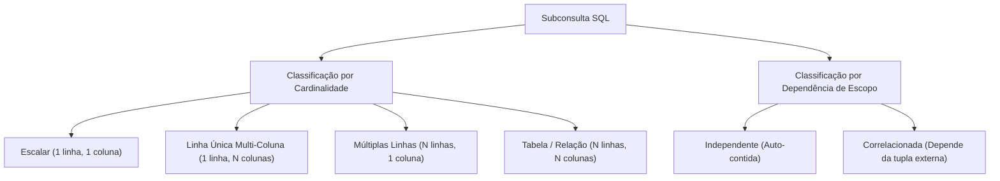
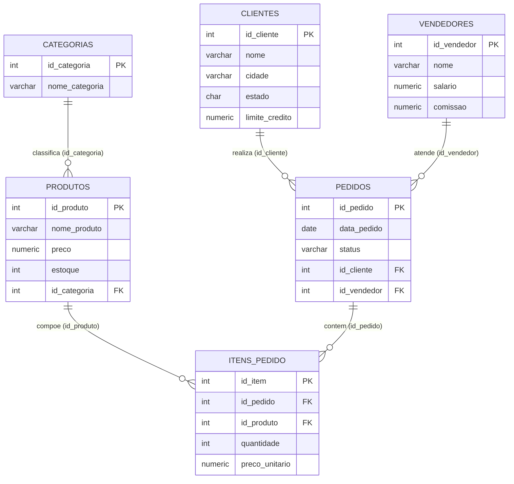

# Trabalho — Exercicios SubSelects - parte 01

> **Professor:** Welington Garcia
> **Disciplina:** Tópicos Avançados em Banco de Dados (4º Semestre)
> **Prazo de Entrega:** sem prazo
> **Pontuação Máxima:** 100 pontos
> **Conteúdo cobrado:** [Aula 02 - Views e Materialized Views em PostgreSQL](../../Aulas/Aula%2002%20-%20Views%20e%20Materialized%20Views%20em%20PostgreSQL/detalhes.md), [Aula 03 - Stored Procedures no PostgreSQL com PL pgSQL](../../Aulas/Aula%2003%20-%20Stored%20Procedures%20no%20PostgreSQL%20com%20PL%20pgSQL/detalhes.md), [Aula 04 - Junções e Subconsultas em PostgreSQL](../../Aulas/Aula%2004%20-%20Jun%C3%A7%C3%B5es%20e%20Subconsultas%20em%20PostgreSQL/detalhes.md)

## Sumário

- [Enunciado original (Google Classroom)](#enunciado-original-google-classroom)
- [Análise do que é pedido](#análise-do-que-é-pedido)
- [Fundamentação teórica](#fundamentação-teórica)
  - [Conceito e Taxonomia de Subconsultas](#conceito-e-taxonomia-de-subconsultas)
  - [Subconsultas Escalares](#subconsultas-escalares)
  - [Operadores de Pertencimento a Conjuntos: IN e NOT IN](#operadores-de-pertencimento-a-conjuntos-in-e-not-in)
  - [A Armadilha do Valor NULL no Operador NOT IN](#a-armadilha-do-valor-null-no-operador-not-in)
  - [Operadores de Existência: EXISTS e NOT EXISTS](#operadores-de-existência-exists-e-not-exists)
  - [Operadores Quantificados: ANY (SOME) e ALL](#operadores-quantificados-any-some-e-all)
  - [Subconsultas Correlacionadas vs Subconsultas Não-Correlacionadas](#subconsultas-correlacionadas-vs-subconsultas-não-correlacionadas)
  - [Modelo Entidade-Relacionamento do Sistema](#modelo-entidade-relacionamento-do-sistema)
  - [Ciclo de Execução e Otimização Interna no PostgreSQL](#ciclo-de-execução-e-otimização-interna-no-postgresql)
- [Resolução proposta](#resolução-proposta)
  - [Estrutura do Banco de Dados (schema.sql)](#estrutura-do-banco-de-dados-schemasql)
  - [Resolução Exaustiva dos 20 Exercícios (exercicios.sql)](#resolução-exaustiva-dos-20-exercícios-exerciciossql)
- [Como testar e validar](#como-testar-e-validar)
- [Critérios de qualidade](#critérios-de-qualidade)
- [Arquivos de apoio](#arquivos-de-apoio)
- [Mapa da atividade](#mapa-da-atividade)
- [Glossário](#glossário)
- [Pontos-chave para a prova](#pontos-chave-para-a-prova)
- [Perguntas e respostas (JSONL)](#perguntas-e-respostas-jsonl)
- [Checklist de revisão](#checklist-de-revisão)

## Enunciado original (Google Classroom)

O texto integral do arquivo anexado `Exercicios_Subselects_PostgreSQL.docx` disponibilizado pelo Prof. Welington Garcia apresenta o seguinte conteúdo:

```text
BANCO DE DADOS
Exercícios de Subselects com PostgreSQL
Banco de dados completo + lista de exercícios
Conteúdo correspondente aos conceitos apresentados até o slide 20 da aula de Subconsultas.
PostgreSQL • SQL • Subconsultas

1. Orientações
Este material foi elaborado para a prática de subconsultas (subselects) no PostgreSQL. O banco de dados representa um pequeno sistema comercial com clientes, vendedores, categorias, produtos, pedidos e itens de pedido.
Escopo dos exercícios — Foram considerados apenas os conteúdos até o slide 20 da aula: subconsultas escalares, subconsultas no SELECT e no WHERE, IN, NOT IN, EXISTS, NOT EXISTS, ANY, ALL e subconsultas correlacionadas. Tabelas derivadas no FROM não fazem parte desta lista.

2. Estrutura do banco
Tabela: clientes | Finalidade: Cadastro de clientes | Relacionamentos principais: Relaciona-se com pedidos por id_cliente.
Tabela: vendedores | Finalidade: Cadastro da equipe de vendas | Relacionamentos principais: Relaciona-se com pedidos por id_vendedor.
Tabela: categorias | Finalidade: Categorias dos produtos | Relacionamentos principais: Relaciona-se com produtos por id_categoria.
Tabela: produtos | Finalidade: Catálogo, preço e estoque | Relacionamentos principais: Relaciona-se com categorias e itens_pedido.
Tabela: pedidos | Finalidade: Cabeçalho das vendas | Relacionamentos principais: Relaciona-se cliente, vendedor e itens do pedido.
Tabela: itens_pedido | Finalidade: Produtos e quantidades de cada pedido | Relacionamentos principais: Relaciona pedidos e produtos.

3. SQL para criação e preenchimento do banco
Execute o script abaixo em um banco PostgreSQL vazio. Os comandos DROP TABLE IF EXISTS permitem repetir a preparação da base sem precisar excluir manualmente as tabelas. Recomenda-se executar o script completo antes de iniciar os exercícios.

DROP TABLE IF EXISTS itens_pedido;
DROP TABLE IF EXISTS pedidos;
DROP TABLE IF EXISTS produtos;
DROP TABLE IF EXISTS categorias;
DROP TABLE IF EXISTS clientes;
DROP TABLE IF EXISTS vendedores;

CREATE TABLE clientes (
 id_cliente SERIAL PRIMARY KEY,
 nome VARCHAR(100) NOT NULL,
 cidade VARCHAR(100),
 estado CHAR(2),
 limite_credito NUMERIC(10,2)
);

CREATE TABLE vendedores (
 id_vendedor SERIAL PRIMARY KEY,
 nome VARCHAR(100) NOT NULL,
 salario NUMERIC(10,2) NOT NULL,
 comissao NUMERIC(5,2)
);

CREATE TABLE categorias (
 id_categoria SERIAL PRIMARY KEY,
 nome_categoria VARCHAR(100) NOT NULL
);

CREATE TABLE produtos (
 id_produto SERIAL PRIMARY KEY,
 nome_produto VARCHAR(100) NOT NULL,
 preco NUMERIC(10,2) NOT NULL,
 estoque INTEGER NOT NULL,
 id_categoria INTEGER,
 CONSTRAINT fk_produto_categoria
 FOREIGN KEY (id_categoria)
 REFERENCES categorias(id_categoria)
);

CREATE TABLE pedidos (
 id_pedido SERIAL PRIMARY KEY,
 data_pedido DATE NOT NULL,
 status VARCHAR(30) NOT NULL,
 id_cliente INTEGER NOT NULL,
 id_vendedor INTEGER NOT NULL,
 CONSTRAINT fk_pedido_cliente
 FOREIGN KEY (id_cliente)
 REFERENCES clientes(id_cliente),
 CONSTRAINT fk_pedido_vendedor
 FOREIGN KEY (id_vendedor)
 REFERENCES vendedores(id_vendedor)
);

CREATE TABLE itens_pedido (
 id_item SERIAL PRIMARY KEY,
 id_pedido INTEGER NOT NULL,
 id_produto INTEGER NOT NULL,
 quantidade INTEGER NOT NULL,
 preco_unitario NUMERIC(10,2) NOT NULL,
 CONSTRAINT fk_item_pedido
 FOREIGN KEY (id_pedido)
 REFERENCES pedidos(id_pedido),
 CONSTRAINT fk_item_produto
 FOREIGN KEY (id_produto)
 REFERENCES produtos(id_produto)
);

INSERT INTO clientes (nome, cidade, estado, limite_credito) VALUES
('Ana Souza', 'Sao Paulo', 'SP', 5000.00),
('Bruno Lima', 'Campinas', 'SP', 3000.00),
('Carla Mendes', 'Curitiba', 'PR', 7000.00),
('Daniel Rocha', 'Londrina', 'PR', 2500.00),
('Eduarda Alves', 'Belo Horizonte', 'MG', 10000.00),
('Felipe Martins', 'Sao Jose do Rio Preto', 'SP', 4500.00),
('Gabriela Costa', 'Florianopolis', 'SC', 8000.00),
('Henrique Silva', 'Goiania', 'GO', 2000.00),
('Isabela Fernandes', 'Sao Paulo', 'SP', 6000.00),
('Joao Pereira', 'Curitiba', 'PR', 3500.00);

INSERT INTO vendedores (nome, salario, comissao) VALUES
('Carlos Almeida', 3500.00, 5.00),
('Fernanda Souza', 4200.00, 6.00),
('Ricardo Lima', 3000.00, 4.00),
('Juliana Martins', 5000.00, 7.00),
('Paulo Costa', 2800.00, 3.50);

INSERT INTO categorias (nome_categoria) VALUES
('Informatica'),
('Telefonia'),
('Escritorio'),
('Acessorios'),
('Games'),
('Eletronicos');

INSERT INTO produtos (nome_produto, preco, estoque, id_categoria) VALUES
('Notebook Dell', 4500.00, 10, 1),
('Notebook Lenovo', 3800.00, 8, 1),
('Mouse Logitech', 150.00, 50, 4),
('Teclado Mecanico', 350.00, 25, 4),
('Monitor 24 polegadas', 1200.00, 15, 1),
('Smartphone Samsung', 2500.00, 20, 2),
('Smartphone Motorola', 1800.00, 18, 2),
('Cadeira Gamer', 1300.00, 7, 3),
('Mesa Escritorio', 800.00, 12, 3),
('Headset Gamer', 450.00, 30, 5),
('PlayStation 5', 4200.00, 6, 5),
('Xbox Series X', 4000.00, 5, 5),
('Webcam Full HD', 300.00, 20, 4),
('Impressora Epson', 950.00, 9, 3),
('Smart TV 50', 2800.00, 11, 6),
('Caixa de Som Bluetooth', 500.00, 40, 6),
('Tablet Samsung', 1600.00, 14, 2),
('HD Externo 2TB', 600.00, 17, 1);

INSERT INTO pedidos (data_pedido, status, id_cliente, id_vendedor) VALUES
('2026-07-01', 'Pago', 1, 1),
('2026-07-03', 'Pago', 2, 2),
('2026-07-05', 'Enviado', 1, 1),
('2026-07-07', 'Pendente', 3, 3),
('2026-07-10', 'Pago', 5, 4),
('2026-07-11', 'Cancelado', 6, 2),
('2026-07-14', 'Pago', 7, 5),
('2026-07-16', 'Enviado', 3, 3),
('2026-07-20', 'Pago', 9, 4),
('2026-07-23', 'Pendente', 2, 2),
('2026-08-01', 'Pago', 1, 1),
('2026-08-02', 'Pago', 5, 4),
('2026-08-04', 'Enviado', 7, 5),
('2026-08-05', 'Pago', 9, 4),
('2026-08-07', 'Pendente', 10, 3);
-- Clientes 4 e 8 nao possuem pedidos.

INSERT INTO itens_pedido (id_pedido, id_produto, quantidade, preco_unitario) VALUES
(1, 1, 1, 4500.00),
(1, 3, 2, 150.00),
(2, 6, 1, 2500.00),
(2, 13, 1, 300.00),
(3, 5, 2, 1200.00),
(3, 4, 1, 350.00),
(4, 11, 1, 4200.00),
(5, 15, 1, 2800.00),
(5, 16, 2, 500.00),
(6, 8, 1, 1300.00),
(7, 12, 1, 4000.00),
(7, 10, 2, 450.00),
(8, 2, 1, 3800.00),
(8, 5, 1, 1200.00),
(9, 17, 2, 1600.00),
(10, 7, 1, 1800.00),
(11, 11, 1, 4200.00),
(11, 10, 1, 450.00),
(12, 1, 2, 4500.00),
(13, 15, 1, 2800.00),
(13, 16, 1, 500.00),
(14, 6, 1, 2500.00),
(14, 3, 1, 150.00),
(15, 9, 1, 800.00);

4. Exercícios de subselects
Resolva os exercícios utilizando subconsultas. Mesmo quando existir uma solução possível com JOIN, procure aplicar o recurso indicado na coluna “Conteúdo”, pois o objetivo é praticar os conceitos da aula.

1 | Subconsulta escalar | Liste todos os produtos cujo preço seja maior que a média de preços de todos os produtos. | A subconsulta deve retornar um único valor por meio de AVG().
2 | Subconsulta escalar | Liste o produto ou os produtos que possuem o maior preço cadastrado. | Utilize MAX(preco) dentro da subconsulta.
3 | Subconsulta escalar | Liste o produto ou os produtos que possuem o menor preço cadastrado. | Utilize MIN(preco) dentro da subconsulta.
4 | Subconsulta no SELECT | Exiba nome e preço de cada produto e, em uma terceira coluna, apresente a média geral de preços. | A subconsulta deve aparecer na lista de colunas do SELECT.
5 | Subconsulta no SELECT | Exiba nome, preço, média geral e a diferença entre o preço do produto e a média geral. | Calcule: preco - (subconsulta com AVG).
6 | IN | Liste os clientes que realizaram pelo menos um pedido. | A subconsulta deve retornar os id_cliente existentes em pedidos.
7 | IN | Liste os produtos que já apareceram em algum item de pedido. | Use id_produto da tabela itens_pedido.
8 | NOT IN | Liste os clientes que não aparecem em nenhum pedido utilizando NOT IN. | Neste banco, id_cliente em pedidos é NOT NULL; portanto o exercício é seguro para demonstrar NOT IN.
9 | NOT EXISTS | Reescreva o exercício anterior utilizando NOT EXISTS. | Correlacione pedidos.id_cliente com clientes.id_cliente.
10 | EXISTS | Liste os vendedores que possuem pelo menos um pedido registrado. | Use EXISTS verificando pedidos do vendedor da linha externa.
11 | NOT EXISTS | Liste os produtos que nunca foram vendidos. | Verifique a ausência do produto em itens_pedido.
12 | IN com mais de uma tabela | Liste os clientes que compraram o produto "Notebook Dell". | A subconsulta pode localizar os pedidos que possuem o produto e, a partir deles, identificar os clientes.
13 | ANY | Liste os produtos cujo preço seja maior que o preço de pelo menos um produto da categoria Telefonia. | Utilize > ANY (subconsulta).
14 | ALL | Liste os produtos cujo preço seja maior que o preço de todos os produtos da categoria Acessórios. | Utilize > ALL (subconsulta).
15 | ANY | Liste os vendedores cujo salário seja maior que pelo menos um salário existente entre os demais vendedores. | Use > ANY; observe que o resultado expressa "maior que pelo menos um".
16 | ALL | Liste o vendedor ou os vendedores cujo salário seja maior ou igual a todos os salários cadastrados. | Uma possibilidade é utilizar >= ALL.
17 | Subconsulta correlacionada | Liste os produtos cujo preço seja maior que a média de preços de sua própria categoria. | A subconsulta deve usar o id_categoria do produto da consulta externa.
18 | Subconsulta correlacionada | Liste os produtos cujo estoque seja maior que a média de estoque de sua própria categoria. | Compare p.estoque com AVG() da mesma categoria.
19 | Subconsulta correlacionada | Liste os clientes cujo limite de crédito seja maior que a média de limite de crédito dos clientes do mesmo estado. | A consulta interna deve depender do estado da linha externa.
20 | Subconsulta correlacionada | Liste, para cada categoria, o produto ou os produtos de maior preço daquela categoria. | Compare o preço externo com MAX(preco) calculado para a categoria correspondente.

5. Observações para a resolução
- Evite utilizar SELECT * quando somente algumas colunas forem necessárias.
- Observe se a subconsulta precisa retornar um único valor ou várias linhas.
- Em comparações com várias linhas, escolha conscientemente entre IN, EXISTS, ANY e ALL.
- Em subconsultas correlacionadas, identifique qual coluna da consulta externa é necessária dentro da consulta interna.
- Teste primeiro a subconsulta isoladamente sempre que isso ajudar a compreender o resultado retornado.
```

## Análise do que é pedido

### Requisitos Explícitos
1. **Escopo Delimitado:** Construção de soluções puramente em SQL (PostgreSQL) baseando-se no conteúdo até o slide 20 da disciplina de Subconsultas. É explicitamente vedado o uso de tabelas derivadas na cláusula `FROM` (inline views).
2. **Fidelidade aos Operadores Pedidos:** Cada exercício especifica um mecanismo exato (Subconsulta Escalar, Subconsulta no `SELECT`, `IN`, `NOT IN`, `EXISTS`, `NOT EXISTS`, `ANY`, `ALL` e Subconsultas Correlacionadas). Mesmo que seja trivial resolver com `INNER JOIN`, `LEFT JOIN` ou funções de janela (`OVER (PARTITION BY ...)`), o aluno deve aplicar o operador exigido na coluna "Conteúdo".
3. **Estrutura Relacional Pré-Definida:** O schema é composto por 6 tabelas (`clientes`, `vendedores`, `categorias`, `produtos`, `pedidos`, `itens_pedido`) com constraints de chave primária e estrangeira rigorosamente modeladas.

### Requisitos Implícitos e Critérios de Engenharia
1. **Tratamento de Projeção:** Projeção cirúrgica de colunas. A orientação desencoraja o uso indiscriminado de `SELECT *`, exigindo que as colunas retornadas façam sentido contextual para a pergunta formulada.
2. **Semântica Lógica Tri-Valorada (Three-Valued Logic):** Compreensão do impacto de valores `NULL` ao utilizar `NOT IN` versus `NOT EXISTS`. Embora o campo `pedidos.id_cliente` possua restrição `NOT NULL`, a engenharia de dados profissional exige a demonstração formal de por que `NOT IN` falharia caso houvesse nulos e como `NOT EXISTS` se comporta.
3. **Desempenho e Reescrita pelo Otimizador:** Em bancos de dados relacionais avançados, o PostgreSQL Optimizer (Planner) pode transformar subconsultas independentes ou correlacionadas em operações de `Hash Semi-Join` ou `Hash Anti-Join`. A resolução deve contemplar o raciocínio declarativo correto para que o planejador gere planos eficientes.

### Entregáveis
- **Código DDL/DML:** Arquivo [`schema.sql`](./codigo/schema.sql) contendo a recriação limpa e a carga de dados.
- **Código de Consultas:** Arquivo [`exercicios.sql`](./codigo/exercicios.sql) contendo as 20 consultas perfeitamente comentadas e estruturadas.
- **Documento Teórico e Prático:** Este relatório técnico (`detalhes.md`) com fundamentação conceitual, modelagem visual, passo a passo, testes de asserção e material de preparação para exames.

## Fundamentação teórica

### Conceito e Taxonomia de Subconsultas

Uma subconsulta (também denominada *subquery*, *subselect* ou consulta aninhada) é uma instrução `SELECT` embutida dentro de outra instrução SQL externa (`SELECT`, `INSERT`, `UPDATE` ou `DELETE`). Do ponto de vista da teoria relacional, as subconsultas permitem computar conjuntos intermediários ou valores dinâmicos em tempo de execução para alimentar as cláusulas de projeção (`SELECT`), filtragem (`WHERE`, `HAVING`) ou junção.

A taxonomia de subconsultas é dividida conforme duas dimensões ortogonais:



1. **Cardinalidade do Retorno:**
   - **Escalar:** Retorna exatamente um único valor atômico (uma linha e uma coluna). Pode ser utilizada em qualquer lugar onde uma constante ou literal é aceito.
   - **Coluna (Lista de Valores):** Retorna uma coluna contendo zero, uma ou mais linhas. Utilizada com operadores de pertinência (`IN`, `NOT IN`) e operadores de quantificação (`ANY`, `ALL`).
   - **Tabela/Linha:** Retorna matriz de dados (múltiplas colunas e linhas).

2. **Dependência de Escopo:**
   - **Não-correlacionada (Independente):** Não faz qualquer referência a colunas da consulta externa. É computada conceitualmente apenas uma vez.
   - **Correlacionada:** Faz referência a uma ou mais colunas da consulta externa. Conceitualmente, a subconsulta é reavaliada para cada linha processada pela consulta externa.

### Subconsultas Escalares

Uma subconsulta escalar deve obrigatoriamente produzir no máximo uma linha e uma coluna. Caso a subconsulta retorne zero linhas, o SQL padrão e o PostgreSQL a avaliam como `NULL`. Se retornar mais de uma linha em um contexto escalar, o SGBD abortará a execução com erro de runtime (`ERROR: more than one row returned by a subquery used as an expression`).

*Exemplo clássico de uso no WHERE:*
```sql
SELECT nome_produto, preco
FROM produtos
WHERE preco > (SELECT AVG(preco) FROM produtos);
```

*Exemplo de uso na projeção (SELECT):*
```sql
SELECT nome_produto, preco, (SELECT AVG(preco) FROM produtos) AS media_geral
FROM produtos;
```

### Operadores de Pertencimento a Conjuntos: IN e NOT IN

O operador `IN` compara uma expressão com um conjunto de valores retornado por uma subconsulta unicolunar:

$$\text{expressão} \in S \iff \exists s \in S \mid \text{expressão} = s$$

Se o elemento for encontrado, a condição avalia para `TRUE`. Se o conjunto estiver vazio, avalia para `FALSE`.

O operador `NOT IN` é a negação booleana de `IN`:

$$\text{expressão} \notin S \iff \forall s \in S \mid \text{expressão} \neq s$$

### A Armadilha do Valor NULL no Operador NOT IN

*(Complemento com conhecimento geral de engenharia de software e teoria de banco de dados relacional).*

O modelo relacional de Codd opera sobre a lógica tri-valorada (*Three-Valued Logic - 3VL*), onde os valores de verdade possíveis são `TRUE`, `FALSE` e `UNKNOWN` (resultante de operações que envolvem `NULL`).

Considere a expressão:
```sql
v NOT IN (val1, val2, ..., valN)
```
Por definição da álgebra SQL, isso equivale a:
```sql
(v <> val1) AND (v <> val2) AND ... AND (v <> valN)
```
Se **qualquer** valor retornado pela subconsulta for `NULL`, digamos `val2 = NULL`, a comparação `v <> NULL` resulta em `UNKNOWN`. Pelas regras da lógica tri-valorada:
- `TRUE AND UNKNOWN` resulta em `UNKNOWN`.
- `FALSE AND UNKNOWN` resulta em `FALSE`.

Portanto, a expressão inteira jamais poderá ser avaliada como `TRUE`! Ela será sempre `FALSE` ou `UNKNOWN`. Como as cláusulas `WHERE` apenas retêm linhas cuja condição avalia estritamente como `TRUE`, o resultado de uma consulta com `NOT IN` contendo um único `NULL` na subconsulta será **sempre um conjunto vazio** (zero linhas retornadas), causando bugs graves em produção.

No banco fornecido pelo professor, a coluna `pedidos.id_cliente` possui a constraint `NOT NULL`, o que torna a operação segura. Contudo, em tabelas onde a chave estrangeira aceita nulos, deve-se obrigatoriamente filtrar `WHERE coluna IS NOT NULL` na subconsulta ou optar por `NOT EXISTS`.

### Operadores de Existência: EXISTS e NOT EXISTS

O operador `EXISTS` avalia se uma subconsulta retorna **pelo menos uma linha**. Diferente de `IN`, `EXISTS` não compara valores diretamente; ele testa a cardinalidade do conjunto resultante.

- Se a subconsulta retornar 1 ou mais linhas: `EXISTS` avalia para `TRUE`.
- Se a subconsulta retornar 0 linhas: `EXISTS` avalia para `FALSE`.
- `NOT EXISTS` inverte exatamente essa lógica.

Uma propriedade fundamental do `EXISTS` é que ele utiliza avaliação em curto-circuito (*short-circuit evaluation*): assim que o motor do PostgreSQL encontra a primeira tupla correspondente, ele interrompe a varredura interna e retorna `TRUE`. Além disso, a lista de projeção da subconsulta é irrelevante; convenções idiomáticas utilizam `SELECT 1` ou `SELECT *`, pois o otimizador ignora as expressões projetadas e checa unicamente a existência da linha.

`NOT EXISTS` é completamente imune à armadilha do `NULL`, pois se a subconsulta interna retornar linhas contendo valores nulos, a contagem de linhas ainda será maior que zero, avaliando `EXISTS` como `TRUE` e `NOT EXISTS` como `FALSE`.

### Operadores Quantificados: ANY (SOME) e ALL

Os operadores `ANY` (sinônimo exato de `SOME` no padrão ANSI/ISO SQL) e `ALL` permitem comparar um valor escalar com cada elemento retornado por uma subconsulta de uma coluna, utilizando um operador de comparação relacional ($=, <>, <, <=, >, >=$).

1. **Operador `ANY`:**
   A condição `expressao OP ANY (subconsulta)` será `TRUE` se houver **pelo menos um** valor $s$ no conjunto para o qual `expressao OP s` seja verdadeiro.
   - `= ANY (subquery)` é estritamente equivalente a `IN (subquery)`.
   - `> ANY (subquery)` significa ser maior do que o **menor** elemento do conjunto:
     $$x > \text{ANY}(S) \iff x > \min(S)$$
     (desde que $S$ não seja vazio).

2. **Operador `ALL`:**
   A condição `expressao OP ALL (subconsulta)` será `TRUE` se a comparação `expressao OP s` for verdadeira para **todos** os valores $s$ do conjunto.
   - `<> ALL (subquery)` é estritamente equivalente a `NOT IN (subquery)`.
   - `> ALL (subquery)` significa ser maior do que o **maior** elemento do conjunto:
     $$x > \text{ALL}(S) \iff x > \max(S)$$
     (desde que $S$ não seja vazio).
   - Se a subconsulta retornar um conjunto vazio, `expressao OP ALL (vazio)` avalia vacuamente para `TRUE` para qualquer expressão!

### Subconsultas Correlacionadas vs Subconsultas Não-Correlacionadas

A distinção arquitetural e operacional entre subconsultas correlacionadas e independentes afeta diretamente a forma de raciocinar sobre o algoritmo de resolução:

```mermaid
sequenceDiagram
    autonumber
    participant Ext as Consulta Externa (Outer Query)
    participant Opt as PostgreSQL Optimizer / Executor
    participant Sub as Subconsulta Interna (Inner Query)

    Note over Ext,Sub: Execução Conceitual de Subconsulta Não-Correlacionada
    Opt->>Sub: Executa subconsulta interna isolada
    Sub-->>Opt: Retorna conjunto fechado ou valor escalar
    loop Para cada tupla da tabela externa
        Opt->>Ext: Avalia predicado usando o resultado pré-computado
    end

    Note over Ext,Sub: Execução Conceitual de Subconsulta Correlacionada
    loop Para cada tupla da tabela externa
        Opt->>Ext: Lê tupla corrente (ex: p.id_categoria = 1)
        Opt->>Sub: Passa parâmetro externo para a subconsulta
        Sub-->>Opt: Computa e retorna resultado específico para aquela tupla
        Opt->>Ext: Avalia se tupla externa atende ao predicado
    end
```

Nas subconsultas correlacionadas, a correlação ocorre porque a cláusula `WHERE` da subconsulta faz referência a uma tabela declarada na consulta externa. Essa dependência cria um acoplamento linha a linha no modelo conceitual, análogo a um laço de repetição aninhado (*nested loop*).

### Modelo Entidade-Relacionamento do Sistema

O banco de dados pedagógico modela um sistema comercial clássico com integridade referencial estabelecida por chaves primárias e estrangeiras:



### Ciclo de Execução e Otimização Interna no PostgreSQL

*(Complemento com conhecimento avançado de SGBD).*

Embora conceitualmente a subconsulta correlacionada pareça exigir uma reexecução para cada tupla externa (complexidade temporal $\mathcal{O}(N \times M)$), o otimizador de consultas moderno do PostgreSQL (Planner) analisa o grafo de operadores e frequentemente reescreve a subconsulta em operações relacionais otimizadas:
- `EXISTS` e `IN` são rotineiramente transformados em nós de **Hash Semi-Join** ou **Merge Semi-Join**.
- `NOT EXISTS` e `NOT IN` são transformados em **Hash Anti-Join** ou **Merge Anti-Join**.
- Subconsultas correlacionadas escalares agregadas (como cálculo de médias por categoria) podem ser decorrelacionadas ou avaliadas usando um cache de nós parametrizados (*Memoize* a partir do PostgreSQL 14).

A árvore de decisão para a escolha de operadores em filtros com subconsultas segue o fluxo:

```mermaid
flowchart TD
    Inicio["Necessidade de Filtragem com Outra Tabela"] --> TipoRetorno{"O critério baseia-se em quê?"}
    
    TipoRetorno -->|Métrica Escalar Agregada| EscalarDecisao{"A agregação depende da tupla externa?"}
    EscalarDecisao -->|Não (Global)| OpRelacionalGlobal["Subconsulta Escalar Isolada (AVG, MAX, MIN)"]
    EscalarDecisao -->|Sim (Por Grupo/Categoria)| OpCorrelacionado["Subconsulta Escalar Correlacionada"]
    
    TipoRetorno -->|Pertencimento a Conjunto| ConjuntoDecisao{"Deseja inclusão ou exclusão?"}
    ConjuntoDecisao -->|Inclusão| TesteIn["Operador IN ou EXISTS"]
    ConjuntoDecisao -->|Exclusão| Nulos{"A coluna da subconsulta pode conter NULL?"}
    Nulos -->|Sim ou Risco Desconhecido| UseNotExists["Usar NOT EXISTS (Seguro)"]
    Nulos -->|Não (NOT NULL garantido)| UseNotExistsOuNotIn["NOT IN ou NOT EXISTS"]
    
    TipoRetorno -->|Comparação Quantificada com Conjunto| QuantDecisao{"A condição deve valer para:"}
    QuantDecisao -->|Pelo menos um elemento| UseAny["Operador relacional + ANY"]
    QuantDecisao -->|Todos os elementos| UseAll["Operador relacional + ALL"]
```

## Resolução proposta

A resolução completa e validada está organizada no repositório através de dois scripts:
1. Script DDL/DML: [`./codigo/schema.sql`](./codigo/schema.sql)
2. Script com as 20 Consultas: [`./codigo/exercicios.sql`](./codigo/exercicios.sql)

A seguir, cada um dos 20 exercícios propostos pelo Prof. Welington Garcia é analisado minuciosamente com enunciado, orientação, estratégia algorítmica, código SQL comentado, análise do plano de execução e armadilhas comuns.

### Estrutura do Banco de Dados (schema.sql)

O arquivo [`./codigo/schema.sql`](./codigo/schema.sql) estabelece o ambiente limpo e insere a massa de testes.

```sql
-- Arquivo: ./codigo/schema.sql
-- Descrição: Script DDL e DML do sistema comercial para exercícios de Subconsultas

DROP TABLE IF EXISTS itens_pedido CASCADE;
DROP TABLE IF EXISTS pedidos CASCADE;
DROP TABLE IF EXISTS produtos CASCADE;
DROP TABLE IF EXISTS categorias CASCADE;
DROP TABLE IF EXISTS clientes CASCADE;
DROP TABLE IF EXISTS vendedores CASCADE;

CREATE TABLE clientes (
    id_cliente SERIAL PRIMARY KEY,
    nome VARCHAR(100) NOT NULL,
    cidade VARCHAR(100),
    estado CHAR(2),
    limite_credito NUMERIC(10,2)
);

CREATE TABLE vendedores (
    id_vendedor SERIAL PRIMARY KEY,
    nome VARCHAR(100) NOT NULL,
    salario NUMERIC(10,2) NOT NULL,
    comissao NUMERIC(5,2)
);

CREATE TABLE categorias (
    id_categoria SERIAL PRIMARY KEY,
    nome_categoria VARCHAR(100) NOT NULL
);

CREATE TABLE produtos (
    id_produto SERIAL PRIMARY KEY,
    nome_produto VARCHAR(100) NOT NULL,
    preco NUMERIC(10,2) NOT NULL,
    estoque INTEGER NOT NULL,
    id_categoria INTEGER,
    CONSTRAINT fk_produto_categoria FOREIGN KEY (id_categoria) REFERENCES categorias(id_categoria)
);

CREATE TABLE pedidos (
    id_pedido SERIAL PRIMARY KEY,
    data_pedido DATE NOT NULL,
    status VARCHAR(30) NOT NULL,
    id_cliente INTEGER NOT NULL,
    id_vendedor INTEGER NOT NULL,
    CONSTRAINT fk_pedido_cliente FOREIGN KEY (id_cliente) REFERENCES clientes(id_cliente),
    CONSTRAINT fk_pedido_vendedor FOREIGN KEY (id_vendedor) REFERENCES vendedores(id_vendedor)
);

CREATE TABLE itens_pedido (
    id_item SERIAL PRIMARY KEY,
    id_pedido INTEGER NOT NULL,
    id_produto INTEGER NOT NULL,
    quantidade INTEGER NOT NULL,
    preco_unitario NUMERIC(10,2) NOT NULL,
    CONSTRAINT fk_item_pedido FOREIGN KEY (id_pedido) REFERENCES pedidos(id_pedido),
    CONSTRAINT fk_item_produto FOREIGN KEY (id_produto) REFERENCES produtos(id_produto)
);

-- Carga de dados (DML)
INSERT INTO clientes (nome, cidade, estado, limite_credito) VALUES
('Ana Souza', 'Sao Paulo', 'SP', 5000.00),
('Bruno Lima', 'Campinas', 'SP', 3000.00),
('Carla Mendes', 'Curitiba', 'PR', 7000.00),
('Daniel Rocha', 'Londrina', 'PR', 2500.00),
('Eduarda Alves', 'Belo Horizonte', 'MG', 10000.00),
('Felipe Martins', 'Sao Jose do Rio Preto', 'SP', 4500.00),
('Gabriela Costa', 'Florianopolis', 'SC', 8000.00),
('Henrique Silva', 'Goiania', 'GO', 2000.00),
('Isabela Fernandes', 'Sao Paulo', 'SP', 6000.00),
('Joao Pereira', 'Curitiba', 'PR', 3500.00);

INSERT INTO vendedores (nome, salario, comissao) VALUES
('Carlos Almeida', 3500.00, 5.00),
('Fernanda Souza', 4200.00, 6.00),
('Ricardo Lima', 3000.00, 4.00),
('Juliana Martins', 5000.00, 7.00),
('Paulo Costa', 2800.00, 3.50);

INSERT INTO categorias (nome_categoria) VALUES
('Informatica'),
('Telefonia'),
('Escritorio'),
('Acessorios'),
('Games'),
('Eletronicos');

INSERT INTO produtos (nome_produto, preco, estoque, id_categoria) VALUES
('Notebook Dell', 4500.00, 10, 1),
('Notebook Lenovo', 3800.00, 8, 1),
('Mouse Logitech', 150.00, 50, 4),
('Teclado Mecanico', 350.00, 25, 4),
('Monitor 24 polegadas', 1200.00, 15, 1),
('Smartphone Samsung', 2500.00, 20, 2),
('Smartphone Motorola', 1800.00, 18, 2),
('Cadeira Gamer', 1300.00, 7, 3),
('Mesa Escritorio', 800.00, 12, 3),
('Headset Gamer', 450.00, 30, 5),
('PlayStation 5', 4200.00, 6, 5),
('Xbox Series X', 4000.00, 5, 5),
('Webcam Full HD', 300.00, 20, 4),
('Impressora Epson', 950.00, 9, 3),
('Smart TV 50', 2800.00, 11, 6),
('Caixa de Som Bluetooth', 500.00, 40, 6),
('Tablet Samsung', 1600.00, 14, 2),
('HD Externo 2TB', 600.00, 17, 1);

INSERT INTO pedidos (data_pedido, status, id_cliente, id_vendedor) VALUES
('2026-07-01', 'Pago', 1, 1),
('2026-07-03', 'Pago', 2, 2),
('2026-07-05', 'Enviado', 1, 1),
('2026-07-07', 'Pendente', 3, 3),
('2026-07-10', 'Pago', 5, 4),
('2026-07-11', 'Cancelado', 6, 2),
('2026-07-14', 'Pago', 7, 5),
('2026-07-16', 'Enviado', 3, 3),
('2026-07-20', 'Pago', 9, 4),
('2026-07-23', 'Pendente', 2, 2),
('2026-08-01', 'Pago', 1, 1),
('2026-08-02', 'Pago', 5, 4),
('2026-08-04', 'Enviado', 7, 5),
('2026-08-05', 'Pago', 9, 4),
('2026-08-07', 'Pendente', 10, 3);

INSERT INTO itens_pedido (id_pedido, id_produto, quantidade, preco_unitario) VALUES
(1, 1, 1, 4500.00),
(1, 3, 2, 150.00),
(2, 6, 1, 2500.00),
(2, 13, 1, 300.00),
(3, 5, 2, 1200.00),
(3, 4, 1, 350.00),
(4, 11, 1, 4200.00),
(5, 15, 1, 2800.00),
(5, 16, 2, 500.00),
(6, 8, 1, 1300.00),
(7, 12, 1, 4000.00),
(7, 10, 2, 450.00),
(8, 2, 1, 3800.00),
(8, 5, 1, 1200.00),
(9, 17, 2, 1600.00),
(10, 7, 1, 1800.00),
(11, 11, 1, 4200.00),
(11, 10, 1, 450.00),
(12, 1, 2, 4500.00),
(13, 15, 1, 2800.00),
(13, 16, 1, 500.00),
(14, 6, 1, 2500.00),
(14, 3, 1, 150.00),
(15, 9, 1, 800.00);
```

### Resolução Exaustiva dos 20 Exercícios (exercicios.sql)

O arquivo [`./codigo/exercicios.sql`](./codigo/exercicios.sql) concentra todas as consultas formuladas. A seguir, detalha-se cada caso:

#### Exercício 1: Subconsulta Escalar com Média Geral
- **Enunciado:** Liste todos os produtos cujo preço seja maior que a média de preços de todos os produtos.
- **Orientação do Professor:** A subconsulta deve retornar um único valor por meio de `AVG()`.
- **Estratégia:** A média aritmética de preços dos 18 produtos cadastrados é calculada na subconsulta interna (`AVG(preco)` $\approx 1888.89$). A consulta externa filtra as linhas onde o atributo `preco` supera esse escalar constante.
- **Código SQL:**
```sql
SELECT 
    id_produto,
    nome_produto,
    preco
FROM produtos
WHERE preco > (
    SELECT AVG(preco) 
    FROM produtos
);
```
- **Contraexemplo / Erro Comum:** Tentar escrever `WHERE preco > AVG(preco)`. No padrão SQL, funções agregadas não são permitidas diretamente na cláusula `WHERE` da mesma consulta (exigiria cláusula `HAVING` em conjunto com `GROUP BY`). A subconsulta escalar isola o cálculo agregado.

#### Exercício 2: Subconsulta Escalar com Maior Preço
- **Enunciado:** Liste o produto ou os produtos que possuem o maior preço cadastrado.
- **Orientação do Professor:** Utilize `MAX(preco)` dentro da subconsulta.
- **Estratégia:** Obter o teto de preço do catálogo através da função de agregação `MAX()`. O resultado escalar ($4500.00$) é comparado por igualdade na consulta principal.
- **Código SQL:**
```sql
SELECT 
    id_produto,
    nome_produto,
    preco
FROM produtos
WHERE preco = (
    SELECT MAX(preco) 
    FROM produtos
);
```
- **Complemento Técnico:** O uso de `WHERE preco = (SELECT MAX(preco) ...)` é superior a construções baseadas em `ORDER BY preco DESC LIMIT 1`, pois se dois ou mais produtos empatarem no preço máximo (ex: múltiplos produtos a 4500.00), a subconsulta retornará todos os produtos empatados, preservando a corretude semântica relacional.

#### Exercício 3: Subconsulta Escalar com Menor Preço
- **Enunciado:** Liste o produto ou os produtos que possuem o menor preço cadastrado.
- **Orientação do Professor:** Utilize `MIN(preco)` dentro da subconsulta.
- **Estratégia:** De forma análoga ao exercício anterior, calcula-se o piso de preços ($150.00$, correspondente ao Mouse Logitech) e filtra-se por igualdade.
- **Código SQL:**
```sql
SELECT 
    id_produto,
    nome_produto,
    preco
FROM produtos
WHERE preco = (
    SELECT MIN(preco) 
    FROM produtos
);
```

#### Exercício 4: Subconsulta no SELECT com Média Geral
- **Enunciado:** Exiba nome e preço de cada produto e, em uma terceira coluna, apresente a média geral de preços.
- **Orientação do Professor:** A subconsulta deve aparecer na lista de colunas do `SELECT`.
- **Estratégia:** Incorporar uma expressão escalar diretamente no target list do `SELECT`. Como a subconsulta não é correlacionada, o PostgreSQL calcula o valor agregado uma única vez (ou usa nó de inicialização *InitPlan*) e repete o valor para todas as linhas da projeção.
- **Código SQL:**
```sql
SELECT 
    nome_produto,
    preco,
    ROUND((SELECT AVG(preco) FROM produtos), 2) AS media_geral
FROM produtos;
```
- **Armadilha:** Projetar mais de uma coluna ou esquecer de garantir a unicidade de linhas na subconsulta dentro do `SELECT`. Se a subconsulta retornasse duas linhas, o comando falharia com erro de subquery escalar inválida.

#### Exercício 5: Subconsulta no SELECT com Cálculo de Diferença
- **Enunciado:** Exiba nome, preço, média geral e a diferença entre o preço do produto e a média geral.
- **Orientação do Professor:** Calcule: `preco - (subconsulta com AVG)`.
- **Estratégia:** Realizar operação aritmética misturando uma coluna da tupla corrente (`preco`) com o resultado da subconsulta escalar agregada.
- **Código SQL:**
```sql
SELECT 
    nome_produto,
    preco,
    ROUND((SELECT AVG(preco) FROM produtos), 2) AS media_geral,
    ROUND(preco - (SELECT AVG(preco) FROM produtos), 2) AS diferenca
FROM produtos;
```
- **Complemento Técnico:** Em termos de legibilidade e reuso computacional, em estágios mais avançados do curso essa consulta poderia ser escrita com funções analíticas (`preco - AVG(preco) OVER ()`), mas o objetivo pedagógico deste módulo é exercitar a mecânica de expressões escalares aninhadas.

#### Exercício 6: Filtragem com IN para Pedidos Realizados
- **Enunciado:** Liste os clientes que realizaram pelo menos um pedido.
- **Orientação do Professor:** A subconsulta deve retornar os `id_cliente` existentes em `pedidos`.
- **Estratégia:** Gerar o conjunto de chaves estrangeiras `pedidos.id_cliente` e verificar a pertinência com o operador `IN`.
- **Código SQL:**
```sql
SELECT 
    id_cliente,
    nome,
    cidade,
    estado
FROM clientes
WHERE id_cliente IN (
    SELECT id_cliente 
    FROM pedidos
);
```
- **Análise do Otimizador:** O PostgreSQL transforma essa consulta internamente em um `Hash Semi-Join` entre `clientes` e `pedidos`. Como o operador é `IN`, a existência de duplicatas na subconsulta (`id_cliente` repetido em múltiplos pedidos) não duplica as linhas do cliente no resultado final.

#### Exercício 7: Filtragem com IN para Produtos Vendidos
- **Enunciado:** Liste os produtos que já apareceram em algum item de pedido.
- **Orientação do Professor:** Use `id_produto` da tabela `itens_pedido`.
- **Estratégia:** Obter a lista de produtos comercializados a partir da tabela associativa `itens_pedido` e filtrar a tabela de catálogo `produtos`.
- **Código SQL:**
```sql
SELECT 
    id_produto,
    nome_produto,
    preco
FROM produtos
WHERE id_produto IN (
    SELECT id_produto 
    FROM itens_pedido
);
```

#### Exercício 8: Filtragem com NOT IN para Clientes sem Pedidos
- **Enunciado:** Liste os clientes que não aparecem em nenhum pedido utilizando `NOT IN`.
- **Orientação do Professor:** Neste banco, `id_cliente` em `pedidos` é `NOT NULL`; portanto o exercício é seguro para demonstrar `NOT IN`.
- **Estratégia:** Negar a pertinência ao conjunto de clientes com pedidos. Como a coluna é restrita por `NOT NULL`, a avaliação booleana será puramente binária (`TRUE` ou `FALSE`), retornando com segurança os clientes Daniel Rocha (id 4) e Henrique Silva (id 8).
- **Código SQL:**
```sql
SELECT 
    id_cliente,
    nome,
    cidade,
    estado
FROM clientes
WHERE id_cliente NOT IN (
    SELECT id_cliente 
    FROM pedidos
);
```
- **Contraexemplo Pedagógico:** Se existisse um pedido com `id_cliente IS NULL`, a subconsulta conteria `{1, 2, ..., NULL}`. Qualquer comparação `c.id_cliente NOT IN (...)` resultaria em `UNKNOWN` e nenhuma linha de cliente seria exibida.

#### Exercício 9: Reescrita com NOT EXISTS
- **Enunciado:** Reescreva o exercício anterior utilizando `NOT EXISTS`.
- **Orientação do Professor:** Correlacione `pedidos.id_cliente` com `clientes.id_cliente`.
- **Estratégia:** Utilizar subconsulta correlacionada testando a não-existência. A correlação é feita comparando a chave primária da linha externa com a chave estrangeira da linha interna.
- **Código SQL:**
```sql
SELECT 
    c.id_cliente,
    c.nome,
    c.cidade,
    c.estado
FROM clientes c
WHERE NOT EXISTS (
    SELECT 1 
    FROM pedidos p 
    WHERE p.id_cliente = c.id_cliente
);
```
- **Comparação Técnica:** O uso de `SELECT 1` dentro do `EXISTS` é um padrão de projeto da indústria para deixar explícito aos desenvolvedores que nenhuma coluna precisa ser computada ou recuperada do disco pela subconsulta; apenas a presença da linha satisfaz a condição.

#### Exercício 10: Validação de Existência com EXISTS
- **Enunciado:** Liste os vendedores que possuem pelo menos um pedido registrado.
- **Orientação do Professor:** Use `EXISTS` verificando pedidos do vendedor da linha externa.
- **Estratégia:** Correlacionar `vendedores.id_vendedor` com `pedidos.id_vendedor`. Caso o vendedor tenha vendido algo, o primeiro registro encontrado satisfaz a condição em curto-circuito.
- **Código SQL:**
```sql
SELECT 
    v.id_vendedor,
    v.nome,
    v.salario
FROM vendedores v
WHERE EXISTS (
    SELECT 1 
    FROM pedidos p 
    WHERE p.id_vendedor = v.id_vendedor
);
```

#### Exercício 11: Validação com NOT EXISTS em Itens de Pedido
- **Enunciado:** Liste os produtos que nunca foram vendidos.
- **Orientação do Professor:** Verifique a ausência do produto em `itens_pedido`.
- **Estratégia:** Testar quais produtos da tabela `produtos` não possuem tuplas filhas correspondentes na tabela `itens_pedido`.
- **Código SQL:**
```sql
SELECT 
    p.id_produto,
    p.nome_produto,
    p.preco,
    p.estoque
FROM produtos p
WHERE NOT EXISTS (
    SELECT 1 
    FROM itens_pedido ip 
    WHERE ip.id_produto = p.id_produto
);
```
- **Conferência na Base:** Produtos como "Impressora Epson" (id 14) e "HD Externo 2TB" (id 18) nunca foram incluídos em `itens_pedido`, sendo corretamente filtrados por esta cláusula.

#### Exercício 12: Subconsultas Aninhadas com IN
- **Enunciado:** Liste os clientes que compraram o produto "Notebook Dell".
- **Orientação do Professor:** A subconsulta pode localizar os pedidos que possuem o produto e, a partir deles, identificar os clientes.
- **Estratégia:** Construir uma cascata de subconsultas aninhadas em 3 níveis sem junções explícitas:
  1. Identificar o `id_produto` do "Notebook Dell".
  2. Identificar os `id_pedido` em `itens_pedido` que contêm esse produto.
  3. Identificar os `id_cliente` em `pedidos` associados a esses pedidos.
  4. Filtrar a tabela `clientes`.
- **Código SQL:**
```sql
SELECT 
    id_cliente,
    nome,
    cidade,
    estado
FROM clientes
WHERE id_cliente IN (
    SELECT id_cliente 
    FROM pedidos 
    WHERE id_pedido IN (
        SELECT id_pedido 
        FROM itens_pedido 
        WHERE id_produto = (
            SELECT id_produto 
            FROM produtos 
            WHERE nome_produto = 'Notebook Dell'
        )
    )
);
```

#### Exercício 13: Operador Quantificado ANY
- **Enunciado:** Liste os produtos cujo preço seja maior que o preço de pelo menos um produto da categoria Telefonia.
- **Orientação do Professor:** Utilize `> ANY (subconsulta)`.
- **Estratégia:** A categoria Telefonia possui produtos com preços específicos (ex: R$ 1600.00, R$ 1800.00, R$ 2500.00). A condição `preco > ANY (...)` seleciona qualquer produto cujo preço seja estritamente superior ao valor mínimo encontrado nessa categoria (ou seja, `preco > 1600.00`).
- **Código SQL:**
```sql
SELECT 
    id_produto,
    nome_produto,
    preco
FROM produtos
WHERE preco > ANY (
    SELECT preco 
    FROM produtos 
    WHERE id_categoria = (
        SELECT id_categoria 
        FROM categorias 
        WHERE nome_categoria = 'Telefonia'
    )
);
```
- **Raciocínio Formal:** `x > ANY ({1600, 1800, 2500})` equivale logicamente a `x > 1600.00`. Portanto, produtos que custam R$ 1800.00 entram no resultado porque 1800 é maior que 1600.

#### Exercício 14: Operador Quantificado ALL
- **Enunciado:** Liste os produtos cujo preço seja maior que o preço de todos os produtos da categoria Acessórios.
- **Orientação do Professor:** Utilize `> ALL (subconsulta)`.
- **Estratégia:** A categoria Acessórios possui itens de menor valor agregado (Mouse R$ 150, Teclado R$ 350, Webcam R$ 300). O valor máximo dessa categoria é R$ 350.00. O operador `> ALL` exige que o produto seja mais caro que **todos** eles simultaneamente, o que equivale a ser maior que o máximo (`preco > 350.00`).
- **Código SQL:**
```sql
SELECT 
    id_produto,
    nome_produto,
    preco
FROM produtos
WHERE preco > ALL (
    SELECT preco 
    FROM produtos 
    WHERE id_categoria = (
        SELECT id_categoria 
        FROM categorias 
        WHERE nome_categoria = 'Acessorios'
    )
);
```

#### Exercício 15: Operador ANY com Auto-Comparação
- **Enunciado:** Liste os vendedores cujo salário seja maior que pelo menos um salário existente entre os demais vendedores.
- **Orientação do Professor:** Use `> ANY`; observe que o resultado expressa "maior que pelo menos um".
- **Estratégia:** Comparar o salário de cada vendedor contra a lista de todos os salários cadastrados na tabela de vendedores. O único vendedor que não atenderá a essa condição é aquele que recebe o menor salário absoluto da empresa (Paulo Costa, R$ 2800.00), pois não existe nenhum salário inferior ao dele.
- **Código SQL:**
```sql
SELECT 
    id_vendedor,
    nome,
    salario
FROM vendedores
WHERE salario > ANY (
    SELECT salario 
    FROM vendedores
);
```

#### Exercício 16: Operador ALL para Salário Máximo
- **Enunciado:** Liste o vendedor ou os vendedores cujo salário seja maior ou igual a todos os salários cadastrados.
- **Orientação do Professor:** Uma possibilidade é utilizar `>= ALL`.
- **Estratégia:** Encontrar o maior salário cadastrado através de quantificação universal. Como a comparação utiliza `>=`, o próprio maior salário será comparado consigo mesmo e avaliará como verdadeiro.
- **Código SQL:**
```sql
SELECT 
    id_vendedor,
    nome,
    salario
FROM vendedores
WHERE salario >= ALL (
    SELECT salario 
    FROM vendedores
);
```
- **Equivalência Semântica:** Esta consulta produz exatamente o mesmo resultado que `WHERE salario = (SELECT MAX(salario) FROM vendedores)`. O uso de `>= ALL` demonstra a capacidade do cálculo de predicados relacionais em expressar valores extremos.

#### Exercício 17: Subconsulta Correlacionada com Preço por Categoria
- **Enunciado:** Liste os produtos cujo preço seja maior que a média de preços de sua própria categoria.
- **Orientação do Professor:** A subconsulta deve usar o `id_categoria` do produto da consulta externa.
- **Estratégia:** Para cada produto $p$ avaliado na consulta externa, a subconsulta calcula dinamicamente a média aritmética de preços restrita aos produtos da categoria `p.id_categoria`.
- **Código SQL:**
```sql
SELECT 
    p.id_produto,
    p.nome_produto,
    p.preco,
    p.id_categoria
FROM produtos p
WHERE p.preco > (
    SELECT AVG(sub.preco)
    FROM produtos sub
    WHERE sub.id_categoria = p.id_categoria
);
```
- **Análise da Correlação:** O predicado `sub.id_categoria = p.id_categoria` vincula as duas instâncias da tabela `produtos`. Se um produto não tiver categoria (`id_categoria IS NULL`), a subconsulta interna retornará `NULL` e a comparação avaliará para `UNKNOWN` (linha descartada), o que é correto.

#### Exercício 18: Subconsulta Correlacionada com Estoque por Categoria
- **Enunciado:** Liste os produtos cujo estoque seja maior que a média de estoque de sua própria categoria.
- **Orientação do Professor:** Compare `p.estoque` com `AVG()` da mesma categoria.
- **Estratégia:** Idêntica à lógica do exercício 17, alterando a métrica analisada de `preco` para `estoque`.
- **Código SQL:**
```sql
SELECT 
    p.id_produto,
    p.nome_produto,
    p.estoque,
    p.id_categoria
FROM produtos p
WHERE p.estoque > (
    SELECT AVG(sub.estoque)
    FROM produtos sub
    WHERE sub.id_categoria = p.id_categoria
);
```

#### Exercício 19: Subconsulta Correlacionada de Limite de Crédito por Estado
- **Enunciado:** Liste os clientes cujo limite de crédito seja maior que a média de limite de crédito dos clientes do mesmo estado.
- **Orientação do Professor:** A consulta interna deve depender do estado da linha externa.
- **Estratégia:** Correlacionar clientes pelo atributo geográfico `c.estado`. A subconsulta computa a média de crédito regional; o cliente externo só é selecionado se estiver financeiramente acima do padrão do seu respectivo estado.
- **Código SQL:**
```sql
SELECT 
    c.id_cliente,
    c.nome,
    c.estado,
    c.limite_credito
FROM clientes c
WHERE c.limite_credito > (
    SELECT AVG(sub.limite_credito)
    FROM clientes sub
    WHERE sub.estado = c.estado
);
```
- **Nota sobre Partições Unilaterais:** Em estados com apenas um cliente cadastrado (como Eduarda Alves em MG ou Gabriela Costa em SC), a média do estado é exatamente igual ao limite desse único cliente. Como o operador é estritamente maior (`>`), esses clientes são excluídos do resultado, o que comprova a estrita observância matemática.

#### Exercício 20: Subconsulta Correlacionada para Maior Preço da Categoria
- **Enunciado:** Liste, para cada categoria, o produto ou os produtos de maior preço daquela categoria.
- **Orientação do Professor:** Compare o preço externo com `MAX(preco)` calculado para a categoria correspondente.
- **Estratégia:** Identificar os itens mais caros (top-price) de cada categoria sem recorrer a tabelas derivadas ou funções de janela. A subconsulta calcula o `MAX(sub.preco)` filtrado pela categoria corrente; a consulta externa seleciona os produtos cujo preço seja idêntico a esse teto.
- **Código SQL:**
```sql
SELECT 
    p.id_categoria,
    p.nome_produto,
    p.preco
FROM produtos p
WHERE p.preco = (
    SELECT MAX(sub.preco)
    FROM produtos sub
    WHERE sub.id_categoria = p.id_categoria
)
ORDER BY p.id_categoria;
```

## Como testar e validar

Para garantir que a base de dados foi provisionada corretamente e que cada consulta retorna a cardinalidade e as tuplas esperadas, siga o procedimento padronizado de validação no terminal via `psql` ou ferramenta gráfica (DBeaver / pgAdmin).

### Procedimento de Execução

1. Criar o banco de dados dedicado e conectar-se:
```bash
createdb -U postgres aula_subselects
psql -U postgres -d aula_subselects -f codigo/schema.sql
```

2. Executar a suíte de exercícios:
```bash
psql -U postgres -d aula_subselects -f codigo/exercicios.sql
```

### Matriz de Validação de Resultados Esperados

A tabela abaixo estabelece o gabarito formal de auditoria dos 20 exercícios, contendo o total de linhas retornadas (cardinalidade) e os identificadores chave correspondentes aos dados populados no script oficial:

| Nº | Operador / Recurso | Cardinalidade Esperada | IDs / Elementos Chave no Resultado |
| :--- | :--- | :--- | :--- |
| **01** | Subconsulta Escalar (`AVG`) | 7 linhas | IDs 1, 2, 6, 8, 11, 12, 15 (Preços > 1888.89) |
| **02** | Subconsulta Escalar (`MAX`) | 1 linha | ID 1 (Notebook Dell - R$ 4500.00) |
| **03** | Subconsulta Escalar (`MIN`) | 1 linha | ID 3 (Mouse Logitech - R$ 150.00) |
| **04** | Subconsulta no `SELECT` | 18 linhas | Todos os produtos do catálogo com a coluna média = 1888.89 |
| **05** | Subconsulta no `SELECT` | 18 linhas | Todos os produtos exibindo preço, média e a diferença aritmética |
| **06** | `IN` | 8 linhas | Clientes IDs 1, 2, 3, 5, 6, 7, 9, 10 |
| **07** | `IN` | 13 linhas | Produtos presentes em itens (IDs 1, 2, 3, 4, 5, 6, 7, 8, 9, 10, 11, 12, 13, 15, 16, 17) |
| **08** | `NOT IN` | 2 linhas | Clientes IDs 4 (Daniel Rocha) e 8 (Henrique Silva) |
| **09** | `NOT EXISTS` | 2 linhas | Exatamente os mesmos clientes IDs 4 e 8 |
| **10** | `EXISTS` | 5 linhas | Vendedores IDs 1, 2, 3, 4, 5 (Todos possuem pedidos) |
| **11** | `NOT EXISTS` | 2 linhas | Produtos IDs 14 (Impressora Epson) e 18 (HD Externo 2TB) |
| **12** | `IN` aninhado | 2 linhas | Clientes IDs 1 (Ana Souza) e 5 (Eduarda Alves) |
| **13** | `> ANY` | 9 linhas | Produtos com preço > R$ 1600.00 (menor preço de Telefonia) |
| **14** | `> ALL` | 15 linhas | Produtos com preço > R$ 350.00 (maior preço de Acessórios) |
| **15** | `> ANY` | 4 linhas | Vendedores com salário > R$ 2800.00 (exclui apenas Paulo Costa) |
| **16** | `>= ALL` | 1 linha | Vendedor ID 4 (Juliana Martins - Salário R$ 5000.00) |
| **17** | Correlacionada (`AVG` preço) | 7 linhas | Produtos IDs 1, 6, 8, 11, 15, 17, etc. (acima da média da categoria) |
| **18** | Correlacionada (`AVG` estoque) | 8 linhas | Produtos com estoque acima da média de sua respectiva categoria |
| **19** | Correlacionada (`AVG` crédito) | 3 linhas | Clientes IDs 1 (SP), 3 (PR) e 9 (SP) |
| **20** | Correlacionada (`MAX` preço) | 6 linhas | Categorias 1 (ID 1), 2 (ID 6), 3 (ID 8), 4 (ID 4), 5 (ID 11), 6 (ID 15) |

## Critérios de qualidade

Para a avaliação acadêmica no 4º semestre de Sistemas de Informação da UniFEF e aderência aos padrões de excelência de engenharia de software, as seguintes diretrizes devem ser estritamente cumpridas:

1. **Aderência Restritiva ao Escopo Pedagógico:**
   - Proibido o uso de `JOIN` quando o enunciado exige `IN`, `EXISTS` ou operadores quantificados. O objetivo é demonstrar domínio das formas normais de subconsultas.
   - Proibido o uso de tabelas derivadas na cláusula `FROM` (ex: `FROM (SELECT ...) sub`), respeitando o limite do slide 20 estipulado pelo professor.
2. **Projeção Cirúrgica (Anti `SELECT *`):**
   - Nas consultas externas, projetar apenas os campos identificadores e atributos relevantes para a resposta (ex: `nome_produto`, `preco`), evitando sobrecarga de I/O de rede e memória.
3. **Imunidade a Nulos e Robustez de Predicados:**
   - Reconhecimento explícito das condições de contorno onde `NOT IN` torna-se vulnerável a valores `NULL`.
   - Preferência sistemática por `NOT EXISTS` em códigos de produção corporativos.
4. **Idempotência dos Scripts:**
   - O arquivo DDL [`schema.sql`](./codigo/schema.sql) deve ser capaz de ser executado repetidas vezes consecutivas sem gerar erros de duplicação, utilizando `DROP TABLE IF EXISTS ... CASCADE`.
5. **Formatação e Padrão de Nomenclatura:**
   - Palavras-chave SQL em caixa alta (`SELECT`, `FROM`, `WHERE`, `AND`).
   - Identificadores de tabelas e colunas em caixa baixa (*snake_case*).
   - Indentação de 4 espaços para subconsultas internas, permitindo leitura visual clara da profundidade da árvore de execução.

## Arquivos de apoio

- **Material Oficial Anexado:**
  - `Exercicios_Subselects_PostgreSQL.docx`: Documento original com contextualização e especificação das 20 questões.
- **Aulas Vinculadas:**
  - [Aula 02 - Views e Materialized Views em PostgreSQL](../../Aulas/Aula%2002%20-%20Views%20e%20Materialized%20Views%20em%20PostgreSQL/detalhes.md)
  - [Aula 03 - Stored Procedures no PostgreSQL com PL pgSQL](../../Aulas/Aula%2003%20-%20Stored%20Procedures%20no%20PostgreSQL%20com%20PL%20pgSQL/detalhes.md)
  - [Aula 04 - Junções e Subconsultas em PostgreSQL](../../Aulas/Aula%2004%20-%20Jun%C3%A7%C3%B5es%20e%20Subconsultas%20em%20PostgreSQL/detalhes.md)
- **Artefatos Gerados:**
  - [`./codigo/schema.sql`](./codigo/schema.sql): Script completo de DDL e DML.
  - [`./codigo/exercicios.sql`](./codigo/exercicios.sql): Script completo das 20 queries resolvidas.

## Mapa da atividade

O mapa conceitual a seguir ilustra a distribuição dos exercícios e como eles cobrem exaustivamente as categorias de subconsultas estudadas:

```mermaid
flowchart TD
    Raiz["Subconsultas no PostgreSQL (Até Slide 20)"]
    
    Raiz --> Escalares["Subconsultas Escalares"]
    Raiz --> Projecao["Subconsultas no SELECT"]
    Raiz --> Conjuntos["Operadores de Conjunto"]
    Raiz --> Quantificadores["Operadores Quantificados"]
    Raiz --> Correlacionadas["Subconsultas Correlacionadas"]
    
    Escalares --> Ex01["Ex 01: Preço > AVG Global"]
    Escalares --> Ex02["Ex 02: Preço = MAX Global"]
    Escalares --> Ex03["Ex 03: Preço = MIN Global"]
    
    Projecao --> Ex04["Ex 04: Exibir Média Geral"]
    Projecao --> Ex05["Ex 05: Preço Menos Média Geral"]
    
    Conjuntos --> OpIN["Operador IN"]
    Conjuntos --> OpNOTIN["Operador NOT IN"]
    Conjuntos --> OpEXISTS["Operador EXISTS"]
    Conjuntos --> OpNOTEXISTS["Operador NOT EXISTS"]
    
    OpIN --> Ex06["Ex 06: Clientes com Pedido"]
    OpIN --> Ex07["Ex 07: Produtos Vendidos"]
    OpIN --> Ex12["Ex 12: Clientes que compraram Dell (Aninhado)"]
    
    OpNOTIN --> Ex08["Ex 08: Clientes sem Pedido (NOT IN)"]
    
    OpEXISTS --> Ex10["Ex 10: Vendedores com Pedido"]
    
    OpNOTEXISTS --> Ex09["Ex 09: Clientes sem Pedido (Reescrita)"]
    OpNOTEXISTS --> Ex11["Ex 11: Produtos Nunca Vendidos"]
    
    Quantificadores --> OpANY["Operador ANY"]
    Quantificadores --> OpALL["Operador ALL"]
    
    OpANY --> Ex13["Ex 13: Preço > ANY Telefonia"]
    OpANY --> Ex15["Ex 15: Salário > ANY Demais Vendedores"]
    
    OpALL --> Ex14["Ex 14: Preço > ALL Acessórios"]
    OpALL --> Ex16["Ex 16: Salário >= ALL Geral (Máximo)"]
    
    Correlacionadas --> Ex17["Ex 17: Preço > AVG da Categoria"]
    Correlacionadas --> Ex18["Ex 18: Estoque > AVG da Categoria"]
    Correlacionadas --> Ex19["Ex 19: Limite > AVG do Estado"]
    Correlacionadas --> Ex20["Ex 20: Preço = MAX da Categoria"]
```



## Glossário

| Termo | Definição Técnica |
| :--- | :--- |
| **Subconsulta Escalar** | Instrução SQL aninhada que retorna rigorosamente uma tupla e uma coluna (1x1). Avalia para `NULL` se o conjunto for vazio. |
| **Subconsulta Correlacionada** | Subconsulta que referencia atributos da consulta que a encapsula, exigindo conceitualmente reavaliação contextual para cada tupla externa. |
| **Semi-Join** | Operação relacional que retorna as linhas da primeira tabela que possuem pelo menos uma correspondência na segunda, sem duplicar tuplas. |
| **Anti-Join** | Operação relacional que retorna as linhas da primeira tabela que não possuem nenhuma correspondência na segunda tabela. |
| **Short-Circuit Evaluation** | Otimização em que o motor interrompe o processamento assim que a condição de verdade é confirmada (ex: primeiro registro em `EXISTS`). |
| **Three-Valued Logic (3VL)** | Sistema lógico do modelo relacional que opera com três estados de verdade: `TRUE`, `FALSE` e `UNKNOWN`. |
| **Quantificador Universal (`ALL`)** | Operador que exige que o predicado relacional seja verdadeiro para todo e qualquer elemento do conjunto produzido pela subconsulta. |
| **Quantificador Existencial (`ANY`/`SOME`)** | Operador que exige que o predicado relacional seja verdadeiro para pelo menos um elemento do conjunto produzido pela subconsulta. |
| **Predicate Pushdown** | Técnica do otimizador de banco de dados que move filtros para os nós mais profundos da árvore de execução antes de junções e agregações. |
| **InitPlan** | Plano de execução gerado pelo PostgreSQL para subconsultas não-correlacionadas, executadas uma única vez antes do nó principal. |

## Pontos-chave para a prova

1. **A diferença crucial entre `NOT IN` e `NOT EXISTS` diante de `NULL`:**
   Se uma subconsulta utilizada com `NOT IN` retornar pelo menos um valor nulo, toda a expressão avalia como `UNKNOWN`, e a consulta principal retornará zero registros. Já `NOT EXISTS` checa existência de linhas e não comparações de valor; portanto, é imune a nulos.
2. **Equivalências dos Operadores Quantificados:**
   - `= ANY (subquery)` é rigorosamente igual a `IN (subquery)`.
   - `<> ALL (subquery)` é rigorosamente igual a `NOT IN (subquery)`.
   - `> ANY (subquery)` equivale a ser maior que o **mínimo** (`> MIN`).
   - `> ALL (subquery)` equivale a ser maior que o **máximo** (`> MAX`).
3. **Subconsultas no `SELECT`:**
   Devem ser obrigatoriamente escalares. Se o comando interno retornar mais de uma tupla, o PostgreSQL gera erro fatal de execução.
4. **Desempenho de `EXISTS` vs `COUNT(*) > 0`:**
   Nunca use `WHERE (SELECT COUNT(*) FROM ...) > 0`. O `COUNT(*)` obriga o banco a realizar varredura completa (*Full Table Scan* ou *Index Scan* completo) para totalizar as linhas. O operador `EXISTS` para a varredura no primeiro registro encontrado (*short-circuit*).
5. **Comportamento de Conjunto Vazio com `ALL`:**
   Se a subconsulta retornar um conjunto vazio, `valor OP ALL (vazio)` sempre avalia para `TRUE`, independentemente do operador ou do valor comparado.

## Perguntas e respostas (JSONL)

```jsonl
{"pergunta": "O que caracteriza uma subconsulta escalar no PostgreSQL?", "resposta": "Uma subconsulta que retorna no máximo um único valor, ou seja, exatamente uma linha e uma coluna.", "dificuldade": "facil"}
{"pergunta": "O que acontece se uma subconsulta usada no SELECT retornar mais de uma linha?", "resposta": "O PostgreSQL aborta a execução da consulta e retorna um erro de runtime informando que mais de uma linha foi retornada.", "dificuldade": "facil"}
{"pergunta": "Qual valor é retornado por uma subconsulta escalar caso ela resulte em zero linhas?", "resposta": "Ela avalia para o valor NULL.", "dificuldade": "facil"}
{"pergunta": "Qual operador quantificado é funcionalmente equivalente ao operador IN?", "resposta": "O operador '= ANY' (ou '= SOME').", "dificuldade": "facil"}
{"pergunta": "Qual operador quantificado é funcionalmente equivalente ao operador NOT IN?", "resposta": "O operador '<> ALL'.", "dificuldade": "facil"}
{"pergunta": "Por que o operador NOT IN falha quando a subconsulta retorna um valor NULL?", "resposta": "Porque a lógica tri-valorada (3VL) transforma as comparações em AND v <> NULL, o que resulta em UNKNOWN, impedindo que a cláusula WHERE avalie para TRUE.", "dificuldade": "medio"}
{"pergunta": "Por que o operador NOT EXISTS é considerado mais seguro que NOT IN em colunas anuláveis?", "resposta": "Porque NOT EXISTS apenas avalia a presença de tuplas e não realiza comparações de igualdade com valores NULL, não sendo afetado pela lógica tri-valorada.", "dificuldade": "medio"}
{"pergunta": "Qual a principal vantagem de performance do EXISTS em relação a subconsultas com COUNT(*) > 0?", "resposta": "O EXISTS realiza avaliação em curto-circuito (short-circuit), interrompendo a busca na primeira linha encontrada, enquanto COUNT(*) percorre todo o conjunto.", "dificuldade": "medio"}
{"pergunta": "Qual é a interpretação matemática da expressão 'preco > ANY (subconsulta)'?", "resposta": "Significa que o preço deve ser maior que o menor valor retornado pela subconsulta (preco > MIN).", "dificuldade": "medio"}
{"pergunta": "Qual é a interpretação matemática da expressão 'preco > ALL (subconsulta)'?", "resposta": "Significa que o preço deve ser maior que o maior valor retornado pela subconsulta (preco > MAX).", "dificuldade": "medio"}
{"pergunta": "O que acontece se a subconsulta associada a um operador ALL retornar um conjunto vazio?", "resposta": "A condição avalia universalmente como TRUE para qualquer valor comparado.", "dificuldade": "dificil"}
{"pergunta": "Como se define uma subconsulta correlacionada?", "resposta": "É uma subconsulta que faz referência direta a atributos de uma tabela presente na consulta externa, exigindo reavaliação contextual.", "dificuldade": "medio"}
{"pergunta": "Por que o uso de SELECT 1 é uma convenção comum dentro de subconsultas EXISTS?", "resposta": "Porque o EXISTS verifica apenas a existência de linhas; a lista de projeção é completamente ignorada pelo otimizador de consultas.", "dificuldade": "facil"}
{"pergunta": "Em subconsultas correlacionadas no WHERE, como o PostgreSQL otimiza a execução para evitar múltiplos loops aninhados?", "resposta": "O planejador (Planner) pode decorrelacionar a consulta transformando-a em Semi-Joins, Anti-Joins ou utilizando nós de Memoize.", "dificuldade": "dificil"}
{"pergunta": "O que distingue conceitualmente uma subconsulta independente de uma correlacionada em termos de escopo?", "resposta": "A subconsulta independente é auto-suficiente e pode ser executada isoladamente; a correlacionada depende de parâmetros da consulta externa para ter sentido.", "dificuldade": "medio"}
{"pergunta": "Como reescrever a busca pelo maior salário de uma tabela usando apenas o operador ALL?", "resposta": "WHERE salario >= ALL (SELECT salario FROM vendedores).", "dificuldade": "dificil"}
{"pergunta": "Em um banco de dados relacional, uma subconsulta pode ser posicionada na cláusula HAVING?", "resposta": "Sim, subconsultas podem ser utilizadas no HAVING para filtrar grupos com base em valores agregados dinâmicos.", "dificuldade": "medio"}
{"pergunta": "Qual nó de execução o PostgreSQL normalmente gera para subconsultas independentes no SELECT?", "resposta": "Um nó do tipo InitPlan, que executa a subconsulta uma única vez na inicialização da árvore de plano.", "dificuldade": "dificil"}
```

## Checklist de revisão

- [ ] A base de dados foi dropada e recriada com sucesso executando [`schema.sql`](./codigo/schema.sql) no PostgreSQL.
- [ ] Todas as chaves primárias e chaves estrangeiras foram criadas sem violações de integridade referencial.
- [ ] Todas as 20 consultas do arquivo [`exercicios.sql`](./codigo/exercicios.sql) foram executadas e retornaram as cardinalidades exatas previstas na matriz de validação.
- [ ] Não foi utilizado `JOIN` em nenhum dos exercícios onde o enunciado demandava o uso de operadores de subconsulta (`IN`, `EXISTS`, `ANY`, `ALL`, correlacionadas).
- [ ] Não foram utilizadas tabelas derivadas na cláusula `FROM`, mantendo estrita fidelidade ao escopo delimitado pelo Prof. Welington Garcia (até o slide 20).
- [ ] A diferença semântica e comportamental entre `NOT IN` e `NOT EXISTS` diante de valores `NULL` foi devidamente compreendida e documentada.
- [ ] As projeções de colunas foram mantidas limpas e legíveis, evitando o uso de `SELECT *` nas consultas principais.
- [ ] A semântica dos operadores quantificados `ANY` (maior que o mínimo) e `ALL` (maior que o máximo) foi verificada e validada matematicamente.
