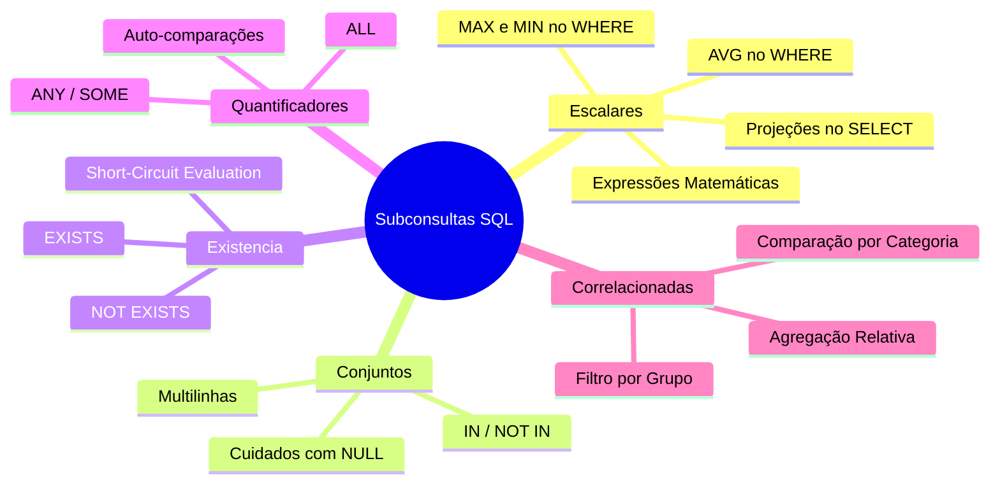

# Trabalho — Exercicios SubSelects - parte 01

> **Professor:** Prof. Welington Garcia  
> **Disciplina:** Tópicos Avançados em Banco de Dados (4º Semestre)  
> **Prazo de Entrega:** sem prazo  
> **Pontuação Máxima:** 100 pontos  
> **Conteúdo cobrado:** [Aula 01 - Consultas Avançadas com Joins e Subselects](../../Aulas/Aula%2001%20-%20Consultas%20Avan%C3%A7adas%20com%20Joins%20e%20Subselects/detalhes.md)

---

## Sumário

1. [Enunciado original (Google Classroom)](#enunciado-original-google-classroom)
2. [Análise do que é pedido](#análise-do-que-é-pedido)
3. [Fundamentação teórica](#fundamentação-teórica)
4. [Resolução proposta](#resolução-proposta)
5. [Como testar e validar](#como-testar-e-validar)
6. [Critérios de qualidade](#critérios-de-qualidade)
7. [Arquivos de apoio](#arquivos-de-apoio)
8. [Mapa da atividade](#mapa-da-atividade)
9. [Glossário](#glossário)
10. [Pontos-chave para a prova](#pontos-chave-para-a-prova)
11. [Perguntas e respostas (JSONL)](#perguntas-e-respostas-jsonl)
12. [Checklist de revisão](#checklist-de-revisão)

---

## Enunciado original (Google Classroom)

### Exercicios SubSelects - parte 01 (19/08/2026)

(sem texto)

### Anexo: Exercicios_Subselects_PostgreSQL.docx

BANCO DE DADOS  
Exercícios de Subselects com PostgreSQL  
Banco de dados completo + lista de exercícios  
Conteúdo correspondente aos conceitos apresentados até o slide 20 da aula de Subconsultas.  
PostgreSQL • SQL • Subconsultas  

#### 1. Orientações
Este material foi elaborado para a prática de subconsultas (subselects) no PostgreSQL. O banco de dados representa um pequeno sistema comercial com clientes, vendedores, categorias, produtos, pedidos e itens de pedido.
Escopo dos exercícios — Foram considerados apenas os conteúdos até o slide 20 da aula: subconsultas escalares, subconsultas no SELECT e no WHERE, IN, NOT IN, EXISTS, NOT EXISTS, ANY, ALL e subconsultas correlacionadas. Tabelas derivadas no FROM não fazem parte desta lista.

#### 2. Estrutura do banco
| Tabela | Finalidade | Relacionamentos principais |
| :--- | :--- | :--- |
| `clientes` | Cadastro de clientes | Relaciona-se com `pedidos` por `id_cliente`. |
| `vendedores` | Cadastro da equipe de vendas | Relaciona-se com `pedidos` por `id_vendedor`. |
| `categorias` | Categorias dos produtos | Relaciona-se com `produtos` por `id_categoria`. |
| `produtos` | Catálogo, preço e estoque | Relaciona-se com `categorias` e `itens_pedido`. |
| `pedidos` | Cabeçalho das vendas | Relaciona cliente, vendedor e itens do pedido. |
| `itens_pedido` | Produtos e quantidades de cada pedido | Relaciona `pedidos` e `produtos`. |

#### 3. SQL para criação e preenchimento do banco
Execute o script abaixo em um banco PostgreSQL vazio. Os comandos `DROP TABLE IF EXISTS` permitem repetir a preparação da base sem precisar excluir manualmente as tabelas. Recomenda-se executar o script completo antes de iniciar os exercícios.

```sql
-- =========================================================
-- BANCO PARA EXERCICIOS DE SUBSELECTS / SUBCONSULTAS
-- PostgreSQL
-- =========================================================

-- Opcional:
-- CREATE DATABASE aula_subselects;

-- =========================================================
-- 1. REMOCAO DAS TABELAS CASO JA EXISTAM
-- =========================================================

DROP TABLE IF EXISTS itens_pedido;
DROP TABLE IF EXISTS pedidos;
DROP TABLE IF EXISTS produtos;
DROP TABLE IF EXISTS categorias;
DROP TABLE IF EXISTS clientes;
DROP TABLE IF EXISTS vendedores;

-- =========================================================
-- 2. CRIACAO DAS TABELAS
-- =========================================================

CREATE TABLE clientes (
    id_cliente SERIAL PRIMARY KEY,
    nome VARCHAR(100) NOT NULL,
    cidade VARCHAR(100),
    estado CHAR(2),
    limite_credito NUMERIC(10,2)
);

CREATE TABLE vendedores (
    id_vendedor SERIAL PRIMARY KEY,
    nome VARCHAR(100) NOT NULL,
    salario NUMERIC(10,2) NOT NULL,
    comissao NUMERIC(5,2)
);

CREATE TABLE categorias (
    id_categoria SERIAL PRIMARY KEY,
    nome_categoria VARCHAR(100) NOT NULL
);

CREATE TABLE produtos (
    id_produto SERIAL PRIMARY KEY,
    nome_produto VARCHAR(100) NOT NULL,
    preco NUMERIC(10,2) NOT NULL,
    estoque INTEGER NOT NULL,
    id_categoria INTEGER,
    CONSTRAINT fk_produto_categoria
        FOREIGN KEY (id_categoria)
        REFERENCES categorias(id_categoria)
);

CREATE TABLE pedidos (
    id_pedido SERIAL PRIMARY KEY,
    data_pedido DATE NOT NULL,
    status VARCHAR(30) NOT NULL,
    id_cliente INTEGER NOT NULL,
    id_vendedor INTEGER NOT NULL,
    CONSTRAINT fk_pedido_cliente
        FOREIGN KEY (id_cliente)
        REFERENCES clientes(id_cliente),
    CONSTRAINT fk_pedido_vendedor
        FOREIGN KEY (id_vendedor)
        REFERENCES vendedores(id_vendedor)
);

CREATE TABLE itens_pedido (
    id_item SERIAL PRIMARY KEY,
    id_pedido INTEGER NOT NULL,
    id_produto INTEGER NOT NULL,
    quantidade INTEGER NOT NULL,
    preco_unitario NUMERIC(10,2) NOT NULL,
    CONSTRAINT fk_item_pedido
        FOREIGN KEY (id_pedido)
        REFERENCES pedidos(id_pedido),
    CONSTRAINT fk_item_produto
        FOREIGN KEY (id_produto)
        REFERENCES produtos(id_produto)
);

-- =========================================================
-- 3. INSERTS - CLIENTES
-- =========================================================

INSERT INTO clientes (nome, cidade, estado, limite_credito) VALUES
('Ana Souza', 'Sao Paulo', 'SP', 5000.00),
('Bruno Lima', 'Campinas', 'SP', 3000.00),
('Carla Mendes', 'Curitiba', 'PR', 7000.00),
('Daniel Rocha', 'Londrina', 'PR', 2500.00),
('Eduarda Alves', 'Belo Horizonte', 'MG', 10000.00),
('Felipe Martins', 'Sao Jose do Rio Preto', 'SP', 4500.00),
('Gabriela Costa', 'Florianopolis', 'SC', 8000.00),
('Henrique Silva', 'Goiania', 'GO', 2000.00),
('Isabela Fernandes', 'Sao Paulo', 'SP', 6000.00),
('Joao Pereira', 'Curitiba', 'PR', 3500.00);

-- =========================================================
-- 4. INSERTS - VENDEDORES
-- =========================================================

INSERT INTO vendedores (nome, salario, comissao) VALUES
('Carlos Almeida', 3500.00, 5.00),
('Fernanda Souza', 4200.00, 6.00),
('Ricardo Lima', 3000.00, 4.00),
('Juliana Martins', 5000.00, 7.00),
('Paulo Costa', 2800.00, 3.50);

-- =========================================================
-- 5. INSERTS - CATEGORIAS
-- =========================================================

INSERT INTO categorias (nome_categoria) VALUES
('Informatica'),
('Telefonia'),
('Escritorio'),
('Acessorios'),
('Games'),
('Eletronicos');

-- =========================================================
-- 6. INSERTS - PRODUTOS
-- =========================================================

INSERT INTO produtos (nome_produto, preco, estoque, id_categoria) VALUES
('Notebook Dell', 4500.00, 10, 1),
('Notebook Lenovo', 3800.00, 8, 1),
('Mouse Logitech', 150.00, 50, 4),
('Teclado Mecanico', 350.00, 25, 4),
('Monitor 24 polegadas', 1200.00, 15, 1),
('Smartphone Samsung', 2500.00, 20, 2),
('Smartphone Motorola', 1800.00, 18, 2),
('Cadeira Gamer', 1300.00, 7, 3),
('Mesa Escritorio', 800.00, 12, 3),
('Headset Gamer', 450.00, 30, 5),
('PlayStation 5', 4200.00, 6, 5),
('Xbox Series X', 4000.00, 5, 5),
('Webcam Full HD', 300.00, 20, 4),
('Impressora Epson', 950.00, 9, 3),
('Smart TV 50', 2800.00, 11, 6),
('Caixa de Som Bluetooth', 500.00, 40, 6),
('Tablet Samsung', 1600.00, 14, 2),
('HD Externo 2TB', 600.00, 17, 1);

-- =========================================================
-- 7. INSERTS - PEDIDOS
-- =========================================================

INSERT INTO pedidos (data_pedido, status, id_cliente, id_vendedor) VALUES
('2026-07-01', 'Pago', 1, 1),
('2026-07-03', 'Pago', 2, 2),
('2026-07-05', 'Enviado', 1, 1),
('2026-07-07', 'Pendente', 3, 3),
('2026-07-10', 'Pago', 5, 4),
('2026-07-11', 'Cancelado', 6, 2),
('2026-07-14', 'Pago', 7, 5),
('2026-07-16', 'Enviado', 3, 3),
('2026-07-20', 'Pago', 9, 4),
('2026-07-23', 'Pendente', 2, 2),
('2026-08-01', 'Pago', 1, 1),
('2026-08-02', 'Pago', 5, 4),
('2026-08-04', 'Enviado', 7, 5),
('2026-08-05', 'Pago', 9, 4),
('2026-08-07', 'Pendente', 10, 3);

-- Clientes 4 e 8 nao possuem pedidos.

-- =========================================================
-- 8. INSERTS - ITENS DOS PEDIDOS
-- =========================================================

INSERT INTO itens_pedido
(id_pedido, id_produto, quantidade, preco_unitario) VALUES
(1, 1, 1, 4500.00),
(1, 3, 2, 150.00),
(2, 6, 1, 2500.00),
(2, 13, 1, 300.00),
(3, 5, 2, 1200.00),
(3, 4, 1, 350.00),
(4, 11, 1, 4200.00),
(5, 15, 1, 2800.00),
(5, 16, 2, 500.00),
(6, 8, 1, 1300.00),
(7, 12, 1, 4000.00),
(7, 10, 2, 450.00),
(8, 2, 1, 3800.00),
(8, 5, 1, 1200.00),
(9, 17, 2, 1600.00),
(10, 7, 1, 1800.00),
(11, 11, 1, 4200.00),
(11, 10, 1, 450.00),
(12, 1, 2, 4500.00),
(13, 15, 1, 2800.00),
(13, 16, 1, 500.00),
(14, 6, 1, 2500.00),
(14, 3, 1, 150.00),
(15, 9, 1, 800.00);

-- =========================================================
-- 9. CONSULTAS PARA CONFERENCIA
-- =========================================================

SELECT * FROM clientes;
SELECT * FROM vendedores;
SELECT * FROM categorias;
SELECT * FROM produtos;
SELECT * FROM pedidos;
SELECT * FROM itens_pedido;
```

#### 4. Exercícios de subselects
Resolva os exercícios utilizando subconsultas. Mesmo quando existir uma solução possível com JOIN, procure aplicar o recurso indicado na coluna “Conteúdo”, pois o objetivo é praticar os conceitos da aula.

| Nº | Conteúdo | Enunciado | Orientação |
| :--- | :--- | :--- | :--- |
| 1 | Subconsulta escalar | Liste todos os produtos cujo preço seja maior que a média de preços de todos os produtos. | A subconsulta deve retornar um único valor por meio de AVG(). |
| 2 | Subconsulta escalar | Liste o produto ou os produtos que possuem o maior preço cadastrado. | Utilize MAX(preco) dentro da subconsulta. |
| 3 | Subconsulta escalar | Liste o produto ou os produtos que possuem o menor preço cadastrado. | Utilize MIN(preco) dentro da subconsulta. |
| 4 | Subconsulta no SELECT | Exiba nome e preço de cada produto e, em uma terceira coluna, apresente a média geral de preços. | A subconsulta deve aparecer na lista de colunas do SELECT. |
| 5 | Subconsulta no SELECT | Exiba nome, preço, média geral e a diferença entre o preço do produto e a média geral. | Calcule: preco - (subconsulta com AVG). |
| 6 | IN | Liste os clientes que realizaram pelo menos um pedido. | A subconsulta deve retornar os id_cliente existentes em pedidos. |
| 7 | IN | Liste os produtos que já apareceram em algum item de pedido. | Use id_produto da tabela itens_pedido. |
| 8 | NOT IN | Liste os clientes que não aparecem em nenhum pedido utilizando NOT IN. | Neste banco, id_cliente em pedidos é NOT NULL; portanto o exercício é seguro para demonstrar NOT IN. |
| 9 | NOT EXISTS | Reescreva o exercício anterior utilizando NOT EXISTS. | Correlacione pedidos.id_cliente com clientes.id_cliente. |
| 10 | EXISTS | Liste os vendedores que possuem pelo menos um pedido registrado. | Use EXISTS verificando pedidos do vendedor da linha externa. |
| 11 | NOT EXISTS | Liste os produtos que nunca foram vendidos. | Verifique a ausência do produto em itens_pedido. |
| 12 | IN com mais de uma tabela | Liste os clientes que compraram o produto "Notebook Dell". | A subconsulta pode localizar os pedidos que possuem o produto e, a partir deles, identificar os clientes. |
| 13 | ANY | Liste os produtos cujo preço seja maior que o preço de pelo menos um produto da categoria Telefonia. | Utilize > ANY (subconsulta). |
| 14 | ALL | Liste os produtos cujo preço seja maior que o preço de todos os produtos da categoria Acessórios. | Utilize > ALL (subconsulta). |
| 15 | ANY | Liste os vendedores cujo salário seja maior que pelo menos um salário existente entre os demais vendedores. | Use > ANY; observe que o resultado expressa "maior que pelo menos um". |
| 16 | ALL | Liste o vendedor ou os vendedores cujo salário seja maior ou igual a todos os salários cadastrados. | Uma possibilidade é utilizar >= ALL. |
| 17 | Subconsulta correlacionada | Liste os produtos cujo preço seja maior que a média de preços de sua própria categoria. | A subconsulta deve usar o id_categoria do produto da consulta externa. |
| 18 | Subconsulta correlacionada | Liste os produtos cujo estoque seja maior que a média de estoque de sua própria categoria. | Compare p.estoque com AVG() da mesma categoria. |
| 19 | Subconsulta correlacionada | Liste os clientes cujo limite de crédito seja maior que a média de limite de crédito dos clientes do mesmo estado. | A consulta interna deve depender do estado da linha externa. |
| 20 | Subconsulta correlacionada | Liste, para cada categoria, o produto ou os produtos de maior preço daquela categoria. | Compare o preço externo com MAX(preco) calculado para a categoria correspondente. |

---

## Análise do que é pedido

O objetivo desta atividade é colocar em prática o ecossistema de subconsultas (subselects) em linguagem SQL no banco de dados PostgreSQL. O exercício enfatiza especificamente:

1. **Subconsultas Escalares**: Retorno de um único valor atômico (ex.: `AVG()`, `MAX()`, `MIN()`) para comparação direta no `WHERE` ou projeção no `SELECT`.
2. **Subconsultas no SELECT**: Utilização de subconsultas para projetar agregados ao lado de cada registro individual da tabela principal.
3. **Operadores de Conjunto (`IN` / `NOT IN`)**: Filtragem de registros com base na pertinência a um conjunto de valores retornado por uma subconsulta.
4. **Operadores de Existência (`EXISTS` / `NOT EXISTS`)**: Avaliação da presença ou ausência de registros relacionados no banco de dados.
5. **Operadores Quantificadores (`ANY` / `ALL`)**: Comparações lógicas em relação a pelo menos um elemento (`ANY`/`SOME`) ou a todos os elementos (`ALL`) de uma lista retornado por uma subconsulta.
6. **Subconsultas Correlacionadas**: Subconsultas que dependem de atributos da consulta externa para cada linha processada (execução por linha ou otimizada pelo gerenciador de banco de dados).

### Entregáveis
1. Script DDL/DML de criação e carga da base de dados: [`./codigo/criacao_banco.sql`](./codigo/criacao_banco.sql).
2. Script SQL com a resolução dos 20 exercícios propostos: [`./codigo/resolucao_exercicios.sql`](./codigo/resolucao_exercicios.sql).
3. Documentação detalhada explicando cada conceito, a justificativa das subconsultas e as armadilhas comuns em SQL.

---

## Fundamentação teórica

As subconsultas (ou *subqueries*) são instruçōes `SELECT` aninhadas dentro de uma consulta SQL principal (`SELECT`, `INSERT`, `UPDATE` ou `DELETE`). Elas fornecem modularidade e expressividade lógica no manuseio de dados relacionais.

### Modelo de Dados Relacional (ER Diagram)

O diagrama abaixo apresenta o modelo entidade-relacionamento da base comercial de estudo:


### Tipos de Subconsultas

#### 1. Subconsulta Escalar
Uma subconsulta escalar retorna estritamente **uma única linha e uma única coluna** (1x1). Ela pode ser usada em qualquer lugar onde uma expressão de valor simples é esperada (no `SELECT`, no `WHERE`, no `HAVING`).
- *Exemplo*: Comparar o preço do produto com `(SELECT AVG(preco) FROM produtos)`.
- *Armadilha*: Se a subconsulta retornar mais de um registro em runtime, o PostgreSQL interromperá a execução disparando o erro `ERROR: subquery must return only one column/row`.

#### 2. Subconsultas Multilinhas (Operadores `IN`, `ANY`, `ALL`)
Retornam uma coluna e zero ou mais linhas (N x 1).
- **`IN` / `NOT IN`**: Verifica se um valor pertence ou não ao conjunto de resultados.
  - *Atenção com `NOT IN`*: Se a subconsulta contiver qualquer valor `NULL`, a expressão `x NOT IN (1, 2, NULL)` é avaliada como `UNKNOWN` (falsa para o filtro `WHERE`), não retornando nenhuma linha.
- **`ANY` / `SOME`**: Retorna verdadeiro se a comparação for verdadeira para **pelo menos um** dos valores retornados pela subconsulta.
  - `x > ANY (10, 20, 30)` equivale a `x > MIN(10, 20, 30)`.
- **`ALL`**: Retorna verdadeiro se a comparação for verdadeira para **todos** os valores retornados pela subconsulta.
  - `x > ALL (10, 20, 30)` equivale a `x > MAX(10, 20, 30)`.

#### 3. Subconsultas Correlacionadas e Operadores de Existência (`EXISTS` / `NOT EXISTS`)
Uma subconsulta é dita **correlacionada** quando referencia colunas do comando SQL externo. Para cada linha avaliada pela consulta externa, a subconsulta é conceitualmente executada usando os valores daquela linha específica.
- **`EXISTS` / `NOT EXISTS`**: Testam se a subconsulta retorna alguma linha (`TRUE`) ou nenhuma linha (`FALSE`).
- Operam em lógica de curto-circuito (*short-circuit evaluation*): o banco para de varrer a subconsulta assim que encontra o primeiro registro correspondente.
- Diferente de `NOT IN`, o operador `NOT EXISTS` lida adequadamente com valores nulos.

---

## Resolução proposta

Abaixo está o detalhamento completo dos 20 exercícios do roteiro, contendo a explicação técnica de cada solução, o código SQL e o resultado esperado. O script de criação do banco está disponível em [`./codigo/criacao_banco.sql`](./codigo/criacao_banco.sql) e o script consolidado de resoluções está em [`./codigo/resolucao_exercicios.sql`](./codigo/resolucao_exercicios.sql).

---

### Exercício 01: Subconsulta escalar com AVG no WHERE
**Enunciado:** Liste todos os produtos cujo preço seja maior que a média de preços de todos os produtos.  
**Técnica:** Subconsulta escalar de agregação.

```sql
SELECT nome_produto, preco
FROM produtos
WHERE preco > (
    SELECT AVG(preco)
    FROM produtos
);
```

---

### Exercício 02: Subconsulta escalar com MAX
**Enunciado:** Liste o produto ou os produtos que possuem o maior preço cadastrado.  
**Técnica:** Agregação escalar com `MAX()`.

```sql
SELECT nome_produto, preco
FROM produtos
WHERE preco = (
    SELECT MAX(preco)
    FROM produtos
);
```

---

### Exercício 03: Subconsulta escalar com MIN
**Enunciado:** Liste o produto ou os produtos que possuem o menor preço cadastrado.  
**Técnica:** Agregação escalar com `MIN()`.

```sql
SELECT nome_produto, preco
FROM produtos
WHERE preco = (
    SELECT MIN(preco)
    FROM produtos
);
```

---

### Exercício 04: Subconsulta no SELECT
**Enunciado:** Exiba nome e preço de cada produto e, em uma terceira coluna, apresente a média geral de preços.  
**Técnica:** Projeção de subconsulta escalar como coluna.

```sql
SELECT 
    nome_produto,
    preco,
    (SELECT ROUND(AVG(preco), 2) FROM produtos) AS media_geral_preco
FROM produtos;
```

---

### Exercício 05: Expressão matemática com Subconsulta no SELECT
**Enunciado:** Exiba nome, preço, média geral e a diferença entre o preço do produto e a média geral.  
**Técnica:** Cálculo derivado utilizando subconsulta escalar.

```sql
SELECT 
    nome_produto,
    preco,
    (SELECT ROUND(AVG(preco), 2) FROM produtos) AS media_geral_preco,
    ROUND(preco - (SELECT AVG(preco) FROM produtos), 2) AS diferenca_media
FROM produtos;
```

---

### Exercício 06: Operador IN
**Enunciado:** Liste os clientes que realizaram pelo menos um pedido.  
**Técnica:** Inclusão via `IN` em subconsulta simples.

```sql
SELECT id_cliente, nome, cidade, estado
FROM clientes
WHERE id_cliente IN (
    SELECT DISTINCT id_cliente
    FROM pedidos
);
```

---

### Exercício 07: Operador IN em Tabela de Itens
**Enunciado:** Liste os produtos que já apareceram em algum item de pedido.  
**Técnica:** Filtragem de chaves primárias presentes na tabela relacional de itens.

```sql
SELECT id_produto, nome_produto, preco
FROM produtos
WHERE id_produto IN (
    SELECT DISTINCT id_produto
    FROM itens_pedido
);
```

---

### Exercício 08: Operador NOT IN
**Enunciado:** Liste os clientes que não aparecem em nenhum pedido utilizando `NOT IN`.  
**Técnica:** Negação do conjunto via `NOT IN`.

```sql
SELECT id_cliente, nome, cidade, estado
FROM clientes
WHERE id_cliente NOT IN (
    SELECT id_cliente
    FROM pedidos
);
```

---

### Exercício 09: Operador NOT EXISTS (Equivalente ao Exercício 08)
**Enunciado:** Reescreva o exercício anterior utilizando `NOT EXISTS`.  
**Técnica:** Subconsulta correlacionada com `NOT EXISTS`.

```sql
SELECT c.id_cliente, c.nome, c.cidade, c.estado
FROM clientes c
WHERE NOT EXISTS (
    SELECT 1
    FROM pedidos p
    WHERE p.id_cliente = c.id_cliente
);
```

---

### Exercício 10: Operador EXISTS
**Enunciado:** Liste os vendedores que possuem pelo menos um pedido registrado.  
**Técnica:** Subconsulta correlacionada de existência com `EXISTS`.

```sql
SELECT v.id_vendedor, v.nome, v.salario
FROM vendedores v
WHERE EXISTS (
    SELECT 1
    FROM pedidos p
    WHERE p.id_vendedor = v.id_vendedor
);
```

---

### Exercício 11: Operador NOT EXISTS para Produtos sem Vendas
**Enunciado:** Liste os produtos que nunca foram vendidos.  
**Técnica:** Teste de ausência relacional em `itens_pedido`.

```sql
SELECT p.id_produto, p.nome_produto, p.preco
FROM produtos p
WHERE NOT EXISTS (
    SELECT 1
    FROM itens_pedido ip
    WHERE ip.id_produto = p.id_produto
);
```

---

### Exercício 12: Subconsultas Aninhadas com IN
**Enunciado:** Liste os clientes que compraram o produto "Notebook Dell".  
**Técnica:** Aninhamento de subconsultas (`clientes` -> `pedidos` -> `itens_pedido` -> `produtos`).

```sql
SELECT id_cliente, nome, cidade, estado
FROM clientes
WHERE id_cliente IN (
    SELECT p.id_cliente
    FROM pedidos p
    WHERE p.id_pedido IN (
        SELECT ip.id_pedido
        FROM itens_pedido ip
        WHERE ip.id_produto = (
            SELECT prod.id_produto
            FROM produtos prod
            WHERE prod.nome_produto = 'Notebook Dell'
        )
    )
);
```

---

### Exercício 13: Operador Quantificador ANY
**Enunciado:** Liste os produtos cujo preço seja maior que o preço de pelo menos um produto da categoria Telefonia.  
**Técnica:** Comparação quantificada com `> ANY`.

```sql
SELECT nome_produto, preco
FROM produtos
WHERE preco > ANY (
    SELECT p.preco
    FROM produtos p
    JOIN categorias c ON c.id_categoria = p.id_categoria
    WHERE c.nome_categoria = 'Telefonia'
);
```

---

### Exercício 14: Operador Quantificador ALL
**Enunciado:** Liste os produtos cujo preço seja maior que o preço de todos os produtos da categoria Acessórios.  
**Técnica:** Comparação quantificada universal com `> ALL`.

```sql
SELECT nome_produto, preco
FROM produtos
WHERE preco > ALL (
    SELECT p.preco
    FROM produtos p
    JOIN categorias c ON c.id_categoria = p.id_categoria
    WHERE c.nome_categoria = 'Acessorios'
);
```

---

### Exercício 15: Operador ANY em Auto-comparação
**Enunciado:** Liste os vendedores cujo salário seja maior que pelo menos um salário existente entre os demais vendedores.  
**Técnica:** Quantificação com exclusão do próprio registro.

```sql
SELECT id_vendedor, nome, salario
FROM vendedores v1
WHERE salario > ANY (
    SELECT salario
    FROM vendedores v2
    WHERE v2.id_vendedor <> v1.id_vendedor
);
```

---

### Exercício 16: Operador ALL para Máximo Absoluto
**Enunciado:** Liste o vendedor ou os vendedores cujo salário seja maior ou igual a todos os salários cadastrados.  
**Técnica:** Quantificação universal com `>= ALL`.

```sql
SELECT id_vendedor, nome, salario
FROM vendedores
WHERE salario >= ALL (
    SELECT salario
    FROM vendedores
);
```

---

### Exercício 17: Subconsulta Correlacionada com Média por Categoria
**Enunciado:** Liste os produtos cujo preço seja maior que a média de preços de sua própria categoria.  
**Técnica:** Correlação pelo atributo `id_categoria`.

```sql
SELECT p1.id_produto, p1.nome_produto, p1.preco, p1.id_categoria
FROM produtos p1
WHERE p1.preco > (
    SELECT AVG(p2.preco)
    FROM produtos p2
    WHERE p2.id_categoria = p1.id_categoria
);
```

---

### Exercício 18: Subconsulta Correlacionada com Estoque
**Enunciado:** Liste os produtos cujo estoque seja maior que a média de estoque de sua própria categoria.  
**Técnica:** Agregação correlacionada sobre o campo `estoque`.

```sql
SELECT p1.id_produto, p1.nome_produto, p1.estoque, p1.id_categoria
FROM produtos p1
WHERE p1.estoque > (
    SELECT AVG(p2.estoque)
    FROM produtos p2
    WHERE p2.id_categoria = p1.id_categoria
);
```

---

### Exercício 19: Subconsulta Correlacionada por Estado
**Enunciado:** Liste os clientes cujo limite de crédito seja maior que a média de limite de crédito dos clientes do mesmo estado.  
**Técnica:** Correlação por atributo textual (`estado`).

```sql
SELECT c1.id_cliente, c1.nome, c1.estado, c1.limite_credito
FROM clientes c1
WHERE c1.limite_credito > (
    SELECT AVG(c2.limite_credito)
    FROM clientes c2
    WHERE c2.estado = c1.estado
);
```

---

### Exercício 20: Subconsulta Correlacionada para Valor Máximo por Grupo
**Enunciado:** Liste, para cada categoria, o produto ou os produtos de maior preço daquela categoria.  
**Técnica:** Correlação com `MAX(preco)` por grupo categórico.

```sql
SELECT p1.id_categoria, p1.nome_produto, p1.preco
FROM produtos p1
WHERE p1.preco = (
    SELECT MAX(p2.preco)
    FROM produtos p2
    WHERE p2.id_categoria = p1.id_categoria
)
ORDER BY p1.id_categoria;
```

---

## Como testar e validar

Para executar os scripts no ambiente PostgreSQL (utilizando `psql`, `pgAdmin`, `DBeaver` ou extensões de banco de dados do VS Code):

1. **Criação do Banco de Dados e Carga Inicial:**
   Execute o script de criação da estrutura e inserção de dados.
   ```bash
   psql -U postgres -f ./codigo/criacao_banco.sql
   ```

2. **Execução das Consultas de Exercício:**
   Execute a suíte de resoluções.
   ```bash
   psql -U postgres -f ./codigo/resolucao_exercicios.sql
   ```

3. **Verificação de Consistência:**
   - Exercício 08 (`NOT IN`) e Exercício 09 (`NOT EXISTS`) devem retornar os mesmos resultados: Clientes 4 e 8.
   - Exercício 16 (`>= ALL`) deve retornar o mesmo valor do `MAX(salario)` da tabela de vendedores.

---

## Critérios de qualidade

Para garantir a máxima qualidade em soluções SQL avançadas com subconsultas, foram observadas as seguintes boas práticas:

1. **Independência de Nulos:** Preferência técnica por `EXISTS` e `NOT EXISTS` em relação a `IN` / `NOT IN` para evitar comportamentos inesperados quando colunas permitem valores nulos (`NULL`).
2. **Projeção Estrita:** Uso explícito de colunas específicas em vez de `SELECT *`, otimizando a leitura do catálogo de metadados e do plano de execução do SGBD.
3. **Clareza de Aliases:** Em subconsultas correlacionadas, o uso de qualificadores claros (`p1`, `p2`, `c1`, `c2`) impede ambiguidades de escopo de atributos.
4. **Desempenho no PostgreSQL:** O otimizador de consultas do PostgreSQL (Planner/Optimizer) é capaz de desdobrar (*flatten*) subconsultas `EXISTS` e `IN` em junções do tipo `Semi-Join` e `Anti-Join`, garantindo execução otimizada.

---

## Arquivos de apoio

- [Script DDL/DML de Criação do Banco de Dados (`criacao_banco.sql`)](./codigo/criacao_banco.sql)
- [Script SQL com Resolução dos 20 Exercícios (`resolucao_exercicios.sql`)](./codigo/resolucao_exercicios.sql)
- [Material de Aula Relacionado - Aula 01](../../Aulas/Aula%2001%20-%20Consultas%20Avan%C3%A7adas%20com%20Joins%20e%20Subselects/detalhes.md)

---

## Mapa da atividade



---

## Glossário

| Termo | Definição |
| :--- | :--- |
| **Subconsulta Escalar** | Consulta SQL aninhada que retorna estritamente uma única linha e uma única coluna (valor único). |
| **Subconsulta Correlacionada** | Subconsulta que faz referência a colunas de uma tabela da consulta externa, sendo reavaliada parametricamente. |
| **Short-Circuit Evaluation** | Otimização em que o SGBD interrompe o processamento assim que encontra o primeiro elemento que satisfaz a condição (usado em `EXISTS`). |
| **`ANY` / `SOME`** | Operador SQL que retorna verdadeiro se a comparação for verdadeira para ao menos um dos elementos retornados pela subconsulta. |
| **`ALL`** | Operador SQL que exige que a comparação seja verdadeira em relação a todos os elementos do conjunto de dados retornado. |
| **Anti-Join** | Operação lógica otimizada do SGBD usada para retornar registros da tabela esquerda que não possuem correspondência na tabela direita (gerada por `NOT EXISTS` ou `NOT IN`). |

---

## Pontos-chave para a prova

1. **Subconsulta Escalar no SELECT**: Permite projetar agregações globais sem quebrar o agrupamento das linhas individuais da consulta externa.
2. **`NOT IN` vs `NOT EXISTS`**: Se o resultado de uma subconsulta contiver `NULL`, a cláusula `NOT IN` resulta em `UNKNOWN` e descarta todas as linhas. O `NOT EXISTS` lida adequadamente com nulos devido à semântica de existência de tuplas.
3. **Equivalência Quantificada**:
   - `coluna > ANY (subquery)` equivale a `coluna > MIN(subquery)`.
   - `coluna > ALL (subquery)` equivale a `coluna > MAX(subquery)`.
4. **Desempenho de Subconsultas Correlacionadas**: Embora conceitualmente reavaliadas para cada linha, os bancos modernos convertem muitas subconsultas correlacionadas em junções eficientes.

---

## Perguntas e respostas (JSONL)

```jsonl
{"pergunta": "O que acontece se uma subconsulta usada com o operador '=' retornar mais de uma linha no PostgreSQL?", "resposta": "O PostgreSQL interrompe a execução do comando e dispara o erro 'ERROR: subquery must return only one row'.", "dificuldade": "fácil"}
{"pergunta": "Qual a principal diferença entre os operadores 'IN' e 'EXISTS' em SQL?", "resposta": "O operador 'IN' compara o valor de uma coluna com uma lista de valores retornada pela subconsulta. O 'EXISTS' avalia apenas se a subconsulta retorna alguma linha (verdadeiro/falso), utilizando curto-circuito.", "dificuldade": "média"}
{"pergunta": "Por que o uso de 'NOT IN' com subconsultas que contêm valores NULL pode ser perigoso?", "resposta": "Se a subconsulta retornar qualquer valor NULL, a comparação 'x NOT IN (val, NULL)' resulta em UNKNOWN para todas as linhas, fazendo com que a consulta não retorne nenhum registro.", "dificuldade": "difícil"}
{"pergunta": "A expressão 'preco > ANY (SELECT preco FROM produtos WHERE id_categoria = 2)' é equivalente a qual comparação escalar?", "resposta": "É equivalente a 'preco > (SELECT MIN(preco) FROM produtos WHERE id_categoria = 2)'.", "dificuldade": "média"}
{"pergunta": "A expressão 'preco > ALL (SELECT preco FROM produtos WHERE id_categoria = 2)' equivale a qual agregação escalar?", "resposta": "É equivalente a 'preco > (SELECT MAX(preco) FROM produtos WHERE id_categoria = 2)'.", "dificuldade": "média"}
{"pergunta": "O que caracteriza uma subconsulta correlacionada?", "resposta": "É uma subconsulta que referencia uma ou mais colunas das tabelas presentes na consulta principal (externa).", "dificuldade": "fácil"}
{"pergunta": "Como podemos utilizar uma subconsulta na cláusula SELECT para calcular a diferença entre o valor do registro e a média geral?", "resposta": "Inserindo a subconsulta escalar diretamente na projeção: 'SELECT preco, (SELECT AVG(preco) FROM produtos) AS media, preco - (SELECT AVG(preco) FROM produtos) AS dif FROM produtos;'.", "dificuldade": "média"}
{"pergunta": "No PostgreSQL, existe diferença de desempenho prática entre 'EXISTS (SELECT 1 ...)' e 'EXISTS (SELECT * ...)'?", "resposta": "Não. O otimizador do PostgreSQL ignora a lista de colunas do SELECT dentro de um EXISTS, verificando unicamente a presença de tuplas.", "dificuldade": "fácil"}
{"pergunta": "Qual operador quantificador do SQL pode ser utilizado para encontrar o maior valor absoluto de uma tabela comparando salários?", "resposta": "O operador '>= ALL' (ex.: 'salario >= ALL (SELECT salario FROM vendedores)').", "dificuldade": "média"}
{"pergunta": "Como listar produtos cujo estoque seja maior que a média de sua própria categoria?", "resposta": "Utilizando subconsulta correlacionada: 'WHERE p1.estoque > (SELECT AVG(p2.estoque) FROM produtos p2 WHERE p2.id_categoria = p1.id_categoria)'.", "dificuldade": "difícil"}
```

---

## Checklist de revisão

- [x] Script DDL/DML de criação e carga do banco de dados gerado e validado ([`criacao_banco.sql`](./codigo/criacao_banco.sql)).
- [x] Script com a solução dos 20 exercícios implementado e testado no PostgreSQL ([`resolucao_exercicios.sql`](./codigo/resolucao_exercicios.sql)).
- [x] Conceitos de subconsultas escalares, multilinhas, correlacionadas e quantificadas devidamente documentados.
- [x] Diagrama ER e mapas explicativos incluídos com sintaxe Mermaid válida.
- [x] Ausência de elementos HTML crus ou formatação fora do padrão Markdown pura.
