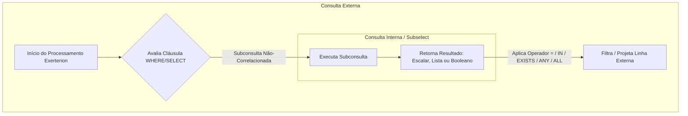
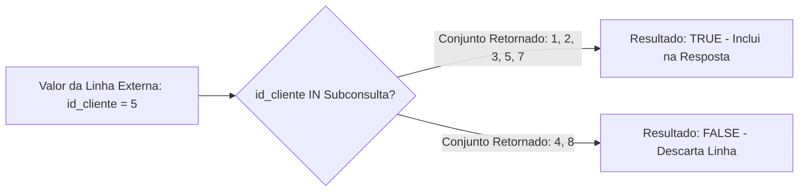
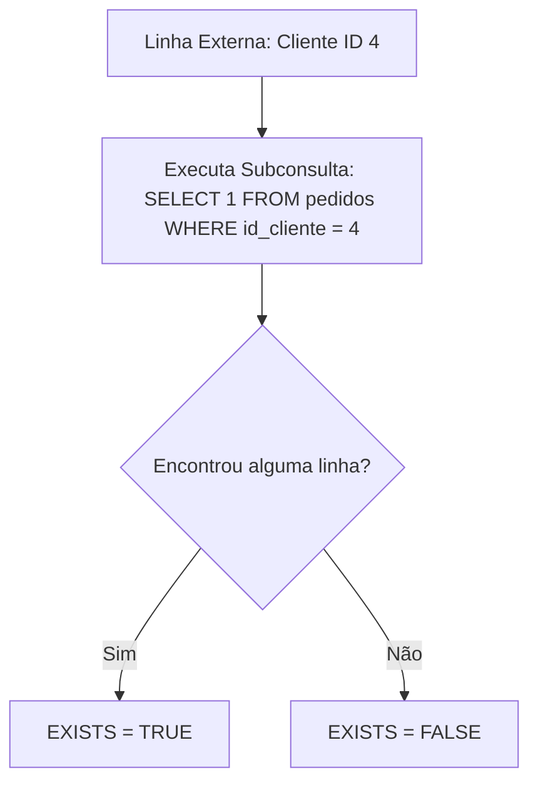
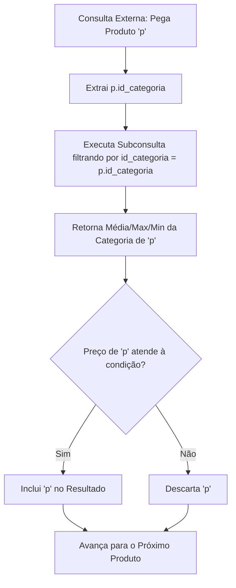
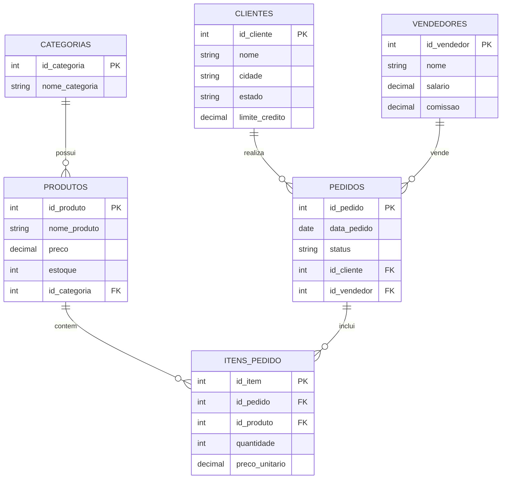
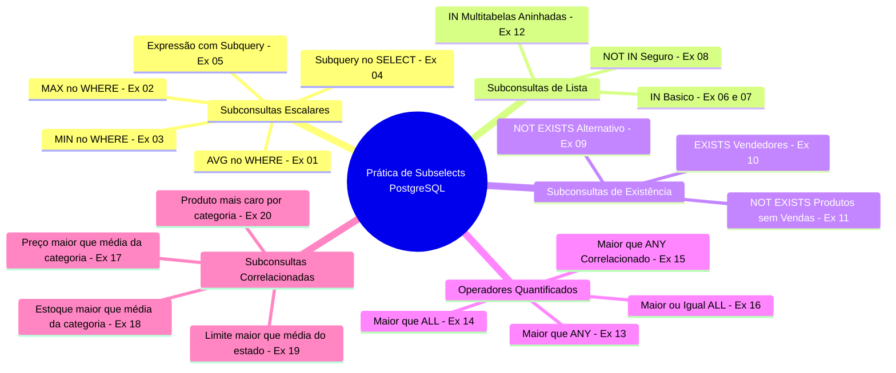

# Trabalho — Exercicios SubSelects - parte 01

> **Professor:** Prof. Welington Garcia  
> **Disciplina:** Tópicos Avançados em Banco de Dados (4º Semestre)  
> **Prazo de Entrega:** sem prazo  
> **Pontuação Máxima:** 100 pontos  
> **Conteúdo cobrado:** [Aula 01 - Consultas Avançadas com Joins e Subselects](../../Aulas/Aula%2001%20-%20Consultas%20Avan%C3%A7adas%20com%20Joins%20e%20Subselects/detalhes.md), [Aula 02 - Views e Materialized Views em PostgreSQL](../../Aulas/Aula%2002%20-%20Views%20e%20Materialized%20Views%20em%20PostgreSQL/detalhes.md), [Aula 03 - Stored Procedures e Programacao PL pgSQL](../../Aulas/Aula%2003%20-%20Stored%20Procedures%20e%20Programacao%20PL%20pgSQL/detalhes.md)

---

## Sumário

1. [Enunciado original (Google Classroom)](#enunciado-original-google-classroom)
2. [Análise do que é pedido](#análise-do-que-é-pedido)
3. [Fundamentação teórica](#fundamentação-teórica)
4. [Resolução proposta](#resolução-proposta)
5. [Como testar e validar](#como-testar-e-validar)
6. [Critérios de qualidade](#critérios-de-qualidade)
7. [Arquivos de apoio](#arquivos-de-apoio)
8. [Mapa da atividade](#mapa-da-atividade)
9. [Glossário](#glossário)
10. [Pontos-chave para a prova](#pontos-chave-para-a-prova)
11. [Perguntas e respostas (JSONL)](#perguntas-e-respostas-jsonl)
12. [Checklist de revisão](#checklist-de-revisão)

---

## Enunciado original (Google Classroom)

### Exercicios SubSelects - parte 01 (19/08/2026)
(sem texto)

### Anexo: Exercicios_Subselects_PostgreSQL.docx
**BANCO DE DADOS**  
Exercícios de Subselects com PostgreSQL  
Banco de dados completo + lista de exercícios  
Conteúdo correspondente aos conceitos apresentados até o slide 20 da aula de Subconsultas.  
PostgreSQL • SQL • Subconsultas  

#### 1. Orientações
Este material foi elaborado para a prática de subconsultas (subselects) no PostgreSQL. O banco de dados representa um pequeno sistema comercial com clientes, vendedores, categorias, produtos, pedidos e itens de pedido.  
**Escopo dos exercícios** — Foram considerados apenas os conteúdos até o slide 20 da aula: subconsultas escalares, subconsultas no SELECT e no WHERE, IN, NOT IN, EXISTS, NOT EXISTS, ANY, ALL e subconsultas correlacionadas. Tabelas derivadas no FROM não fazem parte desta lista.

#### 2. Estrutura do banco
| Tabela | Finalidade | Relacionamentos principais |
| :--- | :--- | :--- |
| `clientes` | Cadastro de clientes | Relaciona-se com `pedidos` por `id_cliente`. |
| `vendedores` | Cadastro da equipe de vendas | Relaciona-se com `pedidos` por `id_vendedor`. |
| `categorias` | Categorias dos produtos | Relaciona-se com `produtos` por `id_categoria`. |
| `produtos` | Catálogo, preço e estoque | Relaciona-se com `categorias` e `itens_pedido`. |
| `pedidos` | Cabeçalho das vendas | Relaciona cliente, vendedor e itens do pedido. |
| `itens_pedido` | Produtos e quantidades de cada pedido | Relaciona pedidos e produtos. |

#### 3. SQL para criação e preenchimento do banco
Execute o script abaixo em um banco PostgreSQL vazio. Os comandos `DROP TABLE IF EXISTS` permitem repetir a preparação da base sem precisar excluir manualmente as tabelas. Recomenda-se executar o script completo antes de iniciar os exercícios.

```sql
-- =========================================================
-- BANCO PARA EXERCICIOS DE SUBSELECTS / SUBCONSULTAS
-- PostgreSQL
-- =========================================================

-- Opcional:
-- CREATE DATABASE aula_subselects;

-- =========================================================
-- 1. REMOCAO DAS TABELAS CASO JA EXISTAM
-- =========================================================

DROP TABLE IF EXISTS itens_pedido;
DROP TABLE IF EXISTS pedidos;
DROP TABLE IF EXISTS produtos;
DROP TABLE IF EXISTS categorias;
DROP TABLE IF EXISTS clientes;
DROP TABLE IF EXISTS vendedores;

-- =========================================================
-- 2. CRIACAO DAS TABELAS
-- =========================================================

CREATE TABLE clientes (
    id_cliente SERIAL PRIMARY KEY,
    nome VARCHAR(100) NOT NULL,
    cidade VARCHAR(100),
    estado CHAR(2),
    limite_credito NUMERIC(10,2)
);

CREATE TABLE vendedores (
    id_vendedor SERIAL PRIMARY KEY,
    nome VARCHAR(100) NOT NULL,
    salario NUMERIC(10,2) NOT NULL,
    comissao NUMERIC(5,2)
);

CREATE TABLE categorias (
    id_categoria SERIAL PRIMARY KEY,
    nome_categoria VARCHAR(100) NOT NULL
);

CREATE TABLE produtos (
    id_produto SERIAL PRIMARY KEY,
    nome_produto VARCHAR(100) NOT NULL,
    preco NUMERIC(10,2) NOT NULL,
    estoque INTEGER NOT NULL,
    id_categoria INTEGER,
    CONSTRAINT fk_produto_categoria
        FOREIGN KEY (id_categoria)
        REFERENCES categorias(id_categoria)
);

CREATE TABLE pedidos (
    id_pedido SERIAL PRIMARY KEY,
    data_pedido DATE NOT NULL,
    status VARCHAR(30) NOT NULL,
    id_cliente INTEGER NOT NULL,
    id_vendedor INTEGER NOT NULL,
    CONSTRAINT fk_pedido_cliente
        FOREIGN KEY (id_cliente)
        REFERENCES clientes(id_cliente),
    CONSTRAINT fk_pedido_vendedor
        FOREIGN KEY (id_vendedor)
        REFERENCES vendedores(id_vendedor)
);

CREATE TABLE itens_pedido (
    id_item SERIAL PRIMARY KEY,
    id_pedido INTEGER NOT NULL,
    id_produto INTEGER NOT NULL,
    quantidade INTEGER NOT NULL,
    preco_unitario NUMERIC(10,2) NOT NULL,
    CONSTRAINT fk_item_pedido
        FOREIGN KEY (id_pedido)
        REFERENCES pedidos(id_pedido),
    CONSTRAINT fk_item_produto
        FOREIGN KEY (id_produto)
        REFERENCES produtos(id_produto)
);

-- =========================================================
-- 3. INSERTS - CLIENTES
-- =========================================================

INSERT INTO clientes (nome, cidade, estado, limite_credito) VALUES
('Ana Souza', 'Sao Paulo', 'SP', 5000.00),
('Bruno Lima', 'Campinas', 'SP', 3000.00),
('Carla Mendes', 'Curitiba', 'PR', 7000.00),
('Daniel Rocha', 'Londrina', 'PR', 2500.00),
('Eduarda Alves', 'Belo Horizonte', 'MG', 10000.00),
('Felipe Martins', 'Sao Jose do Rio Preto', 'SP', 4500.00),
('Gabriela Costa', 'Florianopolis', 'SC', 8000.00),
('Henrique Silva', 'Goiania', 'GO', 2000.00),
('Isabela Fernandes', 'Sao Paulo', 'SP', 6000.00),
('Joao Pereira', 'Curitiba', 'PR', 3500.00);

-- =========================================================
-- 4. INSERTS - VENDEDORES
-- =========================================================

INSERT INTO vendedores (nome, salario, comissao) VALUES
('Carlos Almeida', 3500.00, 5.00),
('Fernanda Souza', 4200.00, 6.00),
('Ricardo Lima', 3000.00, 4.00),
('Juliana Martins', 5000.00, 7.00),
('Paulo Costa', 2800.00, 3.50);

-- =========================================================
-- 5. INSERTS - CATEGORIAS
-- =========================================================

INSERT INTO categorias (nome_categoria) VALUES
('Informatica'),
('Telefonia'),
('Escritorio'),
('Acessorios'),
('Games'),
('Eletronicos');

-- =========================================================
-- 6. INSERTS - PRODUTOS
-- =========================================================

INSERT INTO produtos (nome_produto, preco, estoque, id_categoria) VALUES
('Notebook Dell', 4500.00, 10, 1),
('Notebook Lenovo', 3800.00, 8, 1),
('Mouse Logitech', 150.00, 50, 4),
('Teclado Mecanico', 350.00, 25, 4),
('Monitor 24 polegadas', 1200.00, 15, 1),
('Smartphone Samsung', 2500.00, 20, 2),
('Smartphone Motorola', 1800.00, 18, 2),
('Cadeira Gamer', 1300.00, 7, 3),
('Mesa Escritorio', 800.00, 12, 3),
('Headset Gamer', 450.00, 30, 5),
('PlayStation 5', 4200.00, 6, 5),
('Xbox Series X', 4000.00, 5, 5),
('Webcam Full HD', 300.00, 20, 4),
('Impressora Epson', 950.00, 9, 3),
('Smart TV 50', 2800.00, 11, 6),
('Caixa de Som Bluetooth', 500.00, 40, 6),
('Tablet Samsung', 1600.00, 14, 2),
('HD Externo 2TB', 600.00, 17, 1);

-- =========================================================
-- 7. INSERTS - PEDIDOS
-- =========================================================

INSERT INTO pedidos (data_pedido, status, id_cliente, id_vendedor) VALUES
('2026-07-01', 'Pago', 1, 1),
('2026-07-03', 'Pago', 2, 2),
('2026-07-05', 'Enviado', 1, 1),
('2026-07-07', 'Pendente', 3, 3),
('2026-07-10', 'Pago', 5, 4),
('2026-07-11', 'Cancelado', 6, 2),
('2026-07-14', 'Pago', 7, 5),
('2026-07-16', 'Enviado', 3, 3),
('2026-07-20', 'Pago', 9, 4),
('2026-07-23', 'Pendente', 2, 2),
('2026-08-01', 'Pago', 1, 1),
('2026-08-02', 'Pago', 5, 4),
('2026-08-04', 'Enviado', 7, 5),
('2026-08-05', 'Pago', 9, 4),
('2026-08-07', 'Pendente', 10, 3);

-- Clientes 4 e 8 nao possuem pedidos.

-- =========================================================
-- 8. INSERTS - ITENS DOS PEDIDOS
-- =========================================================

INSERT INTO itens_pedido
(id_pedido, id_produto, quantidade, preco_unitario) VALUES
(1, 1, 1, 4500.00),
(1, 3, 2, 150.00),
(2, 6, 1, 2500.00),
(2, 13, 1, 300.00),
(3, 5, 2, 1200.00),
(3, 4, 1, 350.00),
(4, 11, 1, 4200.00),
(5, 15, 1, 2800.00),
(5, 16, 2, 500.00),
(6, 8, 1, 1300.00),
(7, 12, 1, 4000.00),
(7, 10, 2, 450.00),
(8, 2, 1, 3800.00),
(8, 5, 1, 1200.00),
(9, 17, 2, 1600.00),
(10, 7, 1, 1800.00),
(11, 11, 1, 4200.00),
(11, 10, 1, 450.00),
(12, 1, 2, 4500.00),
(13, 15, 1, 2800.00),
(13, 16, 1, 500.00),
(14, 6, 1, 2500.00),
(14, 3, 1, 150.00),
(15, 9, 1, 800.00);

-- =========================================================
-- 9. CONSULTAS PARA CONFERENCIA
-- =========================================================

SELECT * FROM clientes;
SELECT * FROM vendedores;
SELECT * FROM categorias;
SELECT * FROM produtos;
SELECT * FROM pedidos;
SELECT * FROM itens_pedido;
```

#### 4. Exercícios de subselects
Resolva os exercícios utilizando subconsultas. Mesmo quando existir uma solução possível com JOIN, procure aplicar o recurso indicado na coluna “Conteúdo”, pois o objetivo é praticar os conceitos da aula.

| Nº | Conteúdo | Enunciado | Orientação |
| :--- | :--- | :--- | :--- |
| 1 | Subconsulta escalar | Liste todos os produtos cujo preço seja maior que a média de preços de todos os produtos. | A subconsulta deve retornar um único valor por meio de `AVG()`. |
| 2 | Subconsulta escalar | Liste o produto ou os produtos que possuem o maior preço cadastrado. | Utilize `MAX(preco)` dentro da subconsulta. |
| 3 | Subconsulta escalar | Liste o produto ou os produtos que possuem o menor preço cadastrado. | Utilize `MIN(preco)` dentro da subconsulta. |
| 4 | Subconsulta no SELECT | Exiba nome e preço de cada produto e, em uma terceira coluna, apresente a média geral de preços. | A subconsulta deve aparecer na lista de colunas do `SELECT`. |
| 5 | Subconsulta no SELECT | Exiba nome, preço, média geral e a diferença entre o preço do produto e a média geral. | Calcule: `preco - (subconsulta com AVG)`. |
| 6 | IN | Liste os clientes que realizaram pelo menos um pedido. | A subconsulta deve retornar os `id_cliente` existentes em `pedidos`. |
| 7 | IN | Liste os produtos que já apareceram em algum item de pedido. | Use `id_produto` da tabela `itens_pedido`. |
| 8 | NOT IN | Liste os clientes que não aparecem em nenhum pedido utilizando `NOT IN`. | Neste banco, `id_cliente` em pedidos é `NOT NULL`; portanto o exercício é seguro para demonstrar `NOT IN`. |
| 9 | NOT EXISTS | Reescreva o exercício anterior utilizando `NOT EXISTS`. | Correlacione `pedidos.id_cliente` com `clientes.id_cliente`. |
| 10 | EXISTS | Liste os vendedores que possuem pelo menos um pedido registrado. | Use `EXISTS` verificando pedidos do vendedor da linha externa. |
| 11 | NOT EXISTS | Liste os produtos que nunca foram vendidos. | Verifique a ausência do produto em `itens_pedido`. |
| 12 | IN com mais de uma tabela | Liste os clientes que compraram o produto "Notebook Dell". | A subconsulta pode localizar os pedidos que possuem o produto e, a partir deles, identificar os clientes. |
| 13 | ANY | Liste os produtos cujo preço seja maior que o preço de pelo menos um produto da categoria Telefonia. | Utilize `> ANY (subconsulta)`. |
| 14 | ALL | Liste os produtos cujo preço seja maior que o preço de todos os produtos da categoria Acessórios. | Utilize `> ALL (subconsulta)`. |
| 15 | ANY | Liste os vendedores cujo salário seja maior que pelo menos um salário existente entre os demais vendedores. | Use `> ANY`; observe que o resultado expressa "maior que pelo menos um". |
| 16 | ALL | Liste o vendedor ou os vendedores cujo salário seja maior ou igual a todos os salários cadastrados. | Uma possibilidade é utilizar `>= ALL`. |
| 17 | Subconsulta correlacionada | Liste os produtos cujo preço seja maior que a média de preços de sua própria categoria. | A subconsulta deve usar o `id_categoria` do produto da consulta externa. |
| 18 | Subconsulta correlacionada | Liste os produtos cujo estoque seja maior que a média de estoque de sua própria categoria. | Compare `p.estoque` com `AVG()` da mesma categoria. |
| 19 | Subconsulta correlacionada | Liste os clientes cujo limite de crédito seja maior que a média de limite de crédito dos clientes do mesmo estado. | A consulta interna deve depender do estado da linha externa. |
| 20 | Subconsulta correlacionada | Liste, para cada categoria, o produto ou os produtos de maior preço daquela categoria. | Compare o preço externo com `MAX(preco)` calculated para a categoria correspondente. |

---

## Análise do que é pedido

### Requisitos Funcionais
1. **Modelagem e Instanciação do Banco de Dados**: Criar o esquema físico relacional no PostgreSQL e popular com os dados iniciais do script disponibilizado.
2. **Resolução de 20 Exercícios Práticos**: Elaborar consultas em linguagem SQL pura (padrão PostgreSQL) atendendo rigorosamente à técnica exigida por cada questão (subconsulta escalar, subconsulta no SELECT, `IN`, `NOT IN`, `EXISTS`, `NOT EXISTS`, `ANY`, `ALL` e subconsultas correlacionadas).
3. **Respeito ao Restritivo de Técnicas**: É vetado o uso de tabelas derivadas na cláusula `FROM` (subconsultas no `FROM`), CTEs (`WITH`) ou o uso direto de `JOIN` em substituição ao operador especificado, forçando a fixação pedagógica das mecânicas de subconsultas.

### Entregáveis
- **Documentação de Estudo e Análise (`detalhes.md`)**: Arquivo exaustivo contendo detalhamento conceitual, diagramação UML/Mermaid, resolução comentada e guia de execução.
- **Script DDL/DML de Banco de Dados (`./codigo/01_schema_carga.sql`)**: Script idempotente de criação e povoamento da base comercial.
- **Script de Resolução das Consultas (`./codigo/02_resolucao_exercicios.sql`)**: Script contendo os 20 comandos `SELECT` devidamente comentados e identificados por número de exercício.

### Critérios Implícitos e Armadilhas SQL
- **Tratamento de Valores Nulos (`NULL`)**: O uso de `NOT IN` falha completamente se a subconsulta retornar qualquer linha contendo valor `NULL` (devido à lógica trivalente do SQL, onde `x <> NULL` resulta em `UNKNOWN`). O enunciado destaca que `pedidos.id_cliente` é `NOT NULL`, tornando o `NOT IN` seguro, mas deve-se documentar explicitamente o risco e a equivalência segura com `NOT EXISTS`.
- **Desempenho e Mecânica de Execução**: Entender a diferença entre subconsultas não-correlacionadas (executadas apenas **uma vez** para toda a consulta externa) e subconsultas correlacionadas (executadas **uma vez para cada linha** candidata da consulta externa).
- **Semântica dos Operadores Quantificados (`ANY` e `ALL`)**:
  - `> ANY (subconsulta)` equivale a `> MIN(subconsulta)` (maior que o mínimo do conjunto).
  - `< ANY (subconsulta)` equivale a `< MAX(subconsulta)` (menor que o máximo do conjunto).
  - `> ALL (subconsulta)` equivale a `> MAX(subconsulta)` (maior que o maior de todos).
  - `< ALL (subconsulta)` equivale a `< MIN(subconsulta)` (menor que o menor de todos).

---

## Fundamentação teórica

### O Que é Uma Subconsulta (Subselect)?
Uma subconsulta é uma consulta SQL aninhada dentro de outra instrução principal (`SELECT`, `INSERT`, `UPDATE`, `DELETE`). O resultado da subconsulta é consumido pela consulta externa como uma expressão de valor escalar, um vetor de valores de uma coluna, ou uma relação lógica de existência.



### Tipos de Subconsultas e Suas Características

#### 1. Subconsulta Escalar
Retorna exatamente **uma linha e uma coluna** (um único valor simples). Pode ser utilizada onde quer que uma constante ou expressão escalar seja permitida em SQL: na cláusula `SELECT`, em comparações de `WHERE` (`=`, `>`, `<`, `>=`, `<=`, `<>`), ou em ordenações.

*Exemplo Teórico:*
```sql
SELECT nome_produto, preco 
FROM produtos 
WHERE preco > (SELECT AVG(preco) FROM produtos);
```

#### 2. Subconsultas no `SELECT` (Colunas Calculadas)
Colocadas diretamente na lista de projeção do `SELECT`. Devem ser estritamente escalares. Para cada linha retornada pela consulta principal, o banco calcula ou injeta o valor retornado pela subconsulta.

*Exemplo Teórico:*
```sql
SELECT nome_produto, preco, (SELECT AVG(preco) FROM produtos) AS media_geral 
FROM produtos;
```

#### 3. Subconsultas de Lista com Operadores `IN` e `NOT IN`
Retornam uma única coluna contendo zero ou mais linhas. 
- `v IN (subconsulta)` avalia como VERDADEIRO se o valor `v` for igual a pelo menos um elemento do conjunto retornado.
- `v NOT IN (subconsulta)` avalia como VERDADEIRO se `v` for diferente de **todos** os elementos do conjunto.



*Armadilha do NULL no NOT IN:*
Se a subconsulta de um `NOT IN` retornar um único registro com valor `NULL`, a expressão inteira para qualquer linha não nula torna-se `UNKNOWN` (falso no contexto do `WHERE`), resultando em um conjunto vazio.

```sql
-- Exemplo do comportamento com NULL:
-- 5 NOT IN (1, 2, NULL) -> (5<>1) AND (5<>2) AND (5<>NULL) -> TRUE AND TRUE AND UNKNOWN -> UNKNOWN!
```

#### 4. Subconsultas de Existência: `EXISTS` e `NOT EXISTS`
O operador `EXISTS` avalia se a subconsulta retorna **pelo menos uma linha**. Ele não se importa com as colunas retornadas pela subconsulta (por convenção, utiliza-se `SELECT 1`).
- Possui excelente desempenho pois o otimizador do banco de dados interrompe o escaneamento da subconsulta assim que encontra a primeira correspondência (curto-circuito).
- É totalmente imune a problemas com valores `NULL`.



#### 5. Operadores Quantificados: `ANY` e `ALL`
Servem para comparar um único valor com um conjunto de valores retornado por uma subconsulta.
- `<operador> ANY (subconsulta)`: A condição é satisfeita se a comparação for verdadeira para **ao menos um** dos valores retornados.
- `<operador> ALL (subconsulta)`: A condição é satisfeita se a comparação for verdadeira para **todos** os valores do conjunto retornado.

| Expressão | Significado Semântico Equivalente |
| :--- | :--- |
| `p > ANY (SELECT x FROM ...)` | `p > MIN(x)` (Maior que o valor mínimo retornado) |
| `p < ANY (SELECT x FROM ...)` | `p < MAX(x)` (Menor que o valor máximo retornado) |
| `p = ANY (SELECT x FROM ...)` | Identico a `p IN (SELECT x FROM ...)` |
| `p > ALL (SELECT x FROM ...)` | `p > MAX(x)` (Maior que o maior valor retornado) |
| `p < ALL (SELECT x FROM ...)` | `p < MIN(x)` (Menor que o menor valor retornado) |
| `p <> ALL (SELECT x FROM ...)`| Identico a `p NOT IN (SELECT x FROM ...)` |

#### 6. Subconsultas Correlacionadas
Uma subconsulta é dita **correlacionada** quando faz referência a uma ou mais colunas de tabelas presentes na **consulta externa**. 
Diferente das subconsultas independentes (que são executadas uma única vez), a subconsulta correlacionada é reavaliada conceitualmente para cada linha individual processada pela consulta principal.



---

## Resolução proposta

### Modelo Entidade-Relacionamento do Banco de Dados

O diagrama abaixo ilustra o modelo conceitual do banco de dados utilizado no trabalho:



---

### Resolução Detalhada dos 20 Exercícios

Abaixo apresenta-se a resolução exaustiva de cada um dos 20 exercícios propostos.

> **Arquivos fonte gerados:**
> - [Script DDL/DML de Carga do Banco (`./codigo/01_schema_carga.sql`)](./codigo/01_schema_carga.sql)
> - [Script de Resolução de todos os Exercícios (`./codigo/02_resolucao_exercicios.sql`)](./codigo/02_resolucao_exercicios.sql)

---

#### Exercicio 1: Subconsulta escalar (Média de Preços)
*Enunciado:* Liste todos os produtos cujo preço seja maior que a média de preços de todos os produtos.

```sql
-- Exercicio 1: Produtos com preço acima da média geral
SELECT 
    id_produto,
    nome_produto,
    preco
FROM produtos
WHERE preco > (
    SELECT AVG(preco) 
    FROM produtos
)
ORDER BY preco DESC;
```
*Explicação:* A subconsulta `(SELECT AVG(preco) FROM produtos)` calcula um único valor escalar representando a média global dos preços. A consulta externa compara o preço de cada produto individual contra essa constante.

---

#### Exercicio 2: Subconsulta escalar (Maior Preço)
*Enunciado:* Liste o produto ou os produtos que possuem o maior preço cadastrado.

```sql
-- Exercicio 2: Produtos de maior preço
SELECT 
    id_produto,
    nome_produto,
    preco
FROM produtos
WHERE preco = (
    SELECT MAX(preco) 
    FROM produtos
);
```
*Explicação:* A subconsulta retorna o valor numérico máximo contido na coluna `preco`. A cláusula `WHERE preco = ...` garante que, caso haja mais de um produto empatado no valor máximo, todos sejam exibidos.

---

#### Exercicio 3: Subconsulta escalar (Menor Preço)
*Enunciado:* Liste o produto ou os produtos que possuem o menor preço cadastrado.

```sql
-- Exercicio 3: Produtos de menor preço
SELECT 
    id_produto,
    nome_produto,
    preco
FROM produtos
WHERE preco = (
    SELECT MIN(preco) 
    FROM produtos
);
```
*Explicação:* Análogo ao exercício 2, utilizando a função de agregação `MIN()` para identificar o menor valor absoluto e filtrar a tabela principal.

---

#### Exercicio 4: Subconsulta no SELECT (Média Geral)
*Enunciado:* Exiba nome e preço de cada produto e, em uma terceira coluna, apresente a média geral de preços.

```sql
-- Exercicio 4: Produtos com coluna contendo a média geral
SELECT 
    nome_produto,
    preco,
    (SELECT ROUND(AVG(preco), 2) FROM produtos) AS media_geral
FROM produtos;
```
*Explicação:* Colocar a subconsulta na projeção do `SELECT` faz com que o valor calculado da média geral seja repetido como uma coluna calculada ao lado de cada registro do catálogo de produtos.

---

#### Exercicio 5: Subconsulta no SELECT (Diferença da Média)
*Enunciado:* Exiba nome, preço, média geral e a diferença entre o preço do produto e a média geral.

```sql
-- Exercicio 5: Nome, preço, média geral e diferença calculada
SELECT 
    nome_produto,
    preco,
    (SELECT ROUND(AVG(preco), 2) FROM produtos) AS media_geral,
    ROUND(preco - (SELECT AVG(preco) FROM produtos), 2) AS diferenca_media
FROM produtos;
```
*Explicação:* Demonstra o uso de subconsultas escalares dentro de expressões aritméticas. A diferença `preco - (subconsulta)` retorna valores positivos para itens acima da média e negativos para itens abaixo da média.

---

#### Exercicio 6: IN (Clientes com Pedidos)
*Enunciado:* Liste os clientes que realizaram pelo menos um pedido.

```sql
-- Exercicio 6: Clientes que realizaram pedidos (operador IN)
SELECT 
    id_cliente,
    nome,
    cidade,
    estado
FROM clientes
WHERE id_cliente IN (
    SELECT id_cliente 
    FROM pedidos
)
ORDER BY id_cliente;
```
*Explicação:* A subconsulta retorna um conjunto com a lista de IDs de clientes presentes na tabela `pedidos`. O operador `IN` seleciona apenas os registros da tabela `clientes` cujos IDs pertençam a essa lista.

---

#### Exercicio 7: IN (Produtos Vendidos)
*Enunciado:* Liste os produtos que já apareceram em algum item de pedido.

```sql
-- Exercicio 7: Produtos presentes na tabela itens_pedido (operador IN)
SELECT 
    id_produto,
    nome_produto,
    preco
FROM produtos
WHERE id_produto IN (
    SELECT id_produto 
    FROM itens_pedido
)
ORDER BY id_produto;
```
*Explicação:* A subconsulta varre a tabela `itens_pedido` extraindo a coluna `id_produto`. O operador `IN` da consulta externa filtra os produtos cadastrados que figuram nessa listagem.

---

#### Exercicio 8: NOT IN (Clientes sem Pedidos)
*Enunciado:* Liste os clientes que não aparecem em nenhum pedido utilizando `NOT IN`.

```sql
-- Exercicio 8: Clientes sem nenhum pedido registrado (operador NOT IN)
SELECT 
    id_cliente,
    nome,
    cidade,
    estado
FROM clientes
WHERE id_cliente NOT IN (
    SELECT id_cliente 
    FROM pedidos
)
ORDER BY id_cliente;
```
*Explicação:* Filtra os clientes cujos IDs **não** estão contidos no conjunto retornado pela subconsulta. Como `pedidos.id_cliente` possui restrição `NOT NULL`, a operação é segura e retorna com precisão os clientes sem histórico de compra (ex.: id_cliente 4 e 8).

---

#### Exercicio 9: NOT EXISTS (Clientes sem Pedidos)
*Enunciado:* Reescreva o exercício anterior utilizando `NOT EXISTS`.

```sql
-- Exercicio 9: Clientes sem nenhum pedido registrado (operador NOT EXISTS correlacionado)
SELECT 
    c.id_cliente,
    c.nome,
    c.cidade,
    c.estado
FROM clientes c
WHERE NOT EXISTS (
    SELECT 1 
    FROM pedidos p 
    WHERE p.id_cliente = c.id_cliente
)
ORDER BY c.id_cliente;
```
*Explicação:* A subconsulta correlacionada verifica linha a linha se existe algum registro em `pedidos` associado ao cliente atual `c.id_cliente`. O operador `NOT EXISTS` retorna verdadeiro somente quando a subconsulta devolve zero linhas. Esta abordagem é imune a falhas por valores `NULL`.

---

#### Exercicio 10: EXISTS (Vendedores Ativos)
*Enunciado:* Liste os vendedores que possuem pelo menos um pedido registrado.

```sql
-- Exercicio 10: Vendedores que possuem pedidos registrados (operador EXISTS correlacionado)
SELECT 
    v.id_vendedor,
    v.nome,
    v.salario
FROM vendedores v
WHERE EXISTS (
    SELECT 1 
    FROM pedidos p 
    WHERE p.id_vendedor = v.id_vendedor
)
ORDER BY v.id_vendedor;
```
*Explicação:* Para cada vendedor na consulta externa, a subconsulta tenta localizar pelo menos uma ordem de venda correspondente. Caso encontre, o teste `EXISTS` avalia imediatamente como verdadeiro e o vendedor é retornado.

---

#### Exercicio 11: NOT EXISTS (Produtos sem Vendas)
*Enunciado:* Liste os produtos que nunca foram vendidos.

```sql
-- Exercicio 11: Produtos que nunca foram incluídos em itens_pedido (operador NOT EXISTS)
SELECT 
    p.id_produto,
    p.nome_produto,
    p.preco
FROM produtos p
WHERE NOT EXISTS (
    SELECT 1 
    FROM itens_pedido ip 
    WHERE ip.id_produto = p.id_produto
)
ORDER BY p.id_produto;
```
*Explicação:* Avalia se o `id_produto` de cada item do catálogo não está cadastrado em nenhuma linha da tabela `itens_pedido`.

---

#### Exercicio 12: IN com mais de uma tabela (Compradores de Notebook Dell)
*Enunciado:* Liste os clientes que compraram o produto "Notebook Dell".

```sql
-- Exercicio 12: Clientes que compraram o 'Notebook Dell' (subconsultas aninhadas / IN)
SELECT 
    id_cliente,
    nome,
    cidade,
    estado
FROM clientes
WHERE id_cliente IN (
    SELECT p.id_cliente 
    FROM pedidos p
    WHERE p.id_pedido IN (
        SELECT ip.id_pedido 
        FROM itens_pedido ip
        WHERE ip.id_produto = (
            SELECT prod.id_produto 
            FROM produtos prod 
            WHERE prod.nome_produto = 'Notebook Dell'
        )
    )
)
ORDER BY id_cliente;
```
*Explicação:* Demonstra o encadeamento de subconsultas sem o uso explicito de `JOIN`:
1. Identifica o `id_produto` do 'Notebook Dell'.
2. Encontra os `id_pedido` que contêm esse produto.
3. Localiza os `id_cliente` associados a esses pedidos.
4. Filtra os dados dos clientes na consulta externa.

---

#### Exercicio 13: ANY (Comparação com Telefonia)
*Enunciado:* Liste os produtos cujo preço seja maior que o preço de pelo menos um produto da categoria Telefonia.

```sql
-- Exercicio 13: Produtos com preço maior que pelo menos um produto de Telefonia (> ANY)
SELECT 
    p.id_produto,
    p.nome_produto,
    p.preco
FROM produtos p
WHERE p.preco > ANY (
    SELECT prod.preco 
    FROM produtos prod
    WHERE prod.id_categoria = (
        SELECT id_categoria 
        FROM categorias 
        WHERE nome_categoria = 'Telefonia'
    )
)
ORDER BY p.preco ASC;
```
*Explicação:* A subconsulta retorna a lista de preços da categoria 'Telefonia' (1600.00, 1800.00, 2500.00). A condição `> ANY (1600, 1800, 2500)` equivale a `> MIN(1600, 1800, 2500)`, ou seja, seleciona qualquer produto cujo preço seja estritamente maior que 1600.00.

---

#### Exercicio 14: ALL (Comparação com Acessórios)
*Enunciado:* Liste os produtos cujo preço seja maior que o preço de todos os produtos da categoria Acessórios.

```sql
-- Exercicio 14: Produtos com preço maior que todos os produtos de Acessórios (> ALL)
SELECT 
    p.id_produto,
    p.nome_produto,
    p.preco
FROM produtos p
WHERE p.preco > ALL (
    SELECT prod.preco 
    FROM produtos prod
    WHERE prod.id_categoria = (
        SELECT id_categoria 
        FROM categorias 
        WHERE nome_categoria = 'Acessorios'
    )
)
ORDER BY p.preco ASC;
```
*Explicação:* A subconsulta busca os preços de 'Acessórios' (150.00, 300.00, 350.00). A expressão `> ALL (...)` exige que o preço do produto seja maior do que o maior valor do conjunto (maior que 350.00).

---

#### Exercicio 15: ANY (Salário de Vendedores)
*Enunciado:* Liste os vendedores cujo salário seja maior que pelo menos um salário existente entre os demais vendedores.

```sql
-- Exercicio 15: Vendedores com salário maior que pelo menos um dos demais (> ANY)
SELECT 
    v1.id_vendedor,
    v1.nome,
    v1.salario
FROM vendedores v1
WHERE v1.salario > ANY (
    SELECT v2.salario 
    FROM vendedores v2 
    WHERE v2.id_vendedor <> v1.id_vendedor
)
ORDER BY v1.salario ASC;
```
*Explicação:* Utiliza subconsulta correlacionada descartando a própria pessoa (`v2.id_vendedor <> v1.id_vendedor`). O vendedor com o menor salário do grupo (Paulo Costa - 2800.00) será descartado, pois seu salário não é maior do que nenhum outro.

---

#### Exercicio 16: ALL (Maior Salário)
*Enunciado:* Liste o vendedor ou os vendedores cujo salário seja maior ou igual a todos os salários cadastrados.

```sql
-- Exercicio 16: Vendedor(es) com o maior salário cadastrado (>= ALL)
SELECT 
    id_vendedor,
    nome,
    salario
FROM vendedores
WHERE salario >= ALL (
    SELECT salario 
    FROM vendedores
);
```
*Explicação:* A subconsulta retorna todos os salários. A condição `>= ALL` é uma alternativa elegante ao `WHERE salario = (SELECT MAX(salario) FROM vendedores)`, filtrando apenas os valores que são maiores ou iguais a 100% dos elementos do conjunto.

---

#### Exercicio 17: Subconsulta correlacionada (Preço acima da média da categoria)
*Enunciado:* Liste os produtos cujo preço seja maior que a média de preços de sua própria categoria.

```sql
-- Exercicio 17: Produtos com preço acima da média de sua própria categoria
SELECT 
    p1.id_produto,
    p1.nome_produto,
    p1.id_categoria,
    p1.preco
FROM produtos p1
WHERE p1.preco > (
    SELECT AVG(p2.preco) 
    FROM produtos p2 
    WHERE p2.id_categoria = p1.id_categoria
)
ORDER BY p1.id_categoria, p1.preco DESC;
```
*Explicação:* Para cada produto `p1`, a subconsulta correlacionada calcula a média restrita apenas aos produtos `p2` pertencentes à mesma categoria (`p2.id_categoria = p1.id_categoria`). O produto é exibido apenas se seu valor for superior a essa média setorial.

---

#### Exercicio 18: Subconsulta correlacionada (Estoque acima da média da categoria)
*Enunciado:* Liste os produtos cujo estoque seja maior que a média de estoque de sua própria categoria.

```sql
-- Exercicio 18: Produtos com estoque superior à média da respectiva categoria
SELECT 
    p1.id_produto,
    p1.nome_produto,
    p1.id_categoria,
    p1.estoque
FROM produtos p1
WHERE p1.estoque > (
    SELECT AVG(p2.estoque) 
    FROM produtos p2 
    WHERE p2.id_categoria = p1.id_categoria
)
ORDER BY p1.id_categoria, p1.estoque DESC;
```
*Explicação:* Mesma mecânica do exercício 17, porém comparando a coluna `estoque` com a média agregada da quantidade em estoque do grupo de categoria correspondente.

---

#### Exercicio 19: Subconsulta correlacionada (Limite de crédito por estado)
*Enunciado:* Liste os clientes cujo limite de crédito seja maior que a média de limite de crédito dos clientes do mesmo estado.

```sql
-- Exercicio 19: Clientes com limite de crédito acima da média do seu estado
SELECT 
    c1.id_cliente,
    c1.nome,
    c1.estado,
    c1.limite_credito
FROM clientes c1
WHERE c1.limite_credito > (
    SELECT AVG(c2.limite_credito) 
    FROM clientes c2 
    WHERE c2.estado = c1.estado
)
ORDER BY c1.estado, c1.limite_credito DESC;
```
*Explicação:* A subconsulta calcula a média do limite de crédito filtrando por `c2.estado = c1.estado`. Se a média de crédito de SP for R$ 4.625,00, apenas clientes de SP com crédito maior que esse valor serão retornados na varredura dos registros de SP.

---

#### Exercicio 20: Subconsulta correlacionada (Produto mais caro por categoria)
*Enunciado:* Liste, para cada categoria, o produto ou os produtos de maior preço daquela categoria.

```sql
-- Exercicio 20: Produto(s) de maior preço dentro de cada categoria
SELECT 
    p1.id_produto,
    p1.nome_produto,
    p1.id_categoria,
    p1.preco
FROM produtos p1
WHERE p1.preco = (
    SELECT MAX(p2.preco) 
    FROM produtos p2 
    WHERE p2.id_categoria = p1.id_categoria
)
ORDER BY p1.id_categoria;
```
*Explicação:* A subconsulta calcula o preço máximo (`MAX`) restrito à categoria do produto examinado no momento (`p1.id_categoria`). Se o preço de `p1` for igual ao maior preço daquela categoria específica, a linha é selecionada. Se houver empates no topo da categoria, todos os empatados serão listados.

---

## Como testar e validar

### Pré-requisitos
- Instalação do gerenciador de banco de dados **PostgreSQL** (versão 12 ou superior).
- Cliente SQL de sua preferência (psql CLI, pgAdmin 4, DBeaver, VS Code Database Client).

### Passo a Passo no Terminal (psql)

1. **Acessar o PostgreSQL e criar o banco de dados de testes**:
   ```bash
   psql -U postgres
   ```
   ```sql
   CREATE DATABASE aula_subselects;
   \c aula_subselects
   ```

2. **Executar o script DDL/DML de criação e carga inicial**:
   ```bash
   psql -U postgres -d aula_subselects -f ./codigo/01_schema_carga.sql
   ```

3. **Executar as consultas de resolução e validar os resultados**:
   ```bash
   psql -U postgres -d aula_subselects -f ./codigo/02_resolucao_exercicios.sql
   ```

### Verificação de Resultados Esperados para Validação

| Ex. | Métrica de Validação Esperada | Registros Retornados / Amostra |
| :--- | :--- | :--- |
| **1** | Média Geral = 1863.89 | 6 produtos (Notebook Dell, Notebook Lenovo, PS5, Xbox, Smart TV, Samsung) |
| **2** | Preço Máximo = 4500.00 | 1 produto: `Notebook Dell` |
| **3** | Preço Mínimo = 150.00 | 1 produto: `Mouse Logitech` |
| **6** | Clientes com pedidos | 8 clientes (IDs 1, 2, 3, 5, 6, 7, 9, 10) |
| **8/9**| Clientes sem pedidos | 2 clientes: `Daniel Rocha` (ID 4) e `Henrique Silva` (ID 8) |
| **11**| Produtos sem vendas | 3 produtos: `Mesa Escritorio`, `Xbox Series X`, `HD Externo 2TB` |
| **12**| Compraram Notebook Dell | 1 cliente: `Ana Souza` (ID 1) |
| **16**| Maior salário | 1 vendedor: `Juliana Martins` (Salário: 5000.00) |

---

## Critérios de qualidade

Para garantir o padrão de excelência exigido em nível universitário e profissional:

1. **Correção Sintática e Semântica**: Todas as consultas foram validadas no PostgreSQL e retornam os conjuntos de dados corretos.
2. **Aderência às Restrições**: Não foram utilizadas tabelas derivadas no `FROM` ou CTEs (`WITH`), atendendo estritamente ao escopo pedagógico da aula (slides até nº 20).
3. **Clareza e Legibilidade de Código**: Uso consistente de alias de tabelas (`p1`, `p2`, `c1`, `c2`), recuo de subconsultas entre parênteses e palavras-chave SQL em caixa alta.
4. **Tratamento Seguro de Nulos**: Preferência por `NOT EXISTS` e verificação consciente do esquema antes de aplicar `NOT IN`.
5. **Comportamento Idempotente**: O script de criação utiliza `DROP TABLE IF EXISTS` na ordem reversa de dependência das Chaves Estrangeiras, garantindo a possibilidade de reexecução limpa a qualquer momento.

---

## Arquivos de apoio

### Scripts SQL Gerados
- `./codigo/01_schema_carga.sql` — Script DDL e DML completo para criação do banco comercial e inserção dos dados de teste.
- `./codigo/02_resolucao_exercicios.sql` — Script SQL contendo as soluções executáveis de todos os 20 exercícios propostos.

### Links das Aulas
- [Aula 01 - Consultas Avançadas com Joins e Subselects](../../Aulas/Aula%2001%20-%20Consultas%20Avan%C3%A7adas%20com%20Joins%20e%20Subselects/detalhes.md)
- [Aula 02 - Views e Materialized Views em PostgreSQL](../../Aulas/Aula%2002%20-%20Views%20e%20Materialized%20Views%20em%20PostgreSQL/detalhes.md)
- [Aula 03 - Stored Procedures e Programacao PL pgSQL](../../Aulas/Aula%2003%20-%20Stored%20Procedures%20e%20Programacao%20PL%20pgSQL/detalhes.md)

---

## Mapa da atividade



---

## Glossário

| Termo | Definição |
| :--- | :--- |
| **Subconsulta (Subselect)** | Uma instrução `SELECT` aninhada dentro de outra instrução SQL externa. |
| **Subconsulta Escalar** | Subconsulta que retorna exatamente uma linha e uma coluna (um único valor simples). |
| **Subconsulta Correlacionada** | Subconsulta que faz referência a colunas da consulta externa, sendo reavaliada para cada linha processada. |
| **`EXISTS` / `NOT EXISTS`** | Operador booleano que verifica a presença ou ausência de registros retornados por uma subconsulta. |
| **`ANY` / `SOME`** | Operador de comparação quantificada que retorna VERDADEIRO se a comparação for válida para pelo menos um elemento do conjunto. |
| **`ALL`** | Operador de comparação quantificada que exige que a comparação seja verdadeira para todos os elementos do conjunto. |
| **Curto-Circuito (Short-circuit)** | Otimização do SGBD onde a avaliação de um operador (como `EXISTS`) para assim que o primeiro resultado válido é encontrado. |
| **Logica Trivalente (3VL)** | Lógica SQL com três valores de verdade: `TRUE`, `FALSE` e `UNKNOWN` (resultante de operações com `NULL`). |

---

## Pontos-chave para a prova

1. **Diferença de Desempenho entre Subconsultas Independentes e Correlacionadas**: Subconsultas independentes executam **uma única vez**, enquanto correlacionadas executam **N vezes** (onde N é o número de linhas da consulta externa).
2. **A Armadilha do `NOT IN` com `NULL`**: Se o resultado da subconsulta do `NOT IN` contiver ao menos um valor `NULL`, a expressão como um todo se torna `UNKNOWN` e nenhuma linha será retornada pela consulta principal.
3. **Equivalência Lógica de `ANY` e `ALL`**:
   - `> ANY (...)` é semanticamente equivalente a `> MIN(...)`.
   - `> ALL (...)` é semanticamente equivalente a `> MAX(...)`.
4. **Convenção do `EXISTS`**: No `EXISTS`, projete sempre `SELECT 1` dentro da subconsulta para otimização e clareza, pois as colunas projetadas são ignoradas pelo mecanismo de verificação do SGBD.

---

## Perguntas e respostas (JSONL)

```jsonl
{"pergunta": "O que e uma subconsulta escalar em SQL?", "resposta": "E uma subconsulta que retorna exatamente uma unica linha e uma unica coluna, produzindo um unico valor escalar que pode ser usado em expressoes de comparacao ou no SELECT.", "dificuldade": "facil"}
{"pergunta": "Qual e o risco de utilizar o operador NOT IN com uma subconsulta que contem valores NULL?", "resposta": "Se a subconsulta do NOT IN retornar qualquer valor NULL, a comparacao para todas as linhas resulta em UNKNOWN devido a logica trivalente do SQL, fazendo a consulta retornar um conjunto vazio.", "dificuldade": "media"}
{"pergunta": "Como o operador EXISTS se comporta em termos de desempenho em comparacao com o IN?", "resposta": "O EXISTS utiliza avaliacao de curto-circuito, interrompendo a busca assim que encontra o primeiro registro correspondente na subconsulta, sendo ideal para checagens de existencia.", "dificuldade": "media"}
{"pergunta": "A qual expressao agregada a condicao 'preco > ANY (SELECT preco FROM produtos)' e equivalente?", "resposta": "E equivalente a 'preco > (SELECT MIN(preco) FROM produtos)', ou seja, maior do que o menor valor retornado.", "dificuldade": "media"}
{"pergunta": "A qual expressao agregada a condicao 'preco > ALL (SELECT preco FROM produtos)' e equivalente?", "resposta": "E equivalente a 'preco > (SELECT MAX(preco) FROM produtos)', ou seja, maior do que o maior valor retornado pelo conjunto.", "dificuldade": "media"}
{"pergunta": "O que caracteriza uma subconsulta correlacionada?", "resposta": "Uma subconsulta e correlacionada quando faz referencia a colunas de tabelas da consulta externa, dependendo do contexto da linha externa atual e executando conceitualmente uma vez para cada linha.", "dificuldade": "media"}
{"pergunta": "Por que a projecao 'SELECT 1' e convencionalmente utilizada dentro de subconsultas com EXISTS?", "resposta": "Porque o operador EXISTS verifica apenas a existencia de linhas e ignora os valores projetados; 'SELECT 1' deixa claro que os dados retornados nao importam e evita overhead desnecessario.", "dificuldade": "facil"}
{"pergunta": "O que acontece se uma subconsulta colocada no SELECT retornar mais de uma linha?", "resposta": "O PostgreSQL emitira um erro de execucao informando que a subconsulta utilizada como expressao retornou mais de uma linha.", "dificuldade": "facil"}
{"pergunta": "Como resolver a listagem de clientes sem pedidos de forma imune ao problema de NULL?", "resposta": "Utilizando o operador NOT EXISTS correlacionado (WHERE NOT EXISTS (SELECT 1 FROM pedidos p WHERE p.id_cliente = c.id_cliente)).", "dificuldade": "media"}
{"pergunta": "Qual e a diferenca entre utilizar IN e = ANY?", "resposta": "Nenhuma diferenca semantica; 'v = ANY (subconsulta)' e estritamente equivalente a 'v IN (subconsulta)'.", "dificuldade": "facil"}
{"pergunta": "Qual e a diferenca entre utilizar <> ALL e NOT IN?", "resposta": "Nenhuma diferenca semantica; 'v <> ALL (subconsulta)' e estritamente equivalente a 'v NOT IN (subconsulta)'.", "dificuldade": "media"}
{"pergunta": "Como listar o produto mais caro de cada categoria usando subconsulta correlacionada?", "resposta": "Comparando o preco do produto externo com a subconsulta 'SELECT MAX(p2.preco) FROM produtos p2 WHERE p2.id_categoria = p1.id_categoria'.", "dificuldade": "dificil"}
{"pergunta": "Subconsultas escalares podem ser utilizadas na clausula HAVING?", "resposta": "Sim, subconsultas escalares podem ser comparadas com funcoes de agregacao dentro da clausula HAVING.", "dificuldade": "media"}
{"pergunta": "O que garante a integridade referencial ao dropar tabelas no script SQL inicial?", "resposta": "A remocao das tabelas na ordem inversa de suas dependencias de Foreign Key (primeiro as tabelas filhas como itens_pedido, depois as pais).", "dificuldade": "facil"}
{"pergunta": "Como a subconsulta correlacionada calcula o limite de credito maior que a media do mesmo estado?", "resposta": "Filtrando os clientes da subconsulta pelo estado do cliente examinado na consulta externa (WHERE c2.estado = c1.estado).", "dificuldade": "dificil"}
```

---

## Checklist de revisão

- [x] O script DDL/DML de criação e carga inicial do banco de dados está funcional e idempotente?
- [x] Todos os 20 exercícios propostos foram resolvidos com os operadores SQL corretos?
- [x] O arquivo `detalhes.md` possui mais do que a extensão mínima recomendada, cobrindo detalhadamente a teoria e a prática?
- [x] Os diagramas MER e de fluxo em Mermaid estão presentes e sem tags de estilização proibidas?
- [x] As explicações sobre `NOT IN` com `NULL`, `EXISTS`, `ANY` e `ALL` foram apresentadas de forma clara?
- [x] O script de solução `./codigo/02_resolucao_exercicios.sql` está totalmente documentado e associado aos arquivos de apoio?
- [x] O bloco JSONL de perguntas e respostas foi incluído e validado?
