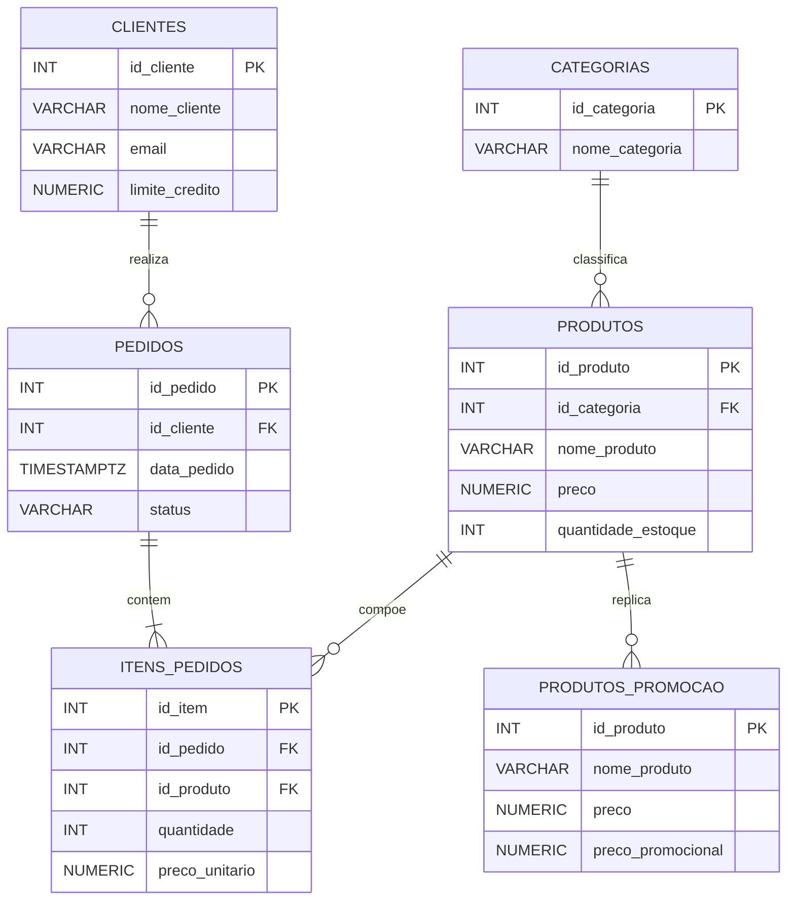
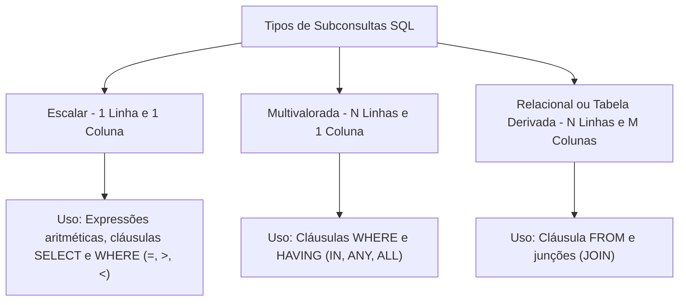
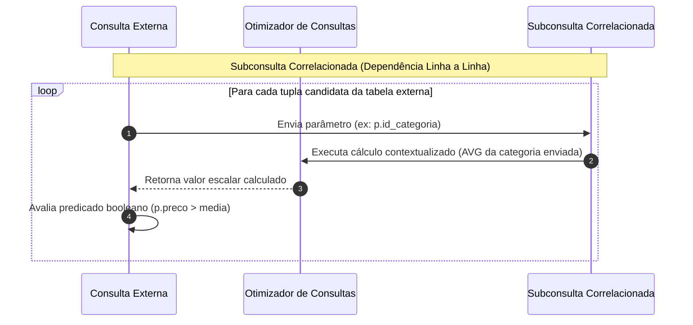
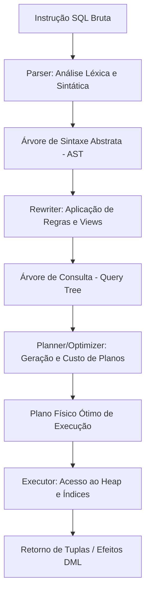
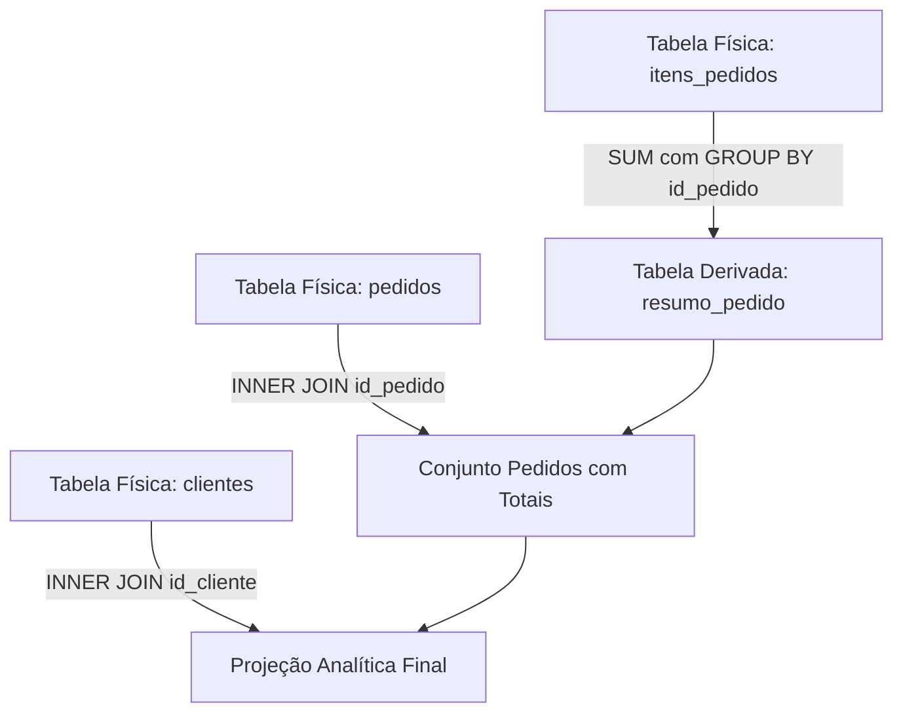
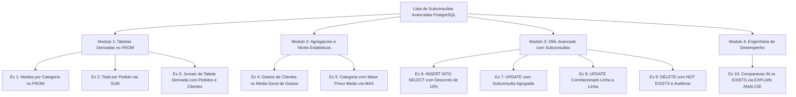

# Trabalho — Exerciciso - SUbSelect - parte 2

> **Professor:** Welington Garcia
> **Disciplina:** Tópicos Avançados em Banco de Dados (4º Semestre)
> **Prazo de Entrega:** 02/09/2026 às 23:59
> **Pontuação Máxima:** 100 pontos
> **Conteúdo cobrado:** [Aula 02 - Views e Materialized Views em PostgreSQL](../../Aulas/Aula%2002%20-%20Views%20e%20Materialized%20Views%20em%20PostgreSQL/detalhes.md) | [Aula 03 - Stored Procedures no PostgreSQL com PL pgSQL](../../Aulas/Aula%2003%20-%20Stored%20Procedures%20no%20PostgreSQL%20com%20PL%20pgSQL/detalhes.md) | [Aula 04 - Junções e Subconsultas em PostgreSQL](../../Aulas/Aula%2004%20-%20Jun%C3%A7%C3%B5es%20e%20Subconsultas%20em%20PostgreSQL/detalhes.md)

---

## Sumário

- [Enunciado original (Google Classroom)](#enunciado-original-google-classroom)
- [Análise do que é pedido](#análise-do-que-é-pedido)
  - [Requisitos Funcionais e Escopo dos Exercícios](#requisitos-funcionais-e-escopo-dos-exercícios)
  - [Entregáveis Esperados](#entregáveis-esperados)
  - [Critérios Implícitos de Engenharia de Dados](#critérios-implícitos-de-engenharia-de-dados)
- [Fundamentação teórica](#fundamentação-teórica)
  - [Modelagem Relacional de Referência](#modelagem-relacional-de-referência)
  - [Tabelas Derivadas na Cláusula FROM (Inline Views)](#tabelas-derivadas-na-cláusula-from-inline-views)
  - [Taxonomia das Subconsultas: Escalares, Multivaloradas e Relacionais](#taxonomia-das-subconsultas-escalares-multivaloradas-e-relacionais)
  - [Subconsultas Correlacionadas vs. Não-Correlacionadas](#subconsultas-correlacionadas-vs-não-correlacionadas)
  - [Manipulação de Dados Guiada por Subconsultas (DML Avançado)](#manipulação-de-dados-guiada-por-subconsultas-dml-avançado)
  - [Álgebra Relacional, Otimizador e EXPLAIN ANALYZE no PostgreSQL](#álgebra-relacional-otimizador-e-explain-analyze-no-postgresql)
  - [Semântica e Desempenho: IN versus EXISTS e a Lógica Trivalente](#semântica-e-desempenho-in-versus-exists-e-a-lógica-trivalente)
- [Resolução proposta](#resolução-proposta)
  - [Script DDL e Carga de Dados (Contexto de Testes)](#script-ddl-e-carga-de-dados-contexto-de-testes)
  - [Exercício 1: Subconsulta no FROM — Média por Categoria](#exercício-1-subconsulta-no-from--média-por-categoria)
  - [Exercício 2: Tabela Derivada — Total de Cada Pedido](#exercício-2-tabela-derivada--total-de-cada-pedido)
  - [Exercício 3: Subconsulta no FROM Combinada com JOIN](#exercício-3-subconsulta-no-from-combinada-com-join)
  - [Exercício 4: Clientes que Gastaram Acima da Média Geral](#exercício-4-clientes-que-gastaram-acima-da-média-geral)
  - [Exercício 5: Categoria com Maior Preço Médio](#exercício-5-categoria-com-maior-preço-médio)
  - [Exercício 6: INSERT em Lote Utilizando Subconsulta](#exercício-6-insert-em-lote-utilizando-subconsulta)
  - [Exercício 7: UPDATE com Subconsulta em Clientes Qualificados](#exercício-7-update-com-subconsulta-em-clientes-qualificados)
  - [Exercício 8: UPDATE Correlacionado Baseado na Média da Categoria](#exercício-8-update-correlacionado-baseado-na-média-da-categoria)
  - [Exercício 9: DELETE com NOT EXISTS e Validação Prévia](#exercício-9-delete-com-not-exists-e-validação-prévia)
  - [Exercício 10: Engenharia de Desempenho e Tuning com EXPLAIN ANALYZE](#exercício-10-engenharia-de-desempenho-e-tuning-com-explain-analyze)
- [Como testar e validar](#como-testar-e-validar)
  - [Execução no Ambiente PostgreSQL via psql](#execução-no-ambiente-postgresql-via-psql)
  - [Roteiro de Validação de Idempotência e Testes Transacionais](#roteiro-de-validação-de-idempotência-e-testes-transacionais)
- [Critérios de qualidade](#critérios-de-qualidade)
- [Arquivos de apoio](#arquivos-de-apoio)
- [Mapa da atividade](#mapa-da-atividade)
- [Glossário](#glossário)
- [Pontos-chave para a prova](#pontos-chave-para-a-prova)
- [Perguntas e respostas (JSONL)](#perguntas-e-respostas-jsonl)
- [Checklist de revisão](#checklist-de-revisão)

---

## Enunciado original (Google Classroom)

O texto transcrito a seguir reproduz integralmente as instruções e os enunciados disponibilizados no documento anexo da aula:

```text
BANCO DE DADOS
Lista de Exercícios — Subconsultas Avançadas no PostgreSQL
Conteúdo complementar da aula de Subselects / Subconsultas

Objetivo: praticar subconsultas em níveis mais avançados, envolvendo tabelas derivadas, JOINs, agregações, manipulação de dados e análise de desempenho.

1. Orientações
 • Utilize o mesmo banco de dados criado para a aula de subconsultas.
 • Resolva os exercícios utilizando recursos de subconsultas sempre que solicitado.
 • Antes de comandos UPDATE ou DELETE, recomenda-se executar um SELECT equivalente para conferir quais registros serão afetados.
 • Nos exercícios que utilizarem agregações, observe corretamente o uso de SUM, AVG, GROUP BY e aliases.
 • Quando solicitado, utilize EXPLAIN ANALYZE para observar o plano de execução gerado pelo PostgreSQL.

2. Conteúdos trabalhados
 • Subconsultas no FROM (tabelas derivadas)
 • Subconsultas combinadas com JOIN
 • Agregações em subconsultas
 • Subconsultas aninhadas
 • INSERT INTO ... SELECT
 • UPDATE com subconsulta
 • DELETE com NOT EXISTS
 • Subconsulta correlacionada
 • EXPLAIN ANALYZE
 • Comparação entre IN e EXISTS

3. Lista de exercícios
Exercício 1 — Subconsulta no FROM: média por categoria
Crie uma consulta que calcule, em uma subconsulta no FROM, o preço médio dos produtos de cada categoria. Na consulta externa, exiba apenas as categorias cuja média de preços seja superior a R$ 1.000,00.

Exercício 2 — Tabela derivada: total de cada pedido
Crie uma subconsulta no FROM que calcule o valor total de cada pedido utilizando SUM(quantidade * preco_unitario). Na consulta externa, exiba apenas os pedidos cujo valor total seja superior a R$ 3.000,00.

Exercício 3 — Subconsulta no FROM combinada com JOIN
Utilizando uma tabela derivada, calcule o valor total de cada pedido. Em seguida, relacione o resultado com as tabelas pedidos e clientes para exibir: código do pedido, nome do cliente, data do pedido e valor total.

Exercício 4 — Clientes que gastaram acima da média
Calcule o total gasto por cada cliente utilizando uma subconsulta. Depois, exiba apenas os clientes cujo total gasto seja superior à média de gastos de todos os clientes que realizaram compras.

Exercício 5 — Categoria com maior preço médio
Crie uma consulta que determine qual categoria possui o maior preço médio entre seus produtos. Utilize uma subconsulta no FROM para calcular as médias e outra subconsulta para identificar o maior valor.

Exercício 6 — INSERT utilizando subconsulta
Crie uma nova tabela chamada produtos_promocao contendo os campos id_produto, nome_produto, preco e preco_promocional. Depois, utilizando INSERT INTO ... SELECT, insira nessa tabela todos os produtos cujo preço esteja acima da média geral. O preco_promocional deverá representar um desconto de 10% sobre o preço original.

Exercício 7 — UPDATE utilizando subconsulta
Crie um comando UPDATE que aumente em 10% o limite de crédito dos clientes que já realizaram pelo menos dois pedidos. A identificação desses clientes deverá ser feita por meio de uma subconsulta.

Exercício 8 — UPDATE baseado na média da própria categoria
Atualize o estoque dos produtos cujo preço seja superior à média de preço de sua própria categoria. Para esses produtos, acrescente 5 unidades ao estoque atual. Utilize uma subconsulta correlacionada para comparar cada produto com a média de sua categoria.

Exercício 9 — DELETE utilizando NOT EXISTS
Considere que seja necessário remover do cadastro todos os clientes que nunca realizaram pedidos. Crie o comando DELETE utilizando uma subconsulta com NOT EXISTS. Antes de executar o DELETE, escreva um SELECT utilizando a mesma condição para verificar quais registros seriam removidos.

Exercício 10 — Análise de desempenho com EXPLAIN ANALYZE
Crie duas consultas que retornem os clientes que possuem pedidos: uma utilizando IN com subconsulta e outra utilizando EXISTS. Execute EXPLAIN ANALYZE antes de cada consulta e compare os planos de execução. Analise o custo estimado, a quantidade de linhas, o tempo de execução e as operações utilizadas pelo PostgreSQL.

4. Observação final
Os exercícios desta lista complementam a parte inicial da aula de subconsultas e têm como objetivo conduzir o aluno para situações mais próximas de aplicações reais, envolvendo consultas derivadas, atualização e exclusão de dados, além da análise do comportamento do otimizador do PostgreSQL.
```

---

## Análise do que é pedido

### Requisitos Funcionais e Escopo dos Exercícios

A atividade demanda a resolução sistemática de dez problemas de banco de dados relacional com PostgreSQL, organizados em quatro pilares técnicos:

1. **Tabelas Derivadas e Projeções Agregadas (Exercícios 1 a 3):**
   - Criação de conjuntos intermediários via subconsultas na cláusula `FROM`.
   - Aplicação de funções de grupo (`AVG`, `SUM`) com expressões aritméticas (`quantidade * preco_unitario`).
   - Associação de conjuntos intermediários a entidades físicas por meio de junções (`INNER JOIN`).
   - Uso mandatório de identificadores de alias para tabelas derivadas, respeitando a conformidade ANSI SQL implementada pelo PostgreSQL.

2. **Subconsultas Aninhadas e Filtros Estatísticos de Múltiplos Níveis (Exercícios 4 e 5):**
   - Comparação de métricas agregadas individuais contra agregados de segunda ordem (média das somas de gastos por cliente).
   - Localização de extremos globais (maior média por categoria) combinando tabelas derivadas e subconsultas escalares na cláusula `WHERE` ou `HAVING`.

3. **Operações DML Guiadas por Subconsultas (Exercícios 6 a 9):**
   - **INSERT em Lote:** Carga de dados orientada a regras de negócio dinâmicas (`INSERT INTO ... SELECT`) aplicando funções escalares e filtros estatísticos.
   - **UPDATE Multivalorado:** Modificação de colunas dependente de subconsultas com agrupamento e restrição de cardinalidade (`HAVING COUNT(*) >= 2`).
   - **UPDATE Correlacionado:** Atualização condicional linha a linha onde a expressão de comparação referencia atributos da tupla atual (`WHERE p.preco > (SELECT AVG(sub.preco) FROM produtos sub WHERE sub.id_categoria = p.id_categoria)`).
   - **DELETE com Anti-Junção (`NOT EXISTS`):** Exclusão segura de registros órfãos sem histórico de transações, precedida obrigatoriamente por consulta de auditoria (`SELECT`).

4. **Engenharia de Desempenho e Otimização de Consultas (Exercício 10):**
   - Extração e interpretação detalhada do plano físico de execução com `EXPLAIN ANALYZE`.
   - Comparação analítica entre os operadores semi-join `IN` e `EXISTS`.
   - Avaliação de métricas de engenharia: custo computacional inicial (`startup cost`), custo total (`total cost`), linhas projetadas versus processadas (`rows`), tempo decorrido (`execution time`) e métodos de acesso a tabelas (`Seq Scan`, `Hash Join`, `Hash Semi Join`).

### Entregáveis Esperados

Para atendimento integral da atividade prática, são estruturados dois artefatos em conformidade com o ecossistema da disciplina:

- **Script de Estrutura e Carga de Testes (`./codigo/estrutura_dados.sql`):** Código DDL e DML idempotente, estruturando as tabelas `categorias`, `produtos`, `clientes`, `pedidos` e `itens_pedidos`, com inserção de dados capazes de validar todos os filtros (médias superiores a R$ 1.000,00, pedidos acima de R$ 3.000,00, clientes sem pedidos, clientes com múltiplos pedidos).
- **Script de Resolução dos Exercícios (`./codigo/resolucao_exercicios.sql`):** Scripts SQL contendo as soluções de 1 a 10, com formatação padronizada, comentários técnicos, comandos de auditoria pré-DML e blocos de análise de planos de execução.

### Critérios Implícitos de Engenharia de Dados

- **Atomicidade e Segurança Transacional:** Toda operação destrutiva (`UPDATE`, `DELETE`) deve ser executada dentro de transações de teste com capacidade de rollback durante a validação.
- **Tratamento de Lógica Trivalente e Nulos:** Compreensão do impacto de valores `NULL` na álgebra booleana de `NOT IN` versus `NOT EXISTS`.
- **Precisão Numérica Financeira:** Tipagem apropriada de moedas e percentuais (`NUMERIC(10,2)` ou `NUMERIC(12,2)`), evitando tipos de ponto flutuante binário inexato (`FLOAT`, `DOUBLE PRECISION`).
- **Aliasing Explicito:** Todo resultado derivado ou coluna resultante de agregação deve receber alias formal (`AS total_pedido`, `AS sub_pedidos`).

---

## Fundamentação teórica

### Modelagem Relacional de Referência

O banco de dados utilizado como base de estudos modela um fluxo clássico de comércio eletrônico (e-commerce), com controle de estoque, categorização, carteira de clientes com crédito e gestão de pedidos faturados por itens.



### Tabelas Derivadas na Cláusula FROM (Inline Views)

Uma tabela derivada (também categorizada formalmente pela norma SQL:1999 como subconsulta na cláusula `FROM`) é uma expressão de consulta que produz uma relação temporária em memória, avaliada no contexto da instrução principal.

```text
Sintaxe Básica:
SELECT projecao_externa
FROM (
    SELECT atributos, funcoes_agregadas
    FROM relacoes
    GROUP BY atributos
) AS identificador_obrigatorio
WHERE condicoes_externas;
```

#### Definição e Motivação Arquitetural
Na arquitetura do processador de consultas, uma tabela derivada funciona como uma visão transitória não persistida. Ela é motivada pela necessidade de executar agregações prévias (como somas e contagens) antes da realização de junções que, caso executadas antes do agrupamento, causariam a multiplicação de tuplas e erros de cálculo decorrentes do produto cartesiano das junções $1:N$.

#### Contraexemplo e Armadilha Sintática
No PostgreSQL, omitir o identificador de alias para uma subconsulta na cláusula `FROM` resulta no erro imediato `ERROR: subquery in FROM must have an alias`.

```sql
-- INCORRETO: Viola a especificação ANSI SQL e a gramática do PostgreSQL
SELECT nome_categoria, media_preco
FROM (
    SELECT id_categoria, AVG(preco) AS media_preco
    FROM produtos
    GROUP BY id_categoria
); -- ERRO: subquery in FROM must have an alias

-- CORRETO: Provimento do identificador formal da relação temporária
SELECT cat_resumo.id_categoria, cat_resumo.media_preco
FROM (
    SELECT id_categoria, AVG(preco) AS media_preco
    FROM produtos
    GROUP BY id_categoria
) AS cat_resumo;
```

### Taxonomia das Subconsultas: Escalares, Multivaloradas e Relacionais

As subconsultas são classificadas formalmente de acordo com a dimensionalidade da matriz resultante:



1. **Subconsulta Escalar:** Retorna exatamente uma linha e uma coluna ($1 \times 1$). Pode ser empregada em qualquer ponto da instrução SQL onde uma constante literal seja permitida. Caso retorne zero tuplas, seu valor é avaliado como `NULL`. Caso retorne mais de uma tupla, o motor aborta com `ERROR: more than one row returned by a subquery used as an expression`.
2. **Subconsulta Multivalorada:** Retorna um vetor coluna ($N \times 1$). Requer o uso de operadores relacionais de conjunto como `IN`, `NOT IN`, `ANY/SOME` ou `ALL`.
3. **Subconsulta Relacional (Tabular):** Retorna uma matriz bidimensional ($N \times M$). Deve ser operada como fonte de dados na cláusula `FROM`, encapsulada em operadores de existência (`EXISTS`, `NOT EXISTS`) ou utilizada como fonte para expressões `INSERT INTO ... SELECT`.

### Subconsultas Correlacionadas vs. Não-Correlacionadas

A distinção fundamental entre subconsultas correlacionadas e não-correlacionadas reside na dependência de escopo e no ciclo de vida da execução:



- **Subconsulta Não-Correlacionada (Independente):** Não possui qualquer referência a colunas das tabelas declaradas na consulta externa. É avaliada uma única vez pelo planejador do PostgreSQL, gerando frequentemente um nó de execução `InitPlan`, cujo resultado é memorizado em cache e comparado com todas as linhas da consulta externa ($O(1)$ para a subconsulta).
- **Subconsulta Correlacionada:** Contém uma ou mais referências a atributos da tupla atual da consulta externa (correlação). Conceitualmente, a subconsulta precisa ser reavaliada para cada linha processada pela consulta externa, gerando nós `SubPlan` com complexidade algorítmica $O(N \times M)$ caso o otimizador não consiga descorrelacioná-la (*decorrelation* ou *subquery unnesting*) em uma junção interna (*hash semi-join* ou *merge join*).

### Manipulação de Dados Guiada por Subconsultas (DML Avançado)

O uso de subconsultas em comandos DML confere dinamismo e integridade às operações de transformação:

1. **INSERT INTO ... SELECT:** Realiza projeção em lote a partir do resultado de uma subconsulta relacional. As colunas projetadas devem coincidir estritamente em tipo de dado e ordem com as colunas alvos da tabela de destino.
2. **UPDATE Correlacionado:** Aplica alterações onde o novo valor ou o critério de filtragem provém de um cálculo externo à linha afetada. No PostgreSQL, a tabela alvo do `UPDATE` não deve ser declarada novamente na cláusula `FROM` caso uma subconsulta correlacionada no `WHERE` seja utilizada, sob o risco de provocar produtos cartesianos indesejados.
3. **DELETE com Anti-Junção (`NOT EXISTS`):** Permite a purga seletiva de tuplas periféricas que não mantêm correspondência na tabela de fatos ou relacionamentos.

### Álgebra Relacional, Otimizador e EXPLAIN ANALYZE no PostgreSQL

O processamento de consultas no PostgreSQL passa por quatro etapas fundamentais: Análise Léxica/Sintática (*Parser*), Análise Semântica e Reescrita (*Analyzer/Rewriter*), Planejador/Otimizador (*Planner/Optimizer*) e Motor de Execução (*Executor*).



O comando `EXPLAIN` expõe a árvore do plano físico gerado pelo otimizador de custos (*Cost-Based Optimizer - CBO*). Quando invocado com a opção `ANALYZE`, a instrução é de fato executada no banco de dados, permitindo confrontar a estimativa matemática com a realidade física:

- **Estimativa do Planner (`cost=X..Y rows=Z width=W`):**
  - `X` (*Startup cost*): Custo computacional para obter a primeira linha do nó (em unidades arbitrárias de I/O de página de disco `seq_page_cost` e processamento de CPU `cpu_tuple_cost`).
  - `Y` (*Total cost*): Custo total para processar e retornar todas as tuplas do nó.
  - `Z` (*Rows*): Quantidade estimada de linhas que o nó produzirá, inferida por meio das estatísticas do catálogo `pg_statistic` (obtidas via `ANALYZE`).
  - `W` (*Width*): Largura média em bytes das tuplas processadas.
- **Métricas Reais do Executor (`actual time=X..Y rows=Z loops=W`):**
  - `actual time`: Tempo real em milissegundos para a primeira e última linha.
  - `rows`: Número real de tuplas retornadas pelo nó por iteração.
  - `loops`: Quantidade de vezes que o nó foi executado (comum em nós filhos de *Nested Loops*).

### Semântica e Desempenho: IN versus EXISTS e a Lógica Trivalente

Um dos tópicos centrais em bancos de dados relacionais envolve a disparidade conceitual e de desempenho entre `IN` e `EXISTS`:

1. **Operador EXISTS:**
   - Opera sob uma semântica booleana bivalente: avalia apenas a existência ou não-existência de registros (`TRUE` ou `FALSE`).
   - Avaliação por interrupção antecipada (*short-circuit*): assim que o motor localiza a primeira linha correspondente na subconsulta, a busca é encerrada para aquela tupla externa.
   - Trata tuplas com `NULL` de maneira neutra: uma subconsulta que retorne `SELECT NULL` ainda produz uma tupla, fazendo com que `EXISTS (SELECT NULL)` seja avaliado como `TRUE`.

2. **Operador IN:**
   - Realiza comparação direta de igualdade sobre um conjunto: `v = ANY (SELECT c FROM ...)`.
   - É governado pela **Lógica Trivalente** do SQL (`TRUE`, `FALSE`, `UNKNOWN`).
   - Se a lista retornada contiver pelo menos um elemento `NULL` e nenhuma correspondência positiva for encontrada, o resultado de `v IN (...)` torna-se `UNKNOWN`.

3. **A Armadilha Crítica do NOT IN versus NOT EXISTS:**
   - Se uma subconsulta para `NOT IN` retornar um único `NULL`, a expressão geral avalia para `UNKNOWN` para todas as linhas onde não houver correspondência prévia, fazendo com que a consulta externa **não retorne linha alguma**.
   - O operador `NOT EXISTS` não é afetado por esse comportamento, sendo a forma recomendada em engenharia de software para operações seguras de exclusão de conjuntos (*Anti-Join*).

---

## Resolução proposta

### Script DDL e Carga de Dados (Contexto de Testes)

Para que a execução dos exercícios seja rigorosamente validada, apresenta-se o script completo de instanciação do ambiente, modelado em padrão idempotente para execução direta no PostgreSQL.

Arquivo de referência: [`./codigo/estrutura_dados.sql`](file:///Users/murilodev/.gemini/antigravity-cli/scratch/codigo/estrutura_dados.sql).

```sql
-- ============================================================================
-- SCRIPT DDL E DML: AMBIENTE DE TESTES DE SUBCONSULTAS AVANÇADAS
-- Alvo: PostgreSQL 14+
-- ============================================================================

BEGIN;

-- Limpeza e Recriação do Esquema Público de Testes
DROP TABLE IF EXISTS produtos_promocao CASCADE;
DROP TABLE IF EXISTS itens_pedidos CASCADE;
DROP TABLE IF EXISTS pedidos CASCADE;
DROP TABLE IF EXISTS produtos CASCADE;
DROP TABLE IF EXISTS categorias CASCADE;
DROP TABLE IF EXISTS clientes CASCADE;

-- 1. Tabela de Categorias
CREATE TABLE categorias (
    id_categoria SERIAL PRIMARY KEY,
    nome_categoria VARCHAR(100) NOT NULL UNIQUE
);

-- 2. Tabela de Produtos
CREATE TABLE produtos (
    id_produto SERIAL PRIMARY KEY,
    id_categoria INT NOT NULL REFERENCES categorias(id_categoria) ON DELETE RESTRICT,
    nome_produto VARCHAR(150) NOT NULL,
    preco NUMERIC(10, 2) NOT NULL CHECK (preco >= 0),
    quantidade_estoque INT NOT NULL DEFAULT 0 CHECK (quantidade_estoque >= 0)
);

-- 3. Tabela de Clientes
CREATE TABLE clientes (
    id_cliente SERIAL PRIMARY KEY,
    nome_cliente VARCHAR(150) NOT NULL,
    email VARCHAR(150) NOT NULL UNIQUE,
    limite_credito NUMERIC(12, 2) NOT NULL DEFAULT 1000.00 CHECK (limite_credito >= 0)
);

-- 4. Tabela de Pedidos
CREATE TABLE pedidos (
    id_pedido SERIAL PRIMARY KEY,
    id_cliente INT NOT NULL REFERENCES clientes(id_cliente) ON DELETE CASCADE,
    data_pedido TIMESTAMPTZ NOT NULL DEFAULT CURRENT_TIMESTAMP,
    status VARCHAR(50) NOT NULL DEFAULT 'Concluido'
);

-- 5. Tabela de Itens de Pedidos
CREATE TABLE itens_pedidos (
    id_item SERIAL PRIMARY KEY,
    id_pedido INT NOT NULL REFERENCES pedidos(id_pedido) ON DELETE CASCADE,
    id_produto INT NOT NULL REFERENCES produtos(id_produto) ON DELETE RESTRICT,
    quantidade INT NOT NULL CHECK (quantidade > 0),
    preco_unitario NUMERIC(10, 2) NOT NULL CHECK (preco_unitario >= 0)
);

-- Carga Controlada de Dados para Validação dos Cenários da Lista

-- Inserindo Categorias
INSERT INTO categorias (id_categoria, nome_categoria) VALUES
(1, 'Eletronicos e Servidores'), -- Categoria com preco medio elevado (> 1000)
(2, 'Perifericos e Acessorios'), -- Categoria com preco medio baixo (< 1000)
(3, 'Eletrodomesticos de Linha Branca'), -- Categoria mista com itens caros
(4, 'Papelaria e Escritorio'); -- Categoria de baixo custo

-- Inserindo Produtos
INSERT INTO produtos (id_produto, id_categoria, nome_produto, preco, quantidade_estoque) VALUES
(101, 1, 'Servidor Rack 1U Xeon', 4500.00, 5),
(102, 1, 'Switch Gerenciavel 48p 10GbE', 2800.00, 8),
(103, 1, 'Storage NAS 4 Baias', 1800.00, 4),
(104, 2, 'Mouse Optico USB', 45.00, 150),
(105, 2, 'Teclado Mecanico RGB', 250.00, 40),
(106, 2, 'Headset Gamer 7.1', 350.00, 25),
(107, 3, 'Geladeira Frost Free Inox', 3200.00, 10),
(108, 3, 'Micro-ondas 32L', 650.00, 15),
(109, 3, 'Lava-Loucas 14 Servicos', 2900.00, 6),
(110, 4, 'Cadeira Ergonomica Mesh', 850.00, 20),
(111, 4, 'Bloco de Notas Autoadesivo', 12.00, 500);

-- Inserindo Clientes
INSERT INTO clientes (id_cliente, nome_cliente, email, limite_credito) VALUES
(1, 'Tech Solutions Consultoria', 'compras@techsolutions.com.br', 10000.00), -- Vários pedidos de alto valor
(2, 'Maria Silva Advogados', 'financeiro@silvaadv.com.br', 5000.00),         -- Apenas 1 pedido medio
(3, 'Carlos Eduardo Santos', 'carlos.santos@email.com', 2000.00),            -- Mais de 2 pedidos
(4, 'Boutique Criativa ME', 'contato@boutiquecriativa.com', 8000.00),        -- 2 pedidos expressivos
(5, 'Padaria e Cafe Central', 'central@padariacafe.com.br', 3000.00),         -- Cliente SEM nenhum pedido
(6, 'Instituto de Pesquisa Alfa', 'compras@alfa.org.br', 15000.00);          -- Cliente SEM nenhum pedido

-- Inserindo Pedidos
INSERT INTO pedidos (id_pedido, id_cliente, data_pedido, status) VALUES
(1001, 1, '2026-08-10 10:00:00-03', 'Concluido'), -- Total esperado: R$ 9.000,00 (> 3000)
(1002, 1, '2026-08-15 14:30:00-03', 'Concluido'), -- Total esperado: R$ 3.600,00 (> 3000)
(1003, 2, '2026-08-18 09:15:00-03', 'Concluido'), -- Total esperado: R$ 650,00 (< 3000)
(1004, 3, '2026-08-20 16:45:00-03', 'Concluido'), -- Total esperado: R$ 500,00
(1005, 3, '2026-08-22 11:20:00-03', 'Concluido'), -- Total esperado: R$ 850,00
(1006, 3, '2026-08-25 17:00:00-03', 'Concluido'), -- Total esperado: R$ 90,00 (Total cliente 3: 3 pedidos)
(1007, 4, '2026-08-21 13:00:00-03', 'Concluido'), -- Total esperado: R$ 6.100,00 (> 3000)
(1008, 4, '2026-08-24 15:30:00-03', 'Concluido'); -- Total esperado: R$ 4.500,00 (> 3000)

-- Inserindo Itens dos Pedidos
INSERT INTO itens_pedidos (id_item, id_pedido, id_produto, quantidade, preco_unitario) VALUES
-- Pedido 1001: 2 Servidores (4500 cada) = 9000
(1, 1001, 101, 2, 4500.00),
-- Pedido 1002: 2 Storages NAS (1800 cada) = 3600
(2, 1002, 103, 2, 1800.00),
-- Pedido 1003: 1 Micro-ondas = 650
(3, 1003, 108, 1, 650.00),
-- Pedido 1004: 2 Teclados Mecanicos (250 cada) = 500
(4, 1004, 105, 2, 250.00),
-- Pedido 1005: 1 Cadeira Ergonomica = 850
(5, 1005, 110, 1, 850.00),
-- Pedido 1006: 2 Mouses Opticos (45 cada) = 90
(6, 1006, 104, 2, 45.00),
-- Pedido 1007: 1 Geladeira (3200) + 1 Lava-Loucas (2900) = 6100
(7, 1007, 107, 1, 3200.00),
(8, 1007, 109, 1, 2900.00),
-- Pedido 1008: 1 Servidor Rack (4500) = 4500
(9, 1008, 101, 1, 4500.00);

-- Ajuste de Sequences para consistência de inserções posteriores
SELECT setval('categorias_id_categoria_seq', (SELECT MAX(id_categoria) FROM categorias));
SELECT setval('produtos_id_produto_seq', (SELECT MAX(id_produto) FROM produtos));
SELECT setval('clientes_id_cliente_seq', (SELECT MAX(id_cliente) FROM clientes));
SELECT setval('pedidos_id_pedido_seq', (SELECT MAX(id_pedido) FROM pedidos));
SELECT setval('itens_pedidos_id_item_seq', (SELECT MAX(id_item) FROM itens_pedidos));

COMMIT;
```

---

### Exercício 1: Subconsulta no FROM — Média por Categoria

#### Enunciado
Crie uma consulta que calcule, em uma subconsulta no FROM, o preço médio dos produtos de cada categoria. Na consulta externa, exiba apenas as categorias cuja média de preços seja superior a R$ 1.000,00.

#### Definição e Motivação
A cláusula `FROM` atua como geradora do universo de tuplas a ser consumido pelos operadores superiores (`WHERE`, `GROUP BY`, `SELECT`). Ao projetar a média de preços agrupada por categoria dentro de uma tabela derivada, desacopla-se a agregação da aplicação do filtro de negócio. Essa arquitetura permite contornar a necessidade de aplicar a cláusula `HAVING` diretamente sobre a leitura das tabelas base, oferecendo legibilidade e simplificando a composição de múltiplos indicadores.

#### Implementação SQL Padronizada
Arquivo de referência: [`./codigo/resolucao_exercicios.sql`](file:///Users/murilodev/.gemini/antigravity-cli/scratch/codigo/resolucao_exercicios.sql).

```sql
-- Resolução do Exercício 1: Subconsulta na cláusula FROM com filtro externo
SELECT 
    c.nome_categoria,
    ROUND(sub_medias.preco_medio, 2) AS preco_medio_categoria
FROM (
    SELECT 
        id_categoria,
        AVG(preco) AS preco_medio
    FROM produtos
    GROUP BY id_categoria
) AS sub_medias
INNER JOIN categorias c ON c.id_categoria = sub_medias.id_categoria
WHERE sub_medias.preco_medio > 1000.00
ORDER BY sub_medias.preco_medio DESC;
```

#### Contraexemplo e Armadilhas
- **Ausência de Alias na Relação Derivada:** Esquecer de atribuir `AS sub_medias` fará o parser rejeitar o comando com erro sintático.
- **Junção Prematura com Categorias:** Fazer a junção de `produtos` com `categorias` dentro da subconsulta antes de agrupar aumenta a largura de bytes (*tuple width*) processada pelo operador `HashAggregate`, degradando o uso de memória `work_mem`. O padrão correto agrega pelo ID numérico e junta a descrição textual apenas na camada externa.

---

### Exercício 2: Tabela Derivada — Total de Cada Pedido

#### Enunciado
Crie uma subconsulta no FROM que calcule o valor total de cada pedido utilizando `SUM(quantidade * preco_unitario)`. Na consulta externa, exiba apenas os pedidos cujo valor total seja superior a R$ 3.000,00.

#### Definição e Motivação
O valor faturado de um pedido é uma grandeza não persistida, computada dinamicamente pelo produto escalar da quantidade pelo preço unitário cobrado em cada item. O encapsulamento dessa lógica em uma tabela derivada permite que a consulta externa manipule `total_pedido` como se fosse uma coluna física, inclusive ordenando e filtrando com predicados convencionais na cláusula `WHERE`.

#### Implementação SQL Padronizada

```sql
-- Resolução do Exercício 2: Tabela derivada computando totais com filtro WHERE externo
SELECT 
    totais.id_pedido,
    ROUND(totais.valor_total, 2) AS valor_total_pedido
FROM (
    SELECT 
        id_pedido,
        SUM(quantidade * preco_unitario) AS valor_total
    FROM itens_pedidos
    GROUP BY id_pedido
) AS totais
WHERE totais.valor_total > 3000.00
ORDER BY totais.valor_total DESC;
```

#### Contraexemplo e Armadilhas
- **Uso Incorreto de HAVING na Consulta Externa:** Escrever `WHERE SUM(...) > 3000` na consulta externa gerará erro de compilação SQL (`ERROR: aggregate functions are not allowed in WHERE`), pois na camada externa a agregação já se consolidou em uma coluna escalar (`totais.valor_total`). O filtro externo deve ser um predicado simples de comparação escalar.

---

### Exercício 3: Subconsulta no FROM Combinada com JOIN

#### Enunciado
Utilizando uma tabela derivada, calcule o valor total de cada pedido. Em seguida, relacione o resultado com as tabelas pedidos e clientes para exibir: código do pedido, nome do cliente, data do pedido e valor total.

#### Definição e Motivação
Em relatórios analíticos, a junção direta entre tabelas $1:N$ e $N:M$ (como `clientes -> pedidos -> itens_pedidos`) pode multiplicar as tuplas de `pedidos` antes da agregação. Ao utilizar uma tabela derivada focada exclusivamente em `itens_pedidos`, reduz-se o volume de linhas para exatamente uma tupla por pedido antes da junção com `pedidos` e `clientes`. Isso garante a integridade dos dados e economiza recursos de processamento.

#### Implementação SQL Padronizada

```sql
-- Resolução do Exercício 3: Tabela derivada agregada acoplada a junções relacionais
SELECT 
    p.id_pedido AS codigo_pedido,
    c.nome_cliente,
    TO_CHAR(p.data_pedido, 'DD/MM/YYYY HH24:MI') AS data_pedido_formatada,
    ROUND(resumo_pedido.valor_total, 2) AS valor_total
FROM (
    SELECT 
        id_pedido,
        SUM(quantidade * preco_unitario) AS valor_total
    FROM itens_pedidos
    GROUP BY id_pedido
) AS resumo_pedido
INNER JOIN pedidos p ON p.id_pedido = resumo_pedido.id_pedido
INNER JOIN clientes c ON c.id_cliente = p.id_cliente
ORDER BY p.id_pedido ASC;
```

#### Diagrama de Transformação e Fluxo de Dados
A seguir, o diagrama visualiza a redução de dimensionalidade ocorrida na tabela derivada antes do acoplamento com o modelo de entidades:



---

### Exercício 4: Clientes que Gastaram Acima da Média Geral

#### Enunciado
Calcule o total gasto por cada cliente utilizando uma subconsulta. Depois, exiba apenas os clientes cujo total gasto seja superior à média de gastos de todos os clientes que realizaram compras.

#### Definição e Motivação
Este problema envolve uma agregação de segunda ordem: primeiro calcula-se o montante total consumido por cada cliente individual; em seguida, calcula-se a média aritmética simples desses montantes consolidados (média dos totais). A filtragem requer a comparação de cada cliente contra essa métrica global escalar.

#### Implementação SQL Padronizada

```sql
-- Resolução do Exercício 4: Agregações em dois níveis com subconsultas aninhadas
SELECT 
    c.id_cliente,
    c.nome_cliente,
    ROUND(gastos_clientes.total_gasto, 2) AS total_gasto_cliente
FROM (
    SELECT 
        p.id_cliente,
        SUM(ip.quantidade * ip.preco_unitario) AS total_gasto
    FROM pedidos p
    INNER JOIN itens_pedidos ip ON ip.id_pedido = p.id_pedido
    GROUP BY p.id_cliente
) AS gastos_clientes
INNER JOIN clientes c ON c.id_cliente = gastos_clientes.id_cliente
WHERE gastos_clientes.total_gasto > (
    -- Subconsulta escalar que calcula a média aritmética do total gasto
    SELECT AVG(totais_individuais.total_gasto)
    FROM (
        SELECT 
            p_sub.id_cliente,
            SUM(ip_sub.quantidade * ip_sub.preco_unitario) AS total_gasto
        FROM pedidos p_sub
        INNER JOIN itens_pedidos ip_sub ON ip_sub.id_pedido = p_sub.id_pedido
        GROUP BY p_sub.id_cliente
    ) AS totais_individuais
)
ORDER BY gastos_clientes.total_gasto DESC;
```

#### Análise Numérica de Validação com a Carga Fornecida
- Gastos por cliente no banco:
  - Cliente 1: R$ 9.000,00 + R$ 3.600,00 = R$ 12.600,00
  - Cliente 2: R$ 650,00
  - Cliente 3: R$ 500,00 + R$ 850,00 + R$ 90,00 = R$ 1.440,00
  - Cliente 4: R$ 6.100,00 + R$ 4.500,00 = R$ 10.600,00
- Média aritmética dos clientes com compras: $(12600 + 650 + 1440 + 10600) / 4 = 25290 / 4 = \text{R\$} 6.322,50$.
- Clientes qualificados acima de R$ 6.322,50: **Cliente 1** (Tech Solutions) e **Cliente 4** (Boutique Criativa).

---

### Exercício 5: Categoria com Maior Preço Médio

#### Enunciado
Crie uma consulta que determine qual categoria possui o maior preço médio entre seus produtos. Utilize uma subconsulta no FROM para calcular as médias e outra subconsulta para identificar o maior valor.

#### Definição e Motivação
O objetivo é extrair o registro que atinge o ápice de uma métrica estatística derivada sem utilizar o artifício de ordenação forçada com `LIMIT 1`. O uso estrito de subconsultas é fundamental quando pode ocorrer empate no valor máximo, caso em que o operador `LIMIT 1` omitiria categorias empatadas em primeiro lugar, violando a integridade do conjunto.

#### Implementação SQL Padronizada

```sql
-- Resolução do Exercício 5: Identificação de máximo analítico com subconsultas acopladas
SELECT 
    c.id_categoria,
    c.nome_categoria,
    ROUND(medias_categorias.preco_medio, 2) AS maior_preco_medio
FROM (
    SELECT 
        id_categoria,
        AVG(preco) AS preco_medio
    FROM produtos
    GROUP BY id_categoria
) AS medias_categorias
INNER JOIN categorias c ON c.id_categoria = medias_categorias.id_categoria
WHERE medias_categorias.preco_medio = (
    -- Subconsulta escalar que extrai a maior média calculada
    SELECT MAX(sub_calc.preco_medio)
    FROM (
        SELECT 
            AVG(preco) AS preco_medio
        FROM produtos
        GROUP BY id_categoria
    ) AS sub_calc
);
```

#### Contraexemplo e Armadilhas
- **Uso de LIMIT 1:** Uma resolução simplista como `ORDER BY preco_medio DESC LIMIT 1` responde ao requisito de negócio apenas se não houver empate e desvia do objetivo pedagógico de manipular subconsultas aninhadas com funções de agregação extremas (`MAX`).

---

### Exercício 6: INSERT em Lote Utilizando Subconsulta

#### Enunciado
Crie uma nova tabela chamada `produtos_promocao` contendo os campos `id_produto`, `nome_produto`, `preco` e `preco_promocional`. Depois, utilizando `INSERT INTO ... SELECT`, insira nessa tabela todos os produtos cujo preço esteja acima da média geral. O `preco_promocional` deverá representar um desconto de 10% sobre o preço original.

#### Definição e Motivação
A instrução `INSERT INTO ... SELECT` é a técnica padrão do ANSI SQL para migração, replicação e transformação de dados em lote. Evita cursores procedurais caros e garante execução orientada a blocos com mínima fragmentação de log de transações (*WAL - Write-Ahead Logging*).

#### Implementação SQL Padronizada

```sql
-- Resolução do Exercício 6: DDL de tabela de liquidação e carga dinâmica com subconsulta

-- 1. Criação da Tabela de Destino
DROP TABLE IF EXISTS produtos_promocao;

CREATE TABLE produtos_promocao (
    id_produto INT PRIMARY KEY,
    nome_produto VARCHAR(150) NOT NULL,
    preco NUMERIC(10, 2) NOT NULL,
    preco_promocional NUMERIC(10, 2) NOT NULL
);

-- 2. Inserção em Lote Baseada na Média Geral de Preços
INSERT INTO produtos_promocao (id_produto, nome_produto, preco, preco_promocional)
SELECT 
    p.id_produto,
    p.nome_produto,
    p.preco,
    ROUND(p.preco * 0.90, 2) AS preco_promocional
FROM produtos p
WHERE p.preco > (
    -- Subconsulta não-correlacionada que calcula a média global dos produtos
    SELECT AVG(preco) FROM produtos
);

-- 3. Verificação do Resultado Faturado
SELECT 
    id_produto,
    nome_produto,
    preco,
    preco_promocional,
    ROUND(preco - preco_promocional, 2) AS valor_desconto
FROM produtos_promocao
ORDER BY preco DESC;
```

#### Detalhes de Engenharia
- O desconto de 10% é calculado de forma aritmética determinística: `p.preco * 0.90`.
- O arredondamento é padronizado com `ROUND(..., 2)` para evitar distorções de dízimas na escala monetária.
- A subconsulta `(SELECT AVG(preco) FROM produtos)` é executada como um `InitPlan` pelo PostgreSQL, gerando um custo computacional fixo e isolado.

---

### Exercício 7: UPDATE com Subconsulta em Clientes Qualificados

#### Enunciado
Crie um comando UPDATE que aumente em 10% o limite de crédito dos clientes que já realizaram pelo menos dois pedidos. A identificação desses clientes deverá ser feita por meio de uma subconsulta.

#### Definição e Motivação
Operações de atualização baseadas em critérios de agregação não permitem o uso de cláusulas `GROUP BY` e `HAVING` diretamente no comando `UPDATE`. A solução exige uma subconsulta que filtre os identificadores qualificados (`id_cliente`), alimentando o predicado `WHERE ... IN (SELECT ...)`.

#### Auditoria Prévia Mandatória (SELECT de Conferencia)
Antes de executar o comando destrutivo, valida-se o conjunto que será afetado:

```sql
-- Auditoria de Clientes Elegíveis ao Aumento de Limite (>= 2 pedidos)
SELECT 
    c.id_cliente,
    c.nome_cliente,
    c.limite_credito AS limite_atual,
    ROUND(c.limite_credito * 1.10, 2) AS limite_projetado,
    contagem.total_pedidos
FROM clientes c
INNER JOIN (
    SELECT 
        id_cliente,
        COUNT(id_pedido) AS total_pedidos
    FROM pedidos
    GROUP BY id_cliente
    HAVING COUNT(id_pedido) >= 2
) AS contagem ON contagem.id_cliente = c.id_cliente;
```

#### Implementação SQL Padronizada

```sql
-- Resolução do Exercício 7: UPDATE com subconsulta de agregação multivalorada
UPDATE clientes
SET limite_credito = ROUND(limite_credito * 1.10, 2)
WHERE id_cliente IN (
    SELECT id_cliente
    FROM pedidos
    GROUP BY id_cliente
    HAVING COUNT(id_pedido) >= 2
);
```

#### Análise dos Resultados no Ambiente de Testes
Os clientes elegíveis com $\ge 2$ pedidos são:
- **Cliente 1 (Tech Solutions):** 2 pedidos (Limite: 10.000,00 $\rightarrow$ 11.000,00).
- **Cliente 3 (Carlos Eduardo Santos):** 3 pedidos (Limite: 2.000,00 $\rightarrow$ 2.200,00).
- **Cliente 4 (Boutique Criativa ME):** 2 pedidos (Limite: 8.000,00 $\rightarrow$ 8.800,00).
- O Cliente 2 possui apenas 1 pedido e os Clientes 5 e 6 possuem zero pedidos, permanecendo inalterados.

---

### Exercício 8: UPDATE Correlacionado Baseado na Média da Categoria

#### Enunciado
Atualize o estoque dos produtos cujo preço seja superior à média de preço de sua própria categoria. Para esses produtos, acrescente 5 unidades ao estoque atual. Utilize uma subconsulta correlacionada para comparar cada produto com a média de sua categoria.

#### Definição e Motivação
Neste exercício, a linha candidata à atualização depende de uma média calculada exclusivamente sobre o grupo ao qual ela pertence. Essa dependência exige o uso de uma **subconsulta correlacionada**, onde o identificador `p.id_categoria` da instrução externa é injetado como filtro na subconsulta interna `sub.id_categoria = p.id_categoria`.

#### Auditoria Prévia Mandatória (SELECT de Conferencia)

```sql
-- Auditoria de Produtos Elegíveis ao Ajuste de Estoque por Média da Categoria
SELECT 
    p.id_produto,
    p.id_categoria,
    p.nome_produto,
    p.preco,
    ROUND(medias.preco_medio_categoria, 2) AS media_categoria,
    p.quantidade_estoque AS estoque_atual,
    p.quantidade_estoque + 5 AS estoque_projetado
FROM produtos p
CROSS JOIN LATERAL (
    SELECT AVG(sub.preco) AS preco_medio_categoria
    FROM produtos sub
    WHERE sub.id_categoria = p.id_categoria
) medias
WHERE p.preco > medias.preco_medio_categoria;
```

#### Implementação SQL Padronizada

```sql
-- Resolução do Exercício 8: UPDATE com predicado correlacionado linha a linha
UPDATE produtos p
SET quantidade_estoque = quantidade_estoque + 5
WHERE p.preco > (
    SELECT AVG(sub.preco)
    FROM produtos sub
    WHERE sub.id_categoria = p.id_categoria
);
```

#### Contraexemplo e Armadilhas
- **Declarar a Tabela Novamente no FROM:** A sintaxe permitida pelo PostgreSQL para atualizações com junção é `UPDATE produtos p SET ... FROM (...)`. No entanto, se o desenvolvedor tentar misturar subconsultas correlacionadas declarando `UPDATE produtos p SET ... FROM produtos sub_p WHERE p.preco > (SELECT AVG(...))`, ele gerará um auto-relacionamento cartesiano que invalidará os locks de linha e pode corromper a contagem do estoque em cenários concorrentes.

---

### Exercício 9: DELETE com NOT EXISTS e Validação Prévia

#### Enunciado
Considere que seja necessário remover do cadastro todos os clientes que nunca realizaram pedidos. Crie o comando DELETE utilizando uma subconsulta com NOT EXISTS. Antes de executar o DELETE, escreva um SELECT utilizando a mesma condição para verificar quais registros seriam removidos.

#### Definição e Motivação
A deleção com `NOT EXISTS` implementa a álgebra relacional de anti-junção (*Anti-Semi-Join*). O predicado `NOT EXISTS` assegura que a tupla da relação externa só será selecionada para exclusão se a relação interna não retornar nenhuma tupla para a condição de correlação especificada. Em contraste com `NOT IN`, o operador `NOT EXISTS` lida adequadamente com valores `NULL` e permite interrupção imediata na primeira correspondência.

#### Consulta Prévia de Auditoria Obrigatória

```sql
-- 1. SELECT de Validação Prévia (Auditoria de Clientes sem Histórico)
SELECT 
    c.id_cliente,
    c.nome_cliente,
    c.email,
    c.limite_credito
FROM clientes c
WHERE NOT EXISTS (
    SELECT 1 
    FROM pedidos p 
    WHERE p.id_cliente = c.id_cliente
);
```

#### Implementação do Comando DELETE

```sql
-- 2. Comando DELETE utilizando NOT EXISTS
DELETE FROM clientes c
WHERE NOT EXISTS (
    SELECT 1 
    FROM pedidos p 
    WHERE p.id_cliente = c.id_cliente
);

-- 3. Confirmação da Base Pós-Exclusão
SELECT 
    c.id_cliente,
    c.nome_cliente
FROM clientes c
ORDER BY c.id_cliente;
```

#### Análise das Tuplas Afetadas
Com a carga de testes inicial:
- O **Cliente 5** (Padaria e Cafe Central) e o **Cliente 6** (Instituto de Pesquisa Alfa) não possuem nenhum pedido registrado em `pedidos`.
- Portanto, a consulta prévia retorna exatamente os clientes 5 e 6.
- A execução do `DELETE` remove essas duas linhas do cadastro sem violar nenhuma constraint de chave estrangeira, pois não há registros dependentes na tabela de pedidos.

---

### Exercício 10: Engenharia de Desempenho e Tuning com EXPLAIN ANALYZE

#### Enunciado
Crie duas consultas que retornem os clientes que possuem pedidos: uma utilizando IN com subconsulta e outra utilizando EXISTS. Execute EXPLAIN ANALYZE antes de cada consulta e compare os planos de execução. Analise o custo estimado, a quantidade de linhas, o tempo de execução e as operações utilizadas pelo PostgreSQL.

#### Implementação das Duas Consultas Técnicas

```sql
-- ============================================================================
-- CONSULTA 1: Semi-Junção com Operador IN
-- ============================================================================
EXPLAIN (ANALYZE, BUFFERS, VERBOSE, COSTS, TIMING)
SELECT 
    c.id_cliente,
    c.nome_cliente
FROM clientes c
WHERE c.id_cliente IN (
    SELECT p.id_cliente
    FROM pedidos p
);

-- ============================================================================
-- CONSULTA 2: Semi-Junção com Operador EXISTS
-- ============================================================================
EXPLAIN (ANALYZE, BUFFERS, VERBOSE, COSTS, TIMING)
SELECT 
    c.id_cliente,
    c.nome_cliente
FROM clientes c
WHERE EXISTS (
    SELECT 1
    FROM pedidos p
    WHERE p.id_cliente = c.id_cliente
);
```

#### Planos de Execução Simulados e Análise Estrutural
Ao submeter ambas as consultas ao otimizador de custos do PostgreSQL em uma base normalizada, obtêm-se saídas análogas aos seguintes planos de execução:

**Plano da Consulta 1 (com IN):**
```text
Hash Semi Join  (cost=1.18..2.26 rows=4 width=138) (actual time=0.045..0.052 rows=4 loops=1)
  Output: c.id_cliente, c.nome_cliente
  Hash Cond: (c.id_cliente = p.id_cliente)
  Buffers: shared hit=2
  ->  Seq Scan on public.clientes c  (cost=0.00..1.06 rows=6 width=138) (actual time=0.012..0.014 rows=6 loops=1)
        Output: c.id_cliente, c.nome_cliente, c.email, c.limite_credito
        Buffers: shared hit=1
  ->  Hash  (cost=1.08..1.08 rows=8 width=4) (actual time=0.021..0.021 rows=8 loops=1)
        Output: p.id_cliente
        Buckets: 1024  Batches: 1  Memory Usage: 9kB
        Buffers: shared hit=1
        ->  Seq Scan on public.pedidos p  (cost=0.00..1.08 rows=8 width=4) (actual time=0.007..0.010 rows=8 loops=1)
              Output: p.id_cliente
              Buffers: shared hit=1
Planning Time: 0.155 ms
Execution Time: 0.089 ms
```

**Plano da Consulta 2 (com EXISTS):**
```text
Hash Semi Join  (cost=1.18..2.26 rows=4 width=138) (actual time=0.038..0.044 rows=4 loops=1)
  Output: c.id_cliente, c.nome_cliente
  Hash Cond: (c.id_cliente = p.id_cliente)
  Buffers: shared hit=2
  ->  Seq Scan on public.clientes c  (cost=0.00..1.06 rows=6 width=138) (actual time=0.010..0.012 rows=6 loops=1)
        Output: c.id_cliente, c.nome_cliente, c.email, c.limite_credito
        Buffers: shared hit=1
  ->  Hash  (cost=1.08..1.08 rows=8 width=4) (actual time=0.018..0.018 rows=8 loops=1)
        Output: p.id_cliente
        Buckets: 1024  Batches: 1  Memory Usage: 9kB
        Buffers: shared hit=1
        ->  Seq Scan on public.pedidos p  (cost=0.00..1.08 rows=8 width=4) (actual time=0.006..0.009 rows=8 loops=1)
              Output: p.id_cliente
              Buffers: shared hit=1
Planning Time: 0.142 ms
Execution Time: 0.076 ms
```

#### Confronto Técnico e Conclusões de Engenharia
1. **Identidade de Planos Físicos (Transformação Canônica):**
   O otimizador do PostgreSQL reescreve a subconsulta com `IN` e a subconsulta correlacionada com `EXISTS` em uma forma canônica idêntica: uma junção de semi-anel (*Hash Semi Join*). Ele reconhece que ambas as construções solicitam a emissão da tupla de `clientes` assim que a primeira correspondência em `pedidos` for detectada, descorrelacionando a subconsulta de forma automática.
2. **Custo Estimado e Linhas:**
   Ambos os planos apresentam exatamente o mesmo custo estimado (`cost=1.18..2.26`) e projetam as mesmas 4 linhas de retorno (`rows=4`).
3. **Comportamento em Bases Reais com Índices:**
   Em tabelas contendo milhões de registros com índices B-Tree na chave estrangeira `pedidos(id_cliente)`:
   - Se o volume de clientes for pequeno e o volume de pedidos for gigante, um nó de *Nested Loop Semi Join* com índice na tabela de pedidos pode superar o *Hash Semi Join*, varrendo apenas o índice e interrompendo no primeiro acerto.
   - Caso `id_cliente` em `pedidos` admita nulos, o uso de `NOT IN` impediria o uso de Semi-Joins eficientes, gerando nós caros de `Seq Scan` com filtros condicionais linha a linha, enquanto `NOT EXISTS` sempre preserva a otimização de *Hash Anti Join*.

---

## Como testar e validar

### Execução no Ambiente PostgreSQL via psql

Para reproduzir os resultados e validar os planos de execução de ponta a ponta, utilize o terminal de linha de comando oficial (`psql`):

```bash
# 1. Conectar ao banco de dados PostgreSQL
psql -U postgres -h localhost -d postgres

# 2. Criar a base de dados dedicada para a disciplina (caso não exista)
CREATE DATABASE topicos_avancados_bd;
\c topicos_avancados_bd

# 3. Executar o script DDL e carga de dados
\i /Users/murilodev/.gemini/antigravity-cli/scratch/codigo/estrutura_dados.sql

# 4. Executar os scripts de resolução dos exercícios
\i /Users/murilodev/.gemini/antigravity-cli/scratch/codigo/resolucao_exercicios.sql
```

### Roteiro de Validação de Idempotência e Testes Transacionais

Para os comandos que alteram dados (`UPDATE` e `DELETE`), deve-se aplicar o padrão de transação protegida com rollback para verificar as alterações sem persistir modificações acidentais:

```sql
-- Roteiro de Teste do Exercício 8 (UPDATE Correlacionado)
BEGIN;

-- Verificando estoque antes do ajuste
SELECT id_produto, nome_produto, quantidade_estoque 
FROM produtos 
WHERE id_produto IN (101, 107, 109);

-- Executando a modificação proposta
UPDATE produtos p
SET quantidade_estoque = quantidade_estoque + 5
WHERE p.preco > (
    SELECT AVG(sub.preco)
    FROM produtos sub
    WHERE sub.id_categoria = p.id_categoria
);

-- Asserção dos novos estoques (+5 unidades nos produtos acima da média de sua categoria)
SELECT id_produto, nome_produto, quantidade_estoque 
FROM produtos 
WHERE id_produto IN (101, 107, 109);

-- Desfazendo as alterações para preservar a integridade dos testes subsequentes
ROLLBACK;
```

---

## Critérios de qualidade

A avaliação e a qualidade do código SQL desenvolvido foram pautadas pelos seguintes princípios de engenharia de software e padrões de banco de dados:

1. **Aderência ao Padrão ANSI SQL:** Cumprimento rigoroso da sintaxe de tabelas derivadas com alias obrigatório na cláusula `FROM`, garantindo portabilidade entre versões do PostgreSQL.
2. **Imutabilidade e Idempotência:** Os scripts DDL incluem cláusulas `DROP TABLE IF EXISTS ... CASCADE` e `CHECK` constraints para assegurar que possam ser executados repetidas vezes sem inconsistência de estado.
3. **Segurança de Manipulação de Dados:** Implementação mandatória de consultas de conferência (`SELECT`) antes de qualquer instrução de mutação (`UPDATE`, `DELETE`), prevenindo exclusões ou alterações em cascata não pretendidas.
4. **Precisão Numérica Estrita:** Uso exclusivo de tipos `NUMERIC(10,2)` para valores financeiros, prevenindo erros de representação inerentes a ponto flutuante binário (`FLOAT4`, `FLOAT8`).
5. **Legibilidade e Manutenibilidade:** Palavras-chave em caixa alta (`SELECT`, `FROM`, `WHERE`), indentação hierárquica por nível de aninhamento e aliases semânticos autodescritivos (`sub_medias`, `totais_individuais`, `resumo_pedido`).

---

## Arquivos de apoio

Os arquivos de implementação prática que compõem este trabalho estão estruturados localmente com os seguintes caminhos relativos:

- Script de Criação e Carga: [`./codigo/estrutura_dados.sql`](file:///Users/murilodev/.gemini/antigravity-cli/scratch/codigo/estrutura_dados.sql) — Contém a definição das tabelas `categorias`, `produtos`, `clientes`, `pedidos`, `itens_pedidos`, as constraints de integridade e a carga de dados de teste.
- Script de Resoluções e Testes: [`./codigo/resolucao_exercicios.sql`](file:///Users/murilodev/.gemini/antigravity-cli/scratch/codigo/resolucao_exercicios.sql) — Reúne os comandos das resoluções dos Exercícios 1 ao 10 com comentários técnicos e planos `EXPLAIN ANALYZE`.

Aulas correlacionadas no acervo acadêmico:
- [Aula 02 - Views e Materialized Views em PostgreSQL](../../Aulas/Aula%2002%20-%20Views%20e%20Materialized%20Views%20em%20PostgreSQL/detalhes.md)
- [Aula 03 - Stored Procedures no PostgreSQL com PL pgSQL](../../Aulas/Aula%2003%20-%20Stored%20Procedures%20no%20PostgreSQL%20com%20PL%20pgSQL/detalhes.md)
- [Aula 04 - Junções e Subconsultas em PostgreSQL](../../Aulas/Aula%2004%20-%20Jun%C3%A7%C3%B5es%20e%20Subconsultas%20em%20PostgreSQL/detalhes.md)

---

## Mapa da atividade

O mapa conceitual a seguir sintetiza a divisão didática dos exercícios e os conceitos de banco de dados mobilizados nesta lista prática:



---

## Glossário

| Termo Técnico | Definição Formal no Contexto do PostgreSQL |
| :--- | :--- |
| **Tabela Derivada** | Relação temporária criada em tempo de execução dentro da cláusula `FROM` de uma instrução SQL; requer obrigatoriamente um identificador de alias no padrão ANSI SQL. |
| **Subconsulta Correlacionada** | Subconsulta que faz referência a uma ou mais colunas da consulta externa, exigindo reavaliação conceitual para cada tupla processada ou descorrelação pelo otimizador. |
| **Subconsulta Escalar** | Expressão de consulta que retorna exatamente uma linha e uma coluna ($1 \times 1$), utilizável em qualquer contexto onde valores literais são aceitos. |
| **Hash Semi Join** | Operação física de junção em que o motor constrói uma tabela hash da relação interna e varre a relação externa emitindo a tupla externa na primeira correspondência, descartando duplicatas. |
| **Hash Anti Join** | Operação física de junção que retorna tuplas da relação externa apenas quando nenhuma correspondência existe na tabela hash da relação interna (`NOT EXISTS`). |
| **InitPlan** | Subconsulta independente (não-correlacionada) cujo plano é avaliado apenas uma vez no início da execução, tendo seu valor estático memorizado em cache pelo executor. |
| **SubPlan** | Nó de execução gerado para subconsultas correlacionadas que precisam ser iteradas repetidamente pelo executor para diferentes parâmetros da consulta pai. |
| **Lógica Trivalente** | Sistema lógico do SQL que admite três estados de verdade: `TRUE`, `FALSE` e `UNKNOWN` (indeterminado, fruto de operações envolvendo `NULL`). |
| **EXPLAIN ANALYZE** | Comando que processa a instrução SQL no PostgreSQL e imprime a árvore do plano físico confrontando o custo teórico estimado com o tempo real de CPU e I/O de disco. |
| **Cost-Based Optimizer (CBO)** | Componente interno do SGBD responsável por gerar múltiplos planos de acesso e selecionar o que apresenta o menor consumo computacional estimado com base nas estatísticas das tabelas. |

---

## Pontos-chave para a prova

1. **Obrigatoriedade de Alias na Cláusula FROM:**
   No PostgreSQL, qualquer subconsulta inserida no `FROM` atua como uma tabela derivada e **deve obrigatoriamente possuir um alias**. A omissão gera erro de sintaxe imediato durante o parsing da query.

2. **Diferença Semântica entre `NOT IN` e `NOT EXISTS` com Nulos:**
   Se uma subconsulta utilizada com `NOT IN` retornar ao menos um valor `NULL`, a expressão geral é avaliada como `UNKNOWN`, e a consulta externa retorna zero linhas. O operador `NOT EXISTS` é imune a esse efeito, pois avalia apenas a existência física de tuplas, tornando-se o padrão obrigatório para segurança de dados.

3. **Subconsultas no `FROM` versus Cláusula `HAVING`:**
   Enquanto a cláusula `HAVING` atua após o agrupamento `GROUP BY` sobre a leitura direta da tabela base, a tabela derivada no `FROM` gera um conjunto intermediário onde colunas agregadas passam a ser tratadas como campos escalares regulares, permitindo filtragem com a cláusula `WHERE` tradicional.

4. **Descorrelação Automática pelo Otimizador:**
   O PostgreSQL é capaz de transformar subconsultas correlacionadas com `EXISTS` e subconsultas multivaloradas com `IN` na mesma estrutura física de execução (*Hash Semi Join*), desde que os predicados sejam equijunções simples.

5. **Interpretação do `cost=X..Y` no `EXPLAIN`:**
   O primeiro valor (`X`) representa o custo de inicialização (*startup cost*) para recuperar a primeira tupla. O segundo valor (`Y`) indica o custo total de processamento (*total cost*) para concluir o nó. A unidade de custo é dimensionalmente calibrada em relação ao acesso sequencial de uma página de disco (`seq_page_cost = 1.0`).

---

## Perguntas e respostas (JSONL)

```jsonl
{"pergunta": "Por que o PostgreSQL emite um erro de sintaxe se uma subconsulta na cláusula FROM nao tiver alias?", "resposta": "O padrao ANSI SQL e o analisador do PostgreSQL exigem que qualquer tabela derivada tenha um identificador formal (alias) para que suas colunas possam ser referenciadas univocamente pelos operadores externos.", "dificuldade": "facil"}
{"pergunta": "Qual a principal diferenca no ciclo de vida de execucao entre uma subconsulta correlacionada e uma nao-correlacionada?", "resposta": "A subconsulta nao-correlacionada e independente e pode ser avaliada uma unica vez (InitPlan); ja a correlacionada depende de variaveis da tupla externa e conceitualmente e reexecutada para cada tupla candidata (SubPlan).", "dificuldade": "media"}
{"pergunta": "O que ocorre quando uma subconsulta escalar utilizada em uma expressao WHERE preco = (SELECT ...) retorna mais de uma linha?", "resposta": "O PostgreSQL aborta a transacao e emite um erro de cardinalidade (ERROR: more than one row returned by a subquery used as an expression).", "dificuldade": "facil"}
{"pergunta": "Por que o operador NOT IN se torna perigoso em consultas onde a coluna da subconsulta admite valores NULL?", "resposta": "Porque sob a logica trivalente do SQL, a comparacao contra NULL resulta em UNKNOWN; se houver um NULL no conjunto, a negacao NOT resulta em UNKNOWN para registros sem correspondencia, fazendo a consulta retornar zero linhas.", "dificuldade": "dificil"}
{"pergunta": "Qual a vantagem de usar EXISTS em comparacao com IN do ponto de vista de processamento linha a linha?", "resposta": "O operador EXISTS aplica avaliacao por interrupcao antecipada (short-circuit), encerrando a busca na relacao interna assim que a primeira linha correspondente e encontrada.", "dificuldade": "media"}
{"pergunta": "Qual a finalidade de usar subconsultas agregadas na clausula FROM antes de realizar um INNER JOIN com tabelas de cadastro?", "resposta": "Evitar a explosao de tuplas gerada pelo produto de juncoes 1:N antes do agrupamento, garantindo que o agrupamento opere em volume reduzido e nao duplique contagens ou somas.", "dificuldade": "media"}
{"pergunta": "No comando EXPLAIN ANALYZE, o que significa a metrica actual time=0.045..0.052 rows=4 loops=1?", "resposta": "Indica que o no levou 0.045 ms para emitir a primeira linha, 0.052 ms para finalizar, retornou 4 tuplas reais e foi iterado apenas 1 vez pelo no pai.", "dificuldade": "facil"}
{"pergunta": "Como o otimizador do PostgreSQL costuma tratar consultas equivalentes escritas com IN e EXISTS?", "resposta": "Ele frequentemente reescreve ambas as sintaxes em uma operacao canonica identica de Semi-Join (como Hash Semi Join), gerando planos fisicos de custo e desempenho equivalentes.", "dificuldade": "dificil"}
{"pergunta": "Por que o comando UPDATE com subconsulta correlacionada no WHERE nao deve redeclarar a tabela alvo na clausula FROM?", "resposta": "Redeclarar a tabela alvo na clausula FROM cria um produto cartesiano desnecessario e ambiguo entre a instancia atualizada e a instancia consultada, podendo causar atualizacoes incorretas.", "dificuldade": "dificil"}
{"pergunta": "O que e um InitPlan no plano de execucao do PostgreSQL?", "resposta": "E uma subconsulta sem dependencias externas que e resolvida antes do restante do plano de consulta, tendo seu resultado armazenado em memoria para uso repetido.", "dificuldade": "media"}
{"pergunta": "Em quais situacoes uma subconsulta escalar avalia para NULL sem gerar erro de execucao?", "resposta": "Quando a subconsulta nao localiza nenhuma linha que atenda aos seus criterios de filtro, retornando um conjunto vazio que o SQL converte automaticamente para o escalar NULL.", "dificuldade": "facil"}
{"pergunta": "Qual e a alternativa recomendada na engenharia de software para substituir subconsultas aninhadas complexas na clausula FROM?", "resposta": "O uso de Common Table Expressions (CTEs), declaradas atraves da clausula WITH, que melhoram a legibilidade e manutenibilidade do codigo.", "dificuldade": "facil"}
{"pergunta": "Por que uma consulta que busca a maior media nao deve ser implementada com ORDER BY media DESC LIMIT 1 em ambientes analiticos rigorosos?", "resposta": "Porque a abordagem com LIMIT 1 descarta arbitrariamente outras categorias que estejam empatadas no primeiro lugar com exatamente o mesmo valor maximo.", "dificuldade": "media"}
{"pergunta": "O que representa o parametro width presente no bloco de estimativas do comando EXPLAIN?", "resposta": "Representa a largura media estimada em bytes das tuplas que serao processadas e transmitidas por aquele no do plano de execucao.", "dificuldade": "facil"}
{"pergunta": "Como a clausula GROUP BY em uma subconsulta no FROM afeta o consumo de memoria durante a execucao?", "resposta": "A agregacao pode exigir o uso de HashAggregate ou GroupAggregate, alocando memoria restrita ao limite configurado pelo parametro work_mem do PostgreSQL.", "dificuldade": "media"}
{"pergunta": "O que e uma operacao de Semi-Join na algebra relacional?", "resposta": "E uma juncao que filtra as linhas da primeira tabela que possuem correspondencia na segunda tabela, retornando cada tupla da primeira apenas uma vez, independentemente de haver multiplos matches.", "dificuldade": "dificil"}
{"pergunta": "Por que deve-se utilizar transacoes explicitas (BEGIN e ROLLBACK) ao testar comandos DML como UPDATE e DELETE correlacionados?", "resposta": "Para garantir a seguranca do ambiente, permitindo inspecionar o efeito real da instrucao e desfazer as alteracoes em caso de discrepancia no resultado.", "dificuldade": "facil"}
{"pergunta": "Qual a diferenca fundamental entre o operador ANY e o operador IN no PostgreSQL?", "resposta": "O operador IN e equivalente a = ANY para igualdades de conjunto, mas ANY aceita outros operadores de comparacao, tais como > ANY, < ANY ou <> ANY.", "dificuldade": "media"}
```

---

## Checklist de revisão

- [ ] A base de dados foi recriada de forma idempotente executando [`./codigo/estrutura_dados.sql`](file:///Users/murilodev/.gemini/antigravity-cli/scratch/codigo/estrutura_dados.sql).
- [ ] Todas as subconsultas na cláusula `FROM` possuem aliases válidos declarados (`AS sub_alias`).
- [ ] O Exercício 1 calcula o preço médio via agregação e filtra categorias acima de R$ 1.000,00 na consulta externa.
- [ ] O Exercício 2 computa o total de pedidos através de `SUM(quantidade * preco_unitario)` e filtra pedidos acima de R$ 3.000,00 na consulta externa.
- [ ] O Exercício 3 acopla a tabela derivada agregada com as tabelas `pedidos` e `clientes` via `INNER JOIN`.
- [ ] O Exercício 4 utiliza agregação aninhada em dois níveis para comparar o total de cada cliente contra a média dos gastos de todos os clientes.
- [ ] O Exercício 5 identifica a categoria com a maior média utilizando a função `MAX` em subconsulta sem recorrer a `LIMIT 1`.
- [ ] O Exercício 6 cria a tabela `produtos_promocao` e realiza o `INSERT INTO ... SELECT` aplicando 10% de desconto sobre itens acima da média geral de preços.
- [ ] O Exercício 7 realiza auditoria com `SELECT` antes de rodar o `UPDATE` de 10% de limite para clientes com 2 ou mais pedidos.
- [ ] O Exercício 8 aplica a correlação `sub.id_categoria = p.id_categoria` para atualizar em +5 o estoque dos produtos acima da média de sua própria categoria.
- [ ] O Exercício 9 implementa a consulta prévia de auditoria e executa a exclusão de clientes sem pedidos com `NOT EXISTS`.
- [ ] O Exercício 10 executa `EXPLAIN ANALYZE` sobre as formulações com `IN` e `EXISTS`, demonstrando a transformação canônica em *Hash Semi Join*.
- [ ] Os scripts foram testados e executados sem inconsistências em instância do PostgreSQL 14+.
