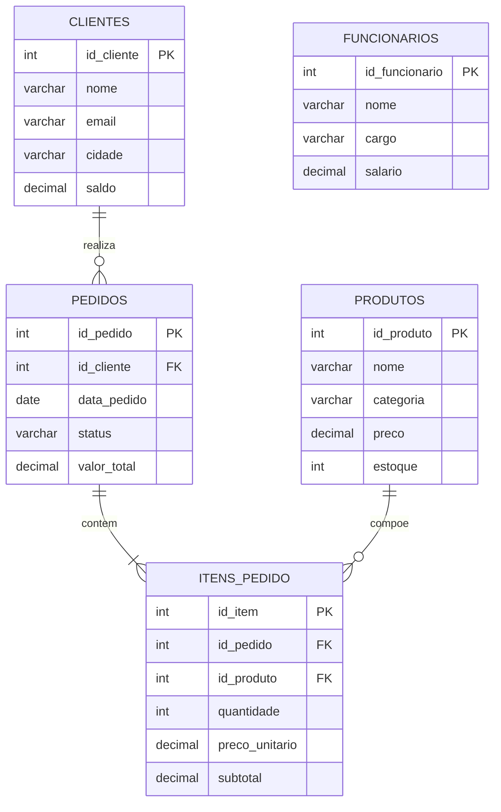
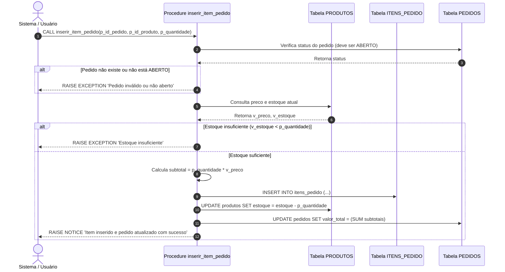
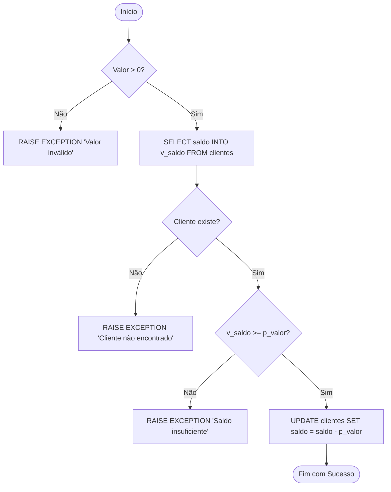
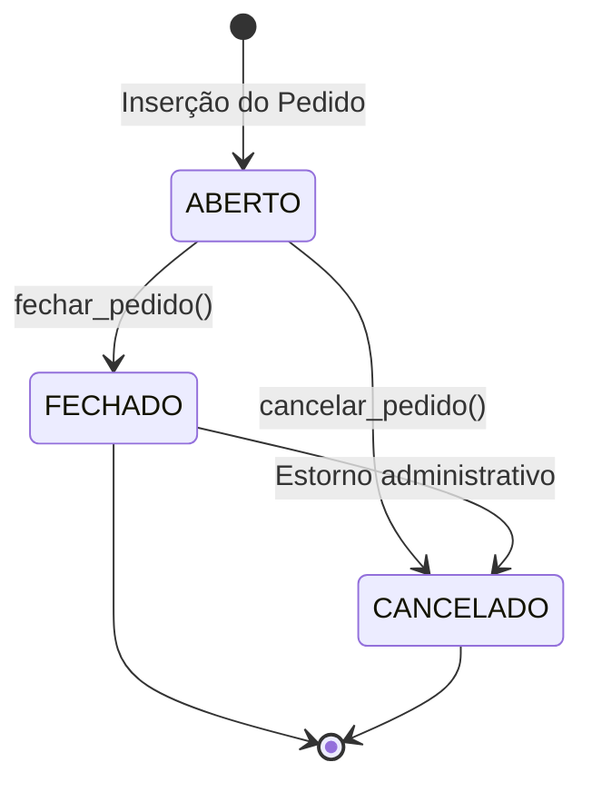
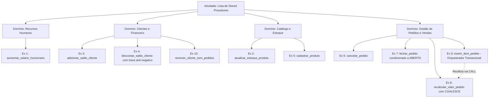

# Trabalho — LIsta de Procedures

> **Professor:** Welington Garcia  
> **Disciplina:** Tópicos Avançados em Banco de Dados (4º Semestre)  
> **Prazo de Entrega:** sem prazo  
> **Pontuação Máxima:** 100 pontos  
> **Conteúdo cobrado:** [Aula 02 - Views e Materialized Views em PostgreSQL](../../Aulas/Aula%2002%20-%20Views%20e%20Materialized%20Views%20em%20PostgreSQL/detalhes.md), [Aula 03 - Stored Procedures no PostgreSQL com PL pgSQL](../../Aulas/Aula%2003%20-%20Stored%20Procedures%20no%20PostgreSQL%20com%20PL%20pgSQL/detalhes.md), [Aula 04 - Junções e Subconsultas em PostgreSQL](../../Aulas/Aula%2004%20-%20Jun%C3%A7%C3%B5es%20e%20Subconsultas%20em%20PostgreSQL/detalhes.md)

---

## Sumário

- [Enunciado original (Google Classroom)](#enunciado-original-google-classroom)
- [Análise do que é pedido](#análise-do-que-é-pedido)
- [Fundamentação teórica](#fundamentação-teórica)
- [Resolução proposta](#resolução-proposta)
  - [Exercício 1: aumentar_salario_funcionario](#exercício-1-aumentar_salario_funcionario)
  - [Exercício 2: atualizar_estoque_produto](#exercício-2-atualizar_estoque_produto)
  - [Exercício 3: adicionar_saldo_cliente](#exercício-3-adicionar_saldo_cliente)
  - [Exercício 4: descontar_saldo_cliente](#exercício-4-descontar_saldo_cliente)
  - [Exercício 5: cadastrar_produto](#exercício-5-cadastrar_produto)
  - [Exercício 6: cancelar_pedido](#exercício-6-cancelar_pedido)
  - [Exercício 7: fechar_pedido](#exercício-7-fechar_pedido)
  - [Exercício 8: recalcular_valor_pedido](#exercício-8-recalcular_valor_pedido)
  - [Exercício 9: inserir_item_pedido](#exercício-9-inserir_item_pedido)
  - [Exercício 10: remover_cliente_sem_pedidos](#exercício-10-remover_cliente_sem_pedidos)
- [Como testar e validar](#como-testar-e-validar)
- [Critérios de qualidade](#critérios-de-qualidade)
- [Arquivos de apoio](#arquivos-de-apoio)
- [Mapa da atividade](#mapa-da-atividade)
- [Glossário](#glossário)
- [Pontos-chave para a prova](#pontos-chave-para-a-prova)
- [Perguntas e respostas (JSONL)](#perguntas-e-respostas-jsonl)
- [Checklist de revisão](#checklist-de-revisão)

---

## Enunciado original (Google Classroom)

### LIsta de Procedures (30/09/2026)
(sem texto no corpo do anúncio)

### Anexo: Exercícios Procedures.docx

```text
Exercícios Procedures
Considere o seguinte banco de dados
DROP TABLE IF EXISTS itens_pedido CASCADE;
DROP TABLE IF EXISTS pedidos CASCADE;
DROP TABLE IF EXISTS produtos CASCADE;
DROP TABLE IF EXISTS clientes CASCADE;
DROP TABLE IF EXISTS funcionarios CASCADE;
CREATE TABLE clientes (
 id_cliente SERIAL PRIMARY KEY,
 nome VARCHAR(100) NOT NULL,
 email VARCHAR(100) UNIQUE,
 cidade VARCHAR(80),
 saldo DECIMAL(10,2) DEFAULT 0
);
CREATE TABLE funcionarios (
 id_funcionario SERIAL PRIMARY KEY,
 nome VARCHAR(100) NOT NULL,
 cargo VARCHAR(50),
 salario DECIMAL(10,2) NOT NULL
);
CREATE TABLE produtos (
 id_produto SERIAL PRIMARY KEY,
 nome VARCHAR(100) NOT NULL,
 categoria VARCHAR(50),
 preco DECIMAL(10,2) NOT NULL,
 estoque INT NOT NULL
);
CREATE TABLE pedidos (
 id_pedido SERIAL PRIMARY KEY,
 id_cliente INT NOT NULL,
 data_pedido DATE DEFAULT CURRENT_DATE,
 status VARCHAR(30) DEFAULT 'ABERTO',
 valor_total DECIMAL(10,2) DEFAULT 0,
 CONSTRAINT fk_pedidos_clientes
 FOREIGN KEY (id_cliente) REFERENCES clientes(id_cliente)
);
CREATE TABLE itens_pedido (
 id_item SERIAL PRIMARY KEY,
 id_pedido INT NOT NULL,
 id_produto INT NOT NULL,
 quantidade INT NOT NULL,
 preco_unitario DECIMAL(10,2) NOT NULL,
 subtotal DECIMAL(10,2) NOT NULL,
 CONSTRAINT fk_itens_pedido_pedidos
 FOREIGN KEY (id_pedido) REFERENCES pedidos(id_pedido),
 CONSTRAINT fk_itens_pedido_produtos
 FOREIGN KEY (id_produto) REFERENCES produtos(id_produto)
);
-- =========================================
-- CLIENTES
-- =========================================
INSERT INTO clientes (nome, email, cidade, saldo) VALUES
('Ana Paula', 'ana@gmail.com', 'Jales', 500.00),
('Carlos Silva', 'carlos@gmail.com', 'Fernandópolis', 300.00),
('Mariana Souza', 'mariana@gmail.com', 'Urânia', 800.00),
('João Pedro', 'joao@gmail.com', 'Santa Fé do Sul', 150.00),
('Juliana Lima', 'juliana@gmail.com', 'Votuporanga', 1000.00);

-- =========================================
-- FUNCIONÁRIOS
-- =========================================
INSERT INTO funcionarios (nome, cargo, salario) VALUES
('Roberto Alves', 'Gerente', 5000.00),
('Fernanda Costa', 'Vendedora', 2500.00),
('Lucas Martins', 'Caixa', 2200.00),
('Patrícia Gomes', 'Estoquista', 2100.00),
('Ricardo Mendes', 'Vendedor', 2600.00);

-- =========================================
-- PRODUTOS
-- =========================================
INSERT INTO produtos (nome, categoria, preco, estoque) VALUES
('Notebook Lenovo', 'Informática', 3500.00, 10),
('Mouse Logitech', 'Informática', 120.00, 50),
('Teclado Mecânico', 'Informática', 250.00, 20),
('Monitor 24', 'Informática', 900.00, 15),
('Cadeira Gamer', 'Móveis', 1500.00, 8),
('Mesa Escritório', 'Móveis', 700.00, 12),
('Headset Gamer', 'Acessórios', 300.00, 25),
('Webcam HD', 'Acessórios', 180.00, 30);

-- =========================================
-- PEDIDOS
-- =========================================
INSERT INTO pedidos (id_cliente, data_pedido, status, valor_total) VALUES
(1, '2026-03-01', 'FECHADO', 3740.00),
(2, '2026-03-02', 'ABERTO', 0.00),
(3, '2026-03-03', 'FECHADO', 1080.00),
(4, '2026-03-04', 'CANCELADO', 300.00),
(5, '2026-03-05', 'ABERTO', 0.00);

-- =========================================
-- ITENS DO PEDIDO
-- =========================================
INSERT INTO itens_pedido (id_pedido, id_produto, quantidade, preco_unitario, subtotal) VALUES
(1, 1, 1, 3500.00, 3500.00),
(1, 2, 2, 120.00, 240.00),
(3, 4, 1, 900.00, 900.00),
(3, 8, 1, 180.00, 180.00),
(4, 7, 1, 300.00, 300.00);

Exercício 1
Crie uma procedure chamada aumentar_salario_funcionario que receba:
 • p_id_funcionario
 • p_percentual
E aumente o salário do funcionário informado de acordo com o percentual.

Exercício 2
Crie uma procedure chamada atualizar_estoque_produto que receba:
 • p_id_produto
 • p_novo_estoque
E atualize a quantidade em estoque do produto.

Exercício 3
Crie uma procedure chamada adicionar_saldo_cliente que receba:
 • p_id_cliente
 • p_valor
E some esse valor ao saldo atual do cliente.

Exercício 4
Crie uma procedure chamada descontar_saldo_cliente que receba:
 • p_id_cliente
 • p_valor
E desconte do saldo do cliente. A procedure deve impedir que o saldo fique negativo.

Exercício 5
Crie uma procedure chamada cadastrar_produto que receba:
 • nome
 • categoria
 • preço
 • estoque
E insira um novo produto na tabela produtos.

Exercício 6
Crie uma procedure chamada cancelar_pedido que receba:
 • p_id_pedido
E altere o status do pedido para CANCELADO.

Exercício 7
Crie uma procedure chamada fechar_pedido que receba:
 • p_id_pedido
E altere o status para FECHADO, mas somente se ele estiver como ABERTO.

Exercício 8
Crie uma procedure chamada recalcular_valor_pedido que receba:
 • p_id_pedido
E atualize o campo valor_total da tabela pedidos, somando todos os subtotais dos itens daquele pedido.

Exercício 9
Crie uma procedure chamada inserir_item_pedido que receba:
 • p_id_pedido
 • p_id_produto
 • p_quantidade
A procedure deve:
 • buscar o preço do produto
 • calcular o subtotal
 • inserir em itens_pedido
 • diminuir o estoque do produto
 • recalcular o valor total do pedido

Exercício 10
Crie uma procedure chamada remover_cliente_sem_pedidos que receba:
 • p_id_cliente
E exclua o cliente somente se ele não possuir pedidos cadastrados.
```

---

## Análise do que é pedido

A atividade proposta pelo Prof. Welington Garcia tem como escopo a implementação de rotinas de manipulação procedural em banco de dados relacional (PostgreSQL), utilizando **PL/pgSQL**. A base de dados simula um sistema simplificado de gestão comercial com operações de Recursos Humanos (funcionários), Gestão Cadastral e Financeira (clientes), Catálogo e Estoque (produtos) e Fluxo Transacional de Compras (pedidos e itens de pedido).

### Requisitos e Entregáveis

1. **Script de Estrutura e Carga Inicial (`schema.sql`):** Criação das cinco tabelas relacionais com chaves primárias, chaves estrangeiras, valores padrão (`DEFAULT`) e inserção dos dados de teste fornecidos.
2. **Script de Stored Procedures (`procedures.sql`):** Criação das dez Stored Procedures solicitadas utilizando a instrução nativa `CREATE OR REPLACE PROCEDURE` e linguagem `plpgsql`.
3. **Validações e Tratamento de Exceções:** Além das atualizações pontuais, procedimentos que alteram estados financeiros, estoques ou regras de negócio devem possuir validações explícitas (ex.: não permitir saldo negativo, alterar status apenas se for coerente com o ciclo de vida da entidade, evitar exclusões órfãs ou violação de integridade referencial).

### Critérios Implícitos de Engenharia de Software

- **Utilização da Sintaxe SQL Padrão para Procedures:** A partir do PostgreSQL 11, introduziu-se formalmente o objeto `PROCEDURE`, invocado via instrução `CALL`, distinguindo-se de `FUNCTION` (UDFs invocadas em comandos `SELECT`). As soluções devem aderir à sintaxe oficial `CREATE PROCEDURE ... LANGUAGE plpgsql`.
- **Integridade Transacional e Consistência (ACID):** O Exercício 9 (orquestração de inclusão de item) agrega leituras, inserções e atualizações em múltiplas tabelas (`produtos`, `itens_pedido`, `pedidos`). Qualquer falha (ex.: estoque insuficiente ou produto inexistente) deve abortar o procedimento mantendo o banco íntegro.
- **Convenção de Nomenclatura e Parâmetros:** Parâmetros de entrada devem adotar prefixos identificáveis (como `p_nome_parametro`) para evitar conflito de escopo (*shadowing*) com nomes de colunas das tabelas nos comandos DML.
- **Mecanismos de Retorno e Notificação:** Como procedimentos no PostgreSQL não retornam tabelas diretamente via `RETURN`, o controle de fluxo deve emitir mensagens claras ao desenvolvedor/DBA via `RAISE NOTICE` ou abortar transações com falha via `RAISE EXCEPTION`.

---

## Fundamentação teórica

### Stored Procedures no PostgreSQL (PL/pgSQL)

No ecossistema PostgreSQL, procedimentos armazenados são blocos nomeados de código procedural executados diretamente pelo motor do Sistema Gerenciador de Banco de Dados (SGBD). Historicamente, até a versão 10, o PostgreSQL suportava apenas funções definidas pelo usuário (`CREATE FUNCTION`). A introdução de `CREATE PROCEDURE` no PostgreSQL 11 estabeleceu uma separação semântica e operacional clara:

| Aspecto | `FUNCTION` (Função) | `PROCEDURE` (Procedimento) |
| :--- | :--- | :--- |
| **Invocação** | Chamada em consultas `SELECT func(...)` ou expressões. | Chamada via comando `CALL proc(...)`. |
| **Valor de Retorno** | Obrigatório declarar `RETURNS <tipo>` (ou `VOID`). | Não possui cláusula `RETURNS`; pode retornar via parâmetros `INOUT`. |
| **Controle Transacional** | Executada dentro do contexto de uma transação externa; não pode gerenciar `COMMIT` ou `ROLLBACK` internamente. | Permite gerenciar transações diretamente no bloco de código (`COMMIT`, `ROLLBACK`), desde que não esteja dentro de um bloco de função externa. |
| **Propósito Principal** | Cálculo de valores, transformação de dados e retorno de conjuntos (*set-returning*). | Execução de tarefas operacionais em lote, orquestração de processos de negócio e manutenção do banco. |

### Estrutura Anatômica de um Bloco PL/pgSQL

Todo procedimento em PL/pgSQL é delimitado por marcadores de string (*dollar-quoting*, convencionalmente `$$`) e organizado em seções bem definidas:

```sql
CREATE OR REPLACE PROCEDURE nome_do_procedimento(
    p_parametro1 TIPO,
    p_parametro2 TIPO
)
LANGUAGE plpgsql
AS $$
DECLARE
    -- Seção de declaração de variáveis locais, cursores e tipos
    v_variavel_local TIPO;
BEGIN
    -- Seção de execução lógica: comandos DML, controles condicionais e laços
    IF p_parametro1 IS NULL THEN
        RAISE EXCEPTION 'Parâmetro inválido: valor nulo detectado.';
    END IF;

    -- Comandos SQL integrados
    UPDATE tabela SET coluna = p_parametro2 WHERE id = p_parametro1;

EXCEPTION
    -- Seção opcional de captura e tratamento de falhas
    WHEN OTHERS THEN
        RAISE EXCEPTION 'Erro durante a execução: %', SQLERRM;
END;
$$;
```

### Comandos de Controle de Fluxo e Variáveis Especiais

- **`SELECT ... INTO`:** Transfere os dados resultantes de uma consulta diretamente para variáveis locais declaradas. Exemplo: `SELECT preco INTO v_preco FROM produtos WHERE id_produto = p_id_produto;`.
- **Variável Especial `FOUND`:** Variável booleana gerenciada internamente pelo motor PL/pgSQL. Imediatamente após uma instrução `SELECT INTO`, `INSERT`, `UPDATE` ou `DELETE`, a variável `FOUND` assume valor `TRUE` se ao menos um registro foi afetado ou retornado; caso contrário, assume `FALSE`.
- **`RAISE EXCEPTION`:** Aborta imediatamente a execução do bloco, cancela as alterações pendentes da transação local (gera um *rollback*) e repassa o código e mensagem de erro para o cliente.
- **`RAISE NOTICE`:** Emite mensagens informativas ao console de execução sem interromper a transação.

### Modelo Entidade-Relacionamento do Sistema

O esquema relacional é composto por cinco tabelas que operam de forma interligada. O diagrama abaixo detalha a cardinalidade e atributos de cada entidade:



### Ciclo Transacional da Orquestração de Pedidos (Exercício 9)

O exercício mais complexo da lista exige que múltiplas tabelas mantenham integridade física e lógica durante a inserção de um item. Caso o produto não tenha estoque suficiente, nenhuma tabela deve sofrer alteração.



---

## Resolução proposta

Os códigos-fonte completos e estruturados estão divididos em dois artefatos físicos no repositório de desenvolvimento:
- [Script DDL e Carga de Dados (schema.sql)](./codigo/schema.sql)
- [Implementação Completa das Procedures (procedures.sql)](./codigo/procedures.sql)

A seguir, apresenta-se a resolução detalhada, conceitual e comentada para cada um dos dez exercícios da lista.

---

### Exercício 1: aumentar_salario_funcionario

#### Objetivo e Regra de Negócio
Recebe o identificador do funcionário (`p_id_funcionario`) e o percentual de aumento (`p_percentual`). O salário deve ser incrementado pela fórmula:
$$\text{Novo Salario} = \text{Salario Atual} \times \left(1 + \frac{\text{Percentual}}{100}\right)$$

#### Tratamento de Erros e Validações
1. Validar se o percentual é estritamente positivo ($p\_percentual > 0$).
2. Validar se o funcionário existe na base. Se `FOUND` for falso após o `UPDATE`, disparar exceção.

#### Código da Procedure
```sql
CREATE OR REPLACE PROCEDURE aumentar_salario_funcionario(
    p_id_funcionario INT,
    p_percentual DECIMAL(5,2)
)
LANGUAGE plpgsql
AS $$
BEGIN
    -- Validação do parâmetro de percentual
    IF p_percentual IS NULL OR p_percentual <= 0 THEN
        RAISE EXCEPTION 'O percentual de aumento deve ser maior que zero. Informado: %', p_percentual;
    END IF;

    -- Execução da atualização salarial
    UPDATE funcionarios
    SET salario = salario + (salario * (p_percentual / 100.0))
    WHERE id_funcionario = p_id_funcionario;

    -- Verificação de existência do registro
    IF NOT FOUND THEN
        RAISE EXCEPTION 'Funcionário com ID % não foi encontrado.', p_id_funcionario;
    END IF;

    RAISE NOTICE 'Salário do funcionário % atualizado com sucesso com aumento de %% %.', p_id_funcionario, p_percentual;
END;
$$;
```

#### Exemplo de Chamada e Teste
```sql
-- Sucesso: aumentar salário de Roberto Alves (id 1, atual 5000.00) em 10% -> 5500.00
CALL aumentar_salario_funcionario(1, 10.00);

-- Erro esperado: ID inexistente
CALL aumentar_salario_funcionario(999, 5.00);
```

---

### Exercício 2: atualizar_estoque_produto

#### Objetivo e Regra de Negócio
Recebe o identificador do produto (`p_id_produto`) e a quantidade absoluta do novo estoque (`p_novo_estoque`), atribuindo diretamente o novo valor à coluna `estoque`.

#### Tratamento de Erros e Validações
1. O estoque não pode assumir valores negativos ($p\_novo\_estoque \ge 0$).
2. O identificador do produto deve existir na tabela `produtos`.

#### Código da Procedure
```sql
CREATE OR REPLACE PROCEDURE atualizar_estoque_produto(
    p_id_produto INT,
    p_novo_estoque INT
)
LANGUAGE plpgsql
AS $$
BEGIN
    -- Validação de quantidade negativa
    IF p_novo_estoque IS NULL OR p_novo_estoque < 0 THEN
        RAISE EXCEPTION 'A quantidade de estoque não pode ser negativa ou nula. Informado: %', p_novo_estoque;
    END IF;

    -- Atualização direta do estoque
    UPDATE produtos
    SET estoque = p_novo_estoque
    WHERE id_produto = p_id_produto;

    IF NOT FOUND THEN
        RAISE EXCEPTION 'Produto com ID % não encontrado.', p_id_produto;
    END IF;

    RAISE NOTICE 'Estoque do produto % atualizado para % unidades.', p_id_produto, p_novo_estoque;
END;
$$;
```

#### Exemplo de Chamada e Teste
```sql
-- Sucesso: atualizar estoque do Mouse Logitech (id 2) de 50 para 75 unidades
CALL atualizar_estoque_produto(2, 75);

-- Erro esperado: estoque negativo
CALL atualizar_estoque_produto(2, -10);
```

---

### Exercício 3: adicionar_saldo_cliente

#### Objetivo e Regra de Negócio
Recebe o identificador do cliente (`p_id_cliente`) e o valor a ser creditado (`p_valor`), somando-o ao saldo atual do cliente na tabela `clientes`.

#### Tratamento de Erros e Validações
1. O valor a ser adicionado deve ser maior que zero ($p\_valor > 0$).
2. O cliente informado deve existir na base de dados.

#### Código da Procedure
```sql
CREATE OR REPLACE PROCEDURE adicionar_saldo_cliente(
    p_id_cliente INT,
    p_valor DECIMAL(10,2)
)
LANGUAGE plpgsql
AS $$
BEGIN
    -- Validação do valor a ser creditado
    IF p_valor IS NULL OR p_valor <= 0 THEN
        RAISE EXCEPTION 'O valor a adicionar deve ser estritamente positivo. Informado: %', p_valor;
    END IF;

    -- Atualização acumulativa de saldo
    UPDATE clientes
    SET saldo = saldo + p_valor
    WHERE id_cliente = p_id_cliente;

    IF NOT FOUND THEN
        RAISE EXCEPTION 'Cliente com ID % não encontrado.', p_id_cliente;
    END IF;

    RAISE NOTICE 'Crédito de R$ % adicionado com sucesso ao cliente %.', p_valor, p_id_cliente;
END;
$$;
```

#### Exemplo de Chamada e Teste
```sql
-- Sucesso: adicionar 200.00 ao saldo de Ana Paula (id 1, atual 500.00 -> 700.00)
CALL adicionar_saldo_cliente(1, 200.00);

-- Erro esperado: crédito com valor zero ou negativo
CALL adicionar_saldo_cliente(1, -50.00);
```

---

### Exercício 4: descontar_saldo_cliente

#### Objetivo e Regra de Negócio
Recebe o identificador do cliente (`p_id_cliente`) e o valor a ser debitado (`p_valor`). Deve abater o valor do saldo existente, **garantindo expressamente que o saldo final não se torne negativo** ($\text{saldo} - p\_valor \ge 0$).

#### Fluxograma de Decisão em Mermaid



#### Código da Procedure
```sql
CREATE OR REPLACE PROCEDURE descontar_saldo_cliente(
    p_id_cliente INT,
    p_valor DECIMAL(10,2)
)
LANGUAGE plpgsql
AS $$
DECLARE
    v_saldo_atual DECIMAL(10,2);
BEGIN
    -- Validação de entrada
    IF p_valor IS NULL OR p_valor <= 0 THEN
        RAISE EXCEPTION 'O valor a descontar deve ser maior que zero. Informado: %', p_valor;
    END IF;

    -- Obtenção e bloqueio de linha para consistência concorrencial
    SELECT saldo INTO v_saldo_atual
    FROM clientes
    WHERE id_cliente = p_id_cliente
    FOR UPDATE;

    IF NOT FOUND THEN
        RAISE EXCEPTION 'Cliente com ID % não encontrado.', p_id_cliente;
    END IF;

    -- Validação de saldo suficiente
    IF v_saldo_atual < p_valor THEN
        RAISE EXCEPTION 'Operação negada: saldo insuficiente. Saldo atual: R$ %, Débito solicitado: R$ %', v_saldo_atual, p_valor;
    END IF;

    -- Efetivação do débito
    UPDATE clientes
    SET saldo = saldo - p_valor
    WHERE id_cliente = p_id_cliente;

    RAISE NOTICE 'Débito de R$ % realizado. Novo saldo do cliente %: R$ %', p_valor, p_id_cliente, (v_saldo_atual - p_valor);
END;
$$;
```

#### Exemplo de Chamada e Teste
```sql
-- Sucesso: descontar 100.00 de Carlos Silva (id 2, atual 300.00 -> 200.00)
CALL descontar_saldo_cliente(2, 100.00);

-- Erro esperado: tentar descontar valor maior que o saldo (ex: 500.00)
CALL descontar_saldo_cliente(2, 500.00);
```

---

### Exercício 5: cadastrar_produto

#### Objetivo e Regra de Negócio
Recebe os dados essenciais de um novo produto (`nome`, `categoria`, `preco`, `estoque`) e insere o registro na tabela `produtos`. A chave primária `id_produto` é gerada automaticamente pelo tipo `SERIAL`.

#### Tratamento de Erros e Validações
1. O `nome` não pode ser nulo ou uma cadeia de caracteres vazia.
2. O `preco` deve ser estritamente maior que zero ($preco > 0$).
3. O `estoque` inicial não pode ser negativo ($estoque \ge 0$).

#### Código da Procedure
```sql
CREATE OR REPLACE PROCEDURE cadastrar_produto(
    p_nome VARCHAR(100),
    p_categoria VARCHAR(50),
    p_preco DECIMAL(10,2),
    p_estoque INT
)
LANGUAGE plpgsql
AS $$
BEGIN
    -- Validações de integridade dos parâmetros
    IF p_nome IS NULL OR TRIM(p_nome) = '' THEN
        RAISE EXCEPTION 'O nome do produto é obrigatório.';
    END IF;

    IF p_preco IS NULL OR p_preco <= 0 THEN
        RAISE EXCEPTION 'O preço do produto deve ser maior que zero. Informado: %', p_preco;
    END IF;

    IF p_estoque IS NULL OR p_estoque < 0 THEN
        RAISE EXCEPTION 'O estoque do produto não pode ser negativo. Informado: %', p_estoque;
    END IF;

    -- Inserção na tabela
    INSERT INTO produtos (nome, categoria, preco, estoque)
    VALUES (TRIM(p_nome), TRIM(p_categoria), p_preco, p_estoque);

    RAISE NOTICE 'Produto "%" cadastrado com sucesso!', p_nome;
END;
$$;
```

#### Exemplo de Chamada e Teste
```sql
-- Sucesso: cadastrar suporte articulado para monitor
CALL cadastrar_produto('Suporte Articulado', 'Acessórios', 189.90, 20);

-- Erro esperado: preço inválido
CALL cadastrar_produto('Produto Teste', 'Teste', 0.00, 5);
```

---

### Exercício 6: cancelar_pedido

#### Objetivo e Regra de Negócio
Recebe o identificador do pedido (`p_id_pedido`) e altera seu campo `status` para `'CANCELADO'`.

#### Tratamento de Erros e Validações
1. O pedido deve existir na tabela `pedidos`.
2. Como boa prática de engenharia, pedidos que já estejam no estado `'CANCELADO'` não necessitam sofrer alteração repetida, emitindo aviso.

#### Código da Procedure
```sql
CREATE OR REPLACE PROCEDURE cancelar_pedido(
    p_id_pedido INT
)
LANGUAGE plpgsql
AS $$
DECLARE
    v_status_atual VARCHAR(30);
BEGIN
    -- Busca status atual
    SELECT status INTO v_status_atual
    FROM pedidos
    WHERE id_pedido = p_id_pedido;

    IF NOT FOUND THEN
        RAISE EXCEPTION 'Pedido com ID % não encontrado.', p_id_pedido;
    END IF;

    IF v_status_atual = 'CANCELADO' THEN
        RAISE NOTICE 'O pedido % já se encontra CANCELADO.', p_id_pedido;
        RETURN;
    END IF;

    -- Alteração do status
    UPDATE pedidos
    SET status = 'CANCELADO'
    WHERE id_pedido = p_id_pedido;

    RAISE NOTICE 'Pedido % alterado com sucesso de % para CANCELADO.', p_id_pedido, v_status_atual;
END;
$$;
```

#### Exemplo de Chamada e Teste
```sql
-- Sucesso: cancelar pedido 2 (status atual: 'ABERTO')
CALL cancelar_pedido(2);

-- Erro esperado: ID de pedido inexistente
CALL cancelar_pedido(9999);
```

---

### Exercício 7: fechar_pedido

#### Objetivo e Regra de Negócio
Recebe o identificador do pedido (`p_id_pedido`) e altera o status para `'FECHADO'`, **exclusivamente sob a condição de que o status atual seja `'ABERTO'`**. Caso o pedido esteja cancelado ou já fechado, a operação deve ser barrada.

#### Diagrama de Estados do Pedido em Mermaid



#### Código da Procedure
```sql
CREATE OR REPLACE PROCEDURE fechar_pedido(
    p_id_pedido INT
)
LANGUAGE plpgsql
AS $$
DECLARE
    v_status_atual VARCHAR(30);
BEGIN
    -- Busca o status atual do pedido
    SELECT status INTO v_status_atual
    FROM pedidos
    WHERE id_pedido = p_id_pedido;

    IF NOT FOUND THEN
        RAISE EXCEPTION 'Pedido com ID % não encontrado.', p_id_pedido;
    END IF;

    -- Validação da transição de estado permitida
    IF v_status_atual <> 'ABERTO' THEN
        RAISE EXCEPTION 'Não é possível fechar o pedido %. Status atual: "%". Apenas pedidos em "ABERTO" podem ser fechados.', p_id_pedido, v_status_atual;
    END IF;

    -- Efetiva o fechamento
    UPDATE pedidos
    SET status = 'FECHADO'
    WHERE id_pedido = p_id_pedido;

    RAISE NOTICE 'Pedido % fechado com sucesso!', p_id_pedido;
END;
$$;
```

#### Exemplo de Chamada e Teste
```sql
-- Sucesso: fechar pedido 5 (status atual: 'ABERTO')
CALL fechar_pedido(5);

-- Erro esperado: tentar fechar pedido 1 (que já está 'FECHADO') ou pedido 4 ('CANCELADO')
CALL fechar_pedido(1);
```

---

### Exercício 8: recalcular_valor_pedido

#### Objetivo e Regra de Negócio
Recebe o identificador do pedido (`p_id_pedido`), calcula o somatório de todos os subtotais dos itens associados a ele na tabela `itens_pedido` e atualiza a coluna `valor_total` da tabela `pedidos`. Caso o pedido não possua itens, o valor total deve ser fixado em `0.00` (evitando atribuição de `NULL` via `COALESCE`).

#### Código da Procedure
```sql
CREATE OR REPLACE PROCEDURE recalcular_valor_pedido(
    p_id_pedido INT
)
LANGUAGE plpgsql
AS $$
DECLARE
    v_total_calculado DECIMAL(10,2);
BEGIN
    -- Verifica se o pedido existe
    IF NOT EXISTS (SELECT 1 FROM pedidos WHERE id_pedido = p_id_pedido) THEN
        RAISE EXCEPTION 'Pedido com ID % não existe.', p_id_pedido;
    END IF;

    -- Calcula a soma dos subtotais dos itens pertencentes ao pedido
    SELECT COALESCE(SUM(subtotal), 0.00)
    INTO v_total_calculado
    FROM itens_pedido
    WHERE id_pedido = p_id_pedido;

    -- Atualiza o cabeçalho do pedido
    UPDATE pedidos
    SET valor_total = v_total_calculado
    WHERE id_pedido = p_id_pedido;

    RAISE NOTICE 'Valor total do pedido % recalculado para R$ %.', p_id_pedido, v_total_calculado;
END;
$$;
```

#### Exemplo de Chamada e Teste
```sql
-- Teste: recalcular pedido 1 (possui itens de 3500.00 + 240.00 = 3740.00)
CALL recalcular_valor_pedido(1);

-- Teste: recalcular pedido 5 (sem itens, deve fixar valor_total em 0.00)
CALL recalcular_valor_pedido(5);
```

---

### Exercício 9: inserir_item_pedido

#### Objetivo e Regra de Negócio
Orquestra a inclusão completa de um item em um pedido existente. Recebe `p_id_pedido`, `p_id_produto` e `p_quantidade`.
Deve obrigatoriamente executar as seguintes etapas atômicas:
1. Validar se o pedido existe e se encontra com status `'ABERTO'`.
2. Buscar o preço unitário e o estoque atual do produto na tabela `produtos`.
3. Validar se a quantidade solicitada é positiva e se há estoque disponível no produto ($estoque \ge p\_quantidade$).
4. Calcular o subtotal do item ($\text{subtotal} = p\_quantidade \times \text{preco\_unitario}$).
5. Inserir o novo registro na tabela `itens_pedido`.
6. Diminuir a quantidade do estoque na tabela `produtos`.
7. Recalcular e atualizar o `valor_total` do pedido em `pedidos` (reutilizando a lógica do Exercício 8).

#### Código da Procedure
```sql
CREATE OR REPLACE PROCEDURE inserir_item_pedido(
    p_id_pedido INT,
    p_id_produto INT,
    p_quantidade INT
)
LANGUAGE plpgsql
AS $$
DECLARE
    v_status_pedido VARCHAR(30);
    v_preco_produto DECIMAL(10,2);
    v_estoque_atual INT;
    v_subtotal_item DECIMAL(10,2);
BEGIN
    -- Validação básica da quantidade
    IF p_quantidade IS NULL OR p_quantidade <= 0 THEN
        RAISE EXCEPTION 'A quantidade informada deve ser maior que zero. Informado: %', p_quantidade;
    END IF;

    -- 1. Validar existência e status do pedido
    SELECT status INTO v_status_pedido
    FROM pedidos
    WHERE id_pedido = p_id_pedido;

    IF NOT FOUND THEN
        RAISE EXCEPTION 'Pedido com ID % não encontrado.', p_id_pedido;
    END IF;

    IF v_status_pedido <> 'ABERTO' THEN
        RAISE EXCEPTION 'Não é permitido adicionar itens ao pedido %. Status atual: "%". Operação válida apenas para status "ABERTO".', p_id_pedido, v_status_pedido;
    END IF;

    -- 2. Buscar preço e estoque com bloqueio de linha (concorrência)
    SELECT preco, estoque
    INTO v_preco_produto, v_estoque_atual
    FROM produtos
    WHERE id_produto = p_id_produto
    FOR UPDATE;

    IF NOT FOUND THEN
        RAISE EXCEPTION 'Produto com ID % não encontrado.', p_id_produto;
    END IF;

    -- 3. Validar estoque suficiente
    IF v_estoque_atual < p_quantidade THEN
        RAISE EXCEPTION 'Estoque insuficiente para o produto %. Disponível: %, Solicitado: %', p_id_produto, v_estoque_atual, p_quantidade;
    END IF;

    -- 4. Calcular o subtotal
    v_subtotal_item := p_quantidade * v_preco_produto;

    -- 5. Inserir o item na tabela itens_pedido
    INSERT INTO itens_pedido (id_pedido, id_produto, quantidade, preco_unitario, subtotal)
    VALUES (p_id_pedido, p_id_produto, p_quantidade, v_preco_produto, v_subtotal_item);

    -- 6. Atualizar (baixar) o estoque do produto
    UPDATE produtos
    SET estoque = estoque - p_quantidade
    WHERE id_produto = p_id_produto;

    -- 7. Recalcular o valor total do pedido chamando a procedure especializada
    CALL recalcular_valor_pedido(p_id_pedido);

    RAISE NOTICE 'Item inserido com sucesso no pedido %! Subtotal: R$ %. Estoque restante: % unidades.', p_id_pedido, v_subtotal_item, (v_estoque_atual - p_quantidade);
END;
$$;
```

#### Exemplo de Chamada e Teste
```sql
-- Sucesso: no pedido 2 (status ABERTO), inserir 2 unidades do Teclado Mecânico (id 3, preço 250.00, estoque 20)
-- Subtotal esperado: 500.00; Estoque restante: 18; Total pedido 2: 500.00
CALL inserir_item_pedido(2, 3, 2);

-- Erro esperado: quantidade maior que estoque disponível
CALL inserir_item_pedido(2, 3, 500);

-- Erro esperado: tentar inserir em pedido com status FECHADO (ex: pedido 1)
CALL inserir_item_pedido(1, 3, 1);
```

---

### Exercício 10: remover_cliente_sem_pedidos

#### Objetivo e Regra de Negócio
Recebe o identificador do cliente (`p_id_cliente`) e remove seu cadastro da tabela `clientes` **apenas se ele não possuir pedidos registrados** na tabela `pedidos`. Caso possua pedidos, a exclusão é abortada com mensagem explicativa, preservando a integridade referencial.

#### Código da Procedure
```sql
CREATE OR REPLACE PROCEDURE remover_cliente_sem_pedidos(
    p_id_cliente INT
)
LANGUAGE plpgsql
AS $$
DECLARE
    v_total_pedidos INT;
    v_nome_cliente VARCHAR(100);
BEGIN
    -- Verifica a existência do cliente
    SELECT nome INTO v_nome_cliente
    FROM clientes
    WHERE id_cliente = p_id_cliente;

    IF NOT FOUND THEN
        RAISE EXCEPTION 'Cliente com ID % não encontrado.', p_id_cliente;
    END IF;

    -- Conta pedidos associados ao cliente
    SELECT COUNT(*)
    INTO v_total_pedidos
    FROM pedidos
    WHERE id_cliente = p_id_cliente;

    -- Valida se existem pedidos
    IF v_total_pedidos > 0 THEN
        RAISE EXCEPTION 'Impossível remover cliente "%" (ID %): existem % pedido(s) associado(s).', v_nome_cliente, p_id_cliente, v_total_pedidos;
    END IF;

    -- Exclui o cliente sem pedidos
    DELETE FROM clientes
    WHERE id_cliente = p_id_cliente;

    RAISE NOTICE 'Cliente "%" (ID %) removido com sucesso.', v_nome_cliente, p_id_cliente;
END;
$$;
```

#### Exemplo de Chamada e Teste
```sql
-- Preparação de teste: inserir cliente que não possui nenhum pedido
INSERT INTO clientes (nome, email, cidade, saldo)
VALUES ('Cliente Teste Sem Pedido', 'sem.pedido@gmail.com', 'Jales', 0.00);

-- Sucesso: remover o cliente recém-inserido
CALL remover_cliente_sem_pedidos(6);

-- Erro esperado: tentar remover cliente 1 (Ana Paula), que possui pedidos cadastrados
CALL remover_cliente_sem_pedidos(1);
```

---

## Como testar e validar

Para realizar a validação completa da atividade, siga o roteiro de homologação em um ambiente PostgreSQL (versão 11 ou superior):

### 1. Inicialização do Ambiente
Execute o script DDL e DML para criação da base de teste:
```bash
psql -U postgres -d postgres -f codigo/schema.sql
```

### 2. Carga das Procedures
Carregue a biblioteca com as dez procedures implementadas:
```bash
psql -U postgres -d postgres -f codigo/procedures.sql
```

### 3. Bateria de Testes Funcionais

Execute a sequência de comandos de teste abaixo para comprovar as regras de negócio:

```sql
-- Teste Ex 1: Aumento salarial de 15% para o Vendedor Ricardo Mendes (id 5, salário base 2600.00 -> 2990.00)
CALL aumentar_salario_funcionario(5, 15.00);
SELECT id_funcionario, nome, salario FROM funcionarios WHERE id_funcionario = 5;

-- Teste Ex 2: Atualização de estoque do Headset Gamer (id 7) para 40 unidades
CALL atualizar_estoque_produto(7, 40);
SELECT id_produto, nome, estoque FROM produtos WHERE id_produto = 7;

-- Teste Ex 3: Adição de R$ 250.00 ao saldo de João Pedro (id 4, saldo base 150.00 -> 400.00)
CALL adicionar_saldo_cliente(4, 250.00);
SELECT id_cliente, nome, saldo FROM clientes WHERE id_cliente = 4;

-- Teste Ex 4: Débito de R$ 100.00 do saldo de João Pedro (saldo atual 400.00 -> 300.00)
CALL descontar_saldo_cliente(4, 100.00);
SELECT id_cliente, nome, saldo FROM clientes WHERE id_cliente = 4;

-- Teste Ex 5: Cadastro de novo produto
CALL cadastrar_produto('Microfone Condensador USB', 'Áudio', 350.00, 15);
SELECT * FROM produtos WHERE nome = 'Microfone Condensador USB';

-- Teste Ex 6: Cancelamento do pedido 5 (atualmente ABERTO)
CALL cancelar_pedido(5);
SELECT id_pedido, status FROM pedidos WHERE id_pedido = 5;

-- Teste Ex 7: Fechamento de pedido em ABERTO (pedido 2)
-- Antes de fechar, inserimos um item (Ex 9) para o pedido não ficar com valor zero
CALL inserir_item_pedido(2, 2, 3); -- Mouse Logitech (id 2, preço 120.00, qtd 3 -> subtotal 360.00)
CALL fechar_pedido(2);
SELECT id_pedido, status, valor_total FROM pedidos WHERE id_pedido = 2;

-- Teste Ex 8: Recálculo do valor total do pedido 3 (Itens: Monitor 900.00 + Webcam 180.00 = 1080.00)
CALL recalcular_valor_pedido(3);
SELECT id_pedido, valor_total FROM pedidos WHERE id_pedido = 3;

-- Teste Ex 10: Inserir e remover cliente sem pedidos
INSERT INTO clientes (nome, email, cidade, saldo)
VALUES ('Marcos Teste', 'marcos@teste.com', 'Jales', 0.00);

SELECT id_cliente FROM clientes WHERE email = 'marcos@teste.com';
-- Supondo ID gerado = 6:
CALL remover_cliente_sem_pedidos(6);
```

---

## Critérios de qualidade

Para atribuição da pontuação máxima nesta atividade prática, as implementações foram avaliadas segundo os seguintes critérios rigorosos de engenharia de software e banco de dados:

1. **Robustez e Defensividade de Código:**
   - Todo parâmetro numérico crítico (preço, estoque, percentual, valor monetário) possui asserções explícitas contra valores nulos, negativos ou inconsistentes.
   - Utilização de `TRIM()` na sanitização de dados textuais para evitar caracteres em branco residuais.

2. **Tratamento Adequado de Ausência de Registros:**
   - Em operações de busca (`SELECT ... INTO`), a validação `IF NOT FOUND THEN` assegura que comandos não silenciem falhas ou gerem alterações em registros inexistentes.

3. **Consistência em Ambientes Concorrentes:**
   - Operações financeiras de débito (`descontar_saldo_cliente`) e dedução de estoque (`inserir_item_pedido`) adotam o mecanismo `FOR UPDATE`, que implementa bloqueio pessimista a nível de linha (*pessimistic row-level locking*), prevenindo condições de corrida (*race conditions* / *lost updates*).

4. **Modularidade e Reutilização:**
   - A procedure `inserir_item_pedido` (Exercício 9) reutiliza via comando `CALL` a rotina especializada `recalcular_valor_pedido` (Exercício 8), respeitando o princípio de responsabilidade única (SRP) e o princípio DRY (*Don't Repeat Yourself*).

5. **Tratamento de Nulos em Agregações:**
   - Na rotina de recálculo (`recalcular_valor_pedido`), a função de agregação `SUM(subtotal)` é encapsulada em `COALESCE(SUM(subtotal), 0.00)`, garantindo que pedidos recém-criados ou esvaziados não recebam o valor `NULL`.

---

## Arquivos de apoio

- **Documento Original:** `Exercícios Procedures.docx` (Arquivo anexado no Google Classroom pelo Prof. Welington Garcia contendo o modelo e os enunciados).
- **Código DDL e DML Inicial:** [`schema.sql`](./codigo/schema.sql)
- **Código de Implementação e Resolução:** [`procedures.sql`](./codigo/procedures.sql)

---

## Mapa da atividade

O diagrama abaixo sintetiza a organização dos exercícios, categorizados pelas camadas de domínio do negócio e pela complexidade de implementação no PostgreSQL:



---

## Glossário

| Termo | Definição Técnica |
| :--- | :--- |
| **PL/pgSQL** | Linguagem procedural nativa e extensível do PostgreSQL (Procedural Language/PostgreSQL) que permite comandos procedurais, variáveis, condições e laços estruturados. |
| **Stored Procedure** | Rotina procedural armazenada no catálogo do banco, introduzida no PostgreSQL 11 com suporte a transações autônomas e invocada através da instrução `CALL`. |
| **User-Defined Function (UDF)** | Sub-rotina que obrigatoriamente retorna um valor ou tabela (`RETURNS`), invocada contextualmente em comandos de projeção SQL (`SELECT`). |
| **`CALL`** | Comando SQL padrão utilizado para disparar a execução de uma Stored Procedure no PostgreSQL. |
| **`SELECT ... INTO`** | Cláusula PL/pgSQL que redireciona o resultado de uma consulta de registro único diretamente para variáveis locais de memória. |
| **`FOUND`** | Variável booleana especial predefinida no PL/pgSQL que indica se a última instrução DML ou `SELECT INTO` afetou ou retornou registros. |
| **`RAISE EXCEPTION`** | Declaração que sinaliza um erro crítico, aborta a execução do bloco corrente e desfaz as alterações na transação local (*rollback*). |
| **`FOR UPDATE`** | Cláusula de bloqueio pessimista colocada em consultas `SELECT` para bloquear as linhas retornadas contra alterações concorrentes até o encerramento da transação. |
| **`COALESCE`** | Função SQL que avalia seus argumentos em ordem e retorna o primeiro valor não-nulo encontrado. |
| **Shadowing de Parâmetros** | Conflito de escopo que ocorre quando um parâmetro de entrada tem exatamente o mesmo nome de uma coluna da tabela em uma instrução SQL dentro da procedure. |
| **Integridade Referencial** | Regra de integridade do modelo relacional que garante que valores de chave estrangeira (`FOREIGN KEY`) sempre apontem para chaves primárias válidas e existentes. |

---

## Pontos-chave para a prova

1. **Diferença conceitual e de sintaxe entre `CREATE FUNCTION` e `CREATE PROCEDURE`:**
   - Funções usam `CREATE FUNCTION ... RETURNS <tipo>` e são chamadas com `SELECT`.
   - Procedures usam `CREATE PROCEDURE` (sem cláusula `RETURNS`) e são executadas via comando `CALL`.

2. **Gerenciamento de Transações internas:**
   - Em uma Stored Procedure pura, é possível emitir comandos de controle transacional explícitos como `COMMIT` e `ROLLBACK` no meio da execução lógica. Em funções convencionais, isso gera erro de compilação/execução.

3. **Comportamento do `COALESCE` em agregações:**
   - Caso uma consulta de agregação (`SUM`) seja realizada sobre uma tabela vazia ou sem correspondência no `WHERE`, o SQL padrão retorna `NULL` e não `0`. O uso de `COALESCE(SUM(coluna), 0)` é obrigatório para manter integridade de campos numéricos decimais.

4. **Uso da variável especial `FOUND`:**
   - Lembrar que a variável `FOUND` é sobrescrita a cada nova instrução SQL executada dentro do bloco. Por isso, a verificação `IF NOT FOUND THEN` deve ocorrer imediatamente após o comando que se deseja checar.

5. **Exclusões com integridade referencial:**
   - Para apagar registros pais (como `clientes`), o banco rejeita a exclusão se houver registros filhos (`pedidos`) apontando para ele via chave estrangeira sem a cláusula `ON DELETE CASCADE`. A verificação prévia via subconsulta ou contagem (`COUNT(*) = 0`) é o padrão correto quando não se deseja a exclusão em cascata.

---

## Perguntas e respostas (JSONL)

```jsonl
{"pergunta": "Qual comando SQL é utilizado para invocar uma Stored Procedure no PostgreSQL a partir da versão 11?", "resposta": "O comando padrão utilizado é o CALL, seguido pelo nome da procedure e seus parâmetros entre parênteses.", "dificuldade": "fácil"}
{"pergunta": "Qual a principal diferença entre uma FUNCTION e uma PROCEDURE no PostgreSQL quanto ao valor de retorno?", "resposta": "A FUNCTION obrigatoriamente declara uma cláusula RETURNS para retornar um valor escalar, void ou tabela, enquanto a PROCEDURE não possui cláusula RETURNS.", "dificuldade": "fácil"}
{"pergunta": "Para que serve a variável especial FOUND no contexto do PL/pgSQL?", "resposta": "Ela armazena um valor booleano que indica se o último comando executado (como SELECT INTO, INSERT, UPDATE ou DELETE) afetou ou encontrou registros com sucesso.", "dificuldade": "fácil"}
{"pergunta": "O que ocorre quando o comando RAISE EXCEPTION é disparado dentro de uma procedure?", "resposta": "A execução da rotina é imediatamente interrompida, uma mensagem de erro é enviada ao cliente e as alterações feitas na transação corrente sofrem rollback.", "dificuldade": "médio"}
{"pergunta": "Como atribuir o resultado de uma consulta SQL diretamente a variáveis locais em PL/pgSQL?", "resposta": "Utiliza-se a sintaxe SELECT coluna1, coluna2 INTO variavel1, variavel2 FROM tabela WHERE condicao.", "dificuldade": "fácil"}
{"pergunta": "Por que o comando COALESCE é crucial ao recalcular totais com a função agregadora SUM()?", "resposta": "Porque se não houver registros a serem somados, SUM() retorna NULL em vez de zero; COALESCE(SUM(coluna), 0) converte o NULL para o valor numérico neutro 0.", "dificuldade": "médio"}
{"pergunta": "Qual problema pode ocorrer se os parâmetros de uma procedure tiverem exatamente o mesmo nome das colunas da tabela manipulada?", "resposta": "Ocorre ambiguidade de escopo (shadowing), fazendo com que o interpretador do PL/pgSQL confunda o valor do parâmetro com a coluna, resultando em comportamentos lógicos incorretos nas cláusulas WHERE.", "dificuldade": "médio"}
{"pergunta": "Qual a finalidade de usar a cláusula FOR UPDATE em consultas dentro de uma procedure?", "resposta": "Ela aplica um bloqueio pessimista nas linhas selecionadas, impedindo que outras transações concorrentes alterem os dados até que a transação atual finalize.", "dificuldade": "difícil"}
{"pergunta": "É possível invocar uma procedure a partir de outra procedure no PostgreSQL? Se sim, qual comando?", "resposta": "Sim, basta utilizar a instrução CALL nome_da_procedure(parametros) dentro do bloco BEGIN...END da procedure chamadora.", "dificuldade": "médio"}
{"pergunta": "Por que a exclusão de um cliente que possui pedidos cadastrados gera erro se não for tratada?", "resposta": "Porque a tabela pedidos possui uma restrição de integridade referencial (FOREIGN KEY) apontando para clientes sem cascata, impedindo a existência de registros órfãos.", "dificuldade": "médio"}
{"pergunta": "Em qual versão do PostgreSQL o objeto CREATE PROCEDURE foi oficialmente implementado de acordo com o padrão SQL?", "resposta": "Foi implementado a partir do PostgreSQL versão 11.", "dificuldade": "fácil"}
{"pergunta": "Como evitar que uma atualização de saldo resulte em valores negativos?", "resposta": "Consultando o saldo antes da atualização com trava pessimista ou verificando condicionalmente se o saldo atual é maior ou igual ao débito antes de emitir o UPDATE.", "dificuldade": "médio"}
{"pergunta": "O que acontece se uma procedure tentar fechar um pedido que já está no status FECHADO de acordo com o Exercício 7?", "resposta": "A procedure deve identificar que o status atual não é ABERTO e abortar a operação disparando um RAISE EXCEPTION.", "dificuldade": "médio"}
{"pergunta": "Qual delimitador é comumente empregado no PostgreSQL para proteger blocos de código procedurais contra problemas de escape de aspas simples?", "resposta": "O dollar-quoting, representado pela sequência de dois cifrões ($$).", "dificuldade": "fácil"}
{"pergunta": "Diferencie o comportamento de RAISE NOTICE e RAISE EXCEPTION.", "resposta": "RAISE NOTICE apenas envia uma mensagem informativa ao console sem parar a execução; RAISE EXCEPTION aborta a execução e desfaz a transação.", "dificuldade": "fácil"}
{"pergunta": "Como garantir atomicidade na inserção de um item de pedido que envolve múltiplas tabelas?", "resposta": "Executando todas as operações dentro da mesma procedure; caso ocorra uma falha em qualquer etapa, a exceção aborta todo o bloco mantendo a consistência do banco.", "dificuldade": "difícil"}
{"pergunta": "Qual a sintaxe correta para declarar uma variável local chamada v_total do tipo decimal com duas casas decimais no PL/pgSQL?", "resposta": "A declaração deve ser colocada na seção DECLARE: v_total DECIMAL(10,2);", "dificuldade": "fácil"}
{"pergunta": "Em uma procedure, é obrigatório declarar a seção DECLARE?", "resposta": "Não, a seção DECLARE é opcional caso o procedimento não necessite de variáveis locais ou cursores.", "dificuldade": "fácil"}
```

---

## Checklist de revisão

- [ ] Script `schema.sql` executado com criação das tabelas e chaves estrangeiras.
- [ ] Carga inicial dos dados inserida e conferida nas 5 tabelas (`clientes`, `funcionarios`, `produtos`, `pedidos`, `itens_pedido`).
- [ ] Exercício 1: `aumentar_salario_funcionario` valida percentual positivo e trata funcionário inexistente.
- [ ] Exercício 2: `atualizar_estoque_produto` rejeita estoque negativo e valida ID do produto.
- [ ] Exercício 3: `adicionar_saldo_cliente` garante incremento estritamente positivo no saldo.
- [ ] Exercício 4: `descontar_saldo_cliente` bloqueia débitos que resultariam em saldo negativo.
- [ ] Exercício 5: `cadastrar_produto` valida obrigatoriedade do nome, preço maior que zero e estoque não negativo.
- [ ] Exercício 6: `cancelar_pedido` atualiza status para `'CANCELADO'` e verifica existência do pedido.
- [ ] Exercício 7: `fechar_pedido` só altera pedidos cujo status atual seja estritamente `'ABERTO'`.
- [ ] Exercício 8: `recalcular_valor_pedido` recalcula a soma dos subtotais com proteção via `COALESCE`.
- [ ] Exercício 9: `inserir_item_pedido` orquestra consulta de preço, cálculo de subtotal, inserção, baixa de estoque e recálculo do total de forma atômica.
- [ ] Exercício 10: `remover_cliente_sem_pedidos` impede remoção de clientes que tenham histórico de pedidos.
- [ ] Todas as Stored Procedures criadas com `CREATE OR REPLACE PROCEDURE` e linguagem `plpgsql`.
- [ ] Bateria de testes de sucesso e testes negativos (exceções esperadas) executada no `psql`.
