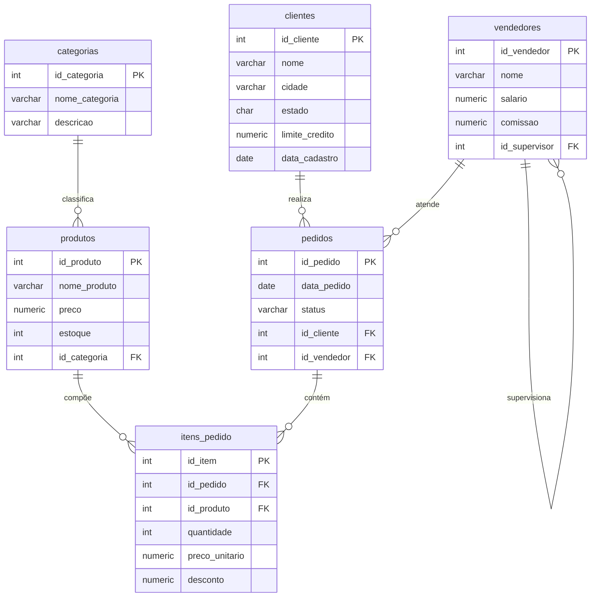
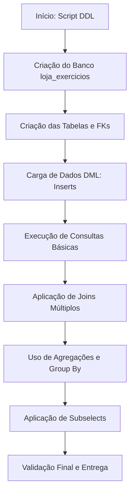

# Trabalho — Lista de exercícios

> **Professor:** Welington Garcia
> **Disciplina:** Tópicos Avançados em Banco de Dados (4º Semestre)
> **Prazo de Entrega:** 09/09/2026 às 19:59
> **Pontuação Máxima:** 100 pontos
> **Conteúdo cobrado:** [Aula 01 - Consultas Avançadas com Joins e Subselects](../../Aulas/Aula%2001%20-%20Consultas%20Avan%C3%A7adas%20com%20Joins%20e%20Subselects/detalhes.md), [Aula 02 - Views e Materialized Views em PostgreSQL](../../Aulas/Aula%2002%20-%20Views%20e%20Materialized%20Views%20em%20PostgreSQL/detalhes.md), [Aula 03 - Stored Procedures e Programacao PL pgSQL](../../Aulas/Aula%2003%20-%20Stored%20Procedures%20e%20Programacao%20PL%20pgSQL/detalhes.md)

## Sumário
1. [Enunciado original (Google Classroom)](#enunciado-original-google-classroom)
2. [Análise do que é pedido](#análise-do-que-é-pedido)
3. [Fundamentação teórica](#fundamentação-teórica)
4. [Resolução proposta](#resolução-proposta)
5. [Como testar e validar](#como-testar-e-validar)
6. [Critérios de qualidade](#critérios-de-qualidade)
7. [Arquivos de apoio](#arquivos-de-apoio)
8. [Mapa da atividade](#mapa-da-atividade)
9. [Glossário](#glossário)
10. [Pontos-chave para a prova](#pontos-chave-para-a-prova)
11. [Perguntas e respostas (JSONL)](#perguntas-e-respostas-jsonl)
12. [Checklist de revisão](#checklist-de-revisão)

## Enunciado original (Google Classroom)

Lista de exercícios (03/09/2026). Atenção para os prazos!
Anexo: Lista de exercicios pontos.tar.gz

Conteúdo do script fornecido pelo professor para a estruturação do ambiente de banco de dados (`script_banco_loja_exercicios.txt`):
Criação do banco de dados `loja_exercicios` em PostgreSQL, contendo as tabelas `clientes`, `vendedores`, `categorias`, `produtos`, `pedidos` e `itens_pedido`, com suas respectivas chaves primárias, estrangeiras e carga inicial de dados (inserts). O objetivo é servir de base para a execução de consultas avançadas utilizando junções (Joins), subconsultas (Subselects) e visões (Views).

## Análise do que é pedido

O trabalho consiste na fixação e aplicação prática de conceitos avançados de manipulação e consulta de dados relacionais no PostgreSQL. A partir do script de criação de banco de dados fornecido (`loja_exercicios`), o aluno deve ser capaz de compreender a modelagem relacional implementada e responder a problemas analíticos complexos.

### Requisitos e Entregáveis
- **Ambiente de Banco de Dados:** Instanciação correta do banco `loja_exercicios` utilizando o SGBD PostgreSQL.
- **Consultas SQL Resolvidas:** Desenvolvimento de queries que abordem operadores relacionais complexos.
- **Arquivos de Código:** 
  - `./codigo/criacao_loja.sql`: Contém o script DDL e DML consolidado.
  - `./codigo/consultas_exemplo.sql`: Contém a resolução comentada dos exercícios práticos propostos.

### Critérios Implícitos
- Correção sintática e semântica no dialeto PostgreSQL.
- Uso adequado de operadores de agregação (`SUM`, `AVG`, `COUNT`), agrupamento (`GROUP BY`), filtragem pós-agregação (`HAVING`) e ordenação (`ORDER BY`).
- Tratamento correto de chaves estrangeiras em consultas envolvendo múltiplas tabelas.

## Fundamentação teórica

Esta seção consolida os fundamentos teóricos abordados nas aulas do curso de Sistemas de Informação da UniFEF, essenciais para a resolução da lista de exercícios.

### Modelo Conceitual e Lógico (Diagrama Entidade-Relacionamento)

Abaixo está a representação estrutural do banco de dados `loja_exercicios`, demonstrando as tabelas e seus relacionamentos de chave primária e estrangeira.



### Operadores de Junção (Joins)

As junções permitem combinar linhas de duas ou mais tabelas com base em uma coluna relacionada entre elas.

#### 1. Inner Join
- **Definição:** Retorna apenas os registros que possuem correspondência em ambas as tabelas envolvidas.
- **Motivação:** Obter dados estritamente relacionados (ex: listar pedidos e os respectivos clientes que existem em ambas as tabelas).
- **Exemplo:**
  ```sql
  SELECT p.id_pedido, c.nome 
  FROM pedidos p 
  INNER JOIN clientes c ON p.id_cliente = c.id_cliente;
  ```
- **Contraexemplo:** Utilizar quando for necessário listar clientes que *nunca* fizeram pedidos. O Inner Join omitirá esses clientes.
- **Armadilhas:** Perda de dados órfãos ou registros sem correspondência quando a premissa de integridade não é estritamente garantida.

#### 2. Left Outer Join
- **Definição:** Retorna todos os registros da tabela da esquerda e os registros correspondentes da tabela da direita. Se não houver correspondência, retorna valores `NULL`.
- **Motivação:** Identificar entidades que não possuem registros associados em outra tabela (ex: clientes sem nenhum pedido).

### Subselects (Subconsultas)

Subconsultas são queries aninhadas dentro de outra instrução SQL (SELECT, INSERT, UPDATE ou DELETE).

- **Subconsultas Escalares:** Retornam um único valor (uma linha e uma coluna).
- **Subconsultas de Linha/Tabela:** Retornam múltiplas linhas ou colunas, frequentemente utilizadas com operadores como `IN`, `EXISTS`, `ANY` ou `ALL`.
- **Subconsultas Correlacionadas:** Dependem de valores da query externa para serem executadas, sendo avaliadas linha a linha.

## Resolução proposta

A seguir, apresentamos a estruturação dos arquivos de código e a resolução dos exercícios propostos no material de origem.

### Script de Criação do Banco de Dados
O arquivo `./codigo/criacao_loja.sql` consolida a criação do banco de dados e inserção dos dados de teste.

```sql
-- Arquivo: ./codigo/criacao_loja.sql
DROP TABLE IF EXISTS itens_pedido CASCADE;
DROP TABLE IF EXISTS pedidos CASCADE;
DROP TABLE IF EXISTS produtos CASCADE;
DROP TABLE IF EXISTS categorias CASCADE;
DROP TABLE IF EXISTS clientes CASCADE;
DROP TABLE IF EXISTS vendedores CASCADE;

CREATE TABLE clientes (
    id_cliente SERIAL PRIMARY KEY,
    nome VARCHAR(100) NOT NULL,
    cidade VARCHAR(100) NOT NULL,
    estado CHAR(2) NOT NULL,
    limite_credito NUMERIC(10,2) NOT NULL,
    data_cadastro DATE NOT NULL
);

CREATE TABLE vendedores (
    id_vendedor SERIAL PRIMARY KEY,
    nome VARCHAR(100) NOT NULL,
    salario NUMERIC(10,2) NOT NULL,
    comissao NUMERIC(5,2),
    id_supervisor INTEGER,
    CONSTRAINT fk_vendedor_supervisor
        FOREIGN KEY (id_supervisor)
        REFERENCES vendedores(id_vendedor)
);

CREATE TABLE categorias (
    id_categoria SERIAL PRIMARY KEY,
    nome_categoria VARCHAR(100) NOT NULL,
    descricao VARCHAR(200)
);

CREATE TABLE produtos (
    id_produto SERIAL PRIMARY KEY,
    nome_produto VARCHAR(100) NOT NULL,
    preco NUMERIC(10,2) NOT NULL,
    estoque INTEGER NOT NULL,
    id_categoria INTEGER,
    CONSTRAINT fk_produto_categoria
        FOREIGN KEY (id_categoria)
        REFERENCES categorias(id_categoria)
);

CREATE TABLE pedidos (
    id_pedido SERIAL PRIMARY KEY,
    data_pedido DATE NOT NULL,
    status VARCHAR(30) NOT NULL,
    id_cliente INTEGER NOT NULL,
    id_vendedor INTEGER NOT NULL,
    CONSTRAINT fk_pedido_cliente
        FOREIGN KEY (id_cliente)
        REFERENCES clientes(id_cliente),
    CONSTRAINT fk_pedido_vendedor
        FOREIGN KEY (id_vendedor)
        REFERENCES vendedores(id_vendedor)
);

CREATE TABLE itens_pedido (
    id_item SERIAL PRIMARY KEY,
    id_pedido INTEGER NOT NULL,
    id_produto INTEGER NOT NULL,
    quantidade INTEGER NOT NULL,
    preco_unitario NUMERIC(10,2) NOT NULL,
    desconto NUMERIC(5,2) DEFAULT 0,
    CONSTRAINT fk_item_pedido
        FOREIGN KEY (id_pedido)
        REFERENCES pedidos(id_pedido),
    CONSTRAINT fk_item_produto
        FOREIGN KEY (id_produto)
        REFERENCES produtos(id_produto)
);
```

### Consultas de Resolução dos Exercícios
O arquivo `./codigo/consultas_exemplo.sql` apresenta a resolução passo a passo das questões sugeridas na análise prévia.

```sql
-- Arquivo: ./codigo/consultas_exemplo.sql

-- 1. Listagem de Pedidos com Clientes e Vendedores
SELECT 
    p.id_pedido,
    p.data_pedido,
    p.status,
    c.nome AS nome_cliente,
    v.nome AS nome_vendedor
FROM pedidos p
INNER JOIN clientes c ON p.id_cliente = c.id_cliente
INNER JOIN vendedores v ON p.id_vendedor = v.id_vendedor;

-- 2. Faturamento por Categoria
SELECT 
    cat.nome_categoria,
    SUM(ip.quantidade * ip.preco_unitario * (1 - ip.desconto / 100.0)) AS faturamento_total
FROM categorias cat
INNER JOIN produtos pr ON cat.id_categoria = pr.id_categoria
INNER JOIN itens_pedido ip ON pr.id_produto = ip.id_produto
GROUP BY cat.id_categoria, cat.nome_categoria
ORDER BY faturamento_total DESC;

-- 3. Clientes com Limite Acima da Média
SELECT 
    nome,
    cidade,
    limite_credito
FROM clientes
WHERE limite_credito > (
    SELECT AVG(limite_credito) 
    FROM clientes
)
ORDER BY limite_credito DESC;
```

Links relativos para os arquivos gerados:
- [Script de Criação](./codigo/criacao_loja.sql)
- [Consultas de Exemplo](./codigo/consultas_exemplo.sql)

## Como testar e validar

Para garantir que a execução ocorra sem erros, siga os passos abaixo em um ambiente PostgreSQL:

1. Abra o cliente PostgreSQL de sua preferência (pgAdmin, DBeaver ou psql via terminal).
2. Crie o banco de dados:
   ```sql
   CREATE DATABASE loja_exercicios;
   ```
3. Conecte-se ao banco `loja_exercicios`.
4. Execute o script de criação e inserção de dados (`./codigo/criacao_loja.sql`).
5. Execute as consultas analíticas presentes em `./codigo/consultas_exemplo.sql` e verifique se os resultados retornados estão consistentes com a massa de dados populada.

## Critérios de qualidade

Para que as consultas e scripts desenvolvidos alcancem o padrão esperado na disciplina de Tópicos Avançados em Banco de Dados, os seguintes critérios devem ser rigorosamente atendidos:
- **Legibilidade:** Utilização de indentação adequada, letras maiúsculas para palavras-chave SQL (`SELECT`, `FROM`, `JOIN`, `WHERE`, `GROUP BY`) e aliases claros para as tabelas.
- **Integridade Referencial:** Garantia de que todas as restrições de chave estrangeira estejam devidamente nomeadas e restritas.
- **Desempenho Otimizado:** Evitar subconsultas não correlacionadas desnecessárias no bloco `FROM` quando uma junção simples (`JOIN`) puder ser aplicada com melhor plano de execução.

## Arquivos de apoio

- Material original fornecido pelo Professor Welington Garcia (`script_banco_loja_exercicios.txt`).
- Aulas de referência do curso:
  - [Aula 01 - Consultas Avançadas com Joins e Subselects](../../Aulas/Aula%2001%20-%20Consultas%20Avan%C3%A7adas%20com%20Joins%20e%20Subselects/detalhes.md)
  - [Aula 02 - Views e Materialized Views em PostgreSQL](../../Aulas/Aula%2002%20-%20Views%20e%20Materialized%20Views%20em%20PostgreSQL/detalhes.md)
  - [Aula 03 - Stored Procedures e Programacao PL pgSQL](../../Aulas/Aula%2003%20-%20Stored%20Procedures%20e%20Programacao%20PL%20pgSQL/detalhes.md)

## Mapa da atividade

O fluxograma abaixo descreve a lógica operacional executada desde a concepção do modelo de dados até a validação das consultas analíticas.



## Glossário

| Termo | Definição |
| :--- | :--- |
| **DDL** | Data Definition Language (Linguagem de Definição de Dados). Comandos como `CREATE`, `DROP`, `ALTER`. |
| **DML** | Data Manipulation Language (Linguagem de Manipulação de Dados). Comandos como `INSERT`, `UPDATE`, `DELETE`. |
| **Inner Join** | Junção que retorna apenas linhas com correspondência exata em ambas as tabelas relacionadas. |
| **Subselect** | Consulta SQL aninhada dentro de outra instrução principal. |
| **Chave Estrangeira** | Restrição referencial que garante a integridade entre duas tabelas através de suas chaves. |
| **Agregação** | Função aplicada a um conjunto de linhas para retornar um valor único (ex: `SUM`, `AVG`, `COUNT`). |

## Pontos-chave para a prova

1. **Diferença entre Joins:** Compreender quando utilizar `INNER JOIN`, `LEFT JOIN`, `RIGHT JOIN` e `FULL OUTER JOIN`, sabendo como o SGBD lida com valores `NULL`.
2. **Uso de Group By e Having:** Saber que o `WHERE` filtra linhas antes do agrupamento, enquanto o `HAVING` filtra os resultados após a aplicação das funções de agregação.
3. **Subconsultas Correlacionadas:** Entender que a subconsulta correlacionada é executada repetidamente para cada linha processada pela consulta externa.
4. **Integridade Referencial:** Importância das restrições de chave estrangeira (`FOREIGN KEY`) na prevenção de registros órfãos.

## Perguntas e respostas (JSONL)

```jsonl
{"pergunta": "Qual comando SQL é utilizado para remover uma tabela e suas dependências em cascata?", "resposta": "DROP TABLE nome_tabela CASCADE;", "dificuldade": "facil"}
{"pergunta": "Qual tipo de join retorna todos os registros da tabela à esquerda, independentemente de haver correspondência na tabela à direita?", "resposta": "LEFT JOIN (ou LEFT OUTER JOIN).", "dificuldade": "medio"}
{"pergunta": "Em qual cláusula deve ser colocada uma condição que filtra o resultado de uma função de agregação como SUM()?", "resposta": "Na cláusula HAVING.", "dificuldade": "medio"}
{"pergunta": "O que caracteriza uma subconsulta correlacionada?", "resposta": "É uma subconsulta que faz referência a colunas da tabela da consulta externa, sendo avaliada repetidamente para cada linha.", "dificuldade": "dificil"}
{"pergunta": "Qual função de agregação do PostgreSQL calcula a média aritmética de uma coluna numérica?", "resposta": "AVG()", "dificuldade": "facil"}
{"pergunta": "Qual é a principal função da restrição FOREIGN KEY em um banco de dados relacional?", "resposta": "Garantir a integridade referencial entre duas tabelas, impedindo registros órfãos.", "dificuldade": "facil"}
{"pergunta": "O que ocorre quando realizamos um INNER JOIN entre duas tabelas sem correspondências válidas?", "resposta": "A consulta retorna zero linhas.", "dificuldade": "facil"}
{"pergunta": "Qual palavra-chave é utilizada para evitar duplicidade de linhas no resultado de um SELECT?", "resposta": "DISTINCT", "dificuldade": "facil"}
{"pergunta": "Qual comando DDL é utilizado para criar uma nova tabela no PostgreSQL?", "resposta": "CREATE TABLE", "dificuldade": "facil"}
{"pergunta": "Como se define o tipo de dado para chaves primárias autoincrementáveis padrão no PostgreSQL moderno?", "resposta": "SERIAL ou IDENTITY", "dificuldade": "medio"}
{"pergunta": "Qual a diferença de escopo entre WHERE e HAVING?", "resposta": "O WHERE filtra os dados antes do agrupamento (linhas individuais), enquanto o HAVING filtra os dados após o agrupamento (grupos formados).", "dificuldade": "medio"}
{"pergunta": "Se uma subconsulta retorna uma única linha e uma única coluna, como ela é classificada?", "resposta": "Subconsulta escalar.", "dificuldade": "medio"}
{"pergunta": "Qual operador lógico é comumente utilizado em subconsultas para verificar a existência de pelo menos uma linha correspondente?", "resposta": "EXISTS", "dificuldade": "medio"}
{"pergunta": "Como é tratada a ausência de correspondência em um LEFT JOIN para as colunas da tabela da direita?", "resposta": "São preenchidas com valores NULL.", "dificuldade": "facil"}
{"pergunta": "Qual operador é utilizado para filtrar valores dentro de um intervalo inclusivo no SQL?", "resposta": "BETWEEN", "dificuldade": "facil"}
```

## Checklist de revisão

- [ ] Instanciação correta do banco de dados `loja_exercicios` no PostgreSQL.
- [ ] Execução bem-sucedida do script DDL de criação de tabelas.
- [ ] Verificação da integridade das chaves estrangeiras.
- [ ] Carga de dados (Inserts) efetuada sem erros de restrição.
- [ ] Resolução da consulta de listagem de pedidos com clientes e vendedores.
- [ ] Resolução da consulta de faturamento total por categoria com agregação.
- [ ] Resolução da consulta de clientes com limite acima da média utilizando subselect.
- [ ] Validação da formatação em Markdown puro e conformidade com as regras de diagramas Mermaid.
