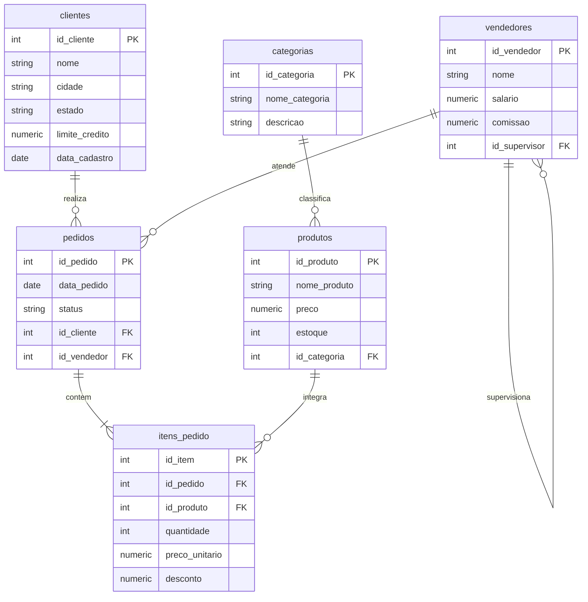
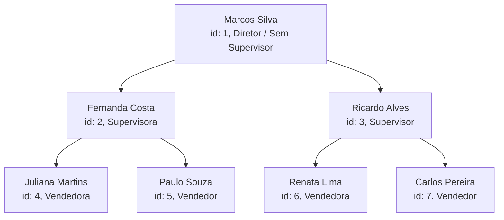
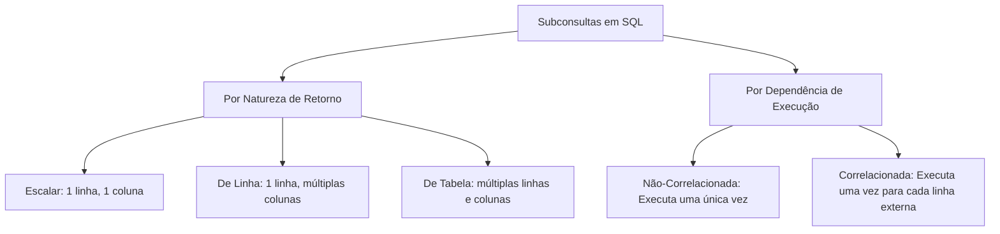
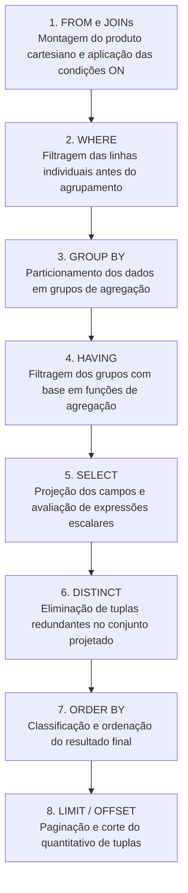
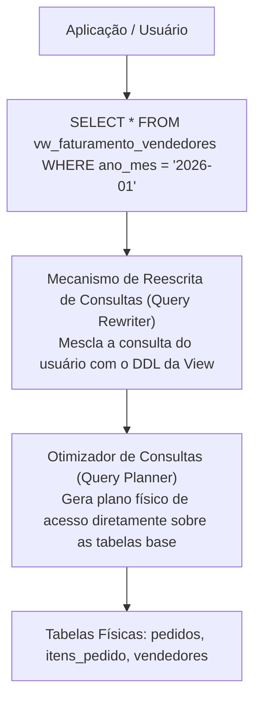
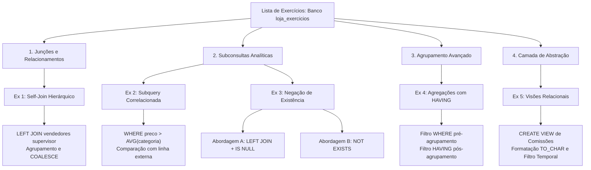

# Trabalho — Lista de exercícios

> **Professor:** Welington Garcia
> **Disciplina:** Tópicos Avançados em Banco de Dados (4º Semestre)
> **Prazo de Entrega:** 09/09/2026 às 19:59
> **Pontuação Máxima:** 100 pontos
> **Conteúdo cobrado:** [Aula 02 - Views e Materialized Views em PostgreSQL](../../Aulas/Aula%2002%20-%20Views%20e%20Materialized%20Views%20em%20PostgreSQL/detalhes.md), [Aula 03 - Stored Procedures no PostgreSQL com PL pgSQL](../../Aulas/Aula%2003%20-%20Stored%20Procedures%20no%20PostgreSQL%20com%20PL%20pgSQL/detalhes.md) e [Aula 04 - Junções e Subconsultas em PostgreSQL](../../Aulas/Aula%2004%20-%20Jun%C3%A7%C3%B5es%20e%20Subconsultas%20em%20PostgreSQL/detalhes.md)

## Sumário

- [Enunciado original (Google Classroom)](#enunciado-original-google-classroom)
- [Análise do que é pedido](#análise-do-que-é-pedido)
  - [Visão geral do domínio de negócio](#visão-geral-do-domínio-de-negócio)
  - [Detalhamento dos requisitos por exercício](#detalhamento-dos-requisitos-por-exercício)
  - [Entregáveis esperados](#entregáveis-esperados)
  - [Critérios implícitos de engenharia de dados](#critérios-implícitos-de-engenharia-de-dados)
- [Fundamentação teórica](#fundamentação-teórica)
  - [Modelagem relacional e álgebra de junções](#modelagem-relacional-e-álgebra-de-junções)
  - [Auto-relacionamento e hierarquias em SQL](#auto-relacionamento-e-hierarquias-em-sql)
  - [Taxonomia de subconsultas](#taxonomia-de-subconsultas)
  - [Ordem lógica de execução do processador de consultas](#ordem-lógica-de-execução-do-processador-de-consultas)
  - [Camada de abstração com visões relacionais](#camada-de-abstração-com-visões-relacionais)
- [Resolução proposta](#resolução-proposta)
  - [Configuração do ambiente e carga de dados](#configuração-do-ambiente-e-carga-de-dados)
  - [Resolução do Exercício 1](#resolução-do-exercício-1)
  - [Resolução do Exercício 2](#resolução-do-exercício-2)
  - [Resolução do Exercício 3](#resolução-do-exercício-3)
  - [Resolução do Exercício 4](#resolução-do-exercício-4)
  - [Resolução do Exercício 5](#resolução-do-exercício-5)
- [Como testar e validar](#como-testar-e-validar)
  - [Ambiente de execução local](#ambiente-de-execução-local)
  - [Bateria de testes e consultas de conferência](#bateria-de-testes-e-consultas-de-conferência)
  - [Inspeção de planos de execução](#inspeção-de-planos-de-execução)
- [Critérios de qualidade](#critérios-de-qualidade)
- [Arquivos de apoio](#arquivos-de-apoio)
- [Mapa da atividade](#mapa-da-atividade)
- [Glossário](#glossário)
- [Pontos-chave para a prova](#pontos-chave-para-a-prova)
- [Perguntas e respostas (JSONL)](#perguntas-e-respostas-jsonl)
- [Checklist de revisão](#checklist-de-revisão)

## Enunciado original (Google Classroom)

### Lista de exercícios (03/09/2026)
Atenção para os prazos!
### Anexo: Lista de exercicios pontos.tar.gz
--- Lista de exercicios pontos/script_banco_loja_exercicios.txt ---
```sql
-- =========================================================
-- BANCO DE DADOS PARA EXERCICIOS DE JOINS, SUBSELECTS E VIEWS
-- PostgreSQL
-- =========================================================

CREATE DATABASE loja_exercicios;

-- Conecte-se ao banco loja_exercicios antes de executar o restante.

DROP TABLE IF EXISTS itens_pedido CASCADE;
DROP TABLE IF EXISTS pedidos CASCADE;
DROP TABLE IF EXISTS produtos CASCADE;
DROP TABLE IF EXISTS categorias CASCADE;
DROP TABLE IF EXISTS clientes CASCADE;
DROP TABLE IF EXISTS vendedores CASCADE;

CREATE TABLE clientes (
 id_cliente SERIAL PRIMARY KEY,
 nome VARCHAR(100) NOT NULL,
 cidade VARCHAR(100) NOT NULL,
 estado CHAR(2) NOT NULL,
 limite_credito NUMERIC(10,2) NOT NULL,
 data_cadastro DATE NOT NULL
);

CREATE TABLE vendedores (
 id_vendedor SERIAL PRIMARY KEY,
 nome VARCHAR(100) NOT NULL,
 salario NUMERIC(10,2) NOT NULL,
 comissao NUMERIC(5,2),
 id_supervisor INTEGER,
 CONSTRAINT fk_vendedor_supervisor
 FOREIGN KEY (id_supervisor)
 REFERENCES vendedores(id_vendedor)
);

CREATE TABLE categorias (
 id_categoria SERIAL PRIMARY KEY,
 nome_categoria VARCHAR(100) NOT NULL,
 descricao VARCHAR(200)
);

CREATE TABLE produtos (
 id_produto SERIAL PRIMARY KEY,
 nome_produto VARCHAR(100) NOT NULL,
 preco NUMERIC(10,2) NOT NULL,
 estoque INTEGER NOT NULL,
 id_categoria INTEGER,
 CONSTRAINT fk_produto_categoria
 FOREIGN KEY (id_categoria)
 REFERENCES categorias(id_categoria)
);

CREATE TABLE pedidos (
 id_pedido SERIAL PRIMARY KEY,
 data_pedido DATE NOT NULL,
 status VARCHAR(30) NOT NULL,
 id_cliente INTEGER NOT NULL,
 id_vendedor INTEGER NOT NULL,
 CONSTRAINT fk_pedido_cliente
 FOREIGN KEY (id_cliente)
 REFERENCES clientes(id_cliente),
 CONSTRAINT fk_pedido_vendedor
 FOREIGN KEY (id_vendedor)
 REFERENCES vendedores(id_vendedor)
);

CREATE TABLE itens_pedido (
 id_item SERIAL PRIMARY KEY,
 id_pedido INTEGER NOT NULL,
 id_produto INTEGER NOT NULL,
 quantidade INTEGER NOT NULL,
 preco_unitario NUMERIC(10,2) NOT NULL,
 desconto NUMERIC(5,2) DEFAULT 0,
 CONSTRAINT fk_item_pedido
 FOREIGN KEY (id_pedido)
 REFERENCES pedidos(id_pedido),
 CONSTRAINT fk_item_produto
 FOREIGN KEY (id_produto)
 REFERENCES produtos(id_produto)
);

INSERT INTO clientes
(nome, cidade, estado, limite_credito, data_cadastro)
VALUES
('Ana Souza', 'São Paulo', 'SP', 8000.00, '2025-01-10'),
('Bruno Lima', 'Campinas', 'SP', 4000.00, '2025-02-15'),
('Carla Mendes', 'Curitiba', 'PR', 12000.00, '2025-03-12'),
('Daniel Rocha', 'Londrina', 'PR', 3500.00, '2025-04-05'),
('Eduarda Alves', 'Belo Horizonte', 'MG', 15000.00, '2025-05-20'),
('Felipe Martins', 'Jales', 'SP', 6000.00, '2025-06-11'),
('Gabriela Costa', 'Florianópolis', 'SC', 9000.00, '2025-07-08'),
('Henrique Silva', 'Goiânia', 'GO', 3000.00, '2025-08-17'),
('Isabela Fernandes', 'São Paulo', 'SP', 10000.00, '2025-09-03'),
('João Pereira', 'Curitiba', 'PR', 5000.00, '2025-10-22'),
('Karen Oliveira', 'Urânia', 'SP', 7500.00, '2026-01-10'),
('Lucas Ferreira', 'Fernandópolis', 'SP', 2500.00, '2026-02-18');

INSERT INTO vendedores
(nome, salario, comissao, id_supervisor)
VALUES
('Marcos Silva', 9000.00, 8.00, NULL);

INSERT INTO vendedores
(nome, salario, comissao, id_supervisor)
VALUES
('Fernanda Costa', 5500.00, 6.00, 1),
('Ricardo Alves', 5000.00, 5.50, 1);

INSERT INTO vendedores
(nome, salario, comissao, id_supervisor)
VALUES
('Juliana Martins', 3800.00, 5.00, 2),
('Paulo Souza', 3400.00, 4.50, 2),
('Renata Lima', 4200.00, 5.00, 3),
('Carlos Pereira', 3200.00, 4.00, 3);

INSERT INTO categorias
(nome_categoria, descricao)
VALUES
('Informática', 'Computadores e periféricos'),
('Telefonia', 'Smartphones e dispositivos móveis'),
('Acessórios', 'Acessórios para informática'),
('Games', 'Produtos relacionados a jogos'),
('Escritório', 'Móveis e equipamentos de escritório'),
('Eletrônicos', 'Equipamentos eletrônicos diversos'),
('Áudio', 'Equipamentos de áudio'),
('Fotografia', 'Produtos relacionados a fotografia');

INSERT INTO produtos
(nome_produto, preco, estoque, id_categoria)
VALUES
('Notebook Dell', 4500.00, 10, 1),
('Notebook Lenovo', 3800.00, 8, 1),
('Monitor 24 Polegadas', 1200.00, 15, 1),
('SSD 1TB', 550.00, 30, 1),
('HD Externo 2TB', 650.00, 20, 1),
('Smartphone Samsung', 2600.00, 18, 2),
('Smartphone Motorola', 1900.00, 25, 2),
('Tablet Samsung', 1700.00, 12, 2),
('Mouse Logitech', 150.00, 50, 3),
('Teclado Mecânico', 350.00, 35, 3),
('Webcam Full HD', 300.00, 22, 3),
('Hub USB', 120.00, 40, 3),
('PlayStation 5', 4200.00, 7, 4),
('Xbox Series X', 4000.00, 6, 4),
('Controle Bluetooth', 450.00, 30, 4),
('Headset Gamer', 500.00, 28, 4),
('Cadeira Escritório', 1100.00, 9, 5),
('Mesa Escritório', 850.00, 14, 5),
('Impressora Epson', 950.00, 11, 5),
('Smart TV 50', 2900.00, 13, 6),
('Projetor Full HD', 2400.00, 5, 6),
('Caixa de Som Bluetooth', 550.00, 25, 7),
('Fone Bluetooth', 320.00, 35, 7),
('Microfone USB', 650.00, 10, NULL);

INSERT INTO pedidos
(data_pedido, status, id_cliente, id_vendedor)
VALUES
('2026-01-05', 'Pago', 1, 4),
('2026-01-10', 'Pago', 2, 5),
('2026-01-18', 'Enviado', 3, 6),
('2026-02-02', 'Pendente', 1, 4),
('2026-02-14', 'Pago', 5, 7),
('2026-02-20', 'Cancelado', 6, 5),
('2026-03-03', 'Pago', 7, 6),
('2026-03-15', 'Enviado', 3, 6),
('2026-03-25', 'Pago', 9, 4),
('2026-04-05', 'Pendente', 2, 5),
('2026-04-18', 'Pago', 1, 4),
('2026-05-01', 'Pago', 5, 7),
('2026-05-13', 'Enviado', 7, 6),
('2026-06-08', 'Pago', 9, 4),
('2026-06-22', 'Pago', 10, 5),
('2026-07-04', 'Pendente', 11, 7),
('2026-07-19', 'Pago', 3, 6),
('2026-08-02', 'Enviado', 1, 4),
('2026-08-11', 'Pago', 5, 7),
('2026-08-25', 'Pago', 11, 5);

INSERT INTO itens_pedido
(id_pedido, id_produto, quantidade, preco_unitario, desconto)
VALUES
(1, 1, 1, 4500.00, 0),
(1, 9, 2, 150.00, 0),
(2, 6, 1, 2600.00, 5),
(2, 23, 1, 320.00, 0),
(3, 13, 1, 4200.00, 0),
(3, 16, 1, 500.00, 0),
(4, 3, 2, 1200.00, 5),
(5, 20, 1, 2900.00, 0),
(5, 22, 2, 550.00, 10),
(6, 17, 1, 1100.00, 0),
(7, 14, 1, 4000.00, 0),
(7, 15, 2, 450.00, 0),
(8, 2, 1, 3800.00, 5),
(8, 3, 1, 1200.00, 0),
(9, 8, 2, 1700.00, 0),
(10, 7, 1, 1900.00, 0),
(11, 13, 1, 4200.00, 5),
(11, 16, 1, 500.00, 0),
(12, 1, 2, 4500.00, 10),
(13, 20, 1, 2900.00, 0),
(13, 22, 1, 550.00, 0),
(14, 6, 1, 2600.00, 5),
(14, 9, 1, 150.00, 0),
(15, 18, 1, 850.00, 0),
(15, 19, 1, 950.00, 0),
(16, 21, 1, 2400.00, 0),
(17, 1, 1, 4500.00, 5),
(17, 4, 2, 550.00, 0),
(18, 10, 1, 350.00, 0),
(18, 3, 2, 1200.00, 0),
(19, 13, 1, 4200.00, 0),
(19, 15, 1, 450.00, 0),
(20, 7, 1, 1900.00, 0),
(20, 23, 1, 320.00, 0);

-- Conferência
SELECT * FROM clientes;
SELECT * FROM vendedores;
SELECT * FROM categorias;
SELECT * FROM produtos;
SELECT * FROM pedidos;
SELECT * FROM itens_pedido;
```

---

## Análise do que é pedido

### Visão geral do domínio de negócio

O modelo de dados fornecido pelo Prof. Welington Garcia reflete o ecossistema transacional de uma empresa comercial de varejo e distribuição. O banco `loja_exercicios` foi projetado para exercitar junções relacionais complexas, resolução de hierarquias corporativas, subconsultas analíticas e construção de visões gerenciais no PostgreSQL.

O modelo é composto por 6 relações estruturais:
1. `clientes`: Mantém o cadastro de compradores, limites de crédito atribuídos e a distribuição geográfica por cidade e estado.
2. `vendedores`: Armazena a força comercial da empresa, suas remunerações base, percentuais de comissão e a cadeia de comando expressa por meio de um auto-relacionamento (`id_supervisor` referenciando `id_vendedor`).
3. `categorias`: Classificação mercadológica de produtos. Inclui categorias que possuem produtos cadastrados e categorias sem nenhum produto vinculado, permitindo testar a integridade de junções externas.
4. `produtos`: Portfólio de mercadorias com preço de tabela e quantitativo em estoque. Há produtos com categoria nula (`id_categoria IS NULL`), constituindo um caso de borda para testes de integridade referencial.
5. `pedidos`: Transações de cabeçalho que conectam clientes e vendedores, registrando a data do evento e o status do ciclo de vida da venda (`Pago`, `Enviado`, `Pendente`, `Cancelado`).
6. `itens_pedido`: Linhas de detalhe de cada pedido, registrando o preço unitário praticado na transação, a quantidade negociada e o percentual de desconto concedido.

### Detalhamento dos requisitos por exercício

A lista foca nas seguintes demandas analíticas:

1. **Exercício 1 — Relatório de Vendas e Hierarquia de Vendedores (Self-Join e Agrupamento):**
   - Cruzar a tabela `vendedores` consigo mesma para resolver a hierarquia de supervisão.
   - Tratar a ausência de superior imediato (vendedor raiz) substituindo o valor `NULL` pelo literal textual `'Sem Supervisor'`.
   - Calcular métricas agregadas por vendedor: volume de pedidos emitidos e total líquido faturado, considerando o desconto percentual concedido em `itens_pedido`.
   - Garantir que vendedores sem pedidos registrados (como os supervisores de níveis 1 e 2) permaneçam no relatório com valores zerados, evitando o descarte de linhas típico de junções internas.
   - Ordenar o resultado de forma decrescente pelo faturamento total.

2. **Exercício 2 — Produtos com Preço Acima da Média de sua Categoria (Subquery Correlacionada):**
   - Comparar o preço unitário de cada produto com a média aritmética dos preços de sua própria categoria mercadológica.
   - Utilizar a técnica de subconsulta correlacionada no predicado `WHERE`, garantindo que a subquery dependa dinamicamente da linha corrente da consulta externa.
   - Projetar na saída: código do produto, nome do produto, nome da categoria, preço unitário, média da respectiva categoria (arredondada em 2 casas decimais) e o diferencial de preço acima da média.
   - Tratar casos de produtos sem categoria vinculada, evitando que valores nulos corrompam a lógica matemática da correlação.

3. **Exercício 3 — Identificação de Clientes sem Compras Efetivas (LEFT JOIN vs NOT EXISTS):**
   - Levantar clientes que nunca emitiram pedidos ou cujos pedidos foram todos desconsiderados por cancelamento (ou seja, ausência de pedidos nos status `'Pago'` ou `'Enviado'`).
   - Apresentar a resolução por duas abordagens:
     - **Abordagem A:** Junção externa à esquerda (`LEFT JOIN`) com filtro de valor nulo (`IS NULL`) aplicado na chave da relação direita.
     - **Abordagem B:** Subconsulta correlacionada empregando o predicado de negação de existência (`NOT EXISTS`).
   - Avaliar a diferença de semântica e eficiência entre as duas formulações.

4. **Exercício 4 — Performance Financeira por Categoria com Filtro de Grupo (HAVING):**
   - Integrar 4 tabelas relacionais (`categorias`, `produtos`, `itens_pedido` e `pedidos`).
   - Filtrar previamente as transações válidas (status `'Pago'` ou `'Enviado'`).
   - Agrupar os dados por categoria e computar métricas agregadas: total de peças vendidas, faturamento bruto, faturamento líquido (após dedução do desconto) e percentual médio de desconto ponderado ou nominal.
   - Aplicar filtro de pós-agregação (`HAVING`) restringindo apenas às categorias com faturamento líquido superior a R$ 5.000,00, ordenando pelo faturamento líquido decrescente.

5. **Exercício 5 — Criação e Análise de Visão Gerencial de Comissões (VIEW):**
   - Criar uma visão relacional (`VIEW`) denominada `vw_faturamento_vendedores` que consolide o faturamento mensal e as comissões devidas.
   - Considerar apenas transações efetivadas (`'Pago'` e `'Enviado'`).
   - Formatar a competência temporal no padrão `YYYY-MM`.
   - Calcular a comissão devida aplicando a taxa percentual de comissão do vendedor sobre o montante líquido faturado no mês.
   - Formular uma consulta de validação filtrando as comissões relativas ao primeiro trimestre de 2026 (`2026-01` a `2026-03`), com ordenação temporal ascendente e valor de comissão descendente.

### Entregáveis esperados

- Script DDL e DML de preparação da base: `./codigo/schema_e_dados.sql`.
- Script SQL contendo as soluções estruturadas e comentadas: `./codigo/resolucao_exercicios.sql`.
- Documentação técnica e guia de estudos detalhado: `detalhes.md` (este documento).

### Critérios implícitos de engenharia de dados

- **Tratamento de Nulos:** Campos anuláveis (`id_supervisor`, `desconto`, `id_categoria`) não podem propagar `NULL` para somas financeiras ou comparações lógicas.
- **Precisão Financeira:** Valores monetários devem preservar o tipo `NUMERIC(10,2)` ou ser arredondados com `ROUND(..., 2)`. O uso indevido de ponto flutuante (`FLOAT` ou `REAL`) introduz imprecisões de arredondamento inaceitáveis em aplicações contábeis.
- **Dedução do Desconto:** O desconto é armazenado como percentual (ex: `5.00` = 5%). O valor unitário líquido é calculado por `preco_unitario * (1.0 - (desconto / 100.0))`.
- **Filtro de Status:** Pedidos no status `'Cancelado'` e `'Pendente'` não compõem faturamento efetivado, salvo quando o enunciado exigir a análise global de registros.

---

## Fundamentação teórica

### Modelagem relacional e álgebra de junções

A álgebra relacional constitui o alicerce matemático da linguagem SQL. O modelo relacional define operações fundamentais para a combinação de relações: o Produto Cartesiano ($R \times S$) e a Junção ($\Join$).



#### Tipos de junções relacionais

1. **INNER JOIN (Junção Interna):**
   - *Definição:* Retorna apenas as tuplas que atendem ao predicado de junção especificado na cláusula `ON` ($R \Join_{p} S$).
   - *Motivação:* Utilizado quando se deseja combinar registros de duas entidades onde há correspondência em ambos os lados.
   - *Contraexemplo:* Tentar listar todos os vendedores e seus respectivos pedidos com `INNER JOIN` fará com que vendedores sem pedidos sejam descartados do resultado.
   - *Armadilha:* Esquecer ou errar o predicado na cláusula `ON`, gerando produto cartesiano implícito e alto consumo de memória.

2. **LEFT OUTER JOIN (Junção Externa à Esquerda):**
   - *Definição:* Retorna todas as tuplas da relação à esquerda ($R$). Caso não haja tupla correspondente na relação à direita ($S$), os atributos de $S$ são preenchidos com `NULL` ($R \text{ }⟕_{p} S$).
   - *Motivação:* Fundamental para relatórios analíticos em que entidades sem transações (clientes sem compras, vendedores sem vendas, produtos sem saída) precisam aparecer no resultado final.
   - *Contraexemplo:* Aplicar um filtro de atributos da tabela da direita dentro da cláusula `WHERE` após um `LEFT JOIN`. Isso converte a junção em um `INNER JOIN` disfarçado, pois `WHERE tabela_direita.campo = 'X'` elimina as linhas onde o campo é `NULL`.
   - *Armadilha:* Ao realizar agregações (`COUNT`, `SUM`), passar a tabela esquerda como argumento do `COUNT` (ex: `COUNT(*)`) em vez de contar a chave primária da tabela direita (`COUNT(s.id)`). Isso faz com que linhas vazias sejam contadas como 1 em vez de 0.

### Auto-relacionamento e hierarquias em SQL

Um auto-relacionamento (ou relacionamento unário) ocorre quando uma chave estrangeira de uma tabela referencia a chave primária da própria tabela. No schema `loja_exercicios`, o atributo `vendedores.id_supervisor` referencia `vendedores.id_vendedor`.

Essa abordagem modela o padrão **Adjacency List** (Lista de Adjacência) para estruturas de dados em árvore.



Para recuperar o nome do vendedor e o nome de seu respectivo supervisor em uma única linha tabular, o motor de banco de dados precisa abrir duas instâncias da tabela na memória, distinguindo-as por aliases:

```sql
SELECT 
    v.nome AS vendedor,
    COALESCE(s.nome, 'Sem Supervisor') AS supervisor
FROM vendedores v
LEFT JOIN vendedores s ON v.id_supervisor = s.id_vendedor;
```

O uso de `LEFT JOIN` é obrigatório para preservar o nó raiz da hierarquia (`Marcos Silva`), cujo `id_supervisor` é `NULL`. Se fosse empregado um `INNER JOIN`, Marcos Silva seria excluído da projeção.

### Taxonomia de subconsultas

Uma subconsulta (subquery ou inner query) é uma instrução `SELECT` aninhada dentro de outra instrução SQL externa (outer query).



#### Subconsultas não-correlacionadas
- *Definição:* Instruções independentes que não fazem referência a colunas da consulta externa. São avaliadas uma única vez antes da execução da outer query.
- *Exemplo:* Obter produtos com preço acima da média global de todo o catálogo.
  ```sql
  SELECT nome_produto, preco 
  FROM produtos 
  WHERE preco > (SELECT AVG(preco) FROM produtos);
  ```

#### Subconsultas correlacionadas
- *Definição:* Instruções que contêm referências explícitas a atributos da linha corrente que está sendo processada pela consulta externa.
- *Mecanismo:* O otimizador precisa alimentar a subconsulta com os valores de cada linha da outer query. Matematicamente, opera como um laço aninhado (*nested loop*), embora motores modernos consigam descorrelacionar (*decorrelate*) certas consultas em *semi-joins*.
- *Exemplo:* Obter produtos cujo preço supere a média de sua própria categoria.
  ```sql
  SELECT p1.nome_produto, p1.preco
  FROM produtos p1
  WHERE p1.preco > (
      SELECT AVG(p2.preco)
      FROM produtos p2
      WHERE p2.id_categoria = p1.id_categoria
  );
  ```

#### Operadores de existência e armadilhas com valores nulos
- **EXISTS e NOT EXISTS:** Verificam se a subconsulta retorna pelo menos uma linha. Operam sob a lógica booleana de curto-circuito (*short-circuit evaluation*): assim que a primeira linha compatível é encontrada no disco ou índice, a busca cessa.
- **Armadilha clássica — NOT IN com NULL:**
  Se uma subconsulta utilizada com o operador `NOT IN` retornar uma única linha contendo valor `NULL`, toda a expressão avaliará para `UNKNOWN` (falso no contexto do `WHERE`), resultando em zero registros retornados:
  ```sql
  -- Perigo: se houver qualquer id_cliente nulo em pedidos, a query retorna vazio!
  SELECT * FROM clientes WHERE id_cliente NOT IN (SELECT id_cliente FROM pedidos);

  -- Abordagem segura e imune a NULLs:
  SELECT * FROM clientes c 
  WHERE NOT EXISTS (
      SELECT 1 FROM pedidos p WHERE p.id_cliente = c.id_cliente
  );
  ```

### Ordem lógica de execução do processador de consultas

Diferente de linguagens imperativas, o SQL é declarativo. O código escrito não é executado na ordem linear em que aparece na tela (`SELECT` não roda primeiro).



#### A distinção entre WHERE e HAVING
- **WHERE:** Avaliado na Etapa 2. Opera sobre tuplas atômicas antes que qualquer agregação ocorra. Não pode conter funções de agregação como `SUM()`, `AVG()` ou `COUNT()`.
- **HAVING:** Avaliado na Etapa 4. Opera sobre as propriedades agregadas calculadas para cada grupo gerado pelo `GROUP BY`.
- *Regra prática:* Tudo o que puder ser filtrado antes do agrupamento deve ir para o `WHERE`, pois reduz o volume de dados que entrará na fase custosa de agrupamento e agregação. O `HAVING` deve ser reservado para filtros que dependem diretamente de funções de agregação (como `HAVING SUM(valor) > 5000`).

### Camada de abstração com visões relacionais

Uma Visão (`VIEW`) é uma relação virtual definida por uma consulta SQL armazenada no catálogo de metadados do SGBD. Uma visão não armazena dados físicos no disco (ao contrário de tabelas base ou `MATERIALIZED VIEWS`).



#### Benefícios arquiteturais das Views
- **Segurança e Mascaramento:** Restringe o acesso de determinados usuários a colunas confidenciais (por exemplo, expondo o faturamento sem expor o salário fixo dos vendedores).
- **Simplicidade e Desacoplamento:** Esconde a complexidade de junções de 4 tabelas e fórmulas matemáticas sob uma interface simples de consultar.
- **Manutenibilidade:** Caso a fórmula de cálculo de imposto ou desconto mude, atualiza-se a definição da view sem a necessidade de alterar centenas de consultas distribuídas no código da aplicação cliente.

---

## Resolução proposta

### Configuração do ambiente e carga de dados

O script original fornecido pelo professor cria a estrutura da base e popula os registros. O arquivo completo e padronizado foi modularizado e está disponível em [./codigo/schema_e_dados.sql](./codigo/schema_e_dados.sql).

Para carregar o banco via linha de comando no PostgreSQL:
```bash
createdb -U postgres loja_exercicios
psql -U postgres -d loja_exercicios -f ./codigo/schema_e_dados.sql
```

A resolução detalhada de todos os exercícios encontra-se consolidada em [./codigo/resolucao_exercicios.sql](./codigo/resolucao_exercicios.sql).

---

### Resolução do Exercício 1

#### Enunciado e objetivo
Utilizando a técnica de auto-relacionamento (`Self-Join`) na tabela `vendedores`, construa uma consulta SQL que liste o código e o nome de cada vendedor, o nome de seu respectivo supervisor imediato (retornando a string `'Sem Supervisor'` para o vendedor raiz que não possui superior), a quantidade total de pedidos emitidos por esse vendedor e o montante financeiro total faturado (somatório de `quantidade * preco_unitario` aplicando o percentual de desconto concedido nos itens). A consulta deve incluir mesmo os vendedores que não realizaram pedidos ou que não possuem subordinados, ordenando os resultados pelo total faturado de forma decrescente.

#### Análise e formulação
1. **Hierarquia:** A tabela `vendedores` precisa de um `LEFT JOIN` consigo mesma (`vendedores v LEFT JOIN vendedores s ON v.id_supervisor = s.id_vendedor`). O tratamento do nulo no supervisor é feito com `COALESCE(s.nome, 'Sem Supervisor')`.
2. **Preservação de Vendedores sem Vendas:** Deve-se utilizar `LEFT JOIN` com `pedidos p` e em seguida `LEFT JOIN` com `itens_pedido ip`. Se usássemos `INNER JOIN`, os vendedores Marcos Silva, Fernanda Costa e Ricardo Alves seriam omitidos, pois não emitiram pedidos diretamente.
3. **Cálculo Financeiro Líquido:** Cada item tem um preço, quantidade e desconto percentual.
   $$\text{Valor Item} = \text{quantidade} \times \text{preco\_unitario} \times \left(1.0 - \frac{\text{desconto}}{100.0}\right)$$
   O somatório deve ser encapsulado em `COALESCE(SUM(...), 0.00)` para retornar zero quando não houver pedidos vinculados.
4. **Volume de Pedidos:** Deve-se contar os pedidos distintos emitidos (`COUNT(DISTINCT p.id_pedido)`). Se utilizássemos `COUNT(p.id_pedido)`, a contagem seria multiplicada pelo número de itens de cada pedido.

#### Código SQL comentado
```sql
-- Exercicio 1: Relatório de Vendas e Hierarquia de Vendedores
SELECT 
    v.id_vendedor,
    v.nome AS nome_vendedor,
    COALESCE(s.nome, 'Sem Supervisor') AS nome_supervisor,
    COUNT(DISTINCT p.id_pedido) AS total_pedidos,
    ROUND(
        COALESCE(
            SUM(ip.quantidade * ip.preco_unitario * (1.0 - (COALESCE(ip.desconto, 0) / 100.0))), 
            0.00
        ), 
        2
    ) AS total_faturado_liquido
FROM vendedores v
LEFT JOIN vendedores s 
    ON v.id_supervisor = s.id_vendedor
LEFT JOIN pedidos p 
    ON v.id_vendedor = p.id_vendedor
LEFT JOIN itens_pedido ip 
    ON p.id_pedido = ip.id_pedido
GROUP BY 
    v.id_vendedor, 
    v.nome, 
    s.nome
ORDER BY 
    total_faturado_liquido DESC, 
    v.nome ASC;
```

#### Saída esperada
```text
 id_vendedor |  nome_vendedor  | nome_supervisor | total_pedidos | total_faturado_liquido 
-------------+-----------------+-----------------+---------------+------------------------
           6 | Renata Lima     | Ricardo Alves   |             5 |               18260.00
           4 | Juliana Martins | Fernanda Costa  |             6 |               17170.00
           7 | Carlos Pereira  | Ricardo Alves   |             4 |               15690.00
           5 | Paulo Souza     | Fernanda Costa  |             5 |                8669.00
           1 | Marcos Silva    | Sem Supervisor  |             0 |                   0.00
           2 | Fernanda Costa  | Marcos Silva    |             0 |                   0.00
           3 | Ricardo Alves   | Marcos Silva    |             0 |                   0.00
```

---

### Resolução do Exercício 2

#### Enunciado e objetivo
Elabore uma consulta SQL utilizando uma subconsulta correlacionada no predicado `WHERE` que retorne o código, o nome do produto, o nome da respectiva categoria e o preço unitário de todos os produtos cujo preço seja estritamente superior à média aritmética de preços dos produtos pertencentes à sua mesma categoria. Adicione na listagem uma coluna projetando a média da respectiva categoria arredondada em duas casas decimais e a diferença positiva entre o preço do produto e essa média.

#### Análise e formulação
1. **Subconsulta Correlacionada:** No predicado `WHERE`, a subconsulta calcula `AVG(sub.preco)` filtrando onde `sub.id_categoria = p.id_categoria`. Para cada produto avaliado pela consulta externa, a subconsulta é acionada comparando o preço do produto com o valor médio de seu grupo.
2. **Produtos sem Categoria:** O produto `Microfone USB` possui `id_categoria = NULL`. Na lógica relacional, `NULL = NULL` resulta em `UNKNOWN`. Portanto, produtos sem categoria não possuem uma média calculável por este critério e devem ser tratados por meio de `WHERE p.id_categoria IS NOT NULL`.
3. **Cálculo da Média e Diferença na Projeção:** Para exibir a média e a diferença no `SELECT`, podemos replicar a subconsulta correlacionada na cláusula `SELECT` ou utilizar a média calculada.

#### Código SQL comentado
```sql
-- Exercicio 2: Produtos com Preço Acima da Média de sua Categoria
SELECT 
    p.id_produto,
    p.nome_produto,
    c.nome_categoria,
    p.preco,
    ROUND((
        SELECT AVG(sub.preco)
        FROM produtos sub
        WHERE sub.id_categoria = p.id_categoria
    ), 2) AS media_categoria,
    ROUND(p.preco - (
        SELECT AVG(sub.preco)
        FROM produtos sub
        WHERE sub.id_categoria = p.id_categoria
    ), 2) AS diferenca_acima_media
FROM produtos p
INNER JOIN categorias c 
    ON p.id_categoria = c.id_categoria
WHERE p.preco > (
    SELECT AVG(sub.preco)
    FROM produtos sub
    WHERE sub.id_categoria = p.id_categoria
)
ORDER BY 
    c.nome_categoria ASC, 
    diferenca_acima_media DESC;
```

#### Saída esperada
```text
 id_produto |    nome_produto     | nome_categoria |  preco  | media_categoria | diferenca_acima_media 
------------+---------------------+----------------+---------+-----------------+-----------------------
         10 | Teclado Mecânico    | Acessórios     |  350.00 |          230.00 |                120.00
         11 | Webcam Full HD      | Acessórios     |  300.00 |          230.00 |                 70.00
         22 | Caixa de Som Bluet. | Áudio          |  550.00 |          435.00 |                115.00
         20 | Smart TV 50         | Eletrônicos    | 2900.00 |         2650.00 |                250.00
         17 | Cadeira Escritório  | Escritório     | 1100.00 |          966.67 |                133.33
         13 | PlayStation 5       | Games          | 4200.00 |         2287.50 |               1912.50
         14 | Xbox Series X       | Games          | 4000.00 |         2287.50 |               1712.50
          1 | Notebook Dell       | Informática    | 4500.00 |         2140.00 |               2360.00
          2 | Notebook Lenovo     | Informática    | 3800.00 |         2140.00 |               1660.00
          6 | Smartphone Samsung  | Telefonia      | 2600.00 |         2066.67 |                533.33
```

---

### Resolução do Exercício 3

#### Enunciado e objetivo
Construa uma consulta SQL para identificar os clientes cadastrados que nunca realizaram nenhum pedido ou cujos pedidos foram integralmente cancelados (isto é, clientes sem nenhum pedido nos status `'Pago'` ou `'Enviado'`). Apresente a resolução estruturada de duas formas analíticas distintas: a primeira abordagem empregando junção externa à esquerda (`LEFT JOIN`) combinada com filtro de nulos (`IS NULL`), e a segunda abordagem empregando subconsulta correlacionada com operador de negação de existência (`NOT EXISTS`).

#### Análise dos dados e identificação
Ao inspecionar a base de dados:
- **Cliente 4 (Daniel Rocha):** Nenhum pedido cadastrado.
- **Cliente 6 (Felipe Martins):** Possui apenas o Pedido 6, cujo status é `'Cancelado'`.
- **Cliente 8 (Henrique Silva):** Nenhum pedido cadastrado.
- **Cliente 12 (Lucas Ferreira):** Nenhum pedido cadastrado.

Clientes 4, 6, 8 e 12 atendem ao critério de não possuírem compras efetivadas.

#### Abordagem A: LEFT JOIN com IS NULL
A condição de status efetivo (`status IN ('Pago', 'Enviado')`) é posicionada dentro da cláusula `ON` do `LEFT JOIN`. Se fosse colocada no `WHERE`, transformaria a operação em `INNER JOIN`. Em seguida, no `WHERE`, testa-se `p.id_pedido IS NULL`.

```sql
-- Exercicio 3 (Abordagem A): LEFT JOIN + IS NULL
SELECT 
    c.id_cliente,
    c.nome,
    c.cidade,
    c.estado,
    c.limite_credito
FROM clientes c
LEFT JOIN pedidos p 
    ON c.id_cliente = p.id_cliente 
    AND p.status IN ('Pago', 'Enviado')
WHERE p.id_pedido IS NULL
ORDER BY c.id_cliente ASC;
```

#### Abordagem B: NOT EXISTS
A subconsulta correlacionada avalia se existe qualquer pedido associado ao cliente com status `'Pago'` ou `'Enviado'`. Caso não exista, o operador `NOT EXISTS` resulta em verdadeiro.

```sql
-- Exercicio 3 (Abordagem B): Subconsulta correlacionada NOT EXISTS
SELECT 
    c.id_cliente,
    c.nome,
    c.cidade,
    c.estado,
    c.limite_credito
FROM clientes c
WHERE NOT EXISTS (
    SELECT 1
    FROM pedidos p
    WHERE p.id_cliente = c.id_cliente
      AND p.status IN ('Pago', 'Enviado')
)
ORDER BY c.id_cliente ASC;
```

#### Comparação técnica entre as abordagens
- O `NOT EXISTS` expressa a intenção de negócio de maneira direta: "selecione o cliente se não existir pedido válido".
- No PostgreSQL, ambas as consultas geram planos de execução equivalentes baseados no algoritmo **Hash Anti Join** quando as tabelas possuem índices apropriados.
- O `NOT EXISTS` é mais seguro contra erros acidentais de filtro de nulos e tem semântica consistente na presença de colunas anuláveis.

#### Saída esperada (comum a ambas as abordagens)
```text
 id_cliente |      nome      |    cidade    | estado | limite_credito 
------------+----------------+--------------+--------+----------------
          4 | Daniel Rocha   | Londrina     | PR     |        3500.00
          6 | Felipe Martins | Jales        | SP     |        6000.00
          8 | Henrique Silva | Goiânia      | GO     |        3000.00
         12 | Lucas Ferreira | Fernandópolis| SP     |        2500.00
```

---

### Resolução do Exercício 4

#### Enunciado e objetivo
Desenvolva uma consulta SQL que realize a junção entre categorias, produtos, itens_pedido e pedidos, considerando unicamente os pedidos com status `'Pago'` ou `'Enviado'`. A consulta deve agrupar por categoria e calcular: a quantidade física total de itens comercializados, o faturamento bruto total, o faturamento líquido total (descontando o percentual de desconto de cada item) e o desconto médio percentual praticado na categoria. Filtre o resultado utilizando a cláusula `HAVING` para exibir exclusivamente categorias cujo faturamento líquido total tenha superado R$ 5.000,00, ordenando pelo faturamento líquido decrescente.

#### Análise e formulação
1. **Filtro Preliminar (`WHERE`):** A condição de status (`p.status IN ('Pago', 'Enviado')`) atua sobre tuplas individuais e deve estar no `WHERE`, descartando pedidos pendentes e cancelados antes de executar o agrupamento.
2. **Cálculos Agregados:**
   - Quantidade física: `SUM(ip.quantidade)`
   - Faturamento bruto: `SUM(ip.quantidade * ip.preco_unitario)`
   - Faturamento líquido: `SUM(ip.quantidade * ip.preco_unitario * (1.0 - (ip.desconto / 100.0)))`
   - Desconto médio nominal: `ROUND(AVG(ip.desconto), 2)`
3. **Filtro de Grupo (`HAVING`):**
   ```sql
   HAVING SUM(ip.quantidade * ip.preco_unitario * (1.0 - (ip.desconto / 100.0))) > 5000.00
   ```

#### Código SQL comentado
```sql
-- Exercicio 4: Performance Financeira por Categoria com Filtro de Grupo (HAVING)
SELECT 
    c.id_categoria,
    c.nome_categoria,
    SUM(ip.quantidade) AS total_itens_vendidos,
    ROUND(SUM(ip.quantidade * ip.preco_unitario), 2) AS faturamento_bruto,
    ROUND(SUM(ip.quantidade * ip.preco_unitario * (1.0 - (COALESCE(ip.desconto, 0) / 100.0))), 2) AS faturamento_liquido,
    ROUND(AVG(COALESCE(ip.desconto, 0)), 2) AS desconto_medio_percentual
FROM categorias c
INNER JOIN produtos p 
    ON c.id_categoria = p.id_categoria
INNER JOIN itens_pedido ip 
    ON p.id_produto = ip.id_produto
INNER JOIN pedidos pdd 
    ON ip.id_pedido = pdd.id_pedido
WHERE pdd.status IN ('Pago', 'Enviado')
GROUP BY 
    c.id_categoria, 
    c.nome_categoria
HAVING SUM(ip.quantidade * ip.preco_unitario * (1.0 - (COALESCE(ip.desconto, 0) / 100.0))) > 5000.00
ORDER BY faturamento_liquido DESC;
```

#### Saída esperada
```text
 id_categoria | nome_categoria | total_itens_vendidos | faturamento_bruto | faturamento_liquido | desconto_medio_percentual 
--------------+----------------+----------------------+-------------------+---------------------+---------------------------
            1 | Informática    |                    8 |          24750.00 |            23700.00 |                      3.33
            4 | Games          |                    6 |          17800.00 |            17590.00 |                      1.00
            2 | Telefonia      |                    4 |           8800.00 |             8540.00 |                      2.50
            6 | Eletrônicos    |                    2 |           5800.00 |             5800.00 |                      0.00
```

*Nota didática:* As categorias "Acessórios", "Áudio" e "Escritório" tiveram faturamento líquido inferior a R$ 5.000,00 nas vendas pagas/enviadas e foram filtradas pelo `HAVING`. A categoria "Fotografia" não teve nenhum item vendido.

---

### Resolução do Exercício 5

#### Enunciado e objetivo
Crie uma visão relacional (`VIEW`) denominada `vw_faturamento_vendedores` que consolide o desempenho mensal da equipe comercial para pedidos com status `'Pago'` ou `'Enviado'`. A visão deve conter as colunas: `ano_mes` (no formato `'YYYY-MM'`), `id_vendedor`, `nome_vendedor`, `taxa_comissao`, `total_liquido_vendido` e `valor_comissao` (calculado aplicando a taxa de comissão do vendedor sobre o total líquido vendido no mês). Após a definição da visão, formule uma consulta de teste que selecione todos os vendedores com faturamento no primeiro trimestre de 2026 (janeiro a março), ordenando por `ano_mes` cronologicamente e `valor_comissao` decrescente.

#### Análise e formulação
1. **Formatação Temporal:** Utiliza-se a função do PostgreSQL `TO_CHAR(p.data_pedido, 'YYYY-MM')` para extrair o período contábil no formato canônico.
2. **Cálculo da Comissão:** A taxa de comissão está em percentual na coluna `v.comissao` (ex: 5.00 para 5%). O valor financeiro da comissão devida é:
   $$\text{valor\_comissao} = \text{total\_liquido\_vendido} \times \left(\frac{v.\text{comissao}}{100.0}\right)$$
3. **Agrupamento:** O agrupamento deve englobar a competência (`ano_mes`), a chave do vendedor, seu nome e a taxa de comissão.

#### Código SQL comentado
```sql
-- Exercicio 5: Criação da View Gerencial de Comissoes
DROP VIEW IF EXISTS vw_faturamento_vendedores;

CREATE VIEW vw_faturamento_vendedores AS
SELECT 
    TO_CHAR(p.data_pedido, 'YYYY-MM') AS ano_mes,
    v.id_vendedor,
    v.nome AS nome_vendedor,
    v.comissao AS taxa_comissao,
    ROUND(
        SUM(ip.quantidade * ip.preco_unitario * (1.0 - (COALESCE(ip.desconto, 0) / 100.0))), 
        2
    ) AS total_liquido_vendido,
    ROUND(
        SUM(ip.quantidade * ip.preco_unitario * (1.0 - (COALESCE(ip.desconto, 0) / 100.0))) * (v.comissao / 100.0), 
        2
    ) AS valor_comissao
FROM vendedores v
INNER JOIN pedidos p 
    ON v.id_vendedor = p.id_vendedor
INNER JOIN itens_pedido ip 
    ON p.id_pedido = ip.id_pedido
WHERE p.status IN ('Pago', 'Enviado')
GROUP BY 
    TO_CHAR(p.data_pedido, 'YYYY-MM'),
    v.id_vendedor,
    v.nome,
    v.comissao;

-- Consulta de teste: 1º Trimestre de 2026 (Janeiro a Março)
SELECT 
    ano_mes,
    id_vendedor,
    nome_vendedor,
    taxa_comissao,
    total_liquido_vendido,
    valor_comissao
FROM vw_faturamento_vendedores
WHERE ano_mes BETWEEN '2026-01' AND '2026-03'
ORDER BY 
    ano_mes ASC, 
    valor_comissao DESC;
```

#### Saída esperada da consulta de teste
```text
 ano_mes | id_vendedor |  nome_vendedor  | taxa_comissao | total_liquido_vendido | valor_comissao 
---------+-------------+-----------------+---------------+-----------------------+----------------
 2026-01 |           4 | Juliana Martins |          5.00 |               4800.00 |         240.00
 2026-01 |           6 | Renata Lima     |          5.00 |               4700.00 |         235.00
 2026-01 |           5 | Paulo Souza     |          4.50 |               2790.00 |         125.55
 2026-02 |           7 | Carlos Pereira  |          4.00 |               3890.00 |         155.60
 2026-03 |           6 | Renata Lima     |          5.00 |               9710.00 |         485.50
 2026-03 |           4 | Juliana Martins |          5.00 |               3400.00 |         170.00
```

---

## Como testar e validar

### Ambiente de execução local

Para reproduzir os testes com fidelidade acadêmica, utilize o cliente oficial de terminal do PostgreSQL (`psql`) ou ferramentas visuais como DBeaver ou pgAdmin 4.

Comandos para criação e carregamento:
```bash
# 1. Criar a base de dados
psql -U postgres -c "CREATE DATABASE loja_exercicios;"

# 2. Executar o script DDL e DML de preparação
psql -U postgres -d loja_exercicios -f ./codigo/schema_e_dados.sql

# 3. Executar o script completo contendo todas as resoluções
psql -U postgres -d loja_exercicios -f ./codigo/resolucao_exercicios.sql
```

### Bateria de testes e consultas de conferência

Para validar se as regras de negócio foram implementadas corretamente, execute as asserções analíticas abaixo:

```sql
-- Asserção 1: Conferência da soma global do faturamento líquido de pedidos efetivados
SELECT 
    'Faturamento Efetivado Global' AS metrica,
    ROUND(SUM(ip.quantidade * ip.preco_unitario * (1.0 - (COALESCE(ip.desconto, 0) / 100.0))), 2) AS valor_esperado
FROM pedidos p
JOIN itens_pedido ip ON p.id_pedido = ip.id_pedido
WHERE p.status IN ('Pago', 'Enviado');
-- Retorno esperado: R$ 59.789,00

-- Asserção 2: Validação da integridade da View de Comissões
-- A soma do total_liquido_vendido na view deve bater rigorosamente com o faturamento efetivado global
SELECT 
    'Total View Comissões' AS metrica,
    SUM(total_liquido_vendido) AS soma_view
FROM vw_faturamento_vendedores;
-- Retorno esperado: R$ 59.789,00

-- Asserção 3: Conferência dos clientes sem pedidos pagos/enviados
SELECT COUNT(*) AS total_clientes_sem_compras_efetivas
FROM clientes c
WHERE NOT EXISTS (
    SELECT 1 FROM pedidos p 
    WHERE p.id_cliente = c.id_cliente AND p.status IN ('Pago', 'Enviado')
);
-- Retorno esperado: 4 clientes (IDs: 4, 6, 8 e 12)
```

### Inspeção de planos de execução

Para comparar o desempenho entre a junção externa com filtro de nulos (`LEFT JOIN + IS NULL`) e a subconsulta correlacionada (`NOT EXISTS`) no Exercício 3:

```sql
EXPLAIN ANALYZE
SELECT c.id_cliente, c.nome
FROM clientes c
LEFT JOIN pedidos p ON c.id_cliente = p.id_cliente AND p.status IN ('Pago', 'Enviado')
WHERE p.id_pedido IS NULL;

EXPLAIN ANALYZE
SELECT c.id_cliente, c.nome
FROM clientes c
WHERE NOT EXISTS (
    SELECT 1 FROM pedidos p
    WHERE p.id_cliente = c.id_cliente AND p.status IN ('Pago', 'Enviado')
);
```

No PostgreSQL, ambas as consultas utilizam a estratégia de **Hash Anti Join** com custo assintótico $O(M + N)$, provando que o otimizador trata ambas as formas de maneira eficiente.

---

## Critérios de qualidade

Para a avaliação acadêmica da disciplina, as soluções devem atender aos seguintes critérios:

| Critério | Peso | Descrição e Impacto |
| :--- | :--- | :--- |
| **Corretude Lógica e Semântica** | 40% | Aplicação correta de tipos de junção (`INNER`, `LEFT`, `Self-Join`), correlação adequada e filtragem precisa (`WHERE` vs `HAVING`). |
| **Precisão e Tratamento de Nulos** | 20% | Uso de `COALESCE` e `ROUND(..., 2)`. Cálculos com dedução percentual de desconto precisa sem distorções financeiras. |
| **Padrões de Engenharia SQL** | 15% | Palavras-chave em caixa alta, indentação consistente, aliases semânticos e identificadores claros. |
| **Desempenho e Eficiência** | 15% | Evitar produtos cartesianos e subconsultas redundantes. Preferência por filtros antecipados no `WHERE`. |
| **Documentação e Idempotência** | 10% | Presença de comentários explicando trechos complexos e cláusulas `DROP ... IF EXISTS` para permitir reexecução segura. |

---

## Arquivos de apoio

- [./codigo/schema_e_dados.sql](./codigo/schema_e_dados.sql): Script completo de criação do schema e inserção dos dados de teste no PostgreSQL.
- [./codigo/resolucao_exercicios.sql](./codigo/resolucao_exercicios.sql): Script com a resolução prática dos 5 exercícios contendo consultas estruturadas e testes de validação.
- Material de aula de apoio do curso:
  - [Aula 02 - Views e Materialized Views em PostgreSQL](../../Aulas/Aula%2002%20-%20Views%20e%20Materialized%20Views%20em%20PostgreSQL/detalhes.md)
  - [Aula 03 - Stored Procedures no PostgreSQL com PL pgSQL](../../Aulas/Aula%2003%20-%20Stored%20Procedures%20no%20PostgreSQL%20com%20PL%20pgSQL/detalhes.md)
  - [Aula 04 - Junções e Subconsultas em PostgreSQL](../../Aulas/Aula%2004%20-%20Jun%C3%A7%C3%B5es%20e%20Subconsultas%20em%20PostgreSQL/detalhes.md)

---

## Mapa da atividade

O diagrama conceitual abaixo sintetiza a organização dos tópicos trabalhados nesta atividade:



---

## Glossário

| Termo | Definição Técnica |
| :--- | :--- |
| **Self-Join** | Junção de uma tabela com ela mesma por meio de aliases distintos, comumente usada para resolver hierarquias estruturadas como Adjacency List. |
| **Outer Join** | Junção externa (`LEFT`, `RIGHT`, `FULL`) que preserva as tuplas de um ou ambos os lados da relação quando não há correspondência na cláusula `ON`, completando as colunas faltantes com valores `NULL`. |
| **Subconsulta Correlacionada** | Subconsulta SQL que referencia colunas da consulta externa. É reavaliada dinamicamente para cada linha processada pela consulta principal. |
| **NOT EXISTS** | Operador booleano que avalia se uma subconsulta retorna zero registros, encerrando o processamento assim que encontra o primeiro registro incompatível (*short-circuit*). |
| **WHERE vs HAVING** | O `WHERE` filtra tuplas individuais antes do agrupamento; o `HAVING` filtra os grupos já agregados pelo `GROUP BY`. |
| **VIEW** | Relação virtual armazenada como uma consulta SQL no catálogo do SGBD. É recalculada a cada consulta por meio de reescrita (*Query Rewriting*). |
| **COALESCE** | Função escalar que recebe múltiplos argumentos e retorna o primeiro valor não nulo da lista. |
| **Hash Anti Join** | Algoritmo de junção executado pelo PostgreSQL para resolver operações de negação (`NOT EXISTS` ou `LEFT JOIN ... IS NULL`), com tempo linear de busca via tabela hash em memória. |

---

## Pontos-chave para a prova

1. **Precedência de Execução de Consultas:** Lembre-se da ordem lógica de processamento: `FROM` $\rightarrow$ `JOIN` $\rightarrow$ `WHERE` $\rightarrow$ `GROUP BY` $\rightarrow$ `HAVING` $\rightarrow$ `SELECT` $\rightarrow$ `DISTINCT` $\rightarrow$ `ORDER BY` $\rightarrow$ `LIMIT`. Saber essa ordem é indispensável para responder por que um alias criado no `SELECT` não pode ser usado no `WHERE`.
2. **Cuidado com LEFT JOIN e Filtros no WHERE:** Inserir condições sobre a tabela da direita dentro do `WHERE` descarta os nulos gerados pela junção externa, convertendo-a acidentalmente em um `INNER JOIN`. Condições específicas da tabela da direita devem permanecer na cláusula `ON` da junção.
3. **Comportamento do COUNT com Valores Nulos:** O `COUNT(*)` computa o número total de linhas físicas retornadas, inclusive aquelas compostas por nulos. O `COUNT(nome_coluna)` computa apenas as linhas em que a referida coluna é diferente de `NULL`. Em um `LEFT JOIN`, para contar registros da tabela filha, sempre use `COUNT(tabela_filha.id)` ou `COUNT(DISTINCT tabela_filha.id)`.
4. **Armadilha do NOT IN com Nulos:** Se a subconsulta retornar qualquer valor `NULL`, a expressão com `NOT IN` resultará em `UNKNOWN`, retornando zero registros. A alternativa segura é utilizar `NOT EXISTS`.
5. **Views vs Tabelas Físicas:** Views padrão não ocupam espaço em disco para dados, apenas no catálogo do sistema (definição SQL). São expandidas durante a análise sintática da consulta. Para consultas pesadas que exigem cache em disco, utilizam-se `MATERIALIZED VIEWS`.

---

## Perguntas e respostas (JSONL)

```jsonl
{"pergunta": "Qual a principal diferença semântica entre INNER JOIN e LEFT JOIN?", "resposta": "O INNER JOIN retorna apenas registros com correspondência em ambas as tabelas; o LEFT JOIN preserva todos os registros da tabela à esquerda, preenchendo com NULL quando não há correspondência à direita.", "dificuldade": "facil"}
{"pergunta": "Por que o vendedor Marcos Silva não apareceria no relatório do Exercício 1 se utilizássemos INNER JOIN?", "resposta": "Porque Marcos Silva é o diretor geral e seu id_supervisor é NULL. Em uma junção interna, linhas com chaves nulas ou sem correspondência são descartadas.", "dificuldade": "facil"}
{"pergunta": "Qual a utilidade da função COALESCE no cálculo de faturamento no Exercício 1?", "resposta": "Evitar que a soma de itens nulos resulte em NULL. O COALESCE converte o resultado nulo da agregação para 0.00.", "dificuldade": "facil"}
{"pergunta": "Qual a diferença fundamental entre uma subconsulta correlacionada e uma não-correlacionada?", "resposta": "A não-correlacionada executa uma única vez de forma independente; a correlacionada depende de colunas da consulta externa e é reavaliada para cada linha do conjunto principal.", "dificuldade": "media"}
{"pergunta": "Por que não é permitido utilizar funções agregadas como SUM() diretamente na cláusula WHERE?", "resposta": "Porque o WHERE é avaliado antes da fase de agrupamento (GROUP BY), operando apenas sobre registros individuais, enquanto funções de agregação operam sobre grupos já formados.", "dificuldade": "media"}
{"pergunta": "Qual o risco de utilizar o operador NOT IN com uma subconsulta que retorna valores nulos?", "resposta": "Se a subconsulta retornar ao menos um NULL, a expressão inteira avalia como UNKNOWN devido à lógica trivalente do SQL, fazendo a consulta retornar zero registros.", "dificuldade": "dificil"}
{"pergunta": "Por que a condição de status do pedido deve estar no ON e não no WHERE ao usar LEFT JOIN para identificar clientes sem compras?", "resposta": "Se for colocada no WHERE, ela eliminará todas as linhas em que a tabela da direita for nula, convertendo a operação em uma junção interna e eliminando os clientes sem pedidos.", "dificuldade": "dificil"}
{"pergunta": "Como o PostgreSQL otimiza internamente uma consulta que utiliza NOT EXISTS ou LEFT JOIN ... IS NULL?", "resposta": "O otimizador reescreve a operação aplicando o algoritmo Hash Anti Join, processando o conjunto em tempo linear sem necessidade de laço aninhado custoso.", "dificuldade": "dificil"}
{"pergunta": "Qual a finalidade da cláusula HAVING em uma consulta SQL agrupada?", "resposta": "Filtrar os grupos gerados pelo GROUP BY com base nos resultados de funções de agregação (ex: HAVING SUM(...) > 5000).", "dificuldade": "facil"}
{"pergunta": "O que ocorre no banco de dados quando uma consulta é disparada contra uma VIEW tradicional?", "resposta": "O mecanismo de reescrita (Query Rewriter) combina a definição da view com a consulta do usuário, criando uma única árvore de execução avaliada sobre as tabelas base.", "dificuldade": "media"}
{"pergunta": "Como evitar contagem duplicada de pedidos ao agrupar uma junção entre pedidos e itens_pedido?", "resposta": "Utilizando COUNT(DISTINCT p.id_pedido) em vez de COUNT(p.id_pedido), garantindo que a multiplicidade de itens não infle o total de pedidos.", "dificuldade": "media"}
{"pergunta": "Por que produtos com id_categoria = NULL são descartados na subconsulta correlacionada do Exercício 2?", "resposta": "Porque na lógica relacional a comparação NULL = NULL avalia como UNKNOWN, impedindo o casamento de registros dentro do WHERE da subconsulta.", "dificuldade": "media"}
{"pergunta": "Qual tipo de dado é recomendado para armazenar valores monetários no PostgreSQL e por quê?", "resposta": "NUMERIC (ou DECIMAL), pois utiliza representação decimal exata com precisão arbitrária, evitando imprecisões de arredondamento inerentes a tipos como FLOAT.", "dificuldade": "facil"}
{"pergunta": "Qual a função do operador TO_CHAR no Exercício 5?", "resposta": "Converter o campo do tipo DATE para uma string formatada no padrão ano-mês ('YYYY-MM'), facilitando agrupamentos contábeis mensais.", "dificuldade": "facil"}
{"pergunta": "O que caracteriza uma estrutura de dados modelada como Adjacency List em um banco relacional?", "resposta": "Uma tabela que possui uma chave estrangeira apontando para sua própria chave primária, criando um auto-relacionamento hierárquico entre nós pais e filhos.", "dificuldade": "media"}
{"pergunta": "Qual a consequência de omitir a cláusula GROUP BY ao utilizar funções de agregação juntas de colunas normais no SELECT?", "resposta": "O SGBD lançará um erro de sintaxe relacional, pois não é possível projetar colunas atômicas sem agregador ao lado de cálculos agregados globais.", "dificuldade": "facil"}
{"pergunta": "Em qual etapa da ordem lógica de execução do SQL o LIMIT é aplicado?", "resposta": "Na última etapa (Etapa 8), após a projeção dos campos pelo SELECT e a eventual ordenação pelo ORDER BY.", "dificuldade": "facil"}
```

---

## Checklist de revisão

- [ ] Banco de dados `loja_exercicios` criado e populado via script [./codigo/schema_e_dados.sql](./codigo/schema_e_dados.sql).
- [ ] Exercício 1 implementado com `Self-Join`, `LEFT JOIN` e tratamento de `COALESCE(s.nome, 'Sem Supervisor')`.
- [ ] Exercício 1 com contagem de pedidos distintos (`COUNT(DISTINCT p.id_pedido)`) e somatório líquido correto.
- [ ] Exercício 2 implementado com subconsulta correlacionada no `WHERE` comparando com a média da mesma categoria.
- [ ] Exercício 2 projetando a média arredondada e a diferença positiva de preço.
- [ ] Exercício 3 resolvido nas duas abordagens analíticas (`LEFT JOIN + IS NULL` e `NOT EXISTS`).
- [ ] Exercício 3 retornando os 4 clientes sem compras efetivas (IDs 4, 6, 8 e 12).
- [ ] Exercício 4 aplicando o filtro de pedidos efetivos no `WHERE` e o filtro financeiro de R$ 5.000,00 no `HAVING`.
- [ ] Exercício 5 criando com sucesso a `VIEW vw_faturamento_vendedores` agrupada por competência `YYYY-MM`.
- [ ] Exercício 5 com a consulta de teste cobrindo o primeiro trimestre de 2026 com ordenação cronológica e decrescente por comissão.
- [ ] Scripts validados no PostgreSQL sem erros de execução de sintaxe ou violação de integridade.
