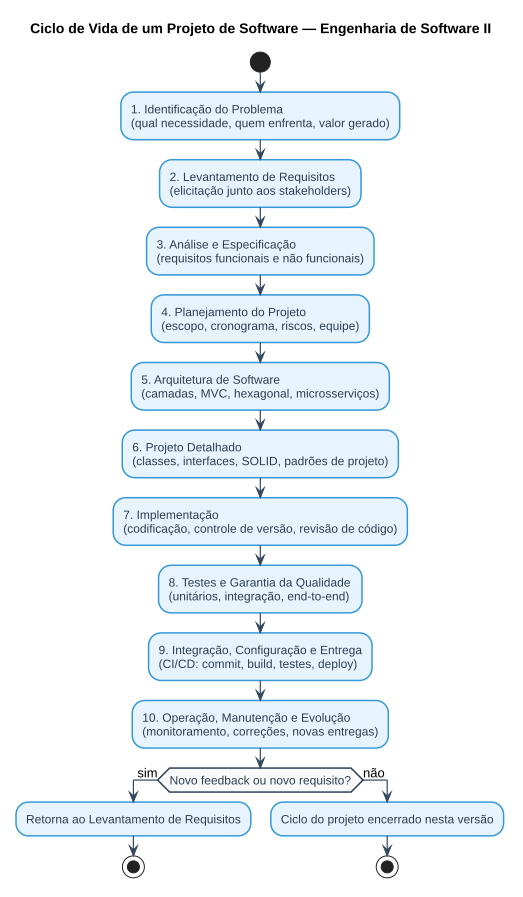

# Aula 01 — Ciclo de Vida do Projeto de Software

> **Professor:** Wesley Soares (Prof. Ms. Wesley Soares de Souza)
> **Disciplina:** Engenharia de Software II (4º Semestre)
> **Tema:** Apresentação da disciplina, Projeto Integrador e as dez fases do ciclo de vida de um projeto de software

## Objetivo da aula

Apresentar a disciplina, o Projeto Integrador que acompanhará o semestre e situar o aluno no ciclo de vida completo de um projeto de software — da identificação do problema até a operação e manutenção do sistema em produção. A aula estabelece o eixo condutor de toda a disciplina, resumido na frase: *"faça a coisa certa (análise) e faça certo a coisa (projeto)"*.

## Projeto Integrador da disciplina

Ao longo do semestre, cada equipe (formada por **3 pessoas**) deve conceber e documentar um sistema de software fictício, aplicando os principais conceitos de Engenharia de Software II. O projeto é dividido em duas etapas:

1. **1ª Etapa — Engenharia de Requisitos**
   - Identificação do problema.
   - Levantamento dos stakeholders.
   - Levantamento e especificação de requisitos.
2. **Etapa Final — Arquitetura e Projeto**
   - Definição da arquitetura.
   - Padrões de projeto.
   - Componentização e reutilização.
   - Identificação de anomalias e refatoração.

### Domínios de negócio sugeridos para o projeto fictício

| Domínio | Exemplos de sistema |
| :--- | :--- |
| Comércio | Marketplace, sistema de pedidos, gestão de estoque |
| Serviços Públicos | Solicitação de serviços municipais, gestão de iluminação pública, atendimento ao cidadão |
| Negócios | Gestão de projetos, recrutamento e seleção, gestão financeira |
| Saúde | Agendamento de consultas, gestão de clínicas, acompanhamento de pacientes |
| Educação | Plataforma de cursos, gestão acadêmica, ambiente de avaliação e atividades |
| Logística | Rastreamento de entregas, gestão de transportadoras, otimização de rotas |

## Avaliação da disciplina

- **AV1** e **AV2**: provas individuais teórico-práticas, com questões dissertativas e de múltipla escolha.
- **PJ**: projeto de software desenvolvido em grupo, com papéis definidos (o Projeto Integrador descrito acima).
- **Fórmula da média final:**

$$\text{Média} = \frac{[(\text{AV}_1 \times 0{,}6) + (\text{PJ} \times 0{,}4)] + [(\text{AV}_2 \times 0{,}6) + (\text{PJ} \times 0{,}4)]}{2}$$

## Conteúdo programático da disciplina

**Primeira metade do semestre:**
- Fase de Projeto de Software.
- Engenharia de Requisitos.
- Técnicas de Elicitação e Levantamento de Requisitos.
- Modelagem de Requisitos.
- Arquitetura de Software.
- **Entrega da Fase 1.**
- Estilos e padrões arquiteturais.

**Segunda metade do semestre:**
- Projeto de Software e princípios de design.
- Padrões de Projeto.
- Anomalias, *code smells* e refatoração.
- Reutilização com componentes e frameworks.
- **Entrega da Fase 2.**
- Integração contínua e testes automatizados.
- Contêineres, gerência de configuração e liberação.

## Mas o que é, afinal, um projeto de software?

Software é um componente essencial para qualquer tipo de negócio — mas **software não é feito em "pastelaria"**: diferente de um pastel, que pode ser produzido em poucos minutos sem planejamento, um projeto de software exige análise, desenho da solução e passos estruturados antes da entrega, sob risco de gerar retrabalho, bugs e uma solução que não resolve o problema real do cliente.

## As dez fases do ciclo de vida de um projeto de software

Um projeto de software passa por fases que ajudam a transformar uma necessidade em um sistema funcional, confiável e sustentável. O fluxo completo — da identificação do problema até a manutenção — está representado no diagrama de atividades ao final desta seção.

### 1. Identificação do Problema

Todo software começa com uma necessidade. Antes de pensar em telas, tecnologias ou código, é preciso compreender:
- Qual problema precisa ser resolvido?
- Quem enfrenta esse problema?
- Como o problema é resolvido atualmente?
- Quais são as principais dificuldades?
- Qual valor o software deverá gerar?

**Exemplo:** Problema — *pequenos produtores têm dificuldade para controlar suas vendas e estoques.* Possível solução — *sistema de gestão de vendas e estoque.* Um bom software começa com um problema bem compreendido.

### 2. Levantamento e Engenharia de Requisitos

Fase em que a equipe busca compreender as necessidades dos usuários e do negócio. Principais atividades: identificação dos stakeholders, entrevistas, questionários, observação, *workshops*, *brainstorming*, prototipação e análise de documentos (esta etapa é aprofundada na [Aula 03](../03%20Elicitacao%20e%20Levantamento%20de%20Requisitos/detalhes.md)).

### 3. Análise e Especificação de Requisitos

Os requisitos precisam ser analisados, organizados e documentados em dois tipos:
- **Requisitos Funcionais (RF):** o que o sistema deve fazer. *Exemplo: "o sistema deve permitir cadastrar produtos."*
- **Requisitos Não Funcionais (RNF):** como o sistema deve se comportar. *Exemplo: "a consulta de produtos deve responder em até 2 segundos."*

### 4. Planejamento do Projeto

Define como a equipe organizará o trabalho. Elementos importantes: escopo, cronograma, atividades, prioridades, equipe, recursos, riscos e entregas. Perguntas fundamentais: o que será desenvolvido? Quem fará? Quando será entregue? Quais riscos podem afetar o projeto?

### 5. Arquitetura de Software

Define as principais decisões estruturais do sistema: organização dos componentes, comunicação entre módulos, persistência de dados, integração com sistemas externos, segurança, escalabilidade e disponibilidade. Exemplos de estilos arquiteturais: arquitetura em camadas, MVC, Hexagonal, Clean Architecture, Microservices e Event-Driven.

### 6. Projeto Detalhado

A arquitetura é detalhada em elementos que poderão ser implementados: classes, interfaces, módulos, componentes, serviços, responsabilidades e dependências. Princípios importantes: alta coesão, baixo acoplamento, encapsulamento, separação de responsabilidades e **SOLID**.

### 7. Implementação

Fase em que os desenvolvedores implementam a solução definida nas etapas anteriores: desenvolvimento de funcionalidades, criação de componentes, integração entre módulos, implementação de regras de negócio, acesso a dados e integração com APIs. Boas práticas: controle de versão, revisão de código, padronização, testes automatizados e commits frequentes.

### 8. Testes e Garantia da Qualidade

Os testes buscam identificar problemas antes que o software chegue aos usuários:
- **Testes Unitários** — verificam pequenas unidades de código.
- **Testes de Integração** — verificam a comunicação entre componentes.
- **Testes End-to-End (E2E)** — validam o sistema de ponta a ponta.

### 9. Integração, Configuração e Entrega

O software precisa ser integrado, empacotado e disponibilizado de forma controlada, seguindo o fluxo *Commit → Build → Testes → Análise → Empacotamento → Deploy*. Práticas importantes: integração contínua, *builds* automatizados, gerência de configuração, controle de versões, variáveis de ambiente, contêineres e *pipelines*.

### 10. Operação, Manutenção e Evolução

Após a disponibilização do sistema, novas necessidades e problemas surgem, formando um ciclo de retroalimentação: *Feedback → Novos Requisitos → Desenvolvimento → Testes → Nova Entrega*. Atividades: correção de defeitos, melhorias, novas funcionalidades, monitoramento, atualizações, refatoração e evolução arquitetural.

O diagrama de atividades abaixo resume as dez fases em sequência, incluindo o retorno ao levantamento de requisitos quando surgem novos pedidos de mudança:

## Bibliografia indicada

- GUEDES, Gilleanes T. A. **UML 2 — Uma Abordagem Prática**. 2. ed. São Paulo: Novatec, 2011.
- BOOCH, Grady. **UML — Guia do Usuário**. 1. ed. Rio de Janeiro: Campus, 2000.
- FURLAN, José Davi. **Modelagem de Objetos através da UML**. 1. ed. São Paulo: Makron Books, 1998.
- BEZERRA, Eduardo. **Princípios de Análise e Projeto de Sistemas com UML**. 4. ed. Rio de Janeiro: Elsevier, 2007.
- MEDEIROS, Ernani. **Desenvolvendo Software com UML 2.0**. 1. ed. São Paulo: Pearson Makron Books, 2004.
- O'NEIIL, Henrique; NUNES, Mauro; RAMOS, Pedro. **Exercícios de UML**. 1. ed. Editora Informática, 2010.
- GÓES, Wilson Moraes. **Aprenda UML por meio de Estudo de Caso**. 1. ed. São Paulo: Novatec, 2014.
- BORATTI, Isaias Camilo. **Programação Orientada a Objetos em Java**. 1. ed. Florianópolis: Visual Books, 2007.

## Exercícios de fixação

1. Explique, com suas palavras, por que a frase "software não é feito em pastelaria" resume um dos problemas mais comuns em projetos malsucedidos.
2. Liste as dez fases do ciclo de vida de um projeto de software na ordem correta.
3. Diferencie um requisito funcional de um requisito não funcional, dando um exemplo de cada.
4. Um cliente diz apenas: "preciso de um sistema para controlar minhas vendas." Em qual fase do ciclo de vida essa frase se encaixa, e o que falta para que ela se torne um requisito completo?
5. Cite três estilos arquiteturais mencionados na aula e explique a diferença entre arquitetura em camadas e microsserviços em uma frase.
6. Qual a diferença entre teste unitário, teste de integração e teste E2E?
7. Calcule a média final de um aluno que obteve AV1 = 7,0, AV2 = 8,0 e PJ = 9,0, usando a fórmula apresentada na aula.
8. Por que a fase de "Operação, Manutenção e Evolução" é representada como um ciclo (feedback loop) e não como uma etapa final isolada?

Gabarito (exercícios 2, 3, 6 e 7)

**2.** Identificação do Problema → Levantamento de Requisitos → Análise e Especificação → Planejamento do Projeto → Arquitetura de Software → Projeto Detalhado → Implementação → Testes e Garantia da Qualidade → Integração, Configuração e Entrega → Operação, Manutenção e Evolução.

**3.** Requisito funcional descreve *o que* o sistema faz (ex.: "o sistema deve permitir cadastrar produtos"); requisito não funcional descreve *como* o sistema se comporta ou uma restrição de qualidade (ex.: "a consulta de produtos deve responder em até 2 segundos").

**6.** Teste unitário verifica uma pequena unidade de código isoladamente; teste de integração verifica a comunicação entre componentes; teste E2E valida o sistema de ponta a ponta, simulando o uso real por um usuário.

**7.** Média = [(7,0×0,6)+(9,0×0,4)] + [(8,0×0,6)+(9,0×0,4)] / 2 = [(4,2+3,6) + (4,8+3,6)] / 2 = [7,8 + 8,4] / 2 = 16,2 / 2 = **8,1**.

## Perguntas de revisão

- Qual a diferença entre a "1ª Etapa" e a "Etapa Final" do Projeto Integrador da disciplina?
- Por que a identificação do problema precisa vir antes de qualquer decisão de tecnologia ou tela?
- O que caracteriza um projeto que "faz a coisa certa" versus um projeto que "faz certo a coisa"?

## Material relacionado

- Slide original da aula: [`Aula 01-ok.pdf`](./Aula%2001-ok.pdf)
- Post original no Classroom: [`2026-08-06 - Aula 001.md`](./2026-08-06%20-%20Aula%20001.md)
- [Aula 02 — Projeto Orientado a Objetos e Método MoSCoW](../02%20Projeto%20Orientado%20a%20Objetos%20e%20Metodo%20MoSCoW/detalhes.md)
- [Resumo executivo, simulado comentado e cheatsheet da disciplina](../../README.md#resumo-executivo)
