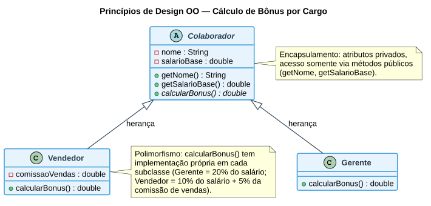

# Aula 02 — Projeto Orientado a Objetos e Método MoSCoW

> **Professor:** Wesley Soares
> **Disciplina:** Engenharia de Software II (4º Semestre)
> **Tema:** Princípios de design orientado a objetos, priorização de requisitos com MoSCoW e as etapas do projeto de software

## Objetivo da aula

Revisar as fases de Planejamento, Arquitetura e Projeto Detalhado do ciclo de vida do software e aprofundar a fase de **Projeto Orientado a Objetos**: como aplicar os princípios de design OO (abstração, encapsulamento, herança, polimorfismo, baixo acoplamento e alta coesão), como priorizar requisitos com o **método MoSCoW** e quais são as etapas concretas do projeto OO, da análise refinada até a aplicação de padrões de projeto e ferramentas de modelagem UML.

## Revisão rápida: planejamento, arquitetura e projeto detalhado

- **Planejamento do Projeto** — define escopo, cronograma, atividades, prioridades, equipe, recursos, riscos e entregas, respondendo às perguntas: o que será desenvolvido? Quem fará? Quando será entregue? Quais riscos podem afetar o projeto?
- **Arquitetura de Software** — decide organização dos componentes, comunicação entre módulos, persistência de dados e integração externa, considerando segurança, escalabilidade e disponibilidade. Estilos: arquitetura em camadas, MVC, Hexagonal, Clean Architecture, Microservices, Event-Driven.
- **Projeto Detalhado** — define classes, interfaces, módulos, componentes, serviços, responsabilidades e dependências, seguindo alta coesão, baixo acoplamento, encapsulamento, separação de responsabilidades e SOLID.
- **Padrões de Projeto citados na disciplina:** Strategy, Factory, Observer, Adapter e Facade.

## Projeto Orientado a Objetos (OO)

O Projeto OO traduz o modelo de análise para uma solução técnica:

> **Análise → o que fazer.** **Projeto → como fazer.**

Entregáveis típicos dessa fase: diagramas UML, arquitetura definida e interfaces especificadas.

## Princípios fundamentais de design OO

| Princípio | Definição | Aplicação prática |
| :--- | :--- | :--- |
| **Abstração** | Representar apenas as principais características de um objeto, ocultando detalhes irrelevantes. | Criar classes e métodos que representem conceitos do domínio sem incluir lógica de implementação. Ex.: uma classe `Venda` com atributos e métodos, sem expor como os cálculos internos são feitos. |
| **Encapsulamento** | Proteger os dados internos de uma classe, permitindo acesso apenas por *getters* e *setters*. | Atributos `private` com métodos `get`/`set`. Ex.: em `Venda`, impedir alteração direta do estoque, exigindo `entrada()` ou `saida()`. |
| **Herança** | Permitir que uma classe herde atributos e comportamentos de outra. | Criar classes genéricas especializadas em subclasses, evitando repetição de código. Ex.: `Pessoa` → `Colaborador` e `Cliente`. |
| **Polimorfismo** | Capacidade de um mesmo método ter comportamentos diferentes dependendo do objeto que o executa. | Métodos sobrescritos nas subclasses. Ex.: `calcularBonus()` implementado de forma diferente para `Gerente` e `Vendedor`. |
| **Baixo acoplamento** | Minimizar a dependência direta entre classes. | Interfaces e injeção de dependência: a classe conhece apenas o contrato, não a implementação. Ex.: `RelatorioService` depende de `IExportador`, não de `ExportadorPDF`. |
| **Alta coesão** | Garantir que cada classe tenha uma única responsabilidade clara. | Evitar que uma classe execute tarefas de domínios diferentes. Ex.: a classe `Pedido` deve gerenciar apenas informações de pedido, não processar pagamentos. |
| **Reuso e extensibilidade** | Criar componentes reaproveitáveis e expansíveis sem grande retrabalho. | Classes utilitárias, bibliotecas de componentes e padrões de projeto que permitam evolução. Ex.: um módulo de autenticação reutilizável em diferentes sistemas. |

### Exemplo consolidado: herança + encapsulamento + polimorfismo

O diagrama de classes abaixo — baseado no exemplo de cálculo de bônus discutido em aula — mostra a classe abstrata `Colaborador` (que concentra os atributos privados e os métodos de acesso, aplicando encapsulamento) especializada em `Gerente` e `Vendedor`, cada qual sobrescrevendo `calcularBonus()` com sua própria regra de negócio (polimorfismo):



Em código (Java), a mesma estrutura é implementada como:

```java
abstract class Colaborador {
    private String nome;
    private double salarioBase;

    public Colaborador(String nome, double salarioBase) {
        this.nome = nome;
        this.salarioBase = salarioBase;
    }

    public String getNome() { return nome; }
    public double getSalarioBase() { return salarioBase; }

    public abstract double calcularBonus();
}

class Gerente extends Colaborador {
    public Gerente(String nome, double salarioBase) { super(nome, salarioBase); }

    @Override
    public double calcularBonus() {
        return getSalarioBase() * 0.20; // 20% do salário base
    }
}

class Vendedor extends Colaborador {
    private double comissaoVendas;

    public Vendedor(String nome, double salarioBase, double comissaoVendas) {
        super(nome, salarioBase);
        this.comissaoVendas = comissaoVendas;
    }

    @Override
    public double calcularBonus() {
        return (getSalarioBase() * 0.10) + (this.comissaoVendas * 0.05);
    }
}
```

## Método MoSCoW

Ferramenta de priorização usada em análise de negócios, gestão de projetos e desenvolvimento de software para classificar a importância de requisitos, funcionalidades, etapas, tarefas ou processos:

- **M — Must have (Essenciais):** iniciativas obrigatórias, não-negociáveis. Pergunte-se: o que acontece se finalizarmos sem isso? Existe atalho mais simples? O projeto funciona sem essa tarefa?
- **S — Should have (Importantes):** importantes para o produto final, mas não vitais — se deixadas de lado, a entrega ainda funciona, mas perde valor significativo.
- **C — Could have (Desejáveis):** a frase-resumo é "seria legal ter" — impacto muito menor que as *Should have* se deixadas de lado.
- **W — Won't have (Fora do escopo atual):** evita o *scope creep* (crescimento desorganizado do projeto); não é prioridade agora, mas pode vir a ser no futuro.

### Exemplo — sistema de biblioteca

- **Must have:** cadastrar usuário, cadastrar livro, empréstimo e devolução.
- **Should have:** renovar empréstimo online.
- **Could have:** avaliar livros.
- **Won't have:** integração com redes sociais.

## Etapas do projeto orientado a objetos

1. Refinamento do Modelo de Análise e requisitos (usa o **Método MoSCoW** para priorizar).
2. Definição da Arquitetura.
3. Modelagem de Classes.
4. Modelagem de Interações.
5. Definição de Interfaces.
6. Aplicação de Padrões de Projeto.

Esta sequência será retomada nas próximas aulas com o Caso de Uso (etapa intermediária entre a Arquitetura e a Modelagem de Classes) e, em seguida, com o Diagrama de Classes propriamente dito.

## Notações e ferramentas de modelagem

- **UML:** diagramas de Classe, Sequência, Pacotes, entre outros.
- **Ferramentas:** StarUML, Lucidchart, Visual Paradigm, Draw.io — a disciplina utilizará o **Visual Paradigm Online** (`https://online.visual-paradigm.com/`) a partir da Aula 04.

## Boas práticas no projeto detalhado

- Seguir princípios **SOLID**.
- Documentar decisões arquiteturais.
- Evitar sobrecarga de responsabilidades.
- Manter consistência entre modelo e código.

## Erros comuns

- Classes genéricas demais ou específicas demais.
- Acoplamento excessivo entre classes.
- Ignorar requisitos não funcionais no projeto.
- Não validar o projeto com protótipos.

## Exercícios de fixação

1. Explique a diferença entre agregação, associação e composição usando a ideia de "baixo acoplamento" e "alta coesão" (mesmo que esses tipos de relacionamento sejam formalmente detalhados na Aula 05).
2. Classifique cada princípio de design abaixo como **Abstração**, **Encapsulamento**, **Herança** ou **Polimorfismo**:
   a) Uma classe `Pagamento` some, e `PagamentoCartao` e `PagamentoPix` implementam `processar()` de forma diferente.
   b) A classe `Cliente` expõe apenas `getSaldo()`, nunca o atributo `saldo` diretamente.
   c) `Funcionario` concentra `nome` e `cpf`, e `Estagiario` e `Efetivo` reaproveitam esses atributos.
3. Aplique o método MoSCoW a um sistema de agendamento de consultas médicas: cite um item Must have, um Should have, um Could have e um Won't have.
4. Por que "baixo acoplamento" é obtido através de interfaces, e não de referências diretas entre classes concretas?
5. Reescreva o exemplo de `Gerente`/`Vendedor` do material substituindo por `Freelancer`, que ganha bônus de 15% sobre o valor total de projetos concluídos no mês — quais métodos e atributos você criaria?

<details>
<summary>Gabarito (exercícios 2 e 3)</summary>

**2.**
a) Polimorfismo — mesmo método (`processar()`), comportamentos diferentes por subclasse.
b) Encapsulamento — acesso controlado ao estado interno via método público.
c) Herança — reaproveitamento de atributos comuns via superclasse.

**3.** Resposta-modelo (aceitar variações coerentes):
- Must have: agendar e cancelar consulta.
- Should have: lembrete automático por e-mail/SMS.
- Could have: avaliação do atendimento pelo paciente.
- Won't have: integração com plano de saúde de terceiros nesta versão.

</details>

## Perguntas de revisão

- Qual a diferença entre "Análise" e "Projeto" na frase "faça a coisa certa e faça certo a coisa"?
- Por que uma interface reduz o acoplamento entre `RelatorioService` e `ExportadorPDF`?
- Em que situação um item classificado como "Won't have" pode voltar ao escopo em uma versão futura?

## Material relacionado

- Slide original da aula: [`Aula 02.pdf`](./Aula%2002.pdf)
- Post original no Classroom: [`2026-08-11 - Aula 02.md`](./2026-08-11%20-%20Aula%2002.md)
- [Aula 01 — Ciclo de Vida do Projeto de Software](../01%20Ciclo%20de%20Vida%20do%20Projeto%20de%20Software/detalhes.md)
- [Aula 03 — Elicitação e Levantamento de Requisitos](../03%20Elicitacao%20e%20Levantamento%20de%20Requisitos/detalhes.md)
- [Aula 05 — Diagrama de Classes UML](../05%20Diagrama%20de%20Classes%20UML/detalhes.md) (detalha os tipos de relacionamento mencionados no exercício 1)
- [Resumo executivo, simulado comentado e cheatsheet da disciplina](../../README.md#resumo-executivo)
