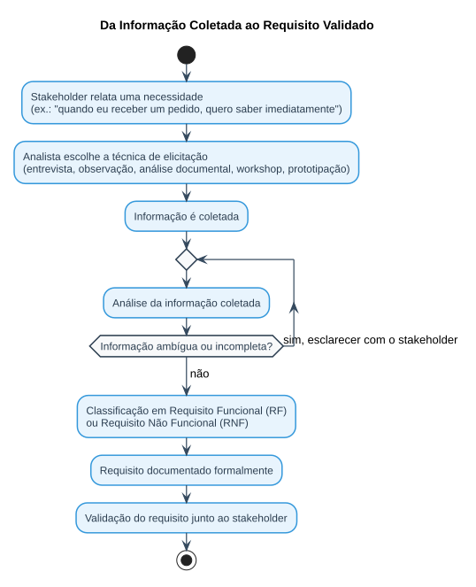

# Aula 03 — Técnicas de Elicitação e Levantamento de Requisitos

> **Professor:** Wesley Soares
> **Disciplina:** Engenharia de Software II (4º Semestre)
> **Tema:** Elicitação de requisitos, técnicas de levantamento e transformação de informação coletada em requisito documentável

## Objetivo da aula

Compreender o processo de elicitação de requisitos; identificar diferentes técnicas de levantamento; escolher a técnica adequada para cada contexto; formular perguntas que revelem necessidades reais; identificar requisitos explícitos e implícitos; reconhecer conflitos e ambiguidades; e transformar informações coletadas em requisitos documentáveis.

## O problema de partida

*"Se um cliente disser: 'preciso de um sistema para melhorar meu negócio', isso é suficiente para começar a desenvolver?"*

Não. Antes de qualquer linha de código, é preciso responder:
- Qual problema existe?
- Quem enfrenta o problema?
- Como ele é resolvido atualmente?
- O que o sistema precisa fazer?
- Quais são as restrições?
- O que é prioridade?

## O que é elicitação de requisitos?

É o processo de **descobrir, coletar, explorar e compreender informações** sobre as necessidades dos usuários e do negócio, seguindo o fluxo: `Necessidade → Problema → Contexto → Expectativa → Requisito`.

### Exemplo de aprofundamento em entrevista

Diante de "quero um sistema para controlar meus pedidos", o analista precisa investigar:
- Quem registra os pedidos? Quem consulta?
- O cliente pode cancelar? Existe aprovação?
- Como o pagamento é realizado?
- O estoque precisa ser atualizado?
- Existem diferentes tipos de pedidos?

## Por que levantar requisitos é difícil?

Os stakeholders nem sempre conseguem explicar claramente aquilo que precisam. Principais dificuldades:
- Necessidades não estão explícitas.
- Usuários utilizam termos diferentes para a mesma coisa.
- Requisitos podem entrar em conflito entre si.
- O cliente pode mudar de ideia ao longo do projeto.
- Algumas necessidades são desconhecidas até para o próprio usuário.
- Problemas podem estar escondidos no processo atual (atalhos, exceções).
- Diferentes stakeholders possuem prioridades diferentes.

*Exemplo clássico de ambiguidade:* "o sistema precisa ser rápido" — mas o que significa "rápido"? Sem uma métrica, essa frase não é um requisito, é apenas uma expectativa vaga que precisa virar um Requisito Não Funcional mensurável (ex.: "gerar o relatório em até 5 segundos").

## Principais técnicas de elicitação

### Técnicas tradicionais

| Técnica | Característica |
| :--- | :--- |
| **Entrevista** | Pode ser **estruturada** (perguntas previamente definidas), **semiestruturada** (perguntas preparadas + liberdade para explorar) ou **não estruturada** (conversa aberta). Fluxo: preparação → perguntas → conversa → registro → análise. |
| **Questionário** | Coleta ampla de dados junto a muitos usuários. |
| **Observação** | O analista acompanha o usuário realizando seu trabalho real; revela atividades não documentadas, atalhos, exceções, retrabalho, problemas do processo e informações que o usuário considera "óbvias" demais para mencionar. |
| **Análise documental** | Investiga documentos existentes: formulários, planilhas, relatórios, manuais, contratos, sistemas antigos e procedimentos internos. |
| **Workshop** | Reúne diferentes stakeholders para discutir o problema coletivamente, identificar requisitos, resolver conflitos, priorizar funcionalidades e validar processos. |
| **Brainstorming** | Busca gerar uma grande quantidade de ideias. Regra de ouro: **quantidade primeiro, avaliação depois** — as ideias são depois agrupadas, analisadas, priorizadas e transformadas em requisitos. |

### Técnicas complementares

- **Prototipação** — em vez de perguntar "como você gostaria que fosse a tela de cadastro?", apresenta-se um protótipo simples e pergunta-se: o que está faltando? O que deveria acontecer ao clicar? Quais informações são obrigatórias? Quem pode alterar? O que acontece quando ocorre um erro? Uma imagem ou protótipo revela requisitos que uma entrevista não consegue descobrir.
- **Cenários** e **Storytelling** — histórias de uso que descrevem um fluxo real.
- **Event Storming** — mapeamento rápido de eventos de domínio.

Não existe uma técnica universalmente melhor: a escolha depende do contexto, do tipo de stakeholder e do estágio do projeto.

### Ferramentas de prototipação

| Ferramenta | Características |
| :--- | :--- |
| **Figma** | Wireframes, protótipos navegáveis, telas web e mobile, componentes, fluxos de navegação, trabalho colaborativo em tempo real, compartilhamento com o professor. |
| **Penpot** | Alternativa *open source* ao Figma: wireframes, protótipos, componentes, design de interfaces, colaboração, funciona no navegador. |

## Da informação coletada ao requisito validado

Uma fala do stakeholder — por exemplo, "quando eu receber um pedido, quero saber imediatamente" — precisa ser investigada antes de virar requisito. Ela pode resultar em:

- **Requisito funcional:** "o sistema deve notificar o vendedor quando um novo pedido for registrado."
- **Requisito não funcional:** "a notificação deve ser disponibilizada em até 5 segundos após o registro do pedido."

O fluxo de refinamento segue os passos: `Informação coletada → Análise → Esclarecimento (repetindo até a ambiguidade ser resolvida) → Requisito → Validação`, representado no diagrama de atividades abaixo:

## Atividade prática discutida em aula — dinâmica Stakeholders × Analistas

A turma foi dividida em dois grupos:

- **Grupo A — Stakeholders:** recebe uma descrição de negócio/problema e deve responder às perguntas dos analistas, **sem entregar espontaneamente todos os requisitos**.
- **Grupo B — Analistas:** deve realizar uma entrevista para descobrir problema, usuários, processos, necessidades, funcionalidades, regras de negócio, exceções e restrições.

Essa dinâmica simula a dificuldade real de elicitação: o requisito raramente vem pronto, é preciso investigá-lo ativamente.

## Exercícios de fixação

1. Um stakeholder diz: "o sistema precisa ser fácil de usar." Que perguntas você faria para transformar essa frase em um ou mais requisitos verificáveis?
2. Classifique cada técnica como **tradicional** ou **complementar**: (a) observação; (b) prototipação; (c) questionário; (d) event storming.
3. Por que a observação pode revelar informações que uma entrevista não revela?
4. Um cliente descreve o sistema apenas como "quero controlar meus pedidos". Liste ao menos cinco perguntas de aprofundamento que um analista deveria fazer, com base no exemplo discutido em aula.
5. Explique, com suas palavras, a regra "quantidade primeiro, avaliação depois" aplicada ao brainstorming — por que misturar geração e avaliação de ideias prejudica o resultado?
6. Transforme a informação "o cliente quer saber quando o pedido está pronto" em um requisito funcional e em um requisito não funcional.
7. Descreva o fluxo completo de refinamento de um requisito, da informação coletada até a validação.

Gabarito (exercícios 2, 5 e 6)

**2.** (a) observação — tradicional. (b) prototipação — complementar. (c) questionário — tradicional. (d) event storming — complementar.

**5.** Misturar geração e avaliação faz com que ideias sejam descartadas cedo demais, antes de a equipe explorar todo o espaço de soluções possíveis; separar as fases garante mais alternativas antes do julgamento crítico, aumentando a chance de encontrar a melhor solução.

**6.** Requisito funcional: "o sistema deve notificar o cliente quando o status do pedido mudar para 'pronto'." Requisito não funcional: "a notificação deve ser enviada em até 5 segundos após a mudança de status."

## Perguntas de revisão

- Qual a diferença entre entrevista estruturada, semiestruturada e não estruturada?
- Por que "o sistema precisa ser rápido" não é, por si só, um requisito não funcional válido?
- Em que momento do fluxo de refinamento um requisito pode voltar para a etapa de "Esclarecimento"?
- Cite uma vantagem da prototipação sobre a entrevista tradicional para revelar requisitos implícitos.

## Material relacionado

- Slide original da aula: [`03 Aula.pdf`](./03%20Aula.pdf)
- Post original no Classroom: [`2026-08-17 - Aula 03.md`](./2026-08-17%20-%20Aula%2003.md)
- [Aula 01 — Ciclo de Vida do Projeto de Software](../01%20Ciclo%20de%20Vida%20do%20Projeto%20de%20Software/detalhes.md)
- [Aula 04 — Diagrama de Casos de Uso](../04%20Diagrama%20de%20Casos%20de%20Uso/detalhes.md)
- [Resumo executivo, simulado comentado e cheatsheet da disciplina](../../README.md#resumo-executivo)
