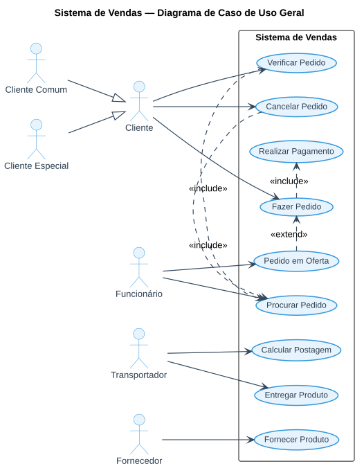

# Aula 04 — Diagrama de Casos de Uso

> **Professor:** Wesley Soares
> **Disciplina:** Engenharia de Software II (4º Semestre)
> **Tema:** Funcionamento, elementos e construção de um diagrama de caso de uso em UML

## Objetivo da aula

Compreender o funcionamento de um caso de uso dentro das etapas do projeto orientado a objetos (etapa 3, entre a Definição da Arquitetura e a Modelagem de Classes), seus elementos básicos, os tipos de relacionamento entre atores e casos de uso, e praticar a construção de um diagrama a partir de um levantamento de requisitos real.

## Onde o caso de uso se encaixa nas etapas do projeto

1. Refinamento do Modelo de Análise e requisitos (Método MoSCoW).
2. Definição da Arquitetura.
3. **Caso de uso.**
4. Modelagem de Classes.
5. Modelagem de Interações.
6. Definição de Interfaces.
7. Aplicação de Padrões de Projeto.

### Ferramenta utilizada

A partir desta aula, a disciplina passa a utilizar o **Visual Paradigm Online** (`https://online.visual-paradigm.com/`) para a construção dos diagramas UML do Projeto Integrador.

## Introdução ao caso de uso

- Técnica da UML (*Unified Modeling Language*).
- Representa **como os usuários interagem** com um sistema.
- Foco no **comportamento** esperado, e não em detalhes técnicos de implementação.
- Pergunta-chave: **"o que o sistema deve fazer para o usuário?"**

## Elementos básicos do diagrama

- **Atores:** representam usuários ou sistemas externos que interagem com o sistema.
- **Casos de uso:** funcionalidades oferecidas pelo sistema. São sempre escritos **no infinitivo** e de forma direta (ex.: *realizar venda*, *verificar cadastro*).
- **Relacionamentos:** linhas que mostram como os atores utilizam os casos de uso.

## Tipos de relacionamento

| Relacionamento | Definição | Notação |
| :--- | :--- | :--- |
| **Associação** | Relacionamento entre um ator e um caso de uso de negócios; indica que o ator pode usar aquela funcionalidade. Deve descrever a causa do relacionamento e as regras que o regem. | Linha simples entre ator e caso de uso. |
| **Extend (extensão)** | Especifica que um caso de uso (extensão) estende o comportamento de outro caso de uso (base), revelando um comportamento condicional que normalmente fica oculto no caso de uso principal. | Seta tracejada com `<<Extend>>`, apontando do caso de uso de extensão para o caso de uso base. |
| **Include (inclusão)** | Um caso de uso base **contém** a funcionalidade de outro caso de uso (de inclusão); suporta a reutilização de funcionalidade no modelo. | Seta tracejada com `<<Include>>`, apontando do caso de uso base para o caso de uso incluído. |
| **Generalização** | Um elemento filho (ator ou caso de uso) é baseado em outro elemento pai, herdando seus atributos, operações e relacionamentos. | Seta com triângulo aberto apontando para o elemento pai. |

## Estudo de caso — Sistema de Vendas

A partir do levantamento de requisitos abaixo (fictício, discutido em aula):

> Será desenvolvido um e-commerce, que poderá ter clientes comuns e clientes especiais com privilégios extras. Os funcionários realizam o cadastro de produtos e a separação para despacho pela transportadora. O funcionário também é responsável pelos pedidos aos fornecedores quando o estoque está baixo ou as vendas se esgotam. Após o cliente realizar o pedido, ele pode conferir os itens e depois finalizar a compra com a forma de pagamento selecionada, ou cancelar. O transportador calcula a postagem e realiza a entrega do produto.

Foi construído o diagrama de caso de uso geral, com os atores **Cliente** (generalizado em **Cliente Comum** e **Cliente Especial**), **Funcionário**, **Transportador** e **Fornecedor**, e os casos de uso **Fazer Pedido**, **Pedido em Oferta** (`<<extend>>` de Fazer Pedido, exclusivo do Cliente Especial), **Verificar Pedido**, **Cancelar Pedido**, **Procurar Pedido** (`<<include>>` de Verificar e Cancelar Pedido), **Realizar Pagamento** (`<<include>>` de Fazer Pedido), **Calcular Postagem**, **Entregar Produto** e **Fornecer Produto**:

### Descrição de caso de uso — "Fazer Pedido"

| Campo | Descrição |
| :--- | :--- |
| **Nome/objeto** | Fazer pedido |
| **Atores** | Cliente |
| **Resumo** | Descrever o processo de venda de um item por um e-commerce |
| **Pré-condição** | Existir produto disponível |
| **Pós-condição** | Ter pagamento confirmado |
| **Ações do ator / Ações do sistema** | 1. Cliente coloca o produto no carrinho de compra → 2. Sistema verifica se o cliente tem cadastro → 3. Sistema verifica quantidade disponível → (...) |
| **Fluxo alternativo (1)** | Cliente não cadastrado: sistema conduz ao cadastro. |
| **Fluxo alternativo (2)** | Pagamento não confirmado: sistema aguarda finalização do pagamento. |

## Benefícios do diagrama de caso de uso

- Facilita a comunicação entre a equipe técnica e o cliente.
- Mostra de forma visual as funcionalidades esperadas.
- Ajuda na definição do escopo do sistema.
- É um ponto de partida para especificações mais detalhadas (descrição textual de cada caso de uso, diagrama de classes, etc.).

## Atividade prática — sistema de biblioteca

Uma biblioteca deseja informatizar o processo de empréstimo de livros. O sistema deve permitir que:

- **O usuário** possa: pesquisar livros pelo título ou autor; realizar empréstimo de livros disponíveis; devolver livros emprestados; consultar sua lista de empréstimos.
- **O bibliotecário** possa: cadastrar novos livros; atualizar dados de livros já existentes; registrar empréstimos e devoluções realizadas pelos usuários.
- **O sistema externo** de pagamento de multas deve calcular valores devidos quando houver atraso na devolução.

**O que fazer:** identificar os atores envolvidos no sistema; listar os casos de uso principais; montar o diagrama de caso de uso representando as relações entre atores e funcionalidades.

Gabarito da atividade da biblioteca

**Atores:** Usuário, Bibliotecário, Sistema de Pagamento.

**Casos de Uso:** Pesquisar livros, Realizar empréstimo, Devolver livro, Consultar empréstimos, Cadastrar livro, Atualizar livro, Registrar empréstimo/devolução, Calcular multa.

**Relacionamentos sugeridos:** Usuário → Pesquisar livros, Realizar empréstimo, Devolver livro, Consultar empréstimos. Bibliotecário → Cadastrar livro, Atualizar livro, Registrar empréstimo/devolução. "Registrar empréstimo/devolução" `<<include>>` "Calcular multa" (executado pelo Sistema de Pagamento) quando há atraso na devolução.

## Exercícios de fixação

1. Explique, com um exemplo próprio, a diferença entre um relacionamento `<<include>>` e um `<<extend>>`.
2. Por que os casos de uso devem ser nomeados no infinitivo (ex.: "realizar venda") e não como substantivos (ex.: "venda")?
3. No estudo de caso do Sistema de Vendas, por que "Pedido em Oferta" é modelado como `<<extend>>` de "Fazer Pedido", e não como um caso de uso independente?
4. Modele, em texto, os atores e casos de uso principais de um sistema de agendamento de consultas odontológicas (paciente, recepcionista e dentista).
5. Qual a diferença entre a relação de generalização entre atores (ex.: Cliente Comum/Cliente Especial → Cliente) e a relação `<<include>>` entre casos de uso?

Gabarito (exercícios 1, 3 e 5)

**1.** `<<include>>` representa uma funcionalidade **sempre executada** como parte obrigatória do caso de uso base (ex.: "Fazer Pedido" sempre inclui "Realizar Pagamento"). `<<extend>>` representa um comportamento **condicional**, que só ocorre em situações específicas (ex.: "Pedido em Oferta" só se aplica quando o cliente é especial e há uma oferta ativa).

**3.** Porque nem todo pedido é feito com desconto de oferta — esse comportamento é opcional e depende de uma condição (cliente especial, oferta disponível). Modelar como `<<extend>>` evita forçar essa lógica dentro do caso de uso principal, mantendo "Fazer Pedido" simples e reutilizável.

**5.** A generalização entre atores indica que um ator especializado (Cliente Especial) herda todos os casos de uso do ator geral (Cliente), podendo participar de casos de uso adicionais. O `<<include>>` entre casos de uso indica que um caso de uso sempre aciona outro como parte de sua execução, independentemente de qual ator o iniciou.

## Perguntas de revisão

- Em que etapa do projeto orientado a objetos o caso de uso se posiciona, e por que ele antecede a modelagem de classes?
- Qual a pergunta-chave que orienta a criação de um diagrama de caso de uso?
- Cite as quatro informações mínimas que compõem a descrição textual de um caso de uso.

## Material relacionado

- Slide original da aula: [`Aula 04.pdf`](./Aula%2004.pdf)
- Post original no Classroom: [`2026-08-25 - Aula.md`](./2026-08-25%20-%20Aula.md)
- [Aula 02 — Projeto Orientado a Objetos e Método MoSCoW](../02%20Projeto%20Orientado%20a%20Objetos%20e%20Metodo%20MoSCoW/detalhes.md)
- [Aula 05 — Diagrama de Classes UML](../05%20Diagrama%20de%20Classes%20UML/detalhes.md)
- [Trabalho — Atividade de Classe (diagrama discutido nesta aula)](../../Trabalhos/Atividade%20classe/detalhes.md)
- [Resumo executivo, simulado comentado e cheatsheet da disciplina](../../README.md#resumo-executivo)
