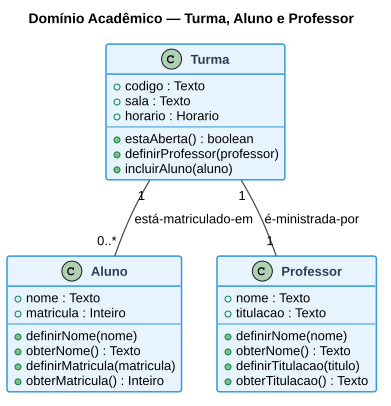
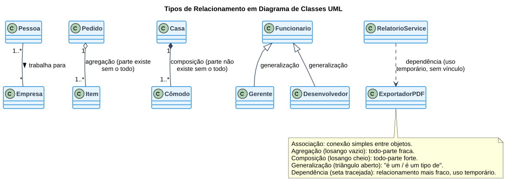

# Aula 05 — Diagrama de Classes UML e Scrum

> **Professor:** Wesley Soares
> **Disciplina:** Engenharia de Software II (4º Semestre)
> **Tema:** Introdução à UML, Diagrama de Classes (parte I) e o framework Scrum

## Objetivo da aula

Aprender a montar diagramas no Visual Paradigm Online, entender o que é (e o que não é) a UML, e iniciar o estudo do **Diagrama de Classes** — o diagrama central da modelagem orientada a objetos —, cobrindo seus elementos, tipos de visibilidade e os cinco tipos de relacionamento entre classes. A aula também situa o framework **Scrum** como pano de fundo para a execução iterativa do Projeto Integrador.

## Montando diagramas com Visual Paradigm Online

Ferramenta em nuvem para criação colaborativa de diagramas UML: `https://online.visual-paradigm.com/`. Os diagramas construídos ao longo do projeto (caso de uso da Aula 04, classes desta aula, etc.) podem ser salvos e compartilhados diretamente com o professor.

## UML — Unified Modeling Language

Linguagem gráfica de modelagem para **visualizar, especificar, construir, documentar e comunicar** artefatos de sistemas complexos. Como toda linguagem, é composta por um **vocabulário** e por **regras de combinação**.

### Princípios básicos

- A escolha dos modelos a serem criados tem profunda influência sobre a maneira como um determinado problema é atacado e como uma solução é definida.
- Cada modelo pode ser expresso em diferentes níveis de precisão.

### O que a UML não é

- Não é um processo.
- Não é uma metodologia.
- Não é, em si, Análise e Projeto Orientado a Objetos.
- Não é um conjunto de regras de projeto.

### O que a UML é

É uma **linguagem de notação** utilizada para modelar e documentar sistemas orientados a objetos, criada por **Grady Booch**, **Ivar Jacobson** e **James Rumbaugh**, combinando métodos que simplificam o design de sistemas.

### Principal objetivo do uso da UML

- Compreender melhor o sistema que está sendo desenvolvido.
- Ter uma visão mais clara do sistema.
- Documentar decisões tomadas no projeto.
- Especificar o comportamento ou a estrutura de um sistema.

## Scrum — framework para desenvolvimento ágil

O **Scrum** é um framework ágil utilizado para desenvolver produtos de forma **iterativa e incremental**, permitindo que a equipe entregue valor continuamente e responda a mudanças. O trabalho é dividido em ciclos curtos chamados **Sprints**, nos quais a equipe **planeja → desenvolve → inspeciona → adapta**, repetindo o ciclo continuamente.

### Fluxo de um projeto em Scrum

`Product Backlog (requisitos do sistema) → Sprint (seleção de funcionalidades) → Desenvolvimento (projeto + implementação + testes) → Review (apresentação do resultado) → Retrospectiva (o que podemos melhorar?)`

Os papéis centrais do Scrum Team são o **Product Owner**, o **Scrum Master** e o **Development Team**, que interagem com os **stakeholders** através dos eventos de *Sprint Review* e *Sprint Retrospective*, produzindo a cada ciclo um **incremento de produto** (*Product Increment*).

## Diagrama de Classes

Mostra um conjunto de classes e seus relacionamentos — é o **diagrama central da modelagem orientada a objetos**.

### Elementos básicos

- **Nome:** as classes são representadas por retângulos com nome, atributos e métodos. Devem receber nomes de acordo com o vocabulário do domínio do problema, seguindo uma convenção adotada pelo time (ex.: nomes de classes sempre como substantivos singulares, com a primeira letra maiúscula).
- **Atributos:** representam o conjunto de características (estado) dos objetos daquela classe.
- **Métodos:** representam o conjunto de operações (comportamento) que a classe fornece.
- **Relacionamento:** conecta as classes entre si.

### Visibilidade de atributos e métodos

| Símbolo | Visibilidade | Alcance |
| :--- | :--- | :--- |
| `+` | Público | Visível em qualquer classe de qualquer pacote. |
| `#` | Protegido | Visível para classes do mesmo pacote (ou subclasses, conforme a linguagem). |
| `-` | Privado | Visível somente dentro da própria classe. |

*Exemplos:* `+ nome : String` (atributo público) · `getNome() : String` (método, tipicamente público para permitir acesso controlado a um atributo privado).

### Exemplo — domínio acadêmico (Turma, Aluno, Professor)

O exemplo abaixo, usado em aula para introduzir o diagrama de classes, modela o relacionamento entre uma turma, seus alunos matriculados e o professor responsável:

- `Turma` possui atributos `código`, `sala`, `horário` e métodos `estaAberta()`, `definirProfessor(professor)`, `incluirAluno(aluno)`.
- `Aluno` possui `nome`, `matrícula` e métodos de acesso (`definirNome`, `obterNome`, `definirMatricula`, `obterMatricula`).
- `Professor` possui `nome`, `titulação` e métodos de acesso equivalentes.
- O relacionamento "está-matriculado-em" liga `Turma` a `Aluno`; o relacionamento "é-ministrada-por" liga `Turma` a `Professor`.

## Elementos do relacionamento entre classes

Todo relacionamento em um diagrama de classes pode carregar:

- **Nome:** descrição dada ao relacionamento (ex.: *faz*, *tem*, *possui*, *trabalha para*).
- **Sentido de leitura:** indicado por um pequeno triângulo (►) ao lado do nome.
- **Navegabilidade:** indicada por uma seta na ponta do relacionamento.
- **Multiplicidade:** `1` (exatamente um), `1..*` (um ou mais), `0..*` ou `*` (zero ou mais), `0..1` (zero ou um), `m..n` (faixa de valores, ex.: `4..7`).
- **Tipo:** associação (podendo ser agregação ou composição), generalização e dependência.
- **Papéis:** nomes desempenhados por cada classe dentro do relacionamento (ex.: *empregado* / *empregador*).

## Tipos de relacionamento

| Tipo | Definição | Notação | Exemplo |
| :--- | :--- | :--- | :--- |
| **Associação** | Indica que um objeto de uma classe está conectado a um objeto de outra classe. | Linha simples. | `Pessoa` — trabalha para → `Empresa`. |
| **Agregação** | Relação **todo-parte fraca**: a parte pode existir independentemente do todo. | Losango vazio (◇) do lado do "todo". | `Pedido` ◇— `Item` (um item pode existir sem um pedido específico). |
| **Composição** | Relação **todo-parte forte**: a parte não pode existir sem o todo. | Losango preenchido (◆) do lado do "todo". | `Casa` ◆— `Cômodo` (se a casa é destruída, os cômodos deixam de existir). |
| **Generalização** | Um elemento filho (subclasse) é baseado em outro elemento pai (superclasse), herdando seus atributos, operações e relacionamentos — relação "é um" / "é um tipo de". | Seta com triângulo aberto apontando para a superclasse. | `Funcionario` ↑ `Gerente`, `Desenvolvedor`. |
| **Dependência** | Indica que uma classe usa outra **temporariamente**, sem manter uma ligação estrutural permanente — é o relacionamento mais fraco. | Seta tracejada com ponta aberta. | `RelatorioService` usa `ExportadorPDF` apenas para gerar relatórios, sem guardar referência permanente. |

O diagrama abaixo consolida, em um único artefato, os cinco tipos de relacionamento discutidos em aula, cada um com o exemplo apresentado nos slides:

## Exercícios de fixação

1. Diferencie agregação de composição usando um exemplo próprio (diferente de `Pedido`/`Item` e `Casa`/`Cômodo`).
2. Classifique o relacionamento entre as classes a seguir como **associação**, **agregação**, **composição**, **generalização** ou **dependência**:
   a) `Biblioteca` e `Livro`, onde um livro pode existir mesmo fora do acervo de uma biblioteca específica (ex.: recém-adquirido, ainda não catalogado).
   b) `Cachorro` e `Animal`.
   c) `Coração` e `Pessoa` (o coração não existe fora do corpo de uma pessoa específica).
   d) `ServicoEmail` que usa `ConversorHTML` apenas no momento de montar a mensagem, sem manter referência entre os envios.
3. Reescreva, em UML textual (`ClasseA "multiplicidade" -- "multiplicidade" ClasseB : nome`), o relacionamento entre `Turma` e `Aluno` do exemplo acadêmico, considerando que uma turma pode ter zero ou mais alunos e um aluno pode estar em uma ou mais turmas.
4. Um atributo `- senha : String` está em qual nível de visibilidade, e por que essa é a escolha correta para um dado sensível?
5. Modele, em texto, as classes principais de um sistema de pedidos de restaurante (`Pedido`, `ItemPedido`, `Cliente`, `Garcom`), indicando ao menos um relacionamento de cada tipo estudado nesta aula.

Gabarito (exercícios 2, 3 e 4)

**2.**
a) Agregação — a parte (`Livro`) existe independentemente do todo (`Biblioteca`).
b) Generalização — `Cachorro` é um tipo de `Animal`.
c) Composição — a parte (`Coração`) não existe sem o todo (`Pessoa`).
d) Dependência — uso temporário, sem vínculo estrutural permanente.

**3.** `Turma "1" -- "0..*" Aluno : está-matriculado-em` (lido a partir de `Turma`) — ou, de forma equivalente, considerando a multiplicidade também do lado de `Turma` em relação a `Aluno`: `Aluno "1..*" -- "0..*" Turma : cursa`.

**4.** Visibilidade privada (`-`). Um dado sensível como senha deve ser acessível apenas internamente à própria classe, nunca diretamente por outras classes — o acesso controlado (ex.: validação de login) deve passar por um método específico, nunca por um `getSenha()` que exponha o valor bruto.

## Perguntas de revisão

- Por que a UML não é, por si só, um "processo" ou uma "metodologia"?
- Qual a diferença entre um losango vazio e um losango preenchido em um relacionamento de classes?
- Cite os três criadores da UML mencionados em aula.
- Como o ciclo Planeja → Desenvolve → Inspeciona → Adapta do Scrum se relaciona com as dez fases do ciclo de vida do projeto de software vistas na Aula 01?

## Material relacionado

- Slide original da aula: [`Aula 05.pdf`](./Aula%2005.pdf)
- Post original no Classroom: [`2026-09-01 - Material para aula.md`](./2026-09-01%20-%20Material%20para%20aula.md)
- [Aula 01 — Ciclo de Vida do Projeto de Software](../01%20Ciclo%20de%20Vida%20do%20Projeto%20de%20Software/detalhes.md)
- [Aula 04 — Diagrama de Casos de Uso](../04%20Diagrama%20de%20Casos%20de%20Uso/detalhes.md)
- [Trabalho — Atividade de Classe (diagrama de classes do Projeto Integrador)](../../Trabalhos/Atividade%20classe/detalhes.md)
- [Resumo executivo, simulado comentado e cheatsheet da disciplina](../../README.md#resumo-executivo)
