# Aula 01 — Introdução ao Ciclo de Vida do Projeto de Software

> **Professor:** Wesley Soares  
> **Disciplina:** Engenharia de Software II (4º Semestre)  
> **Tema:** Visão geral da disciplina, projeto integrador e as dez fases do ciclo de vida de desenvolvimento de software: da concepção do problema à evolução contínua.

---

## Sumário

- [Objetivo da aula](#objetivo-da-aula)
- [Contexto e pré-requisitos](#contexto-e-pre-requisitos)
- [Apresentação da disciplina e do professor](#apresentacao-da-disciplina-e-do-professor)
- [Projeto Integrador da Disciplina (etapas, temas e equipes)](#projeto-integrador-da-disciplina-etapas-temas-e-equipes)
- [Conteúdo programático e critérios de avaliação (AV1, AV2, PJ)](#conteudo-programatico-e-criterios-de-avaliacao-av1-av2-pj)
- [Bibliografia recomendada](#bibliografia-recomendada)
- [Conceito e visão geral de Projeto de Software](#conceito-e-visao-geral-de-projeto-de-software)
- [Fases do Projeto de Software (Problema, Requisitos, Planejamento, Arquitetura, Projeto, Implementação, Testes, Integração, Entrega, Manutenção)](#fases-do-projeto-de-software-problema-requisitos-planejamento-arquitetura-projeto-implementacao-testes-integracao-entrega-manutencao)
- [Identificação do Problema e Proposta de Solução](#identificacao-do-problema-e-proposta-de-solucao)
- [Levantamento e Engenharia de Requisitos (Elicitação e Técnicas)](#levantamento-e-engenharia-de-requisitos-elicitacao-e-tecnicas)
- [Análise e Especificação de Requisitos (Funcionais vs Não Funcionais)](#analise-e-especificacao-de-requisitos-funcionais-vs-nao-funcionais)
- [Planejamento do Projeto (Escopo, Cronograma, Riscos)](#planejamento-do-projeto-escopo-cronograma-riscos)
- [Arquitetura de Software e Estilos Arquiteturais](#arquitetura-de-software-e-estilos-arquiteturais)
- [Projeto Detalhado e Princípios de Design (SOLID, Coesão, Acoplamento)](#projeto-detalhado-e-principios-de-design-solid-coesao-acoplamento)
- [Visão geral de Padrões de Projeto (Strategy, Factory, Observer, Adapter, Facade)](#visao-geral-de-padroes-de-projeto-strategy-factory-observer-adapter-facade)
- [Implementação e Boas Práticas](#implementacao-e-boas-praticas)
- [Testes e Garantia da Qualidade (Unitários, Integração, End-to-End)](#testes-e-garantia-da-qualidade-unitarios-integracao-end-to-end)
- [Integração, Configuração e Entrega (CI/CD, Contêineres, Pipelines)](#integracao-configuracao-e-entrega-cicd-conteineres-pipelines)
- [Operação, Manutenção e Evolução de Software](#operacao-manutencao-e-evolucao-de-software)
- [Código da aula](#codigo-da-aula)
- [Exercícios](#exercicios)
- [Erros comuns e boas práticas](#erros-comuns-e-boas-praticas)
- [Links e materiais complementares](#links-e-materiais-complementares)
- [Mapa da aula](#mapa-da-aula)
- [Glossário](#glossario)
- [Pontos-chave para a prova](#pontos-chave-para-a-prova)
- [Perguntas e respostas (JSONL)](#perguntas-e-respostas-jsonl)
- [Checklist de revisão](#checklist-de-revisao)

---

## Objetivo da aula

- Compreender os objetivos pedagógicos, as expectativas operacionais e os critérios formais de avaliação da disciplina de Engenharia de Software II.
- Conhecer a estrutura do Projeto Integrador da Disciplina (PJ), compreendendo sua divisão em duas fases de entrega ao longo do semestre e a dinâmica de trabalho em equipes de 3 pessoas.
- Entender a premissa fundamental da Engenharia de Software: "Software não é feito em pastelaria" e o equilíbrio entre "fazer a coisa certa" (análise) e "fazer certo a coisa" (projeto).
- Analisar a visão ponta a ponta das dez fases de um projeto de software: Problema, Requisitos, Planejamento, Arquitetura, Projeto, Implementação, Testes, Integração, Entrega e Manutenção.
- Diferenciar os papéis de análise (foco no problema de negócio e necessidades dos stakeholders) e de projeto/arquitetura (decisões estruturais e técnicas da solução).
- Identificar os principais estilos arquiteturais, padrões de design (GoF) e princípios de código limpo (SOLID, coesão, acoplamento) que serão aprofundados no decorrer do curso.

---

## Contexto e pré-requisitos

Esta disciplina sucede os fundamentos de Engenharia de Software I e de Programação Orientada a Objetos (POO). Espera-se que o estudante compreenda conceitos básicos de:
- Paradigma de Orientação a Objetos (classes, objetos, herança, polimorfismo e encapsulamento).
- Noções fundamentais de modelagem e diagramação básica.
- Familiaridade com linguagens fortemente tipadas (como Java) e sistemas de controle de versão (como Git).

Enquanto a disciplina introdutória focou em processos gerais e fundamentos teóricos, Engenharia de Software II direciona o foco para a modelagem avançada, decisões arquiteturais rigorosas, aplicação sistemática de padrões de projeto e engenharia de qualidade moderna (testes automatizados, integração contínua e conteinerização).

---

## Apresentação da disciplina e do professor

### Corpo docente e trajetória profissional
A disciplina é ministrada pelo **Prof. Ms. Wesley Soares de Souza**:
- **Experiência na Indústria:** Engenheiro de Software Sênior com mais de 15 anos de experiência prática no desenvolvimento de sistemas corporativos escaláveis e de missão crítica.
- **Carreira Acadêmica:** Atua no ensino superior desde 2014, com passagens pelo Grupo Kroton (Anhanguera), FATEC Jales e Instituto Federal de São Paulo (IFSP) – Câmpus Votuporanga.
- **Formação:** 
  - Bacharel em Sistemas de Informação pela F.E.F (Fundação Educacional de Fernandópolis - UniFEF).
  - Pós-graduado em Gestão de Banco de Dados.
  - Mestre em Engenharia de Software pela Universidade Federal do Pampa (UNIPAMPA - RS).

A vivência simultânea entre a docência acadêmica e a liderança técnica no mercado traz para a sala de aula os desafios reais enfrentados por times de engenharia, desmistificando abordagens puramente teóricas que não se sustentam na prática da indústria.

---

## Projeto Integrador da Disciplina (etapas, temas e equipes)

### Concepção do projeto
Ao longo do semestre letivo, cada equipe deverá conceber, analisar, arquitetar e documentar um sistema de software fictício completo, aplicando os conceitos de Engenharia de Software II de maneira progressiva e incremental.

O trabalho em equipe espelha a dinâmica corporativa real: prazos rígidos, divisão de responsabilidades, integração contínua de artefatos e negociação técnica.

### Formação de equipes
- **Composição obrigatória:** Equipes formadas estritamente por **3 pessoas**.
- A definição das equipes é definitiva e estabelece os papéis técnicos a serem desempenhados ao longo do semestre (analistas de requisitos, arquitetos de software e engenheiros de qualidade).

### Estrutura das etapas de entrega

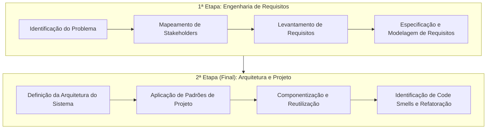

1. **1ª Etapa — Engenharia de Requisitos:**
   - Identificação do problema central e seu contexto de negócio.
   - Identificação, classificação e mapeamento dos stakeholders.
   - Levantamento, elicitação e especificação formal de requisitos (funcionais e não funcionais).
   - Modelagem conceitual dos requisitos (casos de uso, histórias de usuário e modelos contextuais).
2. **2ª Etapa (Final) — Arquitetura e Projeto:**
   - Definição formal do estilo arquitetural da solução e diagramação estrutural.
   - Seleção e aplicação justificada de padrões de projeto (GoF).
   - Estratégia de componentização, desacoplamento e reúso de software.
   - Análise estática, identificação de anomalias de código (*code smells*) e proposição de planos de refatoração.

### Áreas temáticas sugeridas
As equipes devem selecionar um domínio de negócio entre as opções abaixo para conceber seu produto:

| Domínio Temático | Ideias de Sistemas Fictícios | Exemplos de Escopo de Requisitos |
| :--- | :--- | :--- |
| **Comércio** | Marketplace B2B/B2C, Sistema de Gestão de Pedidos (OMS), Gestão de Estoque e WMS | Controle de SKU, checkout transacional, reserva de inventário, conciliação de frete. |
| **Serviços Públicos** | Solicitação de Serviços Municipais, Gestão de Iluminação Pública, Ouvidoria/Atendimento ao Cidadão | Triagem com geolocalização, SLAs de atendimento municipal, transparência e auditoria. |
| **Negócios** | Plataforma de Gestão de Projetos, Recrutamento e Seleção (ATS), Gestão Financeira Corporativa | Gráficos de Gantt dinâmicos, pipelines de candidatos com triagem por pontuação, fluxo de caixa. |
| **Saúde** | Agendamento Online de Consultas, Gestão de Clínicas Médicas, Prontuário Eletrônico / Acompanhamento | Sigilo médico, telemedicina síncrona, controle de prescrições e conformidade regulatória. |
| **Educação** | Plataforma de Cursos Online (LMS), Sistema de Gestão Acadêmica (SGA), Ambiente de Avaliação Contínua | Inscrições de turmas, cálculo ponderado de notas, controle de frequência e submissão de tarefas. |
| **Logística** | Rastreamento de Cargas em Tempo Real, Gestão de Frotas e Transportadoras, Otimização de Rotas | Roteirização via grafos, telemetria veicular, comprovação digital de entrega (POD). |

---

## Conteúdo programático e critérios de avaliação (AV1, AV2, PJ)

### Conteúdo programático bimestral
A disciplina é estruturada em dois blocos que se conectam diretamente às etapas do Projeto Integrador:

*Primeiro Bimestre:*
- Fundamentos da Fase de Projeto de Software.
- Engenharia de Requisitos e Processos de Requisitos.
- Técnicas de Elicitação e Levantamento de Requisitos.
- Modelagem e Especificação de Requisitos.
- Introdução à Arquitetura de Software.
- Estilos e Padrões Arquiteturais.
- **Marco de Avaliação:** Entrega da Fase 1 do Projeto Integrador.

*Segundo Bimestre:*
- Projeto Detalhado de Software e Princípios de Design Orientado a Objetos.
- Padrões de Projeto GoF (Criacionais, Estruturais e Comportamentais).
- Anomalias de Código (*Code Smells*), Métricas de Acoplamento/Coesão e Refatoração.
- Reutilização com Componentes e Frameworks.
- Integração Contínua (CI) e Testes Automatizados (Unitários, Integração e E2E).
- Contêineres, Gerência de Configuração e Pipelines de Liberação (CD).
- **Marco de Avaliação:** Entrega Final (Fase 2) do Projeto Integrador.

### Critérios de avaliação e fórmula de cálculo
A composição da nota semestral equilibra o desempenho teórico-prático individual com a execução técnica em equipe:
- **AV1 (Avaliação 1):** Prova individual com questões teóricas e práticas (questões dissertativas e de múltipla escolha sobre o conteúdo do 1º bimestre).
- **AV2 (Avaliação 2):** Prova individual com foco na aplicação prática de arquitetura, padrões e qualidade (2º bimestre).
- **PJ (Projeto de Software):** Avaliação do Projeto Integrador desenvolvido em grupo, pontuado pela entrega técnica dos artefatos, aderência aos padrões da engenharia e coerência entre análise e projeto.

A nota final é calculada pela média ponderada dos dois bimestres, atribuindo peso 60% à avaliação individual e peso 40% ao projeto prático:

$$\text{Nota Final} = \frac{[(\text{AV}_1 \times 0.6) + (\text{PJ} \times 0.4)] + [(\text{AV}_2 \times 0.6) + (\text{PJ} \times 0.4)]}{2}$$

Essa fórmula premia tanto o domínio conceitual individual quanto a capacidade de cooperar e entregar um produto de engenharia estruturado coletivamente.

---

## Bibliografia recomendada

A literatura recomendada pelo docente abrange os pilares clássicos e aplicados da modelagem orientada a objetos com a Unified Modeling Language (UML) e implementação robusta em linguagens estruturadas:

- **GUEDES, Gilleanes T. A.** *UML 2: Uma Abordagem Prática*. 2. ed. São Paulo: Novatec, 2011. (Foco em diagramação orientada a processos ágeis e tradicionais).
- **BOOCH, Grady; RUMBAUGH, James; JACOBSON, Ivar.** *UML: Guia do Usuário*. 1. ed. Rio de Janeiro: Campus, 2000. (A obra de referência definitiva dos criadores da UML).
- **FURLAN, José Davi.** *Modelagem de Objetos através da UML*. 1. ed. São Paulo: Makron Books, 1998. (Conceitos clássicos de transição da análise para o projeto orientado a objetos).
- **BEZERRA, Eduardo.** *Princípios de Análise e Projeto de Sistemas com UML*. 4. ed. Rio de Janeiro: Editora Elsevier, 2007. (Didática estruturada com ênfase em sistemas de informação comerciais).
- **MEDEIROS, Ernani.** *Desenvolvendo Software com UML 2.0*. 1. ed. São Paulo: Editora Pearson Makron Books, 2004.
- **O'NEILL, Henrique; NUNES, Mauro; RAMOS, Pedro.** *Exercícios de UML*. 1. ed. Lisboa/São Paulo: Editora Informática / FCA, 2010. (Caderno prático de fixação por problemas modelados).
- **GÓES, Wilson Moraes.** *Aprenda UML por Meio de Estudo de Caso*. 1. ed. São Paulo: Editora Novatec, 2014. (Abordagem orientada a projetos ponta a ponta).
- **BORATTI, Isaias Camilo.** *Programação Orientada a Objetos em Java*. 1. ed. Florianópolis: Editora Visual Books, 2007. (Transição do modelo conceitual para código executável tipado).

---

## Conceito e visão geral de Projeto de Software

### Software não é feito em pastelaria
Na abertura da aula, o professor Wesley Soares enfatiza uma das maiores armadilhas da área de computação: encarar o desenvolvimento de software como uma linha de montagem instantânea ou "pastelaria", onde o cliente chega no balcão, faz o pedido e espera que a solução seja entregue em minutos, sem planejamento, análise de impacto ou garantia estrutural.

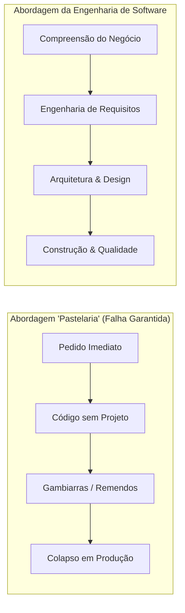

Construir software profissional exige métodos científicos, modelagem prévia, validação contínua e garantia da manutenibilidade. Software é hoje o núcleo operacional de empresas de todos os portes; sua falha causa prejuízos financeiros diretos, riscos jurídicos e paralisação de serviços essenciais.

### O paradoxo da análise vs. projeto

> *"Faça a coisa certa (análise) e faça certo a coisa (projeto)."*

Esta máxima resume a divisão de responsabilidades da Engenharia de Software:
1. **Análise (Fazer a coisa certa):** Descobrir e validar se estamos resolvendo o problema real do cliente. Criar um sistema tecnicamente impecável que resolve a dor errada é um fracasso completo de engenharia.
2. **Projeto (Fazer certo a coisa):** Projetar a solução de forma limpa, desacoplada, extensível, performática e segura. Construir o software correto com uma arquitetura frágil gerará débitos técnicos impossíveis de manter no médio prazo.

---

## Fases do Projeto de Software (Problema, Requisitos, Planejamento, Arquitetura, Projeto, Implementação, Testes, Integração, Entrega, Manutenção)

Um projeto de software corporativo moderno percorre dez fases iterativas e complementares. O diagrama a seguir ilustra a cadeia de valor que transforma uma dor de negócio em uma plataforma operacional:

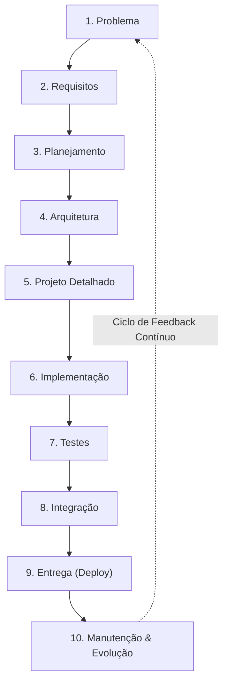

A tabela abaixo descreve a finalidade, as entradas e as saídas esperadas de cada fase:

| Fase | Foco Central | Artefato de Entrada | Artefato de Saída |
| :--- | :--- | :--- | :--- |
| **1. Problema** | Compreender a dor real do negócio. | Dores de mercado, ineficiências operacionais. | Declaração do Problema, Proposta de Valor. |
| **2. Requisitos** | Elicitar o que o sistema deve e não deve fazer. | Declaração do Problema, entrevistas com usuários. | Documento de Requisitos (SRS), Casos de Uso/Histórias. |
| **3. Planejamento** | Definir cronograma, escopo, orçamento e riscos. | Requisitos priorizados, capacidade da equipe. | Backlog, Cronograma de Sprints, Matriz de Riscos. |
| **4. Arquitetura** | Decidir a estrutura macro e atributos de qualidade. | Requisitos Não Funcionais críticos. | Documento de Arquitetura (SAD), Diagramas C4/UML. |
| **5. Projeto** | Modelar classes, padrões de design e componentes. | Arquitetura de software aprovada. | Diagramas de Classes, Diagramas de Sequência. |
| **6. Implementação** | Escrever código-fonte limpo, testável e auditável. | Modelos de classes, especificações técnicas. | Código-fonte versionado (Git), Pull Requests. |
| **7. Testes** | Validar conformidade funcional e limites não funcionais. | Código compilável, cenários de aceitação. | Relatórios de cobertura de testes, logs de QA. |
| **8. Integração** | Unificar módulos em pipelines automatizados de build. | Código validado em branches locais. | Builds testados, imagens de contêiner geradas. |
| **9. Entrega** | Disponibilizar a versão em ambiente produtivo. | Imagens de contêiner testadas e aprovadas. | Release em produção, changelog documentado. |
| **10. Manutenção** | Monitorar, corrigir defeitos e implementar melhorias. | Métricas operacionais, chamados de suporte. | Patches corretivos, novas demandas de requisitos. |

---

## Identificação do Problema e Proposta de Solução

### Todo software começa com uma necessidade
Antes de abrir uma IDE, escolher linguagens ou desenhar interfaces visuais, o engenheiro de software deve responder a cinco perguntas fundamentais:
1. **Qual problema precisa ser resolvido?** A raiz do problema deve ser claramente isolada de suas consequências superficiais.
2. **Quem enfrenta esse problema?** Quem são os usuários diretos, compradores, gestores e operadores prejudicados pela ineficiência atual.
3. **Como o problema é resolvido atualmente?** O processo ocorre via planilhas manuais? Cadernos de papel? Sistemas legados lentos?
4. **Quais são as principais dificuldades?** Ocorrência de retrabalho? Perda de dados? Falta de rastreabilidade? Lentidão nas respostas?
5. **Qual valor o software deverá gerar?** Redução de custos? Aumento na velocidade de atendimento? Eliminação de multas fiscais?

### Exemplo didático: Gestão de pequenos produtores rurais
- **Cenário Real:** Pequenos produtores agrícolas em feiras regionais gerenciam pedidos por meio de blocos de anotações e mensagens dispersas em redes sociais.
- **Dores identificadas:** Ruptura de estoque (venda de produtos indisponíveis), atrasos na colheita e inadimplência por falta de controle de pagamentos.
- **Solução proposta:** Um aplicativo com suporte offline voltado para celulares simples, permitindo registro de estoque por lote e sincronização automática quando conectado à rede.
- **Proposta de valor:** Redução de 90% dos cancelamentos de pedidos por falta de produto e controle financeiro diário consolidado com um toque.

---

## Levantamento e Engenharia de Requisitos (Elicitação e Técnicas)

### Elicitar não é apenas "perguntar"
A elicitação de requisitos é o processo investigativo de descobrir o que os clientes e usuários realmente necessitam, e não apenas o que eles dizem superficialmente que querem. Muitas vezes o cliente pede uma "solução técnica" específica (ex: *"preciso de uma tela com 50 botões"*), quando sua necessidade de negócio é outra (ex: *"preciso auditar se o operador finalizou a etapa"*).


### Técnicas clássicas de elicitação

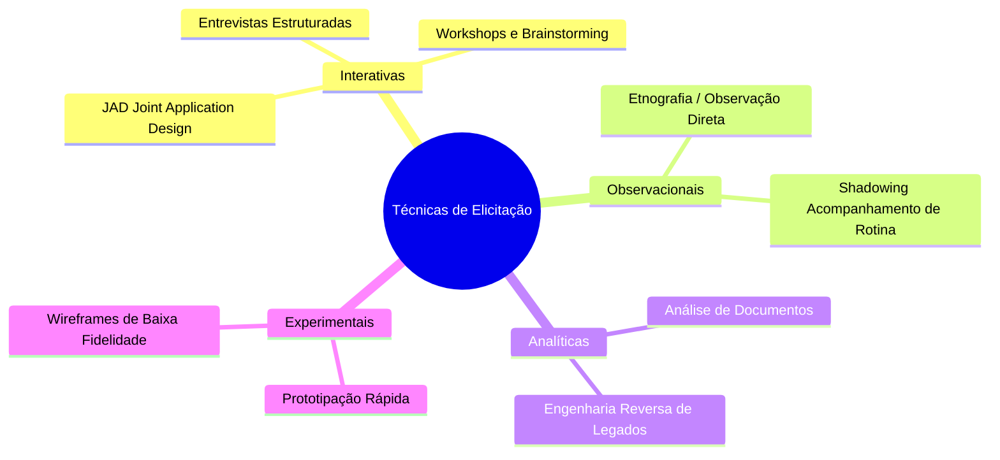

1. **Entrevistas (Estruturadas ou Semi-estruturadas):**
   - *Aplicação:* Conversas diretas com stakeholders-chave para entender motivações de negócio e regras gerais.
   - *Armadilha:* Entrevistar apenas diretores e não conversar com os operadores que realizam o trabalho diário.
2. **Questionários e Formulários:**
   - *Aplicação:* Coleta de dados quantitativos de uma base massiva de usuários dispersos geograficamente.
   - *Armadilha:* Formulação de perguntas indutivas ou com alto grau de ambiguidade sem possibilidade de réplica imediata.
3. **Observação Direta (*Shadowing*):**
   - *Aplicação:* O analista senta ao lado do operador e observa a rotina de trabalho real, anotando gargalos que o próprio usuário não percebe por hábito.
4. **Workshops e Brainstorming (ex: JAD - *Joint Application Design*):**
   - *Aplicação:* Sessões intensivas multidisciplinares unindo desenvolvedores, patrocinadores e usuários finais para resolver conflitos e unificar visões.
5. **Prototipação:**
   - *Aplicação:* Telas de baixa ou média fidelidade usadas para provocar reações do usuário antes de codificar regras de negócio.
6. **Análise de Documentos:**
   - *Aplicação:* Estudo de manuais operacionais, formulários físicos existentes, normas regulatórias e relatórios contábeis para extração de regras rígidas.

---

## Análise e Especificação de Requisitos (Funcionais vs Não Funcionais)

### A fronteira entre o "que" e o "como"
Após a elicitação, os dados brutos são processados, desprovidos de ambiguidades e classificados nas duas categorias fundamentais da engenharia:

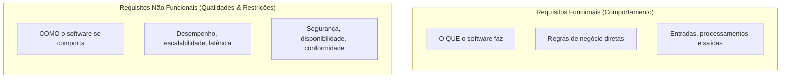

### Quadro comparativo detalhado

| Dimensão de Comparação | Requisito Funcional (RF) | Requisito Não Funcional (RNF) |
| :--- | :--- | :--- |
| **Definição** | Descreve uma função, serviço ou comportamento que o sistema deve prover. | Descreve critérios de qualidade, restrições arquiteturais ou limites operacionais. |
| **Foco** | O que o sistema deve realizar. | O nível de qualidade com que o sistema opera. |
| **Origem típica** | Necessidades operacionais diretas dos usuários e do negócio. | Decisões arquiteturais, legislações (LGPD), equipes de infraestrutura/segurança. |
| **Critério de Validação** | Testes de aceitação (Passa/Falha: o botão calcula o frete corretamente?). | Testes de carga, estresse, segurança e penetração (Passa/Falha: responde em < 2s sob 10k requisições?). |
| **Exemplo 1** | O sistema deve permitir o cadastro de novos produtos contendo nome, SKU, preço e saldo em estoque. | O tempo de resposta para a consulta de produtos por nome deve ser inferior a 2 segundos sob carga de 500 requisições simultâneas. |
| **Exemplo 2** | O sistema deve emitir um alerta por e-mail para o gestor quando o estoque de um item estiver abaixo do limite mínimo. | As senhas de acesso dos usuários devem ser armazenadas utilizando hash com sal (*salt*) via algoritmo Argon2 ou BCrypt com fator de custo no mínimo 12. |
| **Exemplo 3** | O sistema deve permitir o cancelamento de pedidos até 30 minutos após a confirmação do pagamento. | A aplicação deve manter um índice de disponibilidade (*uptime*) de no mínimo 99,9% durante os dias úteis. |

### Diagrama de Caso de Uso em formato Mermaid nativo

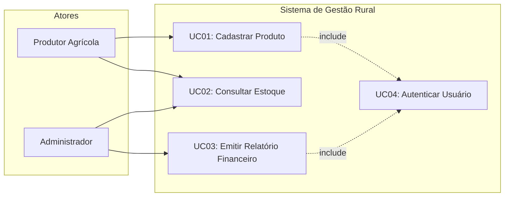

---

## Planejamento do Projeto (Escopo, Cronograma, Riscos)

### A gestão como garantia de viabilidade técnica
O planejamento transforma a lista de requisitos em um plano de execução viável. Um projeto sem planejamento descamba para o fenômeno de *scope creep* (crescimento descontrolado do escopo) e estouro financeiro.

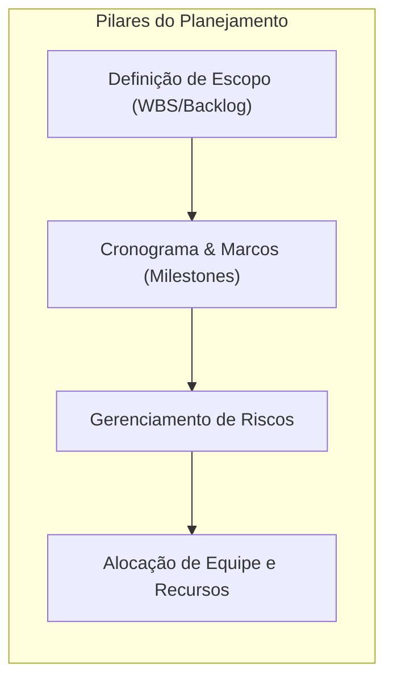

### Gestão de riscos no projeto de software
Todo projeto enfrenta incertezas que devem ser mapeadas previamente:

| Risco Mapeado | Probabilidade | Impacto | Estratégia de Mitigação |
| :--- | :--- | :--- | :--- |
| **Dependência de API externa instável** | Alta | Alto | Implementar o padrão *Circuit Breaker*, filas assíncronas e mock de homologação. |
| **Mudança frequente de requisitos pelo cliente** | Média | Alto | Adoção de ciclos curtos (Sprints de 2 semanas) com validação contínua e priorização via MoSCoW. |
| **Perda de membro-chave da equipe** | Baixa | Alto | Rotação de tarefas, revisões de código obrigatórias (*code reviews*) e documentação técnica viva. |
| **Incompatibilidade de desempenho sob alta carga** | Média | Médio | Testes de estresse automatizados no pipeline de CI desde as primeiras sprints. |

---

## Arquitetura de Software e Estilos Arquiteturais

### A estrutura macro da solução
A arquitetura de software lida com as decisões fundamentais que são caras e difíceis de alterar no futuro. Ela define como os subsistemas se comunicam, como a persistência é tratada e como o sistema atende aos Requisitos Não Funcionais críticos (escalabilidade, tolerância a falhas, segurança).

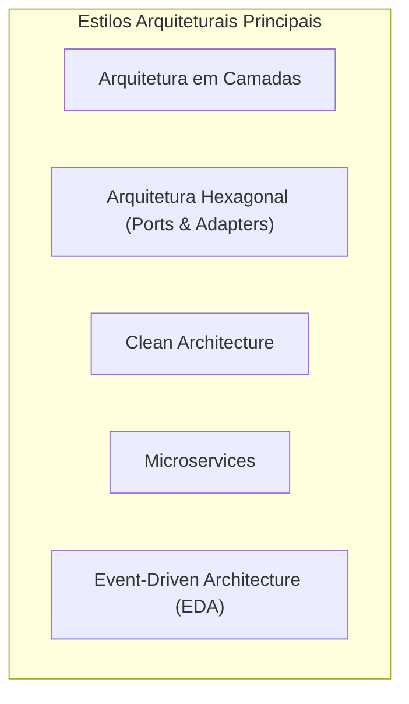

### Comparação entre estilos arquiteturais

| Estilo Arquitetural | Filosofia Central | Principais Vantagens | Principais Desvantagens |
| :--- | :--- | :--- | :--- |
| **Monolito em Camadas (Layered)** | Separação em UI, Negócio e Dados de forma hierárquica. | Simples de desenvolver, debugar e implantar inicialmente. | Tendência a acoplamento excessivo; builds e deploys tornam-se lentos com o crescimento. |
| **Hexagonal / Clean Architecture** | O domínio de negócio fica no centro, isolado de frameworks, UI e bancos de dados por portas e adaptadores. | Testabilidade pura das regras de negócio sem necessidade de banco de dados ativo; fácil substituição de tecnologias externas. | Maior quantidade de interfaces, conversões de DTOs e curva de aprendizado inicial mais íngreme. |
| **Microservices** | Sistema particionado em pequenos serviços autônomos, cada um com seu próprio banco de dados, comunicando-se via HTTP/gRPC ou mensageria. | Escalabilidade granular e implantação independente por times técnicos autônomos. | Complexidade de rede, transações distribuídas (consistência eventual), monitoramento complexo. |
| **Event-Driven (Orientada a Eventos)** | Produtores publicam eventos em brokers (Kafka, RabbitMQ); consumidores reagem assincronamente. | Altíssimo desacoplamento temporal e espacial; capacidade de absorver picos de tráfego (backpressure). | Dificuldade em rastrear o fluxo completo de uma requisição sem tracing distribuído estruturado. |

---

## Projeto Detalhado e Princípios de Design (SOLID, Coesão, Acoplamento)

### Da arquitetura macro ao design estruturado de classes
Enquanto a arquitetura define a organização macro dos sistemas, o **Projeto Detalhado** define a modelagem microscópica dos componentes: assinaturas de métodos, interfaces, visibilidade de membros, controle de estados e colaboração entre classes.

### Princípios norteadores fundamentais

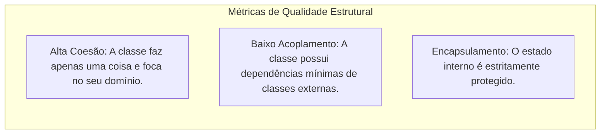

### O acrônimo SOLID

1. **S — Single Responsibility Principle (SRP):** Uma classe deve ter um, e apenas um, motivo para mudar. Uma classe de `Cliente` não deve salvar a si própria no banco nem formatar seu próprio PDF de exibição.
2. **O — Open/Closed Principle (OCP):** Entidades de software devem estar abertas para extensão, mas fechadas para modificação. Adiciona-se novos comportamentos criando novas classes, e não alterando código estável com dezenas de `if-else`.
3. **L — Liskov Substitution Principle (LSP):** Subclasses devem poder ser substituídas por seus tipos base sem alterar a corretude do sistema.
4. **I — Interface Segregation Principle (ISP):** Clientes não devem ser forçados a depender de métodos que não utilizam. Múltiplas interfaces especializadas são superiores a uma única interface monolítica ("gorda").
5. **D — Dependency Inversion Principle (DIP):** Módulos de alto nível não devem depender de módulos de baixo nível; ambos devem depender de abstrações. Abstrações não devem depender de detalhes; detalhes devem depender de abstrações.

---

## Visão geral de Padrões de Projeto (Strategy, Factory, Observer, Adapter, Facade)

Os padrões de projeto do Gang of Four (GoF) representam soluções comprovadas e reutilizáveis para problemas recorrentes de design orientado a objetos. A aula introduz cinco padrões fundamentais:

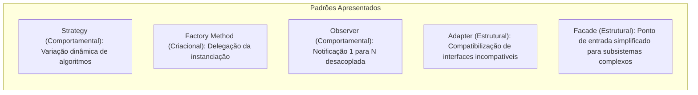

### Quadro comparativo de Padrões GoF

| Padrão | Categoria | Propósito | Exemplo no Mundo Real |
| :--- | :--- | :--- | :--- |
| **Strategy** | Comportamental | Definir uma família de algoritmos intercambiáveis encapsulados sob uma interface comum. | Cálculo de frete (Sedex, Jadlog, Retirada no Local) selecionado em tempo de execução. |
| **Factory Method** | Criacional | Delegar a responsabilidade de instanciação de objetos concretos para métodos de fábrica ou subclasses. | Conexões de banco de dados (obter conexão PostgreSQL ou MySQL conforme arquivo de configuração). |
| **Observer** | Comportamental | Estabelecer um relacionamento 1-para-Mutos onde alterações em um objeto notificam todos os inscritos automaticamente. | Atualização de status de entrega notificando SMS, E-mail e Push no aplicativo do cliente. |
| **Adapter** | Estrutural | Converter a interface de uma classe na interface esperada pelo cliente, viabilizando integração entre sistemas que não conversavam. | Adaptar a API de um gateway legado de cartão de crédito para a nova interface unificada de pagamentos. |
| **Facade** | Estrutural | Prover uma interface unificada e simplificada para um subsistema complexo com múltiplas dependências. | Classe `PedidoFacade` que coordena estoque, pagamento, antifraude, faturamento e despacho com uma única chamada `concluirPedido()`. |

### Modelagem UML de Classes: Strategy Pattern

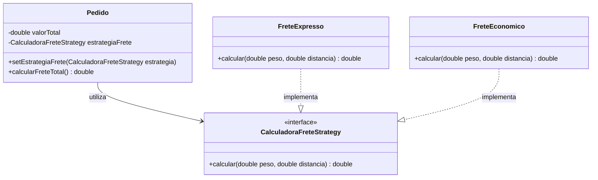

---

## Implementação e Boas Práticas

### A construção do software como atividade de engenharia
A fase de implementação converte os modelos arquiteturais e diagramas de classes em código executável. Escrever código na Engenharia de Software não é um ato solitário e sem regras; ele exige adesão estrita a padrões de equipe:
- **Controle de Versão com Git:** Uso disciplinado de branches temáticas (`feature/`, `bugfix/`), commits pequenos, atômicos e com mensagens descritivas seguindo convenções padronizadas.
- **Revisão de Código (*Code Review*):** Nenhum código é incorporado à branch principal sem a validação de pelo menos outro desenvolvedor da equipe, garantindo disseminação de conhecimento e detecção precoce de anomalias.
- **Padronização e Análise Estática (*Linters* e *Checkstyle*):** Garantia de que todo o time siga o mesmo estilo de formatação e padrões de nomenclatura.
- **Implementação Orientada a Testes:** Escrever código modular que permita a injeção de dependências e a realização de testes sem dependência direta de bancos de dados ou servidores externos.

---

## Testes e Garantia da Qualidade (Unitários, Integração, End-to-End)

### A pirâmide de testes
A qualidade não é inserida no final; ela é construída de maneira contínua. Para garantir que o software cumpra seus requisitos funcionais e não funcionais sem introduzir regressões, a engenharia adota a clássica estratégia da Pirâmide de Testes:

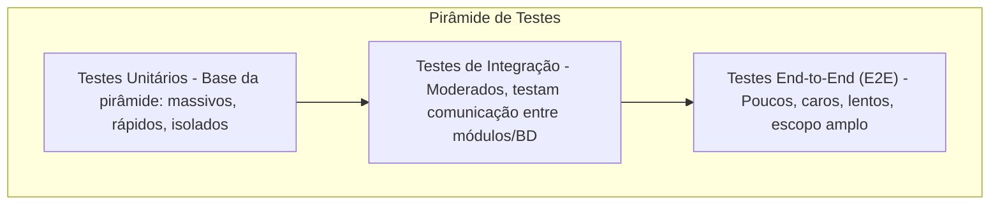

### Detalhamento das camadas de testes

| Nível de Teste | Alvo de Validação | Velocidade de Execução | Custo de Manutenção | Exemplo Típico |
| :--- | :--- | :--- | :--- | :--- |
| **Unitário (Unidade)** | Métodos e funções isoladas; dependências externas são substituídas por objetos dublês (*Mocks*). | Milissegundos (executa aos milhares por minuto). | Baixo | Validar se o método `calcularDesconto(100, 0.1)` retorna exatamente `90.00`. |
| **Integração** | A interface e a troca de dados entre dois ou mais componentes reais (ex: serviço acessando o banco de dados). | Segundos. | Médio | Testar se o `ProdutoRepository` executa corretamente a instrução `INSERT` e persiste no banco de dados de teste. |
| **End-to-End (E2E)** | O fluxo completo do usuário através de todas as camadas reais do sistema (interface, rede, regras, bancos e APIs de terceiros). | Segundos a minutos. | Alto (muito suscetível a pequenas alterações de UI). | Simular um cliente abrindo o navegador, inserindo produtos no carrinho, preenchendo o cartão e verificando a tela de confirmação de pagamento. |

---

## Integração, Configuração e Entrega (CI/CD, Contêineres, Pipelines)

### A automação da entrega de software
Em ambientes corporativos modernos, a integração do código é automatizada para evitar o chamado "inferno da integração" (*integration hell*), onde desenvolvedores passavam semanas unindo arquivos com conflitos insolúveis na véspera do prazo final.


### Práticas essenciais
- **Integração Contínua (CI):** Cada *push* ou *pull request* dispara um processo automatizado de compilação e execução imediata de todos os testes unitários e de integração. Se um teste falhar, o build é quebrado e o time é notificado na hora.
- **Contêineres (Docker):** Eliminação do clássico problema *"na minha máquina funciona"*. O software é empacotado junto com seu sistema operacional básico, versões exatas de bibliotecas e dependências de ambiente em uma imagem imutável.
- **Gerência de Configuração:** Separação estrita entre código-fonte e variáveis de ambiente (credenciais de banco, chaves de API e portas são injetadas em tempo de execução via variáveis de ambiente, nunca fixadas no código).

---

## Operação, Manutenção e Evolução de Software

### O ciclo de vida não termina no deploy
Cerca de 60% a 80% do custo total de propriedade (TCO) de um software é consumido na fase pós-entrega. O software é um sistema vivo que precisa se adaptar a mudanças de legislação, novos concorrentes, falhas de segurança descobertas e crescimento da base de clientes.

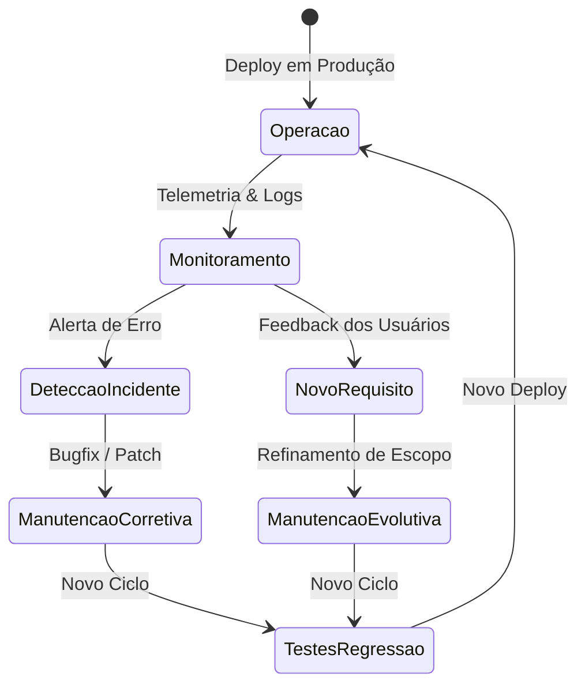

### Tipos de manutenção de software

| Categoria de Manutenção | Gatilho Disparador | Objetivo Técnico | Exemplo Prático |
| :--- | :--- | :--- | :--- |
| **Corretiva** | Erro, exceção não tratada ou comportamento inesperado em produção. | Restaurar a operação do sistema sem alterar regras de negócio. | Correção de *NullPointerException* disparada quando um cliente não possui telefone secundário cadastrado. |
| **Adaptativa** | Mudanças no ambiente operacional, infraestrutura ou legislação externa. | Manter o sistema compatível com o novo ecossistema sem alterar funcionalidades de negócio. | Atualização do módulo fiscal para atender a uma nova alíquota de ICMS ou migração de versão do Java 17 para o Java 21. |
| **Evolutiva (Perfectiva)** | Novas necessidades de negócio levantadas pelos usuários ou mercado. | Adicionar novas funcionalidades ou melhorar as existentes. | Adicionar opção de pagamento via Pix a um e-commerce que só aceitava boleto e cartão. |
| **Preventiva** | Identificação de riscos arquiteturais, débitos técnicos acumulados ou lentidão crescente. | Evitar falhas futuras antes que afetem o usuário final. | Refatoração de métodos acoplados, reindexação preventiva de tabelas de banco e aplicação de patches de segurança em dependências. |

---

## Código da aula

*(Complemento técnico estruturado: Como o conteúdo da aula 001 é conceitual e introdutório, nenhum arquivo de código pré-existente foi distribuído. A seguir, apresenta-se a concretização didática em Java 17 dos princípios discutidos em sala: a modelagem de domínio com separação de responsabilidades e a aplicação prática do padrão comportamental Strategy para cálculo flexível de regras de negócio, conforme a bibliografia de Boratti).*

```java
package br.unifef.engsoftware2.aula01;

/**
 * Interface que define o contrato para a família de algoritmos de cálculo de frete.
 * Aplica o Princípio Aberto/Fechado (OCP): para adicionar uma nova modalidade de
 * frete, basta implementar esta interface sem alterar a classe Pedido.
 */
public interface CalculadoraFreteStrategy {
    
    /**
     * Calcula o valor monetário do frete com base no peso e na distância.
     * 
     * @param pesoEmKg Peso total da carga em quilogramas.
     * @param distanciaEmKm Distância de deslocamento até o destino.
     * @return O valor calculado do frete em reais.
     */
    double calcular(double pesoEmKg, double distanciaEmKm);
}
```

```java
package br.unifef.engsoftware2.aula01;

/**
 * Implementação concreta para fretes econômicos (transporte padrão terrestre).
 */
public class FreteEconomicoStrategy implements CalculadoraFreteStrategy {
    
    private static final double VALOR_BASE = 10.00;
    private static final double TAXA_POR_KM = 0.50;
    private static final double TAXA_POR_KG = 0.20;

    @Override
    public double calcular(double pesoEmKg, double distanciaEmKm) {
        if (pesoEmKg <= 0 || distanciaEmKm <= 0) {
            throw new IllegalArgumentException("Peso e distância devem ser estritamente positivos.");
        }
        return VALOR_BASE + (distanciaEmKm * TAXA_POR_KM) + (pesoEmKg * TAXA_POR_KG);
    }
}
```

```java
package br.unifef.engsoftware2.aula01;

/**
 * Implementação concreta para fretes prioritários/expressos (entrega no mesmo dia).
 */
public class FreteExpressoStrategy implements CalculadoraFreteStrategy {
    
    private static final double VALOR_BASE = 25.00;
    private static final double TAXA_POR_KM = 1.20;
    private static final double TAXA_POR_KG = 0.80;

    @Override
    public double calcular(double pesoEmKg, double distanciaEmKm) {
        if (pesoEmKg <= 0 || distanciaEmKm <= 0) {
            throw new IllegalArgumentException("Peso e distância devem ser estritamente positivos.");
        }
        return VALOR_BASE + (distanciaEmKm * TAXA_POR_KM) + (pesoEmKg * TAXA_POR_KG);
    }
}
```

```java
package br.unifef.engsoftware2.aula01;

import java.util.Objects;

/**
 * Classe de entidade que representa um Pedido comercial.
 * Demonstra Alta Coesão e Baixo Acoplamento: a classe Pedido gerencia os itens e o
 * total da compra, delegando a responsabilidade do cálculo de frete para a abstração.
 */
public class Pedido {
    
    private final String identificador;
    private final double valorProdutos;
    private final double pesoTotalKg;
    private final double distanciaEntregaKm;
    private CalculadoraFreteStrategy estrategiaFrete;

    public Pedido(String identificador, double valorProdutos, double pesoTotalKg, double distanciaEntregaKm) {
        if (valorProdutos < 0) {
            throw new IllegalArgumentException("Valor dos produtos não pode ser negativo.");
        }
        this.identificador = Objects.requireNonNull(identificador, "Identificador não pode ser nulo.");
        this.valorProdutos = valorProdutos;
        this.pesoTotalKg = pesoTotalKg;
        this.distanciaEntregaKm = distanciaEntregaKm;
        // Estratégia padrão inicial
        this.estrategiaFrete = new FreteEconomicoStrategy();
    }

    /**
     * Permite a injeção dinâmica de uma nova estratégia de frete em tempo de execução.
     */
    public void setEstrategiaFrete(CalculadoraFreteStrategy novaEstrategia) {
        this.estrategiaFrete = Objects.requireNonNull(novaEstrategia, "A estratégia não pode ser nula.");
    }

    public double calcularValorFinal() {
        double custoFrete = this.estrategiaFrete.calcular(this.pesoTotalKg, this.distanciaEntregaKm);
        return this.valorProdutos + custoFrete;
    }

    public String getIdentificador() {
        return identificador;
    }

    public double getValorProdutos() {
        return valorProdutos;
    }
}
```

---

## Exercícios

### Exercício 1: Formação de Equipes e Escolha do Tema do Projeto Integrador
- **Tipo:** Proposto pelo professor em aula.
- **Enunciado:** Forme uma equipe de estritamente 3 pessoas e selecione uma das seis áreas temáticas apresentadas em sala de aula (Comércio, Serviços Públicos, Negócios, Saúde, Educação ou Logística). Com base na área escolhida, conceba um sistema fictício que será analisado, projetado e documentado nas duas etapas do semestre.
- **Raciocínio esperado:** A equipe deve alinhar interesses comuns em termos de portfólio profissional e viabilidade do escopo. É essencial evitar escopos gigantescos (ex: "um ERP completo concorrente da SAP") ou escopos triviais (ex: "um cadastro de bloco de notas"). A equipe precisa identificar claramente uma dor de mercado factível de ser modelada com riqueza técnica.
- **Resolução completa comentada:**
  - *Área Temática Selecionada:* Logística.
  - *Nome do Sistema Fictício:* **RotaVerde Express**.
  - *Composição da Equipe:* 3 integrantes definidos para o semestre (Integrantes A, B e C).
  - *Visão Geral da Solução:* Sistema voltado para pequenas transportadoras urbanas especializadas em entregas de última milha (*last mile*) com frotas de veículos elétricos e bicicletas de carga.
  - *Justificativa da Escolha:* A área de logística possui processos de negócio ricos e bem definidos (roteirização, pesagem de carga, SLAs rígidos e rastreamento em tempo real), permitindo a aplicação natural de múltiplos diagramas de casos de uso, classes complexas e padrões comportamentais como Observer e Strategy.

---

### Exercício 2: Identificação de Problema e Proposta de Solução
- **Tipo:** Sugerido para aprofundamento.
- **Enunciado:** Para o sistema concebido no Exercício 1 (*RotaVerde Express*), elabore o documento de Visão Inicial do Problema respondendo formalmente aos 4 pilares: 1) O problema central; 2) Os stakeholders impactados; 3) A solução atual (como é feito hoje); 4) A proposta de valor de software.
- **Raciocínio esperado:** Separar claramente as queixas operacionais do verdadeiro gargalo econômico. A proposta de valor não deve descrever funcionalidades técnicas ("banco de dados relacional"), mas sim ganhos de eficiência do negócio.
- **Resolução completa comentada:**
  1. *Problema Central:* Microtransportadoras operam com baixa eficiência de ocupação de carga e atrasos frequentes nas entregas de última milha, gerando cancelamentos de contratos e alto custo por quilômetro rodado.
  2. *Stakeholders:*
     - *Usuários Operacionais:* Motoristas/entregadores e operadores de triagem do centro de distribuição.
     - *Usuários Gestores:* Gerente de logística e despachante de frota.
     - *Clientes Finais:* Compradores residenciais que aguardam as encomendas.
     - *Patrocinador:* Proprietário da transportadora.
  3. *Solução Atual:* Controle feito via planilhas de Excel impressas no início da manhã, comunicação manual via grupos de WhatsApp com os motoristas e roteirização intuitiva baseada na memória dos motoristas.
  4. *Proposta de Valor:* Automatização de 100% da montagem de rotas por setor geográfico, fornecimento de link de rastreamento com precisão métrica para o cliente final e telemetria de entregas, reduzindo em 35% o tempo de entrega e em 25% o custo de combustível/bateria por rota.

---

### Exercício 3: Classificação de Requisitos Funcionais e Não Funcionais
- **Tipo:** Sugerido para aprofundamento.
- **Enunciado:** Com base no sistema *RotaVerde Express*, elabore e documente com precisão técnica pelo menos 3 Requisitos Funcionais (RF) e 3 Requisitos Não Funcionais (RNF), identificando métricas objetivas de aceitação para os RNFs.
- **Raciocínio esperado:** Requisitos funcionais devem começar com "O sistema deve permitir..." e indicar uma ação de entrada/saída ou regra de negócio. Requisitos não funcionais devem evitar termos genéricos como "o sistema deve ser rápido" ou "o sistema deve ser seguro", substituindo-os por métricas verificáveis (tempo em segundos, protocolos de cifragem, porcentagem de uptime).
- **Resolução completa comentada:**
  - *Requisitos Funcionais:*
    - **RF01:** O sistema deve permitir que o despachante importe remessas de pedidos em lote através de arquivos estruturados no padrão JSON ou XML.
    - **RF02:** O sistema deve permitir que o entregador confirme a entrega de um pacote no aplicativo mobile capturando a assinatura digital do recebedor e uma foto do comprovante de entrega.
    - **RF03:** O sistema deve calcular automaticamente a melhor sequência de paradas para um veículo, respeitando a janela de horário de entrega acordada com o cliente.
  - *Requisitos Não Funcionais:*
    - **RNF01 (Desempenho/Latência):** O cálculo e a exibição de uma rota contendo até 50 pontos de entrega devem ser processados e renderizados na interface em um tempo máximo de 3 segundos sob conexões 4G convencionais.
    - **RNF02 (Segurança/LGPD):** Os dados pessoais e os registros de geolocalização dos clientes finais devem ser armazenados no banco de dados com criptografia AES-256 e transmitidos exclusivamente sob o protocolo TLS 1.3.
    - **RNF03 (Disponibilidade/Confiabilidade):** O serviço de recebimento de telemetria dos entregadores deve manter disponibilidade operacional (*uptime*) de no mínimo 99,8% medida em regime 24/7.

---

### Exercício 4: Mapeamento das Fases do Ciclo de Vida de Software
- **Tipo:** Sugerido para aprofundamento.
- **Enunciado:** Escolha um produto de software de mercado amplamente conhecido (ex: Spotify, Uber ou iFood) e descreva de forma sintética como as 10 fases do ciclo de vida apresentadas em aula se manifestam no fluxo contínuo de evolução desse produto.
- **Raciocínio esperado:** Entender que em produtos de grande escala as 10 fases ocorrem de forma concorrente e contínua através de deploys diários e times descentralizados, e não como uma cascata estática única.
- **Resolução completa comentada (Estudo de Caso: Uber):**
  1. *Problema:* Passageiros precisavam de transporte rápido e confiável sem ter que ligar para centrais de táxi; motoristas precisavam de flexibilidade de trabalho.
  2. *Requisitos:* Necessidade de pareamento instantâneo por proximidade, cálculo tarifário dinâmico e pagamento digital seguro sem transação física.
  3. *Planejamento:* Divisão do trabalho em tribos globais (equipe de passageiro, equipe de motorista, equipe de preços e equipe de mapas) operando em sprints ágeis.
  4. *Arquitetura:* Ecossistema distribuído de milhares de microsserviços desacoplados orquestrados em nuvem, comunicando-se via gRPC e orientado a eventos no Apache Kafka.
  5. *Projeto Detalhado:* Modelagem minuciosa de algoritmos de otimização de despacho de viagens, padrões de design para integração de mapas e cálculos de matriz de distância.
  6. *Implementação:* Desenvolvimento em Go, Java e Kotlin, com foco em concorrência pesada, consumo de APIs de geolocalização e persistência poliglota.
  7. *Testes:* Milhares de testes unitários executados em cada commit, testes de integração de fluxo de pagamento e testes de estresse reproduzindo horários de pico (ex: véspera de Ano Novo).
  8. *Integração:* Pipelines robustos de CI/CD que compilam, validam regras de segurança e geram imagens Docker automaticamente a cada pull request aprovado.
  9. *Entrega:* Deploys progressivos com *Canary Releases* (liberação de uma nova funcionalidade primeiro para 1% dos motoristas de uma cidade específica para monitorar erros antes do rollout global).
  10. *Manutenção:* Monitoramento 24/7 com telemetria em tempo real, patches imediatos de segurança, refatoração de serviços antigos e evolução contínua para novas modalidades (Uber Eats, Uber Flash).

---

## Erros comuns e boas práticas

### Erros comuns cometidos por estudantes e equipes
- **Pular a fase de análise:** Tentar programar imediatamente sem compreender a real necessidade do cliente, resultando em retrabalho massivo e código descartado.
- **Confundir requisito com solução técnica:** Escrever requisitos como "o sistema deve usar MySQL" em vez de focar na regra de negócio ("o sistema deve persistir o histórico de transações financeiras por 5 anos").
- **Redigir requisitos não funcionais vagos:** Usar termos subjetivos como "o sistema deve ser rápido, bonito e fácil de usar". Na engenharia de software, requisitos devem ser quantificáveis e testáveis.
- **Monolito desgovernado no código:** Colocar regras de interface gráfica, cálculos de negócio e instruções SQL dentro do mesmo arquivo de código (violando diretamente o princípio de Responsabilidade Única - SRP).
- **Projetar tudo antecipadamente sem validação (*Big Design Up Front*):** Passar semanas desenhando diagramas sem validar as hipóteses mais arriscadas com protótipos rápidos ou testes de conceito.

### Boas práticas recomendadas
- **Alinhe o vocabulário ubíquo:** Utilize os termos exatos do domínio de negócio nos requisitos, nos diagramas de classes e nos nomes de variáveis e métodos do código-fonte.
- **Priorize a coesão:** Cada classe, pacote ou módulo deve ter um propósito singular e bem delimitado.
- **Separe o domínio dos detalhes:** Mantenha suas regras de negócio independentes do framework web, do driver do banco de dados e da biblioteca de interface.
- **Adote a pirâmide de testes desde o início:** Não postergue os testes unitários para o final do projeto; codifique as regras de validação acompanhadas de seus respectivos testes.

---

## Links e materiais complementares

- **OMG UML 2.5.1 Specification:** Documento oficial do *Object Management Group* com as definições formais da especificação da Unified Modeling Language (https://www.omg.org/spec/UML/).
- **Martin Fowler — Software Architecture Guide:** Coleção de artigos seminais sobre arquitetura de software, microsserviços, refatoração e padrões de integração corporativa (https://martinfowler.com/architecture/).
- **Refactoring Guru — Padrões de Projeto:** Catálogo visual e didático dos 23 padrões de projeto do Gang of Four com exemplos em múltiplas linguagens modernas (https://refactoring.guru/pt-br/design-patterns).
- **The Twelve-Factor App:** Metodologia de boas práticas para a construção de aplicações modernas em nuvem, microsserviços e contêineres (https://12factor.net/pt_br/).
- **GitHub Guides — Mastering Git and Pull Requests:** Documentação prática sobre fluxos colaborativos de trabalho em equipe com Git e GitHub (https://docs.github.com/).

---

## Mapa da aula

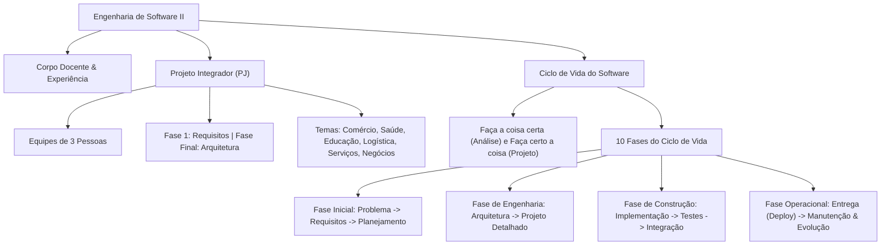

---

## Glossário

| Termo Técnico | Definição no Contexto da Engenharia de Software |
| :--- | :--- |
| **Stakeholder** | Qualquer pessoa, grupo ou organização que tem interesse direto ou indireto, ou que pode ser afetada pelas decisões e resultados do projeto de software. |
| **Elicitação** | Processo investigativo e multidisciplinar de descobrir, extrair e entender as reais necessidades dos usuários e do negócio. |
| **Requisito Funcional (RF)** | Declaração que especifica um comportamento, ação, transformação ou serviço que o sistema de software deve executar. |
| **Requisito Não Funcional (RNF)** | Restrição ou atributo de qualidade que define o desempenho, conformidade de segurança, disponibilidade ou usabilidade do sistema. |
| **Arquitetura de Software** | Conjunto de decisões estruturais de alto nível sobre a organização dos componentes, seus relacionamentos e padrões de comunicação. |
| **Alta Coesão** | Princípio de design que determina que uma classe ou módulo deve concentrar apenas responsabilidades fortemente relacionadas ao seu propósito central. |
| **Baixo Acoplamento** | Grau mínimo de interdependência entre componentes de software, facilitando manutenção, substituição e testes isolados. |
| **Padrão de Projeto (Design Pattern)** | Solução geral reutilizável e padronizada para resolver um problema comum de design dentro de um contexto específico na orientação a objetos. |
| **Strategy Pattern** | Padrão de projeto comportamental que define uma família de algoritmos, encapsula cada um deles e os torna intercambiáveis em tempo de execução. |
| **Integração Contínua (CI)** | Prática de engenharia de software onde os membros do time integram suas alterações de código frequentemente, disparando builds e testes automatizados. |
| **Deploy** | Ato técnico de empacotar, transferir e disponibilizar uma versão compilada e validada do software para execução em um ambiente de produção ou homologação. |
| **Code Smell** | Indício superficial no código-fonte que sinaliza uma fraqueza de design ou arquitetura que pode desacelerar o desenvolvimento futuro. |

---

## Pontos-chave para a prova

1. **A premissa da pastelaria:** Compreender por que o desenvolvimento profissional de software rejeita soluções improvisadas sem modelagem e planejamento prévio.
2. **Análise vs. Projeto:** Saber explicar com precisão a distinção entre "fazer a coisa certa" (análise de requisitos e validação do problema) e "fazer certo a coisa" (arquitetura robusta, design limpo e padrões adequados).
3. **Fórmula e dinâmica da avaliação:** Lembrar a composição da nota final ($60\%$ prova individual AV1/AV2 e $40\%$ projeto em grupo PJ em cada bimestre).
4. **As dez fases do ciclo de vida:** Conhecer a sequência lógica, os objetivos e os artefatos de entrada e saída das fases (Problema, Requisitos, Planejamento, Arquitetura, Projeto, Implementação, Testes, Integração, Entrega e Manutenção).
5. **Diferenciação clara de requisitos:** Saber classificar em cenários reais um Requisito Funcional versus um Requisito Não Funcional, identificando a necessidade de métricas nos RNFs.
6. **Técnicas de elicitação:** Conhecer as situações adequadas para uso de entrevistas, questionários, observação (*shadowing*), prototipação e workshops.
7. **Padrões de Projeto (GoF):** Compreender o papel fundamental de Strategy, Factory, Observer, Adapter e Facade na criação de código desacoplado e extensível.
8. **Tipos de manutenção:** Distinguir claramente manutenções corretivas, adaptativas, evolutivas e preventivas.

---

## Perguntas e respostas (JSONL)

```jsonl
{"pergunta": "Qual a principal diferenca conceitual entre analise e projeto de software segundo apresentado em aula?", "resposta": "A analise foca em 'fazer a coisa certa', ou seja, descobrir e validar o problema real de negocio e as necessidades dos stakeholders. O projeto foca em 'fazer certo a coisa', definindo a arquitetura tecnica, classes, padroes de design e estruturas para que a solucao seja eficiente e manutenivel.", "dificuldade": "facil"}
{"pergunta": "Qual e a formula oficial utilizada para o calculo da nota semestral na disciplina de Engenharia de Software II?", "resposta": "A nota semestral e calculada pela media dos dois bimestres ponderando 60% para avaliacao individual e 40% para o projeto: [((AV1 * 0.6) + (PJ * 0.4)) + ((AV2 * 0.6) + (PJ * 0.4))] / 2.", "dificuldade": "facil"}
{"pergunta": "Por que a Engenharia de Software enfatiza a expressao 'software nao e feito em pastelaria'?", "resposta": "Para alertar que construir software profissional exige metodo, analise, especificacao e testes rigorosos. Tratar software como um pedido instantaneo de balcao sem planejamento resulta em solucoes insustentaveis, colapso operacional e altos custos de retrabalho.", "dificuldade": "facil"}
{"pergunta": "Quais sao as duas fases de entrega do Projeto Integrador da Disciplina (PJ)?", "resposta": "A 1a Etapa consiste em Engenharia de Requisitos (identificacao do problema, stakeholders, levantamento e especificacao de requisitos). A Etapa Final aborda Arquitetura e Projeto (definicao arquitetural, padroes de projeto, componentizacao, reuso, analise de code smells e refatoracao).", "dificuldade": "media"}
{"pergunta": "Qual e a composicao numerica obrigatoria das equipes para o Projeto Integrador?", "resposta": "As equipes devem ser formadas estritamente por 3 pessoas.", "dificuldade": "facil"}
{"pergunta": "Cite as dez fases do projeto de software apresentadas na aula na ordem sequencial correta.", "resposta": "1. Problema, 2. Requisitos, 3. Planejamento, 4. Arquitetura, 5. Projeto, 6. Implementacao, 7. Testes, 8. Integracao, 9. Entrega, 10. Manutencao.", "dificuldade": "media"}
{"pergunta": "Diferencie Requisito Funcional (RF) de Requisito Nao Funcional (RNF) fornecendo um exemplo de cada.", "resposta": "Requisito Funcional define o que o sistema deve fazer (ex: 'O sistema deve permitir cadastrar produtos'). Requisito Nao Funcional define restricoes e atributos de qualidade de como o sistema deve operar (ex: 'A consulta de produtos deve responder em ate 2 segundos sob carga normal').", "dificuldade": "facil"}
{"pergunta": "O que caracteriza a tecnica de elicitacao de requisitos por observacao direta (shadowing)?", "resposta": "E a tecnica em que o analista acompanha pessoalmente o usuario em seu ambiente de trabalho real para registrar a rotina operacional, descobrindo regras de negocio tacitas e gargalos que o usuario esqueceria de relatar em uma entrevista.", "dificuldade": "media"}
{"pergunta": "Qual o proposito central da fase de Arquitetura de Software em relacao a fase de Projeto Detalhado?", "resposta": "A arquitetura define as decisoes estruturais macro de alto nivel (comunicacao entre modulos, estilos arquiteturais, persistencia e tolerancia a falhas). O projeto detalhado modela a estrutura fina interna dos componentes (classes, interfaces, metodos, principios SOLID e padroes GoF).", "dificuldade": "media"}
{"pergunta": "Explique o funcionamento e a categoria do padrao de projeto GoF Strategy.", "resposta": "O Strategy e um padrao comportamental que define uma familia de algoritmos encapsulados sob uma interface comum, permitindo que a estrategia de execucao (ex: calculo de frete ou de impostos) seja trocada dinamicamente em tempo de execucao sem alterar a classe cliente.", "dificuldade": "media"}
{"pergunta": "O que sao os principios de Alta Coesao e Baixo Acoplamento?", "resposta": "Alta Coesao significa que um modulo ou classe possui uma responsabilidade muito bem focada e delimitada. Baixo Acoplamento significa que os modulos possuem interdependencias minimas entre si, facilitando mudancas, manutencoes e testes isolados.", "dificuldade": "media"}
{"pergunta": "Como a Piramide de Testes orienta a distribuicao de testes automatizados em um projeto de software sustentavel?", "resposta": "A piramide recomenda uma base massiva de Testes Unitarios (rapidos, baratos e isolados), uma camada intermediaria moderada de Testes de Integracao (comunicacao entre componentes) e um topo enxuto de Testes End-to-End (lentos, caros e complexos).", "dificuldade": "media"}
{"pergunta": "Qual a diferenca fundamental entre Manutencao Corretiva e Manutencao Evolutiva de software?", "resposta": "A manutencao corretiva tem o objetivo de sanar falhas, bugs e excecoes nao tratadas para restaurar o comportamento esperado da versao existente. A manutencao evolutiva adiciona novas regras de negocio, fluxos ou funcionalidades demandadas pelos usuarios.", "dificuldade": "facil"}
{"pergunta": "No contexto de Integracao Continua (CI), qual e a consequencia imediata da falha de um teste automatizado no pipeline?", "resposta": "O build e quebrado imediatamente, impedindo a uniao do codigo com a branch principal ou a geracao de artefatos de deploy ate que o desenvolvedor responsavel corrija a falha.", "dificuldade": "media"}
{"pergunta": "Por que a conteinerizacao com Docker e relevante para as fases de Integracao e Entrega?", "resposta": "Porque ela empacota a aplicacao com todas as suas bibliotecas e variaveis de ambiente de forma isolada e imutavel, garantindo comportamento identico entre as maquinas dos desenvolvedores, servidores de homologacao e producao.", "dificuldade": "media"}
{"pergunta": "O que diz o Principio da Responsabilidade Unica (SRP) do SOLID?", "resposta": "Determina que uma classe deve ter apenas uma unica razao para mudar, ou seja, deve encapsular apenas um unico proposito ou regra de negocio coesa.", "dificuldade": "facil"}
{"pergunta": "Qual problema classico de elicitação ocorre quando entrevistamos apenas diretores e ignoramos os operadores de ponta?", "resposta": "Obtemos apenas uma visao estrategica e idealizada do processo, ignorando as excecoes de rotina, contornos operacionais e problemas reais que ocorrem no dia a dia da execucao operacional.", "dificuldade": "dificil"}
{"pergunta": "Qual a funcao de um padrao de projeto do tipo Facade?", "resposta": "Prover uma interface de alto nivel simplificada e unificada para um subsistema complexo com multiplas classes e dependencias internas, reduzindo a complexidade de uso para os clientes externos.", "dificuldade": "media"}
```

---

## Checklist de revisão

- [ ] Definir a equipe de 3 integrantes para o Projeto Integrador da Disciplina.
- [ ] Escolher um dos seis temas propostos (Comércio, Serviços Públicos, Negócios, Saúde, Educação ou Logística).
- [ ] Elaborar o rascunho da concepção do sistema fictício para alinhamento com a equipe.
- [ ] Internalizar a máxima: "Faça a coisa certa (análise) e faça certo a coisa (projeto)".
- [ ] Memorizar a sequência cronológica das 10 fases do projeto de software.
- [ ] Compreender com precisão a distinção conceitual e prática entre Requisitos Funcionais e Requisitos Não Funcionais.
- [ ] Revisar os pilares do SOLID, em especial a Responsabilidade Única (SRP) e o Princípio Aberto/Fechado (OCP).
- [ ] Revisar os fundamentos do padrão de projeto Strategy e sua representação em diagrama de classes UML.
- [ ] Compreender a função dos testes automatizados e o papel da esteira de Integração Contínua (CI).
- [ ] Compreender a fórmula de cálculo da nota da disciplina (composição $60\%$ AV e $40\%$ PJ).

## Código prático de apoio

Implementações em Java que tornam executáveis os conceitos desta unidade:

- [`SimuladorCicloDeVidaSoftware.java`](codigo/SimuladorCicloDeVidaSoftware.java)
- [`ValidacaoRequisitosDemo.java`](codigo/ValidacaoRequisitosDemo.java)
- [`EstrategiaFretePadraoStrategyDemo.java`](codigo/EstrategiaFretePadraoStrategyDemo.java)
