# Aula 02 — Fundamentos de Projeto Orientado a Objetos

> **Professor:** Wesley Soares
> **Disciplina:** Engenharia de Software II (4º Semestre)
> **Tema:** Transição da análise para o projeto orientado a objetos, princípios de design OO, priorização de requisitos com MoSCoW e etapas do ciclo de vida de desenvolvimento

---

## Sumário

- [Objetivo da aula](#objetivo-da-aula)
- [Contexto e pré-requisitos](#contexto-e-pré-requisitos)
- [Projeto Orientado a Objetos](#projeto-orientado-a-objetos)
  - [Transição da Análise para o Projeto](#transição-da-análise-para-o-projeto)
  - [Ciclo de Desenvolvimento e Entregáveis Técnicos](#ciclo-de-desenvolvimento-e-entregáveis-técnicos)
- [Principios Fundamentais de Design OO](#principios-fundamentais-de-design-oo)
  - [Visão Geral dos Pilares de Design](#visão-geral-dos-pilares-de-design)
  - [Reúso e Extensibilidade](#reúso-e-extensibilidade)
  - [Introdução a Padrões de Projeto e SOLID](#introdução-a-padrões-de-projeto-e-solid)
- [Abstracao e Encapsulamento](#abstracao-e-encapsulamento)
  - [Abstração: Modelando o Essencial](#abstração-modelando-o-essencial)
  - [Encapsulamento: Ocultamento e Proteção de Estado](#encapsulamento-ocultamento-e-proteção-de-estado)
  - [Exemplos Práticos, Contraexemplos e Armadilhas](#exemplos-práticos-contraexemplos-e-armadilhas)
- [Heranca e Polimorfismo](#heranca-e-polimorfismo)
  - [Herança: Generalização e Especialização](#herança-generalização-e-especialização)
  - [Polimorfismo: Flexibilidade e Comportamento Dinâmico](#polimorfismo-flexibilidade-e-comportamento-dinâmico)
  - [Exemplos Práticos, Contraexemplos e Armadilhas](#exemplos-práticos-contraexemplos-e-armadilhas-1)
- [Baixo Acoplamento e Alta Coesao](#baixo-acoplamento-e-alta-coesao)
  - [Baixo Acoplamento e Inversão de Dependências](#baixo-acoplamento-e-inversão-de-dependências)
  - [Alta Coesão e o Princípio de Responsabilidade Única](#alta-coesão-e-o-princípio-de-responsabilidade-única)
  - [Exemplos Práticos, Contraexemplos e Armadilhas](#exemplos-práticos-contraexemplos-e-armadilhas-2)
- [Metodo MoSCoW de Priorizacao](#metodo-moscow-de-priorizacao)
  - [Conceito e Finalidade na Engenharia de Software](#conceito-e-finalidade-na-engenharia-de-software)
  - [Critérios e Perguntas Norteadoras](#critérios-e-perguntas-norteadoras)
  - [Estudo de Caso: Sistema de Biblioteca](#estudo-de-caso-sistema-de-biblioteca)
- [Etapas do Projeto de Software](#etapas-do-projeto-de-software)
  - [As Seis Etapas Estruturais do Projeto](#as-seis-etapas-estruturais-do-projeto)
  - [Estilos Arquiteturais](#estilos-arquiteturais)
  - [Ciclo Operacional: Testes, Integração e Manutenção](#ciclo-operacional-testes-integração-e-manutenção)
- [Ferramentas de Modelagem UML](#ferramentas-de-modelagem-uml)
  - [Diagramas Essenciais no Projeto OO](#diagramas-essenciais-no-projeto-oo)
  - [Comparativo de Ferramentas de Modelagem](#comparativo-de-ferramentas-de-modelagem)
  - [Exemplo de Interação: Diagrama de Sequência](#exemplo-de-interação-diagrama-de-sequência)
- [Código da aula](#código-da-aula)
- [Exercícios](#exercícios)
  - [Exercício 1: Aplicação de Encapsulamento Rigoroso](#exercício-1-aplicação-de-encapsulamento-rigoroso)
  - [Exercício 2: Especialização Polimórfica com Classes Abstratas](#exercício-2-especialização-polimórfica-com-classes-abstratas)
  - [Exercício 3: Matriz de Priorização MoSCoW para Biblioteca](#exercício-3-matriz-de-priorização-moscow-para-biblioteca)
- [Erros comuns e boas práticas](#erros-comuns-e-boas-práticas)
- [Links e materiais complementares](#links-e-materiais-complementares)
- [Mapa da aula](#mapa-da-aula)
- [Glossário](#glossário)
- [Pontos-chave para a prova](#pontos-chave-para-a-prova)
- [Perguntas e respostas (JSONL)](#perguntas-e-respostas-jsonl)
- [Checklist de revisão](#checklist-de-revisão)

---

## Objetivo da aula

Esta aula tem como propósito instrumentalizar o estudante de Engenharia de Software na transição formal entre a compreensão do problema (análise de requisitos) e a concepção da solução estruturada (projeto orientado a objetos). Ao término do conteúdo, o aluno estará apto a:

1. Diferenciar o modelo de análise ("o que fazer") do modelo de projeto ("como fazer"), compreendendo os artefatos técnicos gerados em cada etapa.
2. Aplicar com rigor técnico os princípios estruturantes da Orientação a Objetos: abstração, encapsulamento, herança, polimorfismo, baixo acoplamento e alta coesão.
3. Utilizar o método de priorização MoSCoW para gerenciar o escopo de releases e prevenir o crescimento desordenado de requisitos (*scope creep*).
4. Compreender as etapas sequenciais e iterativas do projeto orientado a objetos, desde o refinamento de requisitos até a aplicação de padrões de arquitetura e design (*GoF* e *SOLID*).
5. Selecionar e utilizar notações e ferramentas de modelagem UML (diagramas de classes, pacotes e sequência) em softwares como StarUML, Visual Paradigm, Draw.io e Lucidchart.

---

## Contexto e pré-requisitos

Na disciplina de Engenharia de Software I, o foco esteve concentrado na engenharia de requisitos, levantamento de necessidades junto aos stakeholders, modelagem de casos de uso e conceitos introdutórios do paradigma procedural e orientado a objetos.

Para o pleno aproveitamento desta aula, o estudante deve possuir os seguintes pré-requisitos:
- **Lógica de Programação e Sintaxe Básica em Java:** Noções de classes, métodos, tipos de dados primitivos, referências de memória e operadores condicionais.
- **Engenharia de Requisitos Básica:** Capacidade de ler uma especificação funcional, identificar atores de negócio e compreender diagramas de casos de uso preliminares.
- **Noção de Ciclo de Vida de Software:** Compreensão das etapas clássicas de especificação, projeto, implementação, testes e implantação.

*(Nota de aprofundamento técnico: Esta aula estabelece a fundação teórica e prática para tópicos avançados que serão abordados nas semanas seguintes, tais como Padrões de Criação, Estruturais e Comportamentais do GoF, além de Arquitetura Limpa e microsserviços).*

---

## Projeto Orientado a Objetos

### Transição da Análise para o Projeto

No desenvolvimento de sistemas corporativos, uma das falhas mais frequentes é a tentativa de codificar diretamente a partir de um documento textual de requisitos sem uma etapa intermediária de design de engenharia. A análise e o projeto de software representam duas perspectivas complementares, porém com propósitos distintos:

- **Análise de Requisitos (O que fazer):** Foco exclusivo no domínio do problema. O objetivo é compreender as regras de negócio, as restrições operacionais e os objetivos dos usuários finais sem se comprometer com tecnologias específicas, bancos de dados, frameworks ou detalhes de hardware.
- **Projeto Orientado a Objetos (Como fazer):** Foco no domínio da solução técnica. O objetivo é transformar o modelo conceitual em especificações detalhadas de engenharia de software, mapeando classes, interfaces, persistência, comunicação em rede, protocolos de segurança e tratamento de falhas.

| Critério de Comparação | Modelo de Análise | Modelo de Projeto Orientado a Objetos |
| :--- | :--- | :--- |
| **Pergunta Central** | O que o sistema deve fazer? | Como o sistema fará tecnicamente? |
| **Ponto de Vista** | Usuário, cliente e analista de negócio | Arquiteto de software e desenvolvedor |
| **Nível de Abstração** | Conceitual e agnóstico de tecnologia | Físico/lógico, acoplado a padrões e plataformas |
| **Entregáveis Principais** | Casos de uso, requisitos funcionais e não-funcionais, glossário | Diagramas de classes detalhados, diagramas de sequência, interfaces, esquemas de banco |
| **Vocabulário** | Termos do domínio de negócio (Ex: Empréstimo, Livro, Multa) | Termos técnicos e de design (Ex: Controller, Repository, DTO, ThreadPool) |

### Ciclo de Desenvolvimento e Entregáveis Técnicos

O desenvolvimento orientado a objetos organiza a construção do produto por meio de um encadeamento sistemático de etapas de engenharia:

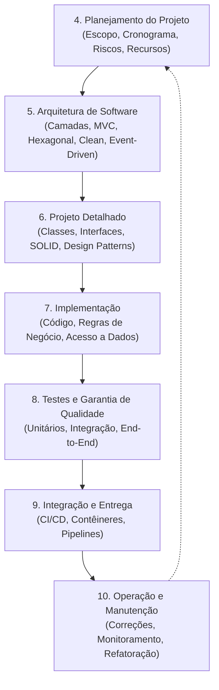

Cada fase entrega artefatos específicos:
1. **Planejamento:** Definição clara do escopo, equipe, cronograma de marcos (*milestones*), análise de riscos e estratégia de alocação de recursos.
2. **Arquitetura de Software:** Decisões estruturais maiores, padrões arquiteturais (MVC, Camadas, Hexagonal), divisão em subsistemas e definição de protocolos de comunicação.
3. **Projeto Detalhado:** Modelagem de diagramas de classes de projeto (com tipos de retorno, visibilidade e parâmetros), interfaces de contrato de serviço, diagramas de interação e mapeamento de dependências.
4. **Implementação:** Tradução dos diagramas em código-fonte executável, seguindo convenções da linguagem, commits semânticos e revisões de código (*code review*).
5. **Garantia da Qualidade:** Testes unitários para isolamento lógico, testes de integração para validar contratos de comunicação e testes de ponta a ponta (*E2E*) para verificar fluxos operacionais completos.
6. **Entrega e Operação:** Pipelines de integração contínua (CI/CD), geração de contêineres e monitoramento em ambiente de produção com ciclos iterativos de feedback e refatoração.

---

## Principios Fundamentais de Design OO

### Visão Geral dos Pilares de Design

Os princípios fundamentais de design orientado a objetos não são regras sintáticas impostas pelo compilador, mas diretrizes consagradas pela engenharia de software para garantir que sistemas complexos permaneçam manuteníveis, compreensíveis e testáveis ao longo do tempo.

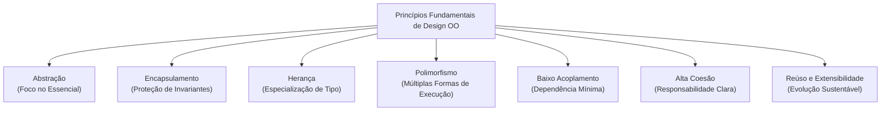

### Reúso e Extensibilidade

- **Reúso de Software:** Capacidade de utilizar ativos de software já implementados, testados e validados em novos contextos sem a necessidade de reescrever código. O reúso pode ocorrer por herança de classes, composição de objetos, desenvolvimento de módulos utilitários e criação de bibliotecas compartilhadas corporativas.
- **Extensibilidade:** Propriedade que permite a um sistema receber novos comportamentos e funcionalidades sem alterar a base de código preexistente e consolidada. Na engenharia de software, isso é formalizado pelo Princípio Aberto/Fechado (*Open/Closed Principle* do SOLID): módulos devem estar abertos para extensão, mas fechados para modificação.

### Introdução a Padrões de Projeto e SOLID

Na etapa de projeto detalhado, a estruturação dos objetos se apoia fortemente em duas referências fundamentais de engenharia de software:

1. **Princípios SOLID:**
   - **S (Single Responsibility Principle):** Uma classe deve ter um, e apenas um, motivo para mudar (Alta Coesão).
   - **O (Open/Closed Principle):** Módulos devem ser extensíveis via herança ou polimorfismo sem alteração de código estável.
   - **L (Liskov Substitution Principle):** Subclasses devem ser capazes de substituir suas classes-base sem alterar a consistência lógica do sistema.
   - **I (Interface Segregation Principle):** Interfaces pequenas e especializadas são preferíveis a interfaces infladas de métodos não utilizados.
   - **D (Dependency Inversion Principle):** Módulos de alto nível não devem depender de módulos de baixo nível; ambos devem depender de abstrações (Baixo Acoplamento).

2. **Padrões de Projeto (GoF - Gang of Four):**
   - **Strategy:** Permite definir uma família de algoritmos, encapsular cada um deles e torná-los intercambiáveis em tempo de execução.
   - **Factory Method:** Fornece uma interface para criar objetos em uma superclasse, permitindo que as subclasses alterem o tipo de objeto que será criado.
   - **Observer:** Define um mecanismo de subscrição de um para muitos, permitindo que múltiplos objetos observem eventos ocorridos em outro objeto.
   - **Adapter:** Permite a colaboração entre objetos com interfaces incompatíveis, convertendo a interface de uma classe para outra esperada pelo cliente.
   - **Facade:** Oferece uma interface simplificada e de alto nível para uma biblioteca, um framework ou um conjunto complexo de subsistemas.

| Princípio / Padrão | Problema que Resolve | Impacto no Ciclo de Manutenção |
| :--- | :--- | :--- |
| **Abstração & Encapsulamento** | Complexidade cognitiva e alteração indevida de dados | Evita estados inválidos e simplifica o entendimento da API pública |
| **Herança & Polimorfismo** | Duplicação de código e estruturas condicionais aninhadas (`if/else`, `switch`) | Reduz complexidade ciclomática e facilita adição de novos tipos |
| **Baixo Acoplamento** | Efeito cascata onde uma alteração quebra múltiplos módulos | Permite substituição de componentes sem impacto colateral |
| **Alta Coesão** | Classes "faz-tudo" (*God Class*) que acumulam muitas tarefas | Facilita testes unitários e localização ágil de bugs |
| **Padrões GoF** | Soluções amadoras e idiossincráticas para problemas recorrentes de design | Vocabulário técnico unificado e arquitetura extensível |

---

## Abstracao e Encapsulamento

### Abstração: Modelando o Essencial

A abstração é a operação mental em que o desenvolvedor isola os aspectos relevantes de uma entidade do mundo real sob a perspectiva do problema que está resolvendo, descartando propositalmente detalhes operacionais secundários ou mecânicas internas de baixo nível.

- **Definição:** Representar um conceito do domínio em termos de propriedades essenciais e operações que expressam sua semântica de negócio.
- **Motivação:** Reduzir a carga cognitiva do desenvolvedor. Um sistema comercial que processa uma `Venda` precisa saber os itens, o cliente e o valor total acumulado; ele não precisa saber como os transistores da CPU calculam a multiplicação ou em que setor físico do disco o arquivo temporário foi alocado.
- **Aplicação no Projeto:** Criação de classes e métodos semânticos. Ao modelar `Venda.calcularTotal()`, o código externo consome o contrato do cálculo sem precisar conhecer a fórmula interna de amortização de impostos ou arredondamento contábil.

### Encapsulamento: Ocultamento e Proteção de Estado

Encapsulamento é a prática de agrupar o estado interno (atributos) e o comportamento (métodos) de um objeto, restringindo o acesso direto a elementos estruturais internos para impedir a corrupção de suas regras de integridade (invariantes de classe).

- **Definição:** Proteção dos dados internos de uma classe através de modificadores de acesso (`private`, `protected`), condicionando leituras e gravações a métodos públicos (`public`) controlados.
- **Motivação:** Garantir que um objeto nunca atinja um estado inválido perante o negócio. Se o estoque de um produto for tornado público, qualquer linha de código externa poderá alterá-lo para `-500`, violando as regras da empresa.
- **Aplicação no Projeto:** Ocultar atributos primitivos com `private` e criar métodos de domínio expressivos (como `realizarBaixa(int quantidade)` e `adicionarEntrada(int quantidade)`), em vez de apenas métodos de atribuição genéricos que expõem a estrutura crua.

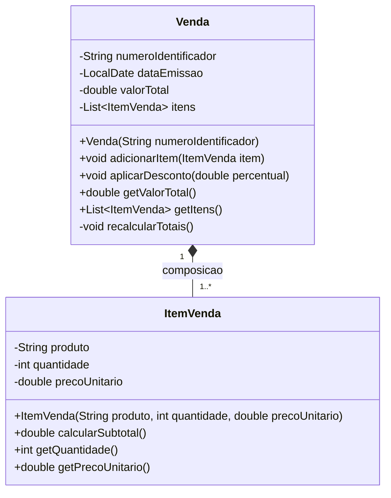

### Exemplos Práticos, Contraexemplos e Armadilhas

#### Exemplo Correto em Java (Encapsulamento de Negócio e Abstração)
```java
package br.unifef.design.vendas;

import java.util.ArrayList;
import java.util.Collections;
import java.util.List;

public class Venda {
    private final String identificador;
    private double valorTotal;
    private final List<String> itens;

    public Venda(String identificador) {
        if (identificador == null || identificador.isBlank()) {
            throw new IllegalArgumentException("Identificador da venda e obrigatorio.");
        }
        this.identificador = identificador;
        this.valorTotal = 0.0;
        this.itens = new ArrayList<>();
    }

    public void registrarEntradaItem(String nomeProduto, double valorUnitario, int quantidade) {
        if (quantidade <= 0) {
            throw new IllegalArgumentException("A quantidade deve ser estritamente positiva.");
        }
        if (valorUnitario < 0.0) {
            throw new IllegalArgumentException("O valor unitario nao pode ser negativo.");
        }
        this.itens.add(nomeProduto + " x" + quantidade);
        this.valorTotal += (valorUnitario * quantidade);
    }

    public double getValorTotal() {
        return this.valorTotal;
    }

    public String getIdentificador() {
        return this.identificador;
    }

    // Retorna uma lista imutavel para proteger o estado interno contra mutacoes externas
    public List<String> getItens() {
        return Collections.unmodifiableList(this.itens);
    }
}
```

#### Contraexemplo (Quebra de Encapsulamento com Atributos Públicos)
```java
package br.unifef.design.antipattern;

import java.util.List;

// Antipadrao: Classe anemica com exposicao estrutural
public class VendaInsegura {
    public String identificador;
    public double valorTotal; // Aberto para corrupcao direta
    public List<String> itens; // Qualquer cliente pode limpar ou injetar dados sem recalcular o total
}
```

#### Armadilhas Frequentes
1. **Getters e Setters Automáticos sem Validação (Modelo Anêmico):** Gerar métodos `setAtributo()` cegos para todos os campos da classe é apenas uma forma burocrática de manter atributos públicos. Se o método `setSaldo(double saldo)` aceita qualquer valor sem checar limites, não há encapsulamento real, apenas sintático.
2. **Vazamento de Referências Mutáveis (*Escaping References*):** Retornar diretamente referências de coleções (`List`, `Map`) internas em métodos `get` permite que o código chamador execute `.clear()` ou `.add()` fora do controle da classe dona do dado. Utilize sempre wrappers imutáveis como `Collections.unmodifiableList(...)`.

---

## Heranca e Polimorfismo

### Herança: Generalização e Especialização

Herança é o mecanismo da orientação a objetos que permite a uma classe filha (subclasse) herdar atributos e comportamentos de uma classe mãe (superclasse), possibilitando o reuso de código e o estabelecimento de uma relação semântica do tipo "É UM" (*is-a*).

- **Definição:** Mecanismo de modelagem estrutural que captura características comuns em uma superclasse abstrata ou concreta e as estende nas subclasses especializadas.
- **Motivação:** Eliminar código redundante em entidades que compartilham a mesma essência de domínio, centralizando a manutenção de rotinas comuns na classe ancestral.
- **Aplicação no Projeto:** Modelagem hierárquica do domínio, como uma classe abstrata `Pessoa` que especializa em `Colaborador` e `Cliente`.

### Polimorfismo: Flexibilidade e Comportamento Dinâmico

O polimorfismo (do grego: "múltiplas formas") é o princípio pelo qual um mesmo método, invocado a partir de uma referência da superclasse ou interface, executa comportamentos completamente distintos em tempo de execução, a depender da classe concreta do objeto instanciado.

- **Definição:** Capacidade de objetos de diferentes classes derivadas responderem à mesma mensagem com algoritmos especializados através da sobrescrita de métodos (`@Override`).
- **Motivação:** Escrever código cliente genérico que opera sobre contratos e tipos base, permitindo a inclusão de novos tipos sem necessidade de alterar o código que os processa (eliminando comandos `if-else` ou `switch-case` com verificações de tipo).
- **Aplicação no Projeto:** Invocação de rotinas polimórficas como `calcularBonus()` para uma lista heterogênea de colaboradores (`List<Funcionario>`), delegando a cada subclasse sua fórmula de gratificação.

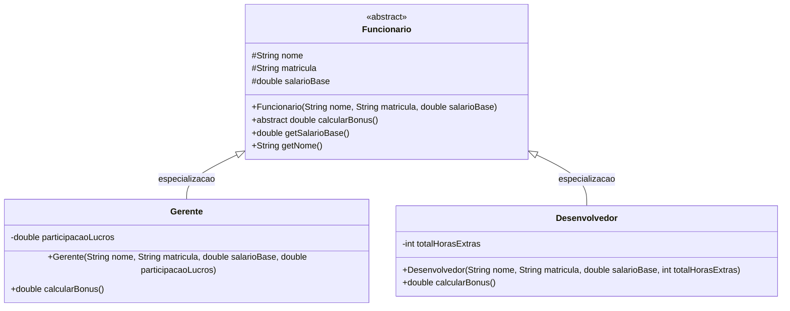

### Exemplos Práticos, Contraexemplos e Armadilhas

#### Exemplo em Java (Polimorfismo com Classe Abstrata)
```java
package br.unifef.design.rh;

public abstract class Funcionario {
    protected final String nome;
    protected final String matricula;
    protected final double salarioBase;

    public Funcionario(String nome, String matricula, double salarioBase) {
        if (salarioBase < 0) {
            throw new IllegalArgumentException("Salario base nao pode ser negativo.");
        }
        this.nome = nome;
        this.matricula = matricula;
        this.salarioBase = salarioBase;
    }

    public abstract double calcularBonus();

    public double getSalarioBase() {
        return this.salarioBase;
    }

    public String getNome() {
        return this.nome;
    }
}
```

```java
package br.unifef.design.rh;

public class Gerente extends Funcionario {
    private final double participacaoLucros;

    public Gerente(String nome, String matricula, double salarioBase, double participacaoLucros) {
        super(nome, matricula, salarioBase);
        this.participacaoLucros = participacaoLucros;
    }

    @Override
    public double calcularBonus() {
        // Gerente recebe 20% do salario base mais a participacao nos lucros
        return (this.salarioBase * 0.20) + this.participacaoLucros;
    }
}
```

```java
package br.unifef.design.rh;

public class Desenvolvedor extends Funcionario {
    private final int totalHorasExtras;

    public Desenvolvedor(String nome, String matricula, double salarioBase, int totalHorasExtras) {
        super(nome, matricula, salarioBase);
        this.totalHorasExtras = totalHorasExtras;
    }

    @Override
    public double calcularBonus() {
        // Desenvolvedor recebe 10% do salario base mais valor fixo por hora extra
        return (this.salarioBase * 0.10) + (this.totalHorasExtras * 50.0);
    }
}
```

#### Uso Polimórfico pelo Cliente
```java
package br.unifef.design.rh;

import java.util.List;

public class FolhaPagamentoService {
    public void imprimirBonificacoes(List<Funcionario> funcionarios) {
        for (Funcionario f : funcionarios) {
            // Chamada polimorfica: a JVM decide dinamicamente o metodo correto
            System.out.println(f.getNome() + " Bonus: R$ " + f.calcularBonus());
        }
    }
}
```

#### Contraexemplo (Acoplamento Estrutural e Quebra do Princípio Aberto/Fechado)
```java
package br.unifef.design.antipattern;

// Antipadrao: Verificacao explicita de tipo com if/else
public class ProcessadorBonusProcedural {
    public double calcular(Object funcionario) {
        if (funcionario instanceof Gerente) {
            return ((Gerente) funcionario).getSalarioBase() * 0.20;
        } else if (funcionario instanceof Desenvolvedor) {
            return ((Desenvolvedor) funcionario).getSalarioBase() * 0.10;
        }
        // Cada novo cargo exige alterar esta classe, ferindo o Open/Closed Principle
        throw new IllegalArgumentException("Cargo desconhecido.");
    }
}
```

#### Armadilhas Frequentes
1. **Herança Prematura ou Indevida (*Favor Composition Over Inheritance*):** Usar herança apenas para reaproveitar dois ou três métodos de uma classe quando não existe uma relação conceitual de "É UM". Isso gera forte acoplamento de código.
2. **Quebra do Princípio da Substituição de Liskov (LSP):** Criar uma subclasse que lança exceções inesperadas em métodos herdados ou altera a semântica de pré-condições e pós-condições da superclasse.

---

## Baixo Acoplamento e Alta Coesao

### Baixo Acoplamento e Inversão de Dependências

Acoplamento é o grau de interdependência entre os módulos, pacotes e classes de um sistema. Quando duas classes possuem alto acoplamento, alterações no código de uma delas forçam modificações e retestes imediatos na outra.

- **Definição:** Diretriz de engenharia que visa minimizar os vínculos diretos entre classes concretas, preferindo interfaces, contratos abstratos e técnicas de injeção de dependência.
- **Motivação:** Permitir que partes do sistema evoluam, sejam refatoradas ou substituídas sem desestabilizar os demais subsistemas.
- **Aplicação no Projeto:** Fazer com que serviços de negócio dependam de interfaces de exportação (`IExportador`) ou de acesso a dados (`IRepositorio`), e não de classes concretas de infraestrutura (`ExportadorPDF`, `RepositorioMySQL`).

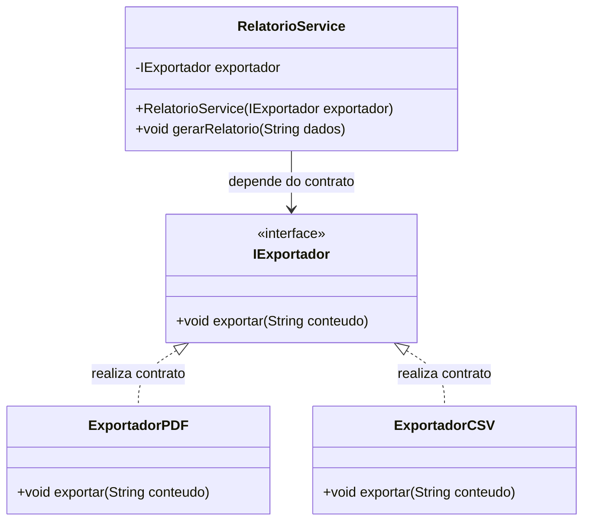

### Alta Coesão e o Princípio de Responsabilidade Única

Coesão é a medida do foco funcional de uma unidade de software (classe, pacote ou módulo). Uma classe é altamente coesa quando todos os seus atributos e métodos trabalham em harmonia para cumprir um propósito único, bem delineado e indivisível.

- **Definição:** Garantir que uma classe tenha responsabilidade sobre uma única tarefa ou área funcional de negócio.
- **Motivação:** Manter o código compreensível, de fácil manutenção, de alta reusabilidade e com superfícies de teste enxutas.
- **Aplicação no Projeto:** Isolar regras de controle de pedidos em `PedidoService`, cálculo financeiro em `CalculadoraFinanceira`, persistência em `PedidoRepository` e envio de e-mails em `NotificadorEmail`.

| Dimensão de Qualidade | Cenário Ruim (Antipadrão) | Cenário Ideal (Engenharia Sólida) |
| :--- | :--- | :--- |
| **Acoplamento** | `PedidoService` instancia internamente `new OracleDatabaseConnection()` e `new ConexaoGmailSMTP()` | `PedidoService` recebe `IPedidoRepository` e `INotificadorService` por injeção no construtor |
| **Coesão** | Classe `Pedido` gerencia itens, salva no banco, calcula impostos, formata tela e dispara SMS | Classe `Pedido` gerencia apenas dados do pedido e suas regras intrínsecas de validação |
| **Testabilidade** | Impossível testar regras de negócio sem ter um banco Oracle rodando e acesso à internet | Testes unitários com simulação rápida de contratos (*Mocks/Stubs*) em memória |
| **Impacto de Mudança** | Trocar o banco quebra todas as classes do sistema | Trocar o banco afeta apenas a classe de repositório que implementa a interface |

### Exemplos Práticos, Contraexemplos e Armadilhas

#### Exemplo em Java (Inversão de Dependência e Baixo Acoplamento)
```java
package br.unifef.design.exportacao;

public interface IExportador {
    void exportar(String conteudo);
}
```

```java
package br.unifef.design.exportacao;

public class ExportadorPDF implements IExportador {
    @Override
    public void exportar(String conteudo) {
        // Logica concreta de geracao de documento binario PDF
        System.out.println("[PDF Gerado] " + conteudo);
    }
}
```

```java
package br.unifef.design.exportacao;

public class RelatorioService {
    private final IExportador exportador;

    // Inversao de Dependencia: injecao via construtor
    public RelatorioService(IExportador exportador) {
        if (exportador == null) {
            throw new IllegalArgumentException("O exportador nao pode ser nulo.");
        }
        this.exportador = exportador;
    }

    public void emitirRelatorioMensal(String relatorio) {
        String dadosProcessados = "[Relatorio Mensal Consolidado] " + relatorio;
        this.exportador.exportar(dadosProcessados);
    }
}
```

#### Contraexemplo (Classe Deus / God Class com Baixa Coesão)
```java
package br.unifef.design.antipattern;

// Antipadrao: Baixa Coesao e Alto Acoplamento
public class PedidoTudoEmUm {
    public void criarPedido() { /* ... */ }
    public void conectarBancoOracle() { /* Conexao SQL pura */ }
    public void salvarNoBanco() { /* INSERT INTO pedidos... */ }
    public void calcularICMS() { /* Regra contabil */ }
    public void enviarBoletoPorEmail() { /* Conexao SMTP socket */ }
    public void renderizarInterfaceSwing() { /* JFrame e JButton */ }
}
```

#### Armadilhas Frequentes
1. **Acoplamento Oculto por Singleton Global:** Utilizar instâncias estáticas globais (`BancoDados.getInstance().executarQuery()`) dentro dos métodos de negócio. Isso mascara dependências diretas e impede o isolamento dos testes unitários.
2. **Coesão Falsa (Classes Utilitárias Gigantes):** Criar classes denominadas `GeralUtils` ou `SistemaHelper` que acumulam métodos desconexos de formatação de CPF, conversão de datas, envio de e-mails e regras de desconto.

---

## Metodo MoSCoW de Priorizacao

### Conceito e Finalidade na Engenharia de Software

O método MoSCoW é uma técnica analítica de priorização de requisitos, tarefas e funcionalidades, amplamente aplicada na análise de negócios, na gestão de projetos e no desenvolvimento de software. Criado originalmente no âmbito do framework DSDM (*Dynamic Systems Development Method*), ele ajuda equipes técnicas e clientes a alinhar expectativas sobre o que será entregue em cada iteração ou versão de um sistema.

Seu principal objetivo prático é conter o fenômeno do **Scope Creep** (crescimento descontrolado e desorganizado do escopo), garantindo que os recursos finitos da equipe de engenharia (tempo, orçamento e capacidade técnica) sejam investidos primariamente no núcleo operacional do sistema.

### Critérios e Perguntas Norteadoras

O acrônimo MoSCoW organiza as demandas em quatro categorias de prioridade estrita:

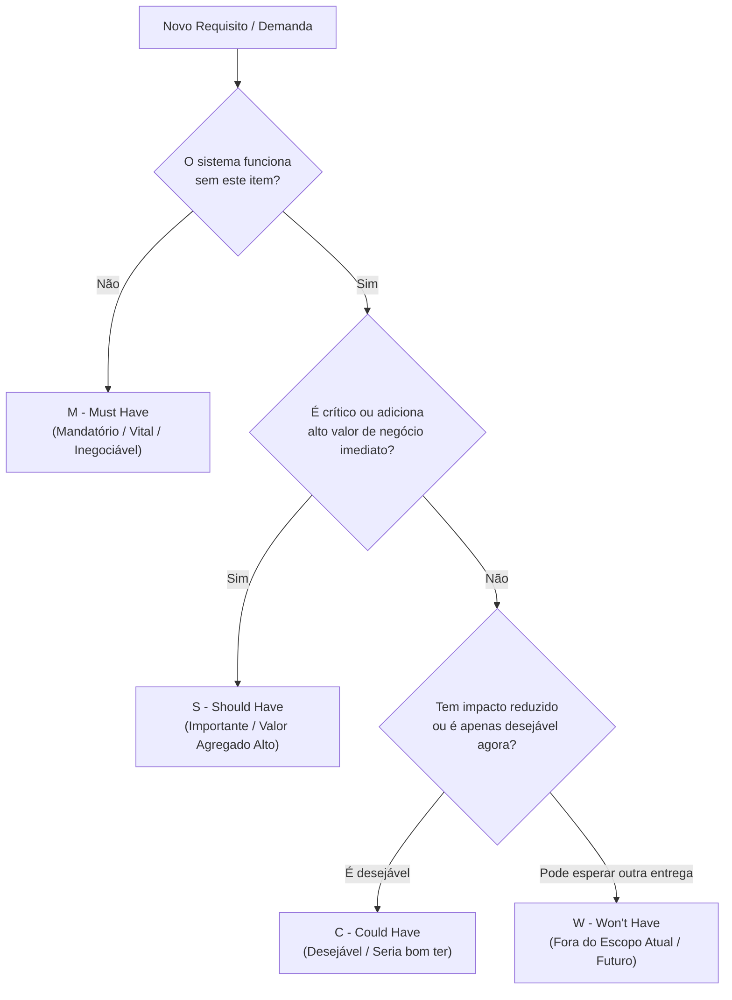

1. **M – Must Have (Mandatórios / Essenciais):**
   - **Conceito:** Iniciativas de entrega obrigatória para o sucesso do projeto. Sem elas, o produto final é inviável, ilegal ou operacionalmente inútil.
   - **Perguntas de Teste:** O que acontece se entregarmos sem isso? O sistema funcionará sem essa funcionalidade? Existe alguma alternativa manual paliativa viável? (Se a resposta para a paralisação do sistema for "Sim", trata-se de um *Must*).
2. **S – Should Have (Importantes / Alto Valor):**
   - **Conceito:** Funcionalidades de grande relevância comercial ou técnica que agregam valor significativo. Se forem deixadas para a iteração seguinte, o produto continuará funcionando, embora com menor comodidade ou eficiência.
3. **C – Could Have (Desejáveis / Nice to Have):**
   - **Conceito:** Recursos que trazem melhorias incrementais na experiência do usuário, mas que possuem impacto reduzido nos resultados essenciais se forem temporariamente postergados.
4. **W – Won’t Have (Fora do Escopo Atual):**
   - **Conceito:** Funcionalidades expressamente identificadas e acordadas como não prioritárias para a versão ou iteração atual. Registrá-las no documento oficial protege a equipe contra desvios de foco e cobranças extemporâneas, deixando a porta aberta para versões futuras.

### Estudo de Caso: Sistema de Biblioteca

No contexto do sistema de controle de biblioteca apresentado em aula, a aplicação do MoSCoW estabelece a seguinte matriz de escopo:

| Categoria MoSCoW | Funcionalidade da Biblioteca | Justificativa Técnica e Operacional |
| :--- | :--- | :--- |
| **Must have** | Cadastrar Usuário | Entidade primária indispensável para vincular responsabilidades legais e operacionais de empréstimo. |
| **Must have** | Cadastrar Livro | Registro do acervo no banco de dados; sem catálogo, não há o que emprestar. |
| **Must have** | Empréstimo e Devolução | Fluxo central e razão de existência do sistema de biblioteca. Sem isso, o software não cumpre seu propósito. |
| **Should have** | Renovar Empréstimo Online | Recurso altamente desejável que economiza tempo de balcão, mas se falhar, o aluno pode renovar presencialmente. |
| **Could have** | Avaliar Livros com Notas/Comentários | Adiciona experiência comunitária agradável, mas não interfere em nenhum fluxo operacional de guarda e acervo. |
| **Won’t have** | Integração com Redes Sociais | Funcionalidade totalmente secundária para a entrega atual; consome esforço de integração via API sem retorno operacional crítico. |

---

## Etapas do Projeto de Software

### As Seis Etapas Estruturais do Projeto

O projeto orientado a objetos é estruturado em uma sequência formal de seis etapas complementares, assegurando rastreabilidade da análise ao código:

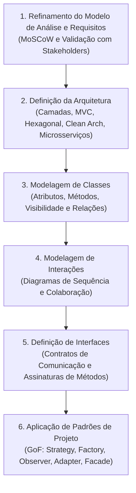

1. **Refinamento do Modelo de Análise e Requisitos:** Ajuste fino dos requisitos operacionais identificados preliminarmente, detalhando regras de validação e priorizando entregáveis com o método MoSCoW.
2. **Definição da Arquitetura:** Escolha dos grandes alicerces e estilos arquiteturais de organização do código-fonte e comunicação entre subsistemas.
3. **Modelagem de Classes:** Criação do diagrama estrutural de classes, enriquecido com modificadores de acesso (`-`, `+`, `#`), tipagens estritas de dados, parâmetros e relacionamentos (associação, agregação, composição e herança).
4. **Modelagem de Interações:** Representação visual das mensagens trocadas no tempo entre instâncias de classes durante a execução de um caso de uso específico (via Diagrama de Sequência).
5. **Definição de Interfaces:** Declaração explícita de contratos operacionais, garantindo que os subsistemas conheçam apenas assinaturas abstratas de métodos, habilitando o baixo acoplamento.
6. **Aplicação de Padrões de Projeto:** Aplicação de soluções consagradas (*Design Patterns*) para resolver pontos críticos de acoplamento, instanciação dinâmica e desacoplamento de eventos.

### Estilos Arquiteturais

Na etapa de definição da arquitetura de software, o arquiteto avalia os requisitos não-funcionais (como escalabilidade, facilidade de manutenção, desempenho e segurança) para selecionar o estilo mais adequado:

- **Arquitetura em Camadas (*Layered Architecture*):** Organização clássica e hierárquica (geralmente Apresentação, Regras de Negócio/Serviços e Acesso a Dados/Persistência), em que cada camada comunica-se apenas com a camada imediatamente inferior.
- **Model-View-Controller (MVC):** Padrão de separação entre o modelo de dados de domínio (*Model*), a interface com o usuário (*View*) e o orquestrador de eventos e comandos de entrada (*Controller*).
- **Arquitetura Hexagonal (*Ports and Adapters*):** Isola completamente o núcleo das regras de negócio do mundo externo (bancos, APIs, interfaces web) por meio de portas de entrada/saída e adaptadores de infraestrutura.
- **Clean Architecture:** Arquitetura concêntrica que prioriza a independência de frameworks, UI e bancos de dados, colocando entidades puras de negócio no centro de tudo e orientando as dependências de fora para dentro.
- **Microservices (Microsserviços):** Decomposição de uma solução em múltiplos serviços autônomos, implantáveis de forma independente e comunicando-se via protocolos leves (HTTP/REST, gRPC, filas).
- **Event-Driven Architecture (Dirigida por Eventos):** Modelo em que componentes reagem e emitem fluxos assíncronos de eventos através de um intermediário (*broker* de mensagens), garantindo desacoplamento temporal.

### Ciclo Operacional: Testes, Integração e Manutenção

Conforme detalhado no material de aula, a engenharia de software não encerra seu papel na entrega do código compilado:

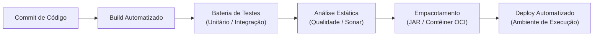

- **Testes Unitários:** Verificam classes e métodos isolados em milissegundos, garantindo que as menores unidades lógicas operem corretamente.
- **Testes de Integração:** Validam a comunicação real entre múltiplos módulos (ex: persistência de dados em um banco de teste ou consumo de uma API).
- **Testes End-to-End (E2E):** Validam a jornada completa do usuário final do início ao fim em um ambiente idêntico ao de produção.
- **Integração e Entrega Contínua (CI/CD):** Prática moderna em que cada commit no controle de versão dispara pipelines automatizados de compilação, testes, empacotamento em contêineres e deploy contínuo.
- **Manutenção e Evolução:** Tratamento de feedback pós-lançamento, monitoramento operacional com métricas em tempo real, correção ágil de bugs e refatoração arquitetural controlada.

---

## Ferramentas de Modelagem UML

### Diagramas Essenciais no Projeto OO

A UML (*Unified Modeling Language*) é a linguagem visual padronizada da indústria para documentar, especificar e comunicar o design de sistemas orientados a objetos. Na transição para o projeto, destacam-se:

1. **Diagrama de Classes:** Mapeia a estrutura estática do software, exibindo classes, atributos, métodos, modificadores de acesso e relacionamentos estruturais (associação, herança, dependência).
2. **Diagrama de Sequência:** Mapeia o comportamento dinâmico do sistema, detalhando a troca de mensagens ordenada no tempo entre objetos para realizar um caso de uso.
3. **Diagrama de Pacotes:** Organiza as classes em subsistemas, camadas e módulos lógicos, permitindo avaliar visualmente o acoplamento entre os grandes blocos da aplicação.

### Comparativo de Ferramentas de Modelagem

| Ferramenta | Tipo de Ambiente | Suporte a Metamodelo UML | Principais Prós | Principais Contras |
| :--- | :--- | :--- | :--- | :--- |
| **StarUML** | Desktop nativo (Win/Mac/Linux) | Alto (UML 2.x estrito) | Geração/engenharia reversa de código, validação semântica de regras UML | Licença comercial após período de testes; curva de aprendizado inicial |
| **Visual Paradigm** | Desktop e Web corporativo | Máximo (UML, BPMN, SysML) | Suporte completo a requisitos, engenharia reversa, relatórios formais de projeto | Software pesado, exige recursos de hardware, custo elevado de licenciamento |
| **Draw.io** | Web e Desktop gratuito | Médio (Diagramação visual livre) | Gratuito, código aberto, leve, integração com Google Drive/GitHub | Não valida consistência técnica do metamodelo (permite desenhar associações inválidas) |
| **Lucidchart** | Web colaborativo em nuvem | Médio-Alto (Formas ricas UML) | Colaboração multiusuário em tempo real de altíssima qualidade visual | Requer assinatura paga para diagramas complexos, não gera código Java nativamente |

### Exemplo de Interação: Diagrama de Sequência

Para ilustrar o detalhamento dinâmico que o projeto de software exige, o diagrama de sequência a seguir mapeia a interação necessária para a execução do caso de uso de **Empréstimo de Livro** na biblioteca:

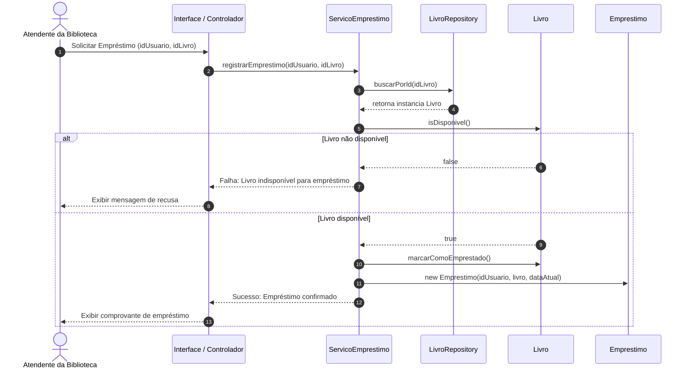

---

## Código da aula

Nesta seção, é apresentado o código do arquivo [./codigo/SistemaBiblioteca.java](./codigo/SistemaBiblioteca.java), projetado para demonstrar os princípios abordados: abstração, encapsulamento rigoroso, herança, polimorfismo, baixo acoplamento e separação de responsabilidades.

### Estrutura Arquitetural do Código
O arquivo reúne as abstrações fundamentais do domínio de biblioteca:
1. `INotificador`: Contrato de baixo acoplamento para comunicação com o usuário.
2. `NotificadorConsole`: Implementação concreta do contrato de notificação.
3. `ItemAcervo`: Classe abstrata ancestral que centraliza identificadores e estado de disponibilidade (Herança e Abstração).
4. `Livro`: Especialização com dados de autoria e páginas.
5. `Emprestimo`: Classe com regras de negócio encapsuladas para associação entre usuário, item e prazos de devolução.
6. `BibliotecaService`: Orquestrador de serviços desacoplado via injeção de dependência.

```java
package br.unifef.biblioteca;

import java.time.LocalDate;
import java.util.ArrayList;
import java.util.Collections;
import java.util.List;

// 1. CONTRATO DE INTERFACE (Baixo Acoplamento)
interface INotificador {
    void enviarMensagem(String destinatario, String conteudo);
}

// 2. IMPLEMENTACAO CONCRETA DO NOTIFICADOR
class NotificadorConsole implements INotificador {
    @Override
    public void enviarMensagem(String destinatario, String conteudo) {
        System.out.println("[NOTIFICACAO para " + destinatario + "]: " + conteudo);
    }
}

// 3. CLASSE ABSTRATA COM ABSTRACAO E ENCAPSULAMENTO (Heranca)
abstract class ItemAcervo {
    private final String codigo;
    private final String titulo;
    private boolean disponivel;

    public ItemAcervo(String codigo, String titulo) {
        if (codigo == null || codigo.isBlank()) {
            throw new IllegalArgumentException("Codigo de identificacao nao pode ser nulo ou vazio.");
        }
        if (titulo == null || titulo.isBlank()) {
            throw new IllegalArgumentException("Titulo nao pode ser nulo ou vazio.");
        }
        this.codigo = codigo;
        this.titulo = titulo;
        this.disponivel = true;
    }

    public String getCodigo() {
        return codigo;
    }

    public String getTitulo() {
        return titulo;
    }

    public boolean isDisponivel() {
        return disponivel;
    }

    public void emprestar() {
        if (!this.disponivel) {
            throw new IllegalStateException("O item '" + this.titulo + "' ja se encontra emprestado.");
        }
        this.disponivel = false;
    }

    public void devolver() {
        if (this.disponivel) {
            throw new IllegalStateException("O item '" + this.titulo + "' ja esta disponível no acervo.");
        }
        this.disponivel = true;
    }

    // Metodo polimorfico obrigatorio para calculo de prazo maximo de devolucao
    public abstract int obterPrazoDiasEmprestimo();
}

// 4. SUBCLASSE CONCRETA (Especializacao e Polimorfismo)
class Livro extends ItemAcervo {
    private final String autor;
    private final int totalPaginas;

    public Livro(String codigo, String titulo, String autor, int totalPaginas) {
        super(codigo, titulo);
        if (autor == null || autor.isBlank()) {
            throw new IllegalArgumentException("Autor deve ser informado.");
        }
        if (totalPaginas <= 0) {
            throw new IllegalArgumentException("Total de paginas deve ser maior que zero.");
        }
        this.autor = autor;
        this.totalPaginas = totalPaginas;
    }

    public String getAutor() {
        return autor;
    }

    public int getTotalPaginas() {
        return totalPaginas;
    }

    @Override
    public int obterPrazoDiasEmprestimo() {
        // Regra polimorfica: Livros padrao tem prazo de 14 dias
        return 14;
    }
}

// 5. CLASSE DE REGRA DE NEGOCIO ENCAPSULADA (Alta Coesao)
class Emprestimo {
    private final String idEmprestimo;
    private final String matriculaUsuario;
    private final ItemAcervo item;
    private final LocalDate dataRetirada;
    private final LocalDate dataPrevistaDevolucao;
    private LocalDate dataDevolucaoEfetiva;

    public Emprestimo(String idEmprestimo, String matriculaUsuario, ItemAcervo item) {
        if (idEmprestimo == null || matriculaUsuario == null || item == null) {
            throw new IllegalArgumentException("Parametros de emprestimo nao podem ser nulos.");
        }
        item.emprestar(); // Garante a mudanca de estado no ato da criacao do emprestimo
        this.idEmprestimo = idEmprestimo;
        this.matriculaUsuario = matriculaUsuario;
        this.item = item;
        this.dataRetirada = LocalDate.now();
        this.dataPrevistaDevolucao = this.dataRetirada.plusDays(item.obterPrazoDiasEmprestimo());
        this.dataDevolucaoEfetiva = null;
    }

    public void finalizarDevolucao() {
        if (this.dataDevolucaoEfetiva != null) {
            throw new IllegalStateException("Este emprestimo ja foi finalizado previamente.");
        }
        this.item.devolver();
        this.dataDevolucaoEfetiva = LocalDate.now();
    }

    public String getIdEmprestimo() { return idEmprestimo; }
    public String getMatriculaUsuario() { return matriculaUsuario; }
    public ItemAcervo getItem() { return item; }
    public LocalDate getDataRetirada() { return dataRetirada; }
    public LocalDate getDataPrevistaDevolucao() { return dataPrevistaDevolucao; }
    public LocalDate getDataDevolucaoEfetiva() { return dataDevolucaoEfetiva; }
}

// 6. SERVICO PRINCIPAL (Injecao de Dependencias e Orquestracao)
public class SistemaBiblioteca {
    private final INotificador notificador;
    private final List<Emprestimo> emprestimosAtivos;

    public SistemaBiblioteca(INotificador notificador) {
        this.notificador = notificador;
        this.emprestimosAtivos = new ArrayList<>();
    }

    public Emprestimo realizarEmprestimo(String id, String matricula, ItemAcervo item) {
        Emprestimo novoEmprestimo = new Emprestimo(id, matricula, item);
        this.emprestimosAtivos.add(novoEmprestimo);
        
        // Notificacao desacoplada
        this.notificador.enviarMensagem(matricula, 
            "Emprestimo do item '" + item.getTitulo() + "' aprovado. Devolucao prevista: " 
            + novoEmprestimo.getDataPrevistaDevolucao());
            
        return novoEmprestimo;
    }

    public List<Emprestimo> getEmprestimosAtivos() {
        return Collections.unmodifiableList(this.emprestimosAtivos);
    }

    public static void main(String[] args) {
        // Exemplo executavel de demonstracao dos conceitos
        INotificador notificador = new NotificadorConsole();
        SistemaBiblioteca sistema = new SistemaBiblioteca(notificador);

        ItemAcervo cleanCode = new Livro("LIV-001", "Clean Code", "Robert C. Martin", 464);

        System.out.println("Status do acervo inicial: " + cleanCode.isDisponivel());
        Emprestimo emp = sistema.realizarEmprestimo("EMP-101", "RA-2026001", cleanCode);
        System.out.println("Status do acervo apos emprestimo: " + cleanCode.isDisponivel());

        // Devolucao controlada
        emp.finalizarDevolucao();
        System.out.println("Status do acervo apos devolucao: " + cleanCode.isDisponivel());
    }
}
```

---

## Exercícios

### Exercício 1: Aplicação de Encapsulamento Rigoroso

#### Enunciado
Implemente em Java uma classe `ContaBancaria` aplicando rigorosamente o princípio de encapsulamento. A classe deve atender aos seguintes requisitos:
1. Os atributos `numeroConta`, `titular` e `saldo` devem ser estritamente privados (`private`).
2. O saldo inicial deve ser zero ou um valor positivo fornecido no momento da instanciação.
3. Não deve existir um método `setSaldo(double)`. Alterações no saldo devem ser realizadas exclusivamente por métodos de negócio: `depositar(double valor)` e `sacar(double valor)`.
4. O método `sacar` deve lançar uma exceção apropriada (`IllegalArgumentException` ou `IllegalStateException`) caso o valor de saque seja negativo, zero ou exceda o saldo disponível.
5. Deve ser fornecido o método de leitura `getSaldo()`.

#### Raciocínio
O erro comum na implementação de classes bancárias é criar um getter e setter tradicional para o atributo `saldo`. Se permitirmos `setSaldo`, qualquer desenvolvedor externo poderá atribuir um valor negativo ou ignorar transações atômicas de auditoria. Para cumprir o encapsulamento, tornamos o saldo imutável a escritas diretas, permitindo mutações apenas através de métodos que garantam a integridade dos invariantes da conta (saldo $\ge$ 0 e transações com valores positivos).

#### Resolução Completa
```java
package br.unifef.exercicios;

public class ContaBancaria {
    private final String numeroConta;
    private String titular;
    private double saldo;

    public ContaBancaria(String numeroConta, String titular, double saldoInicial) {
        if (numeroConta == null || numeroConta.isBlank()) {
            throw new IllegalArgumentException("Numero da conta e obrigatorio.");
        }
        if (titular == null || titular.isBlank()) {
            throw new IllegalArgumentException("Nome do titular e obrigatorio.");
        }
        if (saldoInicial < 0.0) {
            throw new IllegalArgumentException("O saldo inicial nao pode ser negativo.");
        }
        this.numeroConta = numeroConta;
        this.titular = titular;
        this.saldo = saldoInicial;
    }

    public ContaBancaria(String numeroConta, String titular) {
        this(numeroConta, titular, 0.0);
    }

    public void depositar(double valor) {
        if (valor <= 0.0) {
            throw new IllegalArgumentException("O valor de deposito deve ser estritamente positivo.");
        }
        this.saldo += valor;
    }

    public void sacar(double valor) {
        if (valor <= 0.0) {
            throw new IllegalArgumentException("O valor de saque deve ser estritamente positivo.");
        }
        if (valor > this.saldo) {
            throw new IllegalStateException("Saldo insuficiente para efetivar o saque. Saldo atual: R$ " + this.saldo);
        }
        this.saldo -= valor;
    }

    public double getSaldo() {
        return this.saldo;
    }

    public String getNumeroConta() {
        return this.numeroConta;
    }

    public String getTitular() {
        return this.titular;
    }

    public void setTitular(String novoTitular) {
        if (novoTitular == null || novoTitular.isBlank()) {
            throw new IllegalArgumentException("O titular nao pode ser vazio.");
        }
        this.titular = novoTitular;
    }
}
```

---

### Exercício 2: Especialização Polimórfica com Classes Abstratas

#### Enunciado
Construa uma hierarquia de classes em Java para modelar funcionários e suas regras corporativas de gratificação:
1. Crie uma classe abstrata `Funcionario` contendo os atributos protegidos `nome`, `matricula` e `salarioBase`.
2. A classe abstrata deve declarar o método abstrato `public abstract double calcularBonus()`.
3. Implemente a subclasse `Gerente`, cujo cálculo de bônus é equivalente a $20\%$ do seu salário base somado a um adicional de participação nos lucros (`double pl`).
4. Implemente a subclasse `Desenvolvedor`, cujo cálculo de bônus é equivalente a $10\%$ do seu salário base acrescido de R$ 50,00 por hora extra realizada no mês.
5. Crie uma classe cliente que receba uma lista genérica `List<Funcionario>` e imprima o nome e o bônus calculado de cada colaborador, comprovando a execução polimórfica.

#### Raciocínio
A classe base `Funcionario` não pode fornecer uma implementação padrão de cálculo de bônus, pois cada categoria profissional possui regras contábeis distintas. Declarando o método como `abstract`, forçamos cada classe derivada concreta a implementar o cálculo sob medida. O consumidor opera sobre `Funcionario`, garantindo que novos cargos possam ser adicionados futuramente sem tocar na rotina de listagem de bônus.

#### Resolução Completa
```java
package br.unifef.exercicios;

import java.util.ArrayList;
import java.util.List;

public abstract class Funcionario {
    protected final String nome;
    protected final String matricula;
    protected final double salarioBase;

    public Funcionario(String nome, String matricula, double salarioBase) {
        if (salarioBase < 0) {
            throw new IllegalArgumentException("Salario base nao pode ser negativo.");
        }
        this.nome = nome;
        this.matricula = matricula;
        this.salarioBase = salarioBase;
    }

    public abstract double calcularBonus();

    public String getNome() { return this.nome; }
    public double getSalarioBase() { return this.salarioBase; }
}

class Gerente extends Funcionario {
    private final double pl;

    public Gerente(String nome, String matricula, double salarioBase, double pl) {
        super(nome, matricula, salarioBase);
        this.pl = pl;
    }

    @Override
    public double calcularBonus() {
        return (this.salarioBase * 0.20) + this.pl;
    }
}

class Desenvolvedor extends Funcionario {
    private final int horasExtras;

    public Desenvolvedor(String nome, String matricula, double salarioBase, int horasExtras) {
        super(nome, matricula, salarioBase);
        this.horasExtras = horasExtras;
    }

    @Override
    public double calcularBonus() {
        return (this.salarioBase * 0.10) + (this.horasExtras * 50.0);
    }
}

class TestePolimorfismo {
    public static void main(String[] args) {
        List<Funcionario> equipe = new ArrayList<>();
        equipe.add(new Gerente("Ana Paula", "GER-01", 12000.0, 3000.0));
        equipe.add(new Desenvolvedor("Carlos Silva", "DEV-01", 8000.0, 15));
        equipe.add(new Desenvolvedor("Beatriz Lima", "DEV-02", 9500.0, 0));

        for (Funcionario f : equipe) {
            // Execucao polimorfica transparente
            System.out.printf("Colaborador: %-15s | Salario: R$ %9.2f | Bonus: R$ %8.2f%n",
                f.getNome(), f.getSalarioBase(), f.calcularBonus());
        }
    }
}
```

---

### Exercício 3: Matriz de Priorização MoSCoW para Biblioteca

#### Enunciado
Considere a modernização do sistema de controle de biblioteca discutido em aula. O comitê gestor propôs cinco novos requisitos de software para a próxima versão:
1. **Requisito A:** Reserva online antecipada de livros indisponíveis no acervo.
2. **Requisito B:** Cálculo e bloqueio automático de usuário por atraso na devolução.
3. **Requisito C:** Recomendação de títulos via inteligência artificial com base no histórico do aluno.
4. **Requisito D:** Exportação de relatório em PDF contendo o balanço financeiro de multas para a reitoria.
5. **Requisito E:** Modo escuro (Dark Mode) nas telas do portal web da biblioteca.

Classifique cada um dos cinco requisitos nas categorias MoSCoW (**Must have**, **Should have**, **Could have**, **Won't have**) e apresente a justificativa técnica com base nas três perguntas fundamentais do método.

#### Raciocínio
A classificação exige analisar o impacto de cada item na operação elementar da biblioteca (guarda de acervo, integridade jurídica e punição de inadimplência):
- Sem punição e bloqueio por atraso, o acervo é esvaziado por falta de devoluções (impacto na viabilidade do negócio $\rightarrow$ Must).
- A prestação de contas mensal para a reitoria é essencial para o departamento financeiro, mas relatórios manuais ou planilhas provisórias podem servir de contingência inicial $\rightarrow$ Should.
- Reserva online evita deslocamentos inúteis dos estudantes e agrega grande valor, mas o sistema opera caso não exista $\rightarrow$ Should.
- Modo escuro é um conforto ergonômico opcional que não afeta nenhuma regra de negócio $\rightarrow$ Could.
- Recomendação com IA exige pipeline de dados complexo, modelos caros de infraestrutura e foge do escopo de um sistema de controle de acervo básico no momento $\rightarrow$ Won't.

#### Resolução e Matriz de Decisão
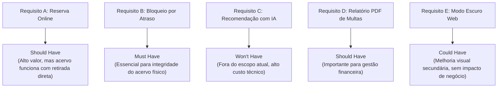

| Requisito Avaliado | Classificação MoSCoW | Justificativa Técnica Baseada nas Perguntas do Método |
| :--- | :--- | :--- |
| **B. Cálculo e bloqueio por atraso** | **Must have** | *O projeto funciona sem isso?* Não de forma sustentável. A ausência de bloqueio incentiva retenção indevida do patrimônio da faculdade. Não há atalho manual eficiente para balcões com centenas de empréstimos diários. |
| **D. Relatório em PDF de multas** | **Should have** | *O que acontece se finalizarmos sem isso?* A auditoria interna terá que consultar tabelas brutas ou planilhas auxiliares temporariamente. É crítico para a administração, mas não paralisa o balcão da biblioteca. |
| **A. Reserva online de títulos** | **Should have** | *Existe modo simples alternativo?* Sim, o aluno pode consultar o balcão presencialmente. A funcionalidade gera enorme valor operacional, mas o núcleo de empréstimos/devoluções continua funcional sem ela. |
| **E. Modo escuro no portal web** | **Could have** | *Seria legal ter?* Sim, melhora a satisfação e acessibilidade visual dos usuários. Contudo, seu impacto nos indicadores operacionais de empréstimo de livros é nulo; só deve ser executado se sobrar tempo da equipe. |
| **C. Recomendador com IA** | **Won't have** | *Evita o scope creep?* Sim. Integrar IA introduz dependências complexas de treinamento e nuvem. O comitê define que essa funcionalidade está explicitamente descartada do escopo atual desta entrega. |

---

## Erros comuns e boas práticas

### Erros Comuns no Projeto OO
- **Classes Genéricas Demais (*God Classes*):** Criar classes infladas como `GerenciadorGeral`, que concentram regras de validação, persistência e interface em um único arquivo, destruindo a coesão.
- **Classes Específicas Demais (Superfragmentação):** Dividir entidades em dezenas de microrclasses de um ou dois métodos sem justificativa de domínio, tornando o fluxo de código incompreensível.
- **Acoplamento Excessivo e Instanciação Direta:** Fazer com que classes de alto nível instanciem diretamente implementações concretas (`new RelatorioPDF()`) em vez de receber abstrações via injeção de dependência.
- **Ignorar Requisitos Não-Funcionais:** Modelar a arquitetura sem prever requisitos como volume de acessos concorrentes, tempo máximo de resposta, latência de rede e segurança de dados.
- **Não Validar com Protótipos de Baixa/Média Fidelidade:** Partir para a codificação de telas e bancos sem alinhar o modelo conceitual com os usuários finais, resultando em retrabalho severo.
- **Modelo de Domínio Anêmico:** Declarar todos os atributos como privados, mas gerar *getters* e *setters* indiscriminados para todos eles, retirando das classes a inteligência de validação de seus próprios dados.

### Boas Práticas de Engenharia
- **Aderência aos Princípios SOLID:** Seguir especialmente a responsabilidade única (SRP) e a inversão de dependências (DIP) em todas as camadas de negócio.
- **Documentação de Decisões Arquiteturais (ADRs):** Registrar formalmente as justificativas de escolha de bancos de dados, estilos arquiteturais e tecnologias adotadas.
- **Consistência Estrita entre Modelo e Código:** Atualizar os diagramas UML sempre que houver refatorações estruturais significativas no código-fonte Java.
- **Encapsulamento Defensivo:** Nunca expor referências internas mutáveis de listas e arrays; retornar coleções imutáveis ou cópias defensivas.
- **Priorização Ativa com MoSCoW:** Reunir periodicamente equipe técnica e clientes para reavaliar a matriz MoSCoW e cortar requisitos secundários que ameacem o cronograma de entrega.

---

## Links e materiais complementares

- **Engenharia de Software (Ian Sommerville):** Obra fundamental para a compreensão das etapas do ciclo de vida de software, especificação de requisitos e projetos arquiteturais.
- **Engenharia de Software: Uma Abordagem Profissional (Roger S. Pressman):** Referência completa sobre modelagem orientada a objetos, processos ágeis e garantia da qualidade de software.
- **Padrões de Projetos: Soluções Reutilizáveis de Software Orientado a Objetos (Erich Gamma, Richard Helm, Ralph Johnson, John Vlissides - GoF):** Catálogo definitivo dos 23 padrões clássicos de projeto (Strategy, Factory, Observer, Adapter, Facade).
- **Clean Architecture: O Guia do Artesão para Estrutura e Design de Software (Robert C. Martin):** Diretrizes para construir sistemas de alta coesão, desacoplados de frameworks e com dependências invertidas.
- **UML Distilled: A Brief Guide to the Standard Object Modeling Language (Martin Fowler):** Guia prático de referência rápida para elaboração eficiente de diagramas de classes, sequência e pacotes em projetos reais.

---

## Mapa da aula

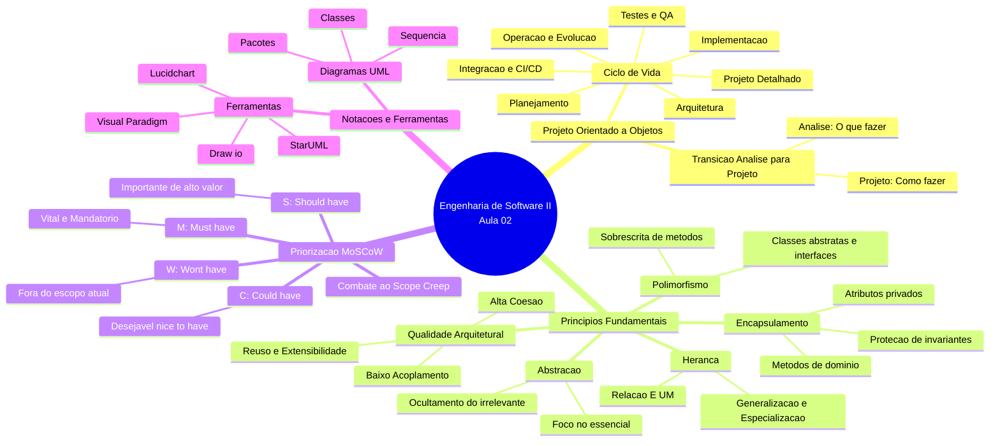

---

## Glossário

| Termo | Definição Técnica |
| :--- | :--- |
| **Abstração** | Capacidade de representar os aspectos essenciais de uma entidade do domínio, suprimindo detalhes operacionais irrelevantes para o contexto do sistema. |
| **Encapsulamento** | Ocultamento deliberado do estado interno de um objeto por meio de modificadores de acesso restritivos, condicionando alterações a métodos de negócio. |
| **Herança** | Mecanismo de modelagem estrutural que permite a uma subclasse reutilizar e estender atributos e métodos definidos em uma superclasse. |
| **Polimorfismo** | Capacidade de um mesmo método abstrato ou sobrescrito comportar-se de maneiras distintas em tempo de execução, de acordo com o tipo concreto do objeto receptor. |
| **Baixo Acoplamento** | Grau mínimo de interdependência e conhecimento mútuo entre diferentes classes, facilitado pela mediação por interfaces e injeção de dependências. |
| **Alta Coesão** | Concentração das responsabilidades de uma classe ou módulo em torno de um único propósito técnico ou funcional de negócio. |
| **Método MoSCoW** | Técnica analítica de priorização de requisitos em quatro categorias estritas (*Must*, *Should*, *Could*, *Won't*), utilizada no controle de escopo. |
| **Scope Creep** | Fenômeno indesejado caracterizado pelo crescimento descontrolado e desorganizado dos requisitos de um projeto durante seu ciclo de desenvolvimento. |
| **UML** | *Unified Modeling Language*; linguagem visual padronizada para modelagem, documentação e comunicação de especificações de sistemas orientados a objetos. |
| **Padrão de Projeto (*Design Pattern*)** | Solução arquitetural consagrada, genérica e reutilizável para problemas estruturais recorrentes em projetos de software orientados a objetos. |
| **Injeção de Dependência** | Técnica de desenvolvimento que consiste em fornecer as dependências de um objeto por meio de seu construtor ou método, em vez de deixar o objeto instanciá-las. |

---

## Pontos-chave para a prova

1. **Diferença conceitual entre Análise e Projeto:** A análise investiga o domínio do problema e define **o que** o software deve realizar (perspectiva de negócio); o projeto define **como** a solução será implementada tecnicamente por meio de classes, arquiteturas e tecnologias.
2. **Encapsulamento não se resume a Getters e Setters:** Criar métodos de acesso cegos para todos os atributos continua expondo a estrutura interna. O encapsulamento exige métodos semânticos de domínio que protejam as regras de integridade (*invariantes*) da classe.
3. **Identificação prática de Polimorfismo:** Identificar polimorfismo significa localizar classes abstratas ou interfaces com métodos sobrescritos (`@Override`) invocados genericamente por classes clientes sem a necessidade de comandos condicionais (`if/else` com `instanceof`).
4. **Baixo Acoplamento com Interfaces:** A estratégia de design para garantir baixo acoplamento exige que as classes dependam de contratos e interfaces abstratas (`IExportador`, `IRepositorio`), e nunca de classes de infraestrutura concretas.
5. **Critério decisório do MoSCoW:** Lembrar que funcionalidades classificadas como **Must have** são vitais para o funcionamento mínimo do sistema; se o sistema continuar executando sua função de negócio básica sem o recurso, ele pertence a **Should have** ou **Could have**. A categoria **Won't have** serve primariamente para prevenir o *Scope Creep*.
6. **Diagramas UML fundamentais do projeto:** O **Diagrama de Classes** mapeia a estrutura estática do código, enquanto o **Diagrama de Sequência** detalha a ordem temporal de troca de mensagens entre objetos durante a execução de um caso de uso.

---

## Perguntas e respostas (JSONL)

```jsonl
{"pergunta": "Qual a diferenca fundamental entre a fase de analise e a fase de projeto no desenvolvimento orientado a objetos?", "resposta": "A analise foca em compreender 'o que fazer' (requisitos e regras de negocio do dominio do problema), enquanto o projeto foca em 'como fazer' (estruturacao tecnica, arquitetura, classes e persistencia no dominio da solucao).", "dificuldade": "facil"}
{"pergunta": "Como o principio da abstracao auxilia o engenheiro de software na modelagem de sistemas complexos?", "resposta": "A abstracao permite focar unicamente nos aspectos e comportamentos essenciais de uma entidade para o contexto do sistema, descartando detalhes irrelevantes e reduzindo a carga cognitiva.", "dificuldade": "facil"}
{"pergunta": "Por que a mera criacao de metodos getters e setters para todos os atributos privados nao garante encapsulamento real?", "resposta": "Porque metodos setters sem validacao continuam permitindo que o estado interno do objeto seja corrompido arbitrariamente por agentes externos, mantendo a classe como um modelo anemico sem protecao de invariantes.", "dificuldade": "medio"}
{"pergunta": "Qual a principal vantagem do polimorfismo na manutencao de sistemas corporativos?", "resposta": "Permite que novas variantes de comportamento sejam introduzidas no sistema por meio de novas subclasses ou implementacoes sem a necessidade de alterar ou retestar as classes clientes consumidoras (Principio Aberto/Fechado).", "dificuldade": "medio"}
{"pergunta": "O que caracteriza uma classe com baixa coesao e qual o risco que ela traz ao projeto?", "resposta": "Uma classe com baixa coesao acumula responsabilidades desconexas (ex: regras de negocio, persistencia SQL e formatacao de tela), tornando-se uma God Class dificil de manter, testar e reutilizar.", "dificuldade": "medio"}
{"pergunta": "Como o uso de interfaces auxilia na conquista de um baixo acoplamento?", "resposta": "As interfaces estabelecem contratos abstratos entre componentes, garantindo que o consumidor conheca apenas as assinaturas dos metodos e nao os detalhes de implementacao concreta dos fornecedores.", "dificuldade": "medio"}
{"pergunta": "Qual e o objetivo central do metodo MoSCoW na gestao de requisitos de software?", "resposta": "Priorizar rigorosamente funcionalidades e entregas em quatro categorias de importancia (Must, Should, Could e Won't have), evitando o crescimento desordenado de escopo (scope creep).", "dificuldade": "facil"}
{"pergunta": "Quais perguntas tecnicas devem ser feitas para validar se um requisito pertence a categoria Must have no MoSCoW?", "resposta": "'O que acontece se finalizarmos sem isso?', 'O sistema funciona sem essa funcionalidade?' e 'Existe um atalho viavel sem isso?'. Se o sistema nao puder funcionar sem o item, ele e mandatorio (Must).", "dificuldade": "medio"}
{"pergunta": "Por que a categoria Won't have e tao importante em projetos de software com prazos apertados?", "resposta": "Porque ela registra formalmente itens que a equipe acordou deliberadamente deixar fora da entrega atual, protegendo os desenvolvedores contra solicitacoes imprevistas e desvios de cronograma.", "dificuldade": "facil"}
{"pergunta": "Cite os seis passos estruturantes do projeto orientado a objetos apresentados na disciplina.", "resposta": "1. Refinamento do Modelo de Analise; 2. Definicao da Arquitetura; 3. Modelagem de Classes; 4. Modelagem de Interacoes; 5. Definicao de Interfaces; 6. Aplicacao de Padroes de Projeto.", "dificuldade": "medio"}
{"pergunta": "O que difere os testes unitarios dos testes de integracao no ciclo de garantia da qualidade?", "resposta": "Testes unitarios validam o funcionamento de pequenas unidades isoladas de codigo (classes e metodos em memoria), enquanto testes de integracao validam a comunicacao real entre componentes e sistemas externos.", "dificuldade": "medio"}
{"pergunta": "Para que serve o Diagrama de Sequencia na UML e em qual momento do projeto ele se torna mandatorio?", "resposta": "Serve para detalhar visualmente a troca de mensagens ordenada no tempo entre objetos, tornando-se mandatorio na modelagem da dinamica de execucao de casos de uso complexos.", "dificuldade": "medio"}
{"pergunta": "Quais sao as principais diferencas praticas entre utilizar o Draw.io e o StarUML na modelagem de software?", "resposta": "O Draw.io e uma ferramenta de desenho livre sem validacao formal de regras UML, enquanto o StarUML e uma ferramenta baseada no metamodelo UML estrito, capaz de validar conexoes e suportar engenharia reversa de codigo.", "dificuldade": "dificil"}
{"pergunta": "O que e uma referencia mutavel vazada (escaping reference) e por que ela quebra o encapsulamento?", "resposta": "Ocorre quando um metodo 'get' retorna diretamente uma instancia interna de uma colecao mutavel (como List), permitindo que agentes externos alterem a lista sem passar pelos metodos de controle da classe dona.", "dificuldade": "dificil"}
{"pergunta": "Como a aplicacao incorreta do principio de heranca pode prejudicar a manutenibilidade do software?", "resposta": "O uso de heranca apenas para reuso superficial de metodos (violando a relacao conceitual 'E UM') gera acoplamento estrutural excessivo e pode quebrar o Principio da Substituicao de Liskov.", "dificuldade": "dificil"}
{"pergunta": "Em qual categoria MoSCoW deve ser classificada a funcionalidade 'Renovar emprestimo online' no sistema de biblioteca e por que?", "resposta": "Should have, pois agrega imenso valor aos usuarios e economiza tempo de balcao, mas sua ausencia pontual nao impede a operacao basica da biblioteca (que permite renovacao presencial).", "dificuldade": "medio"}
{"pergunta": "Como o conceito de Inversao de Dependencia se relaciona com o Baixo Acoplamento?", "resposta": "A Inversao de Dependencia estabelece que modulos de alto nivel nao devem depender de modulos de baixo nivel, mas sim de abstracoes; ao depender de abstracoes, o acoplamento entre os modulos cai ao nivel minimo.", "dificuldade": "dificil"}
{"pergunta": "Quais sao os tres tipos fundamentais de testes automatizados apresentados no ciclo de engenharia de software da aula?", "resposta": "Testes Unitarios, Testes de Integracao e Testes End-to-End (E2E).", "dificuldade": "facil"}
{"pergunta": "O que e um estilo arquitetural de Microsservicos e qual a sua diferenca estrutural em relacao a uma Arquitetura em Camadas monolitica?", "resposta": "Microsservicos decompõem a aplicacao em servicos autonomos que rodam em processos independentes comunicando-se por rede, enquanto a arquitetura em camadas tradicional reside comumente em um monólito compartilhado em memoria.", "dificuldade": "dificil"}
{"pergunta": "Explique por que um atributo com visibilidade 'protected' nao garante o mesmo nivel de encapsulamento que um atributo 'private'.", "resposta": "Porque atributos protegidos podem ser acessados e modificados diretamente por qualquer subclasse ou classe do mesmo pacote, quebrando o controle estrito de invariantes da classe original.", "dificuldade": "dificil"}
```

---

## Checklist de revisão

- [ ] Compreendo a distinção essencial entre o modelo de análise (requisitos / domínio do problema) e o modelo de projeto (solução técnica).
- [ ] Sei explicar como a abstração suprime detalhes irrelevantes e como o encapsulamento protege os invariantes de uma classe.
- [ ] Reconheço os perigos dos métodos *setters* indiscriminados e de modelos de domínio anêmicos.
- [ ] Sei implementar código Java com herança (`extends`) e polimorfismo através de métodos abstratos e sobrescrita (`@Override`).
- [ ] Entendo como o polimorfismo substitui favoravelmente estruturas condicionais complexas baseadas em `instanceof`.
- [ ] Compreendo o significado prático de Baixo Acoplamento e sei exemplificar seu uso através de interfaces (`interface`).
- [ ] Entendo o conceito de Alta Coesão e consigo identificar os problemas gerados por uma *God Class*.
- [ ] Conheço as quatro categorias do método MoSCoW (*Must*, *Should*, *Could*, *Won't*) e sei aplicar as perguntas de validação.
- [ ] Sei classificar requisitos do sistema de biblioteca nas faixas corretas do MoSCoW com fundamentação técnica.
- [ ] Conheço as seis etapas formais do projeto orientado a objetos e seus objetivos práticos.
- [ ] Sei diferenciar estilos arquiteturais como Camadas, MVC, Hexagonal, Clean Architecture e Microsserviços.
- [ ] Conheço a finalidade dos testes unitários, testes de integração e testes de ponta a ponta (*E2E*).
- [ ] Sei explicar a diferença de propósito entre o Diagrama de Classes e o Diagrama de Sequência na notação UML.
- [ ] Sei comparar as ferramentas de modelagem StarUML, Visual Paradigm, Draw.io e Lucidchart, indicando suas vantagens e limitações.
