# Engenharia de Software e Modelagem II: Técnicas de Elicitação e Levantamento de Requisitos

**Instituição:** Centro Universitário de Santa Fé do Sul (UniFEF)  
**Curso:** Bacharelado em Sistemas de Informação  
**Disciplina:** Engenharia de Software e Modelagem II  
**Docente:** Prof. Ms. Wesley Soares de Souza  
**Material Didático:** Caderno Temático e Guia Exaustivo de Engenharia de Requisitos  

---

## 1. Introdução e Objetivos de Aprendizagem

O desenvolvimento de software corporativo e orientado a missões críticas fracassa, na maioria das vezes, antes mesmo da escrita da primeira linha de código executável. Segundo consolidados relatórios da indústria (como os estudos de caso do Standish Group Chaos Report e as diretrizes do IEEE Computer Society), anomalias originadas na definição inicial do escopo custam até duzentas vezes mais para serem corrigidas nas fases de homologação ou produção do que durante a fase de concepção.

Este material foi construído para detalhar o conteúdo ministrado em aula pelo Prof. Ms. Wesley Soares de Souza, integrando os fundamentos teóricos clássicos aos métodos contemporâneos de engenharia de software e análise de sistemas. O domínio das técnicas de levantamento e elicitação capacita o analista a transitar entre a fala desestruturada do usuário, o problema real do negócio e a especificação técnica formal consumida pelos times de arquitetura, desenvolvimento e garantia de qualidade (QA).

### Objetivos Formais do Módulo
* Compreender a natureza do processo de elicitação de requisitos e sua posição no ciclo de vida de desenvolvimento de software (SDLC).
* Identificar, diferenciar e aplicar técnicas tradicionais e complementares de levantamento.
* Avaliar criticamente o contexto corporativo para selecionar a técnica com melhor custo-benefício e menor atrito comunicacional.
* Desenvolver a habilidade de formulação de perguntas investigativas para desmascarar necessidades ocultas.
* Diferenciar requisitos explícitos (declarados) de implícitos (tácitos) e funcionais de não funcionais.
* Reconhecer, mediar e documentar conflitos de interesses e ambiguidades operacionais entre diferentes stakeholders.
* Executar o pipeline sistemático que converte dados brutos coletados em requisitos documentáveis, rastreáveis e verificáveis.

---

## 2. Fundamentos da Elicitação de Requisitos

### 2.1 Conceito e Distinção entre Levantamento e Elicitação

Na literatura tradicional brasileira de Engenharia de Software, o termo "levantamento" é amplamente utilizado como sinônimo de "coleta". Contudo, sob a ótica analítica avançada do SWEBOK (Software Engineering Body of Knowledge), existe uma distinção epistemológica fundamental entre **levantar** e **elicitar**:

* **Levantamento (Gathering / Collection):** Pressupõe uma postura passiva do analista, na qual os requisitos já existem de forma clara, lapidada e pronta na mente do cliente, cabendo ao profissional apenas recolhê-los, como quem recolhe folhas caídas de uma árvore.
* **Elicitação (Elicitation):** Do latim *elicitare*, significa "fazer sair", "provocar", "trazer à luz", "extrair algo latente". Assume uma postura ativa, dialética e investigativa do analista. O cliente possui dores, objetivos financeiros, processos manuais, vícios operacionais e expectativas vagas, mas quase nunca requisitos de software estruturados. O papel do analista é explorar, questionar, correlacionar e construir a compreensão do domínio em conjunto com o cliente.

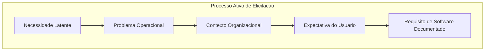

### 2.2 O Ciclo Causal: Necessidade, Problema, Contexto, Expectativa e Requisito

A transformação de uma queixa em um requisito de sistema obedece a uma cadeia causal estrita. O erro do desenvolvedor iniciante reside em saltar diretamente da primeira fala do usuário para a codificação de telas ou tabelas de banco de dados.

| Elo da Cadeia | Definição Teórica | Exemplo Prático de Negócio |
| :--- | :--- | :--- |
| **Necessidade** | Carência fundamental de sustentabilidade ou evolução do negócio. | Aumentar a taxa de sobrevivência financeira da empresa no comércio eletrônico. |
| **Problema** | Obstáculo factual que impede o atendimento da necessidade. | Alto índice de desistência no checkout e atraso manual no faturamento dos pedidos. |
| **Contexto** | Cenário ambiental, tecnológico, humano e regulatório onde o problema ocorre. | Operação física com equipe de 4 atendentes registrando vendas em blocos de papel e planilhas desconectadas. |
| **Expectativa** | A imagem mental que o stakeholder cria sobre a intervenção milagrosa do software. | "Quero que meu negócio melhore e eu veja os pedidos na hora pelo celular sem me preocupar." |
| **Requisito** | Especificação rigorosa, verificável, consistente e não ambígua do comportamento ou restrição do sistema. | O sistema deve processar o pedido e despachar o payload assíncrono para o gateway de pagamentos em até 2 segundos. |

### 2.3 As Seis Perguntas Cardinais da Elicitação

Diante de qualquer novo projeto, funcionalidade ou módulo, o analista deve responder exaustivamente a seis perguntas de orientação cardinal:

1. **Qual problema existe?**  
   Foco na dor raiz, e não no sintoma. Perder clientes é sintoma; a lentidão de 45 minutos para confirmar um pedido de delivery é a dor do processo; a falta de sincronismo de estoque é o problema sistêmico.
2. **Quem enfrenta o problema?**  
   Mapeamento de usuários primários (quem opera a interface), secundários (quem consome dados ou relatórios gerados) e terciários (reguladores fiscais, auditorias, clientes externos).
3. **Como ele é resolvido atualmente?**  
   O processo *As-Is* (como as coisas funcionam hoje). Raramente um software substitui o vácuo absoluto; ele costuma substituir cadernos, planilhas eletrônicas com macros frágeis, contatos via WhatsApp ou sistemas legados obsoletos.
4. **O que o sistema precisa fazer?**  
   O comportamento computacional esperado, as regras de negócio a aplicar, os cálculos a executar e as integrações externas a realizar.
5. **Quais são as restrições?**  
   Limites técnicos (linguagem legada, ausência de conectividade contínua), legais (LGPD, normas fiscais estaduais da SEFAZ), de tempo (prazo de entrega de 60 dias) e de orçamento.
6. **O que é prioridade?**  
   Definição daquilo que gera valor de sobrevivência imediato (MVP - Minimum Viable Product) versus o que é desejo secundário ou conveniência cosmética.

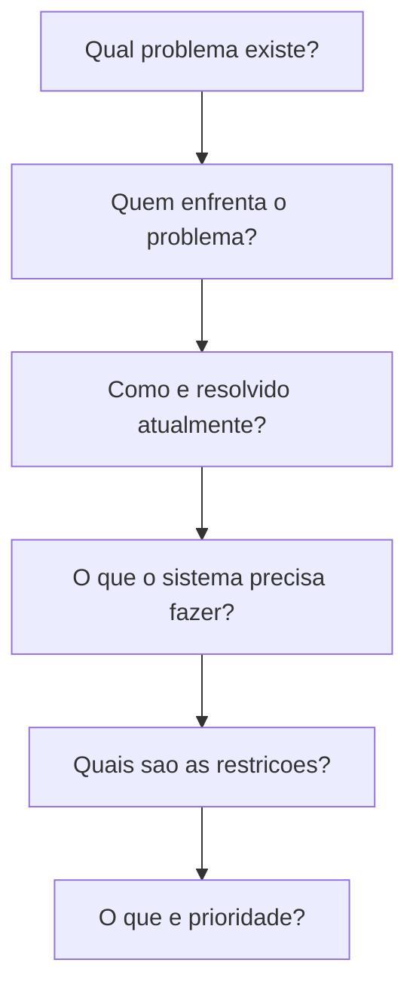

### 2.4 Análise Crítica da Premissa de Desenvolvimento Prematuro

Considere a seguinte provocação clássica apresentada nos slides da disciplina:

> *"Se um cliente disser: 'Preciso de um sistema para melhorar meu negócio', isso é suficiente para começar a desenvolver?"*

A resposta da Engenharia de Software é categoricamente **não**. Iniciar a modelagem ou codificação sob tal declaração representa negligência de engenharia por quatro razões determinantes:

* **Inexistência de Critério de Sucesso (Acceptance Criteria):** O que significa "melhorar"? Reduzir despesas em 10%? Aumentar as vendas diárias em 50 unidades? Reduzir o tempo de fila? Sem métricas, o projeto nunca terá término formal aceito pelo contratante.
* **Escopo Infinito (Scope Creep):** Como o escopo não tem fronteiras explícitas, toda e qualquer funcionalidade imaginada pelo cliente no decorrer dos meses subsequentes será alegada como parte do contrato de "melhorar meu negócio".
* **Assimetria de Conhecimento:** O cliente conhece o seu nicho comercial (varejo, padaria, oficina, advocacia), mas desconhece a viabilidade de banco de dados, concorrência de transações, segurança e integridade referencial. O desenvolvedor conhece a infraestrutura técnica, mas desconhece os termos e rotinas do negócio do cliente.
* **Risco de Automatização do Caos:** Informatizar um processo de trabalho desorganizado, redundante e com desperdícios resulta apenas em um processo caótico automatizado, que gera prejuízos em velocidade exponencial.

---

## 3. Investigação Analítica e Dificuldades na Elicitação

### 3.1 O Problema da Fala Incompleta: O Caso do Controle de Pedidos

Vejamos o exemplo paradigmático explorado em sala:
> **Cliente:** *"Quero um sistema para controlar meus pedidos."*

Um desenvolvedor inexperiente cria uma tabela `pedidos` com campos `id`, `data`, `valor` e um formulário CRUD simples com quatro botões. Ao implantar a solução na empresa, o sistema é rejeitado no primeiro dia de operação. O analista de sistemas sênior compreende que a palavra "controlar" esconde dezenas de ramificações estruturais que devem ser desdobradas:

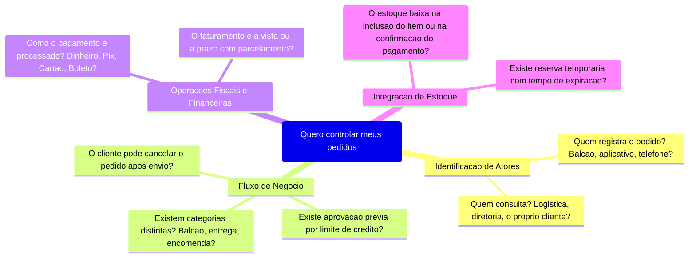

O analista deve atuar como um investigador obstinado, desdobrando cada declaração simplória em fluxos de exceção, validações matemáticas e regras de conformidade.

### 3.2 Taxonomia das Dificuldades no Levantamento

A literatura especializada agrupa as barreiras de levantamento em categorias fundamentais:

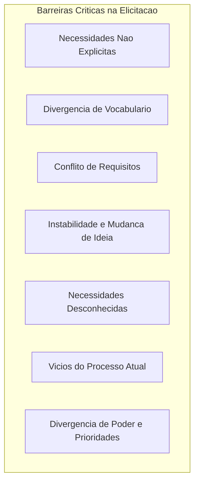

* **Necessidades não explícitas:** O conhecimento tácito. O usuário executa uma verificação manual diária há dez anos e assume que "qualquer pessoa com bom senso sabe que isso deve ser feito", esquecendo-se de comunicar esse passo ao analista.
* **Vocabulários dissonantes:** Em uma mesma distribuidora, o departamento de Vendas chama a transação de "Orçamento Aprovado", a Expedição chama de "Ordem de Coleta" e o Financeiro chama de "Título a Receber", embora todos estejam se referindo à mesma entidade conceitual subjacente.
* **Requisitos em conflito:** A área de Vendas exige que o cadastro de clientes tenha apenas o campo "Nome" e "Telefone" para agilizar o atendimento; a área Financeira e Fiscal exige CPF/CNPJ, Inscrição Estadual, Endereço de Cobrança e Consulta Serasa obrigatórios antes de autorizar qualquer venda.
* **Instabilidade volátil (O cliente muda de ideia):** Conforme o cliente visualiza a complexidade do projeto ou o mercado externo se altera, solicitações prévias tornam-se obsoletas durante o próprio ciclo de análise.
* **Problemas enraizados e escondidos:** Rotinas paralelas implementadas pelos operadores para contornar falhas de gestão da empresa que não constam em nenhum manual oficial de procedimentos.
* **Prioridades divergentes entre stakeholders:** O diretor deseja relatórios em tempo real com consolidação contábil; o operador de caixa deseja velocidade de digitação por atalhos no teclado sem uso de mouse.

### 3.3 A Armadilha da Ambiguidade: "O Sistema Precisa Ser Rápido"

Um dos maiores riscos na engenharia de requisitos é a aceitação de termos qualitativos e subjetivos. O slide 7 ilustra essa falha com maestria:
> *"O sistema precisa ser rápido. Mas o que significa rápido?"*

Termos como "rápido", "fácil de usar", "seguro", "robusto", "moderno" e "intuitivo" são **anti-requisitos** enquanto não forem traduzidos em métricas físicas observáveis e testáveis.

#### Desconstrução e Refatoração de Ambiguidade

| Expressão Ambígua do Usuário | Interpretação Errada do Dev | Refatoração Técnica da Engenharia de Requisitos (RNF Formal) |
| :--- | :--- | :--- |
| "O sistema precisa ser rápido." | Adicionar paginação e achar que está bom. | **RNF-012 (Desempenho):** O tempo de resposta para a consulta de pedidos filtrada por cliente deve ser inferior a 1,2 segundos para o percentil 95 (p95) sob uma carga simultânea de 200 requisições concorrentes. |
| "A interface deve ser simples e fácil." | Deixar a tela com fundo branco e poucos botões. | **RNF-015 (Usabilidade):** Um atendente recém-contratado deve ser capaz de concluir a emissão de um pedido padrão em no máximo 3 minutos, após receber um treinamento máximo de 30 minutos, com taxa de erro de preenchimento inferior a 2%. |
| "O sistema deve ser seguro." | Colocar uma senha comum no banco de dados. | **RNF-020 (Segurança):** O sistema deve exigir autenticação multifator (MFA) para perfis com permissão de aprovação de desconto e armazenar todas as credenciais de usuários utilizando a função criptográfica de derivação de chaves Argon2id com parâmetros de memória de 64MB. |

---

## 4. Técnicas Tradicionais de Elicitação

Não existe uma técnica superior a todas as outras em termos absolutos. A escolha depende da acessibilidade dos usuários, da cultura da empresa, da complexidade do domínio e da dispersão geográfica.

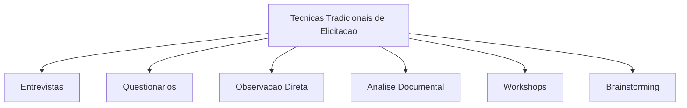

### 4.1 Entrevistas

A entrevista é a técnica mais comum e flexível da engenharia de requisitos, baseada na conversação formal ou informal entre o analista e os atores do processo.

#### Classificação Metodológica das Entrevistas
* **Estruturada:** O analista segue um questionário rígido e sequencial, pré-programado, sem se desviar do roteiro planejado.  
  *Vantagem:* Facilidade de comparar respostas entre múltiplos respondentes; padronização de dados estatísticos.  
  *Desvantagem:* Bloqueia a descoberta de problemas imprevistos; sensação mecânica para o entrevistado.
* **Semiestruturada (Recomendada):** O analista possui um guia de tópicos, metas claras e perguntas centrais elaboradas previamente, mas mantém plena autonomia para formular novas perguntas dependendo das revelações do entrevistado.  
  *Vantagem:* Equilíbrio perfeito entre foco técnico e flexibilidade investigativa.  
  *Desvantagem:* Demanda experiência sênior do analista para não perder o controle do tempo.
* **Não Estruturada:** Conversa inteiramente aberta e exploratória sobre o cotidiano da empresa, sem roteiro fixo.  
  *Vantagem:* Excelente nas fases preliminares de projetos em domínios completamente desconhecidos pelo analista.  
  *Desvantagem:* Dificuldade extrema de consolidar os dados coletados; risco de desvio para conversas improdutivas.

#### O Fluxo de Execução da Entrevista

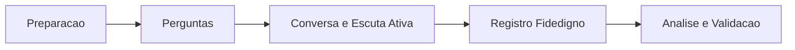

1. **Preparação:** Estudo prévio do modelo de negócio do cliente, glossário básico, identificação clara do cargo e atribuições do entrevistado.
2. **Perguntas:** Formulação balanceada entre perguntas abertas (para exploração) e fechadas (para confirmação de fatos).
3. **Conversa e Escuta Ativa:** Manter a postura de neutralidade, sem expressar julgamento ou criticar o método de trabalho atual do usuário; respeitar pausas.
4. **Registro:** Anotações estruturadas imediatas, gravações de áudio/vídeo (sempre mediante consentimento formal) e transcrições de termos centrais.
5. **Análise:** Síntese dos achados, identificação de regras de negócio latentes e devolução do resumo ao entrevistado para homologação e desempate de dúvidas.

#### A Arte de Formular Perguntas: Fechadas vs. Abertas Investigativas

A qualidade do requisito levantado é diretamente proporcional à profundidade da pergunta elaborada. O engenheiro de software deve evitar induzir respostas curtas e monosilábicas ("Sim/Não") quando seu objetivo é desvendar o processo:

| Pergunta Fraca / Fechada (Ruim) | Consequência Negativa | Pergunta Investigativa / Aberta (Eficaz) | Valor Extraído para a Engenharia |
| :--- | :--- | :--- | :--- |
| "Você quer um relatório?" | O cliente responde "Sim" por comodismo, e a equipe gasta 40 horas codificando um PDF que nunca será aberto. | "Quais informações você precisa consultar para tomar uma decisão diária sobre a compra de insumos?" | Revela os indicadores-chave de desempenho (KPIs), as regras de cálculo e as agregações de banco necessárias. |
| "O sistema deve permitir cancelar?" | O cliente responde "Com certeza", gerando cancelamentos indiscriminados no banco. | "Em quais situações um pedido pode ser cancelado, quem autoriza e o que acontece com os itens já faturados?" | Revela máquinas de estado, níveis de permissão (RBAC), operações estornadas e lançamentos contábeis compensatórios. |
| "O cadastro precisa ser seguro?" | Gera uma resposta redundante e óbvia: "Sim". | "Quem na sua equipe tem autorização para visualizar o saldo das contas e quem pode alterar o valor de tabela dos produtos?" | Mapeia matriz de controle de acesso, perfis e segregação de funções para auditoria. |

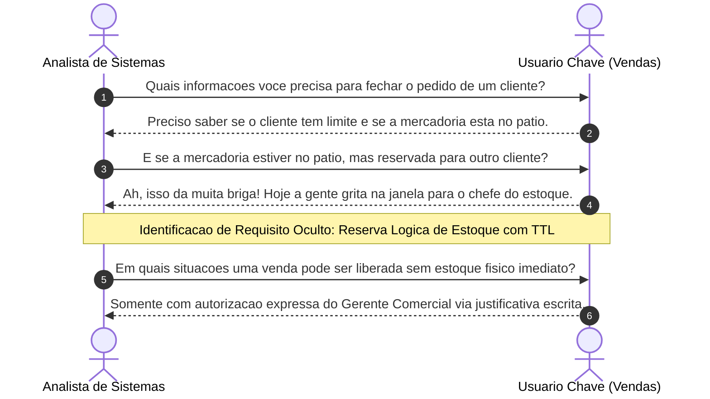

### 4.2 Questionários

O questionário consiste na aplicação de um conjunto de perguntas escritas a uma população de usuários, geralmente por meio digital.

* **Quando utilizar:** Populações massivas de usuários (ex.: 5.000 alunos de uma universidade ou 1.200 operadores de loja espalhados pelo país), dispersão geográfica ampla, necessidade de validação estatística de hipóteses levantadas em entrevistas.
* **Vantagens:** Baixo custo de aplicação por respondente, anonimato (favorece respostas honestas sobre falhas de processos internos), rapidez na tabulação.
* **Armadilhas e Desvantagens:** Taxa de retorno historicamente baixa (frequentemente inferior a 15%), impossibilidade de aprofundar respostas vagas, risco de interpretações distorcidas das perguntas pelos usuários sem possibilidade de esclarecimento em tempo real.

### 4.3 Observação Direta (Etnografia e Job Shadowing)

A observação consiste na imersão do analista no posto de trabalho do usuário para acompanhar a execução empírica de suas tarefas cotidianas. O analista atua como uma "sombra" (*job shadowing*), observando os fluxos reais de trabalho.

#### O que a Observação Revela que a Entrevista Esconde
1. **Atividades não documentadas:** Passos que o usuário realiza sem perceber, por automatismo motor e memória procedural de anos de trabalho.
2. **Atalhos e Gambiarras Operacionais:** Post-its colados na borda do monitor com códigos de tabelas auxiliares, senhas compartilhadas, ou o uso de planilhas Excel pessoais para somar valores antes de lançar no sistema oficial.
3. **Exceções reais:** Na entrevista, o gerente diz: *"Todos os clientes passam por consulta cadastral no Serasa"*. Na observação, o analista nota que o atendente não consulta o Serasa para clientes antigos da cidade porque *"o dono conhece a família deles há 30 anos"*.
4. **Retrabalho oculto:** A quantidade de vezes que o operador redigita o mesmo código em três telas diferentes devido à desintegração dos sistemas legados.
5. **Informações que o usuário considera óbvias:** Regras operacionais tão rotineiras para o negócio que o funcionário não julga necessário comentar na sala de reunião.

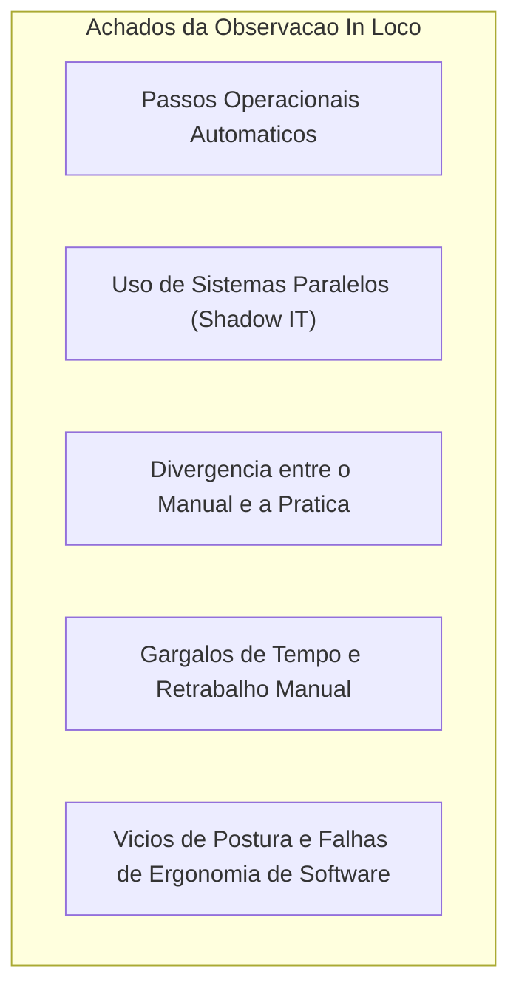

### 4.4 Análise Documental

A análise documental, ou arqueologia de software e processos, fundamenta-se no estudo minucioso de todo o acervo de artefatos existentes na organização antes de propor novos requisitos.

#### Fontes de Investigação Documental
* **Formulários em papel e notas fiscais manuais:** Indicam a taxonomia exata dos campos, tamanhos máximos de texto, formatos de datas e carimbos de validação obrigatória.
* **Planilhas eletrônicas (Excel, Google Sheets):** Verdadeiras "minas de ouro" de requisitos. Fórmulas embutidas em células representam **regras de negócio puras** que devem ser migradas para o motor de cálculo da aplicação.
* **Relatórios gerenciais existentes:** Mapeiam os agrupamentos, médias, totalizadores e filtros que a liderança realmente consome para a tomada de decisão.
* **Manuais e Procedimentos Operacionais Padrão (POPs):** Mapeiam a visão normativa da alta administração sobre como o processo *deveria* ser executado em conformidade ideal.
* **Contratos com fornecedores e clientes:** Impõem prazos legais de atendimento, penalidades financeiras, termos de garantia e conformidade com órgãos reguladores.
* **Esquemas de bancos de dados de sistemas legados:** Tabelas antigas, triggers, views e procedures que revelam regras de integridade física esquecidas até pelos desenvolvedores originais.

### 4.5 Workshops de Requisitos e JAD (Joint Application Development)

O workshop de requisitos reúne os principais stakeholders (diretores, gerentes, atendentes, desenvolvedores e especialistas de infraestrutura) em uma sessão intensiva de trabalho mediada por um facilitador neutro.

* **Objetivo:** Acelerar a definição do escopo, resolver impasses políticos entre departamentos rivais, unificar a visão do produto e atingir consenso em decisões estratégicas de alto impacto.
* **Dinâmica do JAD:** O analista atua não apenas como ouvinte, mas como mediador que expõe na parede as contradições entre os departamentos e os força a definirem um protocolo único para a organização antes do início da codificação.

### 4.6 Brainstorming Estruturado

Técnica de tempestade de ideias voltada para a concepção de produtos inovadores ou para o desenho de soluções onde não há paradigma prévio no mercado.

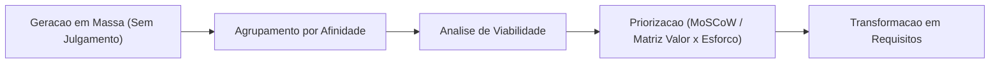

#### A Regra de Ouro do Brainstorming
Durante a fase de geração, **quantidade gera qualidade**. Todo julgamento, crítica, deboche ou análise prematura de viabilidade financeira/técnica deve ser expressamente proibida pelo facilitador. Uma ideia aparentemente absurda de um stakeholder pode conter a chave para a simplificação de um fluxo complexo. A filtragem analítica ocorre rigorosamente na fase de priorização.

---

## 5. Técnicas Complementares e Modernas

Complementando as abordagens clássicas, a engenharia de software contemporânea adotou métodos visuais, narrativos e baseados em eventos de domínio para aproximar desenvolvedores e usuários.

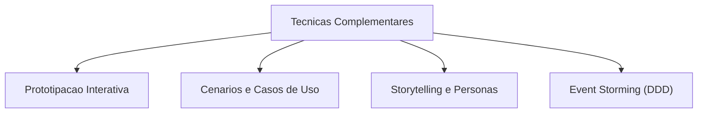

### 5.1 Prototipação como Ferramenta Investigativa

A prototipação não é mero design estético; é um instrumento de elicitação empírica de altíssima fidelidade. A cognição humana tem enorme dificuldade em processar abstrações verbais complexas, mas reage de forma imediata diante de estímulos visuais e táteis.

#### A Inversão Metodológica da Prototipação
* **Abordagem Tradicional Declarativa (Fraca):**  
  Analista: *"Como você gostaria que fosse a tela de cadastro e gestão de clientes?"*  
  Cliente: *"Quero uma tela bonita, moderna, intuitiva e com todos os campos."* (Resultado: valor analítico nulo).
* **Abordagem Investigativa Baseada em Protótipo (Eficaz):**  
  O analista projeta um wireframe simples e pede para o cliente tentar simular o lançamento de uma venda real:
  * *"Ao clicar neste botão 'Salvar', o que deveria acontecer se o CPF não estiver preenchido?"*
  * *"Olhando este resumo da venda, quais informações essenciais estão faltando aqui para você emitir a nota?"*
  * *"Quem na sua empresa teria acesso para clicar neste botão vermelho 'Estornar Pagamento'?"*
  * *"O que acontece quando este produto selecionado não possui saldo em estoque?"*

### 5.2 Ferramentas de Prototipação: Figma e Penpot

Os slides 16 e 17 apresentam as duas ferramentas líderes de prototipação colaborativa na indústria de tecnologia:

| Característica / Critério | Figma | Penpot |
| :--- | :--- | :--- |
| **Licenciamento** | Proprietário (Cloud SaaS comercial). | Código Aberto (*Open Source*), livre de vendor lock-in. |
| **Hospedagem** | Nuvem da Adobe/Figma exclusiva. | Auto-hospedável (Docker *on-premise*) ou nuvem oficial. |
| **Padrões de Saída** | Estruturas proprietárias e renderização Canvas. | Padrões abertos da web nativos: SVG real e CSS moderno. |
| **Colaboração em Tempo Real** | Sim, pioneiro absoluto com múltiplos cursores. | Sim, suporte colaborativo completo via navegador. |
| **Integração Acadêmica/Equipe**| Excelente para compartilhamento rápido via links. | Excelente para soberania de dados e privacidade corporativa. |
| **Capacidades Centrais** | Wireframes, Design Systems, Protótipos navegáveis com lógica de variáveis e componentes auto-layout. | Telas responsivas, prototipação interativa com flexbox, compatível com padrões web universais. |

### 5.3 Cenários, Histórias de Usuário e Storytelling

O ser humano comunica suas necessidades primordiais por meio de narrativas. O analista deve explorar cenários concretos do cotidiano em vez de definições isoladas.

* **Cenário de Sucesso (Happy Path):** Descreve o encadeamento das ações quando todas as pré-condições são atendidas e nenhuma falha ocorre.
* **Cenários de Exceção (Corner Cases):** O comportamento exigido do software quando ocorrem falhas de comunicação, tentativas de fraude, queda de energia local ou falta de saldo financeiro.
* **Histórias de Usuário (User Stories):** Formalização no formato ágil:  
  *Como [Papel do Ator]*  
  *Eu quero [Ação ou Comportamento]*  
  *Para que [Benefício Mensurável de Negócio]*

### 5.4 Event Storming

*(Nota: Tópico complementar à literatura de Engenharia de Software e Domain-Driven Design de Alberto Brandolini).*  
Técnica colaborativa de modelagem rápida onde analistas, desenvolvedores e especialistas do negócio colam post-its coloridos em uma parede infinita (física ou virtual no Miro/Mural), modelando o fluxo de negócio exclusivamente a partir de fatos ocorridos no passado do domínio (**Domain Events** escritos no particípio passado).

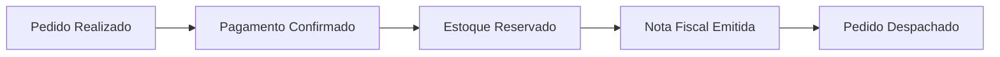

---

## 6. Da Informação Bruta ao Requisito de Engenharia

O núcleo técnico da aula reside na conversão disciplinada daquilo que foi ouvido em um artefato que a engenharia de software possa codificar, testar e homologar sem dubiedade.

### 6.1 O Pipeline de Refinamento de Requisitos

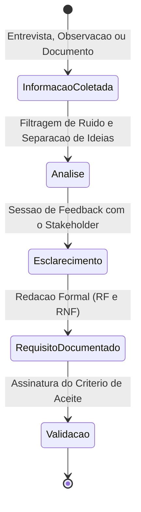

1. **Informação Coletada:** O dado bruto, subjetivo, eivado de jargões pessoais, emoções e impressões do cliente.
2. **Análise:** O analista remove o ruído, isola os atores reais, identifica entidades de banco e detecta contradições lógicas.
3. **Esclarecimento:** O analista retorna ao cliente para resolver lacunas: *"Quando você disse X, significa a regra A ou a regra B?"*.
4. **Requisito:** A redação estruturada de um requisito de engenharia acompanhado de identificador único, descrição normativa e critérios de aceite.
5. **Validação:** Homologação formal com o cliente, garantindo que o requisito especificado resolve de fato a necessidade original sem distorção.

### 6.2 Desconstrução e Engenharia Reversa do Caso dos Slides

No slide 18, o Prof. Wesley apresenta uma das mais importantes transformações do curso:

> **Stakeholder:** *"Quando eu receber um pedido, quero saber imediatamente."*

O termo "saber imediatamente" é uma fala humana natural, mas um péssimo requisito de software. Essa frase contém, ao mesmo tempo, um **comportamento funcional** e uma **restrição de desempenho não funcional**.

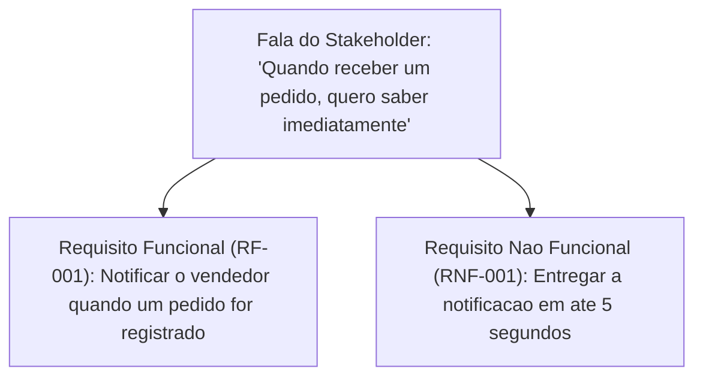

#### Requisito Funcional Derivado
* **Identificador:** `RF-001`
* **Nome:** Notificação de Novo Pedido em Tempo Real.
* **Descrição Normativa:** O sistema deve enviar uma notificação visual e sonora para o painel de atendimento do vendedor responsável assim que uma nova ordem de compra atingir o estado de `Registrado`.
* **Prioridade:** Essencial (Must Have).
* **Entradas de Dados:** `pedido_id`, `valor_total`, `cliente_nome`, `timestamp_criacao`.
* **Atores Envolvidos:** Atendente / Vendedor do Balcão.

#### Requisito Não Funcional Derivado
* **Identificador:** `RNF-001`
* **Categoria:** Desempenho e Eficiência (Performance).
* **Descrição Normativa:** A notificação de novo pedido deve ser disponibilizada na interface gráfica do vendedor em até 5 segundos após a persistência transacional bem-sucedida do registro no banco de dados.
* **Métrica de Verificação:** Aferição via monitoramento de latência em fila de mensageria assíncrona (percentil p99 em testes de carga de estresse).

### 6.3 Especificação de Critérios de Aceite em Formato BDD (Behavior-Driven Development)

Para eliminar qualquer margem de interpretação errônea pela equipe de programação e pelo time de testes, os requisitos elicados devem ser formalizados em linguagem Gherkin:

```gherkin
Funcionalidade: Notificacao Imediata de Pedidos Registrados
  Como um vendedor da operacao de balcao
  Eu quero receber um aviso visual e sonoro em tempo real
  Para que eu possa iniciar a separacao dos itens sem atrasar a entrega ao cliente

  Cenario: Notificacao entregue com sucesso dentro do limite aceitavel de tempo
    Dado que o vendedor "Carlos" esta autenticado e com o painel aberto no navegador
    Quando um cliente finalizar um pedido com valor de R$ 150,00 no sistema
    Entao o painel do vendedor deve exibir um alerta com o identificador do pedido
    E emitir um aviso sonoro caracteristico
    E o tempo transcorrido entre a gravacao do pedido e a exibicao do alerta deve ser inferior a 5 segundos

  Cenario: Vendedor ausente ou sem conexao ativa de rede
    Dado que o vendedor "Carlos" perdeu a conexao com a internet ha 2 minutos
    Quando um cliente finalizar um pedido destinado a regiao de atendimento do "Carlos"
    Entao a mensagem deve ser enfileirada no broker de mensageria
    E assim que a conexao for restabelecida, a notificacao pendente deve ser exibida imediatamente
```

### 6.4 Implementação Arquitetural de Referência: Event-Driven Push

Para atender ao binômio funcional/não funcional elicitado, o engenheiro de software arquiteta uma solução desacoplada baseada em WebSockets e eventos, ao invés de adotar abordagens ingênuas como polling HTTP repetitivo no banco de dados.

Exemplo de serviço produtor em Python simulando o pipeline do requisito:

```python
import time
import json
from dataclasses import dataclass, asdict

@dataclass
class Pedido:
    id: str
    cliente: str
    valor_total: float
    criado_em: float

class ServicoPedidos:
    def __init__(self, mensageria_broker):
        self.broker = mensageria_broker

    def registrar_novo_pedido(self, cliente: str, valor: float) -> Pedido:
        # Atendimento do Requisito Funcional: Registrar o pedido
        timestamp = time.time()
        pedido = Pedido(
            id=f"PED-{int(timestamp)}",
            cliente=cliente,
            valor_total=valor,
            criado_em=timestamp
        )
        self._salvar_no_banco(pedido)
        
        # Disparo para o Broker para atender o RNF de entrega em <= 5s
        payload = json.dumps(asdict(pedido))
        self.broker.publicar(topico="pedidos.novos", mensagem=payload)
        return pedido

    def _salvar_no_banco(self, pedido: Pedido) -> None:
        # Simula persistencia transacional com ACID garantido
        pass
```

Consumidor em TypeScript que monitora o cumprimento do SLA do RNF:

```typescript
interface NotificacaoPedido {
  id: string;
  cliente: string;
  valor_total: number;
  criado_em: number; // Timestamp em segundos
}

class MonitorDeAtendimentoVendedor {
  public receberNotificacaoViaWebSocket(dadosRaw: string): void {
    const agora = Date.now() / 1000;
    const pedido: NotificacaoPedido = JSON.parse(dadosRaw);
    
    const latencia = agora - pedido.criado_em;
    
    // Verificacao automatizada de conformidade com o RNF-001 (<= 5.0 segundos)
    if (latencia > 5.0) {
      console.warn(`[ALERTA DE SLA] RNF-001 violado! Latencia de entrega: ${latencia.toFixed(2)}s`);
    } else {
      console.info(`[SLA CONFORME] Pedido ${pedido.id} entregue ao vendedor em ${latencia.toFixed(2)}s`);
    }
    
    this.renderizarPopupNaTela(pedido);
    this.executarSinalSonoro();
  }

  private renderizarPopupNaTela(pedido: NotificacaoPedido): void {
    // Atualiza a arvore DOM da interface grafica do usuario
  }

  private executarSinalSonoro(): void {
    // Emite o alerta audivel no terminal do vendedor
  }
}
```

---

## 7. Modelagem Estrutural do Domínio de Pedidos

A partir do momento em que a pergunta *"Quero um sistema para controlar meus pedidos"* é explorada com todas as perguntas da elicitação, o analista formaliza os modelos técnicos conceituais de suporte.

### 7.1 Diagrama de Classes de Domínio (UML)

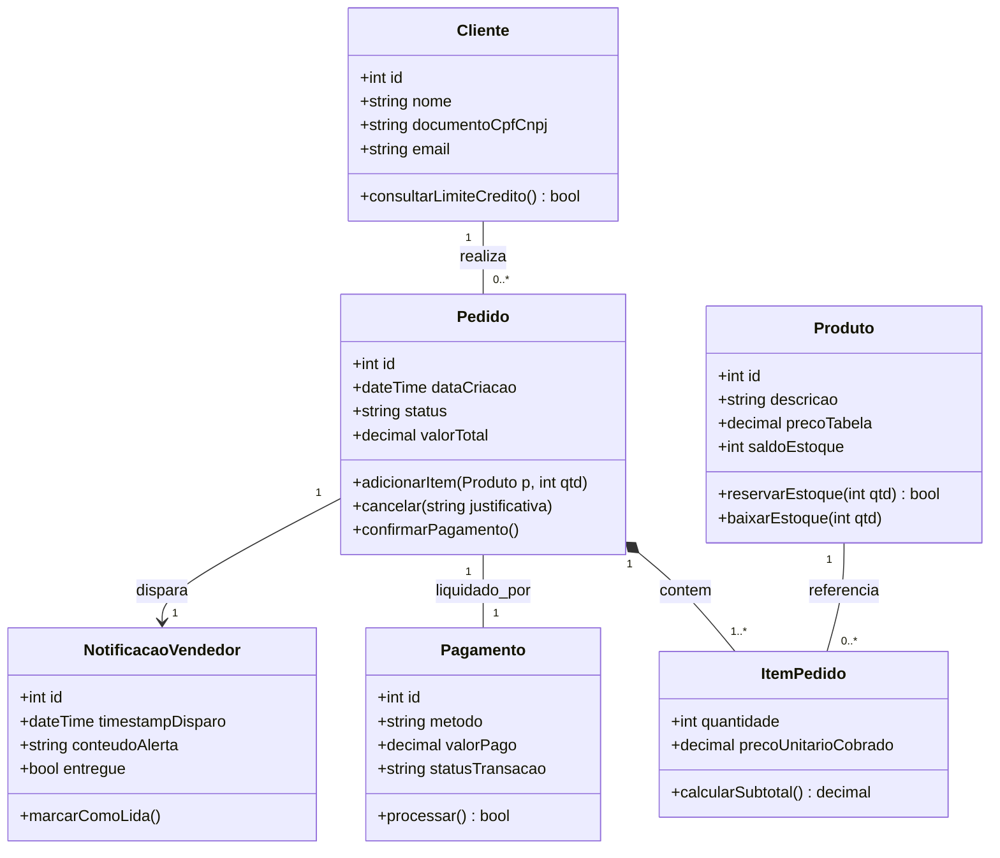

### 7.2 Diagrama Entidade-Relacionamento do Banco de Dados (DER)

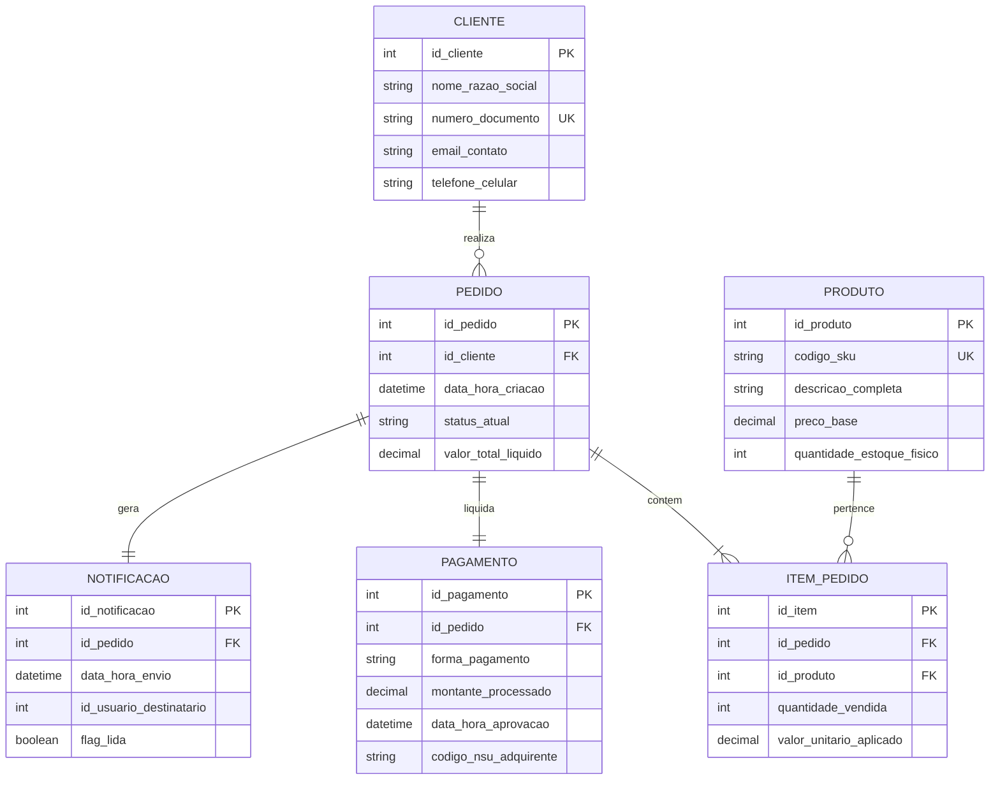

### 7.3 Máquina de Estados do Ciclo de Vida do Pedido

A pergunta de elicitação *"Em quais situações um pedido pode ser cancelado?"* resulta no rigor formal da transição de estados:

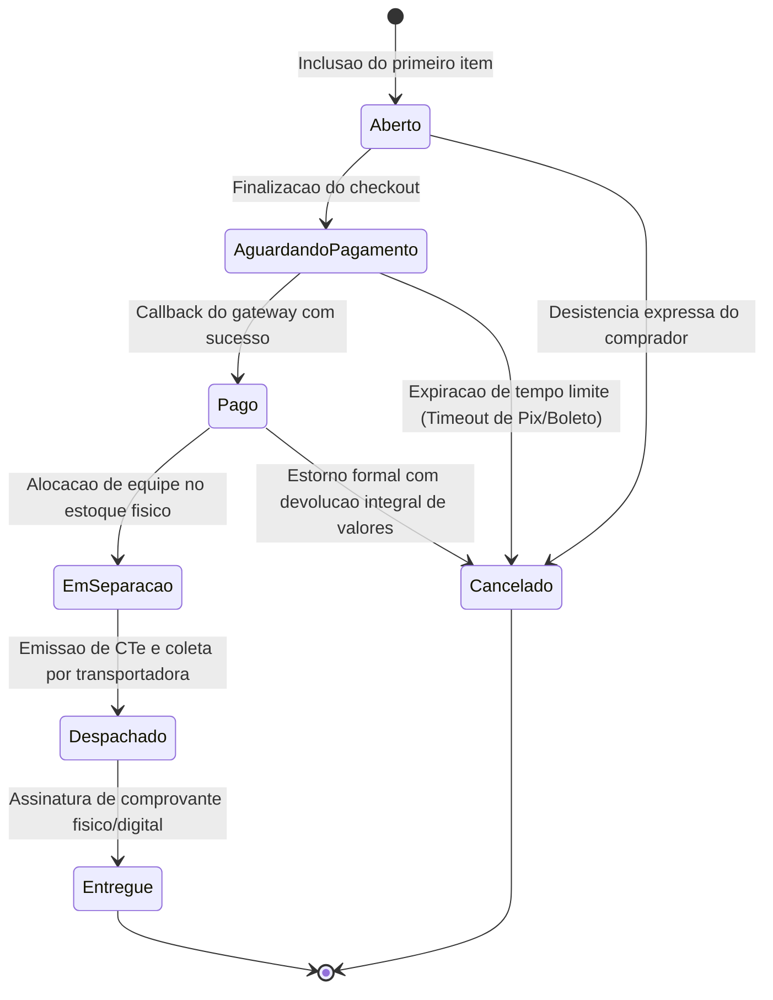

### 7.4 Diagrama de Sequência do Processamento com Notificação

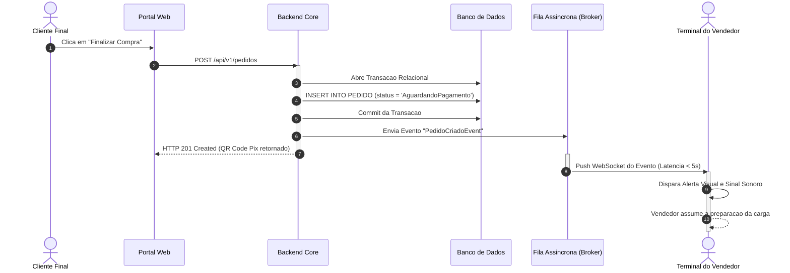

---

## 8. Matriz Comparativa para Seleção de Técnicas de Elicitação

Diante do princípio formal de que **não existe uma técnica universalmente melhor**, o analista deve selecionar a abordagem metodológica com base nas variáveis do projeto:

| Cenário de Negócio e Contexto do Projeto | Técnica Primária | Técnica Secundária | Justificativa de Engenharia |
| :--- | :--- | :--- | :--- |
| Domínio novo, sem processos informatizados, usuários analógicos. | Observação Direta | Entrevista Semiestruturada | Os usuários não sabem explicar fluxos técnicos; observar a prática diária expõe a realidade sem distorção retórica. |
| Substituição de sistema legado desktop com 15 anos de uso contínuo. | Análise Documental / Arqueologia | Entrevista com Operadores-Chave | A documentação original foi perdida; o código-fonte e as tabelas SQL legadas guardam as regras verdadeiras de cálculo. |
| Módulos de checkout, cadastro ou área de autoatendimento ao consumidor. | Prototipação Rápida (Figma/Penpot) | Cenários e Testes A/B | O valor central é a experiência do usuário (UX); o cliente só valida o requisito ao interagir fisicamente com os elementos. |
| Departamentos internos com conflitos e prioridades antagônicas. | Workshop / JAD | Brainstorming Estruturado | O obstáculo não é técnico, mas político; sentar os diretores na mesma sala força a definição de consenso homologado. |
| Validação de aderência de produto de consumo em massa (>1.000 usuários). | Questionários Estruturados | Entrevistas em Profundidade com Grupo Amostral | Garante significância estatística com baixo orçamento e sem consumo proibitivo de horas-homem da consultoria. |
| Descoberta rápida de modelo de domínio em arquiteturas orientadas a eventos. | Event Storming | Diagramação de Casos de Uso | Mapeia todo o ciclo de vida do negócio a partir de fatos concretos antes de decidir estruturas de tabelas ou serviços. |

---

## 9. Antipatterns e Armadilhas Clássicas na Elicitação

Ao longo do ciclo de análise de requisitos, existem armadilhas metodológicas recorrentes que comprometem a viabilidade do projeto:

### 1. Antipattern do Efeito "Telefone Sem Fio" (Ouvir Apenas a Diretoria)
* **Definição:** Realizar o levantamento de requisitos exclusivamente com os diretores e proprietários da empresa, sem jamais sentar ao lado dos operadores, caixas e estoquistas que utilizam a interface no dia a dia.
* **Consequência:** A diretoria descreve o processo dos sonhos (como gostaria que funcionasse no mundo ideal), enquanto o sistema real necessita atender às exceções do mundo prático. O sistema é homologado pela gestão, mas sabotado na base pela inviabilidade de uso.
* **Mitigação:** Promover a técnica da triangulação: entrevistar o executivo (estratégico), o gerente (tático) e observar o operador de ponta (operacional).

### 2. Antipattern da "Síndrome do Requisito Dourado" (Gold Plating)
* **Definição:** O desenvolvedor ou o analista adiciona funcionalidades complexas, animações sofisticadas e tecnologias de inteligência artificial que ninguém solicitou, pelo simples prazer técnico de construir um software elegante.
* **Consequência:** Desperdício de horas de projeto, aumento exponencial da superfície de bugs e encarecimento injustificável do orçamento do cliente.
* **Mitigação:** Toda e qualquer linha de código deve possuir rastreabilidade unívoca associada a um Requisito Funcional, Não Funcional ou Regra de Negócio aprovada.

### 3. Antipattern da "Aceitação Cega de Soluções Prontas"
* **Definição:** O cliente chega dizendo: *"Preciso que vocês façam um botão azul na tela que gere uma planilha Excel compactada com senha para mandar por e-mail"*.
* **Consequência:** O analista atende cegamente à especificação da ferramenta, sem perguntar *por que* o cliente necessita daquilo. Mais tarde, descobre-se que a planilha era gerada apenas para que outro funcionário lesse dois números e os digitasse em outro programa.
* **Mitigação:** Aplicar rigorosamente a técnica dos "5 Porquês". Desmontar a solução tecnológica imposta pelo usuário para enxergar o problema de negócio subjacente.

### 4. Antipattern do "Requisito Fantasma" (Omissão de RNF)
* **Definição:** Coletar com perfeição todas as ações funcionais de telas e cadastros, mas ignorar completamente a segurança da informação, picos de acessos concorrentes, retenção de backups, tempo de resposta e conformidade legal.
* **Consequência:** O sistema funciona perfeitamente nos testes unitários com cinco registros de teste na máquina do desenvolvedor, mas entra em colapso total (crash) na primeira Black Friday com mil conexões simultâneas.
* **Mitigação:** Utilizar checklists formais de requisitos não funcionais baseados na norma ISO/IEC 25010 (Qualidade de Produto de Software).

---

## 10. Guia Metodológico da Atividade Prática em Sala de Aula

Os slides 20 e 21 estabelecem uma atividade dinâmica de simulação em sala, essencial para o desenvolvimento prático das competências de engenharia de software dos alunos da UniFEF.

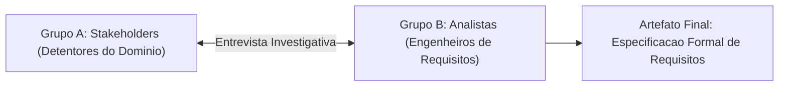

### Protocolo de Execução da Dinâmica

#### Instruções Específicas para o Grupo A (Stakeholders)
1. **Postura Realista:** Vocês receberão o briefing de uma empresa real (ex.: distribuidora atacadista com problemas de logística, ou uma clínica médica com agendas desintegradas).
2. **Lei da Retenção Passiva:** Não entreguem os requisitos espontaneamente. Se o analista perguntar: *"O que você quer que o sistema faça?"*, respondam apenas generalidades vagas: *"Quero que resolva meus problemas e melhore o atendimento"*.
3. **Uso de Jargões Internos:** Usem os termos informais da empresa. Falem sobre a "ficha amarela", o "caderno de fiado", o "grito na porta do estoque".
4. **Respostas sob Demanda:** Respondam com profundidade apenas se o analista do Grupo B souber formular a pergunta correta, demonstrando interesse investigativo. Se eles fizerem perguntas fechadas ("Quer relatório?"), limitem-se a responder "Sim".

#### Roteiro Obrigatório de Coleta para o Grupo B (Analistas)
O Grupo B deve atuar como uma consultoria profissional de engenharia de requisitos, utilizando cadernos ou computadores para cobrir uma matriz de descoberta em oito dimensões:

1. **O Problema Raiz:** Descobrir qual o gargalo financeiro ou operacional que motivou a contratação.
2. **Mapeamento de Usuários:** Listar nominalmente os papéis envolvidos (quem opera, quem audita, quem consulta).
3. **O Processo Real (As-Is):** Mapear o passo a passo de como as tarefas são executadas hoje, incluindo o tempo de cada etapa.
4. **Necessidades e Dores:** Onde ocorrem os erros manuais? Onde há prejuízo financeiro ou perda de tempo?
5. **Funcionalidades Críticas:** O que o software deverá executar obrigatoriamente para viabilizar o negócio (RFs).
6. **Regras de Negócio e Políticas:** Descontos máximos permitidos, validações de crédito, condições contratuais irrevogáveis.
7. **Tratamento de Exceções:** O que fazer quando a internet cair? O que fazer se o cliente devolver o produto avariado? O que fazer se o item não existir no estoque?
8. **Restrições e Requisitos Não Funcionais:** Dispositivos onde o sistema rodará (celular, leitor de código de barras, desktop), tempo aceitável de espera em tela, e leis aplicáveis (LGPD/fiscais).

---

## 11. Questões de Fixação e Exercícios Resolvidos

### Exercício 1: Refatoração de Requisito Vago em Especificação BDD
**Enunciado:**  
Durante uma entrevista de levantamento de requisitos para um sistema de gestão de clínicas odontológicas, o cirurgião-dentista afirmou:  
*"Eu quero que o sistema me avise quando o paciente desmarcar a consulta em cima da hora para que eu não fique à toa na clínica."*  

**Tarefa de Engenharia:**
1. Desdobre essa declaração em 1 Requisito Funcional formal (RF).
2. Desdobre essa declaração em 1 Requisito Não Funcional formal (RNF) com métricas numéricas.
3. Identifique pelo menos 2 Regras de Negócio (RN) que precisam ser esclarecidas com o profissional.
4. Escreva o critério de aceite no padrão Gherkin.

#### Resolução do Exercício 1

* **RF-021 (Notificação de Cancelamento):** O sistema deve emitir um alerta push imediato no dispositivo móvel do profissional de saúde e sinalizar visualmente a grade de agendamentos sempre que uma consulta for cancelada.
* **RNF-008 (Latência do Alerta):** A notificação de cancelamento de consulta deve ser disparada e entregue ao dispositivo cadastrado do dentista em no máximo 10 segundos a contar da confirmação do cancelamento pelo paciente.
* **Regras de Negócio Identificadas para Esclarecimento:**
  * **RN-01:** O que define matematicamente o conceito de "em cima da hora"? (Cancelamentos com menos de 2 horas de antecedência? Menos de 24 horas?).
  * **RN-02:** Cancelamentos fora do horário de expediente da clínica devem despertar notificações push sonoras ou permanecer silenciosos até as 07:00 do dia seguinte?
* **Critério de Aceite (Gherkin):**

```gherkin
Funcionalidade: Alerta de Cancelamento Tardio de Consulta
  Cenario: Cancelamento executado dentro da janela de antecedencia critica
    Dado que o paciente "Lucas" possui uma consulta agendada com o "Dr. Eduardo" para as 15:00
    E o horario atual do sistema e 13:45 (antecedencia inferior a 2 horas)
    Quando o paciente confirmar o cancelamento atraves do aplicativo do paciente
    Entao a vaga das 15:00 na agenda do "Dr. Eduardo" deve mudar o status para "Disponivel"
    E uma notificacao push com o texto "Consulta das 15:00 cancelada por Lucas" deve ser recebida no celular do dentista em ate 10 segundos
    E o sistema deve sugerir automaticamente o primeiro paciente da fila de espera compativel
```

---

### Exercício 2: Engenharia Reversa de Regras de Negócio a partir de Planilha
**Enunciado:**  
Em uma revenda de materiais de construção, o analista realizou a análise documental e encontrou a seguinte fórmula em uma célula do Excel responsável por calcular o valor do frete de entrega:

```excel
=SE(E(ValorTotalVenda > 500; DistanciaKM <= 15); 0; SE(DistanciaKM <= 15; 35; 35 + ((DistanciaKM - 15) * 2,5)))
```

**Tarefa de Engenharia:**  
Transcreva essa fórmula em regras de negócio declarativas estruturadas para compor o Documento de Requisitos de Software (SRS) e implemente o algoritmo equivalente em linguagem estruturada.

#### Resolução do Exercício 2

**Regras de Negócio Extraídas:**
* **RN-FRETE-001 (Isenção de Frete):** O frete será totalmente gratuito (valor igual a R$ 0,00) exclusivamente se o valor total líquido da compra for estritamente superior a R$ 500,00 e a distância de entrega for menor ou igual a 15 quilômetros em relação ao centro de distribuição.
* **RN-FRETE-002 (Tarifa Base):** Para qualquer entrega dentro do raio de 15 quilômetros cujo valor da compra seja menor ou igual a R$ 500,00, será cobrada uma taxa fixa compulsória de frete no valor de R$ 35,00.
* **RN-FRETE-003 (Excedente Quilométrico):** Para entregas com distância superior a 15 quilômetros, independentemente do valor da compra realizada, o frete será composto pela taxa fixa de R$ 35,00 acrescida do valor de R$ 2,50 por cada quilômetro que exceder a marca de 15 quilômetros.

Código de referência em Python para compor o motor de cálculo da aplicação:

```python
from decimal import Decimal

def calcular_valor_frete(valor_total_venda: Decimal, distancia_km: float) -> Decimal:
    """
    Calcula o valor do frete em conformidade com as regras de negocio:
    RN-FRETE-001, RN-FRETE-002 e RN-FRETE-003 extraidas via Analise Documental.
    """
    limite_raio_base_km = 15.0
    taxa_fixa_base = Decimal("35.00")
    tarifa_km_excedente = Decimal("2.50")
    valor_minimo_isencao = Decimal("500.00")

    if distancia_km <= limite_raio_base_km:
        if valor_total_venda > valor_minimo_isencao:
            return Decimal("0.00")  # Isencao garantida por RN-FRETE-001
        return taxa_fixa_base       # Tarifa base de raio curto por RN-FRETE-002
    
    # Calculo de raio excedente por RN-FRETE-003
    quilometros_adicionais = Decimal(str(distancia_km - limite_raio_base_km))
    valor_adicional = quilometros_adicionais * tarifa_km_excedente
    return taxa_fixa_base + valor_adicional
```

---

### Exercício 3: Mediação de Conflito de Requisitos em Workshop
**Enunciado:**  
Durante a realização de um workshop de elicitação para um novo sistema de logística integrada, ocorreu um impasse acalorado entre dois departamentos-chave:
* **Departamento Comercial:** *"Queremos que o motorista de entrega possa alterar o endereço de destino no aplicativo no meio da rota, caso o cliente nos ligue avisando que mudou de ideia e quer receber no trabalho."*
* **Departamento de Riscos e Seguros:** *"É absolutamente proibido alterar rotas em andamento. O caminhão transporta cargas de alto valor e a apólice da seguradora cancela a indenização em caso de roubo caso o veículo saia do perímetro traçado previamente no plano de gerenciamento de risco (PGR)."*

Como engenheiro de software e mediador técnico da reunião, proponha uma solução de engenharia de requisitos que resolva o conflito sem violar as restrições da organização.

#### Resolução do Exercício 3

**Diagnóstico do Conflito:** O Comercial visa a flexibilidade e a satisfação do cliente final, enquanto o departamento de Riscos visa a conformidade legal e a proteção patrimonial intransigente da empresa. A solicitação do Comercial não pode ser atendida de forma irrestrita sob pena de inviabilizar a cobertura securitária da empresa.

**Solução Estruturada de Engenharia:**
1. Cria-se o **RF-080 (Solicitação de Alteração de Rota em Trânsito):** O aplicativo do motorista não permite edição local de rotas. A alteração de endereço deve ser solicitada pelo cliente ao suporte central da empresa.
2. Cria-se o **RF-081 (Worklow de Homologação de Risco):** O novo endereço passa por uma validação automática via API junto ao WebService da gerenciadora de risco e seguradora.
3. Cria-se a **RN-LOG-015 (Trava de Segurança):** Se a gerenciadora de risco aprovar o novo trajeto, uma autorização eletrônica com assinatura digital é despachada para o sistema de bordo do caminhão e para a seguradora, recalculando o trajeto dinamicamente. Caso contrário, a alteração é bloqueada e a carga retorna obrigatoriamente à base operacional central para nova expedição formal.
4. **Resultado:** Concilia-se a necessidade comercial de atender a mudança de endereço com a restrição estrita de conformidade securitária exigida pela empresa.

---

## 12. Considerações Finais e Próximos Passos

O sucesso da Engenharia de Software repousa sobre a solidez da elicitação de requisitos. Dominar a sintaxe de linguagens de programação, frameworks e bancos de dados torna-se inócuo quando o sistema concebido resolve com brilhantismo o problema errado.

O analista moderno de Sistemas de Informação deve atuar como uma ponte fluida entre o pensamento de negócios e o pensamento algorítmico. As ferramentas visuais contemporâneas (Figma, Penpot) e os métodos investigativos dinâmicos (Event Storming, Workshops estruturados) não eliminam o rigor das técnicas clássicas de entrevista, observação direta e análise documental; ao contrário, unem-se a elas para construir uma visão compartilhada e cristalina do produto de software.

Na próxima etapa da disciplina de Engenharia de Software e Modelagem II, os requisitos elicitados e formalizados neste caderno serão submetidos ao processo de **Modelagem Comportamental e Arquitetural Avançada**, desdobrando os casos de uso em diagramas de interação detalhados, contratos de interface (APIs RESTful/gRPC) e esquemas de banco de dados normalizados de acordo com as melhores práticas da engenharia contemporânea.

## Código prático de apoio

Implementações em Java que tornam executáveis os conceitos desta unidade:

- [`DominioPedidosElicitacao.java`](codigo/DominioPedidosElicitacao.java)
- [`MotorCalculoFrete.java`](codigo/MotorCalculoFrete.java)
- [`LogisticaMediacaoConflito.java`](codigo/LogisticaMediacaoConflito.java)
- [`AgendamentoClinicaElicitacao.java`](codigo/AgendamentoClinicaElicitacao.java)
