# Aula 04 — Modelagem de Casos de Uso UML

> **Professor:** Wesley Soares
> **Disciplina:** Engenharia de Software II (4º Semestre)
> **Tema:** Fundamentos, sintaxe e aplicação prática de Diagramas de Casos de Uso na UML, especificação textual de fluxos e modelagem orientada a requisitos funcionais

---

## Sumário

- [Objetivo da aula](#objetivo-da-aula)
- [Contexto e pré-requisitos](#contexto-e-pré-requisitos)
- [Etapas do projeto de software e ciclo de vida](#etapas-do-projeto-de-software-e-ciclo-de-vida)
- [Introdução aos Diagramas de Casos de Uso na UML](#introdução-aos-diagramas-de-casos-de-uso-na-uml)
- [Elementos básicos: Atores, Casos de Uso e Relacionamentos](#elementos-básicos-atores-casos-de-uso-e-relacionamentos)
- [Tipos de relacionamento: Associação, Include, Extend e Generalização](#tipos-de-relacionamento-associação-include-extend-e-generalização)
- [Levantamento de requisitos e construção do diagrama de e-commerce](#levantamento-de-requisitos-e-construção-do-diagrama-de-e-commerce)
- [Estrutura de descrição textual do caso de uso (Pré/Pós-condições e Fluxos)](#estrutura-de-descrição-textual-do-caso-de-uso-prépós-condições-e-fluxos)
- [Benefícios da modelagem de casos de uso na engenharia de software](#benefícios-da-modelagem-de-casos-de-uso-na-engenharia-de-software)
- [Estudo de caso prático: Sistema de Informatização de Biblioteca](#estudo-de-caso-prático-sistema-de-informatização-de-biblioteca)
- [Código da aula](#código-da-aula)
- [Exercícios](#exercícios)
- [Erros comuns e boas práticas](#erros-comuns-e-boas-práticas)
- [Links e materiais complementares](#links-e-materiais-complementares)
- [Mapa da aula](#mapa-da-aula)
- [Glossário](#glossário)
- [Pontos-chave para a prova](#pontos-chave-para-a-prova)
- [Perguntas e respostas (JSONL)](#perguntas-e-respostas-jsonl)
- [Checklist de revisão](#checklist-de-revisão)

---

## Objetivo da aula

- Compreender a posição da modelagem de casos de uso dentro do ciclo de vida de desenvolvimento de software e das fases de análise de requisitos.
- Dominar a sintaxe formal e a semântica dos elementos fundamentais do Diagrama de Casos de Uso da UML (Unified Modeling Language): atores, casos de uso, fronteira do sistema e associações.
- Diferenciar com precisão técnica e rigor conceitual os quatro principais tipos de relacionamentos: Associação simples, Inclusão (`<<include>>`), Extensão (`<<extend>>`) e Generalização/Especialização (tanto entre atores quanto entre casos de uso).
- Mapear narrativas de requisitos funcionais em diagramas visuais estruturados, aplicando as regras de nomenclatura padronizadas (verbos no infinitivo e foco no comportamento externo).
- Estruturar especificações textuais formais de casos de uso contendo pré-condições, pós-condições, fluxo principal (caminho feliz), fluxos alternativos e fluxos de exceção.
- Aplicar o método em cenários práticos de negócios, especificamente em plataformas de comércio eletrônico e sistemas de informatização de acervo bibliotecário.

---

## Contexto e pré-requisitos

Esta aula situa-se no quarto semestre do curso de Sistemas de Informação, integrando o núcleo profissionalizante de Engenharia de Software II. O estudante deve mobilizar conceitos prévios de:
- Engenharia de Requisitos: distinção entre requisitos funcionais (RF) e não funcionais (RNF), técnicas de elicitação (entrevistas, workshops, observação).
- Paradigma de Orientação a Objetos: noções de abstração, encapsulamento, herança/generalização e polimorfismo.
- Conceitos básicos de modelagem visual: entendimento da UML como uma linguagem visual padronizada mantida pela OMG (Object Management Group) para especificação, construção e documentação de artefatos de software.

O foco pedagógico é realizar a transição entre o entendimento bruto da necessidade do cliente (linguagem de negócio) e o modelo conceitual de comportamento do sistema (linguagem de engenharia), sem descer prematuramente a detalhes de implementação interna (banco de dados, frameworks, algoritmos ou interfaces gráficas).

---

## Etapas do projeto de software e ciclo de vida

### O pipeline de engenharia e modelagem

O desenvolvimento de um produto de software escalável e sustentável exige uma progressão disciplinada que transforma intenções estratégicas de negócio em código executável testável. Conforme estruturado no conteúdo programático da disciplina, um projeto de engenharia segue uma sequência de fases iterativas e incrementais:

1. Refinamento do Modelo de Análise e Requisitos: fase de elicitação e decomposição, em que necessidades vagas são estruturadas em declarações verificáveis.
2. Definição da Arquitetura: seleção de padrões macroestruturais (monólito modular, microsserviços, camadas, arquitetura hexagonal, event-driven), tecnologias base e restrições operacionais.
3. Modelagem de Casos de Uso: representação visual e textual do comportamento observável do sistema a partir do ponto de vista dos atores externos.
4. Modelagem de Classes: representação estática da estrutura de domínio, atributos, métodos e associações estruturais.
5. Modelagem de Interações: diagramas comportamentais dinâmicos (como diagramas de sequência e comunicação) que detalham como as instâncias de classes colaboram para realizar um caso de uso.
6. Definição de Interfaces: design dos contratos de comunicação, tanto de interface de usuário (UI/UX) quanto de interfaces de programação de aplicações (APIs REST, gRPC, mensageria).
7. Aplicação de Padrões de Projeto (Design Patterns): refinamento técnico de baixo nível utilizando soluções consolidadas (GoF: Factory, Strategy, Observer, Singleton, Adapter, etc.) para garantir baixo acoplamento e alta coesão.

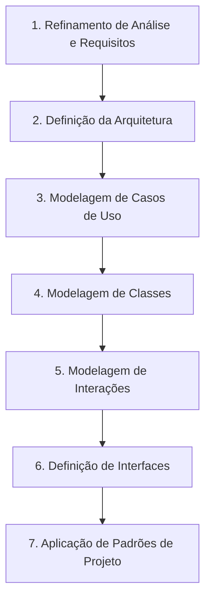

### Priorização via Método MoSCoW

Como complemento técnico indispensável ao refinamento de requisitos (abordado pelo professor na introdução da disciplina), os requisitos identificados devem ser classificados estrategicamente antes de sua modelagem em casos de uso. O método MoSCoW fornece um modelo rigoroso de priorização:

- Must Have (Deve ter): funcionalidades vitais sem as quais o sistema se torna inútil ou inviável legalmente/operacionalmente. Devem compor os primeiros casos de uso a serem detalhados e implementados.
- Should Have (Deveria ter): funcionalidades altamente prioritárias e de grande valor, mas cuja ausência temporária no primeiro release pode ser contornada por alternativas manuais ou posters.
- Could Have (Poderia ter): requisitos desejáveis de menor impacto imediato, implementados caso sobrem tempo e orçamento no ciclo de desenvolvimento.
- Won't Have (Não terá por enquanto): funcionalidades acordadas formalmente como fora do escopo do ciclo atual, evitando o fenômeno de corrupção de escopo (scope creep).

| Categoria MoSCoW | Impacto no Negócio | Obrigatoriedade de Entrega | Exemplo em E-commerce |
| :--- | :--- | :--- | :--- |
| Must Have | Crítico / Vital | Inegociável para o lançamento | Processar pagamento do pedido |
| Should Have | Alto valor agregado | Esperado, com plano de contingência | Rastreamento em tempo real via transportadora |
| Could Have | Desejável / Conveniência | Implementado apenas se houver folga | Lista de desejos compartilhável em redes |
| Won't Have | Baixo retorno imediato | Postergado para versões futuras | Recomendação preditiva baseada em visão computacional |

---

## Introdução aos Diagramas de Casos de Uso na UML

### Definição e propósito

O Diagrama de Casos de Uso é um diagrama comportamental estático da UML cujo objetivo primário é apresentar a fronteira do sistema e o conjunto de serviços observáveis que este provê ao ambiente externo. Ele atua como um contrato funcional visual entre os stakeholders de negócio e a equipe de engenharia.

A premissa fundamental da modelagem de casos de uso reside na abordagem "Caixa-Preta" (Black-Box Modeling). O diagrama não detalha algoritmos internos, esquemas de tabelas de bancos de dados relacionais, queries SQL, estruturas de dados em memória ou componentes de interface gráfica. Seu foco exclusivo responde à pergunta-chave:

> "O que o sistema deve fazer para o usuário?"

### Motivação

Projetos de software frequentemente falham não por erros de sintaxe de programação, mas por falhas de comunicação sobre o escopo pretendido. Requisitos documentados exclusivamente em linguagem natural prolixa geram ambiguidades, contradições e falsas suposições. O diagrama de casos de uso mitiga esse risco ao oferecer:
- Delimitação estrita do escopo (o que está dentro versus o que está fora do sistema).
- Mapeamento claro dos papéis humanos e sistemas integrados que consomem cada serviço.
- Um vocabulário comum e visual acessível para patrocinadores não técnicos e desenvolvedores sêniores.

### Exemplo conceitual e contraexemplo

- Exemplo correto: um caso de uso intitulado "Realizar Pedido", associado ao ator "Cliente". Esse caso de uso encapsula todas as regras e passos necessários para que o usuário monte seu carrinho, escolha a entrega e submeta a transação de compra.
- Contraexemplo: modelar três casos de uso em sequência chamados "Abrir Janela de Login", "Digitar Usuário e Senha" e "Gravar Dados na Tabela TB_USUARIO". Isso é um erro clássico de modelagem funcional/decomposição procedimental. Telas e operações de banco de dados não são objetivos de negócio de um ator, mas sim detalhes transientes de implementação.

### Armadilhas comuns

A principal armadilha nesta etapa é transformar o diagrama de casos de uso em um fluxograma de execução (Activity Diagram). Não se deve tentar ligar casos de uso com setas sequenciais para indicar a ordem em que devem ser clicados na tela. Casos de uso representam capacidades oferecidas pelo sistema que produzem um resultado de valor observável para o ator, e não passos de uma interface.

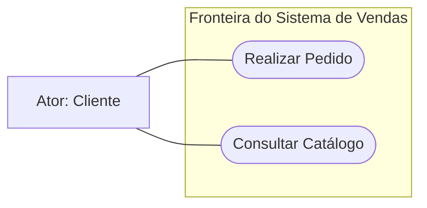

---

## Elementos básicos: Atores, Casos de Uso e Relacionamentos

### Atores

Um ator especifica um papel desempenhado por um usuário ou por qualquer outro sistema que interaja com o sujeito (o sistema modelado). É crucial ressaltar que um ator não representa uma pessoa específica (ex.: "João da Silva"), mas sim um papel lógico ou função contextual (ex.: "Operador de Caixa", "Cliente", "Auditor Fiscal").

Os atores são classificados em:
- Atores Primários: aqueles que iniciam a interação com o sistema para atingir um objetivo de negócio mensurável (ex.: o Cliente ao realizar uma compra).
- Atores Secundários: sistemas de suporte ou papéis operacionais que respondem a solicitações do sistema modelado ou fornecem serviços de infraestrutura/processamento (ex.: Gateway de Pagamento, Sistema de Autenticação Corporativo LDAP, Serviço dos Correios).

### Casos de Uso

Um caso de uso representa uma unidade discreta e atômica de funcionalidade oferecida pelo sistema que produz um resultado mensurável e perceptível para um ator específico. Ele descreve o conjunto de sequências de ações (incluindo variações de fluxo) executadas pelo sistema.

Regras de sintaxe padronizadas:
- Forma gráfica: representado na UML por uma elipse contendo seu rótulo no interior.
- Convenção de nomenclatura: deve ser escrito obrigatoriamente com o verbo inicial no infinitivo, seguido de forma direta pelo objeto ou contexto da ação (ex.: "Cadastrar Livro", "Emitir Boleto", "Cancelar Assinatura").
- Granularidade de valor: deve representar um objetivo completo do ator, e não uma microetapa procedimental.

### Relacionamentos

Relacionamentos são as conexões que definem dependências, comunicações e heranças entre os elementos do modelo. A linha que conecta um ator a um caso de uso é formalmente denominada Associação de Comunicação, indicando tráfego de dados e troca de mensagens bidirecional ou unidirecional entre as partes.

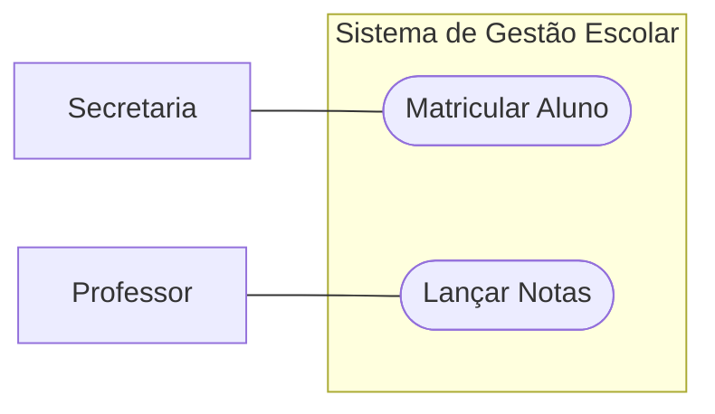

| Elemento | Representação UML | Semântica | Regra de Nomenclatura |
| :--- | :--- | :--- | :--- |
| Ator | Boneco palito (stick man) ou classe com estereótipo `<<actor>>` | Papel que interage externamente com o sistema | Substantivo no singular representando o papel (ex.: `Gerente`) |
| Caso de Uso | Elipse com texto interno | Funcionalidade completa que entrega valor observável | Verbo no infinitivo + complemento direto (ex.: `Emitir Relatório`) |
| Fronteira (Boundary) | Retângulo contendo os casos de uso | Limite do escopo do software em desenvolvimento | Nome do sistema ou subsistema (ex.: `Portal do Cliente`) |
| Associação | Linha sólida conectando ator e caso de uso | Caminho de comunicação de mensagens e dados | Linha simples sem setas (a menos que haja restrição estrita de navegação) |

---

## Tipos de relacionamento: Associação, Include, Extend e Generalização

O poder expressivo da modelagem de casos de uso reside no uso correto dos quatro tipos fundamentais de relacionamentos. A compreensão inadequada das diferenças conceituais entre eles é uma das maiores causas de inconsistência técnica em especificações de software.

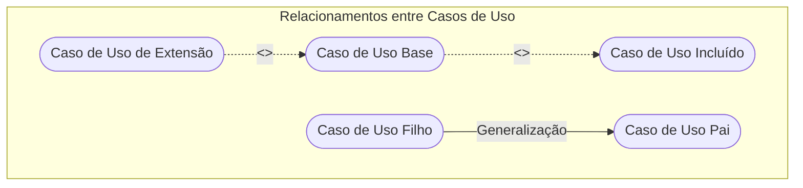

### 1. Associação

A associação é a ligação primária entre um classificador externo (o ator) e um caso de uso do sistema. Ela expressa a permissão e a capacidade de comunicação mútua.

- Definição: relacionamento que expressa a participação do ator no comportamento do caso de uso.
- Motivação: identificar claramente quem são os agentes responsáveis por disparar ou receber informações do sistema.
- Exemplo: o ator `Cliente` possui uma associação com o caso de uso `Consultar Fatura`.
- Contraexemplo: criar associações diretas entre atores (ex.: `Cliente` ligado por linha simples a `Vendedor`). Atores não se associam diretamente por linhas simples no diagrama de casos de uso; se houver relação entre atores, trata-se de generalização.
- Armadilha: esquecer que a associação é geralmente bidirecional em termos de diálogo; o fato de um sistema externo apenas processar requisições não dispensa a associação de comunicação básica.

### 2. Include (`<<include>>`)

O relacionamento de inclusão define que um caso de uso base incorpora obrigatoriamente o comportamento de outro caso de uso de inclusão.

- Definição: relacionamento de dependência estereotipado como `<<include>>`, em que o caso de uso incluído é executado incondicionalmente como parte integrante do fluxo do caso de uso base.
- Motivação: reutilização de comportamento comum a múltiplos casos de uso, evitando duplicidade de especificação (princípio DRY - Don't Repeat Yourself em nível de requisitos).
- Direção da seta: a linha tracejada parte do caso de uso base e aponta para o caso de uso incluído (`Base -.->|<<include>>| Incluído`).
- Exemplo: os casos de uso `Realizar Transferência Bancária` e `Pagar Boleto` incluem obrigatoriamente o caso de uso `Autenticar Usuário`. Sem autenticação, o fluxo base não pode prosseguir nem ser finalizado com sucesso.
- Contraexemplo: usar `<<include>>` para representar passos triviais de um mesmo caso de uso (ex.: `Fazer Pedido` com include para `Digitar Nome da Rua`). Isso fragmenta o modelo sem gerar reutilização real.
- Armadilha: inverter a direção da seta do `<<include>>`. O caso de uso base é quem "precisa" do serviço, logo ele aponta para o serviço incluído.

### 3. Extend (`<<extend>>`)

O relacionamento de extensão especifica que um caso de uso de extensão pode expandir condicionalmente o comportamento de outro caso de uso base em um ponto pré-definido, denominado ponto de extensão (extension point).

- Definição: relacionamento de dependência estereotipado como `<<extend>>`, onde o comportamento do caso de uso de extensão é opcional, dependente de uma condição de guarda em tempo de execução.
- Motivação: desacoplar comportamentos opcionais, regras de exceção ou fluxos secundários complexos da lógica central do caso de uso base, mantendo o caso de uso base limpo e focado no fluxo padrão.
- Direção da seta: a linha tracejada parte do caso de uso de extensão (opcional) e aponta para o caso de uso base (`Extensão -.->|<<extend>>| Base`).
- Exemplo: ao `Finalizar Compra`, o cliente pode opcionalmente acionar `Aplicar Cupom de Desconto` ou `Contratar Garantia Estendida`. O fluxo base ocorre normalmente sem a extensão, mas a extensão amplia o fluxo caso a condição seja satisfeita.
- Contraexemplo: modelar uma ação mandatória como `<<extend>>` (ex.: colocar `Confirmar Pagamento` estendendo `Finalizar Compra`). Se a ação for obrigatória para a conclusão do caso de uso, trata-se de parte do fluxo principal ou de um `<<include>>`.
- Armadilha: inverter o sentido da seta de extensão. Ao contrário do include, no extend o caso de uso acessório/filho aponta em direção à base que ele estende.

### 4. Generalização / Especialização

A relação de generalização é o equivalente ao conceito de herança em linguagens orientadas a objetos. O elemento especializado (filho) herda todas as características, associações e operações do elemento genérico (pai), podendo adicionar novas características ou sobrescrever comportamentos existentes.

Pode ocorrer em dois níveis no diagrama:
1. Generalização entre Atores: um ator especializado herda todos os casos de uso aos quais o ator pai está associado, além de possuir acesso aos seus próprios casos de uso exclusivos.
   - Exemplo: o ator `Cliente Especial` herda do ator `Cliente`. O `Cliente Especial` tem acesso a todas as funcionalidades de `Cliente` (como `Pesquisar Produtos` e `Fazer Pedido`) e possui uma associação exclusiva com `Solicitar Desconto com Vendedor VIP`.
2. Generalização entre Casos de Uso: um caso de uso genérico define uma assinatura ou propósito comum, enquanto os casos de uso especializados fornecem implementações concretas e alternativas para realizar aquele objetivo.
   - Exemplo: o caso de uso `Pagar Pedido` pode ser especializado por `Pagar via Cartão de Crédito`, `Pagar via Pix` e `Pagar via Boleto Bancário`.

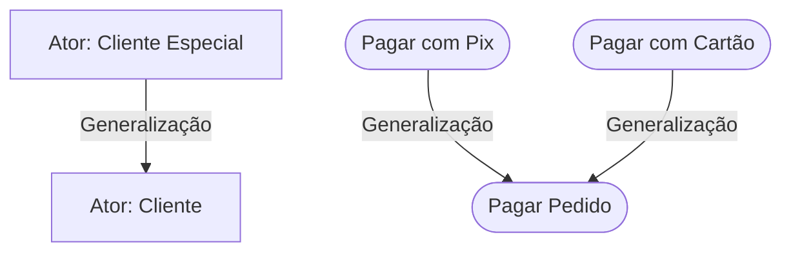

| Relacionamento | Notação Visual UML | Obrigatoriedade de Execução | Direção da Seta | Finalidade Primária |
| :--- | :--- | :--- | :--- | :--- |
| Associação | Linha sólida contínua | Variável | Sem seta (ou bidirecional) | Comunicação entre ator e sistema |
| Include (`<<include>>`) | Linha tracejada aberta | Obrigatório (incondicional) | Da Base para o Incluído | Reutilização de código e lógica comum |
| Extend (`<<extend>>`) | Linha tracejada aberta | Opcional (condicional) | Da Extensão para a Base | Desacoplamento de fluxos opcionais |
| Generalização | Linha sólida com triângulo vazado | Herança polimórfica | Do Filho para o Pai | Compartilhamento e especialização de comportamento |

---

## Levantamento de requisitos e construção do diagrama de e-commerce

### Requisitos brutos do projeto (extraídos do material da aula)

A especificação de um e-commerce moderno exige a modelagem rigorosa de múltiplos papéis e interações complexas de retaguarda e atendimento. Considere o levantamento apresentado em aula:
- "Será desenvolvido um e-commerce o qual poderá ter clientes comuns e clientes especiais que podem ter alguns privilégios."
- "Os funcionários realizarão o cadastro de produtos e a separação para ser despachado pela transportadora."
- "O funcionário será responsável pelos pedidos aos fornecedores de produtos com estoque baixo ou que estão com vendas finalizadas."
- "Após o cliente realizar o pedido ele poderá conferir os itens e depois poderá finalizar a compra com a forma de pagamento selecionada ou cancelar."
- "O transportador irá calcular a postagem e realizar a entrega do produto."

### Análise e mapeamento para casos de uso

A partir da narrativa bruta, os engenheiros de software estruturam os requisitos funcionais formais:
1. RF01 - Realizar Pedido: permite ao cliente compor itens em uma ordem de compra.
2. RF02 - Conferir Itens: permite a validação dos itens contidos na cesta de compras.
3. RF03 - Finalizar Compra: registra a conclusão do pedido com a seleção de pagamento.
4. RF04 - Cancelar Compra: permite ao cliente abortar o processo comercial.
5. RF05 - Cadastrar Produto: funcionalidade de retaguarda executada pelo funcionário.
6. RF06 - Separar Pedido: preparação de mercadorias no centro de distribuição pelo funcionário.
7. RF07 - Solicitar Reposição a Fornecedores: disparo de ordens de suprimento para itens com baixo estoque.
8. RF08 - Calcular Postagem: cálculo automatizado de frete realizado em conjunto com a transportadora.
9. RF09 - Entregar Produto: atualização de despacho físico e confirmação logística de entrega.

### Diagrama UML do E-commerce em Mermaid

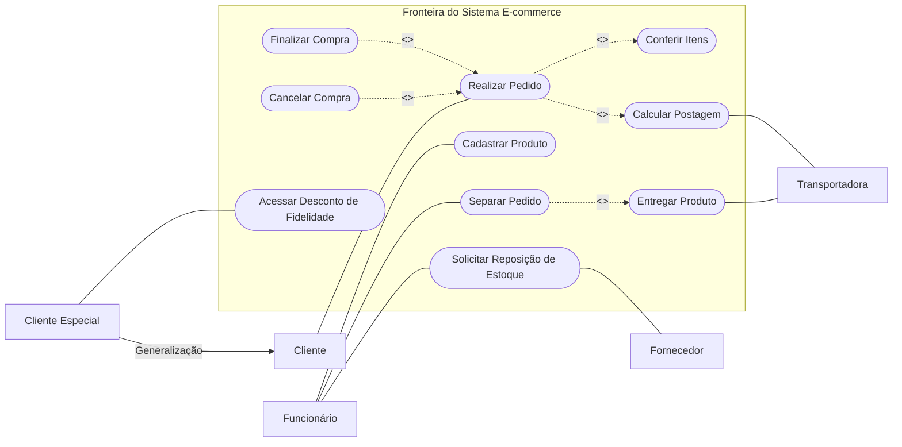

| Ator Identificado | Categoria do Ator | Responsabilidades de Negócio | Casos de Uso Conectados |
| :--- | :--- | :--- | :--- |
| Cliente | Primário (Humano) | Navegação, seleção de itens, checkout e cancelamento | `Realizar Pedido`, `Finalizar Compra`, `Cancelar Compra` |
| Cliente Especial | Primário (Especializado) | Acesso a privilégios e descontos exclusivos | Herda do Cliente + `Acessar Desconto de Fidelidade` |
| Funcionário | Primário (Interno) | Manutenção de catálogo, suprimentos e expedição | `Cadastrar Produto`, `Separar Pedido`, `Solicitar Reposição` |
| Transportadora | Secundário (Externo) | Cálculo de frete e execução logística física | `Calcular Postagem`, `Entregar Produto` |
| Fornecedor | Secundário (Externo) | Recebimento de pedidos de compra de insumos | `Solicitar Reposição de Estoque` |

---

## Estrutura de descrição textual do caso de uso (Pré/Pós-condições e Fluxos)

O diagrama visual de casos de uso é apenas o índice das funcionalidades do sistema. Para que a equipe de desenvolvimento e a equipe de testes possam implementar e validar a lógica com precisão, é mandatório produzir a Descrição Textual de Caso de Uso (especificação detalhada).

### Elementos constitutivos da especificação textual

1. Identificador e Nome: código unívoco (ex.: UC01) e o nome padronizado no infinitivo.
2. Atores: indicação expressa de quem inicia (primário) e quem dá suporte (secundário).
3. Resumo/Descrição: síntese concisa do objetivo comercial da funcionalidade.
4. Pré-condições: estados imperativos que o sistema ou o ambiente devem obrigatoriamente satisfazer antes que o caso de uso possa ser disparado. Se a pré-condição falhar, o caso de uso não pode ser iniciado.
5. Pós-condições: garantias finais do estado do sistema após o término do fluxo. Dividem-se em Garantia de Sucesso (o que é gravado e emitido se der tudo certo) e Garantia Mínima (estado resiliente em que o sistema é mantido caso haja aborto ou falha).
6. Fluxo Principal (Caminho Feliz / Basic Flow): sequência ordenada de passos em que tudo ocorre perfeitamente, sem erros, falhas ou condições excepcionais.
7. Fluxos Alternativos: desvios controlados que oferecem escolhas ao usuário ou caminhos alternativos para completar o objetivo com sucesso.
8. Fluxos de Exceção: caminhos de erro que impedem o cumprimento do objetivo do caso de uso, levando a um término com falha ou recuperação segura.

### Especificação textual formal: UC01 — Fazer Pedido

```markdown
Nome do Caso de Uso: Fazer Pedido
Identificador: UC01
Atores: Cliente (Primário), Transportadora (Secundário), Gateway de Pagamento (Secundário).
Resumo: Descrever o processo completo de seleção de produtos, cálculo de envio e aquisição de itens em uma loja virtual.
Pré-condição: Existir ao menos um produto em estoque ativo no catálogo.
Pós-condição: Pedido gerado com status "Aguardando Pagamento", itens reservados no inventário e registro de postagem calculado.

Fluxo Principal (Caminho Feliz):
1. O Cliente seleciona um ou mais produtos no catálogo e os adiciona ao carrinho de compras.
2. O sistema verifica a disponibilidade de cada item em estoque e valida os limites de compra.
3. O Cliente fornece o endereço de entrega (CEP).
4. O sistema aciona a Transportadora para calcular o valor da postagem e o prazo estimado de entrega.
5. A Transportadora retorna as modalidades de frete e os respectivos valores.
6. O Cliente escolhe a modalidade de entrega desejada.
7. O sistema exibe o resumo completo do pedido: lista de produtos, valores unitários, frete e valor total.
8. O Cliente seleciona a forma de pagamento e clica em "Finalizar Compra".
9. O sistema processa o pagamento junto ao Gateway de Pagamento.
10. O Gateway de Pagamento confirma a transação com sucesso.
11. O sistema grava o pedido como "Pago", baixa os itens do estoque, emite o comprovante em tela e envia e-mail de confirmação ao Cliente.
12. O caso de uso é encerrado.

Fluxos Alternativos:
FA01 (Passo 1): Cliente não cadastrado no sistema
   1a. O sistema identifica que a sessão do usuário é anônima.
   1b. O sistema solicita autenticação ou cadastro de nova conta.
   1c. O Cliente preenche os dados cadastrais e efetiva o login.
   1d. O sistema associa o carrinho atual ao perfil recém-autenticado.
   1e. O fluxo retorna ao Passo 2 do Fluxo Principal.

FA02 (Passo 8): Cliente decide cancelar a transação
   8a. O Cliente clica no botão "Cancelar Compra".
   8b. O sistema solicita confirmação do cancelamento.
   8c. O Cliente confirma o cancelamento.
   8d. O sistema desfaz a reserva temporária dos itens e restaura a tela inicial.
   8e. O caso de uso é encerrado sem geração de cobrança.

Fluxos de Exceção:
FE01 (Passo 2): Quantidade selecionada indisponível em estoque
   2a. O sistema detecta que o volume solicitado excede o saldo físico.
   2b. O sistema emite mensagem de alerta informando a quantidade máxima disponível.
   2c. O Cliente ajusta a quantidade ou remove o item do carrinho.
   2d. O fluxo retorna ao Passo 2.

FE02 (Passo 10): Pagamento não confirmado / Recusado pela operadora
   10a. O Gateway de Pagamento rejeita a transação financeira (saldo insuficiente ou antifraude).
   10b. O sistema altera o status do pedido para "Pendente de Pagamento".
   10c. O sistema exibe mensagem informando a recusa e oferece a opção de escolher outro meio de pagamento.
   10d. Se o Cliente fornecer novo meio válido, o fluxo retorna ao Passo 9; caso contrário, após tempo limite, o pedido é cancelado e os itens retornam ao estoque.
```

### Diagrama de sequência ilustrando o fluxo principal

O diagrama de sequência a seguir detalha a interação temporal descrita nos passos do Fluxo Principal do caso de uso `Fazer Pedido`, evidenciando a colaboração de subsistemas:

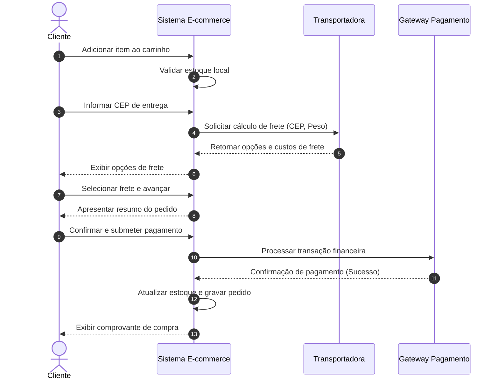

---

## Benefícios da modelagem de casos de uso na engenharia de software

A adoção sistemática de casos de uso na fase de concepção e análise técnica traz benefícios estruturais para o ciclo de vida do projeto:

### 1. Nivelamento de comunicação transdisciplinar
Em projetos complexos, a equipe técnica (desenvolvedores, arquitetos, DBAs) e a equipe de negócios (product owners, gerentes comerciais, usuários finais) frequentemente falam dialetos incompatíveis. O caso de uso opera como a língua franca: expressa capacidades com clareza visual e gramatical sem afogar o cliente em termos como ORM, RPC, concorrência otimista ou particionamento de tabelas.

### 2. Definição inequívoca e controle de escopo
O retângulo que define a fronteira do sistema atua como barreira visual e contratual. Se uma elipse está contida dentro do retângulo, ela faz parte do escopo contratado. Se uma necessidade não possui representação ou ator mapeado, ela é classificada formalmente como fora de escopo para aquela iteração, prevenindo o aumento descontrolado de trabalho não remunerado.

### 3. Base para rastreabilidade e geração de testes de aceitação
Cada fluxo (principal, alternativo e de exceção) de uma especificação textual de caso de uso gera diretamente um ou mais Casos de Teste de Aceitação (User Acceptance Tests - UAT). A equipe de garantia da qualidade (QA) utiliza as pós-condições e as ramificações de erro para estruturar cenários de teste automatizados em frameworks como Cucumber, Behave ou Cypress (BDD - Behavior-Driven Development).

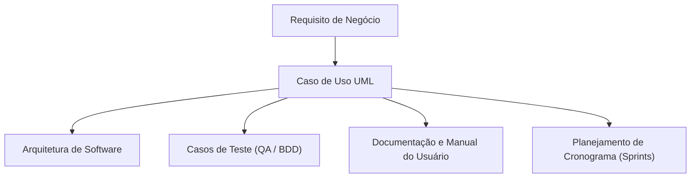

| Abordagem | Foco Principal | Vantagens | Desvantagens / Limitações |
| :--- | :--- | :--- | :--- |
| Diagramas de Casos de Uso (UML) | Comportamento global do sistema e interações com atores | Visão panorâmica clara da fronteira do sistema e relacionamentos de escopo | Não detalha estados internos complexos ou layout de telas |
| Histórias de Usuário (User Stories - Ágil) | Entrega de valor atômica e incremental para a sprint | Simples, ágeis, orientadas ao formato "Como [papel], eu quero [ação], para que [valor]" | Perdem facilmente a visão macro e arquitetural do sistema |
| Especificação Textual Pura (IEEE 830) | Listagem exaustiva de cláusulas de requisitos formais | Altíssimo rigor contratual e ausência de omissões em auditorias | Leitura árdua, baixa legibilidade e rápida desatualização prática |

---

## Estudo de caso prático: Sistema de Informatização de Biblioteca

### Enunciado e requisitos da atividade prática

Uma biblioteca deseja informatizar seu processo completo de gestão e empréstimo de livros. A elicitação de requisitos levantou as seguintes declarações funcionais:
- O Usuário comum pode:
  - Pesquisar livros pelo título ou pelo autor.
  - Realizar o empréstimo de livros disponíveis no acervo.
  - Devolver livros previamente emprestados.
  - Consultar a sua própria lista de empréstimos em aberto e histórico.
- O Bibliotecário pode:
  - Cadastrar novos livros no acervo da biblioteca.
  - Atualizar os dados de livros já existentes.
  - Registrar empréstimos e devoluções realizadas presencialmente pelos usuários no balcão.
- O Sistema Externo de Pagamento de Multas deve:
  - Calcular valores devidos quando houver atraso na devolução da obra.

### Raciocínio de modelagem passo a passo

1. Identificação dos Atores:
   - `Usuário`: ator primário humano que pesquisa, retira, devolve e consulta seus registros.
   - `Bibliotecário`: ator primário interno que atua na manutenção administrativa do acervo e pode operar o sistema em nome do usuário no balcão de atendimento.
   - `Sistema de Pagamento`: ator secundário (sistema externo automatizado) responsável pelo cálculo financeiro das penalidades de mora.

2. Identificação dos Casos de Uso Principais:
   - `Pesquisar Livros`
   - `Realizar Empréstimo`
   - `Devolver Livro`
   - `Consultar Lista de Empréstimos`
   - `Cadastrar Livro`
   - `Atualizar Livro`
   - `Registrar Empréstimo/Devolução`
   - `Calcular Multa por Atraso`

3. Análise dos Relacionamentos Estruturais:
   - Os casos de uso `Cadastrar Livro` e `Atualizar Livro` associam-se ao `Bibliotecário`.
   - O caso de uso `Pesquisar Livros` e `Consultar Lista de Empréstimos` associam-se ao `Usuário`.
   - `Registrar Empréstimo/Devolução` associado ao `Bibliotecário` atua como uma interface de balcão para as operações de empréstimo e devolução.
   - Ao executar `Devolver Livro`, a devolução pode incorrer em atraso temporal. Se houver atraso, o sistema precisa acionar o cálculo de penalidade. Modelamos `Calcular Multa por Atraso` com relacionamento `<<extend>>` apontando para `Devolver Livro` (com condição de guarda `[data_atual > data_limite]`), ou alternativamente como `<<include>>` caso o cálculo de status de multas seja invocado compulsoriamente na devolução. Pela especificação da aula, o cálculo é condicionado à existência de atraso, configurando uma extensão natural que consome o `Sistema de Pagamento`.
   - Para o empréstimo ser concluído, é obrigatória a verificação prévia de que o livro está fisicamente disponível. Essa validação pode ser modelada como `<<include>>` de `Verificar Disponibilidade`.

### Diagrama UML da Biblioteca em Mermaid

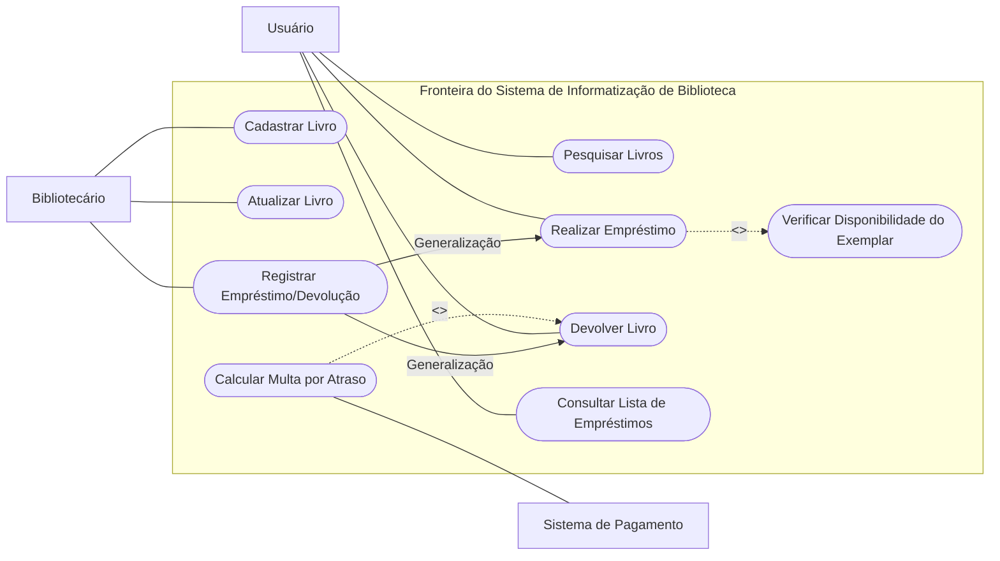

---

## Código da aula

Conforme destacado na ementa da aula e nas diretrizes pedagógicas de Engenharia de Software II, a modelagem de casos de uso é uma técnica conceitual de alto nível e não gera arquivos de código-fonte de implementação direta durante esta fase. No entanto, para fins de clareza de engenharia de software e conexão com o desenvolvimento prático, o engenheiro de software deve compreender como a especificação de um caso de uso se traduz na arquitetura de software (especificamente em camadas de aplicação / casos de uso sob a ótica de Clean Architecture / Arquitetura Hexagonal).

Abaixo, apresenta-se o mapeamento conceitual em TypeScript formalizando as fronteiras, contratos de entrada (Input Boundary), regras de negócio do caso de uso e portas de saída (Output Boundary / Gateways de infraestrutura) para o caso de uso `Devolver Livro`:

```typescript
// Contratos e Tipos de Domínio
export interface Emprestimo {
    id: string;
    idLivro: string;
    idUsuario: string;
    dataRetirada: Date;
    dataLimiteDevolucao: Date;
    status: 'ABERTO' | 'CONCLUIDO' | 'ATRASADO';
}

export interface ResultadoDevolucao {
    sucesso: boolean;
    dataEfetiva: Date;
    houveMulta: boolean;
    valorMultaCalculada: number;
    mensagem: string;
}

// Portas de Saída (Gateways / Atores Secundários)
export interface RepositorioEmprestimos {
    buscarPorId(idEmprestimo: string): Promise<Emprestimo | null>;
    atualizar(emprestimo: Emprestimo): Promise<void>;
}

export interface ServicoExternoPagamentoMultas {
    calcularValorDevido(diasAtraso: number): Promise<number>;
}

// Caso de Uso: DevolverLivroUseCase (Implementação do Fluxo)
export class DevolverLivroUseCase {
    constructor(
        private readonly emprestimoRepo: RepositorioEmprestimos,
        private readonly servicoMultas: ServicoExternoPagamentoMultas
    ) {}

    public async executar(idEmprestimo: string, dataAtual: Date): Promise<ResultadoDevolucao> {
        // Pré-condição: O registro de empréstimo deve existir no sistema
        const emprestimo = await this.emprestimoRepo.buscarPorId(idEmprestimo);
        if (!emprestimo) {
            throw new Error("Pré-condição violada: Empréstimo inexistente.");
        }

        if (emprestimo.status === 'CONCLUIDO') {
            throw new Error("Regra de negócio: Livro já devolvido anteriormente.");
        }

        let valorMulta = 0;
        let possuiMulta = false;

        // Ponto de Extensão: <<extend>> Calcular Multa por Atraso
        if (dataAtual.getTime() > emprestimo.dataLimiteDevolucao.getTime()) {
            possuiMulta = true;
            const diffEmMilissegundos = dataAtual.getTime() - emprestimo.dataLimiteDevolucao.getTime();
            const diasAtraso = Math.ceil(diffEmMilissegundos / (1000 * 60 * 60 * 24));
            
            // Interação com o Ator Secundário (Sistema de Pagamento)
            valorMulta = await this.servicoMultas.calcularValorDevido(diasAtraso);
            emprestimo.status = 'ATRASADO';
        } else {
            emprestimo.status = 'CONCLUIDO';
        }

        // Pós-condição: Estado do acervo persistido
        await this.emprestimoRepo.atualizar(emprestimo);

        return {
            sucesso: true,
            dataEfetiva: dataAtual,
            houveMulta: possuiMulta,
            valorMultaCalculada: valorMulta,
            mensagem: possuiMulta 
                ? `Devolução registrada com atraso. Multa no valor de R$ ${valorMulta.toFixed(2)}.`
                : "Devolução registrada com sucesso no prazo."
        };
    }
}
```

---

## Exercícios

### Exercício 1: Modelagem e especificação do Sistema de Biblioteca (Prática de aula)

#### Enunciado
Com base nos requisitos fornecidos pelo Prof. Wesley Soares:
1. Uma biblioteca informatizará seu processo de empréstimo.
2. Usuário: pesquisa livros (título/autor), realiza empréstimo, devolve livros, consulta lista de empréstimos.
3. Bibliotecário: cadastra livros, atualiza livros, registra empréstimos e devoluções realizadas por usuários no balcão.
4. Sistema de Pagamento: calcula valores devidos de multas quando houver atraso na devolução.
Elabore a especificação textual completa do caso de uso `Realizar Empréstimo`.

#### Raciocínio de modelagem
Para realizar um empréstimo, o livro deve estar disponível fisicamente e o usuário não pode ter pendências cadastrais ou multas ativas não pagas. O fluxo principal deve contemplar a busca do livro, a verificação de regras de impedimento, a vinculação do exemplar ao usuário e a geração do recibo com data estipulada de devolução.

#### Resolução comentada
```markdown
Caso de Uso: Realizar Empréstimo
Identificador: UC_BIB_02
Atores: Usuário (Primário), Bibliotecário (Secundário/Intermediário de balcão).
Resumo: Permitir que um usuário realize a retirada de um livro do acervo para leitura domiciliar.
Pré-condições:
1. O Usuário deve estar cadastrado e com matrícula ativa no sistema.
2. O Usuário não pode possuir multas vencidas em aberto.
3. O exemplar desejado deve constar no sistema com status "Disponível".
Pós-condições:
1. Registro de empréstimo gravado com data de retirada e prazo final de entrega.
2. Status do exemplar alterado para "Emprestado".
3. Comprovante de empréstimo emitido e associado à conta do usuário.

Fluxo Principal:
1. O Usuário identifica o exemplar desejado (diretamente ou via pesquisa prévia).
2. O Usuário solicita a formalização do empréstimo.
3. O sistema valida se o Usuário possui restrições cadastrais ou multas ativas.
4. O sistema verifica a disponibilidade do exemplar no acervo físico.
5. O sistema registra o empréstimo, calculando a data de devolução (14 dias corridos).
6. O sistema emite a confirmação de empréstimo com a data limite de entrega.
7. O status do livro é marcado como "Emprestado".
8. O caso de uso é encerrado com sucesso.

Fluxos Alternativos:
FA01 (Passo 2): Atendimento presencial no balcão
   2a. O Bibliotecário insere o código do livro e a matrícula do Usuário.
   2b. O fluxo segue a partir do Passo 3.

Fluxos de Exceção:
FE01 (Passo 3): Usuário com multas ou limite de empréstimos excedido
   3a. O sistema identifica pendências financeiras ou limite máximo de 3 livros atingido.
   3b. O sistema exibe mensagem de impedimento: "Empréstimo bloqueado por pendência cadastral".
   3c. O caso de uso é finalizado sem efetivar o empréstimo.

FE02 (Passo 4): Exemplar indisponível / Já emprestado
   4a. O sistema constata que o exemplar físico está emprestado ou em manutenção.
   4b. O sistema informa a indisponibilidade e oferece a opção de "Reservar Exemplar".
   4c. O caso de uso é finalizado.
```

---

### Exercício 2: Diferenciação prática entre Include e Extend em Sistema Hospitalar

#### Enunciado
Considere o módulo de pronto-atendimento de um hospital:
- Todo paciente que dá entrada deve passar compulsoriamente por "Classificação de Risco (Triagem)".
- Pacientes classificados com a cor "Vermelha (Emergência)" são direcionados imediatamente para "Acionar Equipe de Trauma e Ressuscitação".
Modele a relação entre o caso de uso base `Atender Paciente`, o caso de uso `Realizar Triagem` e o caso de uso `Acionar Equipe de Trauma`, justificando a escolha dos relacionamentos.

#### Raciocínio de modelagem
- A triagem é um requisito obrigatório e incondicional para todo atendimento médico registrado no pronto-socorro. Logo, a relação entre `Atender Paciente` e `Realizar Triagem` deve ser um `<<include>>`.
- O acionamento da equipe de trauma é condicional: ocorre exclusivamente se a condição de guarda `[gravidade == Emergência Vermelha]` for satisfeita. Logo, a relação de `Acionar Equipe de Trauma` com o atendimento base é um `<<extend>>`, onde a extensão aponta para o caso base.

#### Resolução comentada

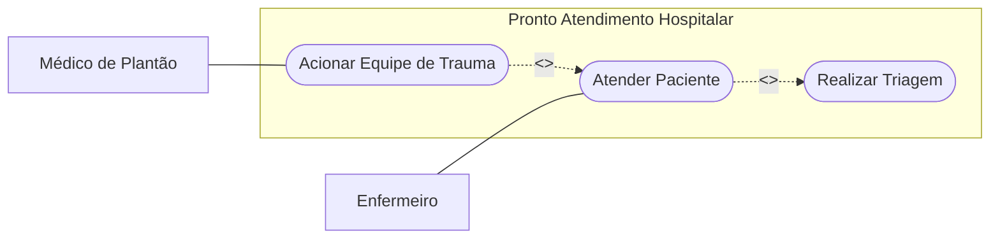

Justificativa técnica:
1. `<<include>>`: Garante que `Atender Paciente` não pode ser concluído sem que a lógica de `Realizar Triagem` seja executada.
2. `<<extend>>`: Desacopla a rotina emergencial da equipe de trauma do atendimento ambulatorial padrão, ativando-a apenas no ponto de extensão sob severidade crítica.

---

### Exercício 3: Modelagem de Generalização de Atores em Sistema Acadêmico

#### Enunciado
Em um sistema universitário:
- Qualquer `Membro Acadêmico` pode `Consultar Calendário Escolar` e `Autenticar-se no Portal`.
- O `Aluno` pode, adicionalmente, `Realizar Matrícula em Disciplina` e `Consultar Histórico Escolar`.
- O `Professor` pode `Lançar Frequência` e `Submeter Notas Finais`.
Elabore o diagrama de casos de uso aplicando o conceito de generalização/herança de atores para eliminar duplicações de associações.

#### Raciocínio de modelagem
Sem generalização, seria necessário conectar tanto `Aluno` quanto `Professor` aos casos de uso comuns (`Consultar Calendário` e `Autenticar-se`). Criando o ator genérico pai `Membro Acadêmico` e especializando-o em `Aluno` e `Professor`, os filhos herdam as associações do pai e mantêm apenas as associações de suas atribuições específicas.

#### Resolução comentada

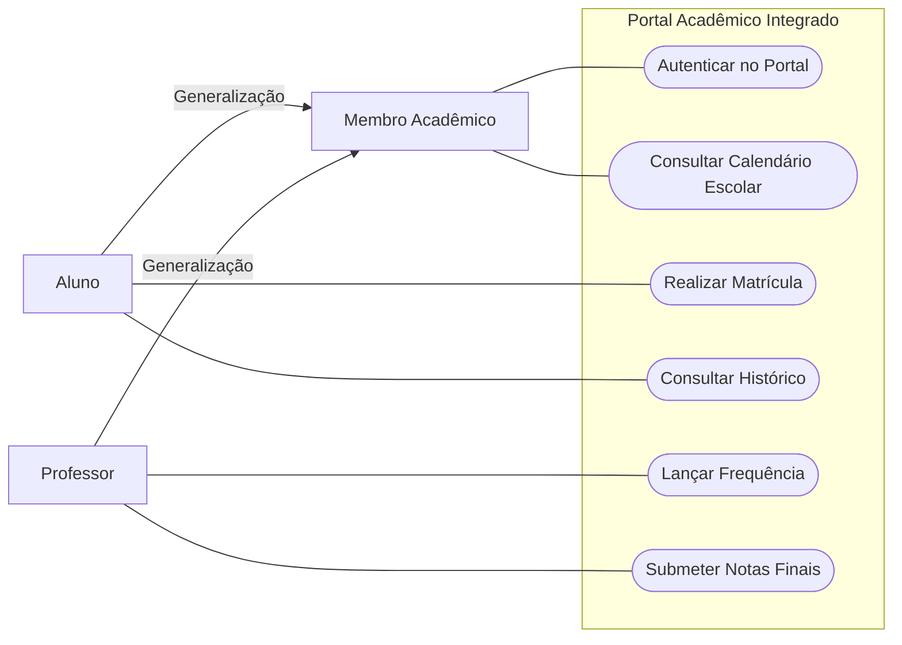

---

## Erros comuns e boas práticas

### Erros comuns (Antipadrões de modelagem)

1. Decomposição Funcional Excessiva (Functional Decomposition):
   - Erro: transformar o diagrama de casos de uso em um pseudocódigo visual ou fluxograma de rotinas (ex.: criar casos de uso como "Abrir Conexão com Banco", "Digitar Campo Nome", "Validar CEP", "Clicar em Salvar").
   - Correção: o caso de uso deve representar uma meta completa e observável de valor para o ator. Validações e manipulações de tela pertencem à descrição textual interna do fluxo.

2. Inversão do Sentido das Setas em `<<include>>` e `<<extend>>`:
   - Erro: apontar a seta de `<<include>>` do caso incluído para o base, ou apontar o `<<extend>>` da base para o acessório.
   - Correção:
     - No `<<include>>`, o caso base "chama/precisa" do incluído (`Base -.->|<<include>>| Incluído`).
     - No `<<extend>>`, o caso acessório/excepcional "modifica/estende" a base (`Extensão -.->|<<extend>>| Base`).

3. Modelagem de CRUD Genérico sem Valor de Negócio:
   - Erro: desenhar para cada tabela do banco quatro elipses: "Inserir Cliente", "Consultar Cliente", "Editar Cliente", "Excluir Cliente".
   - Correção: consolidar operações de manutenção em um único caso de uso abrangente de gestão de dados quando aplicável (ex.: "Manter Cadastro de Clientes"), ou detalhar apenas os que possuem regras de negócio ricas e atores distintos.

4. Confundir Atores com Usuários Específicos ou Entidades Internas:
   - Erro: criar um ator com o nome de uma pessoa física ("Carlos da TI") ou representar um elemento interno do software como ator (ex.: "Tabela do Banco de Dados", "Processador de CPU").
   - Correção: atores representam papéis conceituais ou sistemas externos fora da fronteira do software.

5. Nomenclatura sem Verbo no Infinitivo:
   - Erro: nomear a elipse como "Relatório Financeiro" ou "Módulo de Vendas".
   - Correção: sempre utilizar verbo transitivo no infinitivo + objeto (ex.: "Gerar Relatório Financeiro", "Processar Venda").

### Boas práticas de engenharia

- Mantenha a Fronteira do Sistema Visível: delimite com clareza gráfica o retângulo do sistema. Nenhum ator pode estar desenhado dentro do retângulo, e nenhum caso de uso pode estar do lado de fora.
- Limite de Complexidade Visual: diagramas com mais de 10 a 15 casos de uso tornam-se ilegíveis. Divida sistemas complexos em pacotes lógicos ou subsistemas (ex.: "Módulo Fiscal", "Módulo de Vendas", "Módulo Logístico").
- Complementaridade Obrigatória: nunca entregue o diagrama visual sem sua respectiva especificação textual para os fluxos principais e alternativos.

---

## Links e materiais complementares

- Visual Paradigm Online (https://online.visual-paradigm.com/): ferramenta CASE utilizada e indicada pelo professor na Aula 04 para elaboração ágil de diagramas de casos de uso e UML geral.
- OMG Unified Modeling Language (UML) Specification: portal oficial da Object Management Group contendo os padrões normativos da especificação UML 2.5.
- "Utilizando UML e Padrões" (Craig Larman): livro clássico de referência acadêmica que discute detalhadamente a análise de requisitos baseada em casos de uso e transição para contratos de domínio e padrões GRASP/GoF.
- "Writing Effective Use Cases" (Alistair Cockburn): obra definitiva sobre estruturação formal de especificações textuais, metas de valor de atores e decomposição de fluxos principais e alternativos.

---

## Mapa da aula

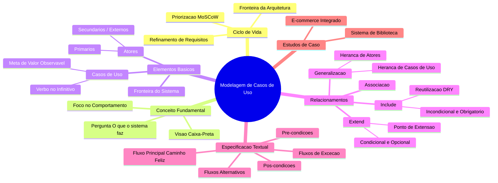

---

## Glossário

| Termo Técnico | Definição na Engenharia de Software |
| :--- | :--- |
| Ator (Actor) | Papel coerente desempenhado por uma entidade externa (humano, dispositivo de hardware ou sistema de software externo) ao interagir com o sistema. |
| Caso de Uso (Use Case) | Especificação de um conjunto de ações desempenhadas pelo sistema que produz um resultado observável de valor para um determinado ator. |
| Fronteira do Sistema (System Boundary) | Linha demarcatória conceitual que define o que pertence ao escopo do software em desenvolvimento e o que reside no ambiente externo. |
| Inclusão (`<<include>>`) | Relacionamento de dependência em que a execução do caso de uso base requer obrigatoriamente a execução do caso de uso incluído. |
| Extensão (`<<extend>>`) | Relacionamento de dependência em que um caso de uso adiciona comportamento condicionalmente a um caso de uso base em um ponto de extensão. |
| Ponto de Extensão (Extension Point) | Local nomeado específico no fluxo de um caso de uso base onde um comportamento adicional pode ser inserido via relacionamento de extensão. |
| Generalização (Generalization) | Relacionamento taxonômico entre um elemento geral (superclasse/pai) e um elemento mais específico (subclasse/filho) que herda suas propriedades. |
| Pré-condição (Precondition) | Estado ou conjunto de asserções que o sistema deve garantir como verdadeiras antes do disparo e início da execução de um caso de uso. |
| Pós-condição (Postcondition) | Estado ou conjunto de asserções que o sistema garante como verdadeiras após o encerramento do caso de uso (em sucesso ou falha controlada). |
| Caminho Feliz (Happy Path / Basic Flow) | Cenário de execução padrão do caso de uso em que não ocorrem desvios, erros, exceções ou interrupções, atingindo a meta com sucesso direto. |
| Método MoSCoW | Técnica ágil de priorização de requisitos que os classifica em Must Have, Should Have, Could Have e Won't Have. |
| Visão Caixa-Preta (Black-Box View) | Paradigma de análise de sistemas focado estritamente nas entradas fornecidas e saídas produzidas, ignorando a mecânica de execução interna. |

---

## Pontos-chave para a prova

- Definição do diagrama: técnica comportamental da UML que representa como atores interagem com o sistema, focando em "o que o sistema deve fazer" (caixa-preta) e nunca em "como implementar" (caixa-branca).
- Regra de ouro da gramática de casos de uso: o nome do caso de uso deve sempre se iniciar por um verbo no infinitivo seguido de complemento direto (ex.: `Efetuar Login`, `Registrar Devolução`).
- Direção mandatória das setas:
  - `<<include>>`: A seta parte do caso de uso base e aponta para o caso de uso incluído (`Base -.-> Incluído`).
  - `<<extend>>`: A seta parte do caso de uso que estende (acessório) e aponta para o caso de uso base (`Extensão -.-> Base`).
  - Generalização: A linha sólida com ponta triangular vazada parte do filho e aponta para o pai (`Filho --> Pai`).
- Critério de distinção Include vs. Extend:
  - Se a execução for obrigatória, incondicional e necessária para o término bem-sucedido do caso base, trata-se de `<<include>>`.
  - Se a execução for opcional, excepcional ou disparada apenas sob uma condição específica de negócio, trata-se de `<<extend>>`.
- Papel dos Atores: nunca representam instâncias ou indivíduos (como "José"), mas papéis abstratos (`Cliente`). Sistemas externos que fornecem ou consomem serviços do sistema (como Gateway de Pagamento ou API da Transportadora) também são modelados como atores.
- Elementos textuais: uma especificação de caso de uso não está completa apenas com o diagrama visual; ela requer a especificação dos atores, pré-condições, pós-condições, fluxo principal, fluxos alternativos e fluxos de exceção.

---

## Perguntas e respostas (JSONL)

```jsonl
{"pergunta": "Qual é a pergunta-chave que orienta a elaboração de um Diagrama de Casos de Uso na UML?", "resposta": "A pergunta-chave é: 'O que o sistema deve fazer para o usuário?', mantendo o foco no comportamento externo observável e não em detalhes técnicos internos.", "dificuldade": "facil"}
{"pergunta": "Como deve ser estruturado o nome de um caso de uso de acordo com as convenções da UML?", "resposta": "O nome deve ser iniciado obrigatoriamente com um verbo no infinitivo seguido de forma direta pelo objeto ou contexto da ação (ex.: Realizar Venda, Cadastrar Livro).", "dificuldade": "facil"}
{"pergunta": "Qual a diferença primária entre um ator humano e um sistema externo em um Diagrama de Casos de Uso?", "resposta": "Nenhuma em termos de sintaxe UML; ambos desempenham papéis externos e conectam-se por associações. A diferença é semântica: atores humanos são usuários que operam a interface, enquanto sistemas externos são serviços autônomos que trocam dados com o sistema.", "dificuldade": "facil"}
{"pergunta": "O que representa a fronteira do sistema (System Boundary) em um diagrama de casos de uso?", "resposta": "Representa o limite de escopo do software em desenvolvimento. Casos de uso ficam dentro do retângulo da fronteira, enquanto os atores residem obrigatoriamente fora.", "dificuldade": "facil"}
{"pergunta": "Em qual situação deve-se utilizar o relacionamento <<include>> entre casos de uso?", "resposta": "Quando um caso de uso base necessita executar de forma mandatória, incondicional e comum a funcionalidade de outro caso de uso, promovendo a reutilização de comportamento.", "dificuldade": "media"}
{"pergunta": "Qual é a direção correta da seta em um relacionamento estereotipado como <<include>>?", "resposta": "A seta tracejada parte do caso de uso base em direção ao caso de uso incluído (Base aponta para Incluído).", "dificuldade": "media"}
{"pergunta": "Em qual situação deve-se utilizar o relacionamento <<extend>>?", "resposta": "Quando um caso de uso acessório pode estender condicionalmente ou opcionalmente o comportamento de um caso de uso base em um ponto pré-determinado de extensão.", "dificuldade": "media"}
{"pergunta": "Qual é a direção correta da seta em um relacionamento estereotipado como <<extend>>?", "resposta": "A seta tracejada parte do caso de uso que estende (a extensão opcional) em direção ao caso de uso base estendido.", "dificuldade": "media"}
{"pergunta": "O que acontece com os casos de uso associados a um ator pai quando aplicamos generalização de atores?", "resposta": "O ator filho especializado herda automaticamente o acesso a todos os casos de uso associados ao ator pai, além de poder se associar aos seus casos de uso exclusivos.", "dificuldade": "media"}
{"pergunta": "O que é uma pré-condição na especificação textual de um caso de uso?", "resposta": "É o conjunto de requisitos de estado ou condições operacionais que o sistema deve obrigatoriamente satisfazer antes que o caso de uso possa ser iniciado.", "dificuldade": "media"}
{"pergunta": "Qual a diferença entre um fluxo alternativo e um fluxo de exceção?", "resposta": "O fluxo alternativo atinge o objetivo do caso de uso por um caminho diferente do principal, enquanto o fluxo de exceção trata falhas ou bloqueios que impedem o cumprimento do objetivo.", "dificuldade": "media"}
{"pergunta": "Por que a modelagem de casos de uso é classificada como uma abordagem de Caixa-Preta (Black-Box)?", "resposta": "Porque ela especifica as entradas, saídas e comportamentos esperados pelo usuário sem expor os mecanismos internos de código, algoritmos ou tabelas de banco de dados.", "dificuldade": "media"}
{"pergunta": "No método de priorização MoSCoW, qual a distinção entre requisitos 'Must Have' e 'Should Have'?", "resposta": "'Must Have' são requisitos vitais e inegociáveis para a entrega do sistema; 'Should Have' agregam alto valor, mas sua ausência no primeiro momento pode ser contornada por soluções alternativas.", "dificuldade": "media"}
{"pergunta": "Qual é o erro conhecido como Decomposição Funcional na modelagem de casos de uso?", "resposta": "É o erro de fragmentar operações do sistema em microetapas procedimentais ou de interface (ex.: Digitar Login, Clicar Botão) como se fossem casos de uso isolados.", "dificuldade": "dificil"}
{"pergunta": "Em que circunstância dois casos de uso podem se relacionar por generalização/especialização?", "resposta": "Quando um caso de uso genérico define uma intenção abstrata compartilhada e casos de uso filhos fornecem formas especializadas e completas de concretizar essa meta (ex.: Pagar Pedido generalizando Pagar com Boleto e Pagar com Pix).", "dificuldade": "dificil"}
{"pergunta": "Como o conceito de Ponto de Extensão (Extension Point) opera formalmente no relacionamento <<extend>>?", "resposta": "É uma âncora declarada formalmente no fluxo do caso de uso base que indica exatamente em qual momento o fluxo da extensão condicional será acoplado caso a condição de guarda seja atendida.", "dificuldade": "dificil"}
{"pergunta": "No estudo de caso da biblioteca, por que a devolução com atraso que gera cobrança é modelada preferencialmente como extend em vez de include?", "resposta": "Porque a cobrança de multa não ocorre em todas as devoluções, mas apenas de forma condicional quando a data da devolução ultrapassar o prazo estabelecido de empréstimo.", "dificuldade": "dificil"}
{"pergunta": "Como a especificação de casos de uso colabora diretamente com as atividades da equipe de Garantia da Qualidade (QA)?", "resposta": "Ela serve de base direta para derivar os casos de teste de aceitação (UAT), onde cada variação de fluxo principal, alternativo e de exceção torna-se um roteiro de teste verificável.", "dificuldade": "dificil"}
{"pergunta": "Por que não se deve conectar atores diretamente entre si por linhas de associação simples?", "resposta": "Porque a associação representa comunicação através do sistema; a interação direta entre pessoas ou entidades fora do software não faz parte do modelo de casos de uso, exceto na hierarquia de generalização de papéis.", "dificuldade": "dificil"}
{"pergunta": "Qual a relação entre os casos de uso definidos na fase de análise e os Casos de Uso/Interactors propostos na Clean Architecture?", "resposta": "Cada caso de uso da análise de requisitos mapeia-se estruturalmente como uma classe de caso de uso na camada de aplicação da Clean Architecture, encapsulando as regras de negócio orquestradas daquele fluxo.", "dificuldade": "dificil"}
```

---

## Checklist de revisão

- [ ] Sei enunciar a pergunta-chave de um diagrama de caso de uso ("O que o sistema deve fazer para o usuário?").
- [ ] Compreendo a posição da modelagem de casos de uso na sequência das 7 etapas de projeto de software.
- [ ] Sei classificar requisitos utilizando as categorias do método MoSCoW.
- [ ] Sei desenhar a fronteira do sistema e posicionar atores (fora) e casos de uso (dentro).
- [ ] Aplico a regra de nomenclatura de casos de uso utilizando verbos no infinitivo e termos objetivos.
- [ ] Diferencio atores primários (iniciadores do objetivo) de atores secundários (sistemas de apoio).
- [ ] Sei a direção correta da seta de inclusão: do caso base para o incluído (`Base -.->|<<include>>| Incluído`).
- [ ] Sei a direção correta da seta de extensão: do caso que estende para o base (`Extensão -.->|<<extend>>| Base`).
- [ ] Sei quando aplicar generalização entre atores para eliminar duplicação de associações.
- [ ] Sei quando aplicar generalização entre casos de uso para modelar variações de concretização de uma meta.
- [ ] Domino a estrutura de especificação textual contendo pré-condições, pós-condições e os três tipos de fluxos.
- [ ] Consigo discernir entre um fluxo alternativo (caminho diferente com sucesso) e um fluxo de exceção (trata erro e falha).
- [ ] Sei evitar o erro de decomposição funcional excessiva e a tentação de modelar fluxogramas de interface gráfica.
- [ ] Consigo resolver e diagramar o estudo de caso do E-commerce identificando Clientes Comuns, Especiais, Funcionários e Transportadora.
- [ ] Consigo resolver e diagramar o estudo de caso da Biblioteca identificando Usuário, Bibliotecário e Sistema de Pagamento.

## Código prático de apoio

Implementações em Java que tornam executáveis os conceitos desta unidade:

- [`SistemaEcommerceApp.java`](codigo/SistemaEcommerceApp.java)
- [`SistemaBibliotecaApp.java`](codigo/SistemaBibliotecaApp.java)
- [`HospitalProntoAtendimentoApp.java`](codigo/HospitalProntoAtendimentoApp.java)
