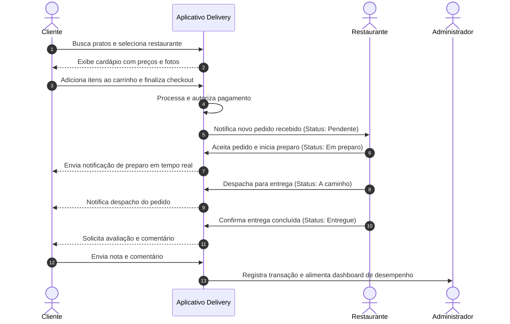
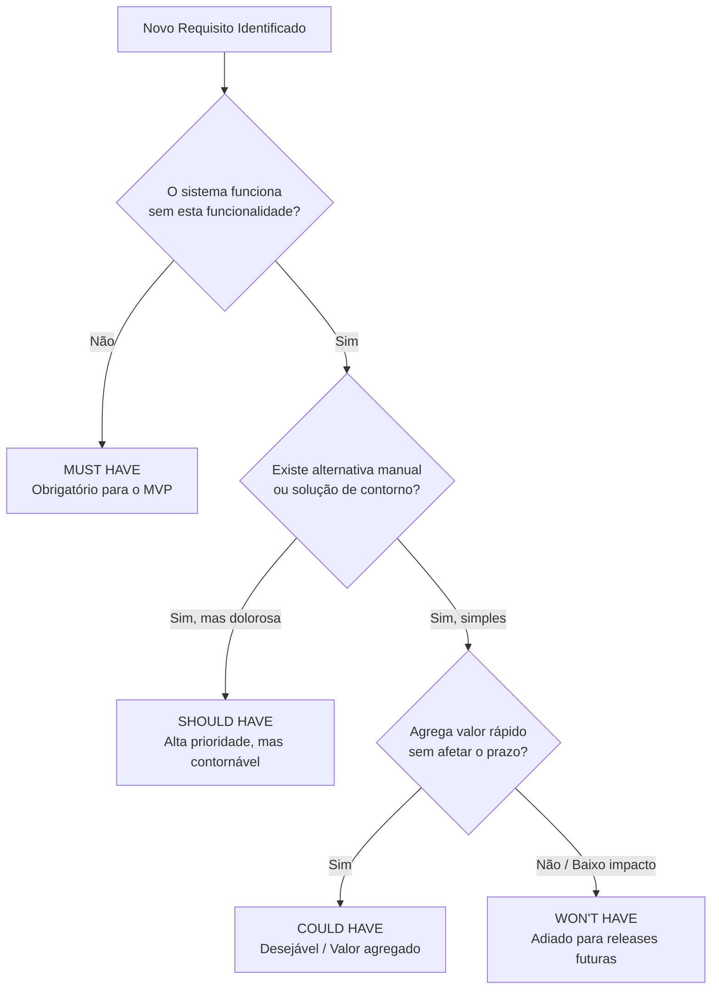
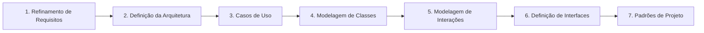
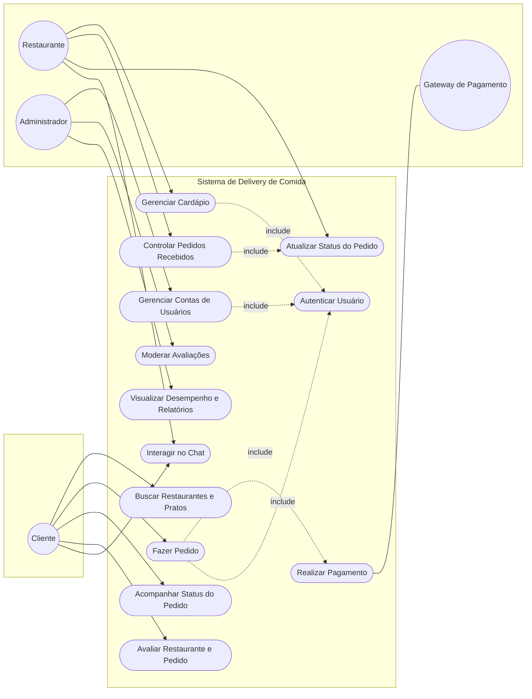
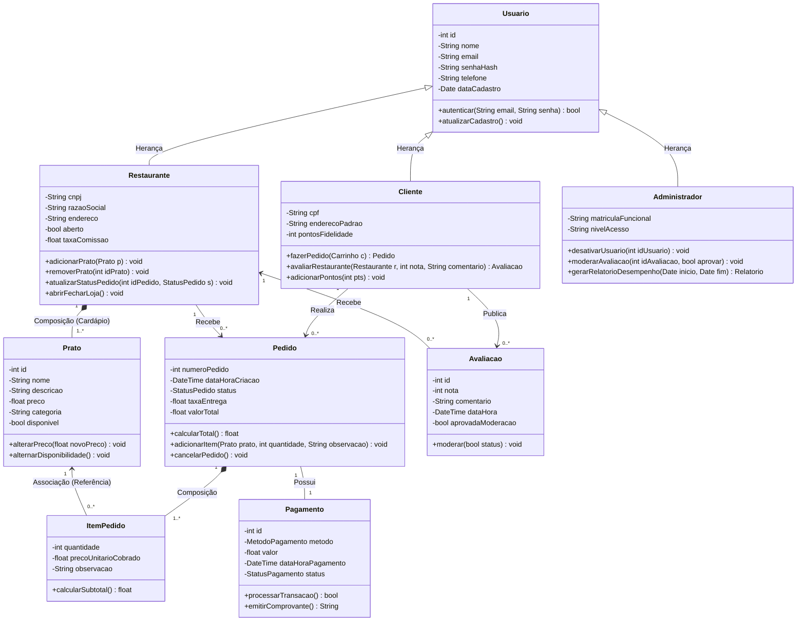

# Aula 06 — Modelagem de Requisitos e Casos de Uso

> **Professor:** Wesley Soares
> **Disciplina:** Engenharia de Software II (4º Semestre)
> **Tema:** Levantamento de requisitos funcionais, priorização com método MoSCoW, especificação formal de casos de uso e modelagem estrutural de classes para uma plataforma de delivery de comida.

---

## Sumário

- [Objetivo da aula](#objetivo-da-aula)
- [Contexto e pré-requisitos](#contexto-e-pré-requisitos)
- [Caso de uso prático](#caso-de-uso-prático)
  - [Visão do ecossistema de negócio](#visão-do-ecossistema-de-negócio)
  - [Fluxo de valor ponta a ponta](#fluxo-de-valor-ponta-a-ponta)
- [Levantamento de requisitos](#levantamento-de-requisitos)
  - [Engenharia de requisitos no ciclo de vida](#engenharia-de-requisitos-no-ciclo-de-vida)
  - [Requisitos por perfil de ator](#requisitos-por-perfil-de-ator)
  - [Requisitos funcionais versus não funcionais](#requisitos-funcionais-versus-não-funcionais)
  - [Funcionalidades de valor agregado](#funcionalidades-de-valor-agregado)
- [Método MoSCoW](#método-moscow)
  - [Fundamentação da técnica de priorização](#fundamentação-da-técnica-de-priorização)
  - [Matriz MoSCoW aplicada ao delivery](#matriz-moscow-aplicada-ao-delivery)
  - [As sete etapas do projeto de software](#as-sete-etapas-do-projeto-de-software)
- [Diagrama de caso de uso geral](#diagrama-de-caso-de-uso-geral)
  - [Conceitos e fronteiras do sistema](#conceitos-e-fronteiras-do-sistema)
  - [Modelagem do diagrama geral](#modelagem-do-diagrama-geral)
  - [Relacionamentos: inclusão, extensão e generalização](#relacionamentos-inclusão-extensão-e-generalização)
- [Casos de uso específicos por ator](#casos-de-uso-específicos-por-ator)
  - [Estrutura da especificação textual](#estrutura-da-especificação-textual)
  - [Especificação: Fazer pedido (Cliente)](#especificação-fazer-pedido-cliente)
  - [Especificação: Controlar pedidos recebidos (Restaurante)](#especificação-controlar-pedidos-recebidos-restaurante)
  - [Especificação: Visualizar desempenho dos restaurantes (Administrador)](#especificação-visualizar-desempenho-dos-restaurantes-administrador)
- [Diagrama de classes](#diagrama-de-classes)
  - [Transição da análise comportamental para a modelagem estática](#transição-da-análise-comportamental-para-a-modelagem-estática)
  - [Diagrama de classes do domínio](#diagrama-de-classes-do-domínio)
  - [Dicionário de dados e responsabilidades](#dicionário-de-dados-e-responsabilidades)
- [Código da aula](#código-da-aula)
- [Exercícios](#exercícios)
  - [Exercício 1: Identificação de requisitos funcionais de pagamentos](#exercício-1-identificação-de-requisitos-funcionais-de-pagamentos)
  - [Exercício 2: Elaboração de caso de uso específico para administrador](#exercício-2-elaboração-de-caso-de-uso-específico-para-administrador)
  - [Exercício 3: Refinamento do diagrama de classes com controle de cardápio](#exercício-3-refinamento-do-diagrama-de-classes-com-controle-de-cardápio)
- [Erros comuns e boas práticas](#erros-comuns-e-boas-práticas)
- [Links e materiais complementares](#links-e-materiais-complementares)
- [Mapa da aula](#mapa-da-aula)
- [Glossário](#glossário)
- [Pontos-chave para a prova](#pontos-chave-para-a-prova)
- [Perguntas e respostas (JSONL)](#perguntas-e-respostas-jsonl)
- [Checklist de revisão](#checklist-de-revisão)

---

## Objetivo da aula

Esta aula de revisão tem por objetivo consolidar as competências fundamentais da fase de análise e modelagem de sistemas orientados a objetos, fornecendo aos estudantes ferramentas conceituais e metodológicas para:

1. Transformar necessidades de negócio e expectativas de usuários em um catálogo estruturado de requisitos funcionais e não funcionais.
2. Aplicar a técnica de priorização MoSCoW para mitigar riscos de prazo e escopo, definindo com clareza o Produto Mínimo Viável (MVP).
3. Estruturar a visão comportamental externa do sistema por meio de diagramas de casos de uso (UML) e suas respectivas especificações narrativas detalhadas.
4. Mapear entidades do mundo real e requisitos comportamentais em uma arquitetura estrutural sólida representada pelo Diagrama de Classes da UML, estabelecendo atributos, operações, multiplicidades e relacionamentos fundamentais (associação, composição e herança).

---

## Contexto e pré-requisitos

A disciplina de Engenharia de Software II fundamenta-se nos conceitos assimilados em Engenharia de Software I e Programação Orientada a Objetos (POO). Para o aproveitamento completo deste conteúdo, o estudante deve dominar previamente:

- **Pilares da POO:** Abstração, Encapsulamento, Herança e Polimorfismo.
- **Ciclos de Vida de Software:** Modelos em cascata, iterativo e metodologias ágeis (Scrum/Kanban).
- **Notação UML Básica:** Compreensão conceitual de diagramas estáticos versus dinâmicos.
- **Raciocínio Lógico de Negócios:** Capacidade de distinguir as atribuições de diferentes personas dentro de um fluxo corporativo compartilhado.

---

## Caso de uso prático

### Visão do ecossistema de negócio

O estudo prático adotado para ilustrar os conceitos é o desenvolvimento de uma plataforma digital integrada de entrega de comida (*food delivery*). Plataformas deste porte operam sob o modelo de *multilateral marketplace* (mercado multifacetado), onde o sistema central deve orquestrar as interações operacionais, financeiras e logísticas de três atores essenciais com interesses distintos:

1. **Cliente (Consumidor Final):** Busca agilidade, segurança de pagamento, variedade gastronômica e previsibilidade do tempo de entrega.
2. **Restaurante (Parceiro Comercial):** Busca maximizar vendas, organizar a fila de produção da cozinha, manter o cardápio atualizado e reduzir erros operacionais no despacho.
3. **Administrador (Operador da Plataforma):** Busca monitorar a integridade financeira, aplicar políticas de moderação de conteúdo, analisar o volume de transações e assegurar a alta disponibilidade do ecossistema.

### Fluxo de valor ponta a ponta

O valor gerado pela plataforma depende da sincronia perfeita entre os três papéis. O diagrama de sequência abaixo ilustra como uma única intenção de compra do cliente reverbera em ações no restaurante e gera registros monitorados pelo administrador.



---

## Levantamento de requisitos

### Engenharia de requisitos no ciclo de vida

O levantamento de requisitos é a atividade de engenharia que identifica, extrai, analisa e documenta os serviços que um sistema de software deve prestar e as restrições sob as quais ele deve operar. Requisitos mal documentados são a principal causa de retrabalho, estouro de orçamento e falhas de arquitetura.

- **Definição:** Processo sistemático de elucidação das necessidades das partes interessadas (*stakeholders*).
- **Motivação:** Evitar a criação de software que funcione tecnicamente, mas resolva o problema errado de negócio.
- **Exemplo Real:** "O sistema deve enviar um alerta sonoro para o painel da cozinha a cada novo pedido confirmado."
- **Contraexemplo:** "O sistema deve ser bom e rápido para os cozinheiros." (Não é mensurável, nem testável).
- **Armadilha Comum:** Confundir soluções técnicas de implementação (ex: "Usar banco MongoDB") com necessidades de negócio (ex: "Armazenar o histórico de auditoria do pedido por 5 anos").

### Requisitos por perfil de ator

Conforme estruturado nas discussões e na dinâmica do painel Miro da aula, os requisitos do ecossistema dividem-se em três macrovisões:

#### Perfil: Cliente
A experiência do cliente deve priorizar o mínimo atrito possível na jornada de conversão de compra.
- Cadastro e autenticação segura com credenciais criptografadas.
- Mecanismo de busca textual e filtros parametrizados (distância, tipo de culinária, avaliação, tempo médio de entrega).
- Visualização de vitrine de restaurantes com cardápio dinâmico contendo foto, descrição detalhada, ingredientes e precificação.
- Gestão de carrinho de compras com adição, alteração de quantidades, observações de itens e remoção.
- Checkout flexível com suporte a modalidades de pagamento digital (cartão de crédito, Pix) ou pagamento presencial no ato da entrega (dinheiro, máquina POS).
- Rastreamento em tempo real do ciclo de vida do pedido.
- Envio de *feedback* estruturado (notas de 1 a 5 estrelas e avaliação textual descritiva).

#### Perfil: Restaurante
Para o restaurante, a aplicação funciona como um Sistema de Gestão Empresarial (ERP operacional leve).
- Cadastro de pessoa jurídica, validação de dados operacionais e login restrito.
- Manutenção completa do catálogo gastronômico (CRUD: criação, leitura, atualização e exclusão de categorias e pratos).
- Painel de gerenciamento de comandas com fila de pedidos em tempo real.
- Mecanismo de alteração progressiva do status do pedido (`Pendente` -> `Em Preparo` -> `A Caminho` -> `Entregue` -> `Cancelado`).
- Notificações sonoras e visuais imediatas para novas requisições.

#### Perfil: Administrador
O administrador atua no nível de governança e sustentação da operação da plataforma.
- Painel de controle corporativo com autenticação multi-fator e permissões elevadas.
- Gestão cadastral de contas: visualização de dados cadastrais, auditoria, bloqueio e exclusão de usuários ou restaurantes que descumpram os termos de uso.
- Moderação de conteúdo público: expurgo de avaliações ofensivas, fraudulentas ou com linguagem imprópria.
- Geração de relatórios operacionais e consolidação analítica de métricas financeiras (taxa de conversão, faturamento bruto, tíquete médio e comissões).

### Requisitos funcionais versus não funcionais

A especificação de engenharia exige a separação formal entre **o que** o sistema faz (funcional) e **sob quais qualidades/restrições** ele atua (não funcional).

| Código | Tipo | Descrição do Requisito | Ator Beneficiado | Critério de Aceite / Métrica |
| :--- | :--- | :--- | :--- | :--- |
| **RF-01** | Funcional | Permitir busca de restaurantes por nome ou categoria. | Cliente | Retornar lista em menos de 1 segundo para bases de até 10.000 itens. |
| **RF-02** | Funcional | Possibilitar montagem de carrinho e seleção de pagamento. | Cliente | O sistema deve calcular frete, subtotal e total automaticamente. |
| **RF-03** | Funcional | Atualizar e transicionar o status operacional do pedido. | Restaurante | A alteração deve refletir na tela do cliente sem necessidade de recarregar a página. |
| **RF-04** | Funcional | Gerar relatórios analíticos de faturamento por período. | Administrador | Exportação nos formatos PDF e CSV consolidando valores brutos e comissões. |
| **RNF-01**| Não Funcional | Criptografia de ponta a ponta em dados de pagamento e senhas. | Todos | Aplicação de HTTPS (TLS 1.3) e hashing de senhas com algoritmo bcrypt. |
| **RNF-02**| Não Funcional | Tempo de resposta para transição de status em tempo real. | Cliente / Restaurante | Latência máxima de entrega via WebSocket de 500 milissegundos sob carga nominal. |
| **RNF-03**| Não Funcional | Disponibilidade da infraestrutura de retaguarda. | Todos | Nível de serviço (SLA) de 99,9% durante horários de pico (11h-14h e 18h-23h). |

### Funcionalidades de valor agregado

Durante a aula, foram destacados dois requisitos diferenciadores para elevar a fidelização e retenção da plataforma:
1. **Programa de Fidelidade:** Mecanismo gamificado onde compras acumulam pontos convertíveis em descontos, cupons ou isenção de taxa de entrega em pedidos futuros.
2. **Chat em Tempo Real:** Canal de mensageria síncrona entre o cliente e o restaurante, permitindo tirar dúvidas pontuais sobre preparo, solicitar talheres descartáveis ou avisar sobre restrições de entrega sem sobrecarregar canais externos de telefonia.

---

## Método MoSCoW

### Fundamentação da técnica de priorização

O método MoSCoW é uma abordagem ágil de priorização desenvolvida por Dai Clegg no framework DSDM (*Dynamic Systems Development Method*). Sua finalidade é alinhar as expectativas das partes interessadas com a capacidade de entrega da equipe de desenvolvimento em uma determinada iteração ou versão de entrega (*release*).

O acrônimo estrutura os requisitos em quatro categorias estritas:

- **Must have (Deve ter):** Requisitos vitais e inegociáveis. Se qualquer um destes itens for retirado, o sistema simplesmente não pode entrar em operação (o produto falha legalmente ou funcionalmente).
- **Should have (Deveria ter):** Requisitos de alta prioridade que agregam grande valor de negócio. Devem ser implementados se houver tempo e recursos, mas sua ausência no dia do lançamento não inviabiliza o funcionamento básico do sistema (existem soluções de contorno viáveis).
- **Could have (Poderia ter):** Requisitos desejáveis, considerados melhorias incrementais ou diferenciais competitivos. São incluídos apenas se todas as tarefas críticas forem concluídas antes do prazo.
- **Won't have this time (Não terá desta vez):** Requisitos que foram reconhecidos como importantes, mas foram conscientemente deixados de fora da iteração ou versão atual para evitar diluição de foco e estouro de cronograma.



### Matriz MoSCoW aplicada ao delivery

A aplicação rigorosa do método ao escopo levantado em aula organiza o desenvolvimento conforme a tabela abaixo:

| Categoria MoSCoW | Funcionalidades Alocadas | Justificativa Técnica e de Negócio |
| :--- | :--- | :--- |
| **Must have (M)** | Cadastro/Login de atores; CRUD de cardápio; Montagem de carrinho; Processamento de pagamento; Transição básica de status do pedido. | Sem esse núcleo, a transação comercial de delivery inexiste. É a espinha dorsal indispensável para viabilizar qualquer venda. |
| **Should have (S)** | Rastreamento do pedido em tempo real; Notificações push; Moderação de avaliações pelo administrador; Relatórios analíticos de vendas. | Essenciais para a retenção e governança da plataforma. O sistema opera sem push (usando polling manual), mas com perda sensível de qualidade. |
| **Could have (C)** | Chat em tempo real entre cliente e restaurante; Programa de fidelidade e pontos; Aplicação de cupons promocionais customizados. | Elevam o engajamento dos usuários, mas a operação diária de entrega de comida sobrevive plenamente sem eles na primeira versão comercial. |
| **Won't have (W)** | Entrega colaborativa por geolocalização de terceiros (estilo Uber Eats motoristas avulsos); Algoritmo preditivo de tempo de cozinha via IA. | Exigem integrações complexas de telemetria e ciência de dados que desviariam o time do foco central de estabilização do MVP. |

### As sete etapas do projeto de software

O material da aula estruturou formalmente a trajetória de engenharia adotada para conduzir o projeto desde a ideia até o software entregável em sete fases sequenciais e iterativas:



1. **Refinamento do Modelo de Análise e Requisitos:** Extração, validação com *stakeholders* e priorização (aplicação do MoSCoW e levantamento detalhado das necessidades operacionais).
2. **Definição da Arquitetura:** Estabelecimento do estilo arquitetural (microsserviços, monolito modular, camadas), escolha da pilha tecnológica e distribuição física dos componentes.
3. **Caso de Uso:** Mapeamento comportamental das fronteiras do sistema, diagramação de atores e especificações formais de fluxos principais, alternativos e de exceção.
4. **Modelagem de Classes:** Representação estática do domínio por meio de diagramas estruturais, identificando entidades, atributos, métodos e associações.
5. **Modelagem de Interações:** Representação dinâmica de como os objetos colaboram no tempo para realizar as tarefas (diagramas de sequência e comunicação).
6. **Definição de Interfaces:** Especificação dos contratos de comunicação, sejam contratos de APIs de integração (REST, gRPC) ou contratos visuais de telas (UI/UX).
7. **Aplicação de Padrões de Projeto (*Design Patterns*):** Reestruturação do design com base em soluções consolidadas (ex: Factory para cálculo de frete, Strategy para processamento de pagamentos, Observer para atualizações em tempo real).

---

## Diagrama de caso de uso geral

### Conceitos e fronteiras do sistema

Na UML, o Diagrama de Casos de Uso oferece uma visão de caixa-preta (*black box*) do sistema. Ele modela o comportamento observado de fora, demonstrando os serviços fornecidos pelo sistema aos seus atores externos sem expor a complexidade interna de código ou banco de dados.

- **Fronteira do Sistema (*System Boundary*):** Caixa delimitadora que separa o que faz parte do software a ser construído do ambiente externo.
- **Atores:** Entidades externas que interagem com o sistema. Podem ser pessoas (clientes, administradores) ou outros sistemas de software (gateways bancários).
- **Casos de Uso:** Conjunto de ações realizadas pelo sistema que entregam um resultado observável e de valor para um ator específico.

### Modelagem do diagrama geral

O diagrama a seguir consolida as fronteiras e casos de uso identificados na aula para o aplicativo de delivery de comida.



### Relacionamentos: inclusão, extensão e generalização

O estudante de Engenharia de Software deve compreender com exatidão a semântica dos relacionamentos entre casos de uso para não corromper o modelo conceitual:

#### Inclusão (`<<include>>`)
Indica que o caso de uso de origem depende obrigatoriamente da execução do caso de uso de destino para completar sua tarefa. É uma relação incondicional.
- *Exemplo do Delivery:* O caso de uso `Fazer Pedido` obrigatoriamente inclui `Realizar Pagamento`. Não existe formalização de pedido sem que o subfluxo de pagamento seja acionado e concluído.

#### Extensão (`<<extend>>`)
Representa um comportamento opcional que pode ser acoplado ao fluxo principal sob uma condição específica de negócio (ponto de extensão).
- *Exemplo do Delivery:* O caso de uso `Aplicar Cupom Promocional` estende o caso de uso `Fazer Pedido`. Ele é disparado apenas se o cliente possuir um código válido e optar por inseri-lo durante a etapa de fechamento da fatura.

#### Generalização (Herança de Atores ou Casos de Uso)
Ocorre quando um ator ou caso de uso herda comportamentos de uma definição mais abstrata.
- *Exemplo do Delivery:* Um ator genérico `Usuario` possui credenciais e realiza login. Os atores `Cliente`, `Restaurante` e `Administrador` herdam essa capacidade básica, especializando suas permissões.

---

## Casos de uso específicos por ator

### Estrutura da especificação textual

O diagrama visual apenas aponta "quem faz o quê". A engenharia de precisão reside na **especificação textual detalhada do caso de uso**, que documenta as regras de negócio, pré-condições, pós-condições e cenários de falha. A estrutura consagrada em engenharia adota os seguintes campos:

- **Identificador e Nome:** Título curto no formato verbo no infinitivo + objeto direto.
- **Atores:** Ator primário (inicia a ação) e atores secundários (prestam apoio ou recebem notificações).
- **Resumo/Objetivo:** Uma síntese de poucas linhas explicando o propósito do caso de uso.
- **Pré-condições:** Estados obrigatórios que o sistema ou o ambiente devem atender antes que o fluxo seja disparado.
- **Pós-condições:** Estado em que o sistema deve se encontrar após o término com sucesso do fluxo.
- **Fluxo Principal:** Sequência linear passo a passo do cenário feliz (*happy path*).
- **Fluxos Alternativos e de Exceção:** Ramificações do fluxo provocadas por decisões do usuário ou falhas do ambiente.

### Especificação: Fazer pedido (Cliente)

Esta especificação formal expande e aprofunda o modelo sintético apresentado na página 11 do material de aula.

- **Nome/Objeto:** Fazer Pedido
- **Atores:** Cliente (primário), Gateway de Pagamento (secundário)
- **Resumo:** Permitir que o cliente selecione refeições de um restaurante disponível, monte seu carrinho de compras, defina o endereço de entrega, efetue o pagamento e despache a solicitação para a cozinha.
- **Pré-condição:** 
  1. O cliente deve estar autenticado no sistema.
  2. O restaurante escolhido deve estar aberto e com itens ativos no cardápio.
- **Pós-condição:** Pedido registrado no banco de dados com status `Pendente`, estoque reservado, fatura aprovada e comanda enviada ao restaurante.

#### Fluxo Principal

| Passo | Ação do Ator (Cliente) | Ação do Sistema (Plataforma Delivery) |
| :---: | :--- | :--- |
| 1 | Seleciona um restaurante no catálogo de estabelecimentos. | Recupera e exibe a página do restaurante com cardápio atualizado. |
| 2 | Navega pelas categorias e visualiza os detalhes dos pratos. | Apresenta fotos, descrições, preços e eventuais opções de adicionais. |
| 3 | Adiciona itens ao carrinho informando quantidades e notas. | Atualiza o subtotal da compra e exibe o resumo visual do carrinho. |
| 4 | Solicita o fechamento da compra clicando em "Finalizar Pedido". | Solicita a confirmação do endereço de entrega e calcula a taxa de frete. |
| 5 | Seleciona a forma de pagamento desejada (online via Cartão). | Dispara formulário seguro de inserção de dados financeiros. |
| 6 | Confirma a transação e autoriza a cobrança. | Envia a requisição de débito para o Gateway de Pagamento. |
| 7 | - | Processa o retorno com sucesso e emite o código do pedido. |
| 8 | Recebe a tela de confirmação e número de rastreio. | Dispara notificação imediata para o painel de pedidos do restaurante. |

#### Fluxos Alternativos e de Exceção
- **FA-01 (Pagamento na Entrega):** No passo 5, o cliente opta por "Pagar na Entrega (Dinheiro/Cartão Máquina)". O sistema pula a validação síncrona com o gateway, registra a necessidade de troco (se dinheiro) e prossegue direto para a confirmação no passo 7.
- **FE-01 (Falha na Autorização do Pagamento Online):** No passo 6, a operadora recusa o cartão. O sistema informa o cliente: "Pagamento não autorizado. Por favor, verifique os dados ou utilize outro método". O pedido permanece retido no carrinho sem ser transmitido ao restaurante.
- **FE-02 (Restaurante Fecha no Meio da Operação):** No passo 4, ao tentar calcular o frete, o sistema constata que o restaurante encerrou o expediente. O sistema exibe: "O restaurante acabou de encerrar suas atividades. Seu carrinho foi preservado para o próximo horário de abertura". O fluxo é abortado.

### Especificação: Controlar pedidos recebidos (Restaurante)

Esta especificação formal expande e aprofunda o modelo sintetizado na página 12 do material de aula.

- **Nome/Objeto:** Controlar Pedidos Recebidos
- **Atores:** Operador do Restaurante (primário), Cliente (secundário - notificado)
- **Resumo:** Permitir que a equipe da cozinha e expedição do restaurante visualize a fila de comandas, aceite os novos pedidos e atualize o ciclo de preparo e envio em tempo real.
- **Pré-condição:** O operador do restaurante deve estar logado no painel corporativo e com o estabelecimento sinalizado como "Aberto".
- **Pós-condição:** Status do pedido atualizado no servidor central e disparado para o aplicativo do cliente via WebSocket.

#### Fluxo Principal

| Passo | Ação do Ator (Restaurante) | Ação do Sistema (Plataforma Delivery) |
| :---: | :--- | :--- |
| 1 | Acessa o painel de operações da cozinha. | Carrega a interface em formato Kanban com as colunas de pedidos. |
| 2 | Visualiza os novos pedidos que chegam na coluna "Aguardando". | Dispara sinal sonoro e destaca visualmente o pedido recém-criado. |
| 3 | Clica no pedido para inspecionar os detalhes da comanda. | Abre painel com a lista de itens, observações culinárias e endereço. |
| 4 | Clica na opção "Aceitar e Iniciar Preparo". | Altera o status do pedido para `Em Preparo`. |
| 5 | - | Envia evento assíncrono ao cliente atualizando sua tela de rastreamento. |
| 6 | Conclui o empacotamento da refeição e clica em "Despachar". | Altera o status para `A Caminho` e registra o horário de expedição. |
| 7 | - | Dispara aviso de envio e estimativa de entrega para o cliente. |
| 8 | O entregador retorna e o restaurante clica em "Confirmar Entrega". | Altera o status definitivo para `Entregue` e encerra a comanda. |

#### Fluxos Alternativos e de Exceção
- **FA-01 (Rejeição de Pedido por Falta de Ingrediente):** No passo 3, o restaurante percebe a falta de um item em estoque. Clica em "Rejeitar Pedido", selecionando a justificativa. O sistema cancela o pedido, aciona o estorno automático do cartão junto ao gateway e notifica o cliente do cancelamento com a devida justificativa.

### Especificação: Visualizar desempenho dos restaurantes (Administrador)

Esta especificação formal expande e aprofunda o modelo sintetizado na página 13 do material de aula.

- **Nome/Objeto:** Visualizar Desempenho dos Restaurantes
- **Atores:** Administrador (primário)
- **Resumo:** Consolidar métricas operacionais, volume de vendas, faturamento financeiro e tempos médios de entrega dos restaurantes parceiros para tomada de decisão estratégica e cálculo de comissões da plataforma.
- **Pré-condição:** Administrador autenticado com perfil corporativo de acesso irrestrito aos módulos analíticos.
- **Pós-condição:** Relatório gerado em tela e disponível para exportação em formatos estruturados.

#### Fluxo Principal

| Passo | Ação do Ator (Administrador) | Ação do Sistema (Plataforma Delivery) |
| :---: | :--- | :--- |
| 1 | Acessa o módulo analítico de inteligência de negócios. | Exibe filtros de seleção (período de datas, região geográfica, categoria). |
| 2 | Seleciona o período desejado (ex: últimos 30 dias) e aplica filtros. | Executa agregação em banco de dados sobre as tabelas de pedidos e taxas. |
| 3 | - | Renderiza painel visual consolidado contendo: total vendido, tíquete médio, volume de cancelamentos e repasses devidos aos parceiros. |
| 4 | Clica na ação "Exportar Relatório Consolidado (CSV/PDF)". | Gera o documento compilado assinado digitalmente e disponibiliza o download. |

#### Fluxos Alternativos e de Exceção
- **FA-01 (Filtragem por Restaurante Crítico):** No passo 2, o administrador seleciona apenas estabelecimentos com taxa de cancelamento superior a 10%. O sistema isola a amostra e sinaliza alertas visuais vermelhos nos parceiros em conformidade irregular.

---

## Diagrama de classes

### Transição da análise comportamental para a modelagem estática

Enquanto os Casos de Uso respondem às perguntas "*O que o sistema faz?*" e "*Quem se beneficia das ações?*", o **Diagrama de Classes** responde a: "*Quais são as entidades de software necessárias para guardar o estado e executar esse comportamento?*".

Na transição de uma etapa para a outra, aplicamos técnicas de engenharia de software baseadas no modelo de análise de domínio:
- Os **substantivos** presentes nos requisitos e especificações narrativas de casos de uso convertem-se em **Classes** ou **Atributos** (ex: Cliente, Pedido, Prato, Preço).
- Os **verbos** associados às ações e responsabilidades operacionais convertem-se em **Métodos** ou **Operações** (ex: `adicionarItem()`, `atualizarStatus()`, `processarPagamento()`).
- As regras de agrupamento físico e dependência existencial convertem-se em **Composições**, **Agregações** e **Associações**.

### Diagrama de classes do domínio

O diagrama de classes abaixo reflete a modelagem conceitual orientada a objetos correspondente ao escopo trabalhado na aula.



### Dicionário de dados e responsabilidades

Para evitar discrepâncias na interpretação do modelo estático, estabelece-se o contrato formal de cada classe:

| Classe | Tipo de Entidade | Responsabilidade Central | Relacionamentos Chave |
| :--- | :--- | :--- | :--- |
| **Usuario** | Abstrata (Generalização) | Gerenciar atributos comuns de identidade, contato e autenticação segura do sistema. | Superclasse de `Cliente`, `Restaurante` e `Administrador`. |
| **Cliente** | Concreta (Especialização) | Manter histórico individual, saldo de fidelidade, preferências de entrega e disparar compras. | Herda de `Usuario`; Associa-se a `Pedido` e `Avaliacao`. |
| **Restaurante** | Concreta (Especialização) | Manter dados fiscais, compor o cardápio e atualizar o ciclo de vida dos pedidos da loja. | Herda de `Usuario`; Compõe `Prato`; Associa-se a `Pedido`. |
| **Administrador** | Concreta (Especialização) | Realizar auditoria, sanções administrativas, moderação e extração de métricas de negócio. | Herda de `Usuario`; Opera sobre `Usuario` e `Avaliacao`. |
| **Prato** | Concreta (Componente) | Especificar itens comercializáveis do cardápio com preço base e descritivos. | Parte da composição com `Restaurante`; Referenciado por `ItemPedido`. |
| **Pedido** | Concreta (Agregador de Negócio) | Centralizar o valor total, momento de criação, status e conter os itens faturados. | Compõe `ItemPedido`; Relaciona-se a `Cliente`, `Restaurante` e `Pagamento`. |
| **ItemPedido** | Concreta (Item associativo) | Registrar a fotografia exata do prato (preço congelado no ato da compra) e quantidade. | Parte inseparável do ciclo de vida de `Pedido`. |
| **Pagamento** | Concreta (Transacional) | Conectar-se ao meio financeiro, guardar status de aprovação e valor liquidado. | Associação biunívoca (1 para 1) com `Pedido`. |
| **Avaliacao** | Concreta (Auditoria social) | Armazenar nota quantitativa e opinião qualitativa a respeito de um pedido entregue. | Vinculada ao par `Cliente` e `Restaurante`. |

---

## Código da aula

Conforme especificado no plano de aula e nos materiais originais da disciplina, **nenhum arquivo de código-fonte de implementação física foi fornecido ou executado em laboratório nesta data**, tendo em vista que a sessão teve como objetivo estrito a modelagem conceitual, o refinamento do modelo de análise e o projeto de classes.

No entanto, para fins de fixação de engenharia de software e para validar como a modelagem se traduz diretamente em código limpo e coeso, apresenta-se a seguir a transcrição programática das classes centrais do domínio. O exemplo a seguir foi escrito em **Python 3**, utilizando classes modernas e tipagem estática (*type hinting*), demonstrando a aplicação fiel das regras de composição e associação modeladas no Diagrama de Classes:

```python
# Dominio conceitual: Sistema de Delivery de Comida
# Implementacao didatica de fixacao do Diagrama de Classes da Aula XX

from datetime import datetime
from enum import Enum
from typing import List, Optional

class StatusPedido(Enum):
    PENDENTE = "Pendente"
    EM_PREPARO = "Em Preparo"
    A_CAMINHO = "A Caminho"
    ENTREGUE = "Entregue"
    CANCELADO = "Cancelado"

class StatusPagamento(Enum):
    PENDENTE = "Pendente"
    APROVADO = "Aprovado"
    RECUSADO = "Recusado"

class Prato:
    """Representa um item do cardapio do restaurante."""
    def __init__(self, id_prato: int, nome: str, preco: float, disponivel: bool = True):
        self.id_prato: int = id_prato
        self.nome: str = nome
        self.preco: float = preco
        self.disponivel: bool = disponivel

    def alternar_disponibilidade(self) -> None:
        """Altera o status de estoque do prato no cardapio."""
        self.disponivel = not self.disponivel

class ItemPedido:
    """
    Representa a linha de item contida em um pedido.
    O preco unitario e congelado no momento da inclusao para proteger o pedido
    contra alteracoes posteriores no valor de tabela do Prato.
    """
    def __init__(self, prato: Prato, quantidade: int, observacao: str = ""):
        if not prato.disponivel:
            raise ValueError(f"O prato '{prato.nome}' esta indisponivel no momento.")
        if quantidade <= 0:
            raise ValueError("A quantidade de um item deve ser maior que zero.")
            
        self.prato: Prato = prato
        self.quantidade: int = quantidade
        self.preco_unitario_cobrado: float = prato.preco
        self.observacao: str = observacao

    def calcular_subtotal(self) -> float:
        return self.preco_unitario_cobrado * self.quantidade

class Pedido:
    """
    Agregador do dominio que governa a comanda, contendo a composicao de itens.
    """
    def __init__(self, numero_pedido: int, cliente_id: int, taxa_entrega: float = 5.0):
        self.numero_pedido: int = numero_pedido
        self.cliente_id: int = cliente_id
        self.data_hora: datetime = datetime.now()
        self.status: StatusPedido = StatusPedido.PENDENTE
        self.taxa_entrega: float = taxa_entrega
        # Relacionamento de Composicao: os itens pertencem exclusivamente a este Pedido
        self.itens: List[ItemPedido] = []

    def adicionar_item(self, prato: Prato, quantidade: int, observacao: str = "") -> None:
        if self.status != StatusPedido.PENDENTE:
            raise RuntimeError("Itens nao podem ser adicionados apos a confirmacao do pedido.")
        item = ItemPedido(prato, quantidade, observacao)
        self.itens.append(item)

    def calcular_total(self) -> float:
        subtotal_itens = sum(item.calcular_subtotal() for item in self.itens)
        return subtotal_itens + self.taxa_entrega

    def atualizar_status(self, novo_status: StatusPedido) -> None:
        self.status = novo_status
```

---

## Exercícios

### Exercício 1: Identificação de requisitos funcionais de pagamentos
**Enunciado:** Com base no estudo de caso do aplicativo de delivery apresentado em aula, elabore três requisitos funcionais adicionais e específicos para o módulo de pagamentos, com foco em segurança, rastreabilidade e flexibilidade para o cliente.

#### Raciocínio de Engenharia
O módulo de pagamentos é uma fronteira crítica do sistema. Requisitos para esse módulo não podem focar apenas em "cobrar o cliente". Eles devem resolver falhas de conexão, opções modernas de divisão de despesas e estornos automáticos quando restaurantes cancelam pedidos aceitos.

#### Resolução Completa
1. **RF-PAG-01 (Estorno Automático em Cancelamentos):** O sistema deve processar automaticamente o estorno integral do valor da transação junto à adquirente/gateway caso o restaurante cancele o pedido após a cobrança ou ocorra expiração do tempo de aceite (10 minutos sem resposta).
2. **RF-PAG-02 (Tokenização de Cartões para Pagamento com 1 Clique):** O sistema deve permitir que o cliente armazene os dados de seus cartões de crédito para cobranças futuras, utilizando *tokenização* provida por gateway certificado PCI-DSS, garantindo que o banco de dados da aplicação nunca guarde números de cartão ou códigos CVV em texto limpo.
3. **RF-PAG-03 (Divisão de Fatura de Pedido Coletivo):** O sistema deve viabilizar a divisão do valor final do pedido entre múltiplos clientes cadastrados, gerando cobranças parciais separadas e consolidando o pedido para a cozinha somente após a liquidação de todas as cotas dentro de uma janela de 5 minutos.

---

### Exercício 2: Elaboração de caso de uso específico para administrador
**Enunciado:** Crie a especificação detalhada (contendo fluxo principal e pelo menos dois fluxos alternativos/exceção) para o caso de uso "Cadastrar Restaurante" sob a perspectiva exclusiva do ator Administrador, garantindo que nenhum estabelecimento atue sem a checagem prévia de sua conformidade regulatória.

#### Raciocínio de Engenharia
Na modelagem de casos de uso para sistemas com múltiplos perfis de acesso, cadastros corporativos de parceiros comerciais envolvem etapas de validação de documentos regulatórios (CNPJ, alvará sanitário). O Administrador atua como um agente validador para assegurar a idoneidade da plataforma antes de liberar o painel para o restaurante publicar pratos.

#### Resolução Completa

- **Identificador e Nome:** UC-ADM-02 — Cadastrar Restaurante Parceiro
- **Ator Primário:** Administrador
- **Resumo:** Inserir e homologar um novo restaurante no ecossistema da plataforma a partir da submissão prévia de documentos corporativos e dados fiscais.
- **Pré-condição:** Administrador autenticado com perfil master de governança.
- **Pós-condição:** Restaurante persistido no banco de dados com credenciais iniciais enviadas por e-mail e com status operacional definido como `Aguardando Ativação`.

##### Fluxo Principal
1. O Administrador acessa a aba "Gestão de Estabelecimentos" no painel executivo.
2. O sistema exibe a lista de parceiros e o botão de ação "Novo Restaurante".
3. O Administrador clica em "Novo Restaurante".
4. O sistema apresenta o formulário solicitando: Razão Social, Nome Fantasia, CNPJ, Inscrição Estadual, Endereço Completo, Raio Máximo de Entrega em KM, e Taxa de Comissão contratada.
5. O Administrador preenche os dados e anexa o arquivo PDF do Alvará de Funcionamento Sanitário.
6. O Administrador aciona o comando "Validar e Cadastrar".
7. O sistema realiza a validação do formato do CNPJ e consulta a base da Receita Federal (via serviço externo).
8. O sistema confirma a regularidade, grava o registro no banco de dados e gera um token seguro de ativação.
9. O sistema envia um e-mail com as credenciais temporárias para o responsável técnico do restaurante.
10. O sistema exibe na tela do administrador a mensagem de sucesso: "Restaurante homologado com êxito".

##### Fluxos Alternativos e de Exceção
- **FE-01 (CNPJ Inválido ou Duplicado):** No passo 7, o sistema constata que o CNPJ possui dígitos verificadores incorretos ou que já existe um restaurante com aquele mesmo CNPJ no sistema. O sistema aborta a gravação, marca o campo em vermelho e exibe: "CNPJ inválido ou já cadastrado na base ativa". O Administrador retorna ao passo 5 para correção.
- **FE-02 (Falha na Consulta da Receita Federal):** No passo 7, a API de consulta à Receita Federal encontra-se fora do ar. O sistema apresenta a notificação: "Serviço de validação fiscal temporariamente indisponível. Deseja realizar a homologação manual provisória?". O administrador clica em "Sim, homologar manualmente", registrando seu CPF funcional como responsável pela auditoria, e o fluxo prossegue para o passo 8.

---

### Exercício 3: Refinamento do diagrama de classes com controle de cardápio
**Enunciado:** Proponha a adição de um novo atributo e um novo método na classe `Prato` para suportar o controle rigoroso de itens disponíveis e indisponíveis no cardápio (por exemplo, quando o estoque de um ingrediente acaba no meio do expediente). Em seguida, justifique o impacto dessa alteração na classe `ItemPedido`.

#### Raciocínio de Engenharia
Em aplicações de comércio eletrônico gastronômico, pratos não devem ser simplesmente apagados do banco de dados quando os ingredientes acabam, pois isso quebraria o histórico dos pedidos antigos que referenciam o prato (*violação de integridade referencial*). A solução orientada a objetos consiste em encapsular o controle de disponibilidade no próprio objeto do domínio.

#### Resolução Completa

1. **Alteração na Classe `Prato`:**
   - **Novo Atributo:** `- bool disponivel` (indica `true` se o restaurante pode cozinhar o prato no momento e `false` caso os ingredientes estejam esgotados).
   - **Novo Método:** `+ alternarDisponibilidade() void` (método de conveniência que inverte o valor booleano atual, permitindo que a cozinha pause as vendas do prato com um único clique no painel).

2. **Impacto e Refinamento na Classe `ItemPedido`:**
   - A classe `ItemPedido` atua como a associação intermediária entre o `Pedido` e o `Prato`.
   - **Impacto no Método Construtor / Validação de Inclusão:** A operação de instanciar ou vincular um `Prato` ao `ItemPedido` deve agora obrigatoriamente inspecionar o estado de `Prato.disponivel`.
   - Se `prato.disponivel == false`, o método `ItemPedido.adicionar()` deve lançar uma exceção de regra de negócio (`ItemEsgotadoException`), impedindo que o cliente adicione ao seu carrinho um produto que a cozinha não tem capacidade de produzir, protegendo a integridade da operação.

---

## Erros comuns e boas práticas

### Erros no levantamento de requisitos e MoSCoW
- **Ignorar a persona secundária:** Projetar a plataforma pensando apenas na experiência do cliente final e esquecer que os cozinheiros trabalham sob pressão e necessitam de botões grandes, interfaces limpas e alertas sonoros intensos no painel do restaurante.
- **Tudo é "Must Have":** Tratar todos os desejos dos diretores e patrocinadores como "Must have". Isso anula a eficácia do método MoSCoW, gera cronogramas irreais e resulta no atraso inevitável da data de entrega da primeira versão.
- **Requisitos Não Funcionais Vagos:** Documentar "O sistema deve ser intuitivo" ou "O sistema deve ser seguro". Em engenharia, adote critérios objetivos e mensuráveis: "O usuário deve conseguir concluir um pedido em até 5 toques de tela" ou "As senhas devem possuir no mínimo 8 caracteres com salt criptográfico".

### Erros em diagramas de casos de uso
- **Decomposição Funcional Excessiva:** Desenhar casos de uso minúsculos que representam passos operacionais ou cliques de mouse (ex: `Digitar Senha`, `Clicar em Buscar`, `Validar Campo`). Lembre-se: casos de uso descrevem **transações completas de negócio que entregam valor observável** a um ator externo.
- **Inversão de Setas em `<<include>>` e `<<extend>>`:** Um dos erros mais recorrentes em avaliações formais. Na relação `<<include>>`, a seta tracejada aponta do caso de uso base para o caso de uso obrigatório incluído (`Fazer Pedido` -> `Realizar Pagamento`). No `<<extend>>`, a seta aponta do caso de uso condicional extensivo de volta para o caso de uso base (`Aplicar Cupom` -> `Fazer Pedido`).
- **Atores dentro da Fronteira do Sistema:** Colocar o boneco palito (*stick figure*) dentro da caixa do sistema. Atores representam entidades do ambiente externo e devem sempre ser modelados fora da fronteira.

### Erros na modelagem do diagrama de classes
- **Classes Anêmicas:** Criar classes que funcionam como meras estruturas de dados (apenas atributos públicos com *getters* e *setters* vazios) sem métodos que expressem comportamentos e regras de negócio reais do domínio.
- **Confundir Composição com Agregação:** Não compreender a dependência existencial. Se a classe `Pedido` deixar de existir, os objetos de `ItemPedido` perdem completamente a razão de existir (relação de **Composição** - diamante preto preenchido). Por outro lado, se um `Restaurante` encerrar a parceria com a plataforma, os `Clientes` continuam existindo de forma autônoma na base de dados (relação de **Associação simples**).
- **Herança em vez de Associação (Violação do Princípio "Composição sobre Herança"):** Modelar `Pedido` herdando de `Cliente` apenas para ter acesso aos dados do cliente. A modelagem correta é `Pedido` conter uma associação navegável para o `Cliente` que realizou a compra.

---

## Links e materiais complementares

- **Quadro Colaborativo Miro da Disciplina:**
  - Link oficial: [https://miro.com/app/board/uXjVJKspu1k=/?share_link_id=656945646299](https://miro.com/app/board/uXjVJKspu1k=/?share_link_id=656945646299)
  - Conteúdo: Dinâmica visual de separação de requisitos em *cards*, mapeamento de dores dos três atores (Cliente, Restaurante, Administrador) e rascunhos de matriz MoSCoW realizados durante as aulas de laboratório.
- **Documentação do Padrão OMG UML 2.5:**
  - Guia de referência internacional com as regras formais de especificação de sintaxe e semântica para diagramas de casos de uso e diagramas estruturais de classes.
- **Bibliografia Recomendada:**
  - PRESSMAN, Roger S.; MAXIM, Bruce R. *Engenharia de Software: Uma Abordagem Profissional*. 8ª Edição. McGraw-Hill, 2016. (Capítulos focados em Modelagem de Requisitos e Modelagem Baseada em Cenários).
  - LARMAN, Craig. *Utilizando UML e Padrões: Uma Introdução à Análise e ao Projeto Orientados a Objetos*. 3ª Edição. Bookman, 2007. (Referência definitiva sobre especificações textuais de Casos de Uso e atribuição de responsabilidades com padrões GRASP).

---

## Mapa da aula

O mapa mental abaixo sintetiza as conexões conceituais abordadas nesta aula de Engenharia de Software II:

```mermaid
flowchart TD
    Raiz["Modelagem de Requisitos e Casos de Uso"] --> F1["1. Levantamento de Requisitos"]
    Raiz --> F2["2. Priorização com MoSCoW"]
    Raiz --> F3["3. Casos de Uso (UML)"]
    Raiz --> F4["4. Modelagem Estrutural de Classes"]

    F1 --> F1A["Atores: Cliente, Restaurante, Admin"]
    F1 --> F1B["Requisitos Funcionais vs Não Funcionais"]
    F1 --> F1C["Diferenciais: Chat e Fidelidade"]

    F2 --> F2A["Must Have: Núcleo do MVP"]
    F2 --> F2B["Should Have: Alto valor agregado"]
    F2 --> F2C["Could Have: Oportunidades futuras"]
    F2 --> F2D["Won't Have: Fora do escopo atual"]

    F3 --> F3A["Diagrama Geral: Fronteiras do Sistema"]
    F3 --> F3B["Relacionamentos: Include vs Extend"]
    F3 --> F3C["Especificações Narrativas de Fluxo"]

    F4 --> F4A["Classes de Domínio e Atributos"]
    F4 --> F4B["Encapsulamento e Métodos"]
    F4 --> F4C["Associação, Composição e Herança"]
```



---

## Glossário

| Termo Técnico | Definição Formal no Contexto da Engenharia de Software |
| :--- | :--- |
| **Ator (Actor)** | Entidade externa (humano, hardware ou sistema legado) que interage com o sistema de software trocando informações. |
| **Caso de Uso (Use Case)** | Especificação de uma sequência de ações realizadas por um sistema que entrega um resultado observável de valor a um ator. |
| **Include (`<<include>>`)** | Estereótipo da UML que estabelece uma dependência obrigatória e incondicional de um caso de uso em relação a outro subfluxo. |
| **Extend (`<<extend>>`)** | Estereótipo da UML que insere comportamentos opcionais em um caso de uso base mediante o atendimento de um ponto de extensão. |
| **Fronteira do Sistema** | Delimitação geométrica e conceitual que separa as responsabilidades do software das entidades do mundo exterior. |
| **MoSCoW** | Técnica ágil de priorização que categoriza requisitos em *Must have*, *Should have*, *Could have* e *Won't have this time*. |
| **Composição** | Forma estrita de agregação na qual a existência da parte depende inteiramente da existência do todo (ciclo de vida acoplado). |
| **Agregação** | Relacionamento todo-parte fraco, onde a parte pode existir de forma autônoma e independente mesmo com a destruição do todo. |
| **Requisito Funcional** | Declaração que especifica um comportamento, serviço ou ação que o software deve ser capaz de executar. |
| **Requisito Não Funcional** | Declaração que impõe restrições, qualidades de serviço ou requisitos de desempenho (ex: segurança, disponibilidade, latência). |
| **Multiplicidade** | Especificação numérica nos extremos de uma linha de associação na UML indicando quantos objetos podem participar da relação. |
| **Generalização** | Mecanismo de herança estrutural onde subclasses especializam atributos e operações definidos em uma superclasse abstrata. |

---

## Pontos-chave para a prova

Fique atento aos tópicos com maior incidência de cobrança teórica e prática nas avaliações do professor Wesley Soares:

1. **Diferença estrita entre `<<include>>` e `<<extend>>`:**
   - O `<<include>>` é executado **sempre**; sem ele o caso de uso base não se completa (ex: *Fazer Pedido* inclui *Pagar*).
   - O `<<extend>>` é executado **sob condições excepcionais ou opcionais** definidas em pontos de extensão (ex: *Aplicar Cupom* estende *Fazer Pedido*).
2. **Critérios de Validade do Método MoSCoW:**
   - Em projetos reais, o volume de requisitos classificados como *Must have* deve respeitar a capacidade produtiva da equipe (tipicamente entre 60% do tempo de esforço), reservando contingência para absorver os *Should* e *Could*.
3. **Multiplicidades no Diagrama de Classes:**
   - A leitura da multiplicidade deve ser feita a partir de uma instância específica. *Exemplo:* Um `Pedido` específico é realizado por exatamente `1` `Cliente`. Um `Cliente` pode realizar `0..*` (zero ou muitos) `Pedidos` ao longo de sua vida na plataforma.
4. **Semântica da Composição versus Associação:**
   - A relação entre `Pedido` e `ItemPedido` é de **Composição**. A exclusão lógica do pedido aniquila os itens agregados àquela comanda. A relação entre `Restaurante` e `Prato` também é de composição no contexto do catálogo daquela loja.
5. **Estrutura de Casos de Uso Textuais:**
   - Dominar a separação em duas colunas: *Ações do Ator* (o que o usuário decide e digita) versus *Ações do Sistema* (o que o software processa, calcula, valida e exibe em resposta).

---

## Perguntas e respostas (JSONL)

```jsonl
{"pergunta": "Qual a finalidade primordial do levantamento de requisitos em engenharia de software?", "resposta": "Identificar, analisar e formalizar as necessidades operacionais e restricoes de negocio das partes interessadas para construir a solucao correta.", "dificuldade": "facil"}
{"pergunta": "Como se diferenciam requisitos funcionais de requisitos nao funcionais?", "resposta": "Requisitos funcionais definem o que o sistema deve fazer (comportamentos e regras); requisitos nao funcionais definem restricoes de qualidade e desempenho (como disponibilidade, seguranca e latencia).", "dificuldade": "facil"}
{"pergunta": "O que significa o acronimo MoSCoW na gestao de escopo?", "resposta": "Must have (obrigatorio), Should have (deveria ter), Could have (poderia ter) e Won't have this time (nao tera desta vez).", "dificuldade": "facil"}
{"pergunta": "Em qual categoria MoSCoW deve ser alocada a funcionalidade basica de processamento de pagamentos em um delivery?", "resposta": "Must have, pois sem a cobranca o fluxo financeiro da transacao comercial torna-se inviavel para a operacao.", "dificuldade": "facil"}
{"pergunta": "Quais sao as tres personas principais mapeadas no estudo de caso de delivery de comida?", "resposta": "Cliente, Restaurante e Administrador.", "dificuldade": "facil"}
{"pergunta": "O que representa a fronteira do sistema em um diagrama de casos de uso da UML?", "resposta": "Uma caixa retangular que delimita as funcionalidades que pertencem ao software, mantendo os atores externos fora dessa linha.", "dificuldade": "facil"}
{"pergunta": "Qual a diferenca semantica entre os estereotipos include e extend na UML?", "resposta": "O include indica execucao obrigatoria e incondicional do subfluxo; o extend indica comportamento opcional condicionado a uma regra de negocio.", "dificuldade": "medio"}
{"pergunta": "Para qual direcao aponta a seta tracejada em um relacionamento de inclusao (include)?", "resposta": "A seta aponta do caso de uso base para o caso de uso incluido obrigatorio.", "dificuldade": "medio"}
{"pergunta": "Para qual direcao aponta a seta tracejada em um relacionamento de extensao (extend)?", "resposta": "A seta aponta do caso de uso de extensao opcional de volta para o caso de uso base que foi estendido.", "dificuldade": "medio"}
{"pergunta": "Por que 'digitar senha' nao deve ser modelado como um caso de uso separado?", "resposta": "Porque representa um mero passo de interacao operacional de tela, e nao uma transacao completa que entrega valor observavel ao ator.", "dificuldade": "medio"}
{"pergunta": "O que caracteriza uma pre-condicao em uma especificacao textual de caso de uso?", "resposta": "Um estado obrigatorio que o sistema ou o contexto devem atender antes que o fluxo possa ser iniciado com sucesso.", "dificuldade": "medio"}
{"pergunta": "Qual e a relacao entre Pedido e ItemPedido no diagrama de classes e como ela se justifica?", "resposta": "Composicao, pois os itens do pedido possuem dependencia existencial e nao fazem sentido fora da comanda a qual pertencem.", "dificuldade": "medio"}
{"pergunta": "Qual a diferenca entre associacao simples e composicao no diagrama de classes?", "resposta": "Na associacao simples os objetos possuem ciclos de vida independentes; na composicao a destruicao do objeto todo acarreta a destruicao das partes.", "dificuldade": "medio"}
{"pergunta": "Como a heranca foi aplicada entre Usuario, Cliente, Restaurante e Administrador?", "resposta": "A classe abstrata Usuario centraliza atributos comuns (nome, email, senha), enquanto as subclasses herdam essa estrutura e especializam comportamentos.", "dificuldade": "medio"}
{"pergunta": "Por que o preco do prato deve ser congelado dentro da classe ItemPedido?", "resposta": "Para que eventuais alteracoes futuras de tabela no valor do Prato nao alterem retroativamente os valores faturados em pedidos antigos.", "dificuldade": "dificil"}
{"pergunta": "Quais sao as sete etapas sequenciais do projeto de software apresentadas na aula?", "resposta": "1. Refinamento de requisitos; 2. Arquitetura; 3. Casos de uso; 4. Modelagem de classes; 5. Interacoes; 6. Interfaces; 7. Padroes de projeto.", "dificuldade": "dificil"}
{"pergunta": "O que acontece se uma falha de pagamento (FE-01) for disparada no caso de uso Fazer Pedido?", "resposta": "O fluxo principal e interrompido, o cliente e notificado da recusa para tentar outro meio e a comanda nao e despachada para o restaurante.", "dificuldade": "dificil"}
{"pergunta": "Por que a desativacao de um prato indisponivel deve ser feita via atributo booleano e nao por exclusao do registro?", "resposta": "Para preservar a integridade referencial do banco de dados e nao quebrar relatorios e historicos de compras anteriores que apontam para o prato.", "dificuldade": "dificil"}
```

---

## Checklist de revisão

Marque os itens abaixo à medida que consolidar seu domínio prático e teórico:

- [ ] Sei conceituar e diferenciar **Requisitos Funcionais** de **Requisitos Não Funcionais** com exemplos aplicados ao comércio eletrônico.
- [ ] Compreendo a aplicação do método **MoSCoW** e sei categorizar recursos de um MVP sob restrições reais de prazo.
- [ ] Sei recitar e explicar a importância das **sete etapas de engenharia** de um projeto de software.
- [ ] Domino a representação gráfica de diagramas de casos de uso da UML (fronteiras, atores, casos de uso).
- [ ] Não confundo a direção das setas e a semântica de `<<include>>` (obrigatório) e `<<extend>>` (opcional).
- [ ] Sei preencher uma **especificação textual completa de caso de uso** em formato de tabela de duas colunas (Ações do Ator vs Ações do Sistema).
- [ ] Sei identificar fluxos principais (*happy path*), fluxos alternativos e fluxos de exceção.
- [ ] Compreendo a passagem do modelo de análise (casos de uso) para o modelo de projeto (diagrama de classes).
- [ ] Sei definir atributos com visibilidade (`+` público, `-` privado, `#` protegido) e operações com parâmetros e retornos.
- [ ] Domino a distinção entre **Associação Simples**, **Agregação**, **Composição** e **Herança/Generalização**.
- [ ] Sei justificar por que o congelamento do valor de um item em `ItemPedido` é um padrão obrigatório de integridade contábil.
- [ ] Revisei o quadro do Miro com a divisão em cards do aplicativo de delivery de comida.

## Código prático de apoio

Implementações em Java que tornam executáveis os conceitos desta unidade:

- [`SimulacaoFazerPedido.java`](codigo/SimulacaoFazerPedido.java)
- [`SimulacaoOperacaoRestaurante.java`](codigo/SimulacaoOperacaoRestaurante.java)
- [`SimulacaoGovernancaAdministrador.java`](codigo/SimulacaoGovernancaAdministrador.java)
