# Aula 07 — Fundamentos da UML e Diagrama de Classes

> **Professor:** Wesley Soares  
> **Disciplina:** Engenharia de Software II (4º Semestre)  
> **Tema:** Princípios da UML, modelagem ágil com Scrum e MoSCoW, e anatomia estrutural do Diagrama de Classes

---

## Sumário

- [Objetivo da aula](#objetivo-da-aula)
- [Contexto e pré-requisitos](#contexto-e-pré-requisitos)
- [Ferramentas de modelagem de software e uso do Visual Paradigm Online](#ferramentas-de-modelagem-de-software-e-uso-do-visual-paradigm-online)
- [Etapas do projeto de software e priorização de requisitos via método MoSCoW](#etapas-do-projeto-de-software-e-priorização-de-requisitos-via-método-moscow)
- [Definição, objetivos e princípios da Unified Modeling Language (UML)](#definição-objetivos-e-princípios-da-unified-modeling-language-uml)
- [Distinção conceitual: UML como linguagem de notação versus processos e metodologias](#distinção-conceitual-uml-como-linguagem-de-notação-versus-processos-e-metodologias)
- [Integração entre modelagem de software e desenvolvimento ágil com framework Scrum](#integração-entre-modelagem-de-software-e-desenvolvimento-ágil-com-framework-scrum)
- [Estrutura do Diagrama de Classes: compartimentos de nome, atributos e operações](#estrutura-do-diagrama-de-classes-compartimentos-de-nome-atributos-e-operações)
- [Padrões de nomenclatura e convenções para modelagem de domínio](#padrões-de-nomenclatura-e-convenções-para-modelagem-de-domínio)
- [Modificadores de visibilidade e níveis de encapsulamento (+ público, # protegido, - privado)](#modificadores-de-visibilidade-e-níveis-de-encapsulamento--público--protegido---privado)
- [Navegabilidade, papéis e indicadores de multiplicidade (1, 1..*, 0..*, 0..1, m..n)](#navegabilidade-papéis-e-indicadores-de-multiplicidade-1-1-0-01-mn)
- [Associação simples entre objetos do domínio](#associação-simples-entre-objetos-do-domínio)
- [Associação por Agregação (losango vazio): relacionamento todo-parte fraco e ciclo de vida desacoplado](#associação-por-agregação-losango-vazio-relacionamento-todo-parte-fraco-e-ciclo-de-vida-desacoplado)
- [Associação por Composição (losango preenchido): relacionamento todo-parte forte e dependência de ciclo de vida](#associação-por-composição-losango-preenchido-relacionamento-todo-parte-forte-e-dependência-de-ciclo-de-vida)
- [Generalização e especialização: herança de atributos e comportamentos](#generalização-e-especialização-herança-de-atributos-e-comportamentos)
- [Dependência estrutural transitória: uso temporário de classes em operações de serviço](#dependência-estrutural-transitória-uso-temporário-de-classes-em-operações-de-serviço)
- [Código da aula](#código-da-aula)
- [Exercícios](#exercícios)
- [Erros comuns e boas práticas](#erros-comuns-e-boas-práticas)
- [Links e materiais complementares](#links-e-materiais-complementares)
- [Mapa da aula](#mapa-da-aula)
- [Glossário](#glossário)
- [Pontos-chave para a prova](#pontos-chave-para-a-prova)
- [Perguntas e respostas (JSONL)](#perguntas-e-respostas-jsonl)
- [Checklist de revisão](#checklist-de-revisão)

---

## Objetivo da aula

- Compreender a finalidade da Unified Modeling Language (UML) como notação padrão para visualização, especificação, construção e documentação de sistemas de software.
- Diferenciar com rigor conceitual uma linguagem de modelagem de um processo ou metodologia de desenvolvimento de software.
- Posicionar a modelagem de classes dentro do ciclo de vida de projetos de software e em fluxos de trabalho ágeis iterativos orientados pelo framework Scrum.
- Aplicar o método MoSCoW para priorização analítica de requisitos de software.
- Dominar a anatomia e a notação do Diagrama de Classes: compartimentos, convenções de nomenclatura, visibilidade e modificadores de acesso.
- Modelar e implementar em linguagem orientada a objetos (Java) os relacionamentos estruturais e comportamentais fundamentais: Associação Simples, Agregação, Composição, Generalização e Dependência.
- Aplicar corretamente indicadores de multiplicidade, papéis e regras de integridade relacional.

---

## Contexto e pré-requisitos

Para acompanhar esta aula com profundidade, o estudante deve mobilizar conceitos fundamentais trabalhados em Programação Orientada a Objetos e Engenharia de Software I:

- **Conceitos de Orientação a Objetos:** Classes, instâncias (objetos), encapsulamento de estado, abstração e polimorfismo.
- **Linguagem Java:** Tipos primitivos, classes de referência, coleções (`List`, `ArrayList`), modificadores de acesso (`public`, `protected`, `private`) e herança (`extends`, `super`).
- **Engenharia de Requisitos:** Noções de requisitos funcionais e não funcionais, histórias de usuário e backlog.

---

## Ferramentas de modelagem de software e uso do Visual Paradigm Online

### Definição e motivação

A modelagem de arquiteturas e estruturas de dados requer ferramentas que assegurem conformidade com a especificação formal da OMG (Object Management Group). O **Visual Paradigm Online** (`https://online.visual-paradigm.com/`) é uma suíte baseada em navegador que permite a criação colaborativa de diagramas UML sem a necessidade de instalação de ambientes desktop pesados.

No contexto de engenharia de software moderno, ferramentas baseadas em nuvem viabilizam:
- Prototipação rápida de modelos durante cerimônias de planejamento de sprint.
- Versionamento e compartilhamento direto de diagramas entre analistas, arquitetos e desenvolvedores.
- Exportação vetorial (SVG/PDF) e matricial (PNG) para documentação formal em repositórios.

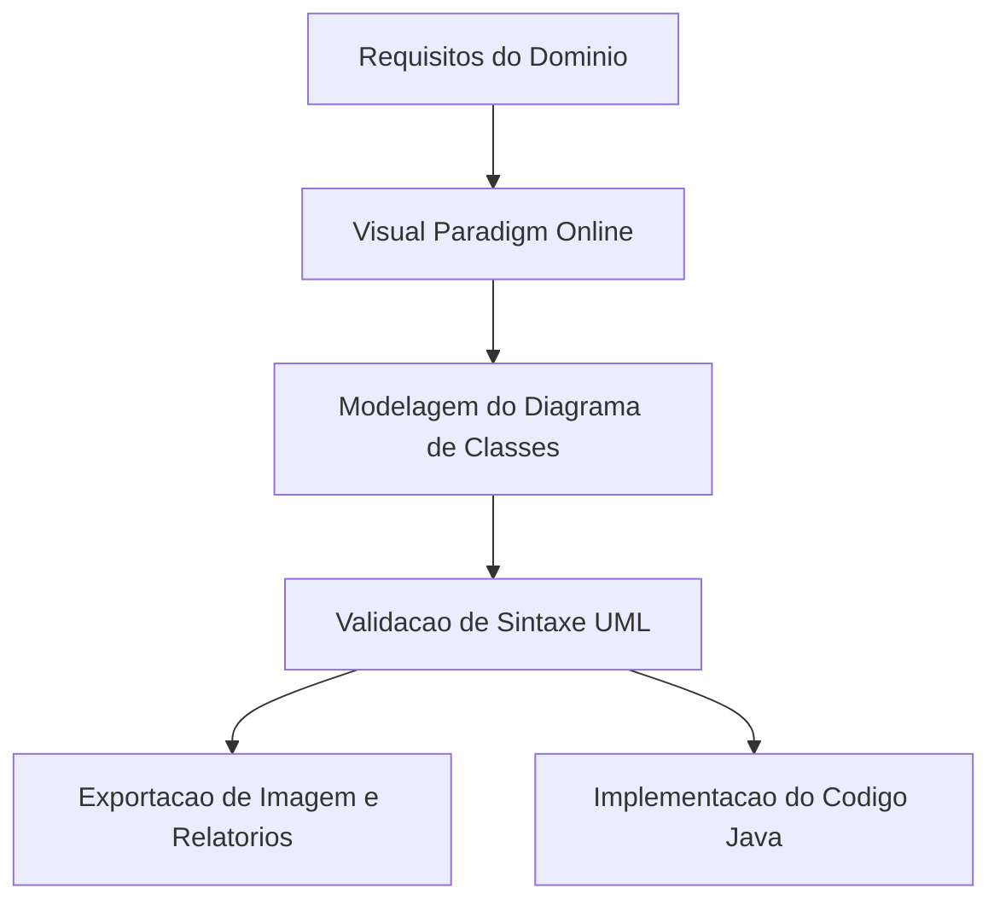

### Comparativo de ferramentas de modelagem

| Ferramenta | Tipo de Ambiente | Suporte à UML | Colaboração em Tempo Real | Geração de Código |
| :--- | :--- | :--- | :--- | :--- |
| Visual Paradigm Online | Web / Cloud | Completo (UML 2.x) | Sim (compartilhamento web) | Sim (versões avançadas) |
| Enterprise Architect | Desktop | Completo (UML / SysML) | Suportado via repositório | Completo (multi-linguagem) |
| Astah Community/UML | Desktop | Foco acadêmico | Não nativo | Sim |
| Mermaid.js (Markdown) | Texto / Código | Subconjunto estrutural | Nativo via Git/Markdown | Indireto |

### Armadilhas e contraexemplos
- **Armadilha:** Tratar a ferramenta de desenho como um editor gráfico comum (como Paint ou Illustrator). A UML possui semântica estrita: conectar duas classes com uma ponta de seta errada altera completamente o significado arquitetural do sistema.
- **Contraexemplo:** Utilizar conectores genéricos sem multiplicidade ou desenhar setas com pontas arbitrárias apenas para indicar fluxo de dados em um diagrama estrutural de classes.

---

## Etapas do projeto de software e priorização de requisitos via método MoSCoW

### As sete etapas do projeto de software

O desenvolvimento sistemático de software organiza-se em fases lógicas que transformam necessidades de negócio em artefatos de código verificáveis:

1. **Refinamento do Modelo de Análise e Requisitos:** Extração de necessidades, especificação de regras de negócio e identificação de fronteiras do sistema.
2. **Definição da Arquitetura:** Seleção de estilos arquiteturais (monolítico, microsserviços, camadas), tecnologias de banco de dados e comunicação.
3. **Casos de Uso:** Modelagem comportamental do sistema da perspectiva dos atores externos.
4. **Modelagem de Classes:** Representação estrutural estática das entidades do domínio, atributos e relacionamentos.
5. **Modelagem de Interações:** Diagramas de sequência e comunicação para detalhar a troca de mensagens dinâmica entre objetos em tempo de execução.
6. **Definição de Interfaces:** Especificação formal de contratos públicos, APIs REST, interfaces Java e protocolos de integração.
7. **Aplicação de Padrões de Projeto (Design Patterns):** Resolução de problemas recorrentes de design por meio de soluções consolidadas (ex.: Factory, Strategy, Observer).

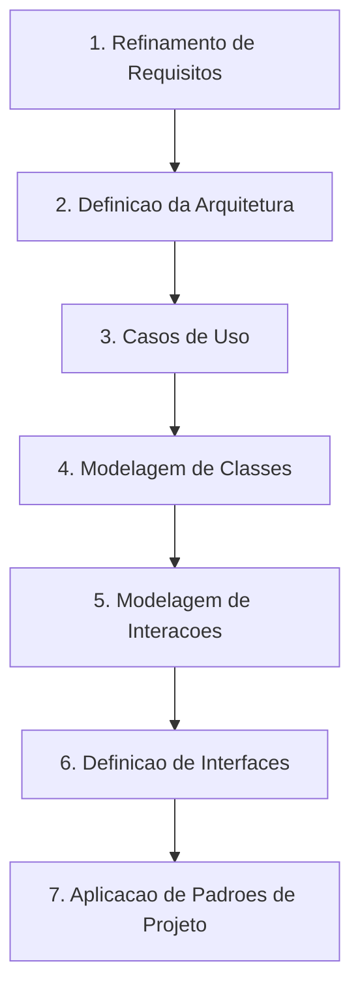

### Priorização de requisitos via método MoSCoW

O método **MoSCoW** é uma técnica ágil de priorização que auxilia o time de engenharia e os stakeholders a chegarem a um consenso sobre a importância relativa de cada entrega dentro de um horizonte de tempo (como uma Sprint ou uma Release):

- **M — Must have (Deve ter):** Requisitos críticos e inegociáveis. Sem eles, o produto não entra em operação nem atende às normas regulatórias.
- **S — Should have (Deveria ter):** Requisitos importantes que agregam alto valor, mas cuja ausência no lançamento não inviabiliza o sistema imediatamente (possuem contornos operacionais temporários).
- **C — Could have (Poderia ter):** Funcionalidades desejáveis que serão incluídas apenas se houver tempo e recursos excedentes após a conclusão dos itens Must e Should.
- **W — Won't have [this time] (Não terá desta vez):** Funcionalidades acordadas formalmente como fora do escopo do ciclo atual, podendo ser revisitadas em versões futuras.

| Categoria MoSCoW | Impacto no Lançamento | Alternativa / Contorno | Exemplo em E-Commerce |
| :--- | :--- | :--- | :--- |
| **Must have** | Bloqueia a entrega | Não há | Processar pagamento do pedido com cartão |
| **Should have** | Alto valor, não bloqueia | Procedimento manual | Notificar cliente via SMS sobre envio |
| **Could have** | Melhoria de conveniência | Não requer contorno | Tema escuro (Dark Mode) na interface |
| **Won't have** | Descartado no ciclo atual | Planejado para próxima release | Recomendação por IA generativa |

---

## Definição, objetivos e princípios da Unified Modeling Language (UML)

### O que é a UML

A **Unified Modeling Language (UML)** é uma linguagem gráfica padronizada para:
- **Visualizar:** Tornar explícitas as estruturas e interações de software.
- **Especificar:** Definir de maneira não ambígua as características de um sistema antes da codificação.
- **Construir:** Servir de planta baixa direta para a escrita do código-fonte em linguagens OO (como Java, C# ou C++).
- **Documentar:** Registrar decisões de engenharia e regras de negócio para manutenção futura.

A UML é formalmente uma **linguagem**: possui um vocabulário próprio (elementos gráficos e símbolos) e regras formais de combinação (sintaxe e semântica). Foi criada na década de 1990 pela unificação dos métodos dos "Three Amigos": **Grady Booch** (método Booch), **James Rumbaugh** (técnica OMT) e **Ivar Jacobson** (método OOSE), sendo posteriormente adotada e padronizada pela Object Management Group (OMG).

### Objetivos centrais

1. Prover aos desenvolvedores, arquitetos e analistas uma linguagem visual comum para expressar o design de sistemas orientados a objetos.
2. Permitir a compreensão rápida da arquitetura de sistemas legados ou em concepção.
3. Fornecer mecanismos de extensibilidade e especialização para domínios específicos (como perfis UML).
4. Viabilizar a rastreabilidade entre requisitos, análise, design e implementação.

### Princípios básicos da modelagem

> "A escolha dos modelos a serem criados tem profunda influência sobre a maneira como um determinado problema é atacado e como uma solução é definida."

Os princípios fundacionais da UML estabelecem que:
- **Nenhum modelo único é suficiente:** Sistemas complexos exigem múltiplos diagramas independentes (estruturais e comportamentais) analisados sob diferentes perspectivas.
- **Níveis de precisão variáveis:** Um modelo pode ser expresso em nível de conceito geral (análise de negócio) ou em nível de detalhe cirúrgico de implementação (design de software com tipos primitivos e visibilidade).

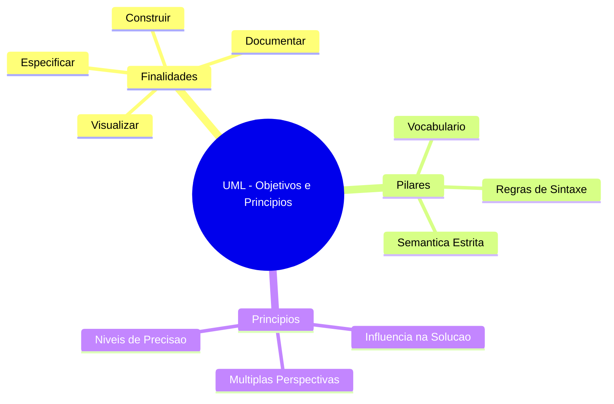

---

## Distinção conceitual: UML como linguagem de notação versus processos e metodologias

### A UML não é um processo

Uma das confusões mais frequentes em engenharia de software é considerar a UML como sinônimo de processo de desenvolvimento ou de metodologia completa. A literatura e o material instrucional enfatizam com clareza:

**A UML NÃO é:**
- Um processo de desenvolvimento.
- Uma metodologia de software.
- A disciplina de Análise e Projeto Orientados a Objetos (APOO) por si só.
- Um manual rígido de regras de negócio ou de projeto.

**A UML É:**
- Uma **linguagem de notação gráfica**.
- Um padrão para representar artefatos concebidos durante as etapas de análise e projeto.

### Comparação conceitual

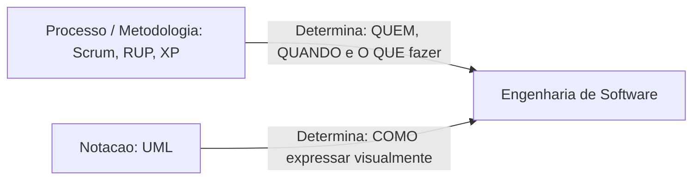

| Dimensão | Processo de Software (Ex.: Scrum, RUP) | Notação de Modelagem (UML) |
| :--- | :--- | :--- |
| **Pergunta respondida** | Quem faz o quê, quando e como entregar valor? | Como documentar visualmente a solução concebida? |
| **Elementos constitutivos** | Fases, sprints, papéis, ritos, cerimônias, artefatos de processo | Diagramas, formas geométricas, conectores, visibilidades |
| **Flexibilidade** | Pode ser iterativo, incremental, cascata | Neutra: pode ser aplicada em cascata, ágil ou híbrido |
| **Exemplo de uso** | "A equipe realizará uma Daily diária de 15 minutos." | "A classe Pedido possui composição com a classe Item." |

---

## Integração entre modelagem de software e desenvolvimento ágil com framework Scrum

### O framework Scrum e os ciclos iterativos

O **Scrum** é um framework ágil concebido para o desenvolvimento de produtos complexos de forma iterativa e incremental. Ele permite que o time entregue incrementos potencialmente utilizáveis de software ao final de ciclos curtos chamados **Sprints** (geralmente de 1 a 4 semanas).

O ciclo do Scrum opera sob quatro ações centrais:
- **Planeja:** Seleciona os itens prioritários do Product Backlog para a Sprint.
- **Desenvolve:** Projeta, implementa e testa as funcionalidades selecionadas.
- **Inspeciona:** Apresenta o incremento gerado aos clientes e partes interessadas na Sprint Review.
- **Adapta:** Ajusta processos, ferramentas e relações na Sprint Retrospective.

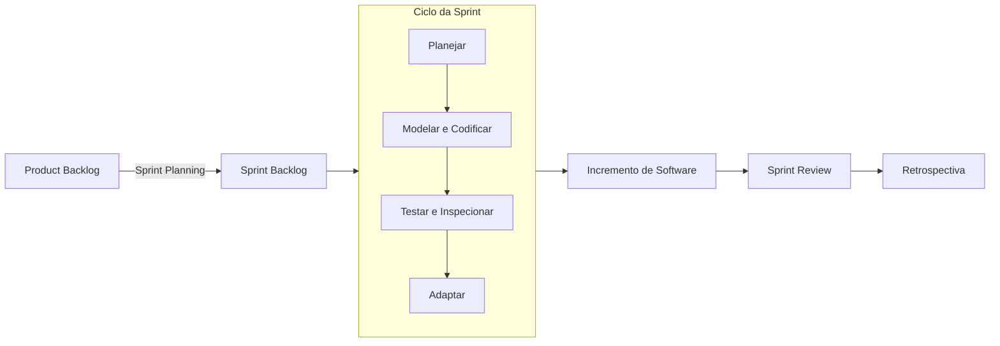

### O papel da UML dentro de um time ágil

Em abordagens ágeis modernas, a modelagem com UML não desaparece; ela muda de propósito:
- **Abordagem Tradicional (Cascata):** Modelagem pesada e antecipada (BDUF — *Big Design Up Front*), gerando centenas de páginas de diagramas antes de qualquer linha de código.
- **Abordagem Ágil (Scrum):** Modelagem *Just-in-Time* e *Just-Enough*. A equipe modela apenas o necessário para alinhar a arquitetura da Sprint atual, desenhando diagramas de classes em quadros brancos ou no Visual Paradigm Online para guiar o pareamento e a divisão de tarefas.

---

## Estrutura do Diagrama de Classes: compartimentos de nome, atributos e operações

### Anatomia fundamental

O **Diagrama de Classes** é o diagrama estrutural central da modelagem orientada a objetos na UML. Ele descreve a estrutura estática do sistema ao exibir as classes, seus atributos, seus métodos e os relacionamentos que unem seus objetos.

Graficamente, uma classe é representada por um retângulo segmentado horizontalmente em **três compartimentos**:

1. **Compartimento Superior (Nome):** Contém o identificador da classe.
2. **Compartimento Central (Atributos):** Contém o estado dos objetos, detalhando os dados encapsulados.
3. **Compartimento Inferior (Operações / Métodos):** Contém o comportamento da classe, ou seja, as operações que os objetos sabem executar.

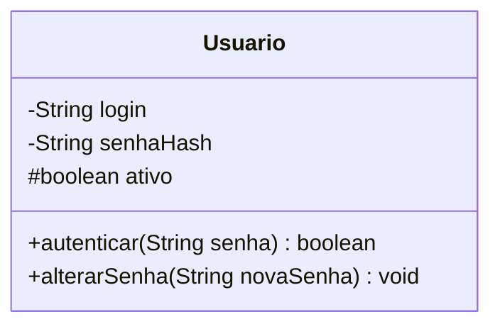

### Sintaxe formal dos membros

Na especificação formal da UML, atributos e métodos seguem uma sintaxe estrita:

- **Sintaxe do Atributo:**
  `[visibilidade] nome : tipo [multiplicidade] = [valorPadrao]`
  - Exemplo: `- nome : String`
  - Exemplo: `# saldos : Double[0..*]`

- **Sintaxe da Operação:**
  `[visibilidade] nomeOperacao([parametro : tipo]) : tipoRetorno`
  - Exemplo: `+ getNome() : String`
  - Exemplo: `+ calcularDesconto(taxa : Double) : Double`

---

## Padrões de nomenclatura e convenções para modelagem de domínio

### Vocabulário do domínio

As classes devem receber nomes extraídos diretamente do vocabulário do domínio do problema (conceito conhecido na literatura de engenharia de software e DDD — Domain-Driven Design — como *Linguagem Ubíqua*).

### Convenções de mercado e de time

A definição de padrões de nomenclatura evita ambiguidades conceituais e garante uniformidade técnica entre a modelagem e o código-fonte:

- **Nomes de Classes:**
  - Devem ser **substantivos no singular**.
  - Devem utilizar a convenção **PascalCase** (iniciando com letra maiúscula).
  - Exemplos: `Cliente`, `PedidoVenda`, `ContaCorrente`, `NotaFiscal`.
  - Evitar: `ProcessadorDeDadosGerais`, `FazerPedido`, `Clientes` (no plural).

- **Nomes de Atributos:**
  - Devem ser **substantivos ou adjetivos**.
  - Devem utilizar a convenção **camelCase** (iniciando com letra minúscula).
  - Exemplos: `dataEmissao`, `limiteCredito`, `ativo`.

- **Nomes de Operações / Métodos:**
  - Devem ser iniciados por **verbos no infinitivo** que descrevam a ação realizada.
  - Devem utilizar a convenção **camelCase**.
  - Exemplos: `calcularTotal()`, `emitirComprovante()`, `cancelar()`.

| Elemento | Padrão Recomendado | Exemplo Correto | Exemplo Incorreto |
| :--- | :--- | :--- | :--- |
| Classe | Substantivo Singular, PascalCase | `Fatura` | `Faturar`, `Faturas` |
| Atributo | Substantivo, camelCase | `valorTotal` | `Valor_Total`, `calculo()` |
| Método | Verbo, camelCase | `validarCpf()` | `CpfValido`, `dados()` |

---

## Modificadores de visibilidade e níveis de encapsulamento (+ público, # protegido, - privado)

### Conceito e símbolos da notação UML

O encapsulamento é um dos pilares centrais da orientação a objetos, garantindo a proteção do estado interno dos objetos contra acessos descontrolados. A UML estabelece símbolos universais para representar os modificadores de visibilidade:

- **`+` Público (Public):** O membro é visível para qualquer classe em qualquer pacote do sistema.
- **`#` Protegido (Protected):** O membro é visível apenas para a própria classe e para as classes especializadas que herdam dela (subclasses), além de classes pertencentes ao mesmo pacote (em linguagens como Java).
- **`-` Privado (Private):** O membro é acessível e visível estritamente dentro da própria classe em que foi declarado.
- *(Complemento técnico)* **`~` Pacote (Package):** Visível apenas por classes pertencentes ao mesmo pacote (default em Java).

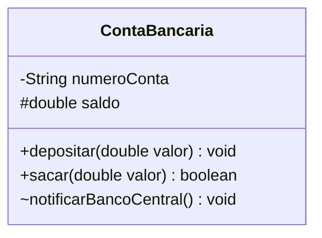

### Matriz de visibilidade e mapeamento para Java

| Modificador UML | Símbolo | Palavra-chave Java | Acesso na Própria Classe | Acesso por Subclasses | Acesso no Mesmo Pacote | Acesso Externo Geral |
| :--- | :---: | :--- | :---: | :---: | :---: | :---: |
| **Público** | `+` | `public` | Sim | Sim | Sim | Sim |
| **Protegido** | `#` | `protected` | Sim | Sim | Sim | Não |
| **Privado** | `-` | `private` | Sim | Não | Não | Não |
| **Pacote** | `~` | *(sem modificador)* | Sim | Não | Sim | Não |

### Exemplo em código Java comentado

```java
package br.unifef.modelagem;

public class ContaBancaria {
    // Visibilidade Privada (-): Ocultamento estrito de dados sensíveis
    private String numeroConta;
    
    // Visibilidade Protegida (#): Compartilhado com subclasses (ex.: ContaPoupanca)
    protected double saldo;

    // Construtor Público (+)
    public ContaBancaria(String numeroConta, double saldoInicial) {
        this.numeroConta = numeroConta;
        this.saldo = saldoInicial;
    }

    // Visibilidade Publica (+): Operacao acessivel externamente por qualquer servico
    public void depositar(double valor) {
        if (valor > 0) {
            this.saldo += valor;
        }
    }

    // Visibilidade Package-Private (~): Acessivel apenas por servicos deste mesmo pacote
    void notificarBancoCentral() {
        // Comunicacao interna de auditoria
    }
}
```

---

## Navegabilidade, papéis e indicadores de multiplicidade (1, 1..*, 0..*, 0..1, m..n)

### Elementos de uma linha de relacionamento

Um relacionamento na UML não é apenas uma linha estática; ele carrega metadados fundamentais:
- **Nome do Relacionamento:** A semântica da relação (ex.: "trabalha para", "possui").
- **Sentido de Leitura:** Indicado por um triângulo sólido pequeno ao lado do nome da associação.
- **Navegabilidade:** Indicada por uma seta na extremidade do relacionamento, definindo qual objeto conhece a existência do outro em memória. Se não houver setas nas extremidades, subentende-se navegabilidade bidirecional.
- **Papéis (Roles):** Nomes explícitos atribuídos às extremidades da associação, indicando a função de cada objeto na relação (ex.: `empregador`, `empregado`).
- **Multiplicidade:** A quantidade de instâncias de uma classe que podem se relacionar com uma única instância da classe oposta.

### Indicadores de multiplicidade padronizados

A tabela a seguir consolida as faixas de cardinalidade e sua interpretação na regra de negócio:

| Indicador UML | Significado Formal | Implementação Típica em Java |
| :--- | :--- | :--- |
| **`1`** | Exatamente um (obrigatório e singular) | Atributo direto de tipo de referência não nulo |
| **`1..*`** | Um ou mais (obrigatório e múltiplo) | Coleção (`List<T>`) inicializada com validação de tamanho mínimo |
| **`0..*`** ou **`*`** | Zero ou mais (opcional e múltiplo) | Coleção (`List<T>`) vazia ou populada |
| **`0..1`** | Zero ou um (opcional e singular) | Atributo que aceita `null` ou uso de `Optional<T>` |
| **`m..n`** | Faixa arbitrária fechada (ex.: `2..5`) | Coleção com regras de negócio que validam limites inferior e superior |

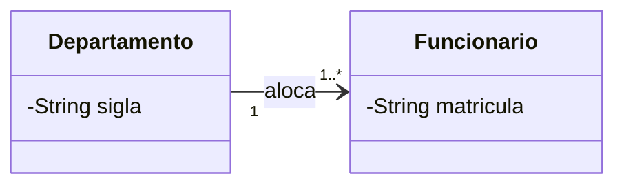

---

## Associação simples entre objetos do domínio

### Definição e semântica

A **Associação Simples** indica uma conexão estrutural direta em que um objeto conhece ou interage com outro objeto, sem que haja uma relação de subordinação forte do tipo "todo-parte". É a forma mais comum de ligação estrutural.

- **Notação:** Uma linha sólida contínua unindo as duas classes envolvidas.
- **Semântica:** Um objeto retém uma referência permanente ao outro através de atributos de instância.

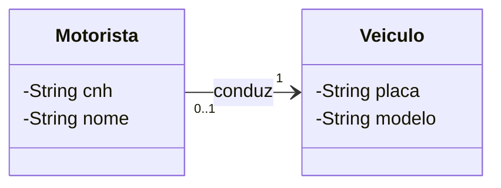

### Implementação em Java

```java
public class Motorista {
    private String cnh;
    private String nome;
    // Associacao simples: Motorista conhece o Veiculo que conduz
    private Veiculo veiculoConduzido;

    public Motorista(String cnh, String nome) {
        this.cnh = cnh;
        this.nome = nome;
    }

    public void associarVeiculo(Veiculo veiculo) {
        this.veiculoConduzido = veiculo;
    }
}

public class Veiculo {
    private String placa;
    private String modelo;

    public Veiculo(String placa, String modelo) {
        this.placa = placa;
        this.modelo = modelo;
    }
}
```

---

## Associação por Agregação (losango vazio): relacionamento todo-parte fraco e ciclo de vida desacoplado

### Definição aprofundada

A **Agregação** é uma variação especializada da associação binária que expressa um relacionamento estrutural do tipo **todo-parte fraco**.

Características fundamentais:
- **Desacoplamento de Ciclo de Vida:** A classe "parte" existe de maneira autônoma no sistema. Se o objeto "todo" for destruído, cancelado ou excluído da memória, o objeto "parte" continua existindo plenamente.
- **Compartilhamento:** A mesma instância da "parte" pode estar associada a múltiplos objetos "todo" simultaneamente ou ao longo do tempo.
- **Notação Gráfica:** Linha sólida com um **losango vazio (não preenchido)** colado junto à classe que representa o **todo**.

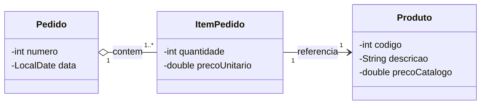

### Exemplo e raciocínio técnico

Conforme exemplificado no slide 22 da aula:
- Um `Pedido` agrega `Itens`, que por sua vez referenciam `Produtos`.
- Se um `Pedido` for cancelado e descartado da memória da aplicação, os `Produtos` vinculados a ele permanecem intactos no catálogo do sistema para novas vendas.

### Implementação em Java

```java
import java.util.ArrayList;
import java.util.List;

// Objeto Parte (independente): Produto existe no catalogo independentemente do Pedido
public class Produto {
    private int codigo;
    private String descricao;
    private double preco;

    public Produto(int codigo, String descricao, double preco) {
        this.codigo = codigo;
        this.descricao = descricao;
        this.preco = preco;
    }
    
    public double getPreco() { return preco; }
    public String getDescricao() { return descricao; }
}

// Objeto Todo: O Pedido agrega itens que fazem referencia aos produtos existentes
public class Pedido {
    private int numero;
    private List<Produto> produtos;

    public Pedido(int numero) {
        this.numero = numero;
        // Os produtos sao passados de fora ou associados; nao nascem exclusivamente aqui
        this.produtos = new ArrayList<>();
    }

    public void adicionarProduto(Produto produto) {
        this.produtos.add(produto);
    }

    // Se o pedido for destruido, a lista de referencias e descartada,
    // mas os objetos 'Produto' continuam vivos no catalogo geral.
}
```

---

## Associação por Composição (losango preenchido): relacionamento todo-parte forte e dependência de ciclo de vida

### Definição aprofundada

A **Composição** representa a forma mais restrita e intensa de relacionamento estrutural: é uma relação **todo-parte forte**.

Características fundamentais:
- **Acoplamento Estrito de Ciclo de Vida:** O ciclo de vida do objeto "parte" está umbilicalmente atrelado ao ciclo de vida do objeto "todo". A parte não tem razão de existir fora do contexto do todo.
- **Exclusividade e Criação:** A criação da parte geralmente ocorre de forma encapsulada dentro do próprio todo. Se o objeto todo for destruído ou coletado pelo Garbage Collector, todas as suas partes constituintes deixam de existir imediatamente.
- **Notação Gráfica:** Linha sólida com um **losango preenchido (sólido)** colado junto à classe que representa o **todo**.

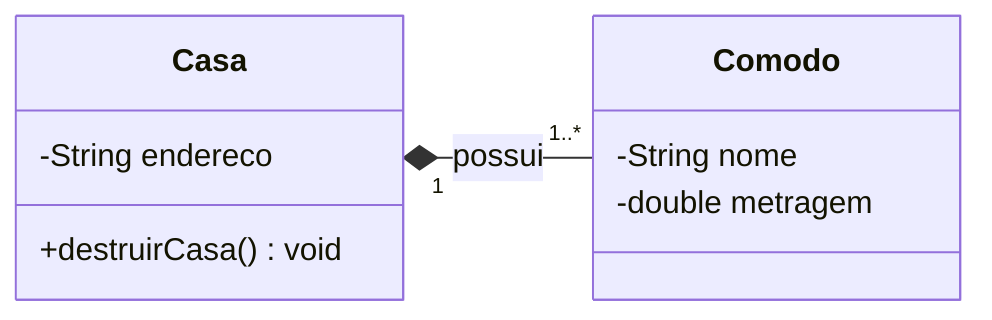

### Exemplo da aula (Slide 23)

O exemplo clássico apresentado em sala é `Casa ◆— 1..* Cômodo`:
- Uma `Casa` é composta por `Cômodos` (sala, quarto, cozinha).
- Não faz sentido físico ou conceitual negociar ou manter um "quarto" flutuando na memória sem a existência da casa correspondente. Se a casa for demolida/destruída, seus cômodos desaparecem juntos.

### Comparativo definitivo: Agregação vs. Composição

| Propriedade de Engenharia | Agregação (Losango Vazio ♢) | Composição (Losango Preenchido ◆) |
| :--- | :--- | :--- |
| **Vínculo Todo-Parte** | Fraco | Forte |
| **Existência da Parte** | Independente do Todo | Dependente estrita do Todo |
| **Ciclo de Vida** | Desacoplado | Compartilhado / Concomitante |
| **Destruição do Todo** | Mantém as partes íntegras | Destrói e descarta as partes |
| **Responsabilidade de Criação** | Injeção externa via construtor ou setter | Instanciação gerenciada internamente pelo Todo |
| **Exemplo de Domínio** | `Pedido` e `Produto` | `Casa` e `Cômodo` |

### Implementação em Java

```java
import java.util.ArrayList;
import java.util.List;

public class Comodo {
    private String nome;
    private double metragem;

    public Comodo(String nome, double metragem) {
        this.nome = nome;
        this.metragem = metragem;
    }

    public String getNome() { return nome; }
}

public class Casa {
    private String endereco;
    private List<Comodo> comodos;

    public Casa(String endereco) {
        this.endereco = endereco;
        this.comodos = new ArrayList<>();
        // Na composicao forte, a Casa cria e gerencia o ciclo de vida dos seus proprios comodos
        this.comodos.add(new Comodo("Sala Principal", 25.0));
        this.comodos.add(new Comodo("Cozinha", 15.0));
    }

    public void adicionarComodo(String nome, double metragem) {
        // O comodo nasce de dentro do contexto da casa
        this.comodos.add(new Comodo(nome, metragem));
    }

    public void demolir() {
        // Ao destruir a casa, todos os comodos perdem suas referencias e deixam de existir
        this.comodos.clear();
        this.comodos = null;
    }
}
```

---

## Generalização e especialização: herança de atributos e comportamentos

### Definição conceitual e notação

A **Generalização** (popularmente implementada na forma de **Herança**) é o relacionamento taxonômico entre um elemento geral (chamado de **superclasse**) e um ou mais elementos específicos (chamados de **subclasses**).

- **Semântica:** Relação do tipo "é um" (*is-a*). A subclasse herda automaticamente todos os atributos e métodos públicos e protegidos da superclasse, podendo:
  - Adicionar novos atributos específicos.
  - Adicionar novas operações exclusivas.
  - Sobrescrever (*override*) o comportamento de métodos existentes para viabilizar polimorfismo.
- **Notação Gráfica:** Linha sólida com uma **seta com triângulo oco (aberto)** na extremidade que aponta diretamente para a **superclasse**.

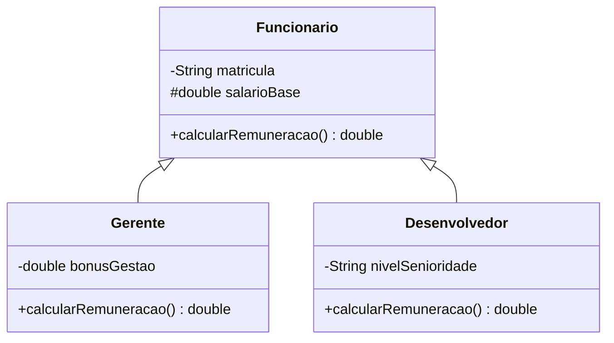

### O exemplo da aula (Slide 24)

No slide 24, a superclasse `Funcionario` é especializada por `Gerente` e `Desenvolvedor`:
- Ambos são funcionários e compartilham atributos comuns (como matrícula, nome e salário base).
- O `Gerente` possui regras de remuneração que incorporam bonificação por metas de gestão.
- O `Desenvolvedor` possui remuneração calculada de acordo com seu nível técnico e horas extras.

### Implementação em Java

```java
public abstract class Funcionario {
    private String matricula;
    private String nome;
    // O uso de '#' protegido viabiliza acesso direto nas subclasses especializadas
    protected double salarioBase;

    public Funcionario(String matricula, String nome, double salarioBase) {
        this.matricula = matricula;
        this.nome = nome;
        this.salarioBase = salarioBase;
    }

    public String getNome() { return nome; }

    // Metodo polimorfico a ser sobrescrito pelas subclasses
    public abstract double calcularRemuneracao();
}

public class Gerente extends Funcionario {
    private double bonusGestao;

    public Gerente(String matricula, String nome, double salarioBase, double bonusGestao) {
        super(matricula, nome, salarioBase);
        this.bonusGestao = bonusGestao;
    }

    @Override
    public double calcularRemuneracao() {
        // Acesso direto ao atributo protegido herdado
        return this.salarioBase + this.bonusGestao;
    }
}

public class Desenvolvedor extends Funcionario {
    private String nivelSenioridade;

    public Desenvolvedor(String matricula, String nome, double salarioBase, String nivelSenioridade) {
        super(matricula, nome, salarioBase);
        this.nivelSenioridade = nivelSenioridade;
    }

    @Override
    public double calcularRemuneracao() {
        if ("SENIOR".equalsIgnoreCase(nivelSenioridade)) {
            return this.salarioBase * 1.30; // 30% de gratificacao de projeto
        }
        return this.salarioBase;
    }
}
```

---

## Dependência estrutural transitória: uso temporário de classes em operações de serviço

### Definição aprofundada

A **Dependência** é considerada o relacionamento estrutural mais fraco da UML. Ela declara que um elemento (o cliente) depende de outro elemento (o fornecedor) para funcionar, mas **sem reter uma ligação permanente em memória**.

Características essenciais:
- **Transitoriedade:** Uma alteração na especificação da classe fornecedora pode exigir alterações na classe cliente, mas o cliente **não mantém a instância fornecedora como um atributo de classe**.
- **Ocorrência Comum:**
  - O fornecedor é passado como parâmetro de um método específico.
  - O fornecedor é instanciado como uma variável local temporária dentro de um método.
  - O fornecedor é o tipo de retorno de uma operação.
- **Notação Gráfica:** **Linha tracejada com uma ponta de seta aberta simples** apontando para a classe fornecedora da qual o cliente depende.

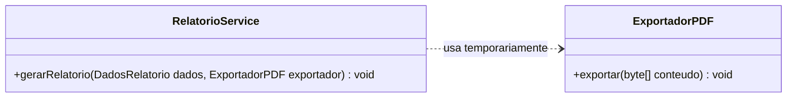

### O exemplo da aula (Slide 26)

O slide 26 ilustra a relação entre `RelatorioService` e `ExportadorPDF`:
- A classe de serviço `RelatorioService` precisa do `ExportadorPDF` apenas no momento exato em que vai processar e emitir o documento.
- Tão logo o método termina a sua execução, a referência ao exportador é liberada da pilha de chamadas (*stack*), não permanecendo armazenada no estado persistente (*heap*) do objeto de serviço.

### Implementação em Java

```java
public class ExportadorPDF {
    public void exportar(String conteudo) {
        System.out.println("Exportando documento PDF com conteudo: " + conteudo);
    }
}

public class RelatorioService {
    // Note que ExportadorPDF NAO e um atributo privado da classe RelatorioService!
    // A ligacao e estritamente transitoria (parametro de operacao).
    public void emitirRelatorio(String conteudoBruto, ExportadorPDF exportador) {
        String dadosProcessados = "RELATORIO CONSOLIDADO: " + conteudoBruto.toUpperCase();
        // Chamada temporaria
        exportador.exportar(dadosProcessados);
        // Ao finalizar este metodo, a ligacao entre RelatorioService e ExportadorPDF encerra-se.
    }
}
```

---

## Código da aula

O código-fonte de suporte da aula organiza os conceitos teóricos e práticos em dois arquivos autônomos localizados na pasta de código:

- [./codigo/ExemplosAula.java](file:///./codigo/ExemplosAula.java): Implementação completa demonstrando encapsulamento com modificadores de acesso, agregação entre pedidos e produtos, composição entre casa e cômodos, herança polimórfica de funcionários e dependência transiente em serviços.
- [./codigo/Exercicios.java](file:///./codigo/Exercicios.java): Resolução estruturada e modular dos 4 exercícios analíticos propostos pela disciplina, contendo testes e asserções executáveis.

### Trechos essenciais comentados de `./codigo/ExemplosAula.java`

O trecho abaixo evidencia a diferença prática entre manter um atributo persistente (Associação/Agregação) e receber um colaborador temporário (Dependência):

```java
// Linha 85 a 105 de ./codigo/ExemplosAula.java
public class RelatorioService {
    // Dependencia: ExportadorPDF nao e campo de instancia da classe!
    public void processarRelatorioMensal(String relatorio, ExportadorPDF exportador) {
        if (exportador == null) {
            throw new IllegalArgumentException("Exportador nao pode ser nulo.");
        }
        // Utilizacao temporaria
        exportador.exportar(relatorio);
        // Fim da vida util da referencia na pilha do metodo
    }
}
```

---

## Exercícios

### Exercício 1: Diferenciação Prática entre Composição e Agregação

**Enunciado:**  
Com base nos conceitos de relacionamentos todo-parte apresentados na aula, implemente em Java a modelagem de dois cenários distintos:
1. Um sistema predial em que uma `Casa` é composta por `Cômodos` (Composição forte), garantindo que a destruição da casa desassocie e inutilize os seus cômodos;
2. Um sistema de vendas em que um `Pedido` possui `Itens` associados a `Produtos` (Agregação fraca), demonstrando que o cancelamento ou destruição de um pedido não elimina os produtos cadastrados no catálogo. Escreva um método de demonstração que evidencie a diferença no ciclo de vida dos objetos parte em cada caso.

**Raciocínio:**  
Na composição, a `Casa` deve ser a dona absoluta do ciclo de vida dos `Cômodos`, instanciando-os internamente e limpando suas referências na destruição. Na agregação, os `Produtos` são instanciados fora do `Pedido` (no catálogo) e injetados nele; quando o `Pedido` for destruído (ou anulado), a referência ao produto no catálogo permanece ativa e acessível.

**Resolução completa em Java:**

```java
import java.util.ArrayList;
import java.util.List;

public class Exercicio1Resolucao {

    // --- CENARIO A: COMPOSICAO FORTE ---
    public static class Comodo {
        private String nome;
        public Comodo(String nome) { this.nome = nome; }
        public String getNome() { return nome; }
    }

    public static class Casa {
        private String endereco;
        private List<Comodo> comodos = new ArrayList<>();

        public Casa(String endereco) {
            this.endereco = endereco;
            // A casa instancia e gerencia seus proprios comodos
            comodos.add(new Comodo("Quarto"));
            comodos.add(new Comodo("Sala"));
        }

        public void destruirCasa() {
            // Destruicao forte: comodos sao eliminados com o todo
            this.comodos.clear();
            this.comodos = null;
        }

        public List<Comodo> getComodos() { return comodos; }
    }

    // --- CENARIO B: AGREGACAO FRACA ---
    public static class Produto {
        private String nome;
        private double preco;
        public Produto(String nome, double preco) {
            this.nome = nome;
            this.preco = preco;
        }
        public String getNome() { return nome; }
    }

    public static class Pedido {
        private int id;
        private List<Produto> itens = new ArrayList<>();

        public Pedido(int id) { this.id = id; }

        public void adicionarProduto(Produto p) {
            this.itens.add(p);
        }

        public void cancelarPedido() {
            // Cancelar pedido nao afeta a existencia dos produtos
            this.itens.clear();
        }
    }

    public static void main(String[] args) {
        // Teste de Composicao
        Casa minhaCasa = new Casa("Rua das Flores, 123");
        System.out.println("Casa criada com " + minhaCasa.getComodos().size() + " comodos.");
        minhaCasa.destruirCasa();
        System.out.println("Apos destruirCasa(), comodos estao inacessiveis: " + (minhaCasa.getComodos() == null));

        // Teste de Agregacao
        Produto notebook = new Produto("Notebook Dell", 4500.0);
        Pedido pedido1 = new Pedido(101);
        pedido1.adicionarProduto(notebook);
        pedido1.cancelarPedido();
        // O produto permanece existindo normalmente
        System.out.println("Pedido cancelado. Produto no catalogo continua vivo: " + notebook.getNome());
    }
}
```
*Código completo disponível em:* [./codigo/Exercicios.java](file:///./codigo/Exercicios.java)

---

### Exercício 2: Especialização e Herança com Visibilidade Protegida

**Enunciado:**  
Implemente a estrutura de Generalização apresentada no slide 24: a superclasse `Funcionario` e suas classes especializadas `Gerente` e `Desenvolvedor`. Aplique os modificadores de visibilidade UML correspondentes: atributos privados (`-`) para dados sensíveis, membros protegidos (`#`) para atributos compartilhados com subclasses (como salário base) e métodos públicos (`+`) para operações de negócio. Crie métodos de cálculo de remuneração total que sobrescrevam o comportamento base nas classes filhas e demonstre o polimorfismo instanciando ambos em uma coleção de funcionários.

**Raciocínio:**  
A classe `Funcionario` deve ser abstrata para evitar instanciação direta de funcionários genéricos. O atributo `salarioBase` deve ser declarado como `protected` para que as subclasses acessem o valor sem necessidade de acoplar métodos getters nos cálculos matemáticos internos. Uma lista polimórfica `List<Funcionario>` demonstrará a invocação dinâmica do método `calcularRemuneracao()`.

**Resolução completa em Java:**

```java
import java.util.ArrayList;
import java.util.List;

public class Exercicio2Resolucao {

    public static abstract class Funcionario {
        // Privado (-): Ninguem de fora nem subclasses acessam diretamente
        private String matricula;
        private String nome;

        // Protegido (#): Subclasses Gerente e Desenvolvedor acessam diretamente
        protected double salarioBase;

        public Funcionario(String matricula, String nome, double salarioBase) {
            this.matricula = matricula;
            this.nome = nome;
            this.salarioBase = salarioBase;
        }

        public String getNome() { return nome; }

        // Publico (+): Contrato polimorfico
        public abstract double calcularRemuneracao();
    }

    public static class Gerente extends Funcionario {
        private double bonusGestao;

        public Gerente(String matricula, String nome, double salarioBase, double bonusGestao) {
            super(matricula, nome, salarioBase);
            this.bonusGestao = bonusGestao;
        }

        @Override
        public double calcularRemuneracao() {
            return this.salarioBase + this.bonusGestao;
        }
    }

    public static class Desenvolvedor extends Funcionario {
        private int horasExtras;

        public Desenvolvedor(String matricula, String nome, double salarioBase, int horasExtras) {
            super(matricula, nome, salarioBase);
            this.horasExtras = horasExtras;
        }

        @Override
        public double calcularRemuneracao() {
            double valorHoraExtra = (this.salarioBase / 160) * 1.5;
            return this.salarioBase + (this.horasExtras * valorHoraExtra);
        }
    }

    public static void main(String[] args) {
        List<Funcionario> folha = new ArrayList<>();
        folha.add(new Gerente("M01", "Ana Silva", 8000.0, 3000.0));
        folha.add(new Desenvolvedor("D01", "Carlos Dev", 5000.0, 20));

        System.out.println("Folha de Pagamento Polimorfica:");
        for (Funcionario f : folha) {
            System.out.println(f.getNome() + " - Total: R$ " + f.calcularRemuneracao());
        }
    }
}
```
*Código completo disponível em:* [./codigo/Exercicios.java](file:///./codigo/Exercicios.java)

---

### Exercício 3: Acoplamento Fraco com Relação de Dependência

**Enunciado:**  
O slide 26 define a dependência como o relacionamento estrutural mais fraco da UML, no qual uma classe utiliza outra temporariamente sem reter uma referência permanente como atributo (exemplo: `RelatorioService` depende de `ExportadorPDF`). Desenvolva um programa em Java demonstrando essa relação. A classe `RelatorioService` deve conter um método que receba dados de entrada e uma instância de `ExportadorPDF` passada como parâmetro (ou criada localmente no método), gerando a saída sem armazenar o exportador no estado do objeto após a execução.

**Raciocínio:**  
Para garantir fidelidade ao relacionamento de dependência (`..>`), a classe `RelatorioService` não deve ter nenhum campo do tipo `ExportadorPDF`. O acoplamento se restringe à assinatura do método, reduzindo significativamente o acoplamento de estado entre classes de serviço e seus utilitários.

**Resolução completa em Java:**

```java
public class Exercicio3Resolucao {

    public static class ExportadorPDF {
        public void exportarParaArquivo(String nomeArquivo, String conteudo) {
            System.out.println("[PDF Gerado] Arquivo: " + nomeArquivo + ".pdf | Dados: " + conteudo);
        }
    }

    public static class RelatorioService {
        // Note: SEM atributos de instancia vinculados a ExportadorPDF!

        // Dependencia expressa como parametro transitivo de metodo
        public void processarRelatorioFinanceiro(String dados, ExportadorPDF exportador) {
            String conteudoFormatado = "--- RELATORIO MENSAL ---\n" + dados;
            exportador.exportarParaArquivo("financeiro_setembro", conteudoFormatado);
        }

        // Dependencia expressa via instanciacao local
        public void processarRelatorioSimples(String dados) {
            ExportadorPDF exportadorLocal = new ExportadorPDF();
            exportadorLocal.exportarParaArquivo("simples", dados);
        }
    }

    public static void main(String[] args) {
        RelatorioService service = new RelatorioService();
        ExportadorPDF pdfWriter = new ExportadorPDF();

        // O servico usa o exportador sob demanda
        service.processarRelatorioFinanceiro("Faturamento: R$ 50.000", pdfWriter);
        service.processarRelatorioSimples("Resumo de Vendas");
    }
}
```
*Código completo disponível em:* [./codigo/Exercicios.java](file:///./codigo/Exercicios.java)

---

### Exercício 4: Implementação e Validação de Multiplicidade Estrita

**Enunciado:**  
Os indicadores de multiplicidade definem a cardinalidade permitida entre classes associadas (`1`, `1..*`, `0..*`). Projete e codifique uma classe `Equipe` que mantenha uma relação de multiplicidade `1..*` com a classe `Membro` (uma equipe deve ter obrigatoriamente um ou mais membros). O construtor de `Equipe` deve exigir o membro fundador na inicialização, e os métodos de remoção de membros devem validar a regra, disparando uma exceção caso uma remoção tente deixar a equipe com zero membros.

**Raciocínio:**  
A multiplicidade `1..*` impõe duas invariantes de software:
1. Uma equipe não pode nascer vazia. Portanto, o construtor deve obrigar a passagem de ao menos um `Membro`.
2. Uma equipe não pode ter seu último membro removido. O método `removerMembro()` deve checar se a lista possui tamanho maior que 1 antes de efetivar a remoção; caso contrário, deve lançar `IllegalStateException`.

**Resolução completa em Java:**

```java
import java.util.ArrayList;
import java.util.Collections;
import java.util.List;

public class Exercicio4Resolucao {

    public static class Membro {
        private String nome;
        public Membro(String nome) {
            if (nome == null || nome.trim().isEmpty()) {
                throw new IllegalArgumentException("Nome do membro e obrigatorio.");
            }
            this.nome = nome;
        }
        public String getNome() { return nome; }
    }

    public static class Equipe {
        private String nomeEquipe;
        // Invariante de Multiplicidade: 1..* (no minimo 1 elemento SEMPRE)
        private List<Membro> membros = new ArrayList<>();

        // O construtor impoe a regra 1..* exigindo o membro inicial
        public Equipe(String nomeEquipe, Membro fundador) {
            if (fundador == null) {
                throw new IllegalArgumentException("Multiplicidade violada: Equipe exige ao menos 1 membro na criacao.");
            }
            this.nomeEquipe = nomeEquipe;
            this.membros.add(fundador);
        }

        public void adicionarMembro(Membro novoMembro) {
            if (novoMembro != null && !membros.contains(novoMembro)) {
                this.membros.add(novoMembro);
            }
        }

        public void removerMembro(Membro membro) {
            if (this.membros.size() <= 1) {
                // Bloqueia a violacao da multiplicidade minima 1
                throw new IllegalStateException("Multiplicidade violada: Uma equipe nao pode ficar com zero membros!");
            }
            this.membros.remove(membro);
        }

        public List<Membro> getMembros() {
            return Collections.unmodifiableList(membros);
        }
    }

    public static void main(String[] args) {
        Membro dev1 = new Membro("Wesley");
        Membro dev2 = new Membro("Murilo");

        Equipe equipe = new Equipe("Alpha Team", dev1);
        equipe.adicionarMembro(dev2);
        System.out.println("Equipe criada com sucesso. Membros: " + equipe.getMembros().size());

        // Remocao permitida (passa de 2 para 1)
        equipe.removerMembro(dev2);
        System.out.println("Membro removido. Membros restantes: " + equipe.getMembros().size());

        // Tentativa de remocao ilegal (violando 1..*)
        try {
            equipe.removerMembro(dev1);
        } catch (IllegalStateException e) {
            System.out.println("Excecao capturada com sucesso: " + e.getMessage());
        }
    }
}
```
*Código completo disponível em:* [./codigo/Exercicios.java](file:///./codigo/Exercicios.java)

---

## Erros comuns e boas práticas

### Erros comuns cometidos por estudantes

1. **Confundir Composição com Agregação:**
   - *Erro:* Declarar que um `Pedido` tem composição com `Produto`, sugerindo que apagar o pedido apaga o produto do estoque.
   - *Correção:* A relação é de agregação fraca (losango vazio). O produto possui ciclo de vida próprio e autônomo.
2. **Inversão da Seta de Generalização/Herança:**
   - *Erro:* Desenhar a seta de herança apontando da superclasse para as subclasses (ou seja, apontando do pai para o filho).
   - *Correção:* A ponta da seta fechada com triângulo oco aponta **sempre para a superclasse** (da subclasse especializada em direção à classe geral).
3. **Modelar Dependência como Atributo:**
   - *Erro:* Colocar uma classe de exportação (ex.: `ExportadorPDF`) como atributo de instância permanente em uma classe de serviço.
   - *Correção:* A dependência expressa uso transitório (`..>`). Ela deve aparecer na assinatura de métodos ou como variável local.
4. **Falta de Validação de Multiplicidade em Código:**
   - *Erro:* Desenhar multiplicidade `1..*` no diagrama e implementar uma lista comum sem validação de nulidade ou de tamanho mínimo no construtor.
   - *Correção:* A multiplicidade modelada no diagrama representa um contrato estrutural que deve ser protegido pelas invariantes do código.

### Boas práticas de engenharia de software

- **Modelagem Enxuta (Just-Enough UML):** Modele os aspectos complexos do domínio que demandam discussão de equipe; evite modelar classes triviais que não agregam valor arquitetural.
- **Convenções Estritas de Nomenclatura:** Adote e respeite o padrão PascalCase para classes e camelCase para atributos e métodos em todo o sistema.
- **Favoreça a Composição à Herança:** Em projetos de software orientados a objetos, a herança cria acoplamento forte entre superclasse e subclasse. Quando não houver uma relação legítima de taxonomia (*is-a*), utilize composição ou agregação.
- **Proteja as Invariantes de Encapsulamento:** Mantenha atributos de estado sempre privados (`-`) ou protegidos (`#`), expondo apenas operações públicas (`+`) que garantam regras de negócio íntegras.

---

## Links e materiais complementares

- **Visual Paradigm Online:** `https://online.visual-paradigm.com/` — Ambiente para modelagem colaborativa de diagramas de classes e casos de uso em navegador.
- **OMG UML Specification (Object Management Group):** Documento oficial da especificação da UML 2.5, contendo as definições semânticas formais dos metamodelos.
- **Martin Fowler — UML Distilled (UML Essencial):** Livro de referência mundial para a aplicação pragmática e ágil da UML no cotidiano de equipes de software.
- **Scrum Guide Oficial (Ken Schwaber e Jeff Sutherland):** Guia definitivo que define os ritos, papéis e artefatos do framework Scrum.

---

## Mapa da aula

```mermaid
flowchart TD
    UML[UML e Modelagem de Software] --> CTX[Contexto de Processo]
    UML --> DIAG[Diagrama de Classes]

    subgraph CTX[Engenharia e Processo]
        ET[Etapas do Projeto - 7 Fases]
        MSC[Priorizacao MoSCoW]
        SCR[Framework Scrum - Ciclos Ageis]
    end

    subgraph DIAG[Estrutura do Diagrama de Classes]
        ANAT[Anatomia: Nome, Atributos, Operacoes]
        VIS[Visibilidade: + Publico, # Protegido, - Privado]
        MULT[Multiplicidade: 1, 1..*, 0..*, 0..1, m..n]
        RELS[Relacionamentos Estruturais e Comportamentais]
    end

    subgraph RELS[Tipos de Relacionamentos]
        AS[Associacao Simples]
        AG[Agregacao ♢ - Todo-Parte Fraco]
        CP[Composicao ◆ - Todo-Parte Forte]
        GN[Generalizacao/Heranca <|--]
        DP[Dependencia ..> - Uso Transitorio]
    end
```

---

## Glossário

| Termo | Definição Técnica |
| :--- | :--- |
| **UML** | *Unified Modeling Language*. Linguagem visual padronizada pela OMG para especificação, modelagem e documentação de sistemas de software orientados a objetos. |
| **MoSCoW** | Técnica de priorização de requisitos que divide funcionalidades em *Must have*, *Should have*, *Could have* e *Won't have*. |
| **Scrum** | Framework ágil e iterativo para gestão e desenvolvimento de produtos de software complexos baseado em ciclos curtos denominados Sprints. |
| **Diagrama de Classes** | Diagrama estrutural da UML que representa a visão estática do sistema: classes, seus atributos, operações e relacionamentos. |
| **Encapsulamento** | Mecanismo de engenharia de software que isola o estado interno de um objeto, controlando seu acesso através de métodos públicos e visibilidades restritas. |
| **Visibilidade** | Nível de acessibilidade conferido a um membro de uma classe (atributos ou métodos), expresso pelos símbolos `+` (público), `#` (protegido) e `-` (privado). |
| **Multiplicidade** | Indicador quantitativo associado às extremidades de uma associação, estabelecendo os limites mínimo e máximo de instâncias permitidas na relação. |
| **Agregação** | Relacionamento do tipo todo-parte fraco no qual o ciclo de vida dos objetos parte é independente do ciclo de vida do objeto todo (notado por losango vazio ♢). |
| **Composição** | Relacionamento do tipo todo-parte forte no qual a existência da parte é condicionada à existência do todo; a destruição do todo elimina suas partes (notado por losango preenchido ◆). |
| **Generalização** | Relacionamento taxonômico no qual subclasses especializadas herdam a estrutura e o comportamento de uma superclasse geral (herança). |
| **Dependência** | Relacionamento no qual uma classe utiliza outra transitoriamente durante a execução de uma operação, sem manter referência persistente de instância. |
| **Invariante de Classe** | Condição ou regra de negócio que deve permanecer verdadeira durante todo o ciclo de vida útil de uma instância de objeto. |

---

## Pontos-chave para a prova

1. **UML é linguagem de notação, NÃO processo:** A UML não diz a ordem em que você deve trabalhar nem quais reuniões fazer; isso é papel de processos e metodologias como Scrum ou RUP.
2. **MoSCoW e tomada de decisão:** Saiba classificar requisitos como *Must*, *Should*, *Could* ou *Won't* com base no impacto direto sobre o lançamento do produto.
3. **Anatomia dos compartimentos da classe:** Lembre-se da ordem: Nome no topo, Atributos (estado) no meio, Métodos/Operações (comportamento) na base.
4. **Símbolos de visibilidade:** Decorar com clareza: `+` público, `#` protegido, `-` privado e `~` pacote.
5. **Diferença crucial entre Agregação (♢) e Composição (◆):**
   - Agregação = losango vazio = ciclo de vida desacoplado = partes sobrevivem sem o todo (ex.: Pedido e Produto).
   - Composição = losango preenchido = ciclo de vida acoplado = partes morrem com o todo (ex.: Casa e Cômodo).
6. **Orientação da seta de Generalização:** A seta com triângulo oco SEMPRE aponta para a superclasse (classe pai).
7. **Dependência transitória (`..>`):** Ocorre quando um objeto colabora com outro via parâmetro de método ou instanciação local, sem persistir o objeto como atributo.

---

## Perguntas e respostas (JSONL)

```jsonl
{"pergunta": "Qual e a finalidade principal da Unified Modeling Language (UML)?", "resposta": "Visualizar, especificar, construir e documentar visualmente os artefatos de um sistema de software orientado a objetos.", "dificuldade": "facil"}
{"pergunta": "A UML pode ser considerada um processo ou metodologia de desenvolvimento de software?", "resposta": "Nao. A UML e estritamente uma linguagem de notacao grafica padronizada, sendo neutra em relacao ao processo de desenvolvimento adotado.", "dificuldade": "facil"}
{"pergunta": "Quais sao os tres criadores originais que unificaram seus metodos para originar a UML?", "resposta": "Grady Booch, James Rumbaugh e Ivar Jacobson, conhecidos historicamente como os 'Three Amigos'.", "dificuldade": "facil"}
{"pergunta": "O que representam as quatro letras da sigla MoSCoW?", "resposta": "Must have (deve ter), Should have (deveria ter), Could have (poderia ter) e Won't have this time (nao tera desta vez).", "dificuldade": "facil"}
{"pergunta": "Quais sao os tres compartimentos graficos que constituem uma classe na UML?", "resposta": "Compartimento superior para o Nome da classe, compartimento intermediario para os Atributos e compartimento inferior para as Operacoes/Metodos.", "dificuldade": "facil"}
{"pergunta": "Qual e a convencao de nomenclatura recomendada pela engenharia para nomear classes?", "resposta": "Substantivos no singular utilizando o padrao PascalCase (primeira letra maiuscula).", "dificuldade": "facil"}
{"pergunta": "Qual simbolo e utilizado para representar a visibilidade publica na UML?", "resposta": "O simbolo de adicao (+).", "dificuldade": "facil"}
{"pergunta": "Qual simbolo representa a visibilidade privada na UML e qual o seu significado?", "resposta": "O sinal de subtracao (-), indicando que o membro e acessivel exclusivamente pela propria classe.", "dificuldade": "facil"}
{"pergunta": "O que significa o simbolo '#' antes de um atributo no Diagrama de Classes?", "resposta": "Indica visibilidade protegida (protected), ou seja, acessivel pela propria classe, por suas subclasses e por classes do mesmo pacote.", "dificuldade": "facil"}
{"pergunta": "O que indica a multiplicidade '1..*' em uma extremidade de associacao?", "resposta": "Indica cardinalidade obrigatoria de um ou mais elementos (pelo menos um objeto deve estar associado).", "dificuldade": "facil"}
{"pergunta": "O que difere graficamente a Agregacao da Composicao no Diagrama de Classes?", "resposta": "A agregacao usa um losango vazio na classe todo, enquanto a composicao utiliza um losango solido preenchido.", "dificuldade": "media"}
{"pergunta": "Qual e a principal diferenca semantica de ciclo de vida entre Agregacao e Composicao?", "resposta": "Na agregacao, a parte sobrevive a destruicao do todo; na composicao, a parte tem seu ciclo de vida dependente do todo e e destruida junto com ele.", "dificuldade": "media"}
{"pergunta": "Por que a relacao entre Casa e Comodo e classificada como Composicao?", "resposta": "Porque um comodo nao possui existencia autonoma fora da casa fisica correspondente; ao destruir a casa, os comodos deixam de existir.", "dificuldade": "media"}
{"pergunta": "Para onde aponta a seta de Generalizacao no Diagrama de Classes da UML?", "resposta": "A seta com triangulo aberto/oco aponta sempre na direcao da superclasse (classe geral/pai).", "dificuldade": "media"}
{"pergunta": "O que caracteriza formalmente o relacionamento de Dependencia entre classes?", "resposta": "E um relacionamento transitivo onde uma classe utiliza a outra temporariamente (como parametro ou variavel local) sem armazena-la como atributo de instancia permanente.", "dificuldade": "media"}
{"pergunta": "Como o Scrum integra a modelagem de software em suas rotinas iterativas?", "resposta": "Atraves de modelagem sob demanda (Just-in-Time e Just-Enough), desenhando apenas os diagramas necessarios para arquitetar e suportar a Sprint atual.", "dificuldade": "media"}
{"pergunta": "Qual a diferenca entre navegabilidade unidirecional e bidirecional na UML?", "resposta": "Unidirecional contem uma seta indicando que apenas um objeto conhece a referencia do outro; bidirecional (sem setas) indica que ambos se conhecem.", "dificuldade": "media"}
{"pergunta": "Como se valida programaticamente em Java a multiplicidade '1..*' na classe Equipe?", "resposta": "Exigindo o primeiro membro obrigatoriamente no construtor e impedindo metodos de remocao de esvaziarem a lista quando houver apenas um elemento.", "dificuldade": "dificil"}
{"pergunta": "Por que a heranca deve ser evitada quando uma associacao ou composicao resolve o problema de design?", "resposta": "Porque a heranca gera acoplamento estrutural forte e expoe detalhes da superclasse, violando o encapsulamento, enquanto composicao permite flexibilidade e variacao em tempo de execucao.", "dificuldade": "dificil"}
{"pergunta": "Em quais situacoes um analista de software deve recorrer ao metodo MoSCoW?", "resposta": "Durante o planejamento de versoes e sprints para definir o escopo viavel quando o prazo e os recursos forem limitados e nem todos os requisitos puderem ser implementados de imediato.", "dificuldade": "dificil"}
```

---

## Checklist de revisão

- [ ] Sei explicar por que a UML é uma linguagem e não um processo de software.
- [ ] Compreendo as quatro categorias do método MoSCoW e sei priorizar um backlog com base nelas.
- [ ] Sei citar e ordenar as sete etapas lógicas do projeto de software.
- [ ] Reconheço a anatomia de uma classe: compartimento de nome, atributos e operações.
- [ ] Domino os símbolos de visibilidade: `+` (público), `#` (protegido) e `-` (privado).
- [ ] Sei interpretar todos os indicadores de multiplicidade: `1`, `1..*`, `0..*`, `0..1` e `m..n`.
- [ ] Sei diferenciar com precisão a semântica de ciclo de vida da Agregação (♢) e da Composição (◆).
- [ ] Sei desenhar e identificar a seta de Generalização apontando para a superclasse.
- [ ] Compreendo a transitoriedade da Dependência (`..>`) em oposição à persistência da Associação.
- [ ] Consigo codificar em Java as estruturas de classes equivalentes aos diagramas apresentados na aula.
