# Aula 08 — Arquitetura Model-View-Controller no Smalltalk-80

> **Professor:** Wesley Soares
> **Disciplina:** Engenharia de Software II (4º Semestre)
> **Tema:** O padrão arquitetural MVC clássico no Smalltalk-80: fundamentos teóricos, desacoplamento reativo, composição hierárquica e controle cooperativo de interfaces gráficas.

---

## Sumário

- [Objetivo da aula](#objetivo-da-aula)
- [Contexto e pré-requisitos](#contexto-e-pré-requisitos)
- [Origem histórica e contexto do Smalltalk-80 e interfaces multi-janelas no Xerox PARC](#origem-histórica-e-contexto-do-smalltalk-80-e-interfaces-multi-janelas-no-xerox-parc)
- [Divisão fundamental de responsabilidades na tríade Model-View-Controller](#divisão-fundamental-de-responsabilidades-na-tríade-model-view-controller)
- [Modelos passivos versus modelos ativos no gerenciamento do estado de domínio](#modelos-passivos-versus-modelos-ativos-no-gerenciamento-do-estado-de-domínio)
- [Mecanismo de dependências e notificação de mudanças via changed e update:](#mecanismo-de-dependências-e-notificação-de-mudanças-via-changed-e-update)
- [Acoplamento direto e ciclo de vida da ligação View-Controller](#acoplamento-direto-e-ciclo-de-vida-da-ligação-view-controller)
- [Hierarquia de composição visual: TopView, SubViews e visões plugáveis (Pluggable Views)](#hierarquia-de-composição-visual-topview-subviews-e-visões-plugáveis-pluggable-views)
- [Pipeline de renderização gráfica e transformações de coordenadas com WindowingTransformation](#pipeline-de-renderização-gráfica-e-transformações-de-coordenadas-com-windowingtransformation)
- [Hierarquia de controle cooperativo e despacho de eventos via ScheduledControllers e ControlManager](#hierarquia-de-controle-cooperativo-e-despacho-de-eventos-via-scheduledcontrollers-e-controlmanager)
- [Tratamento de eventos de teclado e mouse de três botões com MouseMenuController](#tratamento-de-eventos-de-teclado-e-mouse-de-três-botões-com-mousemenucontroller)
- [Componentes de infraestrutura especializada: ParagraphEditor, ScreenController e inspeção de tríades com MVC Inspector](#componentes-de-infraestrutura-especializada-paragrapheditor-screencontroller-e-inspeção-de-tríades-com-mvc-inspector)
- [Código da aula](#código-da-aula)
- [Exercícios](#exercícios)
- [Erros comuns e boas práticas](#erros-comuns-e-boas-práticas)
- [Links e materiais complementares](#links-e-materiais-complementares)
- [Mapa da aula](#mapa-da-aula)
- [Glossário](#glossário)
- [Pontos-chave para a prova](#pontos-chave-para-a-prova)
- [Perguntas e respostas (JSONL)](#perguntas-e-respostas-jsonl)
- [Checklist de revisão](#checklist-de-revisão)

---

## Objetivo da aula

- Compreender a gênese histórica do padrão Model-View-Controller (MVC) concebido no Xerox PARC durante o desenvolvimento do ambiente Smalltalk-80 v2.0 e refinado na versão v2.5.
- Dominar a separação conceitual e a divisão estrita de responsabilidades entre o Modelo de Domínio (Model), a Apresentação Gráfica (View) e a Interação de Entrada (Controller).
- Diferenciar modelos passivos de modelos ativos, analisando o impacto do mecanismo reativo de notificação de mudanças baseado no protocolo `changed`/`update:`.
- Mapear a anatomia de acoplamento da tríade MVC: entender por que a ligação View-Controller é bilateral e direta (1:1), enquanto a ligação Model-View é indireta, baseada no padrão Observer.
- Analisar a árvore hierárquica de composição visual de janelas (`TopView` e `SubViews`), compreendendo o funcionamento de visões plugáveis (*Pluggable Views*) e adaptação por seletores.
- Estudar o pipeline canônico de renderização gráfica (`display`, `displayBorder`, `displayView`, `displaySubviews`) e as transformações geométricas bidirecionais entre espaço de janela e tela via `WindowingTransformation`.
- Compreender o modelo de transferência de controle cooperativo unithread gerenciado pelo `ControlManager` (`ScheduledControllers`), a consulta hierárquica de cursor e a delegação de botões do mouse clássico de três botões (Red, Yellow e Blue).
- Desenvolver a capacidade de aplicar e transpor esses padrões de engenharia de software para linguagens modernas orientadas a objetos, utilizando Java para a implementação formal e executável dos conceitos do Smalltalk-80.

---

## Contexto e pré-requisitos

Para acompanhar esta aula, o estudante deve possuir os seguintes conhecimentos consolidados:
- **Programação Orientada a Objetos Avançada:** Polimorfismo, encapsulamento, herança, despacho dinâmico de métodos e composição de objetos.
- **Padrões de Projeto (Design Patterns GoF):** Familiaridade com os padrões *Observer*, *Composite*, *Strategy* e *Adapter*, os quais tiveram origem ou consolidação direta a partir das estruturas internas do Smalltalk-80.
- **Conceitos de Interface Gráfica:** Noções de sistemas de coordenadas em tela bidimensional, mapeamento de pixels, laço de eventos (*event loop*) e tratamento de dispositivos de entrada (teclado e mouse).

---

## Origem histórica e contexto do Smalltalk-80 e interfaces multi-janelas no Xerox PARC

### O paradigma de computação interativa no Xerox PARC

No final da década de 1970 e início da década de 1980, o *Learning Research Group* do Xerox Palo Alto Research Center (PARC), liderado por cientistas como Alan Kay, Adele Goldberg e Dan Ingalls, revolucionou a ciência da computação ao conceber a interface gráfica moderna (*GUI*), o mouse como dispositivo primário de apontamento e a programação puramente orientada a objetos no ambiente Smalltalk-76 e Smalltalk-80.

Antes dessa inovação, as aplicações eram desenhadas para terminais de texto ou executadas em lotes (*batch*), onde a entrada de dados e a saída de tela ocorriam de forma procedural, sequencial e estritamente linear. Mesmo nos primeiros sistemas com monitores gráficos baseados em varredura por mapa de bits (*bitmapped display*), programas convencionais desenhavam primitivas diretamente na tela inteira. No próprio Smalltalk, a classe primitiva `Pen` permitia desenhar linhas e traços diretamente no *framebuffer* global. No entanto, se um programa utilizasse a classe `Pen` de forma desordenada, ele sobrescreveria as demais informações visuais, impedindo que múltiplos programas compartilhassem a área de exibição de maneira harmoniosa.

### A necessidade de cooperação no espaço de tela

A criação de interfaces multi-janelas sobrepostas exigiu uma reformulação completa da arquitetura de software. Janelas de navegação de código (*Browsers*), áreas de avaliação interativa (*Workspaces*) e terminais de log do sistema (*System Transcripts*) precisavam conviver na mesma tela, dividindo um único teclado e um único mouse.

Steve Burbeck, em seu ensaio técnico seminal sobre o Smalltalk-80, aponta que programas malcomportados ignoravam essa infraestrutura e escreviam arbitrariamente na tela, enquanto as aplicações bem-comportadas adotavam rigorosamente o paradigma Model-View-Controller (MVC). O MVC surgiu, portanto, não apenas como um padrão de design de software, mas como um mecanismo indispensável para viabilizar o compartilhamento cooperativo do hardware e a gestão modular do espaço visual.

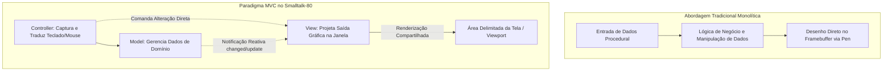

### Comparativo: Aplicações tradicionais versus aplicações estruturadas em MVC

| Critério | Aplicações Monolíticas / Primitivas (Classe `Pen`) | Aplicações Bem-Comportadas em MVC (Smalltalk-80) |
| :--- | :--- | :--- |
| **Acesso à Tela** | Escrita direta e irrestrita no *framebuffer* global (`DisplayScreen`). | Desenho estritamente delimitado pela área da visão (`View`) e seu `viewport`. |
| **Tratamento de Entrada** | Bloqueante, via laço procedural de leitura direta do hardware. | Despacho cooperativo via árvore de controladores sob o `ControlManager`. |
| **Acoplamento Domínio-UI** | Estado interno e rotinas gráficas misturados no mesmo módulo. | Separação formal e desacoplada entre `Model`, `View` e `Controller`. |
| **Convivência Multi-Janela** | Inviável; causa sobreposição e corrupção visual das outras janelas. | Nativa; gerenciamento de sobreposição, enquadramento (*framing*) e colapso. |
| **Reusabilidade de Componentes** | Praticamente nula; cada tela implementa sua própria lógica de pintura. | Alta; uso de visões plugáveis (`Pluggable Views`) e controladores padrão. |

---

## Divisão fundamental de responsabilidades na tríade Model-View-Controller

### A separação de tarefas especializadas

O princípio central do MVC consiste na divisão explícita do processamento interativo em três tipos de objetos especializados:

1. **Model (Modelo):** Representa o modelo do mundo externo, encapsulando as estruturas de dados e as regras de negócio do domínio da aplicação. O modelo é agnóstico quanto à forma como seus dados serão renderizados na tela e desconhece a existência visual das janelas. Ele responde a requisições de consulta sobre seu estado (usualmente enviadas pela View) e a solicitações de alteração de estado (usualmente enviadas pelo Controller ou por outros processos de domínio). No Smalltalk, qualquer objeto pode desempenhar o papel de modelo — desde um número de ponto flutuante (`Float`) para um velocímetro até instâncias complexas de classes corporativas.
2. **View (Visão):** Gerencia a apresentação gráfica e textual da porção do mapa de bits alocada para a sua aplicação. A visão mantém a geometria da janela, projeta dados visuais, lida com bordas e delega o desenho de áreas internas para subvisões aninhadas. Ela obtém dados do modelo mediante chamadas de consulta e atualiza sua representação sempre que for notificada de uma alteração de estado.
3. **Controller (Controlador):** Interpreta os estímulos físicos originados do usuário por meio do mouse e do teclado. O controlador converte eventos brutos de hardware em comandos semânticos direcionados ao modelo (ex.: "adicione este registro", "remova este item") ou à visão (ex.: "role o texto para baixo", "selecione esta linha").

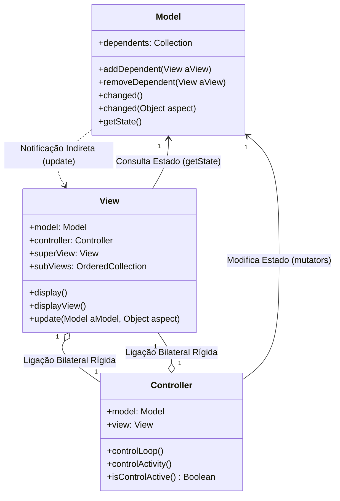

### Interação entre os vértices da tríade

A comunicação interna da tríade ocorre através de dois canais distintos:
- **Canal Direto (Síncrono/Forte):** O `Controller` possui uma referência direta para o seu `Model` e para a sua `View`. A `View` possui uma referência direta para o seu `Controller` e para o seu `Model`. Isso permite que o controlador envie ordens expressas de mutação ao modelo e solicitações operacionais à visão. Da mesma forma, a visão consulta as variáveis de instância do modelo de forma direta durante a sua rotina de desenho.
- **Canal Indireto (Fraco/Reativo):** O `Model` **não** possui referências nominais diretas às visões ou aos controladores concretos. Ele interage com suas visões unicamente através da lista abstrata de dependentes do mecanismo Observer, disparando notificações genéricas.

### Tabela de responsabilidades e métodos típicos

| Componente | Responsabilidade Primária | Entradas Recebidas | Saídas Geradas | Métodos Típicos (Smalltalk-80) |
| :--- | :--- | :--- | :--- | :--- |
| **Model** | Encapsular lógica de negócio e consistência dos dados de domínio. | Mensagens de mutação disparadas pelo Controller ou por agentes externos. | Notificações de mudança disparadas para dependentes registrados. | `changed`, `changed:`, `addDependent:`, `removeDependent:` |
| **View** | Mapear e renderizar o estado de domínio na área de tela alocada. | Notificação `update:` enviada pelo modelo; comandos diretos do controlador. | Primitivas gráficas enviadas ao subsistema de renderização (`Display`). | `display`, `displayView`, `displayBorder`, `update:` |
| **Controller** | Interpretar ações físicas de periféricos e orquestrar a interação. | Eventos de hardware (movimento do mouse, cliques de botões, teclas). | Mensagens semânticas de modificação para o Modelo ou para a Visão. | `controlLoop`, `controlActivity`, `redButtonActivity`, `open` |

---

## Modelos passivos versus modelos ativos no gerenciamento do estado de domínio

### Definição e dinâmica de modelos passivos

Steve Burbeck classifica os modelos em duas categorias essenciais quanto ao seu papel na comunicação da tríade: modelos passivos e modelos ativos.

Um **Modelo Passivo** é aquele cujo estado interno é alterado exclusivamente por ordens diretas originadas do controlador da própria tríade MVC na qual ele está inserido. Um exemplo canônico é um editor de texto simples do tipo WYSIWYG (*What You See Is What You Get*), cujo modelo subjacente é uma instância pura da classe `String`.

Nesse cenário:
1. O usuário digita um caractere no teclado.
2. O `Controller` captura a tecla pressionada e envia uma mensagem de alteração diretamente ao objeto `String` (ex.: concatenar ou substituir substrings).
3. Como o `Controller` foi o único agente causador da alteração, ele próprio pode assumir a responsabilidade de ordenar que a `View` se redesenhe ou pode repassar a informação exata do que mudou.
4. O objeto `String` permanece totalmente alheio à existência do MVC, da interface gráfica e das visões. Ele funciona como um repositório passivo de dados. Não há necessidade de o modelo possuir dependentes registrados.

### Definição e dinâmica de modelos ativos

Um **Modelo Ativo**, por outro lado, possui seu estado alterado por entidades externas à tríade imediata. O exemplo clássico do Smalltalk-80 é o `SystemTranscript` (o console de saída do sistema operacional). Qualquer processo em execução no ambiente, qualquer thread de segundo plano ou qualquer rotina de teste pode executar o comando `Transcript show: 'Processo finalizado.'`.

Nessa situação:
1. A alteração no buffer de texto não partiu do controlador associado à janela do Transcript.
2. Nem a `View` nem o `Controller` têm como prever em qual momento um processo concorrente enviará novos caracteres para o `SystemTranscript`.
3. Portanto, a responsabilidade de emitir a notificação recai obrigatoriamente sobre o próprio modelo. Apenas ele sabe quando suas variáveis de instância foram modificadas.
4. O modelo deve manter um vínculo de comunicação com seus dependentes, disparando a mensagem `self changed` para que todas as visões associadas recebam `update:` e redesenhem o conteúdo atualizado.

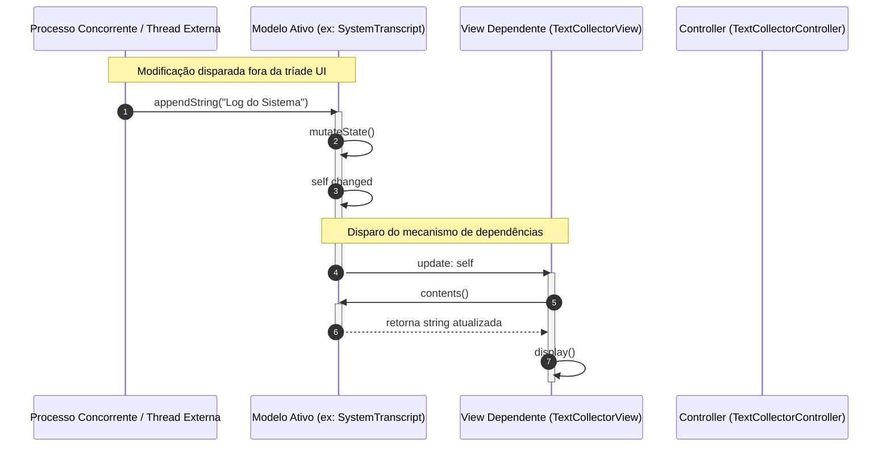

### Quadro comparativo: Modelos Passivos versus Ativos

| Característica | Modelo Passivo | Modelo Ativo |
| :--- | :--- | :--- |
| **Origem das Alterações** | Unicamente pelo `Controller` associado à visão. | Por múltiplos controladores, outras visões ou processos em background. |
| **Responsável pela Notificação** | O `Controller` orquestra a atualização da `View`. | O próprio `Model` dispara `self changed` para seus dependentes. |
| **Consciência de Dependências** | O modelo não gerencia lista de dependentes (`dependents`). | O modelo herda e mantém a infraestrutura de dependências. |
| **Complexidade Estrutural** | Mínima; qualquer classe existente (ex.: `String`, `Integer`) serve. | Maior; exige herança de `Model` ou registro em dicionário global. |
| **Aplicações Típicas** | Caixas de diálogo modais simples, campos de texto isolados. | Monitores de sistema, instrumentos de telemetria, relógios, transcripts. |

---

## Mecanismo de dependências e notificação de mudanças via changed e update:

### A evolução estrutural: DependentFields versus classe Model

No Smalltalk-80 v2.0, todo e qualquer objeto herdava de `Object` a capacidade potencial de atuar como modelo. Para permitir que objetos primitivos (como instâncias de `String` ou `Array`) tivessem dependentes sem onerar a memória de instâncias que nunca participariam de uma interface gráfica, o Smalltalk implementou uma variável de classe em `Object` denominada `DependentFields`. 

`DependentFields` era uma tabela hash de identidade global (`IdentityDictionary`). As chaves eram as instâncias de objetos que atuavam como modelos; os valores associados eram listas (`OrderedCollection`) contendo as visões e observadores registrados. Quando um objeto recebia a mensagem `addDependent: aView`, o sistema inseria essa relação na tabela global.

**Problema de Desempenho e a Solução na v2.5:** O uso de um dicionário global introduzia contenção de acesso, alto custo de busca por hash e retenção acidental de memória (*memory leaks*) caso as entradas não fossem removidas explicitamente. Para solucionar esse gargalo, a versão Smalltalk-80 v2.5 introduziu a classe abstrata `Model`. A classe `Model` adicionou uma variável de instância dedicada chamada `dependents`. Essa variável podia assumir três estados otimizados:
- `nil`: quando o modelo não possui nenhum dependente cadastrado;
- Uma referência direta a um único objeto: quando há apenas uma visão observando o modelo (economizando a criação de coleções);
- Uma instância de `DependentsCollection`: quando dois ou mais dependentes estão registrados.

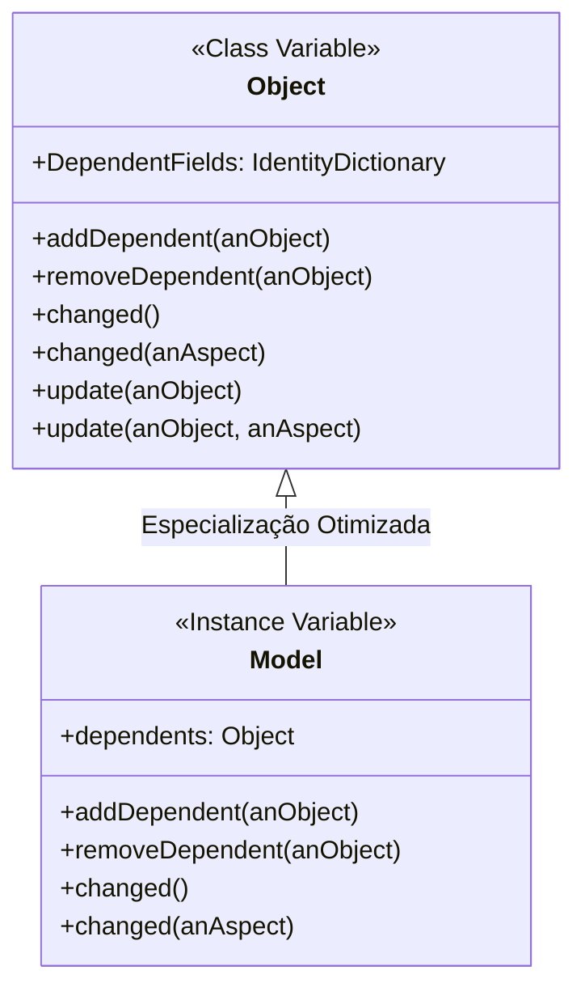

### O protocolo de atualização reativa

O ciclo reativo fundamenta-se em dois métodos principais:

```smalltalk
"No emissor (Model):"
self changed.           "Notifica sem parâmetros adicionais"
self changed: #aspect.  "Notifica indicando qual propriedade foi alterada"

"No receptor (View):"
update: aModel
    "Executado por padrão quando o modelo dispara 'changed'"
    self display.

update: aModel with: anAspect
    "Executado quando o modelo dispara 'changed: anAspect'"
    anAspect == #aspectOfInterest ifTrue: [self display].
```

Quando um modelo executa `self changed: #temperature`, a mensagem é interceptada pela infraestrutura de dependências, que itera sobre a coleção de dependentes disparando `update: self with: #temperature` para cada visão inscrita. A implementação padrão de `update:` na classe `Object` consiste em não fazer nada (`^self`). As subclasses de `View`, contudo, sobrescrevem esse método para validar o aspecto e acionar a rotina `self display`.

### Múltiplas visões sobre o mesmo modelo de domínio

Um dos maiores benefícios do desacoplamento por `changed`/`update:` é o suporte a múltiplos observadores simultâneos. Suponha um modelo arquitetural de uma edificação inteligente. O mesmo objeto de domínio pode alimentar:
1. Uma visão em planta baixa bidimensional (`FloorPlanView`);
2. Uma visão de perspectiva externa tridimensional (`IsometricView`);
3. Uma visão de telemetria de perda de calor e eficiência energética (`ThermalEfficiencyView`).

Se a temperatura interna se eleva, o modelo dispara `self changed: #temperature`. A visão de planta baixa ignora a mensagem; a visão tridimensional ignora a mensagem; a visão térmica detecta que o aspecto alterado coincide com sua área de interesse e dispara sua rotina de renderização gráfica.

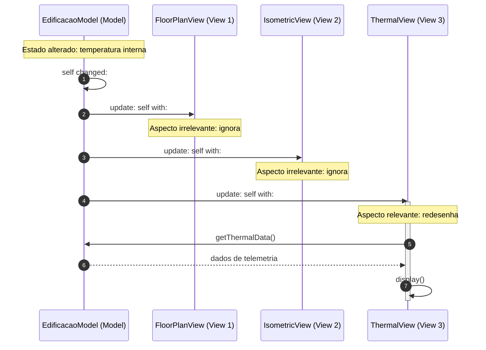

---

## Acoplamento direto e ciclo de vida da ligação View-Controller

### A relação bilateral estrita (1:1)

Enquanto a relação entre Modelo e Visão é de um-para-muitos (1:N) e indireta, a relação entre Visão e Controlador dentro de uma tríade é **estritamente bilateral e de um-para-um (1:1)**. 

Uma instância de `View` conhece com precisão o seu `Controller` por meio da sua variável de instância `controller`. Do mesmo modo, o `Controller` conhece explicitamente a sua `View` através de sua variável de instância `view`. Além disso, ambos mantêm uma variável de instância `model` apontando diretamente para o modelo compartilhado.

Essa forte coesão é necessária porque o controlador precisa saber exatamente qual porção geométrica da tela sua visão ocupa para decidir se o cursor do mouse está dentro de suas fronteiras, bem como instruir a visão a apresentar menus pop-up ou alterar o cursor gráfico. A visão, por sua vez, precisa consultar o controlador para coordenar rotinas especializadas de interação.

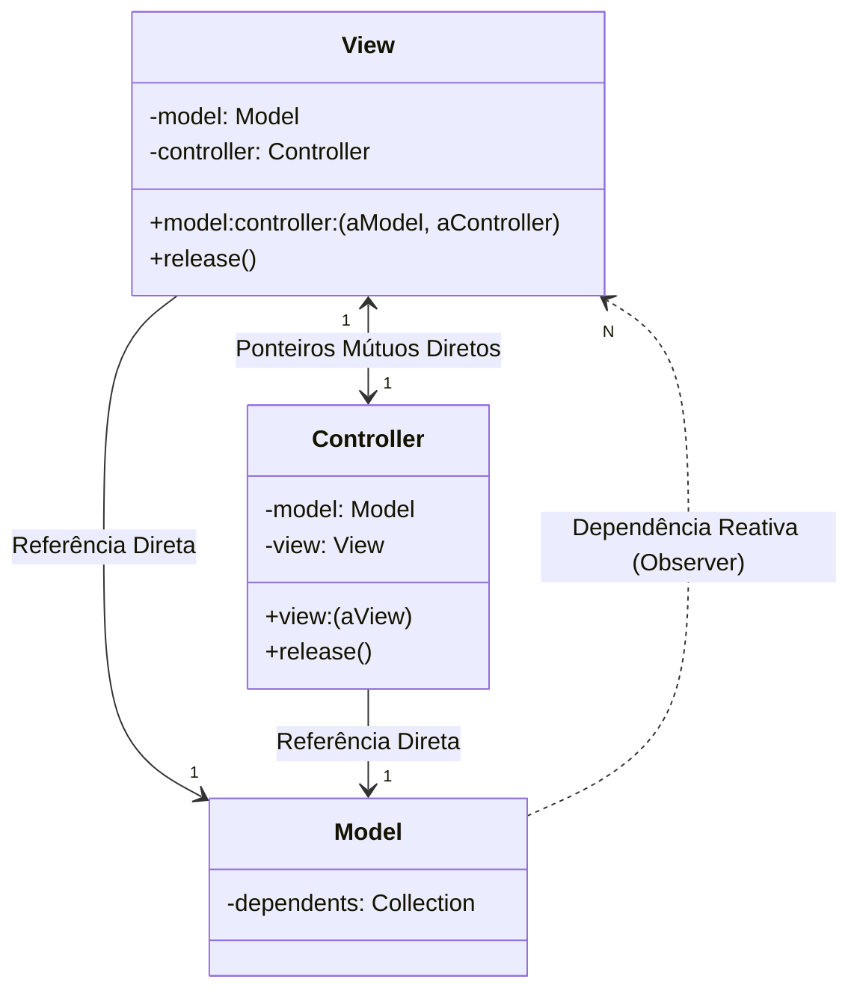

### O protocolo de inicialização e amarração da tríade

A responsabilidade por costurar os ponteiros da tríade e configurar os observadores recai sobre a **View**. Quando uma nova janela ou visão é instanciada, o protocolo canônico `model:controller:` é invocado na visão:

```smalltalk
model: aModel controller: aController
    "Método estrutural na classe View"
    model := aModel.
    aModel addDependent: self.      "Registra a si própria como observadora do modelo"
    controller := aController.
    aController view: self.         "Estabelece o ponteiro de retorno no controlador"
    aController model: aModel.      "Informa o modelo de trabalho ao controlador"
```

Se o programador não fornecer explicitamente um controlador no momento da criação, a `View` aciona o método de contingência `defaultController`, que instancia a subclasse de controlador mais apropriada para aquele tipo visual (por exemplo, uma `SelectionInListView` instancia por padrão um `SelectionInListController`).

### O protocolo de liberação e prevenção de vazamento de memória

Em um ambiente de execução persistente como a imagem Smalltalk (*image-based environment*), esquecer de desinscrever objetos da lista de dependentes mantém referências ativas permanentes, impedindo a atuação do coletor de lixo (*garbage collector*). 

A classe `View` implementa o método estrutural `release`, encarregado do desmonte ordenado da tríade:

```smalltalk
release
    "Método de encerramento da View"
    model notNil ifTrue: [
        model removeDependent: self.  "Remove o vínculo com o modelo"
        model := nil.
    ].
    controller notNil ifTrue: [
        controller release.            "Solicita que o controlador limpe recursos"
        controller := nil.
    ].
    subViews notNil ifTrue: [
        subViews do: [:aSubView | aSubView release]. "Propagação em cascata"
        subViews := nil.
    ].
```

---

## Hierarquia de composição visual: TopView, SubViews e visões plugáveis (Pluggable Views)

### A composição em árvore de janelas

As interfaces gráficas no Smalltalk-80 adotam o padrão de projeto *Composite*. Cada janela exibida na tela é composta por uma árvore hierárquica de visões rastreável através de duas variáveis de instância declaradas na classe base `View`:
- `superView`: ponteiro para o nó pai que contém a visão atual (ou `nil` caso seja a raiz da janela);
- `subViews`: uma coleção ordenada (`OrderedCollection`) contendo todas as visões filhas contidas dentro do seu espaço de exibição.

A visão raiz de uma janela completa é designada como **TopView**. Na grande maioria das aplicações, a `TopView` é uma instância da classe `StandardSystemView` (ou de suas subclasses, como `BrowserView`). A `StandardSystemView` possui a lógica necessária para exibir a aba superior de identificação (*label tab* com o título da janela) e interage com o `StandardSystemController`, que gerencia operações globais da janela: movimentação (*move*), redimensionamento (*frame*), colapso em ícone (*collapse*) e fechamento (*close*).

Janelas especiais de diálogo que não possuem abas, não podem ser movidas ou redimensionadas pelo usuário (tais como `BinaryChoiceView` e `FillInTheBlankView`), utilizam uma instância da classe base `View` como sua `TopView`.

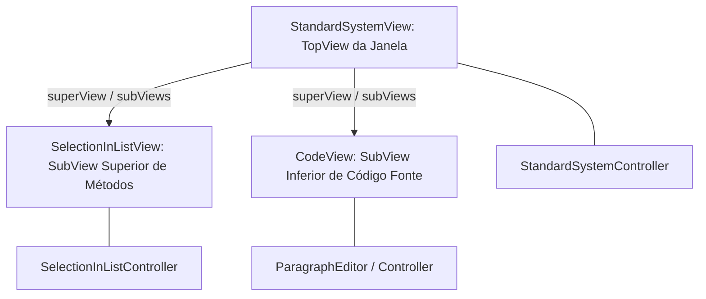

### O conceito e a motivação das visões plugáveis (Pluggable Views)

Nas versões inaugurais do Smalltalk-80, a especialização de interfaces exigia a criação de dezenas de subclasses de `View` e `Controller`. Se um desenvolvedor precisasse de uma lista para selecionar classes e outra para selecionar métodos, criava-se `ClassListView` e `MethodListView`. Essa abordagem provocava uma explosão combinatória de classes no sistema, diferindo apenas nos nomes dos métodos executados para obter os dados do modelo.

Para erradicar esse problema, o Smalltalk-80 v2.5 consolidou as **Pluggable Views** (visões plugáveis). Quatro classes genéricas tornaram-se os pilares de quase toda a interface do sistema:
1. `SelectionInListView`: exibe listas de itens roláveis com seleção;
2. `CodeView`: exibe texto formatado com suporte à compilação e realce sintático;
3. `BooleanView`: botões e alternadores de estado lógico (ex.: alternar entre visualização de instância ou classe no System Browser);
4. `TextView`: exibição genérica de texto.

Uma visão plugável recebe, no momento de sua instanciação, **seletores adaptadores** (símbolos que representam os métodos do modelo que ela deve chamar). Em vez de a visão saber a priori qual método invocar, ela utiliza o mecanismo de reflexão do Smalltalk (`perform: aSelector`) para consultar e modificar o modelo.

### Análise do exemplo de construção: openListBrowserOn:

O trecho a seguir, extraído do artigo de Steve Burbeck, ilustra a criação programática de um navegador de lista de métodos (`MethodListBrowser`), demonstrando o posicionamento relativo de subvisões e a configuração de visões plugáveis:

```smalltalk
openListBrowserOn: aCollection label: labelString initialSelection: sel
    "Cria e agenda um navegador de métodos sobre aCollection"
    | topView aBrowser |
    aBrowser := MethodListBrowser new on: aCollection.
    topView := BrowserView new.
    topView model: aBrowser; controller: StandardSystemController new;
        label: labelString asString; minimumSize: 300@100.
    
    "SubView superior: Lista com 25% da altura da janela"
    topView addSubView:
        (SelectionInListView on: aBrowser printItems: false oneItem: false
            aspect: #methodName change: #methodName: list: #methodList
            menu: #methodMenu initialSelection: #methodName)
        in: (0@0 extent: 1.0@0.25) borderWidth: 1.
        
    "SubView inferior: Editor de código com 75% da altura da janela"
    topView addSubView:
        (CodeView on: aBrowser aspect: #text change: #acceptText:from:
            menu: #textMenu initialSelection: sel)
        in: (0@0.25 extent: 1.0@0.75) borderWidth: 1.
        
    topView controller open.
```

**Mapeamento de Coordenadas Normalizadas:**
Observe os parâmetros `in: (0@0 extent: 1.0@0.25)` e `in: (0@0.25 extent: 1.0@0.75)`. O Smalltalk utiliza pontos bidimensionais expressos pela sintaxe `x@y`. As coordenadas de inserção de subvisões são normalizadas em relação ao retângulo canônico unitário `(0@0 extent: 1.0@1.0)`:
- A lista superior inicia na origem `(0.0, 0.0)`, ocupa `100%` da largura horizontal (`1.0`) e `25%` da altura vertical total (`0.25`).
- A área de código inferior inicia em `(0.0, 0.25)`, estendendo-se por `100%` da largura (`1.0`) e consumindo os `75%` restantes da altura vertical (`0.75`).
- Essa independência matemática permite que a janela seja livremente redimensionada na tela sem que o código de montagem da interface precise recalcular coordenadas absolutas em pixels.

---

## Pipeline de renderização gráfica e transformações de coordenadas com WindowingTransformation

### O pipeline canônico de exibição

A renderização visual no Smalltalk-80 segue uma rotina modular e estritamente padronizada. Quando uma visão precisa ser redesenhada (seja em resposta à notificação `update:` do modelo, seja por desobstrução de janela na tela), o método `display` da classe `View` é acionado.

A implementação base de `display` na classe `View` é composta por três etapas hierárquicas sucessivas:

```smalltalk
display
    "Pipeline canônico de renderização da classe View"
    self displayBorder.     "1. Desenha as bordas delimitadoras da visão"
    self displayView.       "2. Renderiza o conteúdo gráfico específico da visão"
    self displaySubviews.   "3. Repassa a mensagem de display em cascata para as subViews"
```

1. `displayBorder`: Desenha o retângulo delimitador utilizando a largura especificada em `borderWidth` e o padrão de preenchimento de borda da janela.
2. `displayView`: É o ponto de extensão (*hook method*) destinado às subclasses. É aqui que `SelectionInListView` desenha suas linhas de texto ou uma visão gráfica traça gráficos e diagramas.
3. `displaySubviews`: Itera sobre a coleção `subViews`, invocando polimorficamente `display` em cada visão filha. Como resultado, toda a árvore visual é pintada recursivamente a partir da raiz até as folhas.

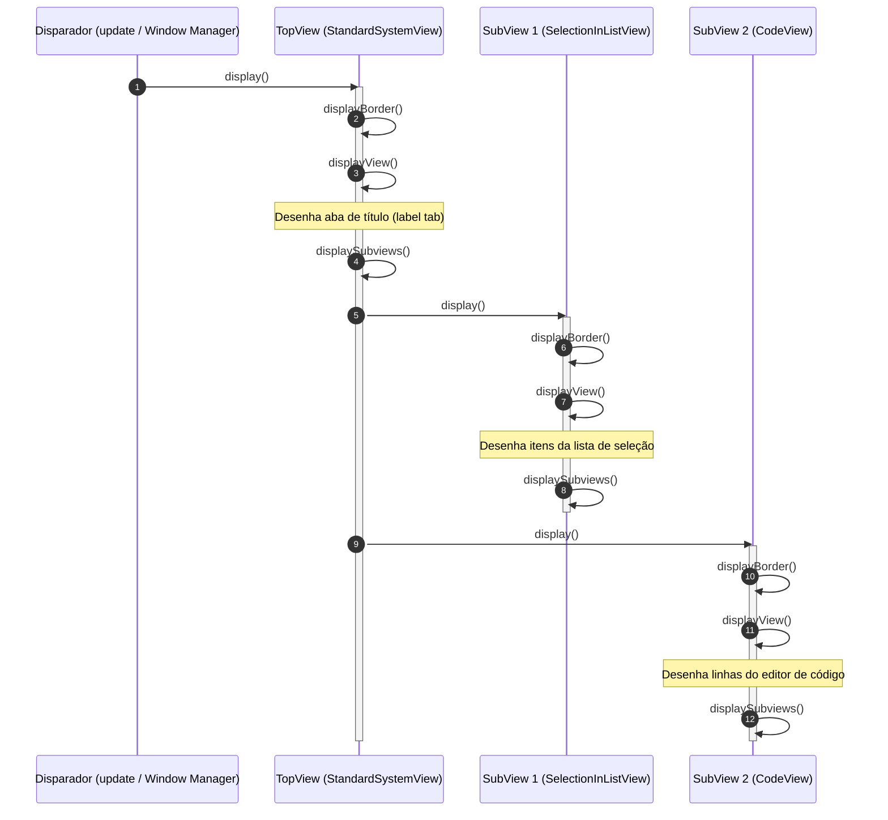

### Transformação geométrica: WindowingTransformation

Cada visão define seu próprio espaço abstrato de trabalho, permitindo que objetos de domínio utilizem sistemas de coordenadas arbitrários (por exemplo, um gráfico de temperatura variando de `-50.0` a `+150.0` no eixo vertical e `0` a `24` horas no horizontal). Para converter esse espaço conceitual nas coordenadas reais da tela física, o Smalltalk disponibiliza a classe `WindowingTransformation`.

Uma `WindowingTransformation` conecta um **Window** (retângulo definido no espaço de coordenadas locais abstratas da visão) a um **Viewport** (retângulo físico na tela de exibição ou na visão pai). A transformação computa e armazena internamente dois fatores fundamentais:
- Um vetor de escala (`scale`): razão matemática entre as dimensões do viewport e da janela;
- Um vetor de translação (`translation`): deslocamento da origem entre os dois espaços.

$$\text{Ponto}_{\text{Viewport}} = (\text{Ponto}_{\text{Window}} \times \text{Escala}) + \text{Translação}$$

```mermaid
flowchart LR
    A["Espaço Abstrato do Modelo (Window)<br/>ex: X: 0..100, Y: 0..1000"] 
    -->|displayTransform:| 
    B["Espaço da Tela Física (Viewport)<br/>ex: X: 250..450 px, Y: 100..300 px"]
    B -->|inverseDisplayTransformation:| A
```

### Composição e inversão de transformações

As transformações podem ser compostas em cadeia ao longo da árvore de visões:
- `View displayTransform: anObject`: Aplica a transformação geométrica da visão atual ao objeto fornecido (geralmente um `Point` ou `Rectangle`), convertendo coordenadas locais em coordenadas de tela.
- `View displayTransformation`: Retorna uma nova `WindowingTransformation` resultante da composição matemática de todas as transformações locais existentes na cadeia de ancestrais (`superView`) combinadas com a transformação da própria visão.
- `View inverseDisplayTransformation: aPoint`: Realiza a operação inversa. Converte um ponto da tela física (por exemplo, a coordenada global capturada pelo sensor do mouse: `Sensor cursorPoint`) para o sistema de coordenadas locais da visão. Esse método é de importância vital para os controladores: quando o usuário clica na tela, o controlador converte o clique global para o espaço interno da visão a fim de determinar qual elemento gráfico específico foi atingido.

---

## Hierarquia de controle cooperativo e despacho de eventos via ScheduledControllers e ControlManager

### O mito do controle pelo mouse e a realidade cooperativa

No Smalltalk-80, a interface gráfica proporciona a ilusão de que o mouse detém o controle autocrático do sistema operacional. Conforme o usuário desloca o ponteiro, janelas são ativadas, menus surgem e barras de rolagem aparecem instantaneamente. Todavia, Steve Burbeck esclarece que **não existe um despachante central preemptivo de eventos**. 

O sistema opera sob uma única thread principal de execução com multitarefa estritamente cooperativa. A manutenção da responsividade da interface gráfica depende exclusivamente da **cooperação civilizada entre controladores bem-educados**. Apenas um controlador pode ter o foco de controle em um determinado instante de tempo.

### A árvore de controladores e o ScheduledControllers

No topo da hierarquia de controle de cada projeto ativo reside a variável global `ScheduledControllers`, que armazena uma instância da classe `ControlManager`. A partir de `ScheduledControllers`, ramificam-se os controladores de nível superior associados a cada janela aberta na tela (instâncias de `StandardSystemController`), além de um controlador especial dedicado ao fundo cinza do sistema (`ScreenController`).

Como cada visão mantém uma associação unívoca com seu respectivo controlador, a árvore estrutural de `View`/`SubView` induz uma árvore de controladores rigorosamente paralela. O controle trafega de forma determinística ao longo dos ramos dessa árvore.

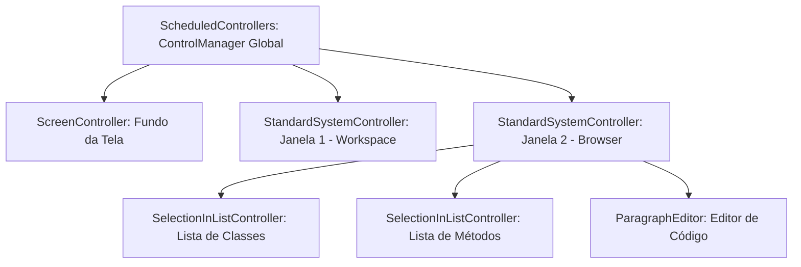

### O minueto de boas maneiras dos controladores

O algoritmo de transferência de controle opera segundo um protocolo refinado de polidez cooperativa:

1. O `ControlManager` global (`ScheduledControllers`) executa o método `searchForActiveController`. Ele percorre a lista de controladores de primeiro nível perguntando a cada um: `isControlWanted`.
2. Um controlador responde afirmativamente (`true`) **apenas se a sua visão associada contiver o cursor do mouse** (`view containsPoint: Sensor cursorPoint`).
3. O controlador selecionado recebe o controle através da mensagem `startUp`, herdada da classe base `Controller`. O método `startUp` executa sequencialmente três etapas vitais:
   - `self controlInitialize`: Prepara o estado visual e operacional (ex.: exibe barras de rolagem);
   - `self controlLoop`: Mantém o laço ativo de processamento enquanto o cursor permanecer sob sua jurisdição;
   - `self controlTerminate`: Executa a limpeza final ao perder o foco (ex.: apaga a barra de rolagem e restaura o fundo original da tela).

```smalltalk
"Implementação canônica de startUp na classe Controller"
startUp
    self controlInitialize.
    self controlLoop.
    self controlTerminate.

"O laço central de controle em Controller"
controlLoop
    [self isControlActive] whileTrue: [
        Processor yield.        "Cede tempo de processamento cooperativo"
        self controlActivity.   "Processa teclado, botões ou repassa aos filhos"
    ].
```

4. Ao assumir o controle, o controlador de nível superior pergunta aos controladores de suas subvisões se algum deles deseja assumir a execução (`self controlToNextLevel`).
5. A consulta desce recursivamente até alcançar a visão mais interna e profunda que contém o cursor. Esse controlador folha retém a execução até que o usuário desloque o mouse para fora dos limites de sua visão.

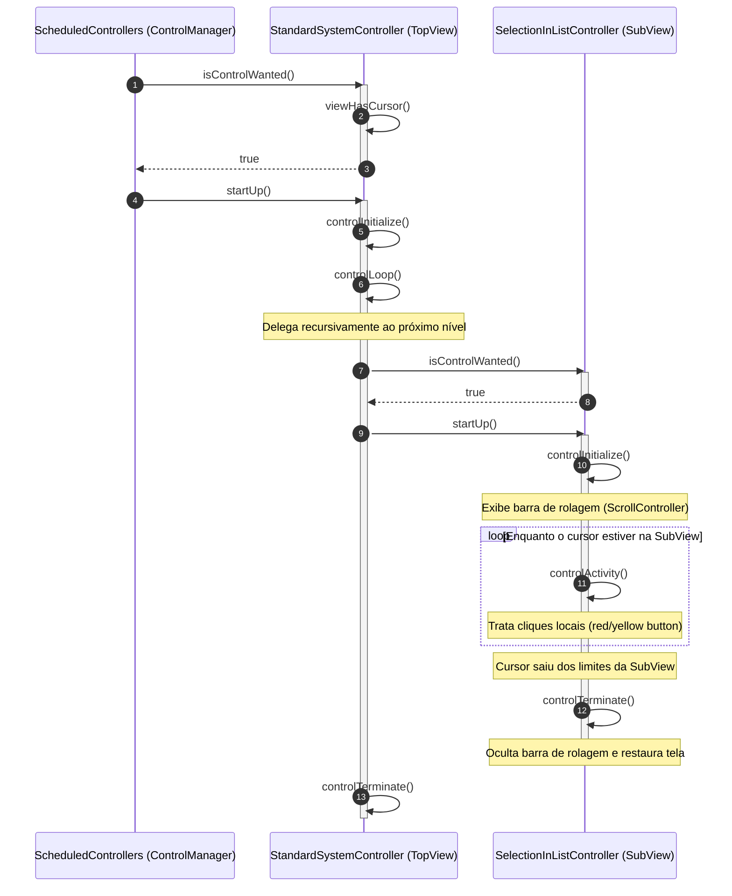

### A dança das barras de rolagem e a classe NoController

A manifestação visual mais evidente dessa arquitetura cooperativa é a exibição contextual de barras de rolagem em navegadores de código:
- Enquanto o mouse repousa sobre a lista de classes, a barra de rolagem daquela subvisão fica visível.
- No instante em que o cursor cruza a linha divisória e entra na lista de métodos, o `SelectionInListController` anterior detecta que `viewHasCursor` tornou-se falso e seu `controlLoop` é encerrado.
- Durante o `controlTerminate`, ele apaga sua barra de rolagem, restaurando o mapa de bits subjacente.
- O novo controlador assume via `startUp`, entra em `controlInitialize`, salva o conteúdo gráfico que será coberto e desenha a barra de rolagem da lista de métodos.

**A classe `NoController`:** Em determinadas interfaces compostas, deseja-se agrupar subvisões meramente decorativas ou informativas (como rótulos estáticos de texto) que não devem responder a eventos individuais. Se uma visão não tiver controlador, o fluxo de controle seria interrompido por erro de ponteiro nulo. Para preencher essa lacuna sem quebrar o minueto de pesquisa, utiliza-se a classe `NoController`. Ela herda de `Controller`, mas sobrescreve `isControlWanted` e `isControlActive` para responder invariavelmente `false`, recusando terminantemente o controle e permitindo que o controlador pai mantenha a governança daquela área.

---

## Tratamento de eventos de teclado e mouse de três botões com MouseMenuController

### O mouse clássico de três botões do Xerox PARC

O hardware clássico do Xerox PARC e das estações Smalltalk-80 utilizava um mouse com três botões físicos, batizados metaforicamente por cores: **Red Button (Botão Vermelho)**, **Yellow Button (Botão Amarelo)** e **Blue Button (Botão Azul)**. Cada botão possuía uma semântica de interface universalmente padronizada em todo o sistema operacional:

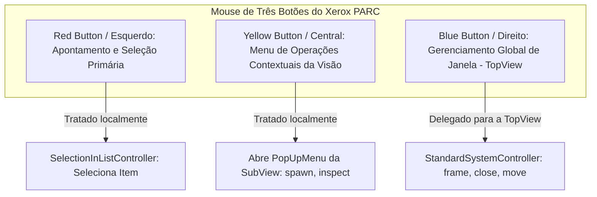

1. **Red Button (Botão Esquerdo / Seleção):** Destinado à manipulação primária do conteúdo visual. É utilizado para selecionar itens em listas, posicionar o cursor de inserção de texto (*caret*), selecionar trechos de código e arrastar objetos gráficos.
2. **Yellow Button (Botão Central / Contexto Local):** Destinado ao menu contextual específico daquela subvisão. Em uma lista de métodos, o botão amarelo abre opções como `implementors`, `senders` e `remove method`. Em um editor de código, apresenta opções como `accept`, `cancel` e `format`.
3. **Blue Button (Botão Direito / Gerenciamento de Janela):** Destinado a funções operacionais globais da janela (`StandardSystemView`). Inclui opções padronizadas como `reframe`, `move`, `close`, `collapse`, `under` e `inspect`.

### A estrutura do MouseMenuController

A grande maioria dos controladores de aplicação herda direta ou indiretamente da classe `MouseMenuController`. Essa classe encapsula:
- Três variáveis de instância para os menus: `redButtonMenu`, `yellowButtonMenu` e `blueButtonMenu`;
- Três variáveis de instância para as mensagens associadas aos menus: `redButtonMessages`, `yellowButtonMessages` e `blueButtonMessages`;
- Métodos de despacho de atividade: `redButtonActivity`, `yellowButtonActivity` e `blueButtonActivity`.

No laço central de controle, o método `controlActivity` verifica periodicamente o estado dos sensores do mouse:

```smalltalk
"Trecho conceitual do método controlActivity em MouseMenuController"
controlActivity
    self viewHasCursor ifTrue: [
        Sensor redButtonPressed ifTrue: [^self redButtonActivity].
        Sensor yellowButtonPressed ifTrue: [^self yellowButtonActivity].
        Sensor blueButtonPressed ifTrue: [^self blueButtonActivity].
    ].
    super controlActivity.
```

Quando um botão de menu (como o amarelo) é pressionado, `yellowButtonActivity` exibe o menu pop-up (`PopUpMenu`). Se o usuário selecionar um item de índice `i`, o controlador executa:

```smalltalk
self menuMessageReceiver perform: (yellowButtonMessages at: index)
```

Por padrão, `menuMessageReceiver` retorna o próprio controlador (`self`), fazendo com que os métodos executores das ações de menu residam no próprio controlador.

### Delegação do Blue Button para a TopView

Como as operações do botão azul pertencem estruturalmente à janela principal (`StandardSystemView`), uma subvisão interna não deve reinventar a lógica de redimensionamento e fechamento. O Smalltalk oferece duas estratégias arquiteturais elegantes para garantir que o clique azul seja tratado pelo `StandardSystemController` de nível superior:

1. **Delegação Explícita:** A subvisão intercepta a atividade do botão azul e a encaminha nominalmente para o controlador da janela raiz:

```smalltalk
blueButtonActivity
    "Delega expressamente a gestão da janela ao controlador superior"
    view topView controller blueButtonActivity.
```

2. **Recusa Transparente de Controle:** O controlador da subvisão define que ele só aceita o controle ativo se o botão azul **não** estiver pressionado. Se o usuário pressionar o botão azul, a subvisão abre mão do controle, forçando a árvore de despacho a devolver o fluxo ao `StandardSystemController`:

```smalltalk
isControlActive
    "Recusa o controle se o botão azul estiver acionado"
    ^super isControlActive and: [Sensor blueButtonPressed not].
```

---

## Componentes de infraestrutura especializada: ParagraphEditor, ScreenController e inspeção de tríades com MVC Inspector

### ParagraphEditor: A anomalia híbrida de manipulação de texto

O processamento e edição de texto no Smalltalk-80 é gerido pela classe `ParagraphEditor` e suas subclasses. O `ParagraphEditor` é uma peça histórica do sistema que antecede a maturação completa da arquitetura MVC. Por essa razão, ele apresenta uma fusão atípica de responsabilidades: atua simultaneamente como **Controlador** (capturando teclado e cliques de seleção) e como **Visão** (orquestrando a quebra de linhas proporcionais, cálculos de fontes e renderização gráfica de glifos).

As visões que utilizam o `ParagraphEditor` invertem o fluxo canônico de desenho: quando a visão recebe a mensagem `display`, ela delega a operação de pintura de caracteres diretamente ao seu controlador executando:

```smalltalk
controller display
```

O processamento de texto envolve a cooperação de três classes centrais:
- `ParagraphEditor`: controlador de alto nível, trata combinações de teclas de atalho (ex.: mapeamento de `Ctrl+T` para o bloco condicional `ifTrue:`), cliques duplos de seleção e posicionamento de cursor;
- `Paragraph`: estrutura de dados visual que modela o parágrafo de texto, computando linhas, espaçamento proporcional e quebras de margem com base na largura da visão;
- `CharacterScanner`: motor gráfico de baixo nível encarregado de medir a largura dos glifos das fontes bitmapped e desenhar os caracteres na tela.

**Compromisso de Desempenho:** A sofisticação do `ParagraphEditor` introduzia uma sobrecarga computacional expressiva nos processadores da época (como os microprocessadores de 8 MHz e 16 MHz baseados na família Motorola 68000). O atraso entre a digitação de uma tecla e a sua renderização provocava lentidão perceptível. Desenvolvedores de sistemas críticos frequentemente construíam versões customizadas e enxutas do trio `ParagraphEditor`/`Paragraph`/`CharacterScanner`, sacrificando funcionalidades avançadas de estilo para multiplicar em até quatro vezes a taxa de digitação contínua.

### ScreenController: O fundo cinza como aplicação MVC

No Smalltalk-80, o fundo cinza da área de trabalho não é um papel de parede passivo nem uma exceção à regra arquitetural: **o fundo da tela é rigorosamente uma tríade MVC completa**.
- **Model:** Uma instância de `InfiniteForm`, preenchida com um padrão estático de textura cinza quadriculada de 16x16 pixels;
- **View:** Uma instância da classe `FormView`, configurada para cobrir as dimensões totais da tela (`Display boundingBox`);
- **Controller:** A instância única da classe `ScreenController`.

O `ScreenController` é o responsável por responder aos cliques do botão amarelo realizados no espaço vazio da tela. É ele quem gerencia o menu principal do sistema operacional (*System Menu*), permitindo que o usuário abra novos navegadores (`browser`), avaliadores de expressão (`workspace`), janelas de terminal (`transcript`) ou salve a imagem do sistema (`snapshot`). Para estender o menu global da plataforma, um desenvolvedor simplesmente altera o método de classe `ScreenController initialize` e compila novos métodos no protocolo de mensagens de menu daquela classe.

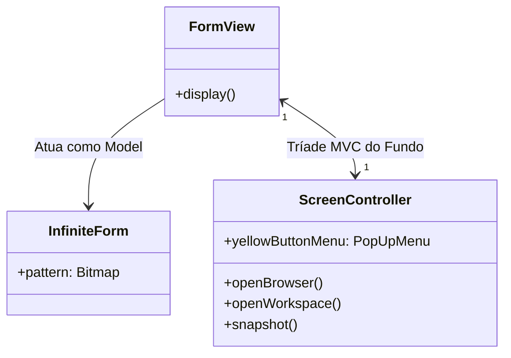

### MVC Inspector: Diagnóstico reflexivo simultâneo

Dada a interdependência dos três nós da tríade, diagnosticar falhas estruturais inspecionando um único objeto de forma isolada tornava-se ineficiente. Por essa razão, a plataforma Smalltalk-80 inclui o **MVC Inspector** — um depurador reflexivo especializado capaz de expor simultaneamente o estado das três instâncias interligadas:

Ao abrir um inspetor MVC em uma visão, a interface divide-se em painéis complementares:
1. **Painel do Model:** Exibe as variáveis de domínio da aplicação (por exemplo, na janela do `SystemTranscript`, permite inspecionar a coleção `contents` contendo a string de log em tempo real);
2. **Painel da View:** Exibe a hierarquia geométrica, ponteiros para `superView`, a lista de `subViews` e transformações de coordenadas;
3. **Painel do Controller:** Exibe os dicionários de comandos, os menus registrados (`yellowButtonMenu`, `blueButtonMenu`) e os seletores de ação associados.

Esse ferramental viabilizou a inspeção estrutural profunda descrita no Exercício 1, demonstrando que o `SystemTranscript` é sustentado por uma `StandardSystemView` e uma `TextCollectorView` conectadas de forma simultânea e dependente a um único modelo do tipo `TextCollector`.

---

## Código da aula

O código pedagógico que acompanha esta aula foi integralmente transposto para a linguagem Java, respeitando com rigor cirúrgico a semântica, o encapsulamento, o despacho polimórfico e o laço cooperativo do Smalltalk-80 v2.5. 

O arquivo principal de demonstração está estruturado em [`./codigo/ExemplosAula.java`](file:///./codigo/ExemplosAula.java). A seguir, analisamos os blocos conceituais essenciais dessa implementação.

### Implementação do mecanismo base de Model e despacho de aspectos

Emulando a classe `Model` do Smalltalk-80 v2.5, a classe abstrata `SmalltalkModel` substitui a dependência global por uma coleção interna de observadores (`dependents`), suportando a notificação sem parâmetros (`changed()`) e a notificação qualificada por aspecto (`changed(Object aspect)`):

```java
package mvc.core;

import java.util.ArrayList;
import java.util.List;

public abstract class SmalltalkModel {
    // Coleção interna equivalente a 'dependents' do Smalltalk v2.5
    private final List<SmalltalkView> dependents = new ArrayList<>();

    public synchronized void addDependent(SmalltalkView aView) {
        if (aView != null && !dependents.contains(aView)) {
            dependents.add(aView);
        }
    }

    public synchronized void removeDependent(SmalltalkView aView) {
        dependents.remove(aView);
    }

    // Disparo canônico sem aspectos (notifica mudança geral)
    public void changed() {
        changed(null);
    }

    // Disparo canônico com parâmetro de aspecto (notificação seletiva)
    public void changed(Object aspect) {
        // Cópia defensiva para suportar desregistros durante a iteração
        List<SmalltalkView> targets;
        synchronized (this) {
            targets = new ArrayList<>(this.dependents);
        }
        for (SmalltalkView dependent : targets) {
            dependent.update(this, aspect);
        }
    }
}
```

### O pipeline de renderização e amarração de ciclo de vida na classe View

A classe base `SmalltalkView` formaliza o acoplamento bilateral rígido com o `SmalltalkController`, a navegação hierárquica (`superView`/`subViews`) e a tríade de métodos de pintura (`displayBorder`, `displayView`, `displaySubviews`):

```java
package mvc.core;

import java.awt.Rectangle;
import java.util.ArrayList;
import java.util.List;

public abstract class SmalltalkView {
    protected SmalltalkModel model;
    protected SmalltalkController controller;
    protected SmalltalkView superView;
    protected final List<SmalltalkView> subViews = new ArrayList<>();
    protected Rectangle bounds = new Rectangle(0, 0, 0, 0);

    // Protocolo model:controller: que amarra a tríade
    public void setModelAndController(SmalltalkModel aModel, SmalltalkController aController) {
        this.model = aModel;
        if (aModel != null) {
            aModel.addDependent(this); // View torna-se observadora do Model
        }
        this.controller = aController;
        if (aController != null) {
            aController.setView(this);   // Controlador aponta de volta para a View
            aController.setModel(aModel);
        }
    }

    // Pipeline canônico de exibição
    public void display() {
        displayBorder();
        displayView();
        displaySubviews();
    }

    protected void displayBorder() {
        // Renderização da borda de 1 pixel da janela
    }

    protected abstract void displayView(); // Hook method para subclasses

    protected void displaySubviews() {
        for (SmalltalkView subView : subViews) {
            subView.display(); // Cascata recursiva
        }
    }

    // Tratamento reativo padrão
    public void update(SmalltalkModel aModel, Object aspect) {
        this.display(); // Por padrão, redesenha-se ao ser notificada
    }

    public void release() {
        if (model != null) {
            model.removeDependent(this);
            model = null;
        }
        if (controller != null) {
            controller.release();
            controller = null;
        }
        for (SmalltalkView subView : subViews) {
            subView.release();
        }
        subViews.clear();
    }
}
```

---

## Exercícios

### Exercício 1 (Professor): Inspeção da Tríade MVC no System Transcript

#### Enunciado
Abra um inspetor MVC na janela do System Transcript (certifique-se primeiro de que um SystemTranscript esteja aberto em sua tela). Comece abrindo um inspetor nas instâncias de DependentsCollection executando `DependentsCollection allInstances inspect`. Localize o item com dois dependentes: 'a StandardSystemView' e 'a TextCollectorView'. Selecione a TextCollectorView e escolha inspecionar (inspect). Agora você terá um inspetor MVC sobre o TextCollector, sua visão e seu controlador. Por exemplo, na subvisão superior do modelo, selecione a variável contents: na janela à direita, você verá o mesmo texto que vê na janela do seu Transcript. Na seção inferior do controlador, examine e inspecione os menus de botões e mensagens. Eles serão os familiares do transcript. Na seção intermediária da visão, selecione superView: ela será uma StandardSystemView. Selecione-a e escolha inspecionar. Você terá então outro inspetor MVC na topView da janela do transcript. Esses dois inspetores MVC juntos dão acesso a toda a estrutura da aplicação do transcript. Observe que ambas as tríades MVC compartilham o mesmo modelo — o TextCollector. (Nota: Em versões do Smalltalk-80 anteriores à inclusão da classe Model, comece abrindo um inspetor no dicionário DependentsFields executando `(Object classPool at: #DependentsFields) inspect`).

#### Raciocínio e Análise Estrutural
1. **Identificação do Modelo de Domínio:** O `TextCollector` é o modelo ativo da janela de log. Ele mantém internamente um fluxo ou buffer de caracteres em sua variável `contents`.
2. **Duplicidade de Vínculos de Dependência:** O `TextCollector` possui duas visões observando suas alterações de forma dependente:
   - A `StandardSystemView` (a moldura externa / `TopView` com título e botões de janela);
   - A `TextCollectorView` (a subvisão textual interna encarregada de exibir os caracteres).
3. **Ponteiro superView:** A `TextCollectorView` aponta, através de sua variável de instância `superView`, diretamente para a `StandardSystemView`, confirmando a árvore de composição visual hierárquica.
4. **Compartilhamento de Modelo:** Ambas as visões, embora com responsabilidades gráficas distintas, mantêm uma referência comum para a mesma instância do `TextCollector`, demonstrando a viabilidade de múltiplos pares View-Controller sobre um único modelo central.

#### Resolução em Código Java
A simulação desse ecossistema reflexivo encontra-se implementada no arquivo [`./codigo/Exercicios.java`](file:///./codigo/Exercicios.java) na classe `Exercicio1TranscriptInspector`:

```java
package exercicios;

import java.util.*;

public class Exercicio1TranscriptInspector {
    // Modelo de domínio
    public static class TextCollector {
        private final StringBuilder contents = new StringBuilder();
        private final List<Object> dependents = new ArrayList<>();

        public void addDependent(Object dep) { dependents.add(dep); }
        public List<Object> getDependents() { return dependents; }
        
        public void append(String text) {
            contents.append(text);
            // Simula disparo de changed para dependentes
            for (Object d : dependents) {
                if (d instanceof ViewInterface) {
                    ((ViewInterface) d).update(this, "contents");
                }
            }
        }
        public String getContents() { return contents.toString(); }
    }

    public interface ViewInterface {
        void update(Object model, Object aspect);
        Object getSuperView();
    }

    public static class StandardSystemView implements ViewInterface {
        private final TextCollector model;
        public StandardSystemView(TextCollector model) { this.model = model; }
        public void update(Object m, Object a) { /* Atualiza título/moldura */ }
        public Object getSuperView() { return null; /* TopView é raiz */ }
    }

    public static class TextCollectorView implements ViewInterface {
        private final TextCollector model;
        private final StandardSystemView superView;
        public TextCollectorView(TextCollector model, StandardSystemView superView) {
            this.model = model;
            this.superView = superView;
        }
        public void update(Object m, Object a) { /* Atualiza texto do transcript */ }
        public Object getSuperView() { return this.superView; }
    }

    public static void main(String[] args) {
        // Montagem idêntica à do Smalltalk-80
        TextCollector transcriptModel = new TextCollector();
        StandardSystemView topView = new StandardSystemView(transcriptModel);
        TextCollectorView subView = new TextCollectorView(transcriptModel, topView);

        transcriptModel.addDependent(topView);
        transcriptModel.addDependent(subView);

        // Inspeção simulada
        System.out.println("--- Inspeção de DependentsCollection ---");
        System.out.println("Dependents count: " + transcriptModel.getDependents().size());
        for (Object dep : transcriptModel.getDependents()) {
            System.out.println("-> Encontrado dependente: " + dep.getClass().getSimpleName());
            if (dep instanceof TextCollectorView) {
                TextCollectorView tcv = (TextCollectorView) dep;
                System.out.println("   Inspecionando superView de TextCollectorView: " 
                    + tcv.getSuperView().getClass().getSimpleName());
            }
        }
    }
}
```

---

### Exercício 2 (Sugerido): Implementação do Mecanismo de Dependências e Notificação Reativa (Changed/Update)

#### Enunciado
Implemente uma réplica fiel do mecanismo de dependências do Smalltalk-80. Crie uma classe abstrata de modelo capaz de registrar e remover dependentes (observadores de visão). O modelo deve disponibilizar os métodos `changed()` e `changed(Object aspect)`. Em seguida, implemente um modelo concreto de domínio (por exemplo, um monitor de temperatura ou contador de execuções) e demonstre como múltiplas visões inscritas recebem a mensagem `update(Model model, Object aspect)` e reagem de forma seletiva com base no parâmetro de aspecto transmitido.

#### Raciocínio de Engenharia
1. **Contrato do Observador:** Definir uma interface de visão (`SmalltalkObserver`) contendo o método de callback polimórfico `update(SmalltalkModel model, Object aspect)`.
2. **Despacho Seletivo de Aspecto:** O modelo de monitoramento de temperatura mantém duas variáveis: `temperatura` e `statusAlarme`. Quando a temperatura se altera, o modelo executa `changed("temperatura")`.
3. **Visões com Interesses Distintos:**
   - Uma visão de painel numérico reage apenas se o aspecto for `"temperatura"`.
   - Uma visão de alarme sonoro/visual reage apenas se o aspecto for `"statusAlarme"`.
   - Ambas atualizam sem conflitos quando uma notificação global `changed()` (com aspecto nulo) for transmitida.

#### Resolução em Código Java
A solução completa encontra-se em [`./codigo/Exercicios.java`](file:///./codigo/Exercicios.java) na classe `Exercicio2NotificacaoReativa`:

```java
package exercicios;

import java.util.*;

public class Exercicio2NotificacaoReativa {
    public interface SmalltalkObserver {
        void update(SmalltalkModel model, Object aspect);
    }

    public static abstract class SmalltalkModel {
        private final List<SmalltalkObserver> dependents = new ArrayList<>();

        public synchronized void addDependent(SmalltalkObserver o) {
            if (o != null && !dependents.contains(o)) dependents.add(o);
        }
        public synchronized void removeDependent(SmalltalkObserver o) {
            dependents.remove(o);
        }
        public void changed() { changed(null); }
        public void changed(Object aspect) {
            List<SmalltalkObserver> copy;
            synchronized (this) { copy = new ArrayList<>(this.dependents); }
            for (SmalltalkObserver o : copy) {
                o.update(this, aspect);
            }
        }
    }

    // Modelo concreto de domínio
    public static class TermometroModel extends SmalltalkModel {
        private double temperatura;
        private boolean alarmeAtivo;

        public void setTemperatura(double novaTemp) {
            if (this.temperatura != novaTemp) {
                this.temperatura = novaTemp;
                this.changed("temperatura"); // Aspecto específico
                if (novaTemp > 100.0 && !alarmeAtivo) {
                    this.alarmeAtivo = true;
                    this.changed("statusAlarme");
                }
            }
        }
        public double getTemperatura() { return temperatura; }
        public boolean isAlarmeAtivo() { return alarmeAtivo; }
    }

    // Visão Numérica: Observa apenas temperatura
    public static class PainelNumericoView implements SmalltalkObserver {
        @Override
        public void update(SmalltalkModel model, Object aspect) {
            if (aspect == null || "temperatura".equals(aspect)) {
                TermometroModel t = (TermometroModel) model;
                System.out.println("[PainelNumericoView] Display: " + t.getTemperatura() + " °C");
            }
        }
    }

    // Visão de Sirene: Observa apenas o alarme
    public static class AlarmeEmergenciaView implements SmalltalkObserver {
        @Override
        public void update(SmalltalkModel model, Object aspect) {
            if (aspect == null || "statusAlarme".equals(aspect)) {
                TermometroModel t = (TermometroModel) model;
                System.out.println("[AlarmeEmergenciaView] ALERTA! Alarme: " + t.isAlarmeAtivo());
            }
        }
    }

    public static void main(String[] args) {
        TermometroModel termometro = new TermometroModel();
        PainelNumericoView painel = new PainelNumericoView();
        AlarmeEmergenciaView alarme = new AlarmeEmergenciaView();

        termometro.addDependent(painel);
        termometro.addDependent(alarme);

        System.out.println("--- Alterando para 25.0 °C (Apenas Painel reage) ---");
        termometro.setTemperatura(25.0);

        System.out.println("--- Alterando para 105.0 °C (Painel e Alarme reagem) ---");
        termometro.setTemperatura(105.0);
    }
}
```

---

### Exercício 3 (Sugerido): Composição Hierárquica de Visões com Mapeamento de Coordenadas Relativas

#### Enunciado
Construa uma estrutura hierárquica de visões simulando o funcionamento de TopView e SubViews do Smalltalk-80. Cada visão deve armazenar referências para sua superView e uma coleção de subViews filhas, posicionadas usando coordenadas normalizadas relativas (de 0.0 a 1.0). Implemente o pipeline canônico de renderização composto pela execução em cascata dos métodos `display()`, `displayBorder()`, `displayView()` e `displaySubviews()`, demonstrando a divisão de uma janela principal entre uma lista superior (ocupando 25% da altura) e uma área de texto inferior (ocupando 75% da altura).

#### Raciocínio de Engenharia
1. **Estrutura de Caixas Relativas:** Cada nó `SubView` armazena um `Rectangle2D.Double` normalizado, representando sua fração do espaço em relação à visão pai.
2. **Cálculo da Geometria Absoluta:** O método `recomputeBounds()` converte a fração normalizada em pixels reais multiplicando a largura e altura da `superView`.
3. **Pipeline Estrito:** Garantir que o método `display()` execute a sequência canônica (`displayBorder` -> `displayView` -> `displaySubviews`), propagando o desenho hierarquicamente.

#### Resolução em Código Java
A solução completa encontra-se em [`./codigo/Exercicios.java`](file:///./codigo/Exercicios.java) na classe `Exercicio3HierarquiaComposicao`:

```java
package exercicios;

import java.awt.Rectangle;
import java.awt.geom.Rectangle2D;
import java.util.*;

public class Exercicio3HierarquiaComposicao {
    public static class CompositeView {
        protected String name;
        protected CompositeView superView;
        protected final List<CompositeView> subViews = new ArrayList<>();
        protected Rectangle2D.Double relativeBounds; // Ex: (0.0, 0.0, 1.0, 0.25)
        protected Rectangle absoluteBounds = new Rectangle();

        public CompositeView(String name) { this.name = name; }

        public void addSubView(CompositeView child, Rectangle2D.Double relBox) {
            child.superView = this;
            child.relativeBounds = relBox;
            this.subViews.add(child);
            child.recomputeBounds();
        }

        public void recomputeBounds() {
            if (superView != null && relativeBounds != null) {
                int px = (int) (superView.absoluteBounds.x + relativeBounds.x * superView.absoluteBounds.width);
                int py = (int) (superView.absoluteBounds.y + relativeBounds.y * superView.absoluteBounds.height);
                int pw = (int) (relativeBounds.width * superView.absoluteBounds.width);
                int ph = (int) (relativeBounds.height * superView.absoluteBounds.height);
                this.absoluteBounds = new Rectangle(px, py, pw, ph);
            }
            for (CompositeView child : subViews) {
                child.recomputeBounds();
            }
        }

        public void display() {
            displayBorder();
            displayView();
            displaySubviews();
        }

        protected void displayBorder() {
            System.out.println("  [Border] " + name + " bounds=" + absoluteBounds);
        }

        protected void displayView() {
            System.out.println("  [Content] Pintando conteúdo visual de " + name);
        }

        protected void displaySubviews() {
            for (CompositeView child : subViews) {
                child.display();
            }
        }

        public void setAbsoluteFrame(int x, int y, int w, int h) {
            this.absoluteBounds = new Rectangle(x, y, w, h);
            recomputeBounds();
        }
    }

    public static void main(String[] args) {
        // Janela Principal TopView (400x600 pixels na tela)
        CompositeView topView = new CompositeView("BrowserView (TopView)");
        topView.setAbsoluteFrame(100, 100, 400, 600);

        // Lista de Métodos (0@0 extent: 1.0@0.25)
        CompositeView listView = new CompositeView("SelectionInListView");
        topView.addSubView(listView, new Rectangle2D.Double(0.0, 0.0, 1.0, 0.25));

        // Editor de Código (0@0.25 extent: 1.0@0.75)
        CompositeView codeView = new CompositeView("CodeView");
        topView.addSubView(codeView, new Rectangle2D.Double(0.0, 0.25, 1.0, 0.75));

        System.out.println("--- Executando Pipeline Canônico de Exibição (display) ---");
        topView.display();
    }
}
```

---

### Exercício 4 (Sugerido): Despacho Cooperativo de Entrada e Delegação de Botões de Mouse

#### Enunciado
Desenvolva um simulador do fluxo de controle cooperativo gerenciado por ControlManager (ScheduledControllers) e controladores derivados de MouseMenuController. Implemente a lógica em que o despachante localiza recursivamente o controlador correspondente à visão mais interna que contém as coordenadas do cursor. Demonstre o tratamento dos três botões clássicos do mouse: Red Button (seleção de item na subvisão), Yellow Button (abertura de menu contextual local) e Blue Button (funções de gerenciamento de janela delegadas à TopView/StandardSystemController).

#### Raciocínio de Engenharia
1. **Busca Top-Down do Foco:** O `ControlManager` pergunta se a `TopView` quer o controle. O controlador de nível superior testa se suas coordenadas englobam o mouse e repassa a pergunta aos controladores das subvisões.
2. **Captura do Ponto Mais Interno:** O controlador folha cuja subvisão contém o ponto assume o laço ativo (`startUp`).
3. **Delegação Polimórfica de Botões:**
   - Botão Vermelho: ativa a seleção interna da lista.
   - Botão Amarelo: abre o menu de contexto local (`PopUpMenu`).
   - Botão Azul: o controlador da subvisão delega explicitamente para o controlador da `TopView` (`view.getTopView().getController().blueButtonActivity()`).

#### Resolução em Código Java
A solução completa encontra-se em [`./codigo/Exercicios.java`](file:///./codigo/Exercicios.java) na classe `Exercicio4DespachoCooperativo`:

```java
package exercicios;

import java.awt.Point;
import java.awt.Rectangle;
import java.util.*;

public class Exercicio4DespachoCooperativo {
    public enum MouseButton { NONE, RED, YELLOW, BLUE }

    public static class MockSensor {
        public Point cursorPoint = new Point(0, 0);
        public MouseButton pressedButton = MouseButton.NONE;
    }

    public static abstract class ControllerNode {
        protected Rectangle viewBounds;
        protected List<ControllerNode> subControllers = new ArrayList<>();
        protected ControllerNode parentController;

        public ControllerNode(Rectangle bounds) { this.viewBounds = bounds; }

        public boolean containsCursor(Point p) { return viewBounds.contains(p); }

        public ControllerNode findActiveController(Point p) {
            if (!containsCursor(p)) return null;
            // Busca recursiva da visão mais interna
            for (ControllerNode child : subControllers) {
                ControllerNode activeChild = child.findActiveController(p);
                if (activeChild != null) return activeChild;
            }
            return this; // Se nenhum filho contiver, o pai retém
        }

        public abstract void redButtonActivity();
        public abstract void yellowButtonActivity();
        public abstract void blueButtonActivity();
    }

    public static class StandardSystemControllerMock extends ControllerNode {
        public StandardSystemControllerMock(Rectangle bounds) { super(bounds); }

        @Override
        public void redButtonActivity() { System.out.println("TopView Red: Foco na janela."); }
        @Override
        public void yellowButtonActivity() { System.out.println("TopView Yellow: Menu global de projeto."); }
        @Override
        public void blueButtonActivity() {
            System.out.println("TopView Blue: OPERAÇÃO DE JANELA (Frame/Move/Close/Collapse) executada!");
        }
    }

    public static class SubViewControllerMock extends ControllerNode {
        public SubViewControllerMock(Rectangle bounds, ControllerNode parent) {
            super(bounds);
            this.parentController = parent;
        }

        @Override
        public void redButtonActivity() {
            System.out.println("SubView Red: Seleção de item na linha.");
        }

        @Override
        public void yellowButtonActivity() {
            System.out.println("SubView Yellow: PopUpMenu local (implementors, senders).");
        }

        @Override
        public void blueButtonActivity() {
            System.out.println("SubView Blue: Delegando ação de janela para a TopView...");
            parentController.blueButtonActivity(); // Delegação canônica
        }
    }

    public static void main(String[] args) {
        MockSensor sensor = new MockSensor();
        // TopView de (0,0 a 400,400)
        StandardSystemControllerMock topCtrl = new StandardSystemControllerMock(new Rectangle(0, 0, 400, 400));
        // SubView de (0,0 a 400,100)
        SubViewControllerMock subCtrl = new SubViewControllerMock(new Rectangle(0, 0, 400, 100), topCtrl);
        topCtrl.subControllers.add(subCtrl);

        // Cenário 1: Cursor dentro da SubView (50, 50) com Botão Vermelho
        sensor.cursorPoint = new Point(50, 50);
        sensor.pressedButton = MouseButton.RED;
        System.out.println("--- Teste 1: Clique Red na SubView ---");
        ControllerNode active = topCtrl.findActiveController(sensor.cursorPoint);
        active.redButtonActivity();

        // Cenário 2: Cursor dentro da SubView (50, 50) com Botão Azul
        sensor.pressedButton = MouseButton.BLUE;
        System.out.println("--- Teste 2: Clique Blue na SubView (Delegação) ---");
        active.blueButtonActivity();
    }
}
```

---

## Erros comuns e boas práticas

### Erros conceituais e armadilhas de implementação

1. **Acesso Direto da View ao Modelo sem Intervenção do Controller em Edições:**
   - *Erro:* Permitir que a `View` processe cliques de teclado ou modifique variáveis de instância do `Model` diretamente.
   - *Correção:* A `View` deve ser puramente passiva quanto à entrada de dados. Qualquer intenção de mutação deve ser capturada pelo `Controller`, que valida a ação e executa mensagens semânticas no `Model`.
2. **Retenção de Referências e Vazamento de Memória por Falha no `release`:**
   - *Erro:* Fechar uma janela gráfica apenas ocultando-a da tela, sem executar o método `release` na `TopView`.
   - *Consequência:* O modelo de domínio mantém ponteiros para a visão na coleção `dependents`. A visão nunca é coletada pelo Garbage Collector, gerando vazamento contínuo de memória e degradação do processamento reativo (o modelo perde tempo enviando `update:` para telas inexistentes).
3. **Acoplamento Nominal Inverso do Modelo com Subclasses Concretas de Visão:**
   - *Erro:* Escrever código no modelo verificando o tipo da visão: `if (dependent instanceof CodeView)`.
   - *Correção:* O modelo deve desconhecer totalmente a tipagem e a natureza gráfica de seus observadores. Toda a comunicação deve ser restrita ao protocolo polimórfico `changed` e `changed: aParameter`.
4. **Violação do Laço Cooperativo Unithread:**
   - *Erro:* Executar tarefas de longa duração ou laços bloqueantes dentro de métodos como `controlActivity` ou `displayView`.
   - *Consequência:* Como o Smalltalk-80 depende da cedência voluntária de controle (`Processor yield`), qualquer bloqueio em um controlador congela toda a interface gráfica do sistema operacional, paralisando o mouse e as outras janelas.
5. **Uso Indevido de Coordenadas Absolutas na Montagem de SubViews:**
   - *Erro:* Configurar retângulos de visão com valores literais de pixels (ex.: largura de 300 px).
   - *Correção:* Empregar invariavelmente coordenadas relativas normalizadas unitárias `(0.0 a 1.0)`. Isso garante que a janela possa ser enquadrada livremente pelo usuário via `StandardSystemController`.

### Boas práticas recomendadas

- **Aproveitamento de Visões Plugáveis:** Sempre que possível, utilize visões plugáveis padrão (`SelectionInListView`, `CodeView`, `BooleanView`) parametrizadas por seletores/adaptadores, em vez de derivar subclasses desnecessárias de `View`.
- **Filtro Estrito por Aspecto:** Sempre que um modelo contiver múltiplos atributos de estado, utilize `changed: anAspect` em vez do genérico `changed`. Isso previne redesenhos desnecessários em visões inscritas que monitoram outros aspectos.
- **Delegação de Funções Globais ao Nível Superior:** Nunca implemente redimensionamento ou fechamento de janelas em controladores de subvisões. Encaminhe eventos do botão azul para a `TopView` ou recuse o controle via `isControlActive`.

---

## Links e materiais complementares

- **Artigo Original de Referência:** BURBECK, Steve. *Applications Programming in Smalltalk-80: How to use Model-View-Controller (MVC)*. Publicação original em 1987, revisada para Smalltalk-80 v2.5 em 1992. Disponível nos repositórios históricos da Universidade de Illinois (UIUC).
- **Documentação do Xerox PARC:** Livros clássicos da "Série Azul" do Smalltalk-80 (*Smalltalk-80: The Language and its Implementation*, por Adele Goldberg e David Robson), contendo a especificação da máquina virtual, despachante de processos e classes gráficas básicas.
- **Ambientes de Execução Histórica e Emulação:**
  - *Squeak Smalltalk:* Implementação moderna de código aberto que preserva com fidelidade a árvore de classes original do Smalltalk-80 v2.5 e o suporte ao MVC clássico.
  - *Pharo:* Evolução do Squeak voltada para aplicações contemporâneas (migrou do MVC clássico para arquiteturas mais modernas, como Morphic e Spec).

---

## Mapa da aula

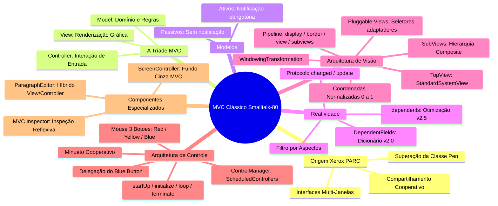

---

## Glossário

| Termo | Definição no Contexto do Smalltalk-80 |
| :--- | :--- |
| **Model** | Objeto que encapsula o estado de domínio e a lógica de negócio, agnóstico à apresentação visual e à captura física de periféricos. |
| **View** | Objeto responsável por renderizar dados visuais em uma região retangular da tela, respondendo a notificações do modelo. |
| **Controller** | Objeto encarregado de escutar os sensores de hardware (mouse e teclado), interpretando a intenção do usuário e comandando o modelo ou a visão. |
| **Tríade MVC** | O conjunto indivisível formado por um Modelo, uma Visão associada e um Controlador correspondente. |
| **TopView** | A visão raiz de uma janela na tela gráfica, tipicamente uma instância de `StandardSystemView` que gerencia a moldura e a barra de título. |
| **SubView** | Uma visão aninhada contida no interior de outra visão, posicionada via coordenadas relativas à visão pai. |
| **Pluggable View** | Visão genérica e configurável (como `SelectionInListView`) que utiliza seletores reflexivos como adaptadores para consultar o modelo sem exigir subclasses. |
| **changed / update:** | Protocolo canônico do padrão Observer no Smalltalk, utilizado pelo modelo para anunciar mutações de estado para seus observadores. |
| **Aspect (Aspecto)** | Parâmetro simbólico (geralmente um `Symbol`) transmitido na mensagem `changed:` para indicar qual propriedade específica foi alterada no modelo. |
| **ScheduledControllers** | Instância global da classe `ControlManager` que atua como raiz da árvore de controladores ativos do projeto atual. |
| **ControlManager** | Despachante cooperativo que coordena qual controlador de janela deve receber o foco de processamento em resposta à posição do cursor. |
| **WindowingTransformation** | Mecanismo geométrico matemático responsável por mapear coordenadas abstratas de uma janela para o viewport real da tela física. |
| **ParagraphEditor** | Controlador especializado em manipulação de texto que absorve funções gráficas de renderização de caracteres e formatação de parágrafos. |
| **ScreenController** | Controlador associado ao fundo cinza global da área de trabalho, encarregado de gerenciar o menu principal do sistema operacional. |
| **Red Button** | Botão esquerdo do mouse de três botões; utilizado primariamente para seleção, apontamento e posicionamento de cursor de texto. |
| **Yellow Button** | Botão central do mouse de três botões; utilizado para invocar o menu de contexto específico (`PopUpMenu`) da subvisão sob o cursor. |
| **Blue Button** | Botão direito do mouse de três botões; utilizado para acionar as rotinas globais de janela (`move`, `frame`, `close`, `collapse`). |

---

## Pontos-chave para a prova

1. **Separação de Responsabilidades:** O Model não desenha na tela e não escuta teclado/mouse; a View não decide lógica de negócio; o Controller interpreta eventos de hardware e instrui Model e View.
2. **Diferença entre Modelos Passivos e Ativos:** Modelos passivos só sofrem alterações orquestradas pelo próprio controlador da tríade (ex.: `String`), enquanto modelos ativos sofrem mutações por outros processos concorrentes ou agentes externos (ex.: `SystemTranscript`), exigindo notificação reativa obrigatória via `changed`.
3. **Evolução da Gestão de Dependências:** O Smalltalk v2.0 utilizava a variável global `DependentFields` na classe `Object` (tabela hash com problemas de contenção e vazamento de memória). A versão v2.5 introduziu a classe abstrata `Model` com a variável local `dependents` (otimizada para `nil`, objeto único ou `DependentsCollection`).
4. **Natureza das Ligações:** A ligação View-Controller é direta, forte, síncrona e bilateral (1:1). A ligação Model-View é indireta, fraca e unidirecional via padrão Observer/Dependents (1:N).
5. **Motivação das Pluggable Views:** Reduzir a proliferação excessiva de subclasses através da parametrização por seletores adaptadores (`aspect:`, `change:`, `list:`, `menu:`).
6. **Pipeline de Renderização:** O método `display` executa invariavelmente: `displayBorder` $\rightarrow$ `displayView` $\rightarrow$ `displaySubviews`.
7. **Coordenadas Relativas:** As subvisões são posicionadas em frações normalizadas de `0.0` a `1.0` do retângulo canônico da visão pai, viabilizando o redimensionamento elástico.
8. **Controle Cooperativo Unithread:** Não há concorrência preemptiva orientada a eventos; o `ControlManager` consulta a árvore de controladores, e o controlador mais interno com o cursor assume a execução através do ciclo `controlInitialize`, `controlLoop` (com `Processor yield`) e `controlTerminate`.
9. **Tratamento do Mouse de Três Botões:** Vermelho para seleção local; Amarelo para menu da subvisão; Azul para comandos globais de janela (sempre delegados para a `TopView`).

---

## Perguntas e respostas (JSONL)

```jsonl
{"pergunta": "Qual problema estrutural o padrão MVC resolveu no ambiente gráfico do Smalltalk-80 no Xerox PARC?", "resposta": "Ele viabilizou a convivência multi-janela e o compartilhamento cooperativo da tela, teclado e mouse, impedindo que aplicações sobrescrevessem arbitrariamente o framebuffer por meio da classe Pen.", "dificuldade": "facil"}
{"pergunta": "Quais são os papéis estritos de cada um dos membros da tríade MVC?", "resposta": "O Model gerencia os dados de domínio e regras de negócio; a View administra a renderização gráfica e layout de tela; o Controller traduz ações de hardware (mouse e teclado) em comandos para o Model ou View.", "dificuldade": "facil"}
{"pergunta": "O que caracteriza um Modelo Passivo e por que ele não precisa disparar notificações de mudança?", "resposta": "Um modelo passivo só sofre modificações requisitadas pelo próprio controlador da tríade; como o controlador é o agente da mudança, ele mesmo ordena a atualização da visão, dispensando o modelo de manter dependentes.", "dificuldade": "medio"}
{"pergunta": "Por que o SystemTranscript obrigatoriamente precisa se comportar como um Modelo Ativo?", "resposta": "Porque processos concorrentes e threads de segundo plano podem anexar logs ao transcript a qualquer instante sem passar pelo controlador da janela; assim, apenas o modelo pode disparar a notificação de mudança aos dependentes.", "dificuldade": "medio"}
{"pergunta": "Qual foi a otimização de gerenciamento de dependências implementada no Smalltalk-80 v2.5 em relação à v2.0?", "resposta": "Substituiu o uso de um dicionário de identidade global (DependentFields em Object) por uma variável de instância local dedicada (dependents) na nova classe abstrata Model, suportando nil, objeto único ou DependentsCollection.", "dificuldade": "dificil"}
{"pergunta": "Qual a diferença operacional entre os métodos changed e changed: anAspect?", "resposta": "O método changed notifica os dependentes sobre uma alteração genérica no modelo, enquanto changed: anAspect transmite um símbolo identificador da propriedade alterada, permitindo que visões filtrem atualizações seletivamente.", "dificuldade": "facil"}
{"pergunta": "Como é caracterizado o acoplamento entre View e Controller dentro da tríade clássica do Smalltalk-80?", "resposta": "É um acoplamento direto, rígido, síncrono e estritamente bilateral (1:1), onde a View aponta para seu Controller através da variável controller e o Controller aponta para a View através da variável view.", "dificuldade": "medio"}
{"pergunta": "O que ocorre no ciclo de vida de uma View quando ela recebe a mensagem release?", "resposta": "Ela remove a si mesma da lista de dependentes do Model, envia release para seu Controller e propaga a mensagem release recursivamente para todas as suas subViews, evitando vazamentos de memória.", "dificuldade": "medio"}
{"pergunta": "O que são Pluggable Views e qual problema arquitetural elas solucionaram?", "resposta": "São visões genéricas reutilizáveis (como SelectionInListView) que utilizam seletores adaptadores passados na criação para acessar o modelo, eliminando a explosão combinatória de subclasses especializadas.", "dificuldade": "dificil"}
{"pergunta": "Como o Smalltalk-80 mapeia a posição das SubViews dentro de uma TopView?", "resposta": "Por meio de coordenadas relativas normalizadas definidas dentro do retângulo unitário canônico (0@0 extent: 1.0@1.0), tornando o layout independente do tamanho absoluto da janela.", "dificuldade": "medio"}
{"pergunta": "Qual é a sequência exata de execução do pipeline canônico de renderização da classe View?", "resposta": "A mensagem display executa sucessivamente: self displayBorder (borda), self displayView (conteúdo específico) e self displaySubviews (cascata recursiva nas filhas).", "dificuldade": "facil"}
{"pergunta": "Para que serve a classe WindowingTransformation no Smalltalk-80?", "resposta": "Para realizar o mapeamento geométrico por escala e translação entre as coordenadas abstratas de um modelo (Window) e as coordenadas reais da tela física ou viewport.", "dificuldade": "medio"}
{"pergunta": "Como o método inverseDisplayTransformation: auxilia os controladores durante a interação?", "resposta": "Ele converte as coordenadas globais de tela do cursor do mouse em coordenadas locais da janela da visão, permitindo identificar precisamente qual elemento visual interno foi clicado.", "dificuldade": "dificil"}
{"pergunta": "Qual é o papel da variável global ScheduledControllers no ambiente Smalltalk-80?", "resposta": "Atua como o despachante raiz (ControlManager) de todo o projeto ativo, coordenando cooperativamente qual controlador de nível superior deve assumir o fluxo de processamento.", "dificuldade": "medio"}
{"pergunta": "Como um controlador decide e sinaliza que deseja assumir o foco do sistema?", "resposta": "Respondendo afirmativamente à consulta isControlWanted do ControlManager apenas se as coordenadas atuais do cursor estiverem dentro da área retangular de sua visão correspondente.", "dificuldade": "facil"}
{"pergunta": "Quais são as três etapas sequenciais executadas pelo método startUp na classe Controller?", "resposta": "self controlInitialize (preparação de estado), self controlLoop (laço ativo com Processor yield) e self controlTerminate (limpeza ao perder o foco).", "dificuldade": "medio"}
{"pergunta": "Por que a barra de rolagem de uma lista desaparece quando o usuário move o mouse para outra subvisão?", "resposta": "Porque a saída do cursor encerra o controlLoop do ScrollController anterior, acionando o controlTerminate, que restaura a porção de tela antes ocupada pela barra de rolagem.", "dificuldade": "medio"}
{"pergunta": "Qual é a finalidade da classe NoController?", "resposta": "Fornecer um controlador neutro para subvisões estáticas que recusa invariavelmente o controle (retorna false em isControlWanted), evitando quebras de fluxo na hierarquia de controladores.", "dificuldade": "dificil"}
{"pergunta": "Quais são as atribuições semânticas clássicas dos três botões do mouse no Smalltalk-80?", "resposta": "Red Button (esquerdo) para seleção e apontamento primário; Yellow Button (central) para menus contextuais da subvisão; Blue Button (direito) para comandos globais da janela.", "dificuldade": "facil"}
{"pergunta": "Como um controlador de subvisão garante que um clique de Blue Button execute as funções da TopView?", "resposta": "Encaminhando a chamada diretamente com view topView controller blueButtonActivity ou recusando o controle no método isControlActive caso o botão azul esteja pressionado.", "dificuldade": "dificil"}
{"pergunta": "Por que a classe ParagraphEditor é considerada uma anomalia em relação à pureza do MVC?", "resposta": "Porque ela acumula responsabilidades tanto de Controller (captura de teclado e seleção) quanto de View (formatação de texto, cálculo de fontes e renderização através de controller display).", "dificuldade": "dificil"}
{"pergunta": "Como a tela de fundo cinza da área de trabalho do Smalltalk-80 se enquadra na arquitetura MVC?", "resposta": "Ela é uma tríade regular: o Model é uma InfiniteForm com textura cinza, a View é uma FormView cobrindo a tela inteira e o Controller é a instância única de ScreenController.", "dificuldade": "facil"}
```

---

## Checklist de revisão

- [ ] Compreender o contexto histórico do Xerox PARC e a motivação por trás do surgimento do padrão MVC no Smalltalk-80.
- [ ] Saber explicar detalhadamente as responsabilidades exclusivas de cada componente: Model, View e Controller.
- [ ] Saber diferenciar com precisão um Modelo Passivo de um Modelo Ativo, exemplificando cada caso com aplicações do Smalltalk.
- [ ] Conhecer a evolução do mecanismo de dependências: de `DependentFields` (`Object`) para a variável `dependents` (`Model`).
- [ ] Dominar o funcionamento do ciclo reativo baseado nas mensagens `changed`, `changed: anAspect` e `update:with:`.
- [ ] Entender a anatomia do acoplamento: relação bilateral forte (1:1) entre View-Controller vs. relação Observer indireta (1:N) entre Model-View.
- [ ] Identificar a estrutura de janelas em árvore (`TopView`, `SubViews`, `superView` e `subViews`).
- [ ] Compreender o conceito de Pluggable Views e sua vantagem na prevenção da explosão combinatória de subclasses.
- [ ] Memorizar a ordem rígida de execução do pipeline canônico de desenho: `displayBorder`, `displayView` e `displaySubviews`.
- [ ] Explicar a função de `WindowingTransformation` e a necessidade de `inverseDisplayTransformation:` para os controladores.
- [ ] Saber como opera o modelo de transferência cooperativa de controle unithread via `ScheduledControllers` (`ControlManager`).
- [ ] Conhecer o ciclo de vida de ativação de um controlador: `startUp` $\rightarrow$ `controlInitialize`, `controlLoop`, `controlTerminate`.
- [ ] Saber a função da classe `NoController` e sua importância para subvisões estáticas.
- [ ] Conhecer as atribuições universais do mouse de três botões do Xerox PARC: Red (seleção), Yellow (menu contextual local) e Blue (janela).
- [ ] Saber explicar as duas estratégias de delegação do botão azul de uma subvisão para a `TopView`.
- [ ] Entender as peculiaridades arquiteturais do `ParagraphEditor` e do `ScreenController`.
- [ ] Saber descrever como o `MVC Inspector` permite depurar simultaneamente o Model, a View e o Controller de uma janela.
