# Aula 09 — Arquitetura de Software e Padrões Arquiteturais

> **Professor:** Wesley Soares
> **Disciplina:** Engenharia de Software II (4º Semestre)
> **Tema:** Fundamentos conceituais de arquitetura segundo a ISO/IEC/IEEE 42010:2022, modelos de distribuição (SaaS e On-Premises) e estilos arquiteturais (Cliente-Servidor, SOA, Hexagonal e Microserviços).

## Sumário

- [Sumário](#sumário)
- [Objetivo da aula](#objetivo-da-aula)
- [Contexto e pré-requisitos](#contexto-e-pré-requisitos)
- [Etapas do projeto de software e método MoSCoW](#etapas-do-projeto-de-software-e-método-moscow)
  - [O fluxo de engenharia de software](#o-fluxo-de-engenharia-de-software)
  - [Priorização de requisitos com a técnica MoSCoW](#priorização-de-requisitos-com-a-técnica-moscow)
- [Definição de arquitetura de software pela ISO/IEC/IEEE 42010:2022](#definição-de-arquitetura-de-software-pela-isoicieee-420102022)
  - [O conceito normativo internacional](#o-conceito-normativo-internacional)
  - [Analogia e contrastes com a arquitetura física e civil](#analogia-e-contrastes-com-a-arquitetura-física-e-civil)
- [Importância e benefícios dos padrões arquiteturais](#importância-e-benefícios-dos-padrões-arquiteturais)
  - [Por que adotar soluções consolidadas](#por-que-adotar-soluções-consolidadas)
  - [Diferença entre padrão arquitetural e padrão de projeto](#diferença-entre-padrão-arquitetural-e-padrão-de-projeto)
- [Modelos de distribuição de software: SaaS e On-Premises](#modelos-de-distribuição-de-software-saas-e-on-premises)
  - [SaaS: Software as a Service](#saas-software-as-a-service)
  - [On-Premises: Instalação e execução local](#on-premises-instalação-e-execução-local)
  - [Matriz comparativa de distribuição](#matriz-comparativa-de-distribuição)
- [Arquitetura Cliente-Servidor e suas limitações](#arquitetura-cliente-servidor-e-suas-limitações)
  - [O modelo clássico de duas camadas](#o-modelo-clássico-de-duas-camadas)
  - [Gargalos estruturais e problemas de manutenção](#gargalos-estruturais-e-problemas-de-manutenção)
- [Arquitetura Orientada a Serviços (SOA) e estudo de caso em e-commerce](#arquitetura-orientada-a-serviços-soa-e-estudo-de-caso-em-e-commerce)
  - [Fundamentos de SOA e comunicação stateless](#fundamentos-de-soa-e-comunicação-stateless)
  - [Estudo de caso: decomposição funcional de e-commerce](#estudo-de-caso-decomposição-funcional-de-e-commerce)
- [Arquitetura Hexagonal (Ports and Adapters) e isolamento do domínio](#arquitetura-hexagonal-ports-and-adapters-e-isolamento-do-domínio)
  - [A regra de negócio no centro e as tecnologias nas bordas](#a-regra-de-negócio-no-centro-e-as-tecnologias-nas-bordas)
  - [Portas condutoras e conduzidas versus adaptadores](#portas-condutoras-e-conduzidas-versus-adaptadores)
- [Arquitetura de Microserviços: características, vantagens e desafios de governança](#arquitetura-de-microserviços-características-vantagens-e-desafios-de-governança)
  - [Características essenciais dos microserviços](#características-essenciais-dos-microserviços)
  - [Trade-offs: resiliência versus complexidade operacional](#trade-offs-resiliência-versus-complexidade-operacional)
- [Critérios estratégicos para escolha e evolução da arquitetura de software](#critérios-estratégicos-para-escolha-e-evolução-da-arquitetura-de-software)
  - [Arquitetura como sistema vivo e evolutivo](#arquitetura-como-sistema-vivo-e-evolutivo)
  - [Antipadrão: Desenvolvimento orientado a modismos](#antipadrão-desenvolvimento-orientado-a-modismos)
- [Código da aula](#código-da-aula)
- [Exercícios](#exercícios)
  - [Exercício 1: Análise Comparativa: SaaS versus On-Premises](#exercício-1-análise-comparativa-saas-versus-on-premises)
  - [Exercício 2: Decomposição Funcional em Serviços (SOA)](#exercício-2-decomposição-funcional-em-serviços-soa)
  - [Exercício 3: Isolamento de Regras de Negócio na Arquitetura Hexagonal](#exercício-3-isolamento-de-regras-de-negócio-na-arquitetura-hexagonal)
  - [Exercício 4: Avaliação de Trade-offs na Adoção de Microserviços](#exercício-4-avaliação-de-trade-offs-na-adoção-de-microserviços)
- [Erros comuns e boas práticas](#erros-comuns-e-boas-práticas)
- [Links e materiais complementares](#links-e-materiais-complementares)
- [Mapa da aula](#mapa-da-aula)
- [Glossário](#glossário)
- [Pontos-chave para a prova](#pontos-chave-para-a-prova)
- [Perguntas e respostas (JSONL)](#perguntas-e-respostas-jsonl)
- [Checklist de revisão](#checklist-de-revisão)

---

## Objetivo da aula

- Compreender a definição formal de arquitetura de software conforme o padrão internacional ISO/IEC/IEEE 42010:2022.
- Situar a etapa de definição arquitetural dentro do ciclo de vida de desenvolvimento e projeto de software.
- Aplicar o método MoSCoW para priorização de requisitos de software com impacto direto na arquitetura.
- Analisar criticamente as implicações financeiras (CapEx e OpEx), operacionais e de segurança dos modelos de distribuição SaaS e On-Premises.
- Avaliar a evolução histórica e as limitações técnicas do estilo arquitetural Cliente-Servidor clássico.
- Dominar os princípios fundamentais da Arquitetura Orientada a Serviços (SOA), sua interoperabilidade e comunicação stateless aplicada a sistemas corporativos.
- Projetar aplicações baseadas na Arquitetura Hexagonal (*Ports and Adapters*), garantindo a independência das regras de negócio em relação a tecnologias e frameworks externos.
- Discutir as vantagens e a sobrecarga operacional da Arquitetura de Microserviços, identificando os requisitos organizacionais para sua viabilidade.
- Desenvolver discernimento de engenharia para selecionar e evoluir arquiteturas alinhadas ao domínio do negócio, evitando decisões pautadas em modismos tecnológicos.

---

## Contexto e pré-requisitos

Esta aula integra a disciplina de Engenharia de Software II, ministrada no 4º semestre do curso de Sistemas de Informação. Ela dá continuidade direta aos conceitos abordados em Engenharia de Software I e Modelagem de Sistemas, consolidando a ponte entre o levantamento de necessidades e a construção técnica do sistema.

Para o pleno aproveitamento deste conteúdo, é recomendável que o estudante domine:
- **Programação Orientada a Objetos (POO):** Conceitos de encapsulamento, herança, polimorfismo, classes abstratas e interfaces.
- **Modelagem de Software com UML:** Leitura e elaboração de Diagramas de Casos de Uso, Diagramas de Classes e noções de Diagramas de Interação (Sequência e Comunicação).
- **Fundamentos de Banco de Dados:** Noções de sistemas gerenciadores de bancos de dados relacionais (SGBDs), comandos SQL básicos e transações ACID.
- **Engenharia de Requisitos:** Capacidade de distinguir requisitos funcionais (o que o sistema faz) de requisitos não funcionais (atributos de qualidade como desempenho, segurança e disponibilidade).

---

## Etapas do projeto de software e método MoSCoW

### O fluxo de engenharia de software

O desenvolvimento de um produto de software robusto não se inicia pela codificação direta, mas sim por uma sequência estruturada de etapas interdependentes. A definição da arquitetura ocupa o papel central de articulação entre o entendimento abstrato do problema e a implementação técnica concreta.

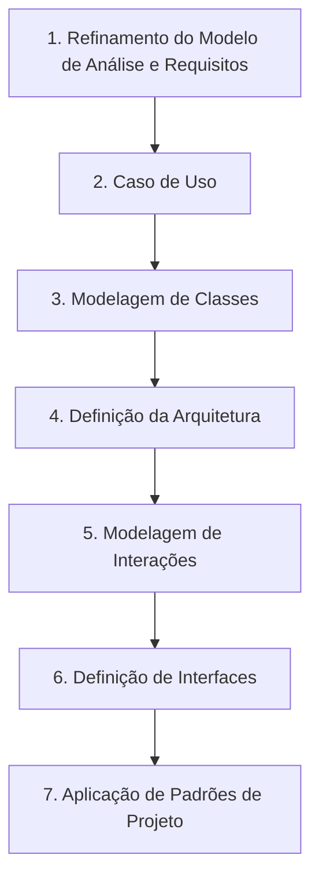

1. **Refinamento do Modelo de Análise e Requisitos:** Lapidação das necessidades dos stakeholders, eliminação de ambiguidades e identificação de restrições operacionais e regulatórias.
2. **Caso de Uso:** Especificação do comportamento externo do sistema a partir da perspectiva dos atores, mapeando fluxos principais, alternativos e de exceção.
3. **Modelagem de Classes:** Representação estrutural estática das entidades do domínio, atributos, métodos e relacionamentos fundamentais.
4. **Definição da Arquitetura:** Estabelecimento do esqueleto do sistema, seleção do estilo arquitetural (monolítico, orientado a serviços, hexagonal, microserviços), definição dos limites de contexto e distribuição física dos componentes.
5. **Modelagem de Interações:** Detalhamento da dinâmica temporal do sistema (via diagramas de sequência ou comunicação), explicitando como os objetos colaboram para realizar os casos de uso sob a arquitetura escolhida.
6. **Definição de Interfaces:** Formalização dos contratos de comunicação entre subsistemas, serviços ou camadas, garantindo baixo acoplamento e previsibilidade de integração.
7. **Aplicação de Padrões de Projeto:** Emprego de padrões táticos (como os padrões GoF — *Gang of Four*) para resolver problemas recorrentes de design em nível de classes e objetos no código-fonte.

### Priorização de requisitos com a técnica MoSCoW

A viabilidade técnica de uma arquitetura depende da clareza quanto à criticidade dos requisitos. O método MoSCoW é uma técnica ágil de priorização que categoriza os itens do backlog em quatro níveis de relevância:

| Categoria | Sigla | Descrição e Impacto Arquitetural |
| :--- | :---: | :--- |
| **Must have** | **M** | Requisitos vitais e inegociáveis. Se omitidos, o produto não entra em operação nem gera valor. A arquitetura deve fornecer garantias absolutas de suporte a estes itens (ex.: conformidade transacional bancária). |
| **Should have** | **S** | Requisitos de alta importância, mas com soluções manuais de contorno viáveis no curto prazo. Devem ser integrados assim que os itens fundamentais estiverem estabilizados. |
| **Could have** | **C** | Funcionalidades desejáveis que trazem valor adicional ou conveniência, mas que só serão desenvolvidas se houver folga de tempo e orçamento, sem comprometer a estrutura central. |
| **Won't have** | **W** | Requisitos explicitamente acordados como fora do escopo da versão atual. Podem ser reavaliados em lançamentos futuros, evitando desperdício de esforço na arquitetura imediata. |

A aplicação do método MoSCoW impede a armadilha do *over-engineering* (superengenharia), assegurando que o arquiteto projete o sistema para suportar aquilo que é estruturalmente indispensável ao negócio no momento presente.

---

## Definição de arquitetura de software pela ISO/IEC/IEEE 42010:2022

### O conceito normativo internacional

A norma internacional **ISO/IEC/IEEE 42010:2022** (*Software, systems and enterprise — Architecture description*) padroniza as melhores práticas para a descrição, compreensão e especificação de arquiteturas em sistemas complexos. A norma define arquitetura de software como:

> *"Estrutura fundamental ou esqueleto de um sistema de software, que define seus componentes, suas relações e seus princípios de projeto e evolução."*

Essa definição consolida três pilares essenciais:
- **Componentes:** As unidades de computação e armazenamento do sistema (módulos, classes, pacotes, subsistemas, microsserviços ou bancos de dados).
- **Relações:** As formas de acoplamento, conectores e protocolos por meio dos quais os componentes trocam informações e compartilham estado (chamadas locais de método, chamadas remotas RPC, mensageria assíncrona, filas ou barramentos).
- **Princípios de projeto e evolução:** O conjunto de restrições, decisões estruturais e diretrizes técnicas que governam não apenas o desenho inicial, mas orientam as mudanças futuras, mantendo a integridade conceitual do produto ao longo do tempo.

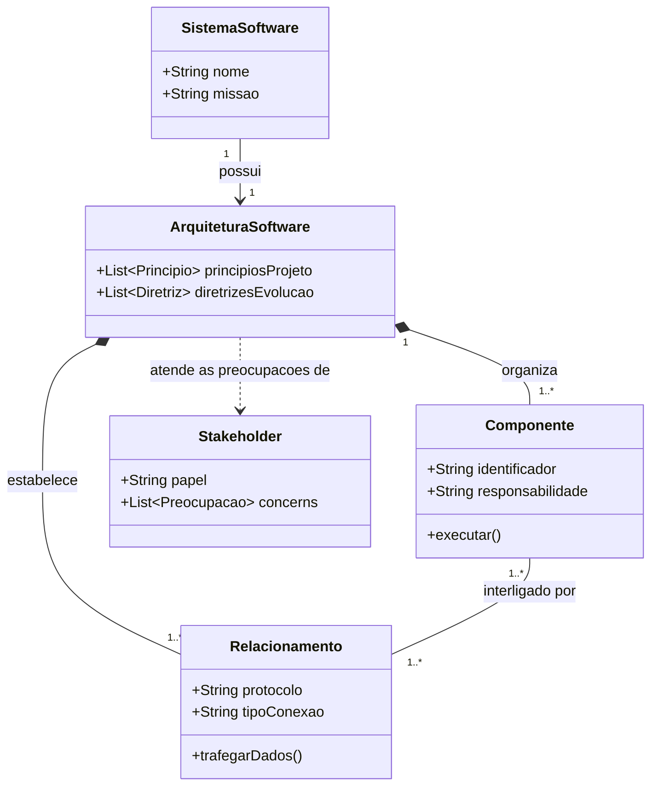

### Analogia e contrastes com a arquitetura física e civil

Historicamente, compara-se a arquitetura de software à arquitetura civil. Ambas compartilham o objetivo de prover sustentação, segurança, eficiência funcional e conformidade com normas técnicas antes da etapa construtiva pesada. Contudo, na engenharia de software existem particularidades vitais:

1. **Invisibilidade e Imaterialidade:** O software não possui presença física. Suas tensões e acoplamentos manifestam-se logicamente, tornando a arquitetura mais suscetível à degradação silenciosa (*architectural drift* ou erosão arquitetural).
2. **Taxa de Mudança e Maleabilidade:** Um edifício dificilmente tem suas fundações ou pilares alterados após a conclusão da obra sem custos proibitivos. Já o software é inerentemente maleável: o modelo de negócio evolui e a arquitetura deve estar preparada para acompanhar essas transformações contínuas.
3. **Desgaste Físico versus Envelhecimento Lógico:** Edifícios sofrem deterioração mecânica provocada pelo tempo e intempéries. O software, por sua vez, não sofre desgaste físico; ele "envelhece" quando o ambiente ao seu redor (sistemas operacionais, bibliotecas, demandas de escala, ameaças de segurança) se transforma e o software permanece estático.

---

## Importância e benefícios dos padrões arquiteturais

### Por que adotar soluções consolidadas

Padrões arquiteturais expressam soluções reutilizáveis, documentadas e comprovadas na prática industrial para resolver desafios recorrentes no projeto de sistemas complexos. Projetar um sistema partindo do zero sem considerar padrões pré-existentes introduz riscos técnicos elevados e custos proibitivos de desenvolvimento.

Os principais benefícios decorrentes da aplicação rigorosa de padrões arquiteturais incluem:
- **Flexibilidade e Escalabilidade:** Permitem que o sistema responda ao crescimento volumétrico de transações e usuários sem demandar refatorações globais ou paralisações de serviço.
- **Facilidade de Manutenção e Evolução:** Promovem a modularidade e o isolamento de responsabilidades, assegurando que modificações em uma parte do sistema não propaguem efeitos colaterais indesejados.
- **Segurança e Desempenho:** Incorporam princípios de proteção (como segregação de privilégios e zonas de isolamento) e otimização de recursos validados por anos de experiência na indústria.
- **Redução de Custos e Riscos:** Reduzem a probabilidade de falhas catastróficas em produção decorrentes de designs ingênuos, acelerando o tempo de lançamento no mercado (*time-to-market*).
- **Vocabulário Comum entre Equipes:** Estabelecem uma linguagem técnica padronizada, permitindo que engenheiros, arquitetos e gestores compreendam instantaneamente o modelo estrutural ao citarem termos como "SOA", "Hexagonal" ou "Microserviços".

### Diferença entre padrão arquitetural e padrão de projeto

É fundamental que o futuro engenheiro de software não confunda o nível de abstração dessas duas categorias:

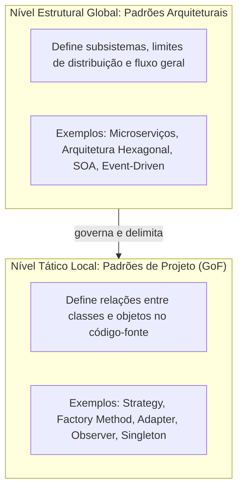

| Critério | Padrão Arquitetural | Padrão de Projeto (Design Pattern) |
| :--- | :--- | :--- |
| **Escopo** | Global. Governa todo o sistema ou grandes subsistemas corporativos. | Local. Governa módulos, classes individuais ou pequenos grupos de objetos. |
| **Foco** | Organização estrutural, particionamento de responsabilidades e infraestrutura física/lógica. | Resolução de problemas pontuais de instanciação, comportamento ou estruturação de classes. |
| **Decisão** | Tomada no início do projeto; alterá-la posteriormente é caro e traumático. | Tomada durante a codificação diária; fácil refatoração por meio de testes automatizados. |
| **Exemplos** | Hexagonal, Microserviços, Camadas (N-Tier), SOA, CQRS. | Strategy, Factory Method, Adapter, Decorator, Observer. |

---

## Modelos de distribuição de software: SaaS e On-Premises

A escolha da distribuição de software afeta diretamente a arquitetura técnica, as operações de infraestrutura e o modelo financeiro da organização.

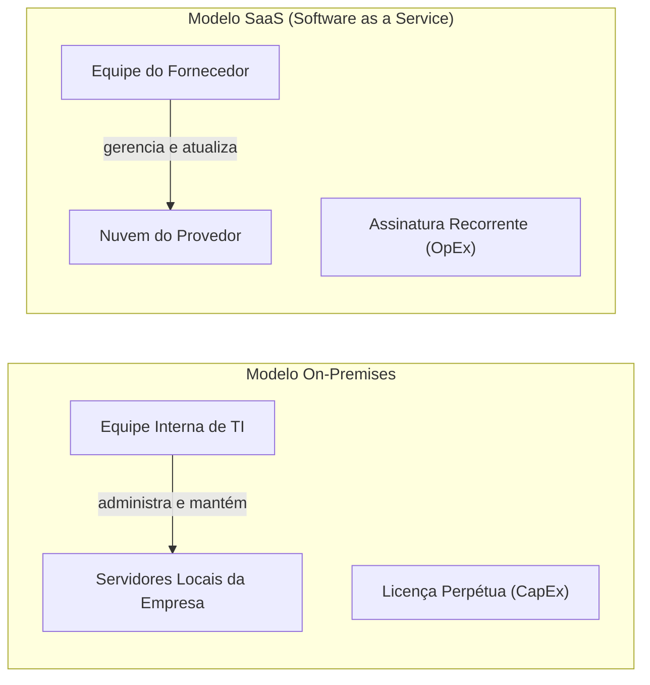

### SaaS: Software as a Service

O modelo SaaS (*Software as a Service*) consiste na entrega do aplicativo como um serviço hospedado na nuvem e acessado via internet (geralmente por navegadores ou APIs). 

- **Acesso por assinatura:** Modelo de receita baseado em pagamentos periódicos (mensal, anual ou por consumo/volume de usuários).
- **Hospedagem e manutenção centralizadas:** O fornecedor responsabiliza-se integralmente pela infraestrutura física, banco de dados, aplicação de patches de segurança e balanceamento de carga.
- **Escalabilidade ágil:** Elasticidade garantida pela nuvem, permitindo suportar variações sazonais de demanda com provisionamento automático de instâncias.
- **Atualizações automáticas:** Os usuários operam continuamente na versão mais recente, eliminando a fragmentação de versões no mercado.
- **Acessibilidade ubíqua:** Acesso a partir de qualquer dispositivo conectado, sem exigência de instalação de clientes pesados.

### On-Premises: Instalação e execução local

No modelo On-Premises, o software é instalado, configurado e executado diretamente nos servidores e estações de trabalho físicas pertencentes à própria organização cliente.

- **Licenciamento perpétuo ou unitário:** Tradicionalmente adquirido por meio de uma compra única de licença de uso, acompanhada de contratos anuais de suporte e manutenção.
- **Controle absoluto sobre dados e infraestrutura:** A organização mantém a custódia física e lógica das bases de dados, fator crítico para setores sob regulações rigorosas de sigilo industrial ou militar.
- **Dependência da equipe técnica interna:** Rotinas de backup, restauração de desastres (*disaster recovery*), aplicação de correções e monitoramento de hardware ficam sob inteira responsabilidade do time de TI interno.
- **Alto investimento inicial:** Exige desembolso antecipado expressivo em infraestrutura física (servidores, redes, nobreaks, ar-condicionado de precisão) e licenças de software de base (SGBDs, sistemas operacionais).

### Matriz comparativa de distribuição

| Parâmetro de Comparação | SaaS (Software as a Service) | On-Premises (Instalação Local) |
| :--- | :--- | :--- |
| **Modelo Financeiro** | **OpEx** (*Operational Expenditure*): despesa operacional contínua, previsível e dedutível. | **CapEx** (*Capital Expenditure*): alto investimento inicial em ativos de capital e hardware. |
| **Infraestrutura** | Fornecida, gerenciada e dimensionada pelo provedor na nuvem. | Adquirida, instalada e administrada internamente em data center próprio. |
| **Atualizações e Patches** | Transparentes, automáticas e uniformes para toda a base de clientes. | Manuais, agendadas e dependentes de validação e execução pela equipe interna. |
| **Responsabilidade por Backups** | Totalmente a cargo do provedor SaaS, com SLAs de restauração. | Totalmente sob responsabilidade da equipe interna da organização cliente. |
| **Dependência de Conectividade** | Crítica; a indisponibilidade de internet interrompe a operação do sistema. | Baixa para redes locais; o sistema opera mesmo isolado da internet pública. |
| **Custódia dos Dados** | Hospedados em infraestrutura de terceiros (exige atenção a LGPD/compliance). | Retidos integralmente dentro do perímetro de segurança da empresa. |

---

## Arquitetura Cliente-Servidor e suas limitações

### O modelo clássico de duas camadas

Amplamente difundida na década de 1990 com o advento das redes corporativas locais e de linguagens visuais (como Delphi, Visual Basic e PowerBuilder), a arquitetura Cliente-Servidor divide o sistema em dois papéis fundamentais: o **Cliente** (*Front-end* / Aplicação executável) e o **Servidor** (*Back-end* / Geralmente o SGBD).

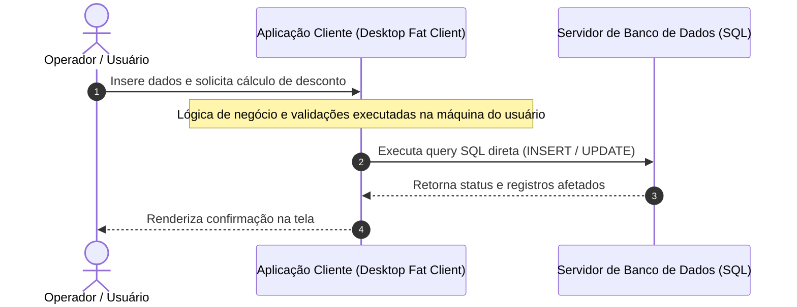

Essa abordagem representou um avanço histórico em relação aos sistemas monolíticos centralizados em *Mainframes*, distribuindo o poder de processamento da interface gráfica para os computadores pessoais.

### Gargalos estruturais e problemas de manutenção

Com o aumento da complexidade das regras de negócio corporativas, o modelo clássico de duas camadas revelou limitações severas:

1. **Cliente Pesado (*Fat Client*):** A aplicação cliente acumulava três responsabilidades distintas: renderização da interface gráfica, execução de regras de negócio complexas e manipulação de conexões de banco de dados.
2. **Duplicação de Regras de Domínio:** Quando surgia a necessidade de criar um novo canal de acesso (por exemplo, um portal web incipiente ou integração com terceiros), as regras de negócio antes programadas dentro da aplicação desktop precisavam ser reescritas na nova plataforma, gerando inconsistências graves.
3. **Acoplamento Direto com o SGBD:** As máquinas clientes continham *drivers* de conexão (ODBC/JDBC) e emitiam comandos SQL diretamente para o servidor. Qualquer alteração no esquema de tabelas quebrava todas as aplicações instaladas no parque de computadores da empresa.
4. **Logística Desafiadora de Implantação (*Deployment Hell*):** Cada atualização de versão exigia intervenção física ou remota em centenas de estações de trabalho, tornando correções de bugs emergenciais processos morosos e arriscados.
5. **Gargalo de Conexões Concorrentes:** Como cada cliente desktop mantinha uma conexão direta e permanente com o banco de dados, o número de conexões simultâneas esgotava rapidamente os recursos computacionais do servidor de SGBD.

---

## Arquitetura Orientada a Serviços (SOA) e estudo de caso em e-commerce

### Fundamentos de SOA e comunicação stateless

A Arquitetura Orientada a Serviços (*Service-Oriented Architecture* — SOA) surgiu para resolver os gargalos de acoplamento do modelo Cliente-Servidor, organizando o sistema como um ecossistema de **serviços independentes, autônomos e reutilizáveis**.

Os princípios basilares de SOA incluem:
- **Contratos bem definidos:** Os serviços expõem interfaces formais (historicamente via WSDL/SOAP e modernamente com OpenAPI/REST ou gRPC) que desacoplam a especificação do serviço de sua implementação interna.
- **Comunicação Stateless (Sem Estado):** Cada solicitação enviada a um serviço deve conter todas as informações necessárias para ser processada com sucesso. O serviço não armazena contexto de sessões anteriores entre requisições, viabilizando escalabilidade horizontal e balanceamento de carga simplificado.
- **Reutilização e Interoperabilidade:** Os serviços atuam como componentes corporativos compartilhados. Um serviço desenvolvido em Java pode ser consumido de forma transparente por aplicações escritas em C#, Python ou JavaScript.

### Estudo de caso: decomposição funcional de e-commerce

No cenário de um e-commerce moderno, a arquitetura SOA estrutura as operações em torno de serviços corporativos autônomos, viabilizando o reuso por múltiplos canais:

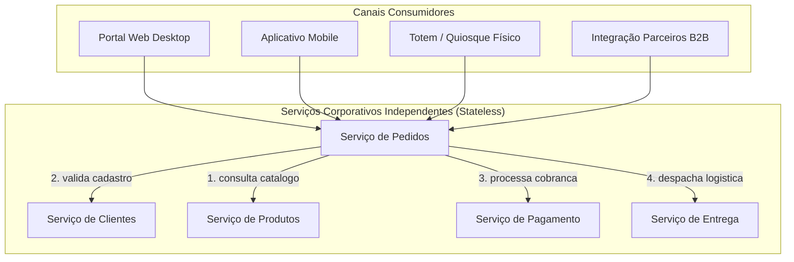

Neste modelo:
- O **Serviço de Pedidos** orquestra o fluxo de fechamento da compra, mas não implementa cobrança ou emissão de etiquetas logísticas.
- O **Serviço de Pagamento** é totalmente isolado. Se a empresa decidir trocar o provedor de cartão de crédito ou adicionar suporte a PIX, apenas o código interno deste serviço é modificado; nenhum dos canais (Web, Mobile, PDV) sofre impacto, desde que o contrato de interface seja preservado.
- A comunicação ocorre estritamente por meio das interfaces de rede, eliminando qualquer dependência de bancos de dados compartilhados ou código cliente embutido.

---

## Arquitetura Hexagonal (Ports and Adapters) e isolamento do domínio

### A regra de negócio no centro e as tecnologias nas bordas

Criada pelo cientista da computação Alistair Cockburn em 2005, a **Arquitetura Hexagonal** (conhecida formalmente como padrão *Ports and Adapters*) tem como diretriz máxima:

> *"Regra de negócio no centro; tecnologias ficam nas bordas."*

O objetivo central deste padrão é proteger o **Domínio da Aplicação** (entidades de negócio e casos de uso) contra contaminações causadas por frameworks, bibliotecas externas, drivers de banco de dados ou detalhes de interface de usuário. Em uma aplicação hexagonal bem projetada, o núcleo de negócio pode ser compilado e testado de forma totalmente isolada, sem a presença de servidores web ou bancos de dados em execução.

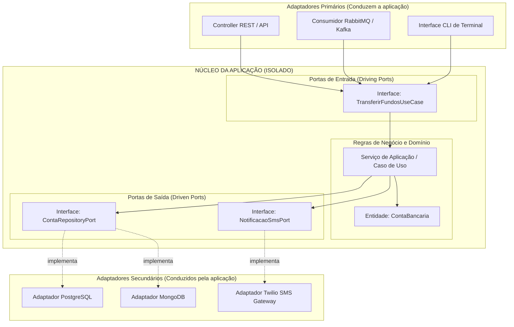

### Portas condutoras e conduzidas versus adaptadores

A arquitetura estabelece uma divisão rigorosa entre contratos conceituais (*Ports*) e implementações técnicas concretas (*Adapters*):

1. **Portas (Ports):** São interfaces puras da linguagem de programação pertencentes ao núcleo da aplicação.
   - **Portas de Entrada (Driving / Primary Ports):** Expressam as operações de negócio que a aplicação oferece ao mundo externo (os casos de uso).
   - **Portas de Saída (Driven / Secondary Ports):** Expressam as dependências de infraestrutura que o núcleo de negócio exige para concluir sua lógica (operações de persistência, envio de mensagens, integrações externas).
2. **Adaptadores (Adapters):** São componentes de infraestrutura localizados nas bordas do hexágono.
   - **Adaptadores Primários (Driving):** Convertem requisições do mundo externo em chamadas aos métodos das portas de entrada (ex.: um Controller Spring MVC/Express que extrai um payload JSON e invoca o caso de uso).
   - **Adaptadores Secundários (Driven):** Implementam as interfaces das portas de saída utilizando tecnologias concretas (ex.: uma classe DAO/Repository que usa Prisma, Hibernate ou driver nativo para salvar dados em um PostgreSQL).

Essa separação aplica integralmente o **Princípio da Inversão de Dependência (DIP)**: o núcleo define as interfaces que ele necessita; a infraestrutura externa depende do núcleo e implementa essas interfaces. Com isso, alterar o banco de dados de PostgreSQL para MongoDB requer apenas a escrita de um novo adaptador secundário, mantendo intactas todas as regras de negócio e seus respectivos testes de unidade.

---

## Arquitetura de Microserviços: características, vantagens e desafios de governança

### Características essenciais dos microserviços

A Arquitetura de Microserviços é um estilo arquitetural que decompõe uma aplicação corporativa em uma suíte de pequenos serviços independentes, cada qual executando em seu próprio processo e focado em um único domínio de negócio (*Bounded Context* do Domain-Driven Design).

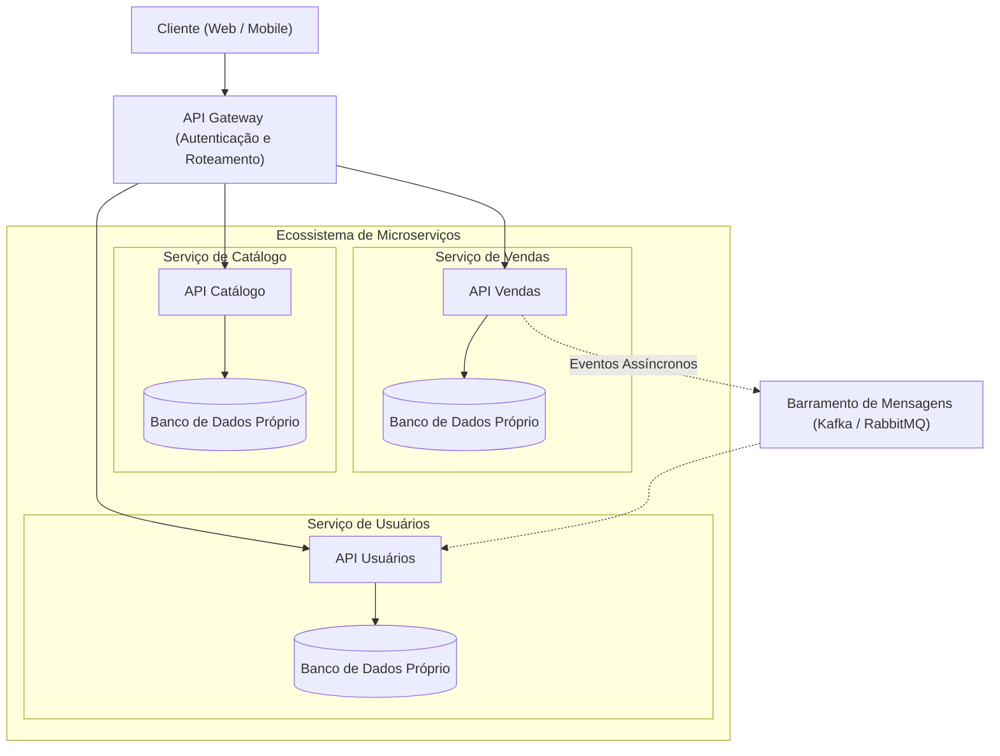

As quatro características fundamentais do padrão são:
1. **Autonomia de Implantação (*Independent Deployability*):** Cada serviço pode ser compilado, testado e publicado em produção de forma isolada, sem exigir a reinicialização ou sincronização de outros serviços do sistema.
2. **Descentralização de Dados (*Database-per-Service*):** Cada microserviço é proprietário exclusivo de sua base de dados. Nenhum serviço externo acessa diretamente as tabelas de outro serviço; todo acesso a dados ocorre obrigatoriamente por meio de APIs públicas ou eventos.
3. **Poliglotismo Tecnológico:** Equipes distintas têm a liberdade de selecionar a linguagem de programação, o framework e o mecanismo de persistência mais adequados para a natureza específica de cada problema (ex.: Python para serviços de inteligência artificial e Go/Rust para serviços de altíssimo rendimento).
4. **Comunicação por Protocolos Leves:** Interações ocorrem via requisições síncronas leves (HTTP REST, gRPC) ou publicação/assinatura assíncrona orientada a eventos (*Event-Driven Architecture*).

### Trade-offs: resiliência versus complexidade operacional

A adoção de microserviços não é uma decisão puramente vantajosa; ela introduz uma troca (*trade-off*) substancial entre flexibilidade de escala e complexidade operacional.

| Dimensão de Análise | Vantagens dos Microserviços | Desafios Operacionais e de Governança |
| :--- | :--- | :--- |
| **Escalabilidade** | Permite escalonar horizontalmente apenas o microserviço sob alta demanda (ex.: serviço de pagamentos na Black Friday). | Demanda orquestradores de contêineres sofisticados (Kubernetes) e estratégias avançadas de balanceamento. |
| **Resiliência e Tolerância a Falhas** | Uma falha crítica em um serviço de recomendação não derruba o fluxo central de compras do sistema. | Necessidade de implementar padrões de tolerância a falhas na rede, como *Circuit Breaker*, *Retry* e *Bulkhead*. |
| **Consistência de Dados** | Elimina contenção de travas globais de bancos de dados relacionais gigantes. | Abandono das transações ACID clássicas em favor da **Consistência Eventual**, exigindo o padrão *Saga* para compensação de falhas. |
| **Observabilidade e Diagnóstico** | Logs e métricas são segmentados por domínio funcional. | Dificuldade extrema de rastrear fluxos distribuídos. Exige ferramentas de *Distributed Tracing* (Jaeger, OpenTelemetry) e logs centralizados. |
| **Governança de APIs** | Interfaces desacopladas permitem evolução independente de equipes. | Risco de proliferação desgovernada de serviços e quebra de contratos de integração; requer controle rigoroso de versionamento de APIs. |

---

## Critérios estratégicos para escolha e evolução da arquitetura de software

### Arquitetura como sistema vivo e evolutivo

Diferente de um monumento de concreto, a arquitetura de software é um **organismo vivo e adaptativo**. O principal erro de equipes de desenvolvimento consiste em tratar o desenho arquitetural como um documento estático e finalizado na largada do projeto.

A disciplina de **Arquitetura Evolutiva** preconiza que as decisões estruturais devem ser tomadas com base no estado atual do negócio e dos requisitos, preservando a capacidade do sistema de mudar no futuro sem perda de estabilidade:
- **Análise do Domínio e Contexto:** O tamanho da base de usuários, a volatilidade das regras regulatórias, o orçamento disponível e o nível de maturidade técnica da equipe são fatores determinantes que superam preferências estéticas por determinada tecnologia.
- **Lei de Conway:** *"Organizações que projetam sistemas estão limitadas a produzir designs que são cópias das estruturas de comunicação dessas organizações."* Equipes pequenas e unificadas têm alto desempenho construindo monólitos modulares; impor microserviços a times reduzidos cria gargalos graves de coordenação.
- **Monolith First:** Recomendação consolidada na engenharia moderna que defende iniciar novos produtos através de um monólito bem modularizado. À medida que os limites dos subdomínios (*bounded contexts*) se provam estáveis no mercado e a escala de acessos justifique a sobrecarga de rede, serviços específicos podem ser gradualmente extraídos para microserviços.

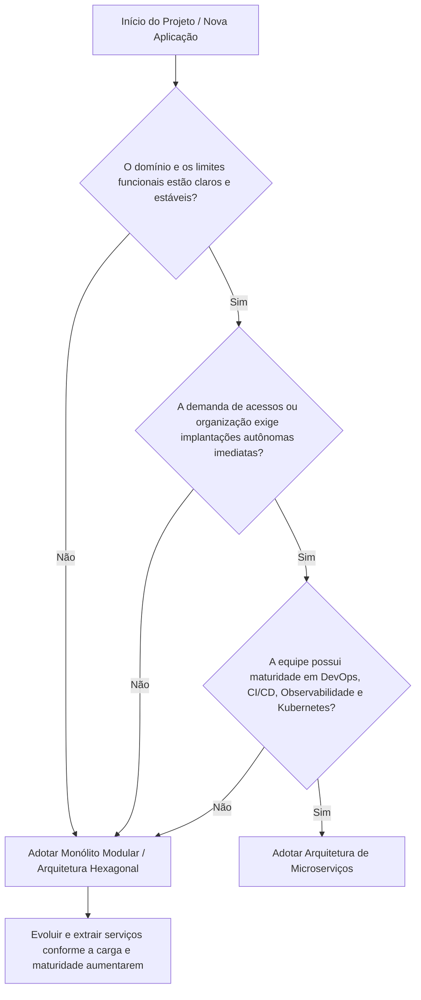

### Antipadrão: Desenvolvimento orientado a modismos

O fenômeno conhecido como **HDD (*Hype-Driven Development*)** ocorre quando decisões de arquitetura e infraestrutura são orientadas pelas tecnologias em voga no mercado ou em redes sociais corporativas, em detrimento dos requisitos concretos do projeto.

- **Sintomas clássicos:** Fragmentar sistemas que processam poucos acessos diários em dezenas de microsserviços; adotar bancos NoSQL distribuídos onde transações relacionais simples resolveriam o problema com garantias ACID; inserir filas e mensageria assíncrona em fluxos lineares e triviais.
- **Consequências:** Aumento astronômico no tempo de entrega, custos elevados de nuvem, latência desnecessária nas requisições, dificuldades de depuração local e sobrecarga cognitiva desproporcional sobre o time de desenvolvimento.
- **Diretriz de Engenharia:** Um engenheiro de software sênior avalia tecnologias como **ferramentas de resolução de problemas e trade-offs**, nunca como símbolos de status técnico. Toda complexidade adicionada a uma arquitetura deve ser justificada por um requisito de negócio ou de qualidade explícito.

---

## Código da aula

Conforme especificado no plano de ensino e nas diretrizes desta aula, o conteúdo programático ministrado pelo Prof. Wesley Soares é de natureza estritamente **teórica e arquitetural**, não havendo a submissão de arquivos de implementação prática anexos para este encontro.

A fim de enriquecer e materializar a compreensão dos padrões conceituais apresentados, analisa-se a seguir um exemplo conceitual de referência demonstrando a implementação das portas e adaptadores da **Arquitetura Hexagonal**:

```typescript
// ============================================================================
// NÚCLEO DA APLICAÇÃO: DOMÍNIO E PORTAS (ISOLADOS DE TECNOLOGIA)
// ============================================================================

// Entidade pura do domínio
export class Conta {
  constructor(
    public readonly id: string,
    private saldo: number
  ) {}

  public debitar(valor: number): void {
    if (valor <= 0) throw new Error("Valor de débito inválido.");
    if (this.saldo < valor) throw new Error("Saldo insuficiente para transferência.");
    this.saldo -= valor;
  }

  public creditar(valor: number): void {
    if (valor <= 0) throw new Error("Valor de crédito inválido.");
    this.saldo += valor;
  }

  public getSaldo(): number {
    return this.saldo;
  }
}

// Porta de Saída (Driven Port): Interface para persistência
export interface ContaRepositoryPort {
  buscarPorId(id: string): Promise<Conta | null>;
  salvar(conta: Conta): Promise<void>;
}

// Porta de Entrada (Driving Port): Interface que define o Caso de Uso
export interface TransferirFundosUseCase {
  executar(origemId: string, destinoId: string, valor: number): Promise<void>;
}

// Implementação do Caso de Uso (Pertence ao Núcleo)
export class TransferirFundosService implements TransferirFundosUseCase {
  constructor(private readonly contaRepo: ContaRepositoryPort) {}

  async executar(origemId: string, destinoId: string, valor: number): Promise<void> {
    const contaOrigem = await this.contaRepo.buscarPorId(origemId);
    const contaDestino = await this.contaRepo.buscarPorId(destinoId);

    if (!contaOrigem || !contaDestino) {
      throw new Error("Uma ou ambas as contas informadas não existem.");
    }

    contaOrigem.debitar(valor);
    contaDestino.creditar(valor);

    await this.contaRepo.salvar(contaOrigem);
    await this.contaRepo.salvar(contaDestino);
  }
}

// ============================================================================
// BORDAS: ADAPTADORES CONCRETOS (DEPENDEM DO NÚCLEO)
// ============================================================================

// Adaptador Secundário (Driven Adapter): Implementa a porta usando um SGBD concreto
export class PostgresContaRepositoryAdapter implements ContaRepositoryPort {
  async buscarPorId(id: string): Promise<Conta | null> {
    // Código de infraestrutura que executa query SQL no PostgreSQL
    console.log(`[Infra-DB] Consultando conta ${id} via driver PostgreSQL...`);
    return new Conta(id, 1000.0); // Simulação de retorno
  }

  async salvar(conta: Conta): Promise<void> {
    console.log(`[Infra-DB] Gravando saldo atualizado da conta ${conta.id} no PostgreSQL.`);
  }
}

// Adaptador Primário (Driving Adapter): Controller Web que invoca a porta de entrada
export class TransferenciaWebController {
  constructor(private readonly useCase: TransferirFundosUseCase) {}

  async postTransferencia(httpRequest: { body: { de: string; para: string; quantia: number } }): Promise<{ status: number; mensagem: string }> {
    try {
      const { de, para, quantia } = httpRequest.body;
      await this.useCase.executar(de, para, quantia);
      return { status: 200, mensagem: "Transferência executada com sucesso." };
    } catch (erro: any) {
      return { status: 400, mensagem: erro.message };
    }
  }
}
```

---

## Exercícios

### Exercício 1: Análise Comparativa: SaaS versus On-Premises

Considere uma clínica médica que necessita implantar um novo sistema de Prontuário Eletrônico do Paciente (PEP). Elabore uma análise comparativa entre os modelos SaaS e On-Premises contemplando:
- (a) Estrutura de custos (CapEx versus OpEx e modelo de licenciamento/assinatura);
- (b) Responsabilidades sobre rotinas de backup, atualizações e conformidade com a segurança de dados;
- (c) Impacto de conectividade com a internet e controle de infraestrutura.
- Ao final, justifique qual modelo você recomendaria considerando uma clínica de pequeno porte sem equipe técnica interna dedicada.

#### Raciocínio
A análise exige a correlação entre os modelos de distribuição apresentados na aula e as restrições orçamentárias e operacionais de uma empresa médica de pequeno porte. Em clínicas pequenas, a inexistência de profissionais especializados de TI inviabiliza a manutenção segura de servidores locais. Deve-se contrapor a despesa inicial de capital (CapEx) com o custeio operacional contínuo (OpEx), além de avaliar a governança de dados segundo a LGPD.

#### Resolução comentada
**(a) Estrutura de Custos (CapEx versus OpEx):**
- **On-Premises:** Opera preponderantemente sob a ótica de **CapEx** (*Capital Expenditure*). Demanda um investimento inicial volumoso para compra de servidores dedicados de alta disponibilidade, licenças perpétuas do software de prontuário, licenças de sistemas operacionais e SGBD corporativo, além de equipamentos de infraestrutura (nobreaks senoidais, cabeamento estruturado e climatização).
- **SaaS:** Fundamenta-se em **OpEx** (*Operational Expenditure*). Elimina totalmente o gasto inicial com aquisição de infraestrutura computacional pesada. O custo é diluído em pagamentos recorrentes (mensais ou anuais) de assinatura por usuário ou estação de atendimento, convertendo um ativo fixo em despesa de custeio previsível e com benefícios de dedutibilidade fiscal.

**(b) Responsabilidade de Backups, Atualizações e Segurança:**
- **On-Premises:** Todas as rotinas operacionais recaem sobre a clínica. Cabe ao estabelecimento configurar, testar e executar planos de backup (incluindo rotinas fora do local físico para proteger contra sinistros), aplicar patches de segurança no sistema operacional e gerenciar regras de firewall contra malwares (como ataques de *ransomware*).
- **SaaS:** O fornecedor do serviço detém a responsabilidade contratual total pelos backups automáticos com replicação geográfica, proteção contra invasões, alta disponibilidade e aplicação ininterrupta de correções de bugs e atualizações de novas versões normativas.

**(c) Conectividade e Controle de Infraestrutura:**
- **On-Premises:** Permite operação autônoma caso a internet oscile ou fique indisponível, pois as estações comunicam-se via rede local (LAN). Todavia, restringe o acesso externo seguro aos prontuários quando os médicos estão em conferências ou em domicílio (exigindo VPNs complexas).
- **SaaS:** Exige conectividade confiável com a internet. Uma interrupção no link de dados pode paralisar as consultas se a clínica não contar com redundância (como uma linha de contingência 4G/5G). Em contrapartida, oferece acesso ubíquo de qualquer dispositivo autorizado e dispensa a posse física de servidores.

**Recomendação Justificada:**
Recomenda-se enfaticamente o **modelo SaaS**. Para uma clínica médica de pequeno porte sem departamento de tecnologia interno dedicado, o modelo On-Premises configuraria um alto risco de descontinuidade operacional e passivo jurídico. Falhas humanas na execução de backups manuais ou vulnerabilidades em servidores locais desatualizados exporiam prontuários médicos a sequestro de dados (*ransomware*), violando os artigos de segurança da LGPD. O SaaS transfere a gestão de alta disponibilidade, segurança cibernética e custódia da infraestrutura para uma empresa especializada, com desembolso compatível com o fluxo de caixa da clínica.

---

### Exercício 2: Decomposição Funcional em Serviços (SOA)

A partir do exemplo de e-commerce apresentado em aula, projete uma Arquitetura Orientada a Serviços (SOA) para um sistema de gestão acadêmica universitária. Defina pelo menos quatro serviços independentes (por exemplo: Matrículas, Cobrança/Financeiro, Notas/Frequência e Biblioteca). Para cada serviço, especifique:
- (a) A responsabilidade exclusiva de negócio;
- (b) As operações expostas por sua interface bem definida;
- (c) De que forma outros canais (portal web, aplicativo móvel e quiosque de autoatendimento) reutilizam esses mesmos serviços mantendo a comunicação stateless.

#### Raciocínio
A Arquitetura Orientada a Serviços preconiza a separação do sistema em torno de serviços corporativos coesos e autônomos, que oferecem seus recursos por contratos públicos de interface. A comunicação deve ser estritamente *stateless* (sem estado), o que significa que o contexto de autenticação e identificação do estudante deve viajar explicitamente nas requisições (por exemplo, via tokens criptográficos JWT), permitindo que múltiplos canais de atendimento consumam a mesma camada de serviços.

#### Resolução comentada
**(a) e (b) Definição dos Serviços, Responsabilidades e Interfaces:**

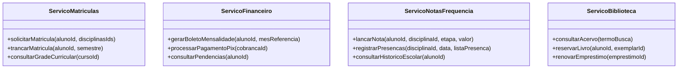

1. **Serviço de Matrículas:**
   - *Responsabilidade exclusiva:* Administrar o ciclo de vínculo do estudante com a instituição e suas inscrições em turmas e disciplinas.
   - *Operações da Interface:* `solicitarMatricula(alunoId, disciplinasIds)`, `trancarMatricula(alunoId, semestre)`, `consultarGradeCurricular(cursoId)`.
2. **Serviço Financeiro / Cobrança:**
   - *Responsabilidade exclusiva:* Gerenciar cobranças, planos de mensalidade, descontos por bolsa, emissão de boletos, reconciliação bancária e liquidação de títulos.
   - *Operações da Interface:* `gerarBoletoMensalidade(alunoId, mesReferencia)`, `processarPagamentoPix(cobrancaId)`, `consultarPendencias(alunoId)`.
3. **Serviço de Notas e Frequência:**
   - *Responsabilidade exclusiva:* Controlar o rendimento acadêmico dos estudantes, processamento de médias, diário de classe dos docentes e assiduidade.
   - *Operações da Interface:* `lancarNota(alunoId, disciplinaId, etapa, valor)`, `registrarPresencas(disciplinaId, data, listaPresenca)`, `consultarHistoricoEscolar(alunoId)`.
4. **Serviço de Biblioteca:**
   - *Responsabilidade exclusiva:* Gestão do catálogo bibliográfico físico e virtual, empréstimos, controle de devoluções e multas por atraso.
   - *Operações da Interface:* `consultarAcervo(termoBusca)`, `reservarLivro(alunoId, exemplarId)`, `renovarEmprestimo(emprestimoId)`.

**(c) Reutilização por Canais e Comunicação Stateless:**
Os múltiplos canais (Portal Web do Aluno, Aplicativo Mobile e Totem de Autoatendimento da Secretaria) não contêm regras de negócio acadêmicas ou contábeis embutidas em seu código. Eles atuam exclusivamente como clientes consumidores das interfaces expostas pelos serviços SOA:
- **Exemplo de Reuso:** Quando um aluno renova um livro pelo celular ou no totem da biblioteca física, ambos os dispositivos emitem a mesma requisição HTTP/REST para a operação `renovarEmprestimo(emprestimoId)` do Serviço de Biblioteca.
- **Comunicação Stateless:** Nenhum dos serviços mantém sessão aberta em memória no servidor para guardar dados de navegação do usuário. Cada requisição encaminhada pelos canais carrega no cabeçalho (*Header*) um token de autorização assinado (ex.: Bearer JWT contendo o ID do aluno e suas permissões). Se a universidade contar com múltiplos servidores para o Serviço de Matrículas rodando atrás de um balanceador de carga, qualquer nó pode processar qualquer requisição de forma isolada, assegurando alta escalabilidade e tolerância a falhas.

---

### Exercício 3: Isolamento de Regras de Negócio na Arquitetura Hexagonal

Explique o funcionamento da Arquitetura Hexagonal (*Ports and Adapters*) a partir da máxima *"regra de negócio no centro, tecnologias nas bordas"*. Ilustre o conceito descrevendo o fluxo de um caso de uso de "Transferência Bancária":
- (a) O que reside no núcleo de domínio (entidades e casos de uso);
- (b) Uma porta de entrada (*driver port*) e dois adaptadores primários possíveis que acionam essa porta (ex.: Controller REST e Consumer de mensageria RabbitMQ);
- (c) Duas portas de saída (*driven ports*) e seus respectivos adaptadores secundários (ex.: Repositório PostgreSQL e Gateway de Notificação SMS).
- Explique como esse padrão viabiliza a substituição do banco de dados relacional por um NoSQL sem alterar nenhuma linha da regra de negócio central.

#### Raciocínio
A essência da Arquitetura Hexagonal consiste em isolar completamente a lógica de domínio de qualquer dependência técnica e framework externo. O exercício pede a materialização dos componentes em um cenário clássico de transferência bancária, demonstrando como o Princípio da Inversão de Dependência permite que as regras centrais permaneçam imutáveis frente à substituição de infraestruturas nas bordas.

#### Resolução comentada
**(a) Componentes do Núcleo de Domínio:**
No centro do hexágono reside a lógica pura do negócio, sem dependência de anotações de bancos ou frameworks:
- **Entidades de Domínio:** A classe `ContaBancaria`, que encapsula atributos como saldo, limite e titularidade, e implementa métodos invariantes como `sacar()`, `depositar()` e a validação de que o saldo somado ao limite não pode ficar negativo.
- **Casos de Uso / Serviços de Aplicação:** A classe `TransferirFundosService`, que implementa a lógica do processo: busca as duas contas envolvidas através de uma porta abstrata de repositório, valida se a conta de origem pode debitar, credita na conta de destino, persiste as alterações e solicita o envio de uma confirmação.

**(b) Porta de Entrada e Adaptadores Primários:**
- **Porta de Entrada (Driver Port):** Uma interface pura em código:
  ```typescript
  interface TransferirFundosUseCase {
    transferir(contaOrigem: string, contaDestino: string, valor: number): Promise<void>;
  }
  ```
- **Adaptador Primário 1 (Controller REST):** Uma classe que atua na camada HTTP, recebendo requisições `POST /api/transferencias`, validando o formato JSON e chamando o método `transferir(...)` da interface.
- **Adaptador Primário 2 (Consumer de Mensageria RabbitMQ):** Um ouvinte (*listener*) conectado a uma fila do RabbitMQ que consome mensagens de agendamento de transferências disparadas em lote, desserializa o payload e invoca rigorosamente o mesmo método `transferir(...)`.

**(c) Portas de Saída e Adaptadores Secundários:**
- **Porta de Saída 1 (Persistência):** `interface ContaRepositoryPort { buscar(id: string): Conta; salvar(conta: Conta): void; }`
  - *Adaptador Secundário 1:* `PostgreSqlContaAdapter`, classe que implementa essa interface executando transações SQL no banco relacional PostgreSQL.
- **Porta de Saída 2 (Notificação):** `interface NotificacaoGatewayPort { notificarSucesso(destinatario: string, msg: string): void; }`
  - *Adaptador Secundário 2:* `TwilioSmsAdapter`, classe que implementa essa porta consumindo a API REST do provedor Twilio para disparo de SMS ao correntista.

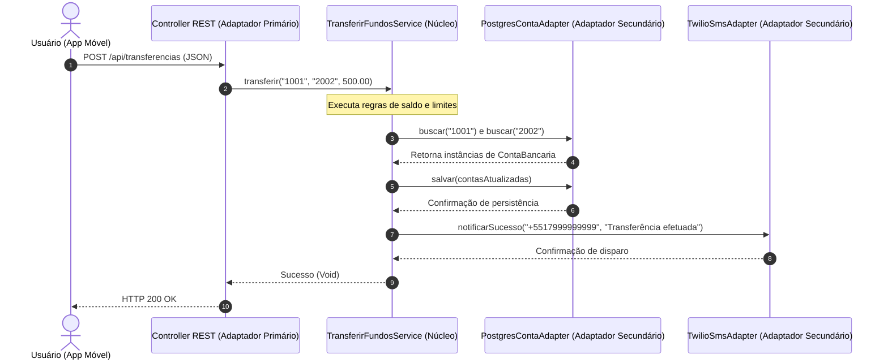

**Mecanismo de Substituição do Banco de Dados:**
O núcleo da aplicação depende exclusivamente do contrato formal definido na porta `ContaRepositoryPort`. Ele desconhece por completo se os dados serão armazenados em tabelas SQL, documentos NoSQL ou arquivos texto. 
Caso a equipe técnica decida substituir o PostgreSQL pelo banco de dados NoSQL MongoDB, o procedimento de engenharia restringe-se a:
1. Criar uma nova classe de infraestrutura nas bordas: `MongoDbContaAdapter implements ContaRepositoryPort`.
2. Escrever a lógica de mapeamento dos documentos BSON do MongoDB para a entidade de domínio `ContaBancaria`.
3. Ajustar a injeção de dependência na inicialização da aplicação para plugar o novo adaptador na porta de saída.
**Nenhuma linha de código das classes do domínio (`ContaBancaria`) ou do caso de uso (`TransferirFundosService`) é alterada**, garantindo risco técnico nulo para as regras de negócio consolidadas.

---

### Exercício 4: Avaliação de Trade-offs na Adoção de Microserviços

Uma startup do setor financeiro opera um sistema monolítico funcional, mas a diretoria propôs migrar imediatamente toda a base de código para Microserviços argumentando "modernização tecnológica". Com base nas orientações da aula sobre "não seguir modismos sem avaliar a adequação ao cenário", elabore um parecer técnico que apresente:
- (a) Três vantagens reais que a arquitetura de microserviços traria à empresa;
- (b) Três desafios operacionais e de engenharia introduzidos pelo padrão (como latência de rede, consistência eventual e necessidade de governança/observabilidade de APIs);
- (c) Pelo menos três pré-requisitos organizacionais e técnicos que devem existir antes de justificar a decomposição do monólito.

#### Raciocínio
A resposta deve estruturar-se sob o formato formal de Parecer Técnico de Engenharia de Software. É vital combater a visão ingênua de que a arquitetura de microserviços é uma solução universal superior. Deve-se demonstrar maturidade analítica balanceando os ganhos estruturais de desacoplamento com o expressivo aumento de complexidade em sistemas distribuídos (teorema CAP, latência, observabilidade e automação de infraestrutura).

#### Resolução comentada

**PARECER TÉCNICO DE ENGENHARIA DE SOFTWARE**
- **Interessado:** Diretoria Executiva da Startup Financeira
- **Assunto:** Análise de Viabilidade Técnica e Trade-offs da Migração para Microserviços

**(a) Vantagens Reais do Estilo Microserviços:**
1. **Escalabilidade Granular e Otimização de Custos:** Em sistemas financeiros, módulos específicos (como autorização de transações de cartão e liquidação de PIX) sofrem picos extremos de tráfego, enquanto módulos cadastrais mantêm acessos estáveis. Com microserviços, pode-se provisionar mais instâncias exclusivamente para o serviço de pagamento, poupando custos de nuvem em relação a duplicar o monólito inteiro.
2. **Resiliência e Isolamento de Falhas:** O travamento de um serviço secundário (por exemplo, o gerador de relatórios analíticos em PDF) não interrompe o funcionamento dos serviços críticos de autorização de compras.
3. **Autonomia de Implantação e Desacoplamento de Equipes:** Permite que diferentes squads de desenvolvimento publiquem correções e novas funcionalidades em seus serviços sem exigir o congelamento (*code freeze*) e testes regressivos da aplicação corporativa inteira.

**(b) Desafios Operacionais e de Engenharia Introduzidos:**
1. **Latência de Rede e Falácias da Computação Distribuída:** No monólito, a comunicação entre módulos ocorre via chamadas de método em memória (nanossegundos). Nos microserviços, toda interação cruza a rede via HTTP/REST ou mensageria (milissegundos), introduzindo sobrecarga de serialização/desserialização JSON, riscos de timeouts e degradação perceptível no tempo de resposta ao usuário.
2. **Consistência Eventual versus Transações ACID:** Uma operação financeira que envolva saldo, faturamento e tributos não pode mais utilizar transações transacionais clássicas de banco de dados (`BEGIN TRANSACTION ... COMMIT`). A necessidade de usar o padrão *Saga* (orquestrado ou coreografado) introduz estados temporários inconsistentes e exige a implementação de complexas ações compensatórias manuais quando ocorrem falhas intermediárias.
3. **Explosão de Complexidade Operacional e Observabilidade:** Identificar a origem de um bug em um ecossistema distribuído exige ferramentas avançadas de rastreamento distribuído (*distributed tracing* com OpenTelemetry/Jaeger), centralização massiva de logs (ElasticSearch/Loki) e governança rigorosa de contratos de API para evitar que alterações quebrem serviços clientes.

**(c) Pré-requisitos Técnicos e Organizacionais Obrigatórios:**
Antes de autorizar a quebra do monólito, a organização deve certificar-se do atendimento aos seguintes pilares:
1. **Cultura e Pipelines Automatizados de DevOps/CI-CD:** A equipe deve ter capacidade de empacotar contêineres e realizar deploys automáticos em ambientes de homologação e produção com testes de regressão automatizados e mecanismos de *rollback* instantâneo.
2. **Maturidade de Observabilidade e Monitoramento:** Existência de infraestrutura instalada para coleta de métricas de telemetria, dashboards de saúde em tempo real e rastreabilidade de requisições de ponta a ponta.
3. **Estabilidade de Domínio e Divisão Organizacional Clara (Lei de Conway):** A base de código monolítica atual precisa estar previamente organizada em módulos coesos com regras de domínio bem delimitadas (*Bounded Contexts*). Quebrar um monólito com código interno caótico e acoplado resulta na criação de um "Monólito Distribuído", que reúne todos os defeitos de um monólito combinados a todas as complexidades de uma rede instável.

**Conclusão do Parecer:**
Recomenda-se a **manutenção temporária do monólito atual**, promovendo sua refatoração interna sob o modelo de **Monólito Modular** (aplicando princípios da Arquitetura Hexagonal para desacoplar as regras financeiras). A migração física para microserviços só deve ser deflagrada quando a escala da startup ou o tamanho do quadro de desenvolvedores tornar a implantação unificada o principal gargalo de crescimento da empresa.

---

## Erros comuns e boas práticas

### Erros comuns
- **Acoplar o núcleo de domínio a bibliotecas e frameworks externos:** Fazer com que entidades de negócio da Arquitetura Hexagonal estendam classes base de frameworks web (como classes do NestJS, Express ou anotações JPA/Hibernate) destrói a portabilidade do domínio.
- **Banco de dados compartilhado entre microserviços:** Fazer com que dois microserviços acessem e modifiquem as mesmas tabelas no mesmo banco de dados relacional. Essa prática anula a independência de deploy e cria acoplamento silencioso e quebras em produção.
- **Seguir o modismo dos Microserviços prematuramente (*Microservice Cargo Cult*):** Decompor uma aplicação simples ou um produto embrionário em microserviços sem possuir maturidade de DevOps, orquestração de contêineres e observabilidade.
- **Duplicação de regras de negócio em clientes desktop ou móveis:** Programar cálculos críticos de faturamento ou descontos diretamente no front-end em arquiteturas Cliente-Servidor ou SOA, gerando vulnerabilidades de segurança e inconsistência de dados.
- **Ignorar a falibilidade da rede em sistemas distribuídos:** Projetar chamadas remotas de serviços sem prever mecanismos de contingência, como limites de tempo (*timeouts*), políticas de retentativa com recuo exponencial (*retry with exponential backoff*) e disjuntores (*circuit breakers*).
- **Subestimar os custos contínuos do modelo SaaS em larga escala:** Projetar o orçamento da organização assumindo que assinaturas SaaS serão sempre vantajosas, sem considerar que, com o crescimento exponencial de usuários, o custo operacional (OpEx) contínuo pode superar o custo de uma infraestrutura proprietária.

### Boas práticas
- **Tratar a arquitetura como um sistema vivo e evolutivo:** Tomar decisões reversíveis e adiar escolhas de infraestrutura pesada até que os requisitos de negócio estejam plenamente validados na prática.
- **Isolar rigorosamente o domínio através de Portas e Adaptadores:** Garantir que o núcleo da aplicação conheça apenas interfaces e tipos puros, mantendo drivers de bancos, bibliotecas de mensageria e protocolos de rede nas bordas.
- **Adotar o princípio "Monolith First":** Construir novas soluções como monólitos modulares limpos. Somente extrair partes do sistema para serviços autônomos quando a carga transacional ou a divisão de squads justificar o investimento.
- **Garantir a comunicação stateless em serviços corporativos:** Desenhar serviços web de modo que cada requisição seja autossuficiente e independente de dados voláteis armazenados na memória de um nó específico de servidor.
- **Implementar observabilidade distribuída desde o primeiro microserviço:** Instrumentar todas as requisições com identificadores únicos de correlação (*Correlation ID*) e rastreamento distribuído (*Distributed Tracing*), viabilizando o diagnóstico rápido de incidentes.
- **Padronizar e versionar rigorosamente contratos de APIs:** Tratar as interfaces de serviços como contratos públicos imutáveis, utilizando especificações abertas (OpenAPI/Swagger) e versionamento de rotas (ex.: `/api/v1/pedidos`) para garantir compatibilidade retroativa com clientes legados.

---

## Links e materiais complementares

- **Norma ISO/IEC/IEEE 42010:2022:** Padrão internacional para descrição e especificação de arquitetura de sistemas de software e corporativos. Documenta os conceitos de visões, pontos de vista, preocupações e partes interessadas (*stakeholders*).
- **Alistair Cockburn — Padrão Hexagonal (*Ports and Adapters*):** Artigo seminal do criador da arquitetura hexagonal detalhando a separação simétrica entre lógica central e adaptadores periféricos.
- **Martin Fowler — Microservices Architecture e MonolithFirst:** Ensaios clássicos que detalham as características fundamentais dos microserviços, suas fronteiras de desenho (*bounded contexts*) e a recomendação de iniciar novas aplicações a partir de um monólito coeso.
- **DSDM Consortium — The MoSCoW Method:** Documentação oficial sobre as diretrizes e regras práticas para priorização eficaz de requisitos de software em projetos ágeis.
- **The Twelve-Factor App:** Metodologia consolidada de boas práticas para a construção de sistemas modernos na nuvem e entrega contínua no modelo SaaS.

---

## Mapa da aula

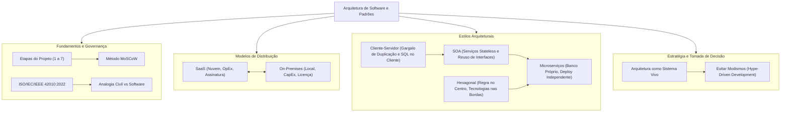

---

## Glossário

| Termo Técnico | Definição e Significado no Contexto Arquitetural |
| :--- | :--- |
| **CapEx (*Capital Expenditure*)** | Despesas de capital destinadas à aquisição de bens duráveis (servidores, equipamentos e licenças perpétuas), com alto desembolso financeiro inicial. |
| **OpEx (*Operational Expenditure*)** | Despesas operacionais recorrentes voltadas à manutenção do negócio em atividade (assinaturas de software em nuvem, consumo de infraestrutura elástica). |
| **SaaS (*Software as a Service*)** | Modelo de entrega onde a aplicação é hospedada e mantida pelo fornecedor na nuvem, acessada pelos usuários via internet como um serviço. |
| **On-Premises** | Modelo de distribuição onde o software é instalado, operado e mantido localmente na infraestrutura de hardware pertencente à própria empresa cliente. |
| **Arquitetura de Software** | Estrutura fundamental de um sistema de software que define seus componentes, relações mútuas e os princípios que governam seu design e evolução contínua (ISO 42010). |
| **Comunicação Stateless** | Protocolo de comunicação no qual cada requisição trafegada carrega todas as informações necessárias para ser concluída, sem reter estado de sessão no servidor. |
| **SOA (*Service-Oriented Architecture*)** | Estilo arquitetural que estrutura sistemas complexos como coleções de serviços corporativos autônomos, fracamente acoplados e acessíveis por interfaces padronizadas. |
| **Porta (*Port*)** | Interface formal puramente conceitual da Arquitetura Hexagonal que define um ponto de entrada ou de saída do núcleo de negócio da aplicação. |
| **Adaptador (*Adapter*)** | Componente tecnológico de infraestrutura localizado nas bordas da Arquitetura Hexagonal que converte chamadas externas ou implementa portas de persistência/redes. |
| **Driving Port (Porta de Entrada)** | Interface do núcleo da aplicação que expõe os casos de uso para que atores externos (APIs, CLIs, filas) conduzam o sistema. |
| **Driven Port (Porta de Saída)** | Interface definida pelo núcleo da aplicação que declara as operações de infraestrutura (banco de dados, gateways) exigidas para concluir o caso de uso. |
| **Microserviços** | Abordagem arquitetural que decompõe uma aplicação em um conjunto de serviços pequenos, autônomos, com implantação independente e bancos de dados descentralizados. |
| **Database-per-Service** | Padrão arquitetural em microserviços que dita que cada serviço deve ser proprietário exclusivo de sua base de dados, proibindo acesso compartilhado direto. |
| **Consistência Eventual** | Modelo de consistência em sistemas distribuídos onde os dados tornam-se consistentes após um intervalo de tempo, sem garantir sincronismo imediato (ACID). |
| **Hype-Driven Development (HDD)** | Antipadrão de engenharia que consiste em adotar ferramentas, linguagens e arquiteturas complexas motivado por tendências de mercado e modismos passageiros. |

---

## Pontos-chave para a prova

1. **Definição da ISO/IEC/IEEE 42010:2022:** memorize os três pilares essenciais: a arquitetura define os **componentes**, suas **relações** e os **princípios de projeto e evolução**.
2. **Método MoSCoW:** saiba diferenciar o significado e a relevância estrutural das categorias **Must have**, **Should have**, **Could have** e **Won't have**.
3. **Trade-offs SaaS versus On-Premises:** domine a correlação entre **OpEx** (assinatura, nuvem, backup do fornecedor) e **CapEx** (servidor próprio, equipe local, licença perpétua).
4. **Limitações do Modelo Cliente-Servidor de 2 Camadas:** lembre-se do problema do *Fat Client* (cliente gordo), duplicação de regras de negócio nas interfaces e acoplamento direto com consultas SQL a partir das máquinas clientes.
5. **Comunicação Stateless em SOA:** entenda por que serviços independentes não retêm estado em memória e como isso viabiliza o reuso por canais diversos (web, mobile, totens).
6. **Máxima da Arquitetura Hexagonal:** *"Regra de negócio no centro; tecnologias nas bordas"*. Saiba que o domínio independe de frameworks e SGBDs.
7. **Portas versus Adaptadores:** distinga com precisão **Portas de Entrada** (chamadas por controladores/adaptadores primários) de **Portas de Saída** (implementadas por repositórios/adaptadores secundários de banco ou SMS).
8. **Características dos Microserviços:** lembre-se de: autonomia de deploy, descentralização de bases de dados (*database-per-service*), comunicação via APIs leves ou mensageria assíncrona.
9. **Desafios dos Microserviços:** latência de rede adicional, abandono de transações ACID em prol da consistência eventual e sobrecarga massiva em observabilidade distribuída e orquestração.
10. **Critérios de Decisão Arquitetural:** arquitetura é um sistema vivo que deve evoluir conforme o domínio; evite o desenvolvimento orientado a modismos (*Hype-Driven Development*).

---

## Perguntas e respostas (JSONL)

```jsonl
{"pergunta": "Qual a definicao de arquitetura de software estabelecida pela norma ISO/IEC/IEEE 42010:2022?", "resposta": "E a estrutura fundamental ou esqueleto de um sistema de software, que define seus componentes, suas relacoes e seus principios de projeto e evolucao.", "dificuldade": "facil"}
{"pergunta": "Quais sao as quatro categorias de priorizacao estabelecidas pelo metodo MoSCoW?", "resposta": "Must have (obrigatorio), Should have (importante), Could have (desejavel) e Won't have (fora do escopo atual).", "dificuldade": "facil"}
{"pergunta": "Qual o significado dos termos financeiros CapEx e OpEx no contexto de distribuicao de software?", "resposta": "CapEx refere-se a despesas de capital em ativos duraveis (hardware e licencas perpetuas), enquanto OpEx representa despesas operacionais correntes de custeio (assinaturas de servicos em nuvem).", "dificuldade": "media"}
{"pergunta": "Quais sao as principais desvantagens e limitacoes da arquitetura Cliente-Servidor classica de duas camadas?", "resposta": "Concentracao excessiva de regras de negocio no cliente (Fat Client), duplicacao de codigo em novos canais, acoplamento direto com o SQL do banco e dificuldade logistica de atualizacao das estacoes.", "dificuldade": "media"}
{"pergunta": "Por que a comunicacao stateless e fundamental para o sucesso de uma Arquitetura Orientada a Servicos (SOA)?", "resposta": "Porque a ausencia de sessao retida na memoria do servidor garante que qualquer requisicao possa ser processada por qualquer instancia do servico, permitindo balanceamento de carga e alta escalabilidade.", "dificuldade": "media"}
{"pergunta": "Qual e a diretriz conceitual central da Arquitetura Hexagonal (Ports and Adapters)?", "resposta": "Regra de negocio no centro da aplicacao e tecnologias de infraestrutura nas bordas externas.", "dificuldade": "facil"}
{"pergunta": "Qual e a diferenca funcional entre uma Porta de Entrada (Driver Port) e uma Porta de Saida (Driven Port) na Arquitetura Hexagonal?", "resposta": "A Porta de Entrada define os casos de uso que o mundo externo aciona no nucleo, enquanto a Porta de Saida e a interface que o nucleo define para interagir com recursos externos como bancos de dados e servicos de terceiros.", "dificuldade": "dificil"}
{"pergunta": "Como a Arquitetura Hexagonal viabiliza a troca de um banco PostgreSQL por MongoDB sem alterar as regras de negocio?", "resposta": "Porque o nucleo depende apenas da interface abstrata da porta de saida; a troca do banco exige apenas escrever um novo adaptador que implemente essa interface, preservando o dominio intacto.", "dificuldade": "dificil"}
{"pergunta": "O que preconiza o padrao Database-per-Service na arquitetura de Microservicos?", "resposta": "Preconiza que cada microservico seja proprietario exclusivo de sua base de dados, sendo terminantemente proibido o acesso direto de outros servicos as suas tabelas internas.", "dificuldade": "media"}
{"pergunta": "Quais sao os tres principais desafios operacionais introduzidos pela Arquitetura de Microservicos em comparacao a um monolito?", "resposta": "Latencia e instabilidade de rede nas chamadas distribuidas, perda de transacoes ACID exigindo consistencia eventual, e alta complexidade de observabilidade e rastreamento distribuido.", "dificuldade": "dificil"}
{"pergunta": "Por que a adocao de microservicos pode ser prejudicial para uma equipe pequena em um produto em estagio inicial?", "resposta": "Porque introduz sobrecarga operacional excessiva (CI/CD, redes, observabilidade, orquestracao) antes mesmo de as fronteiras de negocio estarem estabilizadas, desacelerando o desenvolvimento.", "dificuldade": "media"}
{"pergunta": "O que caracteriza o antipadrao Hype-Driven Development (HDD)?", "resposta": "Consiste em escolher ferramentas, linguagens e estilos arquiteturais pautando-se em modismos passageiros do mercado, em vez de avaliar as reais necessidades do negocio e seus trade-offs.", "dificuldade": "facil"}
{"pergunta": "Qual e a diferenca entre um padrao arquitetural e um padrao de projeto (design pattern)?", "resposta": "Padroes arquiteturais definem a estrutura macroscopica e a distribuicao de subsistemas, enquanto padroes de projeto atuam no nivel microscopico de organizacao de classes e objetos no codigo.", "dificuldade": "media"}
{"pergunta": "No modelo SaaS, quem detem a responsabilidade tecnica sobre backups e conformidade de seguranca de dados?", "resposta": "O proprio fornecedor da solucao SaaS, que assume o dever de disponibilizar redundancia e rotinas operacionais de backup por contrato de nivel de servico (SLA).", "dificuldade": "facil"}
{"pergunta": "Em qual etapa do projeto de software situa-se a Definicao da Arquitetura segundo o fluxo visto em aula?", "resposta": "Situa-se na etapa 4, logo apos a Modelagem de Classes e precedendo a Modelagem de Interacoes e Definicao de Interfaces.", "dificuldade": "facil"}
{"pergunta": "Como a Lei de Conway se aplica a escolha entre monoliticos modulares e microservicos?", "resposta": "A Lei de Conway afirma que o software reflete as vias de comunicacao da empresa; equipes integradas trabalham melhor com monoliticos modulares, enquanto multiplos times autonomos alinham-se a microservicos.", "dificuldade": "dificil"}
{"pergunta": "Por que o software sofre envelhecimento logico mesmo que nao sofra desgaste fisico como na engenharia civil?", "resposta": "Porque o ambiente externo de software (plataformas, dependencias, exigencias de escala e ameacas de seguranca) evolui continuamente, tornando obsoletas solucoes de design que permanecerem estaticas.", "dificuldade": "media"}
{"pergunta": "O que significa dizer que a arquitetura de software e um 'sistema vivo'?", "resposta": "Significa que a arquitetura deve evoluir e adaptar-se continuamente conforme o negocio amadurece e os requisitos mudam, em vez de ser um plano rigido e imutavel concebido no inicio.", "dificuldade": "facil"}
{"pergunta": "Como a Arquitetura Hexagonal aplica o Principio da Inversao de Dependencia (DIP) do SOLID?", "resposta": "O nucleo de alto nivel define as interfaces das portas e nao depende de detalhes de baixo nivel; os adaptadores de infraestrutura e que dependem do nucleo e implementam essas interfaces.", "dificuldade": "dificil"}
{"pergunta": "O que e o padrao Saga em microservicos e qual problema ele visa solucionar?", "resposta": "E um padrao de transacoes distribuidas sequenciais baseadas em compensacao, utilizado para gerenciar a consistencia eventual de dados na ausencia de transacoes ACID globais.", "dificuldade": "dificil"}
```

---

## Checklist de revisão

- [ ] Compreendi a definição formal de arquitetura de software contida na norma ISO/IEC/IEEE 42010:2022.
- [ ] Sei ordenar as 7 etapas do projeto de software e posicionar a definição arquitetural entre a modelagem de classes e a modelagem de interações.
- [ ] Entendi como categorizar requisitos funcionais e não-funcionais utilizando as quatro divisões do método MoSCoW.
- [ ] Consigo diferenciar claramente despesas CapEx (On-Premises) de despesas OpEx (SaaS).
- [ ] Sei avaliar as vantagens e desvantagens operacionais entre hospedar uma solução em nuvem (SaaS) ou em servidores locais (On-Premises).
- [ ] Identifiquei as causas que levaram ao declínio da arquitetura Cliente-Servidor clássica de duas camadas (problemas de *Fat Client* e acoplamento direto com SQL).
- [ ] Entendi o papel de contratos estáveis de interface e da comunicação *stateless* no estilo de Arquitetura Orientada a Serviços (SOA).
- [ ] Sei explicar a máxima central da Arquitetura Hexagonal: *"regra de negócio no centro; tecnologias nas bordas"*.
- [ ] Sei diferenciar e exemplificar Portas de Entrada (*Driving Ports*), Portas de Saída (*Driven Ports*), Adaptadores Primários e Adaptadores Secundários.
- [ ] Consigo explicar de que forma a inversão de dependências isola o domínio do banco de dados na Arquitetura Hexagonal.
- [ ] Conheço as quatro características centrais da Arquitetura de Microserviços (autonomia de deploy, descentralização de bases, comunicação leve e poliglotismo).
- [ ] Compreendi os trade-offs e custos operacionais de migrar de um monólito para microserviços (latência, consistência eventual e observabilidade distribuída).
- [ ] Entendi o conceito de arquitetura como um organismo vivo e os riscos de incorrer no antipadrão de desenvolvimento orientado a modismos (*Hype-Driven Development*).
