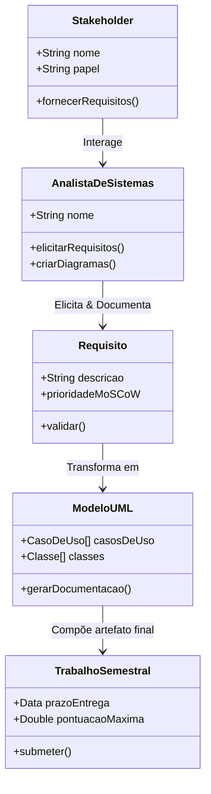

# [Prof. Wesley Soares] Engenharia de Software II
> **Semestre:** 4º Semestre  
> **Curso:** Bacharelado em Sistemas de Informação (UniFEF)  
> **Professor:** Prof. Wesley Soares  

---

## Objetivos de Aprendizagem e Ementa

A disciplina de **Engenharia de Software II** aprofunda os conceitos fundamentais do desenvolvimento de sistemas orientados a objetos, análise de requisitos avançada, modelagem de sistemas e gestão de projetos de software. 

### Ementa e Tópicos Principais

1. **Engenharia de Requisitos Avançada:** Elicitação, especificação, validação e gerenciamento de requisitos. Técnicas de priorização (ex: Método MoSCoW).
2. **Modelagem Orientada a Objetos (UML):** Diagramas de Casos de Uso (geral e específico), Diagramas de Classes e documentação técnica.
3. **Processos e Metodologias:** Papéis de stakeholders e analistas de sistemas no ciclo de vida do software.
4. **Práticas de Projeto:** Aplicação prática de diagramas e modelagem em cenários reais de desenvolvimento.

---

## Arquitetura e Modelagem do Conhecimento

O diagrama abaixo ilustra a relação conceitual entre os artefatos de engenharia de requisitos, modelagem UML e entregas práticas abordadas na disciplina:



---

## Estrutura das Pastas e Organização

Este repositório está organizado para facilitar o estudo e o acompanhamento das atividades acadêmicas:

```text
.
├── Aulas/                                                  Materiais didáticos e comunicados oficiais
│   ├── 2026-08-06 - Aula 001.md
│   ├── 2026-08-11 - Aula 02.md
│   ├── 2026-08-17 - Aula 03.md
│   ├── 2026-08-25 - Aula.md
│   ├── 2026-09-01 - Material para aula.md
│   └── Aula 01-ok.pdf, Aula 02.pdf, Aula 04.pdf, Aula 05.pdf, 03 Aula.pdf
├── Trabalhos/                                              Atividades avaliativas
│   ├── Atividade Aula 3/
│   ├── Atividade classe/
│   └── Trabalho semestral/
├── Provas/                                                 (ainda sem avaliações aplicadas)
└── Resumos-IA/                                             Material de apoio gerado por IA — tudo em um único README
    ├── README.md                                           Resumo, exercícios, simulado, cheatsheet e diagramas
    ├── Slides-Revisao-[Prof. Wesley Soares] Engenharia de Software II.pptx
    ├── flashcards-anki.tsv                                 Baralho para importar no Anki
    └── dataset-estudo-qa.jsonl                             Dataset de perguntas e respostas
```

---

## Como Estudar com Este Material

1. **Acompanhe o Cronograma:** Leia os conteúdos das aulas sequencialmente (Aula 001 até Material para aula).
2. **Pratique com os Trabalhos:** Resolva as atividades propostas (como a Atividade da Aula 3 e a Atividade de Classe) antes de olhar as soluções dos colegas.
3. **Utilize o Material de Apoio:** [`Resumos-IA/README.md`](./Resumos-IA/README.md) reúne resumo executivo, exercícios comentados, simulado com gabarito, cheat sheet e diagramas — tudo em um único documento.
4. **Estude com Flashcards:** Importe [`Resumos-IA/flashcards-anki.tsv`](./Resumos-IA/flashcards-anki.tsv) no [Anki](https://apps.ankiweb.net/) para fixação por repetição espaçada.
5. **Foque no Projeto Prático:** O **Trabalho Semestral** integra todos os conceitos da disciplina. Garanta que o levantamento de requisitos, a matriz MoSCoW e os Casos de Uso estejam devidamente documentados.

---

## Conteúdo Acadêmico

---

### Aula 001

> **Data de Postagem:** 06/08/2026  
> **Professor Responsável:** Prof. Wesley Soares  
> **Disciplina:** Engenharia de Software II (4º Semestre)  

**Conteúdo do Post:** Introdução aos conceitos fundamentais da Engenharia de Software II, nivelamento da turma e apresentação do plano de ensino.

---

### Aula 02

> **Data de Postagem:** 11/08/2026  
> **Professor Responsável:** Prof. Wesley Soares  
> **Disciplina:** Engenharia de Software II (4º Semestre)  

**Conteúdo do Post:** Aprofundamento em processos de desenvolvimento e elicitação de requisitos.

---

### Aula 03

> **Data de Postagem:** 17/08/2026  
> **Professor Responsável:** Prof. Wesley Soares  
> **Disciplina:** Engenharia de Software II (4º Semestre)  

**Conteúdo do Post:** Técnicas avançadas de análise de sistemas e identificação de stakeholders.

---

### Aula 04

> **Data de Postagem:** 25/08/2026  
> **Professor Responsável:** Prof. Wesley Soares  
> **Disciplina:** Engenharia de Software II (4º Semestre)  

**Conteúdo do Post:** Modelagem orientada a objetos: Introdução prática aos Diagramas de Classes.

---

### Material para Aula

> **Data de Postagem:** 01/09/2026  
> **Professor Responsável:** Prof. Wesley Soares  
> **Disciplina:** Engenharia de Software II (4º Semestre)  

**Conteúdo do Post:** Disponibilização de materiais complementares, leituras recomendadas e slides para consolidação da modelagem de software.

---

## Trabalhos e Atividades Avaliativas

---

### Trabalho: Atividade Aula 3

> **Professor:** Prof. Wesley Soares  
> **Disciplina:** Engenharia de Software II (4º Semestre)  
> **Prazo de Entrega:** 19/08/2026 às 02:59  
> **Pontuação Máxima:** 100 pontos  

**Instruções da Atividade:** Coloque em anexo um arquivo com as respostas contendo:
- Integrantes do grupo com seus respectivos papéis de **Stakeholder** e **Analistas**.
- Descrição clara da **situação-problema**.
- Descrição detalhada da **solução proposta**.

---

### Trabalho: Atividade de Classe

> **Professor:** Prof. Wesley Soares  
> **Disciplina:** Engenharia de Software II (4º Semestre)  
> **Prazo de Entrega:** 26/08/2026 às 02:59  
> **Pontuação Máxima:** 100 pontos  

**Instruções da Atividade:** Enviar o diagrama desenvolvido e discutido em sala de aula durante a **Aula 4**.

---

### Trabalho: Trabalho Semestral

> **Professor:** Prof. Wesley Soares  
> **Disciplina:** Engenharia de Software II (4º Semestre)  
> **Prazo de Entrega:** 09/09/2026 às 02:59  
> **Pontuação Máxima:** 100 pontos  

**Instruções da Atividade:** Subir documento (Word ou Google Docs) contendo:
1. **Levantamento de Requisitos** completo.
2. **Diagrama / Matriz MoSCoW** (Must have, Should have, Could have, Won't have).
3. **Casos de Uso Geral e Específico**, acompanhados de suas respectivas documentações e descrições de fluxo.
