# Engenharia de Software II: Manual Integrado de Engenharia de Software e Modelagem de Sistemas

**Instituição:** Centro Universitário de Santa Fé do Sul (UniFEF)  
**Curso:** Bacharelado em Sistemas de Informação (4º Semestre)  
**Disciplina:** Engenharia de Software II  
**Docente Responsável:** Prof. Ms. Wesley Soares de Souza  
**Finalidade:** Guia Exaustivo de Estudos, Referência Técnica e Caderno de Teoria e Prática

---

## Apresentação da Disciplina e do Corpo Docente

A disciplina de Engenharia de Software II tem como missão consolidar a transição entre a compreensão analítica das necessidades de negócio e a concepção arquitetural e detalhada de soluções computacionais robustas, escaláveis e manuteníveis. O curso aborda desde os métodos formais de elicitação de requisitos e priorização de escopo até a modelagem estrutural orientada a objetos (UML 2.5), padrões de arquitetura clássicos e modernos, e princípios de qualidade de código.

### Perfil do Docente
A disciplina é estruturada e ministrada pelo **Prof. Ms. Wesley Soares de Souza**:
- **Atuação na Indústria:** Engenheiro de Software Sênior com mais de 15 anos de experiência contínua no desenvolvimento de sistemas corporativos distribuídos, arquiteturas escaláveis e aplicações de missão crítica.
- **Carreira Docente:** Professor no ensino superior desde 2014, acumulando passagens pelo Grupo Kroton (Anhanguera), Faculdade de Tecnologia (FATEC) de Jales e Instituto Federal de Educação, Ciência e Tecnologia de São Paulo (IFSP) – Câmpus Votuporanga.
- **Formação Acadêmica:**
  - Bacharel em Sistemas de Informação pelo Centro Universitário de Santa Fé do Sul (UniFEF).
  - Pós-graduado em Gestão e Administração de Banco de Dados.
  - Mestre em Engenharia de Software pela Universidade Federal do Pampa (UNIPAMPA - RS).

A sinergia entre o rigor acadêmico e as práticas consolidadas da indústria de software norteia todo o conteúdo programático, desmistificando abordagens puramente teóricas e enfatizando decisões de design justificáveis perante custos, prazos e atributos de qualidade.

### Estrutura do Projeto Integrador da Disciplina (PJ)
Ao longo do semestre, os acadêmicos desenvolvem em equipes obrigatórias e fixas de **três integrantes** um projeto prático que simula a esteira de desenvolvimento de um produto corporativo:

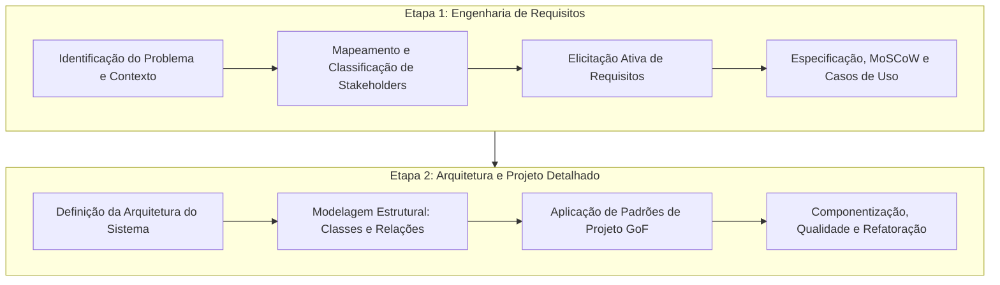

As áreas temáticas recomendadas para a concepção dos sistemas fictícios incluem:
- **Comércio:** Marketplaces B2B/B2C, Order Management Systems (OMS), WMS e Gestão de Estoque.
- **Serviços Públicos:** Portais de Ouvidoria, Gestão de Serviços Municipais e Iluminação Pública.
- **Negócios:** Applicant Tracking Systems (ATS), ERPs financeiros e Gestão de Portfólio de Projetos.
- **Saúde:** Prontuários Eletrônicos (PEP), Gestão Clínica e Logística Hospitalar Reversa.
- **Educação:** Learning Management Systems (LMS) e Sistemas de Gestão Acadêmica (SGA).
- **Logística:** Rastreamento de Frotas por Telemetria e Otimização de Rotas de Carga.

### Sistema de Avaliação e Composição de Notas
A avaliação semestral combina a verificação individual de proficiência teórica e técnica com a capacidade de entrega e trabalho em equipe:
- **AV1 (Avaliação 1):** Prova individual teórica e dissertativa sobre Engenharia de Requisitos, Elicitação, Priorização e Casos de Uso (1º Bimestre).
- **AV2 (Avaliação 2):** Prova individual com ênfase em Projeto Orientado a Objetos, Diagrama de Classes, Padrões Arquiteturais e Padrões GoF (2º Bimestre).
- **PJ (Projeto de Software):** Avaliação contínua dos artefatos técnicos de engenharia entregues pelo grupo nas Etapas 1 e 2.

A composição da média final do semestre obedece à equação canônica:

$$\text{Nota Final} = \frac{[(\text{AV}_1 \times 0.6) + (\text{PJ} \times 0.4)] + [(\text{AV}_2 \times 0.6) + (\text{PJ} \times 0.4)]}{2}$$

---

## 1. O Ciclo de Vida do Projeto de Software e a Engenharia de Sistemas

### O Paradoxo Análise versus Projeto: "Fazer a Coisa Certa" versus "Fazer Certo a Coisa"

Na formação do engenheiro de software, a separação conceitual entre o domínio do problema e o domínio da solução é a primeira e mais determinante barreira técnica. O desenvolvimento de software é governado pelo equilíbrio de duas responsabilidades distintas:

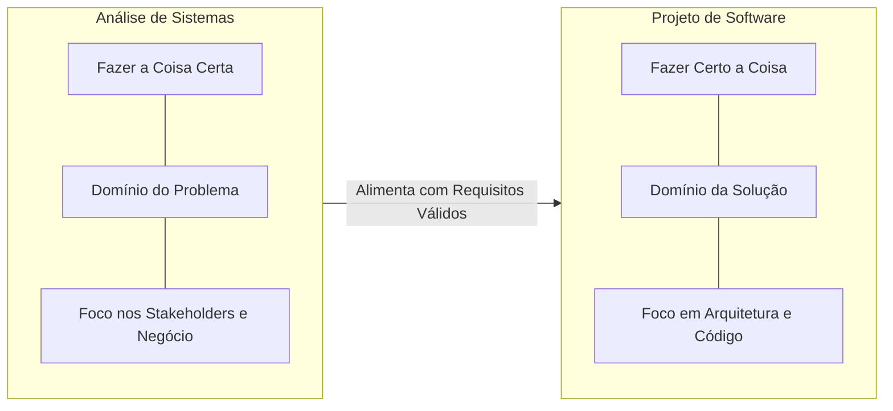

1. **Análise de Sistemas (Fazer a coisa certa):**
   - **Definição:** Atividade investigativa que visa entender, isolar e formalizar as dores, restrições e objetivos do negócio sem se comprometer com decisões tecnológicas prematuras.
   - **Motivação:** A entrega mais eficiente e elegante de um software não possui nenhum valor se o sistema resolver o problema errado ou atender a uma premissa operacional falsa.
   - **Exemplo:** Descobrir que uma distribuidora de bebidas perde mercadorias não por falta de um aplicativo para os motoristas, mas pela ausência de conferência cega no carregamento das docas.
   - **Contraexemplo:** Construir uma solução sofisticada baseada em microsserviços distribuídos para atender a uma necessidade inexistente de sincronização instantânea de estoque, quando os balanços são legalmente fechados em regime mensal.
   - **Armadilha:** Deixar que as preferências técnicas da equipe de programadores (como a escolha de frameworks da moda) ditem o escopo e as regras do negócio do cliente.

2. **Projeto de Software (Fazer certo a coisa):**
   - **Definição:** Atividade de engenharia que concebe a estrutura interna, o modelo de classes, a persistência, os contratos de API, o tratamento de falhas e as características de qualidade (desempenho, escalabilidade, segurança e manutenibilidade) da solução.
   - **Motivação:** Construir o sistema correto sem uma estrutura arquitetural disciplinada gera um monólito frágil e degradado, incapaz de evoluir sem quebrar funcionalidades consolidadas.
   - **Exemplo:** Modelar o módulo de checkout de um comércio eletrônico isolando a lógica de negócio dos SDKs de gateways de pagamento por meio do padrão Strategy e de inversão de dependência.
   - **Contraexemplo:** Codificar a validação de regras de faturamento e chamadas diretas a comandos SQL dentro dos eventos de clique dos botões de interface gráfica.
   - **Armadilha:** Ignorar atributos de qualidade não funcionais (como concorrência e idempotência) sob a desculpa de entregar o escopo funcional mais rapidamente.

### A Falácia da "Pastelaria" no Desenvolvimento de Software

Uma das premissas introduzidas pelo Prof. Wesley Soares é a desconstrução da mentalidade de "pastelaria" no desenvolvimento corporativo:

> *"Software não é feito em pastelaria, onde o cliente encosta no balcão, pede um pastel de carne, o cozinheiro joga na gordura quente e entrega em cinco minutos."*

```mermaid
flowchart TD
    subgraph Pastelaria["Abordagem 'Pastelaria' (Antipadrão Crítico)"]
        P1["Demanda Imediata do Cliente"] --> P2["Codificação Direta sem Análise"]
        P2 --> P3["Acúmulo de Código Espaguete"]
        P3 --> P4["Remendos Pontuais em Produção"]
        P4 --> P5["Falência Estrutural e Colapso"]
    end

    subgraph Engenharia["Abordagem da Engenharia de Software"]
        E1["Investigação da Causa Raiz"] --> E2["Engenharia de Requisitos"]
        E2 --> E3["Decisões Arquiteturais e Design"]
        E3 --> E4["Construção, Testes e Integração"]
        E4 --> E5["Evolução Contínua Sustentável"]
    end
```

A abordagem artesanal ou de "pastelaria" ignora a natureza sistêmica do software. Enquanto um alimento frito é um bem descartável e isolado, o software corporativo opera como uma infraestrutura viva, compartilhada e cumulativa. Cada atalho de codificação sem projeto detalhado resulta em **débito técnico**, o qual gera juros na forma de bugs recorrentes, lentidão operacional e risco financeiro direto para a organização contratante.

### As Dez Fases do Projeto de Software

O ciclo de vida integral de um ativo de software corporativo estrutura-se em dez etapas lógicas e iterativas:

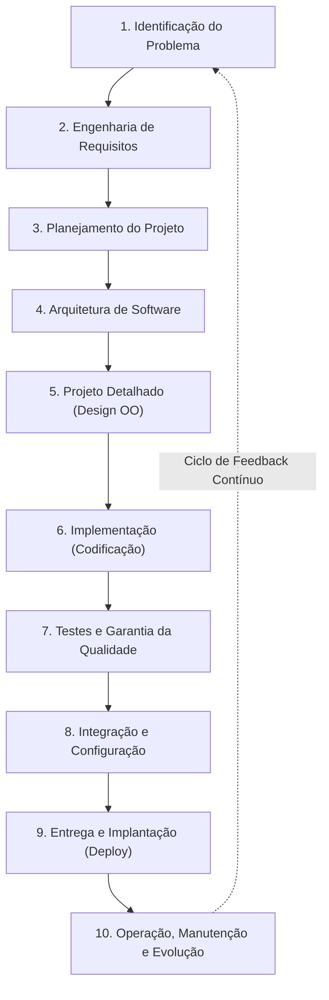

| Fase | Foco Técnico | Artefatos de Entrada | Artefatos Gerados |
| :--- | :--- | :--- | :--- |
| **1. Problema** | Isolar a dor real de negócio e demonstrar a viabilidade da intervenção computacional. | Dores de mercado, custos operacionais e ineficiências de processos manuais. | Declaração do Problema, Canvas de Proposta de Valor e Termo de Abertura. |
| **2. Requisitos** | Elicitar, refinar, priorizar e formalizar o escopo comportamental e as restrições sistêmicas. | Entrevistas com stakeholders, observação direta e análise documental. | Documento de Especificação de Requisitos (SRS), Matriz MoSCoW e Casos de Uso. |
| **3. Planejamento** | Estabelecer cronograma, marcos de entrega, estimativa de esforço, equipe e gestão de riscos. | Backlog priorizado de requisitos e métricas de velocidade da equipe. | Gráficos de Marcos (*Milestones*), Sprints planejadas e Matriz de Riscos. |
| **4. Arquitetura** | Definir a estrutura macroscópica, estilos arquiteturais, tecnologias e padrões de comunicação. | Requisitos Não Funcionais críticos (SLA, escalabilidade, segurança). | Documento de Arquitetura de Software (SAD), Diagramas C4 e Visões de Componentes. |
| **5. Projeto Detalhado** | Modelar as entidades estáticas, seus comportamentos dinâmicos, contratos e padrões de design. | Documento de arquitetura validado e requisitos funcionais detalhados. | Diagramas de Classes UML, Diagramas de Sequência e Interfaces de Serviço. |
| **6. Implementação** | Traduzir as especificações de design em código-fonte executável, limpo e auditável. | Modelos de classes, especificações de APIs e diagramas comportamentais. | Código-fonte versionado em repositório (Git) e revisões de código (*Code Reviews*). |
| **7. Testes** | Validar a conformidade das regras de negócio e testar limites de carga, segurança e falhas. | Código-fonte executável e critérios de aceitação formalizados. | Baterias de testes automatizados (unitários, integração e E2E) e relatórios de cobertura. |
| **8. Integração** | Consolidar os módulos construídos em ambientes unificados e orquestrados. | Branches de código validadas e scripts de infraestrutura. | Pipelines de Integração Contínua (CI), builds automatizados e contêineres OCI. |
| **9. Entrega** | Disponibilizar a aplicação em ambientes de homologação e produção com planos de contingência. | Imagens de contêineres aprovadas nos testes de qualidade. | Deploy automatizado (CD), changelog de release e documentação de operação. |
| **10. Manutenção** | Monitorar o comportamento em produção, aplicar correções pontuais e suportar a evolução contínua. | Métricas de telemetria (APM), logs de erros e solicitações de melhoria. | Patches corretivos, planos de refatoração e novas demandas de requisitos. |

### As Sete Etapas Sequenciais e Iterativas de Projeto

Na transição direta entre os requisitos e a codificação, o conteúdo da disciplina preconiza sete etapas disciplinadas de engenharia de software:

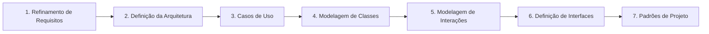

1. **Refinamento do Modelo de Análise e Requisitos:** Lapidação das necessidades brutas, separação estrita de regras de negócio e classificação de prioridades com técnicas ágeis.
2. **Definição da Arquitetura:** Escolha fundamentada do estilo macroestrutural (Camadas, Hexagonal, Microsserviços, Monólito Modular) e infraestrutura de persistência.
3. **Casos de Uso:** Representação externa do sistema pela ótica dos atores, delimitando a fronteira da aplicação e os serviços de valor mensurável.
4. **Modelagem de Classes:** Mapeamento conceitual e físico das estruturas de dados, atributos, métodos, multiplicidades e associações estruturais.
5. **Modelagem de Interações:** Representação temporal da colaboração entre os objetos através de diagramas de sequência para atender aos fluxos dos casos de uso.
6. **Definição de Interfaces:** Formalização dos contratos estritos de comunicação, como interfaces de tipagem em código (Java Interfaces) e contratos de dados (APIs REST/JSON).
7. **Aplicação de Padrões de Projeto (Design Patterns):** Refinamento do acoplamento e da coesão do código através dos padrões consolidados do Gang of Four (GoF).

---

## 2. Engenharia e Técnicas de Elicitação de Requisitos

### Levantamento versus Elicitação: Uma Distinção Epistemológica

Na engenharia de software, o uso das palavras "levantamento" e "elicitação" reflete posturas metodológicas distintas perante o cliente:

- **Levantamento de Requisitos (Requirements Gathering):** Postura passiva. Assume-se que os requisitos já existem estruturados, lapidados e organizados na mente dos usuários, bastando que o analista compareça com um bloco de notas para "recolhê-los". Essa visão é ingênua e responsável direta pelo fracasso de projetos convencionais.
- **Elicitação de Requisitos (Requirements Elicitation):** Postura ativa e investigativa. Do latim *elicitare*, significa "provocar", "fazer sair", "trazer à luz o que está latente". Reconhece que os stakeholders compreendem suas dores comerciais cotidianas, seus processos manuais e suas metas financeiras, mas raramente sabem formular requisitos de software não ambíguos. O analista atua como um investigador que desoculta regras tácitas, questiona inconsistências e modela as necessidades reais.

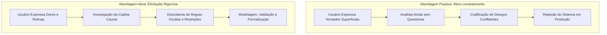

### O Ciclo Causal: Necessidade, Problema, Contexto, Expectativa e Requisito

A elicitação sistemática percorre uma cadeia causal inegociável para garantir que uma linha de código represente de fato uma solução para a empresa:

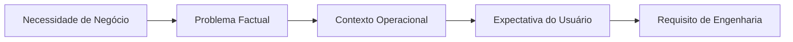

| Elemento da Cadeia | Conceito Técnico | Cenário Hospitalar Real (HealthTech Solutions) | Cenário de E-commerce |
| :--- | :--- | :--- | :--- |
| **Necessidade** | Carência primária de sustentabilidade ou evolução do negócio. | Assegurar a conformidade regulatória com a ANVISA e estancar perdas patrimoniais. | Reduzir o abandono de carrinhos de compras virtuais no momento do checkout. |
| **Problema** | Obstáculo concreto que bloqueia a satisfação da necessidade. | Extravio de respiradores locados e equipamentos com laudo de calibração metrológica expirado. | O cliente é obrigado a preencher um formulário extenso de 30 campos antes de ver o valor do frete. |
| **Contexto** | Cenário ambiental, tecnológico e humano onde a operação ocorre. | Atendentes recebem pedidos informais via WhatsApp e anexam ordens em planilhas manuais. | Usuários acessam via dispositivos móveis com conexões 4G instáveis em horários de pico. |
| **Expectativa** | A imagem mental subjetiva que o usuário formula sobre o sistema. | "Gostaria de clicar em um botão e saber onde está cada aparelho na hora sem ligar para ninguém." | "Gostaria que o aplicativo calculasse a entrega automaticamente apenas digitando o CEP." |
| **Requisito** | Especificação técnica inequívoca, mensurável, verificável e testável. | **RF04:** O sistema deve registrar a leitura de tags RFID na entrada e saída de equipamentos da quarentena. | **RF01:** O sistema deve consultar a API dos Correios e retornar as opções de frete em até 800ms após digitação de 8 dígitos de CEP. |

### As Seis Perguntas Cardinais da Elicitação

Diante de qualquer funcionalidade solicitada, o analista deve responder a seis questionamentos essenciais antes de abrir ferramentas de modelagem ou desenvolvimento:

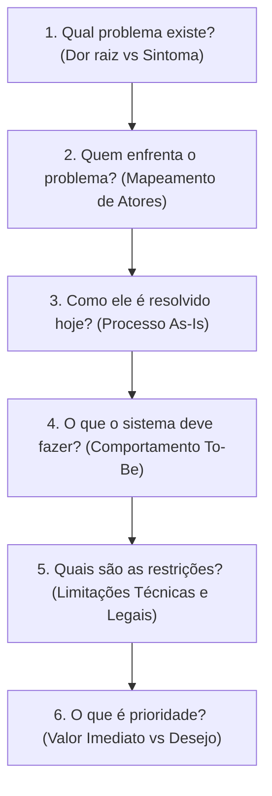

1. **Qual problema existe?** Foco na dor raiz. A perda de clientes é apenas um sintoma; a causa estrutural pode ser o tempo de 45 minutos para confirmar o faturamento do pedido.
2. **Quem enfrenta o problema?** Identificação de atores primários (operadores que usam a interface), secundários (sistemas integrados de faturamento ou gateways) e terciários (auditores fiscais e gerentes).
3. **Como ele é resolvido atualmente?** O estado atual (*As-Is*). Sistemas de software raramente nascem em um vácuo absoluto; eles substituem cadernos de papel carbonado, conversas de WhatsApp ou planilhas eletrônicas com macros frágeis.
4. **O que o sistema precisa fazer?** As transformações de dados, validações e regras de negócio computacionais que compõem o estado futuro (*To-Be*).
5. **Quais são as restrições?** Limites operacionais, orçamentários, de tempo e de conformidade (ex.: exigências da LGPD, normas tributárias da SEFAZ, ausência de conectividade constante nas áreas rurais).
6. **O que é prioridade?** Separação entre o núcleo vital sem o qual a operação comercial é inviável e as funcionalidades de valor agregado ou conveniência cosmética.

### Análise da Premissa de Desenvolvimento Prematuro

Considere a clássica proposição analisada em sala de aula:
> *"Se o cliente disser: 'Preciso de um sistema para melhorar meu negócio', isso é suficiente para começar a desenvolver?"*

A resposta técnica da Engenharia de Software é categoricamente **não**. Iniciar a modelagem ou codificação a partir de tal declaração constitui imperícia por quatro motivos:
1. **Inexistência de Critérios de Aceitação (*Acceptance Criteria*):** O termo "melhorar" é um conceito subjetivo. Sem métricas objetivas (ex.: "reduzir o tempo de emissão de pedidos de 12 para 2 minutos"), o projeto não possui critério de término formal nem garantia jurídica de entrega.
2. **Propagação de Escopo Descontrolado (*Scope Creep*):** Na ausência de fronteiras explícitas, toda e qualquer funcionalidade imaginada pelo contratante nos meses subsequentes será justificada sob a premissa de que "faz parte de melhorar o negócio".
3. **Assimetria de Conhecimento:** O cliente domina seu nicho econômico (panificação, logística hospitalar, varejo), mas desconhece regras de concorrência de banco de dados, transações ACID e integridade referencial. O desenvolvedor domina a tecnologia, mas desconhece a rotina tributária e operacional da empresa.
4. **Automatização do Caos:** Informatizar um processo de trabalho desordenado, redundante e sem controles manuais resulta unicamente em um processo caótico automatizado, que propaga falhas e perdas financeiras em escala computacional.

### Diagnóstico Estrutural: Sintoma versus Causa Raiz e os 5 Porquês

A elicitação deve diagnosticar as causas profundas dos problemas organizacionais, evitando o desperdício de esforço na mitigação de sintomas superficiais.

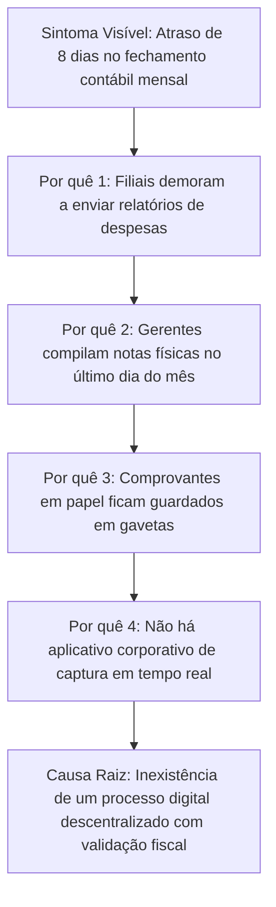

### A Desconstrução da Ambiguidade: Transformando Termos Qualitativos em Requisitos Não Funcionais Formais

Termos subjetivos frequentemente usados pelos usuários são considerados **anti-requisitos**. O trabalho do analista é refatorá-los em métricas físicas, observáveis e testáveis:

| Expressão Subjetiva do Cliente | Interpretação Errada do Desenvolvedor | Refatoração em Requisito Não Funcional Formal (RNF) |
| :--- | :--- | :--- |
| "O sistema precisa ser rápido." | Adicionar um indicador de carregamento (spinner) na tela e achar que resolveu. | **RNF01 (Desempenho):** O tempo de resposta para a consulta paginada de produtos deve ser inferior a 1,2 segundos para o percentil 95 (p95) sob uma carga de 250 requisições simultâneas. |
| "A interface precisa ser simples e intuitiva." | Utilizar um tema visual moderno com poucos botões. | **RNF02 (Usabilidade):** Um operador de caixa sem treinamento prévio deve concluir o registro de uma venda padrão em menos de 180 segundos após receber instruções em vídeo de 15 minutos, com taxa de erro menor que 1%. |
| "O sistema deve ser seguro." | Proteger o acesso ao banco de dados com uma senha alfanumérica comum. | **RNF03 (Segurança):** O sistema deve implementar controle de acesso baseado em papéis (RBAC), autenticação multifator (MFA) para operações financeiras e criptografar credenciais usando Argon2id (memória de 64MB, custo de tempo 3). |

### Técnicas Tradicionais e Ágeis de Elicitação

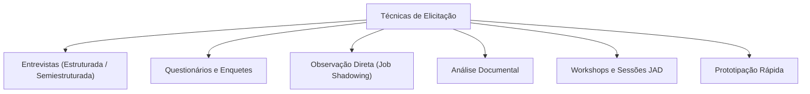

#### 1. Entrevistas
- **Definição:** Conversação direta, formal ou informal, entre o analista e os atores do processo.
- **Variações:**
  - *Estruturada:* Roteiro de perguntas fechadas e sequenciais. Útil para consolidar dados quantitativos, mas inibe a descoberta de fatos imprevistos.
  - *Semiestruturada (Padrão Recomendado):* O analista apoia-se em um conjunto de metas e tópicos essenciais, mantendo liberdade para formular perguntas investigativas conforme o entrevistado responde.
  - *Não Estruturada:* Diálogo aberto e puramente exploratório. Indicada para fases preliminares em domínios completamente desconhecidos.
- **A Arte das Perguntas Abertas Investigativas:**

| Pergunta Fechada / Fraca (Antipadrão) | Consequência Negativa | Pergunta Aberta / Investigativa (Padrão Engenharia) | Valor Extraído para o Projeto |
| :--- | :--- | :--- | :--- |
| "Você precisa de um relatório de vendas?" | O cliente responde "Sim" por inércia, e a equipe gasta semanas desenvolvendo relatórios que jamais serão consultados. | "Quais decisões gerenciais você toma nas manhãs de segunda-feira e quais informações determinam essas escolhas?" | Descobre os indicadores reais (KPIs), agrupamentos de banco de dados e regras de cálculo necessárias. |
| "O sistema pode permitir cancelamentos?" | O cliente responde afirmativamente, gerando exclusões descontroladas no banco de dados. | "Quando um pedido precisa ser cancelado, quem autoriza, quais documentos fiscais devem ser estornados e o que ocorre com o estoque?" | Revela máquinas de estados finitos, matrizes de autorização (RBAC), conciliação financeira e rastreabilidade de auditoria. |

#### 2. Questionários (Surveys)
- **Definição:** Formulação de questionários distribuídos digitalmente para coleta em larga escala.
- **Indicação:** Populações massivas de usuários distribuídas geograficamente (ex.: 2.000 alunos de uma instituição de ensino).
- **Vantagens:** Baixo custo marginal e quantificação estatística de tendências.
- **Desvantagens:** Baixa taxa de retorno (tipicamente < 15%) e impossibilidade de esclarecer dúvidas ou aprofundar respostas vagas em tempo real.

#### 3. Observação Direta (Etnografia e Job Shadowing)
- **Definição:** O analista atua como uma "sombra" (*shadowing*) do operador, acompanhando o trabalho in loco sem interferir diretamente no fluxo da tarefa.
- **O que a observação revela:**
  - Passos automáticos e conhecimento tácito que o usuário executa por memória motora, mas esquece de relatar nas entrevistas.
  - "Gambiarras" e atalhos operacionais (como post-its colados na moldura do monitor com códigos de exceção de produtos).
- **Armadilha - Efeito Hawthorne:** O fenômeno psicológico em que o trabalhador altera temporariamente seu comportamento normal de trabalho simplesmente por saber que está sendo observado e cronometrado.

#### 4. Análise Documental
- **Definição:** Exame rigoroso de formulários físicos, planilhas eletrônicas, manuais de procedimentos, notas fiscais e relatórios gerados por sistemas legados.
- **Utilidade:** Revela o modelo de dados real da empresa, formatos de campos, máscaras de validação e restrições regulatórias existentes antes de qualquer entrevista.

#### 5. Workshops e JAD (Joint Application Design)
- **Definição:** Sessões estruturadas e intensivas que reúnem no mesmo espaço analistas de sistemas, usuários operacionais e tomadores de decisão executiva.
- **Objetivo Primário:** Mediar e arbitrar em tempo real conflitos de interesses entre departamentos distintos (ex.: o setor de Vendas exigindo cadastros com apenas dois campos para acelerar o atendimento versus o setor Financeiro exigindo validação cadastral rigorosa de CNPJ e Serasa).

#### 6. Prototipação Rápida
- **Definição:** Construção de maquetes visuais navegáveis de baixa ou média fidelidade (telas de wireframe) para validar a compreensão dos requisitos antes do início da codificação.
- **Armadilha:** O cliente pode confundir um protótipo visual estático com um sistema funcional quase finalizado, cobrando prazos de entrega irreais para o backend.

### Papéis e Comunicação: O Abismo entre Stakeholders e Analistas de Sistemas

A comunicação entre o negócio e a engenharia de software exige a convivência disciplinada de duas personas complementares:

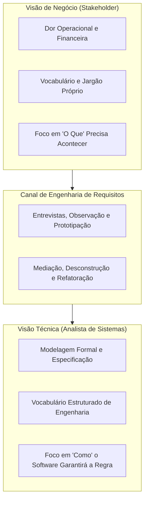

- **Stakeholder (Parte Interessada):** Indivíduo ou entidade afetada direta ou indiretamente pela operação do software. Não é responsável por conceber arquiteturas nem especificar comandos técnicos; seu papel é descrever com fidelidade o processo e suas restrições operacionais.
- **Analista de Sistemas / Engenheiro de Requisitos:** Profissional que atua como tradutor técnico. Sua responsabilidade é escutar ativamente o jargão do cliente, separar desejos supérfluos de necessidades reais e formalizar modelos claros e verificáveis que guiarão arquitetos, programadores e testadores de software.

---

## 3. Priorização de Requisitos e Gerenciamento de Escopo com MoSCoW

### Fundamentos e Origem do Método MoSCoW

O método **MoSCoW** foi concebido por Dai Clegg no início da década de 1990 no âmbito do framework DSDM (*Dynamic Systems Development Method*), com o propósito de fornecer uma ferramenta ágil, rigorosa e transparente para arbitrar entregas em projetos com restrições fixas de prazo e orçamento.

Em projetos de software tradicionais, prazos e custos costumam ser flexibilizados para acomodar 100% dos desejos iniciais dos clientes, resultando em estouros orçamentários crônicos. O método MoSCoW inverte essa lógica: fixa-se o tempo e a capacidade técnica da equipe, variando-se o escopo da entrega de forma planejada e priorizada.

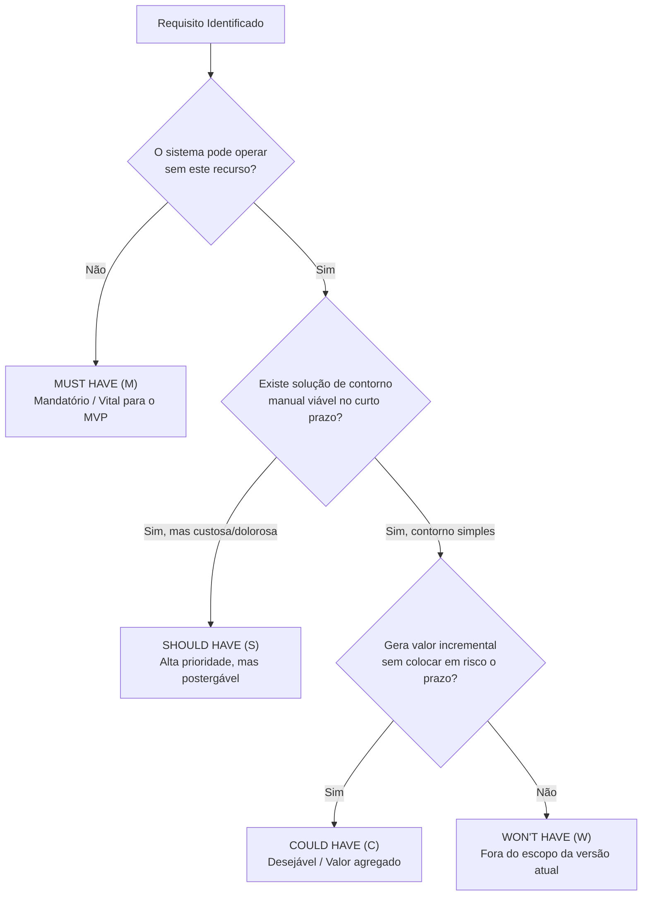

### Categorização Rastreável: Must have, Should have, Could have, Won't have

As quatro categorias do acrônimo MoSCoW possuem semântica estrita:

1. **Must have (Deve ter - M):**
   - **Definição:** Requisitos inegociáveis e vitais. Sem eles, o produto simplesmente não funciona do ponto de vista técnico ou torna-se inviável legal, regulatória e operacionalmente. Definem a espinha dorsal do **Produto Mínimo Viável (MVP)**.
   - **Impacto da Ausência:** Cancelamento ou atraso obrigatório do lançamento do sistema.

2. **Should have (Deveria ter - S):**
   - **Definição:** Funcionalidades de altíssima prioridade e grande retorno operacional. Diferenciam-se do *Must have* porque, em caso de emergência ou limite de prazo, admitem uma alternativa temporária (contorno manual ou procedimento de retaguarda).
   - **Impacto da Ausência:** Perda de eficiência ou atrito operacional, contornável no curto prazo até o próximo release.

3. **Could have (Poderia ter - C):**
   - **Definição:** Itens desejáveis, melhorias de conveniência ou diferenciais competitivos que causam baixo impacto no ecossistema central caso não sejam entregues na versão corrente.
   - **Critério de Inclusão:** Apenas serão implementados se todos os itens *Must* e *Should* tiverem sido entregues e restarem tempo e capacidade ociosa na sprint.

4. **Won't have this time (Não terá desta vez - W):**
   - **Definição:** Requisitos reconhecidos pelas partes interessadas como valiosos, mas que foram conscientemente excluídos do escopo da iteração atual.
   - **Finalidade Estratégica:** Blindar o projeto contra a corrupção de escopo (*scope creep*), estabelecendo um pacto claro de expectativas para versões futuras.

### Prevenção do Scope Creep e Regras de Balanceamento
Em termos de engenharia e esforço de desenvolvimento, uma distribuição de equipe saudável deve alocar aproximadamente:
- **60% do esforço total em requisitos Must have;**
- **20% do esforço em requisitos Should have;**
- **20% do esforço distribuído em Could have.**

Essa margem de 40% (Should + Could) atua como um colchão de segurança contra imprevistos técnicos, garantindo que o núcleo vital (*Must*) seja concluído e testado no prazo acordado.

### Estudos de Caso Práticos e Matrizes de Decisão

#### Caso 1: Plataforma Multilateral de Food Delivery

| Requisito do Sistema | Categoria MoSCoW | Justificativa de Engenharia e Negócio |
| :--- | :---: | :--- |
| Cadastro e login de clientes, restaurantes e administradores. | **Must have** | Sem autenticação e segregação de papéis, o sistema não opera transações comerciais. |
| Manutenção do cardápio e precificação de pratos pelo restaurante. | **Must have** | Inexistindo catálogo de produtos, o cliente não consegue selecionar pedidos. |
| Montagem de carrinho e fechamento de pedido com cobrança digital. | **Must have** | Espinha dorsal transacional necessária para processar a conversão da compra. |
| Atualização da máquina de estados do pedido (`Pendente` -> `Em Preparo` -> `Entregue`). | **Must have** | Sem status operacional, a cozinha não sincroniza o preparo nem o despacho. |
| Rastreamento do pedido em tempo real via mapa (geolocalização). | **Should have** | Agrega valor crítico de usabilidade; contornável inicialmente via notificações de status de texto. |
| Moderação de avaliações ofensivas no painel de administração. | **Should have** | Proteção jurídica da plataforma; na primeira semana, a moderação pode ser feita diretamente no banco. |
| Chat em tempo real entre o cliente e a cozinha do restaurante. | **Could have** | Aumenta o engajamento; o contato pode ser suprido temporariamente via ligação telefônica. |
| Programa de fidelidade gamificado com acúmulo de pontos. | **Could have** | Mecanismo de retenção excelente, mas desnecessário para viabilizar as primeiras vendas. |
| Roteirização dinâmica por IA para múltiplos entregadores simultâneos. | **Won't have** | Complexidade matemática e de infraestrutura incompatível com o lançamento do MVP. |

#### Caso 2: Sistema de Logística Reversa de Equipamentos Hospitalares (HealthTech Solutions)

| Requisito do Sistema | Categoria MoSCoW | Justificativa de Engenharia e Negócio |
| :--- | :---: | :--- |
| Registro digital de coletas vinculando número de série e hospital. | **Must have** | Elimina a perda patrimonial de respiradores e bombas de infusão nas transferências. |
| Bloqueio automático de liberação de equipamentos com calibração vencida. | **Must have** | Requisito regulatório sanitário mandatório pela ANVISA sob pena de interdição. |
| Assinatura digital do recebedor na tela do aplicativo de coleta. | **Should have** | Substitui o canhoto físico; pode ser suprido temporariamente pela conferência de matrícula. |
| Notificação automatizada de alertas de revisão metrológica por e-mail. | **Should have** | Previne o vencimento de laudos; contornável por checagem semanal em relatórios. |
| Dashboard em tempo real com taxa de ocupação da frota de aparelhos. | **Could have** | Indicador gerencial valioso, mas compilável manualmente no fechamento da semana. |
| Roteirização preditiva da frota de transporte com base no trânsito urbano. | **Won't have** | Exige integração avançada de tráfego, descartada na primeira release de rastreabilidade. |

---

## 4. Modelagem de Casos de Uso com UML 2.5

### Origem, Propósito e a Abordagem Caixa-Preta (Black-Box Modeling)

Introduzido por Ivar Jacobson em 1986 e padronizado pela Object Management Group (OMG), o **Diagrama de Casos de Uso** compõe a visão comportamental estática da UML. Seu propósito fundamental é definir a fronteira do sistema e mapear o conjunto de serviços observáveis que o software fornece aos seus atores externos.

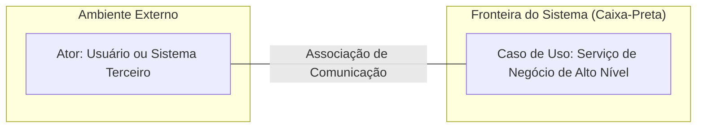

- **A Abordagem Caixa-Preta (*Black-Box*):** O diagrama de casos de uso não deve expressar como o sistema faz internamente, mas **o que** ele faz da perspectiva de quem o opera. Não modela instruções SQL, laços condicionais, classes de persistência, telas específicas ou componentes de frontend.
- **Motivação:** Estabelecer um contrato funcional compreensível tanto para diretores de empresas quanto para arquitetos e testadores de software, mitigando ambiguidades em nível de escopo.
- **Exemplo Correto:** Um caso de uso denominado `Realizar Pedido` que expressa o objetivo completo de um consumidor em uma loja virtual.
- **Contraexemplo:** Desenhar elipses interligadas intituladas `Abrir Janela de Login`, `Digitar Senha`, `Conectar no Oracle` e `Gravar na Tabela TB_PEDIDO`. Isso é uma decomposição procedimental que corrompe as diretrizes da UML.
- **Armadilha:** Tratar o diagrama de casos de uso como se fosse um fluxograma de execução temporal de telas.

### Elementos Estruturais da Modelagem

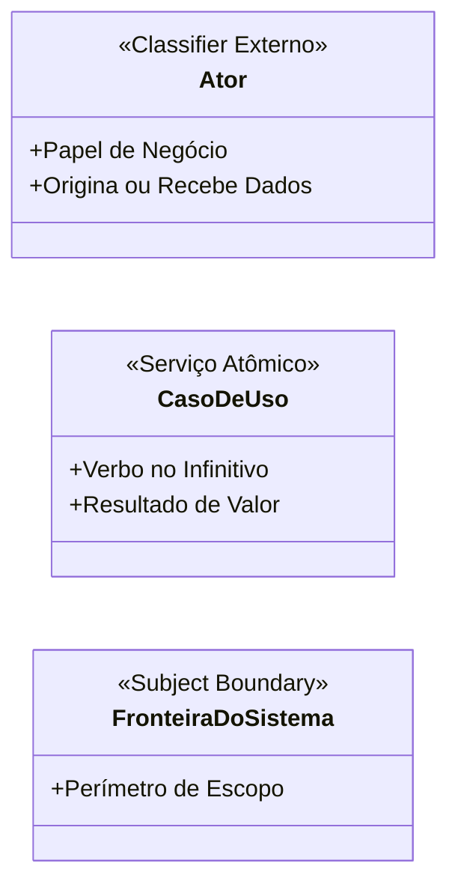

1. **Atores:**
   - Representam papéis abstratos desempenhados por usuários humanos, dispositivos físicos ou sistemas de software externos.
   - **Atores Primários:** Disparam o caso de uso para alcançar uma meta de negócio explícita (ex.: `Cliente`, `Médico`, `Operador de Caixa`).
   - **Atores Secundários (Suporte):** Sistemas externos que respondem a requisições do sistema ou fornecem serviços de infraestrutura (ex.: `Gateway de Pagamento`, `Serviço de CEP`, `SEFAZ Autorizadora`).
   - **Generalização de Atores:** Um ator especializado herda as associações do ator genérico e pode participar de casos de uso adicionais e exclusivos.

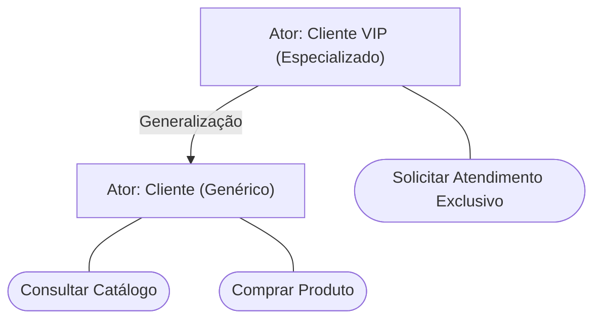

2. **Casos de Uso:**
   - Unidades discretas de comportamento que representam um objetivo de usuário completo (*User Goal* segundo Alistair Cockburn).
   - **Regra de Nomenclatura:** Iniciar obrigatoriamente com **verbo de ação no infinitivo** seguido de complemento direto contextual (ex.: `Efetuar Matrícula`, `Cancelar Assinatura`, `Aprovar Orçamento`).

3. **Fronteira do Sistema (*Subject Boundary*):**
   - Retângulo formal que circunscreve todos os casos de uso que pertencem ao escopo do software a ser construído, mantendo os atores na região externa.

### Semântica e Direcionalidade dos Relacionamentos

A correta aplicação das setas e estereótipos é o critério de maior peso na modelagem formal da UML:

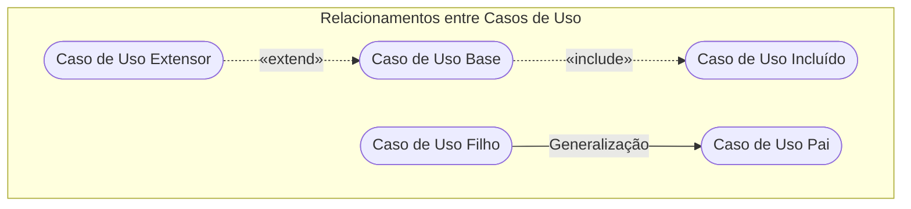

#### 1. Associação Simples
- **Definição:** Linha contínua conectando um ator a um caso de uso. Indica tráfego bidirecional de estímulos e dados.
- **Regra:** Não utiliza pontas de seta, a menos que haja necessidade estrita de indicar fluxo unidirecional de dados.

#### 2. Relacionamento Include (`<<include>>`)
- **Semântica:** Inclusão **obrigatória e incondicional**. O caso de uso base não pode ser considerado completo sem a execução do caso incluído.
- **Sentido da Seta:** Aponta do **Caso de Uso Base** para o **Caso de Uso Incluído** (`Base -.->|<<include>>| Incluído`).
- **Motivação:** Fatoração de regras comuns compartilhadas por múltiplos casos de uso para evitar duplicação conceitual (princípio DRY - *Don't Repeat Yourself*).
- **Exemplo:** `Emitir Pedido` inclui `Autenticar Usuário`.

#### 3. Relacionamento Extend (`<<extend>>`)
- **Semântica:** Extensão **opcional e condicional**. O comportamento do caso extensor é inserido no fluxo base apenas se determinadas regras de guarda forem satisfeitas.
- **Ponto de Extensão (*Extension Point*):** Marcador declarado explicitamente no caso base indicando em qual ponto exato a lógica adicional será acoplada.
- **Sentido da Seta:** Aponta do **Caso de Uso Extensor** para o **Caso de Uso Base** (`Extensor -.->|<<extend>>| Base`).
- **Motivação:** Manter o fluxo principal limpo, isolando comportamentos opcionais e exceções complexas.
- **Exemplo:** `Aplicar Cupom Promocional` estende `Finalizar Compra` no ponto de extensão `Revisão de Valores`.

#### 4. Generalização / Especialização
- **Semântica:** Semelhante à herança na orientação a objetos. O caso filho herda comportamentos e associações do caso pai, alterando ou especializando detalhes executivos.
- **Notação:** Linha sólida com uma ponta triangular vazada apontando para o elemento genérico (pai).
- **Exemplo:** `Pagar via Pix` e `Pagar via Cartão de Crédito` especializam o caso genérico `Pagar Pedido`.

| Critério de Comparação | Inclusão (`<<include>>`) | Extensão (`<<extend>>`) | Generalização / Especialização |
| :--- | :--- | :--- | :--- |
| **Obrigatoriedade** | Mandatória e incondicional. | Opcional e condicional. | Herança estrutural e comportamental. |
| **Direção do Vetor** | Da Base para o Incluído. | Do Extensor para a Base. | Do Filho para o Pai. |
| **Ponto de Ancoragem** | Posição sequencial pré-definida. | Requer *Extension Point* explícito. | Polimorfismo / Substituição. |
| **Autonomia do Caso Base** | Incompleto sem o incluído. | Autônomo e completo sem a extensão. | O pai define o contrato; filhos implementam. |

### Granularidade: Casos de Uso Gerais versus Específicos

Na modelagem de sistemas corporativos, utilizam-se dois níveis de granularidade:

1. **Diagrama de Casos de Uso Geral (Visão Arquitetural Macro):**
   - Apresenta as fronteiras do sistema, todos os atores primários e secundários, e os serviços de alto nível do negócio sem poluição de detalhes procedurais.
   - **Objetivo:** Alinhamento estratégico e apresentação a executivos e clientes.

2. **Diagrama de Casos de Uso Específico (Visão de Engenharia de Detalhe):**
   - Focado em um subsistema ou módulo crítico (ex.: Módulo de Checkout e Faturamento).
   - Detalha as inclusões obrigatórias (`<<include>>`), ramificações condicionais (`<<extend>>`), pontos de extensão e especializações polimórficas de pagamento.

### Diagrama de Casos de Uso Geral: Plataforma Multilateral de Delivery

O diagrama abaixo modela a visão macro do ecossistema de delivery de comida discutido nas Aulas 04 e 06:

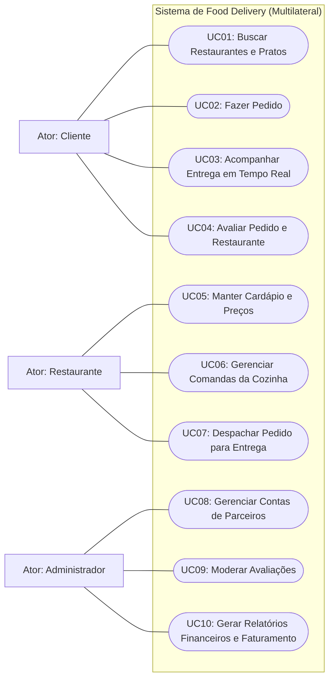

### Diagrama de Casos de Uso Específico: Módulo de Checkout de E-Commerce

O diagrama a seguir detalha as relações de dependência, inclusão e extensão do processo de fechamento de pedidos:

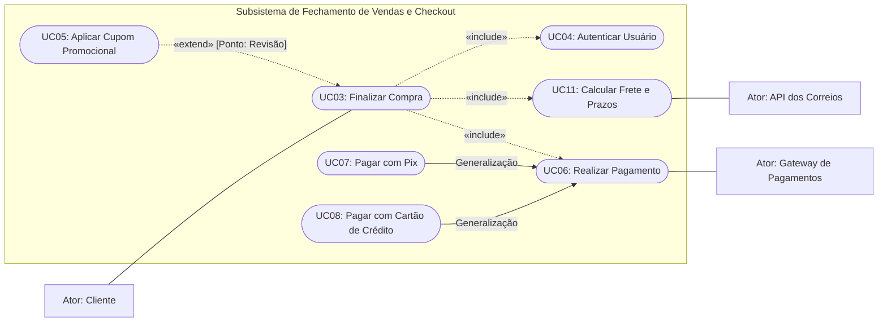

### Estrutura da Especificação Textual Canônica (Padrão Cockburn)

O diagrama visual funciona como um índice topológico; a densidade técnica da engenharia reside na especificação textual padronizada.

#### Especificação do Caso de Uso: UC03 — Finalizar Compra

- **Identificador:** `UC03`
- **Nome do Caso de Uso:** Finalizar Compra
- **Ator Primário:** Cliente
- **Atores Secundários:** Gateway de Pagamento, API de Logística/Correios
- **Pré-condições:**
  1. O cliente deve possuir uma sessão válida no aplicativo.
  2. O carrinho de compras virtual deve conter pelo menos um produto ativo com quantidade superior a zero e saldo disponível no estoque central.
- **Pós-condições (Garantias de Sucesso):**
  1. O pedido é gravado no banco de dados com o estado inicial `Aguardando Pagamento`.
  2. A reserva provisória de estoque para os itens é concretizada com tempo de vida útil (TTL) de 30 minutos.
  3. Um código identificador alfanumérico do pedido é retornado na tela e despachado para o e-mail do cliente.
- **Pontos de Extensão:**
  - `Ponto de Extensão 1: Revisão de Valores` (acionado antes do cálculo final do total a pagar).
- **Fluxo Principal (Caminho Feliz - Happy Path):**
  1. O cliente aciona o comando "Concluir Checkout" no carrinho de compras.
  2. O sistema verifica a identidade do cliente via inclusão obrigatória do caso de uso `UC04: Autenticar Usuário`.
  3. O sistema solicita a seleção ou confirmação do endereço de entrega.
  4. O cliente seleciona o endereço de entrega desejado.
  5. O sistema aciona o caso de uso `UC11: Calcular Frete e Prazos` enviando o CEP de destino e o peso cubado total dos produtos.
  6. O sistema exibe as opções de frete (Econômico, Expresso) e calcula o subtotal com o frete selecionado.
  7. O sistema abre o Ponto de Extensão `Revisão de Valores`.
  8. O sistema apresenta o resumo detalhado do pedido com valores discriminados e solicita a forma de pagamento.
  9. O cliente opta por uma modalidade de pagamento e aciona `UC06: Realizar Pagamento`.
  10. O sistema recebe a confirmação de transação aprovada pelo Gateway de Pagamentos.
  11. O sistema baixa os itens do estoque físico, altera o status do pedido para `Pago - Em Separação` e emite o comprovante.
- **Fluxos Alternativos:**
  - **FA01: Aplicação de Cupom de Desconto (no Ponto de Extensão 1):**
    1. O cliente digita um código promocional e clica em "Aplicar Cupom".
    2. O sistema aciona o caso de uso estensor `UC05: Aplicar Cupom Promocional`.
    3. O sistema valida as regras de vigência e teto mínimo do cupom.
    4. O valor do desconto é deduzido do subtotal e a tela é atualizada.
    5. O fluxo retorna ao passo 8 do Fluxo Principal.
  - **FA02: Pagamento via Pix:**
    1. No passo 9, o cliente seleciona a opção "Pix" (`UC07`).
    2. O sistema requisita ao Gateway a geração do payload "Pix Copia e Cola" e o respectivo QRCode dinâmico.
    3. O sistema exibe o QRCode com contador regressivo de 15 minutos e registra o pedido como `Aguardando Compensação Pix`.
    4. O fluxo segue para a tela de monitoramento de pagamento.
- **Fluxos de Exceção:**
  - **FE01: Ruptura de Estoque Durante o Checkout:**
    1. No passo 5, ao tentar realizar a reserva lógica de estoque, o sistema detecta que outro usuário comprou a última unidade do produto.
    2. O sistema interrompe o fluxo de finalização, bloqueia a cobrança e exibe o alerta: *"O item X esgotou-se enquanto você concluía a compra"*.
    3. O item indisponível é destacado no carrinho e o usuário é convidado a atualizar o pedido.
  - **FE02: Recusa na Autorização de Pagamento com Cartão de Crédito:**
    1. No passo 10, o Gateway de Pagamentos retorna status de transação negada (motivo: saldo insuficiente ou suspeita de fraude).
    2. O sistema notifica o cliente da recusa sem registrar a baixa do estoque.
    3. O sistema reabre a tela de escolha de formas de pagamento, permitindo trocar o cartão ou pagar via Pix.
- **Regras de Negócio Vinculadas:**
  - **RN01 (Cancelamento por Inatividade):** Se o pagamento de um pedido Pix não for liquidado em até 15 minutos, a reserva de estoque é desfeita e o pedido muda para `Cancelado por Expiracao`.
  - **RN02 (Frete Grátis):** Compras com valor de produtos superior a R$ 250,00 recebem isenção de taxa de entrega para entregas no estado de São Paulo.

---

## 5. Fundamentos do Projeto Orientado a Objetos e Diagrama de Classes

### Transição da Análise para o Projeto: Da Linguagem Ubíqua às Estruturas Físicas

A transição entre o modelo de análise e o modelo de projeto orientado a objetos é a mudança formal da perspectiva do problema para a perspectiva da engenharia de implementação:

| Dimensão Técnica | Modelo de Análise (Requisitos / Domínio) | Modelo de Projeto Orientado a Objetos (Classes) |
| :--- | :--- | :--- |
| **Pergunta Central** | O que o sistema deve fornecer aos stakeholders? | Como a arquitetura de software implementará a solução? |
| **Nível de Abstração** | Conceitual, independente de plataformas ou frameworks. | Físico e lógico, aderente à linguagem de programação e banco. |
| **Entregáveis** | Casos de uso, matriz MoSCoW e regras de negócio. | Diagramas de Classes, contratos de interfaces e DTOs. |
| **Vocabulário** | Termos do negócio (Ex.: `Empréstimo`, `Paciente`, `Comanda`). | Termos técnicos (Ex.: `Repository`, `Controller`, `Factory`, `ConnectionPool`). |

### A UML como Linguagem de Notação versus Processos e Metodologias

Uma das distinções estruturais enfatizadas pelo Prof. Wesley Soares é:
- **A UML NÃO É:** Um processo de software, uma metodologia de gerenciamento ágil ou um guia procedimental de tarefas.
- **A UML É:** Uma **linguagem gráfica padronizada** (vocabulário visual e regras sintáticas e semânticas formais) utilizada para visualizar, especificar, construir e documentar os artefatos de um sistema orientado a objetos.

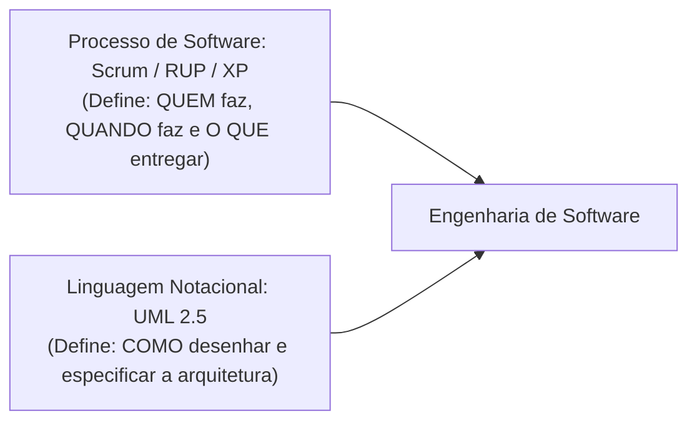

### Modelagem Ágil no Scrum: Just-in-Time e Just-Enough versus BDUF

A Engenharia de Software moderna superou a abordagem tradicional do modelo em cascata conhecida como **BDUF (Big Design Up Front)**, na qual equipes passavam meses produzindo centenas de páginas de diagramas estáticos antes de escrever o primeiro módulo de código.

No desenvolvimento ágil com Scrum, a UML é utilizada segundo o princípio **Just-in-Time (JIT) e Just-Enough**:
- Modela-se apenas o suficiente para alinhar a arquitetura da Sprint em execução.
- Diagramas de classes atuam como plantas baixas rápidas desenhadas em quadros brancos ou no Visual Paradigm para orientar o pareamento de programadores e a construção de testes unitários.

### Anatomia Estrutural do Diagrama de Classes

O **Diagrama de Classes** é a espinha dorsal estática do sistema. Cada classe é representada por um retângulo dividido horizontalmente em **três compartimentos funcionais**:

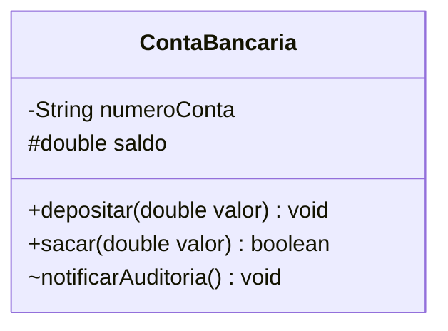

1. **Compartimento Superior (Nome da Classe):**
   - Nome centralizado, substantivo no singular, grafado em **PascalCase** (ex.: `ContaCorrente`, `PedidoVenda`, `ProfissionalSaude`).
2. **Compartimento Central (Atributos):**
   - Expressa as variáveis que encapsulam o estado interno do objeto.
   - Sintaxe formal: `[visibilidade] nomeAtributo : TipoDeDado [multiplicidade] = [valorPadrao]`.
3. **Compartimento Inferior (Operações / Métodos):**
   - Expressa o comportamento e os contratos de processamento executados pelas instâncias.
   - Sintaxe formal: `[visibilidade] nomeMetodo([parametro : Tipo]) : TipoRetorno`.

### Modificadores de Visibilidade e Mapeamento para Java

A UML estabelece quatro símbolos formais de visibilidade, mapeados diretamente para modificadores de linguagens orientadas a objetos como Java:

| Modificador UML | Símbolo | Palavra-chave Java | Escopo de Visibilidade e Acesso |
| :--- | :---: | :--- | :--- |
| **Público (Public)** | `+` | `public` | Acessível por qualquer classe em qualquer pacote da aplicação. |
| **Protegido (Protected)**| `#` | `protected` | Acessível pela própria classe, suas subclasses (herança) e classes do mesmo pacote. |
| **Privado (Private)** | `-` | `private` | Acessível estritamente dentro da própria classe onde foi declarado. |
| **Pacote (Package)** | `~` | *(sem modificador)* | Acessível apenas por classes declaradas no mesmo pacote físico/lógico. |

### Relacionamentos Estruturais e Comportamentais entre Classes

O poder da modelagem orientada a objetos reside na capacidade de mapear conexões semânticas entre entidades com rigor técnico:

```mermaid
classDiagram
    direction TD
    class Motor
    class Carro
    class Livro
    class Biblioteca
    class Cliente
    class Endereco
    class RelatorioService
    class DatabaseConnection

    Carro *-- Motor : Composição (Todo-Parte Forte)
    Biblioteca o-- Livro : Agregação (Todo-Parte Fraco)
    Cliente --> Endereco : Associação Direta (1:1)
    RelatorioService ..> DatabaseConnection : Dependência Transitória
```

#### 1. Associação Simples
- **Definição:** Ligação estrutural entre classes onde instâncias de uma classe mantêm referências persistentes para instâncias de outra classe.
- **Notação:** Linha sólida com indicadores de navegabilidade (setas abertas) e multiplicidades em ambas as extremidades.
- **Multiplicidades Padronizadas:**
  - `1`: Exatamente uma instância obrigatória.
  - `0..1`: Zero ou uma instância (opcional).
  - `*` ou `0..*`: Zero ou muitas instâncias (coleções: `List`, `Set`).
  - `1..*`: Pelo menos uma instância obrigatória até muitas.
  - `m..n`: Intervalo fixo (ex.: `2..4`).

#### 2. Agregação Todo-Parte Fraca (Losango Vazio)
- **Definição:** Relacionamento "todo-parte" onde as partes pertencem ao todo, mas **possuem ciclos de vida independentes**. Se o objeto "todo" for destruído ou excluído da memória, os objetos "parte" continuam existindo e podem ser associados a outros agregados.
- **Exemplo Real:** Uma `Biblioteca` e seus `Livros`. Se a biblioteca for desativada, os livros continuam existindo fisicamente no acervo e podem ser doados ou transferidos para outra instituição.
- **Notação:** Losango vazio no lado do "todo" (`Biblioteca o-- Livro`).

#### 3. Composição Todo-Parte Forte (Losango Preenchido)
- **Definição:** Relacionamento "todo-parte" de alta dependência ontológica onde **a parte depende estritamente do ciclo de vida do todo**. A parte não pode existir sem o todo; se o todo for destruído ou deletado, as partes associadas são compulsoriamente destruídas em cascata. Além disso, a parte só pode pertencer a um único todo por vez.
- **Exemplo Real:** Um `Pedido` e seus `ItensDePedido`. Não faz nenhum sentido de negócio a existência de um "item de pedido" solto no banco de dados sem pertencer a um cabeçalho de pedido específico. Destruído o pedido, os itens extinguem-se juntos.
- **Notação:** Losango preenchido no lado do "todo" (`Pedido *-- ItemPedido`).

#### 4. Generalização / Especialização (Herança)
- **Definição:** Relação que expressa a semântica "É UM" (*is-a*). Uma subclasse herda todos os atributos e métodos protegidos e públicos da superclasse, adicionando novas propriedades ou sobrescrevendo comportamentos polimorficamente.
- **Notação:** Linha sólida com uma ponta triangular vazada apontando para a classe pai (`Subclasse --|> Superclasse`).

#### 5. Dependência Transitória (Uso Temporário)
- **Definição:** Relação de acoplamento fraco e efêmero. Ocorre quando uma classe consome serviços ou métodos de outra classe temporariamente durante a execução de uma operação, **sem reter uma referência de atributo em sua estrutura permanente**.
- **Manifestação em Código:** Aparece quando uma classe recebe outra como **parâmetro de método**, instancia outra como **variável local de método** ou consome métodos estáticos.
- **Notação:** Linha pontilhada com seta aberta (`ClasseCliente ..> ClasseServico`).

| Relacionamento | Notação Gráfica UML | Força do Vínculo | Ciclo de Vida da Parte | Manifestação Típica em Java |
| :--- | :--- | :--- | :--- | :--- |
| **Associação** | Linha sólida (com ou sem seta) | Médio | Independente | Atributo de instância simples: `private Endereco endereco;` |
| **Agregação** | Losango vazio no "Todo" | Moderado | Independente do Todo | Lista injetada via construtor: `this.livros = listaExterna;` |
| **Composição** | Losango preenchido no "Todo" | Forte (Inseparável) | Morre junto com o Todo | Instanciação interna no Todo: `this.itens.add(new Item(...));` |
| **Generalização** | Triângulo vazado apontando pro Pai | Estrutural | Herança de Tipo | Palavra-chave `extends` (ou `implements` para interfaces) |
| **Dependência** | Linha tracejada com seta aberta | Transitório / Fraco | Efêmero (durante a execução) | Parâmetro de método: `public void gerar(PdfPrinter printer)` |

### Diagrama de Classes Completo: Plataforma de Comércio Eletrônico e Vendas

O diagrama a seguir consolida os conceitos estruturais da modelagem de classes para o estudo de caso de comércio eletrônico:

```mermaid
classDiagram
    class Cliente {
        -String cpf
        -String nome
        -String email
        -LocalDate dataNascimento
        +validarCpf() boolean
        +getNome() String
    }

    class Endereco {
        -String logradouro
        -String numero
        -String cep
        -String cidade
        -String estado
        +getCepFormatado() String
    }

    class Pedido {
        -String codigoIdentificador
        -LocalDateTime dataHoraEmissao
        -StatusPedido status
        -double valorTotalCalculado
        +adicionarItem(Produto produto, int quantidade) void
        +calcularTotal() double
        +cancelarPedido() void
    }

    class ItemPedido {
        -int quantidade
        -double precoUnitarioCongelado
        +calcularSubtotal() double
        +getQuantidade() int
    }

    class Produto {
        -String sku
        -String titulo
        -double precoVenda
        -int saldoEstoque
        +reduzirEstoque(int qtd) void
        +acrescentarEstoque(int qtd) void
    }

    class Pagamento {
        <<Abstract>>
        #String codigoTransacao
        #double valorPago
        #LocalDateTime dataProcessamento
        +processarTransacao()* boolean
    }

    class PagamentoPix {
        -String chavePixQRCode
        -String payloadCopiaCola
        +processarTransacao() boolean
    }

    class PagamentoCartao {
        -String tokenCartaoAnonimizado
        -int parcelas
        +processarTransacao() boolean
    }

    class RelatorioFiscalService {
        +emitirDanfe(Pedido pedido) byte[]
    }

    Cliente "1" --> "1..*" Endereco : possui
    Cliente "1" <-- "0..*" Pedido : realizadoPor
    Pedido "1" *-- "1..*" ItemPedido : compostoPor
    ItemPedido "0..*" --> "1" Produto : referencia
    Pedido "1" *-- "1" Pagamento : liquidadoPor
    Pagamento <|-- PagamentoPix : especializa
    Pagamento <|-- PagamentoCartao : especializa
    RelatorioFiscalService ..> Pedido : consome
```

### Princípios Fundamentais de Design OO

#### 1. Abstração e Encapsulamento Rigoroso (Modelo Rico versus Anêmico)
- **Abstração:** Operação de engenharia que captura apenas os atributos e métodos essenciais para a regra de negócio, descartando minúcias operacionais irrelevantes.
- **Encapsulamento:** Prática de blindar os estados internos de uma classe através de visibilidade privada (`private`), condicionando mutações a métodos que validam as invariantes de negócio.
- **Armadilha do Modelo Anêmico:** Gerar métodos genéricos `getAtributo()` e `setAtributo()` para todos os campos da classe destrói o encapsulamento real, tornando os objetos meros sacos de dados abertos para manipulação descontrolada fora de seus métodos.
- **Exemplo em Código Java (Modelo Rico com Proteção de Invariantes e Cópia Defensiva):**

```java
package br.unifef.engenharia.vendas;

import java.util.ArrayList;
import java.util.Collections;
import java.util.List;

public class Pedido {
    private final String codigoIdentificador;
    private double valorTotal;
    private final List<ItemPedido> itens;

    public Pedido(String codigoIdentificador) {
        if (codigoIdentificador == null || codigoIdentificador.isBlank()) {
            throw new IllegalArgumentException("Identificador de pedido e obrigatorio.");
        }
        this.codigoIdentificador = codigoIdentificador;
        this.valorTotal = 0.0;
        this.itens = new ArrayList<>();
    }

    public void registrarItem(Produto produto, int quantidade) {
        if (produto == null) {
            throw new IllegalArgumentException("Produto nao pode ser nulo.");
        }
        if (quantidade <= 0) {
            throw new IllegalArgumentException("A quantidade requer valor positivo.");
        }

        ItemPedido novoItem = new ItemPedido(produto, quantidade);
        this.itens.add(novoItem);
        this.recalcularTotais();
    }

    private void recalcularTotais() {
        double acumulado = 0.0;
        for (ItemPedido item : this.itens) {
            acumulado += item.calcularSubtotal();
        }
        this.valorTotal = acumulado;
    }

    public double getValorTotal() {
        return this.valorTotal;
    }

    public String getCodigoIdentificador() {
        return this.codigoIdentificador;
    }

    // Protecao contra Vazamento de Referencias Mutaveis (Escaping References)
    public List<ItemPedido> getItens() {
        return Collections.unmodifiableList(this.itens);
    }
}
```

#### 2. Herança versus Composição e Polimorfismo
- **Princípio:** *"Favoreça a composição sobre a herança de classes"* (Princípio de Design GoF). A herança estática quebra o encapsulamento porque a subclasse fica dependente das implementações internas da classe pai (acoplamento forte).
- **Polimorfismo:** Mecanismo pelo qual uma chamada de método é despachada dinamicamente em tempo de execução para a implementação concreta do objeto apontado pela referência polimórfica, substituindo comandos condicionais extensos (`switch/case` e `if/else`).

#### 3. Baixo Acoplamento e Alta Coesão
- **Alta Coesão:** Cada classe deve possuir uma responsabilidade única e bem definida. Uma classe que gerencia banco de dados, desenha telas e valida regras de faturamento é um antipadrão crítico conhecido como **God Class**.
- **Baixo Acoplamento:** Módulos e classes devem minimizar o conhecimento mútuo de suas implementações internas, comunicando-se estritamente através de contratos formais e interfaces públicas.

---

## 6. O Padrão Arquitetural Model-View-Controller no Smalltalk-80

### Contexto Histórico no Xerox PARC: Interfaces Multi-Janelas e o Fim da Pintura Monolítica com `Pen`

No final da década de 1970 e início da década de 1980, cientistas da computação no *Learning Research Group* do Xerox Palo Alto Research Center (PARC) — entre eles Alan Kay, Adele Goldberg, Dan Ingalls e Trygve Reenskaug — inventaram os elementos basilares da computação visual moderna:
- O mouse de três botões como dispositivo primário de apontamento;
- As interfaces gráficas de janelas sobrepostas (*bitmapped overlapping windows*);
- A programação puramente orientada a objetos no ambiente Smalltalk-76 e Smalltalk-80.

Antes dessa inovação, o paradigma predominante de computação era sequencial ou em lote (*batch*). Mesmo nos primeiros monitores gráficos baseados em mapa de bits, os programas desenhavam primitivas diretamente na totalidade da tela. No próprio Smalltalk, a classe de sistema primitivo `Pen` permitia que procedimentos desenhassem linhas e preenchimentos livremente pelo *framebuffer* global (`DisplayScreen`).

**O Conflito de Tela:** Quando múltiplos programas precisam conviver simultaneamente no mesmo display — como um navegador de classes (*System Browser*), uma área de depuração interativa (*Workspace*) e um console de logs (*System Transcript*) —, a escrita irrestrita por classes como `Pen` corrompe a apresentação visual das demais janelas. Tornou-se imperativo conceber uma arquitetura onde aplicações pudessem compartilhar harmonicamente uma única tela, um único mouse e um único teclado.

Conforme registrado pelo pesquisador Steve Burbeck em seu ensaio técnico sobre o Smalltalk-80:
- Programas "malcomportados" ignoravam os limites visuais e pintavam a tela inteira sem controle;
- Programas "bem-comportados" adotavam compulsoriamente a arquitetura **Model-View-Controller (MVC)**, respeitando a divisão de espaço e o modelo de despacho cooperativo de janelas.

```mermaid
flowchart TD
    subgraph Antigo["Abordagem Primitiva Monolítica (Classe Pen)"]
        P1["Programa Lê Dispositivo de Entrada"] --> P2["Executa Lógica Interna de Dados"]
        P2 --> P3["Desenha Diretamente em Toda a Tela"]
        P3 --> P4["Corrupção e Sobrescrita de Outras Janelas"]
    end

    subgraph MVC_Smalltalk["Arquitetura MVC Clássica (Smalltalk-80)"]
        C["Controller: Traduz Teclado e Mouse da Janela"] --> M["Model: Manipula Dados do Domínio"]
        C -.->|"Comando Operacional"| V["View: Renderiza Dentro de um Viewport"]
        M -.->|"Notificação Reativa: changed/update"| V
        V -->|"Desenho Delimitado"| S["Área Geográfica Alocada na Tela"]
    end
```

### A Tríade Canônica: Responsabilidades de Model, View e Controller

O MVC clássico do Smalltalk-80 estabeleceu a separação tripartite da interação humana com o computador:

```mermaid
classDiagram
    direction TB
    class Model {
        +dependents : Collection
        +addDependent(View aView)
        +removeDependent(View aView)
        +changed()
        +changed(Object anAspect)
        +getState()
    }
    class View {
        +model : Model
        +controller : Controller
        +superView : View
        +subViews : OrderedCollection
        +display()
        +displayView()
        +update(Model aModel, Object anAspect)
    }
    class Controller {
        +model : Model
        +view : View
        +controlLoop()
        +controlActivity()
        +isControlActive() Boolean
    }

    View "1" o-- "1" Controller : Ligação Bilateral Rígida (1:1)
    Controller "1" o-- "1" View : Ligação Bilateral Rígida (1:1)
    View --> "1" Model : Consulta Estado (getState)
    Controller --> "1" Model : Dispara Mutações de Domínio
    Model ..> View : Notificação Indireta (update)
```

1. **Model (Modelo de Domínio):**
   - Encapsula as regras de negócio, os algoritmos e os dados de domínio da aplicação.
   - É **completamente agnóstico quanto à interface gráfica**: desconhece janelas, pixels, menus, cursores e posições da tela.
   - Qualquer objeto do Smalltalk pode ser um modelo — desde um número inteiro até um complexo modelo de faturamento empresarial.
   - Fornece métodos de consulta pública de estado (consumidos pela View) e métodos de mutação (disparados pelo Controller).

2. **View (Visão Gráfica):**
   - Responsável por renderizar a projeção visual dos dados do modelo dentro da área de tela que lhe foi delimitada (*viewport*).
   - Gerencia a geometria da janela, bordas, fontes de texto e composição hierárquica de subvisões aninhadas.
   - Consulta diretamente o estado interno do modelo durante suas rotinas de pintura e redesenho.

3. **Controller (Controlador de Entrada):**
   - Responsável pela interpretação física dos periféricos acoplados à janela (movimentos do cursor do mouse, cliques de botões e digitação no teclado).
   - Converte os sinais brutos de entrada em mensagens semânticas compreensíveis para o modelo (ex.: "adicione este registro", "altere o saldo") ou para a visão (ex.: "role o texto 5 linhas para baixo").

### Anatomia de Acoplamento da Tríade

A comunicação interna do padrão MVC clássico opera sobre dois eixos complementares:
- **Eixo Forte / Bilateral (View-Controller):**
  - Toda `View` possui um ponteiro direto para o seu respectivo `Controller`, e todo `Controller` possui um ponteiro direto para a sua respectiva `View`.
  - Essa ligação é rígida e estabelecida na instanciação da janela (cardinalidade estrita de 1:1). O controlador precisa da visão para identificar limites geométricos da tela, e a visão precisa do controlador para gerenciar modos de seleção.
- **Eixo Fraco / Desacoplado (Model-View):**
  - O `Model` **não possui referências nominais diretas** às visões concretas. Ele se comunica com a camada de apresentação unicamente através da lista polimórfica de observadores implementada pelo padrão **Observer**.
  - Esse desacoplamento permite que múltiplos componentes visuais independentes (como um velocímetro analógico e um mostrador digital de texto) observem e reflitam simultaneamente as alterações de um mesmo objeto de domínio sem que este precise ser modificado.

### Modelos Passivos versus Modelos Ativos

Steve Burbeck classificou os modelos em duas categorias essenciais:

```mermaid
sequenceDiagram
    autonumber
    actor Dev as Processo Externo / Background
    participant M as Modelo Ativo (SystemTranscript)
    participant V as View (TextCollectorView)
    participant C as Controller (TextCollectorController)

    Note over Dev,M: Mutação disparada fora da tríade UI
    Dev->>M: appendText("Falha na Rede")
    activate M
    M->>M: self changed
    Note over M,V: Notificação Reativa via Observer
    M->>V: update: self with: #text
    deactivate M
    activate V
    V->>M: contents()
    activate M
    M-->>V: Retorna texto atualizado
    deactivate M
    V->>V: displayView()
    deactivate V
```

1. **Modelo Passivo:**
   - O estado do modelo é alterado **exclusivamente por ordens emitidas pelo Controller da própria tríade** na qual ele está inserido.
   - *Exemplo Canônico:* Um campo de edição de texto comum onde o modelo subjacente é uma instância pura de `String`.
   - *Comportamento:* Quando o usuário digita uma letra, o `Controller` recebe o evento físico, altera o conteúdo da `String` e pode comandar o redesenho imediato da `View`. O modelo atua como mero repositório de dados e não precisa gerenciar dependentes.

2. **Modelo Ativo:**
   - O estado do modelo é modificado por agentes externos, processos de segundo plano (*background threads*) ou por outras tríades concorrentes no sistema.
   - *Exemplo Canônico:* O console global de log do sistema operacional (`SystemTranscript`). Qualquer processo em execução no ambiente pode emitir o comando `Transcript show: 'Log registrado.'`.
   - *Comportamento:* Nem a visão nem o controlador da janela do Transcript têm como antecipar quando um processo de retaguarda registrará uma mensagem. Portanto, a responsabilidade de emitir o alerta de alteração recai compulsoriamente sobre o próprio modelo através do disparo de `self changed`.

### O Mecanismo Reativo de Notificações: Da Tabela Global `DependentFields` à Classe `Model`

A evolução do mecanismo reativo de eventos no Smalltalk-80 documenta um dos mais importantes marcos da otimização estrutural na engenharia de software:

```mermaid
classDiagram
    class Object {
        <<Smalltalk-80 v2.0>>
        +DependentFields : IdentityDictionary
        +addDependent(anObject)
        +removeDependent(anObject)
        +changed()
        +changed(anAspect)
    }

    class Model {
        <<Smalltalk-80 v2.5 Otimizado>>
        +dependents : Object
        +addDependent(anObject)
        +removeDependent(anObject)
        +changed()
        +changed(anAspect)
    }

    Object <|-- Model : Especialização Estrutural
```

- **A Abordagem na Versão v2.0 (`DependentFields`):**
  - No Smalltalk-80 v2.0, todo e qualquer objeto herdava de `Object` a capacidade potencial de atuar como modelo. Para evitar inflar o consumo de memória de objetos primitivos que nunca participariam de uma interface (como números inteiros ou booleanos), utilizou-se uma variável de classe em `Object` denominada `DependentFields`.
  - `DependentFields` consistia em uma tabela hash global (`IdentityDictionary`) onde as chaves eram as instâncias de modelos e os valores eram coleções (`OrderedCollection`) contendo as visões observadoras.
  - *Problema de Engenharia:* Sobrenrecarga de contenção de hash global, lentidão na busca em tempo de execução e risco crônico de vazamentos de memória (*memory leaks*) caso as janelas fossem fechadas sem que a chamada explícita de desregistro (`removeDependent:`) fosse executada.
- **A Solução na Versão v2.5 (Classe Abstrata `Model`):**
  - Para resolver o gargalo, a versão Smalltalk-80 v2.5 introduziu a classe abstrata de domínio `Model`.
  - A classe `Model` passou a armazenar uma **variável de instância dedicada** denominada `dependents`.
  - *Otimização de Memória Dinâmica:* A variável `dependents` assumia três estados possíveis:
    1. Valor `nil`: caso o modelo não possuísse nenhum observador cadastrado (zero consumo de coleções auxiliares);
    2. Referência direta a um único objeto: caso houvesse apenas uma visão acoplada (economizando a alocação de tabelas dinâmicas);
    3. Instância de `DependentsCollection`: alocada exclusivamente quando dois ou mais dependentes estivessem registrados.

#### O Protocolo Reativo Canônico
O tráfego de atualização fundamenta-se na troca rigorosa de mensagens:

```smalltalk
"1. No Modelo de Domínio (Emissor):"
self changed.                "Notificacao generica sem parametros"
self changed: #saldoBancario. "Notificacao direcionada indicando o aspecto alterado"

"2. Na Visao (Receptor Dependente):"
update: aModel
    "Executado por padrao quando o modelo dispara 'changed'"
    self displayView.

update: aModel with: anAspect
    "Executado quando o modelo dispara 'changed: anAspect'"
    (anAspect == #saldoBancario) ifTrue: [
        self redesenharSaldo.
    ].
```

### Composição Visual Hierárquica e Visões Plugáveis (Pluggable Views)

A renderização visual no Smalltalk-80 é governada pelo padrão de projeto **Composite**:
- **`TopView` (Janela Raiz):** Representa a janela de nível superior enquadrada na tela do sistema operacional. Ela gerencia o título da janela, o colapso (*minimize*), a movimentação global e o fechamento.
- **`SubViews` (Visões Aninhadas):** São componentes visuais inseridos no interior da `TopView` (ex.: caixas de listagem, campos de texto editáveis, painéis de botões de alternância). Uma subvisão pode, recursivamente, conter outras subvisões filhas.

```mermaid
flowchart TD
    TopView["TopView (Janela Principal: System Browser)"]
    TopView --> Sub1["SelectionView: Lista de Categorias de Classes"]
    TopView --> Sub2["SelectionView: Lista de Nomes de Classes"]
    TopView --> Sub3["SelectionView: Protocolos de Métodos"]
    TopView --> Sub4["SelectionView: Lista de Métodos Individuais"]
    TopView --> Sub5["CodeView (TextCollectorView): Editor de Código-Fonte"]
```

#### Visões Plugáveis (*Pluggable Views*)
Para evitar a necessidade de criar uma nova subclasse de `View` a cada nova tela concebida no sistema, o Smalltalk-80 introduziu as **Visões Plugáveis**.
- Uma visão plugável (ex.: `PluggableListView`) é uma classe genérica e reutilizável.
- Em vez de acoplar métodos estáticos, ela recebe na sua instanciação os **nomes de seletores de mensagens** (*symbols*) que deve enviar ao modelo para obter a lista de itens, consultar a seleção atual e gravar a nova escolha do usuário.
- Esse mecanismo atua como uma aplicação prematura e engenhosa do padrão de projeto **Adapter**.

### Pipeline Canônico de Renderização Gráfica e Transformações de Coordenadas

O processo de pintura de uma janela segue um encadeamento rígido de delegações operacionais no método `display`:

```mermaid
flowchart TD
    D["display (Disparado pelo Sistema)"] --> B["1. displayBorder (Desenha a Moldura e Contornos)"]
    B --> V["2. displayView (Renderiza o Conteúdo Próprio da Visão)"]
    V --> S["3. displaySubviews (Percorre Recursivamente as Subvisões)"]
```

#### Transformações Geométricas com `WindowingTransformation`
Cada `View` opera em seu próprio **sistema de coordenadas locais relativas**, onde o ponto `(0, 0)` representa o canto superior esquerdo da sua própria área retangular.
No entanto, os chips gráficos e o *framebuffer* global da tela física (`DisplayScreen`) operam em **coordenadas globais absolutas de tela**.

A classe de infraestrutura `WindowingTransformation` calcula dinamicamente a matriz matemática de escala e translação bidirecional:
- **Transformação Direta:** Converte coordenadas locais da visão em coordenadas globais físicas para permitir a rasterização de linhas e textos na tela.
- **Transformação Inversa:** Converte o ponto físico do cursor do mouse `(X, Y)` retornado pelo hardware nos pontos relativos da área da visão, viabilizando testes de colisão e seleção de linhas de texto.

### Hierarquia de Controle Cooperativo e Despacho de Eventos

O Smalltalk-80 operava nativamente sob arquiteturas de processamento com núcleo único (*single-thread*). Por conseguinte, a convivência harmoniosa das janelas exigia um modelo de **multitarefa cooperativa**.

```mermaid
flowchart TD
    CM["ControlManager (ScheduledControllers)"]
    CM --> Loop{"Laço de Varredura Ativo"}
    Loop --> Check{"O Cursor está dentro da área de um ScheduledController?"}
    Check -- Sim --> Passa["Transfere o Laço de Controle para o Controller Local"]
    Passa --> Ativ["Controller Local executa controlActivity()"]
    Ativ --> Libera{"Cursor saiu ou Ação encerrou?"}
    Libera -- Sim --> CM
    Check -- Não --> CM
```

- **`ControlManager` (`ScheduledControllers`):**
  - Objeto global do sistema que mantém a lista ordenada de todos os controladores de janelas ativas na tela.
  - Executa um laço contínuo consultando os controladores através da mensagem `isControlWanted`. O controlador cuja janela contiver a posição atual do cursor do mouse assume o controle do processador.
- **Despacho Cooperativo:**
  - O controlador ativo executa seu método `controlActivity` para processar eventos pendentes de hardware.
  - Caso o usuário mova o mouse para fora dos limites da janela ou a rotina encerre, o controlador voluntariamente devolve a execução para o `ControlManager`. Se um programa entrasse em um laço infinito sem ceder controle, o ambiente operacional inteiro congelava.

### O Tratamento de Eventos e o Mouse Clássico de Três Botões

O ambiente do Smalltalk-80 padronizou o hardware do mouse estruturando-o em três botões físicos associados a convenções estritas de engenharia de interface:

```mermaid
flowchart LR
    Mouse["Mouse Clássico de 3 Botões"]
    Mouse --> Red["Botão Vermelho (Red Button / Esquerdo)"]
    Mouse --> Yellow["Botão Amarelo (Yellow Button / Meio)"]
    Mouse --> Blue["Botão Azul (Blue Button / Direito)"]

    Red --> R_Act["Seleção de Conteúdo e Ações Diretas na View"]
    Yellow --> Y_Act["Menu de Contexto Específico da Aplicação"]
    Blue --> B_Act["Operações de Janela Globais (ScreenController)"]
```

1. **Botão Vermelho (*Red Button* - Botão Esquerdo Primário):**
   - Utilizado para **interação direta com o conteúdo** da visão. Seleciona caracteres de texto em editores, marca itens em caixas de listagem, posiciona o cursor de inserção e arrasta elementos internos.
2. **Botão Amarelo (*Yellow Button* - Botão Central de Contexto):**
   - Utilizado para disparar o **menu de contexto da aplicação local**. Abre opções operacionais dependentes da visão sob a qual o mouse repousa (ex.: no editor de código, abre o menu com `accept`, `cancel`, `format`, `find`).
3. **Botão Azul (*Blue Button* - Botão Direito Global de Janela):**
   - Reservado compulsoriamente para o **gerenciamento da infraestrutura de janelas**, delegado diretamente ao `ScreenController`.
   - Abre o menu do sistema operacional para manipulação física da janela:
     - `frame`: redimensionar a área da janela na tela;
     - `move`: reposicionar a janela no display;
     - `collapse`: minimizar a janela em um ícone compacto;
     - `close`: destruir e desregistrar a tríade MVC da memória.

### Componentes de Suporte Especializados
- **`ParagraphEditor`:** Subclasse especializada de `Controller` responsável por implementar a lógica avançada de navegação por setas, buffer de digitação de texto, comandos de cópia, recorte e colagem de texto.
- **`ScreenController`:** Controlador de nível superior que gerencia a área da área de trabalho (*desktop background*), janelas inativas e ações globais de manutenção do sistema.
- **`MVC Inspector`:** Ferramenta gráfica de metanível do ambiente Smalltalk que permite inspecionar simultaneamente os ponteiros em tempo de execução dos três vértices de uma tríade ativa, exibindo variáveis de instância e coleções de dependentes.

### Transposição do MVC Smalltalk-80 para a Engenharia de Software Moderna (Java)

A implementação a seguir transcreve com rigor conceitual a tríade do Smalltalk-80 para a sintaxe corporativa da linguagem Java, demonstrando a aplicação do padrão Observer na relação Model-View e o acoplamento bilateral View-Controller:

#### 1. Infraestrutura do Mecanismo Reativo (Observer)
```java
package br.unifef.engenharia.mvc.smalltalk;

import java.util.ArrayList;
import java.util.List;

public abstract class Model {
    private final List<View> dependentes = new ArrayList<>();

    public synchronized void addDependent(View view) {
        if (view != null && !dependentes.contains(view)) {
            dependentes.add(view);
        }
    }

    public synchronized void removeDependent(View view) {
        dependentes.remove(view);
    }

    public void changed() {
        this.changed(null);
    }

    public void changed(Object aspecto) {
        for (View dep : dependentes) {
            dep.update(this, aspecto);
        }
    }
}
```

#### 2. Modelo de Domínio Concreto (Modelo Ativo)
```java
package br.unifef.engenharia.mvc.smalltalk;

public class TermostatoModel extends Model {
    private double temperaturaCelsius;

    public TermostatoModel(double temperaturaInicial) {
        this.temperaturaCelsius = temperaturaInicial;
    }

    public double getTemperatura() {
        return this.temperaturaCelsius;
    }

    public void alterarTemperatura(double delta) {
        this.temperaturaCelsius += delta;
        // Disparo explicito da notificacao de mudanca de aspecto
        this.changed("temperatura");
    }
}
```

#### 3. Visão Canônica com Acoplamento Bilateral
```java
package br.unifef.engenharia.mvc.smalltalk;

public class TermostatoConsoleView implements View {
    private final TermostatoModel model;
    private TermostatoController controller;

    public TermostatoConsoleView(TermostatoModel model) {
        this.model = model;
        this.model.addDependent(this); // Registro de observador
    }

    public void setController(TermostatoController controller) {
        this.controller = controller; // Ligacao bilateral com o Controller
    }

    @Override
    public void update(Model emissor, Object aspecto) {
        if (emissor == this.model && "temperatura".equals(aspecto)) {
            this.display();
        }
    }

    public void display() {
        System.out.println(String.format("[Display da View] Temperatura Atual: %.2f °C", 
            model.getTemperatura()));
    }
}
```

#### 4. Controlador de Entrada
```java
package br.unifef.engenharia.mvc.smalltalk;

public class TermostatoController {
    private final TermostatoModel model;
    private final TermostatoConsoleView view;

    public TermostatoController(TermostatoModel model, TermostatoConsoleView view) {
        this.model = model;
        this.view = view;
        this.view.setController(this); // Fechamento da ligacao 1:1 bilateral
    }

    // Traducao do evento fisico de entrada em comando semantico de negocio
    public void simularAcaoUsuarioAumentar() {
        System.out.println("[Controller] Usuario acionou o botao de incremento.");
        this.model.alterarTemperatura(1.5);
    }

    public void simularAcaoUsuarioDiminuir() {
        System.out.println("[Controller] Usuario acionou o botao de decremento.");
        this.model.alterarTemperatura(-1.0);
    }
}
```

---

## 7. Matriz de Rastreabilidade e Síntese de Erros, Armadilhas e Boas Práticas

### Rastreabilidade Vertical de Engenharia: Do Problema ao Código

A engenharia de software disciplinada garante a rastreabilidade total de artefatos. Uma linha de código executável em produção deve possuir um elo causal direto com o problema elicitado na primeira semana de projeto:

```mermaid
flowchart TD
    Prob["1. Dor do Negócio: Extravio de Equipamentos Hospitalares"]
    Req["2. Requisito Funcional: RF04 - Rastreamento por Leitura de RFID"]
    Prio["3. Priorização MoSCoW: Classificado como MUST HAVE"]
    UC["4. Caso de Uso: UC08 - Registrar Coleta de Equipamento"]
    ClassD["5. Diagrama de Classes: Equipamento, Quarentena, LeitorRFID"]
    Code["6. Implementação em Código: Equipamento.registrarMovimentacao()"]

    Prob --> Req --> Prio --> UC --> ClassD --> Code
```

### Catálogo de Erros Conceituais e Falhas Frequentes em Avaliações

Abaixo estão listadas as principais armadilhas metodológicas identificadas pelo Prof. Wesley Soares em provas e bancas de projetos integradores:

| Erro / Antipadrão Identificado | Natureza da Falha | Consequência no Projeto | Correção Rigorosa de Engenharia |
| :--- | :--- | :--- | :--- |
| **Confundir Requisito Funcional com Regra de Negócio** | Falha conceitual de engenharia de requisitos. | Tentar implementar regras de domínio fixas como se fossem opções técnicas configuráveis. | *Regra de Negócio:* "Descontos acima de 20% exigem aval do gerente". *Requisito Funcional:* "O sistema deve bloquear a venda e solicitar a senha do gerente se o desconto for > 20%". |
| **Inverter a Direção das Setas em `<<include>>` e `<<extend>>`** | Falha de sintaxe formal na UML. | Inversão do significado da dependência arquitetural na documentação. | A seta do `<<include>>` aponta **da Base para o Incluído**. A seta do `<<extend>>` aponta **do Extensor para a Base**. |
| **Decomposição Funcional / Procedimental em Casos de Uso** | Modelagem orientada a telas ou banco em vez de metas. | Explosão de micro-casos de uso inúteis (`Digitar Senha`, `Salvar no SQL`). | Agrupar passos atômicos dentro da especificação textual de um caso de uso que entregue um resultado de valor (*User Goal*). |
| **Modelo Anêmico com Getters e Setters Cegos** | Quebra do encapsulamento na orientação a objetos. | Corrupção de estados por código externo; ausência de regras de validação. | Tornar atributos privados e expor métodos semânticos de domínio (`debitar()`, `matricular()`), eliminando setters públicos universais. |
| **Confundir Agregação com Composição** | Erro de modelagem estrutural no Diagrama de Classes. | Falhas na gerência de memória e exclusões acidentais em cascata no banco de dados. | Perguntar: "Se o Todo for destruído, a Parte pode continuar existindo sozinha?" Se **sim** = Agregação (losango vazio). Se **não** = Composição (losango preenchido). |
| **Considerar a UML como Metodologia ou Processo Ágil** | Confusão epistemológica entre notação e processo. | Falta de governança sobre cerimônias, entregáveis e responsabilidades de time. | Compreender que Scrum define o fluxo de trabalho (*quem* e *quando*); a UML é apenas a linguagem visual para documentar o design (*como*). |
| **Associação Direta entre Atores no Diagrama de Casos de Uso** | Erro grave de notação formal na UML 2.5. | Conectar o boneco do `Cliente` diretamente ao boneco do `Vendedor` com linha simples. | Atores não interagem diretamente entre si no diagrama de casos de uso; se houver relação de especialização de papéis, deve-se usar **Generalização**. |

---

## 8. Glossário Geral da Disciplina

- **Actor (Ator):** Entidade externa ao perímetro do sistema que interage com este trocando informações ou estímulos. Pode ser humano, periférico de hardware ou sistema computacional terceiro.
- **Analysis (Análise de Software):** Fase orientada à elucidação, refinamento e documentação do problema de negócio e necessidades dos clientes, sob o prisma "fazer a coisa certa".
- **Association (Associação):** Relacionamento estrutural persistente entre classes ou canal de comunicação básico entre um ator e um caso de uso.
- **Aggregation (Agregação):** Relacionamento do tipo todo-parte fraco, onde as partes possuem ciclo de vida independente da existência do objeto todo.
- **Black-Box Modeling (Abordagem Caixa-Preta):** Técnica de modelagem comportamental que abstrai código interno, queries e algoritmos, documentando apenas estímulos e respostas observáveis.
- **CamelCase:** Convenção tipográfica de nomenclatura onde a primeira letra da palavra inicial é minúscula e as iniciais das palavras subsequentes são maiúsculas (ex.: `calcularSubtotalLiquido`).
- **Composition (Composição):** Relacionamento todo-parte forte, onde o objeto parte depende existencialmente do ciclo de vida do todo, extinguindo-se se o todo for destruído.
- **Cohesion (Coesão):** Grau de afinidade e foco das responsabilidades alocadas a um determinado módulo ou classe.
- **Coupling (Acoplamento):** Nível de interdependência e conhecimento mútuo entre dois ou mais componentes de software.
- **Dependency (Dependência):** Relação de acoplamento fraco e transitório onde uma classe utiliza momentaneamente operações de outra (ex.: parâmetro de método).
- **Domain (Domínio):** O ecossistema de negócio do mundo real onde a empresa atua e onde a intervenção de software gera impacto econômico ou operacional.
- **Elicitation (Elicitação):** Processo ativo, investigativo e dialético de extrair, confrontar e formalizar necessidades e regras latentes de negócio junto aos stakeholders.
- **Encapsulation (Encapsulamento):** Prática estrutural de ocultar detalhes de implementação e estados internos de uma classe, expondo apenas operações seguras.
- **Extension Point (Ponto de Extensão):** Âncora declarada formalmente no fluxo de um caso de uso base onde comportamentos de extensão opcionais podem ser injetados condicionalmente.
- **Extend (Extensão):** Relação condicional onde um caso de uso extensor expande o comportamento de um caso de uso base caso uma regra de guarda seja satisfeita.
- **Generalization (Generalização):** Relacionamento de taxonomia ou herança entre classificadores (classes ou casos de uso), onde o elemento especializado herda atributos e contratos do elemento genérico.
- **Include (Inclusão):** Relação obrigatória onde um caso de uso base delega e incorpora incondicionalmente a execução de um caso de uso acessório.
- **Job Shadowing:** Modalidade de observação direta onde o analista atua como a "sombra" física do usuário, acompanhando em tempo real a execução das rotinas diárias.
- **Model-View-Controller (MVC):** Padrão arquitetural tripartite concebido no Smalltalk-80 para desacoplar regras de domínio (Model), apresentação gráfica (View) e tratamento de periféricos (Controller).
- **MoSCoW:** Técnica de priorização de requisitos que estrutura o escopo nas categorias *Must have*, *Should have*, *Could have* e *Won't have this time*.
- **MVP (Minimum Viable Product):** Versão mínima funcional de um software composta exclusivamente pelos requisitos essenciais (*Must have*) para validar hipóteses de mercado ou sustentar a operação básica.
- **PascalCase:** Convenção tipográfica onde todas as palavras de um identificador composto iniciam com letra maiúscula (ex.: `GerenciadorTransacional`).
- **Polymorphism (Polimorfismo):** Capacidade de despachar uma invocação de método para implementações concretas diferentes dependendo do tipo da instância em tempo de execução.
- **Requirements Gathering (Levantamento de Requisitos):** Postura passiva de coleta de solicitações do cliente, contrastando com a elicitação ativa.
- **Scope Creep (Corrupção de Escopo):** Crescimento contínuo, caótico e desordenado dos requisitos de um projeto durante seu desenvolvimento, sem reajuste de prazo ou custo.
- **ScheduledControllers:** Infraestrutura do `ControlManager` no Smalltalk-80 que mantém a lista encadeada de controladores ativos para despacho cooperativo de eventos.
- **Single Responsibility Principle (SRP):** Princípio de design que estipula que uma classe ou módulo deve ter um, e apenas um, motivo para ser modificada.
- **Stakeholder:** Parte interessada que pode afetar ou ser afetada direta ou indiretamente pela concepção e implantação do software.
- **Subject Boundary (Fronteira do Sistema):** Caixa retangular no Diagrama de Casos de Uso que segrega os serviços internos sob responsabilidade do software dos atores externos.
- **Unified Modeling Language (UML):** Linguagem visual padronizada pela OMG para especificação, construção e documentação de sistemas orientados a objetos.
- **WindowingTransformation:** Classe matemática do Smalltalk-80 que realiza transformações de translação e escala entre coordenadas locais de uma janela e coordenadas globais de tela.

---

## 9. Guia de Preparação e Pontos-Chave para as Avaliações Formais

### Tópicos Críticos para a AV1 (1º Bimestre)
1. **Diferença conceitual entre Análise e Projeto:** Foco do modelo conceitual (o que fazer) versus modelo de projeto (como fazer tecnicamente).
2. **Ciclo de Vida:** Ordem lógica e finalidade das dez fases do ciclo de desenvolvimento de software e das sete etapas do projeto de software.
3. **Elicitação:** Por que a declaração "Preciso de um sistema para melhorar meu negócio" não permite iniciar a codificação (falta de critérios de aceite, scope creep, automatização do caos).
4. **Técnicas de Elicitação:** Comparativo entre entrevistas estruturadas versus semiestruturadas, observação direta (efeito Hawthorne) e análise documental.
5. **Método MoSCoW:** Definição rigorosa e critérios de enquadramento de cada letra (Must, Should, Could, Won't) e impacto na definição do MVP.
6. **Casos de Uso:**
   - Sintaxe obrigatória (verbos no infinitivo + complemento direto);
   - Diferenciação estrita de `<<include>>` (obrigatório, da base para o incluído) versus `<<extend>>` (opcional, do extensor para a base com Ponto de Extensão);
   - Generalização de atores e de casos de uso;
   - Especificação textual Cockburn (pré-condições, pós-condições, caminho feliz, fluxos alternativos e exceções).

### Tópicos Críticos para a AV2 (2º Bimestre)
1. **UML versus Metodologia:** Compreender categoricamente que a UML é linguagem de notação e não processo de desenvolvimento de software.
2. **Diagrama de Classes:**
   - Anatomia dos 3 compartimentos (Nome, Atributos, Operações);
   - Símbolos de visibilidade (`+`, `#`, `-`, `~`) e correlação com Java;
   - Multiplicidades e convenções de nomenclatura (PascalCase para classes, camelCase para métodos e atributos);
   - Diferença fundamental entre Agregação (losango vazio, partes independentes) e Composição (losango preenchido, dependência existencial estrita de ciclo de vida);
   - Dependência transitória (linha tracejada com seta aberta, passagem por parâmetro).
3. **Pilares de Orientação a Objetos:**
   - Encapsulamento real versus modelo anêmico (proteção de invariantes e cópias defensivas contra vazamento de referências mutáveis);
   - Polimorfismo e eliminação de condicionais complexos (`switch/case`).
4. **MVC Clássico no Smalltalk-80:**
   - Contexto histórico no Xerox PARC (substituição da pintura destrutiva com `Pen` por janelas coordenadas);
   - Papéis estritos de Model, View e Controller;
   - Acoplamento direto 1:1 bilateral View-Controller versus acoplamento fraco e reativo Model-View (Observer);
   - Modelos Passivos versus Modelos Ativos (Transcript);
   - Evolução de `DependentFields` (tabela hash global em `Object`, contenção e memory leaks) para a classe `Model` com variável `dependents` dinâmica;
   - Funções dos botões do mouse clássico: Vermelho (conteúdo), Amarelo (menu local da view) e Azul (operações globais de janela gerenciadas pelo `ScreenController`).

### Diretrizes de Execução para a Entrega do Projeto Integrador (PJ)
- **Equipes:** Rigorosamente 3 integrantes, com segregação explícita de papéis nas etapas preliminares (Stakeholders simulando a diretoria do negócio versus Analistas de Sistemas formalizando os modelos).
- **Rastreabilidade Completa:** Todo caso de uso do sistema fictício deve obrigatoriamente estar mapeado para um requisito funcional classificado no MoSCoW, e suas entidades devem possuir correspondência direta nas classes de domínio.
- **Rigor Notacional:** Diagramas UML com pontas de setas erradas, relacionamentos sem multiplicidade, atores desenhados dentro da fronteira do sistema ou ausência de verbos nos casos de uso acarretam deduções imediatas de pontuação na avaliação do projeto prático.

---

## Fontes e Metadados

- Turma no Classroom: Engenharia de Software 2 - 2026/02
- Itens processados: 0 materiais, 3 tarefas, 7 avisos
- Gerado em: 24/09/2026, 13:20:12 (BRT) via classroom-sync
