# Guia de Estudos Integrado: Engenharia de Software II

## 1. Visão Geral da Disciplina, Avaliação e Ciclo de Vida do Projeto de Software

### 1.1 Informações Institucionais e Corpo Docente

A disciplina de **Engenharia de Software II** integra a matriz curricular do 4º Semestre do curso de Bacharelado em Sistemas de Informação do Centro Universitário de Santa Fé do Sul (UniFEF). O componente curricular é conduzido pelo docente:

- **Professor:** Prof. Ms. Wesley Soares de Souza.
- **Formação Acadêmica:** Bacharel em Sistemas de Informação pela Fundação Educacional de Fernandópolis (F.E.F - UniFEF), Pós-graduado em Gestão de Banco de Dados e Mestre em Engenharia de Software pela Universidade Federal do Pampa (UNIPAMPA - RS).
- **Atuação Profissional:** Engenheiro de Software Sênior com mais de 15 anos de experiência prática na concepção, arquitetura e sustentação de sistemas corporativos escaláveis e de missão crítica, com atuação no ensino superior desde 2014.

A proposta pedagógica da disciplina estabelece um diálogo permanente entre o rigor conceitual da academia e os padrões técnicos consolidados na indústria de software, preparando o futuro bacharel para enfrentar a complexidade inerente ao ciclo de vida de aplicações corporativas.

### 1.2 Conteúdo Programático Bimestral e Critérios de Avaliação

O programa de ensino distribui-se em dois blocos temáticos complementares:

- **Primeiro Bimestre:** Fundamentos da fase de projeto; processos e engenharia de requisitos; técnicas de elicitação e levantamento; modelagem e especificação de requisitos; introdução à arquitetura de software e seus estilos/padrões; entrega da 1ª Etapa do Projeto Integrador.
- **Segundo Bimestre:** Projeto detalhado de software e princípios de design orientado a objetos; padrões de projeto GoF (criacionais, estruturais e comportamentais); anomalias de código (*code smells*), métricas de acoplamento/coesão e técnicas de refatoração; componentização e reúso; garantia de qualidade através de testes automatizados (unitários, integração e ponta a ponta); integração contínua (CI), contêineres e pipelines de entrega contínua (CD); entrega da 2ª Etapa (Final) do Projeto Integrador.

A avaliação do rendimento escolar balanceia a aferição individual teórica e conceitual com a capacidade de aplicação prática e colaborativa em equipe:

- **AV1 (Avaliação 1):** Prova individual sem consulta sobre os tópicos do 1º bimestre.
- **AV2 (Avaliação 2):** Prova individual sem consulta sobre os tópicos do 2º bimestre.
- **PJ (Projeto de Software Integrador):** Trabalho prático desenvolvido em grupo ao longo do semestre.

A Nota Final semestral é calculada pela média aritmética ponderada dos dois bimestres, atribuindo peso de 60% para as provas individuais e 40% para o projeto prático:

```text
Nota Bimestre 1 = (AV1 * 0.6) + (PJ * 0.4)
Nota Bimestre 2 = (AV2 * 0.6) + (PJ * 0.4)

Nota Final = (Nota Bimestre 1 + Nota Bimestre 2) / 2
```

### 1.3 Projeto Integrador da Disciplina (PJ)

O Projeto Integrador consolida a espinha dorsal prática do curso. Os estudantes vivenciam a dinâmica real de times de desenvolvimento de software, operando sob restrições técnicas, prazos delimitados e divisão formal de responsabilidades.

- **Formação de Equipes:** Grupos compostos obrigatoriamente por **3 integrantes**.
- **Dinâmica de Papéis:** Cada integrante assume atribuições alinhadas a perfis da indústria: analista de requisitos/negócios, arquiteto de software e engenheiro de implementação/qualidade.

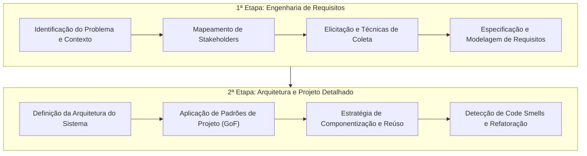
```mermaid
flowchart TD
    subgraph Fase1["1ª Etapa: Engenharia de Requisitos"]
        E1["Identificação do Problema e Contexto"] --> E2["Mapeamento de Stakeholders"]
        E2 --> E3["Elicitação e Técnicas de Coleta"]
        E3 --> E4["Especificação e Modelagem de Requisitos"]
    end

    subgraph Fase2["2ª Etapa: Arquitetura e Projeto Detalhado"]
        A1["Definição da Arquitetura do Sistema"] --> A2["Aplicação de Padrões de Projeto (GoF)"]
        A2 --> A3["Estratégia de Componentização e Reúso"]
        A3 --> A4["Detecção de Code Smells e Refatoração"]
    end

    Fase1 --> Fase2
```

#### Áreas Temáticas para Seleção do Escopo

As equipes devem conceber um sistema fictício completo inserido em um dos seguintes domínios:

| Domínio Temático | Exemplos de Sistemas | Escopo Típico de Requisitos |
| :--- | :--- | :--- |
| **Comércio** | Marketplace B2B/B2C, Gestão de Pedidos (OMS), Controle de Estoque (WMS). | Gestão de SKUs, checkout transacional, reserva de inventário e cálculo de frete. |
| **Serviços Públicos** | Solicitação de Serviços Municipais, Iluminação Pública, Ouvidoria. | Triagem com geolocalização, SLAs de atendimento municipal e auditoria pública. |
| **Negócios** | Plataforma de Gestão de Projetos, Recrutamento (ATS), ERP Financeiro. | Cronogramas dinâmicos, pipelines de triagem de candidatos e conciliação bancária. |
| **Saúde** | Prontuário Eletrônico (PEP), Gestão de Clínicas, Telemedicina. | Conformidade regulatória, agendamento de consultas e sigilo de prescrições. |
| **Educação** | Gestão de Aprendizagem (LMS), Gestão Acadêmica (SGA), Avaliação Contínua. | Matrículas, diário de classe eletrônico, submissão de tarefas e cálculo de médias. |
| **Logística** | Rastreamento de Cargas em Tempo Real, Gestão de Frotas, Roteirização. | Roteamento em grafos, telemetria veicular e comprovação digital de entrega (POD). |

### 1.4 A Premissa Fundamental da Engenharia de Software

O professor Wesley Soares inicia a disciplina com um alerta paradigmático: **"Software não é feito em pastelaria"**. Na pastelaria tradicional, o cliente escolhe o recheio no balcão e aguarda a fritura imediata em poucos minutos. Tentar transferir essa mentalidade para o desenvolvimento de software corporativo resulta em sistemas disfuncionais, código espaguete, custos imprevistos e colapso operacional em produção.

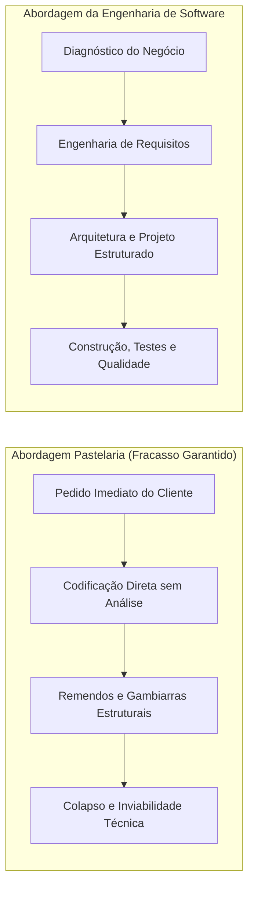
```mermaid
flowchart LR
    subgraph Antipadrao["Abordagem Pastelaria (Fracasso Garantido)"]
        direction TB
        P1["Pedido Imediato do Cliente"] --> P2["Codificação Direta sem Análise"]
        P2 --> P3["Remendos e Gambiarras Estruturais"]
        P3 --> P4["Colapso e Inviabilidade Técnica"]
    end

    subgraph Engenharia["Abordagem da Engenharia de Software"]
        direction TB
        E1["Diagnóstico do Negócio"] --> E2["Engenharia de Requisitos"]
        E2 --> E3["Arquitetura e Projeto Estruturado"]
        E3 --> E4["Construção, Testes e Qualidade"]
    end
```

A engenharia de software sustenta-se no equilíbrio de duas responsabilidades complementares:

- **Análise ("Fazer a coisa certa"):** Descobrir, refinar e validar a dor real do cliente. Um sistema construído com excelente técnica, mas que resolve o problema errado, é inútil.
- **Projeto ("Fazer certo a coisa"):** Projetar a solução técnica de maneira modular, desacoplada, extensível, manutenível e performática. Resolver o problema certo utilizando uma arquitetura frágil gerará um passivo técnico impagável.

### 1.5 As Dez Fases do Ciclo de Vida do Projeto de Software

Um projeto corporativo percorre dez fases interdependentes, sequenciais e iterativas:

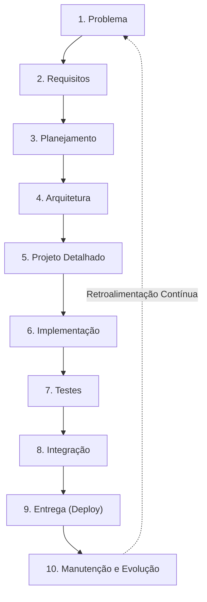
```mermaid
flowchart TD
    F1["1. Problema"] --> F2["2. Requisitos"]
    F2 --> F3["3. Planejamento"]
    F3 --> F4["4. Arquitetura"]
    F4 --> F5["5. Projeto Detalhado"]
    F5 --> F6["6. Implementação"]
    F6 --> F7["7. Testes"]
    F7 --> F8["8. Integração"]
    F8 --> F9["9. Entrega (Deploy)"]
    F9 --> F10["10. Manutenção e Evolução"]
    F10 -.->|"Retroalimentação Contínua"| F1
```

| Fase | Foco Central | Artefato de Entrada | Artefato de Saída |
| :--- | :--- | :--- | :--- |
| **1. Problema** | Identificar a dor real do negócio e sua viabilidade. | Dores de mercado e ineficiências operacionais. | Declaração do Problema e Proposta de Valor. |
| **2. Requisitos** | Elicitar o que o sistema deve e não deve fazer. | Declaração do Problema e entrevistas. | Especificação de Requisitos de Software (SRS). |
| **3. Planejamento** | Estimar escopo, cronograma, recursos e riscos. | Requisitos priorizados e capacidade da equipe. | Backlog do Produto, Cronograma e Matriz de Riscos. |
| **4. Arquitetura** | Definir estrutura macro e atributos de qualidade. | Requisitos Não Funcionais críticos. | Documento de Arquitetura de Software (SAD). |
| **5. Projeto** | Modelar classes, interfaces, persistência e padrões. | Diretrizes arquiteturais consolidadas. | Diagramas de Classes, Sequência e Contratos de API. |
| **6. Implementação** | Escrever código limpo, testável e auditável. | Modelos técnicos e critérios de aceitação. | Código-fonte versionado em repositório (Git). |
| **7. Testes** | Validar conformidade funcional e limites técnicos. | Software executável compilado. | Relatórios de cobertura de testes e logs de QA. |
| **8. Integração** | Compilar módulos em builds automatizados unificados. | Branches locais validados pelos desenvolvedores. | Builds estáveis e imagens de contêiner validadas. |
| **9. Entrega** | Disponibilizar a versão em ambiente operacional. | Imagens de contêiner e scripts de migração. | Release em produção e changelog documentado. |
| **10. Manutenção** | Monitorar métricas, corrigir falhas e evoluir. | Telemetria em tempo real e chamados de suporte. | Patches corretivos e novas demandas de escopo. |

---

## 2. Paradigma Orientado a Objetos e Princípios Estruturantes de Design

### 2.1 Transição da Análise para o Projeto Orientado a Objetos

A passagem da análise para o projeto é a transição entre o domínio do problema e o domínio da solução. Na análise, o analista busca entender o negócio sem se preocupar com tecnologias de implementação. No projeto, o arquiteto e o desenvolvedor traduzem esses conceitos em componentes de software executáveis.

| Critério de Comparação | Modelo de Análise | Modelo de Projeto Orientado a Objetos |
| :--- | :--- | :--- |
| **Pergunta Central** | O que o sistema deve fazer? | Como o sistema fará tecnicamente? |
| **Ponto de Vista** | Usuário, cliente e analista de negócio. | Arquiteto de software e desenvolvedor. |
| **Nível de Abstração** | Conceitual e agnóstico de tecnologia. | Físico e lógico, atrelado a plataformas e bibliotecas. |
| **Entregáveis Típicos** | Casos de uso, histórias de usuário e glossário. | Diagramas de classes, sequências, esquemas de banco e DTOs. |
| **Vocabulário** | Termos do domínio (ex.: *Empréstimo*, *Reserva*). | Termos técnicos (ex.: *Controller*, *Repository*, *Pool*). |

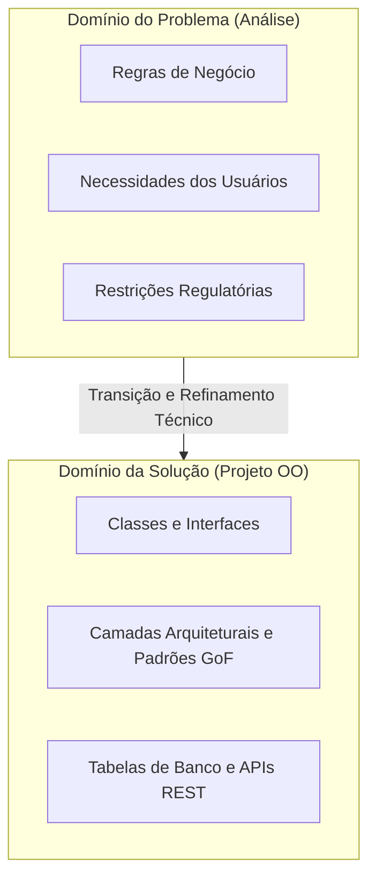
```mermaid
flowchart TD
    subgraph DominioProblema["Domínio do Problema (Análise)"]
        A1["Regras de Negócio"]
        A2["Necessidades dos Usuários"]
        A3["Restrições Regulatórias"]
    end

    subgraph DominioSolucao["Domínio da Solução (Projeto OO)"]
        S1["Classes e Interfaces"]
        S2["Camadas Arquiteturais e Padrões GoF"]
        S3["Tabelas de Banco e APIs REST"]
    end

    DominioProblema -->|"Transição e Refinamento Técnico"| DominioSolucao
```

### 2.2 Os Pilares Fundamentais da Orientação a Objetos

#### Abstração

- **Definição:** Operação conceitual que isola aspectos essenciais de uma entidade do mundo real sob a perspectiva do sistema, descartando detalhes secundários ou irrelevantes para o contexto.
- **Motivação:** Reduzir a complexidade cognitiva. Em um sistema de vendas, uma classe `Cliente` precisa conhecer nome, CPF e histórico financeiro, ignorando a cor dos olhos ou a altura do comprador.
- **Exemplo:** A classe `ItemPedido` encapsula produto, quantidade e valor unitário, fornecendo a operação `calcularSubtotal()`. O consumidor dessa classe apenas requisita o cálculo, sem precisar saber se há algoritmos internos de arredondamento bancário.
- **Contraexemplo:** Criar uma classe gigantesca `EntidadeGenerica` com centenas de atributos não filtrados, armazenando indistintamente dados cadastrais, logs de conexão de rede, parâmetros de socket e configurações de impressora.
- **Armadilha:** Modelar detalhes transientes da interface gráfica dentro das classes do domínio de negócio (ex.: colocar o método `mudarCorDoBotao()` na classe `ContaBancaria`).

#### Encapsulamento

- **Definição:** Prática de agrupar o estado interno (atributos) e o comportamento (métodos) de um objeto, restringindo o acesso direto a variáveis estruturais por meio de modificadores de visibilidade para resguardar as invariantes de classe.
- **Motivação:** Impedir que o estado interno atinja valores inválidos ou inconsistentes com as regras do negócio.
- **Exemplo em Java:**

```java
package br.unifef.engenharia.dominio;

import java.util.ArrayList;
import java.util.Collections;
import java.util.List;

public class Pedido {
    private final String codigoIdentificador;
    private double valorTotal;
    private final List<String> itens;

    public Pedido(String codigoIdentificador) {
        if (codigoIdentificador == null || codigoIdentificador.isBlank()) {
            throw new IllegalArgumentException("Identificador do pedido e obrigatorio.");
        }
        this.codigoIdentificador = codigoIdentificador;
        this.valorTotal = 0.0;
        this.itens = new ArrayList<>();
    }

    public void adicionarItem(String nomeProduto, double precoUnitario, int quantidade) {
        if (quantidade <= 0) {
            throw new IllegalArgumentException("Quantidade deve ser superior a zero.");
        }
        if (precoUnitario < 0.0) {
            throw new IllegalArgumentException("Preco unitario nao pode ser negativo.");
        }
        this.itens.add(nomeProduto + " x" + quantidade);
        this.valorTotal += (precoUnitario * quantidade);
    }

    public double getValorTotal() {
        return this.valorTotal;
    }

    public String getCodigoIdentificador() {
        return this.codigoIdentificador;
    }

    // Protecao contra mutacao externa da colecao (Escaping Reference)
    public List<String> getItens() {
        return Collections.unmodifiableList(this.itens);
    }
}
```

- **Contraexemplo (Modelo Anêmico e Quebra de Encapsulamento):**

```java
package br.unifef.engenharia.antipattern;

import java.util.List;

public class PedidoInseguro {
    public String codigoIdentificador;
    public double valorTotal; // Aberto para mutacao externa arbitraria: pedido.valorTotal = -9000.0;
    public List<String> itens; // Qualquer cliente externo pode chamar pedido.itens.clear();
}
```

- **Armadilhas Comuns:**
  1. *Getters e Setters cegos:* Criar métodos get/set automáticos para todos os atributos sem validar regras de integridade equivale a tornar os campos públicos.
  2. *Vazamento de Referências Mutáveis (Escaping References):* Retornar referências diretas de instâncias de listas (`List`), dicionários (`Map`) ou datas mutáveis (`Date`). Deve-se sempre retornar coleções imutáveis ou cópias defensivas.

#### Herança (Generalização e Especialização)

- **Definição:** Mecanismo estrutural que permite a uma classe derivada (subclasse) herdar atributos e comportamentos de uma classe base (superclasse), estabelecendo uma relação conceitual de "É UM" (*is-a*).
- **Motivação:** Compartilhar estruturas comuns e permitir a especialização gradativa de comportamento.
- **Exemplo em Java:**

```java
package br.unifef.engenharia.dominio;

public abstract class ContaBancaria {
    private final String numero;
    protected double saldo;

    public ContaBancaria(String numero, double saldoInicial) {
        this.numero = numero;
        this.saldo = Math.max(saldoInicial, 0.0);
    }

    public void depositar(double valor) {
        if (valor <= 0) {
            throw new IllegalArgumentException("Valor de deposito deve ser positivo.");
        }
        this.saldo += valor;
    }

    public abstract boolean sacar(double valor);

    public double getSaldo() {
        return this.saldo;
    }

    public String getNumero() {
        return this.numero;
    }
}

public class ContaCorrente extends ContaBancaria {
    private final double limiteChequeEspecial;

    public ContaCorrente(String numero, double saldoInicial, double limiteChequeEspecial) {
        super(numero, saldoInicial);
        this.limiteChequeEspecial = limiteChequeEspecial;
    }

    @Override
    public boolean sacar(double valor) {
        if (valor > 0 && (saldo + limiteChequeEspecial) >= valor) {
            saldo -= valor;
            return true;
        }
        return false;
    }
}
```

- **Contraexemplo:** Utilizar herança apenas para reaproveitar linhas de código de uma classe sem relação semântica (ex.: fazer `RelatorioFinanceiro` herdar de `ArrayList` apenas para usar métodos de lista).
- **Armadilha:** Fragilidade da classe base (*Fragile Base Class Problem*). Alterações na superclasse propagam efeitos colaterais imprevistos sobre todas as subclasses da árvore hierárquica. Na dúvida, prefira composição a herança.

#### Polimorfismo

- **Definição:** Propriedade que permite tratar objetos de diferentes classes derivadas por meio de uma interface ou classe base comum, invocando comportamentos especializados em tempo de execução via despacho dinâmico.
- **Motivação:** Eliminar estruturas condicionais ramificadas (`if/else` e `switch/case`) que tornam o código rígido à extensão de novas variantes de negócio.
- **Exemplo em Java:**

```java
package br.unifef.engenharia.pagamento;

public interface MeioPagamento {
    boolean processar(double valor);
}

public class PagamentoPix implements MeioPagamento {
    @Override
    public boolean processar(double valor) {
        // Logica para gerar Payload e QR Code instantaneo
        return true;
    }
}

public class PagamentoCartaoCredito implements MeioPagamento {
    private final String tokenCartao;

    public PagamentoCartaoCredito(String tokenCartao) {
        this.tokenCartao = tokenCartao;
    }

    @Override
    public boolean processar(double valor) {
        // Comunicacao com Gateway adquirente
        return true;
    }
}

public class ProcessadorCheckout {
    public void finalizarVenda(double valor, MeioPagamento meio) {
        if (!meio.processar(valor)) {
            throw new IllegalStateException("Falha no pagamento.");
        }
    }
}
```

- **Contraexemplo:** Utilizar operadores de verificação de tipo (`instanceof` ou `switch` no tipo de objeto) dentro do cliente para executar lógicas distintas manualmente:

```java
// Antipadrao que destroi o polimorfismo
if (tipo.equals("PIX")) {
    processarPix();
} else if (tipo.equals("CARTAO")) {
    processarCartao();
}
```

- **Armadilha:** Sobrescrita de métodos que quebram o contrato conceitual da superclasse (violação do Princípio da Substituição de Liskov - LSP).

### 2.3 Baixo Acoplamento e Alta Coesão

Estes dois princípios medem a qualidade arquitetural e a facilidade de manutenção de qualquer módulo orientado a objetos.

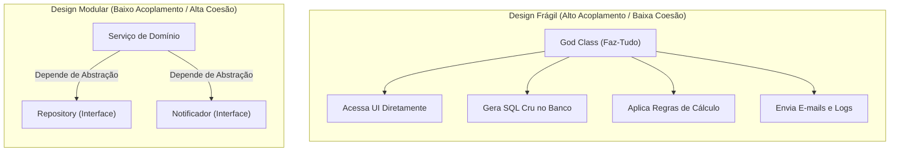
```mermaid
flowchart TD
    subgraph AntipadraoDesign["Design Frágil (Alto Acoplamento / Baixa Coesão)"]
        direction TB
        GC["God Class (Faz-Tudo)"]
        GC --> D1["Acessa UI Diretamente"]
        GC --> D2["Gera SQL Cru no Banco"]
        GC --> D3["Aplica Regras de Cálculo"]
        GC --> D4["Envia E-mails e Logs"]
    end

    subgraph BomDesign["Design Modular (Baixo Acoplamento / Alta Coesão)"]
        direction TB
        Svc["Serviço de Domínio"] -->|"Depende de Abstração"| Rep["Repository (Interface)"]
        Svc -->|"Depende de Abstração"| Notif["Notificador (Interface)"]
    end
```

- **Baixo Acoplamento:** Grau de interdependência entre os módulos do sistema. Módulos com baixo acoplamento dependem de contratos abstratos (interfaces) em vez de classes concretas, permitindo que alterações internas em um componente não gerem falhas em cascata nos demais.
- **Alta Coesão:** Grau em que as responsabilidades de uma classe ou módulo estão fortemente relacionadas a um único propósito de negócio. Uma classe coesa possui um único motivo para mudar (Princípio da Responsabilidade Única - SRP).

| Métrica | Cenário Ruim | Cenário Excelente (Engenharia de Software) |
| :--- | :--- | :--- |
| **Acoplamento** | Classe `PedidoController` instancia diretamente `MySQLDatabaseDriver`. | Classe `PedidoService` recebe via injeção de dependência a interface `PedidoRepository`. |
| **Coesão** | Classe `Cliente` valida CPF, desenha a tela de cadastro e grava na tabela `TB_CLIENTE`. | Classe `Cliente` armazena dados e invariantes; validação, persistência e UI operam em classes separadas. |

### 2.4 Introdução aos Princípios SOLID e Padrões de Projeto (GoF)

Na transição para o projeto detalhado, a estruturação de classes apoia-se nos princípios **SOLID**:

- **S - Single Responsibility Principle (SRP):** Uma classe deve ter um único motivo para ser modificada.
- **O - Open/Closed Principle (OCP):** Entidades de software devem estar abertas para extensão, mas fechadas para modificação direta em código estável.
- **L - Liskov Substitution Principle (LSP):** Objetos de um programa devem ser substituíveis por instâncias de seus subtipos sem comprometer a consistência do sistema.
- **I - Interface Segregation Principle (ISP):** Muitas interfaces específicas são melhores do que uma única interface genérica e inflada.
- **D - Dependency Inversion Principle (DIP):** Módulos de alto nível não devem depender de módulos de baixo nível; ambos devem depender de abstrações.

Paralelamente, os **Padrões de Projeto GoF** (*Gang of Four*) oferecem soluções consolidadas para desafios recorrentes:

- **Strategy (Comportamental):** Define uma família de algoritmos intercambiáveis encapsulados por uma interface comum (ex.: diferentes algoritmos de frete ou cálculo de impostos).
- **Factory Method (Criacional):** Fornece uma interface para criação de objetos, permitindo às subclasses decidirem qual classe concreta instanciar.
- **Observer (Comportamental):** Estabelece uma dependência de um-para-muitos, notificando automaticamente múltiplos objetos sobre mudanças de estado ocorridas em outro objeto.
- **Adapter (Estrutural):** Converte a interface de uma classe para outra esperada pelo cliente, viabilizando a integração entre componentes de interfaces incompatíveis.
- **Facade (Estrutural):** Disponibiliza uma interface unificada e simplificada para um subsistema complexo composto por múltiplas classes internas.

---

## 3. Engenharia e Elicitação de Requisitos

### 3.1 Fundamentos: Levantar versus Elicitar

A literatura e as normas internacionais (como o SWEBOK da IEEE Computer Society) estabelecem uma distinção metodológica crucial entre os termos:

- **Levantamento (Gathering):** Postura passiva na qual o analista assume que os requisitos já existem claros e lapidados na mente do cliente, cabendo apenas anotá-los. Essa presunção quase invariavelmente resulta no fracasso do projeto.
- **Elicitação (Elicitation):** Do latim *elicitare* ("fazer sair", "trazer à tona"). Postura ativa, crítica e investigativa do analista de sistemas. O cliente expressa dores operacionais, expectativas confusas e processos manuais com vícios; cabe ao analista interrogar, desconstruir e modelar os requisitos reais de software.

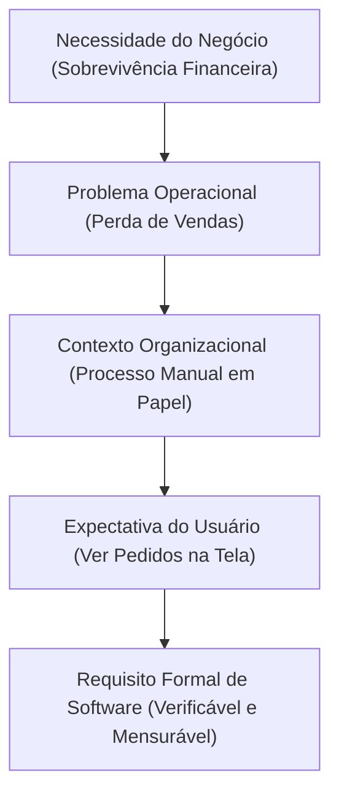
```mermaid
flowchart TD
    N["Necessidade do Negócio (Sobrevivência Financeira)"] --> P["Problema Operacional (Perda de Vendas)"]
    P --> C["Contexto Organizacional (Processo Manual em Papel)"]
    C --> E["Expectativa do Usuário (Ver Pedidos na Tela)"]
    E --> R["Requisito Formal de Software (Verificável e Mensurável)"]
```

### 3.2 O Ciclo Causal e as Seis Perguntas Cardinais

Antes de qualquer especificação técnica, o analista deve responder às seis perguntas cardinais:

1. **Qual problema existe?** Isolar a causa raiz dos sintomas aparentes.
2. **Quem enfrenta o problema?** Identificar atores primários, secundários e partes interessadas.
3. **Como o processo é executado atualmente (As-Is)?** Analisar rotinas manuais, formulários em papel ou sistemas legados.
4. **O que o sistema precisa fazer (To-Be)?** Definir o comportamento computacional esperado e as regras de transformação.
5. **Quais são as restrições?** Mapear limitações de orçamento, prazos, tecnologias obrigatórias e normas jurídicas (LGPD, normas fiscais).
6. **O que é prioridade?** Delimitar o núcleo essencial para o lançamento (MVP) em relação aos desejos secundários.

### 3.3 A Premissa de Desenvolvimento Prematuro

Considere a declaração clássica analisada em sala de aula:

> *"Preciso de um sistema para melhorar meu negócio. Isso é suficiente para começar a desenvolver?"*

A resposta da engenharia de software é terminantemente **não**. Iniciar o desenvolvimento sobre tal afirmação constitui falha grave de processo por quatro razões:

1. **Ausência de Critérios de Aceite:** O termo "melhorar" é subjetivo e impede a verificação de conclusão do projeto.
2. **Corrupção de Escopo (*Scope Creep*):** Sem fronteiras formais, qualquer nova exigência imaginada pelo cliente no futuro será cobrada como parte da promessa original de "melhorar o negócio".
3. **Assimetria de Conhecimento:** O cliente domina seu ramo de atuação, mas ignora concorrência, consistência transacional e segurança computacional. O desenvolvedor domina a tecnologia, mas desconhece os termos do negócio.
4. **Automatização do Caos:** Informatizar um processo corporativo desorganizado gera apenas um caos automatizado, multiplicando prejuízos em menor tempo.

### 3.4 Desconstrução de Falas Incompletas e Refatoração de Ambiguidades

Considere a demanda: *"Quero um sistema para controlar meus pedidos."*

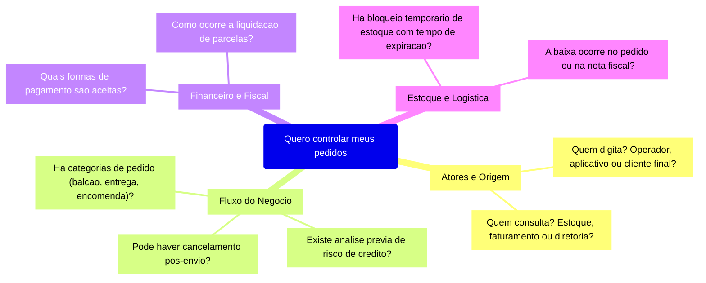
```mermaid
mindmap
    root("Quero controlar meus pedidos")
        n1["Atores e Origem"]
            n2["Quem digita? Operador, aplicativo ou cliente final?"]
            n3["Quem consulta? Estoque, faturamento ou diretoria?"]
        n4["Fluxo do Negocio"]
            n5["Pode haver cancelamento pos-envio?"]
            n6["Existe analise previa de risco de credito?"]
            n7["Ha categorias de pedido (balcao, entrega, encomenda)?"]
        n8["Financeiro e Fiscal"]
            n9["Quais formas de pagamento sao aceitas?"]
            n10["Como ocorre a liquidacao de parcelas?"]
        n11["Estoque e Logistica"]
            n12["A baixa ocorre no pedido ou na nota fiscal?"]
            n13["Ha bloqueio temporario de estoque com tempo de expiracao?"]
```

Termos qualitativos como "rápido", "fácil", "seguro" e "robusto" devem ser refatorados em métricas objetivas:

| Fala Ambígua do Cliente | Interpretação Ingênua | Refatoração Formal da Engenharia (RNF) |
| :--- | :--- | :--- |
| "O sistema precisa ser rápido." | Adicionar paginação simples. | **RNF-001 (Desempenho):** A busca parametrizada de pedidos por cliente deve responder em até 1,2 segundos para o percentil 95 (p95) sob concorrência de 300 requisições simultâneas. |
| "A tela deve ser simples e intuitiva." | Deixar a tela com fundo branco e poucos campos. | **RNF-002 (Usabilidade):** Um atendente recém-contratado deve completar a emissão de um pedido padrão em até 3 minutos após um treinamento prévio de 30 minutos, com taxa de erro operacional inferior a 2%. |
| "O sistema deve ser seguro." | Gravar uma senha alfanumérica no banco. | **RNF-003 (Segurança):** O sistema deve exigir autenticação multifator (MFA) para operações financeiras e aplicar o algoritmo de hash Argon2id (com custo de memória de 64MB) sobre todas as senhas armazenadas. |

### 3.5 Técnicas Tradicionais de Elicitação

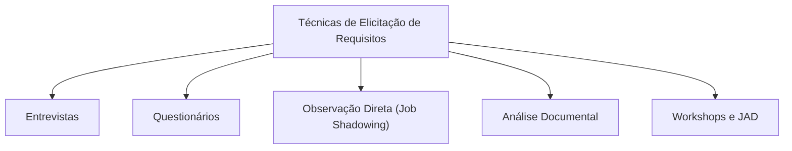
```mermaid
flowchart TD
    TT["Técnicas de Elicitação de Requisitos"]
    TT --> E["Entrevistas"]
    TT --> Q["Questionários"]
    TT --> O["Observação Direta (Job Shadowing)"]
    TT --> AD["Análise Documental"]
    TT --> W["Workshops e JAD"]
```

- **Entrevistas:**
  - *Estruturada:* Roteiro fechado e estritamente padronizado. Excelente para levantamentos comparativos entre filiais, mas rígida à descoberta de novas facetas do problema.
  - *Semiestruturada (Recomendada):* Combina perguntas mestras prévias com flexibilidade para investigar desdobramentos operacionais revelados pelo entrevistado.
  - *Não Estruturada:* Diálogo aberto de reconhecimento. Útil nas primeiras horas de contato com um domínio desconhecido.
- **Questionários:** Aplicação de formulários estruturados em massa. Vantajoso para populações dispersas geograficamente e baixo custo; tem como desvantagens taxas históricas baixas de resposta (<15%) e impossibilidade de esclarecer ambiguidades em tempo real.
- **Observação Direta (*Job Shadowing*):** O analista atua como uma "sombra" do operador, observando a rotina real de trabalho. Desmascara procedimentos tácitos que o usuário executa mecanicamente e "esquece" de mencionar em reuniões, além de evidenciar gambiarras e atalhos operacionais (como senhas anotadas no monitor). O cuidado reside no *Efeito Hawthorne* (mudança de comportamento do usuário ao se sentir observado).
- **Análise Documental:** Inspeção de formulários físicos, planilhas legadas, contratos e regulamentações. Mapeia a estrutura real de dados e cálculos fiscais da empresa.
- **Workshops / JAD (*Joint Application Design*):** Sessões de trabalho conjuntas e intensivas reunindo usuários operacionais, gestores e desenvolvedores para resolução ágil de conflitos de requisitos entre setores divergentes.

### 3.6 Priorização de Requisitos pelo Método MoSCoW

O método **MoSCoW** foi concebido por Dai Clegg no contexto do framework DSDM (*Dynamic Systems Development Method*) para viabilizar a entrega de software no prazo e custo contratados, definindo o Produto Mínimo Viável (MVP):

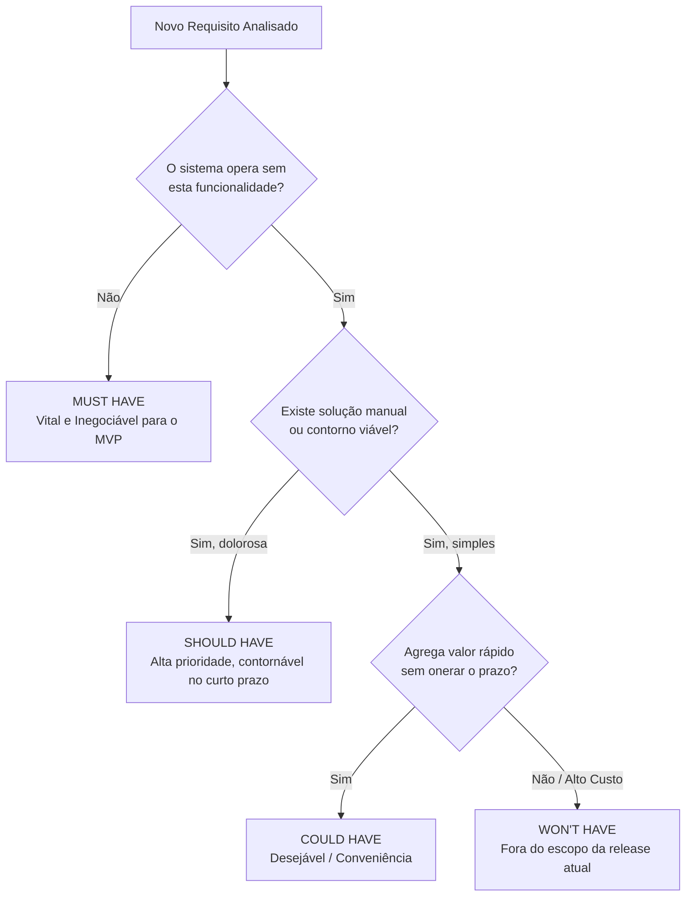
```mermaid
flowchart TD
    Req["Novo Requisito Analisado"] --> M1{O sistema opera sem<br/>esta funcionalidade?}
    M1 -- Não --> M["MUST HAVE<br/>Vital e Inegociável para o MVP"]
    M1 -- Sim --> S1{Existe solução manual<br/>ou contorno viável?}
    S1 -- Sim, dolorosa --> S["SHOULD HAVE<br/>Alta prioridade, contornável no curto prazo"]
    S1 -- Sim, simples --> C1{Agrega valor rápido<br/>sem onerar o prazo?}
    C1 -- Sim --> C["COULD HAVE<br/>Desejável / Conveniência"]
    C1 -- Não / Alto Custo --> W["WON'T HAVE<br/>Fora do escopo da release atual"]
```

- **M - Must Have (Deve Ter):** Requisitos inegociáveis. Se qualquer item deste grupo não for entregue, o sistema é inviável técnica, legal ou operacionalmente.
- **S - Should Have (Deveria Ter):** Requisitos de alta prioridade e valor expressivo. Devem ser implementados caso haja viabilidade, mas sua ausência no dia de lançamento pode ser suprida temporariamente por soluções manuais de contingência.
- **C - Could Have (Poderia Ter):** Requisitos desejáveis de conveniência ou melhoria estética que só serão executados se sobrarem tempo e recursos da equipe após os itens Must e Should.
- **W - Won't Have this time (Não Terá Desta Vez):** Requisitos formalmente acordados como fora do escopo da iteração atual, evitando a diluição do foco. Podem ser reavaliados em releases futuras.

---

## 4. Modelagem Comportamental com Diagrama de Casos de Uso UML

### 4.1 Origem e Conceito Caixa-Preta (Black-Box)

A técnica de Casos de Uso foi introduzida na engenharia de software por **Ivar Jacobson** em 1986 e padronizada pela Object Management Group (OMG) na Unified Modeling Language (UML).

O diagrama de casos de uso modela o comportamento observável do sistema do ponto de vista do ambiente externo. Opera sob a premissa de **Modelagem Caixa-Preta**:
- **O que documenta:** Quais serviços o sistema provê aos seus atores e quais objetivos de negócio podem ser alcançados.
- **O que NÃO documenta:** Detalhes internos de algoritmos, classes, comandos SQL, tabelas de banco de dados ou navegação entre telas de interface.

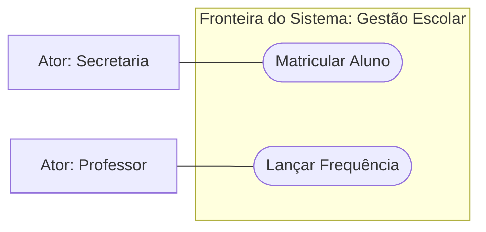
```mermaid
flowchart LR
    subgraph Sistema["Fronteira do Sistema: Gestão Escolar"]
        UC1(["Matricular Aluno"])
        UC2(["Lançar Frequência"])
    end

    Ator1["Ator: Secretaria"] --- UC1
    Ator2["Ator: Professor"] --- UC2
```

### 4.2 Elementos Básicos da Notação

1. **Fronteira do Sistema (*Subject Boundary*):** Retângulo que demarca os limites de responsabilidade do software em desenvolvimento. Casos de uso ficam dentro do retângulo; atores ficam obrigatoriamente do lado de fora.
2. **Atores:** Papéis desempenhados por usuários humanos ou sistemas computacionais externos que trocam dados com a aplicação. Representados graficamente por bonecos palito (*stick men*) ou retângulos com o estereótipo `<<actor>>`.
   - *Atores Primários:* Disparam a interação buscando atingir um objetivo de negócio (ex.: `Cliente`).
   - *Atores Secundários:* Fornecem serviços de apoio ou respondem passivamente a requisições do sistema (ex.: `Gateway de Pagamento`, `Serviço de CEP`).
3. **Casos de Uso:** Elipses posicionadas no interior da fronteira do sistema que representam uma funcionalidade completa e atômica geradora de valor observável para o ator. A nomenclatura deve conter **obrigatoriamente verbo no infinitivo seguido de complemento direto** (ex.: `Efetuar Pedido`, `Consultar Extrato`).

### 4.3 Relacionamentos entre Casos de Uso e Atores

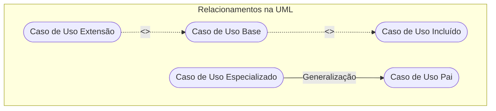
```mermaid
flowchart TD
    subgraph Relacionamentos["Relacionamentos na UML"]
        Base(["Caso de Uso Base"])
        Inc(["Caso de Uso Incluído"])
        Ext(["Caso de Uso Extensão"])
        Pai(["Caso de Uso Pai"])
        Filho(["Caso de Uso Especializado"])

        Base -.->|"<<include>>"| Inc
        Ext -.->|"<<extend>>"| Base
        Filho -->|"Generalização"| Pai
    end
```

#### 1. Associação Simples

- **Definição:** Linha contínua que liga um ator a um caso de uso, denotando o canal de comunicação e tráfego de dados bidirecional.
- **Regra:** Nunca conecte dois atores diretamente entre si por associação simples; atores só se relacionam entre si por generalização.

#### 2. Inclusão (`<<include>>`)

- **Definição:** Relacionamento de dependência no qual o caso de uso base incorpora obrigatoriamente o comportamento do caso de uso incluído como parte inseparável de sua execução.
- **Motivação:** Reutilização de regras de negócio ou passos operacionais comuns a múltiplos casos de uso (princípio DRY em nível de requisitos).
- **Sentido da Seta:** Tracejada, **do caso de uso base para o caso de uso incluído** (`Base -.->|<<include>>| Incluido`).
- **Exemplo:** `Emitir Transferência Bancária` e `Pagar Boleto` incluem obrigatoriamente `Autenticar Correntista`.

#### 3. Extensão (`<<extend>>`)

- **Definição:** Relacionamento no qual o comportamento de um caso de uso opcional/acessório pode ser anexado ao caso de uso base em um ponto pré-definido (*extension point*), caso uma condição lógica de guarda seja atendida em tempo de execução.
- **Motivação:** Desacoplar comportamentos excepcionais, fluxos condicionais ou módulos adicionais da rotina principal, mantendo o caso de uso base limpo.
- **Sentido da Seta:** Tracejada, **do caso de uso de extensão para o caso de uso base** (`Extensao -.->|<<extend>>| Base`).
- **Exemplo:** Ao `Finalizar Compra`, o cliente pode acionar condicionalmente `Aplicar Cupom Promocional`.

#### 4. Generalização / Especialização

- **Definição:** Equivalente ao conceito de herança em linguagens orientadas a objetos. O elemento filho herda a semântica, as associações e as características do elemento pai.
- **Entre Atores:** O ator especializado acessa todos os casos de uso do ator pai, além de seus próprios casos exclusivos (ex.: `Gerente` herda de `Operador`).
- **Entre Casos de Uso:** O caso de uso pai define a assinatura conceitual da ação, e os casos filhos implementam as variações específicas (ex.: `Pagar Pedido` generaliza `Pagar via Pix` e `Pagar via Cartão`).

| Relacionamento | Notação UML | Execução | Direção da Seta | Finalidade Primária |
| :--- | :--- | :--- | :--- | :--- |
| **Associação** | Linha sólida contínua | Variável | Sem seta (bidirecional) | Comunicação e navegação básica entre ator e caso de uso. |
| **Include** | Linha tracejada aberta | Obrigatória | Da Base para o Incluído | Reúso sistemático de comportamento compartilhado. |
| **Extend** | Linha tracejada aberta | Condicional | Da Extensão para a Base | Isolamento de fluxos opcionais ou de exceção. |
| **Generalização** | Linha sólida com triângulo vazado | Herança | Do Especializado para o Geral | Especialização polimórfica de comportamento ou papel. |

### 4.4 Estrutura de Especificação Textual Canônica

O diagrama gráfico é apenas o índice visual dos serviços; o contrato funcional de engenharia é documentado na **especificação textual detalhada**:

```text
Identificador: UC-001
Nome do Caso de Uso: Realizar Pedido de Compra
Ator Primário: Cliente Cadastrado
Atores Secundários: Gateway de Pagamentos, Sistema de Logística
Pré-condições: O cliente deve estar autenticado e possuir ao menos um item no carrinho de compras.
Pós-condições: O pedido é persistido com status "Pendente", o estoque dos itens é reservado e a transação financeira é iniciada.

Fluxo Principal (Caminho Feliz):
1. O cliente acessa o carrinho de compras e solicita a finalização do pedido.
2. O sistema calcula o valor total dos itens e solicita o endereço de entrega.
3. O cliente seleciona um endereço cadastrado.
4. O sistema consulta o Sistema de Logística, calcula o frete e exibe o valor consolidado.
5. O cliente seleciona a opção de pagamento via Cartão de Crédito e submete a compra.
6. O sistema executa o caso de uso <<include>> Autenticar Sessão Segura.
7. O sistema envia a requisição de cobrança ao Gateway de Pagamentos.
8. O Gateway de Pagamentos confirma a liquidação financeira com código de autorização.
9. O sistema atualiza o status do pedido para "Confirmado", decrementa o estoque físico e envia recibo por e-mail.
10. O sistema exibe o comprovante na tela e encerra o caso de uso.

Fluxos Alternativos:
- FA-01 (Aplicar Cupom Promocional - Ponto de Extensão no Passo 2):
  1. O cliente insere o código do cupom.
  2. O sistema executa o caso de uso <<extend>> Validar Cupom de Desconto.
  3. O valor total é recalculado e o fluxo retorna ao Passo 3 do Fluxo Principal.

Fluxos de Exceção:
- FE-01 (Pagamento Recusado pela Operadora no Passo 8):
  1. O Gateway de Pagamentos retorna recusa da transação.
  2. O sistema cancela a reserva de estoque dos itens.
  3. O sistema informa ao cliente o motivo da recusa e oferece a escolha de outro meio de pagamento.
  4. O caso de uso é reiniciado a partir do Passo 5 ou abortado pelo cliente.
```

---

## 5. Modelagem Estrutural com Diagrama de Classes UML

### 5.1 Conceito, Princípios da UML e Distinção de Processos

A **Unified Modeling Language (UML)** foi concebida na década de 1990 pela unificação dos trabalhos dos "Três Amigos": **Grady Booch** (método Booch), **James Rumbaugh** (OMT) e **Ivar Jacobson** (OOSE), sob a coordenação da Object Management Group (OMG).

A UML é uma **linguagem gráfica de modelagem**, e não um processo ou metodologia:
- Ela provê vocabulário visual e regras sintáticas para *visualizar*, *especificar*, *construir* e *documentar* artefatos de software.
- Ela é agnóstica quanto ao modelo de gestão adotado. Pode ser utilizada tanto no tradicional modelo em Cascata (*Waterfall*) quanto em cerimônias de refinamento e planejamento de Sprints no **Scrum**.
- Em times ágeis, aplica-se a modelagem *Just-in-Time* e *Just-Enough*, desenhando diagramas enxutos para alinhar a arquitetura da Sprint sem produzir documentação burocrática e obsoleta.

### 5.2 Anatomia Estrutural da Classe e Sintaxe Formal

Graficamente, uma classe na UML é representada por um retângulo dividido horizontalmente em três compartimentos obrigatórios:

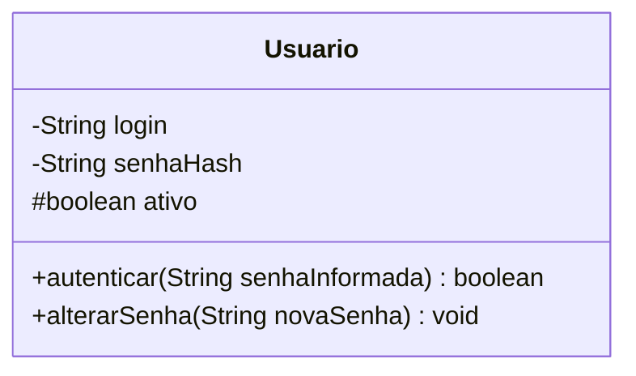
```mermaid
classDiagram
    class Usuario {
        -String login
        -String senhaHash
        #boolean ativo
        +autenticar(String senhaInformada) boolean
        +alterarSenha(String novaSenha) void
    }
```

1. **Compartimento Superior (Nome da Classe):** Substantivo no singular, grafado em **PascalCase** (ex.: `Cliente`, `NotaFiscal`).
2. **Compartimento Central (Atributos):** Estado e dados mantidos pelos objetos.
   - Sintaxe OMG: `[visibilidade] nome : tipo [multiplicidade] = [valorPadrao]`
   - Exemplo: `- saldo : double = 0.0`
3. **Compartimento Inferior (Operações / Métodos):** Comportamentos e serviços oferecidos.
   - Sintaxe OMG: `[visibilidade] nomeMetodo([parametro : tipo]) : tipoRetorno`
   - Exemplo: `+ transferir(destino : Conta, valor : double) : boolean`

#### Modificadores de Visibilidade e Mapeamento para Java

| Modificador UML | Símbolo | Palavra-chave Java | Escopo de Acesso Permitido |
| :--- | :---: | :--- | :--- |
| **Público** | `+` | `public` | Acessível por qualquer classe em qualquer pacote da aplicação. |
| **Protegido** | `#` | `protected` | Acessível pela própria classe, subclasses e classes do mesmo pacote. |
| **Privado** | `-` | `private` | Acessível estritamente pelo código interno da própria classe. |
| **Pacote** | `~` | *(sem modificador)* | Acessível unicamente por classes residentes dentro do mesmo pacote. |

### 5.3 Indicadores de Multiplicidade, Navegabilidade e Papéis

Multiplicidades definem os limites numéricos de instâncias que podem participar da associação:

- `1`: Exatamente uma instância obrigatória.
- `0..1`: Opcional; zero ou uma instância.
- `*` ou `0..*`: Zero ou muitas instâncias.
- `1..*`: Ao menos uma instância obrigatória (uma ou muitas).
- `m..n`: Intervalo explícito de instâncias (ex.: `2..4`).

Navegabilidade é representada por pontas de seta abertas nas extremidades da linha de associação. Se uma linha não possui setas, a associação é bidirecional; se possui uma seta apontando de `A` para `B`, significa que os objetos de `A` conhecem e navegam até `B`, mas os objetos de `B` não possuem referência direta para `A`.

### 5.4 Relacionamentos Estruturais e Comportamentais

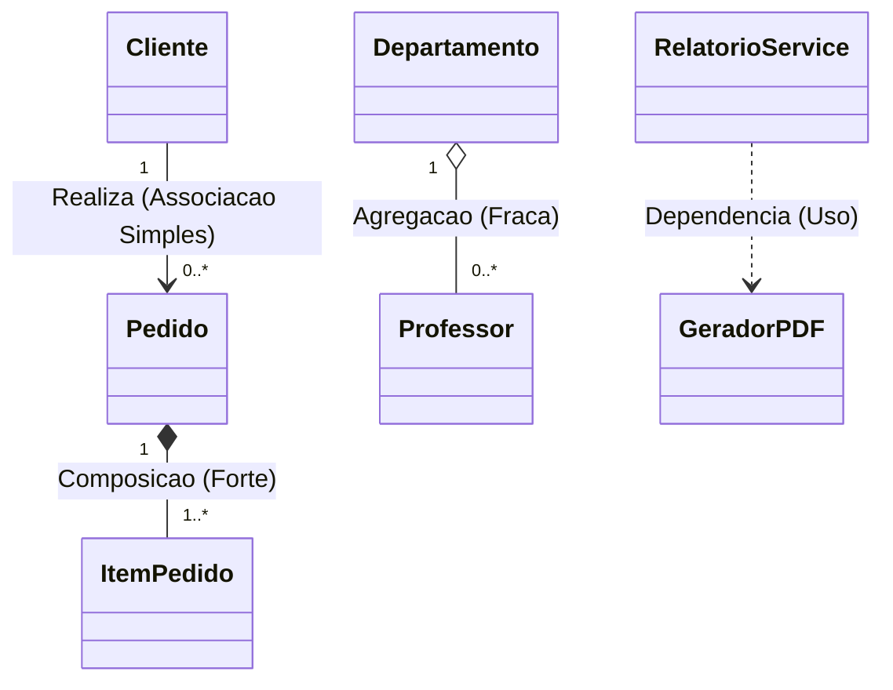
```mermaid
classDiagram
    class Cliente
    class Pedido
    class ItemPedido
    class Departamento
    class Professor
    class RelatorioService
    class GeradorPDF

    Cliente "1" --> "0..*" Pedido : Realiza (Associacao Simples)
    Pedido "1" *-- "1..*" ItemPedido : Composicao (Forte)
    Departamento "1" o-- "0..*" Professor : Agregacao (Fraca)
    RelatorioService ..> GeradorPDF : Dependencia (Uso)
```

#### 1. Associação Simples

- **Conceito:** Vínculo estrutural entre classes independentes que trocam dados.
- **Implementação em Java:** Atributo de referência na classe de origem:

```java
public class Pedido {
    private Cliente cliente; // Associacao Simples unidirecional
}
```

#### 2. Agregação (Todo-Parte Fraco)

- **Conceito:** Representada por um **losango vazio (branco)** posicionado na classe "Todo". Indica que uma classe contém ou agrupa instâncias de outra, porém as partes possuem ciclo de vida independente. Se a classe "Todo" for destruída, as instâncias "Parte" continuam existindo na memória ou no banco de dados.
- **Exemplo Real:** `Departamento` e `Professor`. Se a universidade fechar o Departamento de Computação, os professores não são deletados da instituição; eles são remanejados para outro departamento.
- **Implementação em Java:** A classe Todo recebe as partes já instanciadas por meio de métodos ou construtores:

```java
public class Departamento {
    private List<Professor> professores;

    // Agregacao: os objetos Professor sao criados externamente
    public void adicionarProfessor(Professor professor) {
        this.professores.add(professor);
    }
}
```

#### 3. Composição (Todo-Parte Forte)

- **Conceito:** Representada por um **losango preenchido (preto)** posicionado na classe "Todo". Relação de posse estrita com ciclo de vida acoplado. A "Parte" só pode pertencer a um único "Todo" e não tem razão de existir sem ele. Se a classe "Todo" for destruída, todas as suas "Partes" são obrigatoriamente eliminadas em cascata.
- **Exemplo Real:** `Pedido` e `ItemPedido`. Não faz sentido manter em banco de dados uma linha de `ItemPedido` órfã desvinculada de um cabeçalho de pedido.
- **Implementação em Java:** O próprio Todo gerencia o ciclo de vida da parte, instanciando-a e destruindo-a internamente:

```java
public class Pedido {
    private final List<ItemPedido> itens = new ArrayList<>();

    // Composicao: a criacao do item e controlada e encapsulada pelo Pedido
    public void criarItem(String produto, double preco, int qtd) {
        ItemPedido novoItem = new ItemPedido(produto, preco, qtd);
        this.itens.add(novoItem);
    }
}
```

#### 4. Generalização

- **Conceito:** Representada por uma **linha contínua com triângulo vazado** apontando para a superclasse. Estabelece herança pura de campos e operações, permitindo polimorfismo.

#### 5. Dependência (Uso Transitório)

- **Conceito:** Representada por uma **linha tracejada com seta simples aberta**. Indica que uma classe utiliza transitoriamente os serviços de outra classe apenas durante a execução de um método (como parâmetro, retorno de função ou variável local), sem manter uma referência permanente como variável de instância.
- **Implementação em Java:**

```java
public class RelatorioService {
    // Dependencia: GeradorPDF e usado pontualmente dentro do metodo
    public void exportar(GeradorPDF gerador) {
        gerador.renderizarDocumento();
    }
}
```

| Tipo de Relacionamento | Conector UML | Acoplamento de Ciclo de Vida | Exemplo de Código |
| :--- | :--- | :--- | :--- |
| **Associação Simples** | Linha com seta simples | Desacoplado | `private Cliente titular;` |
| **Agregação** | Losango branco na ponta | Fraco (Parte sobrevive sem o Todo) | `departamento.vincular(professorExistente);` |
| **Composição** | Losango preto na ponta | Forte (Parte morre com o Todo) | `itens.add(new ItemPedido(...));` |
| **Generalização** | Linha com triângulo vazado | Herança de Tipagem | `public class Sub extends Super` |
| **Dependência** | Linha tracejada com seta | Transitório / Operacional | `public void imprimir(Impressora imp)` |

---

## 6. Arquitetura de Software e Padrões Arquiteturais

### 6.1 Definição Normativa: ISO/IEC/IEEE 42010:2022

A norma internacional **ISO/IEC/IEEE 42010:2022** (*Systems and software engineering — Architecture description*) estabelece a definição formal de arquitetura de software:

> *"Estrutura fundamental de um sistema de software, expressa por seus componentes, pelos relacionamentos entre si e com o ambiente, e pelos princípios que governam seu projeto e evolução contínua."*

A arquitetura estabelece as restrições mestras que garantem a sustentabilidade do sistema ao longo dos anos, equilibrando atributos de qualidade (*Requisitos Não Funcionais*): desempenho, manutenibilidade, segurança, escalabilidade e tolerância a falhas.

#### Analogia e Contrastes com a Engenharia Civil

A comparação entre a arquitetura civil e a de software auxilia na compreensão do projeto estrutural:

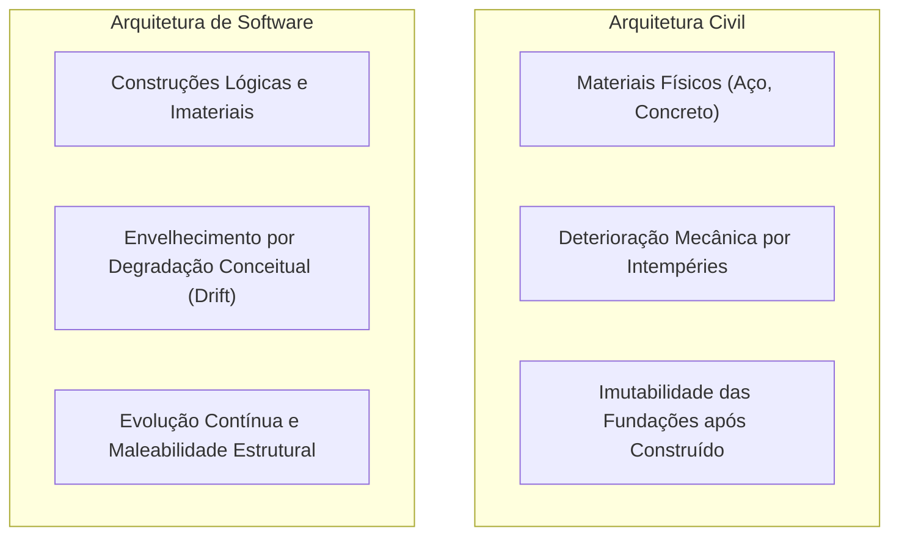
```mermaid
flowchart TD
    subgraph ArquiteturaCivil["Arquitetura Civil"]
        C1["Materiais Físicos (Aço, Concreto)"]
        C2["Deterioração Mecânica por Intempéries"]
        C3["Imutabilidade das Fundações após Construído"]
    end

    subgraph ArquiteturaSoftware["Arquitetura de Software"]
        S1["Construções Lógicas e Imateriais"]
        S2["Envelhecimento por Degradação Conceitual (Drift)"]
        S3["Evolução Contínua e Maleabilidade Estrutural"]
    end
```

O software difere de edifícios por ser maleável e invisível. Se os desenvolvedores inserirem atalhos técnicos e quebras de camadas sem governança, a arquitetura sofre **erosão arquitetural (*architectural drift*)**, degradando sua manutenibilidade até tornar o sistema impossível de evoluir sem reescrita total.

### 6.2 Padrões Arquiteturais versus Padrões de Projeto (GoF)

Uma confusão frequente entre estudantes é misturar o nível de abstração dessas duas abordagens:

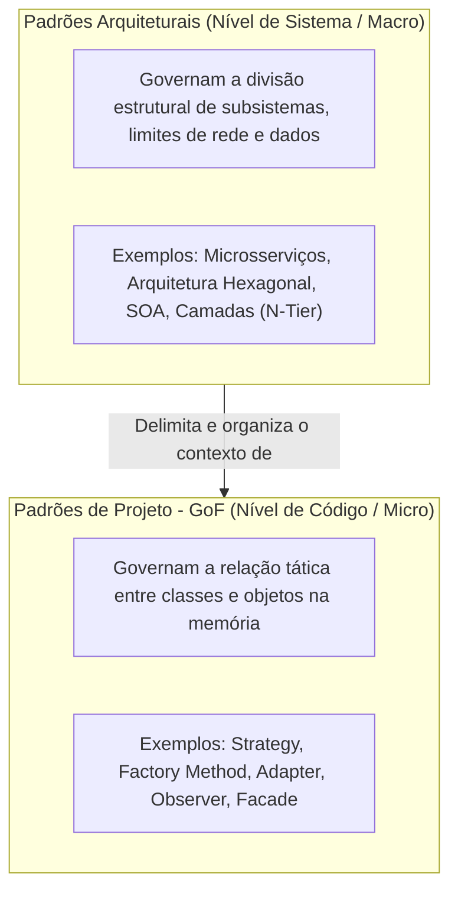
```mermaid
flowchart TD
    subgraph MacroNivel["Padrões Arquiteturais (Nível de Sistema / Macro)"]
        PA["Governam a divisão estrutural de subsistemas, limites de rede e dados"]
        PA_Ex["Exemplos: Microsserviços, Arquitetura Hexagonal, SOA, Camadas (N-Tier)"]
    end

    subgraph MicroNivel["Padrões de Projeto - GoF (Nível de Código / Micro)"]
        PP["Governam a relação tática entre classes e objetos na memória"]
        PP_Ex["Exemplos: Strategy, Factory Method, Adapter, Observer, Facade"]
    end

    MacroNivel -->|"Delimita e organiza o contexto de"| MicroNivel
```

| Critério | Padrão Arquitetural | Padrão de Projeto (Design Pattern - GoF) |
| :--- | :--- | :--- |
| **Escopo** | Global. Envolve todo o sistema ou serviços distribuídos. | Local. Envolve pequenos grupos de classes e objetos. |
| **Foco** | Divisão de responsabilidades macro, armazenamento e rede. | Organização de lógica de código, herança e polimorfismo. |
| **Impacto de Mudança** | Altíssimo. Alterar um padrão arquitetural exige reescrever serviços. | Baixo a Médio. Refatorável cirurgicamente via testes unitários. |

### 6.3 Modelos de Distribuição de Software: SaaS versus On-Premises

A distribuição adotada impacta a arquitetura, a infraestrutura operacional e o modelo contábil/financeiro:

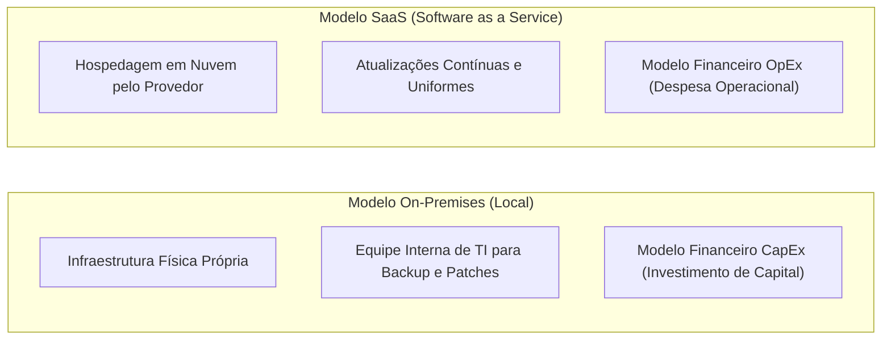
```mermaid
flowchart LR
    subgraph OnPremises["Modelo On-Premises (Local)"]
        direction TB
        OP1["Infraestrutura Física Própria"]
        OP2["Equipe Interna de TI para Backup e Patches"]
        OP3["Modelo Financeiro CapEx (Investimento de Capital)"]
    end

    subgraph SaaS["Modelo SaaS (Software as a Service)"]
        direction TB
        SaaS1["Hospedagem em Nuvem pelo Provedor"]
        SaaS2["Atualizações Contínuas e Uniformes"]
        SaaS3["Modelo Financeiro OpEx (Despesa Operacional)"]
    end
```

| Parâmetro de Comparação | SaaS (Software as a Service) | On-Premises (Instalação Local) |
| :--- | :--- | :--- |
| **Modelo Financeiro** | **OpEx** (*Operational Expenditure*): despesa mensal previsível. | **CapEx** (*Capital Expenditure*): alto investimento em servidores e licenças perpétuas. |
| **Responsabilidade Operacional** | Do provedor (balanceamento, replicação, backups, segurança). | Da equipe interna de TI da empresa contratante. |
| **Controle de Dados** | Custódia em data centers de nuvem gerenciados por terceiros. | Custódia física total nos servidores locais da empresa. |
| **Elasticidade e Escala** | Quase infinita sob demanda (autoscaling de instâncias). | Limitada à capacidade física do hardware adquirido. |
| **Homogeneidade de Versão** | Única base atualizada de forma contínua para todos os usuários. | Fragmentação; clientes podem rodar versões desatualizadas por anos. |

### 6.4 Estilos e Padrões Arquiteturais em Detalhe

#### 1. Arquitetura Cliente-Servidor Clássica

- **Estrutura:** O cliente (geralmente uma aplicação desktop gorda — *Fat Client*) conecta-se diretamente a um servidor de banco de dados centralizado via rede local (LAN).
- **Gargalos e Limitações:**
  1. *Falta de Camada Intermediária:* Regras de negócio ficam espalhadas entre a interface do cliente e *stored procedures* do banco de dados.
  2. *Gargalo de Conexões:* O SGBD precisa manter um socket aberto para cada usuário conectado, esgotando recursos rapidamente.
  3. *Atualização Complexa:* Cada patch de correção exige reinstalar o executável em cada estação de trabalho física da empresa.

#### 2. Arquitetura Orientada a Serviços (SOA)

- **Estrutura:** Decompõe a aplicação corporativa em serviços de negócio autônomos, reutilizáveis e integrados por contratos formais de comunicação (SOAP, WSDL ou REST), tradicionalmente orquestrados por um Barramento Corporativo de Serviços (*Enterprise Service Bus* - ESB).
- **Características:** Comunicação sem estado (*stateless*), desacoplamento de protocolos e interoperabilidade entre tecnologias heterogêneas (serviços legados em COBOL conversando com novos portais em Java).

#### 3. Arquitetura Hexagonal (*Ports and Adapters*)

Proposta por **Alistair Cockburn**, a Arquitetura Hexagonal tem por objetivo central isolar a lógica de negócio e as entidades de domínio de qualquer dependência tecnológica externa (frameworks, bancos de dados, interfaces Web, mensageria).

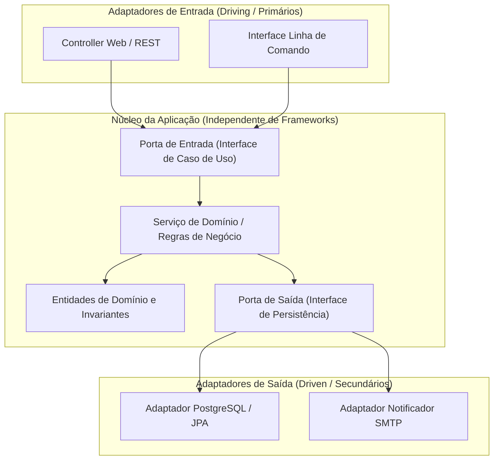
```mermaid
flowchart TD
    subgraph AdaptadoresEntrada["Adaptadores de Entrada (Driving / Primários)"]
        UI["Controller Web / REST"]
        CLI["Interface Linha de Comando"]
    end

    subgraph NucleoHexagono["Núcleo da Aplicação (Independente de Frameworks)"]
        PortIn["Porta de Entrada (Interface de Caso de Uso)"]
        Service["Serviço de Domínio / Regras de Negócio"]
        Entidades["Entidades de Domínio e Invariantes"]
        PortOut["Porta de Saída (Interface de Persistência)"]

        PortIn --> Service
        Service --> Entidades
        Service --> PortOut
    end

    subgraph AdaptadoresSaida["Adaptadores de Saída (Driven / Secundários)"]
        DB["Adaptador PostgreSQL / JPA"]
        Email["Adaptador Notificador SMTP"]
    end

    UI --> PortIn
    CLI --> PortIn
    PortOut --> DB
    PortOut --> Email
```

- **Portas Condutoras (*Driving / Inbound Ports*):** Interfaces de entrada que expõem os casos de uso para o mundo externo. Adaptadores de UI (REST Controllers) chamam essas portas.
- **Portas Conduzidas (*Driven / Outbound Ports*):** Interfaces de saída definidas pelo núcleo para expressar o que ele precisa do mundo externo (ex.: `SalvarPedidoPort`). Adaptadores de infraestrutura (JPA, DAOs, Gateways) implementam essas portas.
- **Regra de Ouro:** A dependência aponta sempre para o centro. O núcleo do domínio desconhece a existência de frameworks, annotations de persistência ou sockets HTTP.

#### 4. Arquitetura de Microsserviços

Decompõe o sistema em um conjunto de serviços autônomos e independentes, organizados em torno de capacidades de negócio (*Bounded Contexts* do Domain-Driven Design).

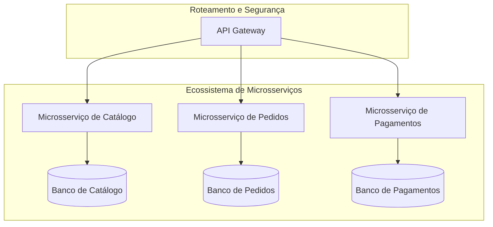
```mermaid
flowchart TD
    subgraph Gateway["Roteamento e Segurança"]
        APIGateway["API Gateway"]
    end

    subgraph Servicos["Ecossistema de Microsserviços"]
        direction TB
        MS1["Microsserviço de Catálogo"] --> DB1[(Banco de Catálogo)]
        MS2["Microsserviço de Pedidos"] --> DB2[(Banco de Pedidos)]
        MS3["Microsserviço de Pagamentos"] --> DB3[(Banco de Pagamentos)]
    end

    APIGateway --> MS1
    APIGateway --> MS2
    APIGateway --> MS3
```

- **Características:**
  1. *Gerenciamento Descentralizado de Dados:* Cada microsserviço possui e isola seu próprio banco de dados (*Database per Service*). É terminantemente proibido um serviço acessar diretamente as tabelas de outro serviço.
  2. *Deploy Independente:* Um patch no serviço de pagamentos pode ser implantado em produção sem recompilar ou reiniciar o catálogo.
  3. *Poliglotismo Tecnológico:* Cada serviço pode ser construído com a linguagem e o banco mais adequados para sua carga de trabalho.
- **Trade-offs e Desafios:**
  - *Consistência Eventual:* Como as transações ACID distribuídas (2PC) deterioram a performance, a consistência de dados entre serviços deve ser garantida por padrões assíncronos (como o padrão Saga).
  - *Latência de Rede e Falhas Parciais:* Chamadas locais na memória são substituídas por requisições HTTP/gRPC sujeitas a timeout, exigindo padrões de resiliência (*Circuit Breaker*, *Retry* com backoff exponencial).
  - *Sobrecarga de Observabilidade:* Monitorar a saúde de dezenas de processos exige telemetria distribuída, rastreamento unificado (*distributed tracing*) e agregação de logs.

#### Antipadrão: Desenvolvimento Orientado a Modismos (*Hype-Driven Development*)

O engenheiro de software deve selecionar a arquitetura baseando-se nas restrições reais de negócio e escala da empresa, e não pela popularidade do momento em fóruns e redes sociais. Adotar microsserviços em equipes pequenas e domínios simples cria complexidade operacional massiva antes de gerar qualquer ganho de escalabilidade.

---

## 7. Estudo Aprofundado do Padrão Arquitetural MVC no Smalltalk-80

### 7.1 Origem Histórica e o Problema da Tela no Xerox PARC

No final da década de 1970, cientistas da computação no **Xerox PARC** (*Palo Alto Research Center*) — incluindo Alan Kay, Dan Ingalls, Adele Goldberg e Trygve Reenskaug — conceberam a interface gráfica moderna (*GUI*), o mouse e o paradigma puramente orientado a objetos em **Smalltalk-76** e **Smalltalk-80**.

Antes dessa inovação, computadores operavam por texto ou lotes lineares (*batch*). No próprio ambiente Smalltalk, a classe primitiva `Pen` permitia a qualquer programa escrever e desenhar diretamente no *framebuffer* global da tela (`DisplayScreen`). Contudo, com a criação do conceito de **múltiplas janelas sobrepostas** convivendo simultaneamente (Browsers de código, Workspaces e Transcripts), programas que desenhavam livremente causavam corrupção visual mútua.

Conforme registrado pelo cientista Steve Burbeck, o padrão **Model-View-Controller (MVC)** nasceu não como mero capricho de design, mas como uma **infraestrutura mandatória para viabilizar o compartilhamento cooperativo da tela e dos periféricos de entrada (teclado e mouse de três botões)** entre múltiplos processos independentes.

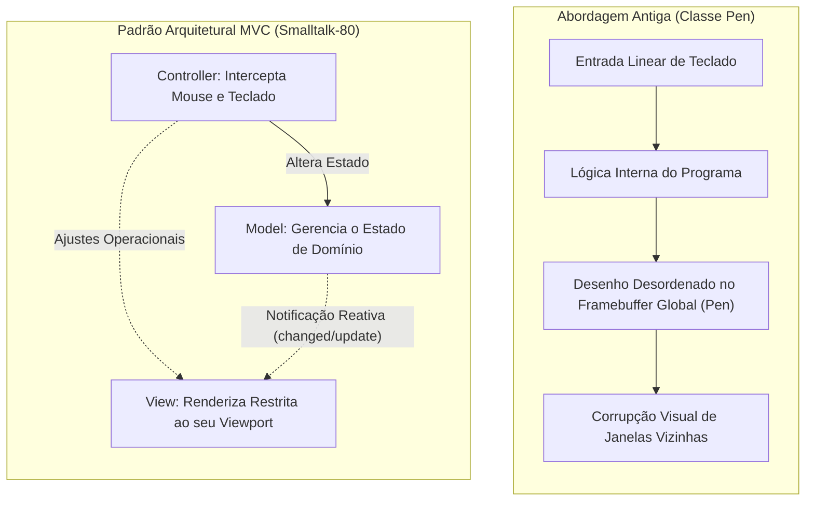
```mermaid
flowchart TD
    subgraph AntigoSmalltalk["Abordagem Antiga (Classe Pen)"]
        direction TB
        A1["Entrada Linear de Teclado"] --> A2["Lógica Interna do Programa"]
        A2 --> A3["Desenho Desordenado no Framebuffer Global (Pen)"]
        A3 --> A4["Corrupção Visual de Janelas Vizinhas"]
    end

    subgraph PadraoMVC["Padrão Arquitetural MVC (Smalltalk-80)"]
        direction TB
        C["Controller: Intercepta Mouse e Teclado"]
        M["Model: Gerencia o Estado de Domínio"]
        V["View: Renderiza Restrita ao seu Viewport"]

        C -->|"Altera Estado"| M
        C -.->|"Ajustes Operacionais"| V
        M -.->|"Notificação Reativa (changed/update)"| V
    end
```

### 7.2 A Tríade Model-View-Controller Clássica

A divisão de responsabilidades no Smalltalk-80 organiza-se em três classes de objetos:

1. **Model (Modelo):** Representa o domínio da aplicação, regras de negócio e dados. É agnóstico quanto à representação visual; desconhece a existência de janelas e telas. Notifica o sistema quando seu estado é modificado.
2. **View (Visão):** Mapeia o estado do modelo na área gráfica da tela alocada para sua janela (*viewport*). Gerencia a estética, bordas e delega o desenho de áreas filhas para subvisões aninhadas.
3. **Controller (Controlador):** Interpreta as ações físicas do usuário capturadas pelos dispositivos de entrada (posicionamento do mouse, cliques de botões e teclas pressionadas), traduzindo-as em requisições de comando para o Modelo ou para a Visão.

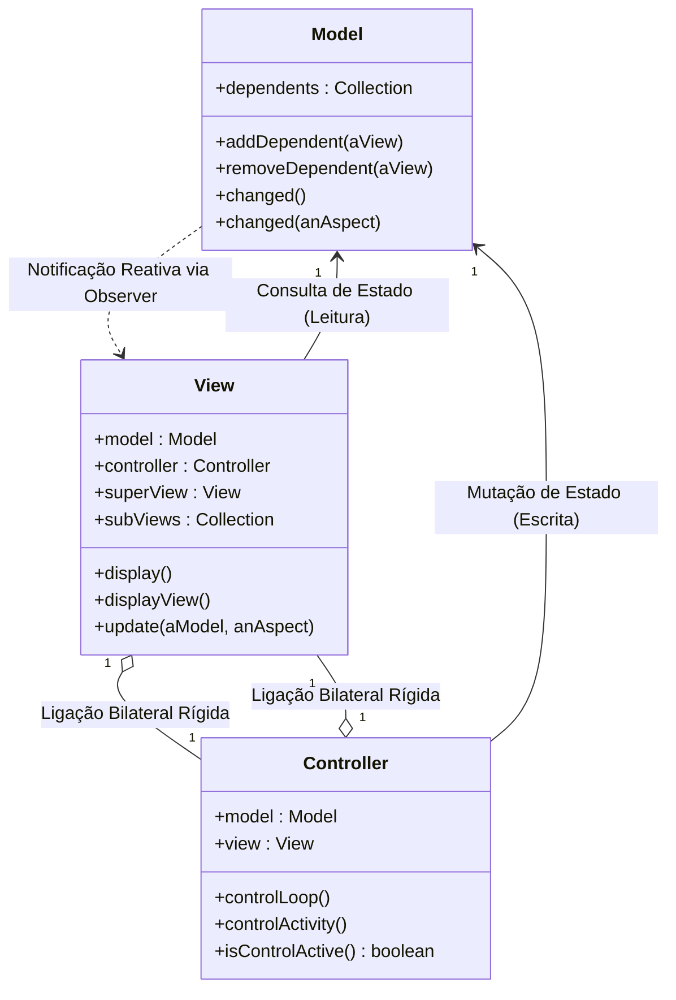
```mermaid
classDiagram
    class Model {
        +dependents : Collection
        +addDependent(aView)
        +removeDependent(aView)
        +changed()
        +changed(anAspect)
    }

    class View {
        +model : Model
        +controller : Controller
        +superView : View
        +subViews : Collection
        +display()
        +displayView()
        +update(aModel, anAspect)
    }

    class Controller {
        +model : Model
        +view : View
        +controlLoop()
        +controlActivity()
        +isControlActive() boolean
    }

    View "1" o-- "1" Controller : Ligação Bilateral Rígida
    Controller "1" o-- "1" View : Ligação Bilateral Rígida
    View --> "1" Model : Consulta de Estado (Leitura)
    Controller --> "1" Model : Mutação de Estado (Escrita)
    Model ..> View : Notificação Reativa via Observer
```

#### Anatomia do Acoplamento na Tríade

Existe uma diferença fundamental nos canais de comunicação da tríade:

- **Canal Direto e Rígido (View-Controller):** A View possui uma referência de instância explícita para o seu Controller, e o Controller possui uma referência direta para a sua View (ligação 1:1 bilateral). O ciclo de vida de ambos é fortemente entrelaçado.
- **Canal Indireto e Reativo (Model-View):** O Model **não** mantém referências nominais diretas às suas Views. Ele interage com a View unicamente através de uma lista abstrata de dependentes do padrão **Observer**, disparando notificações genéricas. O Modelo nunca é acoplado às classes visuais que o observam.

### 7.3 Modelos Passivos versus Modelos Ativos

Steve Burbeck classifica os modelos no Smalltalk em duas naturezas de operação:

#### Modelos Passivos

O modelo é alterado **exclusivamente por ordens originadas do próprio Controller associado à sua tríade**.
- *Exemplo:* Um editor de textos simples WYSIWYG cujo modelo subjacente é uma instância pura da classe `String`.
- *Dinâmica:* O usuário digita uma letra -> o `Controller` intercepta o evento -> o `Controller` muta o objeto `String` -> o próprio `Controller` pode ordenar à `View` que se redesenhe.
- *Propriedade:* O objeto de modelo não precisa manter lista de dependentes nem herdar de classes especiais; funciona como um repositório passivo de dados.

#### Modelos Ativos

O modelo tem seu estado mutado por **múltiplos controladores concorrentes ou por processos e threads em segundo plano (*background*)**.
- *Exemplo Canônico:* A classe `SystemTranscript` (o console de logs do Smalltalk) ou relógios do sistema. Qualquer processo em execução pode emitir `Transcript show: 'Alerta'`.
- *Dinâmica:* A alteração de estado ocorre de forma imprevisível para a View e para o Controller. Portanto, a responsabilidade de emitir a notificação recai compulsoriamente sobre o próprio Modelo.
- *Propriedade:* O modelo herda de classes com capacidade reativa e dispara a mensagem `self changed`, fazendo com que todas as janelas que o observam recebam `update:` e se atualizem.

```mermaid
sequenceDiagram
    autonumber
    actor Dev as Processo em Background
    participant M as Modelo Ativo (SystemTranscript)
    participant V as View (TextCollectorView)
    participant C as Controller (TextCollectorController)

    Dev->>M: show("Serviço Iniciado")
    activate M
    M->>M: alterarBufferInterno()
    M->>M: self changed
    Note over M,V: Disparo Reativo via Observer
    M->>V: update: self with: #append
    deactivate M
    activate V
    V->>M: consultarNovasLinhas()
    activate M
    M-->>V: retorna texto atualizado
    deactivate M
    V->>V: displayView()
    deactivate V
```

### 7.4 O Mecanismo Reativo changed / update:

#### A Evolução: DependentFields versus Classe Model

- **Smalltalk-80 Versão 2.0:** Qualquer objeto podia ser observado. Para evitar que classes primitivas (como `Integer` ou `Array`) gastassem memória reservando ponteiros para visões, a linguagem utilizava uma variável de classe global em `Object` chamada `DependentFields`. Essa variável era um dicionário de identidade hash (`IdentityDictionary`). As chaves eram os modelos; os valores eram coleções de visões dependentes. O problema dessa abordagem era a contenção de concorrência e vazamentos de memória caso a desvinculação não fosse explícita.
- **Smalltalk-80 Versão 2.5:** Introduziu a classe abstrata de base `Model`. A classe incorporou uma variável de instância dedicada chamada `dependents`. Para otimizar o consumo de memória, a variável `dependents` operava sob três estados:
  1. `nil`: quando o modelo não possuía nenhum observador.
  2. Referência direta ao próprio objeto observador: quando havia apenas uma única View cadastrada (economizando a alocação de uma lista).
  3. Instância de `DependentsCollection`: quando dois ou mais dependentes estavam vinculados.

#### O Protocolo Reativo

A comunicação de atualização obedece a um protocolo formal:

```smalltalk
"Disparo no emissor (Model):"
self changed.              "Notificacao generica"
self changed: #aspecto.    "Notificacao parametrizada indicando o que mudou"

"Recepcao no receptor (View):"
update: aModel
    "Executado por padrao: redesenha a tela inteira"
    self display.

update: aModel with: anAspect
    "Executado quando o modelo passa um aspecto especifico"
    (anAspect == #novoItem) ifTrue: [ self redesenharLista ].
```

### 7.5 Hierarquia Visual e de Controle no Smalltalk-80

```mermaid
flowchart TD
    subgraph ArvoreVisual["Composição Visual (Padrão Composite)"]
        TV["TopView (Janela Principal / Moldura Externa)"]
        TV --> SV1["SubView 1 (Menu Superior de Ações)"]
        TV --> SV2["SubView 2 (Área de Texto Principal)"]
        TV --> SV3["SubView 3 (Barra de Rolagem / Scroll)"]
    end

    subgraph ArvoreControle["Controle Cooperativo de Eventos"]
        SC["ScheduledControllers (Fila do ControlManager)"]
        SC --> TC["TopController (Janela em Foco)"]
        TC --> CC1["SubController 1 (Controlador do Menu)"]
        TC --> CC2["SubController 2 (ParagraphEditor)"]
    end
```

#### Composição Visual: TopView e SubViews

A montagem gráfica apoia-se no padrão **Composite**:
- **TopView:** Instância de topo que representa a janela completa, contendo a moldura externa, título, botões de colapso e enquadramento de tela (*framing*).
- **SubViews:** Componentes visuais aninhados no interior da `TopView` (caixas de listagem, painéis de texto, botões e barras de rolagem).

#### Pipeline de Renderização Gráfica

A renderização na tela obedece a uma cascata hierárquica bem definida:

1. `display`: Método de entrada principal que dispara o ciclo de desenho.
2. `displayBorder`: Desenha a borda e os limites geométricos da visão.
3. `displayView`: Desenha o conteúdo interno e elementos gráficos específicos alocados naquele viewport.
4. `displaySubviews`: Itera sobre a coleção de subvisões filhas, disparando recursivamente a rotina de exibição em cada uma.

#### Transformações Geométricas com WindowingTransformation

A `View` desenha seus elementos utilizando coordenadas relativas internas (iniciando em `0@0`). A classe **`WindowingTransformation`** é a estrutura matemática responsável por traduzir bidirecionalmente essas coordenadas relativas internas para coordenadas absolutas da tela física (*Display Coordinates*), aplicando matrizes de escala e translação espacial.

#### Controle Cooperativo de Eventos: ScheduledControllers e o Mouse de Três Botões

O ambiente gráfico do Smalltalk-80 operava com um modelo de execução *unithread* cooperativo. A coordenação dos periféricos era conduzida pela classe **`ControlManager`** e sua lista de controladores agendados (**`ScheduledControllers`**):

1. **Loop de Controle:** O `ControlManager` monitora continuamente a posição do cursor na tela física.
2. **Transferência de Controle:** Quando o cursor entra nos limites delimitados da janela de uma `TopView`, o `ControlManager` transfere o laço de eventos para o controlador daquela janela (`TopController`).
3. **Delegação Interna:** O `TopController` interroga seus subcontroladores para identificar qual elemento visual possui o foco, delegando o método `controlActivity`.
4. **Semântica do Mouse de Três Botões do Smalltalk:**
   - **Botão Vermelho (Red Button - Esquerdo):** Interação e manipulação direta sobre o conteúdo interno da visão (posicionar cursor de texto, selecionar linhas de uma lista, arrastar controles).
   - **Botão Amarelo (Yellow Button - Central):** Abertura do menu de contexto específico da aplicação associada àquela visão particular (operações de editar, recortar, compilar código, buscar texto).
   - **Botão Azul (Blue Button - Direito):** Abertura do menu global de gerenciamento de janelas da infraestrutura operacional (redimensionar janela, mover, minimizar, colapsar ou fechar).

---

## 8. Estudos de Caso Integradores e Atividades Práticas

### 8.1 Estudo de Caso: Plataforma de Food Delivery (Aula 06)

O estudo de caso aborda uma plataforma de entrega de comida operando como um mercado multifacetado (*multilateral marketplace*), integrando três papéis principais com expectativas distintas:

1. **Cliente:** Busca comodidade, variedade gastronômica, rastreamento do pedido e pagamento seguro.
2. **Restaurante:** Busca gestão de pedidos recebidos, controle do cardápio, aumento de receita e pontualidade na produção da cozinha.
3. **Administrador:** Busca auditoria de segurança, sustentação de infraestrutura, moderação de avaliações abusivas e análise de lucratividade corporativa.

#### Fluxo de Valor de Ponta a Ponta

```mermaid
sequenceDiagram
    autonumber
    actor C as Cliente
    participant App as Aplicativo Delivery
    actor R as Restaurante
    actor A as Administrador

    C->>App: Busca restaurantes e monta carrinho
    App-->>C: Exibe resumo e cálculo de frete
    C->>App: Conclui checkout e efetua pagamento
    App->>App: Autoriza pagamento via Gateway
    App->>R: Alerta de novo pedido (Pendente)
    R->>App: Aceita pedido e inicia produção (Em Preparo)
    App-->>C: Notifica início do preparo
    R->>App: Despacha com entregador (A Caminho)
    App-->>C: Notifica despacho do pedido
    R->>App: Confirma conclusão da entrega (Entregue)
    App-->>C: Solicita avaliação do serviço
    C->>App: Envia nota (1 a 5) e comentário
    App->>A: Registra métricas e atualiza dashboards
```

#### Catálogo Estruturado de Requisitos

- **Requisitos Funcionais (RF):**
  - `RF-001:` O sistema deve permitir a busca de estabelecimentos filtrando por categoria culinária, faixa de preço e raio de distância.
  - `RF-002:` O sistema deve permitir ao cliente a gestão de itens no carrinho de compras com inserção de observações de preparo.
  - `RF-003:` O sistema deve processar pagamentos nas modalidades Pix, Cartão de Crédito e Dinheiro na entrega.
  - `RF-004:` O sistema deve permitir ao restaurante manter o catálogo de pratos (CRUD completo com fotos e preços).
  - `RF-005:` O restaurante deve transicionar os estados operacionais do pedido (`Pendente` -> `Em Preparo` -> `A Caminho` -> `Entregue` -> `Cancelado`).
  - `RF-006:` O administrador deve poder auditar transações financeiras e moderar comentários públicos ofensivos.
- **Requisitos Não Funcionais (RNF):**
  - `RNF-001 (Desempenho):` A notificação de transição de status do pedido deve ser entregue na tela do cliente em até 500 milissegundos via WebSocket.
  - `RNF-002 (Disponibilidade):` A infraestrutura central de recebimento de pedidos deve operar com nível de disponibilidade (SLA) de 99,9% durante os horários de pico (11h-14h e 18h-23h).
  - `RNF-003 (Segurança):` Todos os dados de cartão e credenciais de login devem ser protegidos em trânsito com TLS 1.3 e armazenados com criptografia padrão AES-256.

#### Matriz MoSCoW do Delivery

| Categoria | Funcionalidades Incluídas | Justificativa de Engenharia |
| :--- | :--- | :--- |
| **Must Have** | Autenticação; Manutenção de Cardápio; Carrinho; Checkout; Pagamento; Transição básica de status do pedido. | Sem esse núcleo, a transação comercial de entrega é impossível. Compoe o MVP vital da plataforma. |
| **Should Have** | Notificações push em tempo real; Rastreamento de pedidos via mapa; Moderação de avaliações pelo Administrador. | Críticos para retenção e governança. Podem ser substituídos por alertas simples e consulta manual no lançamento. |
| **Could Have** | Chat síncrono entre Cliente e Restaurante; Programa gamificado de fidelidade e pontos; Cupons de desconto customizados. | Acrescentam conveniência e diferenciação competitiva, mas sua ausência não inviabiliza as entregas. |
| **Won't Have** | Algoritmo de roteirização por IA preditiva; Entrega colaborativa por motoristas terceiros avulsos estilo Uber. | Complexidade matemática e de infraestrutura que desviaria o foco da estabilização da arquitetura central. |

#### Diagrama de Casos de Uso Geral

```mermaid
flowchart LR
    subgraph AtoresClientes[" "]
        Cliente((Cliente))
    end

    subgraph FronteiraSistema["Sistema de Delivery de Comida"]
        UC1(["Buscar Restaurantes"])
        UC2(["Fazer Pedido"])
        UC3(["Acompanhar Pedido"])
        UC4(["Avaliar Estabelecimento"])
        UC5(["Realizar Pagamento"])
        UC6(["Interagir no Chat"])

        UC7(["Gerenciar Cardápio"])
        UC8(["Controlar Pedidos Recebidos"])
        UC9(["Atualizar Status do Pedido"])

        UC10(["Autenticar Usuário"])
        UC11(["Gerenciar Contas"])
        UC12(["Moderar Avaliações"])
        UC13(["Visualizar Desempenho"])
    end

    subgraph AtoresOperacionais[" "]
        Restaurante((Restaurante))
        Admin((Administrador))
        GatewayBank((Gateway Bancário))
    end

    Cliente --> UC1
    Cliente --> UC2
    Cliente --> UC3
    Cliente --> UC4
    Cliente --> UC6

    Restaurante --> UC7
    Restaurante --> UC8
    Restaurante --> UC9
    Restaurante --> UC6

    Admin --> UC11
    Admin --> UC12
    Admin --> UC13

    UC2 -.->|"<<include>>"| UC5
    UC5 --- GatewayBank
    UC2 -.->|"<<include>>"| UC10
    UC7 -.->|"<<include>>"| UC10
    UC11 -.->|"<<include>>"| UC10
    UC8 -.->|"<<include>>"| UC9
```

#### Diagrama de Classes do Domínio de Delivery

```mermaid
classDiagram
    class Usuario {
        -String id
        -String nome
        -String email
        -String senhaHash
        +autenticar(String senha) boolean
    }

    class Cliente {
        -String telefone
        -String enderecoPadrao
        +fazerPedido() Pedido
    }

    class Restaurante {
        -String cnpj
        -String categoriaCulinaria
        -double taxaEntregaBase
        +adicionarPrato(Prato p) void
    }

    class Prato {
        -String codigo
        -String nome
        -String descricao
        -double preco
        -boolean disponivel
    }

    class Pedido {
        -String numeroIdentificador
        -LocalDateTime dataHora
        -String status
        -double valorTotal
        +adicionarItem(Prato p, int qtd) void
        +calcularTotal() double
        +transicionarStatus(String novoStatus) void
    }

    class ItemPedido {
        -int quantidade
        -double precoGravado
        -String observacao
        +calcularSubtotal() double
    }

    Usuario <|-- Cliente : Generalizacao
    Usuario <|-- Restaurante : Generalizacao
    Restaurante "1" *-- "0..*" Prato : Possui (Composicao)
    Cliente "1" --> "0..*" Pedido : Realiza
    Pedido "1" *-- "1..*" ItemPedido : Composicao
    ItemPedido "0..*" --> "1" Prato : Referencia
```

### 8.2 Estudo de Caso: Atividade Aula 3 (Logística Hospitalar e Separação de Papéis)

A Atividade 3 consolida a transição entre a dor do negócio e a especificação técnica formal, exigindo a segregação estrita de papéis:

- **Stakeholder (Perspectiva de Negócio):** Focado nas dores operacionais, prejuízos financeiros, queixas de equipe e metas corporativas.
- **Analista de Sistemas (Perspectiva de Engenharia):** Focado na escuta ativa, desconstrução em causas raiz, delimitação de escopo e formalização de requisitos funcionais, não funcionais e modelos UML.

#### Simulação do Caso de Logística Reversa de Equipamentos Hospitalares

- **Contexto:** Locadora de equipamentos de alta complexidade médica (ventiladores pulmonares, monitores e bombas de infusão contínua).
- **Problema (Visão do Stakeholder):**
  > *"Perdemos o controle dos ventiladores pulmonares. No último trimestre, 14 aparelhos sumiram sem sabermos se estão no caminhão de frete, no hospital cliente ou no conserto. Para piorar, fomos notificados pela Vigilância Sanitária porque equipamentos foram entregues com laudo de calibração metrológica expirado há 60 dias."*
- **Diagnóstico da Causa Raiz (Técnica dos 5 Porquês pelo Analista):**
  1. *Por que os aparelhos somem?* Porque a conferência na coleta é feita em papel carbonado com anotação ilegível.
  2. *Por que a anotação é ilegível?* Porque os motoristas não validam os números de série no momento do recolhimento.
  3. *Por que não validam?* Porque não possuem ferramenta móvel de leitura ótica de código de barras ou RFID.
  4. *Por que as calibrações vencem sem aviso?* Porque os registros de validade ficam arquivados em fichários físicos no almoxarifado.
  5. *Causa Raiz:* Inexistência de um sistema digital unificado com aplicativo móvel para leitura de ativos no ato da coleta e rotina automatizada de alerta de expiração metrológica.
- **Solução Técnica Formalizada (Visão do Analista):**
  - `RF-01 (Leitura Obrigatória na Coleta):` O aplicativo do motorista deve exigir a leitura do código de barras de cada equipamento para liberar o encerramento da ordem de coleta.
  - `RF-02 (Alerta de Calibração):` O sistema deve bloquear a alocação de qualquer equipamento hospitalar cujo certificado de calibração esteja a menos de 15 dias do vencimento.
  - `RNF-01 (Disponibilidade Offline):` O aplicativo de coleta deve permitir o registro das movimentações em modo offline, sincronizando os dados automaticamente assim que restabelecida a conexão móvel.

---

## 9. Caderno de Questões de Fixação e Preparação para Provas

### Questão 1 (Fundamentos do Ciclo de Vida e Papéis de Engenharia)
**Enunciado:** Um cliente da área industrial procura uma software house e afirma: *"Preciso urgentemente que sua equipe desenvolva um aplicativo móvel moderno para melhorar as vendas da minha fábrica, pois as planilhas atuais estão lentas."* O gerente do projeto aceita o contrato e determina que os programadores iniciem imediatamente a codificação das telas e das tabelas de banco de dados. 
Avalie criticamente a conduta do gerente à luz do ditado enfatizado na disciplina (*"Software não é feito em pastelaria"*) e distinga o papel da Análise ("fazer a coisa certa") em relação ao Projeto ("fazer certo a coisa").

**Resposta Explicada:**
A atitude do gerente de projeto configura negligência metodológica grave. Ao iniciar a codificação direta a partir de uma fala genérica do cliente, a equipe comete o antipadrão da "pastelaria", confundindo a construção de software com uma linha de montagem instantânea. A fala do cliente contém apenas queixas subjetivas ("melhorar as vendas", "aplicativo moderno", "planilhas lentas") e não requisitos de software verificáveis. 
A **Análise** tem como responsabilidade primordial **"fazer a coisa certa"**: ela deve investigar os processos atuais (*As-Is*), elicitar as necessidades reais dos operadores, desmascarar causas raiz de atraso e delimitar os requisitos funcionais e não funcionais que comporão o escopo do produto. Pular a análise implica construir um sistema que corre altíssimo risco de resolver o problema errado.
O **Projeto**, por sua vez, foca em **"fazer certo a coisa"**: estruturar a arquitetura técnica, definir padrões de classes, diagramas de sequência, interfaces seguras e regras de banco de dados para que a solução seja performática e manutenível. Iniciar a codificação sem análise nem projeto gera débitos técnicos imediatos, retrabalho massivo e falhas operacionais em produção.

---

### Questão 2 (Técnicas de Elicitação e Ambiguidade)
**Enunciado:** Durante uma reunião de levantamento de requisitos para um sistema bancário, o gerente de contas declara ao analista: *"O sistema de transferências precisa ser extremamente rápido e seguro."*
a) Por que termos como "rápido" e "seguro" são considerados anti-requisitos enquanto não forem refatorados?
b) Refatore ambas as declarações, estruturando dois Requisitos Não Funcionais (RNF) formais, verificáveis e passíveis de medição por testes de engenharia.

**Resposta Explicada:**
a) Termos como "rápido", "seguro", "intuitivo" e "robusto" são anti-requisitos porque expressam julgamentos de valor puramente subjetivos e qualitativos. Eles não fornecem limites computacionais objetivos, impedindo que a equipe de engenharia crie testes automatizados de aprovação/rejeição e gerando indefinição contratual quanto aos critérios de aceite da entrega.
b) Refatoração formal em Requisitos Não Funcionais:
- **RNF-001 (Desempenho):** *"O processamento de transferências Pix deve apresentar tempo de resposta de ponta a ponta inferior a 1,5 segundo para 99% das requisições (p99), suportando uma carga nominal contínua de 500 transações por segundo."*
- **RNF-002 (Segurança):** *"Toda comunicação de transferência bancária deve trafegar sob protocolo criptográfico TLS 1.3 com cifras seguras, exigindo autenticação mútua (mTLS) entre os serviços de retaguarda e aplicação de hash criptográfico Argon2id para chaves transacionais."*

---

### Questão 3 (Modelagem de Casos de Uso: Include versus Extend)
**Enunciado:** Analise o fragmento de requisitos de uma plataforma de comércio eletrônico:
1. Ao realizar uma compra, o cliente obrigatoriamente precisa se autenticar no sistema.
2. Durante o encerramento da compra, o cliente pode, caso possua um código promocional válido, inserir um cupom para abater o valor final.
Modelado em UML:
a) Qual relacionamento deve ser aplicado entre `Realizar Compra` e `Autenticar Usuário`? Justifique a escolha e indique a direção da seta.
b) Qual relacionamento deve ser aplicado entre `Realizar Compra` e `Aplicar Cupom Promocional`? Justifique a escolha e indique a direção da seta.

**Resposta Explicada:**
a) Deve-se utilizar o relacionamento **`<<include>>` (Inclusão)**. A inclusão é obrigatória e incondicional: o caso de uso base (`Realizar Compra`) não pode ser concluído com sucesso sem executar as etapas de `Autenticar Usuário`. A direção da seta tracejada parte do caso de uso base em direção ao caso de uso incluído:
`Realizar Compra -.->|<<include>>| Autenticar Usuário`.
b) Deve-se utilizar o relacionamento **`<<extend>>` (Extensão)**. A extensão é condicional e opcional: a lógica de aplicar cupom só ocorre se o cliente desejar e satisfizer a condição de posse de um código válido; a compra pode prosseguir e ser finalizada normalmente sem a existência do cupom. A direção da seta tracejada parte do caso de uso acessório (extensão) em direção ao caso de uso base:
`Aplicar Cupom Promocional -.->|<<extend>>| Realizar Compra`.

---

### Questão 4 (Diagrama de Classes: Agregação versus Composição)
**Enunciado:** Explique a diferença semântica e estrutural entre uma Agregação e uma Composição no Diagrama de Classes da UML. Para cada um dos conceitos:
a) Descreva a representação gráfica padronizada (símbolo).
b) Explique o acoplamento do ciclo de vida entre a classe "Todo" e a classe "Parte".
c) Apresente um exemplo do mundo real do domínio educacional ou comercial.

**Resposta Explicada:**
a) **Representação Gráfica:**
- *Agregação:* Representada por uma linha de associação com um **losango vazio (branco)** na extremidade conectada à classe "Todo".
- *Composição:* Representada por uma linha de associação com um **losango preenchido (preto)** na extremidade conectada à classe "Todo".
b) **Ciclo de Vida:**
- *Agregação (Todo-Parte Fraco):* O ciclo de vida da "Parte" é independente do ciclo de vida do "Todo". Se o objeto agregador for destruído ou removido do sistema, as instâncias que compunham a agregação continuam existindo de forma autônoma.
- *Composição (Todo-Parte Forte):* O ciclo de vida da "Parte" é estritamente dependente e subordinado ao "Todo". A classe "Todo" possui a posse exclusiva das "Partes". Se o objeto proprietário for eliminado, todos os seus objetos componentes são compulsoriamente eliminados em cascata.
c) **Exemplos:**
- *Exemplo de Agregação:* `Universidade` e `Professor`. Se a instituição de ensino encerrar suas atividades, os professores continuam existindo como indivíduos no mercado.
- *Exemplo de Composição:* `NotaFiscal` e `ItemNotaFiscal`. Se uma nota fiscal for cancelada ou excluída da base de dados, suas linhas individuais de itens perdem a razão de existir e são destruídas.

---

### Questão 5 (Arquitetura de Software: SaaS versus On-Premises)
**Enunciado:** Um hospital regional avalia a modernização de seu sistema de Prontuário Eletrônico do Paciente (PEP). A diretoria financeira defende a adoção de um modelo SaaS na nuvem, enquanto o comitê de segurança médica e jurídica prefere uma solução On-Premises. 
Analise comparativamente os dois modelos considerando:
a) O modelo de desembolso financeiro (CapEx versus OpEx).
b) A responsabilidade pela aplicação de correções (*patches*) e rotinas de salvaguarda (*backup*).
c) O controle sobre a privacidade de dados e sigilo regulatório.

**Resposta Explicada:**
a) **Modelo Financeiro:**
- *On-Premises:* Opera primordialmente sob **CapEx** (*Capital Expenditure*). Exige desembolso financeiro antecipado vultoso para a aquisição física de servidores de alta performance, switches, nobreaks, ar-condicionado de precisão para CPD e licenças perpétuas de software.
- *SaaS:* Opera sob **OpEx** (*Operational Expenditure*). Elimina o investimento inicial em infraestrutura própria, transformando o custo em despesa operacional mensal ou anual previsível por usuário ativo ou volume de prontuários.
b) **Correções e Backups:**
- *On-Premises:* A responsabilidade é inteiramente da equipe técnica interna do hospital. Se os técnicos esquecerem de executar rotinas de backup ou tardarem a aplicar patches de segurança contra malwares, o hospital arcará com as perdas e paradas de serviço.
- *SaaS:* A responsabilidade técnica é transferida contratualmente para o provedor do serviço de nuvem, que conta com equipes dedicadas, rotinas automatizadas de replicação geográfica de dados e atualizações transparentes.
c) **Privacidade e Sigilo:**
- *On-Premises:* Garante soberania física e lógica absoluta sobre a custódia das bases de dados, reduzindo riscos de quebra de sigilo por vazamentos em nuvens públicas compartilhadas (fator crítico para auditorias médicas e conformidade com a LGPD).
- *SaaS:* Os dados de saúde residem em infraestruturas distribuídas de terceiros, exigindo rigoroso contrato de nível de serviço (SLA), auditorias de conformidade (SOC 2, ISO 27001) e garantias formais de isolamento (*multitenancy*) seguro.

---

### Questão 6 (Arquitetura Hexagonal: Ports and Adapters)
**Enunciado:** A Arquitetura Hexagonal (Ports and Adapters), proposta por Alistair Cockburn, busca isolar o núcleo da aplicação.
a) Qual é o objetivo de manter as entidades e regras de negócio agnósticas a frameworks e bibliotecas de interface?
b) Diferencie Portas Condutoras (*Driving/Inbound Ports*) de Portas Conduzidas (*Driven/Outbound Ports*), exemplificando como um banco de dados relacional se encaixa nessa estrutura.

**Resposta Explicada:**
a) O objetivo central é proteger as regras essenciais do negócio contra a volatilidade tecnológica externa. Frameworks Web, bibliotecas ORM, protocolos de rede e bancos de dados mudam ou se tornam obsoletos com frequência muito maior do que as regras de negócio de uma empresa. Mantendo o domínio puro em classes POJO/Java sem dependências de infraestrutura, o sistema ganha alta testabilidade (permite testar todas as regras sem subir banco ou servidor Web) e facilidade de substituição tecnológica.
b) **Diferenciação:**
- *Portas Condutoras (Driving / Inbound):* São interfaces públicas providas pelo núcleo de domínio que expõem os casos de uso para o ambiente externo. São consumidas pelos adaptadores de entrada (ex.: um `PedidoController` REST que chama a interface `CriarPedidoUseCase`).
- *Portas Conduzidas (Driven / Outbound):* São interfaces definidas pelo núcleo de domínio para declarar as operações que ele precisa requisitar ao mundo externo (ex.: salvar dados, disparar e-mail). 
- *Encaixe do Banco de Dados:* O núcleo declara uma interface de saída como `PedidoRepositoryPort` contendo o método `salvar(Pedido p)`. Um adaptador de infraestrutura externo (`PostgresPedidoRepository`) implementa essa interface utilizando comandos JPA/Hibernate ou SQL. Dessa forma, a seta de dependência lógica aponta do banco de dados para o domínio, e não o inverso (Inversão de Dependências).

---

### Questão 7 (Smalltalk-80 e MVC: Origem e a Classe Pen)
**Enunciado:** Por que o padrão arquitetural MVC precisou ser criado no ambiente Smalltalk-80 durante as pesquisas no Xerox PARC? Explique o papel da classe primitiva `Pen` e como o MVC solucionou o compartilhamento do espaço de tela entre múltiplas janelas.

**Resposta Explicada:**
No início das interfaces gráficas no Xerox PARC, aplicações desenhavam diretamente na memória de vídeo (*framebuffer*) por meio de comandos da classe primitiva `Pen`. Quando a computação interativa evoluiu para a existência de múltiplas janelas sobrepostas convivendo simultaneamente na tela (Browsers de código, Workspaces e consoles de sistema), programas que utilizavam a classe `Pen` de forma desordenada escreviam arbitrariamente sobre a tela inteira, corrompendo visualmente os dados e desenhos das janelas vizinhas. 
O padrão MVC foi criado não apenas para separar lógica de apresentação, mas como uma **infraestrutura disciplinada de engenharia para viabilizar a cooperação espacial e o compartilhamento harmonioso do hardware gráfico e dos dispositivos de entrada**. Com o MVC, a `View` passou a ter sua área de desenho estritamente delimitada pelo seu próprio retângulo de visualização (*viewport*), enquanto o `Controller` coordenava a captura cooperativa dos cliques e digitações sob a supervisão do `ControlManager`, eliminando o caos visual provocado pela abordagem antiga.

---

### Questão 8 (Smalltalk-80: Modelos Ativos versus Passivos)
**Enunciado:** Steve Burbeck, em seu ensaio técnico sobre o MVC no Smalltalk-80, divide os modelos em duas classes: Modelos Passivos e Modelos Ativos.
a) Explique a dinâmica de funcionamento de um Modelo Passivo, citando um exemplo típico.
b) Explique a dinâmica de funcionamento de um Modelo Ativo e justifique por que o exemplo do `SystemTranscript` exige a emissão do método `self changed`.

**Resposta Explicada:**
a) Um **Modelo Passivo** é aquele cujo estado interno é modificado única e exclusivamente por ordens diretas originadas do controlador da sua própria tríade MVC. Um exemplo clássico é uma instância pura de `String` que serve de modelo para um campo simples de digitação de texto. Como o controlador da janela foi o único agente causador da alteração, ele próprio tem conhecimento exato do que mudou e pode instruir diretamente a visão a se redesenhar. O modelo não precisa manter lista de observadores nem emitir notificações ativas.
b) Um **Modelo Ativo** tem seu estado alterado por entidades externas à sua tríade imediata, tais como outros controladores, janelas concorrentes ou processos em segundo plano (*background*). O exemplo canônico é o `SystemTranscript` (console global de saída do sistema). Qualquer rotina no ambiente pode disparar uma mensagem de log (`Transcript show: '...'`). Como a visão e o controlador da janela do Transcript não têm como prever quando um processo concorrente enviará texto, a responsabilidade de avisar o sistema recai compulsoriamente sobre o próprio modelo. Assim que o buffer de texto recebe dados, o modelo executa `self changed`, acionando o mecanismo de dependências para que todas as visões abertas recebam a mensagem `update:` e redesenhem a tela com os novos registros.

---

### Questão 9 (Smalltalk-80: Acoplamento View-Controller versus Model-View)
**Enunciado:** No padrão MVC clássico do Smalltalk-80, o acoplamento entre a Visão e o Controlador possui características estruturais profundamente diferentes do acoplamento entre o Modelo e a Visão. Compare esses dois relacionamentos detalhando os mecanismos de ligação e a proporção de instâncias.

**Resposta Explicada:**
- **Ligação View-Controller (Acoplamento Direto e Forte):** A relação entre a Visão e o Controlador é estrita, bilateral e direta na proporção de **1:1**. A `View` mantém uma variável de instância apontando explicitamente para seu `Controller`, e o `Controller` mantém um ponteiro explícito para sua `View`. Eles são criados e destruídos em conjunto; um controlador foi projetado para manipular especificamente os eventos daquela visão associada.
- **Ligação Model-View (Acoplamento Fraco e Reativo via Observer):** A relação é indireta e baseada no desacoplamento da proporção **1:N**. O `Model` **não** conhece a identidade concreta das visões que o exibem. Ele mantém unicamente uma lista genérica de objetos dependentes (*dependents*). Quando ocorre mutação de dados, o modelo dispara uma notificação genérica (`changed`), e a infraestrutura se encarrega de chamar o método `update:` em cada dependente registrado. Isso permite que um mesmo modelo de domínio seja observado simultaneamente por múltiplas visões distintas (ex.: uma visão gráfica em pizza e uma visão tabular) sem que o modelo precise ser alterado ou acoplado à interface visual.

---

### Questão 10 (Evolução de Dependências: Smalltalk-80 v2.0 versus v2.5)
**Enunciado:** O mecanismo de notificação de dependências do Smalltalk-80 passou por uma reformulação estrutural importante entre a versão v2.0 e a versão v2.5. Explique como funcionava o dicionário `DependentFields` na versão v2.0, quais problemas de performance ele provocava e como a introdução da classe abstrata `Model` na versão v2.5 solucionou esse gargalo de engenharia.

**Resposta Explicada:**
Na versão **Smalltalk-80 v2.0**, todo objeto no ambiente herdava de `Object` a capacidade de ser um modelo e ter dependentes. Para que instâncias de classes primitivas (como `Integer`, `String` e `Array`) pudessem atuar como modelos sem onerar a memória de instâncias comuns que nunca participariam de interfaces gráficas, o sistema implementava uma variável de classe global em `Object` denominada `DependentFields`. Esta variável era uma tabela hash de identidade global (`IdentityDictionary`), onde a chave era o objeto modelo e o valor era uma coleção (`OrderedCollection`) com seus observadores. O problema dessa abordagem residia na contenção de acesso à tabela global única, alto custo de processamento nas operações de busca por hash em sistemas com milhares de objetos e vazamentos de memória (*memory leaks*) caso instâncias mortas não fossem removidas explicitamente do dicionário global.
Para sanar esse gargalo, a versão **Smalltalk-80 v2.5** introduziu a classe abstrata **`Model`**. O mecanismo de dependências foi movido para fora de `Object` genérico. A classe `Model` passou a carregar uma variável de instância dedicada chamada `dependents`. Para otimizar o uso da memória, essa variável podia assumir três estados otimizados: `nil` (sem nenhum dependente, ocupando apenas um ponteiro nulo), uma referência direta a um único objeto (quando havia apenas uma visão observando, sem gastar memória alocando listas) ou uma coleção `DependentsCollection` (quando duas ou mais visões estavam registradas). Isso eliminou o gargalo da tabela hash global e acelerou as notificações reativas.

---

### Questão 11 (Controle Cooperativo e Mouse de Três Botões no Smalltalk)
**Enunciado:** O Smalltalk-80 utilizava um mouse clássico com três botões, formalmente referenciados por cores: Botão Vermelho (*Red Button*), Botão Amarelo (*Yellow Button*) e Botão Azul (*Blue Button*).
a) Qual era a atribuição semântica de cada um desses botões no fluxo de trabalho de uma aplicação em MVC?
b) Como o `ControlManager` e o `ScheduledControllers` gerenciavam a passagem de controle entre janelas em um ambiente unithread?

**Resposta Explicada:**
a) **Atribuição Semântica dos Botões:**
- *Botão Vermelho (Red Button - Esquerdo):* Destinado à **manipulação direta de conteúdo e seleção**. Atua no domínio interno da visão, servindo para selecionar trechos de texto, acionar itens de formulário, desenhar ou clicar em botões operacionais.
- *Botão Amarelo (Yellow Button - Central):* Destinado ao **menu de contexto da aplicação**. Abre um menu pop-up contendo comandos e ações pertinentes àquela visão específica (ex.: em uma janela de código, oferece opções como *accept*, *compile*, *find*, *format*).
- *Botão Azul (Blue Button - Direito):* Destinado à **gestão da infraestrutura da janela**. Abre o menu global provido pelo sistema operacional para manusear a janela física (redimensionar, arrastar, colapsar em ícone, fechar ou colocar em segundo plano).
b) **Gestão do Controle Cooperativo:**
O Smalltalk-80 operava com laço cooperativo unithread. O componente **`ControlManager`** mantinha uma lista encadeada de controladores ativos denominada **`ScheduledControllers`**. O `ControlManager` monitorava o hardware do mouse e varria a tela; no momento em que as coordenadas do cursor cruzavam as fronteiras retangulares de uma janela ativa, o laço de eventos era delegado para o controlador de topo daquela janela (`TopController`). Este, por sua vez, assumia a execução via método `controlActivity`, distribuindo os cliques e eventos de teclado para os subcontroladores das visões filhas até que o cursor deixasse a área da janela.

---

### Questão 12 (Pipeline Gráfico e Transformação de Coordenadas)
**Enunciado:** Dentro da hierarquia de composição visual no Smalltalk-80, explique:
a) A sequência do pipeline canônico de renderização disparado pelo método `display`.
b) A finalidade da classe `WindowingTransformation` no mapeamento entre coordenadas lógicas internas da `View` e as coordenadas físicas da tela.

**Resposta Explicada:**
a) **Sequência do Pipeline de Renderização:**
O processo de exibição é hierárquico e recursivo:
1. `display`: Método de entrada principal que dispara a cascata de desenho da visão.
2. `displayBorder`: Desenha os contornos físicos, margens e molduras retangulares da janela.
3. `displayView`: Executa a lógica de pintura e projeção dos dados e caracteres pertinentes àquela visão específica.
4. `displaySubviews`: Itera sobre a coleção interna de subvisões aninhadas, disparando recursivamente o método `display` em cada componente filho para que eles desenhem seus conteúdos sobre as respectivas áreas.
b) **Finalidade da `WindowingTransformation`:**
A `View` projeta seus elementos gráficos internamente assumindo um espaço de coordenadas lógicas relativas (geralmente iniciando no ponto de origem `0@0`). Como as janelas no Smalltalk podem ser movidas, arrastadas e redimensionadas livremente pelo usuário na tela física, a classe **`WindowingTransformation`** atua como o conversor matemático vetorial que aplica translação espacial e escala bidirecional. Ela traduz dinamicamente qualquer coordenada lógica interna da visão para a coordenada absoluta real em pixels do *framebuffer* global da tela (`DisplayScreen`), garantindo que o desenho seja exibido com exatidão dentro dos limites do seu viewport.

---

### Questão 13 (Princípios SOLID: SRP e DIP)
**Enunciado:** Analise o trecho de código Java abaixo extraído de um projeto corporativo:

```java
public class PedidoController {
    public void finalizarPedido(Pedido pedido) {
        // Valida campos
        if (pedido.getValorTotal() <= 0) {
            throw new IllegalArgumentException();
        }
        // Conecta ao banco e grava
        MySQLConnection conn = new MySQLConnection("jdbc:mysql://localhost:3306/db");
        conn.executeUpdate("INSERT INTO pedidos VALUES (...)");
        // Dispara e-mail de confirmacao
        SMTPSender mail = new SMTPSender();
        mail.sendEmail("cliente@email.com", "Pedido confirmado");
    }
}
```

Identifique e explique a violação de dois princípios do SOLID presentes nessa classe e apresente a refatoração conceitual para corrigir essas deficiências.

**Resposta Explicada:**
1. **Violação do Single Responsibility Principle (SRP - Princípio da Responsabilidade Única):** A classe `PedidoController` possui múltiplas responsabilidades desvinculadas: valida regras de negócio, gerencia conexão e execução de comandos SQL no banco de dados e orquestra envio de e-mails via SMTP. Ela possui pelo menos três motivos distintos para mudar, configurando baixa coesão.
2. **Violação do Dependency Inversion Principle (DIP - Princípio da Inversão de Dependências):** A classe de alto nível (`PedidoController`) instancia e depende diretamente de classes concretas de baixo nível (`MySQLConnection` e `SMTPSender`), gerando altíssimo acoplamento estrutural. Se o banco de dados mudar para PostgreSQL ou o provedor de mensageria mudar para SES/SendGrid, o controlador terá que ser reescrito.
3. **Refatoração Conceitual:**
- A validação de negócio deve ser encapsulada dentro da própria entidade de domínio `Pedido`.
- A persistência deve ser abstraída por uma interface `PedidoRepository`.
- A notificação deve ser abstraída por uma interface `NotificadorService`.
- A orquestração deve residir em um `PedidoService` que recebe as interfaces via Injeção de Dependências:

```java
public class PedidoService {
    private final PedidoRepository repository;
    private final NotificadorService notificador;

    public PedidoService(PedidoRepository repository, NotificadorService notificador) {
        this.repository = repository;
        this.notificador = notificador;
    }

    public void processar(Pedido pedido) {
        pedido.validarInvariantes();
        repository.salvar(pedido);
        notificador.notificar(pedido.getCliente(), "Pedido confirmado");
    }
}
```

---

### Questão 14 (Priorização MoSCoW aplicada a Sistemas Críticos)
**Enunciado:** Uma equipe de engenharia concebe o módulo inicial de um software de Gestão de Prontuário Eletrônico (PEP) com prazo estrito de lançamento para 60 dias. Foram elicitadas as seguintes funcionalidades:
1. Assinatura digital de prescrições médicas via certificado ICP-Brasil.
2. Reconhecimento de voz para transcrição de laudos médicos por inteligência artificial.
3. Registro de evolução clínica do paciente com histórico imutável.
4. Modo de visualização de interface com suporte a tema escuro (*Dark Mode*).
5. Envio de notificações de lembrete de consulta por SMS.
Aplique o método **MoSCoW**, classificando cada funcionalidade em sua respectiva categoria (*Must Have*, *Should Have*, *Could Have*, *Won't Have*) e justifique sua decisão à luz do conceito de MVP.

**Resposta Explicada:**
- **Must Have (Deve Ter):**
  - *Funcionalidade 3 (Registro de evolução clínica com histórico imutável):* É o núcleo funcional e legal indiscutível de um prontuário médico. Sem histórico imutável, o sistema é inútil e ilegal perante os conselhos de medicina.
  - *Funcionalidade 1 (Assinatura digital via ICP-Brasil):* Exigência regulatória obrigatória para que a prescrição digital tenha validade jurídica e dispense o papel. Vital para a viabilidade do produto.
- **Should Have (Deveria Ter):**
  - *Funcionalidade 5 (Envio de lembretes de consulta via SMS):* Agrega alto valor à rotina da clínica e reduz abstenções de pacientes. É altamente recomendada, mas sua ausência temporária no primeiro mês pode ser contornada por contatos telefônicos manuais da recepção.
- **Could Have (Poderia Ter):**
  - *Funcionalidade 4 (Suporte a Dark Mode):* Melhoria puramente ergonômica e estética. Não interfere na precisão clínica nem na segurança do paciente; só deve ser desenvolvida se sobrarem horas da equipe.
- **Won't Have this time (Não Terá Desta Vez):**
  - *Funcionalidade 2 (Reconhecimento de voz com IA para transcrição de laudos):* Exige modelos computacionais pesados, calibração para jargões médicos e integração complexa. Consumiria o prazo de 60 dias da equipe e desviaria o foco da estabilização do núcleo seguro do prontuário. Deve ser postergada para versões futuras.

---

### Questão 15 (Modelagem UML e POO: Conversão de Requisitos em Código Java)
**Enunciado:** Projete e implemente em linguagem Java o domínio de um sistema de Biblioteca universitária atendendo aos seguintes requisitos:
1. Uma classe abstrata `Publicacao` contendo `titulo` (String) e `codigo` (String), com atributos encapsulados e construtor padronizado.
2. A classe `Publicacao` deve definir a operação abstrata `calcularDiasEmprestimo() : int`.
3. Uma subclasse concreta `Livro` que herda de `Publicacao` e implementa o prazo de 14 dias de empréstimo.
4. Uma subclasse concreta `ArtigoPeriodico` que herda de `Publicacao` e implementa o prazo de 3 dias de empréstimo.
5. Uma classe `Emprestimo` que possui composição com `Publicacao`, registrando a data do empréstimo e provendo o método `calcularDataDevolucao() : LocalDate`.

**Resposta Explicada:**

```java
package br.unifef.biblioteca.dominio;

import java.time.LocalDate;

// 1. Classe Abstrata Publicacao
public abstract class Publicacao {
    private final String codigo;
    private final String titulo;

    public Publicacao(String codigo, String titulo) {
        if (codigo == null || codigo.isBlank()) {
            throw new IllegalArgumentException("Codigo e obrigatorio.");
        }
        if (titulo == null || titulo.isBlank()) {
            throw new IllegalArgumentException("Titulo e obrigatorio.");
        }
        this.codigo = codigo;
        this.titulo = titulo;
    }

    public String getCodigo() {
        return codigo;
    }

    public String getTitulo() {
        return titulo;
    }

    // 2. Operacao Abstrata Polimorfica
    public abstract int calcularDiasEmprestimo();
}

// 3. Subclasse Concreta Livro
public class Livro extends Publicacao {
    public Livro(String codigo, String titulo) {
        super(codigo, titulo);
    }

    @Override
    public int calcularDiasEmprestimo() {
        return 14; // Prazo de 14 dias
    }
}

// 4. Subclasse Concreta ArtigoPeriodico
public class ArtigoPeriodico extends Publicacao {
    public ArtigoPeriodico(String codigo, String titulo) {
        super(codigo, titulo);
    }

    @Override
    public int calcularDiasEmprestimo() {
        return 3; // Prazo restrito de 3 dias
    }
}

// 5. Classe Emprestimo
public class Emprestimo {
    private final Publicacao publicacao;
    private final LocalDate dataRetirada;

    public Emprestimo(Publicacao publicacao, LocalDate dataRetirada) {
        if (publicacao == null) {
            throw new IllegalArgumentException("Publicacao nao pode ser nula.");
        }
        if (dataRetirada == null) {
            throw new IllegalArgumentException("Data de retirada e obrigatoria.");
        }
        this.publicacao = publicacao;
        this.dataRetirada = dataRetirada;
    }

    public LocalDate calcularDataDevolucao() {
        // Polimorfismo dinâmico operando sobre a subclasse concreta
        int diasPermitidos = this.publicacao.calcularDiasEmprestimo();
        return this.dataRetirada.plusDays(diasPermitidos);
    }

    public Publicacao getPublicacao() {
        return publicacao;
    }

    public LocalDate getDataRetirada() {
        return dataRetirada;
    }
}
```

---

## 10. Checklist de Revisão para Avaliação Semestral

Antes de realizar as avaliações teóricas e submeter a entrega dos artefatos do Projeto Integrador, certifique-se de dominar todos os tópicos listados:

- [ ] **Engenharia versus "Pastelaria":** Compreender que software exige modelagem prévia, validação contínua e arquitetura para prevenir o colapso estrutural.
- [ ] **Análise versus Projeto:** Distinguir claramente "fazer a coisa certa" (domínio do problema) de "fazer certo a coisa" (domínio da solução técnica).
- [ ] **As 10 Fases do Ciclo de Vida:** Mapear a progressão encadeada desde o Problema, Requisitos, Planejamento, Arquitetura, Projeto Detalhado, Implementação, Testes, Integração, Entrega até a Manutenção.
- [ ] **Pilares de Orientação a Objetos:** Demonstrar domínio de Abstração, Encapsulamento de invariantes, Herança estrutural e Polimorfismo com despacho dinâmico.
- [ ] **Métricas de Qualidade de Código:** Conceituar Baixo Acoplamento (depender de abstrações) e Alta Coesão (Princípio da Responsabilidade Única).
- [ ] **SOLID e GoF:** Identificar o propósito fundamental de cada uma das cinco letras do SOLID e os padrões de projeto clássicos (Strategy, Factory Method, Observer, Adapter e Facade).
- [ ] **Elicitação Ativa de Requisitos:** Saber que elicitar é trazer à tona necessidades ocultas através de postura investigativa, e não apenas coletar falas passivas do usuário.
- [ ] **Refatoração de Ambiguidades:** Saber converter adjetivos subjetivos ("rápido", "fácil", "seguro") em métricas operacionais testáveis de Requisitos Não Funcionais.
- [ ] **Método MoSCoW:** Classificar itens de backlog nas categorias Must, Should, Could e Won't com base na sustentabilidade do MVP.
- [ ] **Diagrama de Casos de Uso:** Dominar fronteira do sistema, atores primários/secundários e a semântica estrita de Associação, `<<include>>`, `<<extend>>` e Generalização.
- [ ] **Especificação Textual de Casos de Uso:** Escrever pré-condições, pós-condições, fluxo principal, alternativos e fluxos de exceção.
- [ ] **Diagrama de Classes:** Dominar compartimentos de nome, atributos e métodos com sintaxe OMG, modificadores de acesso (`+`, `#`, `-`, `~`), multiplicidade e navegabilidade.
- [ ] **Agregação versus Composição:** Explicar o acoplamento de ciclo de vida (losango vazio desacoplado versus losango preenchido com destruição em cascata).
- [ ] **ISO/IEC/IEEE 42010:2022:** Citar a definição normativa de arquitetura de software (componentes, relacionamentos e princípios de evolução).
- [ ] **Modelos de Distribuição:** Analisar comparativamente SaaS (OpEx, atualizações automáticas na nuvem) e On-Premises (CapEx, custódia local de dados).
- [ ] **Estilos Arquiteturais:** Compreender as limitações do modelo Cliente-Servidor em duas camadas, os princípios do SOA, a independência do núcleo na Arquitetura Hexagonal e os trade-offs de consistência eventual em Microsserviços.
- [ ] **O MVC Clássico no Smalltalk-80:** Conhecer a história do Xerox PARC, o problema da classe primitiva `Pen`, a separação entre Model, View e Controller, a ligação direta View-Controller (1:1) e indireta Model-View via Observer.
- [ ] **Modelos Passivos versus Ativos no Smalltalk:** Diferenciar modelos mutados apenas pelo controller local de modelos globais e concorrentes (`SystemTranscript`) que exigem a notificação ativa `self changed`.
- [ ] **Infraestrutura de Dependências do Smalltalk:** Explicar a evolução de `DependentFields` (tabela hash global em `Object` no Smalltalk-80 v2.0) para a classe abstrata `Model` (otimização de instâncias no Smalltalk-80 v2.5).
- [ ] **Controle Cooperativo e Mouse de Três Botões:** Compreender o laço de eventos do `ControlManager`, a lista `ScheduledControllers` e a semântica funcional dos botões Vermelho (seleção), Amarelo (menu da visão) e Azul (menu de janelas).

---

## Fontes e Metadados

- Turma no Classroom: Engenharia de Software 2 - 2026/02
- Itens processados: 0 materiais, 3 tarefas, 8 avisos
- Gerado em: 30/09/2026, 20:18:39 (BRT) via classroom-sync
