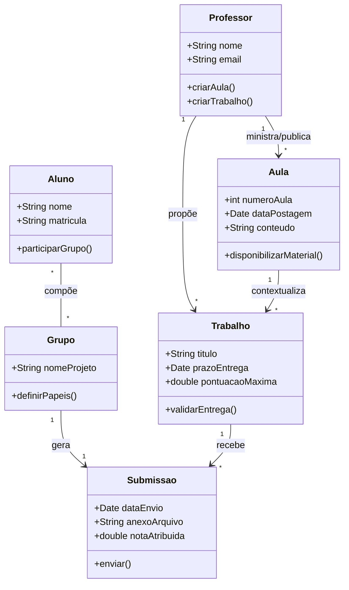
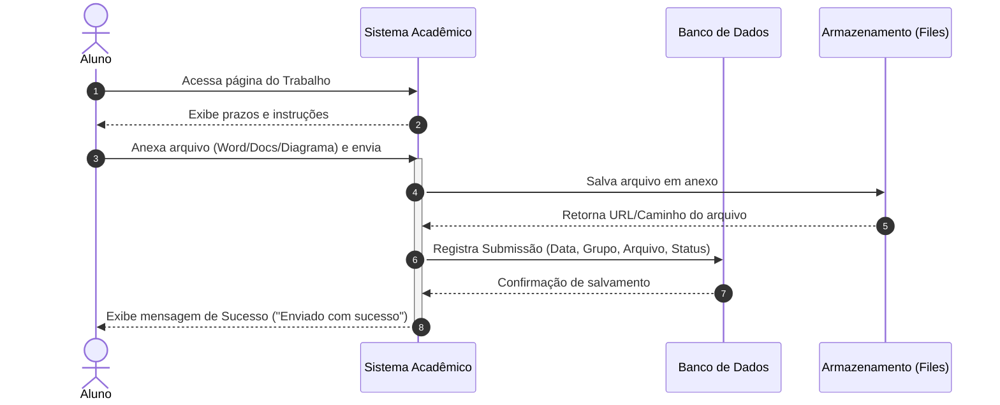
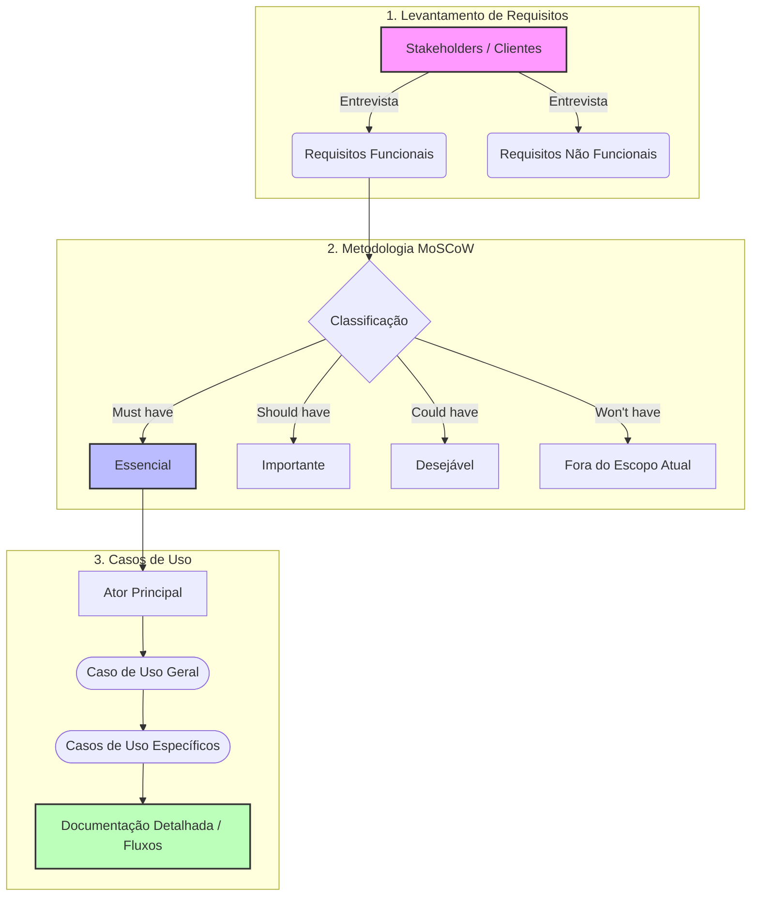

# 📚 Engenharia de Software II - Prof. Wesley Soares
**4º Semestre**

Abaixo estão representados os artefatos visuais baseados nas diretrizes da disciplina, abrangendo modelagem orientada a objetos, fluxos de submissão de atividades e a arquitetura conceitual para o Trabalho Semestral (Requisitos, MoSCoW e Casos de Uso).

---

### 1. Diagrama de Classes UML (Domínio da Matéria)
Este diagrama modela a estrutura acadêmica da disciplina, relacionando Professores, Alunos, Aulas, Trabalhos e as Submissões realizadas pelos grupos.

**Explicação do Fluxo:**
O `Professor` gerencia e publica conteúdos nas `Aulas` e propõe `Trabalhos` práticos. Os `Alunos` organizam-se em `Grupos` de projeto para desenvolver as atividades. Cada `Grupo` realiza uma `Submissao` vinculada a um `Trabalho` específico dentro do prazo estipulado.

---

### 2. Diagrama de Sequência (Fluxo de Submissão de Atividade)
Ilustra a interação técnica entre o Aluno, o Sistema de Gestão Acadêmica e o Armazenamento ao submeter um arquivo de trabalho (como exigido na *Atividade Aula 3* ou *Trabalho Semestral*).

**Explicação do Fluxo:**
O aluno interage com a interface do sistema para enviar a documentação solicitada pelo professor. O sistema valida o recebimento, armazena o arquivo de forma segura no servidor/nuvem e atualiza o banco de dados com os metadados da entrega (data, hora e vínculo com o grupo), finalizando com a confirmação ao usuário.

---

### 3. Diagrama Arquitetural / Entidade-Relacionamento (Trabalho Semestral)
Representa a arquitetura conceitual e o fluxo lógico exigido para o **Trabalho Semestral**, que abrange Levantamento de Requisitos, Priorização MoSCoW e Casos de Uso.

**Explicação do Fluxo:**
O processo do trabalho semestral inicia-se com a elicitação de requisitos junto aos *stakeholders*. Em seguida, esses requisitos passam pelo filtro de priorização **MoSCoW** para definir o núcleo do sistema (*Must have*). Por fim, os requisitos essenciais são transformados em **Casos de Uso** (Gerais e Específicos), detalhados e documentados para entrega final via documento do Word/Google Docs.