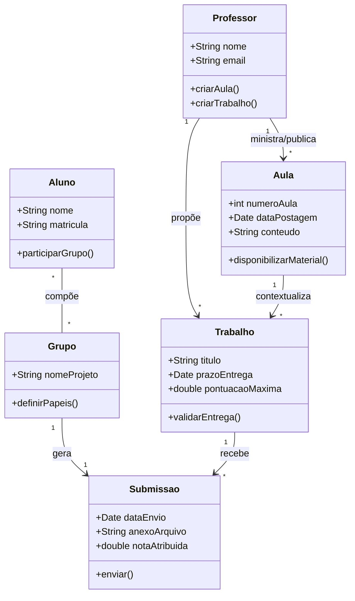
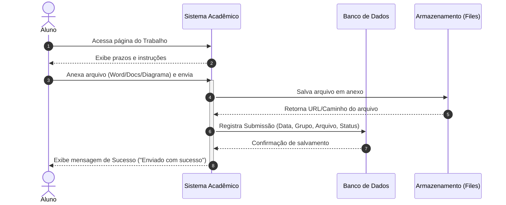
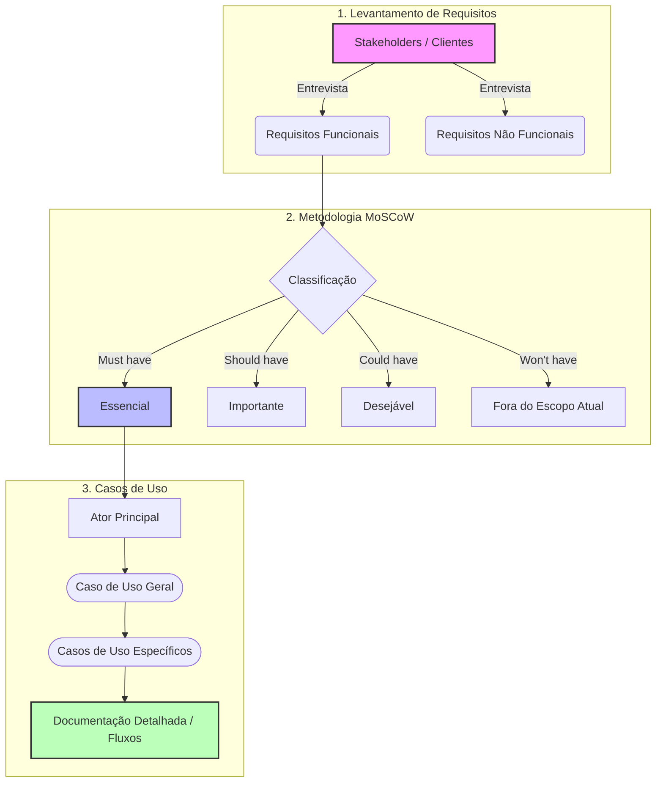

# Resumos-IA · Engenharia de Software II

> **Professor:** Wesley Soares de Souza · **Semestre:** 4º Semestre · **Curso:** Sistemas de Informação (UniFEF)

Material de apoio gerado com auxílio de IA a partir do conteúdo real das aulas: resumo executivo, exercícios práticos com código, simulado comentado, cheat sheet de revisão, diagramas de modelagem, slides de revisão, flashcards e dataset de perguntas e respostas — tudo neste único documento.

---

## Índice

- [Resumo Executivo](#resumo-executivo)
- [Exercícios Práticos Implementados](#exercícios-práticos-implementados)
- [Simulado Comentado](#simulado-comentado)
- [CheatSheet de Revisão Rápida](#cheatsheet-de-revisão-rápida)
- [Diagramas e Modelagem](#diagramas-e-modelagem)
- [Apresentação de Revisão em Slides](#apresentação-de-revisão-em-slides)
- [Flashcards para Anki](#flashcards-para-anki)
- [Dataset de Perguntas e Respostas (JSONL)](#dataset-de-perguntas-e-respostas-jsonl)

---

## Resumo Executivo

### Visão Geral e Objetivos da Matéria
A disciplina de **Engenharia de Software II**, ministrada pelo Prof. Ms. Wesley Soares de Souza, aborda o ciclo de vida avançado do desenvolvimento de software, fazendo a transição crítica entre a **Análise de Requisitos (o "o quê fazer")** e o **Projeto Orientado a Objetos e Arquitetura (o "como fazer")**.

O principal objetivo da matéria é afastar o desenvolvimento de software da ideia de "pastelaria" (produção sem critério) e consolidar práticas de engenharia estruturadas, capacitando o aluno a projetar sistemas funcionais, escaláveis, coesos e de fácil manutenção. A disciplina é fortemente respaldada por um **Projeto Integrador** prático em equipe, que simula desafios reais de mercado em domínios como Comércio, Serviços Públicos, Negócios, Saúde, Educação e Logística.

### Conceitos-Chave e Terminologia Fundamental
* **Engenharia de Requisitos:** Processo sistemático de descobrir, analisar, especificar e validar as necessidades do cliente e do negócio.
* **Elicitação:** A técnica de extração e descoberta de informações com os *stakeholders* (partes interessadas).
* **Requisitos Funcionais (RF):** Descrevem *o que* o sistema deve fazer (comportamentos, regras de negócio e funcionalidades). Ex: *"O sistema deve permitir cadastrar produtos."*
* **Requisitos Não Funcionais (RNF):** Descrevem *como* o sistema deve se comportar (restrições de qualidade, desempenho, segurança). Ex: *"A consulta de produtos deve responder em até 2 segundos."*
* **Projeto Orientado a Objetos (OO):** Tradução dos modelos de análise para soluções técnicas utilizando pilares de POO.
* **Princípios de Design OO:**
    * *Abstração:* Ocultação de detalhes irrelevantes, focando no essencial.
    * *Encapsulamento:* Proteção dos dados internos de uma classe, controlando o acesso por meio de interfaces bem definidas.
    * *Herança:* Reutilização de código e atributos entre classes genéricas e especializadas.
    * *Polimorfismo:* Capacidade de executar o mesmo método com comportamentos distintos dependendo do contexto do objeto.
    * *Baixo Acoplamento e Alta Coesão:* Métricas fundamentais de qualidade de código onde módulos são independentes (baixo acoplamento) e possuem responsabilidades únicas e bem definidas (alta coesão).

### Principais Módulos / Tópicos Abordados

**A. O Ciclo do Projeto de Software** — desenvolvimento em 10 fases iterativas e estruturadas:
1. **Identificação do Problema:** Compreender a dor do usuário e o valor gerado.
2. **Levantamento de Requisitos:** Elicitação com *stakeholders*.
3. **Análise e Especificação:** Separação entre RF e RNF.
4. **Planejamento do Projeto:** Escopo, cronograma, riscos e recursos.
5. **Arquitetura de Software:** Decisões estruturais (Camadas, MVC, Hexagonal, Clean Architecture, Microsserviços).
6. **Projeto Detalhado:** Aplicação de princípios SOLID, alta coesão, baixo acoplamento e **Padrões de Projeto (Design Patterns)** como *Strategy, Factory, Observer, Adapter e Facade*.
7. **Implementação:** Codificação, controle de versão e padrões de código.
8. **Testes e Garantia da Qualidade:** Testes Unitários, de Integração e End-to-End (E2E).
9. **Integração, Configuração e Entrega (CI/CD):** Automação de *builds*, contêineres e *deploy*.
10. **Operação, Manutenção e Evolução:** Monitoramento, correções e novas entregas.

**B. Técnicas de Elicitação de Requisitos**
* **Tradicionais:** Entrevistas (estruturadas, semiestruturadas, não estruturadas), Questionários, Observação (acompanhar o usuário em campo), Análise Documental (planilhas, sistemas legados, relatórios) e Workshops/Brainstorming (foco em quantidade de ideias primeiro, avaliação depois).
* **Complementares:** Prototipação (uso de ferramentas como **Figma** ou **Penpot** para wireframes navegáveis que reduzem ambiguidades) e Storytelling/Cenários.

### Relações com o Mercado e Prática Profissional
* **Foco em Processos Reais:** O mercado de TI não busca apenas programadores que escrevem código, mas engenheiros capazes de entender problemas de negócio complexos (*"Faça a coisa certa e faça certo a coisa"*).
* **Ferramentas Padrão de Mercado:** O uso proficiente de ferramentas de prototipação colaborativa (Figma/Penpot) e modelagem UML prepara o estudante para interagir diretamente com analistas de negócios, product owners (PO) e arquitetos de software.
* **Trabalho em Equipe (Projeto Integrador):** Simula o ambiente de metodologias ágeis e desenvolvimento corporativo, exigindo divisão de papéis, controle de versão e entregas incrementais.

### Dicas de Ouro para Estudo e Provas
1. **Diferencie Análise de Projeto:** *Análise* foca no "O quê" (o problema e os requisitos do usuário); *Projeto* foca no "Como" (a solução técnica, classes, arquitetura e padrões).
2. **Atenção aos Requisitos Funcionais vs. Não Funcionais:** analise se a frase descreve uma ação do sistema (Funcional) ou uma restrição/atributo de qualidade como velocidade, segurança e usabilidade (Não Funcional).
3. **Domine os Pilares de POO:** compreenda como o *Encapsulamento* protege regras de negócio e como o *Polimorfismo* elimina estruturas condicionais complexas (if/else ou switch/case) no código.
4. **Valorize o Contexto do Problema:** nas avaliações práticas e no Projeto Integrador, justifique sempre suas escolhas arquiteturais e de requisitos com base no cenário real apresentado pelo cliente/stakeholder.

---

## Exercícios Práticos Implementados

Apostila prática que une os fundamentos teóricos (Elicitação de Requisitos, Ciclo de Vida de Software, Princípios de Projeto OO e Priorização MoSCoW) com códigos executáveis em **Java** e **TypeScript**.

### Módulo 1 — Do Requisito ao Código (Requisitos Funcionais e Não Funcionais)

```typescript
// ==========================================
// ARQUIVO: sistema_pedidos.ts
// Descrição: Atende ao requisito funcional de registrar pedido
// e não funcional de notificar em até 5 segundos.
// ==========================================

interface Pedido {
    id: number;
    cliente: string;
    valorTotal: number;
}

class ServicoNotificacao {
    public notificarVendedor(pedido: Pedido): void {
        const inicio = Date.now();

        // Simula o envio da notificação ao vendedor
        console.log(`[NOTIFICAÇÃO] Novo pedido #${pedido.id} registrado para o cliente ${pedido.cliente}.`);

        const fim = Date.now();
        const tempoRespostaMs = fim - inicio;

        // Validação do Requisito Não Funcional: Resposta < 5000ms (5 segundos)
        const limiteMaximoMs = 5000;
        if (tempoRespostaMs <= limiteMaximoMs) {
            console.log(`[RNF OK] Notificação enviada em ${tempoRespostaMs}ms (Dentro do limite de 5s).\n`);
        } else {
            console.log(`[ALERTA RNF] Lentidão detectada: ${tempoRespostaMs}ms.\n`);
        }
    }
}

class ProcessadorDePedidos {
    private notificador: ServicoNotificacao;

    constructor() {
        this.notificador = new ServicoNotificacao();
    }

    public registrarPedido(id: number, cliente: string, valorTotal: number): void {
        const novoPedido: Pedido = { id, cliente, valorTotal };
        console.log(`[PROCESSO] Pedido #${id} gravado com sucesso no banco de dados.`);

        // Aciona o requisito funcional dependente
        this.notificador.notificarVendedor(novoPedido);
    }
}

// --- Execução do Código ---
const sistema = new ProcessadorDePedidos();
sistema.registrarPedido(101, "Empresa Construtora Alfa Ltda", 15400.00);
sistema.registrarPedido(102, "Supermercado Compre Bem", 3200.50);
```

### Módulo 2 — Princípios de Projeto Orientado a Objetos (POO)

Aplicando Encapsulamento, Herança e Polimorfismo — cálculo de bônus diferenciado por cargo:

```java
// ==========================================
// ARQUIVO: SistemaBonus.java
// Descrição: Demonstra Herança, Encapsulamento e Polimorfismo.
// ==========================================

// 1. Classe Base com Encapsulamento (Atributos privados e Getters/Setters)
abstract class Colaborador {
    private String nome;
    private double salarioBase;

    public Colaborador(String nome, double salarioBase) {
        this.nome = nome;
        this.salarioBase = salarioBase;
    }

    public String getNome() {
        return nome;
    }

    public double getSalarioBase() {
        return salarioBase;
    }

    // Método abstrato que força o polimorfismo nas subclasses
    public abstract double calcularBonus();
}

// 2. Subclasse Gerente (Herança)
class Gerente extends Colaborador {
    public Gerente(String nome, double salarioBase) {
        super(nome, salarioBase);
    }

    @Override
    public double calcularBonus() {
        // Regra de negócio do Gerente: 20% do salário base
        return getSalarioBase() * 0.20;
    }
}

// 3. Subclasse Vendedor (Herança)
class Vendedor extends Colaborador {
    private double comissaoVendas;

    public Vendedor(String nome, double salarioBase, double comissaoVendas) {
        super(nome, salarioBase);
        this.comissaoVendas = comissaoVendas;
    }

    @Override
    public double calcularBonus() {
        // Regra de negócio do Vendedor: 10% do salário + comissão
        return (getSalarioBase() * 0.10) + (this.comissaoVendas * 0.05);
    }
}

// 4. Classe Executável principal
public class SistemaBonus {
    public static void main(String[] args) {
        Colaborador g = new Gerente("Ana Souza", 8000.00);
        Colaborador v = new Vendedor("Carlos Silva", 3000.00, 20000.00);

        exibirInformacoes(g);
        exibirInformacoes(v);
    }

    // Polimorfismo em ação: o método aceita qualquer 'Colaborador'
    public static void exibirInformacoes(Colaborador c) {
        System.out.println("Colaborador: " + c.getNome());
        System.out.println("Salário Base: R$ " + c.getSalarioBase());
        System.out.println("Bônus Calculado: R$ " + c.calcularBonus());
        System.out.println("----------------------------------------");
    }
}
```

### Módulo 3 — Priorização de Requisitos (Método MoSCoW)

* **M** — *Must have* (Obrigatório) · **S** — *Should have* (Importante) · **C** — *Could have* (Desejável) · **W** — *Won't have* (Fora do escopo atual)

```typescript
// ==========================================
// ARQUIVO: priorizacao_moscow.ts
// Descrição: Simula um avaliador de escopo baseado no método MoSCoW.
// ==========================================

enum CategoriaMoSCoW {
    MUST_HAVE = "Must have",
    SHOULD_HAVE = "Should have",
    COULD_HAVE = "Could have",
    WONT_HAVE = "Won't have"
}

interface RequisitoProjeto {
    id: string;
    descricao: string;
    classificacao: CategoriaMoSCoW;
}

class GerenciadorEscopo {
    private requisitos: RequisitoProjeto[] = [];

    public adicionarRequisito(id: string, descricao: string, classificacao: CategoriaMoSCoW): void {
        this.requisitos.push({ id, descricao, classificacao });
    }

    public filtrarEscopoAtual(): void {
        console.log("=== ESCOPO APROVADO PARA O MVP (Minimum Viable Product) ===");
        this.requisitos
            .filter(r => r.classificacao === CategoriaMoSCoW.MUST_HAVE)
            .forEach(r => console.log(`[${r.id}] ${r.descricao} (${r.classificacao})`));

        console.log("\n=== PLANEJADO PARA A PRÓXIMA FASE (Should / Could) ===");
        this.requisitos
            .filter(r => r.classificacao === CategoriaMoSCoW.SHOULD_HAVE || r.classificacao === CategoriaMoSCoW.COULD_HAVE)
            .forEach(r => console.log(`[${r.id}] ${r.descricao} (${r.classificacao})`));
    }
}

// --- Execução do Código ---
const projeto = new GerenciadorEscopo();

projeto.adicionarRequisito("RF01", "Cadastro de Clientes e Fornecedores", CategoriaMoSCoW.MUST_HAVE);
projeto.adicionarRequisito("RF02", "Emissão de Nota Fiscal Eletrônica", CategoriaMoSCoW.MUST_HAVE);
projeto.adicionarRequisito("RF03", "Relatório avançado de BI em formato PDF", CategoriaMoSCoW.SHOULD_HAVE);
projeto.adicionarRequisito("RF04", "Tema escuro (Dark Mode) na interface", CategoriaMoSCoW.COULD_HAVE);
projeto.adicionarRequisito("RF05", "Integração com Realidade Aumentada", CategoriaMoSCoW.WONT_HAVE);

projeto.filtrarEscopoAtual();
```

### Exercícios Práticos Resolvidos

**Exercício 1 (Análise e Conflito de Requisitos).** Durante uma entrevista de elicitação para um e-commerce, o Gerente Comercial pediu desconto automático de 20% acima de R$ 500, mas o Gerente Financeiro apontou que isso inviabiliza a margem em Eletrônicos.
> **Resolução:** conflito de stakeholders resolvido com requisito condicional — **RF12 - Desconto Comercial:** aplicar 20% em compras acima de R$ 500, **exceto** para a categoria "Eletrônicos", cujo desconto máximo segue a regra de margem do departamento.

**Exercício 2 (Diagrama de Classes conceitual — Gestão de Clínicas).**
* **Classe `Paciente`** — `private String cpf`, `private String nome`, `private String telefone`; `getters/setters`, `atualizarDados()`.
* **Classe `Medico`** — `private String crm`, `private String nome`, `private String especialidade`; `getters/setters`.
* **Classe `Consulta`** — `private Date dataHora`, `private String status`, `private Paciente paciente`, `private Medico medico`; `agendar()`, `cancelar()`, `realizarAtendimento()`.
* **Relacionamentos:** `Paciente` 1—N `Consulta`; `Medico` 1—N `Consulta`; toda `Consulta` tem exatamente um `Paciente` e um `Medico`.

---

## Simulado Comentado

Simulado estruturado com 10 questões de múltipla escolha (gabarito comentado) e 5 questões discursivas/estudos de caso, cobrindo Engenharia de Requisitos, Ciclo de Vida do Software, Projeto Orientado a Objetos e Princípios de Design.

### Parte 1 — Múltipla Escolha

**Q1.** Durante a elicitação, um stakeholder diz: *"O sistema precisa ser rápido ao processar os relatórios de vendas."* Como tratar essa declaração?
> **B** — Requisito não funcional ambíguo que precisa virar métrica mensurável (ex: gerar o relatório em até 5 segundos).

**Q2.** Qual alternativa **NÃO** representa uma dificuldade clássica da elicitação de requisitos?
> **C** — "Os clientes conseguem explicar tudo claramente logo na primeira reunião" é o oposto da realidade: necessidades nem sempre são explícitas e o cliente pode mudar de ideia.

**Q3.** Sobre técnicas de elicitação: I) entrevista estruturada x semiestruturada; II) observação/análise documental revelam atalhos e exceções; III) Brainstorming deve avaliar antes de gerar ideias.
> **C (I e II)** — III está errada: a regra de ouro é "quantidade primeiro, avaliação depois".

**Q4.** Validar fluxos de navegação com Figma/Penpot sem codificar do zero é conhecido como:
> **B — Prototipação.**

**Q5.** Diferença conceitual entre as fases de Análise e Projeto:
> **C** — Análise descobre "o que o sistema deve fazer" (domínio e requisitos); Projeto traduz isso em solução técnica, "como fazer".

**Q6.** *"Proteger os dados internos de uma classe, permitindo acesso controlado por métodos específicos (Getters/Setters)"* define:
> **C — Encapsulamento.**

**Q7.** Definição de estilos arquiteturais (Camadas, MVC, Clean Architecture, Microservices), com foco em segurança e escalabilidade, é a fase de:
> **B — Arquitetura de Software.**

**Q8.** O método **MoSCoW** serve para:
> **C — Priorizar requisitos**, focando no que é essencial para o projeto.

**Q9.** Sobre tipos de teste:
> **B** — testes unitários verificam unidades isoladas; testes de integração verificam a comunicação entre componentes.

**Q10.** Diferença entre Requisito Funcional e Não Funcional:
> **B** — funcional define *o que o sistema faz* (ex: cadastrar produtos); não funcional define *como se comporta/restrições* (ex: resposta em 2 segundos).

### Parte 2 — Discursivas e Estudos de Caso

**Q11 (Elicitação de Requisitos).** Um gerente de restaurante pede apenas "um sistema para controlar meus pedidos e melhorar o meu negócio".
> a) A frase é vaga e esconde regras de negócio essenciais — não há como iniciar o desenvolvimento com base em premissas tão superficiais.
> b) Perguntas investigativas: *Quem registra os pedidos? Quem consulta? O cliente pode cancelar? Existe aprovação prévia? Como é feito o pagamento? O estoque atualiza automaticamente?*

**Q12 (Análise vs. Projeto).** Importância da transição entre Análise/Especificação e Arquitetura/Projeto Detalhado, à luz de *"faça a coisa certa e faça certo a coisa"*.
> A análise garante que construímos "a coisa certa" (entendendo o problema e o domínio); o projeto garante "fazer certo a coisa" (estrutura, padrões, coesão e acoplamento adequados). Pular essa transição gera software que resolve o problema errado ou tem arquitetura frágil.

**Q13 (Design OO — classe `Venda`).**
> a) Atributos `private`; interação apenas via métodos públicos de acesso ou de negócio.
> b) Em vez de permitir alteração livre do estoque, expor um método controlado (`efetuarBaixaEstoque()`) que valida saldo disponível antes de autorizar.

**Q14 (Prototipação com Figma/Penpot).**
> Protótipos navegáveis tiram o usuário do plano abstrato: ao interagir com uma tela real, o stakeholder revela requisitos implícitos e falhas que uma entrevista em texto não capturaria.

**Q15 (Estudo de caso adicional).** Consultar o material original de Diagramas e Modelagem (seção abaixo) para exercícios de modelagem conceitual complementares ao simulado.

---

## CheatSheet de Revisão Rápida

**Foco:** Revisão para prova — conceitos essenciais e técnicas.

### O Ciclo de Vida de um Projeto de Software
*"Faça a coisa certa (análise) e faça certo a coisa (projeto)."*

1. **Identificação do Problema** 2. **Levantamento de Requisitos** 3. **Análise e Especificação** 4. **Planejamento** 5. **Arquitetura de Software** 6. **Projeto Detalhado (OO)** 7. **Implementação** 8. **Testes e Qualidade** 9. **Integração e Entrega (CI/CD)** 10. **Operação e Manutenção**

### Engenharia e Elicitação de Requisitos
`Necessidade → Problema → Contexto → Expectativa → Requisito`. Dificuldades comuns: requisitos implícitos, conflitos entre stakeholders, termos diferentes, mudança de ideia do cliente.

| Tradicionais | Complementares |
| :--- | :--- |
| **Entrevista:** Estruturada, Semiestruturada ou Não estruturada. | **Prototipação:** Wireframes/Telas (Figma, Penpot). |
| **Questionário:** Coleta ampla de dados. | **Cenários & Storytelling:** histórias de uso e fluxos. |
| **Observação:** revela atalhos/exceções no trabalho real. | **Event Storming:** mapeamento rápido de eventos de domínio. |
| **Análise Documental:** planilhas, manuais, sistemas antigos. | **Workshops & Brainstorming:** quantidade primeiro, avaliação depois. |

**Requisito Funcional (o que faz):** *"O sistema deve notificar o vendedor quando um pedido for registrado."*
**Requisito Não Funcional (como se comporta/restrições):** *"A notificação deve ocorrer em até 5 segundos."*

### Projeto Orientado a Objetos (OO) & Princípios de Design
**Análise:** o que fazer · **Projeto:** como fazer.

* **Abstração:** ocultar detalhes irrelevantes, focar no essencial do domínio.
* **Encapsulamento:** proteger dados internos (`private`), acesso via `Getters`/`Setters`.
* **Herança:** reutilizar atributos/comportamentos (`Pessoa` → `Cliente`).
* **Polimorfismo:** mesma assinatura, comportamentos diferentes (`calcularBonus()` para `Gerente` vs. `Vendedor`).
* **Baixo Acoplamento:** módulos independentes. **Alta Coesão:** responsabilidade única por classe/módulo.

**Padrões de Projeto citados:** `Strategy`, `Factory`, `Observer`, `Adapter`, `Facade`.

### Dicas Rápidas para a Prova
* Funcional = *função/ação*; Não Funcional = *qualidade* (velocidade, segurança, usabilidade).
* **MoSCoW:** Must, Should, Could, Won't — priorização do que é essencial.
* **Brainstorming:** separar geração de ideias da avaliação (quantidade primeiro, filtragem depois).

---

## Diagramas e Modelagem

Artefatos visuais baseados nas diretrizes da disciplina: modelagem orientada a objetos, fluxo de submissão de atividades e a arquitetura conceitual do Trabalho Semestral (Requisitos, MoSCoW e Casos de Uso).

### 1. Diagrama de Classes UML (Domínio da Matéria)



O `Professor` gerencia e publica conteúdos nas `Aulas` e propõe `Trabalhos` práticos. Os `Alunos` organizam-se em `Grupos` de projeto para desenvolver as atividades. Cada `Grupo` realiza uma `Submissao` vinculada a um `Trabalho` específico dentro do prazo estipulado.

### 2. Diagrama de Sequência (Fluxo de Submissão de Atividade)



O aluno interage com a interface do sistema para enviar a documentação solicitada pelo professor. O sistema valida o recebimento, armazena o arquivo de forma segura no servidor/nuvem e atualiza o banco de dados com os metadados da entrega (data, hora e vínculo com o grupo), finalizando com a confirmação ao usuário.

### 3. Diagrama Arquitetural (Trabalho Semestral)



O processo do trabalho semestral inicia-se com a elicitação de requisitos junto aos *stakeholders*. Em seguida, esses requisitos passam pelo filtro de priorização **MoSCoW** para definir o núcleo do sistema (*Must have*). Por fim, os requisitos essenciais são transformados em **Casos de Uso** (Gerais e Específicos), detalhados e documentados para entrega final via documento do Word/Google Docs.

---

## Apresentação de Revisão em Slides

[`Slides-Revisao-[Prof. Wesley Soares] Engenharia de Software II.pptx`](./Slides-Revisao-%5BProf.%20Wesley%20Soares%5D%20Engenharia%20de%20Software%20II.pptx)

Deck de revisão com 5 slides em widescreen 16:9, redesenhado em dark mode (paleta Slate/Navy/Teal/Indigo, cards arredondados com badges numerados e ícones): Capa, Visão Geral da Disciplina, Conceitos Fundamentais, Exercícios & Prática e Dicas de Prova — cobrindo o mesmo conteúdo deste README em formato de apresentação.

---

## Flashcards para Anki

[`flashcards-anki.tsv`](./flashcards-anki.tsv)

Baralho de flashcards (formato TSV: `frente<TAB>verso`) cobrindo os conceitos-chave da disciplina — requisitos funcionais/não funcionais, princípios de POO, fases do ciclo de vida e método MoSCoW. Para estudar:
1. Abra o [Anki](https://apps.ankiweb.net/).
2. **Arquivo → Importar** e selecione `flashcards-anki.tsv`.
3. Configure o separador de campos como **Tab** e mapeie as colunas para Frente/Verso.

---

## Dataset de Perguntas e Respostas (JSONL)

[`dataset-estudo-qa.jsonl`](./dataset-estudo-qa.jsonl) — **15 pares** de pergunta/resposta em formato [JSON Lines](https://jsonlines.org/), cobrindo cronograma de aulas, atividades avaliativas e estrutura do curso. Pensado para consumo por ferramentas (fine-tuning, RAG, geração de flashcards automatizada), um objeto JSON por linha.

Amostra:

```json
{"id": 1, "topico": "Informações da Disciplina", "pergunta": "Quem é o professor responsável pela disciplina de Engenharia de Software II no 4º semestre?", "resposta": "O professor responsável é o Prof. Wesley Soares.", "dificuldade": "facil"}
{"id": 6, "topico": "Atividades Avaliativas", "pergunta": "Qual é o prazo de entrega estipulado para a atividade da Aula 3?", "resposta": "O prazo de entrega da atividade da Aula 3 é 19/08/2026 às 02:59.", "dificuldade": "medio"}
{"id": 13, "topico": "Trabalho Semestral", "pergunta": "Quais artefatos e metodologias devem compor o documento do trabalho semestral?", "resposta": "O documento deve conter: levantamento de requisitos, técnica de priorização MoSCoW, além de casos de uso gerais e específicos acompanhados de sua respectiva documentação.", "dificuldade": "dificil"}
```
