# Manual Integrado de Engenharia de Software II

**Instituição:** Centro Universitário de Santa Fé do Sul (UniFEF)  
**Curso:** Bacharelado em Sistemas de Informação (4º Semestre)  
**Docente:** Prof. Ms. Wesley Soares de Souza  
**Componente Curricular:** Engenharia de Software II  

---

## Sumário

- [Apresentação da Disciplina e Estrutura Acadêmica](#apresentação-da-disciplina-e-estrutura-acadêmica)
  - [Identificação e Corpo Docente](#identificação-e-corpo-docente)
  - [Critérios Formais de Avaliação](#critérios-formais-de-avaliação)
  - [Diretrizes do Projeto Integrador](#diretrizes-do-projeto-integrador)
  - [Bibliografia Básica e Complementar](#bibliografia-básica-e-complementar)
- [Ciclo de Vida do Projeto de Software](#ciclo-de-vida-do-projeto-de-software)
  - [A Abordagem Profissional de Engenharia versus Desenvolvimento Amador](#a-abordagem-profissional-de-engenharia-versus-desenvolvimento-amador)
  - [O Paradoxo da Engenharia: Análise versus Projeto](#o-paradoxo-da-engenharia-análise-versus-projeto)
  - [As Dez Fases do Ciclo de Vida de Software Corporativo](#as-dez-fases-do-ciclo-de-vida-de-software-corporativo)
  - [Curva de Custo de Correção de Defeitos](#curva-de-custo-de-correção-de-defeitos)
- [Fundamentos de Projeto Orientado a Objetos](#fundamentos-de-projeto-orientado-a-objetos)
  - [A Transição Formal da Análise para o Projeto](#a-transição-formal-da-análise-para-o-projeto)
  - [Abstração e Encapsulamento](#abstração-e-encapsulamento)
  - [Herança e Polimorfismo](#herança-e-polimorfismo)
  - [Baixo Acoplamento e Alta Coesão](#baixo-acoplamento-e-alta-coesão)
  - [Reúso e Extensibilidade](#reúso-e-extensibilidade)
  - [Introdução aos Princípios SOLID e Padrões GoF](#introdução-aos-princípios-solid-e-padrões-gof)
- [Engenharia e Elicitação de Requisitos de Software](#engenharia-e-elicitação-de-requisitos-de-software)
  - [Distinção Epistemológica: Levantar versus Elicitar](#distinção-epistemológica-levantar-versus-elicitar)
  - [A Cadeia Causal da Engenharia de Requisitos](#a-cadeia-causal-da-engenharia-de-requisitos)
  - [As Seis Perguntas Cardinais da Elicitação](#as-seis-perguntas-cardinais-da-elicitação)
  - [O Risco da Premissa de Desenvolvimento Prematuro](#o-risco-da-premissa-de-desenvolvimento-prematuro)
  - [Desconstrução e Refatoração de Ambiguidade](#desconstrução-e-refatoração-de-ambiguidade)
  - [Taxonomia das Técnicas de Elicitação](#taxonomia-das-técnicas-de-elicitação)
  - [Classificação de Requisitos: Funcionais, Não Funcionais e Regras de Negócio](#classificação-de-requisitos-funcionais-não-funcionais-e-regras-de-negócio)
- [Gerenciamento de Escopo e Priorização via Método MoSCoW](#gerenciamento-de-escopo-e-priorização-via-método-moscow)
  - [Fundamentação Teórica da Priorização Ágil](#fundamentação-teórica-da-priorização-ágil)
  - [As Quatro Categorias MoSCoW](#as-quatro-categorias-moscow)
  - [Prevenção da Corrupção de Escopo e Definição do MVP](#prevenção-da-corrupção-de-escopo-e-definição-do-mvp)
  - [O Pipeline das Sete Etapas do Projeto de Software](#o-pipeline-das-sete-etapas-do-projeto-de-software)
- [Modelagem de Casos de Uso na UML](#modelagem-de-casos-de-uso-na-uml)
  - [Propósito e a Abordagem Caixa-Preta](#propósito-e-a-abordagem-caixa-preta)
  - [Elementos Básicos do Modelo de Casos de Uso](#elementos-básicos-do-modelo-de-casos-de-uso)
  - [Relacionamentos entre Casos de Uso e Atores](#relacionamentos-entre-casos-de-uso-e-atores)
  - [Análise Profunda: Include versus Extend](#análise-profunda-include-versus-extend)
  - [Generalização de Atores e Casos de Uso](#generalização-de-atores-e-casos-de-uso)
  - [Especificação Textual Canônica de Casos de Uso](#especificação-textual-canônica-de-casos-de-uso)
- [Modelagem Estrutural: O Diagrama de Classes da UML](#modelagem-estrutural-o-diagrama-de-classes-da-uml)
  - [Natureza e Princípios da UML](#natureza-e-princípios-da-uml)
  - [Diferença entre Notação e Metodologia](#diferença-entre-notação-e-metodologia)
  - [Anatomia Estrutural da Classe: Nome, Atributos e Operações](#anatomia-estrutural-da-classe-nome-atributos-e-operações)
  - [Padrões de Nomenclatura e Convenções do Domínio](#padrões-de-nomenclatura-e-convenções-do-domínio)
  - [Modificadores de Visibilidade e Níveis de Encapsulamento](#modificadores-de-visibilidade-e-níveis-de-encapsulamento)
  - [Navegabilidade e Multiplicidades](#navegabilidade-e-multiplicidades)
  - [Relacionamentos Estruturais: Associação, Agregação e Composição](#relacionamentos-estruturais-associação-agregação-e-composição)
  - [Generalização Estrutural e Dependência Transitória](#generalização-estrutural-e-dependência-transitória)
- [Arquitetura de Software: O Padrão MVC Clássico no Smalltalk-80](#arquitetura-de-software-o-padrão-mvc-clássico-no-smalltalk-80)
  - [Origem Histórica no Xerox PARC](#origem-histórica-no-xerox-parc)
  - [A Divisão de Responsabilidades na Tríade MVC](#a-divisão-de-responsabilidades-na-tríade-mvc)
  - [Modelos Passivos versus Modelos Ativos](#modelos-passivos-versus-modelos-ativos)
  - [Protocolo Reativo de Notificação: changed e update](#protocolo-reativo-de-notificação-changed-e-update)
  - [Evolução Interna: DependentFields versus Classe Model](#evolução-interna-dependentfields-versus-classe-model)
  - [Acoplamento Bilateral View-Controller e o Padrão Observer](#acoplamento-bilateral-view-controller-e-o-padrão-observer)
  - [Composição Visual Hierárquica e Pluggable Views](#composição-visual-hierárquica-e-pluggable-views)
  - [Pipeline de Renderização e WindowingTransformation](#pipeline-de-renderização-e-windowingtransformation)
  - [Controle Cooperativo e Despacho de Eventos](#controle-cooperativo-e-despacho-de-eventos)
- [Estudos de Caso e Aplicação Prática dos Trabalhos da Disciplina](#estudos-de-caso-e-aplicação-prática-dos-trabalhos-da-disciplina)
  - [Estudo de Caso 1: Comércio Eletrônico e Vendas (Atividade Classe / Aula 04)](#estudo-de-caso-1-comércio-eletrônico-e-vendas-atividade-classe--aula-04)
  - [Estudo de Caso 2: Plataforma de Food Delivery (Aula 06)](#estudo-de-caso-2-plataforma-de-food-delivery-aula-06)
  - [Estudo de Caso 3: HealthTech Solutions - Logística Reversa Hospitalar (Atividade Aula 3)](#estudo-de-caso-3-healthtech-solutions---logística-reversa-hospitalar-atividade-aula-3)
  - [Estudo de Caso 4: MedClinic - Gestão Clínica e Prontuário Eletrônico (Trabalho Semestral)](#estudo-de-caso-4-medclinic---gestão-clínica-e-prontuário-eletrônico-trabalho-semestral)
- [Implementação de Referência em Código Java](#implementação-de-referência-em-código-java)
  - [Implementação do Domínio com Encapsulamento Defensivo](#implementação-do-domínio-com-encapsulamento-defensivo)
  - [Implementação de Padrões de Projeto (Strategy e Observer)](#implementação-de-padrões-de-projeto-strategy-e-observer)
- [Banco de Exercícios e Fixação com Gabarito Comentado](#banco-de-exercícios-e-fixação-com-gabarito-comentado)
  - [Exercícios de Engenharia de Requisitos e MoSCoW](#exercícios-de-engenharia-de-requisitos-e-moscow)
  - [Exercícios de Modelagem de Casos de Uso](#exercícios-de-modelagem-de-casos-de-uso)
  - [Exercícios de Diagrama de Classes e POO](#exercícios-de-diagrama-de-classes-e-poo)
  - [Exercícios de Arquitetura MVC](#exercícios-de-arquitetura-mvc)
- [Guia Rápido de Revisão e Checklist para Avaliações](#guia-rápido-de-revisão-e-checklist-para-avaliações)

---

## Apresentação da Disciplina e Estrutura Acadêmica

### Identificação e Corpo Docente

A disciplina de **Engenharia de Software II** integra a matriz curricular do 4º semestre do curso de Bacharelado em Sistemas de Informação da Fundação Educacional de Fernandópolis / Centro Universitário de Santa Fé do Sul (UniFEF).

- **Docente Responsável:** Prof. Ms. Wesley Soares de Souza.
- **Perfil Acadêmico e Profissional:** Engenheiro de Software Sênior com mais de 15 anos de atuação na concepção, arquitetura e sustentação de sistemas corporativos escaláveis e de missão crítica. Atua na docência do ensino superior desde 2014, com passagens pelo Grupo Kroton (Anhanguera), FATEC Jales e Instituto Federal de São Paulo (IFSP) – Câmpus Votuporanga.
- **Titulação:** Bacharel em Sistemas de Informação pela F.E.F., Pós-graduado em Gestão de Banco de Dados e Mestre em Engenharia de Software pela Universidade Federal do Pampa (UNIPAMPA - RS).

A condução da disciplina articula rigor conceitual e metodológico com as demandas operacionais da indústria de software, enfatizando a necessidade de modelagem consistente antes da escrita de código.

### Critérios Formais de Avaliação

O desempenho acadêmico ao longo do semestre letivo é aferido pela composição entre avaliações individuais dissertativo-práticas e o desenvolvimento incremental de um Projeto Integrador (PJ) em equipe:

- **AV1 (Avaliação Bimestral 1):** Prova individual abordando fundamentos de ciclos de vida, engenharia de requisitos, técnicas de elicitação, método MoSCoW e modelagem de casos de uso.
- **AV2 (Avaliação Bimestral 2):** Prova individual com ênfase na modelagem estrutural de classes, arquiteturas de software (especialmente MVC), padrões de projeto (GoF), princípios SOLID e qualidade de código.
- **PJ (Projeto Integrador da Disciplina):** Trabalho semestral desenvolvido em equipes, avaliado formalmente em duas etapas de entrega técnica.

A fórmula oficial para o cálculo da nota semestral equilibra a responsabilidade individual (60% do peso bimestral) e o alinhamento colaborativo (40% do peso bimestral):

$$\text{Nota Bimestre 1} = (\text{AV}_1 \times 0.6) + (\text{PJ} \times 0.4)$$

$$\text{Nota Bimestre 2} = (\text{AV}_2 \times 0.6) + (\text{PJ} \times 0.4)$$

$$\text{Nota Final} = \frac{\text{Nota Bimestre 1} + \text{Nota Bimestre 2}}{2}$$

$$\text{Nota Final} = \frac{[(\text{AV}_1 \times 0.6) + (\text{PJ} \times 0.4)] + [(\text{AV}_2 \times 0.6) + (\text{PJ} \times 0.4)]}{2}$$

### Diretrizes do Projeto Integrador

O Projeto Integrador da Disciplina (PJ) consiste na concepção completa, análise de viabilidade, elicitação de requisitos, modelagem visual e arquitetura de um software de porte corporativo.

#### Composição das Equipes
- As equipes devem ser formadas estritamente por **três estudantes**.
- A divisão de papéis simula um time de engenharia: analistas de requisitos, arquitetos de software e modeladores.

#### Estrutura das Etapas de Entrega

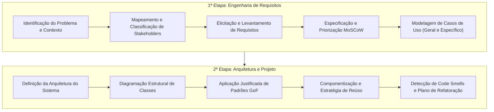

1. **1ª Etapa — Engenharia de Requisitos:**
   - Declaração formal da situação-problema e justificativa econômica/operacional.
   - Identificação e diferenciação entre atores de negócio e perfis de analistas.
   - Catalogação estruturada de Requisitos Funcionais (RF), Requisitos Não Funcionais (RNF) e Regras de Negócio (RN).
   - Aplicação da matriz de priorização MoSCoW.
   - Construção dos Diagramas de Casos de Uso (geral e detalhado) acompanhados de documentação textual canônica dos fluxos críticos.
2. **2ª Etapa — Arquitetura e Projeto:**
   - Seleção fundamentada do estilo arquitetural (Camadas, MVC, Microsserviços, Hexagonal).
   - Elaboração do Diagrama de Classes do domínio, com tipagem formal, modificadores de acesso e multiplicidades.
   - Aplicação de padrões de projeto (*Design Patterns*) e princípios SOLID.
   - Mapeamento de dívida técnica, identificação de anomalias (*code smells*) e formulação de estratégias de refatoração.

#### Domínios Temáticos Sugeridos

| Domínio Temático | Propostas de Aplicação | Escopo de Funcionalidades |
| :--- | :--- | :--- |
| **Comércio** | Marketplace B2B/B2C, Gestão de Estoque e WMS, OMS de Vendas | Catálogo dinâmico, checkout transacional, reserva de inventário, cálculo de frete. |
| **Serviços Públicos** | Solicitação de Serviços Municipais, Ouvidoria Pública, Iluminação | Triagem georreferenciada, controle de SLAs de atendimento, auditoria pública. |
| **Negócios** | Plataforma de Gestão de Projetos, Recrutamento e Seleção (ATS) | Painéis Kanban/Gantt dinâmicos, pipelines de triagem curricular, conciliação financeira. |
| **Saúde** | Prontuário Eletrônico (PEP), Gestão Clínica, Telemedicina | Sigilo profissional, agendamento de consultas, prescrição médica digital estruturada. |
| **Educação** | Gestão Acadêmica (SGA), Ambiente Virtual de Aprendizagem (LMS) | Diário de classe, submissão e avaliação de tarefas, cálculo ponderado de notas. |
| **Logística** | Rastreamento de Frotas, Logística Reversa, Roteirização | Roteirização via grafos, telemetria em tempo real, comprovação digital de entrega. |

### Bibliografia Básica e Complementar

- **GUEDES, Gilleanes T. A.** *UML 2: Uma Abordagem Prática*. 2. ed. São Paulo: Novatec, 2011.
- **BOOCH, Grady; RUMBAUGH, James; JACOBSON, Ivar.** *UML: Guia do Usuário*. 1. ed. Rio de Janeiro: Campus, 2000.
- **FURLAN, José Davi.** *Modelagem de Objetos através da UML*. 1. ed. São Paulo: Makron Books, 1998.
- **BEZERRA, Eduardo.** *Princípios de Análise e Projeto de Sistemas com UML*. 4. ed. Rio de Janeiro: Elsevier, 2007.
- **MEDEIROS, Ernani.** *Desenvolvendo Software com UML 2.0*. 1. ed. São Paulo: Pearson Makron Books, 2004.
- **O'NEILL, Henrique; NUNES, Mauro; RAMOS, Pedro.** *Exercícios de UML*. 1. ed. Lisboa/São Paulo: FCA / Editora Informática, 2010.
- **GÓES, Wilson Moraes.** *Aprenda UML por Meio de Estudo de Caso*. 1. ed. São Paulo: Novatec, 2014.
- **BORATTI, Isaias Camilo.** *Programação Orientada a Objetos em Java*. 1. ed. Florianópolis: Visual Books, 2007.

*(Nota de consolidação bibliográfica complementar: As abordagens de padrões arquiteturais e elicitação apoiam-se também no padrão SWEBOK da IEEE Computer Society e nas formulações originais de Gamma et al. para padrões GoF).*

---

## Ciclo de Vida do Projeto de Software

### A Abordagem Profissional de Engenharia versus Desenvolvimento Amador

Na abertura da disciplina, o Prof. Wesley Soares destaca uma analogia central para a formação de bacharéis em Sistemas de Informação: **"Software não é feito em pastelaria"**.

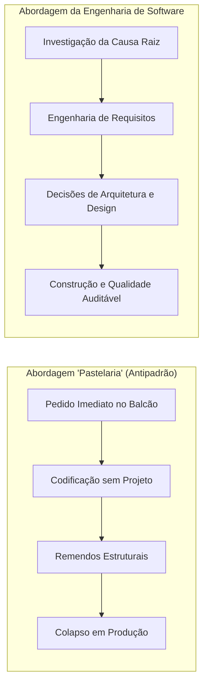

A abordagem de "pastelaria" caracteriza o desenvolvimento amador: o cliente solicita funcionalidades sem planejamento prévio e espera entrega imediata, enquanto o desenvolvedor inicia a escrita de código sem avaliar impactos estruturais, regras de integridade ou requisitos não funcionais. O resultado inevitável compreende débitos técnicos impagáveis, falhas de segurança e sistemas impossíveis de manter.

Em contraste, a Engenharia de Software trata a construção de sistemas computacionais como um processo formal, disciplinado e mensurável, garantindo que o sistema atenda aos objetivos estratégicos da organização e apresente longevidade operacional.

### O Paradoxo da Engenharia: Análise versus Projeto

Uma das formulações clássicas da disciplina sintetiza a divisão entre análise e projeto:

> *"Faça a coisa certa (análise) e faça certo a coisa (projeto)."*

1. **Análise de Sistemas (Fazer a coisa certa):** Tem foco centrado no domínio do problema. Busca compreender as dores, os fluxos operacionais e os objetivos dos stakeholders, sem se vincular a plataformas tecnológicas específicas. Construir uma solução tecnicamente robusta que resolve o problema errado é uma falha de engenharia.
2. **Projeto de Sistemas (Fazer certo a coisa):** Tem foco direcionado ao domínio da solução técnica. Transforma as necessidades identificadas em especificações arquiteturais, classes, estruturas de dados, esquemas relacionais e interfaces de integração. Construir o software correto com um projeto frágil e acoplado torna a evolução do sistema proibitivamente cara.

### As Dez Fases do Ciclo de Vida de Software Corporativo

Um projeto corporativo percorre dez fases iterativas, apresentadas a seguir em seu fluxo sequencial e ciclo de feedback contínuo:

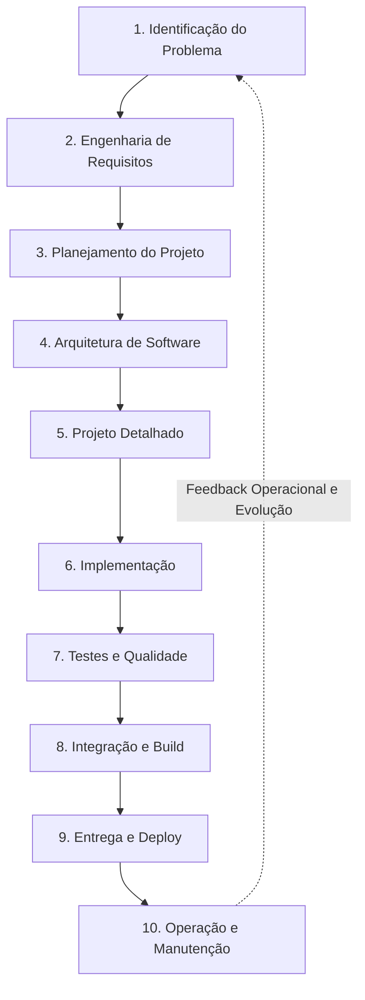

| Fase | Foco Técnico Central | Artefato de Entrada | Artefato de Saída Principal |
| :--- | :--- | :--- | :--- |
| **1. Problema** | Isolar a causa raiz das ineficiências operacionais do negócio. | Queixas de clientes, gargalos operacionais. | Declaração do Problema, Proposta de Valor. |
| **2. Requisitos** | Elicitar, analisar e especificar as funções e restrições do sistema. | Declaração do Problema, entrevistas. | Documento de Requisitos (SRS), Casos de Uso. |
| **3. Planejamento** | Delimitar escopo, estimar esforço, alocar equipe e mapear riscos. | Requisitos priorizados (MoSCoW). | Cronograma de Sprints, Matriz de Riscos. |
| **4. Arquitetura** | Definir macroestruturas, tecnologias centrais e estilos arquiteturais. | Requisitos Não Funcionais críticos. | Documento de Arquitetura de Software (SAD). |
| **5. Projeto** | Modelar a estrutura estática e dinâmica das classes e subsistemas. | Estilo arquitetural aprovado. | Diagramas de Classes, Diagramas de Sequência. |
| **6. Implementação** | Codificar a solução conforme as especificações de design. | Modelos de classes, contratos de interface. | Código-fonte versionado (Git), Pull Requests. |
| **7. Testes** | Validar a conformidade com regras funcionais e atributos de qualidade. | Código compilável, suítes de teste. | Relatórios de Cobertura de Código, Logs de QA. |
| **8. Integração** | Consolidar código em pipelines automatizados de build e empacotamento. | Branches funcionais validadas. | Artefatos de build, Imagens de Contêineres. |
| **9. Entrega** | Disponibilizar a versão em ambientes de homologação e produção. | Imagens de contêineres aprovadas. | Release em Produção, Registro de Mudanças. |
| **10. Manutenção** | Monitorar métricas de produção, corrigir defeitos e planejar melhorias. | Logs de telemetria, chamados de suporte. | Patches corretivos, Novas demandas de negócio. |

### Curva de Custo de Correção de Defeitos

A justificativa econômica para a dedicação rigorosa às fases iniciais fundamenta-se na regra clássica de Barry Boehm. O custo para corrigir um defeito de requisito cresce em escala exponencial à medida que o projeto avança no ciclo de vida:

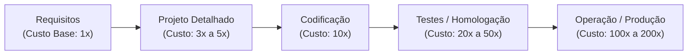

Um requisito funcional incorreto ou ambíguo não detectado na fase de análise exigirá o descarte de diagramas de classes, o cancelamento de rotinas de código implementadas, a reescrita de suítes de testes unitários e a readequação de estruturas de dados em bancos de produção.

---

## Fundamentos de Projeto Orientado a Objetos

### A Transição Formal da Análise para o Projeto

A transição da análise para o projeto é o momento em que o modelo conceitual agnóstico de tecnologia se transforma em um modelo de implementação concreto e executável:

| Critério de Comparação | Modelo de Análise | Modelo de Projeto Orientado a Objetos |
| :--- | :--- | :--- |
| **Questão Orientadora** | O que o sistema deve fazer? | Como o sistema executará tecnicamente? |
| **Público-Alvo** | Analistas de negócio, usuários e clientes | Arquitetos de software e desenvolvedores |
| **Nível de Abstração** | Alto, conceitual e agnóstico de plataforma | Técnico, acoplado a frameworks e bibliotecas |
| **Artefatos Principais** | Casos de uso, matriz MoSCoW, glossário | Diagramas de classes detalhados, sequências |
| **Vocabulário** | Termos de negócio (`Pedido`, `Paciente`) | Padrões de software (`Controller`, `DAO`, `DTO`) |

### Abstração e Encapsulamento

#### Abstração
- **Definição:** Operação conceitual que isola as características e comportamentos essenciais de uma entidade para o contexto do sistema, ignorando intencionalmente detalhes periféricos ou de baixo nível.
- **Motivação:** Reduzir a sobrecarga cognitiva do engenheiro e evitar o acoplamento do domínio a particularidades de infraestrutura física.
- **Exemplo:** Ao modelar a classe `ContaBancaria`, isolam-se atributos como `numero`, `titular` e `saldo`, disponibilizando operações como `depositar()` e `sacar()`. O modelo não representa a cor do cartão físico ou a topologia do cabeamento do banco.
- **Contraexemplo:** Modelar uma entidade do sistema com dezenas de campos irrelevantes para o domínio de negócio (ex.: cadastrar o tipo sanguíneo do usuário em um software de gerenciamento de estacionamento).
- **Armadilha:** Abstração insuficiente, gerando classes com representação literal de mecanismos de hardware ou estruturas de banco de dados, em vez de representar conceitos do negócio.

#### Encapsulamento
- **Definição:** Mecanismo de agrupamento do estado interno e das operações que manipulam esse estado em uma mesma unidade estrutural, associado à restrição de visibilidade para proteger as invariantes da classe.
- **Motivação:** Impedir que agentes externos corrompam a consistência interna dos objetos ao ignorar regras de validação.
- **Exemplo:** Atributos declarados como privados (`private`), manipulados exclusivamente por métodos públicos de negócio que validam parâmetros (ex.: o método `sacar(valor)` impede saques negativos ou que excedam o saldo disponível).
- **Contraexemplo:** Deixar os atributos públicos (`public double saldo;`), permitindo que qualquer classe do sistema execute `conta.saldo = -50000.0;` diretamente.
- **Armadilha:** O antipadrão do **Modelo Anêmico**, em que todos os atributos são privados, mas a classe expõe métodos `get` e `set` irrestritos para todos eles sem validação, convertendo a proteção em mera formalidade sintática. Outra armadilha frequente é o **Vazamento de Referências Mutáveis** (*escaping references*), que ocorre ao retornar referências diretas de coleções internas em métodos de consulta (`getItens()`), permitindo mutações externas não auditadas.

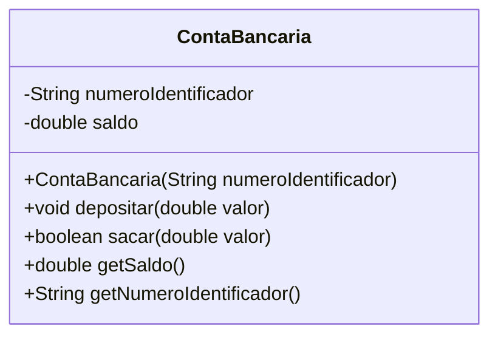

### Herança e Polimorfismo

#### Herança
- **Definição:** Mecanismo que permite a uma classe filha (subclasse) herdar atributos e operações de uma classe mãe (superclasse), estabelecendo uma relação de especialização do tipo "É UM" (*is-a*).
- **Motivação:** Promover o reúso estrutural e comportamental, organizando conceitos em hierarquias taxonômicas formais.
- **Exemplo:** `ContaPoupanca` e `ContaCorrente` herdam atributos comuns da superclasse abstrata `Conta`.
- **Contraexemplo:** Usar herança exclusivamente para reaproveitar linhas de código sem relação conceitual direta (ex.: fazer a classe `Funcionario` herdar de `ConexaoBancoDeDados`).
- **Armadilha:** Hierarquias de herança excessivamente profundas e rígidas, que violam o princípio de projeto *"Favoreça composição sobre herança"*, gerando acoplamento estrutural em cascata.

#### Polimorfismo
- **Definição:** Capacidade de objetos de diferentes classes derivadas responderem a uma mesma mensagem abstrata de formas distintas e especializadas em tempo de execução (*late binding* / despacho dinâmico).
- **Motivação:** Eliminar estruturas condicionais aninhadas (`if/else` ou `switch/case`) e permitir a extensão do sistema sem alteração de código cliente consolidado.
- **Exemplo:** Uma lista de instâncias polimórficas do tipo `MeioDePagamento` recebendo a invocação `processar()`, onde o objeto `Pix` gera o código copia-e-cola e o objeto `CartaoCredito` executa a chamada ao gateway de adquirente.
- **Contraexemplo:** Verificar o tipo concreto do objeto com `instanceof` para decidir a operação em tempo de execução:
  ```java
  if (pagamento instanceof Cartao) { /* ... */ }
  else if (pagamento instanceof Pix) { /* ... */ }
  ```
- **Armadilha:** Violação do **Princípio de Substituição de Liskov (LSP)**, criando subclasses que lançam exceções não suportadas pela superclasse ou que alteram os contratos das pré e pós-condições originais.

### Baixo Acoplamento e Alta Coesão

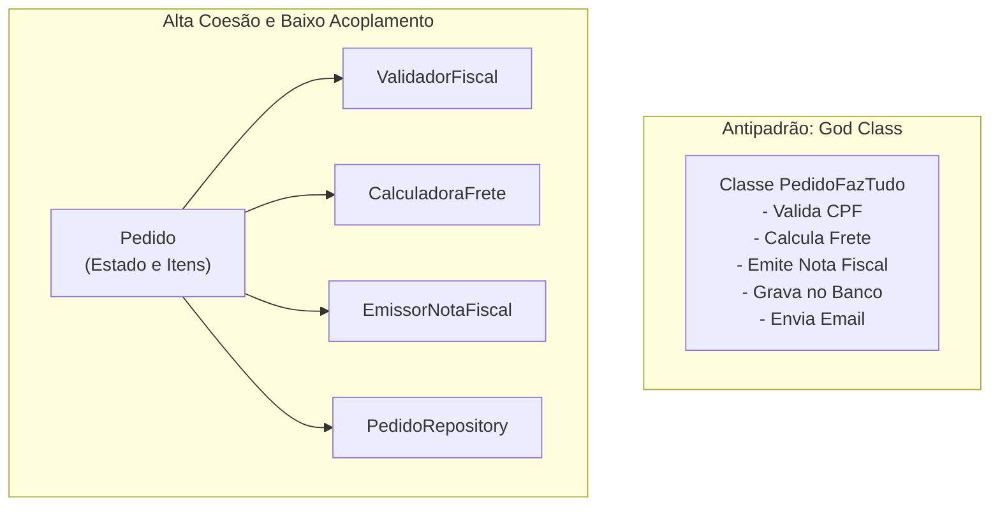

#### Baixo Acoplamento
- **Definição:** Grau de interdependência e conexão entre diferentes módulos ou classes de um sistema.
- **Motivação:** Reduzir o efeito dominó, no qual a modificação de uma classe exige alterações em dezenas de outros arquivos do projeto.
- **Exemplo:** Classes dependendo de interfaces ou contratos abstratos (`Notificador`), e não de implementações concretas (`EmailSendGridService`).
- **Contraexemplo:** Uma classe instanciando manualmente todas as suas dependências internas com o operador `new` dentro de seus métodos de negócio.
- **Armadilha:** Tentar atingir "acoplamento zero", o que fragmenta a arquitetura em abstrações desnecessárias que aumentam a complexidade de leitura do código sem ganhos operacionais.

#### Alta Coesão
- **Definição:** Medida de quão focadas e fortemente relacionadas estão as responsabilidades atribuídas a uma única classe ou componente.
- **Motivação:** Facilitar a compreensão do código, isolar pontos de falha e viabilizar testes unitários automatizados.
- **Exemplo:** Uma classe `CalculadoraTributaria` que possui como responsabilidade única o cálculo de alíquotas fiscais, sem interagir com telas, bancos de dados ou conexões de rede.
- **Contraexemplo:** A criação de uma **God Class** (`GerenciadorGeralDoSistema`) com mais de 3.000 linhas de código, acumulando regras de negócio, manipulação de banco de dados e desenho de telas.
- **Armadilha:** Coesão excessivamente fragmentada, na qual classes contêm apenas um método trivial com uma linha de código, dispersando o fluxo de raciocínio da engenharia em dezenas de arquivos desnecessários.

### Reúso e Extensibilidade

- **Reúso de Software:** Capacidade de utilizar componentes, bibliotecas e abstrações testadas em novos módulos sem necessidade de reprogramação. Pode ocorrer por composição de objetos, bibliotecas utilitárias ou frameworks corporativos.
- **Extensibilidade:** Capacidade de adicionar novos recursos a um sistema sem modificar o código-fonte pré-existente e estável. Na engenharia de software, este princípio é formalizado pelo **Princípio Aberto/Fechado (OCP)**: entidades de software devem estar abertas para extensão, mas fechadas para modificação.

### Introdução aos Princípios SOLID e Padrões GoF

Durante a etapa de projeto detalhado, a modelagem de classes apoia-se em dois referenciais clássicos da literatura:

#### Princípios SOLID
- **S — Single Responsibility Principle (SRP):** Uma classe deve ter um, e apenas um, motivo para ser modificada (fundamento da Alta Coesão).
- **O — Open/Closed Principle (OCP):** Comportamentos devem ser estendidos por herança ou composição polimórfica, sem alteração de código consolidado.
- **L — Liskov Substitution Principle (LSP):** Objetos de uma superclasse devem poder ser substituídos por objetos de suas subclasses sem comprometer a consistência do programa.
- **I — Interface Segregation Principle (ISP):** Clientes não devem ser forçados a depender de interfaces com métodos que não utilizam; interfaces pequenas e específicas são preferíveis.
- **D — Dependency Inversion Principle (DIP):** Módulos de alto nível não devem depender de módulos de baixo nível; ambos devem depender de abstrações (fundamento do Baixo Acoplamento).

#### Padrões de Projeto GoF (Gang of Four)
- **Strategy:** Permite definir uma família de algoritmos intercambiáveis em tempo de execução, encapsulando cada um sob uma interface comum (ex.: cálculo de frete via Correios, Transportadora ou Retirada).
- **Factory Method:** Define uma interface para criação de objetos, delegando às subclasses a decisão de qual classe concreta instanciar.
- **Observer:** Estabelece uma dependência de um-para-muitos entre objetos, notificando observadores automaticamente sobre alterações de estado em um sujeito central.
- **Adapter:** Converte a interface de uma classe na interface esperada pelo cliente, viabilizando a integração entre componentes incompatíveis.
- **Facade:** Provê uma interface unificada e simplificada para um subsistema complexo, reduzindo o acoplamento do cliente com módulos internos.

---

## Engenharia e Elicitação de Requisitos de Software

### Distinção Epistemológica: Levantar versus Elicitar

A literatura especializada e as diretrizes do SWEBOK (IEEE) estabelecem uma distinção formal entre duas posturas profissionais:

- **Levantamento de Requisitos (Gathering):** Postura passiva do desenvolvedor. Assume que os requisitos já existem de forma clara e acabada na mente do usuário, bastando recolhê-los e transcrevê-los.
- **Elicitação de Requisitos (Elicitation):** Do latim *elicitare* ("provocar", "fazer sair", "trazer à luz"). Postura ativa e investigativa. Reconhece que os clientes possuem dores, ineficiências operacionais e expectativas vagas, cabendo ao engenheiro desvendar necessidades implícitas, regras tácitas e restrições não declaradas.

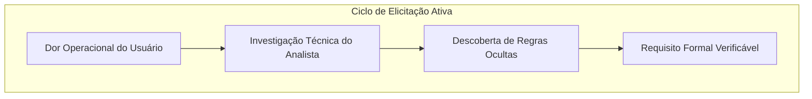

### A Cadeia Causal da Engenharia de Requisitos

A transformação de uma queixa em um requisito de software segue uma cadeia estrita de causalidade:

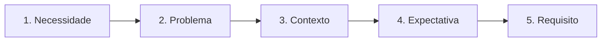

1. **Necessidade:** O objetivo estratégico de sobrevivência ou crescimento da empresa (ex.: "Reduzir as perdas financeiras decorrentes de inadimplência").
2. **Problema:** A barreira factual que impede o atendimento da necessidade (ex.: "Vendas a prazo são aprovadas sem consulta prévia a serviços de proteção ao crédito").
3. **Contexto:** O cenário humano, operacional e tecnológico em que o problema se manifesta (ex.: "Atendentes operam caixas sob pressão de fila e lançam autorizações manuais de crédito em comandas físicas").
4. **Expectativa:** A projeção mental simplificada do stakeholder sobre a intervenção da tecnologia (ex.: "Quero que o sistema bloqueie clientes maus pagadores automaticamente").
5. **Requisito:** A especificação técnica formal, mensurável e testável do comportamento do sistema (ex.: "O sistema deve consultar o serviço Serasa via API REST em até 1,5s antes de confirmar transações a prazo, bloqueando clientes com score inferior a 600 pontos").

### As Seis Perguntas Cardinais da Elicitação

Diante de qualquer novo projeto, o analista deve responder a seis perguntas essenciais:

1. **Qual problema existe?** Isolar a causa raiz do processo, separando o problema real de sintomas superficiais.
2. **Quem enfrenta o problema?** Identificar atores primários (operadores da interface), secundários (gestores que consomem relatórios) e terciários (órgãos reguladores, fisco).
3. **Como ele é resolvido atualmente?** Mapear o processo *As-Is* (planilhas manuais, anotações em papel ou sistemas legados deficientes).
4. **O que o sistema precisa fazer?** Especificar as capacidades computacionais, regras e validações necessárias no processo *To-Be*.
5. **Quais são as restrições?** Mapear limites orçamentários, de tempo de entrega, exigências legais (como LGPD e SEFAZ) e restrições de infraestrutura técnica.
6. **O que é prioridade?** Identificar o que integra o escopo vital imediato (MVP) versus conveniências que podem ser postergadas.

### O Risco da Premissa de Desenvolvimento Prematuro

Considere a seguinte manifestação do cliente:
> *"Preciso de um sistema para melhorar meu negócio."*

A Engenharia de Software contraindica iniciar a codificação ou modelagem com base em declarações desse tipo por quatro razões técnicas:
- **Ausência de Critérios de Aceitação:** Não há definição mensurável do que constitui "melhorar", inviabilizando a homologação formal de entrega.
- **Corrupção de Escopo (*Scope Creep*):** Na ausência de fronteiras explícitas, o cliente exigirá a inclusão infinita de funcionalidades, alegando que faziam parte do objetivo original.
- **Assimetria de Conhecimento:** O cliente conhece as rotinas de seu negócio, mas desconhece os limites da computação (integridade referencial, concorrência, latência); o engenheiro domina a tecnologia, mas desconhece os termos específicos do domínio do cliente.
- **Automação do Caos:** Informatizar um processo de trabalho desorganizado gera apenas um processo caótico automatizado, amplificando erros operacionais em maior velocidade.

### Desconstrução e Refatoração de Ambiguidade

Termos subjetivos como "rápido", "fácil de usar", "seguro" e "robusto" constituem **anti-requisitos**. Eles devem ser refatorados em métricas observáveis:

| Declaração Ambígua | Erro Técnico Típico | Refatoração Técnica da Engenharia (RNF Formal) |
| :--- | :--- | :--- |
| "O sistema deve ser rápido." | Incluir paginação sem avaliar carga no banco. | **RNF (Desempenho):** O tempo de resposta para consultas de produtos com filtros combinados deve ser inferior a 800 milissegundos para o percentil 95 (p95), sob concorrência de 150 requisições por segundo. |
| "A interface deve ser simples e intuitiva." | Deixar a tela com fundo branco e poucos botões. | **RNF (Usabilidade):** Um operador recém-contratado deve concluir a abertura de uma ordem de serviço em até 2 minutos após um treinamento único de 15 minutos, com taxa de erro de preenchimento inferior a 1%. |
| "O sistema precisa ser seguro." | Definir senhas com chave estática no banco. | **RNF (Segurança):** Todas as credenciais de acesso devem ser armazenadas com hash criptográfico usando o algoritmo Argon2id (com parâmetros mínimos de 64 MB de memória), e sessões administrativas devem expirar após 15 minutos de inatividade. |

### Taxonomia das Técnicas de Elicitação

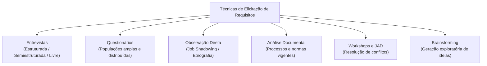

#### 1. Entrevistas
- **Estruturada:** Formulário rígido de perguntas prévias. Facilita comparações quantitativas, mas impede a investigação de problemas imprevistos.
- **Semiestruturada (Recomendada):** Roteiro base com perguntas-guia abertas, concedendo flexibilidade ao analista para aprofundar tópicos conforme as respostas do usuário.
- **Livre / Não Estruturada:** Conversa exploratória inicial. Útil em fases preliminares de domínios desconhecidos, mas com alto custo de síntese.

#### 2. Questionários
- Instrumento aplicado a amostras massivas de usuários dispersos geograficamente. Baixo custo por respondente, mas apresenta taxas históricas baixas de retorno e impossibilidade de esclarecimento de dúvidas em tempo real.

#### 3. Observação Direta (Etnografia e *Job Shadowing*)
- O analista acompanha a jornada operacional do usuário no posto de trabalho. Revela passos não documentados pelo usuário por automatismo procedural ("memória muscular"), além de atalhos e contornos manuais não oficiais.

#### 4. Análise Documental
- Estudo de manuais operacionais, formulários de papel, relatórios fiscais legados e legislações vigentes. Fornece dados objetivos sobre regras de negócio consolidadas.

#### 5. Workshops e JAD (*Joint Application Design*)
- Sessões intensivas com stakeholders de departamentos distintos e a equipe técnica, com o objetivo de alinhar interesses conflitantes e definir requisitos de forma conjunta.

### Classificação de Requisitos: Funcionais, Não Funcionais e Regras de Negócio

- **Requisitos Funcionais (RF):** Descrevem o que o sistema deve executar em termos de serviços, comportamentos e transformações de dados em resposta a estímulos (ex.: "O sistema deve calcular a média aritmética ponderada dos bimestres").
- **Requisitos Não Funcionais (RNF):** Estabelecem critérios de qualidade, propriedades de engenharia e restrições operacionais sob as quais o sistema deve atuar (ex.: desempenho, segurança, disponibilidade, portabilidade e usabilidade).
- **Regras de Negócio (RN):** Políticas, restrições operacionais e exigências legais que existem no mundo real independentemente da tecnologia adotada, mas que o software é obrigado a cumprir compulsoriamente (ex.: "Equipamentos biomédicos não podem operar com calibração metrológica vencida há mais de 365 dias").

---

## Gerenciamento de Escopo e Priorização via Método MoSCoW

### Fundamentação Teórica da Priorização Ágil

Desenvolvido por Dai Clegg no framework DSDM (*Dynamic Systems Development Method*), o método **MoSCoW** fornece um mecanismo estruturado para negociação e gestão de escopo entre partes interessadas e equipes de desenvolvimento. Ele previne a sobrecarga de trabalho e garante a entrega previsível de versões operacionais utilizáveis.

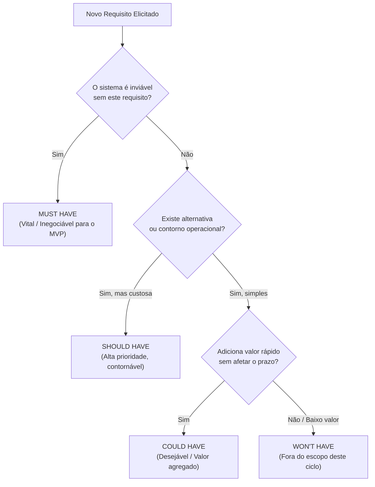

### As Quatro Categorias MoSCoW

1. **M — Must Have (Deve Ter):**
   - Requisitos vitais e inegociáveis. Se um único requisito desta categoria for omitido, o sistema não pode entrar em operação (o produto falha do ponto de vista legal ou operacional).
2. **S — Should Have (Deveria Ter):**
   - Requisitos de alta relevância que agregam valor significativo ao negócio. Não inviabilizam o lançamento da versão caso ausentes, pois existem contornos operacionais manuais temporários.
3. **C — Could Have (Poderia Ter):**
   - Funcionalidades desejáveis que melhoram a experiência do usuário. São implementadas apenas se os itens Must e Should forem finalizados com folga de prazo e recursos.
4. **W — Won't Have this time (Não Terá desta vez):**
   - Requisitos reconhecidos como úteis para a evolução do produto, mas formalmente acordados como fora do escopo da versão atual, evitando o comprometimento do cronograma.

### Prevenção da Corrupção de Escopo e Definição do MVP

O método MoSCoW atua como uma barreira técnica contra a **Corrupção de Escopo** (*Scope Creep*), fenômeno no qual novas solicitações entram no projeto sem análise de impacto no prazo e nos custos. Ao concentrar os esforços nos requisitos classificados como *Must Have*, a equipe garante a entrega do **Produto Mínimo Viável (MVP)**, possibilitando feedback antecipado do mercado.

### O Pipeline das Sete Etapas do Projeto de Software

A metodologia adotada na disciplina organiza o projeto de software em sete etapas sucessivas:

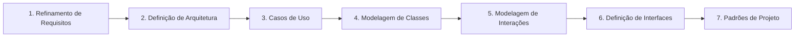

1. **Refinamento do Modelo de Análise e Requisitos:** Extração, especificação e priorização (aplicação do MoSCoW).
2. **Definição da Arquitetura:** Seleção de padrões macroestruturais, tecnologia e distribuição de subsistemas.
3. **Casos de Uso:** Mapeamento do comportamento externo da aplicação a partir dos atores.
4. **Modelagem de Classes:** Representação da estrutura estática do domínio por classes, atributos e associações.
5. **Modelagem de Interações:** Representação do fluxo dinâmico de troca de mensagens no tempo (Diagramas de Sequência).
6. **Definição de Interfaces:** Formalização de contratos de comunicação de APIs e leiautes de telas.
7. **Aplicação de Padrões de Projeto (Design Patterns):** Refinamento do projeto com soluções estruturais e comportamentais consagradas (GoF).

---

## Modelagem de Casos de Uso na UML

### Propósito e a Abordagem Caixa-Preta

O **Diagrama de Casos de Uso** é um diagrama comportamental da UML que apresenta a fronteira do sistema e o conjunto de serviços que este provê ao ambiente externo.

A modelagem de casos de uso adota a abordagem de **Caixa-Preta** (*Black-Box Modeling*):
- O foco responde estritamente a: *"O que o sistema faz para o usuário?"*
- São deliberadamente omitidos esquemas de tabelas de banco de dados, consultas SQL, algoritmos internos de processamento e elementos específicos de interface gráfica.

### Elementos Básicos do Modelo de Casos de Uso

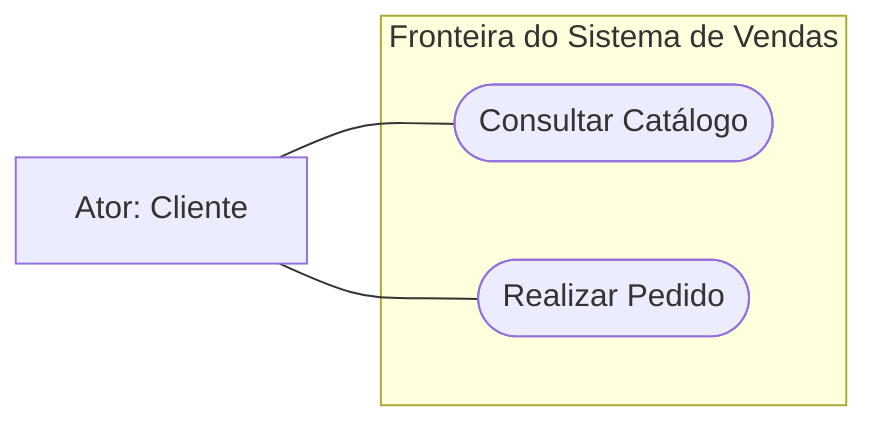

1. **Atores:** Papéis ideais desempenhados por entidades externas que interagem com o sistema (usuários humanos, sensores físicos ou outros sistemas computacionais integrados).
   - *Atores Primários:* Disparam o caso de uso para alcançar um objetivo de negócio direto.
   - *Atores Secundários:* Prestam serviços de apoio ou infraestrutura ao sistema quando solicitados (ex.: Gateways de Pagamento, Serviços de Mensageria).
2. **Casos de Uso:** Representam uma unidade discreta e completa de funcionalidade que entrega um valor mensurável para um determinado ator.
   - *Regra de Nomenclatura:* O identificador deve começar obrigatoriamente com um verbo de ação no infinitivo, seguido de complemento direto (ex.: `Efetuar Matrícula`, `Consultar Saldo`). Nomes substantivados como `Cadastro` violam o padrão da UML.
3. **Fronteira do Sistema (*Subject Boundary*):** Retângulo delimitador que define o perímetro de responsabilidade do software em desenvolvimento. Casos de uso residem dentro da fronteira; atores residem fora.

### Relacionamentos entre Casos de Uso e Atores

A ligação entre um ator e um caso de uso é formalizada por uma **Associação de Comunicação** (linha sólida contínua). Ela representa a troca de dados e estímulos entre o ator e o sistema, sem direção obrigatória de navegação, visto que a interação é conceitualmente bidirecional.

### Análise Profunda: Include versus Extend

A distinção entre os relacionamentos de dependência estereotipados `<<include>>` e `<<extend>>` é fundamental para a integridade do modelo:

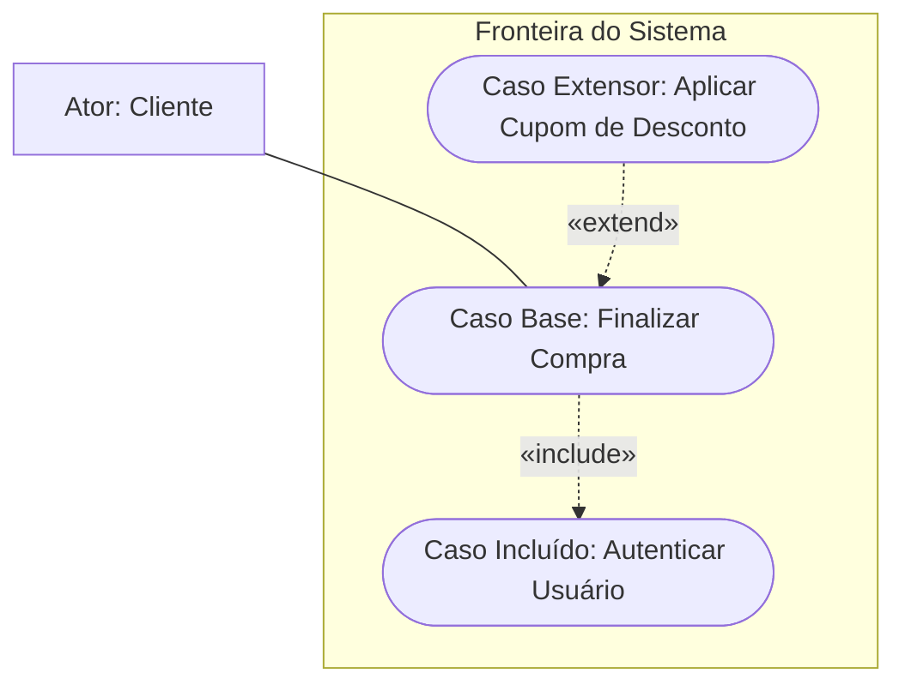

| Critério de Comparação | Inclusão (`<<include>>`) | Extensão (`<<extend>>`) |
| :--- | :--- | :--- |
| **Obrigatoriedade** | Mandatória e incondicional | Opcional e sujeita a condição de guarda |
| **Sentido da Seta** | Do Caso Base para o Caso Incluído | Do Caso Extensor para o Caso Base |
| **Independência da Base** | O caso base é incompleto sem o incluído | O caso base é completo e funcional por si só |
| **Ponto de Extensão** | Não utiliza; ancoragem implícita no fluxo | Exige a declaração de *Extension Point* na base |
| **Objetivo Primário** | Reuso e fatoração de rotinas comuns (DRY) | Desacoplamento de fluxos opcionais ou de exceção |

- **Inversão Semântica da Seta no Extend:** No `<<extend>>`, a seta tracejada aponta do caso de uso opcional para o caso base (`Extensor -.-> Base`). Isso decorre do princípio arquitetural de baixo acoplamento: o caso base não precisa saber que foi estendido, mas o módulo extensor deve apontar a funcionalidade que complementa.

### Generalização de Atores e Casos de Uso

A relação de generalização (linha sólida com triângulo vazado) aplica o princípio de herança conceitual no modelo comportamental:

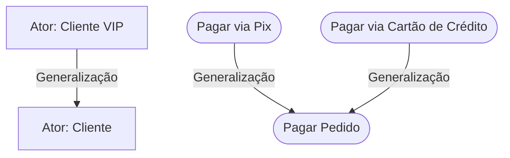

- **Entre Atores:** O ator especializado herda todas as associações a casos de uso do ator ancestral, podendo interagir com funcionalidades restritas ao seu papel.
- **Entre Casos de Uso:** O caso de uso genérico define o objetivo abstrato (`Pagar Pedido`), enquanto os casos especializados fornecem implementações operacionais distintas (`Pagar via Pix`, `Pagar via Cartão de Crédito`).

### Especificação Textual Canônica de Casos de Uso

O diagrama fornece a visão estrutural do sistema; a especificação textual documenta os fluxos operacionais detalhados. O padrão canônico (derivado do modelo de Alistair Cockburn) estrutura a documentação conforme o seguinte modelo:

1. **Identificador e Nome:** Código padronizado e verbo no infinitivo.
2. **Objetivo / Resumo:** Descrição sucinta do valor entregue ao ator.
3. **Atores:** Identificação do ator primário iniciador e de atores secundários colaboradores.
4. **Pré-condições:** Estados obrigatórios que o sistema deve garantir antes do disparo do caso.
5. **Pós-condições (Garantias de Sucesso):** O estado definitivo do sistema após o término bem-sucedido.
6. **Gatilho (*Trigger*):** O estímulo inicial que dispara o fluxo.
7. **Fluxo Principal (Caminho Feliz):** Passos sequenciais ideais e numerados que levam ao sucesso.
8. **Fluxos Alternativos:** Desvios documentados que também encerram com o objetivo atingido.
9. **Fluxos de Exceção:** Respostas a falhas técnicas ou de dados que encerram a transação sem sucesso.
10. **Regras de Negócio Associadas:** Regras de negócio que o caso de uso deve assegurar.

---

## Modelagem Estrutural: O Diagrama de Classes da UML

### Natureza e Princípios da UML

A **Unified Modeling Language (UML)** é a linguagem gráfica padrão adotada pela Object Management Group (OMG) para visualização, especificação, construção e documentação de sistemas de software orientados a objetos.

A UML foi concebida na década de 1990 pela unificação dos trabalhos de Grady Booch (método Booch), James Rumbaugh (técnica OMT) e Ivar Jacobson (método OOSE) — conhecidos coletivamente como os *Three Amigos*.

Princípios centrais da modelagem:
- A escolha dos modelos influencia diretamente a abordagem da solução.
- Nenhum modelo isolado é suficiente; arquiteturas complexas demandam perspectivas estruturais e comportamentais complementares.
- Os modelos podem transitar por diferentes graus de precisão, desde visões de negócio de alto nível até especificações técnicas detalhadas de implementação.

### Diferença entre Notação e Metodologia

Uma distinção fundamental na engenharia de software separa notações de processos de desenvolvimento:

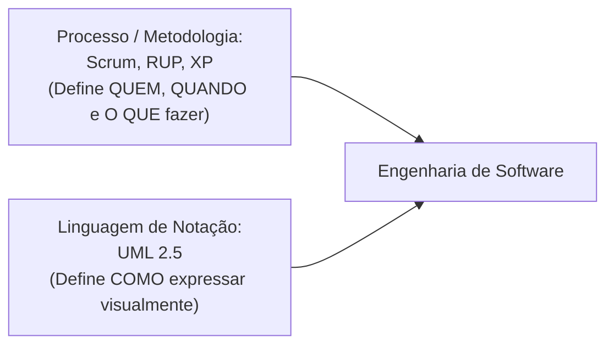

- **A UML NÃO é um processo nem uma metodologia.** Ela não prescreve datas, cerimônias ágeis ou ordem de etapas.
- **A UML É uma notação gráfica.** É um vocabulário padronizado com sintaxe e semântica estritas para documentar artefatos de engenharia. Pode ser utilizada tanto em processos tradicionais (Cascata/RUP) quanto em processos ágeis (Scrum, Kanban, XP).

### Anatomia Estrutural da Classe: Nome, Atributos e Operações

No Diagrama de Classes, a classe é representada por um retângulo dividido em três compartimentos horizontais:

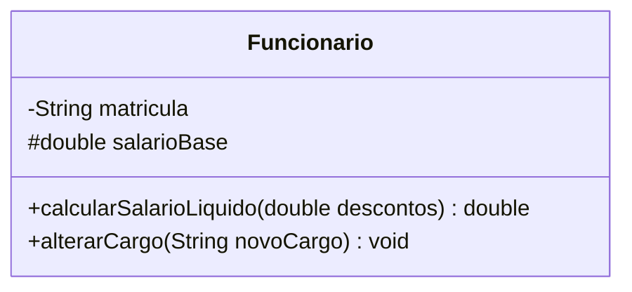

1. **Compartimento Superior (Identificador):** Nome da classe em PascalCase.
2. **Compartimento Central (Atributos):** Declaração formal das variáveis de instância.
   - *Sintaxe Oficial:* `[visibilidade] nome : tipo [multiplicidade] = [valorPadrao]`
3. **Compartimento Inferior (Operações / Métodos):** Funções e comportamentos da classe.
   - *Sintaxe Oficial:* `[visibilidade] nomeOperacao([parametro : tipo]) : tipoRetorno`

### Padrões de Nomenclatura e Convenções do Domínio

- **Nomes de Classes:** Substantivos no singular, utilizando convenção **PascalCase** (ex.: `PedidoVenda`, `Paciente`, `ItemEstoque`). Devem refletir a Linguagem Ubíqua do domínio.
- **Nomes de Atributos:** Substantivos ou adjetivos em **camelCase** (ex.: `dataVencimento`, `limiteCredito`).
- **Nomes de Métodos:** Verbos no infinitivo em **camelCase** (ex.: `calcularSubtotal()`, `emitirRecibo()`).

### Modificadores de Visibilidade e Níveis de Encapsulamento

A notação UML define os seguintes símbolos universais para visibilidade:

| Modificador UML | Símbolo | Palavra-chave Java | Escopo de Acesso Permitido |
| :--- | :---: | :--- | :--- |
| **Público (Public)** | `+` | `public` | Acessível por qualquer classe em qualquer pacote. |
| **Protegido (Protected)** | `#` | `protected` | Acessível pela própria classe, subclasses e classes do mesmo pacote. |
| **Privado (Private)** | `-` | `private` | Acessível exclusivamente dentro da própria classe que o declarou. |
| **Pacote (Package)** | `~` | *(sem modificador)* | Acessível somente por classes pertencentes ao mesmo pacote lógico. |

### Navegabilidade e Multiplicidades

A multiplicidade define o número exato ou intervalo de instâncias de uma classe que podem se relacionar com uma instância de outra classe:

| Notação | Significado Semântico |
| :--- | :--- |
| `1` | Exatamente uma instância obrigatória. |
| `0..1` | Opcional; zero ou no máximo uma instância associada. |
| `*` ou `0..*` | Zero, uma ou múltiplas instâncias associadas. |
| `1..*` | Pelo menos uma instância associada (cardinalidade mínima obrigatória). |
| `m..n` | Intervalo fechado de instâncias permitidas (ex.: `2..4`). |

A navegabilidade é representada por uma ponta de seta na linha de associação. A ausência de setas indica comunicação bidirecional; uma ponta de seta aberta indica que apenas uma das partes mantém a referência da outra (navegabilidade unidirecional).

### Relacionamentos Estruturais: Associação, Agregação e Composição

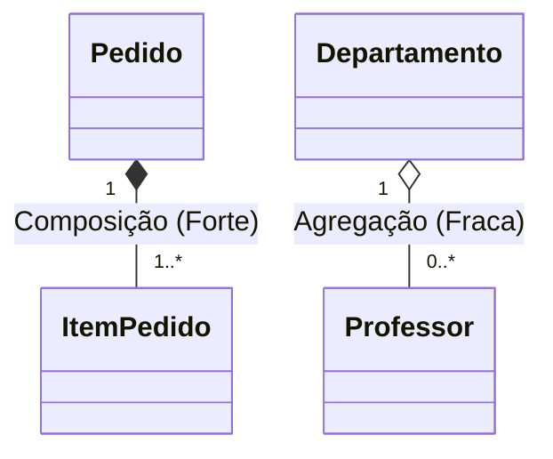

1. **Associação Simples:** Conexão semântica estrutural entre classes independentes (ex.: `Cliente` realiza `Pedido`).
2. **Agregação (Todo-Parte Fraco - Losango Vazio):**
   - Relação todo-parte em que o objeto-parte pode existir independentemente do objeto-todo.
   - Ciclos de vida são desacoplados. Se o objeto-todo for destruído, a parte permanece ativa no sistema.
   - *Exemplo:* Um `Departamento` agrega `Professores`. Se o departamento for extinto, os professores continuam existindo na instituição.
3. **Composição (Todo-Parte Forte - Losango Preenchido):**
   - Relação todo-parte estrita em que o objeto-parte pertence com exclusividade a um único objeto-todo.
   - Ciclos de vida são estritamente coincidentes e dependentes. A destruição do objeto-todo acarreta a exclusão em cascata das partes.
   - *Exemplo:* Um `Pedido` compõe seus `ItensPedido`. Não faz sentido manter instâncias de itens de pedido órfãs caso o pedido seja excluído.

### Generalização Estrutural e Dependência Transitória

- **Generalização (Herança):** Linha sólida com triângulo vazado apontando para a superclasse. Define uma relação "É UM", na qual atributos e operações comuns são herdados por subclasses especializadas.
- **Dependência (Uso Transitório):** Linha tracejada com seta aberta apontando para a classe utilizada. Indica que uma classe utiliza temporariamente outra em suas operações (por exemplo, como parâmetro de método ou variável local transitória), sem manter referência persistente em seus atributos.

---

## Arquitetura de Software: O Padrão MVC Clássico no Smalltalk-80

### Origem Histórica no Xerox PARC

No final da década de 1970, o *Learning Research Group* do Xerox Palo Alto Research Center (PARC), liderado por Alan Kay, Adele Goldberg e Dan Ingalls, concebeu o ambiente Smalltalk-80, pioneiro no uso prático de interfaces gráficas baseadas em janelas sobrepostas, ícones e dispositivos de apontamento (mouse de três botões).

Em versões preliminares, programas gráficos desenhavam primitivas diretamente no mapa de bits da tela (*bitmapped display*) através da classe primitiva `Pen`. Contudo, essa escrita direta tornava inviável a convivência entre múltiplas janelas sem sobreposição e corrupção visual. 

O padrão **Model-View-Controller (MVC)**, documentado em seus fundamentos técnicos por Steve Burbeck, foi concebido para possibilitar a separação entre dados de negócio, desenho em tela e tratamento de dispositivos de entrada, viabilizando o compartilhamento cooperativo do hardware gráfico.

### A Divisão de Responsabilidades na Tríade MVC

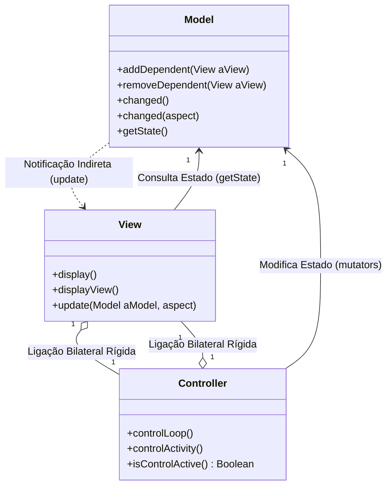

1. **Model (Modelo):** Encapsula os dados de domínio e as regras de negócio da aplicação. É agnóstico quanto à representação visual e desconhece a existência de janelas e controladores. Responde a mensagens de consulta sobre seu estado e processa comandos de mutação.
2. **View (Visão):** Gerencia a exibição gráfica na porção do mapa de bits alocada para a sua aplicação. Mantém as coordenadas de exibição, calcula transformações geométricas e renderiza dados ao ser notificada de alterações.
3. **Controller (Controlador):** Captura os eventos físicos de entrada originados do usuário (movimentação do mouse, cliques de botões e teclas digitadas), traduzindo essas entradas em comandos de negócio para o modelo ou em ajustes operacionais para a visão (como rolagem de tela).

### Modelos Passivos versus Modelos Ativos

Steve Burbeck classifica os modelos quanto à sua autonomia de atualização:

- **Modelo Passivo:** Seu estado interno é alterado exclusivamente por solicitações diretas originadas do controlador da própria tríade MVC na qual reside. Exemplo: um editor de texto básico operando sobre uma instância de `String`. O controlador captura a tecla, muta a string e ordena que a visão redesenhe o conteúdo. A classe de dados permanece passiva e não necessita manter lista de dependentes.
- **Modelo Ativo:** Seu estado interno pode ser alterado por processos externos à tríade imediata (como threads de segundo plano ou outras janelas conectadas ao mesmo modelo). Exemplo canônico no Smalltalk: `SystemTranscript` (o console global de logs). Quando um processo em background grava dados no log, a visão precisa ser notificada automaticamente. O modelo ativo dispara a notificação `self changed` para todos os observadores registrados.

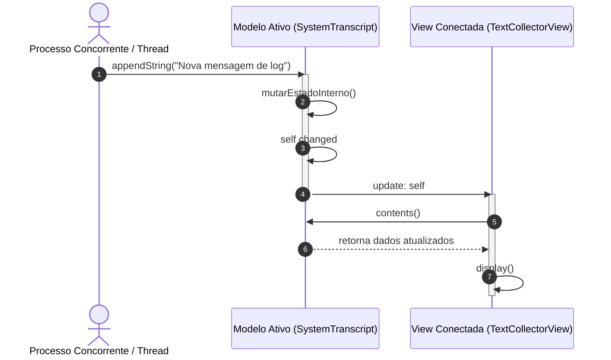

### Protocolo Reativo de Notificação: changed e update

O ciclo reativo de notificação opera em duas etapas:

1. **Disparo pelo Modelo:** Quando o estado do modelo é alterado, ele executa internamente:
   ```smalltalk
   self changed. "Notificação genérica"
   self changed: #aspectoEspecifico. "Notificação parametrizada"
   ```
2. **Recepção pela Visão:** As visões registradas como dependentes implementam o método de callback correspondente:
   ```smalltalk
   update: aModel
       self display.

   update: aModel with: anAspect
       anAspect == #aspectoEspecifico ifTrue: [ self displayView ].
   ```

### Evolução Interna: DependentFields versus Classe Model

- **Smalltalk-80 v2.0 (`DependentFields`):** Qualquer classe herdava de `Object` a capacidade de ser observada. Para evitar consumo desnecessário de memória em instâncias que nunca seriam modelos, utilizava-se uma variável de classe global chamada `DependentFields` (uma tabela hash `IdentityDictionary`). As chaves eram os objetos-modelo e os valores eram coleções de visões. Essa abordagem introduzia gargalos de concorrência e retenção acidental de memória (*memory leaks*) por entradas órfãs na tabela.
- **Smalltalk-80 v2.5 (Classe `Model` Dedicada):** Para eliminar a sobrecarga do dicionário global, introduziu-se a classe abstrata `Model`. A classe incorporou uma variável de instância dedicada denominada `dependents`, otimizada para assumir três estados:
  - `nil`: sem observadores registrados.
  - Uma referência direta a um único objeto: quando apenas uma visão observa o modelo (economizando alocação de coleções).
  - Uma instância de `DependentsCollection`: quando múltiplos observadores estão registrados.

### Acoplamento Bilateral View-Controller e o Padrão Observer

A topologia de acoplamento do padrão MVC clássico do Smalltalk organiza-se de duas maneiras:

1. **Ligação Bilateral View-Controller (Acoplamento Direto 1:1):** A `View` mantém uma referência direta ao seu `Controller`, e o `Controller` mantém uma referência direta à sua `View`. O controlador precisa conhecer os limites visuais da visão para validar se o clique do mouse ocorreu dentro de sua área (*viewport*), e a visão precisa do controlador para coordenar modos de interação.
2. **Ligação Model-View (Acoplamento Indireto / Observer):** A `View` referencia diretamente o `Model` para consultar seu estado durante o redesenho. O `Model`, por sua vez, **não possui referências nominais diretas às visões**; ele apenas referencia a coleção genérica de dependentes do padrão Observer.

### Composição Visual Hierárquica e Pluggable Views

No Smalltalk-80, janelas complexas estruturam-se por meio de uma árvore de visões compostas (precursora direta do padrão estrutural *Composite* do GoF):

- **TopView:** Componente raiz da janela. Mantém a borda externa, o título e os botões de controle de janela (colapsar, redimensionar e fechar). Não exibe dados de domínio diretamente.
- **SubViews:** Painéis internos filhos que renderizam partes específicas do modelo (ex.: caixas de texto, listas de seleção e botões).
- **Pluggable Views (Visões Plugáveis):** Criadas para contornar a rigidez de subclasses no Smalltalk v2.5. Permitem que uma mesma classe visual (ex.: `PluggableListView`) seja conectada a diferentes modelos sem necessidade de criar subclasses específicas, adaptando-se por meio de seletores configuráveis que definem quais métodos de consulta e mutação devem ser chamados.

### Pipeline de Renderização e WindowingTransformation

A renderização gráfica segue uma rotina hierárquica coordenada:

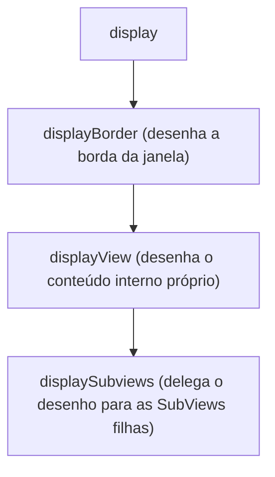

Para garantir que cada visão desenhe apenas dentro de sua área sem invadir janelas vizinhas, a classe `WindowingTransformation` calcula conversões geométricas bidirecionais contínuas entre:
- **Espaço de Coordenadas da Janela (Window Space):** Coordenadas lógicas relativas ao conteúdo exibido.
- **Espaço de Coordenadas da Tela (Viewport / Screen Space):** Coordenadas físicas em pixels absolutos no monitor.

### Controle Cooperativo e Despacho de Eventos

Diferente dos sistemas operacionais modernos preemptivos baseados em threads múltiplas na interface gráfica, o Smalltalk-80 operava sob um modelo de **multitarefa cooperativa unithread**:

- **ControlManager (`ScheduledControllers`):** Mantém a lista hierárquica de controladores associados às janelas ativas na tela.
- **Ciclo de Controle Cooperativo:** O `ControlManager` pesquisa sequencialmente qual controlador de janela contém a coordenada atual do cursor do mouse (`isControlActive`). O controlador selecionado assume o processamento e executa seu laço interno (`controlLoop`). Ao término da ação ou quando o cursor deixa o enquadramento da janela, o controlador cede o controle de volta ao `ControlManager`.
- **Mouse Clássico de Três Botões:**
  - **Red Button (Botão Esquerdo):** Interação primária de seleção, arraste de itens e posicionamento de cursor de texto.
  - **Yellow Button (Botão Central / Roda):** Abre menus de contexto específicos da visão interna ativa (ex.: comandos de edição).
  - **Blue Button (Botão Direito):** Dispara o menu global de gerenciamento da janela (mover, redimensionar, colapsar, fechar).

---

## Estudos de Caso e Aplicação Prática dos Trabalhos da Disciplina

### Estudo de Caso 1: Comércio Eletrônico e Vendas (Atividade Classe / Aula 04)

#### Descrição do Domínio
Plataforma de comércio eletrônico para pesquisa de produtos, gerenciamento de pedidos e transações financeiras digitais.

#### Requisitos Funcionais Mapeados
- **RF01:** O sistema deve permitir que clientes consultem produtos por categorias e termos textuais.
- **RF02:** O sistema deve permitir que o cliente gerencie itens em seu carrinho de compras virtual.
- **RF03:** O sistema deve exigir autenticação segura para conclusão de transações comerciais.
- **RF04:** O sistema deve permitir a finalização de compras com cálculo automático de frete e roteamento financeiro.
- **RF05:** O sistema deve permitir a inserção condicional de cupons promocionais válidos no fechamento do pedido.
- **RF06:** O sistema deve rotear o faturamento através de um Gateway de Pagamento, admitindo PIX e Cartão de Crédito.
- **RF07:** O sistema deve consultar o status de despacho e entrega de encomendas via integração com transportadora/Correios.
- **RF08:** O sistema deve permitir ao administrador do sistema a manutenção do catálogo de produtos.

#### Diagrama de Casos de Uso Completo

```mermaid
flowchart LR
    subgraph FronteiraEcommerce["Sistema de Comércio Eletrônico"]
        UC01(["UC01: Consultar Catálogo"])
        UC02(["UC02: Gerenciar Carrinho de Compras"])
        UC03(["UC03: Finalizar Compra"])
        UC04(["UC04: Autenticar Usuário"])
        UC05(["UC05: Aplicar Cupom de Desconto"])
        UC06(["UC06: Realizar Pagamento"])
        UC07(["UC07: Pagar via Cartão de Crédito"])
        UC08(["UC08: Pagar via Pix"])
        UC09(["UC09: Rastrear Encomenda"])
        UC10(["UC10: Manter Catálogo de Produtos"])
    end

    Cliente["Cliente"]
    Admin["Administrador"]
    Gateway["Gateway de Pagamento (Externo)"]
    Logistica["Serviço de Logística (Externo)"]

    Cliente --- UC01
    Cliente --- UC02
    Cliente --- UC03
    Cliente --- UC09

    Admin --- UC10
    Admin --|> Cliente

    UC03 -.->|"«include»"| UC04
    UC03 -.->|"«include»"| UC06
    UC05 -.->|"«extend»"| UC03

    UC07 --|> UC06
    UC08 --|> UC06

    UC06 --- Gateway
    UC09 --- Logistica
```

#### Especificação Canônica do Caso de Uso Crítico: UC03 — Finalizar Compra
- **Identificador:** UC03.
- **Nome:** Finalizar Compra.
- **Objetivo:** Converter o carrinho de compras do cliente em um pedido formal com pagamento roteado e baixa provisória de inventário.
- **Ator Primário:** Cliente.
- **Atores Secundários:** Gateway de Pagamento, Serviço de Logística.
- **Pré-condições:** O carrinho de compras deve conter pelo menos um item ativo com estoque disponível.
- **Pós-condições:** Pedido registrado no banco com status `Pendente`, estoque reservado e código identificador gerado.
- **Gatilho:** O cliente clica no botão "Finalizar Pedido" dentro da tela do carrinho.
- **Fluxo Principal:**
  1. O cliente inicia a finalização do carrinho.
  2. O sistema executa o caso de uso `UC04: Autenticar Usuário` (inclusão obrigatória).
  3. O sistema solicita o CEP e calcula o frete através do `Serviço de Logística`.
  4. O sistema exibe o valor consolidado da compra (itens + frete).
  5. O cliente escolhe a forma de pagamento e confirma a transação.
  6. O sistema executa o caso de uso `UC06: Realizar Pagamento` (inclusão obrigatória).
  7. O sistema gera o registro do pedido, reserva os itens no estoque e exibe a confirmação de sucesso com o código do pedido.
- **Fluxo Alternativo (Extensão de Cupom de Desconto):**
  - No passo 4, se o cliente informar um código promocional ativo, o sistema executa o caso de uso `UC05: Aplicar Cupom de Desconto` no ponto de extensão `PONTO_DESCONTO`, recalcula o valor total com abatimento e prossegue para o passo 5.
- **Fluxo de Exceção (Recusa de Pagamento):**
  - No passo 6, se o Gateway de Pagamento recusar a autorização da transação, o sistema emite alerta com a justificativa de recusa, desfaz a reserva de itens no estoque e mantém o carrinho aberto para nova tentativa.

---

### Estudo de Caso 2: Plataforma de Food Delivery (Aula 06)

#### Visão de Mercado Multilateral
O food delivery opera como um ecossistema multilateral que interliga simultaneamente três perfis operacionais com interesses distintos:
- **Cliente:** Deseja catálogo dinâmico, checkout sem atrito e rastreamento em tempo real.
- **Restaurante:** Necessita gerenciar cardápios, comandas de cozinha e filas de despacho.
- **Administrador:** Demanda governança da plataforma, auditoria financeira e moderação de conteúdo.

#### Matriz de Priorização MoSCoW para Food Delivery

| Categoria MoSCoW | Funcionalidades Alocadas | Justificativa de Engenharia de Software |
| :--- | :--- | :--- |
| **Must Have (M)** | Autenticação dos atores, CRUD de cardápio, montagem de carrinho, processamento de pagamento e transição de status do pedido. | Núcleo transacional mínimo indispensável. Sem essas funcionalidades, o sistema não viabiliza nenhuma operação comercial de entrega. |
| **Should Have (S)** | Rastreamento do pedido em tempo real, notificações push, moderação de avaliações e relatórios gerenciais de vendas. | Essenciais para a retenção de usuários e governança. A ausência de push pode ser contornada temporariamente por atualização manual da tela. |
| **Could Have (C)** | Chat em tempo real entre cliente e restaurante, programa gamificado de fidelidade e cupons customizados de desconto. | Incrementos desejáveis de engajamento, mas que podem ser integrados em ciclos posteriores sem inviabilizar a operação. |
| **Won't Have (W)** | Algoritmo preditivo de tempo de cozinha por inteligência artificial e despacho automatizado para frotas terceirizadas avulsas. | Funcionalidades de alta complexidade matemática e de infraestrutura, conscientemente postergadas para releases futuras. |

#### Diagrama de Classes do Domínio de Food Delivery

```mermaid
classDiagram
    class Usuario {
        -String id
        -String nome
        -String email
        -String senhaHash
        +autenticar(String senha) boolean
    }
    class Cliente {
        -String telefone
        -String enderecoEntrega
        +adicionarItemAoCarrinho(ItemCardapio item)
    }
    class Restaurante {
        -String cnpj
        -String razaoSocial
        -boolean aberto
        +atualizarStatusPedido(String idPedido, StatusPedido status)
    }
    class ItemCardapio {
        -String id
        -String titulo
        -double precoUnitario
        -boolean disponivel
    }
    class Pedido {
        -String numeroPedido
        -LocalDateTime dataHora
        -StatusPedido status
        -double valorTotal
        +calcularTotal() double
        +confirmarPagamento()
    }
    class ItemPedido {
        -int quantidade
        -double precoMomento
        +calcularSubtotal() double
    }

    Usuario <|-- Cliente
    Usuario <|-- Restaurante
    Restaurante "1" *-- "1..*" ItemCardapio : Composição
    Cliente "1" --> "0..*" Pedido : Realiza
    Pedido "1" *-- "1..*" ItemPedido : Composição
    ItemPedido "0..*" --> "1" ItemCardapio : Referencia
```

---

### Estudo de Caso 3: HealthTech Solutions - Logística Reversa Hospitalar (Atividade Aula 3)

#### 1. Identificação da Equipe e Alocação dos Papéis
- **Carlos Eduardo Lima (Stakeholder / Diretor de Operações):** Representa a visão executiva e orçamentária, perdas com extravios de equipamentos e penalidades contratuais.
- **Mariana Albuquerque (Stakeholder / Gestora de Almoxarifado Clínico):** Representa as rotinas diárias de recebimento, triagem de desinfecção e controle de certificados metrológicos.
- **Lucas Gabriel Martins (Analista de Sistemas / Engenheiro de Requisitos):** Responsável pela condução investigativa das entrevistas, modelagem da causa raiz e especificação dos requisitos funcionais.
- **Beatriz Helena Souza (Analista de Sistemas / Arquiteta de Software):** Responsável pelos requisitos não funcionais, diagramas arquiteturais e regras de integridade do modelo.

#### 2. Descrição da Situação-Problema (Processo *As-Is*)
A *HealthTech Solutions* gerencia uma base ativa de 3.200 equipamentos hospitalares de alta complexidade (monitores cardíacos, ventiladores mecânicos pulmonares e bombas de infusão) locados para mais de 45 unidades de saúde no estado de São Paulo.

O fluxo operacional atual apresenta fragilidades estruturais:
- O recolhimento de equipamentos avariados é solicitado por canais informais (ligações telefônicas e WhatsApp comercial).
- O atendente anota solicitações em blocos de papel e as transcreve para planilhas isoladas no fim do dia.
- Ordens de coleta são impressas em guias de papel. Motoristas recolhem ativos sem validar números de série nos hospitais.
- Ao ingressar na central técnica, os equipamentos permanecem em quarentena sem identificação visual. A checagem de certificados de calibração exigidos pela ANVISA (RDC nº 63/2011) é realizada manualmente em fichários físicos.

#### 3. Diagnóstico de Causa Raiz pelos 5 Porquês
1. **Problema:** A empresa sofreu autuações de órgãos sanitários e perdeu R$ 1.190.000,00 em ativos no último trimestre.
2. **Por que 1:** Bombas de infusão operavam com certificados vencidos e 14 ventiladores sumiram da base ativa.
3. **Por que 2:** A equipe técnica não localizou os equipamentos em campo nem sabia quais estavam com aferição vencida.
4. **Por que 3:** Os registros de coleta e despacho utilizavam romaneios em papel sem validação de chassi.
5. **Por que 4:** As solicitações eram anotadas em conversas informais e consolidadas tardiamente em planilhas sem validação de dados.
6. **Por que 5 (Causa Raiz):** Inexistência de uma plataforma corporativa integrada de rastreabilidade digital e controle metrológico ponta a ponta com captura móvel de identificadores físicos.

```mermaid
flowchart TD
    S["Sintoma Visível: Multas da ANVISA e extravio de 14 ventiladores (R$ 1,19 milhão)"]
    C1["Causa Nível 1: Bombas operando com calibração vencida e ativos 'em trânsito' infinito"]
    C2["Causa Nível 2: Almoxarifado desconhece localização física e validade metrológica de cada chassi"]
    C3["Causa Nível 3: Coletas em hospitais efetuadas com romaneios de papel sem leitura ótica"]
    C4["Causa Nível 4: Solicitações anotadas informalmente via WhatsApp e planilhas desconectadas"]
    CR["Causa Raiz: Ausência de plataforma digital integrada com leitura de código de barras e gestão metrológica"]

    S --> C1
    C1 --> C2
    C2 --> C3
    C3 --> C4
    C4 --> CR
```

#### 4. Descrição da Solução de Software (*To-Be*)
Desenvolvimento de uma plataforma integrada composta por um backend corporativo, um portal web de gestão e um aplicativo móvel operacional para conferência em campo via leitura de código de barras bidimensional (DataMatrix/QRCode):
- **Controle de Chassi Unitário:** Cada equipamento possui identificador único associado a seu histórico de manutenção e calibração.
- **Rastreabilidade de Custódia:** O motorista só conclui a coleta hospitalar mediante leitura ótica do serial da carcaça e assinatura digital do responsável da unidade clínica.
- **Alerta Metrológico Automático:** O sistema bloqueia a alocação de equipamentos cuja calibração vença nos 30 dias subsequentes à data da locação.

---

### Estudo de Caso 4: MedClinic - Gestão Clínica e Prontuário Eletrônico (Trabalho Semestral)

#### 1. Levantamento de Requisitos Estruturados

##### Requisitos Funcionais (RF)
- **RF01:** O sistema deve permitir o cadastro e gerenciamento unificado de pacientes (dados civis, contatos e histórico clínico).
- **RF02:** O sistema deve viabilizar o agendamento de consultas médicas com verificação de conflitos de horário na grade do profissional.
- **RF03:** O sistema deve emitir notificações automáticas por e-mail e SMS 24 horas antes do horário da consulta agendada.
- **RF04:** O sistema deve disponibilizar módulo de Prontuário Eletrônico do Paciente (PEP) restrito ao médico responsável pelo atendimento.
- **RF05:** O sistema deve permitir a emissão de prescrições médicas digitais estruturadas, integrando validação posológica com base de medicamentos.
- **RF06:** O sistema deve exigir autenticação de dois fatores (2FA) e assinatura digital ICP-Brasil para fechamento de laudos e prescrições.
- **RF07:** O sistema deve consolidar o faturamento financeiro diário e o repasse médico por convênio.

##### Requisitos Não Funcionais (RNF)
- **RNF01 (Segurança e Conformidade):** O sistema deve cumprir integralmente as normas da LGPD e os padrões do CFM/SBIS para Prontuário Eletrônico (nível de garantia de segurança NGS-2).
- **RNF02 (Desempenho):** A recuperação da ficha clínica do paciente não deve exceder o tempo limite de 1,2 segundo sob carga de 200 conexões simultâneas.
- **RNF03 (Disponibilidade):** A infraestrutura deve operar com alta disponibilidade garantindo nível de serviço (SLA) de 99,8% em regime 24/7.

##### Regras de Negócio (RN)
- **RN01:** Apenas médicos com registro ativo no Conselho Regional de Medicina (CRM) podem assinar prescrições e laudos.
- **RN02:** Um prontuário finalizado e assinado digitalmente não pode ser alterado ou excluído do banco de dados (imutabilidade clínica); correções exigem notas de adendo auditadas.
- **RN03:** Consultas canceladas com menos de duas horas de antecedência não liberam o estorno da taxa de agendamento do paciente.

#### 2. Matriz e Diagrama de Priorização MoSCoW

```mermaid
flowchart TD
    subgraph MustHave["MUST HAVE (Essenciais para o MVP)"]
        M1["RF01: Gerenciar Pacientes"]
        M2["RF02: Agendar Consultas"]
        M4["RF04: Prontuário Eletrônico"]
        M6["RF06: Assinatura Digital e 2FA"]
    end

    subgraph ShouldHave["SHOULD HAVE (Alta Prioridade)"]
        S3["RF03: Notificação Automática"]
        S5["RF05: Prescrição Estruturada"]
        S7["RF07: Faturamento e Repasse"]
    end

    subgraph CouldHave["COULD HAVE (Desejáveis)"]
        C1["Telemedicina Integrada"]
        C2["Check-in via Totem QR Code"]
    end

    subgraph WontHave["WON'T HAVE (Ciclos Posteriores)"]
        W1["Triagem Preditiva por IA"]
        W2["Integração com Prontuários Nacionais SUS"]
    end
```

#### 3. Diagrama de Casos de Uso Geral

```mermaid
flowchart LR
    subgraph FronteiraMedClinic["Sistema de Gestão Clínica MedClinic"]
        UC_G01(["Manter Cadastro de Pacientes"])
        UC_G02(["Agendar Consulta Médica"])
        UC_G03(["Atender Consulta no Prontuário"])
        UC_G04(["Emitir Prescrição Médica"])
        UC_G05(["Auditar Registros Clínicos"])
        UC_G06(["Autenticar com 2FA"])
    end

    Recepcionista["Recepcionista"]
    Medico["Médico"]
    Auditor["Auditor Regulatório"]
    ServicoAssinatura["Serviço ICP-Brasil (Externo)"]

    Recepcionista --- UC_G01
    Recepcionista --- UC_G02

    Medico --- UC_G03
    Medico --- UC_G04
    Medico --|> Recepcionista

    Auditor --- UC_G05

    UC_G03 -.->|"«include»"| UC_G06
    UC_G04 -.->|"«include»"| UC_G06
    UC_G04 --- ServicoAssinatura
```

#### 4. Diagrama de Casos de Uso Específico: Módulo de Prontuário Eletrônico

```mermaid
flowchart TD
    subgraph ModuloPEP["Módulo de Prontuário Eletrônico (Específico)"]
        UC_E01(["UC_E01: Registrar Evolução Clínica"])
        UC_E02(["UC_E02: Consultar Histórico Pregresso"])
        UC_E03(["UC_E03: Emitir Prescrição Digital"])
        UC_E04(["UC_E04: Solicitar Exames Laboratoriais"])
        UC_E05(["UC_E05: Alertar Interação Medicamentosa"])
        UC_E06(["UC_E06: Assinar Digitalmente com ICP-Brasil"])
    end

    Medico["Médico Responsável"]
    BaseFarmacologica["Base Farmacológica (Externa)"]

    Medico --- UC_E01
    Medico --- UC_E02

    UC_E01 -.->|"«include»"| UC_E06
    UC_E01 -.->|"«include»"| UC_E03

    UC_E04 -.->|"«extend»"| UC_E01
    UC_E05 -.->|"«extend»"| UC_E03

    UC_E05 --- BaseFarmacologica
```

---

## Implementação de Referência em Código Java

A seguir, apresenta-se a tradução das diretrizes arquiteturais e dos princípios de engenharia em código-fonte Java estruturado e executável.

### Implementação do Domínio com Encapsulamento Defensivo

```java
package br.unifef.engenharia.dominio;

import java.time.LocalDateTime;
import java.util.ArrayList;
import java.util.Collections;
import java.util.List;
import java.util.Objects;

/**
 * Entidade central representando um Pedido comercial.
 * Demonstra encapsulamento rigoroso de invariantes e proteção contra referências mutáveis.
 */
public class Pedido {

    public enum StatusPedido {
        PENDENTE, PROCESSANDO, PAGO, CANCELADO, DESPACHADO
    }

    private final String identificador;
    private final String documentoCliente;
    private final LocalDateTime dataCriacao;
    private StatusPedido status;
    private final List<ItemPedido> itens;
    private double valorFrete;

    public Pedido(String identificador, String documentoCliente) {
        if (identificador == null || identificador.isBlank()) {
            throw new IllegalArgumentException("Identificador do pedido nao pode ser nulo ou vazio.");
        }
        if (documentoCliente == null || documentoCliente.isBlank()) {
            throw new IllegalArgumentException("Documento do cliente e obrigatorio.");
        }
        this.identificador = identificador;
        this.documentoCliente = documentoCliente;
        this.dataCriacao = LocalDateTime.now();
        this.status = StatusPedido.PENDENTE;
        this.itens = new ArrayList<>();
        this.valorFrete = 0.0;
    }

    public void adicionarItem(String codigoProduto, double precoUnitario, int quantidade) {
        if (this.status != StatusPedido.PENDENTE) {
            throw new IllegalStateException("Nao e permitido alterar itens de um pedido ja processado.");
        }
        ItemPedido item = new ItemPedido(codigoProduto, precoUnitario, quantidade);
        this.itens.add(item);
    }

    public void definirFrete(double valorFrete) {
        if (valorFrete < 0.0) {
            throw new IllegalArgumentException("Valor do frete nao pode ser negativo.");
        }
        this.valorFrete = valorFrete;
    }

    public double calcularTotalGeral() {
        double totalItens = this.itens.stream()
                .mapToDouble(ItemPedido::calcularSubtotal)
                .sum();
        return totalItens + this.valorFrete;
    }

    public void confirmarPagamento() {
        if (this.itens.isEmpty()) {
            throw new IllegalStateException("Nao e possivel confirmar pagamento de pedido sem itens.");
        }
        if (this.status != StatusPedido.PENDENTE) {
            throw new IllegalStateException("O pedido nao esta em estado pendente.");
        }
        this.status = StatusPedido.PAGO;
    }

    public String getIdentificador() {
        return identificador;
    }

    public String getDocumentoCliente() {
        return documentoCliente;
    }

    public LocalDateTime getDataCriacao() {
        return dataCriacao;
    }

    public StatusPedido getStatus() {
        return status;
    }

    public double getValorFrete() {
        return valorFrete;
    }

    /**
     * Retorna visualização imutável para impedir modificações externas não autorizadas.
     */
    public List<ItemPedido> getItens() {
        return Collections.unmodifiableList(this.itens);
    }

    /**
     * Classe aninhada representando o item composto do pedido.
     */
    public static class ItemPedido {
        private final String codigoProduto;
        private final double precoUnitario;
        private final int quantidade;

        public ItemPedido(String codigoProduto, double precoUnitario, int quantidade) {
            if (codigoProduto == null || codigoProduto.isBlank()) {
                throw new IllegalArgumentException("Codigo de produto invalido.");
            }
            if (precoUnitario <= 0.0) {
                throw new IllegalArgumentException("Preco unitario deve ser estritamente positivo.");
            }
            if (quantidade <= 0) {
                throw new IllegalArgumentException("Quantidade deve ser maior que zero.");
            }
            this.codigoProduto = codigoProduto;
            this.precoUnitario = precoUnitario;
            this.quantidade = quantidade;
        }

        public double calcularSubtotal() {
            return this.precoUnitario * this.quantidade;
        }

        public String getCodigoProduto() {
            return codigoProduto;
        }

        public double getPrecoUnitario() {
            return precoUnitario;
        }

        public int getQuantidade() {
            return quantidade;
        }
    }
}
```

### Implementação de Padrões de Projeto (Strategy e Observer)

O exemplo a seguir implementa o padrão **Strategy** para o cálculo desacoplado de frete e o padrão **Observer** para a notificação reativa de mudanças de estado:

```java
package br.unifef.engenharia.padroes;

import br.unifef.engenharia.dominio.Pedido;
import java.util.ArrayList;
import java.util.List;

/**
 * Padrão Strategy: Interface de cálculo de frete.
 */
interface EstrategiaFrete {
    double calcular(double pesoKg, double distanciaKm);
}

class FreteCorreiosPac implements EstrategiaFrete {
    @Override
    public double calcular(double pesoKg, double distanciaKm) {
        return 15.0 + (pesoKg * 1.5) + (distanciaKm * 0.05);
    }
}

class FreteTransportadoraExpressa implements EstrategiaFrete {
    @Override
    public double calcular(double pesoKg, double distanciaKm) {
        return 30.0 + (pesoKg * 2.2) + (distanciaKm * 0.08);
    }
}

/**
 * Padrão Observer: Interface de notificação de eventos do pedido.
 */
interface ObservadorPedido {
    void onStatusAlterado(Pedido pedido);
}

class ServicoNotificacaoEmail implements ObservadorPedido {
    @Override
    public void onStatusAlterado(Pedido pedido) {
        System.out.println("[NOTIFICACAO EMAIL] Pedido " + pedido.getIdentificador() 
                + " atualizado para o status: " + pedido.getStatus());
    }
}

class ServicoAtualizacaoEstoque implements ObservadorPedido {
    @Override
    public void onStatusAlterado(Pedido pedido) {
        if (pedido.getStatus() == Pedido.StatusPedido.PAGO) {
            System.out.println("[ESTOQUE] Baixa definitiva realizada para o pedido: " 
                    + pedido.getIdentificador());
        }
    }
}

/**
 * Classe de Serviço atuando como Sujeito (Subject) do Observer.
 */
class ProcessadorPedidoSubject {
    private final List<ObservadorPedido> observadores = new ArrayList<>();

    public void adicionarObservador(ObservadorPedido observador) {
        this.observadores.add(observador);
    }

    public void removerObservador(ObservadorPedido observador) {
        this.observadores.remove(observador);
    }

    public void confirmarPagamentoPedido(Pedido pedido) {
        pedido.confirmarPagamento();
        notificarTodos(pedido);
    }

    private void notificarTodos(Pedido pedido) {
        for (ObservadorPedido obs : this.observadores) {
            obs.onStatusAlterado(pedido);
        }
    }
}
```

---

## Banco de Exercícios e Fixação com Gabarito Comentado

### Exercícios de Engenharia de Requisitos e MoSCoW

#### Questão 1
Um analista júnior recebe de um gestor hospitalar a seguinte frase: *"O sistema deve ser seguro e garantir que os dados dos pacientes não vazem."* Explique por que essa formulação não atende aos critérios formais de especificação de software e redija sua refatoração técnica.

- **Gabarito Comentado:**
  A formulação do gestor é uma declaração vaga que não define métricas operacionais nem critérios objetivos de aceitação. Termos como "seguro" são subjetivos e inviabilizam testes formais de homologação.
  - *Refatoração Técnica (RNF de Segurança):* "O sistema deve criptografar todos os dados sensíveis dos pacientes em repouso no banco de dados utilizando algoritmo AES-256 e impor autenticação multifator (MFA) baseada em protocolo TOTP para todos os operadores com perfil médico ou administrativo."

#### Questão 2
Diferencie uma restrição classificada como *Must Have* de uma classificada como *Should Have* no método MoSCoW, apresentando um critério de desempate prático.

- **Gabarito Comentado:**
  Um requisito *Must Have* é inegociável; se omitido, o sistema simplesmente não pode entrar em produção, pois falha do ponto de vista legal ou funcional central. Um requisito *Should Have* agrega alto valor, mas sua ausência no dia do lançamento pode ser contornada por procedimentos operacionais alternativos (manuais ou paliativos). O critério de desempate prático reside na pergunta: *"Existe uma alternativa temporária viável que permita ao negócio operar sem esse recurso no lançamento?"* Se a resposta for sim, o item é *Should Have*; se for não, é *Must Have*.

---

### Exercícios de Modelagem de Casos de Uso

#### Questão 3
Em um sistema de biblioteca universitária, analise o relacionamento entre os seguintes casos de uso:
- Caso A: `Pegar Livro Emprestado`
- Caso B: `Verificar Pendências Financeiras do Aluno`
- Caso C: `Enviar SMS com Comprovante`

Identifique e justifique qual relacionamento (`<<include>>` ou `<<extend>>`) deve ser modelado entre o Caso A e os Casos B e C.

- **Gabarito Comentado:**
  - **Entre Caso A e Caso B (`<<include>>`):** O relacionamento deve ser de inclusão mandatória (`Caso A -.->|<<include>>| Caso B`). Não é permitido liberar o empréstimo sem verificar previamente se o aluno possui pendências financeiras ativas. O caso base necessita obrigatoriamente da execução do caso incluído.
  - **Entre Caso A e Caso C (`<<extend>>`):** O relacionamento deve ser de extensão condicional (`Caso C -.->|<<extend>>| Caso A`). O envio do SMS é uma funcionalidade opcional, disparada apenas se o aluno tiver solicitado o serviço ou houver crédito disponível para disparo de mensagens. O caso base conclui seu ciclo normalmente com ou sem a execução da extensão.

#### Questão 4
Por que a seta do relacionamento `<<extend>>` aponta do caso de uso extensor para o caso de uso base, contrariando o sentido do `<<include>>`?

- **Gabarito Comentado:**
  O sentido da seta no `<<extend>>` preserva o princípio de baixo acoplamento entre os casos de uso. O caso base deve permanecer limpo, estável e independente, desconhecendo a existência dos múltiplos fluxos opcionais ou excepcionais que podem estendê-lo. O caso extensor é quem conhece a base e declara os pontos de ancoragem (*extension points*) onde injetará seu comportamento complementar.

---

### Exercícios de Diagrama de Classes e POO

#### Questão 5
Considere o seguinte cenário: *"Uma Universidade é composta por vários Departamentos. Cada Departamento possui vários Cursos. Se a Universidade for fechada, os Departamentos deixam de existir. Contudo, os Professores vinculados ao Departamento continuam contratados pelo grupo educacional."* Modele os relacionamentos estruturais apropriados na notação de classes UML.

- **Gabarito Comentado:**
  - Entre `Universidade` e `Departamento`: **Composição** (losango preenchido no lado da `Universidade`, multiplicidade `1` para `1..*`). O departamento depende da existência física e jurídica da universidade; se esta for extinta, o departamento deixa de existir.
  - Entre `Departamento` e `Professor`: **Agregação** (losango vazio no lado do `Departamento`, multiplicidade `1` para `1..*`). Os professores mantêm ciclo de vida independente; a extinção do departamento não exclui o profissional da instituição.

```mermaid
classDiagram
    class Universidade
    class Departamento
    class Professor

    Universidade "1" *-- "1..*" Departamento : Composição
    Departamento "1" o-- "1..*" Professor : Agregação
```

---

### Exercícios de Arquitetura MVC

#### Questão 6
No padrão MVC clássico do Smalltalk-80, diferencie a natureza do acoplamento entre a `View` e o `Controller` do acoplamento entre o `Model` e a `View`.

- **Gabarito Comentado:**
  - **Entre View e Controller:** Acoplamento **direto, rígido e bilateral (1:1)**. O controlador possui referência direta para a visão e a visão possui referência direta para o controlador. Ambos trabalham em estreita coordenação geométrica para processar eventos de entrada no espaço delimitado da janela (*viewport*).
  - **Entre Model e View:** Acoplamento **indireto e fraco**, intermediado pelo padrão *Observer*. A visão mantém referência direta ao modelo para consultar seu estado durante o redesenho, mas o modelo **não referencia as visões diretamente**. O modelo apenas dispara mensagens genéricas (`self changed`) para sua lista polimórfica de dependentes registrados, permanecendo desacoplado da interface gráfica.

---

## Guia Rápido de Revisão e Checklist para Avaliações

### Tabela Comparativa de Relacionamentos Críticos na UML

| Tipo de Relacionamento | Representação Gráfica na UML | Obrigatoriedade de Execução | Direção da Conexão / Seta | Aplicação Principal |
| :--- | :--- | :--- | :--- | :--- |
| **Associação Simples** | Linha sólida contínua | Variável conforme cardinalidade | Sem setas (comunicação mútua) | Conexão funcional entre classes ou atores. |
| **Inclusão (`<<include>>`)** | Linha tracejada com seta aberta | Obrigatório (incondicional) | Do Caso Base para o Incluído | Reúso de comportamento comum (DRY). |
| **Extensão (`<<extend>>`)** | Linha tracejada com seta aberta | Opcional (condicional) | Do Extensor para o Caso Base | Desacoplamento de fluxos opcionais. |
| **Generalização** | Linha sólida com triângulo vazado | Herança polimórfica | Do Filho para o Pai | Herança estrutural e especialização. |
| **Agregação** | Linha sólida com losango vazio | Todo-Parte fraco | Losango no "Todo" | Agrupamento com ciclo de vida independente. |
| **Composição** | Linha sólida com losango preenchido | Todo-Parte forte | Losango no "Todo" | Vínculo estrutural com destruição em cascata. |
| **Dependência** | Linha tracejada com seta aberta | Transitório / Operacional | De quem usa para o usado | Uso temporário como parâmetro de método. |

### Checklist de Revisão para Provas e Projeto Integrador (AV1, AV2, PJ)

- [ ] **Engenharia de Requisitos:** Todos os requisitos estão codificados (`RFxx`, `RNFxx`, `RNxx`) e possuem critérios de aceitação mensuráveis e testáveis?
- [ ] **Método MoSCoW:** Cada requisito possui justificativa explícita de sua classificação, isolando com clareza o Produto Mínimo Viável (MVP)?
- [ ] **Diagrama de Casos de Uso:**
  - [ ] A fronteira do sistema (*Subject Boundary*) está delimitada com os atores na parte externa?
  - [ ] Todos os casos de uso iniciam com verbos no infinitivo?
  - [ ] A direcionalidade das setas de `<<include>>` (base -> incluído) e `<<extend>>` (extensor -> base) está correta?
  - [ ] Os casos de uso de extensão declaram seus pontos de extensão (*extension points*)?
- [ ] **Diagrama de Classes:**
  - [ ] Classes grafadas em PascalCase no singular e métodos/atributos em camelCase?
  - [ ] Modificadores de visibilidade expressos pelos símbolos padronizados (`+`, `-`, `#`, `~`)?
  - [ ] Indicadores de multiplicidade presentes em todas as extremidades das associações?
  - [ ] A distinção entre agregação (losango vazio) e composição (losango preenchido) respeita as regras de ciclo de vida das entidades?
- [ ] **Arquitetura MVC:**
  - [ ] A separação entre Model (regras de negócio), View (apresentação) e Controller (entrada) está preservada?
  - [ ] O mecanismo de notificação reativa de dependências (`changed`/`update`) está compreendido e documentado?
- [ ] **Qualidade de Código e POO:**
  - [ ] O modelo evita atributos públicos e classes anêmicas?
  - [ ] As coleções internas retornadas em métodos de consulta utilizam wrappers imutáveis para prevenir o vazamento de referências (*escaping references*)?

---

## Fontes e Metadados

- Turma no Classroom: Engenharia de Software 2 - 2026/02
- Itens processados: 0 materiais, 3 tarefas, 7 avisos
- Gerado em: 24/09/2026, 13:20:12 (BRT) via classroom-sync
