# Guia de Estudos e Manual Integrado de Engenharia de Software II

**Instituição:** Centro Universitário de Santa Fé do Sul (UniFEF)  
**Curso:** Bacharelado em Sistemas de Informação (4º Semestre)  
**Disciplina:** Engenharia de Software II  
**Docente:** Prof. Ms. Wesley Soares de Souza  
**Finalidade:** Manual exaustivo de preparação acadêmica, fundamentação teórica, modelagem orientada a objetos e consolidação de projetos de software.

---

## Sumário

- [Visão Geral da Disciplina e Metodologia](#visao-geral-da-disciplina-e-metodologia)
  - [Corpo Docente e Contexto Acadêmico](#corpo-docente-e-contexto-academico)
  - [Critérios de Avaliação e Composição de Notas](#criterios-de-avaliacao-e-composicao-de-notas)
  - [Projeto Integrador da Disciplina](#projeto-integrador-da-disciplina)
  - [Bibliografia Formal Recomendada](#bibliografia-formal-recomendada)
- [O Ciclo de Vida do Projeto de Software](#o-ciclo-de-vida-do-projeto-de-software)
  - [A Premissa de Engenharia versus Abordagem de Pastelaria](#a-premissa-de-engenharia-versus-abordagem-de-pastelaria)
  - [O Paradoxo da Análise versus Projeto](#o-paradoxo-da-analise-versus-projeto)
  - [As Dez Fases do Ciclo de Vida de Desenvolvimento](#as-dez-fases-do-ciclo-de-vida-de-desenvolvimento)
- [Fundamentos de Projeto Orientado a Objetos](#fundamentos-de-projeto-orientado-a-objetos)
  - [Transição Formal da Análise para o Projeto](#transicao-formal-da-analise-para-o-projeto)
  - [Abstração](#abstracao)
  - [Encapsulamento e Proteção de Invariantes](#encapsulamento-e-protecao-de-invariantes)
  - [Herança](#heranca)
  - [Polimorfismo](#polimorfismo)
  - [Acoplamento e Coesão](#acoplamento-e-coesao)
  - [Introdução aos Princípios SOLID e Padrões GoF](#introducao-aos-principios-solid-e-padroes-gof)
- [Engenharia e Elicitação de Requisitos](#engenharia-e-elicitacao-de-requisitos)
  - [Levantamento versus Elicitação Ativa](#levantamento-versus-elicitacao-ativa)
  - [A Cadeia Causal da Engenharia de Requisitos](#a-cadeia-causal-da-engenharia-de-requisitos)
  - [As Seis Perguntas Cardinais da Investigação](#as-seis-perguntas-cardinais-da-investigacao)
  - [Análise Crítica da Premissa de Desenvolvimento Prematuro](#analise-critica-da-premissa-de-desenvolvimento-prematuro)
  - [Dificuldades e Barreiras no Levantamento de Requisitos](#dificuldades-e-barreiras-no-levantamento-de-requisitos)
  - [Desconstrução de Termos Ambíguos e Anti-Requisitos](#desconstrucao-de-termos-ambiguos-e-anti-requisitos)
  - [Técnicas Tradicionais e Investigativas de Elicitação](#tecnicas-tradicionais-e-investigativas-de-elicitacao)
  - [Diagnóstico de Causa Raiz e os Cinco Porquês](#diagnostico-de-causa-raiz-e-os-cinco-porques)
  - [Segregação de Papéis: Stakeholder versus Analista de Sistemas](#segregacao-de-papeis-stakeholder-versus-analista-de-sistemas)
- [Gestão e Priorização de Escopo com o Método MoSCoW](#gestao-e-priorizacao-de-escopo-com-o-metodo-moscow)
  - [Origem e Fundamentação Metodológica](#origem-e-fundamentacao-metodologica)
  - [As Quatro Categorias do MoSCoW](#as-quatro-categorias-do-moscow)
  - [Aplicação Prática e Matriz de Decisão](#aplicacao-pratica-e-matriz-de-decisao)
- [Modelagem Comportamental com Diagramas de Casos de Uso](#modelagem-comportamental-com-diagramas-de-casos-de-uso)
  - [Fundamentos e Abordagem Caixa-Preta](#fundamentos-e-abordagem-caixa-preta)
  - [Elementos Constitutivos do Modelo](#elementos-constitutivos-do-modelo)
  - [Tipos de Relacionamentos e Semântica Rigorosa](#tipos-de-relacionamentos-e-semantica-rigorosa)
  - [Estrutura da Especificação Textual Canônica](#estrutura-da-especificacao-textual-canonica)
  - [Estudo de Caso Integrado: Plataforma de Comércio Eletrônico](#estudo-de-caso-integrado-plataforma-de-comercio-eletronico)
  - [Estudo de Caso Integrado: Plataforma de Food Delivery Multilateral](#estudo-de-caso-integrado-plataforma-de-food-delivery-multilateral)
- [Notação Estrutural com Diagrama de Classes UML](#notacao-estrutural-com-diagrama-de-classes-uml)
  - [Definição, Princípios e a UML como Notação](#definicao-principios-e-a-uml-como-notacao)
  - [UML no Contexto do Desenvolvimento Ágil com Scrum](#uml-no-contexto-do-desenvolvimento-agil-com-scrum)
  - [Anatomia Estrutural da Classe: Compartimentos e Sintaxe](#anatomia-estrutural-da-classe-compartimentos-e-sintaxe)
  - [Padrões de Nomenclatura e Convenções Técnicas](#padroes-de-nomenclatura-e-convencoes-tecnicas)
  - [Modificadores de Visibilidade e Mapeamento para Código](#modificadores-de-visibilidade-e-mapeamento-para-codigo)
  - [Navegabilidade, Papéis e Multiplicidades](#navegabilidade-papeis-e-multiplicidades)
  - [Relacionamentos Estruturais e suas Implementações](#relacionamentos-estruturais-e-suas-implementacoes)
- [Padrões Arquiteturais Fundamentais: O MVC no Smalltalk-80](#padroes-arquiteturais-fundamentais-o-mvc-no-smalltalk-80)
  - [Origem Histórica no Xerox PARC e a Interface Multi-Janelas](#origem-historica-no-xerox-parc-e-a-interface-multi-janelas)
  - [A Tríade Model-View-Controller e suas Responsabilidades](#a-triade-model-view-controller-e-suas-responsabilidades)
  - [Modelos Passivos versus Modelos Ativos](#modelos-passivos-versus-modelos-ativos)
  - [O Mecanismo de Dependências e Notificação Reativa](#o-mecanismo-de-dependencias-e-notificacao-reativa)
  - [Acoplamento e Ciclo de Vida da Ligação View-Controller](#acoplamento-e-ciclo-de-vida-da-ligacao-view-controller)
  - [Hierarquia de Composição Visual: TopView e SubViews](#hierarquia-de-composicao-visual-topview-e-subviews)
  - [Pipeline de Renderização Gráfica e Coordenadas](#pipeline-de-renderizacao-grafica-e-coordenadas)
  - [Controle Cooperativo e Despacho de Eventos](#controle-cooperativo-e-despacho-de-eventos)
- [Arquitetura de Software Corporativa e Estilos Modernos](#arquitetura-de-software-corporativa-e-estilos-modernos)
  - [Definição Normativa: ISO/IEC/IEEE 42010:2022](#definicao-normativa-isoicieee-420102022)
  - [Analogias e Contrastes com a Arquitetura Civil](#analogias-e-contrastes-com-a-arquitetura-civil)
  - [Padrão Arquitetural versus Padrão de Projeto](#padrao-arquitetural-versus-padrao-de-projeto)
  - [Modelos de Distribuição: SaaS versus On-Premises](#modelos-de-distribuicao-saas-versus-on-premises)
  - [Arquitetura Cliente-Servidor e suas Limitações](#arquitetura-cliente-servidor-e-suas-limitacoes)
  - [Arquitetura Orientada a Serviços](#arquitetura-orientada-a-servicos)
  - [Arquitetura Hexagonal: Portas e Adaptadores](#arquitetura-hexagonal-portas-e-adaptadores)
  - [Arquitetura de Microserviços: Autonomia e Complexidade](#arquitetura-de-microservicos-autonomia-e-complexidade)
  - [Evolução Arquitetural e o Antipadrão de Desenvolvimento por Modismo](#evolucao-arquitetural-e-o-antipadrao-de-desenvolvimento-por-modismo)
- [Laboratório Prático e Implementações de Referência](#laboratorio-pratico-e-implementacoes-de-referencia)
  - [Implementação de Domínio Seguro em Java](#implementacao-de-dominio-seguro-em-java)
  - [Implementação de Padrão Arquitetural Hexagonal em Java](#implementacao-de-padrao-arquitetural-hexagonal-em-java)
  - [Implementação Conceitual da Tríade MVC do Smalltalk-80](#implementacao-conceitual-da-triade-mvc-do-smalltalk-80)
- [Banco de Questões e Avaliação Formativa](#banco-de-questoes-e-avaliacao-formativa)
  - [Questões Dissertativas de Alta Complexidade](#questoes-dissertativas-de-alta-complexidade)
  - [Questões Práticas de Modelagem e Projeto](#questoes-praticas-de-modelagem-e-projeto)
  - [Checklist Integral de Revisão para Exames](#checklist-integral-de-revisao-para-exames)

---

## Visao Geral da Disciplina e Metodologia

### Corpo Docente e Contexto Acadêmico

A disciplina de Engenharia de Software II é ministrada pelo **Prof. Ms. Wesley Soares de Souza**:
- **Trajetória Profissional:** Engenheiro de Software Sênior com atuação superior a 15 anos no desenvolvimento, arquitetura e liderança técnica de sistemas corporativos escaláveis e de missão crítica.
- **Carreira Acadêmica:** Atuação no ensino superior desde 2014, acumulando docência em instituições como Grupo Kroton (Anhanguera), FATEC Jales e Instituto Federal de São Paulo (IFSP) – Câmpus Votuporanga.
- **Formação:** Bacharel em Sistemas de Informação pelo Centro Universitário de Santa Fé do Sul (UniFEF), Pós-graduado em Gestão de Banco de Dados e Mestre em Engenharia de Software pela Universidade Federal do Pampa (UNIPAMPA - RS).

A articulação entre a liderança na indústria de tecnologia e o rigor metodológico acadêmico confere à disciplina um foco estrito em práticas consolidadas de engenharia, desmistificando abordagens puramente teóricas que falham diante de restrições financeiras, prazos e manutenibilidade operacional.

### Critérios de Avaliação e Composição de Notas

A estrutura avaliativa semestral equilibra o desempenho individual teórico-prático do estudante com a capacidade de execução colaborativa em equipe através do Projeto Integrador:

- **AV1 (Avaliação Individual 1):** Prova individual com foco no conteúdo programático do primeiro bimestre: fases de projeto, engenharia de requisitos, técnicas de elicitação, modelagem conceitual com casos de uso e fundamentos de arquitetura.
- **AV2 (Avaliação Individual 2):** Prova individual com foco no conteúdo do segundo bimestre: projeto detalhado orientado a objetos, diagramas estruturais de classes, aplicação de princípios SOLID, padrões arquiteturais (MVC, SOA, Hexagonal, Microserviços) e qualidade de software.
- **PJ (Projeto de Software Integrador):** Nota atribuída ao produto de software fictício desenvolvido ao longo do semestre pela equipe. A nota é cumulativa e considera o rigor metodológico dos artefatos entregues.

A nota final do semestre letivo é obtida pela média ponderada das etapas bimestrais:

```text
Nota Bimestre 1 = (AV1 * 0.6) + (PJ * 0.4)
Nota Bimestre 2 = (AV2 * 0.6) + (PJ * 0.4)
Nota Final = (Nota Bimestre 1 + Nota Bimestre 2) / 2
```

Essa composição premia tanto o estudante que domina a teoria de forma autônoma quanto o profissional capaz de colaborar na engenharia de um sistema robusto em equipe.

### Projeto Integrador da Disciplina

O Projeto Integrador da Disciplina (PJ) consiste no desenvolvimento progressivo e incremental de uma solução de software completa, baseado em domínios de negócio reais, com foco em artefatos de engenharia.

- **Composição das Equipes:** Grupos formados obrigatoriamente por exatamente 3 integrantes. As equipes espelham squads corporativas com papéis técnicos definidos.
- **Fase 1 (1º Bimestre — Engenharia de Requisitos):**
  - Identificação precisa da situação problema e justificativa de negócio.
  - Mapeamento e classificação dos stakeholders envolvidos.
  - Elicitação estruturada de requisitos funcionais e não funcionais.
  - Priorização de escopo com matriz MoSCoW.
  - Modelagem comportamental em Diagramas de Casos de Uso UML e especificações textuais formais.
- **Fase 2 (2º Bimestre — Arquitetura e Projeto Detalhado):**
  - Definição justificada do estilo arquitetural (SaaS, On-Premises, Monólito Modular, Hexagonal, Microsserviços).
  - Modelagem estrutural estática com Diagramas de Classes UML (atributos, visibilidades, operações, relacionamentos).
  - Mapeamento de interações com Diagramas de Sequência.
  - Aplicação de padrões de projeto GoF e princípios de design SOLID.
  - Identificação de anomalias de código (*code smells*) e planos de refatoração.

#### Domínios Temáticos Oficiais para Escolha das Equipes

| Domínio Temático | Sistemas Fictícios Sugeridos | Escopo Típico de Requisitos |
| :--- | :--- | :--- |
| **Comércio** | Marketplace B2B/B2C, Gestão de Pedidos (OMS), Controle de Inventário (WMS). | Gestão de SKUs, checkout transacional, cálculo dinâmico de fretes, conciliação contábil. |
| **Serviços Públicos** | Zeladoria Urbana, Ouvidoria Municipal, Gestão de Iluminação Pública. | Abertura de chamados com geolocalização, SLAs regimentais, transparência fiscal, auditoria. |
| **Negócios** | Gestão de Portfólio de Projetos, Recrutamento e Seleção (ATS), Fluxo de Caixa Corporativo. | Gráficos de Gantt dinâmicos, pipelines seletivos, relatórios de DRE e segregação de permissões. |
| **Saúde** | Prontuário Eletrônico (PEP), Gestão de Clínicas Médicas, Telemedicina Integrada. | Conformidade com sigilo médico, prescrição digital controlada, agendamento de consultas. |
| **Educação** | Gestão de Aprendizagem (LMS), Secretaria Acadêmica Digital, Gestão de Avaliações. | Matrículas, cálculo ponderado de notas, histórico escolar, envio de atividades com prazo. |
| **Logística** | Rastreamento de Frotas, Roteirização de Cargas, Comprovação Eletrônica de Entrega. | Telemetria, otimização de rotas em grafos, confirmação digital com captura de assinatura. |

### Bibliografia Formal Recomendada

A fundamentação da disciplina adota referências da literatura de modelagem orientada a objetos com a UML (Unified Modeling Language) e engenharia de software:

- **GUEDES, Gilleanes T. A.** *UML 2: Uma Abordagem Prática*. 2. ed. São Paulo: Novatec, 2011.
- **BOOCH, Grady; RUMBAUGH, James; JACOBSON, Ivar.** *UML: Guia do Usuário*. 1. ed. Rio de Janeiro: Campus, 2000.
- **FURLAN, José Davi.** *Modelagem de Objetos através da UML*. 1. ed. São Paulo: Makron Books, 1998.
- **BEZERRA, Eduardo.** *Princípios de Análise e Projeto de Sistemas com UML*. 4. ed. Rio de Janeiro: Editora Elsevier, 2007.
- **MEDEIROS, Ernani.** *Desenvolvendo Software com UML 2.0*. 1. ed. São Paulo: Editora Pearson Makron Books, 2004.
- **O'NEILL, Henrique; NUNES, Mauro; RAMOS, Pedro.** *Exercícios de UML*. 1. ed. Lisboa/São Paulo: Editora Informática / FCA, 2010.
- **GÓES, Wilson Moraes.** *Aprenda UML por Meio de Estudo de Caso*. 1. ed. São Paulo: Editora Novatec, 2014.
- **BORATTI, Isaias Camilo.** *Programação Orientada a Objetos em Java*. 1. ed. Florianópolis: Editora Visual Books, 2007.

---

## O Ciclo de Vida do Projeto de Software

### A Premissa de Engenharia versus Abordagem de Pastelaria

No encontro inaugural, o Prof. Wesley Soares estabelece uma premissa para a formação do engenheiro de software:

> "Software não é feito em pastelaria."

A analogia descontrói a ilusão amadora de que o desenvolvimento de sistemas opera como uma linha de produção instantânea, na qual o cliente solicita um produto pronto em minutos no balcão e o programador passa a digitar código imediatamente, sem desenho técnico, planejamento ou análise de impacto.

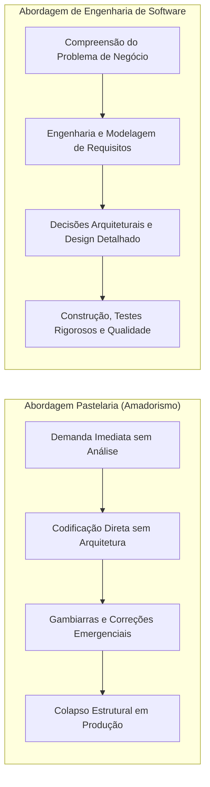
```mermaid
flowchart LR
 subgraph Pastelaria["Abordagem Pastelaria (Amadorismo)"]
 direction TB
 P1["Demanda Imediata sem Análise"] --> P2["Codificação Direta sem Arquitetura"]
 P2 --> P3["Gambiarras e Correções Emergenciais"]
 P3 --> P4["Colapso Estrutural em Produção"]
 end

 subgraph Engenharia["Abordagem de Engenharia de Software"]
 direction TB
 E1["Compreensão do Problema de Negócio"] --> E2["Engenharia e Modelagem de Requisitos"]
 E2 --> E3["Decisões Arquiteturais e Design Detalhado"]
 E3 --> E4["Construção, Testes Rigorosos e Qualidade"]
 end
```

Na engenharia profissional, sistemas de computação constituem o núcleo operacional de organizações contemporâneas. Uma falha de arquitetura acarreta paradas operacionais graves, vulnerabilidades de segurança com vazamento de dados, sanções legais (como multas da LGPD) e falência de modelos de negócio. O desenvolvimento de software é uma disciplina socio-técnica que requer metodologia, previsibilidade e rigor formal.

### O Paradoxo da Análise versus Projeto

Uma das regras de ouro da disciplina contrapõe as duas metades da concepção técnica:

> "Faça a coisa certa (análise) e faça certo a coisa (projeto)."

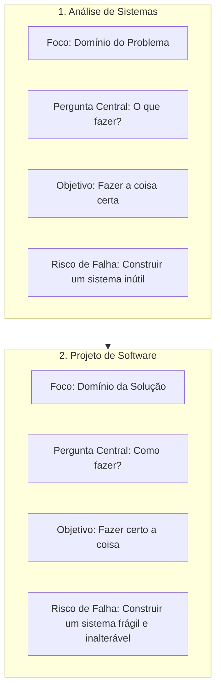
```mermaid
flowchart TD
 subgraph Analise["1. Análise de Sistemas"]
 A1["Foco: Domínio do Problema"]
 A2["Pergunta Central: O que fazer?"]
 A3["Objetivo: Fazer a coisa certa"]
 A4["Risco de Falha: Construir um sistema inútil"]
 end

 subgraph Projeto["2. Projeto de Software"]
 P1["Foco: Domínio da Solução"]
 P2["Pergunta Central: Como fazer?"]
 P3["Objetivo: Fazer certo a coisa"]
 P4["Risco de Falha: Construir um sistema frágil e inalterável"]
 end

 Analise --> Projeto
```

1. **Análise de Requisitos (Fazer a coisa certa):** Tem como objetivo garantir que o sistema resolva o problema real do negócio. Desenvolver uma aplicação impecavelmente testada e performática, mas que atende à necessidade errada do cliente, representa um fracasso absoluto de engenharia.
2. **Projeto e Arquitetura de Software (Fazer certo a coisa):** Tem como objetivo estruturar a solução com padrões consolidados, baixo acoplamento, alta coesão, extensibilidade e segurança. Desenvolver o sistema funcionalmente correto, porém com código emaranhado e arquitetura frágil, inviabiliza sua manutenção no médio prazo devido ao acúmulo de débitos técnicos.

### As Dez Fases do Ciclo de Vida de Desenvolvimento

O ciclo de vida de desenvolvimento de software (SDLC) desdobra-se em dez etapas iterativas e cumulativas, organizadas em uma cadeia contínua de agregação de valor:

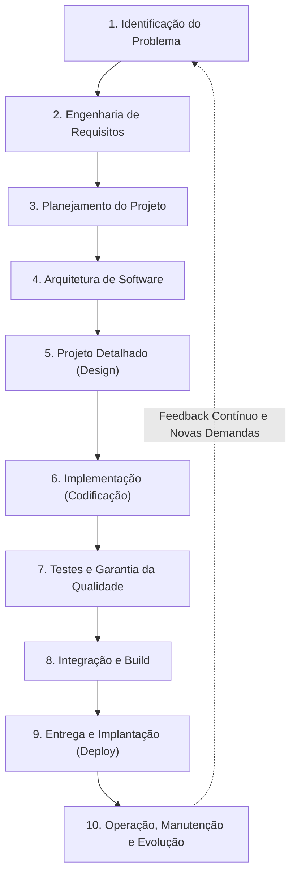
```mermaid
flowchart TD
 F1["1. Identificação do Problema"] --> F2["2. Engenharia de Requisitos"]
 F2 --> F3["3. Planejamento do Projeto"]
 F3 --> F4["4. Arquitetura de Software"]
 F4 --> F5["5. Projeto Detalhado (Design)"]
 F5 --> F6["6. Implementação (Codificação)"]
 F6 --> F7["7. Testes e Garantia da Qualidade"]
 F7 --> F8["8. Integração e Build"]
 F8 --> F9["9. Entrega e Implantação (Deploy)"]
 F9 --> F10["10. Operação, Manutenção e Evolução"]
 F10 -.->|"Feedback Contínuo e Novas Demandas"| F1
```

A matriz a seguir detalha o foco, as entradas e as entregas formais de cada fase:

| Fase | Foco Central | Artefato de Entrada | Artefato de Saída |
| :--- | :--- | :--- | :--- |
| **1. Problema** | Isolar a dor do negócio de seus sintomas. | Diagnósticos de mercado, gargalos operacionais. | Declaração do Problema, Visão de Negócio. |
| **2. Requisitos** | Elicitar e especificar comportamentos e restrições. | Declaração do Problema, entrevistas com usuários. | Documento de Requisitos (SRS), Histórias, Casos de Uso. |
| **3. Planejamento** | Delimitar prazos, orçamentos, riscos e escopo. | Requisitos priorizados, capacidade do time. | Backlog da Sprint, Matriz de Riscos, Cronograma. |
| **4. Arquitetura** | Definir o esqueleto estrutural e atributos de qualidade. | Requisitos Não Funcionais críticos. | Documento de Arquitetura (SAD), Diagramas C4/UML. |
| **5. Projeto** | Modelar classes, interfaces, persistência e GoF. | Estilo arquitetural aprovado. | Diagramas de Classes, Diagramas de Sequência. |
| **6. Implementação** | Escrever código tipado, limpo e auditável. | Especificações técnicas e diagramas detalhados. | Código-fonte versionado em Git, Pull Requests. |
| **7. Testes** | Validar conformidade funcional e limites técnicos. | Software compilável e cenários de teste. | Relatórios de cobertura (Unitários, Integração, E2E). |
| **8. Integração** | Unificar módulos em pipelines automatizados. | Branches de código validadas. | Builds validados, contêineres Docker gerados. |
| **9. Entrega** | Disponibilizar a versão em ambiente operacional. | Imagens de contêiner e scripts de banco de dados. | Deploy em produção, changelogs e notas de versão. |
| **10. Manutenção** | Monitorar, corrigir defeitos e refatorar débitos. | Telemetria, logs de erros e novos requisitos. | Patches corretivos, planos de evolução arquitetural. |

---

## Fundamentos de Projeto Orientado a Objetos

### Transicao Formal da Analise para o Projeto

A transição entre a análise e o projeto de software estabelece a ponte entre o problema e a solução técnica:

- **Modelo de Análise (Agnóstico de Tecnologia):** Expressa a lógica de negócio sob a perspectiva dos especialistas de domínio. Não faz referências a frameworks, bancos de dados, conexões de rede ou bibliotecas específicas de interface gráfica. Utiliza termos como `Cliente`, `Conta`, `Livro`, `Empréstimo`.
- **Modelo de Projeto (Comprometido com a Tecnologia):** Transforma os conceitos de análise em especificações executáveis. Modela classes com tipos primitivos, estruturas de coleções, visibilidades (`private`, `public`), contratos de interfaces, classes utilitárias, padrões de acesso a dados (Repositories, DAOs) e camadas de controle. Utiliza termos como `UsuarioController`, `ContaRepository`, `TokenService`, `ConnectionPool`.

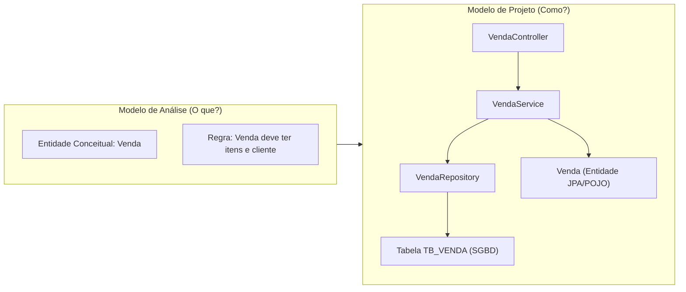
```mermaid
flowchart LR
 subgraph DominioAnalise["Modelo de Análise (O que?)"]
 A_Ent["Entidade Conceitual: Venda"]
 A_Reg["Regra: Venda deve ter itens e cliente"]
 end

 subgraph DominioProjeto["Modelo de Projeto (Como?)"]
 P_Ctrl["VendaController"]
 P_Serv["VendaService"]
 P_Repo["VendaRepository"]
 P_Ent["Venda (Entidade JPA/POJO)"]
 P_DB["Tabela TB_VENDA (SGBD)"]
 end

 DominioAnalise --> DominioProjeto
 P_Ctrl --> P_Serv
 P_Serv --> P_Repo
 P_Serv --> P_Ent
 P_Repo --> P_DB
```

### Abstracao

- **Definição:** Operação conceitual pela qual o engenheiro isola as propriedades e comportamentos estritamente relevantes de uma entidade do mundo real sob a perspectiva do sistema em desenvolvimento, descartando detalhes contingentes ou irrelevantes.
- **Motivação:** Reduzir a carga cognitiva. Sem abstração, o software acumularia detalhes operacionais irrelevantes que gerariam complexidade desnecessária.
- **Exemplo Prático:** Ao modelar uma entidade `Aluno` em um Sistema Acadêmico, as informações necessárias são `ra`, `nome`, `cpf` e `historicoEscolar`. Informações como cor dos olhos, altura ou tipo sanguíneo são descartadas por não terem relevância para o domínio acadêmico.
- **Contraexemplo:** Modelar uma classe `Pessoa` genérica com 150 atributos para atender simultaneamente a um hospital, uma escola e uma oficina mecânica. Isso viola a abstração ao misturar domínios desconexos.
- **Armadilha:** Incluir atributos na classe apenas porque eles "existem no mundo real", sem que haja um requisito de software ou regra de negócio que os justifique.

### Encapsulamento e Protecao de Invariantes

- **Definição:** Técnica de agrupar o estado interno (atributos) e o comportamento (métodos) de um objeto em uma unidade coesa, restringindo o acesso direto à sua representação interna por meio de modificadores de acesso (`private`, `protected`).
- **Motivação:** Proteger as invariantes de negócio da classe. Se qualquer elemento do sistema puder alterar o saldo de uma conta bancária sem passar pelas regras de saque ou depósito, o sistema não garante consistência transacional.
- **Exemplo Prático:** Uma classe `ContaBancaria` com atributo `- saldo: double` privado e métodos públicos `depositar(valor)` e `sacar(valor)`. O método `sacar` valida se o valor é positivo e se há saldo disponível antes de autorizar a subtração.
- **Contraexemplo:** Uma classe `ContaBancaria` com `+ saldo: double` público, permitindo que uma classe externa execute `conta.saldo = -50000.00;` sem nenhuma checagem.
- **Armadilha:** Criar atributos privados e gerar automaticamente getters e setters cegos para todos eles. Isso cria um **Modelo Anêmico**, mantendo os mesmos problemas de atributos públicos disfarçados de métodos.

### Heranca

- **Definição:** Mecanismo estrutural de modelagem pelo qual uma classe filha (subclasse) herda o estado e o comportamento definidos em uma classe mãe (superclasse), estabelecendo uma relação semântica do tipo "É UM" (*is-a*).
- **Motivação:** Promover o reúso sistemático de definições comuns e estabelecer hierarquias conceituais que viabilizam o polimorfismo.
- **Exemplo Prático:** Uma superclasse abstrata `Funcionario` que declara os atributos comuns `nome`, `documento` e `salarioBase`, e subclasses concretas `Gerente` e `Engenheiro` que especializam o cálculo da bonificação anual.
- **Contraexemplo:** Forçar herança para aproveitar código sem que haja relação semântica real (ex.: fazer `RelatorioFinanceiro` herdar de `ArrayList` apenas para usar o método `add`). Trata-se do antipadrão de *herança por conveniência*.
- **Armadilha:** Criação de árvores de herança excessivamente profundas (mais de 3 níveis de profundidade), tornando o código frágil e de difícil depuração. A engenharia moderna recomenda a diretriz clássica do GoF: *"Prefira composição à herança"*.

### Polimorfismo

- **Definição:** Capacidade de objetos de diferentes classes derivadas responderem à mesma mensagem (invocação de método) de maneiras especializadas e distintas, determinada dinamicamente em tempo de execução (*late binding*).
- **Motivação:** Eliminar estruturas condicionais aninhadas (`if/else` ou `switch/case`) espalhadas pelo código para verificar tipos concretos de objetos.
- **Exemplo Prático:** Um método `processarPagamento(MeioPagamento meio)` que invoca `meio.autorizar(valor)`. Se `meio` for uma instância de `CartaoCredito`, ele executa a comunicação com a adquirente; se for `BoletoBancario`, ele emite o código de barras. O código chamador desconhece os detalhes da subclasse concreta.
- **Contraexemplo:** Escrever um bloco `switch` checando uma String de tipo para decidir qual algoritmo chamar:
  ```java
  if (tipo.equals("CARTAO")) { processarCartao(); }
  else if (tipo.equals("BOLETO")) { processarBoleto(); }
  ```
  Cada novo meio de pagamento exige modificar essa classe, violando diretamente o princípio Aberto/Fechado (OCP).
- **Armadilha:** Utilizar *downcasting* explícito com `instanceof` para converter o tipo genérico em tipo concreto logo após receber a referência polimórfica, anulando o benefício do polimorfismo.

### Acoplamento e Coesao

Os dois conceitos mais fundamentais de arquitetura e design de software:

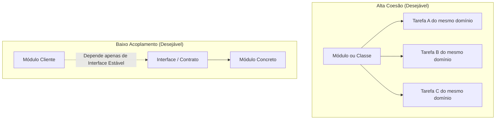
```mermaid
flowchart TD
 subgraph Coesao["Alta Coesão (Desejável)"]
 C1["Módulo ou Classe"]
 C1 --> T1["Tarefa A do mesmo domínio"]
 C1 --> T2["Tarefa B do mesmo domínio"]
 C1 --> T3["Tarefa C do mesmo domínio"]
 end

 subgraph Acoplamento["Baixo Acoplamento (Desejável)"]
 M1["Módulo Cliente"] -.->|Depende apenas de Interface Estável| INT["Interface / Contrato"]
 INT --> M2["Módulo Concreto"]
 end
```

#### Baixo Acoplamento
- **Definição:** Grau de interdependência entre os módulos, pacotes ou classes de um sistema. O acoplamento é baixo quando uma alteração interna em um componente não força alterações colaterais nos demais.
- **Motivação:** Permitir a evolução independente de partes do sistema e facilitar a substituição de tecnologias sem efeito cascata de erros.
- **Exemplo Prático:** Um serviço de pedidos que depende de uma interface `ProvedorFrete` em vez de depender diretamente da classe concreta `CorreiosSedexApi`.
- **Contraexemplo:** Uma classe que instancia diretamente 15 outras classes concretas no seu construtor e acessa atributos públicos dessas classes. Se qualquer uma mudar de nome ou comportamento, o sistema inteiro quebra.
- **Armadilha:** Eliminar completamente o acoplamento. Todo sistema exige algum nível de acoplamento para que os objetos colaborem; a meta da engenharia é o baixo acoplamento estruturado em abstrações estáveis, e não o desacoplamento nulo.

#### Alta Coesao
- **Definição:** Medida de quão focadas e fortemente relacionadas são as responsabilidades mantidas dentro de um único módulo ou classe. Uma classe é altamente coesa quando executa uma tarefa bem delimitada do domínio.
- **Motivação:** Facilitar o entendimento, o teste unitário e a reutilização do componente.
- **Exemplo Prático:** Uma classe `CalculadoraTributaria` que possui apenas métodos de aplicação de alíquotas de impostos fiscais.
- **Contraexemplo:** O antipadrão da **God Class** (Classe Deus), como uma classe `GerenciadorGeral` que autentica usuários, calcula juros, emite PDFs, conecta ao banco de dados e envia e-mails.
- **Armadilha:** Quebrar o código em classes atômicas excessivamente fragmentadas (ex.: criar uma classe para cada método único sem contexto), resultando em proliferação de arquivos sem ganho real de legibilidade.

### Introducao aos Principios SOLID e Padroes GoF

A disciplina de Engenharia de Software II aprofunda a modelagem orientada a objetos a partir de duas referências de design:

#### Os Cinco Princípios SOLID
- **S — Single Responsibility Principle (SRP):** Uma classe deve ter um, e apenas um, motivo para ser modificada (expressão máxima da Alta Coesão).
- **O — Open/Closed Principle (OCP):** Entidades de software devem estar abertas para extensão, mas fechadas para modificação. Novos comportamentos são adicionados criando subclasses ou implementações de interfaces, e não alterando código estável testado.
- **L — Liskov Substitution Principle (LSP):** Objetos de uma superclasse devem poder ser substituídos por objetos de suas subclasses sem que a integridade lógica e os contratos da aplicação sejam corrompidos.
- **I — Interface Segregation Principle (ISP):** Clientes não devem ser forçados a depender de interfaces com métodos que não utilizam. Múltiplas interfaces finas e específicas são preferíveis a uma interface genérica e inchada.
- **D — Dependency Inversion Principle (DIP):** Módulos de alto nível não devem depender de módulos de baixo nível; ambos devem depender de abstrações. Abstrações não devem depender de detalhes; detalhes devem depender de abstrações.

#### Os Padrões de Projeto GoF (Gang of Four)
Classificados em três categorias essenciais:
1. **Criacionais:** Lidam com a mecânica de criação de objetos, abstraindo o processo de instanciação. Destaque para o **Factory Method** (delega a criação a subclasses ou métodos especializados) e **Abstract Factory**.
2. **Estruturais:** Lidam com a composição de classes e objetos para formar estruturas maiores e flexíveis. Destaque para o **Adapter** (compatibiliza interfaces incompatíveis) e o **Facade** (fornece uma interface de alto nível simplificada para um subsistema complexo).
3. **Comportamentais:** Lidam com algoritmos e a atribuição de responsabilidades entre objetos. Destaque para o **Strategy** (encapsula famílias de algoritmos intercambiáveis em tempo de execução) e o **Observer** (notifica dependentes sobre mudanças de estado).

---

## Engenharia e Elicitacao de Requisitos

### Levantamento versus Elicitacao Ativa

Na terminologia da engenharia de software contemporânea (conforme o SWEBOK - *Software Engineering Body of Knowledge*), existe uma distinção crucial entre levantar e elicitar:

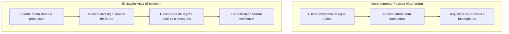
```mermaid
flowchart TD
 subgraph PosturaPassiva["Levantamento Passivo (Gathering)"]
 P1["Cliente expressa desejos soltos"] --> P2["Analista anota sem questionar"]
 P2 --> P3["Requisitos superficiais e incompletos"]
 end

 subgraph PosturaAtiva["Elicitação Ativa (Elicitation)"]
 A1["Cliente relata dores e processos"] --> A2["Analista investiga causas de fundo"]
 A2 --> A3["Descoberta de regras ocultas e exceções"]
 A3 --> A4["Especificação formal verificável"]
 end
```

- **Levantamento Passivo (Requirements Gathering):** Assume equivocadamente que os requisitos já existem estruturados, claros e completos na cabeça do cliente, cabendo ao analista apenas atuar como um anotador de pedidos.
- **Elicitação Ativa (Requirements Elicitation):** Do latim *elicitare* ("fazer sair", "trazer à luz"). Reconhece que os clientes possuem problemas operacionais, dores financeiras e rotinas cotidianas, mas raramente requisitos de software especificados. O analista atua como um investigador técnico que explora, questiona premissas, descobre fluxos ocultos e traduz a linguagem de negócio em especificações não ambíguas.

### A Cadeia Causal da Engenharia de Requisitos

A transformação de uma queixa em um requisito de engenharia segue uma progressão causal obrigatória:

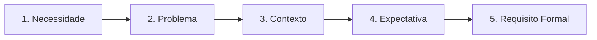
```mermaid
flowchart LR
 Nec["1. Necessidade"] --> Prob["2. Problema"]
 Prob --> Ctx["3. Contexto"]
 Ctx --> Exp["4. Expectativa"]
 Exp --> Req["5. Requisito Formal"]
```

| Etapa | Definição Teórica | Exemplo Prático de Negócio |
| :--- | :--- | :--- |
| **Necessidade** | Carência fundamental de sustentabilidade do negócio. | Aumentar a sobrevivência financeira de uma distribuidora. |
| **Problema** | Fato real que impede o atendimento da necessidade. | Ruptura de estoque: pedidos são fechados, mas não há itens no armazém. |
| **Contexto** | Cenário ambiental, tecnológico e humano onde ocorre. | Vendedores usam mensagens de WhatsApp sem checar o estoque físico. |
| **Expectativa** | Imagem mental do cliente sobre a solução. | "Quero um sistema rápido para os vendedores não errarem." |
| **Requisito Formal** | Especificação verificável do comportamento do software. | O sistema deve decrementar o estoque no ato da reserva e bloquear checkout se saldo < quantidade requerida. |

### As Seis Perguntas Cardinais da Investigação

Diante de qualquer funcionalidade ou projeto, o analista deve responder às seis perguntas fundamentais estruturadas pelo Prof. Wesley:

1. **Qual problema existe?** Isolar a causa raiz de seus sintomas visíveis.
2. **Quem enfrenta o problema?** Identificar os usuários operacionais, gestores e sistemas externos impactados.
3. **Como o problema é resolvido atualmente (*As-Is*)?** Compreender os processos manuais, planilhas ou cadernos utilizados hoje.
4. **O que o sistema precisa fazer (*To-Be*)?** Definir os comportamentos funcionais e cálculos necessários.
5. **Quais são as restrições?** Identificar limites de prazo, leis aplicáveis (ex.: LGPD), tecnologias herdadas e orçamento.
6. **O que é prioridade?** Separar o que é essencial para a operação inicial (MVP) do que é conveniência secundária.

### Analise Critica da Premissa de Desenvolvimento Prematuro

Considere a seguinte declaração comum de clientes abordada em aula:

> "Preciso de um sistema para melhorar meu negócio."

Um engenheiro de software jamais deve iniciar a codificação ou modelagem com base em tal afirmativa. Razões técnicas:
- **Ausência de Critério de Aceite (*Acceptance Criteria*):** Não há métrica objetiva para definir o que constitui "melhorar". Sem critério, a entrega nunca poderá ser homologada.
- **Risco de Escopo Infinito (*Scope Creep*):** Sem fronteiras delimitadas, qualquer funcionalidade que o cliente imaginar ao longo do tempo será alegada como parte do contrato de "melhorar".
- **Automatização do Caos:** Informatizar um processo de negócio desorganizado e repleto de retrabalho gera apenas um processo caótico automatizado, que produz inconsistências operacionais em escala.

### Dificuldades e Barreiras no Levantamento de Requisitos

```mermaid
mindmap
 root((Barreiras na Elicitação))
 Falhas Humanas
 Necessidades Não Explícitas Conhecimento Tácito
 Medo de Perda de Emprego ou Autonomia
 Vícios Operacionais Não Documentados
 Comunicação e Semântica
 Vocabulários Dissonantes entre Setores
 Termos Qualitativos e Ambíguos
 Políticas Internas
 Conflitos de Interesses entre Stakeholders
 Prioridades Divergentes Diretoria versus Operação
 Instabilidade
 Mudança Contínua de Ideia no Ciclo de Análise
```

- **Conhecimento Tácito (Necessidades Ocultas):** O usuário executa um procedimento manual vital há tantos anos que assume que qualquer pessoa sabe que aquilo deve ser feito, omitindo o passo durante as entrevistas.
- **Vocabulários Dissonantes:** Em uma mesma empresa, a Contabilidade chama uma operação de "Lançamento de Duplicata", a Expedição chama de "Romaneio de Coleta" e o Comercial chama de "Orçamento Confirmado", embora todos se refiram à mesma transação.
- **Conflito de Interesses:** O setor de Vendas exige cadastros simplificados com apenas um clique para acelerar vendas; o setor de Risco Financeiro exige checagem obrigatória de 12 campos fiscais e consulta externa de crédito antes da liberação.

### Desconstrucao de Termos Ambiguos e Anti-Requisitos

Termos subjetivos e adjetivos qualitativos são considerados **anti-requisitos**. Eles devem ser refatorados em métricas mensuráveis de Requisitos Não Funcionais (RNF):

| Termo Ambíguo do Usuário | Interpretação Errada do Desenvolvedor | Refatoração Técnica da Engenharia (RNF Formal) |
| :--- | :--- | :--- |
| "O sistema precisa ser rápido." | Colocar paginação de 10 itens e assumir que atendeu. | **RNF-01 (Desempenho):** O tempo de resposta para a consulta de pedidos filtrada por período deve ser inferior a 1,5 segundos para o percentil 95 (p95) sob carga de 300 requisições simultâneas. |
| "A tela deve ser intuitiva e fácil." | Colocar ícones modernos e tema escuro. | **RNF-02 (Usabilidade):** Um novo atendente deve ser capaz de concluir o registro completo de uma comanda em até 2 minutos, após receber um treinamento máximo de 20 minutos, com taxa de erro menor que 3%. |
| "O sistema deve ser seguro." | Proteger o banco de dados com uma senha forte. | **RNF-03 (Segurança):** O sistema deve implementar autenticação multifator (MFA) para perfis administrativos, armazenar senhas com algoritmo Argon2id e criptografar dados de pagamento em trânsito com TLS 1.3. |

### Tecnicas Tradicionais e Investigativas de Elicitacao

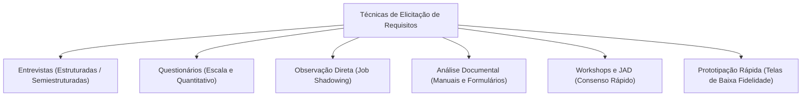
```mermaid
flowchart TD
 T["Técnicas de Elicitação de Requisitos"]
 T --> E["Entrevistas (Estruturadas / Semiestruturadas)"]
 T --> Q["Questionários (Escala e Quantitativo)"]
 T --> O["Observação Direta (Job Shadowing)"]
 T --> AD["Análise Documental (Manuais e Formulários)"]
 T --> W["Workshops e JAD (Consenso Rápido)"]
 T --> P["Prototipação Rápida (Telas de Baixa Fidelidade)"]
```

1. **Entrevistas:** Conversação estruturada ou semiestruturada com atores-chave. As entrevistas semiestruturadas são ideais: oferecem roteiro base, mas dão liberdade para explorar novos tópicos. Devem priorizar perguntas abertas investigativas (*"Como você procede quando um produto está esgotado?"*) em vez de perguntas fechadas (*"Você quer um botão de cancelar?"*).
2. **Questionários:** Aplicação de formulários com perguntas abertas e fechadas para um público numeroso e disperso. Indicado para coletar métricas estatísticas, com desvantagem de baixo retorno e impossibilidade de aprofundamento imediato.
3. **Observação Direta (*Job Shadowing*):** O analista acompanha o posto de trabalho do operador presencialmente. Revela procedimentos tácitos, atalhos manuais e post-its com anotações fixadas no monitor que o usuário não relatou nas entrevistas.
4. **Análise Documental:** Inspeção de formulários impressos, planilhas legadas, contratos, manuais operacionais e leis regulatórias aplicáveis. Garante a conformidade fiscal e a correta identificação dos dados necessários.
5. **Workshops / JAD (*Joint Application Design*):** Reuniões intensivas de trabalho conjunto entre desenvolvedores, analistas e representantes dos múltiplos setores envolvidos, mediadas para resolver conflitos de requisitos e alinhar decisões.
6. **Prototipação:** Elaboração de maquetes visuais (wireframes) das telas para validar o fluxo de navegação e as entradas de dados diretamente com o cliente antes de codificar.

### Diagnostico de Causa Raiz e os Cinco Porques

Para não documentar soluções superficiais, o engenheiro de software utiliza a técnica investigativa dos **Cinco Porquês**:

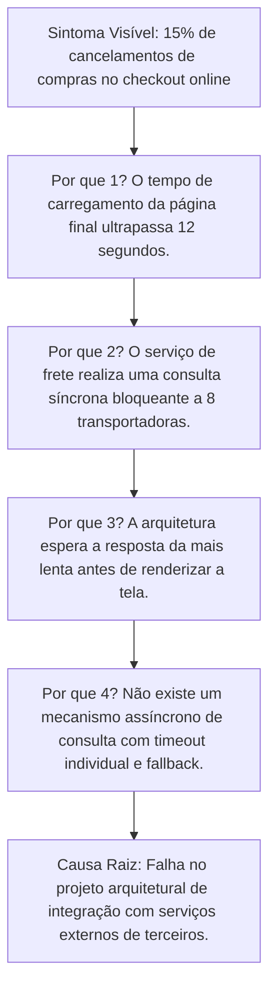
```mermaid
flowchart TD
 S["Sintoma Visível: 15% de cancelamentos de compras no checkout online"]
 P1["Por que 1? O tempo de carregamento da página final ultrapassa 12 segundos."]
 P2["Por que 2? O serviço de frete realiza uma consulta síncrona bloqueante a 8 transportadoras."]
 P3["Por que 3? A arquitetura espera a resposta da mais lenta antes de renderizar a tela."]
 P4["Por que 4? Não existe um mecanismo assíncrono de consulta com timeout individual e fallback."]
 CR["Causa Raiz: Falha no projeto arquitetural de integração com serviços externos de terceiros."]

 S --> P1
 P1 --> P2
 P2 --> P3
 P3 --> P4
 P4 --> CR
```

O requisito gerado a partir dessa análise não é "otimizar o site", mas: *"O subsistema de cálculo de frete deve consultar as transportadoras de forma concorrente assíncrona, aplicando timeout estrito de 1.500 ms por rota e exibindo estimativas com base em tabela offline de fallback caso a requisição externa expire."*

### Segregacao de Papeis: Stakeholder versus Analista de Sistemas

No trabalho prático da Atividade Aula 3 e na dinâmica profissional de desenvolvimento, é mandatório separar os papéis:

| Dimensão de Comparação | Papel: Stakeholder (Parte Interessada) | Papel: Analista de Sistemas / Engenheiro de Requisitos |
| :--- | :--- | :--- |
| **Perspectiva** | Negócio, finanças, operação diária e lucratividade. | Engenharia, viabilidade técnica, consistência e arquitetura. |
| **Vocabulário** | Jargões de sua área (médico, contábil, logístico, varejo). | Notações formais de engenharia (UML, RF, RNF, Casos de Uso, GoF). |
| **Foco de Interesse** | Eliminar dores de sua rotina e reduzir custos da empresa. | Especificar uma solução técnica verificável, sem ambiguidades. |
| **Expressão Típica** | "Preciso que as faturas não saiam com o valor de frete errado." | "RF-04: O sistema deve aplicar o recálculo automático de ICMS sobre o frete." |

---

## Gestao e Priorizacao de Escopo com o Metodo MoSCoW

### Origem e Fundamentacao Metodologica

O método **MoSCoW** foi concebido por Dai Clegg durante o desenvolvimento do framework ágil DSDM (*Dynamic Systems Development Method*). Seu propósito é assegurar o alinhamento de expectativas entre as partes interessadas e a equipe técnica, estabelecendo quais itens devem compor o Produto Mínimo Viável (MVP) e evitando que o projeto atrase por acúmulo desordenado de tarefas de menor valor.

### As Quatro Categorias do MoSCoW

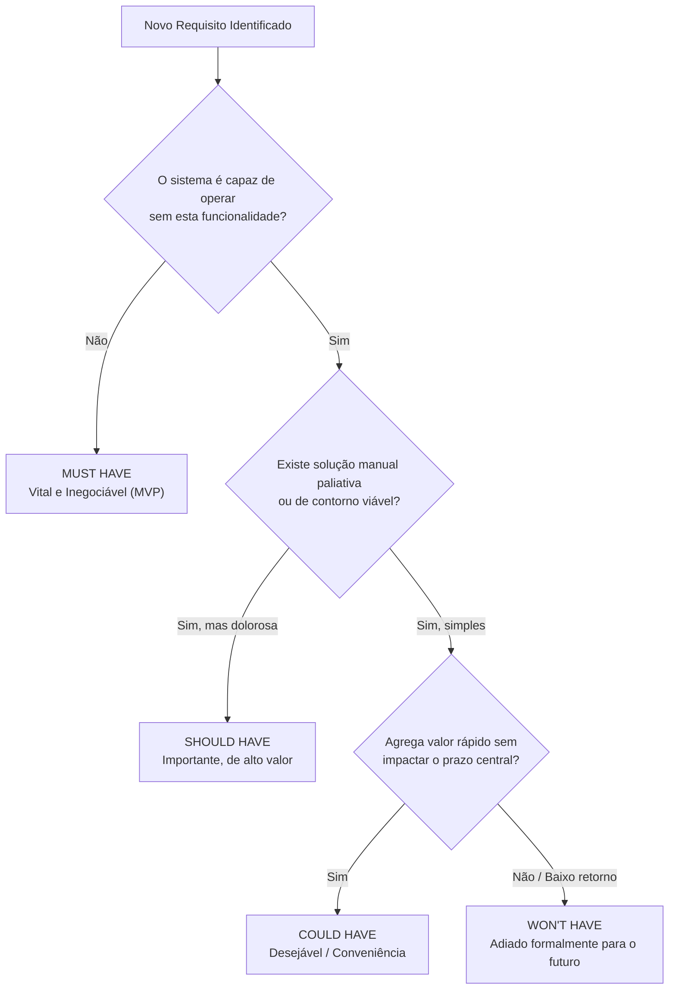
```mermaid
flowchart TD
 R[Novo Requisito Identificado] --> Q1{O sistema é capaz de operar<br/>sem esta funcionalidade?}
 Q1 -- Não --> M["MUST HAVE<br/>Vital e Inegociável (MVP)"]
 Q1 -- Sim --> Q2{Existe solução manual paliativa<br/>ou de contorno viável?}
 Q2 -- Sim, mas dolorosa --> S["SHOULD HAVE<br/>Importante, de alto valor"]
 Q2 -- Sim, simples --> Q3{Agrega valor rápido sem<br/>impactar o prazo central?}
 Q3 -- Sim --> C["COULD HAVE<br/>Desejável / Conveniência"]
 Q3 -- Não / Baixo retorno --> W["WON'T HAVE<br/>Adiado formalmente para o futuro"]
```

- **M — Must have (Deve ter):** Requisitos vitais e inegociáveis. Se qualquer um destes itens for retirado, o produto não tem utilidade prática ou não atende a regulações legais obrigatórias. O projeto não é lançado sem eles.
- **S — Should have (Deveria ter):** Requisitos de alta relevância que agregam valor significativo. Devem ser implementados se houver capacidade, mas sua ausência temporária na primeira versão pode ser contornada por soluções manuais ou processos alternativos.
- **C — Could have (Poderia ter):** Funcionalidades de conveniência que melhoram a experiência do usuário, mas que só entram em desenvolvimento se os itens Must e Should forem finalizados com folga no cronograma.
- **W — Won't have this time (Não terá desta vez):** Requisitos identificados e documentados, mas que foram conscientemente deixados de fora da iteração ou versão atual para manter o foco e respeitar o orçamento. Podem ser revisitados no futuro.

### Aplicacao Pratica e Matriz de Decisao

#### Matriz Comparativa: Sistema de Gestão de Food Delivery

| Categoria | Funcionalidade Mapeada | Justificativa Técnica e Operacional |
| :--- | :--- | :--- |
| **Must have (M)** | Autenticação; Cardápio com preços; Carrinho; Checkout com Gateway de Pagamento; Atualização de Status do Pedido. | Constitui a espinha dorsal da transação comercial. Sem isso, a aplicação não fecha pedidos e não gera faturamento. |
| **Should have (S)** | Notificações Push sobre status da entrega; Painel analítico de faturamento; Moderação de avaliações. | Indispensável para retenção e gestão, mas o sistema pode operar temporariamente com atualizações manuais na tela. |
| **Could have (C)** | Chat em tempo real entre cliente e restaurante; Cupons promocionais dinâmicos; Programa de fidelidade gamificado. | Agregam valor e diferencial competitivo, mas a entrega do alimento ocorre normalmente sem sua presença no primeiro lançamento. |
| **Won't have (W)** | Entrega automatizada por drones; Predição de demanda da cozinha com Inteligência Artificial Generativa. | Complexidade técnica e custos proibitivos que comprometeriam o lançamento do sistema central. Ficam para releases futuras. |

---

## Modelagem Comportamental com Diagramas de Casos de Uso

### Fundamentos e Abordagem Caixa-Preta

O **Diagrama de Casos de Uso** é um diagrama comportamental da UML responsável por mapear as fronteiras do sistema e o conjunto de serviços que este provê aos seus atores externos.

- **Princípio da Caixa-Preta (*Black-Box*):** O diagrama modela o comportamento observável externamente. Ele não expõe estruturas de tabelas de banco de dados, variáveis internas de código, frameworks utilizados ou detalhes pontuais de interfaces gráficas.
- **Pergunta Central do Modelo:** *"O que o sistema oferece para atender aos objetivos do usuário?"*

### Elementos Constitutivos do Modelo

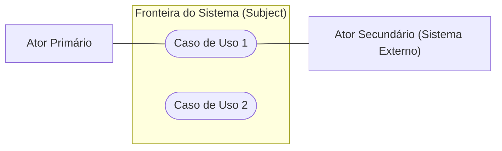
```mermaid
flowchart LR
 subgraph FronteiraDoSistema["Fronteira do Sistema (Subject)"]
 UC1(["Caso de Uso 1"])
 UC2(["Caso de Uso 2"])
 end

 AtorPrimario["Ator Primário"] --- UC1
 UC1 --- AtorSecundario["Ator Secundário (Sistema Externo)"]
```

1. **Ator:** Representa um papel idealizado exercido por uma entidade externa que interage com o sistema. Um ator pode ser um ser humano (ex.: `Cliente`, `Operador`) ou um sistema de software externo (ex.: `GatewayPagamento`, `SEFAZ`).
   - *Ator Primário:* Aquele que dispara o caso de uso com o propósito de atingir um objetivo de negócio.
   - *Ator Secundário:* Aquele que responde a solicitações do sistema, prestando serviços complementares de infraestrutura.
2. **Caso de Uso:** Unidade funcional atômica que produz um resultado observável de valor mensurável para um ator. Deve ser nomeado com **verbo no infinitivo** seguido de complemento direto (ex.: `Processar Pagamento`, `Consultar Acervo`).
3. **Fronteira do Sistema (*Subject Boundary*):** Retângulo delimitador que explicita o escopo técnico do software em desenvolvimento. O que está dentro da caixa é de responsabilidade da equipe; o que está fora é ambiente externo.

### Tipos de Relacionamentos e Semantica Rigorosa

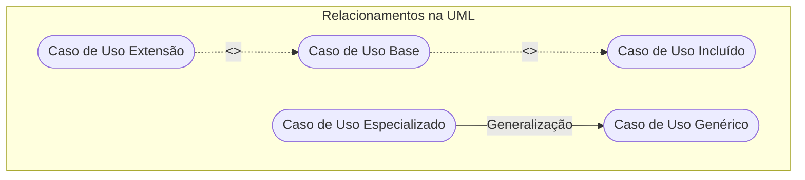
```mermaid
flowchart TD
 subgraph CasosDeUso["Relacionamentos na UML"]
 UC_Base(["Caso de Uso Base"])
 UC_Inc(["Caso de Uso Incluído"])
 UC_Ext(["Caso de Uso Extensão"])
 UC_Pai(["Caso de Uso Genérico"])
 UC_Filho(["Caso de Uso Especializado"])

 UC_Base -.->|<<include>>| UC_Inc
 UC_Ext -.->|<<extend>>| UC_Base
 UC_Filho -->|Generalização| UC_Pai
 end
```

#### 1. Associação
- **Definição:** Linha sólida que conecta um ator a um caso de uso, indicando que há tráfego de dados e troca de mensagens entre eles.
- **Regra:** Atores nunca se conectam diretamente a outros atores por linha de associação simples. Se houver relação entre atores, trata-se de generalização/herança.

#### 2. Inclusão (`<<include>>`)
- **Definição:** Relacionamento estereotipado onde o caso de uso base incorpora obrigatoriamente e incondicionalmente o comportamento de outro caso de uso.
- **Motivação:** Reutilização de regras de negócio comuns a múltiplos fluxos (aplicação do princípio DRY em requisitos).
- **Direção da Seta:** Parte do caso de uso base e aponta para o caso de uso incluído (`Base -.->|<<include>>| Incluído`).
- **Exemplo:** `Realizar Transferência` possui um `<<include>>` para `Autenticar Usuário`. Sem autenticação, o fluxo base é abortado.
- **Contraexemplo:** Utilizar include para etapas procedimentais triviais da mesma tela, como `Digitar Senha`.
- **Armadilha:** Inverter a direção da seta. O caso de uso base é o consumidor do serviço incluído, logo ele deve apontar para o serviço.

#### 3. Extensão (`<<extend>>`)
- **Definição:** Relacionamento no qual um caso de uso de extensão expande o comportamento de um caso de uso base em um ponto pré-determinado (*extension point*), de maneira opcional e condicionada a uma regra em tempo de execução.
- **Motivação:** Desacoplar fluxos opcionais, fluxos de exceção complexos e ramificações secundárias da lógica principal do caso base.
- **Direção da Seta:** Parte do caso de uso acessório (extensão) e aponta para o caso base (`Extensão -.->|<<extend>>| Base`).
- **Exemplo:** Ao `Finalizar Compra`, o cliente pode opcionalmente acionar `Aplicar Cupom de Desconto`. A compra finaliza sem o cupom; o cupom apenas expande o fluxo se o usuário desejar.
- **Contraexemplo:** Utilizar extend para passos obrigatórios que fazem parte do caminho feliz do sistema.
- **Armadilha:** Inverter o sentido da seta, fazendo a base apontar para o extend.

#### 4. Generalização / Especialização
- **Definição:** Relação de herança expressa por uma linha contínua terminada em um triângulo vazado apontando para o elemento pai.
- **Aplicações:**
  - *Entre Atores:* O ator especializado herda todas as associações de casos de uso do ator genérico e pode possuir acessos exclusivos (ex.: `Gerente` herda de `Funcionario`).
  - *Entre Casos de Uso:* O caso de uso especializado implementa uma forma concreta de realizar o objetivo genérico do pai (ex.: `Pagar com Pix` herda de `Pagar Pedido`).

| Relacionamento | Notação Gráfica | Obrigatoriedade | Direção da Seta | Propósito Primário |
| :--- | :--- | :--- | :--- | :--- |
| **Associação** | Linha sólida | Variável | Sem seta (ou bidirecional) | Comunicação entre ator e caso de uso. |
| **Include** | Linha tracejada aberta | Obrigatória | Base aponta para Incluído | Reúso de lógica comum obrigatória. |
| **Extend** | Linha tracejada aberta | Opcional | Extensão aponta para Base | Desacoplamento de fluxos opcionais. |
| **Generalização** | Linha sólida com triângulo vazado | Herança | Filho aponta para Pai | Especialização polimórfica de papéis ou fluxos. |

### Estrutura da Especificacao Textual Canonica

O diagrama visual fornece apenas um mapa das funcionalidades. O comportamento real do software reside na sua especificação narrativa detalhada:

1. **Identificador e Nome:** Código unívoco e verbo no infinitivo (ex.: `UC-01: Fazer Pedido`).
2. **Atores Envolvidos:** Ator primário (iniciador) e secundários (sistemas consultados).
3. **Resumo / Descrição:** Breve contextualização do valor de negócio gerado pelo caso de uso.
4. **Pré-condições:** Condições de sistema que devem ser verdadeiras antes do caso de uso iniciar.
5. **Pós-condições:** Estado em que o sistema deve se encontrar após a finalização bem-sucedida.
6. **Fluxo Principal (Caminho Feliz):** Sequência numerada e alternada de passos entre a ação do ator e a resposta do sistema.
7. **Fluxos Alternativos:** Ramificações válidas do negócio que cumprem o objetivo por outros caminhos.
8. **Fluxos de Exceção:** Falhas técnicas ou violações de regras de negócio que impedem a conclusão do objetivo.

### Estudo de Caso Integrado: Plataforma de Comercio Eletronico

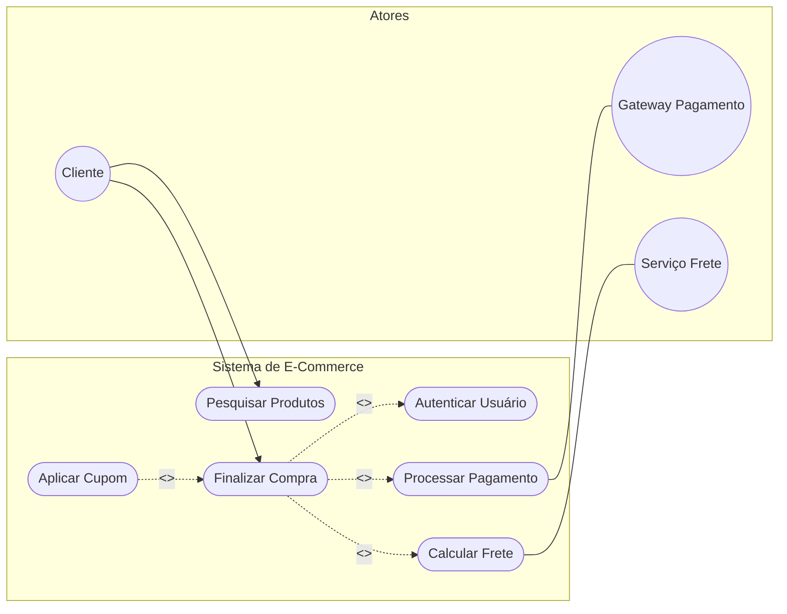
```mermaid
flowchart LR
 subgraph AtoresExternos["Atores"]
 Cliente((Cliente))
 Gateway((Gateway Pagamento))
 Correios((Serviço Frete))
 end

 subgraph FronteiraEcommerce["Sistema de E-Commerce"]
 UC_Buscar(["Pesquisar Produtos"])
 UC_Checkout(["Finalizar Compra"])
 UC_Cupom(["Aplicar Cupom"])
 UC_Login(["Autenticar Usuário"])
 UC_Frete(["Calcular Frete"])
 UC_Pagar(["Processar Pagamento"])
 end

 Cliente --> UC_Buscar
 Cliente --> UC_Checkout

 UC_Checkout -.->|<<include>>| UC_Login
 UC_Checkout -.->|<<include>>| UC_Frete
 UC_Checkout -.->|<<include>>| UC_Pagar

 UC_Cupom -.->|<<extend>>| UC_Checkout

 UC_Frete --- Correios
 UC_Pagar --- Gateway
```

### Estudo de Caso Integrado: Plataforma de Food Delivery Multilateral

Neste ecossistema trabalhado na Aula 06, a aplicação orquestra as interações de três perfis principais em um mercado multilateral:

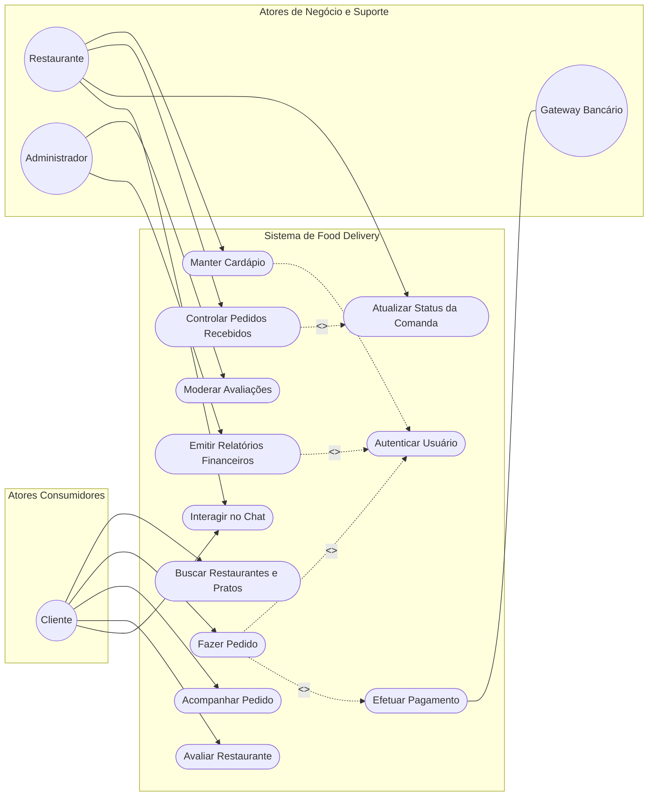
```mermaid
flowchart LR
 subgraph Clientes["Atores Consumidores"]
 C((Cliente))
 end

 subgraph FronteiraDelivery["Sistema de Food Delivery"]
 UC_BuscaRest(["Buscar Restaurantes e Pratos"])
 UC_FazerPed(["Fazer Pedido"])
 UC_AcompPed(["Acompanhar Pedido"])
 UC_Avaliar(["Avaliar Restaurante"])
 UC_Chat(["Interagir no Chat"])
 UC_Cardapio(["Manter Cardápio"])
 UC_ControlePed(["Controlar Pedidos Recebidos"])
 UC_TransStatus(["Atualizar Status da Comanda"])
 UC_Moderar(["Moderar Avaliações"])
 UC_Relatorios(["Emitir Relatórios Financeiros"])
 UC_Auth(["Autenticar Usuário"])
 UC_Pagar(["Efetuar Pagamento"])
 end

 subgraph Gestao["Atores de Negócio e Suporte"]
 R((Restaurante))
 A((Administrador))
 B((Gateway Bancário))
 end

 C --> UC_BuscaRest
 C --> UC_FazerPed
 C --> UC_AcompPed
 C --> UC_Avaliar
 C --> UC_Chat

 R --> UC_Cardapio
 R --> UC_ControlePed
 R --> UC_TransStatus
 R --> UC_Chat

 A --> UC_Moderar
 A --> UC_Relatorios

 UC_FazerPed -.->|<<include>>| UC_Auth
 UC_FazerPed -.->|<<include>>| UC_Pagar
 UC_Cardapio -.->|<<include>>| UC_Auth
 UC_Relatorios -.->|<<include>>| UC_Auth

 UC_ControlePed -.->|<<include>>| UC_TransStatus
 UC_Pagar --- B
```

#### Especificação Textual Completa: Fazer Pedido (Cliente)

- **Identificador:** UC-02: Fazer Pedido
- **Atores:** Cliente (Primário), Gateway Bancário (Secundário).
- **Pré-condições:** O cliente deve possuir cadastro ativo e itens selecionados no carrinho de compras.
- **Pós-condições:** Pedido gravado com status `Pendente`, estoque reservado e notificação enviada à cozinha do restaurante.
- **Fluxo Principal:**
  1. O cliente acessa a tela de conferência do carrinho de compras.
  2. O sistema exibe os itens, valores unitários, taxa de entrega calculada e valor total.
  3. O cliente seleciona o endereço de entrega cadastrado e a modalidade de pagamento (Cartão de Crédito).
  4. O sistema executa o caso de uso `UC_Auth: Autenticar Usuário`.
  5. O cliente insere os dados de pagamento e clica em "Confirmar Pedido".
  6. O sistema executa o caso de uso `UC_Pagar: Efetuar Pagamento`, enviando os dados ao Gateway Bancário.
  7. O Gateway Bancário autoriza a transação financeira.
  8. O sistema registra o pedido com status `Pendente`, debita o estoque e exibe mensagem de confirmação com estimativa de entrega.
  9. O caso de uso é encerrado.
- **Fluxo Alternativo (Pagamento via Pix):**
  - No passo 3, o cliente seleciona pagamento via Pix.
  - No passo 6, o sistema gera o payload do QR Code dinâmico do Banco Central.
  - O sistema aguarda o webhook de confirmação do gateway em até 10 minutos. Confirmado o crédito, o fluxo retorna ao passo 8.
- **Fluxo de Exceção (Transação Recusada pela Operadora):**
  - No passo 7, o Gateway Bancário recusa a cobrança por limite insuficiente ou suspeita de fraude.
  - O sistema reverte a reserva temporária dos pratos.
  - O sistema exibe mensagem descritiva: "Não foi possível autorizar o cartão. Por favor, selecione outro meio de pagamento."
  - O fluxo retorna ao passo 3.

---

## Notacao Estrutural com Diagrama de Classes UML

### Definicao, Principios e a UML como Notacao

A **Unified Modeling Language (UML)** é uma notação gráfica mantida pelo Object Management Group (OMG) para visualização, especificação, construção e documentação de sistemas de software.

Uma das premissas ensinadas pelo Prof. Wesley Soares reside na separação formal entre notação e processo:

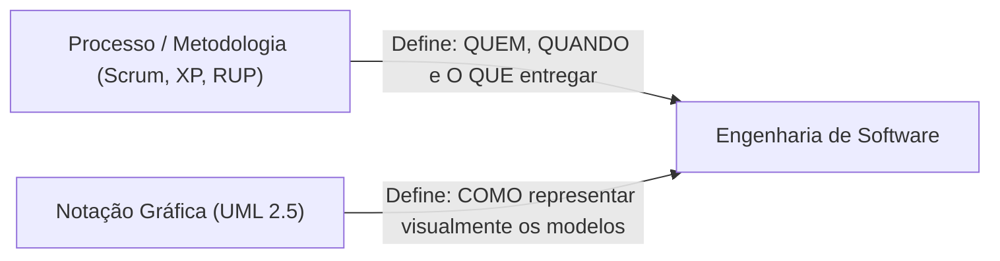
```mermaid
flowchart LR
 P["Processo / Metodologia (Scrum, XP, RUP)"] -->|Define: QUEM, QUANDO e O QUE entregar| E["Engenharia de Software"]
 N["Notação Gráfica (UML 2.5)"] -->|Define: COMO representar visualmente os modelos| E
```

- **A UML NÃO É:** Um processo de software, uma metodologia de desenvolvimento, um guia de negócios ou uma linguagem de programação.
- **A UML É:** Uma linguagem visual padronizada com gramática, léxico e semântica formais para expressar os modelos concebidos pelos engenheiros.

### UML no Contexto do Desenvolvimento Agil com Scrum

A adoção do framework Scrum não elimina a necessidade da modelagem com a UML; apenas ressignifica seu uso:
- **Abordagem Tradicional (Cascata / BDUF - *Big Design Up Front*):** Modelagem pesada e exaustiva prévia à implementação. Produz centenas de diagramas antes de qualquer teste, arriscando obsolescência rápida da documentação.
- **Abordagem Ágil (Scrum / *Just-Enough, Just-in-Time*):** Modelagem direcionada às necessidades da Sprint corrente. A equipe modela classes e interações dinâmicas para alinhar decisões de design complexas, desenhando diagramas que guiam a programação pareada e a escrita de testes de integração.

### Anatomia Estrutural da Classe: Compartimentos e Sintaxe

No Diagrama de Classes, a classe representa a abstração de um conjunto de objetos que compartilham atributos, operações e semântica idênticos. É representada graficamente por um retângulo com três compartimentos:

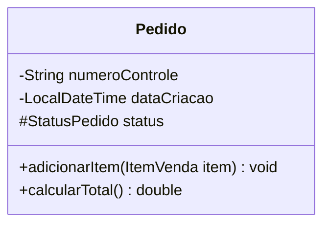
```mermaid
classDiagram
 class Pedido {
 -String numeroControle
 -LocalDateTime dataCriacao
 #StatusPedido status
 +adicionarItem(ItemVenda item) void
 +calcularTotal() double
 }
```

1. **Compartimento Superior (Nome):** Contém o nome da classe.
2. **Compartimento Intermediário (Atributos):** Define a estrutura de dados encapsulada.
   - *Sintaxe Formal UML:* `[visibilidade] nome : tipo [multiplicidade] = [valorPadrao]`
   - Exemplo: `- taxaDesconto : double = 0.05`
3. **Compartimento Inferior (Operações / Métodos):** Define os comportamentos que a classe expõe.
   - *Sintaxe Formal UML:* `[visibilidade] nomeOperacao([param : tipo]) : tipoRetorno`
   - Exemplo: `+ autorizar(codigo : String) : boolean`

### Padroes de Nomenclatura e Convencoes Tecnicas

A padronização dos identificadores reflete os conceitos da Linguagem Ubíqua (Domain-Driven Design):
- **Classes:** Substantivos no singular, escritos em **PascalCase** (ex.: `ContaCorrente`, `NotaFiscal`). Evitar verbos ou nomes no plural.
- **Atributos:** Substantivos ou adjetivos qualificadores, escritos em **camelCase** (ex.: `limiteCredito`, `dataNascimento`).
- **Operações:** Verbos no infinitivo descrevendo ações de negócio, escritos em **camelCase** (ex.: `calcularEncargos()`, `bloquearUsuario()`).

### Modificadores de Visibilidade e Mapeamento para Codigo

A proteção dos atributos e métodos segue modificadores de acesso universais:

| Símbolo UML | Nome | Mapeamento Java | Nível de Encapsulamento e Acesso Permitido |
| :---: | :--- | :--- | :--- |
| **`+`** | Público (*Public*) | `public` | Acessível por qualquer classe em qualquer pacote do sistema. |
| **`#`** | Protegido (*Protected*) | `protected` | Acessível na própria classe, por suas subclasses e classes do mesmo pacote. |
| **`-`** | Privado (*Private*) | `private` | Acessível estritamente dentro da própria classe onde foi declarado. |
| **`~`** | Pacote (*Package*) | *(default)* | Acessível apenas por classes pertencentes ao mesmo pacote. |

### Navegabilidade, Papeis e Multiplicidades

A conexão entre duas classes em um diagrama pode conter papéis e indicadores de multiplicidade nas extremidades da linha de associação:

- **Multiplicidades Comuns:**
  - `1`: Exatamente uma instância obrigatória.
  - `0..1`: Zero ou uma instância (opcional/anulável).
  - `*` ou `0..*`: De zero a muitas instâncias (coleção vazia permitida).
  - `1..*`: Pelo menos uma instância obrigatória até muitas.
  - `n..m`: Limites específicos (ex.: `2..4`).

### Relacionamentos Estruturais e suas Implementacoes

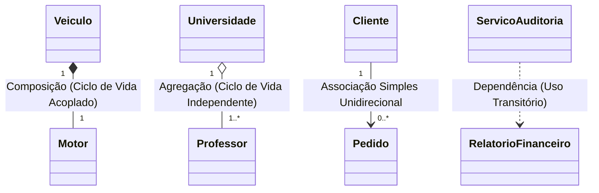
```mermaid
classDiagram
 class Veiculo
 class Motor
 class Universidade
 class Professor
 class Cliente
 class Pedido
 class RelatorioFinanceiro
 class ServicoAuditoria

 Veiculo "1" *-- "1" Motor : Composição (Ciclo de Vida Acoplado)
 Universidade "1" o-- "1..*" Professor : Agregação (Ciclo de Vida Independente)
 Cliente "1" --> "0..*" Pedido : Associação Simples Unidirecional
 ServicoAuditoria ..> RelatorioFinanceiro : Dependência (Uso Transitório)
```

#### 1. Associacao Simples
- **Definição:** Relação semântica em que objetos de uma classe conhecem e mantêm referências para objetos de outra classe para desempenharem suas funções de negócio.
- **Implementação em Java:** Mantida através de atributos de instância normais ou coleções tipadas.

#### 2. Agregacao (Losango Branco/Vazio)
- **Definição:** Forma especializada de associação "todo-parte" fraca. A parte compõe o todo, mas a existência da parte é independente do todo. Se o objeto-todo for destruído, os objetos-partes continuam existindo no sistema.
- **Exemplo Real:** `Universidade` e `Professor`. Se a instituição encerrar suas atividades, os professores continuam existindo e podem lecionar em outra universidade.

#### 3. Composicao (Losango Preto/Preenchido)
- **Definição:** Forma forte de relacionamento "todo-parte". O objeto-parte tem dependência existencial direta com o objeto-todo. Se o objeto-todo for destruído, todas as suas partes vinculadas são obrigatoriamente destruídas junto com ele.
- **Exemplo Real:** `NotaFiscal` e `ItemNotaFiscal`. Não existe justificativa para manter itens de nota soltos órfãos no banco de dados se a nota fiscal pai foi expurgada do sistema.

#### 4. Generalizacao (Seta Triangular Fechada)
- **Definição:** Representação formal da herança de classes. Subclasses compartilham propriedades da superclasse e introduzem novas responsabilidades ou sobrescrevem métodos polimórficos.

#### 5. Dependencia Estrutural Transitoria (Linha Tracejada com Seta Aberta)
- **Definição:** Relação circunstancial em que uma classe consome transitoriamente outra classe sem manter uma variável de instância permanente para ela. Ocorre tipicamente quando uma classe recebe outra como parâmetro de método, instancia um objeto como variável local temporária ou chama um método estático.

---

## Padroes Arquiteturais Fundamentais: O MVC no Smalltalk-80

### Origem Historica no Xerox PARC e a Interface Multi-Janelas

Na passagem dos anos 1970 para os anos 1980, cientistas da computação no Xerox PARC (Palo Alto Research Center) — entre eles Alan Kay, Adele Goldberg e Dan Ingalls — conceberam o ambiente computacional moderno: telas baseadas em mapa de bits (*bitmapped displays*), manipulação direta via mouse e sistemas orientados a janelas sobrepostas (*overlapping windows*).

No Smalltalk-76 e versões primitivas do Smalltalk-80, as rotinas de tela utilizavam a classe `Pen` (caneta). A classe `Pen` permitia que qualquer objeto desenhasse diretamente no *framebuffer* global da tela (`DisplayScreen`). O problema técnico decorrente: se um programa desenhasse pixels de forma arbitrária em qualquer coordenada do monitor, ele corrompia e sobrescrevia os pixels das janelas adjacentes.

Para permitir que dezenas de ferramentas (navegadores de código, workspaces e terminais de log) convivessem no mesmo monitor compartilhando um único teclado e mouse, Trygve Reenskaug concebeu a arquitetura **Model-View-Controller (MVC)**. O MVC nasceu como um mecanismo indispensável para viabilizar o compartilhamento do hardware e da interface gráfica entre múltiplos subsistemas.

```mermaid
flowchart TD
 subgraph MonoliticoPrimitivo["Abordagem Primitiva (Classe Pen)"]
 P_Code["Lógica do Programa"] -->|Desenho Direto no Framebuffer| P_Screen["DisplayScreen (Global)"]
 Note1["Risco de sobrescrita e corrupção de janelas"]
 end

 subgraph ArquiteturaMVC["Arquitetura MVC (Smalltalk-80)"]
 M["Model (Domínio)"]
 V["View (Visual)"]
 C["Controller (Periféricos)"]
 M -.->|Notificação Reativa (changed/update)| V
 V -->|Renderização Delimitada no Viewport| S["Janela Alocada na Tela"]
 C -->|Comandos de Mutação| M
 C -->|Comandos Operacionais| V
 end
```

### A Triade Model-View-Controller e suas Responsabilidades

A tríade do MVC clássico define a separação estrita de três papéis especializados:

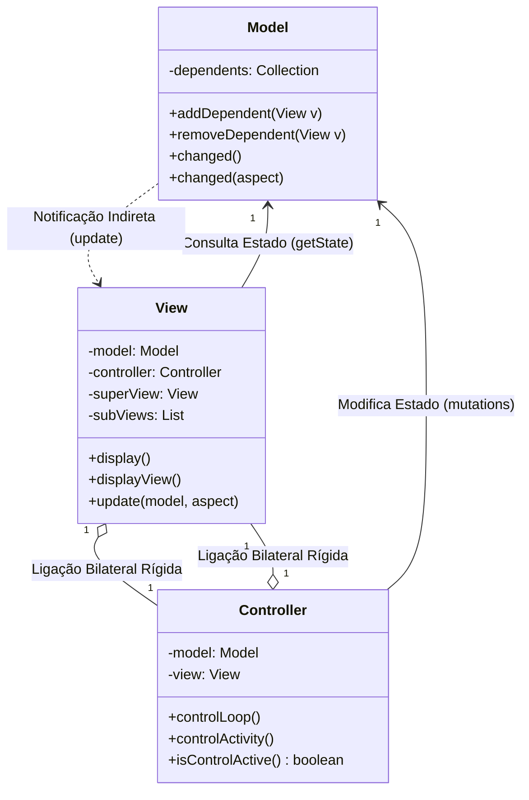
```mermaid
classDiagram
 class Model {
 -dependents: Collection
 +addDependent(View v)
 +removeDependent(View v)
 +changed()
 +changed(aspect)
 }

 class View {
 -model: Model
 -controller: Controller
 -superView: View
 -subViews: List
 +display()
 +displayView()
 +update(model, aspect)
 }

 class Controller {
 -model: Model
 -view: View
 +controlLoop()
 +controlActivity()
 +isControlActive() boolean
 }

 View "1" o-- "1" Controller : Ligação Bilateral Rígida
 Controller "1" o-- "1" View : Ligação Bilateral Rígida
 View --> "1" Model : Consulta Estado (getState)
 Controller --> "1" Model : Modifica Estado (mutations)
 Model ..> View : Notificação Indireta (update)
```

1. **Model (Modelo):** Representa as entidades do mundo real, regras de negócio e integridade das estruturas de dados. É agnóstico quanto à representação visual; não sabe o que são janelas, pixels ou botões. O modelo apenas altera seu estado interno e avisa aos interessados que mudou.
2. **View (Visão):** Gerencia uma região retangular específica da tela alocada para sua aplicação. É responsável por renderizar texto e gráficos baseando-se no estado consultado do Modelo. Uma visão mantém a hierarquia de subvisões aninhadas.
3. **Controller (Controlador):** Interpreta os estímulos físicos originados pelo usuário através de periféricos (mouse e teclado). Ele traduz ações brutas (como clique em um botão do mouse ou pressão de tecla) em ordens semânticas para o Modelo (mutação de dados) ou para a Visão (rolagem de tela, mudança de foco).

### Modelos Passivos versus Modelos Ativos

Steve Burbeck, em sua análise da arquitetura do Smalltalk-80, divide os modelos em duas categorias:

```mermaid
flowchart TD
 subgraph Passivo["Modelo Passivo (Mutação Local)"]
 C1["Controller"] -->|1. Envia ordem de alteração| M1["Model (Passivo)"]
 C1 -->|2. Ordena redesenho imediato| V1["View"]
 Note2["O modelo é estático; não precisa disparar changed"]
 end

 subgraph Ativo["Modelo Ativo (Mutação Concorrente Externa)"]
 Ext["Thread Externa / Processo de Fundo"] -->|1. Modifica Estado| M2["Model (Ativo)"]
 M2 -.->|2. Dispara changed| V2["View Dependente"]
 V2 -->|3. Consulta dados e executa display| M2
 Note3["Obrigatório uso de padrão Observer reativo"]
 end
```

1. **Modelo Passivo:** Seu estado interno só é modificado por comandos diretos do controlador da sua própria tríade MVC. O controlador altera o modelo e ele próprio ordena que a visão se redesenhe. O modelo não precisa manter lista de observadores.
2. **Modelo Ativo:** Seu estado é modificado por entidades externas, processos concorrentes em segundo plano ou múltiplos controladores independentes. Como a Visão não tem como prever quando uma alteração externa ocorrerá, o próprio Modelo deve manter uma lista de dependentes e disparar a notificação `self changed` sempre que sofrer mutações.

### O Mecanismo de Dependencias e Notificacao Reativa

No Smalltalk-80, a notificação de mudanças fundamentou a invenção do padrão de projeto **Observer**:

- **Smalltalk-80 v2.0 (A abordagem por `DependentFields`):** Todos os objetos herdavam a capacidade de ter dependentes através de uma tabela hash global na classe `Object` chamada `DependentFields` (`IdentityDictionary`). As chaves eram os modelos; os valores eram coleções de visões. Problema: alto consumo de memória, contenção em tabela global e vazamento de memória (*memory leaks*) por objetos retidos na tabela.
- **Smalltalk-80 v2.5 (A introdução da classe `Model`):** Criou-se a classe abstrata `Model`, inserindo uma variável de instância dedicada chamada `dependents`. Essa variável implementava uma micro-otimização: se não houvesse dependentes, era `nil`; se houvesse apenas um dependente, armazenava uma referência direta ao objeto; se houvesse dois ou mais, instanciava uma coleção (`DependentsCollection`).

```smalltalk
"Protocolo canônico de disparo no Modelo:"
self changed. "Disparo genérico"
self changed: #saldo. "Disparo parametrizado informando o aspecto alterado"

"Protocolo de recepção na Visão:"
update: aModel
    "Redesenha a visão inteira"
    self display.

update: aModel with: anAspect
    "Redesenha cirurgicamente apenas o que foi alterado"
    anAspect == #saldo ifTrue: [ self redisplaySaldo ].
```

### Acoplamento e Ciclo de Vida da Ligacao View-Controller

Ao contrário do MVC web moderno (onde controllers são classes utilitárias sem estado de interface que apenas respondem requisições HTTP), no Smalltalk-80:
- A ligação entre a `View` e seu `Controller` é **bilateral, forte e de ciclo de vida idêntico (1:1)**.
- Uma instância de `View` conhece e mantém uma referência permanente para sua instância associada de `Controller`.
- O `Controller` conhece e mantém uma referência permanente para sua `View`.
- Quando uma janela é fechada pelo usuário, a `View` e o `Controller` associados são descartados juntos pelo coletor de lixo.

### Hierarquia de Composicao Visual: TopView e SubViews

A interface de uma aplicação no Smalltalk-80 estrutura-se em uma árvore de objetos utilizando o padrão de projeto **Composite**:

```mermaid
flowchart TD
 TV["TopView (Janela Principal / Moldura)"] --> B1["Border / LabelView (Título da Janela)"]
 TV --> SV1["SubView: ListView (Lista de Itens)"]
 TV --> SV2["SubView: TextView (Área de Texto)"]
 TV --> SV3["SubView: SwitchView (Botão Alternador)"]
```

- **TopView:** Representa a moldura externa da janela completa, com barra de títulos, bordas redimensionáveis e controle de foco.
- **SubViews:** Componentes gráficos especializados aninhados dentro da janela. Cada SubView pode conter suas próprias subvisões filhas.
- **Visões Plugáveis (*Pluggable Views*):** Em vez de criar uma nova subclasse de `View` para cada tela diferente, o Smalltalk-80 introduziu visões reutilizáveis (como `PluggableListView` e `PluggableTextView`). A visão plugável recebe "seletores" (símbolos que indicam os nomes dos métodos do modelo) para consultar os dados e executar ações, aplicando o padrão **Adapter**.

### Pipeline de Renderizacao Grafica e Coordenadas

A renderização visual de uma janela na tela obedece a um pipeline estruturado de quatro etapas sequenciais:

```mermaid
flowchart TD
 D["display (Ponto de Entrada)"] --> DB["1. displayBorder (Desenha bordas físicas)"]
 DB --> DV["2. displayView (Desenha o interior da própria visão)"]
 DV --> DS["3. displaySubviews (Delega o desenho para as filhas)"]
 DS --> DC["4. displayControls (Desenha elementos temporários / cursores)"]
```

Para garantir que o desenho de uma SubView não vaze para fora dos limites estabelecidos pela janela pai, a arquitetura implementa a classe `WindowingTransformation`. Essa estrutura executa transformações afins bidirecionais de coordenadas:
- Converte coordenadas do mundo lógico do modelo para o espaço físico de pixels da tela.
- Aplica corte geométrico rígido (*clipping boundary*): primitivas que tentarem desenhar pixels fora do retângulo da visão são descartadas no nível do hardware gráfico.

### Controle Cooperativo e Despacho de Eventos

Em um sistema operacional que operava em processadores unithread sem preempção por hardware no nível de interface do usuário, o Smalltalk-80 estruturava a distribuição de controle através de um gerenciador global chamado `ControlManager` e sua coleção de controladores agendados (`ScheduledControllers`):

```mermaid
flowchart TD
 CM["ControlManager (Loop Global)"] --> ActiveCheck{"Existe Controlador Ativo?"}
 ActiveCheck -- Sim --> PassCtrl["Passa controle para ScheduledController corrente"]
 ActiveCheck -- Não --> SearchLoop["Varre lista de ScheduledControllers"]
 SearchLoop --> CursorCheck{"O cursor do mouse está<br/>dentro da janela?"}
 CursorCheck -- Sim --> Activate["Ativa Controller e inicia seu controlLoop"]
 CursorCheck -- Não --> Idle["Mantém sistema em estado de espera"]
```

#### O Mouse de Três Botões Clássico do Xerox PARC
O mouse do Smalltalk-80 possuía três botões com responsabilidades semânticas padronizadas:
1. **Botão Vermelho (Red Button - Esquerdo):** Interação e seleção direta com o conteúdo da visão (selecionar texto, clicar em item de lista, desenhar).
2. **Botão Amarelo (Yellow Button - Central):** Menu contextual específico da visão interna em foco (operações de edição como copiar, colar, compilar código, buscar texto).
3. **Botão Azul (Blue Button - Direito):** Menu de controle de janela gerenciado pelo sistema operacional (redimensionar janela, mover, minimizar, colapsar ou fechar).

---

## Arquitetura de Software Corporativa e Estilos Modernos

### Definicao Normativa: ISO/IEC/IEEE 42010:2022

A norma internacional **ISO/IEC/IEEE 42010:2022** (*Software, systems and enterprise — Architecture description*) estabelece a definição de arquitetura de software:

> "Estrutura fundamental ou esqueleto de um sistema de software, que define seus componentes, suas relações e seus princípios de projeto e evolução."

```mermaid
classDiagram
 class SistemaSoftware {
 +String nome
 +String missaoNegocio
 }
 class ArquiteturaSoftware {
 +List~Principio~ principiosProjeto
 +List~Diretriz~ diretrizesEvolucao
 }
 class Componente {
 +String identificador
 +String responsabilidade
 }
 class Relacionamento {
 +String protocoloComunicacao
 +String tipoAcoplamento
 }
 class Stakeholder {
 +String papel
 +List~Preocupacao~ concerns
 }

 SistemaSoftware "1" --> "1" ArquiteturaSoftware : possui
 ArquiteturaSoftware "1" *-- "1..*" Componente : organiza
 ArquiteturaSoftware "1" *-- "1..*" Relacionamento : estabelece
 ArquiteturaSoftware ..> Stakeholder : atende as preocupacoes de
 Componente "1..*" -- "1..*" Relacionamento : interligado por
```

A arquitetura governa as decisões estruturais que são difíceis de alterar posteriormente, estabelecendo os alicerces para garantir atributos de qualidade críticos (desempenho, escalabilidade, segurança, manutenibilidade).

### Analogias e Contrastes com a Arquitetura Civil

Historicamente, compara-se a concepção de software com a engenharia civil. Ambas exigem plantas baixas, cálculos estruturais, mitigação de riscos e conformidade antes da construção definitiva. No entanto, o software possui três particularidades exclusivas:

1. **Invisibilidade e Imaterialidade:** O software não tem massa física. Suas tensões manifestam-se em acoplamentos lógicos invisíveis, tornando o sistema vulnerável à **erosão arquitetural** (*architectural drift*), na qual desenvolvedores introduzem atalhos e acoplamentos espúrios sem que a degradação seja visível a olho nu.
2. **Taxa de Mudança e Maleabilidade Extrema:** Um edifício não altera seus pilares de sustentação com facilidade após a entrega. Já o software está em constante mutação; o modelo de negócio evolui e o software precisa se reconfigurar continuamente.
3. **Envelhecimento Lógico sem Degradação Física:** Um prédio sofre desgaste mecânico por intempéries e atrito. O software não sofre desgaste físico; ele se torna obsoleto quando o ambiente ao seu redor (sistemas operacionais, protocolos de segurança, bibliotecas, padrões de mercado) muda e ele permanece estático.

### Padrao Arquitetural versus Padrao de Projeto

É imprescindível distinguir a granularidade das decisões técnicas:

| Critério de Comparação | Padrão Arquitetural (*Architectural Pattern*) | Padrão de Projeto (*Design Pattern - GoF*) |
| :--- | :--- | :--- |
| **Escopo de Impacto** | Global. Abrange todo o sistema ou grandes subsistemas corporativos. | Local. Restrito ao nível de classes, objetos e métodos específicos. |
| **Foco Estrutural** | Distribuição física, limites de contexto, comunicação e subsistemas. | Relações táticas entre classes para resolver problemas recorrentes de código. |
| **Custo de Mudança** | Elevadíssimo. Mudar de Microsserviços para Monólito exige reengenharia. | Baixo a moderado. Pode ser refatorado pontualmente com apoio de testes unitários. |
| **Exemplos Canônicos** | Arquitetura Hexagonal, Microserviços, SOA, Camadas (N-Tier), CQRS. | Strategy, Factory Method, Adapter, Observer, Facade, Singleton. |

### Modelos de Distribuicao: SaaS versus On-Premises

A escolha do modelo de distribuição impacta os investimentos financeiros e o desenho da infraestrutura:

```mermaid
flowchart LR
 subgraph OnPremises["Modelo On-Premises"]
 OP1["Data Center Local da Empresa"]
 OP2["Equipe Interna de TI (Manutenção Física)"]
 OP3["CapEx: Compra de Servidores e Licenças"]
 OP2 --> OP1
 end

 subgraph SaaS["Modelo SaaS (Software as a Service)"]
 S1["Infraestrutura de Nuvem Gerenciada"]
 S2["Equipe do Fornecedor (Suporte e SLA)"]
 S3["OpEx: Pagamento por Assinatura / Consumo"]
 S2 --> S1
 end
```

| Parâmetro de Comparação | Software as a Service (SaaS) | On-Premises (Instalação Local) |
| :--- | :--- | :--- |
| **Modelo Financeiro** | **OpEx** (*Operational Expenditure*): despesa operacional mensal dedutível. | **CapEx** (*Capital Expenditure*): investimento inicial alto em ativos de capital. |
| **Infraestrutura** | Hospedada e mantida na nuvem pelo fornecedor do serviço. | Servidores próprios mantidos em data center da própria empresa. |
| **Atualizações de Versão** | Transparentes e instantâneas para todos os usuários simultaneamente. | Manuais, lentas e dependentes de janelas de parada agendadas pela equipe local. |
| **Custódia dos Dados** | Armazenados na nuvem sob termos contratuais de conformidade e SLA. | Mantidos fisicamente nas dependências da organização. |
| **Escalabilidade** | Elástica e automatizada com provisionamento sob demanda na nuvem. | Rígida. A expansão exige aquisição física e instalação de novos hardwares. |

### Arquitetura Cliente-Servidor e suas Limitacoes

O estilo Cliente-Servidor clássico organiza-se historicamente em duas camadas (2-Tier):

```mermaid
flowchart TD
 subgraph Clientes["Camada de Apresentação (Clientes Pesados / Fat Clients)"]
 C1["Estação Windows 1 (Executável Delphi / VB)"]
 C2["Estação Windows 2 (Executável Delphi / VB)"]
 end

 subgraph ServidorBanco["Servidor Central (Camada de Dados)"]
 DB[("SGBD Relacional Central<br>(Stored Procedures + Tabelas)")]
 end

 C1 -->|Conexão TCP Direta via Driver JDBC/ODBC| DB
 C2 -->|Conexão TCP Direta via Driver JDBC/ODBC| DB
```

#### Gargalos e Problemas Estruturais
- **Insegurança Transacional e Exposição:** As estações de trabalho mantêm conexões diretas com o banco de dados central, exigindo credenciais de acesso embutidas nos executáveis instalados em máquinas de usuários.
- **Acoplamento Extremo com o Banco de Dados:** Regras de negócio ficavam divididas entre o código compilado da interface e *Stored Procedures* complexas no SGBD, dificultando testes unitários automatizados.
- **Logística Complexa de Atualização (*DLL Hell*):** Uma simples alteração de cálculo de tributo exigia instalar manualmente uma nova versão do executável em centenas de computadores físicos da empresa.

### Arquitetura Orientada a Servicos

A **Arquitetura Orientada a Serviços (SOA)** organiza as capacidades de negócio corporativas na forma de serviços fracamente acoplados, interoperáveis e reutilizáveis, comunicando-se através de uma rede por protocolos padronizados (SOAP, XML, REST, JSON):

```mermaid
flowchart TD
 subgraph Consumidores["Consumidores de Serviços"]
 PortalWeb["Portal Web de Compras"]
 AppMobile["Aplicativo Mobile"]
 end

 subgraph Barramento["Barramento Corporativo de Serviços (ESB)"]
 ESB["Enterprise Service Bus (Roteamento, Transformação e Protocolos)"]
 end

 subgraph ServicosCorporativos["Serviços de Domínio (Stateless)"]
 ServCliente["Serviço de Clientes"]
 ServCatalogo["Serviço de Catálogo"]
 ServPagamento["Serviço de Pagamentos"]
 ServLogistica["Serviço de Logística"]
 end

 PortalWeb --> ESB
 AppMobile --> ESB
 ESB --> ServCliente
 ESB --> ServCatalogo
 ESB --> ServPagamento
 ESB --> ServLogistica
```

#### Princípios Centrais de SOA
- **Contratos Padronizados de Serviço:** Cada serviço expõe publicamente uma descrição estrita de seus contratos de entrada e saída.
- **Baixo Acoplamento:** Clientes e serviços mantêm independência de implementação interna e de plataformas de hardware.
- **Abstração e Ocultamento:** A lógica interna e a base de dados subjacente do serviço são invisíveis para os consumidores.
- **Comunicação Stateless (Sem Estado):** Cada invocação de serviço transporta consigo todas as informações necessárias para seu processamento, sem depender de sessões mantidas na memória do servidor.

### Arquitetura Hexagonal: Portas e Adaptadores

Proposta por Alistair Cockburn, a **Arquitetura Hexagonal** (também conhecida como padrão *Ports and Adapters*) estabelece como meta o isolamento absoluto das regras de negócio do núcleo da aplicação em relação a frameworks, interfaces visuais, tecnologias de banco de dados e protocolos externos:

```mermaid
flowchart TD
 subgraph AdaptadoresEntrada["Adaptadores de Entrada (Driving / Inbound)"]
 WebCtrl["Controller REST (Spring/Node)"]
 CLI["Terminal CLI / Script Batch"]
 QueueListener["Consumidor de Fila RabbitMQ"]
 end

 subgraph CoreDominio["Núcleo da Aplicação (Core Domain)"]
 subgraph PortasEntrada["Portas de Entrada (Driving Ports)"]
 InPort["Interface de Caso de Uso / Serviço"]
 end
 
 subgraph EntidadesRegras["Regras de Negócio e Entidades"]
 Entity["Entidades de Domínio e Invariantes"]
 Service["Serviço de Aplicação"]
 end

 subgraph PortasSaida["Portas de Saída (Driven Ports)"]
 OutPort["Interface de Repositório / Gateway"]
 end
 end

 subgraph AdaptadoresSaida["Adaptadores de Saída (Driven / Outbound)"]
 RepoAdapter["Adaptador PostgreSQL (JPA/Hibernate)"]
 MailAdapter["Adaptador de Envio de E-mail (SendGrid)"]
 S3Adapter["Adaptador de Armazenamento em Nuvem"]
 end

 WebCtrl --> InPort
 CLI --> InPort
 QueueListener --> InPort

 InPort --> Service
 Service --> Entity
 Service --> OutPort

 OutPort --> RepoAdapter
 OutPort --> MailAdapter
 OutPort --> S3Adapter
```

- **O Domínio no Centro:** Entidades e serviços de negócio residem no centro do hexágono. Eles não contêm dependências nem anotações de bibliotecas externas (sem `@Entity`, sem referências a SQL ou HTTP).
- **Portas Condutoras (*Driving / Inbound Ports*):** Interfaces que definem as operações que a aplicação oferece ao mundo externo (ex.: `CriarPedidoUseCase`).
- **Portas Conduzidas (*Driven / Outbound Ports*):** Interfaces definidas pelo núcleo que declaram os serviços externos de que a aplicação precisa para funcionar (ex.: `PedidoRepositoryPort`, `GatewayPagamentoPort`).
- **Adaptadores (*Adapters*):** Componentes que residem nas bordas do hexágono. Convertem requisições de fora para dentro (adaptadores de entrada) ou traduzem comandos do núcleo para tecnologias externas concretas (adaptadores de saída).

### Arquitetura de Microservicos: Autonomia e Complexidade

A **Arquitetura de Microserviços** decompõe uma aplicação complexa em uma coleção de pequenos serviços autônomos, organizados em torno de capacidades de negócio específicas:

```mermaid
flowchart LR
 subgraph GatewayLayer["Camada de Borda"]
 AGW["API Gateway / Reverse Proxy"]
 end

 subgraph Microservices["Ecossistema de Microsserviços Descentralizados"]
 MS_Users["Microsserviço de Usuários"]
 MS_Orders["Microsserviço de Pedidos"]
 MS_Billing["Microsserviço de Faturamento"]
 end

 subgraph BancosIsolados["Bancos de Dados Privados (Database-per-Service)"]
 DB1[("DB Usuários")]
 DB2[("DB Pedidos")]
 DB3[("DB Faturamento")]
 end

 AGW --> MS_Users
 AGW --> MS_Orders
 AGW --> MS_Billing

 MS_Users --> DB1
 MS_Orders --> DB2
 MS_Billing --> DB3

 MS_Orders -.->|Evento Assíncrono via Kafka| MS_Billing
```

#### Características Fundamentais
- **Banco de Dados Exclusivo por Serviço (*Database-per-Service*):** Nenhum microsserviço acessa diretamente as tabelas do banco de dados de outro serviço. Toda troca de dados ocorre via APIs públicas ou mensageria assíncrona.
- **Implantabilidade Independente (*Independent Deployability*):** Modificar o serviço de pagamentos permite colocar uma nova versão em produção sem demandar novo build ou implantação dos serviços de catálogo ou frete.
- **Descentralização Tecnológica:** Cada squad pode utilizar a linguagem de programação e o banco de dados mais adequados ao problema do seu domínio.

#### Trade-offs e a Realidade Operacional
A adoção de microserviços não é uma decisão simples; ela troca complexidade de código por complexidade de infraestrutura e rede:

| Dimensão de Análise | Monólito Modular | Arquitetura de Microserviços |
| :--- | :--- | :--- |
| **Complexidade Operacional** | Baixa. Apenas uma aplicação para compilar, monitorar e implantar. | Altíssima. Exige orquestração de contêineres (Kubernetes), observabilidade distribuída e service mesh. |
| **Consistência de Dados** | Forte (Transações ACID no banco de dados relacional central). | Eventual (*Eventual Consistency*). Exige padrões de compensação distribuída como o padrão **Saga**. |
| **Latência de Comunicação** | Quase nula (invocações de métodos em memória interna do processo). | Considerável (tráfego de rede, serialização JSON/gRPC e latência de conexões TCP). |
| **Barreira Organizacional** | Equipes unificadas em torno de uma base de código compartilhada. | Exige alinhamento com a **Lei de Conway**: equipes autônomas organizadas por domínio. |

### Evolucao Arquitetural e o Antipadrao de Desenvolvimento por Modismo

Uma das advertências fundamentais enfatizadas no encerramento da disciplina refere-se ao antipadrão do **Desenvolvimento Orientado a Modismos** (*Hype-Driven Development*):

> Decisões de arquitetura devem ser guiadas pelas dores concretas do domínio e pelos requisitos não funcionais, e nunca pelo que está em alta nas redes sociais ou blogs de grandes empresas do Vale do Silício.

- **A Falácia da Escala Prematura:** Adotar uma infraestrutura distribuída com dezenas de microsserviços para um sistema que processa 100 pedidos por dia introduz custos operacionais que podem inviabilizar financeiramente uma startup.
- **A Abordagem Monólito Primeiro (*Monolith First*):** O arquiteto sênior inicia uma solução na forma de um **Monólito Modular** bem projetado, aplicando princípios de alta coesão e isolamento de módulos. Quando, e se, determinados contextos de negócio exigirem escalabilidade física independente ou equipes dedicadas, esses módulos são extraídos cirurgicamente para serviços independentes.

---

## Laboratorio Pratico e Implementacoes de Referencia

### Implementacao de Dominio Seguro em Java

O exemplo a seguir ilustra a aplicação de **Abstração**, **Encapsulamento Rigoroso de Invariantes**, proteção contra referências mutáveis (*escaping references*) e uso de tipos semânticos:

```java
package br.unifef.engenharia.vendas;

import java.time.LocalDateTime;
import java.util.ArrayList;
import java.util.Collections;
import java.util.List;
import java.util.Objects;

/**
 * Entidade de Domínio representando um Item de Pedido.
 * Demonstra encapsulamento e imutabilidade de cálculo.
 */
public class ItemPedido {
    private final String codigoSku;
    private final String descricao;
    private final double precoUnitario;
    private final int quantidade;

    public ItemPedido(String codigoSku, String descricao, double precoUnitario, int quantidade) {
        if (codigoSku == null || codigoSku.isBlank()) {
            throw new IllegalArgumentException("O SKU do produto é obrigatório.");
        }
        if (precoUnitario <= 0.0) {
            throw new IllegalArgumentException("O preço unitário deve ser estritamente positivo.");
        }
        if (quantidade <= 0) {
            throw new IllegalArgumentException("A quantidade solicitada deve ser maior que zero.");
        }

        this.codigoSku = codigoSku;
        this.descricao = Objects.requireNonNull(descricao, "A descrição não pode ser nula.");
        this.precoUnitario = precoUnitario;
        this.quantidade = quantidade;
    }

    public double calcularSubtotal() {
        return this.precoUnitario * this.quantidade;
    }

    public String getCodigoSku() { return codigoSku; }
    public String getDescricao() { return descricao; }
    public double getPrecoUnitario() { return precoUnitario; }
    public int getQuantidade() { return quantidade; }
}
```

```java
package br.unifef.engenharia.vendas;

import java.time.LocalDateTime;
import java.util.ArrayList;
import java.util.Collections;
import java.util.List;
import java.util.Objects;

/**
 * Raiz de Agregação representando uma Venda.
 * Demonstra a proteção de coleções internas e manutenção de invariantes de negócio.
 */
public class Venda {
    private final String numeroIdentificador;
    private final LocalDateTime dataCriacao;
    private final List<ItemPedido> itens;
    private boolean finalizada;

    public Venda(String numeroIdentificador) {
        if (numeroIdentificador == null || numeroIdentificador.isBlank()) {
            throw new IllegalArgumentException("Identificador unívoco da venda é obrigatório.");
        }
        this.numeroIdentificador = numeroIdentificador;
        this.dataCriacao = LocalDateTime.now();
        this.itens = new ArrayList<>();
        this.finalizada = false;
    }

    public void adicionarItem(ItemPedido item) {
        if (this.finalizada) {
            throw new IllegalStateException("Não é permitido adicionar itens a uma venda finalizada.");
        }
        this.itens.add(Objects.requireNonNull(item, "O item da venda não pode ser nulo."));
    }

    public double calcularValorTotal() {
        return this.itens.stream()
                .mapToDouble(ItemPedido::calcularSubtotal)
                .sum();
    }

    public void concluirVenda() {
        if (this.itens.isEmpty()) {
            throw new IllegalStateException("Uma venda não pode ser concluída sem itens cadastrados.");
        }
        this.finalizada = true;
    }

    public String getNumeroIdentificador() {
        return this.numeroIdentificador;
    }

    public LocalDateTime getDataCriacao() {
        return this.dataCriacao;
    }

    public boolean isFinalizada() {
        return this.finalizada;
    }

    /**
     * Retorna uma visão imutável da coleção de itens.
     * Evita a anomalia de Escaping Reference (onde clientes executam .clear() ou .add() fora do objeto).
     */
    public List<ItemPedido> getItens() {
        return Collections.unmodifiableList(this.itens);
    }
}
```

### Implementacao de Padrao Arquitetural Hexagonal em Java

Abaixo demonstra-se o isolamento absoluto de um caso de uso através de Portas e Adaptadores:

```java
package br.unifef.hexagonal.core.ports;

import br.unifef.engenharia.vendas.Venda;
import java.util.Optional;

/**
 * Porta de Saída (Driven / Outbound Port): Contrato de persistência de Venda.
 * O núcleo de negócio define a interface; adaptadores de tecnologia a implementam.
 */
public interface VendaRepositoryPort {
    void salvar(Venda venda);
    Optional<Venda> buscarPorId(String identificador);
}
```

```java
package br.unifef.hexagonal.core.ports;

/**
 * Porta de Entrada (Driving / Inbound Port): Caso de Uso de Criação de Venda.
 */
public interface CriarVendaUseCase {
    String executar(CriarVendaComando comando);
}
```

```java
package br.unifef.hexagonal.core.services;

import br.unifef.engenharia.vendas.ItemPedido;
import br.unifef.engenharia.vendas.Venda;
import br.unifef.hexagonal.core.ports.CriarVendaComando;
import br.unifef.hexagonal.core.ports.CriarVendaUseCase;
import br.unifef.hexagonal.core.ports.VendaRepositoryPort;
import java.util.UUID;

/**
 * Serviço de Domínio / Caso de Uso Central.
 * Totalmente isolado de frameworks, anotações de banco ou protocolos HTTP.
 */
public class CriarVendaService implements CriarVendaUseCase {
    private final VendaRepositoryPort vendaRepository;

    public CriarVendaService(VendaRepositoryPort vendaRepository) {
        this.vendaRepository = vendaRepository;
    }

    @Override
    public String executar(CriarVendaComando comando) {
        String idGerado = UUID.randomUUID().toString();
        Venda novaVenda = new Venda(idGerado);

        for (var itemComando : comando.itens()) {
            novaVenda.adicionarItem(new ItemPedido(
                itemComando.sku(),
                itemComando.descricao(),
                itemComando.preco(),
                itemComando.quantidade()
            ));
        }

        novaVenda.concluirVenda();
        this.vendaRepository.salvar(novaVenda);
        return idGerado;
    }
}
```

```java
package br.unifef.hexagonal.adapters.outbound;

import br.unifef.engenharia.vendas.Venda;
import br.unifef.hexagonal.core.ports.VendaRepositoryPort;
import java.util.HashMap;
import java.util.Map;
import java.util.Optional;

/**
 * Adaptador de Saída Concreto: Implementação em Memória para Testes ou Banco Real.
 * Reside na borda da aplicação.
 */
public class InMemoryVendaRepositoryAdapter implements VendaRepositoryPort {
    private final Map<String, Venda> bancoEmMemoria = new HashMap<>();

    @Override
    public void salvar(Venda venda) {
        bancoEmMemoria.put(venda.getNumeroIdentificador(), venda);
    }

    @Override
    public Optional<Venda> buscarPorId(String identificador) {
        return Optional.ofNullable(bancoEmMemoria.get(identificador));
    }
}
```

### Implementacao Conceitual da Triade MVC do Smalltalk-80

O código a seguir transpõe para a linguagem Java a mecânica clássica do MVC do Smalltalk-80, exibindo o acoplamento bilateral View-Controller e o mecanismo reativo do Observer:

```java
package br.unifef.smalltalk.mvc;

import java.util.ArrayList;
import java.util.List;

/**
 * Abstração de Modelo Reativo inspirada no Smalltalk-80 v2.5.
 */
public abstract class Model {
    private final List<View> dependentes = new ArrayList<>();

    public void addDependent(View view) {
        if (view != null && !dependentes.contains(view)) {
            dependentes.add(view);
        }
    }

    public void removeDependent(View view) {
        dependentes.remove(view);
    }

    public void changed() {
        for (View view : dependentes) {
            view.update(this, null);
        }
    }

    public void changed(Object aspect) {
        for (View view : dependentes) {
            view.update(this, aspect);
        }
    }
}
```

```java
package br.unifef.smalltalk.mvc;

/**
 * Modelo de Domínio Concreto (Telemetria).
 */
public class SensorTemperaturaModel extends Model {
    private double temperatura;

    public SensorTemperaturaModel(double inicial) {
        this.temperatura = inicial;
    }

    public void alterarTemperatura(double novaTemperatura) {
        this.temperatura = novaTemperatura;
        // Notifica dependentes indicando o aspecto específico alterado
        this.changed("temperatura");
    }

    public double getTemperatura() {
        return temperatura;
    }
}
```

```java
package br.unifef.smalltalk.mvc;

/**
 * Controlador de Interface Gráfica.
 * Mantém ligação direta bilateral com sua View e conhece o Modelo.
 */
public class TemperaturaController {
    private SensorTemperaturaModel model;
    private TemperaturaView view;

    public void associar(SensorTemperaturaModel model, TemperaturaView view) {
        this.model = model;
        this.view = view;
    }

    // Ação acionada pelo Botão Vermelho (Red Button) do mouse
    public void tratarCliqueAumentar() {
        this.model.alterarTemperatura(this.model.getTemperatura() + 1.0);
    }

    // Ação acionada pelo Botão Amarelo (Yellow Button) do mouse
    public void tratarCliqueMenuContextual() {
        this.view.exibirMenuOpcoes();
    }
}
```

```java
package br.unifef.smalltalk.mvc;

/**
 * Visão Gráfica.
 * Mantém ligação direta bilateral com seu Controller e implementa o protocolo de update.
 */
public class TemperaturaView {
    private final SensorTemperaturaModel model;
    private final TemperaturaController controller;

    public TemperaturaView(SensorTemperaturaModel model, TemperaturaController controller) {
        this.model = model;
        this.controller = controller;
        this.controller.associar(model, this);
        this.model.addDependent(this); // Registro de dependência reativa
    }

    public void update(Model emissor, Object aspect) {
        if ("temperatura".equals(aspect)) {
            this.displayView();
        }
    }

    public void displayView() {
        System.out.println("[Renderização View] Temperatura Atualizada: " 
                + this.model.getTemperatura() + " °C");
    }

    public void exibirMenuOpcoes() {
        System.out.println("[Menu Contextual] 1. Calibrar | 2. Resetar | 3. Exportar Log");
    }
}
```

---

## Banco de Questoes e Avaliacao Formativa

### Questoes Dissertativas de Alta Complexidade

#### Questão 1: Transição Análise versus Projeto
*Enunciado:* Em reuniões corporativas de concepção de software, é frequente que desenvolvedores iniciantes comecem a propor tabelas de bancos de dados relacionais e endpoints REST logo nos primeiros dez minutos de conversa com o cliente. Explique com rigor técnico por que essa abordagem viola a transição clássica entre Modelo de Análise e Modelo de Projeto, indicando os riscos de curto e longo prazo para a manutenibilidade do produto.

*Resposta Padrão Esperada:*  
A análise de requisitos concentra-se no domínio do problema ("o que o sistema deve fazer"), sendo essencialmente agnóstica em relação à tecnologia de implementação. Seu foco é desvendar as regras de negócio, a cadeia causal e os objetivos operacionais dos stakeholders. Quando a equipe salta prematuramente para a modelagem de banco de dados e endpoints de rede (domínio da solução / projeto de software), ocorre um acoplamento precoce das regras de negócio aos detalhes acidentais da infraestrutura técnica.  
Como riscos de curto prazo, o projeto sofre com a automatização do caos: informatizam-se processos manuais inconsistentes que foram aceitos sem o devido questionamento investigativo, gerando retrabalho maciço. Como riscos de longo prazo, a arquitetura acumula débitos técnicos e rigidez estrutural, tornando alterações simples de regras de negócio em operações de alto custo devido à dependência em cascata com tabelas e formatos de rede pré-fixados.

---

#### Questão 2: Semântica de Relacionamentos em Casos de Uso
*Enunciado:* Considere dois casos de uso em um sistema de internet banking: `Realizar Transferência Bancária` e `Auditar Transação Suspeita`. Um analista inexperiente modelou a ligação entre eles como uma dependência de inclusão (`<<include>>`), enquanto outro analista defendeu o uso de extensão (`<<extend>>`). Analise detalhadamente a semântica de ambos os relacionamentos e justifique qual deles é o formalmente correto perante as regras da UML.

*Resposta Padrão Esperada:*  
O relacionamento de inclusão (`<<include>>`) define que o caso de uso base executa de forma incondicional e obrigatória o comportamento do caso incluído como parte indissociável de seu fluxo. Se `Auditar Transação Suspeita` fosse um `<<include>>`, toda e qualquer transferência bancária acionaria compulsoriamente a auditoria, o que tornaria o fluxo ineficiente e corromperia a regra de negócio.  
O relacionamento correto é o de extensão (`<<extend>>`). Nele, o caso de uso de extensão expande o comportamento do caso base de forma opcional e condicional em um ponto de extensão (*extension point*) pré-definido, dependente de uma condição de guarda em tempo de execução (ex.: `[valor da transferência > R$ 50.000,00 ou conta de destino em lista de monitoramento]`). Na ausência dessa condição, o caso de uso base conclui seu fluxo normalmente. A seta tracejada deve partir de `Auditar Transação Suspeita` e apontar para `Realizar Transferência Bancária`.

---

#### Questão 3: Tríade MVC e Modelos Ativos no Smalltalk-80
*Enunciado:* Analise a mecânica de funcionamento do ambiente Smalltalk-80 e diferencie um Modelo Passivo de um Modelo Ativo. Explique por que a classe `SystemTranscript` não pode ser gerenciada adequadamente como um Modelo Passivo e qual a importância do protocolo `changed`/`update:` nesse contexto.

*Resposta Padrão Esperada:*  
Um Modelo Passivo é aquele cujo estado interno é modificado exclusivamente pelo controlador da própria tríade MVC na qual está inserido. O controlador envia uma mensagem de mutação ao modelo e, tendo ciência dessa alteração, comanda diretamente o redesenho da sua visão associada, dispensando a necessidade de o modelo manter listas de dependentes.  
Por outro lado, o `SystemTranscript` (console global de saída do Smalltalk-80) é um Modelo Ativo clássico: seu conteúdo de texto pode ser modificado a qualquer momento por processos em segundo plano, threads externas ou rotinas concorrentes do sistema (ex.: `Transcript show: 'Alerta'`). Nem a visão nem o controlador do Transcript têm controle sobre quando uma alteração externa ocorrerá. Logo, a responsabilidade de emitir a notificação recai sobre o próprio modelo. Ao receber uma nova mensagem de texto, ele invoca `self changed`, disparando o método `update:` em todas as instâncias de `TextCollectorView` registradas como dependentes, permitindo que a tela se atualize de forma reativa e consistente.

---

#### Questão 4: Isolamento Arquitetural na Arquitetura Hexagonal
*Enunciado:* Na Arquitetura Hexagonal (*Ports and Adapters*), afirma-se que o núcleo de domínio não deve depender de tecnologias de banco de dados ou de frameworks web. Como o Princípio de Inversão de Dependências (DIP do SOLID) viabiliza essa independência prática no código-fonte Java?

*Resposta Padrão Esperada:*  
A viabilização do isolamento baseia-se na declaração de Portas de Saída (*Driven Ports*) constituídas estritamente por interfaces Java que residem dentro do próprio pacote do núcleo de domínio (ex.: `PedidoRepositoryPort`). O serviço de domínio depende unicamente dessa abstração para salvar ou consultar entidades.  
Os detalhes tecnológicos (drivers JDBC, bibliotecas JPA/Hibernate, anotações de banco) residem fora do hexágono, na camada de Adaptadores de Saída (*Outbound Adapters*). O adaptador implementa a interface declarada pelo domínio. Em tempo de execução, a instância concreta do adaptador é injetada no serviço de domínio (Injeção de Dependências). Dessa forma, a direção das dependências de código-fonte aponta sempre de fora para dentro (das tecnologias em direção ao domínio), assegurando que o núcleo permaneça agnóstico a bancos de dados ou bibliotecas externas.

---

### Questoes Praticas de Modelagem e Projeto

#### Exercício Prático 1: Modelagem Estrutural de Sistema Acadêmico
Construa o diagrama de classes estrutural em notação Mermaid para o seguinte cenário acadêmico, aplicando multiplicidades, modificadores de visibilidade e relacionamentos estritos:
- Um `Departamento` possui um identificador e um nome. Ele agrega múltiplos `Professores`.
- Cada `Professor` possui CPF, nome, matrícula e leciona em uma ou mais `Disciplinas`.
- Uma `Disciplina` possui código, nome e carga horária, e compõe múltiplas `Turmas`.
- Cada `Turma` possui um semestre letivo, um ano e congrega de 5 a 60 `Alunos`.
- O `Aluno` possui RA, nome, histórico escolar e pode trancar sua matrícula.

```mermaid
classDiagram
 class Departamento {
 -String codigo
 -String nome
 +adicionarProfessor(Professor p) void
 +removerProfessor(Professor p) void
 }

 class Professor {
 -String cpf
 -String nome
 -String matricula
 +ministrarDisciplina(Disciplina d) void
 }

 class Disciplina {
 -String codigo
 -String nome
 -int cargaHoraria
 +criarTurma(String semestre, int ano) Turma
 }

 class Turma {
 -String semestre
 -int ano
 -int capacidadeMaxima
 +matricularAluno(Aluno a) boolean
 +emitirDiarioClasse() List
 }

 class Aluno {
 -String ra
 -String nome
 -boolean matriculaAtiva
 +trancarMatricula() void
 +consultarHistorico() String
 }

 Departamento "1" o-- "1..*" Professor : Agregação
 Professor "1..*" -- "1..*" Disciplina : Leciona
 Disciplina "1" *-- "1..*" Turma : Composição
 Turma "0..*" -- "5..60" Aluno : Congrega
```

---

#### Exercício Prático 2: Diagrama de Sequência de Transação Financeira
Modele em diagrama de sequência Mermaid a dinâmica temporal de uma operação de compra aprovada em um e-commerce:
1. O `Cliente` aciona `finalizarPedido()` no `CheckoutController`.
2. O `CheckoutController` chama `processar()` no `PedidoService`.
3. O `PedidoService` consulta o `EstoqueRepository` para verificar a disponibilidade.
4. O `PedidoService` invoca a cobrança na porta `GatewayPagamentoPort`.
5. O gateway retorna confirmação de autorização da transadora.
6. O `PedidoService` grava o pedido aprovado via `PedidoRepositoryPort`.
7. O `PedidoService` dispara um evento assíncrono para o `EmailNotificationService`.
8. O `CheckoutController` retorna o comprovante de compra ao `Cliente`.

```mermaid
sequenceDiagram
 autonumber
 actor C as Cliente
 participant Ctrl as CheckoutController
 participant Svc as PedidoService
 participant Est as EstoqueRepository
 participant Gate as GatewayPagamentoPort
 participant Repo as PedidoRepositoryPort
 participant Notif as EmailNotificationService

 C->>Ctrl: finalizarPedido(carrinhoId, cartaoToken)
 activate Ctrl
 Ctrl->>Svc: processar(carrinhoId, cartaoToken)
 activate Svc
 Svc->>Est: verificarDisponibilidade(itens)
 activate Est
 Est-->>Svc: itensDisponiveis = true
 deactivate Est
 Svc->>Gate: autorizarCobranca(cartaoToken, valorTotal)
 activate Gate
 Gate-->>Svc: status = APROVADO, transacaoId
 deactivate Gate
 Svc->>Repo: salvarPedido(novoPedido)
 activate Repo
 Repo-->>Svc: pedidoGravado
 deactivate Repo
 Svc-)Notif: enviarConfirmacaoAsync(clienteEmail, pedidoId)
 Svc-->>Ctrl: comprovanteCompra(pedidoId, status)
 deactivate Svc
 Ctrl-->>C: exibirTelaSucesso(comprovante)
 deactivate Ctrl
```

---

### Checklist Integral de Revisao para Exames

Utilize este checklist como guia de estudo antes das avaliações formais (AV1 e AV2):

- [ ] **Engenharia de Software e Ciclo de Vida:**
  - Compreendo a premissa de que "Software não é pastelaria" e os impactos do desenvolvimento sem planejamento.
  - Sei diferenciar com clareza o domínio da Análise ("fazer a coisa certa") do domínio do Projeto ("fazer certo a coisa").
  - Consigo enumerar e descrever os objetivos, entradas e saídas das 10 etapas clássicas do ciclo de vida de desenvolvimento.

- [ ] **Engenharia e Elicitação de Requisitos:**
  - Sei diferenciar epistemologicamente "Levantamento Passivo" de "Elicitação Ativa".
  - Sei aplicar a cadeia causal: Necessidade -> Problema -> Contexto -> Expectativa -> Requisito.
  - Domínio as 6 perguntas cardinais da investigação de sistemas.
  - Sou capaz de identificar anti-requisitos (termos ambíguos como "rápido", "fácil", "seguro") e refatorá-los em métricas de RNF.
  - Compreendo as aplicações, vantagens e limites de Entrevistas, Questionários, Observação (*Job Shadowing*), Análise Documental, Workshops e Prototipação.
  - Sei aplicar os "Cinco Porquês" para isolar causas raiz de problemas operacionais.
  - Distingo com precisão o papel do Stakeholder (visão de negócio) do Analista de Sistemas (visão técnica).

- [ ] **Priorização com Método MoSCoW:**
  - Conheço a origem (DSDM) e as quatro categorias: Must, Should, Could, Won't have.
  - Sei classificar um catálogo de requisitos para estruturar o escopo de um MVP.

- [ ] **Modelagem Comportamental com Casos de Uso:**
  - Compreendo a abordagem de modelagem Caixa-Preta (*Black-Box*).
  - Reconheço atores primários (disparadores de valor) e secundários (sistemas externos de suporte).
  - Domínio a convenção de nomenclatura de casos de uso (verbo no infinitivo + complemento).
  - Sei aplicar e justificar os quatro relacionamentos: Associação, Inclusão (`<<include>>`), Extensão (`<<extend>>`) e Generalização.
  - Sei estruturar uma especificação textual completa contendo pré-condições, pós-condições, fluxo principal, alternativos e de exceção.

- [ ] **Modelagem Estrutural com Diagrama de Classes:**
  - Compreendo por que a UML é uma notação gráfica padronizada e NÃO um processo ou metodologia de software.
  - Sei como a modelagem visual se integra ao desenvolvimento ágil no Scrum (*Just-Enough, Just-in-Time*).
  - Domínio a anatomia da classe com seus três compartimentos (Nome, Atributos, Operações).
  - Aplico os modified de visibilidade: `+` público, `#` protegido, `-` privado e `~` pacote.
  - Sei modelar multiplicidades (`1`, `0..1`, `1..*`, `*`) e papéis nas associações.
  - Sei diferenciar e implementar em código Java: Associação Simples, Agregação (losango vazio), Composição (losango preenchido), Generalização e Dependência Transitória.
  - Sei aplicar o encapsulamento de negócio e proteger coleções contra *escaping references* com `Collections.unmodifiableList`.

- [ ] **Padrão Arquitetural MVC no Smalltalk-80:**
  - Conheço o contexto histórico no Xerox PARC e os desafios de interfaces multi-janelas sobrepostas.
  - Compreendo a divisão de responsabilidades da tríade Model-View-Controller clássica.
  - Sei diferenciar Modelos Passivos de Modelos Ativos e a dependência do padrão Observer.
  - Conheço a evolução estrutural de `DependentFields` (Smalltalk v2.0) para a variável `dependents` na classe `Model` (Smalltalk v2.5).
  - Compreendo por que a ligação View-Controller é bilateral direta (1:1), enquanto a ligação Model-View é reativa via `changed`/`update:`.
  - Sei explicar a hierarquia `TopView`/`SubViews`, o pipeline de renderização gráfica e o controle cooperativo com o mouse de três botões (Red, Yellow, Blue).

- [ ] **Arquitetura Corporativa e Estilos Modernos:**
  - Conheço a definição internacional de arquitetura segundo a norma ISO/IEC/IEEE 42010:2022.
  - Sei diferenciar com clareza Padrões Arquiteturais (macroestruturais) de Padrões de Projeto GoF (microestruturais).
  - Compreendo as diferenças financeiras (CapEx vs OpEx), operacionais e regulatórias entre SaaS e On-Premises.
  - Reconheço as limitações e vulnerabilidades do estilo Cliente-Servidor clássico em duas camadas.
  - Conheço os fundamentos de SOA e a comunicação desacoplada stateless em barramentos ESB.
  - Sei desenhar e implementar a Arquitetura Hexagonal (*Ports and Adapters*), isolando o domínio por Inversão de Dependências.
  - Compreendo as vantagens e os severos trade-offs operacionais da Arquitetura de Microserviços (*Database-per-Service*, consistência eventual, orquestração e monitoramento).
  - Sei identificar e evitar o antipadrão do Desenvolvimento Orientado a Modismos (*Hype-Driven Development*).

---

## Fontes e Metadados

- Turma no Classroom: Engenharia de Software 2 - 2026/02
- Itens processados: 0 materiais, 3 tarefas, 8 avisos
- Gerado em: 30/09/2026, 20:18:39 (BRT) via classroom-sync
