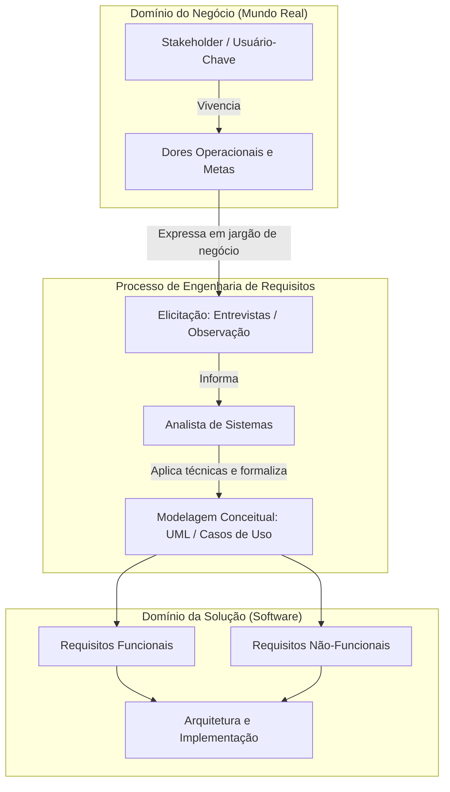
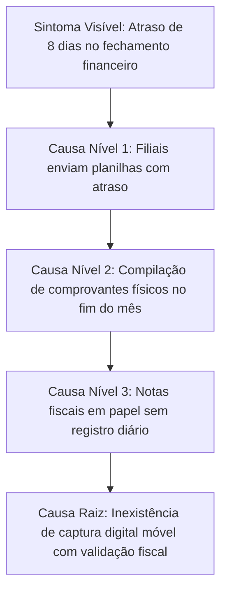
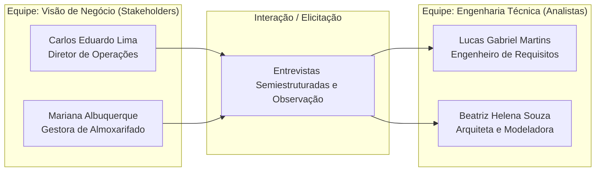
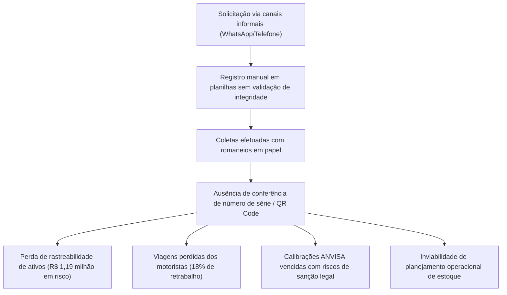
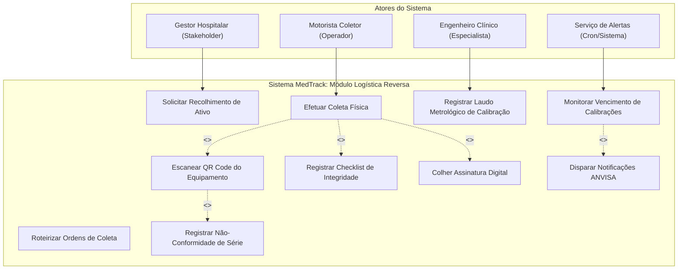
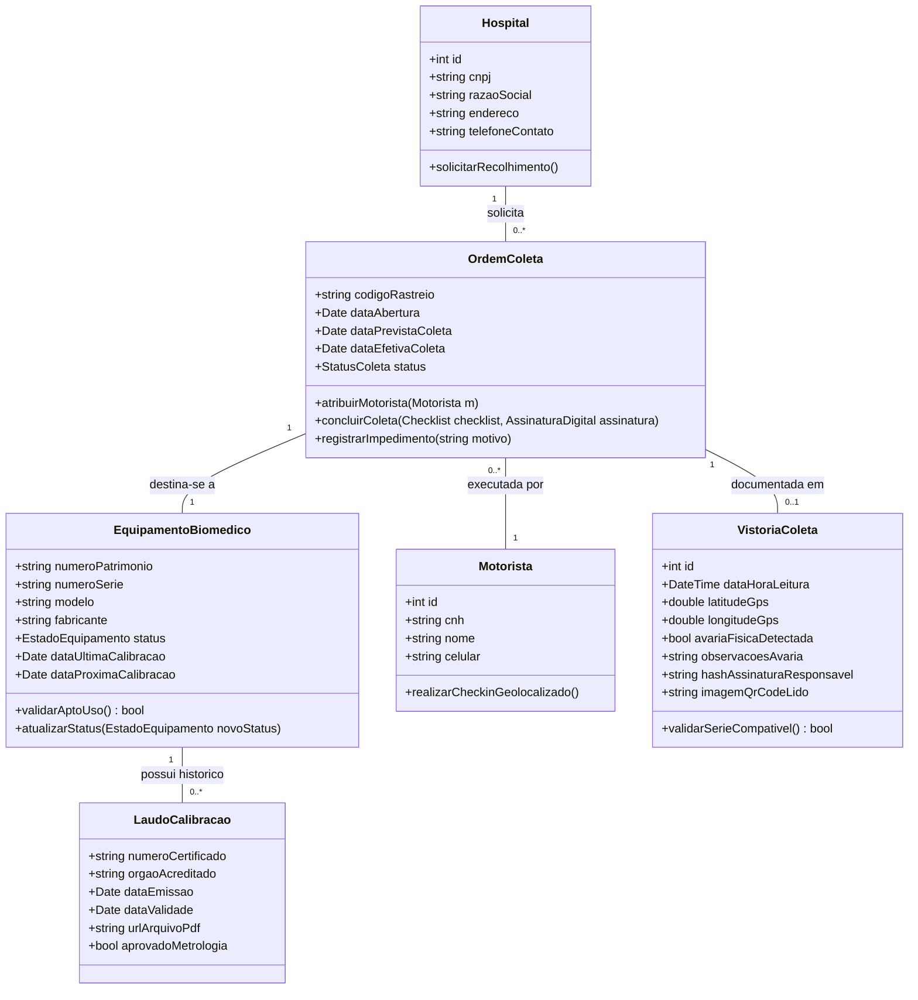
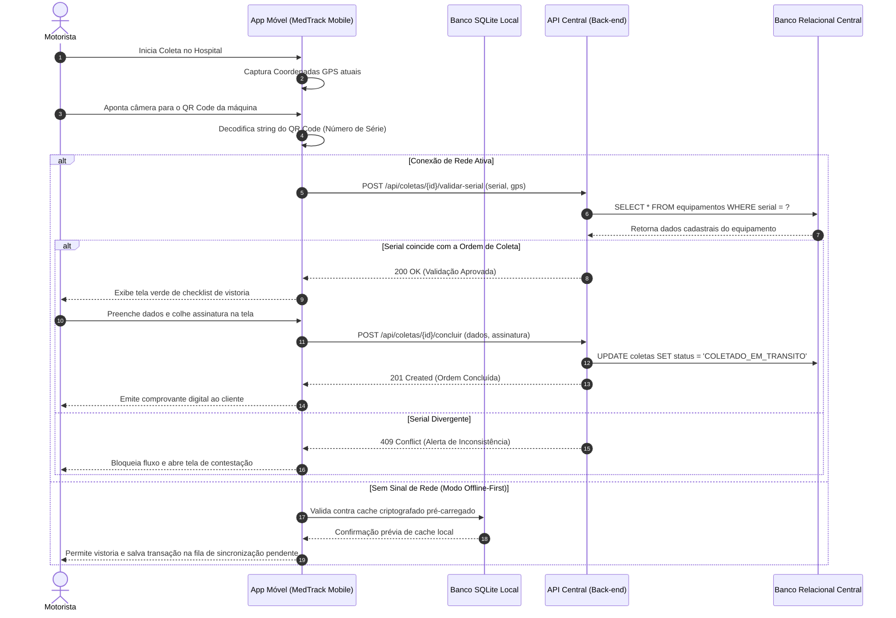
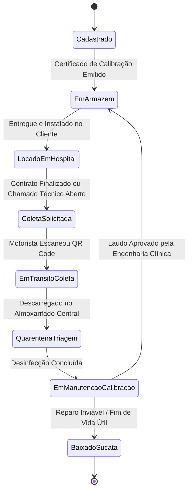
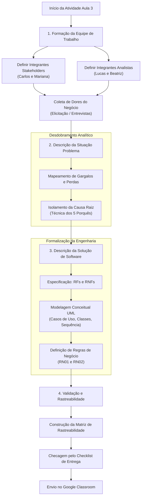

# Trabalho — Atividade Aula 3

> **Professor:** Wesley Soares
> **Disciplina:** Engenharia de Software II (4º Semestre)
> **Prazo de Entrega:** 18/08/2026 às 23:59
> **Pontuação Máxima:** 100 pontos
> **Conteúdo cobrado:** [Aula 01 - Introdução ao Ciclo de Vida do Projeto de Software](../../Aulas/Aula%2001%20-%20Introdu%C3%A7%C3%A3o%20ao%20Ciclo%20de%20Vida%20do%20Projeto%20de%20Software/detalhes.md), [Aula 02 - Fundamentos de Projeto Orientado a Objetos](../../Aulas/Aula%2002%20-%20Fundamentos%20de%20Projeto%20Orientado%20a%20Objetos/detalhes.md), [Aula 03 - Técnicas de Elicitação e Levantamento de Requisitos](../../Aulas/Aula%2003%20-%20T%C3%A9cnicas%20de%20Elicita%C3%A7%C3%A3o%20e%20Levantamento%20de%20Requisitos/detalhes.md), [Aula 04 - Modelagem de Casos de Uso UML](../../Aulas/Aula%2004%20-%20Modelagem%20de%20Casos%20de%20Uso%20UML/detalhes.md), [Aula 06 - Modelagem de Requisitos e Casos de Uso](../../Aulas/Aula%2006%20-%20Modelagem%20de%20Requisitos%20e%20Casos%20de%20Uso/detalhes.md)

---

## Sumário

- [Enunciado original (Google Classroom)](#enunciado-original-google-classroom)
- [Análise do que é pedido](#análise-do-que-é-pedido)
  - [Objetivo pedagógico e contexto acadêmico](#objetivo-pedagógico-e-contexto-acadêmico)
  - [Entregáveis explícitos](#entregáveis-explícitos)
  - [Critérios implícitos de avaliação](#critérios-implícitos-de-avaliação)
- [Fundamentação teórica](#fundamentação-teórica)
  - [Papéis no processo de software: Stakeholder versus Analista de Sistemas](#papéis-no-processo-de-software-stakeholder-versus-analista-de-sistemas)
  - [Engenharia de requisitos e técnicas de elicitação](#engenharia-de-requisitos-e-técnicas-de-elicitação)
  - [Diagnóstico de problemas: sintoma versus causa raiz](#diagnóstico-de-problemas-sintoma-versus-causa-raiz)
  - [Concepção e especificação da solução de software](#concepção-e-especificação-da-solução-de-software)
  - [Relação com o ciclo de vida do software e orientação a objetos](#relação-com-o-ciclo-de-vida-do-software-e-orientação-a-objetos)
- [Resolução proposta](#resolução-proposta)
  - [Definição do cenário de aplicação e equipe](#definição-do-cenário-de-aplicação-e-equipe)
  - [Descrição da situação problema](#descrição-da-situação-problema)
  - [Descrição da solução de software](#descrição-da-solução-de-software)
  - [Modelagem conceitual do sistema em UML](#modelagem-conceitual-do-sistema-em-uml)
  - [Protótipo de validação do domínio](#protótipo-de-validação-do-domínio)
- [Como testar e validar](#como-testar-e-validar)
  - [Validação da separação de papéis](#validação-da-separação-de-papéis)
  - [Validação da consistência problema-solução](#validação-da-consistência-problema-solução)
  - [Matriz de rastreabilidade de requisitos](#matriz-de-rastreabilidade-de-requisitos)
- [Critérios de qualidade](#critérios-de-qualidade)
- [Arquivos de apoio](#arquivos-de-apoio)
- [Mapa da atividade](#mapa-da-atividade)
- [Glossário](#glossário)
- [Pontos-chave para a prova](#pontos-chave-para-a-prova)
- [Perguntas e respostas (JSONL)](#perguntas-e-respostas-jsonl)
- [Checklist de revisão](#checklist-de-revisão)

---

## Enunciado original (Google Classroom)

> Coloque em anexo arquivo com respostas contendo:
> - Integrantes do grupo com papel de stakeholder e com o papel de Analistas
> - Descrição da situação problema
> - Descrição da solução

---

## Análise do que é pedido

### Objetivo pedagógico e contexto acadêmico
A atividade proposta na Aula 3 da disciplina de Engenharia de Software II tem como foco central a transição entre o reconhecimento de uma necessidade no mundo real (domínio do negócio) e a formalização técnica preliminar da engenharia de software (domínio da solução).

Os estudantes devem simular a dinâmica de trabalho de um time de desenvolvimento corporativo. Essa dinâmica exige a segregação de perspectivas:
1. **Visão de Negócio (Stakeholder):** centrada nas dores operacionais, restrições financeiras, processos manuais deficientes, metas organizacionais e expectativas de valor.
2. **Visão Técnica de Análise (Analista de Sistemas):** focada na escuta ativa, aplicação de técnicas de elicitação, desconstrução do problema em causas raiz, delimitação de escopo, especificação de requisitos de software e projeto conceitual da solução.

### Entregáveis explícitos
O enunciado estabelece três seções obrigatórias no documento a ser anexado:
1. **Composição da Equipe por Papéis:** identificação nominal de cada integrante do grupo, alocando expressamente quem assume o papel de *Stakeholder* (patrocinador, usuário-chave, gerente operacional) e quem assume o papel de *Analista de Sistemas* (engenheiro de requisitos, modelador de software).
2. **Descrição da Situação Problema:** redação aprofundada contextualizando a organização, o fluxo de processos atual (*as-is*), os gargalos enfrentados, os prejuízos causados e as restrições existentes.
3. **Descrição da Solução:** apresentação da proposta de software (*to-be*), delineando as funcionalidades centrais, o valor entregue aos stakeholders, as interfaces com sistemas legados e o modelo conceitual de atendimento aos requisitos identificados.

### Critérios implícitos de avaliação
Embora o enunciado seja direto e conciso, a avaliação em nível de graduação em Sistemas de Informação exige rigor metodológico implícito:
- **Diferenciação Semântica dos Papéis:** a descrição do problema deve refletir a perspectiva de quem vive a dor (stakeholder), enquanto a descrição da solução deve transparecer a postura analítica e estruturada de quem concebe a arquitetura e os requisitos funcionais e não-funcionais (analistas).
- **Relação de Causa e Efeito (Rastreabilidade Prematura):** a solução não pode ser uma lista aleatória de funcionalidades tecnológicas da moda; cada módulo ou funcionalidade deve sanar diretamente um dos pontos críticos descritos no problema.
- **Não Confundir Sintoma com Causa Raiz:** o problema não deve ser resumido a "a empresa não possui um aplicativo", mas sim aos impactos de negócio decorrentes da falta de rastreabilidade, retrabalho, perda financeira ou lentidão operacional.
- **Delimitação de Escopo e Viabilidade:** a solução proposta precisa ser plausível dentro das boas práticas de engenharia de software, evitando escopos infinitos e genéricos.

---

## Fundamentação teórica

A fundamentação apresentada a seguir conecta as diretrizes teóricas vistas nas Aulas 01 a 06 do curso com o estado da arte da engenharia de requisitos.

### Papéis no processo de software: Stakeholder versus Analista de Sistemas

#### Definição
- **Stakeholder (Parte Interessada):** indivíduo, grupo ou organização que pode afetar, ser afetado ou perceber-se afetado por uma decisão, atividade ou resultado de um projeto de software (conforme norma ISO/IEC/IEEE 29148:2018). Inclui usuários finais, gestores de departamento, diretores financeiros, operadores de chão de fábrica e órgãos reguladores.
- **Analista de Sistemas / Engenheiro de Requisitos:** profissional responsável por atuar como intermediário e tradutor entre as necessidades do negócio e a equipe técnica de engenharia. Sua função envolve elicitar, analisar, documentar, modelar, validar e gerenciar os requisitos que guiarão o desenvolvimento do sistema.

#### Motivação
A falha mais comum em projetos de software decorre do abismo de comunicação existente entre quem opera o negócio e quem programa a máquina. Stakeholders utilizam o vocabulário do seu domínio (jargões financeiros, médicos, contábeis, logísticos), focando no que sentem como dor diária. O analista precisa sistematizar esse fluxo caótico de informações em modelos conceituais sem ruídos (como Casos de Uso, Diagramas de Atividades e Classes).

#### Exemplo prático
- **Fala do Stakeholder (Gerente Hospitalar):** *"Os médicos perdem tempo procurando prontuários físicos e, às vezes, administram remédios em dosagens erradas porque a caligrafia na prescrição é ilegível."*
- **Tradução do Analista de Sistemas:**
  - *Requisito Funcional (RF01):* O sistema deve permitir a emissão de prescrições médicas exclusivamente em formato digital estruturado, integrando validação cruzada com o catálogo de posologia farmacêutica.
  - *Requisito Não-Funcional (RNF01):* O tempo de carregamento da interface de busca de prontuário por CPF ou número de leito não deve ultrapassar 1,5 segundo sob carga de 500 requisições simultâneas.

#### Contraexemplo
Um projeto em que os programadores conversam diretamente com o cliente e começam a escrever código sem análise formal. O cliente pede: *"Quero uma tela bonita e rápida para vendas"*. O desenvolvedor implementa um assistente visual complexo. No momento da entrega, o cliente rejeita o sistema porque precisava de entrada rápida de códigos de barras em lote sem uso do mouse, inutilizando a tela desenvolvida.

#### Armadilhas comuns
- Permitir que o stakeholder defina a tecnologia em vez da necessidade (ex.: o stakeholder afirmar *"precisamos de inteligência artificial em blockchain"*, quando seu problema real é uma simples planilha compartilhada sem controle de concorrência).
- O analista atuar como mero "anotador de pedidos", aceitando suposições sem questionar o motivo raiz de cada demanda.



### Engenharia de requisitos e técnicas de elicitação

A elicitação (Aula 03) não se resume a perguntar o que o usuário deseja; envolve investigar o que ele realmente necessita para que a organização atinja seus objetivos.

| Técnica | Aplicação Primária | Vantagens | Desvantagens / Cuidados |
| :--- | :--- | :--- | :--- |
| **Entrevista Estruturada / Semiestruturada** | Conversas direcionadas individuais com gestores e operadores. | Permite aprofundar motivações e esclarecer ambiguidades imediatas. | Consome muito tempo; risco de respostas enviesadas ou politicamente polidas. |
| **Questionários (Surveys)** | Coleta de dados com bases amplas de usuários dispersos geograficamente. | Baixo custo relativo; quantificação estatística de tendências e problemas. | Perguntas mal formuladas geram dados inúteis; ausência de oportunidade de follow-up. |
| **Observação Direta (Etnografia / Job Shadowing)** | O analista acompanha o trabalho operacional do usuário em tempo real. | Revela procedimentos tácitos, atalhos manuais e problemas que o usuário esquece de relatar. | Efeito Hawthorne (o usuário altera o comportamento ao ser observado); alta demanda de tempo. |
| **Workshops / JAD (Joint Application Design)** | Sessões colaborativas intensivas com stakeholders e técnicos juntos. | Resolução rápida de conflitos de requisitos entre setores divergentes. | Exige facilitação experiente para evitar domínio da discussão pelos cargos de maior poder. |
| **Prototipação Rápida** | Construção de maquetes funcionais de baixa/média fidelidade da interface. | Feedback visual tangível imediato; validação prematura de usabilidade e fluxo. | O stakeholder pode confundir o protótipo de tela com o sistema pronto e exigir entrega imediata. |

### Diagnóstico de problemas: sintoma versus causa raiz

Na formulação da situação problema, o analista deve separar os **sintomas visíveis** das **causas estruturais**.

#### Ferramenta: Os 5 Porquês (Técnica Complementar de Engenharia)
1. *Problema:* O fechamento financeiro mensal atrasa 8 dias úteis.
2. *Por que 1:* Porque as filiais demoram a enviar os relatórios de despesas.
3. *Por que 2:* Porque os gerentes locais preenchem planilhas manuais ao final do mês.
4. *Por que 3:* Porque as notas fiscais em papel ficam guardadas em gavetas físicas ao longo do mês.
5. *Por que 4:* Porque não existe um mecanismo móvel padronizado de registro em tempo real no momento da compra.
6. *Por que 5 (Causa Raiz):* Ausência de um processo digital corporativo de captura distribuída de despesas com validação imediata de conformidade fiscal.



### Concepção e especificação da solução de software

A descrição da solução precisa categorizar os requisitos conforme a taxonomia clássica da engenharia de software:
- **Requisitos Funcionais (RF):** definem as ações que o sistema deve executar, os comportamentos esperados diante de entradas específicas e os dados mantidos e transformados. Respondem à pergunta: *"O que o sistema faz?"*
- **Requisitos Não-Funcionais (RNF):** especificam os atributos de qualidade, critérios de desempenho, restrições arquiteturais, aspectos de segurança e padrões regulatórios. Respondem à pergunta: *"Quão bem o sistema executa o que faz?"*
- **Regras de Negócio (RN):** políticas organizacionais, restrições de cálculo e leis externas que existem independentemente da tecnologia adotada, mas que o software deve fazer cumprir compulsoriamente.

### Relação com o ciclo de vida do software e orientação a objetos

Conforme ministrado nas Aulas 01 e 02:
- **No Ciclo de Vida (Aula 01):** a Atividade 3 situa-se na fase de **Concepção / Viabilidade / Elicitação**. Um erro não detectado nesta fase tem seu custo de correção multiplicado por até 100 vezes caso seja descoberto na fase de implantação ou manutenção (curva de custo de correção de Barry Boehm).
- **Nos Fundamentos Orientados a Objetos (Aula 02):** o domínio identificado na situação problema fornecerá as entidades conceituais (substantivos) que se transformarão nas classes de domínio, seus atributos (estados) e métodos (comportamentos).
- **Na Modelagem de Casos de Uso (Aulas 04 e 06):** a solução se desdobra em diagramas formais de Casos de Uso, onde os stakeholders mapeados assumem o papel de **Atores Primários** e os sistemas integrados tornam-se **Atores Secundários**.

---

## Resolução proposta

A seguir, apresenta-se a resolução da atividade simulando um caso de estudo corporativo real, detalhado e metodologicamente fundamentado.

### Definição do cenário de aplicação e equipe

**Cenário Escolhido:** *Automação e Rastreabilidade da Logística Reversa de Equipamentos Hospitalares Locados (HealthTech Solutions).*

#### 1. Identificação dos Integrantes e Papéis do Grupo
Para cumprir rigorosamente o primeiro item do enunciado, a equipe é estruturada com distinção nítida de atribuições:

| Nome do Integrante | Papel no Projeto | Perfil / Cargo Simulado | Responsabilidade Principal no Trabalho |
| :--- | :--- | :--- | :--- |
| **Carlos Eduardo Lima** | **Stakeholder** | Diretor de Operações e Logística | Fornecer a visão executiva, custos operacionais da frota, metas de atendimento e regras orçamentárias de contrato. |
| **Mariana Albuquerque** | **Stakeholder** | Enfermeira-Chefe e Gestora de Almoxarifado | Descrever o processo diário de desinfecção, recebimento de ventiladores pulmonares e dores na checagem manual. |
| **Lucas Gabriel Martins** | **Analista de Sistemas** | Engenheiro de Requisitos Líder | Conduzir as entrevistas, mapear causas raiz, delimitar o escopo da solução e formalizar os Requisitos Funcionais. |
| **Beatriz Helena Souza** | **Analista de Sistemas** | Arquiteta de Software e Modeladora | Traduzir as necessidades em Requisitos Não-Funcionais, Diagramas UML e regras de persistência de domínio. |



---

### Descrição da situação problema

#### 1. Contexto Organizacional
A *HealthTech Solutions* é uma empresa de médio porte especializada na locação de equipamentos biomédicos de alta complexidade (monitores cardíacos, ventiladores mecânicos pulmonares e bombas de infusão contínua) para mais de 45 hospitais e clínicas no estado de São Paulo. A empresa possui uma base instalada de 3.200 equipamentos em circulação.

#### 2. Fluxo Atual de Operação (*Processo As-Is*)
Atualmente, a gestão de recolhimento, calibração e envio de novos equipamentos opera sob processos rudimentares:
- Quando um contrato de locação é encerrado ou o equipamento apresenta defeito técnico, o hospital liga ou envia uma mensagem não padronizada via WhatsApp para o setor comercial da *HealthTech*.
- O atendente anota a solicitação em um bloco de notas físico e, ao final do dia, transcreve os dados para uma planilha compartilhada no Google Sheets.
- A equipe de motoristas recebe ordens de coleta impressas em papel pela manhã. Ao recolher o equipamento no hospital, o motorista assina um canhoto de papel carbonado, sem validar o número de série da carcaça do equipamento.
- Ao chegar na central técnica, o equipamento fica armazenado em uma área de quarentena indeterminada. A equipe de engenharia clínica precisa buscar manualmente a ficha de manutenção em fichários de aço para descobrir a última data de calibração metrológica rastreada pela ANVISA.

#### 3. Diagnóstico de Gargalos, Sintomas e Causas
O mapeamento estruturado conduzido pelos analistas revelou os seguintes problemas críticos:
1. **Extravio e Troca de Ativos de Alto Valor:** no último trimestre, 14 ventiladores pulmonares (avaliados em R$ 85.000,00 cada) foram registrados como "em trânsito" sem que ninguém soubesse se estavam no hospital de origem, no caminhão de coleta ou no almoxarifado central.
2. **Descumprimento de Normas Metrológicas e Sanitárias:** ausência de alertas automatizados de expiração da calibração metrológica (RDC ANVISA nº 63/2011). Dois hospitais foram multados pela vigilância sanitária porque bombas de infusão continuavam operando com certificado de conformidade vencido há mais de 60 dias.
3. **Alto Custo de Retrabalho e Chamados Fantasma:** os motoristas realizam em média 18% de viagens perdidas ao tentar coletar equipamentos que os hospitais já haviam transferido internamente de ala sem notificar a locadora.
4. **Falta de Indicadores em Tempo Real:** a diretoria não tem visibilidade da taxa de disponibilidade real da frota de equipamentos, dependendo de relatórios compilados manualmente que levam até 15 dias para ficarem prontos.



---

### Descrição da solução de software

#### 1. Visão do Produto e Objetivos Estratégicos
A solução projetada é o **MedTrack: Plataforma Integrada de Gestão de Ciclo de Vida e Logística Reversa de Ativos Biomédicos**. O sistema é composto por:
- **Painel Administrativo Web (Web Dashboard):** para a equipe da central da *HealthTech*, gestores hospitalares e equipe de engenharia clínica.
- **Aplicativo Móvel Operacional (Mobile App):** para os motoristas e conferentes de almoxarifado realizarem leitura de QR Code/RFID, auditoria de coleta e checklist eletrônico com assinatura digital.

#### 2. Objetivos Mensuráveis (Critérios de Sucesso / Metas SMART)
- **Eliminar em 100%** a perda de rastreabilidade física de equipamentos durante a logística reversa no primeiro mês de implantação.
- **Reduzir em 80%** o índice de viagens perdidas de coleta por meio de pré-agendamento e confirmação geolocalizada via aplicativo.
- **Zerar** ocorrências de equipamentos em operação hospitalar com calibração técnica ou laudo de segurança elétrica vencidos.
- **Emitir ordens de serviço e laudos** de conformidade técnica em formato digital em conformidade com as normas da ANVISA e CFM.

#### 3. Especificação de Requisitos Funcionais (RF)

| Identificador | Nome do Requisito | Descrição Detalhada | Ator Primário |
| :--- | :--- | :--- | :--- |
| **RF01** | *Cadastrar e Identificar Equipamento* | Registrar equipamentos com número de patrimônio, modelo, número de série, fabricante, data de calibração e gerar QR Code bidimensional único para etiquetagem física. | Analista de Almoxarifado |
| **RF02** | *Solicitar Recolhimento de Ativo* | Permitir que o gestor do hospital requisite a coleta indicando motivo (defeito, fim de contrato), ala hospitalar exata, pessoa de contato e fotos do estado do equipamento. | Gestor Hospitalar (Stakeholder) |
| **RF03** | *Roteirizar e Atribuir Coletas* | Agrupar solicitações aprovadas, gerar rotas otimizadas por geolocalização e despachar as ordens de coleta para os aplicativos dos motoristas. | Coordenador de Logística |
| **RF04** | *Efetuar Coleta com Validação de QR Code* | O motorista deve obrigatoriamente escanear o QR Code da carcaça do equipamento no ato do recolhimento, preencher o checklist de integridade e colher assinatura digital do responsável do hospital na tela do dispositivo. | Motorista Coletor |
| **RF05** | *Triagem e Entrada em Quarentena* | No recebimento da base central, registrar a leitura do QR Code do equipamento, alocando-o automaticamente no status de "Quarentena para Desinfecção/Engenharia Clínica". | Técnico de Triagem |
| **RF06** | *Registrar Calibração e Manutenção* | O engenheiro clínico registra laudos metrológicos, substituição de peças, insere o arquivo PDF do certificado de conformidade e recalcula a próxima data de expiração. | Engenheiro Clínico |
| **RF07** | *Painel de Alertas de Vencimento ANVISA* | Monitorar datas de calibração e disparar notificações automáticas quando faltarem 30, 15 e 5 dias para o vencimento de qualquer equipamento locado. | Sistema (Automático) |

#### 4. Especificação de Requisitos Não-Funcionais (RNF)

| Identificador | Categoria (ISO/IEC 25010) | Descrição do Critério de Aceitação |
| :--- | :--- | :--- |
| **RNF01** | *Desempenho / Eficiência* | A leitura do QR Code e a validação do token do equipamento no aplicativo móvel devem retornar em menos de 800 milissegundos sob rede móvel 4G/5G. |
| **RNF02** | *Confiabilidade / Disponibilidade* | O aplicativo móvel deve operar com capacidade de sincronização offline (*offline-first*), armazenando vistorias localmente em banco embarcado (SQLite) e sincronizando automaticamente assim que restabelecer conexão de dados. |
| **RNF03** | *Segurança / Não-Repúdio* | Todas as transações de assinatura digital de entrega e coleta devem registrar carimbo de data/hora (timestamp NTP), coordenadas GPS (latitude/longitude) e hash SHA-256 da assinatura para auditoria jurídica. |
| **RNF04** | *Portabilidade / Compatibilidade* | A plataforma web deve ser compatível com os navegadores Google Chrome, Mozilla Firefox e Microsoft Edge em suas últimas três versões estáveis; o aplicativo móvel deve rodar em Android 11+ e iOS 15+. |
| **RNF05** | *Conformidade Regulatória* | O banco de dados e as trilhas de auditoria devem atender plenamente à Lei Geral de Proteção de Dados (LGPD - Lei 13.709/2018) para os dados dos responsáveis hospitalares e normas de rastreabilidade da ANVISA. |

#### 5. Regras de Negócio Fundamentais (RN)
- **RN01 (Trava de Coleta Divergente):** O motorista fica terminantemente impedido de concluir a coleta se o QR Code lido fisicamente divergir do número de série especificado na Ordem de Coleta original, a menos que haja autorização remota em tempo real do Coordenador de Logística com registro de justificativa.
- **RN02 (Bloqueio de Locação por Calibração Vencida):** O sistema não permite a vinculação de um equipamento a um novo contrato de locação se o vencimento de sua calibração ocorrer em prazo inferior a 60 dias da data final estimada da locação.

---

### Modelagem conceitual do sistema em UML

Como exigido pelas diretrizes metodológicas do curso (Aulas 02, 04 e 06), as necessidades de negócio estruturadas traduzem-se em diagramas conceituais UML.

#### 1. Diagrama de Casos de Uso (Visão Funcional)
Abaixo, modela-se o comportamento do sistema destacando as fronteiras e as relações `<<include>>` e `<<extend>>`.



#### 2. Diagrama de Classes de Domínio (Orientação a Objetos - Aula 02)
O modelo conceitual de classes estruturado a seguir captura as entidades do negócio, seus atributos de estado, tipos e multiplicidades de associação.



#### 3. Diagrama de Sequência: Execução de Coleta com Validação de QR Code
Representação do fluxo dinâmico de troca de mensagens entre o mundo físico, a aplicação móvel e a API de back-end.



#### 4. Diagrama de Estados do Equipamento Biomédico
O ciclo de vida de um ativo hospitalar ilustrado por meio de uma máquina de estados finitos.



---

### Protótipo de validação do domínio

Para demonstrar a viabilidade dos requisitos de negócio elicitados, apresenta-se um componente de lógica de domínio em TypeScript (Padrão Domain-Driven Design / Clean Architecture), demonstrando a aplicação estrita das regras de negócio `RN01` e `RN02`.

```typescript
// dominio/entidades/equipamento.ts
export enum EstadoEquipamento {
  CADASTRADO = 'CADASTRADO',
  EM_ARMAZEM = 'EM_ARMAZEM',
  LOCADO = 'LOCADO',
  COLETA_SOLICITADA = 'COLETA_SOLICITADA',
  EM_TRANSITO = 'EM_TRANSITO',
  QUARENTENA = 'QUARENTENA',
  MANUTENCAO_CALIBRACAO = 'MANUTENCAO_CALIBRACAO',
  BAIXADO = 'BAIXADO'
}

export interface LaudoMetrologico {
  id: string;
  dataValidade: Date;
  aprovado: boolean;
  certificadoAnvisa: string;
}

export class EquipamentoBiomedico {
  constructor(
    public readonly numeroPatrimonio: string,
    public readonly numeroSerie: string,
    public readonly modelo: string,
    private _status: EstadoEquipamento,
    private _ultimoLaudo?: LaudoMetrologico
  ) {}

  get status(): EstadoEquipamento {
    return this._status;
  }

  get ultimoLaudo(): LaudoMetrologico | undefined {
    return this._ultimoLaudo;
  }

  // Regra de Negócio RN02: Bloqueio de locação por calibração vencida ou próxima ao vencimento
  public validarAptoParaNovaLocacao(diasDuracaoContrato: number): boolean {
    if (this._status !== EstadoEquipamento.EM_ARMAZEM) {
      throw new Error(`Equipamento ${this.numeroPatrimonio} não está disponível no armazém. Status atual: ${this._status}`);
    }

    if (!this._ultimoLaudo || !this._ultimoLaudo.aprovado) {
      throw new Error(`Equipamento ${this.numeroPatrimonio} não possui laudo metrológico válido.`);
    }

    const hoje = new Date();
    const dataFimContrato = new Date(hoje.getTime() + diasDuracaoContrato * 24 * 60 * 60 * 1000);
    const margemSegurancaDias = 60;
    const dataMinimaPermitida = new Date(dataFimContrato.getTime() + margemSegurancaDias * 24 * 60 * 60 * 1000);

    if (this._ultimoLaudo.dataValidade < dataMinimaPermitida) {
      throw new Error(
        `Regra RN02 violada: A calibração vencerá em ${this._ultimoLaudo.dataValidade.toISOString()}, ` +
        `não cobrindo a locação mais a margem regulatória de 60 dias exigida.`
      );
    }

    return true;
  }

  // Mudança de estado coordenada
  public transicionarPara(novoStatus: EstadoEquipamento): void {
    this._status = novoStatus;
  }
}

// servicos/servico-coleta.ts
export interface ParametrosConclusaoColeta {
  codigoOrdem: string;
  serialQrCodeLido: string;
  latitudeGps: number;
  longitudeGps: number;
  hashAssinatura: string;
}

export class ServicoLogisticaReversa {
  // Regra de Negócio RN01: Trava de coleta com divergência de número de série
  public registrarColetaFisica(
    equipamentoEsperado: EquipamentoBiomedico,
    parametros: ParametrosConclusaoColeta
  ): void {
    if (equipamentoEsperado.numeroSerie.trim() !== parametros.serialQrCodeLido.trim()) {
      throw new Error(
        `Regra RN01 (Bloqueio Crítico): O QR Code escaneado (${parametros.serialQrCodeLido}) ` +
        `não corresponde ao número de série esperado (${equipamentoEsperado.numeroSerie}). Coleta abortada!`
      );
    }

    if (!parametros.hashAssinatura || parametros.hashAssinatura.length < 32) {
      throw new Error("Não-repúdio violado: Assinatura digital ausente ou corrompida.");
    }

    // Transição permitida
    equipamentoEsperado.transicionarPara(EstadoEquipamento.EM_TRANSITO);
  }
}
```

---

## Como testar e validar

Para garantir que a resposta elaborada pelo grupo cumpre todos os padrões de qualidade esperados para a Atividade 3, adota-se um roteiro sistemático de checagem.

### Validação da separação de papéis
1. **Identificação Subjetiva vs. Objetiva:**
   - O documento atribui explicitamente as dores, queixas e restrições de custo aos integrantes definidos como **Stakeholders**?
   - Os integrantes definidos como **Analistas** assinam as seções de modelagem, detalhamento de requisitos, arquitetura e critérios de aceitação?
2. **Vocabulário Aplicado:**
   - As citações dos stakeholders utilizam jargões hospitalares e operacionais (*leito, paciente, desinfecção, glosa de convênio, ambulância*).
   - O texto dos analistas utiliza jargões da engenharia de requisitos (*requisito não-funcional, latência, hash SHA-256, cardinalidade, rastreabilidade*).

### Validação da consistência problema-solução
1. **Teste de Cobertura de Problemas:** cada dor citada na Situação Problema deve ter sua contrapartida de mitigação na Solução:
   - *Dor:* Perda de equipamentos no caminhão -> *Solução:* Leitura de QR Code vinculada a GPS (RF04 e RNF03).
   - *Dor:* Multas por calibração vencida da ANVISA -> *Solução:* Alertas automatizados de vencimento de laudos metrológicos (RF07 e RN02).
   - *Dor:* 18% de viagens perdidas dos motoristas -> *Solução:* Confirmação prévia no aplicativo e roteirização geolocalizada (RF02 e RF03).
2. **Teste de Viabilidade Tecnológica:** o sistema proposto possui escopo realista? Sim: arquitetura web e mobile padrão, sem promessas irrealistas de tecnologias incompatíveis com o orçamento da organização.

### Matriz de rastreabilidade de requisitos

A tabela a seguir consolida o alinhamento bidirecional entre o negócio, a análise e a verificação técnica.

| Id Problema | Necessidade do Stakeholder | Requisito Funcional | Requisito Não-Funcional | Caso de Teste de Validação (UAT) |
| :--- | :--- | :--- | :--- | :--- |
| **PROB-01** | Saber onde cada equipamento está em tempo real para evitar perdas financeiras. | **RF01, RF04, RF05** | **RNF03** (Assinatura e GPS) | Simular coleta de ventilador pulmonar com escaneamento de QR Code correto e verificar atualização imediata para status "Em Trânsito" no painel. |
| **PROB-02** | Evitar processos e multas de fiscalização por calibração vencida. | **RF06, RF07** | **RNF05** (Normas ANVISA) | Cadastrar equipamento cuja data de calibração expire em 10 dias e verificar o envio de alerta de alta prioridade na tela de notificações. |
| **PROB-03** | Reduzir custos com viagens desnecessárias dos motoristas de coleta. | **RF02, RF03** | **RNF01** (Desempenho da busca) | Gestor hospitalar cancela coleta no sistema; o motorista recebe notificação instantânea e a rota é recalculada antes de ele sair da central. |
| **PROB-04** | Operar coletas mesmo em subsolos hospitalares onde não há sinal de celular. | **RF04** | **RNF02** (Modo Offline-First) | Ativar modo avião no dispositivo móvel, efetuar a coleta completa com leitura de QR Code e restabelecer a rede, confirmando a sincronização dos dados com a nuvem sem perdas. |

---

## Critérios de qualidade

A entrega deve ser avaliada com base nas dimensões normativas estabelecidas pela norma **ISO/IEC/IEEE 29148:2018 (Requirements Engineering)**:

1. **Completude (Completeness):** todos os pontos do enunciado foram atendidos sem lacunas conceituais. Os fluxos alternativos e de exceção foram contemplados na descrição da solução.
2. **Consistência (Consistency):** não existem requisitos contraditórios (ex.: exigir funcionamento em tempo real e, ao mesmo tempo, impor que o banco de dados só seja sincronizado uma vez por semana via arquivo texto).
3. **Não-Ambiguidade (Unambiguity):** termos subjetivos foram terminantemente banidos da especificação de requisitos. Em vez de *"o sistema deve ser rápido e intuitivo"*, adotou-se *"o sistema deve responder a consultas de QR Code em menos de 800ms sob 4G/5G"*.
4. **Verificabilidade (Verifiability):** cada requisito funcional e não-funcional possui métricas claras que permitem construir um caso de teste automatizado ou manual que resulte em APROVADO ou REPROVADO.
5. **Rastreabilidade (Traceability):** facilidade de rastrear uma classe de dados ou funcionalidade de software de volta para o problema de negócio que originou a sua criação.

---

## Arquivos de apoio

- Material didático da disciplina:
  - *Aula 01 - Introdução ao Ciclo de Vida do Projeto de Software:* modelos sequenciais (Cascata/V) versus modelos evolucionários (Scrum/Iterativo).
  - *Aula 02 - Fundamentos de Projeto Orientado a Objetos:* abstração, encapsulamento, herança, polimorfismo e identificação de classes.
  - *Aula 03 - Técnicas de Elicitação e Levantamento de Requisitos:* formulação de roteiros de entrevistas, observação e classificação de requisitos.
  - *Aula 04 - Modelagem de Casos de Uso UML:* especificações funcionais, atores e cenários principal e alternativos.
  - *Aula 06 - Modelagem de Requisitos e Casos de Uso:* refinamento de estereótipos `<<include>>` e `<<extend>>`.
- Normas e Referências Complementares:
  - *ISO/IEC/IEEE 29148:2018:* Systems and software engineering — Life cycle processes — Requirements engineering.
  - *RDC ANVISA nº 63/2011:* Boas Práticas de Funcionamento para os Serviços de Saúde e Rastreabilidade de Equipamentos.

---

## Mapa da atividade

O fluxograma abaixo sintetiza o encadeamento lógico do trabalho, demonstrando como as etapas se interligam desde a formação da equipe até a validação da entrega.



---

## Glossário

| Termo Técnico | Significado / Definição Formal |
| :--- | :--- |
| **Stakeholder** | Qualquer pessoa ou entidade que tenha interesse legítimo, direto ou indireto, nos resultados produzidos pelo software. |
| **Analista de Sistemas** | Profissional técnico que investiga necessidades, traduz objetivos de negócio em modelos conceituais e formaliza requisitos. |
| **Elicitação** | Processo colaborativo de descoberta, extração e refinamento de requisitos a partir do contato com stakeholders e análise de documentos. |
| **Requisito Funcional (RF)** | Declaração do comportamento observável ou serviço que o sistema de software deve prestar ao usuário. |
| **Requisito Não-Funcional (RNF)** | Restrição ou critério de qualidade imposto sobre os serviços do sistema (desempenho, segurança, portabilidade). |
| **Regra de Negócio (RN)** | Diretriz ou política interna da organização que impõe limites operacionais independentemente da existência do software. |
| **Caso de Uso (Use Case)** | Técnica de modelagem UML que descreve uma sequência de interações entre um ator externo e o sistema para alcançar um objetivo. |
| **Rastreabilidade de Requisitos** | Capacidade de acompanhar o ciclo de vida de um requisito em direção para frente (*forward*) e para trás (*backward*). |
| **Offline-First** | Arquitetura de software voltada a dispositivos móveis onde os dados são salvos localmente e sincronizados de forma assíncrona. |
| **Não-Repúdio** | Garantia criptográfica de que o autor de uma ação digital não pode negar a autoria ou a integridade daquela transação. |
| **QR Code (Quick Response Code)** | Código de barras bidimensional de alta capacidade utilizado para identificação inequívoca de equipamentos físicos. |
| **ANVISA** | Agência Nacional de Vigilância Sanitária; órgão governamental regulador que impõe normas metrológicas para aparelhos médicos. |

---

## Pontos-chave para a prova

Para fixação teórica com foco em avaliações formais da disciplina de Engenharia de Software II, atente-se às seguintes distinções:

1. **Diferença entre Elicitação e Levantamento de Requisitos:**
   - *Levantamento:* passa a falsa impressão de que os requisitos estão prontos, bastando ao analista "pegá-los do chão".
   - *Elicitação:* denota um processo ativo de investigação e descoberta profunda, pois frequentemente o usuário não sabe expressar com precisão do que necessita.
2. **Atores em Modelagem de Casos de Uso:**
   - Atores não são necessariamente pessoas físicas; são **papéis** desempenhados por usuários externos, dispositivos de hardware autônomos ou sistemas de terceiros que interagem com o sistema.
3. **Relacionamento `<<include>>` versus `<<extend>>`:**
   - `<<include>>`: inclusão obrigatória. O caso de uso base não pode ser considerado completo sem a execução do caso de uso incluído (ex.: Efetuar Coleta inclui Escanear QR Code).
   - `<<extend>>`: extensão opcional ou condicional. O caso de uso estendido só executa se uma condição específica de disparo ocorrer (ex.: Escanear QR Code estende Registrar Não-Conformidade de Série caso o código lido seja divergente).
4. **Impacto do Retrabalho no Ciclo de Vida:**
   - Defeitos introduzidos na fase de requisitos e descobertos na fase de testes unitários custam cerca de 10 a 20 vezes mais para serem corrigidos. Se descobertos em ambiente de produção (pós-implantação), o custo de correção pode saltar para 50 a 100 vezes.

---

## Perguntas e respostas (JSONL)

```jsonl
{"pergunta": "Qual é a principal distinção funcional entre um Stakeholder e um Analista de Sistemas na Engenharia de Software?", "resposta": "O Stakeholder é quem detém a visão do negócio e vivencia as dores operacionais diárias, enquanto o Analista de Sistemas é o profissional técnico que traduz essas necessidades em requisitos formalizados e modelos de arquitetura.", "dificuldade": "facil"}
{"pergunta": "Por que a técnica de observação direta (etnografia) é valiosa na fase de elicitação?", "resposta": "Porque permite ao analista identificar procedimentos práticos e atalhos operacionais que os usuários executam rotineiramente, mas esquecem de mencionar durante entrevistas estruturadas.", "dificuldade": "medio"}
{"pergunta": "O que caracteriza a causa raiz de um problema organizacional em oposição a um sintoma?", "resposta": "O sintoma é a manifestação visível da falha (como atrasos ou erros pontuais), enquanto a causa raiz é a falha processual ou estrutural subjacente que gera esses sintomas sucessivamente.", "dificuldade": "medio"}
{"pergunta": "Qual é a definição formal de um Requisito Não-Funcional (RNF)?", "resposta": "É uma declaração que impõe restrições, atributos de qualidade e critérios de desempenho aos serviços prestados pelo software, como disponibilidade, tempo de resposta e segurança.", "dificuldade": "facil"}
{"pergunta": "Por que é considerado um erro grave aceitar uma solução tecnológica como declaração de problema?", "resposta": "Porque amarra o projeto a uma implementação prematura sem investigar se aquela tecnologia realmente resolve a causa raiz das dores organizacionais do cliente.", "dificuldade": "dificil"}
{"pergunta": "Qual a finalidade da relação de inclusão (<<include>>) em um diagrama de Casos de Uso UML?", "resposta": "Indicar que o caso de uso base depende compulsoriamente da execução do caso de uso incluído para completar sua tarefa de forma bem-sucedida.", "dificuldade": "facil"}
{"pergunta": "Quando deve ser aplicado o relacionamento de extensão (<<extend>>) na modelagem UML?", "resposta": "Quando um fluxo adicional só deve ser acionado sob condições específicas ou extraordinárias, sem ser obrigatório para o fluxo básico do caso de uso.", "dificuldade": "medio"}
{"pergunta": "Como o princípio do não-repúdio foi garantido na solução proposta para a logística reversa?", "resposta": "Por meio do registro de carimbo de tempo inviolável, coordenadas de geolocalização e hash criptográfico SHA-256 no momento da assinatura digital do responsável hospitalar.", "dificuldade": "dificil"}
{"pergunta": "Qual o papel da Matriz de Rastreabilidade de Requisitos (RTM)?", "resposta": "Assegurar o mapeamento bidirecional contínuo entre cada dor/objetivo do negócio, os requisitos de software correspondentes e os casos de teste que comprovam seu atendimento.", "dificuldade": "medio"}
{"pergunta": "Por que o modelo Offline-First é essencial para o aplicativo móvel de coletas hospitalares?", "resposta": "Porque os hospitais frequentemente armazenam equipamentos em subsolos ou áreas isoladas sem sinal de rede móvel, exigindo persistência local e sincronização assíncrona posterior.", "dificuldade": "medio"}
{"pergunta": "Qual a consequência econômica de negligenciar a fase de análise de requisitos no início do ciclo de vida?", "resposta": "Custos exponenciais de correção de falhas em fases tardias, podendo ser dezenas de vezes mais dispendiosos do que se solucionados na etapa de concepção.", "dificuldade": "facil"}
{"pergunta": "O que estabelece a regra de negócio RN01 na solução proposta?", "resposta": "Impede o motorista de finalizar a coleta se o QR Code lido fisicamente não coincidir com o número de série registrado na Ordem de Coleta, evitando troca e extravio de ativos.", "dificuldade": "medio"}
{"pergunta": "Como a orientação a objetos aborda as entidades descobertas na fase de análise do problema?", "resposta": "Transforma substantivos do domínio em classes de software contendo atributos de estado (propriedades) e métodos que implementam as regras do negócio.", "dificuldade": "medio"}
{"pergunta": "Por que a frase 'o sistema deve ser intuitivo' viola as boas práticas da ISO/IEC/IEEE 29148?", "resposta": "Porque é ambígua, subjetiva e impossível de ser testada ou verificada formalmente com critérios objetivos de aprovação ou reprovação.", "dificuldade": "facil"}
{"pergunta": "Qual a diferença entre um ator primário e um ator secundário em Casos de Uso?", "resposta": "O ator primário inicia a interação buscando atingir um objetivo direto no sistema, enquanto o ator secundário é consultado ou acionado pelo sistema para suporte à execução.", "dificuldade": "medio"}
{"pergunta": "Como a técnica dos 5 Porquês auxilia o analista na formulação da situação problema?", "resposta": "Permite perfurar as camadas superficiais de reclamações operacionais até alcançar a vulnerabilidade ou processo faltante que originou o problema.", "dificuldade": "medio"}
{"pergunta": "Qual o perigo da prototipação rápida em relação à percepção dos stakeholders?", "resposta": "O stakeholder pode confundir o visual de telas prontas com o sistema completamente programado, exigindo a entrada em produção imediata.", "dificuldade": "medio"}
{"pergunta": "O que define a completeza (completeness) de uma especificação de requisitos de software?", "resposta": "A presença de todos os requisitos essenciais, fluxos alternativos, restrições e tratamentos de exceção necessários para guiar a arquitetura sem suposições externas.", "dificuldade": "dificil"}
{"pergunta": "Em qual fase do ciclo de vida tradicional (Cascata) situa-se a execução da Atividade 3?", "resposta": "Na fase de Concepção e Levantamento/Análise de Requisitos, anterior ao desenho de arquitetura de software detalhado e codificação.", "dificuldade": "facil"}
{"pergunta": "Como a regra RN02 blinda a empresa contra penalidades da ANVISA?", "resposta": "Impedindo a locação de equipamentos caso sua certificação metrológica expire antes do término do contrato acrescido de uma margem regulatória de 60 dias.", "dificuldade": "dificil"}
```

---

## Checklist de revisão

Utilize a lista de verificação abaixo antes de submeter o arquivo final da atividade:

- [ ] Todos os integrantes do grupo foram listados com seus nomes completos?
- [ ] Há separação explícita de quem atua como Stakeholder e quem atua como Analista de Sistemas?
- [ ] A descrição da situação problema retrata o contexto de negócio e o fluxo de trabalho atual (*as-is*)?
- [ ] Os sintomas visíveis foram devidamente diferenciados das causas raiz?
- [ ] A descrição da solução propõe um sistema de software estruturado (*to-be*) com escopo viável?
- [ ] Os Requisitos Funcionais (RF) e Não-Funcionais (RNF) estão claramente especificados e identificados?
- [ ] As regras de negócio críticas foram formalizadas sem ambiguidade?
- [ ] Diagramas conceituais UML (Casos de Uso, Classes, Sequência e Estados) foram incluídos e são consistentes com a solução?
- [ ] Existe rastreabilidade comprovada entre as dores relatadas pelos stakeholders e as funções do software?
- [ ] O texto está redigido em conformidade com as normas cultas da língua portuguesa e termos técnicos de Engenharia de Software?

## Código prático de apoio

Implementações em Java que tornam executáveis os conceitos desta unidade:

- [`MedTrackDominioRegras.java`](codigo/MedTrackDominioRegras.java)
- [`MedTrackLogisticaColeta.java`](codigo/MedTrackLogisticaColeta.java)
- [`MedTrackAlertasAnvisa.java`](codigo/MedTrackAlertasAnvisa.java)
- [`MedTrackOfflineSync.java`](codigo/MedTrackOfflineSync.java)
