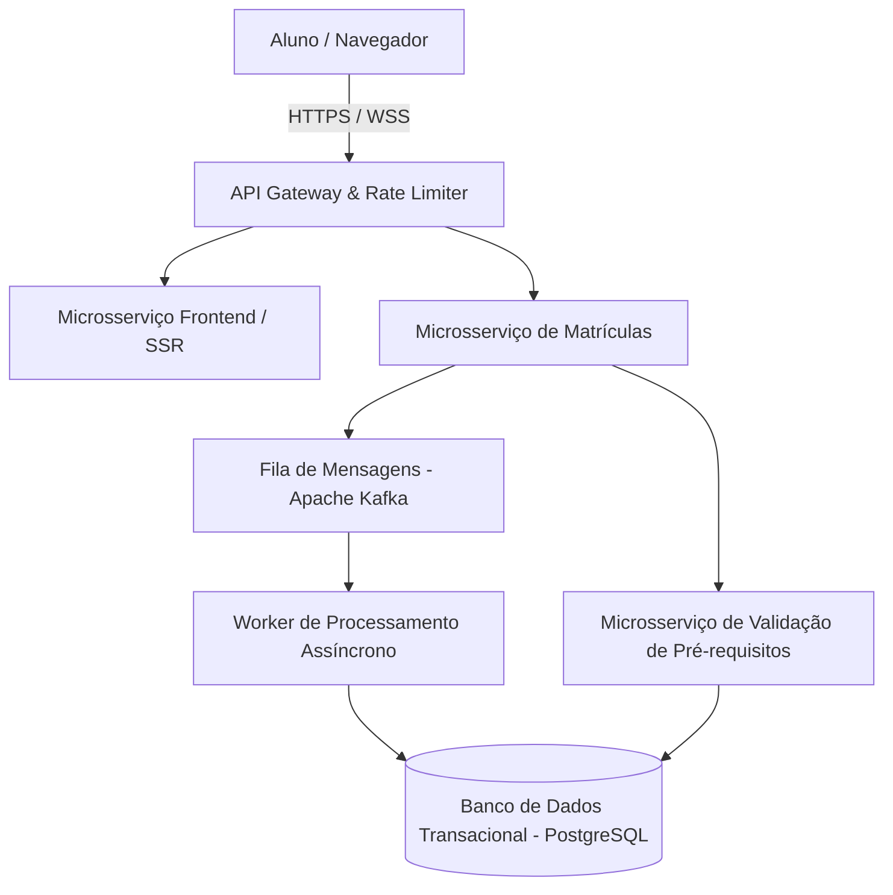

# 📋 Relatório da Atividade Aula 3
> **Disciplina:** Engenharia de Software II (4º Semestre)
> **Professor:** Prof. Wesley Soares
> **Prazo de Entrega:** 19/08/2026 às 02:59
> **Pontuação Máxima:** 100 pontos

---

## 1. Integrantes do Grupo, Stakeholders e Papéis de Analistas

| Integrante | Papel de Stakeholder (Negócio) | Papel de Analista (Técnico) |
| :--- | :--- | :--- |
| **Ana Souza** | Gerente de Operações Acadêmicas | Analista de Requisitos e Processos (Business Analyst) |
| **Carlos Silva** | Coordenador de Infraestrutura de TI | Arquiteto de Software e DevOps |
| **Mariana Costa** | Representante do Corpo Discente (Alunos) | Analista de Experiência do Usuário (UX/UI & Frontend) |
| **João Pedro** | Administrador de Banco de Dados | Engenheiro de Dados e Segurança da Informação |

---

## 2. Descrição da Situação-Problema

A instituição de ensino superior enfrenta um gargalo crítico no processo de **Matrícula Online e Rematrícula** de semestres letivos. Atualmente, o sistema legado sofre com quedas de performance, travamentos e inconsistência de dados devido ao pico de acessos simultâneos no primeiro dia de abertura dos prazos.

### Principais Dores Identificadas:
1. **Concorrência e Conectividade:** Milhares de alunos acessam a plataforma simultaneamente, gerando *timeouts* no banco de dados relacional e esgotamento de conexões no servidor monolítico.
2. **Falta de Feedback Visual:** O sistema atual não informa se a vaga em uma disciplina foi preenchida em tempo real, gerando conflitos de horário e frustração nos discentes.
3. **Validação Manual de Pré-requisitos:** O módulo de validação de dependências e histórico escolar é síncrono e excessivamente lento, sobrecarregando o processamento do servidor principal.
4. **Indisponibilidade de Suporte:** A central de atendimento recebe um volume insustentável de chamados por erros sistêmicos durante a janela de matrícula.

---

## 3. Descrição da Solução

Para sanar a situação-problema descrita, o grupo propõe a reengenharia do módulo crítico através da adoção de uma **Arquitetura Orientada a Microsserviços**, desacoplando o processo de matrícula em componentes escaláveis e resilientes.

### Arquitetura e Tecnologias Propostas:
* **Gateway de API (Kong / Spring Cloud Gateway):** Implementação de *Rate Limiting* (controle de vazão de acessos) e balanceamento de carga para mitigar quedas por pico de requisições.
* **Microsserviço de Matrículas (Java com Spring Boot):** Processamento assíncrono utilizando mensageria (**Apache Kafka**) para enfileirar as solicitações de matrícula, garantindo consistência eventual e eliminação de *deadlocks* no banco de dados.
* **Microsserviço de Validação de Pré-requisitos (Node.js / TypeScript):** Motor de regras em memória para checagem rápida do histórico escolar do aluno antes de confirmar o enfileiramento da vaga.
* **Frontend Reativo (React.js):** Interface com atualizações em tempo real via **WebSockets** para exibir a disponibilidade de vagas nas turmas instantaneamente.

### Diagrama da Solução (Arquitetura Proposta)

### Plano de Implementação e Mitigação de Riscos:
1. **Fase 1 (Curto Prazo):** Implementação de fila de espera virtual (sala de espera digital) para conter o volume de acessos simultâneos.
2. **Fase 2 (Médio Prazo):** Migração do motor de validação síncrona para arquitetura orientada a eventos com Kafka.
3. **Fase 3 (Longo Prazo):** Homologação completa do novo ecossistema em nuvem (AWS/Azure) com escalabilidade automática (*Auto-scaling groups*).