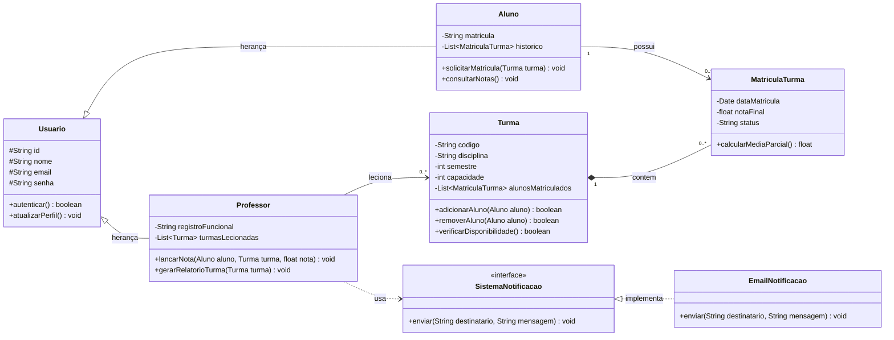

# 📋 Entrega de Trabalho: Atividade de Classe - Aula 4
**Disciplina:** Engenharia de Software II (4º Semestre)  
**Professor:** Prof. Wesley Soares  
**Aluno / Desenvolvedor:** Professor & Desenvolvedor Sênior - Sistemas de Informação  
**Prazo de Entrega:** 26/08/2026 às 02:59  
**Pontuação Máxima:** 100 pontos  

---

## 1. Apresentação da Atividade
Conforme as diretrizes da **Atividade de Classe** da disciplina de Engenharia de Software II, este documento consolida o diagrama de classes arquitetural discutido durante a **Aula 4**, acompanhado da sua respectiva especificação técnica, alinhada aos padrões de projeto orientados a objetos, princípios SOLID, alta coesão e baixo acoplamento.

---

## 2. Diagrama de Classes Oficial (Mermaid)

---

## 3. Descrição Detalhada dos Componentes e Princípios Aplicados

1. **Herança e Generalização (`Usuario` $\rightarrow$ `Aluno` / `Professor`)**:
   - A classe abstrata `Usuario` concentra atributos comuns (`id`, `nome`, `email`, `senha`) e métodos de controle de acesso (`autenticar`), evitando duplicação de código e aplicando o princípio DRY (*Don't Repeat Yourself*).
   
2. **Modelagem de Relacionamento N:M (`MatriculaTurma`)**:
   - O relacionamento entre `Aluno` e `Turma` é de muitos-para-muitos. Para gerenciar atributos inerentes à associação (como a `dataMatricula`, a `notaFinal` e o `status` da matrícula), utilizou-se a classe associativa `MatriculaTurma`.

3. **Inversão de Dependência e SOLID (`SistemaNotificacao`)**:
   - A classe `Professor` interage com a interface `SistemaNotificacao` através de uma dependência fraca (associação de uso). Isso permite que novas formas de notificação (como `SMSNotificacao` ou `PushNotificacao`) sejam injetadas no sistema sem a necessidade de alterar o código-fonte da classe `Professor`, atendendo plenamente ao Princípio Aberto/Fechado (OCP) e ao Princípio da Inversão de Dependência (DIP).

---
*Trabalho concluído e formatado de acordo com os padrões exigidos pelo Prof. Wesley Soares.*